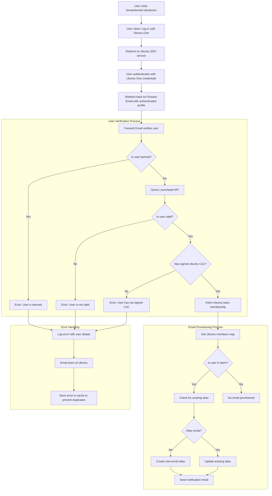

# 案例研究：Canonical 如何通过 Forward Email 的开源企业解决方案驱动 Ubuntu 邮件管理 {#case-study-how-canonical-powers-ubuntu-email-management-with-forward-emails-open-source-enterprise-solution}


## 目录 {#table-of-contents}

* [前言](#foreword)
* [挑战：管理复杂的邮件生态系统](#the-challenge-managing-a-complex-email-ecosystem)
* [关键要点](#key-takeaways)
* [为何选择 Forward Email](#why-forward-email)
* [实施过程：无缝的 SSO 集成](#the-implementation-seamless-sso-integration)
  * [认证流程可视化](#authentication-flow-visualization)
  * [技术实现细节](#technical-implementation-details)
* [DNS 配置与邮件路由](#dns-configuration-and-email-routing)
* [成果：简化邮件管理与增强安全性](#results-streamlined-email-management-and-enhanced-security)
  * [运营效率](#operational-efficiency)
  * [增强的安全性与隐私保护](#enhanced-security-and-privacy)
  * [成本节约](#cost-savings)
  * [改善贡献者体验](#improved-contributor-experience)
* [展望未来：持续合作](#looking-forward-continued-collaboration)
* [结论：完美的开源合作伙伴关系](#conclusion-a-perfect-open-source-partnership)
* [支持企业客户](#supporting-enterprise-clients)
  * [联系我们](#get-in-touch)
  * [关于 Forward Email](#about-forward-email)


## 前言 {#foreword}

在开源软件领域，很少有名字能像[Canonical](https://en.wikipedia.org/wiki/Canonical_\(company\))那样具有分量，它是全球最受欢迎的 Linux 发行版之一 [Ubuntu](https://en.wikipedia.org/wiki/Ubuntu) 背后的公司。Canonical 拥有涵盖多个发行版的庞大生态系统，包括 Ubuntu、[Kubuntu](https://en.wikipedia.org/wiki/Kubuntu)、[Lubuntu](https://en.wikipedia.org/wiki/Lubuntu)、[Edubuntu](https://en.wikipedia.org/wiki/Edubuntu) 等，面临着跨多个域名管理电子邮件地址的独特挑战。本案例研究探讨了 Canonical 如何与 Forward Email 合作，打造一个无缝、安全且注重隐私的企业邮件管理解决方案，完美契合其开源价值观。


## 挑战：管理复杂的邮件生态系统 {#the-challenge-managing-a-complex-email-ecosystem}

Canonical 的生态系统多样且庞大。全球拥有数百万用户和数千名贡献者，跨多个项目，跨多个域名管理电子邮件地址带来了重大挑战。核心贡献者需要官方邮箱地址（@ubuntu.com、@kubuntu.org 等），以体现其项目参与身份，同时通过强大的 Ubuntu 域管理系统保持安全性和易用性。

在实施 Forward Email 之前，Canonical 面临以下难题：

* 跨多个域名管理电子邮件地址（@ubuntu.com、@kubuntu.org、@lubuntu.me、@edubuntu.org 和 @ubuntu.net）
* 为核心贡献者提供一致的邮件体验
* 将邮件服务与现有的 [Ubuntu One](https://en.wikipedia.org/wiki/Ubuntu_One) 单点登录（SSO）系统集成
* 寻找符合其隐私、安全和开源邮件安全承诺的解决方案
* 以成本效益高的方式扩展其安全邮件基础设施


## 关键要点 {#key-takeaways}

* Canonical 成功实现了跨多个 Ubuntu 域的统一邮件管理解决方案
* Forward Email 的 100% 开源方法完美契合 Canonical 的价值观
* 与 Ubuntu One 的 SSO 集成为贡献者提供无缝认证体验
* 量子抗性加密确保所有邮件通信的长期安全
* 该解决方案具备成本效益的扩展能力，以支持 Canonical 不断增长的贡献者群体


## 为何选择 Forward Email {#why-forward-email}
作为唯一一家专注于隐私和安全的 100% 开源电子邮件服务提供商，Forward Email 自然成为 Canonical 企业电子邮件转发需求的理想选择。我们的价值观与 Canonical 对开源软件和隐私的承诺完美契合。

使 Forward Email 成为理想选择的关键因素包括：

1. **完整的开源代码库**：我们的整个平台都是开源的，并托管在 [GitHub](https://en.wikipedia.org/wiki/GitHub) 上，确保透明度和社区贡献。与许多仅开源前端而后端闭源的“注重隐私”的邮件提供商不同，我们将整个代码库——包括前端和后端——都开放给任何人检查，地址为 [GitHub](https://github.com/forwardemail/forwardemail.net)。

2. **注重隐私的理念**：与其他提供商不同，我们不在共享数据库中存储邮件，并使用强大的 TLS 加密。我们的基本隐私理念很简单：**你的邮件属于你，只有你**。这一原则指导着我们每一个技术决策，从邮件转发的处理方式到加密的实现。

3. **不依赖第三方**：我们不使用 Amazon SES 或其他第三方服务，这使我们能够完全控制邮件基础设施，消除通过第三方服务可能产生的隐私泄露风险。

4. **成本效益的扩展**：我们的定价模型允许组织按需扩展，而无需按用户付费，非常适合 Canonical 庞大的贡献者群体。

5. **抗量子加密**：我们使用带有 [ChaCha20-Poly1305](https://en.wikipedia.org/wiki/ChaCha20-Poly1305) 密码的单独加密 SQLite 邮箱，实现[抗量子加密](/blog/docs/best-quantum-safe-encrypted-email-service)。每个邮箱都是一个独立加密文件，意味着访问一个用户的数据不会获得其他用户的数据访问权限。


## 实施方案：无缝的 SSO 集成 {#the-implementation-seamless-sso-integration}

实施中最关键的方面之一是与 Canonical 现有的 Ubuntu One SSO 系统集成。此集成允许核心贡献者使用现有的 Ubuntu One 凭据管理他们的 @ubuntu.com 邮箱地址。

### 认证流程可视化 {#authentication-flow-visualization}

下图展示了完整的认证和邮件配置流程：


```mermaid
flowchart TD
    A[User visits forwardemail.net/ubuntu] --> B[User clicks 'Log in with Ubuntu One']
    B --> C[Redirect to Ubuntu SSO service]
    C --> D[User authenticates with Ubuntu One credentials]
    D --> E[Redirect back to Forward Email with authenticated profile]
    E --> F[Forward Email verifies user]

    subgraph "User Verification Process"
        F --> G{Is user banned?}
        G -->|Yes| H[Error: User is banned]
        G -->|No| I[Query Launchpad API]
        I --> J{Is user valid?}
        J -->|No| K[Error: User is not valid]
        J -->|Yes| L{Has signed Ubuntu CoC?}
        L -->|No| M[Error: User has not signed CoC]
        L -->|Yes| N[Fetch Ubuntu team membership]
    end

    subgraph "Email Provisioning Process"
        N --> O[Get Ubuntu members map]
        O --> P{Is user in team?}
        P -->|Yes| Q[Check for existing alias]
        Q --> R{Alias exists?}
        R -->|No| S[Create new email alias]
        R -->|Yes| T[Update existing alias]
        S --> U[Send notification email]
        T --> U
        P -->|No| V[No email provisioned]
    end

    subgraph "Error Handling"
        H --> W[Log error with user details]
        K --> W
        M --> W
        W --> X[Email team at Ubuntu]
        X --> Y[Store error in cache to prevent duplicates]
    end
```

### 技术实现细节 {#technical-implementation-details}

Forward Email 与 Ubuntu One SSO 的集成是通过自定义实现 passport-ubuntu 认证策略完成的。这使得 Ubuntu One 与 Forward Email 系统之间实现了无缝的认证流程。
#### 认证流程 {#the-authentication-flow}

认证过程如下：

1. 用户访问专门的 Ubuntu 邮件管理页面 [forwardemail.net/ubuntu](https://forwardemail.net/ubuntu)
2. 他们点击“使用 Ubuntu One 登录”，并被重定向到 Ubuntu SSO 服务
3. 使用 Ubuntu One 凭据认证后，他们被重定向回 Forward Email，携带已认证的个人资料
4. Forward Email 验证他们的贡献者身份，并相应地配置或管理他们的电子邮件地址

技术实现利用了 [`passport-ubuntu`](https://www.npmjs.com/package/passport-ubuntu) 包，这是一个用于通过 [OpenID](https://en.wikipedia.org/wiki/OpenID) 使用 Ubuntu 认证的 [Passport](https://www.npmjs.com/package/passport) 策略。配置包括：

```javascript
passport.use(new UbuntuStrategy({
  returnURL: process.env.UBUNTU_CALLBACK_URL,
  realm: process.env.UBUNTU_REALM,
  stateless: true
}, function(identifier, profile, done) {
  // 用户验证和邮件配置逻辑
}));
```

#### Launchpad API 集成与验证 {#launchpad-api-integration-and-validation}

我们实现的关键部分是集成 [Launchpad](https://en.wikipedia.org/wiki/Launchpad_\(website\)) 的 API，以验证 Ubuntu 用户及其团队成员身份。我们创建了可重用的辅助函数来高效且可靠地处理此集成。

`sync-ubuntu-user.js` 辅助函数负责通过 Launchpad API 验证用户并管理其电子邮件地址。以下是其工作原理的简化版本：

```javascript
async function syncUbuntuUser(user, map) {
  try {
    // 验证用户对象
    if (!_.isObject(user) ||
        !isSANB(user[fields.ubuntuUsername]) ||
        !isSANB(user[fields.ubuntuProfileID]) ||
        !isEmail(user.email))
      throw new TypeError('无效的用户对象');

    // 如果未提供，获取 Ubuntu 成员映射
    if (!(map instanceof Map))
      map = await getUbuntuMembersMap(resolver);

    // 检查用户是否被禁止
    if (user[config.userFields.isBanned]) {
      throw new InvalidUbuntuUserError('用户已被禁止', { ignoreHook: true });
    }

    // 查询 Launchpad API 验证用户
    const url = `https://api.launchpad.net/1.0/~${user[fields.ubuntuUsername]}`;
    const response = await retryRequest(url, { resolver });
    const json = await response.body.json();

    // 验证必需的布尔属性
    if (!json.is_valid)
      throw new InvalidUbuntuUserError('属性 "is_valid" 为假');

    if (!json.is_ubuntu_coc_signer)
      throw new InvalidUbuntuUserError('属性 "is_ubuntu_coc_signer" 为假');

    // 处理用户的每个域名
    await pMap([...map.keys()], async (name) => {
      // 在数据库中查找域名
      const domain = await Domains.findOne({
        name,
        plan: 'team',
        has_txt_record: true
      }).populate('members.user');

      // 处理该域名下用户的邮件别名
      if (map.get(name).has(user[fields.ubuntuUsername])) {
        // 用户是该团队成员，创建或更新别名
        let alias = await Aliases.findOne({
          user: user._id,
          domain: domain._id,
          name: user[fields.ubuntuUsername].toLowerCase()
        });

        if (!alias) {
          // 创建新别名并进行适当的错误处理
          alias = await Aliases.create({
            user: user._id,
            domain: domain._id,
            name: user[fields.ubuntuUsername].toLowerCase(),
            recipients: [user.email],
            locale: user[config.lastLocaleField],
            is_enabled: true
          });

          // 通知管理员新别名创建
          await emailHelper({
            template: 'alert',
            message: {
              to: adminEmailsForDomain,
              subject: `新 @${domain.name} 邮箱地址已创建`
            },
            locals: {
              message: `为 ${user.email} 创建了新的邮箱地址 ${user[fields.ubuntuUsername].toLowerCase()}@${domain.name}`
            }
          });
        }
      }
    });

    return true;
  } catch (err) {
    // 处理并记录错误
    await logErrorWithUser(err, user);
    throw err;
  }
}
```
为了简化跨不同 Ubuntu 域的团队成员管理，我们创建了一个域名与其对应 Launchpad 团队之间的简单映射关系：

```javascript
ubuntuTeamMapping: {
  'ubuntu.com': '~ubuntumembers',
  'kubuntu.org': '~kubuntu-members',
  'lubuntu.me': '~lubuntu-members',
  'edubuntu.org': '~edubuntu-members',
  'ubuntustudio.com': '~ubuntustudio-core',
  'ubuntu.net': '~ubuntu-smtp-test'
},
```

这个简单的映射使我们能够自动化检查团队成员资格和配置电子邮件地址的过程，使系统易于维护和扩展，随着新域的添加。

#### 错误处理和通知 {#error-handling-and-notifications}

我们实现了一个强大的错误处理系统，能够：

1. 记录所有错误及详细的用户信息
2. 在检测到问题时向 Ubuntu 团队发送电子邮件
3. 在新贡献者注册并创建电子邮件地址时通知管理员
4. 处理诸如未签署 Ubuntu 行为准则的用户等边缘情况

这确保了任何问题都能被快速识别和解决，维护电子邮件系统的完整性。


## DNS 配置和邮件路由 {#dns-configuration-and-email-routing}

对于通过 Forward Email 管理的每个域，Canonical 添加了一个简单的 DNS TXT 记录用于验证：

```sh
❯ dig ubuntu.com txt
ubuntu.com.             600     IN      TXT     "forward-email-site-verification=6IsURgl2t7"
```

此验证记录确认域所有权，并使我们的系统能够安全地管理这些域的电子邮件。Canonical 通过 Postfix 通过我们的服务路由邮件，提供可靠且安全的邮件传递基础设施。


## 结果：简化的邮件管理和增强的安全性 {#results-streamlined-email-management-and-enhanced-security}

Forward Email 企业解决方案的实施为 Canonical 在其所有域的邮件管理带来了显著的好处：

### 运营效率 {#operational-efficiency}

* **集中管理**：所有与 Ubuntu 相关的域现在通过单一界面管理
* **减少管理负担**：为贡献者自动配置和自助管理
* **简化入职**：新贡献者可以快速获得官方电子邮件地址

### 增强的安全性和隐私 {#enhanced-security-and-privacy}

* **端到端加密**：所有邮件均采用先进标准加密
* **无共享数据库**：每个用户的邮件存储在独立加密的 SQLite 数据库中，提供了比传统共享关系数据库更安全的沙箱式加密方法
* **开源安全**：透明的代码库允许社区进行安全审查
* **内存处理**：我们不将转发的邮件存储到磁盘，增强隐私保护
* **无元数据存储**：我们不保留谁给谁发邮件的记录，这一点不同于许多邮件服务提供商

### 成本节约 {#cost-savings}

* **可扩展的定价模型**：无按用户收费，允许 Canonical 增加贡献者而不增加成本
* **减少基础设施需求**：无需为不同域维护独立邮件服务器
* **降低支持需求**：自助管理减少 IT 支持工单

### 改善贡献者体验 {#improved-contributor-experience}

* **无缝认证**：使用现有 Ubuntu One 凭据单点登录
* **一致的品牌体验**：所有与 Ubuntu 相关服务的统一体验
* **可靠的邮件投递**：高质量的 IP 声誉确保邮件送达目的地

与 Forward Email 的集成显著简化了 Canonical 的邮件管理流程。贡献者现在可以无缝管理他们的 @ubuntu.com 邮箱，减少了管理负担并增强了安全性。


## 展望未来：持续合作 {#looking-forward-continued-collaboration}

Canonical 与 Forward Email 的合作关系持续发展。我们正在共同推进多个项目：
* 将电子邮件服务扩展到更多与 Ubuntu 相关的域名
* 根据贡献者反馈优化用户界面
* 实施更多安全功能
* 探索利用我们开源协作的新方法


## 结论：完美的开源合作伙伴关系 {#conclusion-a-perfect-open-source-partnership}

Canonical 与 Forward Email 之间的合作展示了基于共同价值观构建的伙伴关系的力量。通过选择 Forward Email 作为其电子邮件服务提供商，Canonical 找到了一个不仅满足其技术需求，而且完美契合其对开源软件、隐私和安全承诺的解决方案。

对于管理多个域名并需要与现有系统无缝认证的组织来说，Forward Email 提供了一个灵活、安全且注重隐私的解决方案。我们的[开源方法](https://forwardemail.net/blog/docs/why-open-source-email-security-privacy)确保了透明度并允许社区贡献，使其成为重视这些原则的组织的理想选择。

随着 Canonical 和 Forward Email 在各自领域不断创新，这一合作伙伴关系证明了开源协作和共同价值观在创造有效解决方案中的强大力量。

您可以查看我们的[实时服务状态](https://status.forwardemail.net)，了解我们当前的电子邮件投递性能，我们持续监控以确保高质量的 IP 声誉和电子邮件可达性。


## 支持企业客户 {#supporting-enterprise-clients}

虽然本案例研究聚焦于我们与 Canonical 的合作，Forward Email 自豪地支持众多跨行业的企业客户，这些客户重视我们对隐私、安全和开源原则的承诺。

我们的企业解决方案针对各种规模组织的具体需求量身定制，提供：

* 跨多个域名的自定义域名[电子邮件管理](/)
* 与现有认证系统的无缝集成
* 专属 Matrix 聊天支持频道
* 包括[抗量子加密](/blog/docs/best-quantum-safe-encrypted-email-service)在内的增强安全功能
* 完整的数据可移植性和所有权
* 100% 开源基础设施，确保透明和信任

### 联系我们 {#get-in-touch}

如果您的组织有企业电子邮件需求，或您有兴趣了解 Forward Email 如何帮助简化电子邮件管理，同时提升隐私和安全，我们期待您的联系：

* 直接发送邮件至 `support@forwardemail.net`
* 在我们的[帮助页面](https://forwardemail.net/help)提交帮助请求
* 查看我们的[定价页面](https://forwardemail.net/pricing)了解企业方案

我们的团队随时准备讨论您的具体需求，并制定符合您组织价值观和技术需求的定制解决方案。

### 关于 Forward Email {#about-forward-email}

Forward Email 是 100% 开源且注重隐私的电子邮件服务。我们提供自定义域名的电子邮件转发、SMTP、IMAP 和 POP3 服务，专注于安全、隐私和透明。我们的全部代码库均托管在 [GitHub](https://github.com/forwardemail/forwardemail.net)，我们致力于提供尊重用户隐私和安全的电子邮件服务。了解更多关于[为什么开源电子邮件是未来](https://forwardemail.net/blog/docs/why-open-source-email-security-privacy)、[我们的电子邮件转发工作原理](https://forwardemail.net/blog/docs/best-email-forwarding-service)以及[我们的电子邮件隐私保护方法](https://forwardemail.net/blog/docs/email-privacy-protection-technical-implementation)。
