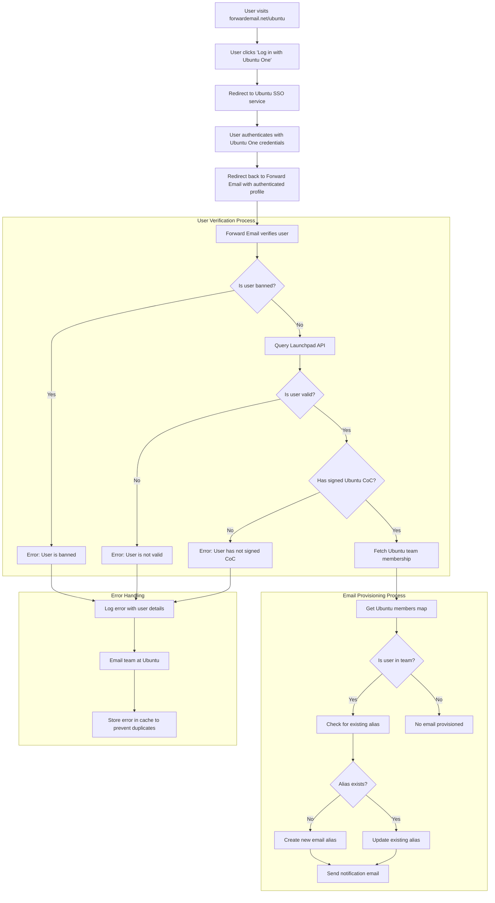

# Case Study: How Canonical Powers Ubuntu Email Management with Forward Email's Open-Source Enterprise Solution


## Table of Contents

* [Foreword](#foreword)
* [The Challenge: Managing a Complex Email Ecosystem](#the-challenge-managing-a-complex-email-ecosystem)
* [Key Takeaways](#key-takeaways)
* [Why Forward Email](#why-forward-email)
* [The Implementation: Seamless SSO Integration](#the-implementation-seamless-sso-integration)
  * [Authentication Flow Visualization](#authentication-flow-visualization)
  * [Technical Implementation Details](#technical-implementation-details)
* [DNS Configuration and Email Routing](#dns-configuration-and-email-routing)
* [Results: Streamlined Email Management and Enhanced Security](#results-streamlined-email-management-and-enhanced-security)
  * [Operational Efficiency](#operational-efficiency)
  * [Enhanced Security and Privacy](#enhanced-security-and-privacy)
  * [Cost Savings](#cost-savings)
  * [Improved Contributor Experience](#improved-contributor-experience)
* [Looking Forward: Continued Collaboration](#looking-forward-continued-collaboration)
* [Conclusion: A Perfect Open-Source Partnership](#conclusion-a-perfect-open-source-partnership)
* [Supporting Enterprise Clients](#supporting-enterprise-clients)
  * [Get in Touch](#get-in-touch)
  * [About Forward Email](#about-forward-email)


## Foreword

In the world of open-source software, few names carry as much weight as [Canonical](https://en.wikipedia.org/wiki/Canonical_\(company\)), the company behind [Ubuntu](https://en.wikipedia.org/wiki/Ubuntu), one of the most popular Linux distributions globally. With a vast ecosystem spanning multiple distributions including Ubuntu, [Kubuntu](https://en.wikipedia.org/wiki/Kubuntu), [Lubuntu](https://en.wikipedia.org/wiki/Lubuntu), [Edubuntu](https://en.wikipedia.org/wiki/Edubuntu), and others, Canonical faced unique challenges in managing email addresses across their numerous domains. This case study explores how Canonical partnered with Forward Email to create a seamless, secure, and privacy-focused enterprise email management solution that aligns perfectly with their open-source values.


## The Challenge: Managing a Complex Email Ecosystem

Canonical's ecosystem is diverse and expansive. With millions of users worldwide and thousands of contributors across various projects, managing email addresses across multiple domains presented significant challenges. Core contributors needed official email addresses (@ubuntu.com, @kubuntu.org, etc.) that reflected their involvement with the project while maintaining security and ease of use through a robust Ubuntu domain management system.

Before implementing Forward Email, Canonical struggled with:

* Managing email addresses across multiple domains (@ubuntu.com, @kubuntu.org, @lubuntu.me, @edubuntu.org, and @ubuntu.net)
* Providing a consistent email experience for core contributors
* Integrating email services with their existing [Ubuntu One](https://en.wikipedia.org/wiki/Ubuntu_One) Single Sign-On (SSO) system
* Finding a solution that aligned with their commitment to privacy, security, and open-source email security
* Scaling their secure email infrastructure cost-effectively


## Key Takeaways

* Canonical successfully implemented a unified email management solution across multiple Ubuntu domains
* Forward Email's 100% open-source approach aligned perfectly with Canonical's values
* SSO integration with Ubuntu One provides seamless authentication for contributors
* Quantum-resistant encryption ensures long-term security for all email communications
* The solution scales cost-effectively to support Canonical's growing contributor base


## Why Forward Email

As the only 100% open-source email service provider with a focus on privacy and security, Forward Email was a natural fit for Canonical's enterprise email forwarding needs. Our values aligned perfectly with Canonical's commitment to open-source software and privacy.

Key factors that made Forward Email the ideal choice included:

1. **Complete open-source codebase**: Our entire platform is open-source and available on [GitHub](https://en.wikipedia.org/wiki/GitHub), allowing for transparency and community contributions. Unlike many "privacy-focused" email providers who only open-source their frontends while keeping their backends closed, we've made our entire codebase—both frontend and backend—available for anyone to inspect at [GitHub](https://github.com/forwardemail/forwardemail.net).

2. **Privacy-focused approach**: Unlike other providers, we don't store emails in shared databases, and we use robust encryption with TLS. Our fundamental privacy philosophy is simple: **your emails belong to you and only you**. This principle guides every technical decision we make, from how we handle email forwarding to how we implement encryption.

3. **No reliance on third parties**: We don't use Amazon SES or other third-party services, giving us complete control over the email infrastructure and eliminating potential privacy leaks through third-party services.

4. **Cost-effective scaling**: Our pricing model allows organizations to scale without paying per user, making it ideal for Canonical's large contributor base.

5. **Quantum-resistant encryption**: We use individually encrypted SQLite mailboxes with [ChaCha20-Poly1305](https://en.wikipedia.org/wiki/ChaCha20-Poly1305) as the cipher for [quantum-resistant encryption](/blog/docs/best-quantum-safe-encrypted-email-service). Each mailbox is a separate encrypted file, meaning access to one user's data doesn't grant access to others.


## The Implementation: Seamless SSO Integration

One of the most critical aspects of the implementation was integrating with Canonical's existing Ubuntu One SSO system. This integration would allow core contributors to manage their @ubuntu.com email addresses using their existing Ubuntu One credentials.

### Authentication Flow Visualization

The following diagram illustrates the complete authentication and email provisioning flow:



### Technical Implementation Details

The integration between Forward Email and Ubuntu One SSO was accomplished through a custom implementation of the passport-ubuntu authentication strategy. This allowed for a seamless authentication flow between Ubuntu One and Forward Email's systems.

#### The Authentication Flow

The authentication process works as follows:

1. Users visit the dedicated Ubuntu email management page at [forwardemail.net/ubuntu](https://forwardemail.net/ubuntu)
2. They click "Log in with Ubuntu One" and are redirected to the Ubuntu SSO service
3. After authenticating with their Ubuntu One credentials, they are redirected back to Forward Email with their authenticated profile
4. Forward Email verifies their contributor status and provisions or manages their email address accordingly

The technical implementation leveraged the [`passport-ubuntu`](https://www.npmjs.com/package/passport-ubuntu) package, which is a [Passport](https://www.npmjs.com/package/passport) strategy for authenticating with Ubuntu using [OpenID](https://en.wikipedia.org/wiki/OpenID). The configuration included:

```javascript
passport.use(new UbuntuStrategy({
  returnURL: process.env.UBUNTU_CALLBACK_URL,
  realm: process.env.UBUNTU_REALM,
  stateless: true
}, function(identifier, profile, done) {
  // User verification and email provisioning logic
}));
```

#### Launchpad API Integration and Validation

A critical component of our implementation is the integration with [Launchpad](https://en.wikipedia.org/wiki/Launchpad_\(website\))'s API to validate Ubuntu users and their team memberships. We created reusable helper functions to handle this integration efficiently and reliably.

The `sync-ubuntu-user.js` helper function is responsible for validating users through the Launchpad API and managing their email addresses. Here's a simplified version of how it works:

```javascript
async function syncUbuntuUser(user, map) {
  try {
    // Validate user object
    if (!_.isObject(user) ||
        !isSANB(user[fields.ubuntuUsername]) ||
        !isSANB(user[fields.ubuntuProfileID]) ||
        !isEmail(user.email))
      throw new TypeError('Invalid user object');

    // Get Ubuntu members map if not provided
    if (!(map instanceof Map))
      map = await getUbuntuMembersMap(resolver);

    // Check if user is banned
    if (user[config.userFields.isBanned]) {
      throw new InvalidUbuntuUserError('User was banned', { ignoreHook: true });
    }

    // Query Launchpad API to validate user
    const url = `https://api.launchpad.net/1.0/~${user[fields.ubuntuUsername]}`;
    const response = await retryRequest(url, { resolver });
    const json = await response.body.json();

    // Validate required boolean properties
    if (!json.is_valid)
      throw new InvalidUbuntuUserError('Property "is_valid" was false');

    if (!json.is_ubuntu_coc_signer)
      throw new InvalidUbuntuUserError('Property "is_ubuntu_coc_signer" was false');

    // Process each domain for the user
    await pMap([...map.keys()], async (name) => {
      // Find domain in database
      const domain = await Domains.findOne({
        name,
        plan: 'team',
        has_txt_record: true
      }).populate('members.user');

      // Process user's email alias for this domain
      if (map.get(name).has(user[fields.ubuntuUsername])) {
        // User is a member of this team, create or update alias
        let alias = await Aliases.findOne({
          user: user._id,
          domain: domain._id,
          name: user[fields.ubuntuUsername].toLowerCase()
        });

        if (!alias) {
          // Create new alias with appropriate error handling
          alias = await Aliases.create({
            user: user._id,
            domain: domain._id,
            name: user[fields.ubuntuUsername].toLowerCase(),
            recipients: [user.email],
            locale: user[config.lastLocaleField],
            is_enabled: true
          });

          // Notify admins about new alias creation
          await emailHelper({
            template: 'alert',
            message: {
              to: adminEmailsForDomain,
              subject: `New @${domain.name} email address created`
            },
            locals: {
              message: `A new email address ${user[fields.ubuntuUsername].toLowerCase()}@${domain.name} was created for ${user.email}`
            }
          });
        }
      }
    });

    return true;
  } catch (err) {
    // Handle and log errors
    await logErrorWithUser(err, user);
    throw err;
  }
}
```

To simplify the management of team memberships across different Ubuntu domains, we created a straightforward mapping between domain names and their corresponding Launchpad teams:

```javascript
ubuntuTeamMapping: {
  'ubuntu.com': '~ubuntumembers',
  'kubuntu.org': '~kubuntu-members',
  'lubuntu.me': '~lubuntu-members',
  'edubuntu.org': '~edubuntu-members',
  'ubuntustudio.com': '~ubuntustudio-core',
  'ubuntu.net': '~ubuntu-smtp-test'
},
```

This simple mapping allows us to automate the process of checking team memberships and provisioning email addresses, making the system easy to maintain and extend as new domains are added.

#### Error Handling and Notifications

We implemented a robust error handling system that:

1. Logs all errors with detailed user information
2. Emails the Ubuntu team when issues are detected
3. Notifies administrators when new contributors sign up and have email addresses created
4. Handles edge cases such as users who haven't signed the Ubuntu Code of Conduct

This ensures that any issues are quickly identified and addressed, maintaining the integrity of the email system.


## DNS Configuration and Email Routing

For each domain managed through Forward Email, Canonical added a simple DNS TXT record for validation:

```sh
❯ dig ubuntu.com txt
ubuntu.com.             600     IN      TXT     "forward-email-site-verification=6IsURgl2t7"
```

This verification record confirms domain ownership and enables our system to securely manage email for these domains. Canonical routes mail through our service via Postfix, which provides a reliable and secure email delivery infrastructure.


## Results: Streamlined Email Management and Enhanced Security

The implementation of Forward Email's enterprise solution has delivered significant benefits for Canonical's email management across all their domains:

### Operational Efficiency

* **Centralized management**: All Ubuntu-related domains are now managed through a single interface
* **Reduced administrative overhead**: Automated provisioning and self-service management for contributors
* **Simplified onboarding**: New contributors can quickly get their official email addresses

### Enhanced Security and Privacy

* **End-to-end encryption**: All emails are encrypted using advanced standards
* **No shared databases**: Each user's emails are stored in individual encrypted SQLite databases, providing a sandboxed encryption approach that's fundamentally more secure than traditional shared relational databases
* **Open-source security**: The transparent codebase allows for community security reviews
* **In-memory processing**: We don't store forwarded emails to disk, enhancing privacy protection
* **No metadata storage**: We don't keep records of who's emailing whom, unlike many email providers

### Cost Savings

* **Scalable pricing model**: No per-user fees, allowing Canonical to add contributors without increasing costs
* **Reduced infrastructure needs**: No need to maintain separate email servers for different domains
* **Lower support requirements**: Self-service management reduces IT support tickets

### Improved Contributor Experience

* **Seamless authentication**: Single sign-on with existing Ubuntu One credentials
* **Consistent branding**: Unified experience across all Ubuntu-related services
* **Reliable email delivery**: High-quality IP reputation ensures emails reach their destination

The integration with Forward Email has significantly streamlined Canonical's email management process. Contributors now have a seamless experience managing their @ubuntu.com email addresses, with reduced administrative overhead and enhanced security.


## Looking Forward: Continued Collaboration

The partnership between Canonical and Forward Email continues to evolve. We're working together on several initiatives:

* Expanding email services to additional Ubuntu-related domains
* Enhancing the user interface based on contributor feedback
* Implementing additional security features
* Exploring new ways to leverage our open-source collaboration


## Conclusion: A Perfect Open-Source Partnership

The collaboration between Canonical and Forward Email demonstrates the power of partnerships built on shared values. By choosing Forward Email as their email service provider, Canonical found a solution that not only met their technical requirements but also aligned perfectly with their commitment to open-source software, privacy, and security.

For organizations managing multiple domains and requiring seamless authentication with existing systems, Forward Email offers a flexible, secure, and privacy-focused solution. Our [open-source approach](https://forwardemail.net/blog/docs/why-open-source-email-security-privacy) ensures transparency and allows for community contributions, making it an ideal choice for organizations that value these principles.

As both Canonical and Forward Email continue to innovate in their respective fields, this partnership stands as a testament to the power of open-source collaboration and shared values in creating effective solutions.

You can check our [real-time service status](https://status.forwardemail.net) to see our current email delivery performance, which we monitor continuously to ensure high-quality IP reputation and email deliverability.


## Supporting Enterprise Clients

While this case study focuses on our partnership with Canonical, Forward Email proudly supports numerous enterprise clients across various industries who value our commitment to privacy, security, and open-source principles.

Our enterprise solutions are tailored to meet the specific needs of organizations of all sizes, offering:

* Custom domain [email management](/) across multiple domains
* Seamless integration with existing authentication systems
* Dedicated Matrix chat support channel
* Enhanced security features including [quantum-resistant encryption](/blog/docs/best-quantum-safe-encrypted-email-service)
* Complete data portability and ownership
* 100% open-source infrastructure for transparency and trust

### Get in Touch

If your organization has enterprise email needs or you're interested in learning more about how Forward Email can help streamline your email management while enhancing privacy and security, we'd love to hear from you:

* Email us directly at `support@forwardemail.net`
* Submit a help request at our [help page](https://forwardemail.net/help)
* Check our [pricing page](https://forwardemail.net/pricing) for enterprise plans

Our team is ready to discuss your specific requirements and develop a customized solution that aligns with your organization's values and technical needs.

### About Forward Email

Forward Email is the 100% open-source and privacy-focused email service. We provide custom domain email forwarding, SMTP, IMAP, and POP3 services with a focus on security, privacy, and transparency. Our entire codebase is available on [GitHub](https://github.com/forwardemail/forwardemail.net), and we're committed to providing email services that respect user privacy and security. Learn more about [why open-source email is the future](https://forwardemail.net/blog/docs/why-open-source-email-security-privacy), [how our email forwarding works](https://forwardemail.net/blog/docs/best-email-forwarding-service), and [our approach to email privacy protection](https://forwardemail.net/blog/docs/email-privacy-protection-technical-implementation).
