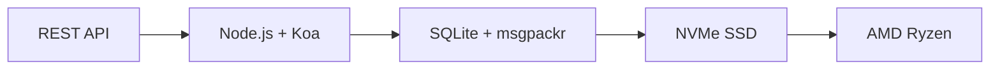

# أول واجهة برمجة تطبيقات بريد إلكتروني كاملة: كيف أحدثت خدمة Forward Email ثورة في إدارة البريد الإلكتروني {#the-first-complete-email-api-how-forward-email-revolutionized-email-management}


<p class="lead mt-3">
<strong>ملخص:</strong> لقد أنشأنا أول واجهة برمجة تطبيقات REST متكاملة في العالم لإدارة البريد الإلكتروني، مع إمكانيات بحث متقدمة لا تقدمها أي خدمة أخرى. في حين أن Gmail وOutlook وApple تُجبر المطورين على استخدام بروتوكول IMAP أو واجهات برمجة تطبيقات محدودة السرعة، فإن Forward Email تُقدم عمليات CRUD فائقة السرعة للرسائل والمجلدات وجهات الاتصال والتقويمات من خلال واجهة REST موحدة مع أكثر من 15 مُعامل بحث. هذه هي واجهة برمجة تطبيقات البريد الإلكتروني التي كان ينتظرها مطورو البرامج.
</p>

## جدول المحتويات {#table-of-contents}

* [مشكلة واجهة برمجة تطبيقات البريد الإلكتروني](#the-email-api-problem)
* [ما يقوله المطورون فعليًا](#what-developers-are-actually-saying)
* [الحل الثوري من Forward Email](#forward-emails-revolutionary-solution)
  * [لماذا بنينا هذا](#why-we-built-this)
  * [المصادقة البسيطة](#simple-authentication)
* [20 نقطة نهاية تغير كل شيء](#20-endpoints-that-change-everything)
  * [الرسائل (5 نقاط نهاية)](#messages-5-endpoints)
  * [المجلدات (5 نقاط نهاية)](#folders-5-endpoints)
  * [جهات الاتصال (5 نقاط نهاية)](#contacts-5-endpoints)
  * [التقويمات (5 نقاط نهاية)](#calendars-5-endpoints)
* [البحث المتقدم: لا توجد خدمة أخرى مماثلة](#advanced-search-no-other-service-compares)
  * [مشهد واجهة برمجة التطبيقات للبحث معطل](#the-search-api-landscape-is-broken)
  * [واجهة برمجة تطبيقات البحث الثورية لـ Forward Email](#forward-emails-revolutionary-search-api)
  * [أمثلة بحث واقعية](#real-world-search-examples)
  * [مزايا الأداء](#performance-advantages)
  * [ميزات البحث التي لا يمتلكها أي شخص آخر](#search-features-no-one-else-has)
  * [لماذا هذا مهم للمطورين](#why-this-matters-for-developers)
  * [التنفيذ الفني](#the-technical-implementation)
* [هندسة الأداء السريع للغاية](#blazing-fast-performance-architecture)
  * [معايير الأداء](#performance-benchmarks)
  * [هندسة الخصوصية أولاً](#privacy-first-architecture)
* [لماذا نحن مختلفون: المقارنة الكاملة](#why-were-different-the-complete-comparison)
  * [القيود الرئيسية للمزود](#major-provider-limitations)
  * [مزايا إعادة توجيه البريد الإلكتروني](#forward-email-advantages)
  * [مشكلة شفافية المصادر المفتوحة](#the-open-source-transparency-problem)
* [أكثر من 30 مثالًا واقعيًا للتكامل](#30-real-world-integration-examples)
  * [1. تحسين نموذج الاتصال في ووردبريس](#1-wordpress-contact-form-enhancement)
  * [2. بديل Zapier لأتمتة البريد الإلكتروني](#2-zapier-alternative-for-email-automation)
  * [3. مزامنة البريد الإلكتروني لإدارة علاقات العملاء](#3-crm-email-synchronization)
  * [4. معالجة طلبات التجارة الإلكترونية](#4-e-commerce-order-processing)
  * [5. دمج تذكرة الدعم](#5-support-ticket-integration)
  * [6. نظام إدارة النشرة الإخبارية](#6-newsletter-management-system)
  * [7. إدارة المهام عبر البريد الإلكتروني](#7-email-based-task-management)
  * [8. تجميع البريد الإلكتروني متعدد الحسابات](#8-multi-account-email-aggregation)
  * [9. لوحة معلومات تحليلات البريد الإلكتروني المتقدمة](#9-advanced-email-analytics-dashboard)
  * [10. أرشفة البريد الإلكتروني الذكية](#10-smart-email-archiving)
  * [11. تكامل البريد الإلكتروني مع التقويم](#11-email-to-calendar-integration)
  * [12. النسخ الاحتياطي للبريد الإلكتروني والامتثال](#12-email-backup-and-compliance)
  * [13. إدارة المحتوى عبر البريد الإلكتروني](#13-email-based-content-management)
  * [14. إدارة قوالب البريد الإلكتروني](#14-email-template-management)
  * [15. أتمتة سير العمل عبر البريد الإلكتروني](#15-email-based-workflow-automation)
  * [16. مراقبة أمان البريد الإلكتروني](#16-email-security-monitoring)
  * [17. جمع الاستبيانات عبر البريد الإلكتروني](#17-email-based-survey-collection)
  * [18. مراقبة أداء البريد الإلكتروني](#18-email-performance-monitoring)
  * [19. تأهيل العملاء المحتملين عبر البريد الإلكتروني](#19-email-based-lead-qualification)
  * [20. إدارة المشاريع عبر البريد الإلكتروني](#20-email-based-project-management)
  * [21. إدارة المخزون عبر البريد الإلكتروني](#21-email-based-inventory-management)
  * [22. معالجة الفواتير عبر البريد الإلكتروني](#22-email-based-invoice-processing)
  * [23. تسجيل الأحداث عبر البريد الإلكتروني](#23-email-based-event-registration)
  * [24. سير عمل الموافقة على المستندات عبر البريد الإلكتروني](#24-email-based-document-approval-workflow)
  * [25. تحليل تعليقات العملاء عبر البريد الإلكتروني](#25-email-based-customer-feedback-analysis)
  * [26. خط أنابيب التوظيف عبر البريد الإلكتروني](#26-email-based-recruitment-pipeline)
  * [27. معالجة تقارير النفقات عبر البريد الإلكتروني](#27-email-based-expense-report-processing)
  * [28. تقارير ضمان الجودة عبر البريد الإلكتروني](#28-email-based-quality-assurance-reporting)
  * [29. إدارة البائعين عبر البريد الإلكتروني](#29-email-based-vendor-management)
  * [30. مراقبة وسائل التواصل الاجتماعي عبر البريد الإلكتروني](#30-email-based-social-media-monitoring)
* [ابدء](#getting-started)
  * [1. أنشئ حساب بريدك الإلكتروني الأمامي](#1-create-your-forward-email-account)
  * [2. إنشاء بيانات اعتماد واجهة برمجة التطبيقات (API)](#2-generate-api-credentials)
  * [3. قم بإجراء أول مكالمة API الخاصة بك](#3-make-your-first-api-call)
  * [4. استكشف الوثائق](#4-explore-the-documentation)
* [الموارد التقنية](#technical-resources)

## مشكلة واجهة برمجة تطبيقات البريد الإلكتروني {#the-email-api-problem}

واجهات برمجة تطبيقات البريد الإلكتروني معطلة تمامًا. نقطة.

يجبر كل مزود خدمة البريد الإلكتروني الرئيسي المطورين على اتخاذ أحد خيارين سيئين:

١. **جحيم IMAP**: التعامل مع بروتوكول عمره ٣٠ عامًا مصمم لأجهزة سطح المكتب، وليس للتطبيقات الحديثة.
٢. **واجهات برمجة التطبيقات المعطوبة**: واجهات برمجة تطبيقات محدودة السرعة، للقراءة فقط، ومعقدة في استخدام OAuth، ولا يمكنها إدارة بيانات بريدك الإلكتروني الفعلية.

النتيجة؟ إما أن يتخلى المطورون عن تكامل البريد الإلكتروني تمامًا أو يضيعون أسابيع في بناء أغلفة IMAP هشة تتعطل باستمرار.

> \[!WARNING]
> **السر الخطير**: معظم "واجهات برمجة تطبيقات البريد الإلكتروني" هي مجرد واجهات إرسال. لا يمكنك تنظيم المجلدات برمجيًا، أو مزامنة جهات الاتصال، أو إدارة التقويمات من خلال واجهة REST البسيطة. حتى الآن.

## ما يقوله المطورون فعليًا {#what-developers-are-actually-saying}

الإحباط حقيقي وموثق في كل مكان:

حاولتُ مؤخرًا دمج Gmail في تطبيقي، لكني استغرقتُ وقتًا طويلًا في ذلك. قررتُ أنه لا جدوى من دعم Gmail.


*- [مطور أخبار القراصنة](https://news.ycombinator.com/item?id=42106944)، ١٤٧ تصويتًا إيجابيًا*

هل جميع واجهات برمجة تطبيقات البريد الإلكتروني متوسطة؟ تبدو محدودة أو مُقيّدة بطريقة ما.


> *- [مناقشة Reddit r/SaaS](https://www.reddit.com/r/SaaS/comments/1cm84s7/are_all_email_apis_mediocre/)*

> "لماذا يُعتبر تطوير البريد الإلكتروني أمرًا صعبًا؟"

> *- [ريديت r/webdev](https://www.reddit.com/r/webdev/comments/15trnp2/why_does_email_development_have_to_suck/)، 89 تعليقًا حول معاناة المطورين*

ما الذي يجعل واجهة برمجة تطبيقات Gmail أكثر كفاءة من IMAP؟ سبب آخر يجعلها أكثر كفاءة هو أنها لا تحتاج سوى إلى تنزيل كل رسالة مرة واحدة. مع IMAP، يجب تنزيل كل رسالة وفهرستها...
>
> *- [سؤال Stack Overflow](https://stackoverflow.com/questions/25431022/what-makes-the-gmail-api-more-efficient-than-imap) مع ٤٧ تصويتًا إيجابيًا*

الأدلة موجودة في كل مكان:

* **مشاكل SMTP في ووردبريس**: [631 مشكلة في GitHub](https://github.com/awesomemotive/WP-Mail-SMTP/issues) حول فشل تسليم البريد الإلكتروني
* **قيود Zapier**: [شكاوى المجتمع](https://community.zapier.com/featured-articles-65/email-parser-by-zapier-limitations-and-alternatives-16958) حوالي 10 رسائل بريد إلكتروني/ساعة وفشل في اكتشاف IMAP
* **مشاريع واجهة برمجة تطبيقات IMAP**: [عديد](https://github.com/ewildgoose/imap-api) [مفتوح المصدر](https://emailengine.app/) [المشاريع](https://www.npmjs.com/package/imapflow) مصممة خصيصًا "لتحويل IMAP إلى REST" نظرًا لعدم وجود مزود خدمة يقدم هذه الخدمة.
* **إحباطات واجهة برمجة تطبيقات Gmail**: لدى [ستاك أوفر فلو](https://stackoverflow.com/questions/tagged/gmail-api) 4847 سؤالًا مُصنفًا تحت "gmail-api" تتضمن شكاوى شائعة حول حدود السرعة والتعقيد.

## الحل الثوري لإعادة توجيه البريد الإلكتروني {#forward-emails-revolutionary-solution}

**نحن أول خدمة بريد إلكتروني تقدم عمليات CRUD كاملة لجميع بيانات البريد الإلكتروني من خلال واجهة برمجة تطبيقات REST موحدة.**

هذه ليست مجرد واجهة برمجة تطبيقات إرسال، بل تحكم برمجي كامل في:

* **الرسائل**: إنشاء، قراءة، تحديث، حذف، بحث، نقل، وضع علامة.
* **المجلدات**: إدارة كاملة لمجلدات IMAP عبر نقاط نهاية REST.
* **جهات الاتصال**: تخزين ومزامنة جهات الاتصال [بطاقة داف](https://tools.ietf.org/html/rfc6352).
* **التقويمات**: أحداث التقويم [كالداف](https://tools.ietf.org/html/rfc4791) وجدولة المواعيد.

### لماذا بنينا هذا؟ {#why-we-built-this}

**المشكلة**: جميع مزودي خدمات البريد الإلكتروني يتعاملون مع البريد الإلكتروني كصندوق أسود. يمكنك إرسال رسائل البريد الإلكتروني، وربما قراءتها باستخدام بروتوكول OAuth معقد، ولكنك لا تستطيع إدارة بيانات بريدك الإلكتروني برمجيًا.

**رؤيتنا**: يجب أن يكون دمج البريد الإلكتروني سهلاً كأي واجهة برمجة تطبيقات حديثة. بدون مكتبات IMAP، وبدون تعقيدات OAuth، وبدون قيود السرعة. فقط نقاط نهاية REST بسيطة وفعالة.

**النتيجة**: أول خدمة بريد إلكتروني يمكنك من خلالها إنشاء عميل بريد إلكتروني كامل أو تكامل CRM أو نظام أتمتة باستخدام طلبات HTTP فقط.

### مصادقة بسيطة {#simple-authentication}

لا يوجد [تعقيد OAuth](https://oauth.net/2/). لا يوجد [كلمات مرور خاصة بالتطبيق](https://support.google.com/accounts/answer/185833). بيانات اعتماد اسمك المستعار فقط:

```bash
curl -u "alias@yourdomain.com:password" \
  https://api.forwardemail.net/v1/messages
```

## 20 نقطة نهاية تغير كل شيء {#20-endpoints-that-change-everything}

### الرسائل (5 نقاط نهاية) {#messages-5-endpoints}

* `GET /v1/messages` - عرض الرسائل مع إمكانية التصفية (`?folder=`، `?is_unread=`، `?is_flagged=`)
* `POST /v1/messages` - إرسال الرسائل الجديدة مباشرةً إلى المجلدات
* `GET /v1/messages/:id` - استرداد رسالة محددة مع كامل بياناتها الوصفية
* `PUT /v1/messages/:id` - تحديث الرسالة (العلامات، المجلد، حالة القراءة)
* `DELETE /v1/messages/:id` - حذف الرسالة نهائيًا

### المجلدات (5 نقاط نهاية) {#folders-5-endpoints}

* `GET /v1/folders` - عرض جميع المجلدات مع حالة الاشتراك
* `POST /v1/folders` - إنشاء مجلد جديد بخصائص مخصصة
* `GET /v1/folders/:id` - الحصول على تفاصيل المجلد وعدد الرسائل
* `PUT /v1/folders/:id` - تحديث خصائص المجلد والاشتراك
* `DELETE /v1/folders/:id` - حذف المجلد ومعالجة نقل الرسائل

### جهات اتصال (5 نقاط نهاية) {#contacts-5-endpoints}

* `GET /v1/contacts` - عرض جهات الاتصال مع البحث والترقيم
* `POST /v1/contacts` - إنشاء جهة اتصال جديدة مع دعم كامل لبطاقات vCard
* `GET /v1/contacts/:id` - استرداد جهة الاتصال مع جميع الحقول والبيانات الوصفية
* `PUT /v1/contacts/:id` - تحديث معلومات جهة الاتصال باستخدام التحقق من صحة ETag
* `DELETE /v1/contacts/:id` - حذف جهة اتصال مع المعالجة المتتالية

### التقويمات (5 نقاط نهاية) {#calendars-5-endpoints}

* `GET /v1/calendars` - عرض أحداث التقويم مع فلترة التاريخ
* `POST /v1/calendars` - إنشاء حدث تقويم مع الحضور وتكراره
* `GET /v1/calendars/:id` - الحصول على تفاصيل الحدث مع معالجة المنطقة الزمنية
* `PUT /v1/calendars/:id` - تحديث الحدث مع كشف التعارض
* `DELETE /v1/calendars/:id` - حذف الحدث مع إشعارات الحضور

## بحث متقدم: لا توجد خدمة أخرى مماثلة {#advanced-search-no-other-service-compares}

**إعادة توجيه البريد الإلكتروني هي خدمة البريد الإلكتروني الوحيدة التي توفر بحثًا برمجيًا شاملاً عبر جميع حقول الرسائل من خلال واجهة برمجة التطبيقات REST.**

بينما يُقدّم مُزوّدو خدمات آخرون تصفيةً أساسيةً في أحسن الأحوال، فقد طوّرنا واجهة برمجة تطبيقات بحث البريد الإلكتروني الأكثر تطورًا على الإطلاق. لا تُضاهي أي واجهة برمجة تطبيقات لـ Gmail أو Outlook أو أي خدمة أخرى قدرات البحث التي نُقدّمها.

### تم كسر مشهد واجهة برمجة التطبيقات للبحث {#the-search-api-landscape-is-broken}

**قيود بحث API في Gmail:**

* ✅ معلمة `q` الأساسية فقط
* ❌ لا يوجد بحث خاص بالحقول
* ❌ لا يوجد تصفية لنطاق التاريخ
* ❌ لا يوجد تصفية حسب الحجم
* ❌ لا يوجد تصفية للمرفقات
* ❌ يقتصر على صيغة بحث Gmail

**قيود البحث في واجهة برمجة تطبيقات Outlook:**

* ✅ معلمة `$search` الأساسية
* ❌ لا يوجد استهداف متقدم للحقول
* ❌ لا توجد تركيبات استعلامات معقدة
* ❌ تحديد معدل صارم
* ❌ يتطلب بناء جملة OData معقدًا

**آي كلاود من آبل:**

* ❌ لا يوجد واجهة برمجة تطبيقات على الإطلاق
* ❌ بحث IMAP فقط (إذا تمكنت من تشغيله)

**بروتون ميل وتوتا:**

* ❌ لا توجد واجهات برمجة تطبيقات عامة
* ❌ لا توجد إمكانيات بحث برمجي

### واجهة برمجة تطبيقات البحث الثورية لإعادة توجيه البريد الإلكتروني {#forward-emails-revolutionary-search-api}

**نحن نقدم أكثر من 15 معلمة بحث لا تقدمها أي خدمة أخرى:**

| إمكانية البحث | إعادة توجيه البريد الإلكتروني | واجهة برمجة تطبيقات Gmail | واجهة برمجة تطبيقات Outlook | آحرون |
| ------------------------------ | -------------------------------------- | ------------ | ------------------ | ------ |
| **البحث الخاص بالمجال** | ✅ الموضوع، النص، من، إلى، نسخة كربونية، العناوين | ❌ | ❌ | ❌ |
| **البحث العام متعدد المجالات** | ✅ `?search=` في جميع الحقول | ✅ `q=` الأساسي | ✅ `$search=` الأساسي | ❌ |
| **تصفية نطاق التاريخ** | ✅ `?since=` & `?before=` | ❌ | ❌ | ❌ |
| **التصفية حسب الحجم** | ✅ `?min_size=` & `?max_size=` | ❌ | ❌ | ❌ |
| **تصفية المرفقات** | ✅ `?has_attachments=true/false` | ❌ | ❌ | ❌ |
| **بحث الرأس** | ✅ `?headers=X-Priority` | ❌ | ❌ | ❌ |
| **البحث عن معرف الرسالة** | ✅ `?message_id=abc123` | ❌ | ❌ | ❌ |
| **الفلاتر المجمعة** | ✅ معلمات متعددة مع منطق AND | ❌ | ❌ | ❌ |
| **غير حساس لحالة الأحرف** | ✅ جميع عمليات البحث | ✅ | ✅ | ❌ |
| **دعم الترقيم** | ✅ يعمل مع جميع معلمات البحث | ✅ | ✅ | ❌ |

### أمثلة بحث واقعية عن {#real-world-search-examples}

**البحث عن جميع الفواتير من الربع الأخير:**

```bash
# Forward Email - Simple and powerful
GET /v1/messages?subject=invoice&since=2024-01-01T00:00:00Z&before=2024-04-01T00:00:00Z

# Gmail API - Impossible with their limited search
# No date range filtering available

# Outlook API - Complex OData syntax, limited functionality
GET /me/messages?$search="invoice"&$filter=receivedDateTime ge 2024-01-01T00:00:00Z
```

**البحث عن المرفقات الكبيرة من مرسل محدد:**

```bash
# Forward Email - Comprehensive filtering
GET /v1/messages?from=finance@company.com&has_attachments=true&min_size=1000000

# Gmail API - Cannot filter by size or attachments programmatically
# Outlook API - No size filtering available
# Others - No APIs available
```

**البحث المعقد متعدد الحقول:**

```bash
# Forward Email - Advanced query capabilities
GET /v1/messages?body=quarterly&from=manager&is_flagged=true&folder=Reports

# Gmail API - Limited to basic text search only
GET /gmail/v1/users/me/messages?q=quarterly

# Outlook API - Basic search without field targeting
GET /me/messages?$search="quarterly"
```

### مزايا الأداء {#performance-advantages}

**أداء البحث عن رسائل البريد الإلكتروني المعاد توجيهها:**

* ⚡ **أوقات استجابة أقل من ١٠٠ مللي ثانية** لعمليات البحث المعقدة
* 🔍 **تحسين التعبيرات العادية** مع الفهرسة المناسبة
* 📊 **تنفيذ الاستعلامات المتوازية** للعدد والبيانات
* 💾 **استخدام فعال للذاكرة** مع استعلامات مُحسّنة

**مشاكل أداء المنافسين:**

* 🐌 **واجهة برمجة تطبيقات Gmail**: معدل محدود بـ ٢٥٠ وحدة حصة لكل مستخدم في الثانية
* 🐌 **واجهة برمجة تطبيقات Outlook**: تقييد صارم مع متطلبات تأخير معقدة
* 🐌 **أخرى**: لا توجد واجهات برمجة تطبيقات للمقارنة بها

ميزات البحث ### التي لا يمتلكها أي شخص آخر {#search-features-no-one-else-has}

#### 1. بحث خاص بالرأس {#1-header-specific-search}

```bash
# Find messages with specific headers
GET /v1/messages?headers=X-Priority:1
GET /v1/messages?headers=X-Spam-Score
```

#### 2. الذكاء القائم على الحجم {#2-size-based-intelligence}

```bash
# Find newsletter emails (typically large)
GET /v1/messages?min_size=50000&from=newsletter

# Find quick replies (typically small)
GET /v1/messages?max_size=1000&to=support
```

#### 3. سير العمل القائمة على المرفقات {#3-attachment-based-workflows}

```bash
# Find all documents sent to legal team
GET /v1/messages?to=legal&has_attachments=true&body=contract

# Find emails without attachments for cleanup
GET /v1/messages?has_attachments=false&before=2023-01-01T00:00:00Z
```

#### 4. منطق الأعمال المجمع {#4-combined-business-logic}

```bash
# Find urgent flagged messages from VIPs with attachments
GET /v1/messages?is_flagged=true&from=ceo&has_attachments=true&subject=urgent
```

### لماذا هذا مهم للمطورين {#why-this-matters-for-developers}

**إنشاء التطبيقات التي كانت مستحيلة في السابق:**

١. **تحليلات البريد الإلكتروني المتقدمة**: تحليل أنماط البريد الإلكتروني حسب الحجم والمُرسِل والمحتوى.
٢. **إدارة البريد الإلكتروني الذكية**: تنظيم تلقائي بناءً على معايير مُعقّدة.
٣. **الامتثال والاكتشاف**: البحث عن رسائل بريد إلكتروني مُحدّدة للمتطلبات القانونية.
٤. **ذكاء الأعمال**: استخلاص رؤى من أنماط التواصل عبر البريد الإلكتروني.
٥. **سير العمل الآلي**: تفعيل الإجراءات بناءً على مُرشّحات بريد إلكتروني مُتطوّرة.

### التنفيذ الفني {#the-technical-implementation}

تستخدم واجهة برمجة التطبيقات البحثية الخاصة بنا:

* **تحسين التعبيرات العادية** مع استراتيجيات فهرسة مناسبة
* **التنفيذ المتوازي** لتحسين الأداء
* **التحقق من صحة الإدخال** لضمان الأمان
* **معالجة شاملة للأخطاء** لضمان الموثوقية

```javascript
// Example: Complex search implementation
const searchConditions = [];

if (ctx.query.subject) {
  searchConditions.push({
    subject: { $regex: ctx.query.subject, $options: 'i' }
  });
}

if (ctx.query.from) {
  searchConditions.push({
    $or: [
      { 'from.address': { $regex: ctx.query.from, $options: 'i' } },
      { 'from.name': { $regex: ctx.query.from, $options: 'i' } }
    ]
  });
}

// Combine with AND logic
if (searchConditions.length > 0) {
  query.$and = searchConditions;
}
```

> \[!TIP]
> **مزايا المطور**: باستخدام واجهة برمجة تطبيقات البحث في Forward Email، يمكنك إنشاء تطبيقات بريد إلكتروني تنافس تطبيقات سطح المكتب من حيث الوظائف مع الحفاظ على بساطة واجهات برمجة تطبيقات REST.

## هندسة أداء فائقة السرعة {#blazing-fast-performance-architecture}

تم تصميم مجموعتنا الفنية لتحقيق السرعة والموثوقية:



### معايير الأداء {#performance-benchmarks}

**لماذا نحن سريعون كالبرق:**

| عنصر | تكنولوجيا | فائدة الأداء |
| ------------ | --------------------------------------------------------------------------------- | --------------------------------------------- |
| **تخزين** | [NVMe SSD](https://en.wikipedia.org/wiki/NVM_Express) | أسرع بعشر مرات من SATA التقليدي |
| **قاعدة البيانات** | [SQLite](https://sqlite.org/) + [msgpackr](https://github.com/kriszyp/msgpackr) | عدم وجود زمن انتقال للشبكة، وتسلسل مُحسَّن |
| **الأجهزة** | [AMD Ryzen](https://www.amd.com/en/products/processors/desktops/ryzen) المعدن العاري | لا توجد تكاليف إضافية للمحاكاة الافتراضية |
| **التخزين المؤقت** | في الذاكرة + مستمرة | أوقات الاستجابة أقل من ميلي ثانية |
| **النسخ الاحتياطية** | [Cloudflare R2](https://www.cloudflare.com/products/r2/) مشفر | موثوقية على مستوى المؤسسة |

**أرقام الأداء الحقيقية:**

* **زمن استجابة واجهة برمجة التطبيقات**: أقل من ٥٠ مللي ثانية في المتوسط
* **استرجاع الرسائل**: أقل من ١٠ مللي ثانية للرسائل المخزنة مؤقتًا
* **عمليات المجلد**: أقل من ٥ مللي ثانية لعمليات البيانات الوصفية
* **مزامنة جهات الاتصال**: أكثر من ١٠٠٠ جهة اتصال في الثانية
* **مدة التشغيل**: ٩٩.٩٩٪ باتفاقية مستوى الخدمة مع بنية تحتية احتياطية

### هندسة الخصوصية أولاً {#privacy-first-architecture}

**تصميم بدون معرفة**: أنت وحدك من يملك حق الوصول باستخدام كلمة مرور IMAP الخاصة بك - لا يمكننا قراءة رسائل بريدك الإلكتروني. يضمن حامل [هندسة المعرفة الصفرية](https://forwardemail.net/en/security) خصوصية تامة مع أداء فائق.

## لماذا نحن مختلفون: المقارنة الكاملة {#why-were-different-the-complete-comparison}

### القيود الرئيسية للمزود {#major-provider-limitations}

| مزود | المشاكل الأساسية | القيود المحددة |
| ---------------- | ----------------------------------------- | -------------------------------------------------------------------------------------------------------------------------------------------------------------------------------------------------------------------------------------------------------------------------------------------------------------------------------------------------------------------------------------------------------------------------------------------------------------------- |
| **واجهة برمجة تطبيقات Gmail** | للقراءة فقط، OAuth معقد، واجهات برمجة تطبيقات منفصلة | • [Cannot modify existing messages](https://developers.google.com/gmail/api/reference/rest/v1/users.messages)<br>• [Labels ≠ folders](https://developers.google.com/gmail/api/reference/rest/v1/users.labels)<br>• [1 billion quota units/day limit](https://developers.google.com/gmail/api/reference/quota)<br>• [Requires separate APIs](https://developers.google.com/workspace) لجهات الاتصال/التقويم |
| **واجهة برمجة تطبيقات Outlook** | مُهمَل، مُربك، مُركّز على المؤسسات | • [REST endpoints deprecated March 2024](https://learn.microsoft.com/en-us/outlook/rest/compare-graph)<br>• [Multiple confusing APIs](https://learn.microsoft.com/en-us/office/client-developer/outlook/selecting-an-api-or-technology-for-developing-solutions-for-outlook) (EWS، الرسم البياني، REST)<br>• [Microsoft Graph complexity](https://learn.microsoft.com/en-us/graph/overview)<br>• [Aggressive throttling](https://learn.microsoft.com/en-us/graph/throttling) |
| **آي كلاود من آبل** | لا يوجد واجهة برمجة تطبيقات عامة | • __رابط_الخلية_0__<br>• __رابط_الخلية_1__<br>• __رابط_الخلية_2__<br>• __رابط_الخلية_3__ |
| **بروتون ميل** | لا يوجد واجهة برمجة تطبيقات، ادعاءات مفتوحة المصدر كاذبة | • [No public API available](https://proton.me/support/protonmail-bridge-clients)<br>• [Bridge software required](https://proton.me/mail/bridge) للوصول إلى IMAP<br>• [Claims "open source"](https://proton.me/blog/open-source) ولكن [server code is proprietary](https://github.com/ProtonMail)<br>• [Limited to paid plans only](https://proton.me/pricing) |
| **المجموع** | لا يوجد واجهة برمجة تطبيقات، شفافية مضللة | • [No REST API for email management](https://tuta.com/support#technical)<br>• [Claims "open source"](https://tuta.com/blog/posts/open-source-email) ولكن [backend is closed](https://github.com/tutao/tutanota)<br>• [IMAP/SMTP not supported](https://tuta.com/support#imap)<br>• [Proprietary encryption](https://tuta.com/encryption) يمنع التكاملات القياسية |
| **بريد زابير الإلكتروني** | حدود المعدلات الشديدة | • __رابط_الخلية_0__<br>• __رابط_الخلية_1__<br>• __رابط_الخلية_2__ |

### مزايا إعادة توجيه البريد الإلكتروني {#forward-email-advantages}

| ميزة | إعادة توجيه البريد الإلكتروني | مسابقة |
| ------------------ | -------------------------------------------------------------------------------------------- | ----------------------------------------- |
| **CRUD الكامل** | ✅ إنشاء كامل وقراءة وتحديث وحذف لجميع البيانات | ❌ عمليات للقراءة فقط أو محدودة |
| **واجهة برمجة التطبيقات الموحدة** | ✅ الرسائل والمجلدات وجهات الاتصال والتقويمات في واجهة برمجة تطبيقات واحدة | ❌ واجهات برمجة التطبيقات المنفصلة أو الميزات المفقودة |
| **المصادقة البسيطة** | ✅ المصادقة الأساسية باستخدام بيانات اعتماد الاسم المستعار | ❌ OAuth معقد مع نطاقات متعددة |
| **لا توجد حدود للسعر** | ✅ حدود سخية مصممة للتطبيقات الحقيقية | ❌ الحصص المقيدة التي تعيق سير العمل |
| **استضافة ذاتية** | ✅ [Complete self-hosting option](https://forwardemail.net/en/blog/docs/self-hosted-solution) | ❌ قفل البائع فقط |
| **خصوصية** | ✅ معرفة صفرية، مشفرة، خاصة | ❌ استخراج البيانات ومخاوف الخصوصية |
| **أداء** | ✅ استجابات أقل من 50 مللي ثانية، تخزين NVMe | ❌ زمن وصول الشبكة، وتأخيرات الخنق |

### مشكلة شفافية المصدر المفتوح {#the-open-source-transparency-problem}

**تروج ProtonMail وTuta لنفسيهما على أنهما "مفتوحا المصدر" و"شفافان"، ولكن هذا تسويق مضلل ينتهك مبادئ الخصوصية الحديثة.**

> \[!WARNING]
> **ادعاءات الشفافية الزائفة**: يُعلن كلٌّ من ProtonMail وTuta بشكل واضح عن اعتمادهما "مفتوح المصدر" مع الحفاظ على خصوصية أكواد الخادم الأكثر أهميةً ومغلقة.

**خداع بروتون ميل:**

* **الادعاءات**: ["نحن مفتوح المصدر"](https://proton.me/blog/open-source) ظهر بشكل بارز في التسويق.
* **الواقع**: [كود الخادم هو ملكية خاصة تمامًا](https://github.com/ProtonMail) - تطبيقات العميل فقط هي مفتوحة المصدر.
* **التأثير**: لا يمكن للمستخدمين التحقق من تشفير الخادم، أو معالجة البيانات، أو ادعاءات الخصوصية.
* **انتهاك الشفافية**: لا توجد طريقة لتدقيق أنظمة معالجة وتخزين البريد الإلكتروني الفعلية.

**تسويق توتا المضلل:**

* **الادعاءات**: ["البريد الإلكتروني مفتوح المصدر"](https://tuta.com/blog/posts/open-source-email) كنقطة بيع أساسية
* **الواقع**: [البنية التحتية الخلفية مغلقة المصدر](https://github.com/tutao/tutanota) - الواجهة الأمامية فقط متاحة
* **التأثير**: يمنع التشفير الخاص بروتوكولات البريد الإلكتروني القياسية (IMAP/SMTP)
* **استراتيجية القفل**: التشفير المخصص يفرض الاعتماد على الموردين

**لماذا هذا مهم للخصوصية في العصر الحديث:**

في عام ٢٠٢٥، تتطلب الخصوصية الحقيقية **شفافية تامة**. عندما يدّعي مزودو خدمات البريد الإلكتروني أنهم "مفتوحو المصدر" لكنهم يُخفون شيفرة خادمهم:

١. **تشفير غير قابل للتحقق**: لا يمكنك التحقق من كيفية تشفير بياناتك فعليًا.
٢. **ممارسات البيانات الخفية**: تظل معالجة البيانات من جانب الخادم سرية.
٣. **الأمان القائم على الثقة**: يجب أن تثق بادعاءاتهم دون تحقق.
٤. **احتكار الموردين**: تمنع الأنظمة الاحتكارية نقل البيانات.

**الشفافية الحقيقية لإعادة توجيه البريد الإلكتروني:**

* ✅ **[مفتوح المصدر بالكامل](https://github.com/forwardemail/forwardemail.net)** - كود الخادم والعميل
* ✅ **[الاستضافة الذاتية متاحة](https://forwardemail.net/en/blog/docs/self-hosted-solution)** - شغّل نسختك الخاصة
* ✅ **البروتوكولات القياسية** - التوافق مع IMAP وSMTP وCardDAV وCalDAV
* ✅ **أمان قابل للتدقيق** - يمكن فحص كل سطر من الكود
* ✅ **لا يوجد تقييد للبائع** - بياناتك، تحكمك

> \[!TIP]
> **المصدر المفتوح الحقيقي يعني أنه يمكنك التحقق من كل ادعاء.** مع Forward Email، يمكنك تدقيق تشفيرنا، ومراجعة تعاملنا مع البيانات، وحتى تشغيل نسختك الخاصة. هذه هي الشفافية الحقيقية.

## أكثر من 30 مثالًا للتكامل في العالم الحقيقي {#30-real-world-integration-examples}

### 1. تحسين نموذج اتصال WordPress {#1-wordpress-contact-form-enhancement}

**المشكلة**: [فشل تكوين SMTP الخاص بـ WordPress](https://github.com/awesomemotive/WP-Mail-SMTP/issues) ([631 مشكلة في GitHub](https://github.com/awesomemotive/WP-Mail-SMTP/issues))
**الحل**: تكامل واجهة برمجة التطبيقات المباشر يتجاوز [SMTP](https://tools.ietf.org/html/rfc5321) تمامًا

```javascript
// WordPress contact form that saves to Sent folder
await fetch('https://api.forwardemail.net/v1/messages', {
  method: 'POST',
  headers: {
    'Authorization': 'Basic ' + btoa('contact@site.com:password'),
    'Content-Type': 'application/json'
  },
  body: JSON.stringify({
    to: [{ address: 'owner@site.com' }],
    subject: 'Contact Form: ' + formData.subject,
    text: formData.message,
    folder: 'Sent'
  })
});
```

### 2. بديل Zapier لأتمتة البريد الإلكتروني {#2-zapier-alternative-for-email-automation}

**المشكلة**: [الحد الأقصى لـ 10 رسائل بريد إلكتروني في الساعة في Zapier](https://help.zapier.com/hc/en-us/articles/8496181555597-Email-Parser-by-Zapier-limitations-and-alternatives) و[فشل اكتشاف IMAP](https://community.zapier.com/featured-articles-65/email-parser-by-zapier-limitations-and-alternatives-16958)
**الحل**: أتمتة غير محدودة مع تحكم كامل في البريد الإلكتروني

```javascript
// Auto-organize emails by sender domain
const messages = await fetch('/v1/messages?folder=INBOX');
for (const message of messages) {
  const domain = message.from.split('@')[1];
  await fetch(`/v1/messages/${message.id}`, {
    method: 'PUT',
    body: JSON.stringify({ folder: `Clients/${domain}` })
  });
}
```

### 3. مزامنة البريد الإلكتروني لإدارة علاقات العملاء {#3-crm-email-synchronization}

**المشكلة**: إدارة جهات الاتصال يدويًا بين البريد الإلكتروني و[أنظمة إدارة علاقات العملاء](https://en.wikipedia.org/wiki/Customer_relationship_management)
**الحل**: مزامنة ثنائية الاتجاه مع واجهة برمجة تطبيقات جهات الاتصال [بطاقة داف](https://tools.ietf.org/html/rfc6352)

```javascript
// Sync new email contacts to CRM
const newContacts = await fetch('/v1/contacts');
for (const contact of newContacts) {
  await crmAPI.createContact({
    name: contact.name,
    email: contact.email,
    source: 'email_api'
  });
}
```

### 4. معالجة طلبات التجارة الإلكترونية {#4-e-commerce-order-processing}

**المشكلة**: معالجة يدوية لطلبات البريد الإلكتروني لحامل [منصات التجارة الإلكترونية](https://en.wikipedia.org/wiki/E-commerce)
**الحل**: مسار إدارة الطلبات الآلي

```javascript
// Process order confirmation emails
const orders = await fetch('/v1/messages?folder=Orders');
const orderEmails = orders.filter(msg =>
  msg.subject.includes('Order Confirmation')
);

for (const order of orderEmails) {
  const orderData = parseOrderEmail(order.text);
  await updateInventory(orderData);
  await fetch(`/v1/messages/${order.id}`, {
    method: 'PUT',
    body: JSON.stringify({ folder: 'Orders/Processed' })
  });
}
```

### 5. تكامل تذكرة الدعم {#5-support-ticket-integration}

**المشكلة**: سلاسل رسائل البريد الإلكتروني متناثرة في [منصات خدمة المساعدة](https://en.wikipedia.org/wiki/Help_desk_software)
**الحل**: إكمال تتبع سلاسل رسائل البريد الإلكتروني

```javascript
// Create support ticket from email thread
const messages = await fetch('/v1/messages?folder=Support');
const supportEmails = messages.filter(msg =>
  msg.to.some(addr => addr.includes('support@'))
);

for (const email of supportEmails) {
  const ticket = await supportSystem.createTicket({
    subject: email.subject,
    from: email.from,
    body: email.text,
    timestamp: email.date
  });
}
```

### 6. نظام إدارة النشرة الإخبارية {#6-newsletter-management-system}

**المشكلة**: تكاملات محدودة لـ [منصة النشرة الإخبارية](https://en.wikipedia.org/wiki/Email_marketing)
**الحل**: إدارة دورة حياة المشترك بالكامل

```javascript
// Auto-manage newsletter subscriptions
const messages = await fetch('/v1/messages?folder=Newsletter');
const unsubscribes = messages.filter(msg =>
  msg.subject.toLowerCase().includes('unsubscribe')
);

for (const msg of unsubscribes) {
  await removeSubscriber(msg.from);
  await fetch(`/v1/messages/${msg.id}`, {
    method: 'PUT',
    body: JSON.stringify({ folder: 'Newsletter/Unsubscribed' })
  });
}
```

### 7. إدارة المهام عبر البريد الإلكتروني {#7-email-based-task-management}

**المشكلة**: ازدحام البريد الوارد و[تتبع المهام](https://en.wikipedia.org/wiki/Task_management)
**الحل**: تحويل رسائل البريد الإلكتروني إلى مهام قابلة للتنفيذ

```javascript
// Create tasks from flagged emails
const messages = await fetch('/v1/messages?is_flagged=true');
for (const email of messages) {
  await taskManager.createTask({
    title: email.subject,
    description: email.text,
    assignee: email.to[0].address,
    dueDate: extractDueDate(email.text)
  });
}
```

### 8. تجميع البريد الإلكتروني متعدد الحسابات {#8-multi-account-email-aggregation}

**المشكلة**: إدارة [حسابات بريد إلكتروني متعددة](https://en.wikipedia.org/wiki/Email_client) عبر مقدمي الخدمة
**الحل**: واجهة بريد وارد موحدة

```javascript
// Aggregate emails from multiple accounts
const accounts = ['work@domain.com', 'personal@domain.com'];
const allMessages = [];

for (const account of accounts) {
  const messages = await fetch('/v1/messages', {
    headers: { 'Authorization': getAuth(account) }
  });
  allMessages.push(...messages.map(m => ({ ...m, account })));
}
```

### 9. لوحة معلومات تحليلات البريد الإلكتروني المتقدمة {#9-advanced-email-analytics-dashboard}

**المشكلة**: لا توجد معلومات عن [أنماط البريد الإلكتروني](https://en.wikipedia.org/wiki/Email_analytics) باستخدام التصفية المتطورة.
**الحل**: تحليلات بريد إلكتروني مخصصة باستخدام إمكانيات بحث متقدمة.

```javascript
// Generate comprehensive email analytics using advanced search
const analytics = {};

// Analyze email volume by sender domain
const messages = await fetch('/v1/messages');
analytics.senderDomains = analyzeSenderDomains(messages);

// Find large attachments consuming storage
const largeAttachments = await fetch('/v1/messages?has_attachments=true&min_size=1000000');
analytics.storageHogs = largeAttachments.map(msg => ({
  subject: msg.subject,
  from: msg.from,
  size: msg.size
}));

// Analyze communication patterns with VIPs
const vipEmails = await fetch('/v1/messages?from=ceo@company.com');
const urgentVipEmails = await fetch('/v1/messages?from=ceo@company.com&subject=urgent');
analytics.vipCommunication = {
  total: vipEmails.length,
  urgent: urgentVipEmails.length,
  urgencyRate: (urgentVipEmails.length / vipEmails.length) * 100
};

// Find unread emails by date range for follow-up
const lastWeek = new Date(Date.now() - 7 * 24 * 60 * 60 * 1000).toISOString();
const unreadRecent = await fetch(`/v1/messages?is_unread=true&since=${lastWeek}`);
analytics.followUpNeeded = unreadRecent.length;

// Analyze email sizes for optimization
const smallEmails = await fetch('/v1/messages?max_size=1000');
const mediumEmails = await fetch('/v1/messages?min_size=1000&max_size=50000');
const largeEmails = await fetch('/v1/messages?min_size=50000');
analytics.sizeDistribution = {
  small: smallEmails.length,
  medium: mediumEmails.length,
  large: largeEmails.length
};

// Search for compliance-related emails
const complianceEmails = await fetch('/v1/messages?body=confidential&has_attachments=true');
analytics.complianceReview = complianceEmails.length;
```

### 10. أرشفة البريد الإلكتروني الذكية {#10-smart-email-archiving}

**المشكلة**: [تنظيم البريد الإلكتروني](https://en.wikipedia.org/wiki/Email_management) يدوي
**الحل**: تصنيف ذكي للبريد الإلكتروني

```javascript
// Auto-archive old emails by category
const messages = await fetch('/v1/messages');
const oldEmails = messages.filter(email =>
  isOlderThan(email.date, 90) // 90 days
);

for (const email of oldEmails) {
  const category = categorizeEmail(email);
  await fetch(`/v1/messages/${email.id}`, {
    method: 'PUT',
    body: JSON.stringify({ folder: `Archive/${category}` })
  });
}
```

### 11. تكامل البريد الإلكتروني مع التقويم {#11-email-to-calendar-integration}

**المشكلة**: إنشاء [حدث التقويم](https://tools.ietf.org/html/rfc4791) يدويًا من رسائل البريد الإلكتروني
**الحل**: استخراج الأحداث وإنشاؤها تلقائيًا

```javascript
// Extract meeting details from emails
const messages = await fetch('/v1/messages?folder=Meetings');
const meetingEmails = messages.filter(email =>
  email.subject.toLowerCase().includes('meeting')
);

for (const email of meetingEmails) {
  const meetingData = extractMeetingInfo(email.text);
  if (meetingData.date && meetingData.time) {
    await fetch('/v1/calendars', {
      method: 'POST',
      body: JSON.stringify({
        title: email.subject,
        start: meetingData.datetime,
        attendees: [email.from, ...email.to]
      })
    });
  }
}
```

### 12. النسخ الاحتياطي للبريد الإلكتروني والامتثال {#12-email-backup-and-compliance}

**المشكلة**: [الاحتفاظ بالبريد الإلكتروني](https://en.wikipedia.org/wiki/Email_retention_policy) ومتطلبات الامتثال
**الحل**: نسخ احتياطي تلقائي مع حفظ البيانات الوصفية

```javascript
// Backup emails with full metadata
const allMessages = await fetch('/v1/messages');
const backup = {
  timestamp: new Date(),
  messages: allMessages.map(msg => ({
    id: msg.id,
    subject: msg.subject,
    from: msg.from,
    to: msg.to,
    date: msg.date,
    flags: msg.flags
  }))
};
await saveToComplianceStorage(backup);
```

### 13. إدارة المحتوى عبر البريد الإلكتروني {#13-email-based-content-management}

**المشكلة**: إدارة إرسال المحتوى عبر البريد الإلكتروني لـ [منصات إدارة المحتوى](https://en.wikipedia.org/wiki/Content_management_system)
**الحل**: البريد الإلكتروني كنظام إدارة محتوى

```javascript
// Process content submissions from email
const messages = await fetch('/v1/messages?folder=Submissions');
const submissions = messages.filter(msg =>
  msg.to.some(addr => addr.includes('submit@'))
);

for (const submission of submissions) {
  const content = parseSubmission(submission.text);
  await cms.createDraft({
    title: submission.subject,
    content: content.body,
    author: submission.from
  });
}
```

### 14. إدارة قالب البريد الإلكتروني {#14-email-template-management}

**المشكلة**: عدم تناسق [قوالب البريد الإلكتروني](https://en.wikipedia.org/wiki/Email_template) في جميع أعضاء الفريق
**الحل**: نظام قوالب مركزي مع واجهة برمجة تطبيقات

```javascript
// Send templated emails with dynamic content
const template = await getEmailTemplate('welcome');
await fetch('/v1/messages', {
  method: 'POST',
  body: JSON.stringify({
    to: [{ address: newUser.email }],
    subject: template.subject.replace('{{name}}', newUser.name),
    html: template.html.replace('{{name}}', newUser.name),
    folder: 'Sent'
  })
});
```

### 15. أتمتة سير العمل القائمة على البريد الإلكتروني {#15-email-based-workflow-automation}

**المشكلة**: [عمليات الموافقة](https://en.wikipedia.org/wiki/Workflow) يدويًا عبر البريد الإلكتروني
**الحل**: مُشغِّلات سير العمل الآلية

```javascript
// Process approval emails
const messages = await fetch('/v1/messages?folder=Approvals');
const approvals = messages.filter(msg =>
  msg.subject.includes('APPROVAL')
);

for (const approval of approvals) {
  const decision = parseApprovalDecision(approval.text);
  await workflow.processApproval({
    requestId: extractRequestId(approval.subject),
    decision: decision,
    approver: approval.from
  });
}
```

### 16. مراقبة أمان البريد الإلكتروني {#16-email-security-monitoring}

**المشكلة**: يدوي [اكتشاف التهديدات الأمنية](https://en.wikipedia.org/wiki/Email_security)
**الحل**: تحليل التهديدات تلقائيًا

```javascript
// Monitor for suspicious emails
const recentEmails = await fetch('/v1/messages');
for (const email of recentEmails) {
  const threatScore = analyzeThreat(email);
  if (threatScore > 0.8) {
    await fetch(`/v1/messages/${email.id}`, {
      method: 'PUT',
      body: JSON.stringify({ folder: 'Security/Quarantine' })
    });
    await alertSecurityTeam(email);
  }
}
```

### 17. جمع الاستبيانات عبر البريد الإلكتروني {#17-email-based-survey-collection}

**المشكلة**: معالجة يدوية لـ [استجابة الاستطلاع](https://en.wikipedia.org/wiki/Survey_methodology)
**الحل**: تجميع الردود تلقائيًا

```javascript
// Collect and process survey responses
const messages = await fetch('/v1/messages?folder=Surveys');
const responses = messages.filter(msg =>
  msg.subject.includes('Survey Response')
);

const surveyData = responses.map(email => ({
  respondent: email.from,
  responses: parseSurveyData(email.text),
  timestamp: email.date
}));
await updateSurveyResults(surveyData);
```

### 18. مراقبة أداء البريد الإلكتروني {#18-email-performance-monitoring}

**المشكلة**: لا يمكن رؤية [أداء تسليم البريد الإلكتروني](https://en.wikipedia.org/wiki/Email_deliverability)
**الحل**: مقاييس البريد الإلكتروني في الوقت الفعلي

```javascript
// Monitor email delivery performance
const sentEmails = await fetch('/v1/messages?folder=Sent');
const deliveryStats = {
  sent: sentEmails.length,
  bounces: await countBounces(),
  deliveryRate: calculateDeliveryRate()
};
await updateDashboard(deliveryStats);
```

### 19. تأهيل العملاء المحتملين عبر البريد الإلكتروني {#19-email-based-lead-qualification}

**المشكلة**: استخدام [تسجيل النقاط](https://en.wikipedia.org/wiki/Lead_scoring) يدويًا من خلال تفاعلات البريد الإلكتروني
**الحل**: مسار تأهيل العملاء المحتملين تلقائيًا

```javascript
// Score leads based on email engagement
const prospects = await fetch('/v1/contacts');
for (const prospect of prospects) {
  const messages = await fetch('/v1/messages');
  const emails = messages.filter(msg =>
    msg.from.includes(prospect.email)
  );
  const score = calculateEngagementScore(emails);
  await crm.updateLeadScore(prospect.id, score);
}
```

### 20. إدارة المشاريع عبر البريد الإلكتروني {#20-email-based-project-management}

**المشكلة**: [تحديثات المشروع](https://en.wikipedia.org/wiki/Project_management) منتشر في سلاسل رسائل البريد الإلكتروني.
**الحل**: مركز اتصالات مركزي للمشروع.

```javascript
// Extract project updates from emails
const messages = await fetch('/v1/messages?folder=Projects');
const projectEmails = messages.filter(msg =>
  msg.subject.includes('Project Update')
);

for (const email of projectEmails) {
  const update = parseProjectUpdate(email.text);
  await projectManager.addUpdate({
    project: update.projectId,
    author: email.from,
    content: update.content
  });
}
```

### 21. إدارة المخزون عبر البريد الإلكتروني {#21-email-based-inventory-management}

**المشكلة**: تحديثات المخزون يدويًا من خلال رسائل البريد الإلكتروني للموردين
**الحل**: تتبع المخزون تلقائيًا من خلال إشعارات البريد الإلكتروني

```javascript
// Process inventory updates from supplier emails
const messages = await fetch('/v1/messages?folder=Suppliers');
const inventoryEmails = messages.filter(msg =>
  msg.subject.includes('Inventory Update') || msg.subject.includes('Stock Alert')
);

for (const email of inventoryEmails) {
  const inventoryData = parseInventoryUpdate(email.text);
  await inventory.updateStock({
    sku: inventoryData.sku,
    quantity: inventoryData.quantity,
    supplier: email.from,
    timestamp: email.date
  });

  // Move to processed folder
  await fetch(`/v1/messages/${email.id}`, {
    method: 'PUT',
    body: JSON.stringify({ folder: 'Suppliers/Processed' })
  });
}
```

### 22. معالجة الفواتير عبر البريد الإلكتروني {#22-email-based-invoice-processing}

**المشكلة**: دمج [معالجة الفواتير](https://en.wikipedia.org/wiki/Invoice_processing) يدويًا مع نظام المحاسبة.
**الحل**: استخراج الفواتير تلقائيًا ومزامنة نظام المحاسبة.

```javascript
// Extract invoice data from email attachments
const messages = await fetch('/v1/messages?folder=Invoices');
const invoiceEmails = messages.filter(msg =>
  msg.subject.toLowerCase().includes('invoice') && msg.attachments.length > 0
);

for (const email of invoiceEmails) {
  const invoiceData = await extractInvoiceData(email.attachments[0]);
  await accounting.createInvoice({
    vendor: email.from,
    amount: invoiceData.total,
    dueDate: invoiceData.dueDate,
    items: invoiceData.lineItems
  });

  // Flag as processed
  await fetch(`/v1/messages/${email.id}`, {
    method: 'PUT',
    body: JSON.stringify({ flags: ['\\Seen', '\\Flagged'] })
  });
}
```

### 23. تسجيل الحدث عبر البريد الإلكتروني {#23-email-based-event-registration}

**المشكلة**: معالجة يدوية لـ [تسجيل الحدث](https://en.wikipedia.org/wiki/Event_management) من ردود البريد الإلكتروني.
**الحل**: إدارة الحضور وتكامل التقويم تلقائيًا.

```javascript
// Process event registration emails
const messages = await fetch('/v1/messages?folder=Events');
const registrations = messages.filter(msg =>
  msg.subject.includes('Registration') || msg.subject.includes('RSVP')
);

for (const registration of registrations) {
  const attendeeData = parseRegistration(registration.text);

  // Add to attendee list
  await events.addAttendee({
    event: attendeeData.eventId,
    name: attendeeData.name,
    email: registration.from,
    dietary: attendeeData.dietaryRestrictions
  });

  // Create calendar event for attendee
  await fetch('/v1/calendars', {
    method: 'POST',
    body: JSON.stringify({
      title: attendeeData.eventName,
      start: attendeeData.eventDate,
      attendees: [registration.from]
    })
  });
}
```

### 24. سير عمل الموافقة على المستندات عبر البريد الإلكتروني {#24-email-based-document-approval-workflow}

**المشكلة**: سلاسل معقدة من [الموافقة على الوثيقة](https://en.wikipedia.org/wiki/Document_management_system) عبر البريد الإلكتروني
**الحل**: تتبع الموافقة التلقائي وإصدارات المستندات

```javascript
// Track document approval workflow
const messages = await fetch('/v1/messages?folder=Approvals');
const approvalEmails = messages.filter(msg =>
  msg.subject.includes('Document Approval')
);

for (const email of approvalEmails) {
  const approval = parseApprovalEmail(email.text);

  await documentSystem.updateApproval({
    documentId: approval.documentId,
    approver: email.from,
    status: approval.decision, // 'approved', 'rejected', 'needs_changes'
    comments: approval.comments,
    timestamp: email.date
  });

  // Check if all approvals complete
  const document = await documentSystem.getDocument(approval.documentId);
  if (document.allApprovalsComplete) {
    await documentSystem.finalizeDocument(approval.documentId);
  }
}
```

### 25. تحليل تعليقات العملاء عبر البريد الإلكتروني {#25-email-based-customer-feedback-analysis}

**المشكلة**: جمع [تعليقات العملاء](https://en.wikipedia.org/wiki/Customer_feedback) يدويًا وتحليل المشاعر
**الحل**: معالجة التعليقات وتتبع المشاعر تلقائيًا

```javascript
// Analyze customer feedback from emails
const messages = await fetch('/v1/messages?folder=Feedback');
const feedbackEmails = messages.filter(msg =>
  msg.to.some(addr => addr.includes('feedback@'))
);

for (const email of feedbackEmails) {
  const sentiment = await analyzeSentiment(email.text);
  const category = categorizeFeeback(email.text);

  await feedback.recordFeedback({
    customer: email.from,
    content: email.text,
    sentiment: sentiment.score, // -1 to 1
    category: category, // 'bug', 'feature', 'complaint', 'praise'
    priority: calculatePriority(sentiment, category),
    timestamp: email.date
  });

  // Auto-escalate negative feedback
  if (sentiment.score < -0.5) {
    await escalateToSupport(email);
  }
}
```

### 26. خط أنابيب التوظيف عبر البريد الإلكتروني {#26-email-based-recruitment-pipeline}

**المشكلة**: استخدام [توظيف](https://en.wikipedia.org/wiki/Recruitment) يدويًا وتتبع المرشحين
**الحل**: إدارة المرشحين وجدولة المقابلات تلقائيًا

```javascript
// Process job application emails
const messages = await fetch('/v1/messages?folder=Careers');
const applications = messages.filter(msg =>
  msg.subject.toLowerCase().includes('application') && msg.attachments.length > 0
);

for (const application of applications) {
  const resume = await parseResume(application.attachments[0]);

  const candidate = await ats.createCandidate({
    name: resume.name,
    email: application.from,
    skills: resume.skills,
    experience: resume.experience,
    position: extractPosition(application.subject)
  });

  // Auto-schedule screening if qualified
  if (candidate.qualificationScore > 0.7) {
    await calendar.scheduleInterview({
      candidateId: candidate.id,
      type: 'phone_screening',
      duration: 30
    });
  }
}
```

### 27. معالجة تقارير النفقات عبر البريد الإلكتروني {#27-email-based-expense-report-processing}

**المشكلة**: إرسال واعتماد [تقرير المصروفات](https://en.wikipedia.org/wiki/Expense_report) يدويًا
**الحل**: سير عمل استخراج المصروفات واعتمادها تلقائيًا

```javascript
// Process expense report emails
const messages = await fetch('/v1/messages?folder=Expenses');
const expenseEmails = messages.filter(msg =>
  msg.subject.includes('Expense') && msg.attachments.length > 0
);

for (const email of expenseEmails) {
  const receipts = await processReceipts(email.attachments);

  const expenseReport = await expenses.createReport({
    employee: email.from,
    expenses: receipts.map(receipt => ({
      amount: receipt.total,
      category: receipt.category,
      date: receipt.date,
      merchant: receipt.merchant
    })),
    totalAmount: receipts.reduce((sum, r) => sum + r.total, 0)
  });

  // Auto-approve small amounts
  if (expenseReport.totalAmount < 100) {
    await expenses.approve(expenseReport.id);
  } else {
    await expenses.sendForApproval(expenseReport.id);
  }
}
```

### 28. تقارير ضمان الجودة عبر البريد الإلكتروني {#28-email-based-quality-assurance-reporting}

**المشكلة**: تتبع يدوي لمشكلة [ضمان الجودة](https://en.wikipedia.org/wiki/Quality_assurance)
**الحل**: إدارة آلية لمشاكل ضمان الجودة وتتبع الأخطاء

```javascript
// Process QA bug reports from email
const messages = await fetch('/v1/messages?folder=QA');
const bugReports = messages.filter(msg =>
  msg.subject.includes('Bug Report') || msg.subject.includes('QA Issue')
);

for (const report of bugReports) {
  const bugData = parseBugReport(report.text);

  const ticket = await bugTracker.createIssue({
    title: report.subject,
    description: bugData.description,
    severity: bugData.severity,
    steps: bugData.stepsToReproduce,
    reporter: report.from,
    attachments: report.attachments
  });

  // Auto-assign based on component
  const assignee = await getComponentOwner(bugData.component);
  await bugTracker.assign(ticket.id, assignee);

  // Create calendar reminder for follow-up
  await fetch('/v1/calendars', {
    method: 'POST',
    body: JSON.stringify({
      title: `Follow up on ${ticket.id}`,
      start: addDays(new Date(), 3),
      attendees: [assignee]
    })
  });
}
```

### 29. إدارة البائعين عبر البريد الإلكتروني {#29-email-based-vendor-management}

**المشكلة**: استخدام [التواصل مع البائعين](https://en.wikipedia.org/wiki/Vendor_management) يدويًا وتتبع العقود
**الحل**: إدارة علاقات الموردين تلقائيًا

```javascript
// Track vendor communications and contracts
const messages = await fetch('/v1/messages?folder=Vendors');
const vendorEmails = messages.filter(msg =>
  isVendorEmail(msg.from)
);

for (const email of vendorEmails) {
  const vendor = await vendors.getByEmail(email.from);

  // Log communication
  await vendors.logCommunication({
    vendorId: vendor.id,
    type: 'email',
    subject: email.subject,
    content: email.text,
    timestamp: email.date
  });

  // Check for contract-related keywords
  if (email.text.includes('contract') || email.text.includes('renewal')) {
    await vendors.flagForContractReview({
      vendorId: vendor.id,
      emailId: email.id,
      priority: 'high'
    });

    // Create task for procurement team
    await tasks.create({
      title: `Review contract communication from ${vendor.name}`,
      assignee: 'procurement@company.com',
      dueDate: addDays(new Date(), 2)
    });
  }
}
```

### 30. مراقبة وسائل التواصل الاجتماعي عبر البريد الإلكتروني {#30-email-based-social-media-monitoring}

**المشكلة**: تتبع الإشارات والاستجابة لها يدويًا باستخدام [وسائل التواصل الاجتماعي](https://en.wikipedia.org/wiki/Social_media_monitoring)
**الحل**: معالجة تنبيهات وسائل التواصل الاجتماعي وتنسيق الاستجابة لها تلقائيًا

```javascript
// Process social media alerts from email notifications
const messages = await fetch('/v1/messages?folder=Social');
const socialAlerts = messages.filter(msg =>
  msg.from.includes('alerts@') || msg.subject.includes('Social Mention')
);

for (const alert of socialAlerts) {
  const mention = parseSocialMention(alert.text);

  await socialMedia.recordMention({
    platform: mention.platform,
    author: mention.author,
    content: mention.content,
    sentiment: mention.sentiment,
    reach: mention.followerCount,
    url: mention.url
  });

  // Auto-escalate negative mentions with high reach
  if (mention.sentiment < -0.5 && mention.followerCount > 10000) {
    await socialMedia.escalateToTeam({
      mentionId: mention.id,
      priority: 'urgent',
      assignee: 'social-media-manager@company.com'
    });

    // Create calendar reminder for immediate response
    await fetch('/v1/calendars', {
      method: 'POST',
      body: JSON.stringify({
        title: `Urgent: Respond to negative social mention`,
        start: addMinutes(new Date(), 30),
        attendees: ['social-media-manager@company.com']
      })
    });
  }
}
```

## البدء {#getting-started}

### 1. أنشئ حساب البريد الإلكتروني الأمامي الخاص بك {#1-create-your-forward-email-account}

قم بالتسجيل في [forwardemail.net](https://forwardemail.net) وتحقق من المجال الخاص بك.

### 2. إنشاء بيانات اعتماد واجهة برمجة التطبيقات {#2-generate-api-credentials}

يعتبر عنوان البريد الإلكتروني وكلمة المرور الخاصين بك بمثابة بيانات اعتماد API - ولا يتطلب الأمر أي إعداد إضافي.

### 3. قم بإجراء أول مكالمة API الخاصة بك {#3-make-your-first-api-call}

```bash
# List your messages
curl -u "your-alias@domain.com:password" \
  https://api.forwardemail.net/v1/messages

# Create a new contact
curl -u "your-alias@domain.com:password" \
  -X POST \
  -H "Content-Type: application/json" \
  -d '{"fullName":"John Doe","emails":[{"value":"john@example.com"}]}' \
  https://api.forwardemail.net/v1/contacts
```

### 4. استكشف الوثائق {#4-explore-the-documentation}

قم بزيارة [forwardemail.net/en/email-api](https://forwardemail.net/en/email-api) للحصول على وثائق API الكاملة مع أمثلة تفاعلية.

## الموارد الفنية {#technical-resources}

* **[وثائق API الكاملة](https://forwardemail.net/en/email-api)** - مواصفات OpenAPI 3.0 التفاعلية
* **[دليل الاستضافة الذاتية](https://forwardemail.net/en/blog/docs/self-hosted-solution)** - نشر إعادة توجيه البريد الإلكتروني على بنيتك التحتية
* **[ورقة بيضاء حول الأمن](https://forwardemail.net/technical-whitepaper.pdf)** - البنية التقنية وتفاصيل الأمان
* **[مستودع GitHub](https://github.com/forwardemail/forwardemail.net)** - قاعدة بيانات مفتوحة المصدر
* **[دعم المطورين](mailto:api@forwardemail.net)** - وصول مباشر إلى فريقنا الهندسي

---

**هل أنت مستعد لإحداث ثورة في تكامل البريد الإلكتروني الخاص بك؟** [ابدأ البناء باستخدام واجهة برمجة التطبيقات الخاصة بـ Forward Email اليوم](https://forwardemail.net/en/email-api) واستمتع بتجربة أول منصة إدارة بريد إلكتروني كاملة مصممة للمطورين.

*إعادة توجيه البريد الإلكتروني: خدمة البريد الإلكتروني التي تحصل أخيرًا على واجهات برمجة التطبيقات بشكل صحيح.*