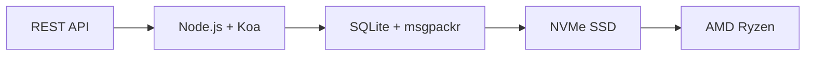

# أول واجهة برمجة تطبيقات بريد إلكتروني كاملة: كيف أحدث Forward Email ثورة في إدارة البريد الإلكتروني {#the-first-complete-email-api-how-forward-email-revolutionized-email-management}


<p class="lead mt-3">
  <strong>ملخص:</strong> قمنا ببناء أول واجهة برمجة تطبيقات REST كاملة في العالم لإدارة البريد الإلكتروني مع قدرات بحث متقدمة لا تقدمها أي خدمة أخرى. بينما تجبر Gmail و Outlook و Apple المطورين على التعامل مع جحيم IMAP أو واجهات برمجة التطبيقات المحدودة بالسرعة، يقدم Forward Email عمليات CRUD فائقة السرعة للرسائل والمجلدات وجهات الاتصال والتقاويم من خلال واجهة REST موحدة مع أكثر من 15 معلمة بحث. هذه هي واجهة برمجة التطبيقات للبريد الإلكتروني التي كان المطورون ينتظرونها.
</p>


## جدول المحتويات {#table-of-contents}

* [مشكلة واجهة برمجة تطبيقات البريد الإلكتروني](#the-email-api-problem)
* [ما يقوله المطورون فعليًا](#what-developers-are-actually-saying)
* [الحل الثوري لـ Forward Email](#forward-emails-revolutionary-solution)
  * [لماذا بنينا هذا](#why-we-built-this)
  * [مصادقة بسيطة](#simple-authentication)
* [20 نقطة نهاية تغير كل شيء](#20-endpoints-that-change-everything)
  * [الرسائل (5 نقاط نهاية)](#messages-5-endpoints)
  * [المجلدات (5 نقاط نهاية)](#folders-5-endpoints)
  * [جهات الاتصال (5 نقاط نهاية)](#contacts-5-endpoints)
  * [التقاويم (5 نقاط نهاية)](#calendars-5-endpoints)
* [بحث متقدم: لا تقارن أي خدمة أخرى](#advanced-search-no-other-service-compares)
  * [مشهد واجهة برمجة تطبيقات البحث معطل](#the-search-api-landscape-is-broken)
  * [واجهة برمجة تطبيقات البحث الثورية لـ Forward Email](#forward-emails-revolutionary-search-api)
  * [أمثلة بحث من العالم الحقيقي](#real-world-search-examples)
  * [مزايا الأداء](#performance-advantages)
  * [ميزات البحث التي لا يمتلكها أحد](#search-features-no-one-else-has)
  * [لماذا هذا مهم للمطورين](#why-this-matters-for-developers)
  * [التنفيذ الفني](#the-technical-implementation)
* [هيكلية أداء فائقة السرعة](#blazing-fast-performance-architecture)
  * [معايير الأداء](#performance-benchmarks)
  * [هيكلية الخصوصية أولاً](#privacy-first-architecture)
* [لماذا نحن مختلفون: المقارنة الكاملة](#why-were-different-the-complete-comparison)
  * [قيود المزودين الرئيسيين](#major-provider-limitations)
  * [مزايا Forward Email](#forward-email-advantages)
  * [مشكلة الشفافية في المصادر المفتوحة](#the-open-source-transparency-problem)
* [أكثر من 30 مثالًا على التكامل في العالم الحقيقي](#30-real-world-integration-examples)
  * [1. تحسين نموذج الاتصال في ووردبريس](#1-wordpress-contact-form-enhancement)
  * [2. بديل Zapier لأتمتة البريد الإلكتروني](#2-zapier-alternative-for-email-automation)
  * [3. مزامنة البريد الإلكتروني لنظام إدارة علاقات العملاء](#3-crm-email-synchronization)
  * [4. معالجة طلبات التجارة الإلكترونية](#4-e-commerce-order-processing)
  * [5. تكامل تذاكر الدعم](#5-support-ticket-integration)
  * [6. نظام إدارة النشرات الإخبارية](#6-newsletter-management-system)
  * [7. إدارة المهام عبر البريد الإلكتروني](#7-email-based-task-management)
  * [8. تجميع البريد الإلكتروني من حسابات متعددة](#8-multi-account-email-aggregation)
  * [9. لوحة تحكم تحليلات البريد الإلكتروني المتقدمة](#9-advanced-email-analytics-dashboard)
  * [10. أرشفة البريد الإلكتروني الذكية](#10-smart-email-archiving)
  * [11. تكامل البريد الإلكتروني مع التقويم](#11-email-to-calendar-integration)
  * [12. النسخ الاحتياطي للبريد الإلكتروني والامتثال](#12-email-backup-and-compliance)
  * [13. إدارة المحتوى عبر البريد الإلكتروني](#13-email-based-content-management)
  * [14. إدارة قوالب البريد الإلكتروني](#14-email-template-management)
  * [15. أتمتة سير العمل عبر البريد الإلكتروني](#15-email-based-workflow-automation)
  * [16. مراقبة أمان البريد الإلكتروني](#16-email-security-monitoring)
  * [17. جمع الاستطلاعات عبر البريد الإلكتروني](#17-email-based-survey-collection)
  * [18. مراقبة أداء البريد الإلكتروني](#18-email-performance-monitoring)
  * [19. تأهيل العملاء المحتملين عبر البريد الإلكتروني](#19-email-based-lead-qualification)
  * [20. إدارة المشاريع عبر البريد الإلكتروني](#20-email-based-project-management)
  * [21. إدارة المخزون عبر البريد الإلكتروني](#21-email-based-inventory-management)
  * [22. معالجة الفواتير عبر البريد الإلكتروني](#22-email-based-invoice-processing)
  * [23. تسجيل الأحداث عبر البريد الإلكتروني](#23-email-based-event-registration)
  * [24. سير عمل الموافقة على المستندات عبر البريد الإلكتروني](#24-email-based-document-approval-workflow)
  * [25. تحليل ملاحظات العملاء عبر البريد الإلكتروني](#25-email-based-customer-feedback-analysis)
  * [26. خط تجنيد عبر البريد الإلكتروني](#26-email-based-recruitment-pipeline)
  * [27. معالجة تقارير المصاريف عبر البريد الإلكتروني](#27-email-based-expense-report-processing)
  * [28. تقارير ضمان الجودة عبر البريد الإلكتروني](#28-email-based-quality-assurance-reporting)
  * [29. إدارة الموردين عبر البريد الإلكتروني](#29-email-based-vendor-management)
  * [30. مراقبة وسائل التواصل الاجتماعي عبر البريد الإلكتروني](#30-email-based-social-media-monitoring)
* [البدء](#getting-started)
  * [1. أنشئ حساب Forward Email الخاص بك](#1-create-your-forward-email-account)
  * [2. توليد بيانات اعتماد API](#2-generate-api-credentials)
  * [3. قم بأول استدعاء API لك](#3-make-your-first-api-call)
  * [4. استكشف الوثائق](#4-explore-the-documentation)
* [الموارد التقنية](#technical-resources)
## مشكلة واجهة برمجة تطبيقات البريد الإلكتروني {#the-email-api-problem}

واجهات برمجة تطبيقات البريد الإلكتروني معطلة بشكل جذري. نقطة.

كل مزود بريد إلكتروني رئيسي يجبر المطورين على اختيار واحد من خيارين سيئين:

1. **جحيم IMAP**: التعامل مع بروتوكول عمره 30 عامًا مصمم لعملاء سطح المكتب، وليس للتطبيقات الحديثة
2. **واجهات برمجة تطبيقات معاقة**: واجهات برمجة تطبيقات محدودة المعدل، للقراءة فقط، ومعقدة باستخدام OAuth لا يمكنها إدارة بيانات بريدك الإلكتروني الفعلية

النتيجة؟ إما أن يتخلى المطورون عن دمج البريد الإلكتروني تمامًا أو يضيعون أسابيع في بناء أغلفة IMAP هشة تتعطل باستمرار.

> \[!WARNING]
> **السر القذر**: معظم "واجهات برمجة تطبيقات البريد الإلكتروني" هي مجرد واجهات لإرسال البريد فقط. لا يمكنك تنظيم المجلدات برمجيًا، أو مزامنة جهات الاتصال، أو إدارة التقويمات من خلال واجهة REST بسيطة. حتى الآن.


## ما يقوله المطورون فعليًا {#what-developers-are-actually-saying}

الإحباط حقيقي وموثق في كل مكان:

> "حاولت مؤخرًا دمج Gmail في تطبيقي، وأمضيت وقتًا طويلاً عليه. قررت أنه لا يستحق دعم Gmail."
>
> *- [مطور على Hacker News](https://news.ycombinator.com/item?id=42106944)، 147 تصويت إيجابي*

> "هل كل واجهات برمجة تطبيقات البريد الإلكتروني متوسطة؟ تبدو محدودة أو مقيدة بطريقة ما."
>
> *- [نقاش على Reddit r/SaaS](https://www.reddit.com/r/SaaS/comments/1cm84s7/are_all_email_apis_mediocre/)*

> "لماذا يجب أن يكون تطوير البريد الإلكتروني سيئًا هكذا؟"
>
> *- [Reddit r/webdev](https://www.reddit.com/r/webdev/comments/15trnp2/why_does_email_development_have_to_suck/)، 89 تعليقًا عن معاناة المطورين*

> "ما الذي يجعل واجهة Gmail API أكثر كفاءة من IMAP؟ سبب آخر يجعل Gmail API أكثر كفاءة هو أنه يحتاج فقط لتنزيل كل رسالة مرة واحدة. مع IMAP، يجب تنزيل كل رسالة وفهرستها..."
>
> *- [سؤال على Stack Overflow](https://stackoverflow.com/questions/25431022/what-makes-the-gmail-api-more-efficient-than-imap) مع 47 تصويت إيجابي*

الدليل موجود في كل مكان:

* **مشاكل SMTP في ووردبريس**: [631 مشكلة على GitHub](https://github.com/awesomemotive/WP-Mail-SMTP/issues) حول فشل تسليم البريد الإلكتروني
* **قيود Zapier**: [شكاوى المجتمع](https://community.zapier.com/featured-articles-65/email-parser-by-zapier-limitations-and-alternatives-16958) حول حدود 10 رسائل في الساعة وفشل اكتشاف IMAP
* **مشاريع واجهة IMAP API**: [عدة](https://github.com/ewildgoose/imap-api) [مشاريع مفتوحة المصدر](https://emailengine.app/) [موجودة](https://www.npmjs.com/package/imapflow) خصيصًا لـ "تحويل IMAP إلى REST" لأن لا مزود يقدم هذا
* **إحباطات Gmail API**: [Stack Overflow](https://stackoverflow.com/questions/tagged/gmail-api) يحتوي على 4,847 سؤالًا معنونة بـ "gmail-api" مع شكاوى شائعة حول حدود المعدل والتعقيد


## الحل الثوري لـ Forward Email {#forward-emails-revolutionary-solution}

**نحن أول خدمة بريد إلكتروني تقدم عمليات CRUD كاملة لجميع بيانات البريد الإلكتروني من خلال واجهة REST موحدة.**

هذا ليس مجرد واجهة لإرسال البريد. هذه هي السيطرة البرمجية الكاملة على:

* **الرسائل**: إنشاء، قراءة، تحديث، حذف، بحث، نقل، تعليم
* **المجلدات**: إدارة كاملة لمجلدات IMAP عبر نقاط نهاية REST
* **جهات الاتصال**: تخزين ومزامنة جهات الاتصال باستخدام [CardDAV](https://tools.ietf.org/html/rfc6352)
* **التقويمات**: أحداث وجدولة التقويم باستخدام [CalDAV](https://tools.ietf.org/html/rfc4791)

### لماذا بنينا هذا {#why-we-built-this}

**المشكلة**: كل مزود بريد إلكتروني يعامل البريد كبوكس أسود. يمكنك إرسال الرسائل، وربما قراءتها باستخدام OAuth المعقد، لكن لا يمكنك حقًا *إدارة* بيانات بريدك الإلكتروني برمجيًا.

**رؤيتنا**: يجب أن يكون البريد الإلكتروني سهل الدمج مثل أي واجهة برمجة تطبيقات حديثة. لا مكتبات IMAP. لا تعقيد OAuth. لا كوابيس حدود المعدل. فقط نقاط نهاية REST بسيطة تعمل.

**النتيجة**: أول خدمة بريد إلكتروني يمكنك من خلالها بناء عميل بريد إلكتروني كامل، أو دمج CRM، أو نظام أتمتة باستخدام طلبات HTTP فقط.

### مصادقة بسيطة {#simple-authentication}

لا [تعقيد OAuth](https://oauth.net/2/). لا [كلمات مرور خاصة بالتطبيق](https://support.google.com/accounts/answer/185833). فقط بيانات اعتماد الاسم المستعار الخاص بك:

```bash
curl -u "alias@yourdomain.com:password" \
  https://api.forwardemail.net/v1/messages
```
## 20 نقاط نهاية تغير كل شيء {#20-endpoints-that-change-everything}

### الرسائل (5 نقاط نهاية) {#messages-5-endpoints}

* `GET /v1/messages` - سرد الرسائل مع التصفية (`?folder=`, `?is_unread=`, `?is_flagged=`)
* `POST /v1/messages` - إرسال رسائل جديدة مباشرة إلى المجلدات
* `GET /v1/messages/:id` - استرجاع رسالة محددة مع كافة البيانات الوصفية
* `PUT /v1/messages/:id` - تحديث الرسالة (العلامات، المجلد، حالة القراءة)
* `DELETE /v1/messages/:id` - حذف الرسالة نهائيًا

### المجلدات (5 نقاط نهاية) {#folders-5-endpoints}

* `GET /v1/folders` - سرد جميع المجلدات مع حالة الاشتراك
* `POST /v1/folders` - إنشاء مجلد جديد بخصائص مخصصة
* `GET /v1/folders/:id` - الحصول على تفاصيل المجلد وعدد الرسائل
* `PUT /v1/folders/:id` - تحديث خصائص المجلد والاشتراك
* `DELETE /v1/folders/:id` - حذف المجلد والتعامل مع إعادة توطين الرسائل

### جهات الاتصال (5 نقاط نهاية) {#contacts-5-endpoints}

* `GET /v1/contacts` - سرد جهات الاتصال مع البحث والتقسيم إلى صفحات
* `POST /v1/contacts` - إنشاء جهة اتصال جديدة بدعم كامل لبطاقة vCard
* `GET /v1/contacts/:id` - استرجاع جهة الاتصال مع جميع الحقول والبيانات الوصفية
* `PUT /v1/contacts/:id` - تحديث معلومات جهة الاتصال مع التحقق من ETag
* `DELETE /v1/contacts/:id` - حذف جهة الاتصال مع التعامل المتسلسل

### التقويمات (5 نقاط نهاية) {#calendars-5-endpoints}

* `GET /v1/calendars` - سرد أحداث التقويم مع تصفية بالتاريخ
* `POST /v1/calendars` - إنشاء حدث تقويم مع الحضور والتكرار
* `GET /v1/calendars/:id` - الحصول على تفاصيل الحدث مع التعامل مع المنطقة الزمنية
* `PUT /v1/calendars/:id` - تحديث الحدث مع اكتشاف التعارضات
* `DELETE /v1/calendars/:id` - حذف الحدث مع إشعارات الحضور


## البحث المتقدم: لا تقارن أي خدمة أخرى {#advanced-search-no-other-service-compares}

**Forward Email هي الخدمة الوحيدة للبريد الإلكتروني التي تقدم بحثًا برمجيًا شاملاً عبر جميع حقول الرسائل من خلال REST API.**

بينما يقدم المزودون الآخرون تصفية أساسية في أفضل الأحوال، قمنا ببناء أكثر واجهة برمجة تطبيقات بحث بريد إلكتروني تقدمًا على الإطلاق. لا تقارن أي واجهة برمجة تطبيقات Gmail أو Outlook أو أي خدمة أخرى بقدرات البحث لدينا.

### مشهد واجهات برمجة تطبيقات البحث معطل {#the-search-api-landscape-is-broken}

**قيود بحث واجهة برمجة تطبيقات Gmail:**

* ✅ معلمة `q` الأساسية فقط
* ❌ لا بحث محدد الحقل
* ❌ لا تصفية بنطاق التاريخ
* ❌ لا تصفية حسب الحجم
* ❌ لا تصفية المرفقات
* ❌ مقتصر على صياغة بحث Gmail

**قيود بحث واجهة برمجة تطبيقات Outlook:**

* ✅ معلمة `$search` الأساسية
* ❌ لا استهداف متقدم للحقل
* ❌ لا تركيبات استعلام معقدة
* ❌ تحديد معدل صارم
* ❌ يتطلب صياغة OData معقدة

**Apple iCloud:**

* ❌ لا توجد واجهة برمجة تطبيقات على الإطلاق
* ❌ بحث IMAP فقط (إذا تمكنت من تشغيله)

**ProtonMail & Tuta:**

* ❌ لا توجد واجهات برمجة تطبيقات عامة
* ❌ لا قدرات بحث برمجية

### واجهة برمجة تطبيقات البحث الثورية من Forward Email {#forward-emails-revolutionary-search-api}

**نقدم أكثر من 15 معلمة بحث لا توفرها أي خدمة أخرى:**

| قدرة البحث                    | Forward Email                          | Gmail API    | Outlook API        | أخرى   |
| ------------------------------ | -------------------------------------- | ------------ | ------------------ | ------ |
| **بحث محدد الحقل**             | ✅ الموضوع، النص، من، إلى، نسخة، رؤوس الرسائل | ❌            | ❌                  | ❌      |
| **بحث عام متعدد الحقول**       | ✅ `?search=` عبر جميع الحقول           | ✅ أساسي `q=` | ✅ أساسي `$search=` | ❌      |
| **تصفية بنطاق التاريخ**        | ✅ `?since=` و `?before=`               | ❌            | ❌                  | ❌      |
| **تصفية حسب الحجم**            | ✅ `?min_size=` و `?max_size=`          | ❌            | ❌                  | ❌      |
| **تصفية المرفقات**             | ✅ `?has_attachments=true/false`        | ❌            | ❌                  | ❌      |
| **بحث في الرؤوس**              | ✅ `?headers=X-Priority`                | ❌            | ❌                  | ❌      |
| **بحث بمعرف الرسالة**          | ✅ `?message_id=abc123`                 | ❌            | ❌                  | ❌      |
| **تصفية مركبة**               | ✅ معلمات متعددة مع منطق AND            | ❌            | ❌                  | ❌      |
| **غير حساس لحالة الأحرف**      | ✅ جميع عمليات البحث                    | ✅            | ✅                  | ❌      |
| **دعم التقسيم إلى صفحات**     | ✅ يعمل مع جميع معلمات البحث            | ✅            | ✅                  | ❌      |
### أمثلة بحث من العالم الحقيقي {#real-world-search-examples}

**ابحث عن جميع الفواتير من الربع الأخير:**

```bash
# Forward Email - بسيط وقوي
GET /v1/messages?subject=invoice&since=2024-01-01T00:00:00Z&before=2024-04-01T00:00:00Z

# Gmail API - مستحيل مع بحثهم المحدود
# لا يوجد تصفية حسب نطاق التاريخ

# Outlook API - صيغة OData معقدة، وظائف محدودة
GET /me/messages?$search="invoice"&$filter=receivedDateTime ge 2024-01-01T00:00:00Z
```

**ابحث عن مرفقات كبيرة من مرسل معين:**

```bash
# Forward Email - تصفية شاملة
GET /v1/messages?from=finance@company.com&has_attachments=true&min_size=1000000

# Gmail API - لا يمكن التصفية حسب الحجم أو المرفقات برمجياً
# Outlook API - لا توجد تصفية حسب الحجم متاحة
# أخرى - لا توجد واجهات برمجة تطبيقات متاحة
```

**بحث متعدد الحقول معقد:**

```bash
# Forward Email - قدرات استعلام متقدمة
GET /v1/messages?body=quarterly&from=manager&is_flagged=true&folder=Reports

# Gmail API - محدود بالبحث النصي الأساسي فقط
GET /gmail/v1/users/me/messages?q=quarterly

# Outlook API - بحث أساسي بدون استهداف الحقول
GET /me/messages?$search="quarterly"
```

### مزايا الأداء {#performance-advantages}

**أداء بحث Forward Email:**

* ⚡ **أوقات استجابة أقل من 100 مللي ثانية** للبحث المعقد
* 🔍 **تحسين التعبيرات النمطية (Regex)** مع فهرسة مناسبة
* 📊 **تنفيذ استعلامات متوازية** للعد والبيانات
* 💾 **استخدام ذاكرة فعال** مع استعلامات خفيفة

**مشاكل أداء المنافسين:**

* 🐌 **Gmail API**: محدودية المعدل إلى 250 وحدة حصة لكل مستخدم في الثانية
* 🐌 **Outlook API**: تقييد صارم مع متطلبات تأخير معقدة
* 🐌 **أخرى**: لا توجد واجهات برمجة تطبيقات للمقارنة

### ميزات البحث التي لا يمتلكها أحد غيرنا {#search-features-no-one-else-has}

#### 1. بحث مخصص للرؤوس {#1-header-specific-search}

```bash
# ابحث عن الرسائل التي تحتوي على رؤوس محددة
GET /v1/messages?headers=X-Priority:1
GET /v1/messages?headers=X-Spam-Score
```

#### 2. ذكاء قائم على الحجم {#2-size-based-intelligence}

```bash
# ابحث عن رسائل النشرة الإخبارية (عادة كبيرة الحجم)
GET /v1/messages?min_size=50000&from=newsletter

# ابحث عن الردود السريعة (عادة صغيرة الحجم)
GET /v1/messages?max_size=1000&to=support
```

#### 3. سير عمل قائم على المرفقات {#3-attachment-based-workflows}

```bash
# ابحث عن جميع المستندات المرسلة إلى الفريق القانوني
GET /v1/messages?to=legal&has_attachments=true&body=contract

# ابحث عن الرسائل بدون مرفقات للتنظيف
GET /v1/messages?has_attachments=false&before=2023-01-01T00:00:00Z
```

#### 4. منطق أعمال مركب {#4-combined-business-logic}

```bash
# ابحث عن الرسائل المعلمة كعاجلة من كبار الشخصيات مع مرفقات
GET /v1/messages?is_flagged=true&from=ceo&has_attachments=true&subject=urgent
```

### لماذا هذا مهم للمطورين {#why-this-matters-for-developers}

**ابنِ تطبيقات كانت مستحيلة سابقاً:**

1. **تحليلات بريد إلكتروني متقدمة**: تحليل أنماط البريد حسب الحجم والمرسل والمحتوى
2. **إدارة بريد ذكية**: تنظيم تلقائي بناءً على معايير معقدة
3. **الامتثال والاكتشاف**: العثور على رسائل محددة للمتطلبات القانونية
4. **ذكاء الأعمال**: استخراج رؤى من أنماط التواصل عبر البريد الإلكتروني
5. **سير عمل آلي**: تفعيل إجراءات بناءً على فلاتر بريد متقدمة

### التنفيذ الفني {#the-technical-implementation}

تستخدم واجهة برمجة تطبيقات البحث لدينا:

* **تحسين التعبيرات النمطية (Regex)** مع استراتيجيات فهرسة مناسبة
* **تنفيذ متوازي** للأداء
* **التحقق من صحة المدخلات** للأمان
* **معالجة شاملة للأخطاء** للموثوقية

```javascript
// مثال: تنفيذ بحث معقد
const searchConditions = [];

if (ctx.query.subject) {
  searchConditions.push({
    subject: { $regex: ctx.query.subject, $options: 'i' }
  });
}

if (ctx.query.from) {
  searchConditions.push({
    $or: [
      { 'from.address': { $regex: ctx.query.from, $options: 'i' } },
      { 'from.name': { $regex: ctx.query.from, $options: 'i' } }
    ]
  });
}

// الجمع باستخدام منطق AND
if (searchConditions.length > 0) {
  query.$and = searchConditions;
}
```

> \[!TIP]
> **ميزة للمطورين**: مع واجهة برمجة تطبيقات البحث في Forward Email، يمكنك بناء تطبيقات بريد إلكتروني تنافس عملاء سطح المكتب في الوظائف مع الحفاظ على بساطة واجهات REST.
## بنية أداء فائقة السرعة {#blazing-fast-performance-architecture}

تم بناء مجموعتنا التقنية للسرعة والموثوقية:


```mermaid
graph LR
    A[REST API] --> B[Node.js + Koa]
    B --> C[SQLite + msgpackr]
    C --> D[NVMe SSD]
    D --> E[AMD Ryzen]
```

### معايير الأداء {#performance-benchmarks}

**لماذا نحن سريعون كالبرق:**

| المكون       | التكنولوجيا                                                                       | فائدة الأداء                                |
| ------------ | --------------------------------------------------------------------------------- | ------------------------------------------- |
| **التخزين**  | [NVMe SSD](https://en.wikipedia.org/wiki/NVM_Express)                            | أسرع 10 مرات من SATA التقليدي               |
| **قاعدة البيانات** | [SQLite](https://sqlite.org/) + [msgpackr](https://github.com/kriszyp/msgpackr) | صفر تأخير في الشبكة، تسلسل محسّن             |
| **الأجهزة**  | [AMD Ryzen](https://www.amd.com/en/products/processors/desktops/ryzen) بدون طبقة افتراضية | لا يوجد حمل إضافي للتمثيل الافتراضي          |
| **التخزين المؤقت** | في الذاكرة + دائم                                                              | أوقات استجابة أقل من المللي ثانية            |
| **النسخ الاحتياطية** | [Cloudflare R2](https://www.cloudflare.com/products/r2/) مشفرة                 | موثوقية بمستوى المؤسسات                      |

**أرقام الأداء الحقيقية:**

* **زمن استجابة API**: أقل من 50 مللي ثانية في المتوسط
* **استرجاع الرسائل**: أقل من 10 مللي ثانية للرسائل المخزنة مؤقتًا
* **عمليات المجلدات**: أقل من 5 مللي ثانية لعمليات بيانات التعريف
* **مزامنة جهات الاتصال**: أكثر من 1000 جهة اتصال في الثانية
* **مدة التشغيل**: 99.99% اتفاقية مستوى الخدمة مع بنية تحتية زائدة

### بنية الخصوصية أولاً {#privacy-first-architecture}

**تصميم المعرفة الصفرية**: فقط أنت من يملك الوصول باستخدام كلمة مرور IMAP الخاصة بك - لا يمكننا قراءة رسائلك الإلكترونية. تضمن [بنيتنا المعرفية الصفرية](https://forwardemail.net/en/security) الخصوصية الكاملة مع تقديم أداء فائق السرعة.


## لماذا نحن مختلفون: المقارنة الكاملة {#why-were-different-the-complete-comparison}

### قيود المزودين الرئيسيين {#major-provider-limitations}

| المزود           | المشاكل الأساسية                          | القيود المحددة                                                                                                                                                                                                                                                                                                                                                                                                                                                    |
| ---------------- | ----------------------------------------- | ------------------------------------------------------------------------------------------------------------------------------------------------------------------------------------------------------------------------------------------------------------------------------------------------------------------------------------------------------------------------------------------------------------------------------------------------------------------ |
| **Gmail API**    | قراءة فقط، OAuth معقد، APIs منفصلة          | • [لا يمكن تعديل الرسائل الموجودة](https://developers.google.com/gmail/api/reference/rest/v1/users.messages)<br>• [التسميات ≠ المجلدات](https://developers.google.com/gmail/api/reference/rest/v1/users.labels)<br>• [حد 1 مليار وحدة حصة يوميًا](https://developers.google.com/gmail/api/reference/quota)<br>• [يتطلب APIs منفصلة](https://developers.google.com/workspace) لجهات الاتصال/التقويم                                                           |
| **Outlook API**  | مهجور، مربك، موجه للمؤسسات                 | • [نقاط نهاية REST مهجورة مارس 2024](https://learn.microsoft.com/en-us/outlook/rest/compare-graph)<br>• [عدة APIs مربكة](https://learn.microsoft.com/en-us/office/client-developer/outlook/selecting-an-api-or-technology-for-developing-solutions-for-outlook) (EWS, Graph, REST)<br>• [تعقيد Microsoft Graph](https://learn.microsoft.com/en-us/graph/overview)<br>• [تقييد صارم](https://learn.microsoft.com/en-us/graph/throttling) |
| **Apple iCloud** | لا يوجد API عام                           | • [لا يوجد API عام على الإطلاق](https://support.apple.com/en-us/102654)<br>• [IMAP فقط مع حد 1000 رسالة يوميًا](https://support.apple.com/en-us/102654)<br>• [كلمات مرور خاصة بالتطبيق مطلوبة](https://support.apple.com/en-us/102654)<br>• [حد 500 مستلم لكل رسالة](https://support.apple.com/en-us/102654)                                                                                                                                              |
| **ProtonMail**   | لا API، ادعاءات مفتوحة المصدر كاذبة         | • [لا يوجد API عام متاح](https://proton.me/support/protonmail-bridge-clients)<br>• [برنامج Bridge مطلوب](https://proton.me/mail/bridge) للوصول عبر IMAP<br>• [يدعي "مفتوح المصدر"](https://proton.me/blog/open-source) لكن [كود الخادم ملكي](https://github.com/ProtonMail)<br>• [مقتصر على الخطط المدفوعة فقط](https://proton.me/pricing)                                                                                                         |
| **Tuta**         | لا API، شفافية مضللة                        | • [لا يوجد REST API لإدارة البريد الإلكتروني](https://tuta.com/support#technical)<br>• [يدعي "مفتوح المصدر"](https://tuta.com/blog/posts/open-source-email) لكن [الخلفية مغلقة](https://github.com/tutao/tutanota)<br>• [لا يدعم IMAP/SMTP](https://tuta.com/support#imap)<br>• [تشفير ملكي](https://tuta.com/encryption) يمنع التكاملات القياسية                                                                                               |
| **Zapier Email** | قيود شديدة على المعدل                      | • [حد 10 رسائل في الساعة](https://help.zapier.com/hc/en-us/articles/8496181555597-Email-Parser-by-Zapier-limitations-and-alternatives)<br>• [لا يوجد وصول لمجلدات IMAP](https://help.zapier.com/hc/en-us/articles/8496181555597-Email-Parser-by-Zapier-limitations-and-alternatives)<br>• [قدرات تحليل محدودة](https://help.zapier.com/hc/en-us/articles/8496181555597-Email-Parser-by-Zapier-limitations-and-alternatives)                                 |
### مزايا إعادة توجيه البريد الإلكتروني {#forward-email-advantages}

| الميزة             | إعادة توجيه البريد الإلكتروني                                                                 | المنافسة                                  |
| ------------------ | -------------------------------------------------------------------------------------------- | ----------------------------------------- |
| **CRUD كاملة**     | ✅ إنشاء، قراءة، تحديث، حذف كاملة لجميع البيانات                                              | ❌ قراءة فقط أو عمليات محدودة               |
| **واجهة برمجة تطبيقات موحدة** | ✅ الرسائل، المجلدات، جهات الاتصال، التقويمات في واجهة برمجة تطبيقات واحدة                  | ❌ واجهات برمجة تطبيقات منفصلة أو ميزات مفقودة |
| **مصادقة بسيطة**   | ✅ مصادقة أساسية باستخدام بيانات اعتماد الاسم المستعار                                        | ❌ OAuth معقد مع صلاحيات متعددة             |
| **بدون حدود معدل** | ✅ حدود سخية مصممة للتطبيقات الحقيقية                                                        | ❌ حصص مقيدة تكسر سير العمل                 |
| **الاستضافة الذاتية** | ✅ [خيار الاستضافة الذاتية الكامل](https://forwardemail.net/en/blog/docs/self-hosted-solution) | ❌ قفل البائع فقط                           |
| **الخصوصية**       | ✅ معرفة صفرية، مشفرة، خاصة                                                                  | ❌ تنقيب عن البيانات ومخاوف الخصوصية        |
| **الأداء**         | ✅ استجابات أقل من 50 مللي ثانية، تخزين NVMe                                                | ❌ تأخير الشبكة، تأخيرات التقييد            |

### مشكلة الشفافية في المصادر المفتوحة {#the-open-source-transparency-problem}

**تسوق ProtonMail و Tuta نفسيهما على أنهما "مفتوحا المصدر" و"شفافان"، لكن هذا تسويق مضلل ينتهك مبادئ الخصوصية الحديثة.**

> \[!WARNING]
> **ادعاءات شفافية كاذبة**: يعلن كل من ProtonMail و Tuta بشكل بارز عن "مصداقيتهما كمصدر مفتوح" بينما يحتفظان بأهم كود الخادم الخاص بهما مغلقا وسريا.

**خداع ProtonMail:**

* **الادعاءات**: ["نحن مفتوحو المصدر"](https://proton.me/blog/open-source) تظهر بشكل بارز في التسويق
* **الواقع**: [كود الخادم ملكي بالكامل](https://github.com/ProtonMail) - فقط تطبيقات العميل مفتوحة المصدر
* **التأثير**: لا يمكن للمستخدمين التحقق من التشفير على جانب الخادم، أو معالجة البيانات، أو ادعاءات الخصوصية
* **انتهاك الشفافية**: لا توجد طريقة لتدقيق أنظمة معالجة وتخزين البريد الإلكتروني الفعلية

**تسويق Tuta المضلل:**

* **الادعاءات**: ["بريد إلكتروني مفتوح المصدر"](https://tuta.com/blog/posts/open-source-email) كنقطة بيع أساسية
* **الواقع**: [البنية التحتية الخلفية مغلقة المصدر](https://github.com/tutao/tutanota) - فقط الواجهة الأمامية متاحة
* **التأثير**: التشفير الملكي يمنع بروتوكولات البريد الإلكتروني القياسية (IMAP/SMTP)
* **استراتيجية القفل**: التشفير المخصص يجبر الاعتماد على البائع

**لماذا هذا مهم للخصوصية الحديثة:**

في عام 2025، تتطلب الخصوصية الحقيقية **شفافية كاملة**. عندما يدعي مزودو البريد الإلكتروني "مفتوح المصدر" لكنهم يخفيون كود الخادم:

1. **تشفير غير قابل للتحقق**: لا يمكنك تدقيق كيفية تشفير بياناتك فعليا
2. **ممارسات بيانات مخفية**: تبقى معالجة البيانات على جانب الخادم صندوقا أسود
3. **أمان قائم على الثقة**: يجب أن تثق في ادعاءاتهم دون تحقق
4. **قفل البائع**: تمنع الأنظمة الملكية نقل البيانات

**الشفافية الحقيقية لإعادة توجيه البريد الإلكتروني:**

* ✅ **[مفتوح المصدر بالكامل](https://github.com/forwardemail/forwardemail.net)** - كود الخادم والعميل
* ✅ **[الاستضافة الذاتية متاحة](https://forwardemail.net/en/blog/docs/self-hosted-solution)** - تشغيل نسختك الخاصة
* ✅ **بروتوكولات قياسية** - توافق IMAP، SMTP، CardDAV، CalDAV
* ✅ **أمان قابل للتدقيق** - يمكن فحص كل سطر من الكود
* ✅ **لا قفل للبائع** - بياناتك، تحكمك

> \[!TIP]
> **المصدر المفتوح الحقيقي يعني أنه يمكنك التحقق من كل ادعاء.** مع إعادة توجيه البريد الإلكتروني، يمكنك تدقيق تشفيرنا، مراجعة معالجة بياناتنا، وحتى تشغيل نسختك الخاصة. هذه هي الشفافية الحقيقية.


## أكثر من 30 مثال تكامل من العالم الحقيقي {#30-real-world-integration-examples}

### 1. تحسين نموذج الاتصال في ووردبريس {#1-wordpress-contact-form-enhancement}
**المشكلة**: [فشل تكوين SMTP في ووردبريس](https://github.com/awesomemotive/WP-Mail-SMTP/issues) ([631 مشكلة على GitHub](https://github.com/awesomemotive/WP-Mail-SMTP/issues))  
**الحل**: التكامل المباشر عبر API يتجاوز [SMTP](https://tools.ietf.org/html/rfc5321) بالكامل

```javascript
// نموذج اتصال ووردبريس يحفظ في مجلد المرسلة
await fetch('https://api.forwardemail.net/v1/messages', {
  method: 'POST',
  headers: {
    'Authorization': 'Basic ' + btoa('contact@site.com:password'),
    'Content-Type': 'application/json'
  },
  body: JSON.stringify({
    to: [{ address: 'owner@site.com' }],
    subject: 'نموذج الاتصال: ' + formData.subject,
    text: formData.message,
    folder: 'Sent'
  })
});
```

### 2. بديل Zapier لأتمتة البريد الإلكتروني {#2-zapier-alternative-for-email-automation}

**المشكلة**: [حد 10 رسائل بريد إلكتروني في الساعة من Zapier](https://help.zapier.com/hc/en-us/articles/8496181555597-Email-Parser-by-Zapier-limitations-and-alternatives) و[فشل اكتشاف IMAP](https://community.zapier.com/featured-articles-65/email-parser-by-zapier-limitations-and-alternatives-16958)  
**الحل**: أتمتة غير محدودة مع تحكم كامل في البريد الإلكتروني

```javascript
// تنظيم الرسائل تلقائيًا حسب نطاق المرسل
const messages = await fetch('/v1/messages?folder=INBOX');
for (const message of messages) {
  const domain = message.from.split('@')[1];
  await fetch(`/v1/messages/${message.id}`, {
    method: 'PUT',
    body: JSON.stringify({ folder: `Clients/${domain}` })
  });
}
```

### 3. مزامنة البريد الإلكتروني لنظام إدارة علاقات العملاء {#3-crm-email-synchronization}

**المشكلة**: إدارة جهات الاتصال يدويًا بين البريد الإلكتروني و[أنظمة إدارة علاقات العملاء](https://en.wikipedia.org/wiki/Customer_relationship_management)  
**الحل**: مزامنة ثنائية الاتجاه مع API جهات الاتصال [CardDAV](https://tools.ietf.org/html/rfc6352)

```javascript
// مزامنة جهات الاتصال الجديدة من البريد الإلكتروني إلى نظام إدارة علاقات العملاء
const newContacts = await fetch('/v1/contacts');
for (const contact of newContacts) {
  await crmAPI.createContact({
    name: contact.name,
    email: contact.email,
    source: 'email_api'
  });
}
```

### 4. معالجة طلبات التجارة الإلكترونية {#4-e-commerce-order-processing}

**المشكلة**: معالجة طلبات البريد الإلكتروني يدويًا لمنصات [التجارة الإلكترونية](https://en.wikipedia.org/wiki/E-commerce)  
**الحل**: خط أنابيب إدارة الطلبات الآلي

```javascript
// معالجة رسائل تأكيد الطلبات
const orders = await fetch('/v1/messages?folder=Orders');
const orderEmails = orders.filter(msg =>
  msg.subject.includes('Order Confirmation')
);

for (const order of orderEmails) {
  const orderData = parseOrderEmail(order.text);
  await updateInventory(orderData);
  await fetch(`/v1/messages/${order.id}`, {
    method: 'PUT',
    body: JSON.stringify({ folder: 'Orders/Processed' })
  });
}
```

### 5. تكامل تذاكر الدعم الفني {#5-support-ticket-integration}

**المشكلة**: تشتت سلاسل البريد الإلكتروني عبر منصات [مكاتب الدعم](https://en.wikipedia.org/wiki/Help_desk_software)  
**الحل**: تتبع كامل لسلاسل البريد الإلكتروني

```javascript
// إنشاء تذكرة دعم من سلسلة البريد الإلكتروني
const messages = await fetch('/v1/messages?folder=Support');
const supportEmails = messages.filter(msg =>
  msg.to.some(addr => addr.includes('support@'))
);

for (const email of supportEmails) {
  const ticket = await supportSystem.createTicket({
    subject: email.subject,
    from: email.from,
    body: email.text,
    timestamp: email.date
  });
}
```

### 6. نظام إدارة النشرات الإخبارية {#6-newsletter-management-system}

**المشكلة**: تكاملات محدودة مع منصات [النشرات الإخبارية](https://en.wikipedia.org/wiki/Email_marketing)  
**الحل**: إدارة كاملة لدورة حياة المشتركين

```javascript
// إدارة الاشتراكات في النشرة الإخبارية تلقائيًا
const messages = await fetch('/v1/messages?folder=Newsletter');
const unsubscribes = messages.filter(msg =>
  msg.subject.toLowerCase().includes('unsubscribe')
);

for (const msg of unsubscribes) {
  await removeSubscriber(msg.from);
  await fetch(`/v1/messages/${msg.id}`, {
    method: 'PUT',
    body: JSON.stringify({ folder: 'Newsletter/Unsubscribed' })
  });
}
```

### 7. إدارة المهام عبر البريد الإلكتروني {#7-email-based-task-management}

**المشكلة**: ازدحام صندوق الوارد و[تتبع المهام](https://en.wikipedia.org/wiki/Task_management)  
**الحل**: تحويل رسائل البريد الإلكتروني إلى مهام قابلة للتنفيذ
```javascript
// Create tasks from flagged emails
const messages = await fetch('/v1/messages?is_flagged=true');
for (const email of messages) {
  await taskManager.createTask({
    title: email.subject,
    description: email.text,
    assignee: email.to[0].address,
    dueDate: extractDueDate(email.text)
  });
}
```

### 8. Multi-Account Email Aggregation {#8-multi-account-email-aggregation}

**Problem**: Managing [multiple email accounts](https://en.wikipedia.org/wiki/Email_client) across providers
**Solution**: Unified inbox interface

```javascript
// Aggregate emails from multiple accounts
const accounts = ['work@domain.com', 'personal@domain.com'];
const allMessages = [];

for (const account of accounts) {
  const messages = await fetch('/v1/messages', {
    headers: { 'Authorization': getAuth(account) }
  });
  allMessages.push(...messages.map(m => ({ ...m, account })));
}
```

### 9. Advanced Email Analytics Dashboard {#9-advanced-email-analytics-dashboard}

**Problem**: No insights into [email patterns](https://en.wikipedia.org/wiki/Email_analytics) with sophisticated filtering
**Solution**: Custom email analytics using advanced search capabilities

```javascript
// Generate comprehensive email analytics using advanced search
const analytics = {};

// Analyze email volume by sender domain
const messages = await fetch('/v1/messages');
analytics.senderDomains = analyzeSenderDomains(messages);

// Find large attachments consuming storage
const largeAttachments = await fetch('/v1/messages?has_attachments=true&min_size=1000000');
analytics.storageHogs = largeAttachments.map(msg => ({
  subject: msg.subject,
  from: msg.from,
  size: msg.size
}));

// Analyze communication patterns with VIPs
const vipEmails = await fetch('/v1/messages?from=ceo@company.com');
const urgentVipEmails = await fetch('/v1/messages?from=ceo@company.com&subject=urgent');
analytics.vipCommunication = {
  total: vipEmails.length,
  urgent: urgentVipEmails.length,
  urgencyRate: (urgentVipEmails.length / vipEmails.length) * 100
};

// Find unread emails by date range for follow-up
const lastWeek = new Date(Date.now() - 7 * 24 * 60 * 60 * 1000).toISOString();
const unreadRecent = await fetch(`/v1/messages?is_unread=true&since=${lastWeek}`);
analytics.followUpNeeded = unreadRecent.length;

// Analyze email sizes for optimization
const smallEmails = await fetch('/v1/messages?max_size=1000');
const mediumEmails = await fetch('/v1/messages?min_size=1000&max_size=50000');
const largeEmails = await fetch('/v1/messages?min_size=50000');
analytics.sizeDistribution = {
  small: smallEmails.length,
  medium: mediumEmails.length,
  large: largeEmails.length
};

// Search for compliance-related emails
const complianceEmails = await fetch('/v1/messages?body=confidential&has_attachments=true');
analytics.complianceReview = complianceEmails.length;
```

### 10. Smart Email Archiving {#10-smart-email-archiving}

**Problem**: Manual [email organization](https://en.wikipedia.org/wiki/Email_management)
**Solution**: Intelligent email categorization

```javascript
// Auto-archive old emails by category
const messages = await fetch('/v1/messages');
const oldEmails = messages.filter(email =>
  isOlderThan(email.date, 90) // 90 days
);

for (const email of oldEmails) {
  const category = categorizeEmail(email);
  await fetch(`/v1/messages/${email.id}`, {
    method: 'PUT',
    body: JSON.stringify({ folder: `Archive/${category}` })
  });
}
```

### 11. Email-to-Calendar Integration {#11-email-to-calendar-integration}

**Problem**: Manual [calendar event](https://tools.ietf.org/html/rfc4791) creation from emails
**Solution**: Automatic event extraction and creation

```javascript
// Extract meeting details from emails
const messages = await fetch('/v1/messages?folder=Meetings');
const meetingEmails = messages.filter(email =>
  email.subject.toLowerCase().includes('meeting')
);

for (const email of meetingEmails) {
  const meetingData = extractMeetingInfo(email.text);
  if (meetingData.date && meetingData.time) {
    await fetch('/v1/calendars', {
      method: 'POST',
      body: JSON.stringify({
        title: email.subject,
        start: meetingData.datetime,
        attendees: [email.from, ...email.to]
      })
    });
  }
}
```

### 12. النسخ الاحتياطي للبريد الإلكتروني والامتثال {#12-email-backup-and-compliance}

**المشكلة**: [الاحتفاظ بالبريد الإلكتروني](https://en.wikipedia.org/wiki/Email_retention_policy) ومتطلبات الامتثال  
**الحل**: النسخ الاحتياطي الآلي مع الحفاظ على البيانات الوصفية

```javascript
// Backup emails with full metadata
const allMessages = await fetch('/v1/messages');
const backup = {
  timestamp: new Date(),
  messages: allMessages.map(msg => ({
    id: msg.id,
    subject: msg.subject,
    from: msg.from,
    to: msg.to,
    date: msg.date,
    flags: msg.flags
  }))
};
await saveToComplianceStorage(backup);
```

### 13. إدارة المحتوى عبر البريد الإلكتروني {#13-email-based-content-management}

**المشكلة**: إدارة تقديمات المحتوى عبر البريد الإلكتروني لمنصات [نظام إدارة المحتوى](https://en.wikipedia.org/wiki/Content_management_system)  
**الحل**: استخدام البريد الإلكتروني كنظام إدارة محتوى

```javascript
// Process content submissions from email
const messages = await fetch('/v1/messages?folder=Submissions');
const submissions = messages.filter(msg =>
  msg.to.some(addr => addr.includes('submit@'))
);

for (const submission of submissions) {
  const content = parseSubmission(submission.text);
  await cms.createDraft({
    title: submission.subject,
    content: content.body,
    author: submission.from
  });
}
```

### 14. إدارة قوالب البريد الإلكتروني {#14-email-template-management}

**المشكلة**: عدم اتساق [قوالب البريد الإلكتروني](https://en.wikipedia.org/wiki/Email_template) عبر الفريق  
**الحل**: نظام قوالب مركزي مع واجهة برمجة التطبيقات

```javascript
// Send templated emails with dynamic content
const template = await getEmailTemplate('welcome');
await fetch('/v1/messages', {
  method: 'POST',
  body: JSON.stringify({
    to: [{ address: newUser.email }],
    subject: template.subject.replace('{{name}}', newUser.name),
    html: template.html.replace('{{name}}', newUser.name),
    folder: 'Sent'
  })
});
```

### 15. أتمتة سير العمل عبر البريد الإلكتروني {#15-email-based-workflow-automation}

**المشكلة**: عمليات [الموافقة اليدوية](https://en.wikipedia.org/wiki/Workflow) عبر البريد الإلكتروني  
**الحل**: مشغلات سير العمل الآلية

```javascript
// Process approval emails
const messages = await fetch('/v1/messages?folder=Approvals');
const approvals = messages.filter(msg =>
  msg.subject.includes('APPROVAL')
);

for (const approval of approvals) {
  const decision = parseApprovalDecision(approval.text);
  await workflow.processApproval({
    requestId: extractRequestId(approval.subject),
    decision: decision,
    approver: approval.from
  });
}
```

### 16. مراقبة أمان البريد الإلكتروني {#16-email-security-monitoring}

**المشكلة**: الكشف اليدوي عن [تهديدات الأمان](https://en.wikipedia.org/wiki/Email_security)  
**الحل**: تحليل التهديدات الآلي

```javascript
// Monitor for suspicious emails
const recentEmails = await fetch('/v1/messages');
for (const email of recentEmails) {
  const threatScore = analyzeThreat(email);
  if (threatScore > 0.8) {
    await fetch(`/v1/messages/${email.id}`, {
      method: 'PUT',
      body: JSON.stringify({ folder: 'Security/Quarantine' })
    });
    await alertSecurityTeam(email);
  }
}
```

### 17. جمع الاستبيانات عبر البريد الإلكتروني {#17-email-based-survey-collection}

**المشكلة**: معالجة [ردود الاستبيان](https://en.wikipedia.org/wiki/Survey_methodology) يدوياً  
**الحل**: تجميع الردود الآلي

```javascript
// Collect and process survey responses
const messages = await fetch('/v1/messages?folder=Surveys');
const responses = messages.filter(msg =>
  msg.subject.includes('Survey Response')
);

const surveyData = responses.map(email => ({
  respondent: email.from,
  responses: parseSurveyData(email.text),
  timestamp: email.date
}));
await updateSurveyResults(surveyData);
```

### 18. مراقبة أداء البريد الإلكتروني {#18-email-performance-monitoring}

**المشكلة**: عدم وجود رؤية لأداء [تسليم البريد الإلكتروني](https://en.wikipedia.org/wiki/Email_deliverability)  
**الحل**: مقاييس البريد الإلكتروني في الوقت الحقيقي

```javascript
// Monitor email delivery performance
const sentEmails = await fetch('/v1/messages?folder=Sent');
const deliveryStats = {
  sent: sentEmails.length,
  bounces: await countBounces(),
  deliveryRate: calculateDeliveryRate()
};
await updateDashboard(deliveryStats);
```
### 19. تأهيل العملاء المحتملين عبر البريد الإلكتروني {#19-email-based-lead-qualification}

**المشكلة**: التقييم اليدوي للعملاء المحتملين من خلال التفاعلات البريدية  
**الحل**: خط أنابيب تأهيل العملاء المحتملين الآلي

```javascript
// Score leads based on email engagement
const prospects = await fetch('/v1/contacts');
for (const prospect of prospects) {
  const messages = await fetch('/v1/messages');
  const emails = messages.filter(msg =>
    msg.from.includes(prospect.email)
  );
  const score = calculateEngagementScore(emails);
  await crm.updateLeadScore(prospect.id, score);
}
```

### 20. إدارة المشاريع عبر البريد الإلكتروني {#20-email-based-project-management}

**المشكلة**: تحديثات المشاريع متفرقة عبر سلاسل البريد الإلكتروني  
**الحل**: مركز اتصال مركزي لتواصل المشروع

```javascript
// Extract project updates from emails
const messages = await fetch('/v1/messages?folder=Projects');
const projectEmails = messages.filter(msg =>
  msg.subject.includes('Project Update')
);

for (const email of projectEmails) {
  const update = parseProjectUpdate(email.text);
  await projectManager.addUpdate({
    project: update.projectId,
    author: email.from,
    content: update.content
  });
}
```

### 21. إدارة المخزون عبر البريد الإلكتروني {#21-email-based-inventory-management}

**المشكلة**: تحديثات المخزون اليدوية من رسائل الموردين  
**الحل**: تتبع المخزون الآلي من إشعارات البريد الإلكتروني

```javascript
// Process inventory updates from supplier emails
const messages = await fetch('/v1/messages?folder=Suppliers');
const inventoryEmails = messages.filter(msg =>
  msg.subject.includes('Inventory Update') || msg.subject.includes('Stock Alert')
);

for (const email of inventoryEmails) {
  const inventoryData = parseInventoryUpdate(email.text);
  await inventory.updateStock({
    sku: inventoryData.sku,
    quantity: inventoryData.quantity,
    supplier: email.from,
    timestamp: email.date
  });

  // Move to processed folder
  await fetch(`/v1/messages/${email.id}`, {
    method: 'PUT',
    body: JSON.stringify({ folder: 'Suppliers/Processed' })
  });
}
```

### 22. معالجة الفواتير عبر البريد الإلكتروني {#22-email-based-invoice-processing}

**المشكلة**: المعالجة اليدوية للفواتير ودمج المحاسبة  
**الحل**: استخراج الفواتير الآلي ومزامنة نظام المحاسبة

```javascript
// Extract invoice data from email attachments
const messages = await fetch('/v1/messages?folder=Invoices');
const invoiceEmails = messages.filter(msg =>
  msg.subject.toLowerCase().includes('invoice') && msg.attachments.length > 0
);

for (const email of invoiceEmails) {
  const invoiceData = await extractInvoiceData(email.attachments[0]);
  await accounting.createInvoice({
    vendor: email.from,
    amount: invoiceData.total,
    dueDate: invoiceData.dueDate,
    items: invoiceData.lineItems
  });

  // Flag as processed
  await fetch(`/v1/messages/${email.id}`, {
    method: 'PUT',
    body: JSON.stringify({ flags: ['\\Seen', '\\Flagged'] })
  });
}
```

### 23. تسجيل الفعاليات عبر البريد الإلكتروني {#23-email-based-event-registration}

**المشكلة**: المعالجة اليدوية لتسجيل الفعاليات من ردود البريد الإلكتروني  
**الحل**: إدارة الحضور الآلية وتكامل التقويم

```javascript
// Process event registration emails
const messages = await fetch('/v1/messages?folder=Events');
const registrations = messages.filter(msg =>
  msg.subject.includes('Registration') || msg.subject.includes('RSVP')
);

for (const registration of registrations) {
  const attendeeData = parseRegistration(registration.text);

  // Add to attendee list
  await events.addAttendee({
    event: attendeeData.eventId,
    name: attendeeData.name,
    email: registration.from,
    dietary: attendeeData.dietaryRestrictions
  });

  // Create calendar event for attendee
  await fetch('/v1/calendars', {
    method: 'POST',
    body: JSON.stringify({
      title: attendeeData.eventName,
      start: attendeeData.eventDate,
      attendees: [registration.from]
    })
  });
}
```
### 24. سير عمل الموافقة على المستندات عبر البريد الإلكتروني {#24-email-based-document-approval-workflow}

**المشكلة**: سلاسل [الموافقة على المستندات](https://en.wikipedia.org/wiki/Document_management_system) المعقدة عبر البريد الإلكتروني  
**الحل**: تتبع الموافقات الآلي وإصدار نسخ المستندات

```javascript
// Track document approval workflow
const messages = await fetch('/v1/messages?folder=Approvals');
const approvalEmails = messages.filter(msg =>
  msg.subject.includes('Document Approval')
);

for (const email of approvalEmails) {
  const approval = parseApprovalEmail(email.text);

  await documentSystem.updateApproval({
    documentId: approval.documentId,
    approver: email.from,
    status: approval.decision, // 'approved', 'rejected', 'needs_changes'
    comments: approval.comments,
    timestamp: email.date
  });

  // Check if all approvals complete
  const document = await documentSystem.getDocument(approval.documentId);
  if (document.allApprovalsComplete) {
    await documentSystem.finalizeDocument(approval.documentId);
  }
}
```

### 25. تحليل ملاحظات العملاء عبر البريد الإلكتروني {#25-email-based-customer-feedback-analysis}

**المشكلة**: جمع وتحليل [ملاحظات العملاء](https://en.wikipedia.org/wiki/Customer_feedback) يدويًا  
**الحل**: معالجة الملاحظات وتتبع المشاعر بشكل آلي

```javascript
// Analyze customer feedback from emails
const messages = await fetch('/v1/messages?folder=Feedback');
const feedbackEmails = messages.filter(msg =>
  msg.to.some(addr => addr.includes('feedback@'))
);

for (const email of feedbackEmails) {
  const sentiment = await analyzeSentiment(email.text);
  const category = categorizeFeeback(email.text);

  await feedback.recordFeedback({
    customer: email.from,
    content: email.text,
    sentiment: sentiment.score, // -1 to 1
    category: category, // 'bug', 'feature', 'complaint', 'praise'
    priority: calculatePriority(sentiment, category),
    timestamp: email.date
  });

  // Auto-escalate negative feedback
  if (sentiment.score < -0.5) {
    await escalateToSupport(email);
  }
}
```

### 26. خط أنابيب التوظيف عبر البريد الإلكتروني {#26-email-based-recruitment-pipeline}

**المشكلة**: التوظيف وتتبع المرشحين يدويًا  
**الحل**: إدارة المرشحين وجدولة المقابلات بشكل آلي

```javascript
// Process job application emails
const messages = await fetch('/v1/messages?folder=Careers');
const applications = messages.filter(msg =>
  msg.subject.toLowerCase().includes('application') && msg.attachments.length > 0
);

for (const application of applications) {
  const resume = await parseResume(application.attachments[0]);

  const candidate = await ats.createCandidate({
    name: resume.name,
    email: application.from,
    skills: resume.skills,
    experience: resume.experience,
    position: extractPosition(application.subject)
  });

  // Auto-schedule screening if qualified
  if (candidate.qualificationScore > 0.7) {
    await calendar.scheduleInterview({
      candidateId: candidate.id,
      type: 'phone_screening',
      duration: 30
    });
  }
}
```

### 27. معالجة تقارير المصاريف عبر البريد الإلكتروني {#27-email-based-expense-report-processing}

**المشكلة**: تقديم واعتماد [تقارير المصاريف](https://en.wikipedia.org/wiki/Expense_report) يدويًا  
**الحل**: استخراج المصاريف وسير عمل الموافقة بشكل آلي

```javascript
// Process expense report emails
const messages = await fetch('/v1/messages?folder=Expenses');
const expenseEmails = messages.filter(msg =>
  msg.subject.includes('Expense') && msg.attachments.length > 0
);

for (const email of expenseEmails) {
  const receipts = await processReceipts(email.attachments);

  const expenseReport = await expenses.createReport({
    employee: email.from,
    expenses: receipts.map(receipt => ({
      amount: receipt.total,
      category: receipt.category,
      date: receipt.date,
      merchant: receipt.merchant
    })),
    totalAmount: receipts.reduce((sum, r) => sum + r.total, 0)
  });

  // Auto-approve small amounts
  if (expenseReport.totalAmount < 100) {
    await expenses.approve(expenseReport.id);
  } else {
    await expenses.sendForApproval(expenseReport.id);
  }
}
```
### 28. تقارير ضمان الجودة المعتمدة على البريد الإلكتروني {#28-email-based-quality-assurance-reporting}

**المشكلة**: تتبع مشاكل [ضمان الجودة](https://en.wikipedia.org/wiki/Quality_assurance) يدويًا  
**الحل**: إدارة مشاكل ضمان الجودة وتتبع الأخطاء تلقائيًا

```javascript
// Process QA bug reports from email
const messages = await fetch('/v1/messages?folder=QA');
const bugReports = messages.filter(msg =>
  msg.subject.includes('Bug Report') || msg.subject.includes('QA Issue')
);

for (const report of bugReports) {
  const bugData = parseBugReport(report.text);

  const ticket = await bugTracker.createIssue({
    title: report.subject,
    description: bugData.description,
    severity: bugData.severity,
    steps: bugData.stepsToReproduce,
    reporter: report.from,
    attachments: report.attachments
  });

  // Auto-assign based on component
  const assignee = await getComponentOwner(bugData.component);
  await bugTracker.assign(ticket.id, assignee);

  // Create calendar reminder for follow-up
  await fetch('/v1/calendars', {
    method: 'POST',
    body: JSON.stringify({
      title: `Follow up on ${ticket.id}`,
      start: addDays(new Date(), 3),
      attendees: [assignee]
    })
  });
}
```

### 29. إدارة الموردين المعتمدة على البريد الإلكتروني {#29-email-based-vendor-management}

**المشكلة**: التواصل مع الموردين وتتبع العقود يدويًا [vendor communication](https://en.wikipedia.org/wiki/Vendor_management)  
**الحل**: إدارة علاقات الموردين تلقائيًا

```javascript
// Track vendor communications and contracts
const messages = await fetch('/v1/messages?folder=Vendors');
const vendorEmails = messages.filter(msg =>
  isVendorEmail(msg.from)
);

for (const email of vendorEmails) {
  const vendor = await vendors.getByEmail(email.from);

  // Log communication
  await vendors.logCommunication({
    vendorId: vendor.id,
    type: 'email',
    subject: email.subject,
    content: email.text,
    timestamp: email.date
  });

  // Check for contract-related keywords
  if (email.text.includes('contract') || email.text.includes('renewal')) {
    await vendors.flagForContractReview({
      vendorId: vendor.id,
      emailId: email.id,
      priority: 'high'
    });

    // Create task for procurement team
    await tasks.create({
      title: `Review contract communication from ${vendor.name}`,
      assignee: 'procurement@company.com',
      dueDate: addDays(new Date(), 2)
    });
  }
}
```

### 30. مراقبة وسائل التواصل الاجتماعي المعتمدة على البريد الإلكتروني {#30-email-based-social-media-monitoring}

**المشكلة**: تتبع الإشارات على [وسائل التواصل الاجتماعي](https://en.wikipedia.org/wiki/Social_media_monitoring) والرد عليها يدويًا  
**الحل**: معالجة التنبيهات الاجتماعية تلقائيًا وتنسيق الردود

```javascript
// Process social media alerts from email notifications
const messages = await fetch('/v1/messages?folder=Social');
const socialAlerts = messages.filter(msg =>
  msg.from.includes('alerts@') || msg.subject.includes('Social Mention')
);

for (const alert of socialAlerts) {
  const mention = parseSocialMention(alert.text);

  await socialMedia.recordMention({
    platform: mention.platform,
    author: mention.author,
    content: mention.content,
    sentiment: mention.sentiment,
    reach: mention.followerCount,
    url: mention.url
  });

  // Auto-escalate negative mentions with high reach
  if (mention.sentiment < -0.5 && mention.followerCount > 10000) {
    await socialMedia.escalateToTeam({
      mentionId: mention.id,
      priority: 'urgent',
      assignee: 'social-media-manager@company.com'
    });

    // Create calendar reminder for immediate response
    await fetch('/v1/calendars', {
      method: 'POST',
      body: JSON.stringify({
        title: `Urgent: Respond to negative social mention`,
        start: addMinutes(new Date(), 30),
        attendees: ['social-media-manager@company.com']
      })
    });
  }
}
```


## البدء {#getting-started}

### 1. أنشئ حساب بريدك الإلكتروني لإعادة التوجيه {#1-create-your-forward-email-account}

سجّل في [forwardemail.net](https://forwardemail.net) وقم بالتحقق من نطاقك.

### 2. إنشاء بيانات اعتماد API {#2-generate-api-credentials}

يعمل بريدك الإلكتروني المستعار وكلمة المرور كبيانات اعتماد API - لا حاجة لإعداد إضافي.
### 3. قم بأول مكالمة API لك {#3-make-your-first-api-call}

```bash
# عرض رسائلك
curl -u "your-alias@domain.com:password" \
  https://api.forwardemail.net/v1/messages

# إنشاء جهة اتصال جديدة
curl -u "your-alias@domain.com:password" \
  -X POST \
  -H "Content-Type: application/json" \
  -d '{"fullName":"John Doe","emails":[{"value":"john@example.com"}]}' \
  https://api.forwardemail.net/v1/contacts
```

### 4. استكشف الوثائق {#4-explore-the-documentation}

قم بزيارة [forwardemail.net/en/email-api](https://forwardemail.net/en/email-api) للحصول على الوثائق الكاملة للـ API مع أمثلة تفاعلية.


## الموارد التقنية {#technical-resources}

* **[الوثائق الكاملة للـ API](https://forwardemail.net/en/email-api)** - مواصفة OpenAPI 3.0 تفاعلية
* **[دليل الاستضافة الذاتية](https://forwardemail.net/en/blog/docs/self-hosted-solution)** - نشر Forward Email على بنيتك التحتية
* **[الورقة البيضاء الأمنية](https://forwardemail.net/technical-whitepaper.pdf)** - التفاصيل التقنية والمعمارية الأمنية
* **[مستودع GitHub](https://github.com/forwardemail/forwardemail.net)** - قاعدة الشيفرة مفتوحة المصدر
* **[دعم المطورين](mailto:api@forwardemail.net)** - وصول مباشر إلى فريق الهندسة لدينا

---

**هل أنت مستعد لإحداث ثورة في تكامل البريد الإلكتروني الخاص بك؟** [ابدأ البناء باستخدام API الخاص بـ Forward Email اليوم](https://forwardemail.net/en/email-api) وجرب أول منصة إدارة بريد إلكتروني كاملة مصممة للمطورين.

*Forward Email: خدمة البريد الإلكتروني التي تفهم أخيرًا APIs بشكل صحيح.*
