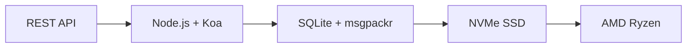

# První kompletní e-mailové API: Jak přeposílání e-mailů způsobilo revoluci ve správě e-mailů {#the-first-complete-email-api-how-forward-email-revolutionized-email-management}


<p class="lead mt-3">
<strong>TL;DR:</strong> Vytvořili jsme první kompletní REST API na světě pro správu e-mailů s pokročilými vyhledávacími funkcemi, které žádná jiná služba nenabízí. Zatímco Gmail, Outlook a Apple nutí vývojáře do pekla IMAP nebo API s omezenou rychlostí, Forward Email nabízí bleskově rychlé operace CRUD pro zprávy, složky, kontakty a kalendáře prostřednictvím jednotného rozhraní REST s více než 15 parametry vyhledávání. Na toto vývojáři e-mailového API čekali.
</p>

## Obsah {#table-of-contents}

* [Problém s e-mailovým API](#the-email-api-problem)
* [Co vývojáři vlastně říkají](#what-developers-are-actually-saying)
* [Revoluční řešení pro přeposílání e-mailů](#forward-emails-revolutionary-solution)
  * [Proč jsme tohle postavili](#why-we-built-this)
  * [Jednoduché ověřování](#simple-authentication)
* [20 koncových bodů, které změní všechno](#20-endpoints-that-change-everything)
  * [Zprávy (5 koncových bodů)](#messages-5-endpoints)
  * [Složky (5 koncových bodů)](#folders-5-endpoints)
  * [Kontakty (5 koncových bodů)](#contacts-5-endpoints)
  * [Kalendáře (5 koncových bodů)](#calendars-5-endpoints)
* [Rozšířené vyhledávání: Žádná jiná služba neporovnává](#advanced-search-no-other-service-compares)
  * [Rozhraní API pro vyhledávání je nefunkční](#the-search-api-landscape-is-broken)
  * [Revoluční vyhledávací API pro Forward Email](#forward-emails-revolutionary-search-api)
  * [Příklady vyhledávání v reálném světě](#real-world-search-examples)
  * [Výhody výkonu](#performance-advantages)
  * [Funkce vyhledávání, které nikdo jiný nemá](#search-features-no-one-else-has)
  * [Proč je to pro vývojáře důležité](#why-this-matters-for-developers)
  * [Technická implementace](#the-technical-implementation)
* [Architektura s bleskově rychlým výkonem](#blazing-fast-performance-architecture)
  * [Výkonnostní benchmarky](#performance-benchmarks)
  * [Architektura zaměřená na soukromí](#privacy-first-architecture)
* [Proč jsme jiní: Kompletní srovnání](#why-were-different-the-complete-comparison)
  * [Omezení hlavních poskytovatelů](#major-provider-limitations)
  * [Výhody přeposílání e-mailů](#forward-email-advantages)
  * [Problém transparentnosti open-source](#the-open-source-transparency-problem)
* [Více než 30 příkladů integrace z reálného světa](#30-real-world-integration-examples)
  * [1. Vylepšení kontaktního formuláře ve WordPressu](#1-wordpress-contact-form-enhancement)
  * [2. Alternativa Zapieru pro automatizaci e-mailů](#2-zapier-alternative-for-email-automation)
  * [3. Synchronizace e-mailů v CRM](#3-crm-email-synchronization)
  * [4. Zpracování objednávek elektronického obchodu](#4-e-commerce-order-processing)
  * [5. Integrace tiketů podpory](#5-support-ticket-integration)
  * [6. Systém pro správu newsletterů](#6-newsletter-management-system)
  * [7. Správa úkolů na základě e-mailu](#7-email-based-task-management)
  * [8. Agregace e-mailů z více účtů](#8-multi-account-email-aggregation)
  * [9. Pokročilý řídicí panel pro analýzu e-mailů](#9-advanced-email-analytics-dashboard)
  * [10. Chytrá archivace e-mailů](#10-smart-email-archiving)
  * [11. Integrace e-mailu s kalendářem](#11-email-to-calendar-integration)
  * [12. Zálohování e-mailů a dodržování předpisů](#12-email-backup-and-compliance)
  * [13. Správa obsahu prostřednictvím e-mailů](#13-email-based-content-management)
  * [14. Správa šablon e-mailů](#14-email-template-management)
  * [15. Automatizace pracovních postupů založená na e-mailech](#15-email-based-workflow-automation)
  * [16. Monitorování zabezpečení e-mailů](#16-email-security-monitoring)
  * [17. Sběr průzkumů na základě e-mailu](#17-email-based-survey-collection)
  * [18. Monitorování výkonu e-mailů](#18-email-performance-monitoring)
  * [19. Kvalifikace leadů na základě e-mailu](#19-email-based-lead-qualification)
  * [20. Řízení projektů prostřednictvím e-mailu](#20-email-based-project-management)
  * [21. Správa zásob na základě e-mailů](#21-email-based-inventory-management)
  * [22. Zpracování faktur prostřednictvím e-mailu](#22-email-based-invoice-processing)
  * [23. Registrace na události prostřednictvím e-mailu](#23-email-based-event-registration)
  * [24. Pracovní postup schvalování dokumentů na základě e-mailu](#24-email-based-document-approval-workflow)
  * [25. Analýza zpětné vazby od zákazníků na základě e-mailů](#25-email-based-customer-feedback-analysis)
  * [26. Náborový kanál založený na e-mailech](#26-email-based-recruitment-pipeline)
  * [27. Zpracování výkazů výdajů na základě e-mailu](#27-email-based-expense-report-processing)
  * [28. Zprávy o zajištění kvality na základě e-mailu](#28-email-based-quality-assurance-reporting)
  * [29. Správa dodavatelů na základě e-mailů](#29-email-based-vendor-management)
  * [30. Monitorování sociálních médií prostřednictvím e-mailů](#30-email-based-social-media-monitoring)
* [Začínáme](#getting-started)
  * [1. Vytvořte si účet pro přesměrování e-mailů](#1-create-your-forward-email-account)
  * [2. Generování přihlašovacích údajů API](#2-generate-api-credentials)
  * [3. Proveďte první volání API](#3-make-your-first-api-call)
  * [4. Prozkoumejte dokumentaci](#4-explore-the-documentation)
* [Technické zdroje](#technical-resources)

## Problém s e-mailovým API {#the-email-api-problem}

E-mailová API rozhraní jsou zásadně nefunkční. Tečka.

Každý velký poskytovatel e-mailových služeb nutí vývojáře k jedné ze dvou hrozných možností:

1. **Peklo IMAP**: Zápas s 30 let starým protokolem určeným pro desktopové klienty, nikoli pro moderní aplikace
2. **Omezená API**: Rozhraní API s omezenou rychlostí, pouze pro čtení a komplexní OAuth, která nedokážou spravovat vaše skutečná e-mailová data

Výsledek? Vývojáři buď zcela opustí integraci e-mailů, nebo ztrácejí týdny budováním křehkých IMAP wrapperů, které neustále porouchávají.

> \[!WARNING]
> **Špinavé tajemství**: Většina „e-mailových API“ jsou pouze odesílací API. Nemůžete programově organizovat složky, synchronizovat kontakty ani spravovat kalendáře prostřednictvím jednoduchého rozhraní REST. Až doteď.

## Co vývojáři vlastně říkají {#what-developers-are-actually-saying}

Frustrace je skutečná a zdokumentovaná všude:

> „Nedávno jsem se pokusil integrovat Gmail do své aplikace a strávil jsem s tím příliš mnoho času. Rozhodl jsem se, že nemá cenu Gmail podporovat.“
>
> *- [Vývojář Hacker News](https://news.ycombinator.com/item?id=42106944), 147 hlasů pro*

> „Jsou všechna e-mailová API průměrná? Zdá se, že jsou nějakým způsobem omezená nebo omezující.“
>
> *- [Diskuse o SaaS na Redditu](https://www.reddit.com/r/SaaS/comments/1cm84s7/are_all_email_apis_mediocre/)*

> „Proč musí být vývoj e-mailů na nic?“
>
> *- [Reddit r/webdev](https://www.reddit.com/r/webdev/comments/15trnp2/why_does_email_development_have_to_suck/), 89 komentářů o problémech vývojáře*

> „Co dělá Gmail API efektivnějším než IMAP? Dalším důvodem, proč je Gmail API mnohem efektivnější, je to, že každou zprávu stačí stáhnout pouze jednou. U IMAP se každá zpráva musí stáhnout a indexovat...“

>> *- [Otázka ohledně přetečení Stacku](https://stackoverflow.com/questions/25431022/what-makes-the-gmail-api-more-efficient-than-imap) s 47 hlasy pro*

Důkazy jsou všude:

* **Problémy s SMTP ve WordPressu**: [631 problémů s GitHubem](https://github.com/awesomemotive/WP-Mail-SMTP/issues) ohledně selhání doručování e-mailů
* **Omezení Zapieru**: [Stížnosti komunity](https://community.zapier.com/featured-articles-65/email-parser-by-zapier-limitations-and-alternatives-16958) limity 10 e-mailů za hodinu a selhání detekce IMAP
* **Projekty IMAP API**: [Násobek](https://github.com/ewildgoose/imap-api) [open-source](https://emailengine.app/) [projekty](https://www.npmjs.com/package/imapflow) existují speciálně pro „převod IMAP na REST“, protože žádný poskytovatel tuto funkci nenabízí
* **Frustrace s Gmail API**: [Přetečení zásobníku](https://stackoverflow.com/questions/tagged/gmail-api) má 4 847 otázek označených štítkem „gmail-api“ s běžnými stížnostmi na limity rychlosti a složitost

## Revoluční řešení pro přeposílání e-mailů {#forward-emails-revolutionary-solution}

Jsme první e-mailovou službou, která nabízí kompletní operace CRUD pro všechna e-mailová data prostřednictvím jednotného REST API.

Toto není jen další odesílací API. Toto je kompletní programová kontrola nad:

* **Zprávy**: Vytváření, čtení, aktualizace, mazání, vyhledávání, přesouvání, označování
* **Složky**: Plná správa složek IMAP prostřednictvím koncových bodů REST
* **Kontakty**: Ukládání a synchronizace kontaktů [CardDAV](https://tools.ietf.org/html/rfc6352)
* **Kalendáře**: Události a plánování kalendáře [CalDAV](https://tools.ietf.org/html/rfc4791)

### Proč jsme toto postavili {#why-we-built-this}

**Problém**: Každý poskytovatel e-mailových služeb zachází s e-mailem jako s černou skříňkou. Můžete posílat e-maily, možná je i číst pomocí komplexního OAuth, ale nemůžete svá e-mailová data skutečně *spravovat* programově.

**Naše vize**: Integrace e-mailu by měla být stejně snadná jako u jakéhokoli moderního API. Žádné knihovny IMAP. Žádná složitost OAuth. Žádné noční můry s omezením rychlosti. Jen jednoduché REST endpointy, které fungují.

**Výsledek**: První e-mailová služba, kde si můžete vytvořit kompletního e-mailového klienta, integraci CRM nebo automatizační systém pouze s využitím HTTP požadavků.

### Jednoduché ověřování {#simple-authentication}

Žádný [Složitost OAuth](https://oauth.net/2/). Žádný [hesla pro konkrétní aplikace](https://support.google.com/accounts/answer/185833). Pouze vaše přihlašovací údaje k aliasu:

```bash
curl -u "alias@yourdomain.com:password" \
  https://api.forwardemail.net/v1/messages
```

## 20 koncových bodů, které změní všechno {#20-endpoints-that-change-everything}

### Zprávy (5 koncových bodů) {#messages-5-endpoints}

* `GET /v1/messages` - Zobrazit zprávy s filtrováním (`?folder=`, `?is_unread=`, `?is_flagged=`)
* `POST /v1/messages` - Odeslat nové zprávy přímo do složek
* `GET /v1/messages/:id` - Načíst konkrétní zprávu s kompletními metadaty
* `PUT /v1/messages/:id` - Aktualizovat zprávu (příznaky, složka, stav přečtení)
* `DELETE /v1/messages/:id` - Trvale smazat zprávu

### Složky (5 koncových bodů) {#folders-5-endpoints}

* `GET /v1/folders` - Zobrazit všechny složky se stavem odběru
* `POST /v1/folders` - Vytvořit novou složku s vlastními vlastnostmi
* `GET /v1/folders/:id` - Zobrazit podrobnosti o složce a počet zpráv
* `PUT /v1/folders/:id` - Aktualizovat vlastnosti složky a odběr
* `DELETE /v1/folders/:id` - Smazat složku a opravit přemístění zpráv

### Kontakty (5 koncových bodů) {#contacts-5-endpoints}

* `GET /v1/contacts` - Zobrazit kontakty s vyhledáváním a stránkováním
* `POST /v1/contacts` - Vytvořit nový kontakt s plnou podporou vCard
* `GET /v1/contacts/:id` - Načíst kontakt se všemi poli a metadaty
* `PUT /v1/contacts/:id` - Aktualizovat kontaktní informace s ověřením ETag
* `DELETE /v1/contacts/:id` - Smazat kontakt s kaskádovým zpracováním

### Kalendáře (5 koncových bodů) {#calendars-5-endpoints}

* `GET /v1/calendars` - Zobrazit události v kalendáři s filtrováním data
* `POST /v1/calendars` - Vytvořit událost v kalendáři s účastníky a opakováním
* `GET /v1/calendars/:id` - Získání podrobností o události s úpravou časového pásma
* `PUT /v1/calendars/:id` - Aktualizace události s detekcí konfliktů
* `DELETE /v1/calendars/:id` - Smazání události s oznámeními účastníkům

## Rozšířené vyhledávání: Žádná jiná služba neporovnává {#advanced-search-no-other-service-compares}

**Forward Email je jediná e-mailová služba, která nabízí komplexní, programatické vyhledávání ve všech polích zprávy prostřednictvím REST API.**

Zatímco ostatní poskytovatelé nabízejí nanejvýš základní filtrování, my jsme vytvořili nejpokročilejší API pro vyhledávání e-mailů, jaké kdy bylo vytvořeno. Žádné API Gmailu, API Outlooku ani žádná jiná služba se našim vyhledávacím možnostem ani zdaleka neblíží.

### Rozhraní Vyhledávacího API je nefunkční {#the-search-api-landscape-is-broken}

**Omezení vyhledávání v Gmail API:**

* ✅ Pouze základní parametr `q`
* ❌ Žádné vyhledávání podle konkrétního pole
* ❌ Žádné filtrování podle rozsahu dat
* ❌ Žádné filtrování podle velikosti
* ❌ Žádné filtrování příloh
* ❌ Omezeno na syntaxi vyhledávání Gmailu

Omezení vyhledávání v Outlook API:

* ✅ Základní parametr `$search`
* ❌ Žádné pokročilé cílení na pole
* ❌ Žádné složité kombinace dotazů
* ❌ Agresivní omezení rychlosti
* ❌ Vyžaduje se složitá syntaxe OData

**Apple iCloud:**

* ❌ Žádné API
* ❌ Vyhledávání pouze přes IMAP (pokud se vám to podaří zprovoznit)

**ProtonMail a Tuta:**

* ❌ Žádná veřejná API
* ❌ Žádné funkce programového vyhledávání

### Revoluční vyhledávací API pro přeposílání e-mailů {#forward-emails-revolutionary-search-api}

**Nabízíme více než 15 vyhledávacích parametrů, které žádná jiná služba nenabízí:**

| Vyhledávací funkce | Přeposlat e-mail | API Gmailu | API pro Outlook | Ostatní |
| ------------------------------ | -------------------------------------- | ------------ | ------------------ | ------ |
| **Vyhledávání podle konkrétního pole** | ✅ Předmět, tělo, odesílatel, komu, kopie, záhlaví | ❌ | ❌ | ❌ |
| **Víceoborové obecné vyhledávání** | ✅ `?search=` ve všech polích | ✅ Základní `q=` | ✅ Základní `$search=` | ❌ |
| **Filtrování podle rozsahu dat** | ✅ `?since=` & `?before=` | ❌ | ❌ | ❌ |
| **Filtrování podle velikosti** | ✅ `?min_size=` & `?max_size=` | ❌ | ❌ | ❌ |
| **Filtrování příloh** | ✅ `?has_attachments=true/false` | ❌ | ❌ | ❌ |
| **Vyhledávání v záhlaví** | ✅ `?headers=X-Priority` | ❌ | ❌ | ❌ |
| **Vyhledávání ID zprávy** | ✅ `?message_id=abc123` | ❌ | ❌ | ❌ |
| **Kombinované filtry** | ✅ Více parametrů s logickým operátorem AND | ❌ | ❌ | ❌ |
| **Nerozlišuje velká a malá písmena** | ✅ Všechna vyhledávání | ✅ | ✅ | ❌ |
| **Podpora stránkování** | ✅ Funguje se všemi parametry vyhledávání | ✅ | ✅ | ❌ |

### Příklady vyhledávání v reálném světě {#real-world-search-examples}

**Najít všechny faktury z minulého čtvrtletí:**

```bash
# Forward Email - Simple and powerful
GET /v1/messages?subject=invoice&since=2024-01-01T00:00:00Z&before=2024-04-01T00:00:00Z

# Gmail API - Impossible with their limited search
# No date range filtering available

# Outlook API - Complex OData syntax, limited functionality
GET /me/messages?$search="invoice"&$filter=receivedDateTime ge 2024-01-01T00:00:00Z
```

**Hledat velké přílohy od konkrétního odesílatele:**

```bash
# Forward Email - Comprehensive filtering
GET /v1/messages?from=finance@company.com&has_attachments=true&min_size=1000000

# Gmail API - Cannot filter by size or attachments programmatically
# Outlook API - No size filtering available
# Others - No APIs available
```

**Komplexní vyhledávání ve více polích:**

```bash
# Forward Email - Advanced query capabilities
GET /v1/messages?body=quarterly&from=manager&is_flagged=true&folder=Reports

# Gmail API - Limited to basic text search only
GET /gmail/v1/users/me/messages?q=quarterly

# Outlook API - Basic search without field targeting
GET /me/messages?$search="quarterly"
```

### Výhody výkonu {#performance-advantages}

**Výkon vyhledávání přeposílaných e-mailů:**

* ⚡ **Doba odezvy pod 100 ms** pro komplexní vyhledávání
* 🔍 **Optimalizace regulárních výrazů** se správným indexováním
* 📊 **Paralelní provádění dotazů** pro počet a data
* 💾 **Efektivní využití paměti** s optimalizovanými dotazy

**Problémy s výkonem konkurence:**

* 🐌 **Gmail API**: Rychlost omezena na 250 kvótových jednotek na uživatele za sekundu
* 🐌 **Outlook API**: Agresivní omezování s komplexními požadavky na omezení přístupu
* 🐌 **Ostatní**: Žádná API pro porovnání

### Funkce vyhledávání, které nikdo jiný nemá {#search-features-no-one-else-has}

#### 1. Vyhledávání specifické pro záhlaví {#1-header-specific-search}

```bash
# Find messages with specific headers
GET /v1/messages?headers=X-Priority:1
GET /v1/messages?headers=X-Spam-Score
```

#### 2. Inteligence založená na velikosti {#2-size-based-intelligence}

```bash
# Find newsletter emails (typically large)
GET /v1/messages?min_size=50000&from=newsletter

# Find quick replies (typically small)
GET /v1/messages?max_size=1000&to=support
```

#### 3. Pracovní postupy založené na přílohách {#3-attachment-based-workflows}

```bash
# Find all documents sent to legal team
GET /v1/messages?to=legal&has_attachments=true&body=contract

# Find emails without attachments for cleanup
GET /v1/messages?has_attachments=false&before=2023-01-01T00:00:00Z
```

#### 4. Kombinovaná obchodní logika {#4-combined-business-logic}

```bash
# Find urgent flagged messages from VIPs with attachments
GET /v1/messages?is_flagged=true&from=ceo&has_attachments=true&subject=urgent
```

### Proč je to pro vývojáře důležité {#why-this-matters-for-developers}

**Vytvářejte aplikace, které dříve nebyly možné:**

1. **Pokročilá analýza e-mailů**: Analyzujte vzorce e-mailů podle velikosti, odesílatele a obsahu
2. **Inteligentní správa e-mailů**: Automatická organizace na základě komplexních kritérií
3. **Dodržování předpisů a vyhledávání**: Vyhledávání konkrétních e-mailů pro splnění právních požadavků
4. **Business Intelligence**: Získávání poznatků ze vzorců e-mailové komunikace
5. **Automatizované pracovní postupy**: Spouštění akcí na základě sofistikovaných filtrů e-mailů

### Technická implementace {#the-technical-implementation}

Naše vyhledávací API používá:

* **Optimalizace regulárních výrazů** se správnými strategiemi indexování
* **Paralelní provádění** pro výkon
* **Ověřování vstupu** pro bezpečnost
* **Komplexní ošetření chyb** pro spolehlivost

```javascript
// Example: Complex search implementation
const searchConditions = [];

if (ctx.query.subject) {
  searchConditions.push({
    subject: { $regex: ctx.query.subject, $options: 'i' }
  });
}

if (ctx.query.from) {
  searchConditions.push({
    $or: [
      { 'from.address': { $regex: ctx.query.from, $options: 'i' } },
      { 'from.name': { $regex: ctx.query.from, $options: 'i' } }
    ]
  });
}

// Combine with AND logic
if (searchConditions.length > 0) {
  query.$and = searchConditions;
}
```

> \[!TIP]
> **Výhoda pro vývojáře**: S vyhledávacím API služby Forward Email můžete vytvářet e-mailové aplikace, které svou funkčností konkurují desktopovým klientům, a zároveň si zachovávají jednoduchost rozhraní REST API.

## Architektura s bleskově rychlým výkonem {#blazing-fast-performance-architecture}

Náš technický stack je postaven na rychlosti a spolehlivosti:



### Srovnávací kritéria výkonu {#performance-benchmarks}

**Proč jsme bleskově rychlí:**

| Komponent | Technologie | Výhoda výkonu |
| ------------ | --------------------------------------------------------------------------------- | --------------------------------------------- |
| **Skladování** | [NVMe SSD](https://en.wikipedia.org/wiki/NVM_Express) | 10x rychlejší než tradiční SATA |
| **Databáze** | [SQLite](https://sqlite.org/) + [msgpackr](https://github.com/kriszyp/msgpackr) | Nulová latence sítě, optimalizovaná serializace |
| **Železářské zboží** | [AMD Ryzen](https://www.amd.com/en/products/processors/desktops/ryzen) holý kov | Žádné režijní náklady na virtualizaci |
| **Ukládání do mezipaměti** | V paměti + perzistentní | Doby odezvy v řádu milisekund |
| **Zálohy** | [Cloudflare R2](https://www.cloudflare.com/products/r2/) šifrováno | Spolehlivost na podnikové úrovni |

**Skutečná výkonnostní čísla:**

* **Doba odezvy API**: < 50 ms průměr
* **Načítání zpráv**: < 10 ms pro zprávy uložené v mezipaměti
* **Operace se složkami**: < 5 ms pro operace s metadaty
* **Synchronizace kontaktů**: více než 1000 kontaktů/sekundu
* **Provozní doba**: 99,99% SLA s redundantní infrastrukturou

### Architektura zaměřená na ochranu soukromí {#privacy-first-architecture}

**Design s nulovými znalostmi**: Přístup máte pouze vy s heslem IMAP – my nemůžeme číst vaše e-maily. Náš [architektura s nulovými znalostmi](https://forwardemail.net/en/security) zajišťuje naprosté soukromí a zároveň poskytuje skvělý výkon.

## Proč jsme jiní: Kompletní srovnání {#why-were-different-the-complete-comparison}

### Omezení hlavních poskytovatelů {#major-provider-limitations}

| Poskytovatel | Základní problémy | Specifická omezení |
| ---------------- | ----------------------------------------- | -------------------------------------------------------------------------------------------------------------------------------------------------------------------------------------------------------------------------------------------------------------------------------------------------------------------------------------------------------------------------------------------------------------------------------------------------------------------- |
| **Gmail API** | Pouze pro čtení, komplexní OAuth, samostatná API | • [Cannot modify existing messages](https://developers.google.com/gmail/api/reference/rest/v1/users.messages)<br>• [Labels ≠ folders](https://developers.google.com/gmail/api/reference/rest/v1/users.labels)<br>• [1 billion quota units/day limit](https://developers.google.com/gmail/api/reference/quota)<br>• [Requires separate APIs](https://developers.google.com/workspace) pro kontakty/kalendář |
| **Rozhraní API pro Outlook** | Zastaralé, matoucí, zaměřené na podniky | • [REST endpoints deprecated March 2024](https://learn.microsoft.com/en-us/outlook/rest/compare-graph)<br>• [Multiple confusing APIs](https://learn.microsoft.com/en-us/office/client-developer/outlook/selecting-an-api-or-technology-for-developing-solutions-for-outlook) (EWS, Graf, REST)<br>• [Microsoft Graph complexity](https://learn.microsoft.com/en-us/graph/overview)<br>• [Aggressive throttling](https://learn.microsoft.com/en-us/graph/throttling) |
| **Apple iCloud** | Žádné veřejné API | • [No public API whatsoever](https://support.apple.com/en-us/102654)<br>• [IMAP-only with 1000 emails/day limit](https://support.apple.com/en-us/102654)<br>• [App-specific passwords required](https://support.apple.com/en-us/102654)<br>• [500 recipients per message limit](https://support.apple.com/en-us/102654) |
| **ProtonMail** | Žádné API, falešná tvrzení o open-source | • [No public API available](https://proton.me/support/protonmail-bridge-clients)<br>• [Bridge software required](https://proton.me/mail/bridge) pro přístup IMAP<br>• [Claims "open source"](https://proton.me/blog/open-source) ale [server code is proprietary](https://github.com/ProtonMail)<br>• [Limited to paid plans only](https://proton.me/pricing) |
| **Celkový** | Žádné API, zavádějící transparentnost | • [No REST API for email management](https://tuta.com/support#technical)<br>• [Claims "open source"](https://tuta.com/blog/posts/open-source-email) ale [backend is closed](https://github.com/tutao/tutanota)<br>• [IMAP/SMTP not supported](https://tuta.com/support#imap)<br>• [Proprietary encryption](https://tuta.com/encryption) brání standardním integracím |
| **E-mail Zapier** | Přísné limity rychlosti | • [10 emails per hour limit](https://help.zapier.com/hc/en-us/articles/8496181555597-Email-Parser-by-Zapier-limitations-and-alternatives)<br>• [No IMAP folder access](https://help.zapier.com/hc/en-us/articles/8496181555597-Email-Parser-by-Zapier-limitations-and-alternatives)<br>• [Limited parsing capabilities](https://help.zapier.com/hc/en-us/articles/8496181555597-Email-Parser-by-Zapier-limitations-and-alternatives) |

### Výhody přeposílání e-mailů {#forward-email-advantages}

| Funkce | Přeposlat e-mail | Soutěž |
| ------------------ | -------------------------------------------------------------------------------------------- | ----------------------------------------- |
| **Kompletní CRUD** | ✅ Úplné vytváření, čtení, aktualizace a mazání všech dat | ❌ Operace pouze pro čtení nebo omezené operace |
| **Sjednocené API** | ✅ Zprávy, složky, kontakty, kalendáře v jednom API | ❌ Samostatná API nebo chybějící funkce |
| **Jednoduché ověření** | ✅ Základní ověřování s aliasovými přihlašovacími údaji | ❌ Komplexní OAuth s více obory |
| **Žádné limity sazeb** | ✅ Velkorysé limity navržené pro reálné aplikace | ❌ Omezující kvóty, které narušují pracovní postupy |
| **Vlastní hosting** | ✅ [Complete self-hosting option](https://forwardemail.net/en/blog/docs/self-hosted-solution) | ❌ Pouze vázání na dodavatele |
| **Soukromí** | ✅ Bez znalostí, šifrované, soukromé | ❌ Těžba dat a obavy o soukromí |
| **Výkon** | ✅ Odezva pod 50 ms, úložiště NVMe | ❌ Latence sítě, zpoždění způsobená omezením |

### Problém transparentnosti open-source {#the-open-source-transparency-problem}

**ProtonMail a Tuta se propagují jako „open source“ a „transparentní“, ale jedná se o zavádějící marketing, který porušuje moderní zásady ochrany osobních údajů.**

> \[!WARNING]
> **Nepravdivá tvrzení o transparentnosti**: ProtonMail i Tuta prominentně propagují své „open source“ certifikace, zatímco svůj nejdůležitější kód na straně serveru uchovávají proprietární a důvěrný.

**Podvod ProtonMailu:**

* **Tvrzení**: [„Jsme open source“](https://proton.me/blog/open-source) prominentně uvedeno v marketingu
* **Realita**: [Kód serveru je zcela proprietární](https://github.com/ProtonMail) - pouze klientské aplikace jsou open source
* **Dopad**: Uživatelé nemohou ověřit šifrování na straně serveru, zpracování dat ani tvrzení o porušení soukromí
* **Porušení transparentnosti**: Neexistuje způsob, jak auditovat skutečné systémy zpracování a ukládání e-mailů

**Tutův zavádějící marketing:**

* **Tvrzení**: [„E-mail s otevřeným zdrojovým kódem“](https://tuta.com/blog/posts/open-source-email) jako klíčový prodejní argument
* **Realita**: [Backendová infrastruktura je uzavřeného zdrojového kódu](https://github.com/tutao/tutanota) - k dispozici je pouze frontend
* **Dopad**: Proprietární šifrování brání standardním e-mailovým protokolům (IMAP/SMTP)
* **Strategie uzamčení**: Vlastní šifrování vynucuje závislost na dodavateli

**Proč je to důležité pro moderní soukromí:**

V roce 2025 vyžaduje skutečné soukromí **úplnou transparentnost**. Když poskytovatelé e-mailů tvrdí, že mají „otevřený zdrojový kód“, ale skrývají kód svého serveru:

1. **Neověřitelné šifrování**: Nemůžete auditovat, jak jsou vaše data skutečně šifrována.
2. **Skryté postupy pro práci se daty**: Zpracování dat na straně serveru zůstává černou skříňkou.
3. **Zabezpečení založené na důvěře**: Musíte důvěřovat jejich tvrzením bez ověření.
4. **Uzamčení dodavatele**: Proprietární systémy brání přenositelnosti dat.

**Skutečná transparentnost přeposílaných e-mailů:**

* ✅ **[Kompletní open source](https://github.com/forwardemail/forwardemail.net)** - kód serveru a klienta
* ✅ **[Možnost vlastního hostingu](https://forwardemail.net/en/blog/docs/self-hosted-solution)** - spuštění vlastní instance
* ✅ **Standardní protokoly** - kompatibilita s IMAP, SMTP, CardDAV, CalDAV
* ✅ **Auditovatelné zabezpečení** - každý řádek kódu lze zkontrolovat
* ✅ **Žádná vazba na dodavatele** - vaše data, vaše kontrola

> \[!TIP]
> **Skutečně otevřený zdrojový kód znamená, že si můžete ověřit každé tvrzení.** S Forward Email můžete auditovat naše šifrování, kontrolovat, jak nakládáme s daty, a dokonce i spustit vlastní instanci. To je skutečná transparentnost.

## Více než 30 příkladů integrace z reálného světa {#30-real-world-integration-examples}

### 1. Vylepšení kontaktního formuláře WordPressu {#1-wordpress-contact-form-enhancement}

**Problém**: [Chyby konfigurace SMTP ve WordPressu](https://github.com/awesomemotive/WP-Mail-SMTP/issues) ([631 problémů s GitHubem](https://github.com/awesomemotive/WP-Mail-SMTP/issues))
**Řešení**: Přímá integrace API zcela obchází [SMTP](https://tools.ietf.org/html/rfc5321)

```javascript
// WordPress contact form that saves to Sent folder
await fetch('https://api.forwardemail.net/v1/messages', {
  method: 'POST',
  headers: {
    'Authorization': 'Basic ' + btoa('contact@site.com:password'),
    'Content-Type': 'application/json'
  },
  body: JSON.stringify({
    to: [{ address: 'owner@site.com' }],
    subject: 'Contact Form: ' + formData.subject,
    text: formData.message,
    folder: 'Sent'
  })
});
```

### 2. Alternativa k Zapieru pro automatizaci e-mailů {#2-zapier-alternative-for-email-automation}

**Problém**: [Limit 10 e-mailů za hodinu od Zapieru](https://help.zapier.com/hc/en-us/articles/8496181555597-Email-Parser-by-Zapier-limitations-and-alternatives) a [Chyby detekce IMAP](https://community.zapier.com/featured-articles-65/email-parser-by-zapier-limitations-and-alternatives-16958)
**Řešení**: Neomezená automatizace s plnou kontrolou e-mailů

```javascript
// Auto-organize emails by sender domain
const messages = await fetch('/v1/messages?folder=INBOX');
for (const message of messages) {
  const domain = message.from.split('@')[1];
  await fetch(`/v1/messages/${message.id}`, {
    method: 'PUT',
    body: JSON.stringify({ folder: `Clients/${domain}` })
  });
}
```

### 3. Synchronizace e-mailů CRM {#3-crm-email-synchronization}

**Problém**: Ruční správa kontaktů mezi e-mailem a [CRM systémy](https://en.wikipedia.org/wiki/Customer_relationship_management)
**Řešení**: Obousměrná synchronizace s rozhraním API pro kontakty [CardDAV](https://tools.ietf.org/html/rfc6352)

```javascript
// Sync new email contacts to CRM
const newContacts = await fetch('/v1/contacts');
for (const contact of newContacts) {
  await crmAPI.createContact({
    name: contact.name,
    email: contact.email,
    source: 'email_api'
  });
}
```

### 4. Zpracování objednávek elektronického obchodu {#4-e-commerce-order-processing}

**Problém**: Ruční zpracování e-mailů s objednávkami pro [platformy elektronického obchodování](https://en.wikipedia.org/wiki/E-commerce)
**Řešení**: Automatizovaný proces správy objednávek

```javascript
// Process order confirmation emails
const orders = await fetch('/v1/messages?folder=Orders');
const orderEmails = orders.filter(msg =>
  msg.subject.includes('Order Confirmation')
);

for (const order of orderEmails) {
  const orderData = parseOrderEmail(order.text);
  await updateInventory(orderData);
  await fetch(`/v1/messages/${order.id}`, {
    method: 'PUT',
    body: JSON.stringify({ folder: 'Orders/Processed' })
  });
}
```

### 5. Integrace tiketů podpory {#5-support-ticket-integration}

**Problém**: Vlákna e-mailů roztroušena v [platformy helpdesku](https://en.wikipedia.org/wiki/Help_desk_software)
**Řešení**: Dokončete sledování vláken e-mailů

```javascript
// Create support ticket from email thread
const messages = await fetch('/v1/messages?folder=Support');
const supportEmails = messages.filter(msg =>
  msg.to.some(addr => addr.includes('support@'))
);

for (const email of supportEmails) {
  const ticket = await supportSystem.createTicket({
    subject: email.subject,
    from: email.from,
    body: email.text,
    timestamp: email.date
  });
}
```

### 6. Systém pro správu newsletterů {#6-newsletter-management-system}

**Problém**: Omezené integrace [platforma pro newslettery](https://en.wikipedia.org/wiki/Email_marketing)
**Řešení**: Kompletní správa životního cyklu předplatitele

```javascript
// Auto-manage newsletter subscriptions
const messages = await fetch('/v1/messages?folder=Newsletter');
const unsubscribes = messages.filter(msg =>
  msg.subject.toLowerCase().includes('unsubscribe')
);

for (const msg of unsubscribes) {
  await removeSubscriber(msg.from);
  await fetch(`/v1/messages/${msg.id}`, {
    method: 'PUT',
    body: JSON.stringify({ folder: 'Newsletter/Unsubscribed' })
  });
}
```

### 7. Správa úkolů na základě e-mailu {#7-email-based-task-management}

**Problém**: Zahlcení doručené pošty a [sledování úkolů](https://en.wikipedia.org/wiki/Task_management)
**Řešení**: Převeďte e-maily na úkoly, které lze provést

```javascript
// Create tasks from flagged emails
const messages = await fetch('/v1/messages?is_flagged=true');
for (const email of messages) {
  await taskManager.createTask({
    title: email.subject,
    description: email.text,
    assignee: email.to[0].address,
    dueDate: extractDueDate(email.text)
  });
}
```

### 8. Agregace e-mailů z více účtů {#8-multi-account-email-aggregation}

**Problém**: Správa [více e-mailových účtů](https://en.wikipedia.org/wiki/Email_client) napříč poskytovateli
**Řešení**: Sjednocené rozhraní doručené pošty

```javascript
// Aggregate emails from multiple accounts
const accounts = ['work@domain.com', 'personal@domain.com'];
const allMessages = [];

for (const account of accounts) {
  const messages = await fetch('/v1/messages', {
    headers: { 'Authorization': getAuth(account) }
  });
  allMessages.push(...messages.map(m => ({ ...m, account })));
}
```

### 9. Panel pokročilé analýzy e-mailů {#9-advanced-email-analytics-dashboard}

**Problém**: Žádné informace o [vzory e-mailů](https://en.wikipedia.org/wiki/Email_analytics) s propracovaným filtrováním
**Řešení**: Vlastní analýza e-mailů s využitím pokročilých vyhledávacích funkcí

```javascript
// Generate comprehensive email analytics using advanced search
const analytics = {};

// Analyze email volume by sender domain
const messages = await fetch('/v1/messages');
analytics.senderDomains = analyzeSenderDomains(messages);

// Find large attachments consuming storage
const largeAttachments = await fetch('/v1/messages?has_attachments=true&min_size=1000000');
analytics.storageHogs = largeAttachments.map(msg => ({
  subject: msg.subject,
  from: msg.from,
  size: msg.size
}));

// Analyze communication patterns with VIPs
const vipEmails = await fetch('/v1/messages?from=ceo@company.com');
const urgentVipEmails = await fetch('/v1/messages?from=ceo@company.com&subject=urgent');
analytics.vipCommunication = {
  total: vipEmails.length,
  urgent: urgentVipEmails.length,
  urgencyRate: (urgentVipEmails.length / vipEmails.length) * 100
};

// Find unread emails by date range for follow-up
const lastWeek = new Date(Date.now() - 7 * 24 * 60 * 60 * 1000).toISOString();
const unreadRecent = await fetch(`/v1/messages?is_unread=true&since=${lastWeek}`);
analytics.followUpNeeded = unreadRecent.length;

// Analyze email sizes for optimization
const smallEmails = await fetch('/v1/messages?max_size=1000');
const mediumEmails = await fetch('/v1/messages?min_size=1000&max_size=50000');
const largeEmails = await fetch('/v1/messages?min_size=50000');
analytics.sizeDistribution = {
  small: smallEmails.length,
  medium: mediumEmails.length,
  large: largeEmails.length
};

// Search for compliance-related emails
const complianceEmails = await fetch('/v1/messages?body=confidential&has_attachments=true');
analytics.complianceReview = complianceEmails.length;
```

### 10. Inteligentní archivace e-mailů {#10-smart-email-archiving}

**Problém**: Ruční [organizace e-mailů](https://en.wikipedia.org/wiki/Email_management)
**Řešení**: Inteligentní kategorizace e-mailů

```javascript
// Auto-archive old emails by category
const messages = await fetch('/v1/messages');
const oldEmails = messages.filter(email =>
  isOlderThan(email.date, 90) // 90 days
);

for (const email of oldEmails) {
  const category = categorizeEmail(email);
  await fetch(`/v1/messages/${email.id}`, {
    method: 'PUT',
    body: JSON.stringify({ folder: `Archive/${category}` })
  });
}
```

### 11. Integrace e-mailu s kalendářem {#11-email-to-calendar-integration}

**Problém**: Ruční vytváření [událost v kalendáři](https://tools.ietf.org/html/rfc4791) z e-mailů
**Řešení**: Automatická extrakce a vytváření událostí

```javascript
// Extract meeting details from emails
const messages = await fetch('/v1/messages?folder=Meetings');
const meetingEmails = messages.filter(email =>
  email.subject.toLowerCase().includes('meeting')
);

for (const email of meetingEmails) {
  const meetingData = extractMeetingInfo(email.text);
  if (meetingData.date && meetingData.time) {
    await fetch('/v1/calendars', {
      method: 'POST',
      body: JSON.stringify({
        title: email.subject,
        start: meetingData.datetime,
        attendees: [email.from, ...email.to]
      })
    });
  }
}
```

### 12. Zálohování a dodržování předpisů pro e-maily {#12-email-backup-and-compliance}

**Problém**: [Uchovávání e-mailů](https://en.wikipedia.org/wiki/Email_retention_policy) a požadavky na shodu s předpisy
**Řešení**: Automatizované zálohování s uchováním metadat

```javascript
// Backup emails with full metadata
const allMessages = await fetch('/v1/messages');
const backup = {
  timestamp: new Date(),
  messages: allMessages.map(msg => ({
    id: msg.id,
    subject: msg.subject,
    from: msg.from,
    to: msg.to,
    date: msg.date,
    flags: msg.flags
  }))
};
await saveToComplianceStorage(backup);
```

### 13. Správa obsahu na základě e-mailů {#13-email-based-content-management}

**Problém**: Správa obsahu odesílaného e-mailem pro [CMS platformy](https://en.wikipedia.org/wiki/Content_management_system)
**Řešení**: E-mail jako systém pro správu obsahu

```javascript
// Process content submissions from email
const messages = await fetch('/v1/messages?folder=Submissions');
const submissions = messages.filter(msg =>
  msg.to.some(addr => addr.includes('submit@'))
);

for (const submission of submissions) {
  const content = parseSubmission(submission.text);
  await cms.createDraft({
    title: submission.subject,
    content: content.body,
    author: submission.from
  });
}
```

### 14. Správa šablon e-mailů {#14-email-template-management}

**Problém**: Nekonzistentní [šablony e-mailů](https://en.wikipedia.org/wiki/Email_template) v rámci týmu
**Řešení**: Centralizovaný systém šablon s API

```javascript
// Send templated emails with dynamic content
const template = await getEmailTemplate('welcome');
await fetch('/v1/messages', {
  method: 'POST',
  body: JSON.stringify({
    to: [{ address: newUser.email }],
    subject: template.subject.replace('{{name}}', newUser.name),
    html: template.html.replace('{{name}}', newUser.name),
    folder: 'Sent'
  })
});
```

### 15. Automatizace pracovních postupů založená na e-mailech {#15-email-based-workflow-automation}

**Problém**: Ruční nastavení [schvalovací procesy](https://en.wikipedia.org/wiki/Workflow) e-mailem
**Řešení**: Automatizované spouštěče pracovního postupu

```javascript
// Process approval emails
const messages = await fetch('/v1/messages?folder=Approvals');
const approvals = messages.filter(msg =>
  msg.subject.includes('APPROVAL')
);

for (const approval of approvals) {
  const decision = parseApprovalDecision(approval.text);
  await workflow.processApproval({
    requestId: extractRequestId(approval.subject),
    decision: decision,
    approver: approval.from
  });
}
```

### 16. Monitorování zabezpečení e-mailu {#16-email-security-monitoring}

**Problém**: Ruční [detekce bezpečnostních hrozeb](https://en.wikipedia.org/wiki/Email_security)
**Řešení**: Automatizovaná analýza hrozeb

```javascript
// Monitor for suspicious emails
const recentEmails = await fetch('/v1/messages');
for (const email of recentEmails) {
  const threatScore = analyzeThreat(email);
  if (threatScore > 0.8) {
    await fetch(`/v1/messages/${email.id}`, {
      method: 'PUT',
      body: JSON.stringify({ folder: 'Security/Quarantine' })
    });
    await alertSecurityTeam(email);
  }
}
```

### 17. Sbírka průzkumů založená na e-mailech {#17-email-based-survey-collection}

**Problém**: Ruční zpracování [odpověď na průzkum](https://en.wikipedia.org/wiki/Survey_methodology)
**Řešení**: Automatická agregace odpovědí

```javascript
// Collect and process survey responses
const messages = await fetch('/v1/messages?folder=Surveys');
const responses = messages.filter(msg =>
  msg.subject.includes('Survey Response')
);

const surveyData = responses.map(email => ({
  respondent: email.from,
  responses: parseSurveyData(email.text),
  timestamp: email.date
}));
await updateSurveyResults(surveyData);
```

### 18. Monitorování výkonu e-mailů {#18-email-performance-monitoring}

**Problém**: Žádný přehled o [výkon doručování e-mailů](https://en.wikipedia.org/wiki/Email_deliverability)
**Řešení**: Metriky e-mailů v reálném čase

```javascript
// Monitor email delivery performance
const sentEmails = await fetch('/v1/messages?folder=Sent');
const deliveryStats = {
  sent: sentEmails.length,
  bounces: await countBounces(),
  deliveryRate: calculateDeliveryRate()
};
await updateDashboard(deliveryStats);
```

### 19. Kvalifikace potenciálního zákazníka na základě e-mailu {#19-email-based-lead-qualification}

**Problém**: Ruční nastavení [bodování vedení](https://en.wikipedia.org/wiki/Lead_scoring) z e-mailových interakcí
**Řešení**: Automatizovaný proces kvalifikace potenciálních zákazníků

```javascript
// Score leads based on email engagement
const prospects = await fetch('/v1/contacts');
for (const prospect of prospects) {
  const messages = await fetch('/v1/messages');
  const emails = messages.filter(msg =>
    msg.from.includes(prospect.email)
  );
  const score = calculateEngagementScore(emails);
  await crm.updateLeadScore(prospect.id, score);
}
```

### 20. Řízení projektů prostřednictvím e-mailu {#20-email-based-project-management}

**Problém**: [Aktualizace projektu](https://en.wikipedia.org/wiki/Project_management) rozptýlený v různých e-mailových vláknech
**Řešení**: Centralizované komunikační centrum projektu

```javascript
// Extract project updates from emails
const messages = await fetch('/v1/messages?folder=Projects');
const projectEmails = messages.filter(msg =>
  msg.subject.includes('Project Update')
);

for (const email of projectEmails) {
  const update = parseProjectUpdate(email.text);
  await projectManager.addUpdate({
    project: update.projectId,
    author: email.from,
    content: update.content
  });
}
```

### 21. Správa zásob na základě e-mailů {#21-email-based-inventory-management}

**Problém**: Ruční aktualizace zásob z e-mailů od dodavatelů
**Řešení**: Automatické sledování zásob z e-mailových oznámení

```javascript
// Process inventory updates from supplier emails
const messages = await fetch('/v1/messages?folder=Suppliers');
const inventoryEmails = messages.filter(msg =>
  msg.subject.includes('Inventory Update') || msg.subject.includes('Stock Alert')
);

for (const email of inventoryEmails) {
  const inventoryData = parseInventoryUpdate(email.text);
  await inventory.updateStock({
    sku: inventoryData.sku,
    quantity: inventoryData.quantity,
    supplier: email.from,
    timestamp: email.date
  });

  // Move to processed folder
  await fetch(`/v1/messages/${email.id}`, {
    method: 'PUT',
    body: JSON.stringify({ folder: 'Suppliers/Processed' })
  });
}
```

### 22. Zpracování faktur na základě e-mailu {#22-email-based-invoice-processing}

**Problém**: Ruční integrace [zpracování faktur](https://en.wikipedia.org/wiki/Invoice_processing) a účetnictví
**Řešení**: Automatická extrakce faktur a synchronizace účetního systému

```javascript
// Extract invoice data from email attachments
const messages = await fetch('/v1/messages?folder=Invoices');
const invoiceEmails = messages.filter(msg =>
  msg.subject.toLowerCase().includes('invoice') && msg.attachments.length > 0
);

for (const email of invoiceEmails) {
  const invoiceData = await extractInvoiceData(email.attachments[0]);
  await accounting.createInvoice({
    vendor: email.from,
    amount: invoiceData.total,
    dueDate: invoiceData.dueDate,
    items: invoiceData.lineItems
  });

  // Flag as processed
  await fetch(`/v1/messages/${email.id}`, {
    method: 'PUT',
    body: JSON.stringify({ flags: ['\\Seen', '\\Flagged'] })
  });
}
```

### 23. Registrace na akci prostřednictvím e-mailu {#23-email-based-event-registration}

**Problém**: Ruční zpracování [registrace na akci](https://en.wikipedia.org/wiki/Event_management) z e-mailových odpovědí
**Řešení**: Automatizovaná správa účastníků a integrace kalendáře

```javascript
// Process event registration emails
const messages = await fetch('/v1/messages?folder=Events');
const registrations = messages.filter(msg =>
  msg.subject.includes('Registration') || msg.subject.includes('RSVP')
);

for (const registration of registrations) {
  const attendeeData = parseRegistration(registration.text);

  // Add to attendee list
  await events.addAttendee({
    event: attendeeData.eventId,
    name: attendeeData.name,
    email: registration.from,
    dietary: attendeeData.dietaryRestrictions
  });

  // Create calendar event for attendee
  await fetch('/v1/calendars', {
    method: 'POST',
    body: JSON.stringify({
      title: attendeeData.eventName,
      start: attendeeData.eventDate,
      attendees: [registration.from]
    })
  });
}
```

### 24. Pracovní postup schvalování dokumentů na základě e-mailu {#24-email-based-document-approval-workflow}

**Problém**: Složité řetězce [schválení dokumentu](https://en.wikipedia.org/wiki/Document_management_system) prostřednictvím e-mailu
**Řešení**: Automatizované sledování schvalování a verzování dokumentů

```javascript
// Track document approval workflow
const messages = await fetch('/v1/messages?folder=Approvals');
const approvalEmails = messages.filter(msg =>
  msg.subject.includes('Document Approval')
);

for (const email of approvalEmails) {
  const approval = parseApprovalEmail(email.text);

  await documentSystem.updateApproval({
    documentId: approval.documentId,
    approver: email.from,
    status: approval.decision, // 'approved', 'rejected', 'needs_changes'
    comments: approval.comments,
    timestamp: email.date
  });

  // Check if all approvals complete
  const document = await documentSystem.getDocument(approval.documentId);
  if (document.allApprovalsComplete) {
    await documentSystem.finalizeDocument(approval.documentId);
  }
}
```

### 25. Analýza zpětné vazby od zákazníků na základě e-mailu {#25-email-based-customer-feedback-analysis}

**Problém**: Ruční sběr [zpětná vazba od zákazníků](https://en.wikipedia.org/wiki/Customer_feedback) a analýza sentimentu
**Řešení**: Automatizované zpracování zpětné vazby a sledování sentimentu

```javascript
// Analyze customer feedback from emails
const messages = await fetch('/v1/messages?folder=Feedback');
const feedbackEmails = messages.filter(msg =>
  msg.to.some(addr => addr.includes('feedback@'))
);

for (const email of feedbackEmails) {
  const sentiment = await analyzeSentiment(email.text);
  const category = categorizeFeeback(email.text);

  await feedback.recordFeedback({
    customer: email.from,
    content: email.text,
    sentiment: sentiment.score, // -1 to 1
    category: category, // 'bug', 'feature', 'complaint', 'praise'
    priority: calculatePriority(sentiment, category),
    timestamp: email.date
  });

  // Auto-escalate negative feedback
  if (sentiment.score < -0.5) {
    await escalateToSupport(email);
  }
}
```

### 26. Náborový proces založený na e-mailech {#26-email-based-recruitment-pipeline}

**Problém**: Manuální [nábor](https://en.wikipedia.org/wiki/Recruitment) a sledování kandidátů
**Řešení**: Automatizovaná správa kandidátů a plánování pohovorů

```javascript
// Process job application emails
const messages = await fetch('/v1/messages?folder=Careers');
const applications = messages.filter(msg =>
  msg.subject.toLowerCase().includes('application') && msg.attachments.length > 0
);

for (const application of applications) {
  const resume = await parseResume(application.attachments[0]);

  const candidate = await ats.createCandidate({
    name: resume.name,
    email: application.from,
    skills: resume.skills,
    experience: resume.experience,
    position: extractPosition(application.subject)
  });

  // Auto-schedule screening if qualified
  if (candidate.qualificationScore > 0.7) {
    await calendar.scheduleInterview({
      candidateId: candidate.id,
      type: 'phone_screening',
      duration: 30
    });
  }
}
```

### 27. Zpracování e-mailových výkazů výdajů {#27-email-based-expense-report-processing}

**Problém**: Ruční odeslání a schválení [výkaz výdajů](https://en.wikipedia.org/wiki/Expense_report)
**Řešení**: Automatizovaný pracovní postup extrakce a schvalování výdajů

```javascript
// Process expense report emails
const messages = await fetch('/v1/messages?folder=Expenses');
const expenseEmails = messages.filter(msg =>
  msg.subject.includes('Expense') && msg.attachments.length > 0
);

for (const email of expenseEmails) {
  const receipts = await processReceipts(email.attachments);

  const expenseReport = await expenses.createReport({
    employee: email.from,
    expenses: receipts.map(receipt => ({
      amount: receipt.total,
      category: receipt.category,
      date: receipt.date,
      merchant: receipt.merchant
    })),
    totalAmount: receipts.reduce((sum, r) => sum + r.total, 0)
  });

  // Auto-approve small amounts
  if (expenseReport.totalAmount < 100) {
    await expenses.approve(expenseReport.id);
  } else {
    await expenses.sendForApproval(expenseReport.id);
  }
}
```

### 28. Zprávy o zajištění kvality na základě e-mailu {#28-email-based-quality-assurance-reporting}

**Problém**: Manuální sledování problémů [zajištění kvality](https://en.wikipedia.org/wiki/Quality_assurance)
**Řešení**: Automatizovaná správa problémů s QA a sledování chyb

```javascript
// Process QA bug reports from email
const messages = await fetch('/v1/messages?folder=QA');
const bugReports = messages.filter(msg =>
  msg.subject.includes('Bug Report') || msg.subject.includes('QA Issue')
);

for (const report of bugReports) {
  const bugData = parseBugReport(report.text);

  const ticket = await bugTracker.createIssue({
    title: report.subject,
    description: bugData.description,
    severity: bugData.severity,
    steps: bugData.stepsToReproduce,
    reporter: report.from,
    attachments: report.attachments
  });

  // Auto-assign based on component
  const assignee = await getComponentOwner(bugData.component);
  await bugTracker.assign(ticket.id, assignee);

  // Create calendar reminder for follow-up
  await fetch('/v1/calendars', {
    method: 'POST',
    body: JSON.stringify({
      title: `Follow up on ${ticket.id}`,
      start: addDays(new Date(), 3),
      attendees: [assignee]
    })
  });
}
```

### 29. Správa dodavatelů na základě e-mailu {#29-email-based-vendor-management}

**Problém**: Manuální [komunikace s dodavateli](https://en.wikipedia.org/wiki/Vendor_management) a sledování smluv
**Řešení**: Automatizovaná správa vztahů s dodavateli

```javascript
// Track vendor communications and contracts
const messages = await fetch('/v1/messages?folder=Vendors');
const vendorEmails = messages.filter(msg =>
  isVendorEmail(msg.from)
);

for (const email of vendorEmails) {
  const vendor = await vendors.getByEmail(email.from);

  // Log communication
  await vendors.logCommunication({
    vendorId: vendor.id,
    type: 'email',
    subject: email.subject,
    content: email.text,
    timestamp: email.date
  });

  // Check for contract-related keywords
  if (email.text.includes('contract') || email.text.includes('renewal')) {
    await vendors.flagForContractReview({
      vendorId: vendor.id,
      emailId: email.id,
      priority: 'high'
    });

    // Create task for procurement team
    await tasks.create({
      title: `Review contract communication from ${vendor.name}`,
      assignee: 'procurement@company.com',
      dueDate: addDays(new Date(), 2)
    });
  }
}
```

### 30. Monitorování sociálních médií prostřednictvím e-mailů {#30-email-based-social-media-monitoring}

**Problém**: Ruční sledování zmínek [sociální média](https://en.wikipedia.org/wiki/Social_media_monitoring) a reakce
**Řešení**: Automatizované zpracování upozornění na sociálních sítích a koordinace reakcí

```javascript
// Process social media alerts from email notifications
const messages = await fetch('/v1/messages?folder=Social');
const socialAlerts = messages.filter(msg =>
  msg.from.includes('alerts@') || msg.subject.includes('Social Mention')
);

for (const alert of socialAlerts) {
  const mention = parseSocialMention(alert.text);

  await socialMedia.recordMention({
    platform: mention.platform,
    author: mention.author,
    content: mention.content,
    sentiment: mention.sentiment,
    reach: mention.followerCount,
    url: mention.url
  });

  // Auto-escalate negative mentions with high reach
  if (mention.sentiment < -0.5 && mention.followerCount > 10000) {
    await socialMedia.escalateToTeam({
      mentionId: mention.id,
      priority: 'urgent',
      assignee: 'social-media-manager@company.com'
    });

    // Create calendar reminder for immediate response
    await fetch('/v1/calendars', {
      method: 'POST',
      body: JSON.stringify({
        title: `Urgent: Respond to negative social mention`,
        start: addMinutes(new Date(), 30),
        attendees: ['social-media-manager@company.com']
      })
    });
  }
}
```

## Začínáme {#getting-started}

### 1. Vytvořte si účet pro přesměrování e-mailů {#1-create-your-forward-email-account}

Zaregistrujte se na adrese [forwardemail.net](https://forwardemail.net) a ověřte svou doménu.

### 2. Generování přihlašovacích údajů API {#2-generate-api-credentials}

Váš alias e-mail a heslo slouží jako přihlašovací údaje API – není nutné žádné další nastavení.

### 3. Proveďte první volání API {#3-make-your-first-api-call}

```bash
# List your messages
curl -u "your-alias@domain.com:password" \
  https://api.forwardemail.net/v1/messages

# Create a new contact
curl -u "your-alias@domain.com:password" \
  -X POST \
  -H "Content-Type: application/json" \
  -d '{"fullName":"John Doe","emails":[{"value":"john@example.com"}]}' \
  https://api.forwardemail.net/v1/contacts
```

### 4. Prozkoumejte dokumentaci {#4-explore-the-documentation}

Kompletní dokumentaci k API s interaktivními příklady naleznete na stránce [forwardemail.net/en/email-api](https://forwardemail.net/en/email-api).

## Technické zdroje {#technical-resources}

* **[Kompletní dokumentace API](https://forwardemail.net/en/email-api)** - Interaktivní specifikace OpenAPI 3.0
* **[Průvodce vlastním hostingem](https://forwardemail.net/en/blog/docs/self-hosted-solution)** - Nasazení přeposílání e-mailů ve vaší infrastruktuře
* **[Bezpečnostní bílá kniha](https://forwardemail.net/technical-whitepaper.pdf)** - Technická architektura a podrobnosti o zabezpečení
* **[Repozitář GitHubu](https://github.com/forwardemail/forwardemail.net)** - Kódová základna s otevřeným zdrojovým kódem
* **[Podpora pro vývojáře](mailto:api@forwardemail.net)** - Přímý přístup k našemu technickému týmu

---

**Jste připraveni na revoluci v integraci e-mailů?** [Začněte vytvářet s API Forward Email ještě dnes](https://forwardemail.net/en/email-api) a vyzkoušejte první kompletní platformu pro správu e-mailů určenou pro vývojáře.

*Přeposílání e-mailů: E-mailová služba, která konečně správně zvládá API.*