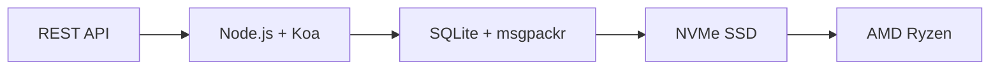

# První kompletní Email API: Jak Forward Email revolucionalizoval správu emailů {#the-first-complete-email-api-how-forward-email-revolutionized-email-management}


<p class="lead mt-3">
  <strong>TL;DR:</strong> Vytvořili jsme první kompletní REST API pro správu emailů na světě s pokročilými vyhledávacími schopnostmi, které žádná jiná služba nenabízí. Zatímco Gmail, Outlook a Apple nutí vývojáře do IMAP pekla nebo API s omezením rychlosti, Forward Email poskytuje bleskově rychlé CRUD operace pro zprávy, složky, kontakty a kalendáře prostřednictvím sjednoceného REST rozhraní s více než 15 vyhledávacími parametry. Toto je emailové API, na které vývojáři čekali.
</p>


## Obsah {#table-of-contents}

* [Problém Email API](#the-email-api-problem)
* [Co vývojáři skutečně říkají](#what-developers-are-actually-saying)
* [Revoluční řešení Forward Email](#forward-emails-revolutionary-solution)
  * [Proč jsme to vytvořili](#why-we-built-this)
  * [Jednoduchá autentizace](#simple-authentication)
* [20 endpointů, které mění vše](#20-endpoints-that-change-everything)
  * [Zprávy (5 endpointů)](#messages-5-endpoints)
  * [Složky (5 endpointů)](#folders-5-endpoints)
  * [Kontakty (5 endpointů)](#contacts-5-endpoints)
  * [Kalendáře (5 endpointů)](#calendars-5-endpoints)
* [Pokročilé vyhledávání: žádná jiná služba se nevyrovná](#advanced-search-no-other-service-compares)
  * [Krajina vyhledávacích API je rozbitá](#the-search-api-landscape-is-broken)
  * [Revoluční vyhledávací API Forward Email](#forward-emails-revolutionary-search-api)
  * [Příklady vyhledávání z praxe](#real-world-search-examples)
  * [Výhody výkonu](#performance-advantages)
  * [Vyhledávací funkce, které nikdo jiný nemá](#search-features-no-one-else-has)
  * [Proč je to důležité pro vývojáře](#why-this-matters-for-developers)
  * [Technická implementace](#the-technical-implementation)
* [Bleskově rychlá výkonnostní architektura](#blazing-fast-performance-architecture)
  * [Výkonnostní benchmarky](#performance-benchmarks)
  * [Architektura zaměřená na soukromí](#privacy-first-architecture)
* [Proč jsme jiní: Kompletní srovnání](#why-were-different-the-complete-comparison)
  * [Hlavní omezení poskytovatelů](#major-provider-limitations)
  * [Výhody Forward Email](#forward-email-advantages)
  * [Problém transparentnosti open-source](#the-open-source-transparency-problem)
* [30+ příkladů integrace z praxe](#30-real-world-integration-examples)
  * [1. Vylepšení kontaktního formuláře WordPress](#1-wordpress-contact-form-enhancement)
  * [2. Alternativa Zapier pro emailovou automatizaci](#2-zapier-alternative-for-email-automation)
  * [3. Synchronizace emailů CRM](#3-crm-email-synchronization)
  * [4. Zpracování objednávek e-commerce](#4-e-commerce-order-processing)
  * [5. Integrace podpory ticketů](#5-support-ticket-integration)
  * [6. Systém správy newsletterů](#6-newsletter-management-system)
  * [7. Správa úkolů založená na emailech](#7-email-based-task-management)
  * [8. Agregace emailů z více účtů](#8-multi-account-email-aggregation)
  * [9. Pokročilá analytika emailů](#9-advanced-email-analytics-dashboard)
  * [10. Chytré archivování emailů](#10-smart-email-archiving)
  * [11. Integrace emailu s kalendářem](#11-email-to-calendar-integration)
  * [12. Zálohování emailů a shoda](#12-email-backup-and-compliance)
  * [13. Správa obsahu založená na emailech](#13-email-based-content-management)
  * [14. Správa emailových šablon](#14-email-template-management)
  * [15. Automatizace workflow založená na emailech](#15-email-based-workflow-automation)
  * [16. Monitorování bezpečnosti emailů](#16-email-security-monitoring)
  * [17. Sběr průzkumů založený na emailech](#17-email-based-survey-collection)
  * [18. Monitorování výkonu emailů](#18-email-performance-monitoring)
  * [19. Kvalifikace leadů založená na emailech](#19-email-based-lead-qualification)
  * [20. Projektové řízení založené na emailech](#20-email-based-project-management)
  * [21. Správa zásob založená na emailech](#21-email-based-inventory-management)
  * [22. Zpracování faktur založené na emailech](#22-email-based-invoice-processing)
  * [23. Registrace na akce založená na emailech](#23-email-based-event-registration)
  * [24. Workflow schvalování dokumentů založené na emailech](#24-email-based-document-approval-workflow)
  * [25. Analýza zpětné vazby zákazníků založená na emailech](#25-email-based-customer-feedback-analysis)
  * [26. Náborový pipeline založený na emailech](#26-email-based-recruitment-pipeline)
  * [27. Zpracování výdajových zpráv založené na emailech](#27-email-based-expense-report-processing)
  * [28. Reportování kontroly kvality založené na emailech](#28-email-based-quality-assurance-reporting)
  * [29. Správa dodavatelů založená na emailech](#29-email-based-vendor-management)
  * [30. Monitorování sociálních médií založené na emailech](#30-email-based-social-media-monitoring)
* [Začínáme](#getting-started)
  * [1. Vytvořte si účet Forward Email](#1-create-your-forward-email-account)
  * [2. Vygenerujte API přihlašovací údaje](#2-generate-api-credentials)
  * [3. Proveďte svůj první API požadavek](#3-make-your-first-api-call)
  * [4. Prozkoumejte dokumentaci](#4-explore-the-documentation)
* [Technické zdroje](#technical-resources)
## Problém s Emailovým API {#the-email-api-problem}

Emailová API jsou zásadně rozbitá. Tečka.

Každý hlavní poskytovatel emailu nutí vývojáře do jedné ze dvou hrozných voleb:

1. **IMAP peklo**: Boj s 30 let starým protokolem navrženým pro desktopové klienty, ne pro moderní aplikace
2. **Omezená API**: API s omezením rychlosti, pouze pro čtení, složitá OAuth API, která nedokážou spravovat vaše skutečná emailová data

Výsledek? Vývojáři buď úplně opustí integraci emailu, nebo ztrácejí týdny budováním křehkých IMAP wrapperů, které neustále padají.

> \[!WARNING]
> **Špinavé tajemství**: Většina "emailových API" jsou jen API pro odesílání. Programově nemůžete organizovat složky, synchronizovat kontakty ani spravovat kalendáře přes jednoduché REST rozhraní. Až doposud.


## Co Vývojáři Opravdu Říkají {#what-developers-are-actually-saying}

Frustrace je skutečná a zdokumentovaná všude:

> "Nedávno jsem se pokoušel integrovat Gmail do své aplikace a věnoval jsem tomu příliš mnoho času. Rozhodl jsem se, že nestojí za to Gmail podporovat."
>
> *- [vývojář na Hacker News](https://news.ycombinator.com/item?id=42106944), 147 hlasů*

> "Jsou všechna emailová API průměrná? Zdají se být omezená nebo restriktivní nějakým způsobem."
>
> *- [diskuze na Reddit r/SaaS](https://www.reddit.com/r/SaaS/comments/1cm84s7/are_all_email_apis_mediocre/)*

> "Proč musí být vývoj emailu tak špatný?"
>
> *- [Reddit r/webdev](https://www.reddit.com/r/webdev/comments/15trnp2/why_does_email_development_have_to_suck/), 89 komentářů o bolesti vývojářů*

> "Co dělá Gmail API efektivnějším než IMAP? Dalším důvodem, proč je Gmail API mnohem efektivnější, je to, že každou zprávu musí stáhnout pouze jednou. U IMAP musí být každá zpráva stažena a indexována..."
>
> *- [otázka na Stack Overflow](https://stackoverflow.com/questions/25431022/what-makes-the-gmail-api-more-efficient-than-imap) s 47 hlasy*

Důkazy jsou všude:

* **Problémy s WordPress SMTP**: [631 GitHub issues](https://github.com/awesomemotive/WP-Mail-SMTP/issues) týkajících se selhání doručení emailů
* **Omezení Zapieru**: [Stížnosti komunity](https://community.zapier.com/featured-articles-65/email-parser-by-zapier-limitations-and-alternatives-16958) na limity 10 emailů/hodinu a selhání detekce IMAP
* **Projekty IMAP API**: [Více](https://github.com/ewildgoose/imap-api) [open-source](https://emailengine.app/) [projektů](https://www.npmjs.com/package/imapflow) existuje speciálně pro "převod IMAP na REST", protože žádný poskytovatel to nenabízí
* **Frustrace s Gmail API**: [Stack Overflow](https://stackoverflow.com/questions/tagged/gmail-api) má 4 847 otázek označených "gmail-api" s běžnými stížnostmi na limity rychlosti a složitost


## Revoluční Řešení Forward Email {#forward-emails-revolutionary-solution}

**Jsme první emailová služba, která nabízí kompletní CRUD operace pro všechna emailová data přes jednotné REST API.**

Není to jen další API pro odesílání. Je to úplná programová kontrola nad:

* **Zprávami**: Vytváření, čtení, aktualizace, mazání, vyhledávání, přesouvání, označování
* **Složkami**: Plná správa IMAP složek přes REST endpointy
* **Kontakty**: Ukládání a synchronizace kontaktů přes [CardDAV](https://tools.ietf.org/html/rfc6352)
* **Kalendáři**: Události a plánování kalendáře přes [CalDAV](https://tools.ietf.org/html/rfc4791)

### Proč jsme to vytvořili {#why-we-built-this}

**Problém**: Každý poskytovatel emailu považuje email za černou skříňku. Můžete posílat emaily, možná je číst přes složité OAuth, ale skutečně *spravovat* emailová data programově nemůžete.

**Naše vize**: Email by měl být stejně snadný na integraci jako jakékoliv moderní API. Žádné IMAP knihovny. Žádná složitost OAuth. Žádné noční můry s limity rychlosti. Jen jednoduché REST endpointy, které fungují.

**Výsledek**: První emailová služba, kde můžete postavit kompletní emailového klienta, CRM integraci nebo automatizační systém jen pomocí HTTP požadavků.

### Jednoduchá autentizace {#simple-authentication}

Žádná [složitost OAuth](https://oauth.net/2/). Žádná [specifická hesla aplikací](https://support.google.com/accounts/answer/185833). Jen vaše aliasové přihlašovací údaje:

```bash
curl -u "alias@yourdomain.com:password" \
  https://api.forwardemail.net/v1/messages
```
## 20 Koncových bodů, které mění vše {#20-endpoints-that-change-everything}

### Zprávy (5 koncových bodů) {#messages-5-endpoints}

* `GET /v1/messages` - Výpis zpráv s filtrováním (`?folder=`, `?is_unread=`, `?is_flagged=`)
* `POST /v1/messages` - Odeslat nové zprávy přímo do složek
* `GET /v1/messages/:id` - Získat konkrétní zprávu s úplnými metadaty
* `PUT /v1/messages/:id` - Aktualizovat zprávu (značky, složka, stav přečtení)
* `DELETE /v1/messages/:id` - Trvale smazat zprávu

### Složky (5 koncových bodů) {#folders-5-endpoints}

* `GET /v1/folders` - Výpis všech složek s informací o odběru
* `POST /v1/folders` - Vytvořit novou složku s vlastními vlastnostmi
* `GET /v1/folders/:id` - Získat detaily složky a počty zpráv
* `PUT /v1/folders/:id` - Aktualizovat vlastnosti složky a odběr
* `DELETE /v1/folders/:id` - Smazat složku a zajistit přesun zpráv

### Kontakty (5 koncových bodů) {#contacts-5-endpoints}

* `GET /v1/contacts` - Výpis kontaktů s vyhledáváním a stránkováním
* `POST /v1/contacts` - Vytvořit nový kontakt s plnou podporou vCard
* `GET /v1/contacts/:id` - Získat kontakt se všemi poli a metadaty
* `PUT /v1/contacts/:id` - Aktualizovat informace o kontaktu s validací ETag
* `DELETE /v1/contacts/:id` - Smazat kontakt s kaskádovým zpracováním

### Kalendáře (5 koncových bodů) {#calendars-5-endpoints}

* `GET /v1/calendars` - Výpis událostí kalendáře s filtrováním podle data
* `POST /v1/calendars` - Vytvořit událost kalendáře s účastníky a opakováním
* `GET /v1/calendars/:id` - Získat detaily události s podporou časových pásem
* `PUT /v1/calendars/:id` - Aktualizovat událost s detekcí konfliktů
* `DELETE /v1/calendars/:id` - Smazat událost s notifikacemi účastníkům


## Pokročilé vyhledávání: Žádná jiná služba se nevyrovná {#advanced-search-no-other-service-compares}

**Forward Email je jediná e-mailová služba, která nabízí komplexní, programové vyhledávání ve všech polích zpráv přes REST API.**

Zatímco ostatní poskytovatelé nabízejí v lepším případě základní filtrování, my jsme vytvořili nejpokročilejší API pro vyhledávání e-mailů, jaké kdy bylo vytvořeno. Žádné Gmail API, Outlook API ani jiná služba se našim vyhledávacím schopnostem ani nepřibližuje.

### Krajina API pro vyhledávání je rozbitá {#the-search-api-landscape-is-broken}

**Omezení vyhledávání v Gmail API:**

* ✅ Pouze základní parametr `q`
* ❌ Žádné vyhledávání podle konkrétních polí
* ❌ Žádné filtrování podle rozsahu dat
* ❌ Žádné filtrování podle velikosti
* ❌ Žádné filtrování příloh
* ❌ Omezeno na syntaxi vyhledávání Gmailu

**Omezení vyhledávání v Outlook API:**

* ✅ Základní parametr `$search`
* ❌ Žádné pokročilé cílení na pole
* ❌ Žádné složité kombinace dotazů
* ❌ Přísné omezení počtu požadavků
* ❌ Vyžaduje složitou syntaxi OData

**Apple iCloud:**

* ❌ Žádné API vůbec
* ❌ Pouze IMAP vyhledávání (pokud se vám podaří fungovat)

**ProtonMail & Tuta:**

* ❌ Žádná veřejná API
* ❌ Žádné programové vyhledávací schopnosti

### Revoluční vyhledávací API Forward Email {#forward-emails-revolutionary-search-api}

**Nabízíme více než 15 parametrů vyhledávání, které žádná jiná služba neposkytuje:**

| Možnost vyhledávání           | Forward Email                          | Gmail API    | Outlook API        | Ostatní |
| ------------------------------ | -------------------------------------- | ------------ | ------------------ | ------ |
| **Vyhledávání podle pole**     | ✅ Předmět, tělo, od, komu, cc, hlavičky | ❌            | ❌                  | ❌      |
| **Vícepolní obecné vyhledávání** | ✅ `?search=` napříč všemi poli          | ✅ Základní `q=` | ✅ Základní `$search=` | ❌      |
| **Filtrování podle rozsahu dat** | ✅ `?since=` & `?before=`               | ❌            | ❌                  | ❌      |
| **Filtrování podle velikosti** | ✅ `?min_size=` & `?max_size=`          | ❌            | ❌                  | ❌      |
| **Filtrování příloh**          | ✅ `?has_attachments=true/false`        | ❌            | ❌                  | ❌      |
| **Vyhledávání v hlavičkách**  | ✅ `?headers=X-Priority`                | ❌            | ❌                  | ❌      |
| **Vyhledávání podle ID zprávy** | ✅ `?message_id=abc123`                 | ❌            | ❌                  | ❌      |
| **Kombinované filtry**         | ✅ Více parametrů s logikou AND         | ❌            | ❌                  | ❌      |
| **Bez rozlišování velikosti písmen** | ✅ Všechny vyhledávání                  | ✅            | ✅                  | ❌      |
| **Podpora stránkování**        | ✅ Funguje se všemi parametry vyhledávání | ✅            | ✅                  | ❌      |
### Příklady vyhledávání v reálném světě {#real-world-search-examples}

**Najděte všechny faktury z minulého čtvrtletí:**

```bash
# Forward Email - Jednoduché a výkonné
GET /v1/messages?subject=invoice&since=2024-01-01T00:00:00Z&before=2024-04-01T00:00:00Z

# Gmail API - Nemožné s jejich omezeným vyhledáváním
# Není k dispozici filtrování podle rozsahu dat

# Outlook API - Složitá syntaxe OData, omezená funkčnost
GET /me/messages?$search="invoice"&$filter=receivedDateTime ge 2024-01-01T00:00:00Z
```

**Vyhledávání velkých příloh od konkrétního odesílatele:**

```bash
# Forward Email - Komplexní filtrování
GET /v1/messages?from=finance@company.com&has_attachments=true&min_size=1000000

# Gmail API - Nelze programově filtrovat podle velikosti nebo příloh
# Outlook API - Není k dispozici filtrování podle velikosti
# Ostatní - Žádné dostupné API
```

**Složitý vícepoložkový dotaz:**

```bash
# Forward Email - Pokročilé možnosti dotazování
GET /v1/messages?body=quarterly&from=manager&is_flagged=true&folder=Reports

# Gmail API - Omezeno pouze na základní textové vyhledávání
GET /gmail/v1/users/me/messages?q=quarterly

# Outlook API - Základní vyhledávání bez cílení na pole
GET /me/messages?$search="quarterly"
```

### Výhody výkonu {#performance-advantages}

**Výkon vyhledávání Forward Email:**

* ⚡ **Odezva pod 100 ms** u složitých vyhledávání
* 🔍 **Optimalizace pomocí regexu** s řádným indexováním
* 📊 **Paralelní vykonávání dotazů** pro počet i data
* 💾 **Efektivní využití paměti** s úspornými dotazy

**Problémy s výkonem konkurence:**

* 🐌 **Gmail API**: Limit na 250 kvótových jednotek na uživatele za sekundu
* 🐌 **Outlook API**: Agresivní omezování s komplikovanými pravidly zpětného odkladu
* 🐌 **Ostatní**: Žádná API k porovnání

### Funkce vyhledávání, které nikdo jiný nemá {#search-features-no-one-else-has}

#### 1. Vyhledávání podle hlaviček {#1-header-specific-search}

```bash
# Najděte zprávy s konkrétními hlavičkami
GET /v1/messages?headers=X-Priority:1
GET /v1/messages?headers=X-Spam-Score
```

#### 2. Inteligence založená na velikosti {#2-size-based-intelligence}

```bash
# Najděte newslettery (obvykle velké)
GET /v1/messages?min_size=50000&from=newsletter

# Najděte rychlé odpovědi (obvykle malé)
GET /v1/messages?max_size=1000&to=support
```

#### 3. Pracovní postupy založené na přílohách {#3-attachment-based-workflows}

```bash
# Najděte všechny dokumenty zaslané právnímu týmu
GET /v1/messages?to=legal&has_attachments=true&body=contract

# Najděte e-maily bez příloh pro úklid
GET /v1/messages?has_attachments=false&before=2023-01-01T00:00:00Z
```

#### 4. Kombinovaná obchodní logika {#4-combined-business-logic}

```bash
# Najděte urgentní označené zprávy od VIP s přílohami
GET /v1/messages?is_flagged=true&from=ceo&has_attachments=true&subject=urgent
```

### Proč je to důležité pro vývojáře {#why-this-matters-for-developers}

**Vytvářejte aplikace, které byly dříve nemožné:**

1. **Pokročilá analýza e-mailů**: Analyzujte vzory e-mailů podle velikosti, odesílatele, obsahu
2. **Inteligentní správa e-mailů**: Automatická organizace na základě složitých kritérií
3. **Soulad a vyhledávání**: Najděte konkrétní e-maily pro právní požadavky
4. **Business Intelligence**: Získejte poznatky z komunikačních vzorců e-mailů
5. **Automatizované pracovní postupy**: Spouštějte akce na základě sofistikovaných filtrů e-mailů

### Technická implementace {#the-technical-implementation}

Naše vyhledávací API používá:

* **Optimalizaci regexu** s řádnými indexačními strategiemi
* **Paralelní vykonávání** pro výkon
* **Validaci vstupů** pro bezpečnost
* **Komplexní zpracování chyb** pro spolehlivost

```javascript
// Příklad: Implementace složitého vyhledávání
const searchConditions = [];

if (ctx.query.subject) {
  searchConditions.push({
    subject: { $regex: ctx.query.subject, $options: 'i' }
  });
}

if (ctx.query.from) {
  searchConditions.push({
    $or: [
      { 'from.address': { $regex: ctx.query.from, $options: 'i' } },
      { 'from.name': { $regex: ctx.query.from, $options: 'i' } }
    ]
  });
}

// Kombinace pomocí logiky AND
if (searchConditions.length > 0) {
  query.$and = searchConditions;
}
```

> \[!TIP]
> **Výhoda pro vývojáře**: S vyhledávacím API Forward Email můžete vytvářet e-mailové aplikace, které se funkčností vyrovnají desktopovým klientům a přitom si zachovávají jednoduchost REST API.
## Architektura bleskově rychlého výkonu {#blazing-fast-performance-architecture}

Náš technický stack je postaven pro rychlost a spolehlivost:


```mermaid
graph LR
    A[REST API] --> B[Node.js + Koa]
    B --> C[SQLite + msgpackr]
    C --> D[NVMe SSD]
    D --> E[AMD Ryzen]
```

### Výkonnostní benchmarky {#performance-benchmarks}

**Proč jsme bleskově rychlí:**

| Komponenta   | Technologie                                                                       | Výhoda výkonu                                |
| ------------ | -------------------------------------------------------------------------------- | -------------------------------------------- |
| **Úložiště** | [NVMe SSD](https://en.wikipedia.org/wiki/NVM_Express)                           | 10x rychlejší než tradiční SATA              |
| **Databáze** | [SQLite](https://sqlite.org/) + [msgpackr](https://github.com/kriszyp/msgpackr) | Žádná síťová latence, optimalizovaná serializace |
| **Hardware** | [AMD Ryzen](https://www.amd.com/en/products/processors/desktops/ryzen) bez virtualizace | Žádné režijní náklady virtualizace           |
| **Cache**    | V paměti + perzistentní                                                        | Odezva v řádu pod milisekundy                |
| **Zálohy**   | [Cloudflare R2](https://www.cloudflare.com/products/r2/) šifrované              | Podniková úroveň spolehlivosti                |

**Skutečná čísla výkonu:**

* **Doba odezvy API**: průměrně < 50 ms
* **Načítání zpráv**: < 10 ms pro cachované zprávy
* **Operace se složkami**: < 5 ms pro operace s metadaty
* **Synchronizace kontaktů**: 1000+ kontaktů za sekundu
* **Dostupnost**: 99,99 % SLA s redundantní infrastrukturou

### Architektura zaměřená na soukromí {#privacy-first-architecture}

**Zero-Knowledge design**: Přístup máte pouze vy pomocí svého IMAP hesla – nemůžeme číst vaše e-maily. Naše [zero-knowledge architektura](https://forwardemail.net/en/security) zajišťuje úplné soukromí při zachování bleskového výkonu.


## Proč jsme jiní: Kompletní srovnání {#why-were-different-the-complete-comparison}

### Hlavní omezení poskytovatelů {#major-provider-limitations}

| Poskytovatel    | Hlavní problémy                         | Specifická omezení                                                                                                                                                                                                                                                                                                                                                                                                                                                  |
| --------------- | ------------------------------------- | ------------------------------------------------------------------------------------------------------------------------------------------------------------------------------------------------------------------------------------------------------------------------------------------------------------------------------------------------------------------------------------------------------------------------------------------------------------------- |
| **Gmail API**   | Pouze pro čtení, složitý OAuth, oddělená API | • [Nelze upravovat existující zprávy](https://developers.google.com/gmail/api/reference/rest/v1/users.messages)<br>• [Štítky ≠ složky](https://developers.google.com/gmail/api/reference/rest/v1/users.labels)<br>• [Limit 1 miliarda kvótových jednotek/den](https://developers.google.com/gmail/api/reference/quota)<br>• [Vyžaduje oddělená API](https://developers.google.com/workspace) pro kontakty/kalendář |
| **Outlook API** | Zastaralé, matoucí, zaměřené na podniky | • [REST endpointy zastaveny březen 2024](https://learn.microsoft.com/en-us/outlook/rest/compare-graph)<br>• [Více matoucích API](https://learn.microsoft.com/en-us/office/client-developer/outlook/selecting-an-api-or-technology-for-developing-solutions-for-outlook) (EWS, Graph, REST)<br>• [Složitost Microsoft Graph](https://learn.microsoft.com/en-us/graph/overview)<br>• [Agresivní omezování](https://learn.microsoft.com/en-us/graph/throttling) |
| **Apple iCloud**| Žádné veřejné API                    | • [Žádné veřejné API vůbec](https://support.apple.com/en-us/102654)<br>• [Pouze IMAP s limitem 1000 e-mailů/den](https://support.apple.com/en-us/102654)<br>• [Vyžaduje hesla specifická pro aplikace](https://support.apple.com/en-us/102654)<br>• [Limit 500 příjemců na zprávu](https://support.apple.com/en-us/102654)                                                                                                         |
| **ProtonMail**  | Žádné API, falešné tvrzení o open-source | • [Žádné veřejné API dostupné](https://proton.me/support/protonmail-bridge-clients)<br>• [Pro přístup přes IMAP je potřeba Bridge software](https://proton.me/mail/bridge)<br>• [Tvrdí, že je "open source"](https://proton.me/blog/open-source), ale [serverový kód je proprietární](https://github.com/ProtonMail)<br>• [Omezeno pouze na placené plány](https://proton.me/pricing)                                  |
| **Tuta**        | Žádné API, zavádějící transparentnost | • [Žádné REST API pro správu e-mailů](https://tuta.com/support#technical)<br>• [Tvrdí, že je "open source"](https://tuta.com/blog/posts/open-source-email), ale [backend je uzavřený](https://github.com/tutao/tutanota)<br>• [Nepodporuje IMAP/SMTP](https://tuta.com/support#imap)<br>• [Proprietární šifrování](https://tuta.com/encryption) znemožňuje standardní integrace                             |
| **Zapier Email**| Přísná omezení rychlosti               | • [Limit 10 e-mailů za hodinu](https://help.zapier.com/hc/en-us/articles/8496181555597-Email-Parser-by-Zapier-limitations-and-alternatives)<br>• [Žádný přístup ke složkám IMAP](https://help.zapier.com/hc/en-us/articles/8496181555597-Email-Parser-by-Zapier-limitations-and-alternatives)<br>• [Omezené možnosti parsování](https://help.zapier.com/hc/en-us/articles/8496181555597-Email-Parser-by-Zapier-limitations-and-alternatives) |
### Výhody přeposílání e-mailů {#forward-email-advantages}

| Funkce             | Přeposílání e-mailů                                                                         | Konkurence                               |
| ------------------ | -------------------------------------------------------------------------------------------- | ----------------------------------------- |
| **Kompletní CRUD** | ✅ Plné vytváření, čtení, aktualizace, mazání všech dat                                      | ❌ Pouze čtení nebo omezené operace        |
| **Jednotné API**   | ✅ Zprávy, složky, kontakty, kalendáře v jednom API                                          | ❌ Oddělená API nebo chybějící funkce      |
| **Jednoduchá autentizace** | ✅ Základní ověřování pomocí aliasových přihlašovacích údajů                             | ❌ Komplexní OAuth s více oprávněními      |
| **Bez limitů rychlosti** | ✅ Štědré limity navržené pro reálné aplikace                                            | ❌ Restriktivní kvóty, které narušují pracovní postupy |
| **Vlastní hosting** | ✅ [Kompletní možnost vlastního hostingu](https://forwardemail.net/en/blog/docs/self-hosted-solution) | ❌ Pouze závislost na dodavateli           |
| **Soukromí**       | ✅ Zero-knowledge, šifrované, soukromé                                                        | ❌ Těžba dat a obavy o soukromí            |
| **Výkon**          | ✅ Odezvy pod 50 ms, NVMe úložiště                                                           | ❌ Síťová latence, zpoždění kvůli omezení  |

### Problém transparentnosti open-source {#the-open-source-transparency-problem}

**ProtonMail a Tuta se prezentují jako „open source“ a „transparentní“, ale jedná se o zavádějící marketing, který porušuje moderní zásady ochrany soukromí.**

> \[!WARNING]
> **Falešná tvrzení o transparentnosti**: ProtonMail i Tuta výrazně propagují své „open source“ kredity, přičemž jejich nejdůležitější serverový kód zůstává proprietární a uzavřený.

**Dezinformace ProtonMailu:**

* **Tvrzení**: ["Jsme open source"](https://proton.me/blog/open-source) výrazně propagováno v marketingu
* **Realita**: [Serverový kód je zcela proprietární](https://github.com/ProtonMail) – pouze klientské aplikace jsou open source
* **Dopad**: Uživatelé nemohou ověřit serverové šifrování, zpracování dat ani tvrzení o soukromí
* **Porušení transparentnosti**: Není možné auditovat skutečné systémy zpracování a ukládání e-mailů

**Zavádějící marketing Tuty:**

* **Tvrzení**: ["Open source e-mail"](https://tuta.com/blog/posts/open-source-email) jako hlavní prodejní bod
* **Realita**: [Backendová infrastruktura je uzavřená](https://github.com/tutao/tutanota) – dostupný je pouze frontend
* **Dopad**: Proprietární šifrování znemožňuje standardní e-mailové protokoly (IMAP/SMTP)
* **Strategie uzamčení**: Vlastní šifrování nutí závislost na dodavateli

**Proč je to důležité pro moderní soukromí:**

V roce 2025 vyžaduje skutečné soukromí **úplnou transparentnost**. Když poskytovatelé e-mailů tvrdí „open source“, ale skrývají svůj serverový kód:

1. **Neověřitelné šifrování**: Nemůžete auditovat, jak jsou vaše data skutečně šifrována
2. **Skryté praktiky s daty**: Zpracování dat na serveru zůstává černou skříňkou
3. **Bezpečnost založená na důvěře**: Musíte věřit jejich tvrzením bez možnosti ověření
4. **Závislost na dodavateli**: Proprietární systémy znemožňují přenositelnost dat

**Skutečná transparentnost Forward Email:**

* ✅ **[Kompletní open source](https://github.com/forwardemail/forwardemail.net)** – serverový i klientský kód
* ✅ **[Možnost vlastního hostingu](https://forwardemail.net/en/blog/docs/self-hosted-solution)** – provozujte vlastní instanci
* ✅ **Standardní protokoly** – kompatibilita s IMAP, SMTP, CardDAV, CalDAV
* ✅ **Auditovatelná bezpečnost** – každý řádek kódu lze zkontrolovat
* ✅ **Bez závislosti na dodavateli** – vaše data, vaše kontrola

> \[!TIP]
> **Skutečný open source znamená, že můžete ověřit každé tvrzení.** S Forward Email můžete auditovat naše šifrování, zkontrolovat zpracování dat a dokonce provozovat vlastní instanci. To je pravá transparentnost.


## 30+ příkladů reálných integrací {#30-real-world-integration-examples}

### 1. Vylepšení kontaktního formuláře WordPress {#1-wordpress-contact-form-enhancement}
**Problém**: [Selhání konfigurace SMTP ve WordPressu](https://github.com/awesomemotive/WP-Mail-SMTP/issues) ([631 GitHub issues](https://github.com/awesomemotive/WP-Mail-SMTP/issues))  
**Řešení**: Přímá integrace API obchází [SMTP](https://tools.ietf.org/html/rfc5321) úplně

```javascript
// Kontaktní formulář WordPress, který ukládá do složky Odeslané
await fetch('https://api.forwardemail.net/v1/messages', {
  method: 'POST',
  headers: {
    'Authorization': 'Basic ' + btoa('contact@site.com:password'),
    'Content-Type': 'application/json'
  },
  body: JSON.stringify({
    to: [{ address: 'owner@site.com' }],
    subject: 'Kontaktní formulář: ' + formData.subject,
    text: formData.message,
    folder: 'Sent'
  })
});
```

### 2. Alternativa Zapier pro automatizaci e-mailů {#2-zapier-alternative-for-email-automation}

**Problém**: [Limit 10 e-mailů za hodinu u Zapieru](https://help.zapier.com/hc/en-us/articles/8496181555597-Email-Parser-by-Zapier-limitations-and-alternatives) a [selhání detekce IMAP](https://community.zapier.com/featured-articles-65/email-parser-by-zapier-limitations-and-alternatives-16958)  
**Řešení**: Neomezená automatizace s plnou kontrolou e-mailů

```javascript
// Automatické třídění e-mailů podle domény odesílatele
const messages = await fetch('/v1/messages?folder=INBOX');
for (const message of messages) {
  const domain = message.from.split('@')[1];
  await fetch(`/v1/messages/${message.id}`, {
    method: 'PUT',
    body: JSON.stringify({ folder: `Clients/${domain}` })
  });
}
```

### 3. Synchronizace e-mailů s CRM {#3-crm-email-synchronization}

**Problém**: Ruční správa kontaktů mezi e-mailem a [CRM systémy](https://en.wikipedia.org/wiki/Customer_relationship_management)  
**Řešení**: Obousměrná synchronizace s [CardDAV](https://tools.ietf.org/html/rfc6352) kontaktním API

```javascript
// Synchronizace nových e-mailových kontaktů do CRM
const newContacts = await fetch('/v1/contacts');
for (const contact of newContacts) {
  await crmAPI.createContact({
    name: contact.name,
    email: contact.email,
    source: 'email_api'
  });
}
```

### 4. Zpracování objednávek v e-commerce {#4-e-commerce-order-processing}

**Problém**: Ruční zpracování objednávek z e-mailů pro [e-commerce platformy](https://en.wikipedia.org/wiki/E-commerce)  
**Řešení**: Automatizovaný proces správy objednávek

```javascript
// Zpracování potvrzovacích e-mailů objednávek
const orders = await fetch('/v1/messages?folder=Orders');
const orderEmails = orders.filter(msg =>
  msg.subject.includes('Potvrzení objednávky')
);

for (const order of orderEmails) {
  const orderData = parseOrderEmail(order.text);
  await updateInventory(orderData);
  await fetch(`/v1/messages/${order.id}`, {
    method: 'PUT',
    body: JSON.stringify({ folder: 'Orders/Processed' })
  });
}
```

### 5. Integrace podpory ticketů {#5-support-ticket-integration}

**Problém**: E-mailové konverzace rozptýlené napříč [helpdesk platformami](https://en.wikipedia.org/wiki/Help_desk_software)  
**Řešení**: Kompletní sledování e-mailových vláken

```javascript
// Vytvoření ticketu podpory z e-mailového vlákna
const messages = await fetch('/v1/messages?folder=Support');
const supportEmails = messages.filter(msg =>
  msg.to.some(addr => addr.includes('support@'))
);

for (const email of supportEmails) {
  const ticket = await supportSystem.createTicket({
    subject: email.subject,
    from: email.from,
    body: email.text,
    timestamp: email.date
  });
}
```

### 6. Systém správy newsletterů {#6-newsletter-management-system}

**Problém**: Omezené integrace [newsletterových platforem](https://en.wikipedia.org/wiki/Email_marketing)  
**Řešení**: Kompletní správa životního cyklu odběratelů

```javascript
// Automatická správa odběrů newsletteru
const messages = await fetch('/v1/messages?folder=Newsletter');
const unsubscribes = messages.filter(msg =>
  msg.subject.toLowerCase().includes('odhlásit')
);

for (const msg of unsubscribes) {
  await removeSubscriber(msg.from);
  await fetch(`/v1/messages/${msg.id}`, {
    method: 'PUT',
    body: JSON.stringify({ folder: 'Newsletter/Unsubscribed' })
  });
}
```

### 7. Správa úkolů založená na e-mailech {#7-email-based-task-management}

**Problém**: Přetížení inboxu a [sledování úkolů](https://en.wikipedia.org/wiki/Task_management)  
**Řešení**: Převod e-mailů na proveditelné úkoly
```javascript
// Create tasks from flagged emails
const messages = await fetch('/v1/messages?is_flagged=true');
for (const email of messages) {
  await taskManager.createTask({
    title: email.subject,
    description: email.text,
    assignee: email.to[0].address,
    dueDate: extractDueDate(email.text)
  });
}
```

### 8. Multi-Account Email Aggregation {#8-multi-account-email-aggregation}

**Problem**: Managing [multiple email accounts](https://en.wikipedia.org/wiki/Email_client) across providers
**Solution**: Unified inbox interface

```javascript
// Aggregate emails from multiple accounts
const accounts = ['work@domain.com', 'personal@domain.com'];
const allMessages = [];

for (const account of accounts) {
  const messages = await fetch('/v1/messages', {
    headers: { 'Authorization': getAuth(account) }
  });
  allMessages.push(...messages.map(m => ({ ...m, account })));
}
```

### 9. Advanced Email Analytics Dashboard {#9-advanced-email-analytics-dashboard}

**Problem**: No insights into [email patterns](https://en.wikipedia.org/wiki/Email_analytics) with sophisticated filtering
**Solution**: Custom email analytics using advanced search capabilities

```javascript
// Generate comprehensive email analytics using advanced search
const analytics = {};

// Analyze email volume by sender domain
const messages = await fetch('/v1/messages');
analytics.senderDomains = analyzeSenderDomains(messages);

// Find large attachments consuming storage
const largeAttachments = await fetch('/v1/messages?has_attachments=true&min_size=1000000');
analytics.storageHogs = largeAttachments.map(msg => ({
  subject: msg.subject,
  from: msg.from,
  size: msg.size
}));

// Analyze communication patterns with VIPs
const vipEmails = await fetch('/v1/messages?from=ceo@company.com');
const urgentVipEmails = await fetch('/v1/messages?from=ceo@company.com&subject=urgent');
analytics.vipCommunication = {
  total: vipEmails.length,
  urgent: urgentVipEmails.length,
  urgencyRate: (urgentVipEmails.length / vipEmails.length) * 100
};

// Find unread emails by date range for follow-up
const lastWeek = new Date(Date.now() - 7 * 24 * 60 * 60 * 1000).toISOString();
const unreadRecent = await fetch(`/v1/messages?is_unread=true&since=${lastWeek}`);
analytics.followUpNeeded = unreadRecent.length;

// Analyze email sizes for optimization
const smallEmails = await fetch('/v1/messages?max_size=1000');
const mediumEmails = await fetch('/v1/messages?min_size=1000&max_size=50000');
const largeEmails = await fetch('/v1/messages?min_size=50000');
analytics.sizeDistribution = {
  small: smallEmails.length,
  medium: mediumEmails.length,
  large: largeEmails.length
};

// Search for compliance-related emails
const complianceEmails = await fetch('/v1/messages?body=confidential&has_attachments=true');
analytics.complianceReview = complianceEmails.length;
```

### 10. Smart Email Archiving {#10-smart-email-archiving}

**Problem**: Manual [email organization](https://en.wikipedia.org/wiki/Email_management)
**Solution**: Intelligent email categorization

```javascript
// Auto-archive old emails by category
const messages = await fetch('/v1/messages');
const oldEmails = messages.filter(email =>
  isOlderThan(email.date, 90) // 90 days
);

for (const email of oldEmails) {
  const category = categorizeEmail(email);
  await fetch(`/v1/messages/${email.id}`, {
    method: 'PUT',
    body: JSON.stringify({ folder: `Archive/${category}` })
  });
}
```

### 11. Email-to-Calendar Integration {#11-email-to-calendar-integration}

**Problem**: Manual [calendar event](https://tools.ietf.org/html/rfc4791) creation from emails
**Solution**: Automatic event extraction and creation

```javascript
// Extract meeting details from emails
const messages = await fetch('/v1/messages?folder=Meetings');
const meetingEmails = messages.filter(email =>
  email.subject.toLowerCase().includes('meeting')
);

for (const email of meetingEmails) {
  const meetingData = extractMeetingInfo(email.text);
  if (meetingData.date && meetingData.time) {
    await fetch('/v1/calendars', {
      method: 'POST',
      body: JSON.stringify({
        title: email.subject,
        start: meetingData.datetime,
        attendees: [email.from, ...email.to]
      })
    });
  }
}
```

### 12. Zálohování e-mailů a dodržování předpisů {#12-email-backup-and-compliance}

**Problém**: [Uchovávání e-mailů](https://en.wikipedia.org/wiki/Email_retention_policy) a požadavky na dodržování předpisů  
**Řešení**: Automatizované zálohování s uchováním metadat

```javascript
// Zálohování e-mailů s kompletními metadaty
const allMessages = await fetch('/v1/messages');
const backup = {
  timestamp: new Date(),
  messages: allMessages.map(msg => ({
    id: msg.id,
    subject: msg.subject,
    from: msg.from,
    to: msg.to,
    date: msg.date,
    flags: msg.flags
  }))
};
await saveToComplianceStorage(backup);
```

### 13. Správa obsahu založená na e-mailech {#13-email-based-content-management}

**Problém**: Správa odeslaného obsahu přes e-mail pro [CMS platformy](https://en.wikipedia.org/wiki/Content_management_system)  
**Řešení**: E-mail jako systém pro správu obsahu

```javascript
// Zpracování odeslaného obsahu z e-mailu
const messages = await fetch('/v1/messages?folder=Submissions');
const submissions = messages.filter(msg =>
  msg.to.some(addr => addr.includes('submit@'))
);

for (const submission of submissions) {
  const content = parseSubmission(submission.text);
  await cms.createDraft({
    title: submission.subject,
    content: content.body,
    author: submission.from
  });
}
```

### 14. Správa e-mailových šablon {#14-email-template-management}

**Problém**: Nekonzistentní [e-mailové šablony](https://en.wikipedia.org/wiki/Email_template) v týmu  
**Řešení**: Centralizovaný systém šablon s API

```javascript
// Odesílání e-mailů se šablonou a dynamickým obsahem
const template = await getEmailTemplate('welcome');
await fetch('/v1/messages', {
  method: 'POST',
  body: JSON.stringify({
    to: [{ address: newUser.email }],
    subject: template.subject.replace('{{name}}', newUser.name),
    html: template.html.replace('{{name}}', newUser.name),
    folder: 'Sent'
  })
});
```

### 15. Automatizace pracovních postupů založená na e-mailech {#15-email-based-workflow-automation}

**Problém**: Ruční [schvalovací procesy](https://en.wikipedia.org/wiki/Workflow) přes e-mail  
**Řešení**: Automatizované spouštěče pracovních postupů

```javascript
// Zpracování schvalovacích e-mailů
const messages = await fetch('/v1/messages?folder=Approvals');
const approvals = messages.filter(msg =>
  msg.subject.includes('APPROVAL')
);

for (const approval of approvals) {
  const decision = parseApprovalDecision(approval.text);
  await workflow.processApproval({
    requestId: extractRequestId(approval.subject),
    decision: decision,
    approver: approval.from
  });
}
```

### 16. Monitorování bezpečnosti e-mailů {#16-email-security-monitoring}

**Problém**: Ruční [detekce bezpečnostních hrozeb](https://en.wikipedia.org/wiki/Email_security)  
**Řešení**: Automatizovaná analýza hrozeb

```javascript
// Monitorování podezřelých e-mailů
const recentEmails = await fetch('/v1/messages');
for (const email of recentEmails) {
  const threatScore = analyzeThreat(email);
  if (threatScore > 0.8) {
    await fetch(`/v1/messages/${email.id}`, {
      method: 'PUT',
      body: JSON.stringify({ folder: 'Security/Quarantine' })
    });
    await alertSecurityTeam(email);
  }
}
```

### 17. Sběr průzkumů založený na e-mailech {#17-email-based-survey-collection}

**Problém**: Ruční zpracování [odpovědí na průzkumy](https://en.wikipedia.org/wiki/Survey_methodology)  
**Řešení**: Automatizovaná agregace odpovědí

```javascript
// Sběr a zpracování odpovědí na průzkumy
const messages = await fetch('/v1/messages?folder=Surveys');
const responses = messages.filter(msg =>
  msg.subject.includes('Survey Response')
);

const surveyData = responses.map(email => ({
  respondent: email.from,
  responses: parseSurveyData(email.text),
  timestamp: email.date
}));
await updateSurveyResults(surveyData);
```

### 18. Monitorování výkonu e-mailů {#18-email-performance-monitoring}

**Problém**: Žádný přehled o [výkonu doručování e-mailů](https://en.wikipedia.org/wiki/Email_deliverability)  
**Řešení**: Metriky e-mailů v reálném čase

```javascript
// Monitorování výkonu doručování e-mailů
const sentEmails = await fetch('/v1/messages?folder=Sent');
const deliveryStats = {
  sent: sentEmails.length,
  bounces: await countBounces(),
  deliveryRate: calculateDeliveryRate()
};
await updateDashboard(deliveryStats);
```
### 19. Kvalifikace leadů na základě e-mailu {#19-email-based-lead-qualification}

**Problém**: Ruční [lead scoring](https://en.wikipedia.org/wiki/Lead_scoring) z e-mailových interakcí  
**Řešení**: Automatizovaný pipeline pro kvalifikaci leadů

```javascript
// Score leads based on email engagement
const prospects = await fetch('/v1/contacts');
for (const prospect of prospects) {
  const messages = await fetch('/v1/messages');
  const emails = messages.filter(msg =>
    msg.from.includes(prospect.email)
  );
  const score = calculateEngagementScore(emails);
  await crm.updateLeadScore(prospect.id, score);
}
```

### 20. Projektové řízení na základě e-mailu {#20-email-based-project-management}

**Problém**: [Aktualizace projektů](https://en.wikipedia.org/wiki/Project_management) rozptýlené v e-mailových vláknech  
**Řešení**: Centralizované komunikační centrum pro projekty

```javascript
// Extract project updates from emails
const messages = await fetch('/v1/messages?folder=Projects');
const projectEmails = messages.filter(msg =>
  msg.subject.includes('Project Update')
);

for (const email of projectEmails) {
  const update = parseProjectUpdate(email.text);
  await projectManager.addUpdate({
    project: update.projectId,
    author: email.from,
    content: update.content
  });
}
```

### 21. Správa zásob na základě e-mailu {#21-email-based-inventory-management}

**Problém**: Ruční aktualizace zásob z e-mailů od dodavatelů  
**Řešení**: Automatizované sledování zásob z e-mailových oznámení

```javascript
// Process inventory updates from supplier emails
const messages = await fetch('/v1/messages?folder=Suppliers');
const inventoryEmails = messages.filter(msg =>
  msg.subject.includes('Inventory Update') || msg.subject.includes('Stock Alert')
);

for (const email of inventoryEmails) {
  const inventoryData = parseInventoryUpdate(email.text);
  await inventory.updateStock({
    sku: inventoryData.sku,
    quantity: inventoryData.quantity,
    supplier: email.from,
    timestamp: email.date
  });

  // Move to processed folder
  await fetch(`/v1/messages/${email.id}`, {
    method: 'PUT',
    body: JSON.stringify({ folder: 'Suppliers/Processed' })
  });
}
```

### 22. Zpracování faktur na základě e-mailu {#22-email-based-invoice-processing}

**Problém**: Ruční [zpracování faktur](https://en.wikipedia.org/wiki/Invoice_processing) a integrace s účetnictvím  
**Řešení**: Automatizované extrahování faktur a synchronizace s účetním systémem

```javascript
// Extract invoice data from email attachments
const messages = await fetch('/v1/messages?folder=Invoices');
const invoiceEmails = messages.filter(msg =>
  msg.subject.toLowerCase().includes('invoice') && msg.attachments.length > 0
);

for (const email of invoiceEmails) {
  const invoiceData = await extractInvoiceData(email.attachments[0]);
  await accounting.createInvoice({
    vendor: email.from,
    amount: invoiceData.total,
    dueDate: invoiceData.dueDate,
    items: invoiceData.lineItems
  });

  // Flag as processed
  await fetch(`/v1/messages/${email.id}`, {
    method: 'PUT',
    body: JSON.stringify({ flags: ['\\Seen', '\\Flagged'] })
  });
}
```

### 23. Registrace na akce na základě e-mailu {#23-email-based-event-registration}

**Problém**: Ruční zpracování [registrací na akce](https://en.wikipedia.org/wiki/Event_management) z e-mailových odpovědí  
**Řešení**: Automatizovaná správa účastníků a integrace s kalendářem

```javascript
// Process event registration emails
const messages = await fetch('/v1/messages?folder=Events');
const registrations = messages.filter(msg =>
  msg.subject.includes('Registration') || msg.subject.includes('RSVP')
);

for (const registration of registrations) {
  const attendeeData = parseRegistration(registration.text);

  // Add to attendee list
  await events.addAttendee({
    event: attendeeData.eventId,
    name: attendeeData.name,
    email: registration.from,
    dietary: attendeeData.dietaryRestrictions
  });

  // Create calendar event for attendee
  await fetch('/v1/calendars', {
    method: 'POST',
    body: JSON.stringify({
      title: attendeeData.eventName,
      start: attendeeData.eventDate,
      attendees: [registration.from]
    })
  });
}
```
### 24. Workflow schvalování dokumentů založený na e-mailech {#24-email-based-document-approval-workflow}

**Problém**: Komplexní [schvalovací](https://en.wikipedia.org/wiki/Document_management_system) řetězce dokumentů přes e-mail  
**Řešení**: Automatizované sledování schvalování a verzování dokumentů

```javascript
// Track document approval workflow
const messages = await fetch('/v1/messages?folder=Approvals');
const approvalEmails = messages.filter(msg =>
  msg.subject.includes('Document Approval')
);

for (const email of approvalEmails) {
  const approval = parseApprovalEmail(email.text);

  await documentSystem.updateApproval({
    documentId: approval.documentId,
    approver: email.from,
    status: approval.decision, // 'approved', 'rejected', 'needs_changes'
    comments: approval.comments,
    timestamp: email.date
  });

  // Check if all approvals complete
  const document = await documentSystem.getDocument(approval.documentId);
  if (document.allApprovalsComplete) {
    await documentSystem.finalizeDocument(approval.documentId);
  }
}
```

### 25. Analýza zpětné vazby zákazníků založená na e-mailech {#25-email-based-customer-feedback-analysis}

**Problém**: Ruční sběr a analýza sentimentu [zpětné vazby zákazníků](https://en.wikipedia.org/wiki/Customer_feedback)  
**Řešení**: Automatizované zpracování zpětné vazby a sledování sentimentu

```javascript
// Analyze customer feedback from emails
const messages = await fetch('/v1/messages?folder=Feedback');
const feedbackEmails = messages.filter(msg =>
  msg.to.some(addr => addr.includes('feedback@'))
);

for (const email of feedbackEmails) {
  const sentiment = await analyzeSentiment(email.text);
  const category = categorizeFeeback(email.text);

  await feedback.recordFeedback({
    customer: email.from,
    content: email.text,
    sentiment: sentiment.score, // -1 to 1
    category: category, // 'bug', 'feature', 'complaint', 'praise'
    priority: calculatePriority(sentiment, category),
    timestamp: email.date
  });

  // Auto-escalate negative feedback
  if (sentiment.score < -0.5) {
    await escalateToSupport(email);
  }
}
```

### 26. Náborový proces založený na e-mailech {#26-email-based-recruitment-pipeline}

**Problém**: Ruční [nábor](https://en.wikipedia.org/wiki/Recruitment) a sledování kandidátů  
**Řešení**: Automatizovaná správa kandidátů a plánování pohovorů

```javascript
// Process job application emails
const messages = await fetch('/v1/messages?folder=Careers');
const applications = messages.filter(msg =>
  msg.subject.toLowerCase().includes('application') && msg.attachments.length > 0
);

for (const application of applications) {
  const resume = await parseResume(application.attachments[0]);

  const candidate = await ats.createCandidate({
    name: resume.name,
    email: application.from,
    skills: resume.skills,
    experience: resume.experience,
    position: extractPosition(application.subject)
  });

  // Auto-schedule screening if qualified
  if (candidate.qualificationScore > 0.7) {
    await calendar.scheduleInterview({
      candidateId: candidate.id,
      type: 'phone_screening',
      duration: 30
    });
  }
}
```

### 27. Zpracování výkazů výdajů založené na e-mailech {#27-email-based-expense-report-processing}

**Problém**: Ruční podávání a schvalování [výkazů výdajů](https://en.wikipedia.org/wiki/Expense_report)  
**Řešení**: Automatizované extrahování výdajů a workflow schvalování

```javascript
// Process expense report emails
const messages = await fetch('/v1/messages?folder=Expenses');
const expenseEmails = messages.filter(msg =>
  msg.subject.includes('Expense') && msg.attachments.length > 0
);

for (const email of expenseEmails) {
  const receipts = await processReceipts(email.attachments);

  const expenseReport = await expenses.createReport({
    employee: email.from,
    expenses: receipts.map(receipt => ({
      amount: receipt.total,
      category: receipt.category,
      date: receipt.date,
      merchant: receipt.merchant
    })),
    totalAmount: receipts.reduce((sum, r) => sum + r.total, 0)
  });

  // Auto-approve small amounts
  if (expenseReport.totalAmount < 100) {
    await expenses.approve(expenseReport.id);
  } else {
    await expenses.sendForApproval(expenseReport.id);
  }
}
```
### 28. Email-Based Quality Assurance Reporting {#28-email-based-quality-assurance-reporting}

**Problém**: Ruční sledování problémů [zajištění kvality](https://en.wikipedia.org/wiki/Quality_assurance)  
**Řešení**: Automatizované řízení problémů QA a sledování chyb

```javascript
// Process QA bug reports from email
const messages = await fetch('/v1/messages?folder=QA');
const bugReports = messages.filter(msg =>
  msg.subject.includes('Bug Report') || msg.subject.includes('QA Issue')
);

for (const report of bugReports) {
  const bugData = parseBugReport(report.text);

  const ticket = await bugTracker.createIssue({
    title: report.subject,
    description: bugData.description,
    severity: bugData.severity,
    steps: bugData.stepsToReproduce,
    reporter: report.from,
    attachments: report.attachments
  });

  // Auto-assign based on component
  const assignee = await getComponentOwner(bugData.component);
  await bugTracker.assign(ticket.id, assignee);

  // Create calendar reminder for follow-up
  await fetch('/v1/calendars', {
    method: 'POST',
    body: JSON.stringify({
      title: `Follow up on ${ticket.id}`,
      start: addDays(new Date(), 3),
      attendees: [assignee]
    })
  });
}
```

### 29. Email-Based Vendor Management {#29-email-based-vendor-management}

**Problém**: Ruční [komunikace s dodavateli](https://en.wikipedia.org/wiki/Vendor_management) a sledování smluv  
**Řešení**: Automatizované řízení vztahů s dodavateli

```javascript
// Track vendor communications and contracts
const messages = await fetch('/v1/messages?folder=Vendors');
const vendorEmails = messages.filter(msg =>
  isVendorEmail(msg.from)
);

for (const email of vendorEmails) {
  const vendor = await vendors.getByEmail(email.from);

  // Log communication
  await vendors.logCommunication({
    vendorId: vendor.id,
    type: 'email',
    subject: email.subject,
    content: email.text,
    timestamp: email.date
  });

  // Check for contract-related keywords
  if (email.text.includes('contract') || email.text.includes('renewal')) {
    await vendors.flagForContractReview({
      vendorId: vendor.id,
      emailId: email.id,
      priority: 'high'
    });

    // Create task for procurement team
    await tasks.create({
      title: `Review contract communication from ${vendor.name}`,
      assignee: 'procurement@company.com',
      dueDate: addDays(new Date(), 2)
    });
  }
}
```

### 30. Email-Based Social Media Monitoring {#30-email-based-social-media-monitoring}

**Problém**: Ruční sledování zmínek na [sociálních médiích](https://en.wikipedia.org/wiki/Social_media_monitoring) a reakce  
**Řešení**: Automatizované zpracování upozornění ze sociálních médií a koordinace odpovědí

```javascript
// Process social media alerts from email notifications
const messages = await fetch('/v1/messages?folder=Social');
const socialAlerts = messages.filter(msg =>
  msg.from.includes('alerts@') || msg.subject.includes('Social Mention')
);

for (const alert of socialAlerts) {
  const mention = parseSocialMention(alert.text);

  await socialMedia.recordMention({
    platform: mention.platform,
    author: mention.author,
    content: mention.content,
    sentiment: mention.sentiment,
    reach: mention.followerCount,
    url: mention.url
  });

  // Auto-escalate negative mentions with high reach
  if (mention.sentiment < -0.5 && mention.followerCount > 10000) {
    await socialMedia.escalateToTeam({
      mentionId: mention.id,
      priority: 'urgent',
      assignee: 'social-media-manager@company.com'
    });

    // Create calendar reminder for immediate response
    await fetch('/v1/calendars', {
      method: 'POST',
      body: JSON.stringify({
        title: `Urgent: Respond to negative social mention`,
        start: addMinutes(new Date(), 30),
        attendees: ['social-media-manager@company.com']
      })
    });
  }
}
```


## Začínáme {#getting-started}

### 1. Vytvořte si účet pro přeposílání e-mailů {#1-create-your-forward-email-account}

Zaregistrujte se na [forwardemail.net](https://forwardemail.net) a ověřte svou doménu.

### 2. Vygenerujte API přihlašovací údaje {#2-generate-api-credentials}

Váš alias e-mail a heslo slouží jako API přihlašovací údaje – není potřeba žádné další nastavení.
### 3. Proveďte svůj první API požadavek {#3-make-your-first-api-call}

```bash
# Vypsat své zprávy
curl -u "your-alias@domain.com:password" \
  https://api.forwardemail.net/v1/messages

# Vytvořit nový kontakt
curl -u "your-alias@domain.com:password" \
  -X POST \
  -H "Content-Type: application/json" \
  -d '{"fullName":"John Doe","emails":[{"value":"john@example.com"}]}' \
  https://api.forwardemail.net/v1/contacts
```

### 4. Prozkoumejte dokumentaci {#4-explore-the-documentation}

Navštivte [forwardemail.net/en/email-api](https://forwardemail.net/en/email-api) pro kompletní dokumentaci API s interaktivními příklady.


## Technické zdroje {#technical-resources}

* **[Kompletní dokumentace API](https://forwardemail.net/en/email-api)** - Interaktivní specifikace OpenAPI 3.0
* **[Průvodce vlastní instalací](https://forwardemail.net/en/blog/docs/self-hosted-solution)** - Nasazení Forward Email na vaší infrastruktuře
* **[Bezpečnostní whitepaper](https://forwardemail.net/technical-whitepaper.pdf)** - Technická architektura a bezpečnostní detaily
* **[GitHub repozitář](https://github.com/forwardemail/forwardemail.net)** - Open source kódová základna
* **[Podpora vývojářů](mailto:api@forwardemail.net)** - Přímý přístup k našemu inženýrskému týmu

---

**Připraveni revolucionalizovat svou emailovou integraci?** [Začněte dnes stavět s API Forward Email](https://forwardemail.net/en/email-api) a zažijte první kompletní platformu pro správu emailů navrženou pro vývojáře.

*Forward Email: Emailová služba, která konečně rozumí API správně.*
