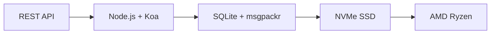

# Den første komplette e-mail-API: Hvordan videresendt e-mail revolutionerede e-mailhåndtering {#the-first-complete-email-api-how-forward-email-revolutionized-email-management}


<p class="lead mt-3">
<strong>TL;DR:</strong> Vi byggede verdens første komplette REST API til e-mailhåndtering med avancerede søgefunktioner, som ingen anden tjeneste tilbyder. Mens Gmail, Outlook og Apple tvinger udviklere ind i IMAP-helvede eller API'er med begrænsede hastigheder, leverer Forward Email lynhurtige CRUD-operationer til beskeder, mapper, kontakter og kalendere via en samlet REST-grænseflade med over 15 søgeparametre. Dette er den e-mail API-udviklere, som har ventet på.
</p>

## Indholdsfortegnelse {#table-of-contents}

* [Problemet med e-mail-API'en](#the-email-api-problem)
* [Hvad udviklerne rent faktisk siger](#what-developers-are-actually-saying)
* [Den revolutionerende løsning til videresendelse af e-mail](#forward-emails-revolutionary-solution)
  * [Hvorfor vi byggede dette](#why-we-built-this)
  * [Simpel godkendelse](#simple-authentication)
* [20 endepunkter, der ændrer alt](#20-endpoints-that-change-everything)
  * [Beskeder (5 slutpunkter)](#messages-5-endpoints)
  * [Mapper (5 slutpunkter)](#folders-5-endpoints)
  * [Kontakter (5 slutpunkter)](#contacts-5-endpoints)
  * [Kalendere (5 slutpunkter)](#calendars-5-endpoints)
* [Avanceret søgning: Ingen anden service kan sammenlignes](#advanced-search-no-other-service-compares)
  * [Søge-API-landskabet er ødelagt](#the-search-api-landscape-is-broken)
  * [Videresend e-mails revolutionerende søge-API](#forward-emails-revolutionary-search-api)
  * [Eksempler på søgninger i den virkelige verden](#real-world-search-examples)
  * [Ydelsesfordele](#performance-advantages)
  * [Søgefunktioner som ingen andre har](#search-features-no-one-else-has)
  * [Hvorfor dette er vigtigt for udviklere](#why-this-matters-for-developers)
  * [Den tekniske implementering](#the-technical-implementation)
* [Lynhurtig ydeevnearkitektur](#blazing-fast-performance-architecture)
  * [Ydelsesbenchmarks](#performance-benchmarks)
  * [Arkitektur med fokus på privatliv](#privacy-first-architecture)
* [Hvorfor vi er anderledes: Den komplette sammenligning](#why-were-different-the-complete-comparison)
  * [Vigtigste udbyderbegrænsninger](#major-provider-limitations)
  * [Fordele ved videresendelse af e-mail](#forward-email-advantages)
  * [Problemet med gennemsigtighed i forbindelse med open source](#the-open-source-transparency-problem)
* [30+ eksempler på integration fra den virkelige verden](#30-real-world-integration-examples)
  * [1. Forbedring af WordPress kontaktformular](#1-wordpress-contact-form-enhancement)
  * [2. Zapier-alternativ til e-mailautomatisering](#2-zapier-alternative-for-email-automation)
  * [3. CRM e-mailsynkronisering](#3-crm-email-synchronization)
  * [4. Behandling af e-handelsordrer](#4-e-commerce-order-processing)
  * [5. Support af billetintegration](#5-support-ticket-integration)
  * [6. Nyhedsbrevshåndteringssystem](#6-newsletter-management-system)
  * [7. E-mailbaseret opgavestyring](#7-email-based-task-management)
  * [8. E-mail-aggregering med flere konti](#8-multi-account-email-aggregation)
  * [9. Avanceret e-mailanalyse-dashboard](#9-advanced-email-analytics-dashboard)
  * [10. Smart e-mailarkivering](#10-smart-email-archiving)
  * [11. Integration af e-mail til kalender](#11-email-to-calendar-integration)
  * [12. E-mail-backup og overholdelse af regler](#12-email-backup-and-compliance)
  * [13. E-mailbaseret indholdsstyring](#13-email-based-content-management)
  * [14. Administration af e-mailskabeloner](#14-email-template-management)
  * [15. E-mail-baseret workflowautomatisering](#15-email-based-workflow-automation)
  * [16. Overvågning af e-mailsikkerhed](#16-email-security-monitoring)
  * [17. Indsamling af e-mailbaserede spørgeskemaer](#17-email-based-survey-collection)
  * [18. Overvågning af e-mail-ydeevne](#18-email-performance-monitoring)
  * [19. E-mailbaseret leadkvalificering](#19-email-based-lead-qualification)
  * [20. E-mailbaseret projektstyring](#20-email-based-project-management)
  * [21. E-mailbaseret lagerstyring](#21-email-based-inventory-management)
  * [22. E-mailbaseret fakturabehandling](#22-email-based-invoice-processing)
  * [23. E-mailbaseret begivenhedstilmelding](#23-email-based-event-registration)
  * [24. E-mailbaseret arbejdsgang til dokumentgodkendelse](#24-email-based-document-approval-workflow)
  * [25. E-mailbaseret analyse af kundefeedback](#25-email-based-customer-feedback-analysis)
  * [26. E-mailbaseret rekrutteringspipeline](#26-email-based-recruitment-pipeline)
  * [27. E-mailbaseret behandling af udgiftsrapporter](#27-email-based-expense-report-processing)
  * [28. E-mailbaseret kvalitetssikringsrapportering](#28-email-based-quality-assurance-reporting)
  * [29. E-mailbaseret leverandørstyring](#29-email-based-vendor-management)
  * [30. E-mailbaseret overvågning af sociale medier](#30-email-based-social-media-monitoring)
* [Kom godt i gang](#getting-started)
  * [1. Opret din konto til videresendelse af e-mails](#1-create-your-forward-email-account)
  * [2. Generer API-legitimationsoplysninger](#2-generate-api-credentials)
  * [3. Foretag dit første API-kald](#3-make-your-first-api-call)
  * [4. Udforsk dokumentationen](#4-explore-the-documentation)
* [Tekniske ressourcer](#technical-resources)

## Problemet med e-mail-API'et {#the-email-api-problem}

E-mail-API'er er fundamentalt ødelagte. Punktum.

Alle større e-mailudbydere tvinger udviklere til et af to forfærdelige valg:

1. **IMAP-helvede**: Brydning med en 30 år gammel protokol designet til desktopklienter, ikke moderne applikationer
2. **Forstyrrede API'er**: Hastighedsbegrænsede, skrivebeskyttede, OAuth-komplekse API'er, der ikke kan administrere dine faktiske e-maildata

Resultatet? Udviklere enten opgiver e-mailintegration helt eller spilder uger på at bygge skrøbelige IMAP-wrappers, der konstant går i stykker.

> \[!WARNING]
> **Den beskidte hemmelighed**: De fleste "e-mail-API'er" er blot afsendelses-API'er. Du kan ikke programmatisk organisere mapper, synkronisere kontakter eller administrere kalendere via en simpel REST-grænseflade. Indtil nu.

## Hvad udviklere rent faktisk siger {#what-developers-are-actually-saying}

Frustrationen er reel og dokumenteret overalt:

> "Jeg prøvede for nylig at integrere Gmail i min app, og jeg brugte for meget tid på det. Jeg besluttede, at det ikke er værd at understøtte Gmail."
>
> *- [Hacker News-udvikler](https://news.ycombinator.com/item?id=42106944), 147 upvotes*

> "Er alle e-mail-API'er middelmådige? De virker begrænsede eller restriktive på en eller anden måde."
>
> *- [Reddit r/SaaS-diskussion](https://www.reddit.com/r/SaaS/comments/1cm84s7/are_all_email_apis_mediocre/)*

> "Hvorfor skal e-mailudvikling være elendig?"
>
> *- [Reddit r/webdev](https://www.reddit.com/r/webdev/comments/15trnp2/why_does_email_development_have_to_suck/), 89 kommentarer om udviklersmerter*

> "Hvad gør Gmail API mere effektiv end IMAP? En anden grund til, at Gmail API er meget mere effektiv, er, at den kun behøver at downloade hver besked én gang. Med IMAP skal hver besked downloades og indekseres..."
>
> *- [Stack Overflow-spørgsmål](https://stackoverflow.com/questions/25431022/what-makes-the-gmail-api-more-efficient-than-imap) med 47 opvotes*

Beviserne er overalt:

* **WordPress SMTP-problemer**: [631 GitHub-problemer](https://github.com/awesomemotive/WP-Mail-SMTP/issues) om leveringsfejl i e-mails
* **Zapier-begrænsninger**: [Klager fra lokalsamfundet](https://community.zapier.com/featured-articles-65/email-parser-by-zapier-limitations-and-alternatives-16958) om grænser for 10 e-mails/time og IMAP-detektionsfejl
* **IMAP API-projekter**: [Flere](https://github.com/ewildgoose/imap-api) [open source](https://emailengine.app/) [projekter](https://www.npmjs.com/package/imapflow) eksisterer specifikt for at "konvertere IMAP til REST", fordi ingen udbyder tilbyder dette
* **Gmail API-frustrationer**: [Stakoverløb](https://stackoverflow.com/questions/tagged/gmail-api) har 4.847 spørgsmål tagget "gmail-api" med almindelige klager over hastighedsgrænser og kompleksitet

## Videresend e-mails revolutionerende løsning {#forward-emails-revolutionary-solution}

Vi er den første e-mailtjeneste, der tilbyder komplette CRUD-operationer for alle e-maildata via et samlet REST API.

Dette er ikke bare endnu en afsendelses-API. Dette er fuld programmatisk kontrol over:

* **Beskeder**: Opret, læs, opdater, slet, søg, flyt, marker
* **Mapper**: Fuld IMAP-mappehåndtering via REST-slutpunkter
* **Kontakter**: [CardDAV](https://tools.ietf.org/html/rfc6352) kontaktlagring og synkronisering
* **Kalendere**: [CalDAV](https://tools.ietf.org/html/rfc4791) kalenderbegivenheder og planlægning

### Hvorfor vi byggede dette {#why-we-built-this}

**Problemet**: Alle e-mailudbydere behandler e-mail som en sort boks. Du kan sende e-mails, måske læse dem med kompleks OAuth, men du kan ikke rigtig *administrere* dine e-maildata programmatisk.

**Vores vision**: E-mail skal være lige så nem at integrere som ethvert moderne API. Ingen IMAP-biblioteker. Ingen OAuth-kompleksitet. Ingen mareridt med hastighedsgrænser. Bare simple REST-slutpunkter, der fungerer.

**Resultatet**: Den første e-mailtjeneste, hvor du kan bygge en komplet e-mailklient, CRM-integration eller automatiseringssystem udelukkende ved hjælp af HTTP-anmodninger.

### Simpel godkendelse {#simple-authentication}

Ingen [OAuth-kompleksitet](https://oauth.net/2/). Ingen [app-specifikke adgangskoder](https://support.google.com/accounts/answer/185833). Kun dine aliasoplysninger:

```bash
curl -u "alias@yourdomain.com:password" \
  https://api.forwardemail.net/v1/messages
```

## 20 slutpunkter, der ændrer alt {#20-endpoints-that-change-everything}

### Beskeder (5 slutpunkter) {#messages-5-endpoints}

* `GET /v1/messages` - Vis beskeder med filtrering (`?folder=`, `?is_unread=`, `?is_flagged=`)
* `POST /v1/messages` - Send nye beskeder direkte til mapper
* `GET /v1/messages/:id` - Hent specifik besked med fulde metadata
* `PUT /v1/messages/:id` - Opdater besked (flag, mappe, læsestatus)
* `DELETE /v1/messages/:id` - Slet besked permanent

### Mapper (5 slutpunkter) {#folders-5-endpoints}

* `GET /v1/folders` - Vis alle mapper med abonnementsstatus
* `POST /v1/folders` - Opret ny mappe med brugerdefinerede egenskaber
* `GET /v1/folders/:id` - Hent mappeoplysninger og beskedantal
* `PUT /v1/folders/:id` - Opdater mappeegenskaber og abonnement
* `DELETE /v1/folders/:id` - Slet mappe og håndter beskedflytning

### Kontakter (5 slutpunkter) {#contacts-5-endpoints}

* `GET /v1/contacts` - Liste over kontakter med søgning og paginering
* `POST /v1/contacts` - Opret ny kontakt med fuld vCard-understøttelse
* `GET /v1/contacts/:id` - Hent kontakt med alle felter og metadata
* `PUT /v1/contacts/:id` - Opdater kontaktoplysninger med ETag-validering
* `DELETE /v1/contacts/:id` - Slet kontakt med kaskadehåndtering

### Kalendere (5 slutpunkter) {#calendars-5-endpoints}

* `GET /v1/calendars` - Vis kalenderbegivenheder med datofiltrering
* `POST /v1/calendars` - Opret kalenderbegivenhed med deltagere og gentagelse
* `GET /v1/calendars/:id` - Hent begivenhedsdetaljer med tidszonehåndtering
* `PUT /v1/calendars/:id` - Opdater begivenhed med konfliktdetektion
* `DELETE /v1/calendars/:id` - Slet begivenhed med deltagernotifikationer

## Avanceret søgning: Ingen anden tjeneste kan sammenlignes {#advanced-search-no-other-service-compares}

**Videresend e-mail er den eneste e-mailtjeneste, der tilbyder omfattende, programmatisk søgning på tværs af alle meddelelsesfelter via en REST API.**

Mens andre udbydere i bedste fald tilbyder grundlæggende filtrering, har vi bygget den mest avancerede e-mail-søge-API nogensinde. Ingen Gmail API, Outlook API eller nogen anden tjeneste kommer i nærheden af vores søgemuligheder.

### Søge-API-landskabet er i stykker {#the-search-api-landscape-is-broken}

**Søgebegrænsninger i Gmail API:**

* ✅ Kun den grundlæggende `q`-parameter
* ❌ Ingen feltspecifik søgning
* ❌ Ingen filtrering af datointerval
* ❌ Ingen størrelsesbaseret filtrering
* ❌ Ingen filtrering af vedhæftede filer
* ❌ Begrænset til Gmails søgesyntaks

**Begrænsninger for søgning i Outlook API:**

* ✅ Grundlæggende `$search` parameter
* ❌ Ingen avanceret feltmålretning
* ❌ Ingen komplekse forespørgselskombinationer
* ❌ Aggressiv hastighedsbegrænsning
* ❌ Kompleks OData-syntaks kræves

**Apple iCloud:**

* ❌ Ingen API overhovedet
* ❌ Kun IMAP-søgning (hvis du kan få det til at virke)

**ProtonMail og Tuta:**

* ❌ Ingen offentlige API'er
* ❌ Ingen programmatiske søgefunktioner

### Videresend e-mails revolutionerende søge-API {#forward-emails-revolutionary-search-api}

**Vi tilbyder 15+ søgeparametre, som ingen anden tjeneste tilbyder:**

| Søgefunktion | Videresend e-mail | Gmail API | Outlook API | Andre |
| ------------------------------ | -------------------------------------- | ------------ | ------------------ | ------ |
| **Feltspecifik søgning** | ✅ Emne, brødtekst, fra, til, cc, overskrifter | ❌ | ❌ | ❌ |
| **Generel søgning i flere felter** | ✅ `?search=` på tværs af alle felter | ✅ Grundlæggende `q=` | ✅ Grundlæggende `$search=` | ❌ |
| **Filtrering af datointerval** | ✅ `?since=` & `?before=` | ❌ | ❌ | ❌ |
| **Størrelsesbaseret filtrering** | ✅ `?min_size=` & `?max_size=` | ❌ | ❌ | ❌ |
| **Filtrering af vedhæftede filer** | ✅ `?has_attachments=true/false` | ❌ | ❌ | ❌ |
| **Søgning i overskrift** | ✅ `?headers=X-Priority` | ❌ | ❌ | ❌ |
| **Søgning efter besked-ID** | ✅ `?message_id=abc123` | ❌ | ❌ | ❌ |
| **Kombinerede filtre** | ✅ Flere parametre med AND-logik | ❌ | ❌ | ❌ |
| **Uafhængig af store og små bogstaver** | ✅ Alle søgninger | ✅ | ✅ | ❌ |
| **Understøttelse af paginering** | ✅ Fungerer med alle søgeparametre | ✅ | ✅ | ❌ |

### Eksempler på søgninger fra den virkelige verden {#real-world-search-examples}

**Find alle fakturaer fra sidste kvartal:**

```bash
# Forward Email - Simple and powerful
GET /v1/messages?subject=invoice&since=2024-01-01T00:00:00Z&before=2024-04-01T00:00:00Z

# Gmail API - Impossible with their limited search
# No date range filtering available

# Outlook API - Complex OData syntax, limited functionality
GET /me/messages?$search="invoice"&$filter=receivedDateTime ge 2024-01-01T00:00:00Z
```

**Søg efter store vedhæftede filer fra en specifik afsender:**

```bash
# Forward Email - Comprehensive filtering
GET /v1/messages?from=finance@company.com&has_attachments=true&min_size=1000000

# Gmail API - Cannot filter by size or attachments programmatically
# Outlook API - No size filtering available
# Others - No APIs available
```

**Kompleks søgning i flere felter:**

```bash
# Forward Email - Advanced query capabilities
GET /v1/messages?body=quarterly&from=manager&is_flagged=true&folder=Reports

# Gmail API - Limited to basic text search only
GET /gmail/v1/users/me/messages?q=quarterly

# Outlook API - Basic search without field targeting
GET /me/messages?$search="quarterly"
```

### Ydelsesfordele {#performance-advantages}

**Ydeevne ved søgning efter videresendelse af e-mail:**

* ⚡ **Responstider under 100 ms** for komplekse søgninger
* 🔍 **Regex-optimering** med korrekt indeksering
* 📊 **Parallel forespørgselsudførelse** for antal og data
* 💾 **Effektiv hukommelsesudnyttelse** med lean-forespørgsler

**Problemer med konkurrenternes præstation:**

* 🐌 **Gmail API**: Hastigheden er begrænset til 250 kvotenheder pr. bruger pr. sekund
* 🐌 **Outlook API**: Aggressiv begrænsning med komplekse backoff-krav
* 🐌 **Andre**: Ingen API'er at sammenligne med

### Søgefunktioner som ingen andre har {#search-features-no-one-else-has}

#### 1. Headerspecifik søgning {#1-header-specific-search}

```bash
# Find messages with specific headers
GET /v1/messages?headers=X-Priority:1
GET /v1/messages?headers=X-Spam-Score
```

#### 2. Størrelsesbaseret intelligens {#2-size-based-intelligence}

```bash
# Find newsletter emails (typically large)
GET /v1/messages?min_size=50000&from=newsletter

# Find quick replies (typically small)
GET /v1/messages?max_size=1000&to=support
```

#### 3. Vedhæftede arbejdsgange {#3-attachment-based-workflows}

```bash
# Find all documents sent to legal team
GET /v1/messages?to=legal&has_attachments=true&body=contract

# Find emails without attachments for cleanup
GET /v1/messages?has_attachments=false&before=2023-01-01T00:00:00Z
```

#### 4. Kombineret forretningslogik {#4-combined-business-logic}

```bash
# Find urgent flagged messages from VIPs with attachments
GET /v1/messages?is_flagged=true&from=ceo&has_attachments=true&subject=urgent
```

### Hvorfor dette er vigtigt for udviklere {#why-this-matters-for-developers}

**Byg applikationer, der tidligere var umulige:**

1. **Avanceret e-mailanalyse**: Analysér e-mailmønstre efter størrelse, afsender og indhold
2. **Intelligent e-mailhåndtering**: Organiser automatisk baseret på komplekse kriterier
3. **Compliance og registrering**: Find specifikke e-mails i henhold til juridiske krav
4. **Business Intelligence**: Uddrag indsigt fra e-mailkommunikationsmønstre
5. **Automatiserede arbejdsgange**: Udløs handlinger baseret på sofistikerede e-mailfiltre

### Den tekniske implementering {#the-technical-implementation}

Vores søge-API bruger:

* **Regex-optimering** med korrekte indekseringsstrategier
* **Parallel udførelse** for ydeevne
* **Inputvalidering** for sikkerhed
* **Omfattende fejlhåndtering** for pålidelighed

```javascript
// Example: Complex search implementation
const searchConditions = [];

if (ctx.query.subject) {
  searchConditions.push({
    subject: { $regex: ctx.query.subject, $options: 'i' }
  });
}

if (ctx.query.from) {
  searchConditions.push({
    $or: [
      { 'from.address': { $regex: ctx.query.from, $options: 'i' } },
      { 'from.name': { $regex: ctx.query.from, $options: 'i' } }
    ]
  });
}

// Combine with AND logic
if (searchConditions.length > 0) {
  query.$and = searchConditions;
}
```

> \[!TIP]
> **Fordel for udviklere**: Med Forward Emails søge-API kan du bygge e-mail-applikationer, der kan konkurrere med desktopklienter i funktionalitet, samtidig med at du bevarer enkelheden ved REST API'er.

## Lynhurtig ydeevnearkitektur {#blazing-fast-performance-architecture}

Vores tekniske stak er bygget til hastighed og pålidelighed:



### Ydelsesbenchmarks {#performance-benchmarks}

**Hvorfor vi er lynhurtige:**

| Komponent | Teknologi | Ydelsesfordel |
| ------------ | --------------------------------------------------------------------------------- | --------------------------------------------- |
| **Opbevaring** | [NVMe SSD](https://en.wikipedia.org/wiki/NVM_Express) | 10 gange hurtigere end traditionel SATA |
| **Database** | [SQLite](https://sqlite.org/) + [msgpackr](https://github.com/kriszyp/msgpackr) | Nul netværkslatens, optimeret serialisering |
| **Hardware** | [AMD Ryzen](https://www.amd.com/en/products/processors/desktops/ryzen) bart metal | Ingen virtualiseringsoverhead |
| **Caching** | In-memory + persistent | Svartider på under et millisekund |
| **Sikkerhedskopier** | [Cloudflare R2](https://www.cloudflare.com/products/r2/) krypteret | Pålidelighed i virksomhedsklassen |

**Faktiske præstationstal:**

* **API-svartid**: < 50 ms i gennemsnit
* **Hentning af beskeder**: < 10 ms for cachelagrede beskeder
* **Mappehandlinger**: < 5 ms for metadatahandlinger
* **Kontaktsynkronisering**: 1000+ kontakter/sekund
* **Oppetid**: 99,99 % SLA med redundant infrastruktur

### Arkitektur med fokus på privatliv {#privacy-first-architecture}

**Zero-Knowledge Design**: Kun du har adgang med din IMAP-adgangskode - vi kan ikke læse dine e-mails. Vores [nul-vidensarkitektur](https://forwardemail.net/en/security) sikrer fuldstændig privatliv og leverer samtidig en fremragende ydeevne.

## Hvorfor vi er anderledes: Den komplette sammenligning {#why-were-different-the-complete-comparison}

### Vigtigste udbyderbegrænsninger {#major-provider-limitations}

| Udbyder | Kerneproblemer | Specifikke begrænsninger |
| ---------------- | ----------------------------------------- | -------------------------------------------------------------------------------------------------------------------------------------------------------------------------------------------------------------------------------------------------------------------------------------------------------------------------------------------------------------------------------------------------------------------------------------------------------------------- |
| **Gmail API** | Skrivebeskyttet, kompleks OAuth, separate API'er | • [Cannot modify existing messages](https://developers.google.com/gmail/api/reference/rest/v1/users.messages)<br>• [Labels ≠ folders](https://developers.google.com/gmail/api/reference/rest/v1/users.labels)<br>• [1 billion quota units/day limit](https://developers.google.com/gmail/api/reference/quota)<br>• [Requires separate APIs](https://developers.google.com/workspace) til kontakter/kalender |
| **Outlook API** | Forældet, Forvirrende, Virksomhedsfokuseret | • [REST endpoints deprecated March 2024](https://learn.microsoft.com/en-us/outlook/rest/compare-graph)<br>• [Multiple confusing APIs](https://learn.microsoft.com/en-us/office/client-developer/outlook/selecting-an-api-or-technology-for-developing-solutions-for-outlook) (EWS, Graf, REST)<br>• [Microsoft Graph complexity](https://learn.microsoft.com/en-us/graph/overview)<br>• [Aggressive throttling](https://learn.microsoft.com/en-us/graph/throttling) |
| **Apple iCloud** | Ingen offentlig API | • [No public API whatsoever](https://support.apple.com/en-us/102654)<br>• [IMAP-only with 1000 emails/day limit](https://support.apple.com/en-us/102654)<br>• [App-specific passwords required](https://support.apple.com/en-us/102654)<br>• [500 recipients per message limit](https://support.apple.com/en-us/102654) |
| **ProtonMail** | Ingen API, falske open source-påstande | • [No public API available](https://proton.me/support/protonmail-bridge-clients)<br>• [Bridge software required](https://proton.me/mail/bridge) for IMAP-adgang<br>• [Claims "open source"](https://proton.me/blog/open-source) men [server code is proprietary](https://github.com/ProtonMail)<br>• [Limited to paid plans only](https://proton.me/pricing) |
| **Total** | Ingen API, vildledende gennemsigtighed | • [No REST API for email management](https://tuta.com/support#technical)<br>• [Claims "open source"](https://tuta.com/blog/posts/open-source-email) men [backend is closed](https://github.com/tutao/tutanota)<br>• [IMAP/SMTP not supported](https://tuta.com/support#imap)<br>• [Proprietary encryption](https://tuta.com/encryption) forhindrer standardintegrationer |
| **Zapier-e-mail** | Alvorlige hastighedsgrænser | • [10 emails per hour limit](https://help.zapier.com/hc/en-us/articles/8496181555597-Email-Parser-by-Zapier-limitations-and-alternatives)<br>• [No IMAP folder access](https://help.zapier.com/hc/en-us/articles/8496181555597-Email-Parser-by-Zapier-limitations-and-alternatives)<br>• [Limited parsing capabilities](https://help.zapier.com/hc/en-us/articles/8496181555597-Email-Parser-by-Zapier-limitations-and-alternatives) |

### Fordele ved videresendelse af e-mail {#forward-email-advantages}

| Funktion | Videresend e-mail | Konkurrence |
| ------------------ | -------------------------------------------------------------------------------------------- | ----------------------------------------- |
| **Komplet CRUD** | ✅ Fuld oprettelse, læsning, opdatering og sletning af alle data | ❌ Skrivebeskyttet eller begrænsede operationer |
| **Ensartet API** | ✅ Beskeder, mapper, kontakter, kalendere i én API | ❌ Separate API'er eller manglende funktioner |
| **Simpel godkendelse** | ✅ Grundlæggende godkendelse med aliasoplysninger | ❌ Kompleks OAuth med flere scopes |
| **Ingen takstgrænser** | ✅ Generøse grænser designet til virkelige anvendelser | ❌ Restriktive kvoter, der forstyrrer arbejdsgange |
| **Selvhosting** | ✅ [Complete self-hosting option](https://forwardemail.net/en/blog/docs/self-hosted-solution) | ❌ Kun leverandørlåsning |
| **Privatliv** | ✅ Nulviden, krypteret, privat | ❌ Data mining og bekymringer om privatlivets fred |
| **Præstation** | ✅ Responstider på under 50 ms, NVMe-lagring | ❌ Netværkslatenstid, forsinkelser i begrænsninger |

### Problemet med gennemsigtighed i open source {#the-open-source-transparency-problem}

**ProtonMail og Tuta markedsfører sig selv som "open source" og "transparente", men dette er vildledende markedsføring, der overtræder moderne privatlivsprincipper.**

> \[!WARNING]
> **Falske påstande om gennemsigtighed**: Både ProtonMail og Tuta reklamerer tydeligt for deres "open source"-legitimationsoplysninger, mens de holder deres mest kritiske serversidekode proprietær og lukket.

**ProtonMails bedrag:**

* **Påstande**: ["Vi er open source"](https://proton.me/blog/open-source) fremtrædende omtalt i markedsføring
* **Realitet**: [Serverkode er fuldstændig proprietær](https://github.com/ProtonMail) - kun klientapps er open source
* **Virkning**: Brugere kan ikke verificere serversidekryptering, datahåndtering eller privatlivskrav
* **Overtrædelse af gennemsigtighed**: Ingen mulighed for at revidere de faktiske e-mailbehandlings- og lagringssystemer

**Tutas vildledende markedsføring:**

* **Påstande**: ["Open source e-mail"](https://tuta.com/blog/posts/open-source-email) som et centralt salgsargument
* **Realitet**: [Backend-infrastruktur er lukket kildekode](https://github.com/tutao/tutanota) - kun frontend er tilgængelig
* **Virkning**: Proprietær kryptering forhindrer standard e-mailprotokoller (IMAP/SMTP)
* **Låsningsstrategi**: Brugerdefineret kryptering tvinger leverandørafhængighed frem

**Hvorfor dette er vigtigt for moderne privatliv:**

I 2025 kræver ægte privatliv **fuldstændig gennemsigtighed**. Når e-mailudbydere hævder at være "open source", men skjuler deres serverkode:

1. **Uverificerbar kryptering**: Du kan ikke kontrollere, hvordan dine data rent faktisk er krypteret
2. **Skjulte datapraksis**: Datahåndtering på serversiden forbliver en sort boks
3. **Tillidsbaseret sikkerhed**: Du skal stole på deres påstande uden verifikation
4. **Leverandørlåsning**: Proprietære systemer forhindrer dataportabilitet

**Videresendt e-mails sande gennemsigtighed:**

* ✅ **[Fuldstændig open source](https://github.com/forwardemail/forwardemail.net)** - server- og klientkode
* ✅ **[Selvhosting tilgængelig](https://forwardemail.net/en/blog/docs/self-hosted-solution)** - kør din egen instans
* ✅ **Standardprotokoller** - IMAP-, SMTP-, CardDAV- og CalDAV-kompatibilitet
* ✅ **Sikkerhed, der kan kontrolleres** - hver linje kode kan inspiceres
* ✅ **Ingen leverandørbinding** - dine data, din kontrol

> \[!TIP]
> **Ægte open source betyder, at du kan verificere alle påstande.** Med Videresend Email kan du revidere vores kryptering, gennemgå vores datahåndtering og endda køre din egen instans. Det er ægte gennemsigtighed.

## 30+ eksempler på integration fra den virkelige verden {#30-real-world-integration-examples}

### 1. Forbedring af WordPress-kontaktformular {#1-wordpress-contact-form-enhancement}

**Problem**: [WordPress SMTP-konfigurationsfejl](https://github.com/awesomemotive/WP-Mail-SMTP/issues) ([631 GitHub-problemer](https://github.com/awesomemotive/WP-Mail-SMTP/issues))
**Løsning**: Direkte API-integration omgår [SMTP](https://tools.ietf.org/html/rfc5321) fuldstændigt

```javascript
// WordPress contact form that saves to Sent folder
await fetch('https://api.forwardemail.net/v1/messages', {
  method: 'POST',
  headers: {
    'Authorization': 'Basic ' + btoa('contact@site.com:password'),
    'Content-Type': 'application/json'
  },
  body: JSON.stringify({
    to: [{ address: 'owner@site.com' }],
    subject: 'Contact Form: ' + formData.subject,
    text: formData.message,
    folder: 'Sent'
  })
});
```

### 2. Zapier-alternativ til e-mailautomatisering {#2-zapier-alternative-for-email-automation}

**Problem**: [Zapiers grænse på 10 e-mails/time](https://help.zapier.com/hc/en-us/articles/8496181555597-Email-Parser-by-Zapier-limitations-and-alternatives) og [IMAP-detektionsfejl](https://community.zapier.com/featured-articles-65/email-parser-by-zapier-limitations-and-alternatives-16958)
**Løsning**: Ubegrænset automatisering med fuld kontrol over e-mail

```javascript
// Auto-organize emails by sender domain
const messages = await fetch('/v1/messages?folder=INBOX');
for (const message of messages) {
  const domain = message.from.split('@')[1];
  await fetch(`/v1/messages/${message.id}`, {
    method: 'PUT',
    body: JSON.stringify({ folder: `Clients/${domain}` })
  });
}
```

### 3. CRM e-mailsynkronisering {#3-crm-email-synchronization}

**Problem**: Manuel kontakthåndtering mellem e-mail og [CRM-systemer](https://en.wikipedia.org/wiki/Customer_relationship_management)
**Løsning**: Tovejssynkronisering med [CardDAV](https://tools.ietf.org/html/rfc6352) kontakt-API

```javascript
// Sync new email contacts to CRM
const newContacts = await fetch('/v1/contacts');
for (const contact of newContacts) {
  await crmAPI.createContact({
    name: contact.name,
    email: contact.email,
    source: 'email_api'
  });
}
```

### 4. Behandling af e-handelsordrer {#4-e-commerce-order-processing}

**Problem**: Manuel ordrebehandling via e-mail for [e-handelsplatforme](https://en.wikipedia.org/wiki/E-commerce)
**Løsning**: Automatiseret ordrehåndteringspipeline

```javascript
// Process order confirmation emails
const orders = await fetch('/v1/messages?folder=Orders');
const orderEmails = orders.filter(msg =>
  msg.subject.includes('Order Confirmation')
);

for (const order of orderEmails) {
  const orderData = parseOrderEmail(order.text);
  await updateInventory(orderData);
  await fetch(`/v1/messages/${order.id}`, {
    method: 'PUT',
    body: JSON.stringify({ folder: 'Orders/Processed' })
  });
}
```

### 5. Support af billetintegration {#5-support-ticket-integration}

**Problem**: E-mailtråde spredt ud over [helpdesk-platforme](https://en.wikipedia.org/wiki/Help_desk_software)
**Løsning**: Fuld sporing af e-mailtråde

```javascript
// Create support ticket from email thread
const messages = await fetch('/v1/messages?folder=Support');
const supportEmails = messages.filter(msg =>
  msg.to.some(addr => addr.includes('support@'))
);

for (const email of supportEmails) {
  const ticket = await supportSystem.createTicket({
    subject: email.subject,
    from: email.from,
    body: email.text,
    timestamp: email.date
  });
}
```

### 6. Nyhedsbrevsstyringssystem {#6-newsletter-management-system}

**Problem**: Begrænsede [nyhedsbrevsplatform](https://en.wikipedia.org/wiki/Email_marketing) integrationer
**Løsning**: Komplet administration af abonnentens livscyklus

```javascript
// Auto-manage newsletter subscriptions
const messages = await fetch('/v1/messages?folder=Newsletter');
const unsubscribes = messages.filter(msg =>
  msg.subject.toLowerCase().includes('unsubscribe')
);

for (const msg of unsubscribes) {
  await removeSubscriber(msg.from);
  await fetch(`/v1/messages/${msg.id}`, {
    method: 'PUT',
    body: JSON.stringify({ folder: 'Newsletter/Unsubscribed' })
  });
}
```

### 7. E-mail-baseret opgavestyring {#7-email-based-task-management}

**Problem**: Overbelastning af indbakken og [opgavesporing](https://en.wikipedia.org/wiki/Task_management)
**Løsning**: Konverter e-mails til handlingsrettede opgaver

```javascript
// Create tasks from flagged emails
const messages = await fetch('/v1/messages?is_flagged=true');
for (const email of messages) {
  await taskManager.createTask({
    title: email.subject,
    description: email.text,
    assignee: email.to[0].address,
    dueDate: extractDueDate(email.text)
  });
}
```

### 8. Aggregering af e-mails med flere konti {#8-multi-account-email-aggregation}

**Problem**: Administration af [flere e-mailkonti](https://en.wikipedia.org/wiki/Email_client) på tværs af udbydere
**Løsning**: Ensartet indbakkegrænseflade

```javascript
// Aggregate emails from multiple accounts
const accounts = ['work@domain.com', 'personal@domain.com'];
const allMessages = [];

for (const account of accounts) {
  const messages = await fetch('/v1/messages', {
    headers: { 'Authorization': getAuth(account) }
  });
  allMessages.push(...messages.map(m => ({ ...m, account })));
}
```

### 9. Avanceret e-mailanalysedashboard {#9-advanced-email-analytics-dashboard}

**Problem**: Ingen indsigt i [e-mailmønstre](https://en.wikipedia.org/wiki/Email_analytics) med sofistikeret filtrering
**Løsning**: Brugerdefineret e-mailanalyse ved hjælp af avancerede søgefunktioner

```javascript
// Generate comprehensive email analytics using advanced search
const analytics = {};

// Analyze email volume by sender domain
const messages = await fetch('/v1/messages');
analytics.senderDomains = analyzeSenderDomains(messages);

// Find large attachments consuming storage
const largeAttachments = await fetch('/v1/messages?has_attachments=true&min_size=1000000');
analytics.storageHogs = largeAttachments.map(msg => ({
  subject: msg.subject,
  from: msg.from,
  size: msg.size
}));

// Analyze communication patterns with VIPs
const vipEmails = await fetch('/v1/messages?from=ceo@company.com');
const urgentVipEmails = await fetch('/v1/messages?from=ceo@company.com&subject=urgent');
analytics.vipCommunication = {
  total: vipEmails.length,
  urgent: urgentVipEmails.length,
  urgencyRate: (urgentVipEmails.length / vipEmails.length) * 100
};

// Find unread emails by date range for follow-up
const lastWeek = new Date(Date.now() - 7 * 24 * 60 * 60 * 1000).toISOString();
const unreadRecent = await fetch(`/v1/messages?is_unread=true&since=${lastWeek}`);
analytics.followUpNeeded = unreadRecent.length;

// Analyze email sizes for optimization
const smallEmails = await fetch('/v1/messages?max_size=1000');
const mediumEmails = await fetch('/v1/messages?min_size=1000&max_size=50000');
const largeEmails = await fetch('/v1/messages?min_size=50000');
analytics.sizeDistribution = {
  small: smallEmails.length,
  medium: mediumEmails.length,
  large: largeEmails.length
};

// Search for compliance-related emails
const complianceEmails = await fetch('/v1/messages?body=confidential&has_attachments=true');
analytics.complianceReview = complianceEmails.length;
```

### 10. Smart e-mailarkivering {#10-smart-email-archiving}

**Problem**: Manuel [e-mailorganisation](https://en.wikipedia.org/wiki/Email_management)
**Løsning**: Intelligent e-mailkategorisering

```javascript
// Auto-archive old emails by category
const messages = await fetch('/v1/messages');
const oldEmails = messages.filter(email =>
  isOlderThan(email.date, 90) // 90 days
);

for (const email of oldEmails) {
  const category = categorizeEmail(email);
  await fetch(`/v1/messages/${email.id}`, {
    method: 'PUT',
    body: JSON.stringify({ folder: `Archive/${category}` })
  });
}
```

### 11. Integration af e-mail til kalender {#11-email-to-calendar-integration}

**Problem**: Manuel oprettelse af [kalenderbegivenhed](https://tools.ietf.org/html/rfc4791) fra e-mails
**Løsning**: Automatisk udtrækning og oprettelse af hændelser

```javascript
// Extract meeting details from emails
const messages = await fetch('/v1/messages?folder=Meetings');
const meetingEmails = messages.filter(email =>
  email.subject.toLowerCase().includes('meeting')
);

for (const email of meetingEmails) {
  const meetingData = extractMeetingInfo(email.text);
  if (meetingData.date && meetingData.time) {
    await fetch('/v1/calendars', {
      method: 'POST',
      body: JSON.stringify({
        title: email.subject,
        start: meetingData.datetime,
        attendees: [email.from, ...email.to]
      })
    });
  }
}
```

### 12. E-mail-backup og overholdelse af regler {#12-email-backup-and-compliance}

**Problem**: [E-mailopbevaring](https://en.wikipedia.org/wiki/Email_retention_policy) og overholdelse af regler
**Løsning**: Automatiseret sikkerhedskopiering med bevarelse af metadata

```javascript
// Backup emails with full metadata
const allMessages = await fetch('/v1/messages');
const backup = {
  timestamp: new Date(),
  messages: allMessages.map(msg => ({
    id: msg.id,
    subject: msg.subject,
    from: msg.from,
    to: msg.to,
    date: msg.date,
    flags: msg.flags
  }))
};
await saveToComplianceStorage(backup);
```

### 13. E-mail-baseret indholdsstyring {#13-email-based-content-management}

**Problem**: Administration af indholdsindsendelser via e-mail for [CMS-platforme](https://en.wikipedia.org/wiki/Content_management_system)
**Løsning**: E-mail som indholdsstyringssystem

```javascript
// Process content submissions from email
const messages = await fetch('/v1/messages?folder=Submissions');
const submissions = messages.filter(msg =>
  msg.to.some(addr => addr.includes('submit@'))
);

for (const submission of submissions) {
  const content = parseSubmission(submission.text);
  await cms.createDraft({
    title: submission.subject,
    content: content.body,
    author: submission.from
  });
}
```

### 14. Administration af e-mailskabeloner {#14-email-template-management}

**Problem**: Inkonsekvent [e-mailskabeloner](https://en.wikipedia.org/wiki/Email_template) på tværs af teamet
**Løsning**: Centraliseret skabelonsystem med API

```javascript
// Send templated emails with dynamic content
const template = await getEmailTemplate('welcome');
await fetch('/v1/messages', {
  method: 'POST',
  body: JSON.stringify({
    to: [{ address: newUser.email }],
    subject: template.subject.replace('{{name}}', newUser.name),
    html: template.html.replace('{{name}}', newUser.name),
    folder: 'Sent'
  })
});
```

### 15. E-mail-baseret workflowautomatisering {#15-email-based-workflow-automation}

**Problem**: Manuel [godkendelsesprocesser](https://en.wikipedia.org/wiki/Workflow) via e-mail
**Løsning**: Automatiserede arbejdsgangsudløsere

```javascript
// Process approval emails
const messages = await fetch('/v1/messages?folder=Approvals');
const approvals = messages.filter(msg =>
  msg.subject.includes('APPROVAL')
);

for (const approval of approvals) {
  const decision = parseApprovalDecision(approval.text);
  await workflow.processApproval({
    requestId: extractRequestId(approval.subject),
    decision: decision,
    approver: approval.from
  });
}
```

### 16. Overvågning af e-mailsikkerhed {#16-email-security-monitoring}

**Problem**: Manuel [detektion af sikkerhedstrusler](https://en.wikipedia.org/wiki/Email_security)
**Løsning**: Automatiseret trusselsanalyse

```javascript
// Monitor for suspicious emails
const recentEmails = await fetch('/v1/messages');
for (const email of recentEmails) {
  const threatScore = analyzeThreat(email);
  if (threatScore > 0.8) {
    await fetch(`/v1/messages/${email.id}`, {
      method: 'PUT',
      body: JSON.stringify({ folder: 'Security/Quarantine' })
    });
    await alertSecurityTeam(email);
  }
}
```

### 17. Indsamling af e-mailbaserede undersøgelser {#17-email-based-survey-collection}

**Problem**: Manuel [svar på undersøgelsen](https://en.wikipedia.org/wiki/Survey_methodology)-behandling
**Løsning**: Automatiseret svaraggregering

```javascript
// Collect and process survey responses
const messages = await fetch('/v1/messages?folder=Surveys');
const responses = messages.filter(msg =>
  msg.subject.includes('Survey Response')
);

const surveyData = responses.map(email => ({
  respondent: email.from,
  responses: parseSurveyData(email.text),
  timestamp: email.date
}));
await updateSurveyResults(surveyData);
```

### 18. Overvågning af e-mail-ydeevne {#18-email-performance-monitoring}

**Problem**: Ingen indsigt i [e-mail leveringsevne](https://en.wikipedia.org/wiki/Email_deliverability)
**Løsning**: E-mail-målinger i realtid

```javascript
// Monitor email delivery performance
const sentEmails = await fetch('/v1/messages?folder=Sent');
const deliveryStats = {
  sent: sentEmails.length,
  bounces: await countBounces(),
  deliveryRate: calculateDeliveryRate()
};
await updateDashboard(deliveryStats);
```

### 19. E-mailbaseret kundeemnekvalificering {#19-email-based-lead-qualification}

**Problem**: Manuel [lead scoring](https://en.wikipedia.org/wiki/Lead_scoring) fra e-mailinteraktioner
**Løsning**: Automatiseret pipeline til kvalificering af leads

```javascript
// Score leads based on email engagement
const prospects = await fetch('/v1/contacts');
for (const prospect of prospects) {
  const messages = await fetch('/v1/messages');
  const emails = messages.filter(msg =>
    msg.from.includes(prospect.email)
  );
  const score = calculateEngagementScore(emails);
  await crm.updateLeadScore(prospect.id, score);
}
```

### 20. E-mailbaseret projektstyring {#20-email-based-project-management}

**Problem**: [Projektopdateringer](https://en.wikipedia.org/wiki/Project_management) spredt ud over e-mailtråde
**Løsning**: Centraliseret projektkommunikationshub

```javascript
// Extract project updates from emails
const messages = await fetch('/v1/messages?folder=Projects');
const projectEmails = messages.filter(msg =>
  msg.subject.includes('Project Update')
);

for (const email of projectEmails) {
  const update = parseProjectUpdate(email.text);
  await projectManager.addUpdate({
    project: update.projectId,
    author: email.from,
    content: update.content
  });
}
```

### 21. E-mail-baseret lagerstyring {#21-email-based-inventory-management}

**Problem**: Manuelle lageropdateringer fra leverandør-e-mails
**Løsning**: Automatiseret lageropfølgning fra e-mailnotifikationer

```javascript
// Process inventory updates from supplier emails
const messages = await fetch('/v1/messages?folder=Suppliers');
const inventoryEmails = messages.filter(msg =>
  msg.subject.includes('Inventory Update') || msg.subject.includes('Stock Alert')
);

for (const email of inventoryEmails) {
  const inventoryData = parseInventoryUpdate(email.text);
  await inventory.updateStock({
    sku: inventoryData.sku,
    quantity: inventoryData.quantity,
    supplier: email.from,
    timestamp: email.date
  });

  // Move to processed folder
  await fetch(`/v1/messages/${email.id}`, {
    method: 'PUT',
    body: JSON.stringify({ folder: 'Suppliers/Processed' })
  });
}
```

### 22. E-mailbaseret fakturabehandling {#22-email-based-invoice-processing}

**Problem**: Manuel [fakturabehandling](https://en.wikipedia.org/wiki/Invoice_processing) og regnskabsintegration
**Løsning**: Automatisk fakturaudtrækning og synkronisering af regnskabssystem

```javascript
// Extract invoice data from email attachments
const messages = await fetch('/v1/messages?folder=Invoices');
const invoiceEmails = messages.filter(msg =>
  msg.subject.toLowerCase().includes('invoice') && msg.attachments.length > 0
);

for (const email of invoiceEmails) {
  const invoiceData = await extractInvoiceData(email.attachments[0]);
  await accounting.createInvoice({
    vendor: email.from,
    amount: invoiceData.total,
    dueDate: invoiceData.dueDate,
    items: invoiceData.lineItems
  });

  // Flag as processed
  await fetch(`/v1/messages/${email.id}`, {
    method: 'PUT',
    body: JSON.stringify({ flags: ['\\Seen', '\\Flagged'] })
  });
}
```

### 23. E-mailbaseret begivenhedsregistrering {#23-email-based-event-registration}

**Problem**: Manuel [tilmelding til begivenhed](https://en.wikipedia.org/wiki/Event_management)-behandling fra e-mailsvar
**Løsning**: Automatiseret deltagerstyring og kalenderintegration

```javascript
// Process event registration emails
const messages = await fetch('/v1/messages?folder=Events');
const registrations = messages.filter(msg =>
  msg.subject.includes('Registration') || msg.subject.includes('RSVP')
);

for (const registration of registrations) {
  const attendeeData = parseRegistration(registration.text);

  // Add to attendee list
  await events.addAttendee({
    event: attendeeData.eventId,
    name: attendeeData.name,
    email: registration.from,
    dietary: attendeeData.dietaryRestrictions
  });

  // Create calendar event for attendee
  await fetch('/v1/calendars', {
    method: 'POST',
    body: JSON.stringify({
      title: attendeeData.eventName,
      start: attendeeData.eventDate,
      attendees: [registration.from]
    })
  });
}
```

### 24. E-mail-baseret arbejdsgang til dokumentgodkendelse {#24-email-based-document-approval-workflow}

**Problem**: Komplekse [dokumentgodkendelse](https://en.wikipedia.org/wiki/Document_management_system)-kæder via e-mail
**Løsning**: Automatiseret godkendelsessporing og dokumentversionering

```javascript
// Track document approval workflow
const messages = await fetch('/v1/messages?folder=Approvals');
const approvalEmails = messages.filter(msg =>
  msg.subject.includes('Document Approval')
);

for (const email of approvalEmails) {
  const approval = parseApprovalEmail(email.text);

  await documentSystem.updateApproval({
    documentId: approval.documentId,
    approver: email.from,
    status: approval.decision, // 'approved', 'rejected', 'needs_changes'
    comments: approval.comments,
    timestamp: email.date
  });

  // Check if all approvals complete
  const document = await documentSystem.getDocument(approval.documentId);
  if (document.allApprovalsComplete) {
    await documentSystem.finalizeDocument(approval.documentId);
  }
}
```

### 25. E-mailbaseret kundefeedbackanalyse {#25-email-based-customer-feedback-analysis}

**Problem**: Manuel [kundefeedback](https://en.wikipedia.org/wiki/Customer_feedback)-indsamling og sentimentanalyse
**Løsning**: Automatiseret feedbackbehandling og sentimentsporing

```javascript
// Analyze customer feedback from emails
const messages = await fetch('/v1/messages?folder=Feedback');
const feedbackEmails = messages.filter(msg =>
  msg.to.some(addr => addr.includes('feedback@'))
);

for (const email of feedbackEmails) {
  const sentiment = await analyzeSentiment(email.text);
  const category = categorizeFeeback(email.text);

  await feedback.recordFeedback({
    customer: email.from,
    content: email.text,
    sentiment: sentiment.score, // -1 to 1
    category: category, // 'bug', 'feature', 'complaint', 'praise'
    priority: calculatePriority(sentiment, category),
    timestamp: email.date
  });

  // Auto-escalate negative feedback
  if (sentiment.score < -0.5) {
    await escalateToSupport(email);
  }
}
```

### 26. E-mailbaseret rekrutteringspipeline {#26-email-based-recruitment-pipeline}

**Problem**: Manuel [rekruttering](https://en.wikipedia.org/wiki/Recruitment) og kandidatsporing
**Løsning**: Automatiseret kandidatstyring og interviewplanlægning

```javascript
// Process job application emails
const messages = await fetch('/v1/messages?folder=Careers');
const applications = messages.filter(msg =>
  msg.subject.toLowerCase().includes('application') && msg.attachments.length > 0
);

for (const application of applications) {
  const resume = await parseResume(application.attachments[0]);

  const candidate = await ats.createCandidate({
    name: resume.name,
    email: application.from,
    skills: resume.skills,
    experience: resume.experience,
    position: extractPosition(application.subject)
  });

  // Auto-schedule screening if qualified
  if (candidate.qualificationScore > 0.7) {
    await calendar.scheduleInterview({
      candidateId: candidate.id,
      type: 'phone_screening',
      duration: 30
    });
  }
}
```

### 27. E-mailbaseret behandling af udgiftsrapporter {#27-email-based-expense-report-processing}

**Problem**: Manuel indsendelse og godkendelse af [udgiftsrapport](https://en.wikipedia.org/wiki/Expense_report)
**Løsning**: Automatiseret arbejdsgang til udtræk og godkendelse af udgifter

```javascript
// Process expense report emails
const messages = await fetch('/v1/messages?folder=Expenses');
const expenseEmails = messages.filter(msg =>
  msg.subject.includes('Expense') && msg.attachments.length > 0
);

for (const email of expenseEmails) {
  const receipts = await processReceipts(email.attachments);

  const expenseReport = await expenses.createReport({
    employee: email.from,
    expenses: receipts.map(receipt => ({
      amount: receipt.total,
      category: receipt.category,
      date: receipt.date,
      merchant: receipt.merchant
    })),
    totalAmount: receipts.reduce((sum, r) => sum + r.total, 0)
  });

  // Auto-approve small amounts
  if (expenseReport.totalAmount < 100) {
    await expenses.approve(expenseReport.id);
  } else {
    await expenses.sendForApproval(expenseReport.id);
  }
}
```

### 28. E-mailbaseret kvalitetssikringsrapportering {#28-email-based-quality-assurance-reporting}

**Problem**: Manuel [kvalitetssikring](https://en.wikipedia.org/wiki/Quality_assurance) problemsporing
**Løsning**: Automatiseret QA-problemhåndtering og fejlsporing

```javascript
// Process QA bug reports from email
const messages = await fetch('/v1/messages?folder=QA');
const bugReports = messages.filter(msg =>
  msg.subject.includes('Bug Report') || msg.subject.includes('QA Issue')
);

for (const report of bugReports) {
  const bugData = parseBugReport(report.text);

  const ticket = await bugTracker.createIssue({
    title: report.subject,
    description: bugData.description,
    severity: bugData.severity,
    steps: bugData.stepsToReproduce,
    reporter: report.from,
    attachments: report.attachments
  });

  // Auto-assign based on component
  const assignee = await getComponentOwner(bugData.component);
  await bugTracker.assign(ticket.id, assignee);

  // Create calendar reminder for follow-up
  await fetch('/v1/calendars', {
    method: 'POST',
    body: JSON.stringify({
      title: `Follow up on ${ticket.id}`,
      start: addDays(new Date(), 3),
      attendees: [assignee]
    })
  });
}
```

### 29. E-mail-baseret leverandørstyring {#29-email-based-vendor-management}

**Problem**: Manuel [leverandørkommunikation](https://en.wikipedia.org/wiki/Vendor_management) og kontraktsporing
**Løsning**: Automatiseret styring af leverandørrelationer

```javascript
// Track vendor communications and contracts
const messages = await fetch('/v1/messages?folder=Vendors');
const vendorEmails = messages.filter(msg =>
  isVendorEmail(msg.from)
);

for (const email of vendorEmails) {
  const vendor = await vendors.getByEmail(email.from);

  // Log communication
  await vendors.logCommunication({
    vendorId: vendor.id,
    type: 'email',
    subject: email.subject,
    content: email.text,
    timestamp: email.date
  });

  // Check for contract-related keywords
  if (email.text.includes('contract') || email.text.includes('renewal')) {
    await vendors.flagForContractReview({
      vendorId: vendor.id,
      emailId: email.id,
      priority: 'high'
    });

    // Create task for procurement team
    await tasks.create({
      title: `Review contract communication from ${vendor.name}`,
      assignee: 'procurement@company.com',
      dueDate: addDays(new Date(), 2)
    });
  }
}
```

### 30. E-mailbaseret overvågning af sociale medier {#30-email-based-social-media-monitoring}

**Problem**: Manuel sporing og svar af [sociale medier](https://en.wikipedia.org/wiki/Social_media_monitoring) omtaler
**Løsning**: Automatiseret behandling af sociale medier-advarsler og koordinering af svar

```javascript
// Process social media alerts from email notifications
const messages = await fetch('/v1/messages?folder=Social');
const socialAlerts = messages.filter(msg =>
  msg.from.includes('alerts@') || msg.subject.includes('Social Mention')
);

for (const alert of socialAlerts) {
  const mention = parseSocialMention(alert.text);

  await socialMedia.recordMention({
    platform: mention.platform,
    author: mention.author,
    content: mention.content,
    sentiment: mention.sentiment,
    reach: mention.followerCount,
    url: mention.url
  });

  // Auto-escalate negative mentions with high reach
  if (mention.sentiment < -0.5 && mention.followerCount > 10000) {
    await socialMedia.escalateToTeam({
      mentionId: mention.id,
      priority: 'urgent',
      assignee: 'social-media-manager@company.com'
    });

    // Create calendar reminder for immediate response
    await fetch('/v1/calendars', {
      method: 'POST',
      body: JSON.stringify({
        title: `Urgent: Respond to negative social mention`,
        start: addMinutes(new Date(), 30),
        attendees: ['social-media-manager@company.com']
      })
    });
  }
}
```

## Introduktion {#getting-started}

### 1. Opret din konto til videresendelse af e-mails {#1-create-your-forward-email-account}

Tilmeld dig på [forwardemail.net](https://forwardemail.net) og bekræft dit domæne.

### 2. Generer API-legitimationsoplysninger {#2-generate-api-credentials}

Din alias-e-mail og adgangskode fungerer som API-legitimationsoplysninger – ingen yderligere opsætning kræves.

### 3. Foretag dit første API-kald {#3-make-your-first-api-call}

```bash
# List your messages
curl -u "your-alias@domain.com:password" \
  https://api.forwardemail.net/v1/messages

# Create a new contact
curl -u "your-alias@domain.com:password" \
  -X POST \
  -H "Content-Type: application/json" \
  -d '{"fullName":"John Doe","emails":[{"value":"john@example.com"}]}' \
  https://api.forwardemail.net/v1/contacts
```

### 4. Udforsk dokumentationen {#4-explore-the-documentation}

Besøg [forwardemail.net/en/email-api](https://forwardemail.net/en/email-api) for at få komplet API-dokumentation med interaktive eksempler.

## Tekniske ressourcer {#technical-resources}

* **[Komplet API-dokumentation](https://forwardemail.net/en/email-api)** - Interaktiv OpenAPI 3.0-specifikation
* **[Guide til selvhosting](https://forwardemail.net/en/blog/docs/self-hosted-solution)** - Implementer videresendt e-mail på din infrastruktur
* **[Hvidbog om sikkerhed](https://forwardemail.net/technical-whitepaper.pdf)** - Teknisk arkitektur og sikkerhedsdetaljer
* **[GitHub-arkivet](https://github.com/forwardemail/forwardemail.net)** - Open source-kodebase
* **[Udviklersupport](mailto:api@forwardemail.net)** - Direkte adgang til vores ingeniørteam

---

**Klar til at revolutionere din e-mailintegration?** [Begynd at bygge med Forward Emails API i dag](https://forwardemail.net/en/email-api) og oplev den første komplette e-mailadministrationsplatform designet til udviklere.

*Videresend e-mail: E-mailtjenesten, der endelig får API'erne til at fungere korrekt.*