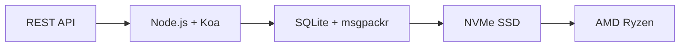

# Den Første Komplette Email API: Hvordan Forward Email Revolutionerede Email Administration {#the-first-complete-email-api-how-forward-email-revolutionized-email-management}


<p class="lead mt-3">
  <strong>TL;DR:</strong> Vi byggede verdens første komplette REST API til email-administration med avancerede søgemuligheder, som ingen anden tjeneste tilbyder. Mens Gmail, Outlook og Apple tvinger udviklere ind i IMAP-helvede eller rate-begrænsede API'er, leverer Forward Email lynhurtige CRUD-operationer for beskeder, mapper, kontakter og kalendere gennem en samlet REST-grænseflade med 15+ søgeparametre. Dette er den email API, udviklere har ventet på.
</p>


## Indholdsfortegnelse {#table-of-contents}

* [Email API Problemet](#the-email-api-problem)
* [Hvad Udviklere Faktisk Siger](#what-developers-are-actually-saying)
* [Forward Emails Revolutionerende Løsning](#forward-emails-revolutionary-solution)
  * [Hvorfor Vi Byggede Dette](#why-we-built-this)
  * [Simpel Autentificering](#simple-authentication)
* [20 Endpoints Der Ændrer Alt](#20-endpoints-that-change-everything)
  * [Beskeder (5 endpoints)](#messages-5-endpoints)
  * [Mapper (5 endpoints)](#folders-5-endpoints)
  * [Kontakter (5 endpoints)](#contacts-5-endpoints)
  * [Kalendere (5 endpoints)](#calendars-5-endpoints)
* [Avanceret Søgning: Ingen Anden Tjeneste Kan Måle Sig](#advanced-search-no-other-service-compares)
  * [Søge-API Landskabet er Brudt](#the-search-api-landscape-is-broken)
  * [Forward Emails Revolutionerende Søge-API](#forward-emails-revolutionary-search-api)
  * [Virkelige Søgeeksempler](#real-world-search-examples)
  * [Ydelsesfordele](#performance-advantages)
  * [Søgefunktioner Ingen Andre Har](#search-features-no-one-else-has)
  * [Hvorfor Dette Betyder Noget for Udviklere](#why-this-matters-for-developers)
  * [Den Tekniske Implementering](#the-technical-implementation)
* [Lynhurtig Ydelsesarkitektur](#blazing-fast-performance-architecture)
  * [Ydelsesmålinger](#performance-benchmarks)
  * [Privatlivsførste Arkitektur](#privacy-first-architecture)
* [Hvorfor Vi Er Forskellige: Den Komplette Sammenligning](#why-were-different-the-complete-comparison)
  * [Store Udbyderbegrænsninger](#major-provider-limitations)
  * [Forward Email Fordele](#forward-email-advantages)
  * [Problemet med Open-Source Transparens](#the-open-source-transparency-problem)
* [30+ Virkelige Integrations Eksempler](#30-real-world-integration-examples)
  * [1. Forbedring af WordPress Kontaktformular](#1-wordpress-contact-form-enhancement)
  * [2. Zapier Alternativ til Email Automatisering](#2-zapier-alternative-for-email-automation)
  * [3. CRM Email Synkronisering](#3-crm-email-synchronization)
  * [4. E-handel Ordrebehandling](#4-e-commerce-order-processing)
  * [5. Support Ticket Integration](#5-support-ticket-integration)
  * [6. Nyhedsbrev Administrationssystem](#6-newsletter-management-system)
  * [7. Email-baseret Opgavestyring](#7-email-based-task-management)
  * [8. Multi-Konto Email Aggregation](#8-multi-account-email-aggregation)
  * [9. Avanceret Email Analyse Dashboard](#9-advanced-email-analytics-dashboard)
  * [10. Smart Email Arkivering](#10-smart-email-archiving)
  * [11. Email-til-Kalender Integration](#11-email-to-calendar-integration)
  * [12. Email Backup og Overholdelse](#12-email-backup-and-compliance)
  * [13. Email-baseret Indholdsstyring](#13-email-based-content-management)
  * [14. Email Skabelonstyring](#14-email-template-management)
  * [15. Email-baseret Workflow Automatisering](#15-email-based-workflow-automation)
  * [16. Email Sikkerhedsovervågning](#16-email-security-monitoring)
  * [17. Email-baseret Undersøgelsesindsamling](#17-email-based-survey-collection)
  * [18. Email Ydelsesovervågning](#18-email-performance-monitoring)
  * [19. Email-baseret Lead Kvalificering](#19-email-based-lead-qualification)
  * [20. Email-baseret Projektstyring](#20-email-based-project-management)
  * [21. Email-baseret Lagerstyring](#21-email-based-inventory-management)
  * [22. Email-baseret Fakturabehandling](#22-email-based-invoice-processing)
  * [23. Email-baseret Eventregistrering](#23-email-based-event-registration)
  * [24. Email-baseret Dokumentgodkendelsesworkflow](#24-email-based-document-approval-workflow)
  * [25. Email-baseret Kunde Feedback Analyse](#25-email-based-customer-feedback-analysis)
  * [26. Email-baseret Rekrutteringspipeline](#26-email-based-recruitment-pipeline)
  * [27. Email-baseret Udgiftsrapportbehandling](#27-email-based-expense-report-processing)
  * [28. Email-baseret Kvalitetssikringsrapportering](#28-email-based-quality-assurance-reporting)
  * [29. Email-baseret Leverandørstyring](#29-email-based-vendor-management)
  * [30. Email-baseret Sociale Medier Overvågning](#30-email-based-social-media-monitoring)
* [Kom Godt I Gang](#getting-started)
  * [1. Opret Din Forward Email Konto](#1-create-your-forward-email-account)
  * [2. Generer API Legitimationsoplysninger](#2-generate-api-credentials)
  * [3. Foretag Dit Første API Kald](#3-make-your-first-api-call)
  * [4. Udforsk Dokumentationen](#4-explore-the-documentation)
* [Tekniske Ressourcer](#technical-resources)
## Problemet med Email API'er {#the-email-api-problem}

Email API'er er grundlæggende ødelagte. Punktum.

Hver eneste større email-udbyder tvinger udviklere til et af to forfærdelige valg:

1. **IMAP Helvede**: At kæmpe med en 30 år gammel protokol designet til desktop-klienter, ikke moderne applikationer
2. **Handicappede API'er**: Rate-begrænsede, skrivebeskyttede, OAuth-komplekse API'er, der ikke kan håndtere dine faktiske email-data

Resultatet? Udviklere opgiver enten email-integration helt eller spilder uger på at bygge skrøbelige IMAP-wrapper, der konstant går i stykker.

> \[!WARNING]
> **Den beskidte hemmelighed**: De fleste "email API'er" er bare sending API'er. Du kan ikke programmere til at organisere mapper, synkronisere kontakter eller administrere kalendere gennem en simpel REST-grænseflade. Indtil nu.


## Hvad Udviklere Faktisk Siger {#what-developers-are-actually-saying}

Frustrationen er reel og dokumenteret overalt:

> "Jeg prøvede for nylig at integrere Gmail i min app, og jeg brugte alt for meget tid på det. Jeg besluttede, at det ikke er værd at støtte Gmail."
>
> *- [Hacker News udvikler](https://news.ycombinator.com/item?id=42106944), 147 upvotes*

> "Er alle email API'er middelmådige? De virker begrænsede eller restriktive på en eller anden måde."
>
> *- [Reddit r/SaaS diskussion](https://www.reddit.com/r/SaaS/comments/1cm84s7/are_all_email_apis_mediocre/)*

> "Hvorfor skal email-udvikling være så træls?"
>
> *- [Reddit r/webdev](https://www.reddit.com/r/webdev/comments/15trnp2/why_does_email_development_have_to_suck/), 89 kommentarer om udvikler-smerte*

> "Hvad gør Gmail API mere effektiv end IMAP? En anden grund til, at Gmail API er meget mere effektiv, er fordi den kun behøver at downloade hver besked én gang. Med IMAP skal hver besked downloades og indekseres..."
>
> *- [Stack Overflow spørgsmål](https://stackoverflow.com/questions/25431022/what-makes-the-gmail-api-more-efficient-than-imap) med 47 upvotes*

Beviserne er overalt:

* **WordPress SMTP problemer**: [631 GitHub issues](https://github.com/awesomemotive/WP-Mail-SMTP/issues) om email-leveringsfejl
* **Zapier begrænsninger**: [Community klager](https://community.zapier.com/featured-articles-65/email-parser-by-zapier-limitations-and-alternatives-16958) om 10 emails/time grænser og IMAP detektionsfejl
* **IMAP API projekter**: [Flere](https://github.com/ewildgoose/imap-api) [open-source](https://emailengine.app/) [projekter](https://www.npmjs.com/package/imapflow) findes specifikt for at "konvertere IMAP til REST", fordi ingen udbyder tilbyder dette
* **Gmail API frustrationer**: [Stack Overflow](https://stackoverflow.com/questions/tagged/gmail-api) har 4.847 spørgsmål tagget "gmail-api" med almindelige klager om rate limits og kompleksitet


## Forward Emails Revolutionerende Løsning {#forward-emails-revolutionary-solution}

**Vi er den første email-service, der tilbyder komplette CRUD-operationer for alle email-data gennem en samlet REST API.**

Dette er ikke bare endnu en sending API. Dette er komplet programmatisk kontrol over:

* **Beskeder**: Opret, læs, opdater, slet, søg, flyt, marker
* **Mapper**: Fuld IMAP mappeadministration via REST endpoints
* **Kontakter**: [CardDAV](https://tools.ietf.org/html/rfc6352) kontaktlagring og synkronisering
* **Kalendere**: [CalDAV](https://tools.ietf.org/html/rfc4791) kalenderbegivenheder og planlægning

### Hvorfor Vi Byggede Dette {#why-we-built-this}

**Problemet**: Hver email-udbyder behandler email som en sort boks. Du kan sende emails, måske læse dem med kompleks OAuth, men du kan ikke virkelig *administrere* dine email-data programmatisk.

**Vores Vision**: Email skal være lige så let at integrere som enhver moderne API. Ingen IMAP-biblioteker. Ingen OAuth-kompleksitet. Ingen rate limit mareridt. Bare simple REST endpoints, der virker.

**Resultatet**: Den første email-service, hvor du kan bygge en komplet email-klient, CRM-integration eller automatiseringssystem ved kun at bruge HTTP-forespørgsler.

### Simpel Autentifikation {#simple-authentication}

Ingen [OAuth-kompleksitet](https://oauth.net/2/). Ingen [app-specifikke adgangskoder](https://support.google.com/accounts/answer/185833). Bare dine alias-legitimationsoplysninger:

```bash
curl -u "alias@yourdomain.com:password" \
  https://api.forwardemail.net/v1/messages
```
## 20 Endpoints der ændrer alt {#20-endpoints-that-change-everything}

### Beskeder (5 endpoints) {#messages-5-endpoints}

* `GET /v1/messages` - Liste beskeder med filtrering (`?folder=`, `?is_unread=`, `?is_flagged=`)
* `POST /v1/messages` - Send nye beskeder direkte til mapper
* `GET /v1/messages/:id` - Hent specifik besked med fuld metadata
* `PUT /v1/messages/:id` - Opdater besked (flag, mappe, læst status)
* `DELETE /v1/messages/:id` - Slet besked permanent

### Mapper (5 endpoints) {#folders-5-endpoints}

* `GET /v1/folders` - Liste alle mapper med abonnementsstatus
* `POST /v1/folders` - Opret ny mappe med brugerdefinerede egenskaber
* `GET /v1/folders/:id` - Hent mappens detaljer og beskedtællinger
* `PUT /v1/folders/:id` - Opdater mappens egenskaber og abonnement
* `DELETE /v1/folders/:id` - Slet mappe og håndter beskedflytning

### Kontakter (5 endpoints) {#contacts-5-endpoints}

* `GET /v1/contacts` - Liste kontakter med søgning og paginering
* `POST /v1/contacts` - Opret ny kontakt med fuld vCard support
* `GET /v1/contacts/:id` - Hent kontakt med alle felter og metadata
* `PUT /v1/contacts/:id` - Opdater kontaktinformation med ETag validering
* `DELETE /v1/contacts/:id` - Slet kontakt med kaskadehåndtering

### Kalendere (5 endpoints) {#calendars-5-endpoints}

* `GET /v1/calendars` - Liste kalenderbegivenheder med datofiltrering
* `POST /v1/calendars` - Opret kalenderbegivenhed med deltagere og gentagelse
* `GET /v1/calendars/:id` - Hent begivenhedsdetaljer med tidszonehåndtering
* `PUT /v1/calendars/:id` - Opdater begivenhed med konfliktregistrering
* `DELETE /v1/calendars/:id` - Slet begivenhed med deltagerunderretninger


## Avanceret søgning: Ingen anden tjeneste kan måle sig {#advanced-search-no-other-service-compares}

**Forward Email er den eneste e-mail tjeneste, der tilbyder omfattende, programmatisk søgning på tværs af alle beskedfelter via en REST API.**

Mens andre udbydere højst tilbyder grundlæggende filtrering, har vi bygget den mest avancerede e-mail søge-API nogensinde. Ingen Gmail API, Outlook API eller anden tjeneste kommer i nærheden af vores søgemuligheder.

### Søge-API-landskabet er brudt {#the-search-api-landscape-is-broken}

**Gmail API søgebegrænsninger:**

* ✅ Grundlæggende `q` parameter kun
* ❌ Ingen felt-specifik søgning
* ❌ Ingen datointerval filtrering
* ❌ Ingen størrelsesbaseret filtrering
* ❌ Ingen vedhæftningsfiltrering
* ❌ Begrænset til Gmail's søgesyntaks

**Outlook API søgebegrænsninger:**

* ✅ Grundlæggende `$search` parameter
* ❌ Ingen avanceret feltmålretning
* ❌ Ingen komplekse forespørgselskombinationer
* ❌ Aggressiv ratebegrænsning
* ❌ Kompliceret OData syntaks krævet

**Apple iCloud:**

* ❌ Ingen API overhovedet
* ❌ Kun IMAP-søgning (hvis du kan få det til at virke)

**ProtonMail & Tuta:**

* ❌ Ingen offentlige API'er
* ❌ Ingen programmatisk søgemuligheder

### Forward Emails revolutionerende søge-API {#forward-emails-revolutionary-search-api}

**Vi tilbyder 15+ søgeparametre, som ingen anden tjeneste leverer:**

| Søgemulighed                  | Forward Email                         | Gmail API    | Outlook API        | Andre  |
| ----------------------------- | ------------------------------------ | ------------ | ------------------ | ------ |
| **Felt-specifik søgning**     | ✅ Emne, indhold, fra, til, cc, headers | ❌            | ❌                  | ❌      |
| **Multi-felt generel søgning**| ✅ `?search=` på tværs af alle felter | ✅ Grundlæggende `q=` | ✅ Grundlæggende `$search=` | ❌      |
| **Datointerval filtrering**   | ✅ `?since=` & `?before=`             | ❌            | ❌                  | ❌      |
| **Størrelsesbaseret filtrering** | ✅ `?min_size=` & `?max_size=`        | ❌            | ❌                  | ❌      |
| **Vedhæftningsfiltrering**    | ✅ `?has_attachments=true/false`      | ❌            | ❌                  | ❌      |
| **Header-søgning**            | ✅ `?headers=X-Priority`              | ❌            | ❌                  | ❌      |
| **Besked-ID søgning**         | ✅ `?message_id=abc123`               | ❌            | ❌                  | ❌      |
| **Kombinerede filtre**        | ✅ Flere parametre med OG-logik       | ❌            | ❌                  | ❌      |
| **Case-insensitiv**           | ✅ Alle søgninger                     | ✅            | ✅                  | ❌      |
| **Paginering understøttet**   | ✅ Fungerer med alle søgeparametre    | ✅            | ✅                  | ❌      |
### Real-World Search Examples {#real-world-search-examples}

**Find All Invoices from Last Quarter:**

```bash
# Forward Email - Simple and powerful
GET /v1/messages?subject=invoice&since=2024-01-01T00:00:00Z&before=2024-04-01T00:00:00Z

# Gmail API - Impossible with their limited search
# No date range filtering available

# Outlook API - Complex OData syntax, limited functionality
GET /me/messages?$search="invoice"&$filter=receivedDateTime ge 2024-01-01T00:00:00Z
```

**Search for Large Attachments from Specific Sender:**

```bash
# Forward Email - Comprehensive filtering
GET /v1/messages?from=finance@company.com&has_attachments=true&min_size=1000000

# Gmail API - Cannot filter by size or attachments programmatically
# Outlook API - No size filtering available
# Others - No APIs available
```

**Complex Multi-Field Search:**

```bash
# Forward Email - Advanced query capabilities
GET /v1/messages?body=quarterly&from=manager&is_flagged=true&folder=Reports

# Gmail API - Limited to basic text search only
GET /gmail/v1/users/me/messages?q=quarterly

# Outlook API - Basic search without field targeting
GET /me/messages?$search="quarterly"
```

### Performance Advantages {#performance-advantages}

**Forward Email Search Performance:**

* ⚡ **Sub-100ms svartider** for komplekse søgninger
* 🔍 **Regex-optimering** med korrekt indeksering
* 📊 **Parallel forespørgselsudførelse** for tælling og data
* 💾 **Effektiv hukommelsesbrug** med slanke forespørgsler

**Competitor Performance Issues:**

* 🐌 **Gmail API**: Ratebegrænset til 250 kvotaenheder per bruger per sekund
* 🐌 **Outlook API**: Aggressiv throttling med komplekse backoff-krav
* 🐌 **Others**: Ingen API'er til sammenligning

### Search Features No One Else Has {#search-features-no-one-else-has}

#### 1. Header-Specific Search {#1-header-specific-search}

```bash
# Find messages with specific headers
GET /v1/messages?headers=X-Priority:1
GET /v1/messages?headers=X-Spam-Score
```

#### 2. Size-Based Intelligence {#2-size-based-intelligence}

```bash
# Find newsletter emails (typically large)
GET /v1/messages?min_size=50000&from=newsletter

# Find quick replies (typically small)
GET /v1/messages?max_size=1000&to=support
```

#### 3. Attachment-Based Workflows {#3-attachment-based-workflows}

```bash
# Find all documents sent to legal team
GET /v1/messages?to=legal&has_attachments=true&body=contract

# Find emails without attachments for cleanup
GET /v1/messages?has_attachments=false&before=2023-01-01T00:00:00Z
```

#### 4. Combined Business Logic {#4-combined-business-logic}

```bash
# Find urgent flagged messages from VIPs with attachments
GET /v1/messages?is_flagged=true&from=ceo&has_attachments=true&subject=urgent
```

### Why This Matters for Developers {#why-this-matters-for-developers}

**Build Applications That Were Previously Impossible:**

1. **Avanceret e-mailanalyse**: Analyser e-mailmønstre efter størrelse, afsender, indhold
2. **Intelligent e-mailstyring**: Auto-organiser baseret på komplekse kriterier
3. **Overholdelse og opdagelse**: Find specifikke e-mails til juridiske krav
4. **Forretningsindsigt**: Udtræk indsigt fra e-mailkommunikationsmønstre
5. **Automatiserede workflows**: Udløs handlinger baseret på sofistikerede e-mailfiltre

### The Technical Implementation {#the-technical-implementation}

Our search API uses:

* **Regex optimization** with proper indexing strategies
* **Parallel execution** for performance
* **Input validation** for security
* **Comprehensive error handling** for reliability

```javascript
// Example: Complex search implementation
const searchConditions = [];

if (ctx.query.subject) {
  searchConditions.push({
    subject: { $regex: ctx.query.subject, $options: 'i' }
  });
}

if (ctx.query.from) {
  searchConditions.push({
    $or: [
      { 'from.address': { $regex: ctx.query.from, $options: 'i' } },
      { 'from.name': { $regex: ctx.query.from, $options: 'i' } }
    ]
  });
}

// Combine with AND logic
if (searchConditions.length > 0) {
  query.$and = searchConditions;
}
```

> \[!TIP]
> **Developer Advantage**: With Forward Email's search API, you can build email applications that rival desktop clients in functionality while maintaining the simplicity of REST APIs.
## Lynhurtig Ydeevne Arkitektur {#blazing-fast-performance-architecture}

Vores tekniske stack er bygget til hastighed og pålidelighed:


```mermaid
graph LR
    A[REST API] --> B[Node.js + Koa]
    B --> C[SQLite + msgpackr]
    C --> D[NVMe SSD]
    D --> E[AMD Ryzen]
```

### Ydeevne Benchmarks {#performance-benchmarks}

**Hvorfor vi er lynhurtige:**

| Komponent   | Teknologi                                                                        | Ydeevnefordel                              |
| ----------- | -------------------------------------------------------------------------------- | ------------------------------------------ |
| **Lagring** | [NVMe SSD](https://en.wikipedia.org/wiki/NVM_Express)                           | 10x hurtigere end traditionel SATA         |
| **Database**| [SQLite](https://sqlite.org/) + [msgpackr](https://github.com/kriszyp/msgpackr) | Ingen netværksforsinkelse, optimeret serialisering |
| **Hardware**| [AMD Ryzen](https://www.amd.com/en/products/processors/desktops/ryzen) bare metal| Ingen virtualiseringsomkostninger          |
| **Caching** | In-memory + persistent                                                           | Responstider under millisekunder           |
| **Backups** | [Cloudflare R2](https://www.cloudflare.com/products/r2/) krypteret               | Enterprise-niveau pålidelighed              |

**Reelle Ydeevnetal:**

* **API Responstid**: < 50ms i gennemsnit
* **Beskedhentning**: < 10ms for cachede beskeder
* **Mappeoperationer**: < 5ms for metadataoperationer
* **Kontakt-synkronisering**: 1000+ kontakter/sekund
* **Oppetid**: 99,99% SLA med redundant infrastruktur

### Privatliv-først Arkitektur {#privacy-first-architecture}

**Zero-Knowledge Design**: Kun du har adgang med din IMAP-adgangskode – vi kan ikke læse dine e-mails. Vores [zero-knowledge arkitektur](https://forwardemail.net/en/security) sikrer fuldstændigt privatliv samtidig med lynhurtig ydeevne.


## Hvorfor vi er forskellige: Den komplette sammenligning {#why-were-different-the-complete-comparison}

### Store Udbyderbegrænsninger {#major-provider-limitations}

| Udbyder         | Kerneproblemer                          | Specifikke Begrænsninger                                                                                                                                                                                                                                                                                                                                                                                                                                             |
| ---------------- | ------------------------------------- | -------------------------------------------------------------------------------------------------------------------------------------------------------------------------------------------------------------------------------------------------------------------------------------------------------------------------------------------------------------------------------------------------------------------------------------------------------------------- |
| **Gmail API**    | Read-only, Komplekst OAuth, Separate API'er | • [Kan ikke ændre eksisterende beskeder](https://developers.google.com/gmail/api/reference/rest/v1/users.messages)<br>• [Labels ≠ mapper](https://developers.google.com/gmail/api/reference/rest/v1/users.labels)<br>• [1 milliard kvoteenheder/dag grænse](https://developers.google.com/gmail/api/reference/quota)<br>• [Kræver separate API'er](https://developers.google.com/workspace) til kontakter/kalender                                                        |
| **Outlook API**  | Udfaset, Forvirrende, Enterprise-fokuseret | • [REST-endpoints udfaset marts 2024](https://learn.microsoft.com/en-us/outlook/rest/compare-graph)<br>• [Flere forvirrende API'er](https://learn.microsoft.com/en-us/office/client-developer/outlook/selecting-an-api-or-technology-for-developing-solutions-for-outlook) (EWS, Graph, REST)<br>• [Microsoft Graph kompleksitet](https://learn.microsoft.com/en-us/graph/overview)<br>• [Aggressiv throttling](https://learn.microsoft.com/en-us/graph/throttling) |
| **Apple iCloud** | Ingen offentlig API                   | • [Ingen offentlig API overhovedet](https://support.apple.com/en-us/102654)<br>• [Kun IMAP med 1000 e-mails/dag grænse](https://support.apple.com/en-us/102654)<br>• [App-specifikke adgangskoder kræves](https://support.apple.com/en-us/102654)<br>• [500 modtagere pr. besked grænse](https://support.apple.com/en-us/102654)                                                                                                                                          |
| **ProtonMail**   | Ingen API, Falske open-source påstande | • [Ingen offentlig API tilgængelig](https://proton.me/support/protonmail-bridge-clients)<br>• [Bridge-software kræves](https://proton.me/mail/bridge) for IMAP-adgang<br>• [Påstår "open source"](https://proton.me/blog/open-source) men [serverkode er proprietær](https://github.com/ProtonMail)<br>• [Begrænset til betalte planer](https://proton.me/pricing)                                                                                                         |
| **Tuta**         | Ingen API, Vildledende gennemsigtighed | • [Ingen REST API til e-mailhåndtering](https://tuta.com/support#technical)<br>• [Påstår "open source"](https://tuta.com/blog/posts/open-source-email) men [backend er lukket](https://github.com/tutao/tutanota)<br>• [IMAP/SMTP understøttes ikke](https://tuta.com/support#imap)<br>• [Proprietær kryptering](https://tuta.com/encryption) forhindrer standardintegrationer                                                                                               |
| **Zapier Email** | Alvorlige ratebegrænsninger            | • [10 e-mails pr. time grænse](https://help.zapier.com/hc/en-us/articles/8496181555597-Email-Parser-by-Zapier-limitations-and-alternatives)<br>• [Ingen IMAP-mappeadgang](https://help.zapier.com/hc/en-us/articles/8496181555597-Email-Parser-by-Zapier-limitations-and-alternatives)<br>• [Begrænsede parser-funktioner](https://help.zapier.com/hc/en-us/articles/8496181555597-Email-Parser-by-Zapier-limitations-and-alternatives)                                 |
### Fordele ved Forward Email {#forward-email-advantages}

| Funktion           | Forward Email                                                                               | Konkurrence                              |
| ------------------ | ------------------------------------------------------------------------------------------ | --------------------------------------- |
| **Fuld CRUD**      | ✅ Fuld oprettelse, læsning, opdatering, sletning for alle data                             | ❌ Kun læseadgang eller begrænsede funktioner |
| **Enheds-API**     | ✅ Beskeder, mapper, kontakter, kalendere i én API                                         | ❌ Separate API'er eller manglende funktioner |
| **Simpel Auth**    | ✅ Grundlæggende autentificering med alias-legitimationsoplysninger                         | ❌ Komplekst OAuth med flere scopes      |
| **Ingen Rate Limits** | ✅ Generøse grænser designet til rigtige applikationer                                   | ❌ Restriktive kvoter, der bryder arbejdsgange |
| **Selv-hosting**   | ✅ [Fuld selv-hosting mulighed](https://forwardemail.net/en/blog/docs/self-hosted-solution) | ❌ Kun leverandørlåsning                 |
| **Privatliv**      | ✅ Zero-knowledge, krypteret, privat                                                       | ❌ Dataudvinding og privatlivsproblemer  |
| **Ydeevne**        | ✅ Under 50 ms responstid, NVMe-lagring                                                   | ❌ Netværksforsinkelse, throttling-forsinkelser |

### Problemet med Open-Source Transparens {#the-open-source-transparency-problem}

**ProtonMail og Tuta markedsfører sig som "open source" og "transparente," men dette er vildledende markedsføring, der bryder med moderne privatlivsprincipper.**

> \[!WARNING]
> **Falske Transparenspåstande**: Både ProtonMail og Tuta reklamerer fremtrædende med deres "open source"-kvalifikationer, mens deres mest kritiske server-side kode er proprietær og lukket.

**ProtonMails bedrag:**

* **Påstande**: ["Vi er open source"](https://proton.me/blog/open-source) fremhævet i markedsføring
* **Virkelighed**: [Serverkode er fuldstændig proprietær](https://github.com/ProtonMail) – kun klientapps er open source
* **Konsekvens**: Brugere kan ikke verificere server-side kryptering, datahåndtering eller privatlivspåstande
* **Brud på transparens**: Ingen mulighed for at revidere de faktiske e-mail behandlings- og lagringssystemer

**Tutas vildledende markedsføring:**

* **Påstande**: ["Open source email"](https://tuta.com/blog/posts/open-source-email) som et kerne-salgsargument
* **Virkelighed**: [Backend-infrastruktur er lukket kilde](https://github.com/tutao/tutanota) – kun frontend er tilgængelig
* **Konsekvens**: Proprietær kryptering forhindrer standard e-mail protokoller (IMAP/SMTP)
* **Låsestrategi**: Tilpasset kryptering tvinger leverandørafhængighed

**Hvorfor dette er vigtigt for moderne privatliv:**

I 2025 kræver ægte privatliv **fuldstændig transparens**. Når e-mail-udbydere påstår "open source" men skjuler deres serverkode:

1. **Uverificerbar kryptering**: Du kan ikke revidere, hvordan dine data faktisk krypteres
2. **Skjulte datapraksisser**: Server-side datahåndtering forbliver en sort boks
3. **Tillidsbaseret sikkerhed**: Du må stole på deres påstande uden verifikation
4. **Leverandørlåsning**: Proprietære systemer forhindrer dataportabilitet

**Forward Emails ægte transparens:**

* ✅ **[Fuld open source](https://github.com/forwardemail/forwardemail.net)** – server- og klientkode
* ✅ **[Selv-hosting tilgængeligt](https://forwardemail.net/en/blog/docs/self-hosted-solution)** – kør din egen instans
* ✅ **Standardprotokoller** – IMAP, SMTP, CardDAV, CalDAV kompatibilitet
* ✅ **Reviderbar sikkerhed** – hver linje kode kan inspiceres
* ✅ **Ingen leverandørlåsning** – dine data, din kontrol

> \[!TIP]
> **Ægte open source betyder, at du kan verificere hver påstand.** Med Forward Email kan du revidere vores kryptering, gennemgå vores datahåndtering og endda køre din egen instans. Det er ægte transparens.


## 30+ Eksempler på Integration i Den Virkelige Verden {#30-real-world-integration-examples}

### 1. Forbedring af WordPress Kontaktformular {#1-wordpress-contact-form-enhancement}
**Problem**: [WordPress SMTP-konfigurationsfejl](https://github.com/awesomemotive/WP-Mail-SMTP/issues) ([631 GitHub issues](https://github.com/awesomemotive/WP-Mail-SMTP/issues))
**Løsning**: Direkte API-integration omgår [SMTP](https://tools.ietf.org/html/rfc5321) fuldstændigt

```javascript
// WordPress kontaktformular, der gemmer i Sendt-mappen
await fetch('https://api.forwardemail.net/v1/messages', {
  method: 'POST',
  headers: {
    'Authorization': 'Basic ' + btoa('contact@site.com:password'),
    'Content-Type': 'application/json'
  },
  body: JSON.stringify({
    to: [{ address: 'owner@site.com' }],
    subject: 'Kontaktformular: ' + formData.subject,
    text: formData.message,
    folder: 'Sent'
  })
});
```

### 2. Zapier-alternativ til e-mail-automatisering {#2-zapier-alternative-for-email-automation}

**Problem**: [Zapiers grænse på 10 e-mails/time](https://help.zapier.com/hc/en-us/articles/8496181555597-Email-Parser-by-Zapier-limitations-and-alternatives) og [IMAP-detekteringsfejl](https://community.zapier.com/featured-articles-65/email-parser-by-zapier-limitations-and-alternatives-16958)
**Løsning**: Ubegrænset automatisering med fuld e-mail-kontrol

```javascript
// Auto-organiser e-mails efter afsenderdomæne
const messages = await fetch('/v1/messages?folder=INBOX');
for (const message of messages) {
  const domain = message.from.split('@')[1];
  await fetch(`/v1/messages/${message.id}`, {
    method: 'PUT',
    body: JSON.stringify({ folder: `Clients/${domain}` })
  });
}
```

### 3. CRM-e-mail-synkronisering {#3-crm-email-synchronization}

**Problem**: Manuel kontaktstyring mellem e-mail og [CRM-systemer](https://en.wikipedia.org/wiki/Customer_relationship_management)
**Løsning**: To-vejs synkronisering med [CardDAV](https://tools.ietf.org/html/rfc6352) kontakt-API

```javascript
// Synkroniser nye e-mailkontakter til CRM
const newContacts = await fetch('/v1/contacts');
for (const contact of newContacts) {
  await crmAPI.createContact({
    name: contact.name,
    email: contact.email,
    source: 'email_api'
  });
}
```

### 4. E-handelsordrebehandling {#4-e-commerce-order-processing}

**Problem**: Manuel ordre-e-mailbehandling for [e-handelsplatforme](https://en.wikipedia.org/wiki/E-commerce)
**Løsning**: Automatiseret ordrebehandlingspipeline

```javascript
// Behandl ordrebekræftelses-e-mails
const orders = await fetch('/v1/messages?folder=Orders');
const orderEmails = orders.filter(msg =>
  msg.subject.includes('Order Confirmation')
);

for (const order of orderEmails) {
  const orderData = parseOrderEmail(order.text);
  await updateInventory(orderData);
  await fetch(`/v1/messages/${order.id}`, {
    method: 'PUT',
    body: JSON.stringify({ folder: 'Orders/Processed' })
  });
}
```

### 5. Supportticket-integration {#5-support-ticket-integration}

**Problem**: E-mailtråde spredt over [helpdesk-platforme](https://en.wikipedia.org/wiki/Help_desk_software)
**Løsning**: Fuld sporbarhed af e-mailtråde

```javascript
// Opret supportticket fra e-mailtråd
const messages = await fetch('/v1/messages?folder=Support');
const supportEmails = messages.filter(msg =>
  msg.to.some(addr => addr.includes('support@'))
);

for (const email of supportEmails) {
  const ticket = await supportSystem.createTicket({
    subject: email.subject,
    from: email.from,
    body: email.text,
    timestamp: email.date
  });
}
```

### 6. Nyhedsbrevsstyringssystem {#6-newsletter-management-system}

**Problem**: Begrænsede integrationer til [nyhedsbrevsplatforme](https://en.wikipedia.org/wiki/Email_marketing)
**Løsning**: Fuld styring af abonnenters livscyklus

```javascript
// Automatisk håndtering af nyhedsbrevsabonnementer
const messages = await fetch('/v1/messages?folder=Newsletter');
const unsubscribes = messages.filter(msg =>
  msg.subject.toLowerCase().includes('unsubscribe')
);

for (const msg of unsubscribes) {
  await removeSubscriber(msg.from);
  await fetch(`/v1/messages/${msg.id}`, {
    method: 'PUT',
    body: JSON.stringify({ folder: 'Newsletter/Unsubscribed' })
  });
}
```

### 7. E-mailbaseret opgavestyring {#7-email-based-task-management}

**Problem**: Overvældet indbakke og [opgavestyring](https://en.wikipedia.org/wiki/Task_management)
**Løsning**: Konverter e-mails til handlingsorienterede opgaver
```javascript
// Create tasks from flagged emails
const messages = await fetch('/v1/messages?is_flagged=true');
for (const email of messages) {
  await taskManager.createTask({
    title: email.subject,
    description: email.text,
    assignee: email.to[0].address,
    dueDate: extractDueDate(email.text)
  });
}
```

### 8. Multi-Account Email Aggregation {#8-multi-account-email-aggregation}

**Problem**: Managing [multiple email accounts](https://en.wikipedia.org/wiki/Email_client) across providers
**Solution**: Unified inbox interface

```javascript
// Aggregate emails from multiple accounts
const accounts = ['work@domain.com', 'personal@domain.com'];
const allMessages = [];

for (const account of accounts) {
  const messages = await fetch('/v1/messages', {
    headers: { 'Authorization': getAuth(account) }
  });
  allMessages.push(...messages.map(m => ({ ...m, account })));
}
```

### 9. Advanced Email Analytics Dashboard {#9-advanced-email-analytics-dashboard}

**Problem**: No insights into [email patterns](https://en.wikipedia.org/wiki/Email_analytics) with sophisticated filtering
**Solution**: Custom email analytics using advanced search capabilities

```javascript
// Generate comprehensive email analytics using advanced search
const analytics = {};

// Analyze email volume by sender domain
const messages = await fetch('/v1/messages');
analytics.senderDomains = analyzeSenderDomains(messages);

// Find large attachments consuming storage
const largeAttachments = await fetch('/v1/messages?has_attachments=true&min_size=1000000');
analytics.storageHogs = largeAttachments.map(msg => ({
  subject: msg.subject,
  from: msg.from,
  size: msg.size
}));

// Analyze communication patterns with VIPs
const vipEmails = await fetch('/v1/messages?from=ceo@company.com');
const urgentVipEmails = await fetch('/v1/messages?from=ceo@company.com&subject=urgent');
analytics.vipCommunication = {
  total: vipEmails.length,
  urgent: urgentVipEmails.length,
  urgencyRate: (urgentVipEmails.length / vipEmails.length) * 100
};

// Find unread emails by date range for follow-up
const lastWeek = new Date(Date.now() - 7 * 24 * 60 * 60 * 1000).toISOString();
const unreadRecent = await fetch(`/v1/messages?is_unread=true&since=${lastWeek}`);
analytics.followUpNeeded = unreadRecent.length;

// Analyze email sizes for optimization
const smallEmails = await fetch('/v1/messages?max_size=1000');
const mediumEmails = await fetch('/v1/messages?min_size=1000&max_size=50000');
const largeEmails = await fetch('/v1/messages?min_size=50000');
analytics.sizeDistribution = {
  small: smallEmails.length,
  medium: mediumEmails.length,
  large: largeEmails.length
};

// Search for compliance-related emails
const complianceEmails = await fetch('/v1/messages?body=confidential&has_attachments=true');
analytics.complianceReview = complianceEmails.length;
```

### 10. Smart Email Archiving {#10-smart-email-archiving}

**Problem**: Manual [email organization](https://en.wikipedia.org/wiki/Email_management)
**Solution**: Intelligent email categorization

```javascript
// Auto-archive old emails by category
const messages = await fetch('/v1/messages');
const oldEmails = messages.filter(email =>
  isOlderThan(email.date, 90) // 90 days
);

for (const email of oldEmails) {
  const category = categorizeEmail(email);
  await fetch(`/v1/messages/${email.id}`, {
    method: 'PUT',
    body: JSON.stringify({ folder: `Archive/${category}` })
  });
}
```

### 11. Email-to-Calendar Integration {#11-email-to-calendar-integration}

**Problem**: Manual [calendar event](https://tools.ietf.org/html/rfc4791) creation from emails
**Solution**: Automatic event extraction and creation

```javascript
// Extract meeting details from emails
const messages = await fetch('/v1/messages?folder=Meetings');
const meetingEmails = messages.filter(email =>
  email.subject.toLowerCase().includes('meeting')
);

for (const email of meetingEmails) {
  const meetingData = extractMeetingInfo(email.text);
  if (meetingData.date && meetingData.time) {
    await fetch('/v1/calendars', {
      method: 'POST',
      body: JSON.stringify({
        title: email.subject,
        start: meetingData.datetime,
        attendees: [email.from, ...email.to]
      })
    });
  }
}
```

### 12. Email Backup og Overholdelse {#12-email-backup-and-compliance}

**Problem**: [Email retention](https://en.wikipedia.org/wiki/Email_retention_policy) og overholdelseskrav  
**Løsning**: Automatisk backup med metadata-bevarelse

```javascript
// Backup emails with full metadata
const allMessages = await fetch('/v1/messages');
const backup = {
  timestamp: new Date(),
  messages: allMessages.map(msg => ({
    id: msg.id,
    subject: msg.subject,
    from: msg.from,
    to: msg.to,
    date: msg.date,
    flags: msg.flags
  }))
};
await saveToComplianceStorage(backup);
```

### 13. Email-baseret Indholdsstyring {#13-email-based-content-management}

**Problem**: Håndtering af indholdsforslag via email til [CMS-platforme](https://en.wikipedia.org/wiki/Content_management_system)  
**Løsning**: Email som indholdsstyringssystem

```javascript
// Process content submissions from email
const messages = await fetch('/v1/messages?folder=Submissions');
const submissions = messages.filter(msg =>
  msg.to.some(addr => addr.includes('submit@'))
);

for (const submission of submissions) {
  const content = parseSubmission(submission.text);
  await cms.createDraft({
    title: submission.subject,
    content: content.body,
    author: submission.from
  });
}
```

### 14. Email Skabelonstyring {#14-email-template-management}

**Problem**: Inkonsistente [email-skabeloner](https://en.wikipedia.org/wiki/Email_template) på tværs af teamet  
**Løsning**: Centraliseret skabelonsystem med API

```javascript
// Send templated emails with dynamic content
const template = await getEmailTemplate('welcome');
await fetch('/v1/messages', {
  method: 'POST',
  body: JSON.stringify({
    to: [{ address: newUser.email }],
    subject: template.subject.replace('{{name}}', newUser.name),
    html: template.html.replace('{{name}}', newUser.name),
    folder: 'Sent'
  })
});
```

### 15. Email-baseret Workflow Automation {#15-email-based-workflow-automation}

**Problem**: Manuelle [godkendelsesprocesser](https://en.wikipedia.org/wiki/Workflow) via email  
**Løsning**: Automatiserede workflow-triggere

```javascript
// Process approval emails
const messages = await fetch('/v1/messages?folder=Approvals');
const approvals = messages.filter(msg =>
  msg.subject.includes('APPROVAL')
);

for (const approval of approvals) {
  const decision = parseApprovalDecision(approval.text);
  await workflow.processApproval({
    requestId: extractRequestId(approval.subject),
    decision: decision,
    approver: approval.from
  });
}
```

### 16. Email Sikkerhedsovervågning {#16-email-security-monitoring}

**Problem**: Manuel [sikkerhedstrussel-detektion](https://en.wikipedia.org/wiki/Email_security)  
**Løsning**: Automatisk trusselanalyse

```javascript
// Monitor for suspicious emails
const recentEmails = await fetch('/v1/messages');
for (const email of recentEmails) {
  const threatScore = analyzeThreat(email);
  if (threatScore > 0.8) {
    await fetch(`/v1/messages/${email.id}`, {
      method: 'PUT',
      body: JSON.stringify({ folder: 'Security/Quarantine' })
    });
    await alertSecurityTeam(email);
  }
}
```

### 17. Email-baseret Undersøgelsesindsamling {#17-email-based-survey-collection}

**Problem**: Manuel [behandling af undersøgelsessvar](https://en.wikipedia.org/wiki/Survey_methodology)  
**Løsning**: Automatisk svaraggregation

```javascript
// Collect and process survey responses
const messages = await fetch('/v1/messages?folder=Surveys');
const responses = messages.filter(msg =>
  msg.subject.includes('Survey Response')
);

const surveyData = responses.map(email => ({
  respondent: email.from,
  responses: parseSurveyData(email.text),
  timestamp: email.date
}));
await updateSurveyResults(surveyData);
```

### 18. Email Performance Overvågning {#18-email-performance-monitoring}

**Problem**: Ingen indsigt i [email leveringsperformance](https://en.wikipedia.org/wiki/Email_deliverability)  
**Løsning**: Real-time email-målinger

```javascript
// Monitor email delivery performance
const sentEmails = await fetch('/v1/messages?folder=Sent');
const deliveryStats = {
  sent: sentEmails.length,
  bounces: await countBounces(),
  deliveryRate: calculateDeliveryRate()
};
await updateDashboard(deliveryStats);
```
### 19. Email-baseret Lead Kvalificering {#19-email-based-lead-qualification}

**Problem**: Manuel [lead scoring](https://en.wikipedia.org/wiki/Lead_scoring) fra email-interaktioner  
**Løsning**: Automatiseret lead kvalificeringspipeline

```javascript
// Score leads baseret på email-engagement
const prospects = await fetch('/v1/contacts');
for (const prospect of prospects) {
  const messages = await fetch('/v1/messages');
  const emails = messages.filter(msg =>
    msg.from.includes(prospect.email)
  );
  const score = calculateEngagementScore(emails);
  await crm.updateLeadScore(prospect.id, score);
}
```

### 20. Email-baseret Projektstyring {#20-email-based-project-management}

**Problem**: [Projektopdateringer](https://en.wikipedia.org/wiki/Project_management) spredt over email-tråde  
**Løsning**: Centraliseret projektkommunikationshub

```javascript
// Udtræk projektopdateringer fra emails
const messages = await fetch('/v1/messages?folder=Projects');
const projectEmails = messages.filter(msg =>
  msg.subject.includes('Project Update')
);

for (const email of projectEmails) {
  const update = parseProjectUpdate(email.text);
  await projectManager.addUpdate({
    project: update.projectId,
    author: email.from,
    content: update.content
  });
}
```

### 21. Email-baseret Lagerstyring {#21-email-based-inventory-management}

**Problem**: Manuel lageropdatering fra leverandør-emails  
**Løsning**: Automatiseret lagerstyring fra email-notifikationer

```javascript
// Behandl lageropdateringer fra leverandør-emails
const messages = await fetch('/v1/messages?folder=Suppliers');
const inventoryEmails = messages.filter(msg =>
  msg.subject.includes('Inventory Update') || msg.subject.includes('Stock Alert')
);

for (const email of inventoryEmails) {
  const inventoryData = parseInventoryUpdate(email.text);
  await inventory.updateStock({
    sku: inventoryData.sku,
    quantity: inventoryData.quantity,
    supplier: email.from,
    timestamp: email.date
  });

  // Flyt til behandlet mappe
  await fetch(`/v1/messages/${email.id}`, {
    method: 'PUT',
    body: JSON.stringify({ folder: 'Suppliers/Processed' })
  });
}
```

### 22. Email-baseret Fakturabehandling {#22-email-based-invoice-processing}

**Problem**: Manuel [fakturabehandling](https://en.wikipedia.org/wiki/Invoice_processing) og regnskabsintegration  
**Løsning**: Automatiseret fakturaundtrækning og synkronisering med regnskabssystem

```javascript
// Udtræk fakturadata fra email-vedhæftninger
const messages = await fetch('/v1/messages?folder=Invoices');
const invoiceEmails = messages.filter(msg =>
  msg.subject.toLowerCase().includes('invoice') && msg.attachments.length > 0
);

for (const email of invoiceEmails) {
  const invoiceData = await extractInvoiceData(email.attachments[0]);
  await accounting.createInvoice({
    vendor: email.from,
    amount: invoiceData.total,
    dueDate: invoiceData.dueDate,
    items: invoiceData.lineItems
  });

  // Marker som behandlet
  await fetch(`/v1/messages/${email.id}`, {
    method: 'PUT',
    body: JSON.stringify({ flags: ['\\Seen', '\\Flagged'] })
  });
}
```

### 23. Email-baseret Eventregistrering {#23-email-based-event-registration}

**Problem**: Manuel [eventregistrering](https://en.wikipedia.org/wiki/Event_management) behandling fra email-svar  
**Løsning**: Automatiseret deltagerstyring og kalenderintegration

```javascript
// Behandl eventregistrerings-emails
const messages = await fetch('/v1/messages?folder=Events');
const registrations = messages.filter(msg =>
  msg.subject.includes('Registration') || msg.subject.includes('RSVP')
);

for (const registration of registrations) {
  const attendeeData = parseRegistration(registration.text);

  // Tilføj til deltagerliste
  await events.addAttendee({
    event: attendeeData.eventId,
    name: attendeeData.name,
    email: registration.from,
    dietary: attendeeData.dietaryRestrictions
  });

  // Opret kalenderbegivenhed for deltager
  await fetch('/v1/calendars', {
    method: 'POST',
    body: JSON.stringify({
      title: attendeeData.eventName,
      start: attendeeData.eventDate,
      attendees: [registration.from]
    })
  });
}
```
### 24. E-mail-baseret dokumentgodkendelsesworkflow {#24-email-based-document-approval-workflow}

**Problem**: Komplekse [dokumentgodkendelses](https://en.wikipedia.org/wiki/Document_management_system) kæder via e-mail  
**Løsning**: Automatiseret godkendelsessporing og dokumentversionering

```javascript
// Track document approval workflow
const messages = await fetch('/v1/messages?folder=Approvals');
const approvalEmails = messages.filter(msg =>
  msg.subject.includes('Document Approval')
);

for (const email of approvalEmails) {
  const approval = parseApprovalEmail(email.text);

  await documentSystem.updateApproval({
    documentId: approval.documentId,
    approver: email.from,
    status: approval.decision, // 'approved', 'rejected', 'needs_changes'
    comments: approval.comments,
    timestamp: email.date
  });

  // Check if all approvals complete
  const document = await documentSystem.getDocument(approval.documentId);
  if (document.allApprovalsComplete) {
    await documentSystem.finalizeDocument(approval.documentId);
  }
}
```

### 25. E-mail-baseret kundefeedbackanalyse {#25-email-based-customer-feedback-analysis}

**Problem**: Manuel [kundefeedback](https://en.wikipedia.org/wiki/Customer_feedback) indsamling og sentimentanalyse  
**Løsning**: Automatiseret feedbackbehandling og sentimentsporing

```javascript
// Analyze customer feedback from emails
const messages = await fetch('/v1/messages?folder=Feedback');
const feedbackEmails = messages.filter(msg =>
  msg.to.some(addr => addr.includes('feedback@'))
);

for (const email of feedbackEmails) {
  const sentiment = await analyzeSentiment(email.text);
  const category = categorizeFeeback(email.text);

  await feedback.recordFeedback({
    customer: email.from,
    content: email.text,
    sentiment: sentiment.score, // -1 to 1
    category: category, // 'bug', 'feature', 'complaint', 'praise'
    priority: calculatePriority(sentiment, category),
    timestamp: email.date
  });

  // Auto-escalate negative feedback
  if (sentiment.score < -0.5) {
    await escalateToSupport(email);
  }
}
```

### 26. E-mail-baseret rekrutteringspipeline {#26-email-based-recruitment-pipeline}

**Problem**: Manuel [rekruttering](https://en.wikipedia.org/wiki/Recruitment) og kandidatsporing  
**Løsning**: Automatiseret kandidatstyring og interviewplanlægning

```javascript
// Process job application emails
const messages = await fetch('/v1/messages?folder=Careers');
const applications = messages.filter(msg =>
  msg.subject.toLowerCase().includes('application') && msg.attachments.length > 0
);

for (const application of applications) {
  const resume = await parseResume(application.attachments[0]);

  const candidate = await ats.createCandidate({
    name: resume.name,
    email: application.from,
    skills: resume.skills,
    experience: resume.experience,
    position: extractPosition(application.subject)
  });

  // Auto-schedule screening if qualified
  if (candidate.qualificationScore > 0.7) {
    await calendar.scheduleInterview({
      candidateId: candidate.id,
      type: 'phone_screening',
      duration: 30
    });
  }
}
```

### 27. E-mail-baseret behandling af udgiftsrapporter {#27-email-based-expense-report-processing}

**Problem**: Manuel [udgiftsrapport](https://en.wikipedia.org/wiki/Expense_report) indsendelse og godkendelse  
**Løsning**: Automatiseret udgiftsekstraktion og godkendelsesworkflow

```javascript
// Process expense report emails
const messages = await fetch('/v1/messages?folder=Expenses');
const expenseEmails = messages.filter(msg =>
  msg.subject.includes('Expense') && msg.attachments.length > 0
);

for (const email of expenseEmails) {
  const receipts = await processReceipts(email.attachments);

  const expenseReport = await expenses.createReport({
    employee: email.from,
    expenses: receipts.map(receipt => ({
      amount: receipt.total,
      category: receipt.category,
      date: receipt.date,
      merchant: receipt.merchant
    })),
    totalAmount: receipts.reduce((sum, r) => sum + r.total, 0)
  });

  // Auto-approve small amounts
  if (expenseReport.totalAmount < 100) {
    await expenses.approve(expenseReport.id);
  } else {
    await expenses.sendForApproval(expenseReport.id);
  }
}
```
### 28. E-mail-baseret kvalitetskontrolrapportering {#28-email-based-quality-assurance-reporting}

**Problem**: Manuel [kvalitetssikring](https://en.wikipedia.org/wiki/Quality_assurance) fejlsporing  
**Løsning**: Automatiseret QA-fejlstyring og fejlsporing

```javascript
// Process QA bug reports from email
const messages = await fetch('/v1/messages?folder=QA');
const bugReports = messages.filter(msg =>
  msg.subject.includes('Bug Report') || msg.subject.includes('QA Issue')
);

for (const report of bugReports) {
  const bugData = parseBugReport(report.text);

  const ticket = await bugTracker.createIssue({
    title: report.subject,
    description: bugData.description,
    severity: bugData.severity,
    steps: bugData.stepsToReproduce,
    reporter: report.from,
    attachments: report.attachments
  });

  // Auto-assign based on component
  const assignee = await getComponentOwner(bugData.component);
  await bugTracker.assign(ticket.id, assignee);

  // Create calendar reminder for follow-up
  await fetch('/v1/calendars', {
    method: 'POST',
    body: JSON.stringify({
      title: `Follow up on ${ticket.id}`,
      start: addDays(new Date(), 3),
      attendees: [assignee]
    })
  });
}
```

### 29. E-mail-baseret leverandørstyring {#29-email-based-vendor-management}

**Problem**: Manuel [leverandørkommunikation](https://en.wikipedia.org/wiki/Vendor_management) og kontraktsporing  
**Løsning**: Automatiseret leverandørforholdsstyring

```javascript
// Track vendor communications and contracts
const messages = await fetch('/v1/messages?folder=Vendors');
const vendorEmails = messages.filter(msg =>
  isVendorEmail(msg.from)
);

for (const email of vendorEmails) {
  const vendor = await vendors.getByEmail(email.from);

  // Log communication
  await vendors.logCommunication({
    vendorId: vendor.id,
    type: 'email',
    subject: email.subject,
    content: email.text,
    timestamp: email.date
  });

  // Check for contract-related keywords
  if (email.text.includes('contract') || email.text.includes('renewal')) {
    await vendors.flagForContractReview({
      vendorId: vendor.id,
      emailId: email.id,
      priority: 'high'
    });

    // Create task for procurement team
    await tasks.create({
      title: `Review contract communication from ${vendor.name}`,
      assignee: 'procurement@company.com',
      dueDate: addDays(new Date(), 2)
    });
  }
}
```

### 30. E-mail-baseret overvågning af sociale medier {#30-email-based-social-media-monitoring}

**Problem**: Manuel [overvågning af sociale medier](https://en.wikipedia.org/wiki/Social_media_monitoring) og respons  
**Løsning**: Automatiseret behandling af sociale mediealarmer og koordinering af svar

```javascript
// Process social media alerts from email notifications
const messages = await fetch('/v1/messages?folder=Social');
const socialAlerts = messages.filter(msg =>
  msg.from.includes('alerts@') || msg.subject.includes('Social Mention')
);

for (const alert of socialAlerts) {
  const mention = parseSocialMention(alert.text);

  await socialMedia.recordMention({
    platform: mention.platform,
    author: mention.author,
    content: mention.content,
    sentiment: mention.sentiment,
    reach: mention.followerCount,
    url: mention.url
  });

  // Auto-escalate negative mentions with high reach
  if (mention.sentiment < -0.5 && mention.followerCount > 10000) {
    await socialMedia.escalateToTeam({
      mentionId: mention.id,
      priority: 'urgent',
      assignee: 'social-media-manager@company.com'
    });

    // Create calendar reminder for immediate response
    await fetch('/v1/calendars', {
      method: 'POST',
      body: JSON.stringify({
        title: `Urgent: Respond to negative social mention`,
        start: addMinutes(new Date(), 30),
        attendees: ['social-media-manager@company.com']
      })
    });
  }
}
```


## Kom godt i gang {#getting-started}

### 1. Opret din videresendelses-e-mailkonto {#1-create-your-forward-email-account}

Tilmeld dig på [forwardemail.net](https://forwardemail.net) og bekræft dit domæne.

### 2. Generer API-legitimationsoplysninger {#2-generate-api-credentials}

Din alias-e-mail og adgangskode fungerer som API-legitimationsoplysninger – ingen yderligere opsætning kræves.
### 3. Foretag Dit Første API-kald {#3-make-your-first-api-call}

```bash
# List dine beskeder
curl -u "your-alias@domain.com:password" \
  https://api.forwardemail.net/v1/messages

# Opret en ny kontakt
curl -u "your-alias@domain.com:password" \
  -X POST \
  -H "Content-Type: application/json" \
  -d '{"fullName":"John Doe","emails":[{"value":"john@example.com"}]}' \
  https://api.forwardemail.net/v1/contacts
```

### 4. Udforsk Dokumentationen {#4-explore-the-documentation}

Besøg [forwardemail.net/en/email-api](https://forwardemail.net/en/email-api) for komplet API-dokumentation med interaktive eksempler.


## Tekniske Ressourcer {#technical-resources}

* **[Komplet API-dokumentation](https://forwardemail.net/en/email-api)** - Interaktiv OpenAPI 3.0 specifikation
* **[Guide til selvhosting](https://forwardemail.net/en/blog/docs/self-hosted-solution)** - Udrul Forward Email på din egen infrastruktur
* **[Sikkerheds-whitepaper](https://forwardemail.net/technical-whitepaper.pdf)** - Teknisk arkitektur og sikkerhedsdetaljer
* **[GitHub Repository](https://github.com/forwardemail/forwardemail.net)** - Open source kodebase
* **[Udvikler Support](mailto:api@forwardemail.net)** - Direkte adgang til vores ingeniørteam

---

**Klar til at revolutionere din email-integration?** [Begynd at bygge med Forward Emails API i dag](https://forwardemail.net/en/email-api) og oplev den første komplette email-administrationsplatform designet til udviklere.

*Forward Email: Email-tjenesten der endelig forstår APIs.*
