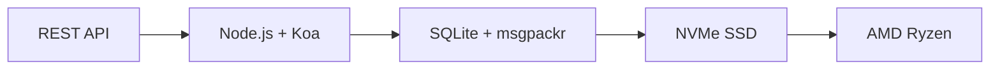

# Die erste vollständige E-Mail-API: Wie Forward Email das E-Mail-Management revolutionierte {#the-first-complete-email-api-how-forward-email-revolutionized-email-management}


<p class="lead mt-3">
<strong>Kurz gesagt:</strong> Wir haben die weltweit erste vollständige REST-API für die E-Mail-Verwaltung mit erweiterten Suchfunktionen entwickelt, die kein anderer Dienst bietet. Während Gmail, Outlook und Apple Entwickler in die IMAP-Hölle oder auf geschwindigkeitsbegrenzte APIs zwingen, bietet Forward Email blitzschnelle CRUD-Operationen für Nachrichten, Ordner, Kontakte und Kalender über eine einheitliche REST-Schnittstelle mit über 15 Suchparametern. Auf diese E-Mail-API haben Entwickler gewartet.
</p>

## Inhaltsverzeichnis {#table-of-contents}

* [Das E-Mail-API-Problem](#the-email-api-problem)
* [Was Entwickler tatsächlich sagen](#what-developers-are-actually-saying)
* [Die revolutionäre Lösung von Forward Email](#forward-emails-revolutionary-solution)
  * [Warum wir das gebaut haben](#why-we-built-this)
  * [Einfache Authentifizierung](#simple-authentication)
* [20 Endpunkte, die alles verändern](#20-endpoints-that-change-everything)
  * [Nachrichten (5 Endpunkte)](#messages-5-endpoints)
  * [Ordner (5 Endpunkte)](#folders-5-endpoints)
  * [Kontakte (5 Endpunkte)](#contacts-5-endpoints)
  * [Kalender (5 Endpunkte)](#calendars-5-endpoints)
* [Erweiterte Suche: Kein anderer Dienst ist vergleichbar](#advanced-search-no-other-service-compares)
  * [Die Such-API-Landschaft ist kaputt](#the-search-api-landscape-is-broken)
  * [Die revolutionäre Such-API von Forward Email](#forward-emails-revolutionary-search-api)
  * [Beispiele für die Suche in der Praxis](#real-world-search-examples)
  * [Leistungsvorteile](#performance-advantages)
  * [Suchfunktionen, die sonst niemand hat](#search-features-no-one-else-has)
  * [Warum das für Entwickler wichtig ist](#why-this-matters-for-developers)
  * [Die technische Umsetzung](#the-technical-implementation)
* [Blitzschnelle Performance-Architektur](#blazing-fast-performance-architecture)
  * [Leistungsbenchmarks](#performance-benchmarks)
  * [Datenschutzorientierte Architektur](#privacy-first-architecture)
* [Warum wir anders sind: Der komplette Vergleich](#why-were-different-the-complete-comparison)
  * [Wichtige Einschränkungen der Anbieter](#major-provider-limitations)
  * [Vorteile der E-Mail-Weiterleitung](#forward-email-advantages)
  * [Das Open-Source-Transparenzproblem](#the-open-source-transparency-problem)
* [Über 30 Integrationsbeispiele aus der Praxis](#30-real-world-integration-examples)
  * [1. Verbesserung des WordPress-Kontaktformulars](#1-wordpress-contact-form-enhancement)
  * [2. Zapier-Alternative für die E-Mail-Automatisierung](#2-zapier-alternative-for-email-automation)
  * [3. CRM-E-Mail-Synchronisierung](#3-crm-email-synchronization)
  * [4. E-Commerce-Auftragsabwicklung](#4-e-commerce-order-processing)
  * [5. Support-Ticket-Integration](#5-support-ticket-integration)
  * [6. Newsletter-Management-System](#6-newsletter-management-system)
  * [7. E-Mail-basiertes Aufgabenmanagement](#7-email-based-task-management)
  * [8. E-Mail-Aggregation mehrerer Konten](#8-multi-account-email-aggregation)
  * [9. Erweitertes E-Mail-Analyse-Dashboard](#9-advanced-email-analytics-dashboard)
  * [10. Intelligente E-Mail-Archivierung](#10-smart-email-archiving)
  * [11. E-Mail-Kalender-Integration](#11-email-to-calendar-integration)
  * [12. E-Mail-Backup und Compliance](#12-email-backup-and-compliance)
  * [13. E-Mail-basiertes Content-Management](#13-email-based-content-management)
  * [14. E-Mail-Vorlagenverwaltung](#14-email-template-management)
  * [15. E-Mail-basierte Workflow-Automatisierung](#15-email-based-workflow-automation)
  * [16. E-Mail-Sicherheitsüberwachung](#16-email-security-monitoring)
  * [17. E-Mail-basierte Umfragesammlung](#17-email-based-survey-collection)
  * [18. E-Mail-Leistungsüberwachung](#18-email-performance-monitoring)
  * [19. E-Mail-basierte Lead-Qualifizierung](#19-email-based-lead-qualification)
  * [20. E-Mail-basiertes Projektmanagement](#20-email-based-project-management)
  * [21. E-Mail-basierte Bestandsverwaltung](#21-email-based-inventory-management)
  * [22. E-Mail-basierte Rechnungsverarbeitung](#22-email-based-invoice-processing)
  * [23. E-Mail-basierte Veranstaltungsregistrierung](#23-email-based-event-registration)
  * [24. E-Mail-basierter Workflow zur Dokumentgenehmigung](#24-email-based-document-approval-workflow)
  * [25. E-Mail-basierte Kundenfeedback-Analyse](#25-email-based-customer-feedback-analysis)
  * [26. E-Mail-basierte Rekrutierungspipeline](#26-email-based-recruitment-pipeline)
  * [27. E-Mail-basierte Spesenabrechnungsverarbeitung](#27-email-based-expense-report-processing)
  * [28. E-Mail-basierte Qualitätssicherungsberichte](#28-email-based-quality-assurance-reporting)
  * [29. E-Mail-basiertes Lieferantenmanagement](#29-email-based-vendor-management)
  * [30. E-Mail-basiertes Social Media Monitoring](#30-email-based-social-media-monitoring)
* [Erste Schritte](#getting-started)
  * [1. Erstellen Sie Ihr Weiterleitungs-E-Mail-Konto](#1-create-your-forward-email-account)
  * [2. API-Anmeldeinformationen generieren](#2-generate-api-credentials)
  * [3. Tätigen Sie Ihren ersten API-Aufruf](#3-make-your-first-api-call)
  * [4. Erkunden Sie die Dokumentation](#4-explore-the-documentation)
* [Technische Ressourcen](#technical-resources)

## Das E-Mail-API-Problem {#the-email-api-problem}

E-Mail-APIs sind grundsätzlich defekt. Punkt.

Jeder große E-Mail-Anbieter zwingt Entwickler zu einer von zwei schrecklichen Entscheidungen:

1. **IMAP-Hölle**: Ein 30 Jahre altes Protokoll, das für Desktop-Clients und nicht für moderne Anwendungen entwickelt wurde.
2. **Eingeschränkte APIs**: Ratenbegrenzte, schreibgeschützte und OAuth-komplexe APIs, die Ihre eigentlichen E-Mail-Daten nicht verwalten können.

Das Ergebnis? Entwickler verzichten entweder gänzlich auf die E-Mail-Integration oder verschwenden Wochen mit der Entwicklung anfälliger IMAP-Wrapper, die ständig kaputtgehen.

> \[!WARNING]
> **Das schmutzige Geheimnis**: Die meisten E-Mail-APIs sind reine Sende-APIs. Über eine einfache REST-Schnittstelle lassen sich Ordner nicht programmgesteuert organisieren, Kontakte synchronisieren oder Kalender verwalten. Bis jetzt.

## Was Entwickler tatsächlich sagen {#what-developers-are-actually-saying}

Die Frustration ist real und überall dokumentiert:

> „Ich habe kürzlich versucht, Gmail in meine App zu integrieren, und habe zu viel Zeit darauf verwendet. Ich bin zu dem Schluss gekommen, dass es sich nicht lohnt, Gmail zu unterstützen.“

> *- [Hacker News-Entwickler](https://news.ycombinator.com/item?id=42106944), 147 Upvotes*

> „Sind alle E-Mail-APIs mittelmäßig? Sie wirken irgendwie eingeschränkt oder restriktiv.“

> *- [Reddit r/SaaS-Diskussion](https://www.reddit.com/r/SaaS/comments/1cm84s7/are_all_email_apis_mediocre/)*

> „Warum muss E-Mail-Entwicklung so mies sein?“

> *- [Reddit r/webdev](https://www.reddit.com/r/webdev/comments/15trnp2/why_does_email_development_have_to_suck/), 89 Kommentare zum Thema Entwickler-Probleme*

> „Was macht die Gmail-API effizienter als IMAP? Ein weiterer Grund für die deutlich höhere Effizienz der Gmail-API ist, dass jede Nachricht nur einmal heruntergeladen werden muss. Bei IMAP hingegen muss jede Nachricht heruntergeladen und indexiert werden…“
>
> *- [Stack Overflow-Frage](https://stackoverflow.com/questions/25431022/what-makes-the-gmail-api-more-efficient-than-imap) mit 47 Upvotes*

Die Beweise sind überall:

* **WordPress SMTP-Probleme**: [631 GitHub-Probleme](https://github.com/awesomemotive/WP-Mail-SMTP/issues) zu Fehlern bei der E-Mail-Zustellung
* **Zapier-Einschränkungen**: [Beschwerden der Community](https://community.zapier.com/featured-articles-65/email-parser-by-zapier-limitations-and-alternatives-16958) zu Limits von 10 E-Mails pro Stunde und IMAP-Erkennungsfehlern
* **IMAP-API-Projekte**: [Mehrere](https://github.com/ewildgoose/imap-api) [Open Source](https://emailengine.app/) [Projekte](https://www.npmjs.com/package/imapflow) dienen speziell der Konvertierung von IMAP in REST, da kein Anbieter dies anbietet.
* **Gmail-API-Probleme**: [Stapelüberlauf](https://stackoverflow.com/questions/tagged/gmail-api) hat 4.847 Fragen mit dem Tag „gmail-api“ mit häufigen Beschwerden zu Ratenbegrenzungen und Komplexität.

## Die revolutionäre Lösung zum Weiterleiten von E-Mails {#forward-emails-revolutionary-solution}

**Wir sind der erste E-Mail-Dienst, der vollständige CRUD-Operationen für alle E-Mail-Daten über eine einheitliche REST-API anbietet.**

Dies ist nicht nur eine weitere Sende-API. Dies ist die vollständige programmatische Kontrolle über:

* **Nachrichten**: Erstellen, Lesen, Aktualisieren, Löschen, Suchen, Verschieben, Markieren
* **Ordner**: Vollständige IMAP-Ordnerverwaltung über REST-Endpunkte
* **Kontakte**: [CardDAV](https://tools.ietf.org/html/rfc6352) Kontaktspeicherung und -synchronisierung
* **Kalender**: [CalDAV](https://tools.ietf.org/html/rfc4791) Kalenderereignisse und Terminplanung

### Warum wir das gebaut haben {#why-we-built-this}

**Das Problem**: Jeder E-Mail-Anbieter behandelt E-Mails wie eine Blackbox. Sie können E-Mails senden und sie möglicherweise mit komplexem OAuth lesen, aber Sie können Ihre E-Mail-Daten nicht wirklich programmgesteuert *verwalten*.

**Unsere Vision**: E-Mail sollte so einfach zu integrieren sein wie jede moderne API. Keine IMAP-Bibliotheken. Keine OAuth-Komplexität. Keine Ratenlimit-Albträume. Nur einfache REST-Endpunkte, die funktionieren.

**Das Ergebnis**: Der erste E-Mail-Dienst, mit dem Sie einen vollständigen E-Mail-Client, eine CRM-Integration oder ein Automatisierungssystem ausschließlich mit HTTP-Anfragen erstellen können.

### Einfache Authentifizierung {#simple-authentication}

Kein [OAuth-Komplexität](https://oauth.net/2/). Kein [app-spezifische Passwörter](https://support.google.com/accounts/answer/185833). Nur Ihre Alias-Anmeldeinformationen:

```bash
curl -u "alias@yourdomain.com:password" \
  https://api.forwardemail.net/v1/messages
```

## 20 Endpunkte, die alles verändern {#20-endpoints-that-change-everything}

### Nachrichten (5 Endpunkte) {#messages-5-endpoints}

* `GET /v1/messages` – Nachrichten mit Filterung auflisten (`?folder=`, `?is_unread=`, `?is_flagged=`)
* `POST /v1/messages` – Neue Nachrichten direkt in Ordner senden
* `GET /v1/messages/:id` – Bestimmte Nachrichten mit vollständigen Metadaten abrufen
* `PUT /v1/messages/:id` – Nachricht aktualisieren (Flags, Ordner, Lesestatus)
* `DELETE /v1/messages/:id` – Nachricht endgültig löschen

### Ordner (5 Endpunkte) {#folders-5-endpoints}

* `GET /v1/folders` – Alle Ordner mit Abonnementstatus auflisten
* `POST /v1/folders` – Neuen Ordner mit benutzerdefinierten Eigenschaften erstellen
* `GET /v1/folders/:id` – Ordnerdetails und Nachrichtenanzahl abrufen
* `PUT /v1/folders/:id` – Ordnereigenschaften und Abonnement aktualisieren
* `DELETE /v1/folders/:id` – Ordner löschen und Nachrichten verschieben

### Kontakte (5 Endpunkte) {#contacts-5-endpoints}

* `GET /v1/contacts` – Kontakte auflisten mit Suche und Paginierung
* `POST /v1/contacts` – Neuen Kontakt erstellen mit vollständiger vCard-Unterstützung
* `GET /v1/contacts/:id` – Kontakt mit allen Feldern und Metadaten abrufen
* `PUT /v1/contacts/:id` – Kontaktinformationen mit ETag-Validierung aktualisieren
* `DELETE /v1/contacts/:id` – Kontakt löschen mit Kaskadenverarbeitung

### Kalender (5 Endpunkte) {#calendars-5-endpoints}

* `GET /v1/calendars` – Kalenderereignisse mit Datumsfilterung auflisten
* `POST /v1/calendars` – Kalenderereignis mit Teilnehmern und Wiederholung erstellen
* `GET /v1/calendars/:id` – Ereignisdetails mit Zeitzonenbehandlung abrufen
* `PUT /v1/calendars/:id` – Ereignis mit Konflikterkennung aktualisieren
* `DELETE /v1/calendars/:id` – Ereignis mit Teilnehmerbenachrichtigung löschen

## Erweiterte Suche: Kein anderer Dienst ist vergleichbar {#advanced-search-no-other-service-compares}

**Forward Email ist der einzige E-Mail-Dienst, der über eine REST-API eine umfassende, programmgesteuerte Suche in allen Nachrichtenfeldern bietet.**

Während andere Anbieter bestenfalls grundlegende Filterfunktionen bieten, haben wir die fortschrittlichste E-Mail-Such-API aller Zeiten entwickelt. Keine Gmail-API, Outlook-API oder ein anderer Dienst kommt an unsere Suchfunktionen heran.

### Die Such-API-Landschaft ist defekt {#the-search-api-landscape-is-broken}

**Einschränkungen der Gmail-API-Suche:**

* ✅ Nur Basisparameter `q`
* ❌ Keine feldspezifische Suche
* ❌ Keine Filterung nach Datumsbereich
* ❌ Keine Filterung nach Größe
* ❌ Keine Filterung nach Anhängen
* ❌ Beschränkt auf die Suchsyntax von Gmail

**Einschränkungen der Outlook-API-Suche:**

* ✅ Einfacher `$search`-Parameter
* ❌ Keine erweiterte Feldausrichtung
* ❌ Keine komplexen Abfragekombinationen
* ❌ Aggressive Ratenbegrenzung
* ❌ Komplexe OData-Syntax erforderlich

**Apple iCloud:**

* ❌ Keine API
* ❌ Nur IMAP-Suche (sofern Sie sie zum Laufen bringen)

**ProtonMail & Tuta:**

* ❌ Keine öffentlichen APIs
* ❌ Keine programmatischen Suchfunktionen

### Revolutionäre Such-API von Forward Email {#forward-emails-revolutionary-search-api}

**Wir bieten mehr als 15 Suchparameter, die kein anderer Dienst bietet:**

| Suchfunktion | E-Mail weiterleiten | Gmail-API | Outlook-API | Sonstiges |
| ------------------------------ | -------------------------------------- | ------------ | ------------------ | ------ |
| **Feldspezifische Suche** | ✅ Betreff, Text, Von, An, CC, Überschriften | ❌ | ❌ | ❌ |
| **Allgemeine Mehrfeldsuche** | ✅ `?search=` über alle Felder | ✅ Einfacher `q=` | ✅ Einfacher `$search=` | ❌ |
| **Datumsbereichsfilterung** | ✅ `?since=` & `?before=` | ❌ | ❌ | ❌ |
| **Größenbasierte Filterung** | ✅ `?min_size=` & `?max_size=` | ❌ | ❌ | ❌ |
| **Anhangsfilterung** | ✅ `?has_attachments=true/false` | ❌ | ❌ | ❌ |
| **Header-Suche** | ✅ `?headers=X-Priority` | ❌ | ❌ | ❌ |
| **Nachrichten-ID-Suche** | ✅ `?message_id=abc123` | ❌ | ❌ | ❌ |
| **Kombinierte Filter** | ✅ Mehrere Parameter mit UND-Logik | ❌ | ❌ | ❌ |
| **Groß-/Kleinschreibung wird nicht beachtet** | ✅ Alle Suchen | ✅ | ✅ | ❌ |
| **Seitennummerierungsunterstützung** | ✅ Funktioniert mit allen Suchparametern | ✅ | ✅ | ❌ |

### Beispiele für die Suche in der Praxis {#real-world-search-examples}

**Alle Rechnungen des letzten Quartals suchen:**

```bash
# Forward Email - Simple and powerful
GET /v1/messages?subject=invoice&since=2024-01-01T00:00:00Z&before=2024-04-01T00:00:00Z

# Gmail API - Impossible with their limited search
# No date range filtering available

# Outlook API - Complex OData syntax, limited functionality
GET /me/messages?$search="invoice"&$filter=receivedDateTime ge 2024-01-01T00:00:00Z
```

**Suche nach großen Anhängen von einem bestimmten Absender:**

```bash
# Forward Email - Comprehensive filtering
GET /v1/messages?from=finance@company.com&has_attachments=true&min_size=1000000

# Gmail API - Cannot filter by size or attachments programmatically
# Outlook API - No size filtering available
# Others - No APIs available
```

**Komplexe Mehrfeldsuche:**

```bash
# Forward Email - Advanced query capabilities
GET /v1/messages?body=quarterly&from=manager&is_flagged=true&folder=Reports

# Gmail API - Limited to basic text search only
GET /gmail/v1/users/me/messages?q=quarterly

# Outlook API - Basic search without field targeting
GET /me/messages?$search="quarterly"
```

### Leistungsvorteile {#performance-advantages}

**Leistung der E-Mail-Weiterleitungssuche:**

* ⚡ **Antwortzeiten unter 100 ms** für komplexe Suchvorgänge
* 🔍 **Regex-Optimierung** mit korrekter Indizierung
* 📊 **Parallele Abfrageausführung** für Anzahl und Daten
* 💾 **Effiziente Speichernutzung** durch schlanke Abfragen

**Leistungsprobleme der Konkurrenz:**

* 🐌 **Gmail-API**: Begrenzte Rate auf 250 Kontingenteinheiten pro Nutzer und Sekunde
* 🐌 **Outlook-API**: Aggressive Drosselung mit komplexen Backoff-Anforderungen
* 🐌 **Andere**: Keine vergleichbaren APIs

### Suchfunktionen, die sonst niemand hat {#search-features-no-one-else-has}

#### 1. Headerspezifische Suche {#1-header-specific-search}

```bash
# Find messages with specific headers
GET /v1/messages?headers=X-Priority:1
GET /v1/messages?headers=X-Spam-Score
```

#### 2. Größenbasierte Intelligenz {#2-size-based-intelligence}

```bash
# Find newsletter emails (typically large)
GET /v1/messages?min_size=50000&from=newsletter

# Find quick replies (typically small)
GET /v1/messages?max_size=1000&to=support
```

#### 3. Anhangbasierte Workflows {#3-attachment-based-workflows}

```bash
# Find all documents sent to legal team
GET /v1/messages?to=legal&has_attachments=true&body=contract

# Find emails without attachments for cleanup
GET /v1/messages?has_attachments=false&before=2023-01-01T00:00:00Z
```

#### 4. Kombinierte Geschäftslogik {#4-combined-business-logic}

```bash
# Find urgent flagged messages from VIPs with attachments
GET /v1/messages?is_flagged=true&from=ceo&has_attachments=true&subject=urgent
```

### Warum das für Entwickler wichtig ist {#why-this-matters-for-developers}

**Erstellen Sie Anwendungen, die bisher unmöglich waren:**

1. **Erweiterte E-Mail-Analyse**: Analysieren Sie E-Mail-Muster nach Größe, Absender und Inhalt.
2. **Intelligentes E-Mail-Management**: Automatische Organisation anhand komplexer Kriterien.
3. **Compliance und Discovery**: Finden Sie bestimmte E-Mails für rechtliche Anforderungen.
4. **Business Intelligence**: Gewinnen Sie Erkenntnisse aus E-Mail-Kommunikationsmustern.
5. **Automatisierte Workflows**: Lösen Sie Aktionen basierend auf komplexen E-Mail-Filtern aus.

### Die technische Umsetzung {#the-technical-implementation}

Unsere Such-API verwendet:

* **Regex-Optimierung** mit geeigneten Indexierungsstrategien
* **Parallele Ausführung** für höhere Leistung
* **Eingabevalidierung** für mehr Sicherheit
* **Umfassende Fehlerbehandlung** für mehr Zuverlässigkeit

```javascript
// Example: Complex search implementation
const searchConditions = [];

if (ctx.query.subject) {
  searchConditions.push({
    subject: { $regex: ctx.query.subject, $options: 'i' }
  });
}

if (ctx.query.from) {
  searchConditions.push({
    $or: [
      { 'from.address': { $regex: ctx.query.from, $options: 'i' } },
      { 'from.name': { $regex: ctx.query.from, $options: 'i' } }
    ]
  });
}

// Combine with AND logic
if (searchConditions.length > 0) {
  query.$and = searchConditions;
}
```

> \[!TIP]
> **Vorteil für Entwickler**: Mit der Such-API von Forward Email können Sie E-Mail-Anwendungen erstellen, die in ihrer Funktionalität mit Desktop-Clients mithalten können und gleichzeitig die Einfachheit von REST-APIs beibehalten.

## Blitzschnelle Leistungsarchitektur {#blazing-fast-performance-architecture}

Unser technischer Stack ist auf Geschwindigkeit und Zuverlässigkeit ausgelegt:



### Leistungsbenchmarks {#performance-benchmarks}

**Warum wir blitzschnell sind:**

| Komponente | Technologie | Leistungsvorteile |
| ------------ | --------------------------------------------------------------------------------- | --------------------------------------------- |
| **Lagerung** | [NVMe SSD](https://en.wikipedia.org/wiki/NVM_Express) | 10x schneller als herkömmliches SATA |
| **Datenbank** | [SQLite](https://sqlite.org/) + [msgpackr](https://github.com/kriszyp/msgpackr) | Keine Netzwerklatenz, optimierte Serialisierung |
| **Hardware** | [AMD Ryzen](https://www.amd.com/en/products/processors/desktops/ryzen) Bare-Metal | Kein Virtualisierungs-Overhead |
| **Zwischenspeichern** | Im Speicher + persistent | Reaktionszeiten unter einer Millisekunde |
| **Backups** | [Cloudflare R2](https://www.cloudflare.com/products/r2/) verschlüsselt | Zuverlässigkeit auf Unternehmensniveau |

**Echte Leistungszahlen:**

* **API-Antwortzeit**: Durchschnittlich < 50 ms
* **Nachrichtenabruf**: < 10 ms für zwischengespeicherte Nachrichten
* **Ordneroperationen**: < 5 ms für Metadatenoperationen
* **Kontaktsynchronisierung**: Über 1000 Kontakte/Sekunde
* **Verfügbarkeit**: 99,99 % SLA mit redundanter Infrastruktur

### Datenschutzorientierte Architektur {#privacy-first-architecture}

**Zero-Knowledge-Design**: Nur Sie haben mit Ihrem IMAP-Passwort Zugriff – wir können Ihre E-Mails nicht lesen. Unser [Zero-Knowledge-Architektur](https://forwardemail.net/en/security) gewährleistet absolute Privatsphäre und bietet gleichzeitig hervorragende Leistung.

## Warum wir anders sind: Der vollständige Vergleich {#why-were-different-the-complete-comparison}

### Wichtige Einschränkungen des Anbieters {#major-provider-limitations}

| Anbieter | Kernprobleme | Spezifische Einschränkungen |
| ---------------- | ----------------------------------------- | -------------------------------------------------------------------------------------------------------------------------------------------------------------------------------------------------------------------------------------------------------------------------------------------------------------------------------------------------------------------------------------------------------------------------------------------------------------------- |
| **Gmail-API** | Schreibgeschützt, komplexes OAuth, separate APIs | • [Cannot modify existing messages](https://developers.google.com/gmail/api/reference/rest/v1/users.messages)<br>• [Labels ≠ folders](https://developers.google.com/gmail/api/reference/rest/v1/users.labels)<br>• [1 billion quota units/day limit](https://developers.google.com/gmail/api/reference/quota)<br>• [Requires separate APIs](https://developers.google.com/workspace) für Kontakte/Kalender |
| **Outlook-API** | Veraltet, verwirrend, unternehmensorientiert | • [REST endpoints deprecated March 2024](https://learn.microsoft.com/en-us/outlook/rest/compare-graph)<br>• [Multiple confusing APIs](https://learn.microsoft.com/en-us/office/client-developer/outlook/selecting-an-api-or-technology-for-developing-solutions-for-outlook) (EWS, Graph, REST)<br>• [Microsoft Graph complexity](https://learn.microsoft.com/en-us/graph/overview)<br>• [Aggressive throttling](https://learn.microsoft.com/en-us/graph/throttling) |
| **Apple iCloud** | Keine öffentliche API | • [No public API whatsoever](https://support.apple.com/en-us/102654)<br>• [IMAP-only with 1000 emails/day limit](https://support.apple.com/en-us/102654)<br>• [App-specific passwords required](https://support.apple.com/en-us/102654)<br>• [500 recipients per message limit](https://support.apple.com/en-us/102654) |
| **ProtonMail** | Keine API, falsche Open-Source-Behauptungen | • [No public API available](https://proton.me/support/protonmail-bridge-clients)<br>• [Bridge software required](https://proton.me/mail/bridge) für IMAP-Zugriff<br>• [Claims "open source"](https://proton.me/blog/open-source) aber [server code is proprietary](https://github.com/ProtonMail)<br>• [Limited to paid plans only](https://proton.me/pricing) |
| **Gesamt** | Keine API, irreführende Transparenz | • [No REST API for email management](https://tuta.com/support#technical)<br>• [Claims "open source"](https://tuta.com/blog/posts/open-source-email) aber [backend is closed](https://github.com/tutao/tutanota)<br>• [IMAP/SMTP not supported](https://tuta.com/support#imap)<br>• [Proprietary encryption](https://tuta.com/encryption) verhindert Standardintegrationen |
| **Zapier-E-Mail** | Strenge Ratenbegrenzungen | • [10 emails per hour limit](https://help.zapier.com/hc/en-us/articles/8496181555597-Email-Parser-by-Zapier-limitations-and-alternatives)<br>• [No IMAP folder access](https://help.zapier.com/hc/en-us/articles/8496181555597-Email-Parser-by-Zapier-limitations-and-alternatives)<br>• [Limited parsing capabilities](https://help.zapier.com/hc/en-us/articles/8496181555597-Email-Parser-by-Zapier-limitations-and-alternatives) |

### Vorteile der E-Mail-Weiterleitung {#forward-email-advantages}

| Besonderheit | E-Mail weiterleiten | Wettbewerb |
| ------------------ | -------------------------------------------------------------------------------------------- | ----------------------------------------- |
| **Kompletter CRUD** | ✅ Vollständiges Erstellen, Lesen, Aktualisieren und Löschen aller Daten | ❌ Nur-Lese- oder eingeschränkte Vorgänge |
| **Einheitliche API** | ✅ Nachrichten, Ordner, Kontakte, Kalender in einer API | ❌ Separate APIs oder fehlende Funktionen |
| **Einfache Authentifizierung** | ✅ Basisauthentifizierung mit Alias-Anmeldeinformationen | ❌ Komplexes OAuth mit mehreren Bereichen |
| **Keine Ratenbegrenzungen** | ✅ Großzügige Grenzen für reale Anwendungen | ❌ Restriktive Kontingente, die Arbeitsabläufe unterbrechen |
| **Selbsthosting** | ✅ [Complete self-hosting option](https://forwardemail.net/en/blog/docs/self-hosted-solution) | ❌ Nur Vendor Lock-in |
| **Datenschutz** | ✅ Zero-Knowledge, verschlüsselt, privat | ❌ Data Mining und Datenschutzbedenken |
| **Leistung** | ✅ Antworten unter 50 ms, NVMe-Speicher | ❌ Netzwerklatenz, Drosselungsverzögerungen |

### Das Open-Source-Transparenzproblem {#the-open-source-transparency-problem}

**ProtonMail und Tuta vermarkten sich als „Open Source“ und „transparent“, aber das ist irreführendes Marketing, das gegen moderne Datenschutzprinzipien verstößt.**

> \[!WARNING]
> **Falsche Transparenzbehauptungen**: Sowohl ProtonMail als auch Tuta werben prominent mit ihren „Open Source“-Referenzen, halten ihren wichtigsten serverseitigen Code jedoch proprietär und geheim.

**ProtonMails Täuschung:**

* **Behauptungen**: [„Wir sind Open Source“](https://proton.me/blog/open-source) wird im Marketing prominent präsentiert.
* **Realität**: [Der Servercode ist vollständig proprietär](https://github.com/ProtonMail) – Nur Client-Apps sind Open Source.
* **Auswirkungen**: Nutzer können serverseitige Verschlüsselung, Datenverarbeitung oder Datenschutzansprüche nicht überprüfen.
* **Verstoß gegen Transparenz**: Es gibt keine Möglichkeit, die tatsächlichen E-Mail-Verarbeitungs- und Speichersysteme zu prüfen.

**Tutas irreführendes Marketing:**

* **Behauptungen**: [„Open Source E-Mail“](https://tuta.com/blog/posts/open-source-email) als zentrales Verkaufsargument
* **Realität**: [Die Backend-Infrastruktur ist Closed Source](https://github.com/tutao/tutanota) – nur Frontend verfügbar
* **Auswirkung**: Proprietäre Verschlüsselung verhindert Standard-E-Mail-Protokolle (IMAP/SMTP)
* **Lock-in-Strategie**: Benutzerdefinierte Verschlüsselung erzwingt Anbieterabhängigkeit

**Warum dies für den modernen Datenschutz wichtig ist:**

Im Jahr 2025 erfordert echter Datenschutz **vollständige Transparenz**. Wenn E-Mail-Anbieter „Open Source“ behaupten, aber ihren Servercode verbergen:

1. **Nicht überprüfbare Verschlüsselung**: Sie können nicht überprüfen, wie Ihre Daten tatsächlich verschlüsselt sind.
2. **Versteckte Datenpraktiken**: Die serverseitige Datenverarbeitung bleibt eine Blackbox.
3. **Vertrauensbasierte Sicherheit**: Sie müssen ihren Aussagen ohne Überprüfung vertrauen.
4. **Anbieterabhängigkeit**: Proprietäre Systeme verhindern Datenportabilität.

**Die wahre Transparenz von E-Mail-Weiterleitungen:**

* ✅ **[Komplett Open Source](https://github.com/forwardemail/forwardemail.net)** – Server- und Client-Code
* ✅ **[Selbsthosting verfügbar](https://forwardemail.net/en/blog/docs/self-hosted-solution)** – Betreiben Sie Ihre eigene Instanz
* ✅ **Standardprotokolle** – IMAP-, SMTP-, CardDAV- und CalDAV-Kompatibilität
* ✅ **Überprüfbare Sicherheit** – Jede Codezeile kann überprüft werden
* ✅ **Keine Abhängigkeit von einem Anbieter** – Ihre Daten, Ihre Kontrolle

> \[!TIP]
> **Echte Open Source bedeutet, dass Sie jede Aussage überprüfen können.** Mit Forward Email können Sie unsere Verschlüsselung prüfen, unseren Datenverarbeitungsprozess überprüfen und sogar Ihre eigene Instanz betreiben. Das ist echte Transparenz.

## Über 30 Integrationsbeispiele aus der Praxis {#30-real-world-integration-examples}

### 1. WordPress-Kontaktformular-Erweiterung {#1-wordpress-contact-form-enhancement}

**Problem**: [WordPress SMTP-Konfigurationsfehler](https://github.com/awesomemotive/WP-Mail-SMTP/issues) ([631 GitHub-Probleme](https://github.com/awesomemotive/WP-Mail-SMTP/issues))
**Lösung**: Direkte API-Integration umgeht [SMTP](https://tools.ietf.org/html/rfc5321) vollständig

```javascript
// WordPress contact form that saves to Sent folder
await fetch('https://api.forwardemail.net/v1/messages', {
  method: 'POST',
  headers: {
    'Authorization': 'Basic ' + btoa('contact@site.com:password'),
    'Content-Type': 'application/json'
  },
  body: JSON.stringify({
    to: [{ address: 'owner@site.com' }],
    subject: 'Contact Form: ' + formData.subject,
    text: formData.message,
    folder: 'Sent'
  })
});
```

### 2. Zapier-Alternative für E-Mail-Automatisierung {#2-zapier-alternative-for-email-automation}

**Problem**: [Zapiers Limit von 10 E-Mails/Stunde](https://help.zapier.com/hc/en-us/articles/8496181555597-Email-Parser-by-Zapier-limitations-and-alternatives) und [IMAP-Erkennungsfehler](https://community.zapier.com/featured-articles-65/email-parser-by-zapier-limitations-and-alternatives-16958)
**Lösung**: Unbegrenzte Automatisierung mit vollständiger E-Mail-Kontrolle

```javascript
// Auto-organize emails by sender domain
const messages = await fetch('/v1/messages?folder=INBOX');
for (const message of messages) {
  const domain = message.from.split('@')[1];
  await fetch(`/v1/messages/${message.id}`, {
    method: 'PUT',
    body: JSON.stringify({ folder: `Clients/${domain}` })
  });
}
```

### 3. CRM-E-Mail-Synchronisierung {#3-crm-email-synchronization}

**Problem**: Manuelle Kontaktverwaltung zwischen E-Mail und [CRM-Systeme](https://en.wikipedia.org/wiki/Customer_relationship_management)
**Lösung**: Zwei-Wege-Synchronisierung mit der [CardDAV](https://tools.ietf.org/html/rfc6352)-Kontakt-API

```javascript
// Sync new email contacts to CRM
const newContacts = await fetch('/v1/contacts');
for (const contact of newContacts) {
  await crmAPI.createContact({
    name: contact.name,
    email: contact.email,
    source: 'email_api'
  });
}
```

### 4. E-Commerce-Auftragsabwicklung {#4-e-commerce-order-processing}

**Problem**: Manuelle Bestell-E-Mail-Verarbeitung für [E-Commerce-Plattformen](https://en.wikipedia.org/wiki/E-commerce)
**Lösung**: Automatisierte Bestellverwaltung

```javascript
// Process order confirmation emails
const orders = await fetch('/v1/messages?folder=Orders');
const orderEmails = orders.filter(msg =>
  msg.subject.includes('Order Confirmation')
);

for (const order of orderEmails) {
  const orderData = parseOrderEmail(order.text);
  await updateInventory(orderData);
  await fetch(`/v1/messages/${order.id}`, {
    method: 'PUT',
    body: JSON.stringify({ folder: 'Orders/Processed' })
  });
}
```

### 5. Support-Ticket-Integration {#5-support-ticket-integration}

**Problem**: E-Mail-Threads verteilt über [Helpdesk-Plattformen](https://en.wikipedia.org/wiki/Help_desk_software)
**Lösung**: Vollständiges E-Mail-Thread-Tracking

```javascript
// Create support ticket from email thread
const messages = await fetch('/v1/messages?folder=Support');
const supportEmails = messages.filter(msg =>
  msg.to.some(addr => addr.includes('support@'))
);

for (const email of supportEmails) {
  const ticket = await supportSystem.createTicket({
    subject: email.subject,
    from: email.from,
    body: email.text,
    timestamp: email.date
  });
}
```

### 6. Newsletter-Management-System {#6-newsletter-management-system}

**Problem**: Eingeschränkte [Newsletter-Plattform](https://en.wikipedia.org/wiki/Email_marketing)-Integrationen
**Lösung**: Umfassendes Abonnenten-Lebenszyklusmanagement

```javascript
// Auto-manage newsletter subscriptions
const messages = await fetch('/v1/messages?folder=Newsletter');
const unsubscribes = messages.filter(msg =>
  msg.subject.toLowerCase().includes('unsubscribe')
);

for (const msg of unsubscribes) {
  await removeSubscriber(msg.from);
  await fetch(`/v1/messages/${msg.id}`, {
    method: 'PUT',
    body: JSON.stringify({ folder: 'Newsletter/Unsubscribed' })
  });
}
```

### 7. E-Mail-basiertes Aufgabenmanagement {#7-email-based-task-management}

**Problem**: Überfüllter Posteingang und [Aufgabenverfolgung](https://en.wikipedia.org/wiki/Task_management)
**Lösung**: E-Mails in umsetzbare Aufgaben umwandeln

```javascript
// Create tasks from flagged emails
const messages = await fetch('/v1/messages?is_flagged=true');
for (const email of messages) {
  await taskManager.createTask({
    title: email.subject,
    description: email.text,
    assignee: email.to[0].address,
    dueDate: extractDueDate(email.text)
  });
}
```

### 8. E-Mail-Aggregation mehrerer Konten {#8-multi-account-email-aggregation}

**Problem**: [mehrere E-Mail-Konten](https://en.wikipedia.org/wiki/Email_client) anbieterübergreifend verwalten
**Lösung**: Einheitliche Posteingangsoberfläche

```javascript
// Aggregate emails from multiple accounts
const accounts = ['work@domain.com', 'personal@domain.com'];
const allMessages = [];

for (const account of accounts) {
  const messages = await fetch('/v1/messages', {
    headers: { 'Authorization': getAuth(account) }
  });
  allMessages.push(...messages.map(m => ({ ...m, account })));
}
```

### 9. Erweitertes E-Mail-Analyse-Dashboard {#9-advanced-email-analytics-dashboard}

**Problem**: Keine Einblicke in [E-Mail-Muster](https://en.wikipedia.org/wiki/Email_analytics) mit ausgefeilter Filterung.
**Lösung**: Benutzerdefinierte E-Mail-Analyse mit erweiterten Suchfunktionen.

```javascript
// Generate comprehensive email analytics using advanced search
const analytics = {};

// Analyze email volume by sender domain
const messages = await fetch('/v1/messages');
analytics.senderDomains = analyzeSenderDomains(messages);

// Find large attachments consuming storage
const largeAttachments = await fetch('/v1/messages?has_attachments=true&min_size=1000000');
analytics.storageHogs = largeAttachments.map(msg => ({
  subject: msg.subject,
  from: msg.from,
  size: msg.size
}));

// Analyze communication patterns with VIPs
const vipEmails = await fetch('/v1/messages?from=ceo@company.com');
const urgentVipEmails = await fetch('/v1/messages?from=ceo@company.com&subject=urgent');
analytics.vipCommunication = {
  total: vipEmails.length,
  urgent: urgentVipEmails.length,
  urgencyRate: (urgentVipEmails.length / vipEmails.length) * 100
};

// Find unread emails by date range for follow-up
const lastWeek = new Date(Date.now() - 7 * 24 * 60 * 60 * 1000).toISOString();
const unreadRecent = await fetch(`/v1/messages?is_unread=true&since=${lastWeek}`);
analytics.followUpNeeded = unreadRecent.length;

// Analyze email sizes for optimization
const smallEmails = await fetch('/v1/messages?max_size=1000');
const mediumEmails = await fetch('/v1/messages?min_size=1000&max_size=50000');
const largeEmails = await fetch('/v1/messages?min_size=50000');
analytics.sizeDistribution = {
  small: smallEmails.length,
  medium: mediumEmails.length,
  large: largeEmails.length
};

// Search for compliance-related emails
const complianceEmails = await fetch('/v1/messages?body=confidential&has_attachments=true');
analytics.complianceReview = complianceEmails.length;
```

### 10. Intelligente E-Mail-Archivierung {#10-smart-email-archiving}

**Problem**: Manueller [E-Mail-Organisation](https://en.wikipedia.org/wiki/Email_management)
**Lösung**: Intelligente E-Mail-Kategorisierung

```javascript
// Auto-archive old emails by category
const messages = await fetch('/v1/messages');
const oldEmails = messages.filter(email =>
  isOlderThan(email.date, 90) // 90 days
);

for (const email of oldEmails) {
  const category = categorizeEmail(email);
  await fetch(`/v1/messages/${email.id}`, {
    method: 'PUT',
    body: JSON.stringify({ folder: `Archive/${category}` })
  });
}
```

### 11. E-Mail-Kalender-Integration {#11-email-to-calendar-integration}

**Problem**: Manuelle Erstellung von [Kalenderereignis](https://tools.ietf.org/html/rfc4791) aus E-Mails
**Lösung**: Automatische Ereignisextraktion und -erstellung

```javascript
// Extract meeting details from emails
const messages = await fetch('/v1/messages?folder=Meetings');
const meetingEmails = messages.filter(email =>
  email.subject.toLowerCase().includes('meeting')
);

for (const email of meetingEmails) {
  const meetingData = extractMeetingInfo(email.text);
  if (meetingData.date && meetingData.time) {
    await fetch('/v1/calendars', {
      method: 'POST',
      body: JSON.stringify({
        title: email.subject,
        start: meetingData.datetime,
        attendees: [email.from, ...email.to]
      })
    });
  }
}
```

### 12. E-Mail-Backup und Compliance {#12-email-backup-and-compliance}

**Problem**: [E-Mail-Aufbewahrung](https://en.wikipedia.org/wiki/Email_retention_policy) und Compliance-Anforderungen
**Lösung**: Automatisiertes Backup mit Metadatenerhaltung

```javascript
// Backup emails with full metadata
const allMessages = await fetch('/v1/messages');
const backup = {
  timestamp: new Date(),
  messages: allMessages.map(msg => ({
    id: msg.id,
    subject: msg.subject,
    from: msg.from,
    to: msg.to,
    date: msg.date,
    flags: msg.flags
  }))
};
await saveToComplianceStorage(backup);
```

### 13. E-Mail-basiertes Content-Management {#13-email-based-content-management}

**Problem**: Verwaltung von Inhaltseinreichungen per E-Mail für [CMS-Plattformen](https://en.wikipedia.org/wiki/Content_management_system)
**Lösung**: E-Mail als Content-Management-System

```javascript
// Process content submissions from email
const messages = await fetch('/v1/messages?folder=Submissions');
const submissions = messages.filter(msg =>
  msg.to.some(addr => addr.includes('submit@'))
);

for (const submission of submissions) {
  const content = parseSubmission(submission.text);
  await cms.createDraft({
    title: submission.subject,
    content: content.body,
    author: submission.from
  });
}
```

### 14. E-Mail-Vorlagenverwaltung {#14-email-template-management}

**Problem**: Inkonsistenter [E-Mail-Vorlagen](https://en.wikipedia.org/wiki/Email_template) im gesamten Team
**Lösung**: Zentralisiertes Vorlagensystem mit API

```javascript
// Send templated emails with dynamic content
const template = await getEmailTemplate('welcome');
await fetch('/v1/messages', {
  method: 'POST',
  body: JSON.stringify({
    to: [{ address: newUser.email }],
    subject: template.subject.replace('{{name}}', newUser.name),
    html: template.html.replace('{{name}}', newUser.name),
    folder: 'Sent'
  })
});
```

### 15. E-Mail-basierte Workflow-Automatisierung {#15-email-based-workflow-automation}

**Problem**: Manueller [Genehmigungsprozesse](https://en.wikipedia.org/wiki/Workflow) per E-Mail
**Lösung**: Automatisierte Workflow-Trigger

```javascript
// Process approval emails
const messages = await fetch('/v1/messages?folder=Approvals');
const approvals = messages.filter(msg =>
  msg.subject.includes('APPROVAL')
);

for (const approval of approvals) {
  const decision = parseApprovalDecision(approval.text);
  await workflow.processApproval({
    requestId: extractRequestId(approval.subject),
    decision: decision,
    approver: approval.from
  });
}
```

### 16. E-Mail-Sicherheitsüberwachung {#16-email-security-monitoring}

**Problem**: Manueller [Erkennung von Sicherheitsbedrohungen](https://en.wikipedia.org/wiki/Email_security)
**Lösung**: Automatisierte Bedrohungsanalyse

```javascript
// Monitor for suspicious emails
const recentEmails = await fetch('/v1/messages');
for (const email of recentEmails) {
  const threatScore = analyzeThreat(email);
  if (threatScore > 0.8) {
    await fetch(`/v1/messages/${email.id}`, {
      method: 'PUT',
      body: JSON.stringify({ folder: 'Security/Quarantine' })
    });
    await alertSecurityTeam(email);
  }
}
```

### 17. E-Mail-basierte Umfragesammlung {#17-email-based-survey-collection}

**Problem**: Manuelle [Umfrageantwort](https://en.wikipedia.org/wiki/Survey_methodology)-Verarbeitung
**Lösung**: Automatisierte Antwortaggregation

```javascript
// Collect and process survey responses
const messages = await fetch('/v1/messages?folder=Surveys');
const responses = messages.filter(msg =>
  msg.subject.includes('Survey Response')
);

const surveyData = responses.map(email => ({
  respondent: email.from,
  responses: parseSurveyData(email.text),
  timestamp: email.date
}));
await updateSurveyResults(surveyData);
```

### 18. E-Mail-Leistungsüberwachung {#18-email-performance-monitoring}

**Problem**: Keine Einsicht in [E-Mail-Zustellungsleistung](https://en.wikipedia.org/wiki/Email_deliverability)
**Lösung**: E-Mail-Metriken in Echtzeit

```javascript
// Monitor email delivery performance
const sentEmails = await fetch('/v1/messages?folder=Sent');
const deliveryStats = {
  sent: sentEmails.length,
  bounces: await countBounces(),
  deliveryRate: calculateDeliveryRate()
};
await updateDashboard(deliveryStats);
```

### 19. E-Mail-basierte Lead-Qualifizierung {#19-email-based-lead-qualification}

**Problem**: Manueller [Lead-Scoring](https://en.wikipedia.org/wiki/Lead_scoring) aus E-Mail-Interaktionen
**Lösung**: Automatisierte Lead-Qualifizierungspipeline

```javascript
// Score leads based on email engagement
const prospects = await fetch('/v1/contacts');
for (const prospect of prospects) {
  const messages = await fetch('/v1/messages');
  const emails = messages.filter(msg =>
    msg.from.includes(prospect.email)
  );
  const score = calculateEngagementScore(emails);
  await crm.updateLeadScore(prospect.id, score);
}
```

### 20. E-Mail-basiertes Projektmanagement {#20-email-based-project-management}

**Problem**: [Projektupdates](https://en.wikipedia.org/wiki/Project_management) verteilt über mehrere E-Mail-Threads
**Lösung**: Zentralisierte Projektkommunikationszentrale

```javascript
// Extract project updates from emails
const messages = await fetch('/v1/messages?folder=Projects');
const projectEmails = messages.filter(msg =>
  msg.subject.includes('Project Update')
);

for (const email of projectEmails) {
  const update = parseProjectUpdate(email.text);
  await projectManager.addUpdate({
    project: update.projectId,
    author: email.from,
    content: update.content
  });
}
```

### 21. E-Mail-basierte Bestandsverwaltung {#21-email-based-inventory-management}

**Problem**: Manuelle Bestandsaktualisierungen über Lieferanten-E-Mails
**Lösung**: Automatisierte Bestandsverfolgung über E-Mail-Benachrichtigungen

```javascript
// Process inventory updates from supplier emails
const messages = await fetch('/v1/messages?folder=Suppliers');
const inventoryEmails = messages.filter(msg =>
  msg.subject.includes('Inventory Update') || msg.subject.includes('Stock Alert')
);

for (const email of inventoryEmails) {
  const inventoryData = parseInventoryUpdate(email.text);
  await inventory.updateStock({
    sku: inventoryData.sku,
    quantity: inventoryData.quantity,
    supplier: email.from,
    timestamp: email.date
  });

  // Move to processed folder
  await fetch(`/v1/messages/${email.id}`, {
    method: 'PUT',
    body: JSON.stringify({ folder: 'Suppliers/Processed' })
  });
}
```

### 22. E-Mail-basierte Rechnungsverarbeitung {#22-email-based-invoice-processing}

**Problem**: Manuelle [Rechnungsverarbeitung](https://en.wikipedia.org/wiki/Invoice_processing)-Integration und Buchhaltung
**Lösung**: Automatisierte Rechnungsextraktion und Buchhaltungssystem-Synchronisierung

```javascript
// Extract invoice data from email attachments
const messages = await fetch('/v1/messages?folder=Invoices');
const invoiceEmails = messages.filter(msg =>
  msg.subject.toLowerCase().includes('invoice') && msg.attachments.length > 0
);

for (const email of invoiceEmails) {
  const invoiceData = await extractInvoiceData(email.attachments[0]);
  await accounting.createInvoice({
    vendor: email.from,
    amount: invoiceData.total,
    dueDate: invoiceData.dueDate,
    items: invoiceData.lineItems
  });

  // Flag as processed
  await fetch(`/v1/messages/${email.id}`, {
    method: 'PUT',
    body: JSON.stringify({ flags: ['\\Seen', '\\Flagged'] })
  });
}
```

### 23. E-Mail-basierte Event-Registrierung {#23-email-based-event-registration}

**Problem**: Manuelle [Veranstaltungsregistrierung](https://en.wikipedia.org/wiki/Event_management)-Verarbeitung aus E-Mail-Antworten
**Lösung**: Automatisierte Teilnehmerverwaltung und Kalenderintegration

```javascript
// Process event registration emails
const messages = await fetch('/v1/messages?folder=Events');
const registrations = messages.filter(msg =>
  msg.subject.includes('Registration') || msg.subject.includes('RSVP')
);

for (const registration of registrations) {
  const attendeeData = parseRegistration(registration.text);

  // Add to attendee list
  await events.addAttendee({
    event: attendeeData.eventId,
    name: attendeeData.name,
    email: registration.from,
    dietary: attendeeData.dietaryRestrictions
  });

  // Create calendar event for attendee
  await fetch('/v1/calendars', {
    method: 'POST',
    body: JSON.stringify({
      title: attendeeData.eventName,
      start: attendeeData.eventDate,
      attendees: [registration.from]
    })
  });
}
```

### 24. E-Mail-basierter Workflow zur Dokumentgenehmigung {#24-email-based-document-approval-workflow}

**Problem**: Komplexe [Dokumentgenehmigung](https://en.wikipedia.org/wiki/Document_management_system)-Ketten per E-Mail
**Lösung**: Automatisierte Genehmigungsverfolgung und Dokumentversionierung

```javascript
// Track document approval workflow
const messages = await fetch('/v1/messages?folder=Approvals');
const approvalEmails = messages.filter(msg =>
  msg.subject.includes('Document Approval')
);

for (const email of approvalEmails) {
  const approval = parseApprovalEmail(email.text);

  await documentSystem.updateApproval({
    documentId: approval.documentId,
    approver: email.from,
    status: approval.decision, // 'approved', 'rejected', 'needs_changes'
    comments: approval.comments,
    timestamp: email.date
  });

  // Check if all approvals complete
  const document = await documentSystem.getDocument(approval.documentId);
  if (document.allApprovalsComplete) {
    await documentSystem.finalizeDocument(approval.documentId);
  }
}
```

### 25. E-Mail-basierte Kundenfeedback-Analyse {#25-email-based-customer-feedback-analysis}

**Problem**: Manuelle [Kundenfeedback](https://en.wikipedia.org/wiki/Customer_feedback)-Erfassung und Sentimentanalyse
**Lösung**: Automatisierte Feedbackverarbeitung und Sentiment-Tracking

```javascript
// Analyze customer feedback from emails
const messages = await fetch('/v1/messages?folder=Feedback');
const feedbackEmails = messages.filter(msg =>
  msg.to.some(addr => addr.includes('feedback@'))
);

for (const email of feedbackEmails) {
  const sentiment = await analyzeSentiment(email.text);
  const category = categorizeFeeback(email.text);

  await feedback.recordFeedback({
    customer: email.from,
    content: email.text,
    sentiment: sentiment.score, // -1 to 1
    category: category, // 'bug', 'feature', 'complaint', 'praise'
    priority: calculatePriority(sentiment, category),
    timestamp: email.date
  });

  // Auto-escalate negative feedback
  if (sentiment.score < -0.5) {
    await escalateToSupport(email);
  }
}
```

### 26. E-Mail-basierte Rekrutierungspipeline {#26-email-based-recruitment-pipeline}

**Problem**: Manuelles [Werbung](https://en.wikipedia.org/wiki/Recruitment) und Kandidaten-Tracking
**Lösung**: Automatisiertes Kandidatenmanagement und Interviewplanung

```javascript
// Process job application emails
const messages = await fetch('/v1/messages?folder=Careers');
const applications = messages.filter(msg =>
  msg.subject.toLowerCase().includes('application') && msg.attachments.length > 0
);

for (const application of applications) {
  const resume = await parseResume(application.attachments[0]);

  const candidate = await ats.createCandidate({
    name: resume.name,
    email: application.from,
    skills: resume.skills,
    experience: resume.experience,
    position: extractPosition(application.subject)
  });

  // Auto-schedule screening if qualified
  if (candidate.qualificationScore > 0.7) {
    await calendar.scheduleInterview({
      candidateId: candidate.id,
      type: 'phone_screening',
      duration: 30
    });
  }
}
```

### 27. E-Mail-basierte Spesenabrechnungsverarbeitung {#27-email-based-expense-report-processing}

**Problem**: Manuelle [Spesenabrechnung](https://en.wikipedia.org/wiki/Expense_report)-Einreichung und -Genehmigung
**Lösung**: Automatisierter Workflow zur Spesenabfrage und -genehmigung

```javascript
// Process expense report emails
const messages = await fetch('/v1/messages?folder=Expenses');
const expenseEmails = messages.filter(msg =>
  msg.subject.includes('Expense') && msg.attachments.length > 0
);

for (const email of expenseEmails) {
  const receipts = await processReceipts(email.attachments);

  const expenseReport = await expenses.createReport({
    employee: email.from,
    expenses: receipts.map(receipt => ({
      amount: receipt.total,
      category: receipt.category,
      date: receipt.date,
      merchant: receipt.merchant
    })),
    totalAmount: receipts.reduce((sum, r) => sum + r.total, 0)
  });

  // Auto-approve small amounts
  if (expenseReport.totalAmount < 100) {
    await expenses.approve(expenseReport.id);
  } else {
    await expenses.sendForApproval(expenseReport.id);
  }
}
```

### 28. E-Mail-basiertes Qualitätssicherungsreporting {#28-email-based-quality-assurance-reporting}

**Problem**: Manuelles [Qualitätssicherung](https://en.wikipedia.org/wiki/Quality_assurance)-Problemmanagement
**Lösung**: Automatisiertes QA-Problemmanagement und Bug-Tracking

```javascript
// Process QA bug reports from email
const messages = await fetch('/v1/messages?folder=QA');
const bugReports = messages.filter(msg =>
  msg.subject.includes('Bug Report') || msg.subject.includes('QA Issue')
);

for (const report of bugReports) {
  const bugData = parseBugReport(report.text);

  const ticket = await bugTracker.createIssue({
    title: report.subject,
    description: bugData.description,
    severity: bugData.severity,
    steps: bugData.stepsToReproduce,
    reporter: report.from,
    attachments: report.attachments
  });

  // Auto-assign based on component
  const assignee = await getComponentOwner(bugData.component);
  await bugTracker.assign(ticket.id, assignee);

  // Create calendar reminder for follow-up
  await fetch('/v1/calendars', {
    method: 'POST',
    body: JSON.stringify({
      title: `Follow up on ${ticket.id}`,
      start: addDays(new Date(), 3),
      attendees: [assignee]
    })
  });
}
```

### 29. E-Mail-basiertes Lieferantenmanagement {#29-email-based-vendor-management}

**Problem**: Manuelle [Lieferantenkommunikation](https://en.wikipedia.org/wiki/Vendor_management)- und Vertragsverfolgung
**Lösung**: Automatisiertes Lieferantenbeziehungsmanagement

```javascript
// Track vendor communications and contracts
const messages = await fetch('/v1/messages?folder=Vendors');
const vendorEmails = messages.filter(msg =>
  isVendorEmail(msg.from)
);

for (const email of vendorEmails) {
  const vendor = await vendors.getByEmail(email.from);

  // Log communication
  await vendors.logCommunication({
    vendorId: vendor.id,
    type: 'email',
    subject: email.subject,
    content: email.text,
    timestamp: email.date
  });

  // Check for contract-related keywords
  if (email.text.includes('contract') || email.text.includes('renewal')) {
    await vendors.flagForContractReview({
      vendorId: vendor.id,
      emailId: email.id,
      priority: 'high'
    });

    // Create task for procurement team
    await tasks.create({
      title: `Review contract communication from ${vendor.name}`,
      assignee: 'procurement@company.com',
      dueDate: addDays(new Date(), 2)
    });
  }
}
```

### 30. E-Mail-basiertes Social Media Monitoring {#30-email-based-social-media-monitoring}

**Problem**: Manuelles [sozialen Medien](https://en.wikipedia.org/wiki/Social_media_monitoring)-Erwähnungs-Tracking und -Antworten
**Lösung**: Automatisierte Verarbeitung von Social-Media-Benachrichtigungen und Reaktionskoordination

```javascript
// Process social media alerts from email notifications
const messages = await fetch('/v1/messages?folder=Social');
const socialAlerts = messages.filter(msg =>
  msg.from.includes('alerts@') || msg.subject.includes('Social Mention')
);

for (const alert of socialAlerts) {
  const mention = parseSocialMention(alert.text);

  await socialMedia.recordMention({
    platform: mention.platform,
    author: mention.author,
    content: mention.content,
    sentiment: mention.sentiment,
    reach: mention.followerCount,
    url: mention.url
  });

  // Auto-escalate negative mentions with high reach
  if (mention.sentiment < -0.5 && mention.followerCount > 10000) {
    await socialMedia.escalateToTeam({
      mentionId: mention.id,
      priority: 'urgent',
      assignee: 'social-media-manager@company.com'
    });

    // Create calendar reminder for immediate response
    await fetch('/v1/calendars', {
      method: 'POST',
      body: JSON.stringify({
        title: `Urgent: Respond to negative social mention`,
        start: addMinutes(new Date(), 30),
        attendees: ['social-media-manager@company.com']
      })
    });
  }
}
```

## Erste Schritte {#getting-started}

### 1. Erstellen Sie Ihr Weiterleitungs-E-Mail-Konto {#1-create-your-forward-email-account}

Melden Sie sich bei [forwardemail.net](https://forwardemail.net) an und bestätigen Sie Ihre Domain.

### 2. API-Anmeldeinformationen generieren {#2-generate-api-credentials}

Ihre Alias-E-Mail und Ihr Passwort dienen als API-Anmeldeinformationen – keine zusätzliche Einrichtung erforderlich.

### 3. Machen Sie Ihren ersten API-Aufruf {#3-make-your-first-api-call}

```bash
# List your messages
curl -u "your-alias@domain.com:password" \
  https://api.forwardemail.net/v1/messages

# Create a new contact
curl -u "your-alias@domain.com:password" \
  -X POST \
  -H "Content-Type: application/json" \
  -d '{"fullName":"John Doe","emails":[{"value":"john@example.com"}]}' \
  https://api.forwardemail.net/v1/contacts
```

### 4. Erkunden Sie die Dokumentation {#4-explore-the-documentation}

Besuchen Sie [forwardemail.net/en/email-api](https://forwardemail.net/en/email-api) für eine vollständige API-Dokumentation mit interaktiven Beispielen.

## Technische Ressourcen {#technical-resources}

* **[Vollständige API-Dokumentation](https://forwardemail.net/en/email-api)** – Interaktive OpenAPI 3.0-Spezifikation
* **[Self-Hosting-Handbuch](https://forwardemail.net/en/blog/docs/self-hosted-solution)** – E-Mail-Weiterleitung in Ihrer Infrastruktur bereitstellen
* **[Sicherheits-Whitepaper](https://forwardemail.net/technical-whitepaper.pdf)** – Technische Architektur und Sicherheitsdetails
* **[GitHub-Repository](https://github.com/forwardemail/forwardemail.net)** – Open-Source-Codebasis
* **[Entwickler-Support](mailto:api@forwardemail.net)** – Direkter Zugang zu unserem Entwicklungsteam

---

**Bereit, Ihre E-Mail-Integration zu revolutionieren?** [Beginnen Sie noch heute mit der API von Forward Email](https://forwardemail.net/en/email-api) und erleben Sie die erste vollständige E-Mail-Verwaltungsplattform, die für Entwickler konzipiert wurde.

*Forward Email: Der E-Mail-Dienst, der APIs endlich richtig macht.*