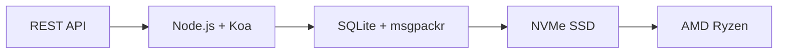

# Die erste vollständige E-Mail-API: Wie Forward Email das E-Mail-Management revolutionierte {#the-first-complete-email-api-how-forward-email-revolutionized-email-management}


<p class="lead mt-3">
  <strong>TL;DR:</strong> Wir haben die weltweit erste vollständige REST-API für das E-Mail-Management mit erweiterten Suchfunktionen entwickelt, die kein anderer Dienst bietet. Während Gmail, Outlook und Apple Entwickler in IMAP-Höllen oder rate-limitierte APIs zwingen, liefert Forward Email blitzschnelle CRUD-Operationen für Nachrichten, Ordner, Kontakte und Kalender über eine einheitliche REST-Schnittstelle mit über 15 Suchparametern. Dies ist die E-Mail-API, auf die Entwickler gewartet haben.
</p>


## Inhaltsverzeichnis {#table-of-contents}

* [Das Problem mit E-Mail-APIs](#the-email-api-problem)
* [Was Entwickler tatsächlich sagen](#what-developers-are-actually-saying)
* [Forward Emails revolutionäre Lösung](#forward-emails-revolutionary-solution)
  * [Warum wir das gebaut haben](#why-we-built-this)
  * [Einfache Authentifizierung](#simple-authentication)
* [20 Endpunkte, die alles verändern](#20-endpoints-that-change-everything)
  * [Nachrichten (5 Endpunkte)](#messages-5-endpoints)
  * [Ordner (5 Endpunkte)](#folders-5-endpoints)
  * [Kontakte (5 Endpunkte)](#contacts-5-endpoints)
  * [Kalender (5 Endpunkte)](#calendars-5-endpoints)
* [Erweiterte Suche: Kein anderer Dienst kommt heran](#advanced-search-no-other-service-compares)
  * [Die Such-API-Landschaft ist kaputt](#the-search-api-landscape-is-broken)
  * [Forward Emails revolutionäre Such-API](#forward-emails-revolutionary-search-api)
  * [Praxisnahe Suchbeispiele](#real-world-search-examples)
  * [Performance-Vorteile](#performance-advantages)
  * [Suchfunktionen, die sonst niemand hat](#search-features-no-one-else-has)
  * [Warum das für Entwickler wichtig ist](#why-this-matters-for-developers)
  * [Die technische Umsetzung](#the-technical-implementation)
* [Blitzschnelle Performance-Architektur](#blazing-fast-performance-architecture)
  * [Performance-Benchmarks](#performance-benchmarks)
  * [Datenschutzorientierte Architektur](#privacy-first-architecture)
* [Warum wir anders sind: Der vollständige Vergleich](#why-were-different-the-complete-comparison)
  * [Wesentliche Einschränkungen großer Anbieter](#major-provider-limitations)
  * [Forward Email Vorteile](#forward-email-advantages)
  * [Das Transparenzproblem bei Open Source](#the-open-source-transparency-problem)
* [30+ Praxisnahe Integrationsbeispiele](#30-real-world-integration-examples)
  * [1. WordPress-Kontaktformular-Erweiterung](#1-wordpress-contact-form-enhancement)
  * [2. Zapier-Alternative für E-Mail-Automatisierung](#2-zapier-alternative-for-email-automation)
  * [3. CRM-E-Mail-Synchronisierung](#3-crm-email-synchronization)
  * [4. E-Commerce-Bestellabwicklung](#4-e-commerce-order-processing)
  * [5. Support-Ticket-Integration](#5-support-ticket-integration)
  * [6. Newsletter-Verwaltungssystem](#6-newsletter-management-system)
  * [7. E-Mail-basierte Aufgabenverwaltung](#7-email-based-task-management)
  * [8. Multi-Account-E-Mail-Aggregation](#8-multi-account-email-aggregation)
  * [9. Erweiterte E-Mail-Analyse-Dashboard](#9-advanced-email-analytics-dashboard)
  * [10. Intelligente E-Mail-Archivierung](#10-smart-email-archiving)
  * [11. E-Mail-zu-Kalender-Integration](#11-email-to-calendar-integration)
  * [12. E-Mail-Backup und Compliance](#12-email-backup-and-compliance)
  * [13. E-Mail-basierte Inhaltsverwaltung](#13-email-based-content-management)
  * [14. E-Mail-Vorlagenverwaltung](#14-email-template-management)
  * [15. E-Mail-basierte Workflow-Automatisierung](#15-email-based-workflow-automation)
  * [16. E-Mail-Sicherheitsüberwachung](#16-email-security-monitoring)
  * [17. E-Mail-basierte Umfrageerfassung](#17-email-based-survey-collection)
  * [18. E-Mail-Performance-Überwachung](#18-email-performance-monitoring)
  * [19. E-Mail-basierte Lead-Qualifizierung](#19-email-based-lead-qualification)
  * [20. E-Mail-basierte Projektverwaltung](#20-email-based-project-management)
  * [21. E-Mail-basierte Bestandsverwaltung](#21-email-based-inventory-management)
  * [22. E-Mail-basierte Rechnungsverarbeitung](#22-email-based-invoice-processing)
  * [23. E-Mail-basierte Veranstaltungsregistrierung](#23-email-based-event-registration)
  * [24. E-Mail-basierter Dokumentenfreigabe-Workflow](#24-email-based-document-approval-workflow)
  * [25. E-Mail-basierte Kundenfeedback-Analyse](#25-email-based-customer-feedback-analysis)
  * [26. E-Mail-basierte Recruiting-Pipeline](#26-email-based-recruitment-pipeline)
  * [27. E-Mail-basierte Spesenabrechnung](#27-email-based-expense-report-processing)
  * [28. E-Mail-basierte Qualitätskontrollberichte](#28-email-based-quality-assurance-reporting)
  * [29. E-Mail-basierte Lieferantenverwaltung](#29-email-based-vendor-management)
  * [30. E-Mail-basierte Social-Media-Überwachung](#30-email-based-social-media-monitoring)
* [Erste Schritte](#getting-started)
  * [1. Erstellen Sie Ihr Forward Email Konto](#1-create-your-forward-email-account)
  * [2. API-Zugangsdaten generieren](#2-generate-api-credentials)
  * [3. Machen Sie Ihren ersten API-Aufruf](#3-make-your-first-api-call)
  * [4. Erkunden Sie die Dokumentation](#4-explore-the-documentation)
* [Technische Ressourcen](#technical-resources)
## Das Problem mit der E-Mail-API {#the-email-api-problem}

E-Mail-APIs sind grundsätzlich kaputt. Punkt.

Jeder große E-Mail-Anbieter zwingt Entwickler zu einer von zwei schrecklichen Entscheidungen:

1. **IMAP-Hölle**: Kämpfen mit einem 30 Jahre alten Protokoll, das für Desktop-Clients und nicht für moderne Anwendungen entwickelt wurde
2. **Beschränkte APIs**: Rate-begrenzte, nur lesbare, OAuth-komplexe APIs, die Ihre tatsächlichen E-Mail-Daten nicht verwalten können

Das Ergebnis? Entwickler geben entweder die E-Mail-Integration ganz auf oder verschwenden Wochen damit, fragile IMAP-Wrapper zu bauen, die ständig kaputtgehen.

> \[!WARNING]
> **Das schmutzige Geheimnis**: Die meisten „E-Mail-APIs“ sind nur Versand-APIs. Sie können Ordner nicht programmatisch organisieren, Kontakte synchronisieren oder Kalender über eine einfache REST-Schnittstelle verwalten. Bis jetzt.


## Was Entwickler tatsächlich sagen {#what-developers-are-actually-saying}

Die Frustration ist real und überall dokumentiert:

> „Ich habe kürzlich versucht, Gmail in meine App zu integrieren, und habe zu viel Zeit darauf verwendet. Ich habe entschieden, dass es sich nicht lohnt, Gmail zu unterstützen.“
>
> *- [Hacker News Entwickler](https://news.ycombinator.com/item?id=42106944), 147 Upvotes*

> „Sind alle E-Mail-APIs mittelmäßig? Sie scheinen in irgendeiner Weise eingeschränkt oder begrenzt zu sein.“
>
> *- [Reddit r/SaaS Diskussion](https://www.reddit.com/r/SaaS/comments/1cm84s7/are_all_email_apis_mediocre/)*

> „Warum muss E-Mail-Entwicklung so nervig sein?“
>
> *- [Reddit r/webdev](https://www.reddit.com/r/webdev/comments/15trnp2/why_does_email_development_have_to_suck/), 89 Kommentare voller Entwickler-Schmerz*

> „Was macht die Gmail-API effizienter als IMAP? Ein weiterer Grund, warum die Gmail-API viel effizienter ist, ist, dass jede Nachricht nur einmal heruntergeladen werden muss. Bei IMAP muss jede Nachricht heruntergeladen und indexiert werden...“
>
> *- [Stack Overflow Frage](https://stackoverflow.com/questions/25431022/what-makes-the-gmail-api-more-efficient-than-imap) mit 47 Upvotes*

Die Beweise sind überall:

* **WordPress SMTP-Probleme**: [631 GitHub-Issues](https://github.com/awesomemotive/WP-Mail-SMTP/issues) über E-Mail-Zustellungsfehler
* **Zapier-Einschränkungen**: [Community-Beschwerden](https://community.zapier.com/featured-articles-65/email-parser-by-zapier-limitations-and-alternatives-16958) über 10 E-Mails/Stunde Limits und IMAP-Erkennungsfehler
* **IMAP-API-Projekte**: [Mehrere](https://github.com/ewildgoose/imap-api) [Open-Source](https://emailengine.app/) [Projekte](https://www.npmjs.com/package/imapflow) existieren speziell, um „IMAP in REST zu konvertieren“, weil kein Anbieter das anbietet
* **Gmail-API-Frustrationen**: [Stack Overflow](https://stackoverflow.com/questions/tagged/gmail-api) hat 4.847 Fragen mit dem Tag „gmail-api“ mit häufigen Beschwerden über Rate Limits und Komplexität


## Forward Email's revolutionäre Lösung {#forward-emails-revolutionary-solution}

**Wir sind der erste E-Mail-Dienst, der vollständige CRUD-Operationen für alle E-Mail-Daten über eine einheitliche REST-API anbietet.**

Das ist nicht nur eine weitere Versand-API. Das ist vollständige programmatische Kontrolle über:

* **Nachrichten**: Erstellen, lesen, aktualisieren, löschen, suchen, verschieben, markieren
* **Ordner**: Vollständige IMAP-Ordnerverwaltung über REST-Endpunkte
* **Kontakte**: [CardDAV](https://tools.ietf.org/html/rfc6352) Kontakt-Speicherung und Synchronisation
* **Kalender**: [CalDAV](https://tools.ietf.org/html/rfc4791) Kalenderereignisse und Terminplanung

### Warum wir das gebaut haben {#why-we-built-this}

**Das Problem**: Jeder E-Mail-Anbieter behandelt E-Mail als Blackbox. Sie können E-Mails senden, vielleicht mit komplexem OAuth lesen, aber Sie können Ihre E-Mail-Daten nicht wirklich *programmatisch verwalten*.

**Unsere Vision**: E-Mail sollte so einfach zu integrieren sein wie jede moderne API. Keine IMAP-Bibliotheken. Keine OAuth-Komplexität. Keine Rate-Limit-Albträume. Einfach nur funktionierende REST-Endpunkte.

**Das Ergebnis**: Der erste E-Mail-Dienst, bei dem Sie einen kompletten E-Mail-Client, CRM-Integration oder Automatisierungssystem nur mit HTTP-Anfragen bauen können.

### Einfache Authentifizierung {#simple-authentication}

Kein [OAuth-Komplexität](https://oauth.net/2/). Keine [app-spezifischen Passwörter](https://support.google.com/accounts/answer/185833). Nur Ihre Alias-Zugangsdaten:

```bash
curl -u "alias@yourdomain.com:password" \
  https://api.forwardemail.net/v1/messages
```
## 20 Endpunkte, die alles verändern {#20-endpoints-that-change-everything}

### Nachrichten (5 Endpunkte) {#messages-5-endpoints}

* `GET /v1/messages` - Nachrichten mit Filterung auflisten (`?folder=`, `?is_unread=`, `?is_flagged=`)
* `POST /v1/messages` - Neue Nachrichten direkt in Ordner senden
* `GET /v1/messages/:id` - Spezifische Nachricht mit vollständigen Metadaten abrufen
* `PUT /v1/messages/:id` - Nachricht aktualisieren (Flags, Ordner, Lesestatus)
* `DELETE /v1/messages/:id` - Nachricht dauerhaft löschen

### Ordner (5 Endpunkte) {#folders-5-endpoints}

* `GET /v1/folders` - Alle Ordner mit Abonnementstatus auflisten
* `POST /v1/folders` - Neuen Ordner mit benutzerdefinierten Eigenschaften erstellen
* `GET /v1/folders/:id` - Ordnerdetails und Nachrichtenanzahl abrufen
* `PUT /v1/folders/:id` - Ordner-Eigenschaften und Abonnement aktualisieren
* `DELETE /v1/folders/:id` - Ordner löschen und Nachrichten umsortieren

### Kontakte (5 Endpunkte) {#contacts-5-endpoints}

* `GET /v1/contacts` - Kontakte mit Suche und Paginierung auflisten
* `POST /v1/contacts` - Neuen Kontakt mit vollständiger vCard-Unterstützung erstellen
* `GET /v1/contacts/:id` - Kontakt mit allen Feldern und Metadaten abrufen
* `PUT /v1/contacts/:id` - Kontaktinformationen mit ETag-Validierung aktualisieren
* `DELETE /v1/contacts/:id` - Kontakt mit Kaskadierung löschen

### Kalender (5 Endpunkte) {#calendars-5-endpoints}

* `GET /v1/calendars` - Kalenderereignisse mit Datumsfilter auflisten
* `POST /v1/calendars` - Kalenderereignis mit Teilnehmern und Wiederholung erstellen
* `GET /v1/calendars/:id` - Ereignisdetails mit Zeitzonenbehandlung abrufen
* `PUT /v1/calendars/:id` - Ereignis mit Konflikterkennung aktualisieren
* `DELETE /v1/calendars/:id` - Ereignis mit Teilnehmerbenachrichtigungen löschen


## Erweiterte Suche: Kein anderer Dienst kommt heran {#advanced-search-no-other-service-compares}

**Forward Email ist der einzige E-Mail-Dienst, der eine umfassende, programmatische Suche über alle Nachrichtenfelder hinweg über eine REST-API anbietet.**

Während andere Anbieter bestenfalls einfache Filter bieten, haben wir die fortschrittlichste E-Mail-Such-API aller Zeiten entwickelt. Keine Gmail-API, Outlook-API oder ein anderer Dienst kommt an unsere Suchfunktionen heran.

### Die Such-API-Landschaft ist kaputt {#the-search-api-landscape-is-broken}

**Einschränkungen der Gmail API Suche:**

* ✅ Nur einfacher `q`-Parameter
* ❌ Keine feldspezifische Suche
* ❌ Keine Datumsbereichsfilterung
* ❌ Keine Größenfilterung
* ❌ Kein Anhangsfilter
* ❌ Beschränkt auf die Suchsyntax von Gmail

**Einschränkungen der Outlook API Suche:**

* ✅ Einfacher `$search`-Parameter
* ❌ Keine erweiterte Feldzielauswahl
* ❌ Keine komplexen Abfragekombinationen
* ❌ Aggressive Ratenbegrenzung
* ❌ Komplexe OData-Syntax erforderlich

**Apple iCloud:**

* ❌ Keine API vorhanden
* ❌ Nur IMAP-Suche (wenn sie funktioniert)

**ProtonMail & Tuta:**

* ❌ Keine öffentlichen APIs
* ❌ Keine programmatischen Suchfunktionen

### Forward Emails revolutionäre Such-API {#forward-emails-revolutionary-search-api}

**Wir bieten 15+ Suchparameter, die kein anderer Dienst bereitstellt:**

| Suchfunktion                  | Forward Email                          | Gmail API    | Outlook API        | Andere |
| ------------------------------ | -------------------------------------- | ------------ | ------------------ | ------ |
| **Feldspezifische Suche**      | ✅ Betreff, Inhalt, von, an, cc, Header | ❌            | ❌                  | ❌      |
| **Mehrfeld-Generalsuche**      | ✅ `?search=` über alle Felder          | ✅ Einfaches `q=` | ✅ Einfaches `$search=` | ❌      |
| **Datumsbereichsfilterung**    | ✅ `?since=` & `?before=`               | ❌            | ❌                  | ❌      |
| **Größenbasierte Filterung**  | ✅ `?min_size=` & `?max_size=`          | ❌            | ❌                  | ❌      |
| **Anhangsfilterung**           | ✅ `?has_attachments=true/false`        | ❌            | ❌                  | ❌      |
| **Header-Suche**               | ✅ `?headers=X-Priority`                | ❌            | ❌                  | ❌      |
| **Nachrichten-ID-Suche**       | ✅ `?message_id=abc123`                 | ❌            | ❌                  | ❌      |
| **Kombinierte Filter**         | ✅ Mehrere Parameter mit UND-Logik      | ❌            | ❌                  | ❌      |
| **Groß-/Kleinschreibung ignorieren** | ✅ Alle Suchanfragen                   | ✅            | ✅                  | ❌      |
| **Paginierungsunterstützung** | ✅ Funktioniert mit allen Suchparametern | ✅            | ✅                  | ❌      |
### Real-World Search Examples {#real-world-search-examples}

**Alle Rechnungen aus dem letzten Quartal finden:**

```bash
# Forward Email - Einfach und leistungsstark
GET /v1/messages?subject=invoice&since=2024-01-01T00:00:00Z&before=2024-04-01T00:00:00Z

# Gmail API - Unmöglich mit deren eingeschränkter Suche
# Keine Filterung nach Datumsbereich verfügbar

# Outlook API - Komplexe OData-Syntax, eingeschränkte Funktionalität
GET /me/messages?$search="invoice"&$filter=receivedDateTime ge 2024-01-01T00:00:00Z
```

**Nach großen Anhängen von einem bestimmten Absender suchen:**

```bash
# Forward Email - Umfassende Filterung
GET /v1/messages?from=finance@company.com&has_attachments=true&min_size=1000000

# Gmail API - Keine programmatische Filterung nach Größe oder Anhängen möglich
# Outlook API - Keine Größenfilterung verfügbar
# Andere - Keine APIs verfügbar
```

**Komplexe Mehrfeldsuche:**

```bash
# Forward Email - Erweiterte Abfragefunktionen
GET /v1/messages?body=quarterly&from=manager&is_flagged=true&folder=Reports

# Gmail API - Nur einfache Textsuche möglich
GET /gmail/v1/users/me/messages?q=quarterly

# Outlook API - Einfache Suche ohne Feldzielsetzung
GET /me/messages?$search="quarterly"
```

### Performance Advantages {#performance-advantages}

**Forward Email Such-Performance:**

* ⚡ **Antwortzeiten unter 100 ms** bei komplexen Suchanfragen
* 🔍 **Regex-Optimierung** mit korrekter Indexierung
* 📊 **Parallele Abfrageausführung** für Zählungen und Daten
* 💾 **Effiziente Speichernutzung** durch schlanke Abfragen

**Leistungsprobleme der Konkurrenz:**

* 🐌 **Gmail API**: Limitierung auf 250 Quota-Einheiten pro Nutzer und Sekunde
* 🐌 **Outlook API**: Aggressives Throttling mit komplexen Backoff-Anforderungen
* 🐌 **Andere**: Keine APIs zum Vergleich verfügbar

### Search Features No One Else Has {#search-features-no-one-else-has}

#### 1. Header-Specific Search {#1-header-specific-search}

```bash
# Nachrichten mit bestimmten Headern finden
GET /v1/messages?headers=X-Priority:1
GET /v1/messages?headers=X-Spam-Score
```

#### 2. Size-Based Intelligence {#2-size-based-intelligence}

```bash
# Newsletter-E-Mails finden (typischerweise groß)
GET /v1/messages?min_size=50000&from=newsletter

# Schnelle Antworten finden (typischerweise klein)
GET /v1/messages?max_size=1000&to=support
```

#### 3. Attachment-Based Workflows {#3-attachment-based-workflows}

```bash
# Alle Dokumente finden, die an das Rechtsteam gesendet wurden
GET /v1/messages?to=legal&has_attachments=true&body=contract

# E-Mails ohne Anhänge zur Bereinigung finden
GET /v1/messages?has_attachments=false&before=2023-01-01T00:00:00Z
```

#### 4. Combined Business Logic {#4-combined-business-logic}

```bash
# Dringende markierte Nachrichten von VIPs mit Anhängen finden
GET /v1/messages?is_flagged=true&from=ceo&has_attachments=true&subject=urgent
```

### Why This Matters for Developers {#why-this-matters-for-developers}

**Anwendungen bauen, die vorher unmöglich waren:**

1. **Erweiterte E-Mail-Analysen**: E-Mail-Muster nach Größe, Absender, Inhalt analysieren
2. **Intelligentes E-Mail-Management**: Automatische Organisation basierend auf komplexen Kriterien
3. **Compliance und Discovery**: Spezifische E-Mails für rechtliche Anforderungen finden
4. **Business Intelligence**: Erkenntnisse aus E-Mail-Kommunikationsmustern gewinnen
5. **Automatisierte Workflows**: Aktionen basierend auf ausgefeilten E-Mail-Filtern auslösen

### The Technical Implementation {#the-technical-implementation}

Unsere Such-API verwendet:

* **Regex-Optimierung** mit geeigneten Indexierungsstrategien
* **Parallele Ausführung** für Performance
* **Eingabevalidierung** für Sicherheit
* **Umfassende Fehlerbehandlung** für Zuverlässigkeit

```javascript
// Beispiel: Komplexe Suchimplementierung
const searchConditions = [];

if (ctx.query.subject) {
  searchConditions.push({
    subject: { $regex: ctx.query.subject, $options: 'i' }
  });
}

if (ctx.query.from) {
  searchConditions.push({
    $or: [
      { 'from.address': { $regex: ctx.query.from, $options: 'i' } },
      { 'from.name': { $regex: ctx.query.from, $options: 'i' } }
    ]
  });
}

// Kombination mit UND-Logik
if (searchConditions.length > 0) {
  query.$and = searchConditions;
}
```

> \[!TIP]
> **Entwicklervorteil**: Mit der Such-API von Forward Email können Sie E-Mail-Anwendungen erstellen, die in Funktionalität mit Desktop-Clients konkurrieren und gleichzeitig die Einfachheit von REST-APIs bewahren.
## Blazing Fast Performance Architecture {#blazing-fast-performance-architecture}

Unser technischer Stack ist auf Geschwindigkeit und Zuverlässigkeit ausgelegt:


```mermaid
graph LR
    A[REST API] --> B[Node.js + Koa]
    B --> C[SQLite + msgpackr]
    C --> D[NVMe SSD]
    D --> E[AMD Ryzen]
```

### Performance Benchmarks {#performance-benchmarks}

**Warum wir blitzschnell sind:**

| Komponente   | Technologie                                                                      | Performance-Vorteil                           |
| ------------ | -------------------------------------------------------------------------------- | --------------------------------------------- |
| **Speicher** | [NVMe SSD](https://en.wikipedia.org/wiki/NVM_Express)                           | 10x schneller als herkömmliche SATA           |
| **Datenbank**| [SQLite](https://sqlite.org/) + [msgpackr](https://github.com/kriszyp/msgpackr) | Keine Netzwerklatenz, optimierte Serialisierung |
| **Hardware** | [AMD Ryzen](https://www.amd.com/en/products/processors/desktops/ryzen) bare metal| Keine Virtualisierungs-Overhead                |
| **Caching**  | Im Speicher + persistent                                                         | Antwortzeiten unter einer Millisekunde         |
| **Backups**  | [Cloudflare R2](https://www.cloudflare.com/products/r2/) verschlüsselt           | Enterprise-Grade Zuverlässigkeit                |

**Echte Performance-Zahlen:**

* **API-Antwortzeit**: < 50ms im Durchschnitt
* **Nachrichtenabruf**: < 10ms für zwischengespeicherte Nachrichten
* **Ordneroperationen**: < 5ms für Metadaten-Operationen
* **Kontakt-Synchronisation**: 1000+ Kontakte/Sekunde
* **Verfügbarkeit**: 99,99% SLA mit redundanter Infrastruktur

### Privacy-First Architecture {#privacy-first-architecture}

**Zero-Knowledge Design**: Nur Sie haben mit Ihrem IMAP-Passwort Zugriff – wir können Ihre E-Mails nicht lesen. Unsere [Zero-Knowledge-Architektur](https://forwardemail.net/en/security) gewährleistet vollständige Privatsphäre bei gleichzeitig blitzschneller Performance.


## Warum wir anders sind: Der komplette Vergleich {#why-were-different-the-complete-comparison}

### Wichtige Einschränkungen der Anbieter {#major-provider-limitations}

| Anbieter         | Hauptprobleme                            | Spezifische Einschränkungen                                                                                                                                                                                                                                                                                                                                                                                                                                         |
| ---------------- | --------------------------------------- | -------------------------------------------------------------------------------------------------------------------------------------------------------------------------------------------------------------------------------------------------------------------------------------------------------------------------------------------------------------------------------------------------------------------------------------------------------------------- |
| **Gmail API**    | Nur lesend, komplexes OAuth, separate APIs | • [Kann bestehende Nachrichten nicht ändern](https://developers.google.com/gmail/api/reference/rest/v1/users.messages)<br>• [Labels ≠ Ordner](https://developers.google.com/gmail/api/reference/rest/v1/users.labels)<br>• [1 Milliarde Quota-Einheiten/Tag Limit](https://developers.google.com/gmail/api/reference/quota)<br>• [Erfordert separate APIs](https://developers.google.com/workspace) für Kontakte/Kalender                                                           |
| **Outlook API**  | Veraltet, verwirrend, auf Unternehmen ausgerichtet | • [REST-Endpunkte seit März 2024 veraltet](https://learn.microsoft.com/en-us/outlook/rest/compare-graph)<br>• [Mehrere verwirrende APIs](https://learn.microsoft.com/en-us/office/client-developer/outlook/selecting-an-api-or-technology-for-developing-solutions-for-outlook) (EWS, Graph, REST)<br>• [Microsoft Graph Komplexität](https://learn.microsoft.com/en-us/graph/overview)<br>• [Aggressives Throttling](https://learn.microsoft.com/en-us/graph/throttling) |
| **Apple iCloud** | Keine öffentliche API                   | • [Keine öffentliche API](https://support.apple.com/en-us/102654)<br>• [Nur IMAP mit 1000 E-Mails/Tag Limit](https://support.apple.com/en-us/102654)<br>• [App-spezifische Passwörter erforderlich](https://support.apple.com/en-us/102654)<br>• [500 Empfänger pro Nachricht Limit](https://support.apple.com/en-us/102654)                                                                                                                                              |
| **ProtonMail**   | Keine API, falsche Open-Source-Angaben  | • [Keine öffentliche API verfügbar](https://proton.me/support/protonmail-bridge-clients)<br>• [Bridge-Software erforderlich](https://proton.me/mail/bridge) für IMAP-Zugriff<br>• [Behauptet "Open Source"](https://proton.me/blog/open-source), aber [Server-Code ist proprietär](https://github.com/ProtonMail)<br>• [Nur für kostenpflichtige Pläne verfügbar](https://proton.me/pricing)                                                                                                         |
| **Tuta**         | Keine API, irreführende Transparenz     | • [Keine REST API für E-Mail-Verwaltung](https://tuta.com/support#technical)<br>• [Behauptet "Open Source"](https://tuta.com/blog/posts/open-source-email), aber [Backend ist geschlossen](https://github.com/tutao/tutanota)<br>• [IMAP/SMTP nicht unterstützt](https://tuta.com/support#imap)<br>• [Proprietäre Verschlüsselung](https://tuta.com/encryption) verhindert Standard-Integrationen                                                                                               |
| **Zapier Email** | Strenge Ratenbegrenzungen               | • [Limit von 10 E-Mails pro Stunde](https://help.zapier.com/hc/en-us/articles/8496181555597-Email-Parser-by-Zapier-limitations-and-alternatives)<br>• [Kein IMAP-Ordnerzugriff](https://help.zapier.com/hc/en-us/articles/8496181555597-Email-Parser-by-Zapier-limitations-and-alternatives)<br>• [Begrenzte Parsing-Fähigkeiten](https://help.zapier.com/hc/en-us/articles/8496181555597-Email-Parser-by-Zapier-limitations-and-alternatives)                                 |
### Vorteile von Forward Email {#forward-email-advantages}

| Funktion           | Forward Email                                                                                | Konkurrenz                               |
| ------------------ | -------------------------------------------------------------------------------------------- | ----------------------------------------- |
| **Vollständiges CRUD**  | ✅ Vollständiges Erstellen, Lesen, Aktualisieren, Löschen aller Daten                         | ❌ Nur Lesezugriff oder eingeschränkte Operationen |
| **Einheitliche API**    | ✅ Nachrichten, Ordner, Kontakte, Kalender in einer API                                      | ❌ Getrennte APIs oder fehlende Funktionen |
| **Einfache Authentifizierung**    | ✅ Basis-Authentifizierung mit Alias-Zugangsdaten                                         | ❌ Komplexes OAuth mit mehreren Berechtigungen |
| **Keine Ratenbegrenzung** | ✅ Großzügige Limits, ausgelegt für reale Anwendungen                                       | ❌ Einschränkende Quoten, die Arbeitsabläufe stören |
| **Self-Hosting**   | ✅ [Vollständige Self-Hosting-Option](https://forwardemail.net/en/blog/docs/self-hosted-solution) | ❌ Nur Vendor-Lock-in                     |
| **Datenschutz**        | ✅ Zero-Knowledge, verschlüsselt, privat                                                     | ❌ Datenanalyse und Datenschutzbedenken  |
| **Leistung**    | ✅ Antworten unter 50 ms, NVMe-Speicher                                                       | ❌ Netzwerkverzögerungen, Drosselungs-Verzögerungen |

### Das Open-Source-Transparenzproblem {#the-open-source-transparency-problem}

**ProtonMail und Tuta vermarkten sich als „Open Source“ und „transparent“, aber das ist irreführendes Marketing, das moderne Datenschutzprinzipien verletzt.**

> \[!WARNING]
> **Falsche Transparenzbehauptungen**: Sowohl ProtonMail als auch Tuta werben prominent mit ihren „Open Source“-Qualitäten, während ihr kritischster serverseitiger Code proprietär und geschlossen bleibt.

**Die Täuschung von ProtonMail:**

* **Behauptungen**: ["Wir sind Open Source"](https://proton.me/blog/open-source) prominent im Marketing
* **Realität**: [Server-Code ist vollständig proprietär](https://github.com/ProtonMail) – nur Client-Apps sind Open Source
* **Auswirkung**: Nutzer können serverseitige Verschlüsselung, Datenverarbeitung oder Datenschutzbehauptungen nicht überprüfen
* **Verstoß gegen Transparenz**: Keine Möglichkeit, die tatsächlichen E-Mail-Verarbeitungs- und Speichersysteme zu prüfen

**Das irreführende Marketing von Tuta:**

* **Behauptungen**: ["Open Source E-Mail"](https://tuta.com/blog/posts/open-source-email) als zentrales Verkaufsargument
* **Realität**: [Backend-Infrastruktur ist Closed Source](https://github.com/tutao/tutanota) – nur Frontend ist verfügbar
* **Auswirkung**: Proprietäre Verschlüsselung verhindert Standard-E-Mail-Protokolle (IMAP/SMTP)
* **Lock-in-Strategie**: Eigene Verschlüsselung erzwingt Anbieterabhängigkeit

**Warum das für modernen Datenschutz wichtig ist:**

Im Jahr 2025 erfordert echter Datenschutz **vollständige Transparenz**. Wenn E-Mail-Anbieter „Open Source“ behaupten, aber ihren Server-Code verbergen:

1. **Nicht überprüfbare Verschlüsselung**: Sie können nicht prüfen, wie Ihre Daten tatsächlich verschlüsselt werden
2. **Versteckte Datenpraktiken**: Serverseitige Datenverarbeitung bleibt eine Blackbox
3. **Vertrauensbasierte Sicherheit**: Sie müssen deren Behauptungen ohne Überprüfung vertrauen
4. **Vendor Lock-in**: Proprietäre Systeme verhindern Datenportabilität

**Die echte Transparenz von Forward Email:**

* ✅ **[Vollständig Open Source](https://github.com/forwardemail/forwardemail.net)** – Server- und Client-Code
* ✅ **[Self-Hosting verfügbar](https://forwardemail.net/en/blog/docs/self-hosted-solution)** – eigene Instanz betreiben
* ✅ **Standardprotokolle** – IMAP, SMTP, CardDAV, CalDAV kompatibel
* ✅ **Auditierbare Sicherheit** – jede Codezeile kann geprüft werden
* ✅ **Kein Vendor Lock-in** – Ihre Daten, Ihre Kontrolle

> \[!TIP]
> **Echte Open Source bedeutet, dass Sie jede Behauptung überprüfen können.** Mit Forward Email können Sie unsere Verschlüsselung auditieren, unsere Datenverarbeitung prüfen und sogar Ihre eigene Instanz betreiben. Das ist echte Transparenz.


## 30+ Praxisbeispiele für Integrationen {#30-real-world-integration-examples}

### 1. WordPress Kontaktformular-Erweiterung {#1-wordpress-contact-form-enhancement}
**Problem**: [WordPress SMTP-Konfigurationsfehler](https://github.com/awesomemotive/WP-Mail-SMTP/issues) ([631 GitHub-Issues](https://github.com/awesomemotive/WP-Mail-SMTP/issues))
**Lösung**: Direkte API-Integration umgeht vollständig [SMTP](https://tools.ietf.org/html/rfc5321)

```javascript
// WordPress-Kontaktformular, das im Gesendet-Ordner speichert
await fetch('https://api.forwardemail.net/v1/messages', {
  method: 'POST',
  headers: {
    'Authorization': 'Basic ' + btoa('contact@site.com:password'),
    'Content-Type': 'application/json'
  },
  body: JSON.stringify({
    to: [{ address: 'owner@site.com' }],
    subject: 'Kontaktformular: ' + formData.subject,
    text: formData.message,
    folder: 'Sent'
  })
});
```

### 2. Zapier-Alternative für E-Mail-Automatisierung {#2-zapier-alternative-for-email-automation}

**Problem**: [Zapier's Limit von 10 E-Mails/Stunde](https://help.zapier.com/hc/en-us/articles/8496181555597-Email-Parser-by-Zapier-limitations-and-alternatives) und [IMAP-Erkennungsfehler](https://community.zapier.com/featured-articles-65/email-parser-by-zapier-limitations-and-alternatives-16958)
**Lösung**: Unbegrenzte Automatisierung mit voller E-Mail-Kontrolle

```javascript
// E-Mails automatisch nach Absender-Domain organisieren
const messages = await fetch('/v1/messages?folder=INBOX');
for (const message of messages) {
  const domain = message.from.split('@')[1];
  await fetch(`/v1/messages/${message.id}`, {
    method: 'PUT',
    body: JSON.stringify({ folder: `Clients/${domain}` })
  });
}
```

### 3. CRM-E-Mail-Synchronisierung {#3-crm-email-synchronization}

**Problem**: Manuelle Kontaktverwaltung zwischen E-Mail und [CRM-Systemen](https://en.wikipedia.org/wiki/Customer_relationship_management)
**Lösung**: Bidirektionale Synchronisation mit [CardDAV](https://tools.ietf.org/html/rfc6352) Kontakt-API

```javascript
// Neue E-Mail-Kontakte mit CRM synchronisieren
const newContacts = await fetch('/v1/contacts');
for (const contact of newContacts) {
  await crmAPI.createContact({
    name: contact.name,
    email: contact.email,
    source: 'email_api'
  });
}
```

### 4. E-Commerce-Bestellabwicklung {#4-e-commerce-order-processing}

**Problem**: Manuelle Verarbeitung von Bestell-E-Mails für [E-Commerce-Plattformen](https://en.wikipedia.org/wiki/E-commerce)
**Lösung**: Automatisierte Bestellverwaltungspipeline

```javascript
// Bestellbestätigungs-E-Mails verarbeiten
const orders = await fetch('/v1/messages?folder=Orders');
const orderEmails = orders.filter(msg =>
  msg.subject.includes('Order Confirmation')
);

for (const order of orderEmails) {
  const orderData = parseOrderEmail(order.text);
  await updateInventory(orderData);
  await fetch(`/v1/messages/${order.id}`, {
    method: 'PUT',
    body: JSON.stringify({ folder: 'Orders/Processed' })
  });
}
```

### 5. Support-Ticket-Integration {#5-support-ticket-integration}

**Problem**: E-Mail-Konversationen verstreut über [Helpdesk-Plattformen](https://en.wikipedia.org/wiki/Help_desk_software)
**Lösung**: Vollständige Nachverfolgung von E-Mail-Konversationen

```javascript
// Support-Ticket aus E-Mail-Konversation erstellen
const messages = await fetch('/v1/messages?folder=Support');
const supportEmails = messages.filter(msg =>
  msg.to.some(addr => addr.includes('support@'))
);

for (const email of supportEmails) {
  const ticket = await supportSystem.createTicket({
    subject: email.subject,
    from: email.from,
    body: email.text,
    timestamp: email.date
  });
}
```

### 6. Newsletter-Verwaltungssystem {#6-newsletter-management-system}

**Problem**: Begrenzte Integrationen von [Newsletter-Plattformen](https://en.wikipedia.org/wiki/Email_marketing)
**Lösung**: Vollständiges Abonnenten-Lifecycle-Management

```javascript
// Newsletter-Abonnements automatisch verwalten
const messages = await fetch('/v1/messages?folder=Newsletter');
const unsubscribes = messages.filter(msg =>
  msg.subject.toLowerCase().includes('unsubscribe')
);

for (const msg of unsubscribes) {
  await removeSubscriber(msg.from);
  await fetch(`/v1/messages/${msg.id}`, {
    method: 'PUT',
    body: JSON.stringify({ folder: 'Newsletter/Unsubscribed' })
  });
}
```

### 7. E-Mail-basierte Aufgabenverwaltung {#7-email-based-task-management}

**Problem**: Überwältigender Posteingang und [Aufgabenverfolgung](https://en.wikipedia.org/wiki/Task_management)
**Lösung**: E-Mails in umsetzbare Aufgaben umwandeln
```javascript
// Create tasks from flagged emails
const messages = await fetch('/v1/messages?is_flagged=true');
for (const email of messages) {
  await taskManager.createTask({
    title: email.subject,
    description: email.text,
    assignee: email.to[0].address,
    dueDate: extractDueDate(email.text)
  });
}
```

### 8. Multi-Account Email Aggregation {#8-multi-account-email-aggregation}

**Problem**: Managing [multiple email accounts](https://en.wikipedia.org/wiki/Email_client) across providers
**Solution**: Unified inbox interface

```javascript
// Aggregate emails from multiple accounts
const accounts = ['work@domain.com', 'personal@domain.com'];
const allMessages = [];

for (const account of accounts) {
  const messages = await fetch('/v1/messages', {
    headers: { 'Authorization': getAuth(account) }
  });
  allMessages.push(...messages.map(m => ({ ...m, account })));
}
```

### 9. Advanced Email Analytics Dashboard {#9-advanced-email-analytics-dashboard}

**Problem**: No insights into [email patterns](https://en.wikipedia.org/wiki/Email_analytics) with sophisticated filtering
**Solution**: Custom email analytics using advanced search capabilities

```javascript
// Generate comprehensive email analytics using advanced search
const analytics = {};

// Analyze email volume by sender domain
const messages = await fetch('/v1/messages');
analytics.senderDomains = analyzeSenderDomains(messages);

// Find large attachments consuming storage
const largeAttachments = await fetch('/v1/messages?has_attachments=true&min_size=1000000');
analytics.storageHogs = largeAttachments.map(msg => ({
  subject: msg.subject,
  from: msg.from,
  size: msg.size
}));

// Analyze communication patterns with VIPs
const vipEmails = await fetch('/v1/messages?from=ceo@company.com');
const urgentVipEmails = await fetch('/v1/messages?from=ceo@company.com&subject=urgent');
analytics.vipCommunication = {
  total: vipEmails.length,
  urgent: urgentVipEmails.length,
  urgencyRate: (urgentVipEmails.length / vipEmails.length) * 100
};

// Find unread emails by date range for follow-up
const lastWeek = new Date(Date.now() - 7 * 24 * 60 * 60 * 1000).toISOString();
const unreadRecent = await fetch(`/v1/messages?is_unread=true&since=${lastWeek}`);
analytics.followUpNeeded = unreadRecent.length;

// Analyze email sizes for optimization
const smallEmails = await fetch('/v1/messages?max_size=1000');
const mediumEmails = await fetch('/v1/messages?min_size=1000&max_size=50000');
const largeEmails = await fetch('/v1/messages?min_size=50000');
analytics.sizeDistribution = {
  small: smallEmails.length,
  medium: mediumEmails.length,
  large: largeEmails.length
};

// Search for compliance-related emails
const complianceEmails = await fetch('/v1/messages?body=confidential&has_attachments=true');
analytics.complianceReview = complianceEmails.length;
```

### 10. Smart Email Archiving {#10-smart-email-archiving}

**Problem**: Manual [email organization](https://en.wikipedia.org/wiki/Email_management)
**Solution**: Intelligent email categorization

```javascript
// Auto-archive old emails by category
const messages = await fetch('/v1/messages');
const oldEmails = messages.filter(email =>
  isOlderThan(email.date, 90) // 90 days
);

for (const email of oldEmails) {
  const category = categorizeEmail(email);
  await fetch(`/v1/messages/${email.id}`, {
    method: 'PUT',
    body: JSON.stringify({ folder: `Archive/${category}` })
  });
}
```

### 11. Email-to-Calendar Integration {#11-email-to-calendar-integration}

**Problem**: Manual [calendar event](https://tools.ietf.org/html/rfc4791) creation from emails
**Solution**: Automatic event extraction and creation

```javascript
// Extract meeting details from emails
const messages = await fetch('/v1/messages?folder=Meetings');
const meetingEmails = messages.filter(email =>
  email.subject.toLowerCase().includes('meeting')
);

for (const email of meetingEmails) {
  const meetingData = extractMeetingInfo(email.text);
  if (meetingData.date && meetingData.time) {
    await fetch('/v1/calendars', {
      method: 'POST',
      body: JSON.stringify({
        title: email.subject,
        start: meetingData.datetime,
        attendees: [email.from, ...email.to]
      })
    });
  }
}
```

### 12. E-Mail-Backup und Compliance {#12-email-backup-and-compliance}

**Problem**: [E-Mail-Aufbewahrung](https://en.wikipedia.org/wiki/Email_retention_policy) und Compliance-Anforderungen  
**Lösung**: Automatisiertes Backup mit Metadaten-Erhaltung

```javascript
// Backup von E-Mails mit vollständigen Metadaten
const allMessages = await fetch('/v1/messages');
const backup = {
  timestamp: new Date(),
  messages: allMessages.map(msg => ({
    id: msg.id,
    subject: msg.subject,
    from: msg.from,
    to: msg.to,
    date: msg.date,
    flags: msg.flags
  }))
};
await saveToComplianceStorage(backup);
```

### 13. E-Mail-basiertes Content-Management {#13-email-based-content-management}

**Problem**: Verwaltung von Inhaltseinreichungen per E-Mail für [CMS-Plattformen](https://en.wikipedia.org/wiki/Content_management_system)  
**Lösung**: E-Mail als Content-Management-System

```javascript
// Verarbeitung von Inhaltseinreichungen per E-Mail
const messages = await fetch('/v1/messages?folder=Submissions');
const submissions = messages.filter(msg =>
  msg.to.some(addr => addr.includes('submit@'))
);

for (const submission of submissions) {
  const content = parseSubmission(submission.text);
  await cms.createDraft({
    title: submission.subject,
    content: content.body,
    author: submission.from
  });
}
```

### 14. Verwaltung von E-Mail-Vorlagen {#14-email-template-management}

**Problem**: Inkonsistente [E-Mail-Vorlagen](https://en.wikipedia.org/wiki/Email_template) im Team  
**Lösung**: Zentralisiertes Vorlagensystem mit API

```javascript
// Versand von E-Mails mit Vorlagen und dynamischem Inhalt
const template = await getEmailTemplate('welcome');
await fetch('/v1/messages', {
  method: 'POST',
  body: JSON.stringify({
    to: [{ address: newUser.email }],
    subject: template.subject.replace('{{name}}', newUser.name),
    html: template.html.replace('{{name}}', newUser.name),
    folder: 'Sent'
  })
});
```

### 15. E-Mail-basierte Workflow-Automatisierung {#15-email-based-workflow-automation}

**Problem**: Manuelle [Genehmigungsprozesse](https://en.wikipedia.org/wiki/Workflow) per E-Mail  
**Lösung**: Automatisierte Workflow-Auslöser

```javascript
// Verarbeitung von Genehmigungs-E-Mails
const messages = await fetch('/v1/messages?folder=Approvals');
const approvals = messages.filter(msg =>
  msg.subject.includes('APPROVAL')
);

for (const approval of approvals) {
  const decision = parseApprovalDecision(approval.text);
  await workflow.processApproval({
    requestId: extractRequestId(approval.subject),
    decision: decision,
    approver: approval.from
  });
}
```

### 16. Überwachung der E-Mail-Sicherheit {#16-email-security-monitoring}

**Problem**: Manuelle [Erkennung von Sicherheitsbedrohungen](https://en.wikipedia.org/wiki/Email_security)  
**Lösung**: Automatisierte Bedrohungsanalyse

```javascript
// Überwachung auf verdächtige E-Mails
const recentEmails = await fetch('/v1/messages');
for (const email of recentEmails) {
  const threatScore = analyzeThreat(email);
  if (threatScore > 0.8) {
    await fetch(`/v1/messages/${email.id}`, {
      method: 'PUT',
      body: JSON.stringify({ folder: 'Security/Quarantine' })
    });
    await alertSecurityTeam(email);
  }
}
```

### 17. E-Mail-basierte Umfrageerfassung {#17-email-based-survey-collection}

**Problem**: Manuelle Verarbeitung von [Umfrageantworten](https://en.wikipedia.org/wiki/Survey_methodology)  
**Lösung**: Automatisierte Antwortaggregation

```javascript
// Sammlung und Verarbeitung von Umfrageantworten
const messages = await fetch('/v1/messages?folder=Surveys');
const responses = messages.filter(msg =>
  msg.subject.includes('Survey Response')
);

const surveyData = responses.map(email => ({
  respondent: email.from,
  responses: parseSurveyData(email.text),
  timestamp: email.date
}));
await updateSurveyResults(surveyData);
```

### 18. Überwachung der E-Mail-Leistung {#18-email-performance-monitoring}

**Problem**: Keine Transparenz bei der [E-Mail-Zustellungsleistung](https://en.wikipedia.org/wiki/Email_deliverability)  
**Lösung**: Echtzeit-E-Mail-Metriken

```javascript
// Überwachung der E-Mail-Zustellungsleistung
const sentEmails = await fetch('/v1/messages?folder=Sent');
const deliveryStats = {
  sent: sentEmails.length,
  bounces: await countBounces(),
  deliveryRate: calculateDeliveryRate()
};
await updateDashboard(deliveryStats);
```
### 19. E-Mail-basierte Lead-Qualifizierung {#19-email-based-lead-qualification}

**Problem**: Manuelles [Lead Scoring](https://en.wikipedia.org/wiki/Lead_scoring) anhand von E-Mail-Interaktionen  
**Lösung**: Automatisierte Lead-Qualifizierungs-Pipeline

```javascript
// Score leads based on email engagement
const prospects = await fetch('/v1/contacts');
for (const prospect of prospects) {
  const messages = await fetch('/v1/messages');
  const emails = messages.filter(msg =>
    msg.from.includes(prospect.email)
  );
  const score = calculateEngagementScore(emails);
  await crm.updateLeadScore(prospect.id, score);
}
```

### 20. E-Mail-basiertes Projektmanagement {#20-email-based-project-management}

**Problem**: [Projektupdates](https://en.wikipedia.org/wiki/Project_management) verstreut über E-Mail-Threads  
**Lösung**: Zentraler Kommunikations-Hub für Projekte

```javascript
// Extract project updates from emails
const messages = await fetch('/v1/messages?folder=Projects');
const projectEmails = messages.filter(msg =>
  msg.subject.includes('Project Update')
);

for (const email of projectEmails) {
  const update = parseProjectUpdate(email.text);
  await projectManager.addUpdate({
    project: update.projectId,
    author: email.from,
    content: update.content
  });
}
```

### 21. E-Mail-basierte Bestandsverwaltung {#21-email-based-inventory-management}

**Problem**: Manuelle Bestandsaktualisierungen aus Lieferanten-E-Mails  
**Lösung**: Automatisierte Bestandsverfolgung aus E-Mail-Benachrichtigungen

```javascript
// Process inventory updates from supplier emails
const messages = await fetch('/v1/messages?folder=Suppliers');
const inventoryEmails = messages.filter(msg =>
  msg.subject.includes('Inventory Update') || msg.subject.includes('Stock Alert')
);

for (const email of inventoryEmails) {
  const inventoryData = parseInventoryUpdate(email.text);
  await inventory.updateStock({
    sku: inventoryData.sku,
    quantity: inventoryData.quantity,
    supplier: email.from,
    timestamp: email.date
  });

  // Move to processed folder
  await fetch(`/v1/messages/${email.id}`, {
    method: 'PUT',
    body: JSON.stringify({ folder: 'Suppliers/Processed' })
  });
}
```

### 22. E-Mail-basierte Rechnungsverarbeitung {#22-email-based-invoice-processing}

**Problem**: Manuelle [Rechnungsverarbeitung](https://en.wikipedia.org/wiki/Invoice_processing) und Buchhaltungsintegration  
**Lösung**: Automatisierte Rechnungsextraktion und Synchronisation mit dem Buchhaltungssystem

```javascript
// Extract invoice data from email attachments
const messages = await fetch('/v1/messages?folder=Invoices');
const invoiceEmails = messages.filter(msg =>
  msg.subject.toLowerCase().includes('invoice') && msg.attachments.length > 0
);

for (const email of invoiceEmails) {
  const invoiceData = await extractInvoiceData(email.attachments[0]);
  await accounting.createInvoice({
    vendor: email.from,
    amount: invoiceData.total,
    dueDate: invoiceData.dueDate,
    items: invoiceData.lineItems
  });

  // Flag as processed
  await fetch(`/v1/messages/${email.id}`, {
    method: 'PUT',
    body: JSON.stringify({ flags: ['\\Seen', '\\Flagged'] })
  });
}
```

### 23. E-Mail-basierte Veranstaltungsregistrierung {#23-email-based-event-registration}

**Problem**: Manuelle [Veranstaltungsregistrierung](https://en.wikipedia.org/wiki/Event_management) aus E-Mail-Antworten  
**Lösung**: Automatisiertes Teilnehmermanagement und Kalenderintegration

```javascript
// Process event registration emails
const messages = await fetch('/v1/messages?folder=Events');
const registrations = messages.filter(msg =>
  msg.subject.includes('Registration') || msg.subject.includes('RSVP')
);

for (const registration of registrations) {
  const attendeeData = parseRegistration(registration.text);

  // Add to attendee list
  await events.addAttendee({
    event: attendeeData.eventId,
    name: attendeeData.name,
    email: registration.from,
    dietary: attendeeData.dietaryRestrictions
  });

  // Create calendar event for attendee
  await fetch('/v1/calendars', {
    method: 'POST',
    body: JSON.stringify({
      title: attendeeData.eventName,
      start: attendeeData.eventDate,
      attendees: [registration.from]
    })
  });
}
```
### 24. E-Mail-basierter Dokumentenfreigabe-Workflow {#24-email-based-document-approval-workflow}

**Problem**: Komplexe [Dokumentenfreigabe](https://en.wikipedia.org/wiki/Document_management_system)-Ketten per E-Mail  
**Lösung**: Automatisierte Nachverfolgung der Freigaben und Versionierung von Dokumenten

```javascript
// Track document approval workflow
const messages = await fetch('/v1/messages?folder=Approvals');
const approvalEmails = messages.filter(msg =>
  msg.subject.includes('Document Approval')
);

for (const email of approvalEmails) {
  const approval = parseApprovalEmail(email.text);

  await documentSystem.updateApproval({
    documentId: approval.documentId,
    approver: email.from,
    status: approval.decision, // 'approved', 'rejected', 'needs_changes'
    comments: approval.comments,
    timestamp: email.date
  });

  // Check if all approvals complete
  const document = await documentSystem.getDocument(approval.documentId);
  if (document.allApprovalsComplete) {
    await documentSystem.finalizeDocument(approval.documentId);
  }
}
```

### 25. E-Mail-basierte Kundenfeedback-Analyse {#25-email-based-customer-feedback-analysis}

**Problem**: Manuelle [Kundenfeedback](https://en.wikipedia.org/wiki/Customer_feedback)-Erfassung und Sentiment-Analyse  
**Lösung**: Automatisierte Feedback-Verarbeitung und Sentiment-Nachverfolgung

```javascript
// Analyze customer feedback from emails
const messages = await fetch('/v1/messages?folder=Feedback');
const feedbackEmails = messages.filter(msg =>
  msg.to.some(addr => addr.includes('feedback@'))
);

for (const email of feedbackEmails) {
  const sentiment = await analyzeSentiment(email.text);
  const category = categorizeFeeback(email.text);

  await feedback.recordFeedback({
    customer: email.from,
    content: email.text,
    sentiment: sentiment.score, // -1 to 1
    category: category, // 'bug', 'feature', 'complaint', 'praise'
    priority: calculatePriority(sentiment, category),
    timestamp: email.date
  });

  // Auto-escalate negative feedback
  if (sentiment.score < -0.5) {
    await escalateToSupport(email);
  }
}
```

### 26. E-Mail-basierte Recruiting-Pipeline {#26-email-based-recruitment-pipeline}

**Problem**: Manuelle [Rekrutierung](https://en.wikipedia.org/wiki/Recruitment) und Kandidatenverfolgung  
**Lösung**: Automatisiertes Kandidatenmanagement und Interviewplanung

```javascript
// Process job application emails
const messages = await fetch('/v1/messages?folder=Careers');
const applications = messages.filter(msg =>
  msg.subject.toLowerCase().includes('application') && msg.attachments.length > 0
);

for (const application of applications) {
  const resume = await parseResume(application.attachments[0]);

  const candidate = await ats.createCandidate({
    name: resume.name,
    email: application.from,
    skills: resume.skills,
    experience: resume.experience,
    position: extractPosition(application.subject)
  });

  // Auto-schedule screening if qualified
  if (candidate.qualificationScore > 0.7) {
    await calendar.scheduleInterview({
      candidateId: candidate.id,
      type: 'phone_screening',
      duration: 30
    });
  }
}
```

### 27. E-Mail-basierte Spesenabrechnungsverarbeitung {#27-email-based-expense-report-processing}

**Problem**: Manuelle [Spesenabrechnung](https://en.wikipedia.org/wiki/Expense_report)-Einreichung und Freigabe  
**Lösung**: Automatisierte Spesenerfassung und Freigabeworkflow

```javascript
// Process expense report emails
const messages = await fetch('/v1/messages?folder=Expenses');
const expenseEmails = messages.filter(msg =>
  msg.subject.includes('Expense') && msg.attachments.length > 0
);

for (const email of expenseEmails) {
  const receipts = await processReceipts(email.attachments);

  const expenseReport = await expenses.createReport({
    employee: email.from,
    expenses: receipts.map(receipt => ({
      amount: receipt.total,
      category: receipt.category,
      date: receipt.date,
      merchant: receipt.merchant
    })),
    totalAmount: receipts.reduce((sum, r) => sum + r.total, 0)
  });

  // Auto-approve small amounts
  if (expenseReport.totalAmount < 100) {
    await expenses.approve(expenseReport.id);
  } else {
    await expenses.sendForApproval(expenseReport.id);
  }
}
```
### 28. E-Mail-basierte Qualitätssicherungsberichte {#28-email-based-quality-assurance-reporting}

**Problem**: Manuelle [Qualitätssicherung](https://en.wikipedia.org/wiki/Quality_assurance) Fehlerverfolgung  
**Lösung**: Automatisiertes QA-Fehlermanagement und Bug-Tracking

```javascript
// Process QA bug reports from email
const messages = await fetch('/v1/messages?folder=QA');
const bugReports = messages.filter(msg =>
  msg.subject.includes('Bug Report') || msg.subject.includes('QA Issue')
);

for (const report of bugReports) {
  const bugData = parseBugReport(report.text);

  const ticket = await bugTracker.createIssue({
    title: report.subject,
    description: bugData.description,
    severity: bugData.severity,
    steps: bugData.stepsToReproduce,
    reporter: report.from,
    attachments: report.attachments
  });

  // Auto-assign based on component
  const assignee = await getComponentOwner(bugData.component);
  await bugTracker.assign(ticket.id, assignee);

  // Create calendar reminder for follow-up
  await fetch('/v1/calendars', {
    method: 'POST',
    body: JSON.stringify({
      title: `Follow up on ${ticket.id}`,
      start: addDays(new Date(), 3),
      attendees: [assignee]
    })
  });
}
```

### 29. E-Mail-basierte Lieferantenverwaltung {#29-email-based-vendor-management}

**Problem**: Manuelle [Lieferantenkommunikation](https://en.wikipedia.org/wiki/Vendor_management) und Vertragsverfolgung  
**Lösung**: Automatisiertes Lieferantenbeziehungsmanagement

```javascript
// Track vendor communications and contracts
const messages = await fetch('/v1/messages?folder=Vendors');
const vendorEmails = messages.filter(msg =>
  isVendorEmail(msg.from)
);

for (const email of vendorEmails) {
  const vendor = await vendors.getByEmail(email.from);

  // Log communication
  await vendors.logCommunication({
    vendorId: vendor.id,
    type: 'email',
    subject: email.subject,
    content: email.text,
    timestamp: email.date
  });

  // Check for contract-related keywords
  if (email.text.includes('contract') || email.text.includes('renewal')) {
    await vendors.flagForContractReview({
      vendorId: vendor.id,
      emailId: email.id,
      priority: 'high'
    });

    // Create task for procurement team
    await tasks.create({
      title: `Review contract communication from ${vendor.name}`,
      assignee: 'procurement@company.com',
      dueDate: addDays(new Date(), 2)
    });
  }
}
```

### 30. E-Mail-basierte Social-Media-Überwachung {#30-email-based-social-media-monitoring}

**Problem**: Manuelle [Social-Media](https://en.wikipedia.org/wiki/Social_media_monitoring) Erwähnungsüberwachung und Reaktion  
**Lösung**: Automatisierte Verarbeitung von Social-Media-Benachrichtigungen und Koordination der Reaktion

```javascript
// Process social media alerts from email notifications
const messages = await fetch('/v1/messages?folder=Social');
const socialAlerts = messages.filter(msg =>
  msg.from.includes('alerts@') || msg.subject.includes('Social Mention')
);

for (const alert of socialAlerts) {
  const mention = parseSocialMention(alert.text);

  await socialMedia.recordMention({
    platform: mention.platform,
    author: mention.author,
    content: mention.content,
    sentiment: mention.sentiment,
    reach: mention.followerCount,
    url: mention.url
  });

  // Auto-escalate negative mentions with high reach
  if (mention.sentiment < -0.5 && mention.followerCount > 10000) {
    await socialMedia.escalateToTeam({
      mentionId: mention.id,
      priority: 'urgent',
      assignee: 'social-media-manager@company.com'
    });

    // Create calendar reminder for immediate response
    await fetch('/v1/calendars', {
      method: 'POST',
      body: JSON.stringify({
        title: `Urgent: Respond to negative social mention`,
        start: addMinutes(new Date(), 30),
        attendees: ['social-media-manager@company.com']
      })
    });
  }
}
```


## Erste Schritte {#getting-started}

### 1. Erstellen Sie Ihr Weiterleitungs-E-Mail-Konto {#1-create-your-forward-email-account}

Melden Sie sich bei [forwardemail.net](https://forwardemail.net) an und verifizieren Sie Ihre Domain.

### 2. API-Zugangsdaten generieren {#2-generate-api-credentials}

Ihre Alias-E-Mail und Ihr Passwort dienen als API-Zugangsdaten – keine weitere Einrichtung erforderlich.
### 3. Machen Sie Ihren ersten API-Aufruf {#3-make-your-first-api-call}

```bash
# Listen Sie Ihre Nachrichten auf
curl -u "your-alias@domain.com:password" \
  https://api.forwardemail.net/v1/messages

# Erstellen Sie einen neuen Kontakt
curl -u "your-alias@domain.com:password" \
  -X POST \
  -H "Content-Type: application/json" \
  -d '{"fullName":"John Doe","emails":[{"value":"john@example.com"}]}' \
  https://api.forwardemail.net/v1/contacts
```

### 4. Erkunden Sie die Dokumentation {#4-explore-the-documentation}

Besuchen Sie [forwardemail.net/en/email-api](https://forwardemail.net/en/email-api) für die vollständige API-Dokumentation mit interaktiven Beispielen.


## Technische Ressourcen {#technical-resources}

* **[Vollständige API-Dokumentation](https://forwardemail.net/en/email-api)** - Interaktive OpenAPI 3.0 Spezifikation
* **[Self-Hosting-Anleitung](https://forwardemail.net/en/blog/docs/self-hosted-solution)** - Setzen Sie Forward Email auf Ihrer Infrastruktur ein
* **[Sicherheits-Whitepaper](https://forwardemail.net/technical-whitepaper.pdf)** - Technische Architektur und Sicherheitsdetails
* **[GitHub Repository](https://github.com/forwardemail/forwardemail.net)** - Open-Source-Codebasis
* **[Entwickler-Support](mailto:api@forwardemail.net)** - Direkter Zugang zu unserem Engineering-Team

---

**Bereit, Ihre E-Mail-Integration zu revolutionieren?** [Beginnen Sie noch heute mit der Entwicklung mit der API von Forward Email](https://forwardemail.net/en/email-api) und erleben Sie die erste vollständige E-Mail-Management-Plattform, die für Entwickler entwickelt wurde.

*Forward Email: Der E-Mail-Dienst, der APIs endlich richtig macht.*
