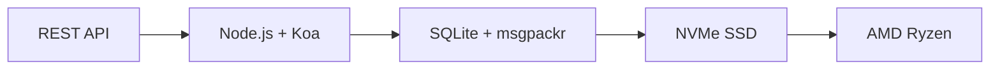

# La primera API de correo electrónico completa: cómo el reenvío de correo electrónico revolucionó la gestión del correo electrónico {#the-first-complete-email-api-how-forward-email-revolutionized-email-management}


<p class="lead mt-3">
<strong>TL;DR:</strong> Creamos la primera API REST completa del mundo para la gestión de correo electrónico, con funciones de búsqueda avanzadas que ningún otro servicio ofrece. Mientras Gmail, Outlook y Apple obligan a los desarrolladores a usar APIs con limitaciones de velocidad o IMAP, Forward Email ofrece operaciones CRUD ultrarrápidas para mensajes, carpetas, contactos y calendarios a través de una interfaz REST unificada con más de 15 parámetros de búsqueda. Esta es la API de correo electrónico que los desarrolladores estaban esperando.
</p>

## Tabla de contenido {#table-of-contents}

* [El problema de la API de correo electrónico](#the-email-api-problem)
* [Lo que realmente dicen los desarrolladores](#what-developers-are-actually-saying)
* [La solución revolucionaria de Forward Email](#forward-emails-revolutionary-solution)
  * [¿Por qué construimos esto?](#why-we-built-this)
  * [Autenticación simple](#simple-authentication)
* [20 puntos finales que lo cambian todo](#20-endpoints-that-change-everything)
  * [Mensajes (5 puntos finales)](#messages-5-endpoints)
  * [Carpetas (5 puntos finales)](#folders-5-endpoints)
  * [Contactos (5 puntos finales)](#contacts-5-endpoints)
  * [Calendarios (5 puntos finales)](#calendars-5-endpoints)
* [Búsqueda avanzada: ningún otro servicio se compara](#advanced-search-no-other-service-compares)
  * [El panorama de las API de búsqueda está roto](#the-search-api-landscape-is-broken)
  * [La revolucionaria API de búsqueda de Forward Email](#forward-emails-revolutionary-search-api)
  * [Ejemplos de búsqueda en el mundo real](#real-world-search-examples)
  * [Ventajas de rendimiento](#performance-advantages)
  * [Funciones de búsqueda que nadie más tiene](#search-features-no-one-else-has)
  * [Por qué esto es importante para los desarrolladores](#why-this-matters-for-developers)
  * [La implementación técnica](#the-technical-implementation)
* [Arquitectura de rendimiento ultrarrápido](#blazing-fast-performance-architecture)
  * [Puntos de referencia de rendimiento](#performance-benchmarks)
  * [Arquitectura que prioriza la privacidad](#privacy-first-architecture)
* [Por qué somos diferentes: La comparación completa](#why-were-different-the-complete-comparison)
  * [Limitaciones principales de los proveedores](#major-provider-limitations)
  * [Ventajas del reenvío de correo electrónico](#forward-email-advantages)
  * [El problema de la transparencia del código abierto](#the-open-source-transparency-problem)
* [Más de 30 ejemplos de integración del mundo real](#30-real-world-integration-examples)
  * [1. Mejora del formulario de contacto de WordPress](#1-wordpress-contact-form-enhancement)
  * [2. Alternativa a Zapier para la automatización del correo electrónico](#2-zapier-alternative-for-email-automation)
  * [3. Sincronización de correo electrónico de CRM](#3-crm-email-synchronization)
  * [4. Procesamiento de pedidos de comercio electrónico](#4-e-commerce-order-processing)
  * [5. Integración de tickets de soporte](#5-support-ticket-integration)
  * [6. Sistema de gestión de boletines informativos](#6-newsletter-management-system)
  * [7. Gestión de tareas basada en correo electrónico](#7-email-based-task-management)
  * [8. Agregación de correo electrónico de múltiples cuentas](#8-multi-account-email-aggregation)
  * [9. Panel de análisis de correo electrónico avanzado](#9-advanced-email-analytics-dashboard)
  * [10. Archivado inteligente de correo electrónico](#10-smart-email-archiving)
  * [11. Integración de correo electrónico con calendario](#11-email-to-calendar-integration)
  * [12. Copia de seguridad y cumplimiento del correo electrónico](#12-email-backup-and-compliance)
  * [13. Gestión de contenido basada en correo electrónico](#13-email-based-content-management)
  * [14. Gestión de plantillas de correo electrónico](#14-email-template-management)
  * [15. Automatización del flujo de trabajo basado en correo electrónico](#15-email-based-workflow-automation)
  * [16. Supervisión de la seguridad del correo electrónico](#16-email-security-monitoring)
  * [17. Recopilación de encuestas por correo electrónico](#17-email-based-survey-collection)
  * [18. Supervisión del rendimiento del correo electrónico](#18-email-performance-monitoring)
  * [19. Calificación de clientes potenciales basada en correo electrónico](#19-email-based-lead-qualification)
  * [20. Gestión de proyectos basada en correo electrónico](#20-email-based-project-management)
  * [21. Gestión de inventario basada en correo electrónico](#21-email-based-inventory-management)
  * [22. Procesamiento de facturas por correo electrónico](#22-email-based-invoice-processing)
  * [23. Registro de eventos por correo electrónico](#23-email-based-event-registration)
  * [24. Flujo de trabajo de aprobación de documentos por correo electrónico](#24-email-based-document-approval-workflow)
  * [25. Análisis de comentarios de clientes por correo electrónico](#25-email-based-customer-feedback-analysis)
  * [26. Proceso de reclutamiento basado en correo electrónico](#26-email-based-recruitment-pipeline)
  * [27. Procesamiento de informes de gastos por correo electrónico](#27-email-based-expense-report-processing)
  * [28. Informes de control de calidad basados en correo electrónico](#28-email-based-quality-assurance-reporting)
  * [29. Gestión de proveedores basada en correo electrónico](#29-email-based-vendor-management)
  * [30. Monitoreo de redes sociales basado en correo electrónico](#30-email-based-social-media-monitoring)
* [Empezando](#getting-started)
  * [1. Crea tu cuenta de correo electrónico de reenvío](#1-create-your-forward-email-account)
  * [2. Generar credenciales de API](#2-generate-api-credentials)
  * [3. Realice su primera llamada a la API](#3-make-your-first-api-call)
  * [4. Explorar la documentación](#4-explore-the-documentation)
* [Recursos técnicos](#technical-resources)

## El problema de la API de correo electrónico {#the-email-api-problem}

Las API de correo electrónico están completamente defectuosas. Punto.

Todos los principales proveedores de correo electrónico obligan a los desarrolladores a tomar una de dos opciones terribles:

1. **El infierno de IMAP**: Un protocolo de 30 años de antigüedad, diseñado para clientes de escritorio, no para aplicaciones modernas.
2. **API deficientes**: API complejas de OAuth, de solo lectura y con velocidad limitada, que no pueden administrar tus datos de correo electrónico.

¿El resultado? Los desarrolladores abandonan por completo la integración del correo electrónico o dedican semanas a desarrollar contenedores IMAP frágiles que fallan constantemente.

> \[!WARNING]
> **El secreto oculto**: La mayoría de las API de correo electrónico son simplemente API de envío. No se pueden organizar carpetas, sincronizar contactos ni gestionar calendarios mediante programación a través de una interfaz REST simple. Hasta ahora.

## Lo que realmente dicen los desarrolladores {#what-developers-are-actually-saying}

La frustración es real y está documentada en todas partes:

> "Recientemente intenté integrar Gmail en mi aplicación y le dediqué demasiado tiempo. Decidí que no merecía la pena darle soporte."
>
> *- [Desarrollador de Hacker News](https://news.ycombinator.com/item?id=42106944), 147 votos positivos*

¿Son todas las API de correo electrónico mediocres? Parecen limitadas o restrictivas de alguna manera.

> *- [Discusión sobre Reddit r/SaaS](https://www.reddit.com/r/SaaS/comments/1cm84s7/are_all_email_apis_mediocre/)*

¿Por qué el desarrollo de correo electrónico tiene que ser un desastre?

> *- [Reddit r/webdev](https://www.reddit.com/r/webdev/comments/15trnp2/why_does_email_development_have_to_suck/), 89 comentarios de desarrolladores problemáticos*

¿Qué hace que la API de Gmail sea más eficiente que IMAP? Otra razón por la que la API de Gmail es mucho más eficiente es que solo necesita descargar cada mensaje una vez. Con IMAP, cada mensaje debe descargarse e indexarse...
>
> *- [Pregunta de Stack Overflow](https://stackoverflow.com/questions/25431022/what-makes-the-gmail-api-more-efficient-than-imap) con 47 votos positivos*

La evidencia está en todas partes:

* **Problemas con SMTP de WordPress**: [631 problemas de GitHub](https://github.com/awesomemotive/WP-Mail-SMTP/issues) sobre fallos en la entrega de correos electrónicos
* **Limitaciones de Zapier**: [Quejas de la comunidad](https://community.zapier.com/featured-articles-65/email-parser-by-zapier-limitations-and-alternatives-16958) sobre el límite de 10 correos electrónicos por hora y fallos en la detección de IMAP
* **Proyectos de API IMAP**: [Múltiple](https://github.com/ewildgoose/imap-api), [código abierto](https://emailengine.app/) y [proyectos](https://www.npmjs.com/package/imapflow) existen específicamente para "convertir IMAP a REST" porque ningún proveedor ofrece esta función
* **Frustraciones con la API de Gmail**: [Desbordamiento de pila](https://stackoverflow.com/questions/tagged/gmail-api) tiene 4847 preguntas etiquetadas como "gmail-api" con quejas comunes sobre límites de velocidad y complejidad

## La solución revolucionaria para reenviar correo electrónico {#forward-emails-revolutionary-solution}

**Somos el primer servicio de correo electrónico que ofrece operaciones CRUD completas para todos los datos de correo electrónico a través de una API REST unificada.**

Esta no es una simple API de envío. Es un control programático completo sobre:

* **Mensajes**: Crear, leer, actualizar, eliminar, buscar, mover, marcar
* **Carpetas**: Gestión completa de carpetas IMAP mediante puntos finales REST
* **Contactos**: Almacenamiento y sincronización de contactos [Tarjeta DAV](https://tools.ietf.org/html/rfc6352)
* **Calendarios**: Eventos y programación del calendario [CalDAV](https://tools.ietf.org/html/rfc4791)

### Por qué construimos esto {#why-we-built-this}

**El problema**: Todos los proveedores de correo electrónico lo tratan como una caja negra. Puedes enviar correos electrónicos, incluso leerlos con OAuth complejo, pero no puedes *gestionar* tus datos de correo electrónico mediante programación.

**Nuestra visión**: El correo electrónico debe ser tan fácil de integrar como cualquier API moderna. Sin bibliotecas IMAP. Sin complejidades de OAuth. Sin problemas de límites de velocidad. Solo puntos finales REST simples y funcionales.

**El resultado**: El primer servicio de correo electrónico donde puedes crear un cliente de correo electrónico completo, una integración de CRM o un sistema de automatización utilizando únicamente solicitudes HTTP.

### Autenticación simple {#simple-authentication}

Sin [Complejidad de OAuth](https://oauth.net/2/). Sin [contraseñas específicas de la aplicación](https://support.google.com/accounts/answer/185833). Solo tus credenciales de alias:

```bash
curl -u "alias@yourdomain.com:password" \
  https://api.forwardemail.net/v1/messages
```

## 20 puntos finales que lo cambian todo {#20-endpoints-that-change-everything}

### Mensajes (5 puntos finales) {#messages-5-endpoints}

* `GET /v1/messages` - Listar mensajes con filtros (`?folder=`, `?is_unread=`, `?is_flagged=`)
* `POST /v1/messages` - Enviar mensajes nuevos directamente a carpetas
* `GET /v1/messages/:id` - Recuperar un mensaje específico con metadatos completos
* `PUT /v1/messages/:id` - Actualizar mensaje (indicadores, carpeta, estado de lectura)
* `DELETE /v1/messages/:id` - Eliminar mensaje permanentemente

### Carpetas (5 puntos finales) {#folders-5-endpoints}

* `GET /v1/folders` - Listar todas las carpetas con estado de suscripción
* `POST /v1/folders` - Crear una nueva carpeta con propiedades personalizadas
* `GET /v1/folders/:id` - Obtener detalles de la carpeta y el número de mensajes
* `PUT /v1/folders/:id` - Actualizar las propiedades de la carpeta y la suscripción
* `DELETE /v1/folders/:id` - Eliminar carpeta y gestionar la reubicación de mensajes

### Contactos (5 puntos finales) {#contacts-5-endpoints}

* `GET /v1/contacts` - Listado de contactos con búsqueda y paginación
* `POST /v1/contacts` - Creación de un nuevo contacto con compatibilidad completa con vCard
* `GET /v1/contacts/:id` - Recuperación del contacto con todos los campos y metadatos
* `PUT /v1/contacts/:id` - Actualización de la información del contacto con validación de ETag
* `DELETE /v1/contacts/:id` - Eliminación de un contacto con gestión en cascada

### Calendarios (5 puntos finales) {#calendars-5-endpoints}

* `GET /v1/calendars` - Listar eventos del calendario con filtro de fecha
* `POST /v1/calendars` - Crear evento del calendario con asistentes y frecuencia
* `GET /v1/calendars/:id` - Obtener detalles del evento con gestión de zona horaria
* `PUT /v1/calendars/:id` - Actualizar evento con detección de conflictos
* `DELETE /v1/calendars/:id` - Eliminar evento con notificaciones de asistentes

## Búsqueda avanzada: ningún otro servicio se compara {#advanced-search-no-other-service-compares}

**Forward Email es el único servicio de correo electrónico que ofrece una búsqueda programática integral en todos los campos de mensajes a través de una API REST.**

Mientras que otros proveedores ofrecen, en el mejor de los casos, un filtrado básico, hemos creado la API de búsqueda de correo electrónico más avanzada jamás creada. Ninguna API de Gmail, Outlook ni ningún otro servicio se acerca a nuestras capacidades de búsqueda.

### El panorama de la API de búsqueda está roto {#the-search-api-landscape-is-broken}

**Limitaciones de búsqueda de la API de Gmail:**

* ✅ Solo el parámetro básico `q`
* ❌ Sin búsqueda por campo
* ❌ Sin filtro de rango de fechas
* ❌ Sin filtro por tamaño
* ❌ Sin filtro de archivos adjuntos
* ❌ Limitado a la sintaxis de búsqueda de Gmail

**Limitaciones de búsqueda de la API de Outlook:**

* ✅ Parámetro básico `$search`
* ❌ Sin segmentación avanzada de campos
* ❌ Sin combinaciones de consultas complejas
* ❌ Limitación de velocidad agresiva
* ❌ Se requiere sintaxis OData compleja

**Apple iCloud:**

* ❌ Sin API
* ❌ Solo búsqueda IMAP (si logras que funcione)

**ProtonMail y Tuta:**

* ❌ Sin API públicas
* ❌ Sin funciones de búsqueda programática

### API de búsqueda revolucionaria de Forward Email {#forward-emails-revolutionary-search-api}

**Ofrecemos más de 15 parámetros de búsqueda que ningún otro servicio proporciona:**

| Capacidad de búsqueda | Reenviar correo electrónico | API de Gmail | API de Outlook | Otros |
| ------------------------------ | -------------------------------------- | ------------ | ------------------ | ------ |
| **Búsqueda específica de campo** | ✅ Asunto, cuerpo, de, para, cc, encabezados | ❌ | ❌ | ❌ |
| **Búsqueda general de múltiples campos** | ✅ `?search=` en todos los campos | ✅ CÓDIGO DE CELDA Básico `q=` | ✅ CÓDIGO DE CELDA Básico `$search=` | ❌ |
| **Filtrado por rango de fechas** | ✅ `?since=` & `?before=` | ❌ | ❌ | ❌ |
| **Filtrado basado en tamaño** | ✅ `?min_size=` & `?max_size=` | ❌ | ❌ | ❌ |
| **Filtrado de archivos adjuntos** | ✅ `?has_attachments=true/false` | ❌ | ❌ | ❌ |
| **Búsqueda de encabezado** | ✅ `?headers=X-Priority` | ❌ | ❌ | ❌ |
| **Búsqueda de ID de mensaje** | ✅ `?message_id=abc123` | ❌ | ❌ | ❌ |
| **Filtros combinados** | ✅ Múltiples parámetros con lógica AND | ❌ | ❌ | ❌ |
| **No distingue entre mayúsculas y minúsculas** | ✅ Todas las búsquedas | ✅ | ✅ | ❌ |
| **Soporte de paginación** | ✅ Funciona con todos los parámetros de búsqueda | ✅ | ✅ | ❌ |

### Ejemplos de búsqueda en el mundo real {#real-world-search-examples}

**Buscar todas las facturas del último trimestre:**

```bash
# Forward Email - Simple and powerful
GET /v1/messages?subject=invoice&since=2024-01-01T00:00:00Z&before=2024-04-01T00:00:00Z

# Gmail API - Impossible with their limited search
# No date range filtering available

# Outlook API - Complex OData syntax, limited functionality
GET /me/messages?$search="invoice"&$filter=receivedDateTime ge 2024-01-01T00:00:00Z
```

**Buscar archivos adjuntos grandes de un remitente específico:**

```bash
# Forward Email - Comprehensive filtering
GET /v1/messages?from=finance@company.com&has_attachments=true&min_size=1000000

# Gmail API - Cannot filter by size or attachments programmatically
# Outlook API - No size filtering available
# Others - No APIs available
```

**Búsqueda compleja de múltiples campos:**

```bash
# Forward Email - Advanced query capabilities
GET /v1/messages?body=quarterly&from=manager&is_flagged=true&folder=Reports

# Gmail API - Limited to basic text search only
GET /gmail/v1/users/me/messages?q=quarterly

# Outlook API - Basic search without field targeting
GET /me/messages?$search="quarterly"
```

### Ventajas de rendimiento {#performance-advantages}

**Rendimiento de búsqueda de reenvío de correo electrónico:**

* ⚡ **Tiempos de respuesta inferiores a 100 ms** para búsquedas complejas
* 🔍 **Optimización de expresiones regulares** con indexación adecuada
* 📊 **Ejecución de consultas en paralelo** para recuentos y datos
* 💾 **Uso eficiente de memoria** con consultas simplificadas

**Problemas de rendimiento de la competencia:**

* 🐌 **API de Gmail**: Velocidad limitada a 250 unidades de cuota por usuario por segundo
* 🐌 **API de Outlook**: Limitación estricta con requisitos de reducción complejos
* 🐌 **Otros**: No hay API con las que comparar

### Funciones de búsqueda que nadie más tiene {#search-features-no-one-else-has}

#### 1. Búsqueda específica del encabezado {#1-header-specific-search}

```bash
# Find messages with specific headers
GET /v1/messages?headers=X-Priority:1
GET /v1/messages?headers=X-Spam-Score
```

#### 2. Inteligencia basada en tamaño {#2-size-based-intelligence}

```bash
# Find newsletter emails (typically large)
GET /v1/messages?min_size=50000&from=newsletter

# Find quick replies (typically small)
GET /v1/messages?max_size=1000&to=support
```

#### 3. Flujos de trabajo basados en archivos adjuntos {#3-attachment-based-workflows}

```bash
# Find all documents sent to legal team
GET /v1/messages?to=legal&has_attachments=true&body=contract

# Find emails without attachments for cleanup
GET /v1/messages?has_attachments=false&before=2023-01-01T00:00:00Z
```

#### 4. Lógica empresarial combinada {#4-combined-business-logic}

```bash
# Find urgent flagged messages from VIPs with attachments
GET /v1/messages?is_flagged=true&from=ceo&has_attachments=true&subject=urgent
```

### Por qué esto es importante para los desarrolladores {#why-this-matters-for-developers}

**Crear aplicaciones que antes eran imposibles:**

1. **Análisis avanzado de correo electrónico**: Analice patrones de correo electrónico por tamaño, remitente y contenido
2. **Gestión inteligente de correo electrónico**: Autoorganice según criterios complejos
3. **Cumplimiento y descubrimiento**: Encuentre correos electrónicos específicos para requisitos legales
4. **Inteligencia empresarial**: Extraiga información de los patrones de comunicación por correo electrónico
5. **Flujos de trabajo automatizados**: Active acciones basadas en sofisticados filtros de correo electrónico

### La implementación técnica {#the-technical-implementation}

Nuestra API de búsqueda utiliza:

* **Optimización de expresiones regulares** con estrategias de indexación adecuadas
* **Ejecución paralela** para mejorar el rendimiento
* **Validación de entrada** para mayor seguridad
* **Gestión integral de errores** para mayor fiabilidad

```javascript
// Example: Complex search implementation
const searchConditions = [];

if (ctx.query.subject) {
  searchConditions.push({
    subject: { $regex: ctx.query.subject, $options: 'i' }
  });
}

if (ctx.query.from) {
  searchConditions.push({
    $or: [
      { 'from.address': { $regex: ctx.query.from, $options: 'i' } },
      { 'from.name': { $regex: ctx.query.from, $options: 'i' } }
    ]
  });
}

// Combine with AND logic
if (searchConditions.length > 0) {
  query.$and = searchConditions;
}
```

> \[!TIP]
> **Ventaja para desarrolladores**: Con la API de búsqueda de Forward Email, puede crear aplicaciones de correo electrónico que compiten con los clientes de escritorio en funcionalidad, manteniendo al mismo tiempo la simplicidad de las API REST.

## Arquitectura de rendimiento ultrarrápido {#blazing-fast-performance-architecture}

Nuestra pila técnica está diseñada para brindar velocidad y confiabilidad:



### Puntos de referencia de rendimiento {#performance-benchmarks}

**Por qué somos increíblemente rápidos:**

| Componente | Tecnología | Beneficio de rendimiento |
| ------------ | --------------------------------------------------------------------------------- | --------------------------------------------- |
| **Almacenamiento** | [NVMe SSD](https://en.wikipedia.org/wiki/NVM_Express) | 10 veces más rápido que el SATA tradicional |
| **Base de datos** | [SQLite](https://sqlite.org/) + [msgpackr](https://github.com/kriszyp/msgpackr) | Latencia de red cero, serialización optimizada |
| **Hardware** | [AMD Ryzen](https://www.amd.com/en/products/processors/desktops/ryzen) metal desnudo | Sin sobrecarga de virtualización |
| **Almacenamiento en caché** | En memoria + persistente | Tiempos de respuesta de submilisegundos |
| **Copias de seguridad** | [Cloudflare R2](https://www.cloudflare.com/products/r2/) encriptado | Confiabilidad de nivel empresarial |

**Números de rendimiento reales:**

* **Tiempo de respuesta de la API**: < 50 ms en promedio
* **Recuperación de mensajes**: < 10 ms para mensajes en caché
* **Operaciones de carpeta**: < 5 ms para operaciones de metadatos
* **Sincronización de contactos**: Más de 1000 contactos/segundo
* **Tiempo de actividad**: 99,99 % de acuerdo de nivel de servicio (SLA) con infraestructura redundante

### Arquitectura que prioriza la privacidad {#privacy-first-architecture}

**Diseño de conocimiento cero**: Solo usted tiene acceso con su contraseña IMAP; no podemos leer sus correos electrónicos. Nuestro [arquitectura de conocimiento cero](https://forwardemail.net/en/security) garantiza total privacidad con un rendimiento excepcional.

## Por qué somos diferentes: la comparación completa {#why-were-different-the-complete-comparison}

### Limitaciones principales del proveedor {#major-provider-limitations}

| Proveedor | Problemas fundamentales | Limitaciones específicas |
| ---------------- | ----------------------------------------- | -------------------------------------------------------------------------------------------------------------------------------------------------------------------------------------------------------------------------------------------------------------------------------------------------------------------------------------------------------------------------------------------------------------------------------------------------------------------- |
| **API de Gmail** | Solo lectura, OAuth complejo, API independientes | • [Cannot modify existing messages](https://developers.google.com/gmail/api/reference/rest/v1/users.messages)<br>• [Labels ≠ folders](https://developers.google.com/gmail/api/reference/rest/v1/users.labels)<br>• [1 billion quota units/day limit](https://developers.google.com/gmail/api/reference/quota)<br>• [Requires separate APIs](https://developers.google.com/workspace) para contactos/calendario |
| **API de Outlook** | Obsoleto, confuso, enfocado en la empresa | • [REST endpoints deprecated March 2024](https://learn.microsoft.com/en-us/outlook/rest/compare-graph)<br>• [Multiple confusing APIs](https://learn.microsoft.com/en-us/office/client-developer/outlook/selecting-an-api-or-technology-for-developing-solutions-for-outlook) (EWS, Gráfico, REST)<br>• [Microsoft Graph complexity](https://learn.microsoft.com/en-us/graph/overview)<br>• [Aggressive throttling](https://learn.microsoft.com/en-us/graph/throttling) |
| **Apple iCloud** | Sin API pública | • __ENLACE_CELULAR_0__<br>• __ENLACE_CELULAR_1__<br>• __ENLACE_CELULAR_2__<br>• __ENLACE_CELULAR_3__ |
| **ProtonMail** | Sin API, afirmaciones falsas de código abierto | • [No public API available](https://proton.me/support/protonmail-bridge-clients)<br>• [Bridge software required](https://proton.me/mail/bridge) para acceso IMAP<br>• [Claims "open source"](https://proton.me/blog/open-source) pero [server code is proprietary](https://github.com/ProtonMail)<br>• [Limited to paid plans only](https://proton.me/pricing) |
| **Total** | Sin API, transparencia engañosa | • [No REST API for email management](https://tuta.com/support#technical)<br>• [Claims "open source"](https://tuta.com/blog/posts/open-source-email) pero [backend is closed](https://github.com/tutao/tutanota)<br>• [IMAP/SMTP not supported](https://tuta.com/support#imap)<br>• [Proprietary encryption](https://tuta.com/encryption) impide integraciones estándar |
| **Correo electrónico de Zapier** | Límites de velocidad severos | • __ENLACE_CELULAR_0__<br>• __ENLACE_CELULAR_1__<br>• __ENLACE_CELULAR_2__ |

### Ventajas del reenvío de correo electrónico {#forward-email-advantages}

| Característica | Reenviar correo electrónico | Competencia |
| ------------------ | -------------------------------------------------------------------------------------------- | ----------------------------------------- |
| **COMPLETO CRUD** | ✅ Creación, lectura, actualización y eliminación completa de todos los datos | ❌ Operaciones de solo lectura o limitadas |
| **API unificada** | ✅ Mensajes, carpetas, contactos, calendarios en una sola API | ❌ API independientes o funciones faltantes |
| **Autenticación simple** | ✅ Autenticación básica con credenciales de alias | ❌ OAuth complejo con múltiples alcances |
| **Sin límites de tarifa** | ✅ Límites generosos diseñados para aplicaciones reales | ❌ Cuotas restrictivas que rompen los flujos de trabajo |
| **Autoalojamiento** | ✅ [Complete self-hosting option](https://forwardemail.net/en/blog/docs/self-hosted-solution) | ❌ Solo bloqueo del proveedor |
| **Privacidad** | ✅ Conocimiento cero, cifrado y privado | ❌ Preocupaciones sobre la minería de datos y la privacidad |
| **Actuación** | ✅ Respuestas de menos de 50 ms, almacenamiento NVMe | ❌ Latencia de la red, retrasos por limitación |

### El problema de la transparencia del código abierto {#the-open-source-transparency-problem}

**ProtonMail y Tuta se promocionan como "de código abierto" y "transparentes", pero se trata de una estrategia de marketing engañosa que viola los principios modernos de privacidad.**

> \[!WARNING]
> **Falsas declaraciones de transparencia**: Tanto ProtonMail como Tuta publicitan de forma destacada sus credenciales de "código abierto", mientras que mantienen su código más crítico del lado del servidor como propietario y cerrado.

**El engaño de ProtonMail:**

* **Afirmaciones**: ["Somos de código abierto"](https://proton.me/blog/open-source) aparece de forma destacada en el marketing
* **Realidad**: [El código del servidor es completamente propietario](https://github.com/ProtonMail): solo las aplicaciones cliente son de código abierto
* **Impacto**: Los usuarios no pueden verificar el cifrado del servidor, el manejo de datos ni las declaraciones de privacidad
* **Violación de la transparencia**: Imposibilidad de auditar los sistemas de procesamiento y almacenamiento de correo electrónico

**El marketing engañoso de Tuta:**

* **Afirmaciones**: ["Correo electrónico de código abierto"](https://tuta.com/blog/posts/open-source-email) como argumento de venta principal
* **Realidad**: [La infraestructura de backend es de código cerrado](https://github.com/tutao/tutanota): solo está disponible la interfaz
* **Impacto**: El cifrado propietario impide el uso de los protocolos de correo electrónico estándar (IMAP/SMTP)
* **Estrategia de dependencia**: El cifrado personalizado obliga a la dependencia del proveedor

**Por qué esto es importante para la privacidad moderna:**

En 2025, la verdadera privacidad exige **transparencia total**. Cuando los proveedores de correo electrónico afirman ser de "código abierto" pero ocultan el código de su servidor:

1. **Cifrado no verificable**: No se puede auditar cómo se cifran realmente los datos.
2. **Prácticas de datos ocultos**: El manejo de datos del lado del servidor sigue siendo una caja negra.
3. **Seguridad basada en la confianza**: Debe confiar en sus afirmaciones sin verificación.
4. **Dependencia del proveedor**: Los sistemas propietarios impiden la portabilidad de los datos.

**La verdadera transparencia del reenvío de correo electrónico:**

* ✅ **[Código abierto completo](https://github.com/forwardemail/forwardemail.net)** - código de servidor y cliente
* ✅ **[Hospedaje propio disponible](https://forwardemail.net/en/blog/docs/self-hosted-solution)** - ejecuta tu propia instancia
* ✅ **Protocolos estándar** - compatibilidad con IMAP, SMTP, CardDAV y CalDAV
* ✅ **Seguridad auditable** - se puede inspeccionar cada línea de código
* ✅ **Sin dependencia de un proveedor** - tus datos, tu control

> \[!TIP]
> **El código abierto real significa que puedes verificar cada afirmación.** Con Forward Email, puedes auditar nuestro cifrado, revisar nuestro manejo de datos e incluso ejecutar tu propia instancia. Eso es transparencia real.

## Más de 30 ejemplos de integración del mundo real {#30-real-world-integration-examples}

### 1. Mejora del formulario de contacto de WordPress {#1-wordpress-contact-form-enhancement}

**Problema**: [Errores de configuración SMTP de WordPress](https://github.com/awesomemotive/WP-Mail-SMTP/issues) ([631 problemas de GitHub](https://github.com/awesomemotive/WP-Mail-SMTP/issues))
**Solución**: La integración directa de la API omite por completo [SMTP](https://tools.ietf.org/html/rfc5321)

```javascript
// WordPress contact form that saves to Sent folder
await fetch('https://api.forwardemail.net/v1/messages', {
  method: 'POST',
  headers: {
    'Authorization': 'Basic ' + btoa('contact@site.com:password'),
    'Content-Type': 'application/json'
  },
  body: JSON.stringify({
    to: [{ address: 'owner@site.com' }],
    subject: 'Contact Form: ' + formData.subject,
    text: formData.message,
    folder: 'Sent'
  })
});
```

### 2. Alternativa a Zapier para la automatización del correo electrónico {#2-zapier-alternative-for-email-automation}

**Problema**: [Límite de 10 correos electrónicos por hora de Zapier](https://help.zapier.com/hc/en-us/articles/8496181555597-Email-Parser-by-Zapier-limitations-and-alternatives) y [Fallos de detección de IMAP](https://community.zapier.com/featured-articles-65/email-parser-by-zapier-limitations-and-alternatives-16958)
**Solución**: Automatización ilimitada con control total del correo electrónico

```javascript
// Auto-organize emails by sender domain
const messages = await fetch('/v1/messages?folder=INBOX');
for (const message of messages) {
  const domain = message.from.split('@')[1];
  await fetch(`/v1/messages/${message.id}`, {
    method: 'PUT',
    body: JSON.stringify({ folder: `Clients/${domain}` })
  });
}
```

### 3. Sincronización de correo electrónico de CRM {#3-crm-email-synchronization}

**Problema**: Gestión manual de contactos entre el correo electrónico y [Sistemas CRM](https://en.wikipedia.org/wiki/Customer_relationship_management)
**Solución**: Sincronización bidireccional con la API de contactos [Tarjeta DAV](https://tools.ietf.org/html/rfc6352)

```javascript
// Sync new email contacts to CRM
const newContacts = await fetch('/v1/contacts');
for (const contact of newContacts) {
  await crmAPI.createContact({
    name: contact.name,
    email: contact.email,
    source: 'email_api'
  });
}
```

### 4. Procesamiento de pedidos de comercio electrónico {#4-e-commerce-order-processing}

**Problema**: Procesamiento manual de correos electrónicos de pedidos para [plataformas de comercio electrónico](https://en.wikipedia.org/wiki/E-commerce)
**Solución**: Canal de gestión de pedidos automatizado

```javascript
// Process order confirmation emails
const orders = await fetch('/v1/messages?folder=Orders');
const orderEmails = orders.filter(msg =>
  msg.subject.includes('Order Confirmation')
);

for (const order of orderEmails) {
  const orderData = parseOrderEmail(order.text);
  await updateInventory(orderData);
  await fetch(`/v1/messages/${order.id}`, {
    method: 'PUT',
    body: JSON.stringify({ folder: 'Orders/Processed' })
  });
}
```

### 5. Integración de tickets de soporte {#5-support-ticket-integration}

**Problema**: Los hilos de correo electrónico están dispersos en [plataformas de soporte técnico](https://en.wikipedia.org/wiki/Help_desk_software)
**Solución**: Seguimiento completo de los hilos de correo electrónico

```javascript
// Create support ticket from email thread
const messages = await fetch('/v1/messages?folder=Support');
const supportEmails = messages.filter(msg =>
  msg.to.some(addr => addr.includes('support@'))
);

for (const email of supportEmails) {
  const ticket = await supportSystem.createTicket({
    subject: email.subject,
    from: email.from,
    body: email.text,
    timestamp: email.date
  });
}
```

### 6. Sistema de gestión de boletines {#6-newsletter-management-system}

**Problema**: Integraciones limitadas de [plataforma de boletines informativos](https://en.wikipedia.org/wiki/Email_marketing)
**Solución**: Gestión completa del ciclo de vida del suscriptor

```javascript
// Auto-manage newsletter subscriptions
const messages = await fetch('/v1/messages?folder=Newsletter');
const unsubscribes = messages.filter(msg =>
  msg.subject.toLowerCase().includes('unsubscribe')
);

for (const msg of unsubscribes) {
  await removeSubscriber(msg.from);
  await fetch(`/v1/messages/${msg.id}`, {
    method: 'PUT',
    body: JSON.stringify({ folder: 'Newsletter/Unsubscribed' })
  });
}
```

### 7. Gestión de tareas basada en correo electrónico {#7-email-based-task-management}

**Problema**: Bandeja de entrada sobrecargada y [seguimiento de tareas](https://en.wikipedia.org/wiki/Task_management)
**Solución**: Convertir correos electrónicos en tareas prácticas

```javascript
// Create tasks from flagged emails
const messages = await fetch('/v1/messages?is_flagged=true');
for (const email of messages) {
  await taskManager.createTask({
    title: email.subject,
    description: email.text,
    assignee: email.to[0].address,
    dueDate: extractDueDate(email.text)
  });
}
```

### 8. Agregación de correo electrónico de múltiples cuentas {#8-multi-account-email-aggregation}

**Problema**: Gestión de [varias cuentas de correo electrónico](https://en.wikipedia.org/wiki/Email_client) entre proveedores
**Solución**: Interfaz de bandeja de entrada unificada

```javascript
// Aggregate emails from multiple accounts
const accounts = ['work@domain.com', 'personal@domain.com'];
const allMessages = [];

for (const account of accounts) {
  const messages = await fetch('/v1/messages', {
    headers: { 'Authorization': getAuth(account) }
  });
  allMessages.push(...messages.map(m => ({ ...m, account })));
}
```

### 9. Panel de análisis de correo electrónico avanzado {#9-advanced-email-analytics-dashboard}

**Problema**: No se obtiene información sobre [patrones de correo electrónico](https://en.wikipedia.org/wiki/Email_analytics) con un filtrado sofisticado.
**Solución**: Análisis de correo electrónico personalizado mediante funciones de búsqueda avanzada.

```javascript
// Generate comprehensive email analytics using advanced search
const analytics = {};

// Analyze email volume by sender domain
const messages = await fetch('/v1/messages');
analytics.senderDomains = analyzeSenderDomains(messages);

// Find large attachments consuming storage
const largeAttachments = await fetch('/v1/messages?has_attachments=true&min_size=1000000');
analytics.storageHogs = largeAttachments.map(msg => ({
  subject: msg.subject,
  from: msg.from,
  size: msg.size
}));

// Analyze communication patterns with VIPs
const vipEmails = await fetch('/v1/messages?from=ceo@company.com');
const urgentVipEmails = await fetch('/v1/messages?from=ceo@company.com&subject=urgent');
analytics.vipCommunication = {
  total: vipEmails.length,
  urgent: urgentVipEmails.length,
  urgencyRate: (urgentVipEmails.length / vipEmails.length) * 100
};

// Find unread emails by date range for follow-up
const lastWeek = new Date(Date.now() - 7 * 24 * 60 * 60 * 1000).toISOString();
const unreadRecent = await fetch(`/v1/messages?is_unread=true&since=${lastWeek}`);
analytics.followUpNeeded = unreadRecent.length;

// Analyze email sizes for optimization
const smallEmails = await fetch('/v1/messages?max_size=1000');
const mediumEmails = await fetch('/v1/messages?min_size=1000&max_size=50000');
const largeEmails = await fetch('/v1/messages?min_size=50000');
analytics.sizeDistribution = {
  small: smallEmails.length,
  medium: mediumEmails.length,
  large: largeEmails.length
};

// Search for compliance-related emails
const complianceEmails = await fetch('/v1/messages?body=confidential&has_attachments=true');
analytics.complianceReview = complianceEmails.length;
```

### 10. Archivado inteligente de correo electrónico {#10-smart-email-archiving}

**Problema**: [organización del correo electrónico](https://en.wikipedia.org/wiki/Email_management) manual
**Solución**: Categorización inteligente de correo electrónico

```javascript
// Auto-archive old emails by category
const messages = await fetch('/v1/messages');
const oldEmails = messages.filter(email =>
  isOlderThan(email.date, 90) // 90 days
);

for (const email of oldEmails) {
  const category = categorizeEmail(email);
  await fetch(`/v1/messages/${email.id}`, {
    method: 'PUT',
    body: JSON.stringify({ folder: `Archive/${category}` })
  });
}
```

### 11. Integración de correo electrónico a calendario {#11-email-to-calendar-integration}

**Problema**: Creación manual de [evento del calendario](https://tools.ietf.org/html/rfc4791) a partir de correos electrónicos
**Solución**: Extracción y creación automática de eventos

```javascript
// Extract meeting details from emails
const messages = await fetch('/v1/messages?folder=Meetings');
const meetingEmails = messages.filter(email =>
  email.subject.toLowerCase().includes('meeting')
);

for (const email of meetingEmails) {
  const meetingData = extractMeetingInfo(email.text);
  if (meetingData.date && meetingData.time) {
    await fetch('/v1/calendars', {
      method: 'POST',
      body: JSON.stringify({
        title: email.subject,
        start: meetingData.datetime,
        attendees: [email.from, ...email.to]
      })
    });
  }
}
```

### 12. Copia de seguridad y cumplimiento del correo electrónico {#12-email-backup-and-compliance}

**Problema**: [Retención de correo electrónico](https://en.wikipedia.org/wiki/Email_retention_policy) y requisitos de cumplimiento
**Solución**: Copia de seguridad automatizada con preservación de metadatos

```javascript
// Backup emails with full metadata
const allMessages = await fetch('/v1/messages');
const backup = {
  timestamp: new Date(),
  messages: allMessages.map(msg => ({
    id: msg.id,
    subject: msg.subject,
    from: msg.from,
    to: msg.to,
    date: msg.date,
    flags: msg.flags
  }))
};
await saveToComplianceStorage(backup);
```

### 13. Gestión de contenido basada en correo electrónico {#13-email-based-content-management}

**Problema**: Gestión de envíos de contenido por correo electrónico para [Plataformas CMS](https://en.wikipedia.org/wiki/Content_management_system)
**Solución**: Correo electrónico como sistema de gestión de contenido

```javascript
// Process content submissions from email
const messages = await fetch('/v1/messages?folder=Submissions');
const submissions = messages.filter(msg =>
  msg.to.some(addr => addr.includes('submit@'))
);

for (const submission of submissions) {
  const content = parseSubmission(submission.text);
  await cms.createDraft({
    title: submission.subject,
    content: content.body,
    author: submission.from
  });
}
```

### 14. Gestión de plantillas de correo electrónico {#14-email-template-management}

**Problema**: [plantillas de correo electrónico](https://en.wikipedia.org/wiki/Email_template) inconsistente en todo el equipo
**Solución**: Sistema de plantillas centralizado con API

```javascript
// Send templated emails with dynamic content
const template = await getEmailTemplate('welcome');
await fetch('/v1/messages', {
  method: 'POST',
  body: JSON.stringify({
    to: [{ address: newUser.email }],
    subject: template.subject.replace('{{name}}', newUser.name),
    html: template.html.replace('{{name}}', newUser.name),
    folder: 'Sent'
  })
});
```

### 15. Automatización del flujo de trabajo basado en correo electrónico {#15-email-based-workflow-automation}

**Problema**: [procesos de aprobación](https://en.wikipedia.org/wiki/Workflow) manual por correo electrónico
**Solución**: Activadores de flujo de trabajo automatizados

```javascript
// Process approval emails
const messages = await fetch('/v1/messages?folder=Approvals');
const approvals = messages.filter(msg =>
  msg.subject.includes('APPROVAL')
);

for (const approval of approvals) {
  const decision = parseApprovalDecision(approval.text);
  await workflow.processApproval({
    requestId: extractRequestId(approval.subject),
    decision: decision,
    approver: approval.from
  });
}
```

### 16. Supervisión de la seguridad del correo electrónico {#16-email-security-monitoring}

**Problema**: [detección de amenazas a la seguridad](https://en.wikipedia.org/wiki/Email_security) manual
**Solución**: Análisis automatizado de amenazas

```javascript
// Monitor for suspicious emails
const recentEmails = await fetch('/v1/messages');
for (const email of recentEmails) {
  const threatScore = analyzeThreat(email);
  if (threatScore > 0.8) {
    await fetch(`/v1/messages/${email.id}`, {
      method: 'PUT',
      body: JSON.stringify({ folder: 'Security/Quarantine' })
    });
    await alertSecurityTeam(email);
  }
}
```

### 17. Recopilación de encuestas por correo electrónico {#17-email-based-survey-collection}

**Problema**: Procesamiento manual de [respuesta de la encuesta](https://en.wikipedia.org/wiki/Survey_methodology)
**Solución**: Agregación automatizada de respuestas

```javascript
// Collect and process survey responses
const messages = await fetch('/v1/messages?folder=Surveys');
const responses = messages.filter(msg =>
  msg.subject.includes('Survey Response')
);

const surveyData = responses.map(email => ({
  respondent: email.from,
  responses: parseSurveyData(email.text),
  timestamp: email.date
}));
await updateSurveyResults(surveyData);
```

### 18. Monitoreo del rendimiento del correo electrónico {#18-email-performance-monitoring}

**Problema**: Sin visibilidad de [rendimiento de la entrega de correo electrónico](https://en.wikipedia.org/wiki/Email_deliverability)
**Solución**: Métricas de correo electrónico en tiempo real

```javascript
// Monitor email delivery performance
const sentEmails = await fetch('/v1/messages?folder=Sent');
const deliveryStats = {
  sent: sentEmails.length,
  bounces: await countBounces(),
  deliveryRate: calculateDeliveryRate()
};
await updateDashboard(deliveryStats);
```

### 19. Calificación de clientes potenciales basada en correo electrónico {#19-email-based-lead-qualification}

**Problema**: [puntuación de clientes potenciales](https://en.wikipedia.org/wiki/Lead_scoring) manual desde interacciones de correo electrónico
**Solución**: Canal de calificación de leads automatizado

```javascript
// Score leads based on email engagement
const prospects = await fetch('/v1/contacts');
for (const prospect of prospects) {
  const messages = await fetch('/v1/messages');
  const emails = messages.filter(msg =>
    msg.from.includes(prospect.email)
  );
  const score = calculateEngagementScore(emails);
  await crm.updateLeadScore(prospect.id, score);
}
```

### 20. Gestión de proyectos basada en correo electrónico {#20-email-based-project-management}

**Problema**: [Actualizaciones del proyecto](https://en.wikipedia.org/wiki/Project_management) disperso en hilos de correo electrónico
**Solución**: Centro de comunicación centralizado del proyecto

```javascript
// Extract project updates from emails
const messages = await fetch('/v1/messages?folder=Projects');
const projectEmails = messages.filter(msg =>
  msg.subject.includes('Project Update')
);

for (const email of projectEmails) {
  const update = parseProjectUpdate(email.text);
  await projectManager.addUpdate({
    project: update.projectId,
    author: email.from,
    content: update.content
  });
}
```

### 21. Gestión de inventario basada en correo electrónico {#21-email-based-inventory-management}

**Problema**: Actualizaciones manuales del inventario mediante correos electrónicos de los proveedores
**Solución**: Seguimiento automatizado del inventario mediante notificaciones por correo electrónico

```javascript
// Process inventory updates from supplier emails
const messages = await fetch('/v1/messages?folder=Suppliers');
const inventoryEmails = messages.filter(msg =>
  msg.subject.includes('Inventory Update') || msg.subject.includes('Stock Alert')
);

for (const email of inventoryEmails) {
  const inventoryData = parseInventoryUpdate(email.text);
  await inventory.updateStock({
    sku: inventoryData.sku,
    quantity: inventoryData.quantity,
    supplier: email.from,
    timestamp: email.date
  });

  // Move to processed folder
  await fetch(`/v1/messages/${email.id}`, {
    method: 'PUT',
    body: JSON.stringify({ folder: 'Suppliers/Processed' })
  });
}
```

### 22. Procesamiento de facturas basado en correo electrónico {#22-email-based-invoice-processing}

**Problema**: [procesamiento de facturas](https://en.wikipedia.org/wiki/Invoice_processing) manual e integración contable
**Solución**: Extracción automatizada de facturas y sincronización con el sistema contable

```javascript
// Extract invoice data from email attachments
const messages = await fetch('/v1/messages?folder=Invoices');
const invoiceEmails = messages.filter(msg =>
  msg.subject.toLowerCase().includes('invoice') && msg.attachments.length > 0
);

for (const email of invoiceEmails) {
  const invoiceData = await extractInvoiceData(email.attachments[0]);
  await accounting.createInvoice({
    vendor: email.from,
    amount: invoiceData.total,
    dueDate: invoiceData.dueDate,
    items: invoiceData.lineItems
  });

  // Flag as processed
  await fetch(`/v1/messages/${email.id}`, {
    method: 'PUT',
    body: JSON.stringify({ flags: ['\\Seen', '\\Flagged'] })
  });
}
```

### 23. Registro de eventos por correo electrónico {#23-email-based-event-registration}

**Problema**: Procesamiento manual de [registro de eventos](https://en.wikipedia.org/wiki/Event_management) a partir de respuestas por correo electrónico
**Solución**: Gestión automatizada de asistentes e integración del calendario

```javascript
// Process event registration emails
const messages = await fetch('/v1/messages?folder=Events');
const registrations = messages.filter(msg =>
  msg.subject.includes('Registration') || msg.subject.includes('RSVP')
);

for (const registration of registrations) {
  const attendeeData = parseRegistration(registration.text);

  // Add to attendee list
  await events.addAttendee({
    event: attendeeData.eventId,
    name: attendeeData.name,
    email: registration.from,
    dietary: attendeeData.dietaryRestrictions
  });

  // Create calendar event for attendee
  await fetch('/v1/calendars', {
    method: 'POST',
    body: JSON.stringify({
      title: attendeeData.eventName,
      start: attendeeData.eventDate,
      attendees: [registration.from]
    })
  });
}
```

### 24. Flujo de trabajo de aprobación de documentos basado en correo electrónico {#24-email-based-document-approval-workflow}

**Problema**: Cadenas complejas [aprobación de documentos](https://en.wikipedia.org/wiki/Document_management_system) por correo electrónico
**Solución**: Seguimiento automatizado de aprobaciones y control de versiones de documentos

```javascript
// Track document approval workflow
const messages = await fetch('/v1/messages?folder=Approvals');
const approvalEmails = messages.filter(msg =>
  msg.subject.includes('Document Approval')
);

for (const email of approvalEmails) {
  const approval = parseApprovalEmail(email.text);

  await documentSystem.updateApproval({
    documentId: approval.documentId,
    approver: email.from,
    status: approval.decision, // 'approved', 'rejected', 'needs_changes'
    comments: approval.comments,
    timestamp: email.date
  });

  // Check if all approvals complete
  const document = await documentSystem.getDocument(approval.documentId);
  if (document.allApprovalsComplete) {
    await documentSystem.finalizeDocument(approval.documentId);
  }
}
```

### 25. Análisis de comentarios de clientes basado en correo electrónico {#25-email-based-customer-feedback-analysis}

**Problema**: Recopilación manual de [comentarios de los clientes](https://en.wikipedia.org/wiki/Customer_feedback) y análisis de opiniones
**Solución**: Procesamiento automatizado de comentarios y seguimiento de opiniones

```javascript
// Analyze customer feedback from emails
const messages = await fetch('/v1/messages?folder=Feedback');
const feedbackEmails = messages.filter(msg =>
  msg.to.some(addr => addr.includes('feedback@'))
);

for (const email of feedbackEmails) {
  const sentiment = await analyzeSentiment(email.text);
  const category = categorizeFeeback(email.text);

  await feedback.recordFeedback({
    customer: email.from,
    content: email.text,
    sentiment: sentiment.score, // -1 to 1
    category: category, // 'bug', 'feature', 'complaint', 'praise'
    priority: calculatePriority(sentiment, category),
    timestamp: email.date
  });

  // Auto-escalate negative feedback
  if (sentiment.score < -0.5) {
    await escalateToSupport(email);
  }
}
```

### 26. Proceso de reclutamiento basado en correo electrónico {#26-email-based-recruitment-pipeline}

**Problema**: [reclutamiento](https://en.wikipedia.org/wiki/Recruitment) manual y seguimiento de candidatos
**Solución**: Gestión automatizada de candidatos y programación de entrevistas

```javascript
// Process job application emails
const messages = await fetch('/v1/messages?folder=Careers');
const applications = messages.filter(msg =>
  msg.subject.toLowerCase().includes('application') && msg.attachments.length > 0
);

for (const application of applications) {
  const resume = await parseResume(application.attachments[0]);

  const candidate = await ats.createCandidate({
    name: resume.name,
    email: application.from,
    skills: resume.skills,
    experience: resume.experience,
    position: extractPosition(application.subject)
  });

  // Auto-schedule screening if qualified
  if (candidate.qualificationScore > 0.7) {
    await calendar.scheduleInterview({
      candidateId: candidate.id,
      type: 'phone_screening',
      duration: 30
    });
  }
}
```

### 27. Procesamiento de informes de gastos basados en correo electrónico {#27-email-based-expense-report-processing}

**Problema**: Envío y aprobación manual de [informe de gastos](https://en.wikipedia.org/wiki/Expense_report)
**Solución**: Flujo de trabajo automatizado de extracción y aprobación de gastos

```javascript
// Process expense report emails
const messages = await fetch('/v1/messages?folder=Expenses');
const expenseEmails = messages.filter(msg =>
  msg.subject.includes('Expense') && msg.attachments.length > 0
);

for (const email of expenseEmails) {
  const receipts = await processReceipts(email.attachments);

  const expenseReport = await expenses.createReport({
    employee: email.from,
    expenses: receipts.map(receipt => ({
      amount: receipt.total,
      category: receipt.category,
      date: receipt.date,
      merchant: receipt.merchant
    })),
    totalAmount: receipts.reduce((sum, r) => sum + r.total, 0)
  });

  // Auto-approve small amounts
  if (expenseReport.totalAmount < 100) {
    await expenses.approve(expenseReport.id);
  } else {
    await expenses.sendForApproval(expenseReport.id);
  }
}
```

### 28. Informes de control de calidad basados en correo electrónico {#28-email-based-quality-assurance-reporting}

**Problema**: Seguimiento manual de problemas [seguro de calidad](https://en.wikipedia.org/wiki/Quality_assurance)
**Solución**: Gestión automatizada de problemas de control de calidad y seguimiento de errores

```javascript
// Process QA bug reports from email
const messages = await fetch('/v1/messages?folder=QA');
const bugReports = messages.filter(msg =>
  msg.subject.includes('Bug Report') || msg.subject.includes('QA Issue')
);

for (const report of bugReports) {
  const bugData = parseBugReport(report.text);

  const ticket = await bugTracker.createIssue({
    title: report.subject,
    description: bugData.description,
    severity: bugData.severity,
    steps: bugData.stepsToReproduce,
    reporter: report.from,
    attachments: report.attachments
  });

  // Auto-assign based on component
  const assignee = await getComponentOwner(bugData.component);
  await bugTracker.assign(ticket.id, assignee);

  // Create calendar reminder for follow-up
  await fetch('/v1/calendars', {
    method: 'POST',
    body: JSON.stringify({
      title: `Follow up on ${ticket.id}`,
      start: addDays(new Date(), 3),
      attendees: [assignee]
    })
  });
}
```

### 29. Gestión de proveedores basada en correo electrónico {#29-email-based-vendor-management}

**Problema**: [comunicación con el proveedor](https://en.wikipedia.org/wiki/Vendor_management) manual y seguimiento de contratos
**Solución**: Gestión automatizada de las relaciones con los proveedores

```javascript
// Track vendor communications and contracts
const messages = await fetch('/v1/messages?folder=Vendors');
const vendorEmails = messages.filter(msg =>
  isVendorEmail(msg.from)
);

for (const email of vendorEmails) {
  const vendor = await vendors.getByEmail(email.from);

  // Log communication
  await vendors.logCommunication({
    vendorId: vendor.id,
    type: 'email',
    subject: email.subject,
    content: email.text,
    timestamp: email.date
  });

  // Check for contract-related keywords
  if (email.text.includes('contract') || email.text.includes('renewal')) {
    await vendors.flagForContractReview({
      vendorId: vendor.id,
      emailId: email.id,
      priority: 'high'
    });

    // Create task for procurement team
    await tasks.create({
      title: `Review contract communication from ${vendor.name}`,
      assignee: 'procurement@company.com',
      dueDate: addDays(new Date(), 2)
    });
  }
}
```

### 30. Monitoreo de redes sociales basado en correo electrónico {#30-email-based-social-media-monitoring}

**Problema**: Seguimiento y respuesta manual de menciones [redes sociales](https://en.wikipedia.org/wiki/Social_media_monitoring)
**Solución**: Procesamiento automatizado de alertas en redes sociales y coordinación de respuestas

```javascript
// Process social media alerts from email notifications
const messages = await fetch('/v1/messages?folder=Social');
const socialAlerts = messages.filter(msg =>
  msg.from.includes('alerts@') || msg.subject.includes('Social Mention')
);

for (const alert of socialAlerts) {
  const mention = parseSocialMention(alert.text);

  await socialMedia.recordMention({
    platform: mention.platform,
    author: mention.author,
    content: mention.content,
    sentiment: mention.sentiment,
    reach: mention.followerCount,
    url: mention.url
  });

  // Auto-escalate negative mentions with high reach
  if (mention.sentiment < -0.5 && mention.followerCount > 10000) {
    await socialMedia.escalateToTeam({
      mentionId: mention.id,
      priority: 'urgent',
      assignee: 'social-media-manager@company.com'
    });

    // Create calendar reminder for immediate response
    await fetch('/v1/calendars', {
      method: 'POST',
      body: JSON.stringify({
        title: `Urgent: Respond to negative social mention`,
        start: addMinutes(new Date(), 30),
        attendees: ['social-media-manager@company.com']
      })
    });
  }
}
```

## Primeros pasos {#getting-started}

### 1. Cree su cuenta de correo electrónico de reenvío {#1-create-your-forward-email-account}

Regístrese en [forwardemail.net](https://forwardemail.net) y verifique su dominio.

### 2. Generar credenciales de API {#2-generate-api-credentials}

Su alias de correo electrónico y contraseña sirven como credenciales de API: no se requiere configuración adicional.

### 3. Realice su primera llamada a la API {#3-make-your-first-api-call}

```bash
# List your messages
curl -u "your-alias@domain.com:password" \
  https://api.forwardemail.net/v1/messages

# Create a new contact
curl -u "your-alias@domain.com:password" \
  -X POST \
  -H "Content-Type: application/json" \
  -d '{"fullName":"John Doe","emails":[{"value":"john@example.com"}]}' \
  https://api.forwardemail.net/v1/contacts
```

### 4. Explorar la documentación {#4-explore-the-documentation}

Visita [forwardemail.net/en/email-api](https://forwardemail.net/en/email-api) para obtener la documentación completa de la API con ejemplos interactivos.

## Recursos técnicos {#technical-resources}

* **[Documentación completa de la API](https://forwardemail.net/en/email-api)** - Especificación interactiva de OpenAPI 3.0
* **[Guía de autoalojamiento](https://forwardemail.net/en/blog/docs/self-hosted-solution)** - Implemente el reenvío de correo electrónico en su infraestructura
* **[Libro blanco de seguridad](https://forwardemail.net/technical-whitepaper.pdf)** - Arquitectura técnica y detalles de seguridad
* **[Repositorio de GitHub](https://github.com/forwardemail/forwardemail.net)** - Código fuente abierto
* **[Soporte para desarrolladores](mailto:api@forwardemail.net)** - Acceso directo a nuestro equipo de ingeniería

---

**¿Listo para revolucionar la integración de su correo electrónico?** [Comience a crear con la API de Forward Email hoy mismo](https://forwardemail.net/en/email-api) y experimente la primera plataforma completa de gestión de correo electrónico diseñada para desarrolladores.

*Reenvío de correo electrónico: el servicio de correo electrónico que finalmente hace funcionar las API correctamente.*