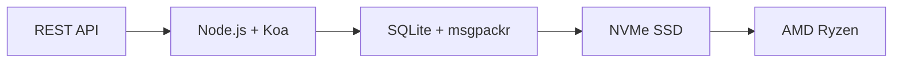

# La Primera API Completa de Email: Cómo Forward Email Revolucionó la Gestión de Email {#the-first-complete-email-api-how-forward-email-revolutionized-email-management}


<p class="lead mt-3">
  <strong>Resumen:</strong> Construimos la primera API REST completa del mundo para la gestión de email con capacidades avanzadas de búsqueda que ningún otro servicio ofrece. Mientras Gmail, Outlook y Apple obligan a los desarrolladores a lidiar con el infierno de IMAP o APIs con límites de tasa, Forward Email ofrece operaciones CRUD ultrarrápidas para mensajes, carpetas, contactos y calendarios a través de una interfaz REST unificada con más de 15 parámetros de búsqueda. Esta es la API de email que los desarrolladores estaban esperando.
</p>


## Tabla de Contenidos {#table-of-contents}

* [El Problema de la API de Email](#the-email-api-problem)
* [Lo Que Realmente Dicen los Desarrolladores](#what-developers-are-actually-saying)
* [La Solución Revolucionaria de Forward Email](#forward-emails-revolutionary-solution)
  * [Por Qué Lo Construimos](#why-we-built-this)
  * [Autenticación Simple](#simple-authentication)
* [20 Endpoints Que Cambian Todo](#20-endpoints-that-change-everything)
  * [Mensajes (5 endpoints)](#messages-5-endpoints)
  * [Carpetas (5 endpoints)](#folders-5-endpoints)
  * [Contactos (5 endpoints)](#contacts-5-endpoints)
  * [Calendarios (5 endpoints)](#calendars-5-endpoints)
* [Búsqueda Avanzada: Ningún Otro Servicio Se Compara](#advanced-search-no-other-service-compares)
  * [El Panorama de las APIs de Búsqueda Está Roto](#the-search-api-landscape-is-broken)
  * [La API de Búsqueda Revolucionaria de Forward Email](#forward-emails-revolutionary-search-api)
  * [Ejemplos Reales de Búsqueda](#real-world-search-examples)
  * [Ventajas de Rendimiento](#performance-advantages)
  * [Características de Búsqueda Que Nadie Más Tiene](#search-features-no-one-else-has)
  * [Por Qué Esto Importa para los Desarrolladores](#why-this-matters-for-developers)
  * [La Implementación Técnica](#the-technical-implementation)
* [Arquitectura de Rendimiento Ultrarrápido](#blazing-fast-performance-architecture)
  * [Benchmarks de Rendimiento](#performance-benchmarks)
  * [Arquitectura con Privacidad Primero](#privacy-first-architecture)
* [Por Qué Somos Diferentes: La Comparación Completa](#why-were-different-the-complete-comparison)
  * [Limitaciones de los Proveedores Principales](#major-provider-limitations)
  * [Ventajas de Forward Email](#forward-email-advantages)
  * [El Problema de Transparencia del Código Abierto](#the-open-source-transparency-problem)
* [Más de 30 Ejemplos de Integración en el Mundo Real](#30-real-world-integration-examples)
  * [1. Mejora del Formulario de Contacto en WordPress](#1-wordpress-contact-form-enhancement)
  * [2. Alternativa a Zapier para Automatización de Email](#2-zapier-alternative-for-email-automation)
  * [3. Sincronización de Email en CRM](#3-crm-email-synchronization)
  * [4. Procesamiento de Pedidos en E-commerce](#4-e-commerce-order-processing)
  * [5. Integración de Tickets de Soporte](#5-support-ticket-integration)
  * [6. Sistema de Gestión de Newsletters](#6-newsletter-management-system)
  * [7. Gestión de Tareas Basada en Email](#7-email-based-task-management)
  * [8. Agregación de Emails de Múltiples Cuentas](#8-multi-account-email-aggregation)
  * [9. Panel Avanzado de Análisis de Email](#9-advanced-email-analytics-dashboard)
  * [10. Archivado Inteligente de Emails](#10-smart-email-archiving)
  * [11. Integración de Email con Calendario](#11-email-to-calendar-integration)
  * [12. Respaldo y Cumplimiento de Email](#12-email-backup-and-compliance)
  * [13. Gestión de Contenido Basada en Email](#13-email-based-content-management)
  * [14. Gestión de Plantillas de Email](#14-email-template-management)
  * [15. Automatización de Flujos de Trabajo Basada en Email](#15-email-based-workflow-automation)
  * [16. Monitoreo de Seguridad de Email](#16-email-security-monitoring)
  * [17. Recolección de Encuestas Basada en Email](#17-email-based-survey-collection)
  * [18. Monitoreo de Rendimiento de Email](#18-email-performance-monitoring)
  * [19. Calificación de Leads Basada en Email](#19-email-based-lead-qualification)
  * [20. Gestión de Proyectos Basada en Email](#20-email-based-project-management)
  * [21. Gestión de Inventario Basada en Email](#21-email-based-inventory-management)
  * [22. Procesamiento de Facturas Basado en Email](#22-email-based-invoice-processing)
  * [23. Registro de Eventos Basado en Email](#23-email-based-event-registration)
  * [24. Flujo de Aprobación de Documentos Basado en Email](#24-email-based-document-approval-workflow)
  * [25. Análisis de Feedback de Clientes Basado en Email](#25-email-based-customer-feedback-analysis)
  * [26. Pipeline de Reclutamiento Basado en Email](#26-email-based-recruitment-pipeline)
  * [27. Procesamiento de Reportes de Gastos Basado en Email](#27-email-based-expense-report-processing)
  * [28. Reportes de Aseguramiento de Calidad Basados en Email](#28-email-based-quality-assurance-reporting)
  * [29. Gestión de Proveedores Basada en Email](#29-email-based-vendor-management)
  * [30. Monitoreo de Redes Sociales Basado en Email](#30-email-based-social-media-monitoring)
* [Primeros Pasos](#getting-started)
  * [1. Crea Tu Cuenta en Forward Email](#1-create-your-forward-email-account)
  * [2. Genera Credenciales API](#2-generate-api-credentials)
  * [3. Realiza Tu Primera Llamada a la API](#3-make-your-first-api-call)
  * [4. Explora la Documentación](#4-explore-the-documentation)
* [Recursos Técnicos](#technical-resources)
## El Problema de la API de Email {#the-email-api-problem}

Las APIs de email están fundamentalmente rotas. Punto.

Cada proveedor de email importante obliga a los desarrolladores a elegir entre dos opciones terribles:

1. **Infierno IMAP**: Lidiar con un protocolo de 30 años diseñado para clientes de escritorio, no para aplicaciones modernas
2. **APIs Limitadas**: APIs con límites de tasa, solo lectura, y complejas con OAuth que no pueden gestionar tus datos reales de email

¿El resultado? Los desarrolladores o abandonan la integración de email por completo o pierden semanas construyendo envoltorios frágiles de IMAP que se rompen constantemente.

> \[!WARNING]
> **El Secreto Sucio**: La mayoría de las "APIs de email" son solo APIs para enviar. No puedes organizar carpetas programáticamente, sincronizar contactos o gestionar calendarios a través de una simple interfaz REST. Hasta ahora.


## Lo Que Realmente Dicen los Desarrolladores {#what-developers-are-actually-saying}

La frustración es real y está documentada en todas partes:

> "Recientemente intenté integrar Gmail en mi app, y le dediqué demasiado tiempo. Decidí que no vale la pena soportar Gmail."
>
> *- [Desarrollador en Hacker News](https://news.ycombinator.com/item?id=42106944), 147 votos positivos*

> "¿Son todas las APIs de email mediocres? Parecen limitadas o restrictivas de alguna manera."
>
> *- [Discusión en Reddit r/SaaS](https://www.reddit.com/r/SaaS/comments/1cm84s7/are_all_email_apis_mediocre/)*

> "¿Por qué el desarrollo de email tiene que ser tan malo?"
>
> *- [Reddit r/webdev](https://www.reddit.com/r/webdev/comments/15trnp2/why_does_email_development_have_to_suck/), 89 comentarios de dolor de desarrolladores*

> "¿Qué hace que la API de Gmail sea más eficiente que IMAP? Otra razón por la que la API de Gmail es mucho más eficiente es porque solo necesita descargar cada mensaje una vez. Con IMAP, cada mensaje debe descargarse e indexarse..."
>
> *- [Pregunta en Stack Overflow](https://stackoverflow.com/questions/25431022/what-makes-the-gmail-api-more-efficient-than-imap) con 47 votos positivos*

La evidencia está en todas partes:

* **Problemas SMTP en WordPress**: [631 issues en GitHub](https://github.com/awesomemotive/WP-Mail-SMTP/issues) sobre fallos en la entrega de emails
* **Limitaciones de Zapier**: [Quejas de la comunidad](https://community.zapier.com/featured-articles-65/email-parser-by-zapier-limitations-and-alternatives-16958) sobre límites de 10 emails/hora y fallos en la detección IMAP
* **Proyectos de API IMAP**: [Múltiples](https://github.com/ewildgoose/imap-api) [proyectos open-source](https://emailengine.app/) [existen](https://www.npmjs.com/package/imapflow) específicamente para "convertir IMAP a REST" porque ningún proveedor lo ofrece
* **Frustraciones con la API de Gmail**: [Stack Overflow](https://stackoverflow.com/questions/tagged/gmail-api) tiene 4,847 preguntas etiquetadas "gmail-api" con quejas comunes sobre límites de tasa y complejidad


## La Solución Revolucionaria de Forward Email {#forward-emails-revolutionary-solution}

**Somos el primer servicio de email que ofrece operaciones CRUD completas para todos los datos de email a través de una API REST unificada.**

Esto no es solo otra API para enviar. Es control programático completo sobre:

* **Mensajes**: Crear, leer, actualizar, eliminar, buscar, mover, marcar
* **Carpetas**: Gestión completa de carpetas IMAP vía endpoints REST
* **Contactos**: Almacenamiento y sincronización de contactos [CardDAV](https://tools.ietf.org/html/rfc6352)
* **Calendarios**: Eventos y programación de calendarios [CalDAV](https://tools.ietf.org/html/rfc4791)

### Por Qué Lo Construimos {#why-we-built-this}

**El Problema**: Cada proveedor de email trata el email como una caja negra. Puedes enviar emails, tal vez leerlos con OAuth complejo, pero no puedes *gestionar* realmente tus datos de email programáticamente.

**Nuestra Visión**: El email debería ser tan fácil de integrar como cualquier API moderna. Sin librerías IMAP. Sin complejidad OAuth. Sin pesadillas de límites de tasa. Solo endpoints REST simples que funcionan.

**El Resultado**: El primer servicio de email donde puedes construir un cliente de email completo, integración CRM o sistema de automatización usando solo solicitudes HTTP.

### Autenticación Simple {#simple-authentication}

Sin [complejidad OAuth](https://oauth.net/2/). Sin [contraseñas específicas de aplicación](https://support.google.com/accounts/answer/185833). Solo tus credenciales de alias:

```bash
curl -u "alias@yourdomain.com:password" \
  https://api.forwardemail.net/v1/messages
```
## 20 Endpoints Que Cambian Todo {#20-endpoints-that-change-everything}

### Mensajes (5 endpoints) {#messages-5-endpoints}

* `GET /v1/messages` - Listar mensajes con filtrado (`?folder=`, `?is_unread=`, `?is_flagged=`)
* `POST /v1/messages` - Enviar nuevos mensajes directamente a carpetas
* `GET /v1/messages/:id` - Recuperar mensaje específico con metadatos completos
* `PUT /v1/messages/:id` - Actualizar mensaje (marcadores, carpeta, estado de lectura)
* `DELETE /v1/messages/:id` - Eliminar mensaje permanentemente

### Carpetas (5 endpoints) {#folders-5-endpoints}

* `GET /v1/folders` - Listar todas las carpetas con estado de suscripción
* `POST /v1/folders` - Crear nueva carpeta con propiedades personalizadas
* `GET /v1/folders/:id` - Obtener detalles de carpeta y conteo de mensajes
* `PUT /v1/folders/:id` - Actualizar propiedades de carpeta y suscripción
* `DELETE /v1/folders/:id` - Eliminar carpeta y manejar reubicación de mensajes

### Contactos (5 endpoints) {#contacts-5-endpoints}

* `GET /v1/contacts` - Listar contactos con búsqueda y paginación
* `POST /v1/contacts` - Crear nuevo contacto con soporte completo de vCard
* `GET /v1/contacts/:id` - Recuperar contacto con todos los campos y metadatos
* `PUT /v1/contacts/:id` - Actualizar información de contacto con validación ETag
* `DELETE /v1/contacts/:id` - Eliminar contacto con manejo en cascada

### Calendarios (5 endpoints) {#calendars-5-endpoints}

* `GET /v1/calendars` - Listar eventos de calendario con filtrado por fecha
* `POST /v1/calendars` - Crear evento de calendario con asistentes y recurrencia
* `GET /v1/calendars/:id` - Obtener detalles del evento con manejo de zona horaria
* `PUT /v1/calendars/:id` - Actualizar evento con detección de conflictos
* `DELETE /v1/calendars/:id` - Eliminar evento con notificaciones a asistentes


## Búsqueda Avanzada: Ningún Otro Servicio Se Compara {#advanced-search-no-other-service-compares}

**Forward Email es el único servicio de correo que ofrece búsqueda programática integral en todos los campos de mensajes a través de una API REST.**

Mientras otros proveedores ofrecen como mucho filtrado básico, hemos construido la API de búsqueda de correo electrónico más avanzada jamás creada. Ninguna API de Gmail, Outlook ni ningún otro servicio se acerca a nuestras capacidades de búsqueda.

### El Panorama de las APIs de Búsqueda Está Roto {#the-search-api-landscape-is-broken}

**Limitaciones de Búsqueda en la API de Gmail:**

* ✅ Solo parámetro básico `q`
* ❌ Sin búsqueda específica por campo
* ❌ Sin filtrado por rango de fechas
* ❌ Sin filtrado por tamaño
* ❌ Sin filtrado por adjuntos
* ❌ Limitado a la sintaxis de búsqueda de Gmail

**Limitaciones de Búsqueda en la API de Outlook:**

* ✅ Parámetro básico `$search`
* ❌ Sin direccionamiento avanzado por campo
* ❌ Sin combinaciones complejas de consultas
* ❌ Limitación agresiva de tasa
* ❌ Sintaxis OData compleja requerida

**Apple iCloud:**

* ❌ No tiene API alguna
* ❌ Solo búsqueda IMAP (si logras que funcione)

**ProtonMail & Tuta:**

* ❌ Sin APIs públicas
* ❌ Sin capacidades de búsqueda programática

### La Revolucionaria API de Búsqueda de Forward Email {#forward-emails-revolutionary-search-api}

**Ofrecemos más de 15 parámetros de búsqueda que ningún otro servicio proporciona:**

| Capacidad de Búsqueda          | Forward Email                        | API de Gmail | API de Outlook     | Otros  |
| ------------------------------ | ---------------------------------- | ------------ | ------------------ | ------ |
| **Búsqueda Específica por Campo** | ✅ Asunto, cuerpo, de, para, cc, encabezados | ❌            | ❌                  | ❌      |
| **Búsqueda General Multi-Campo** | ✅ `?search=` en todos los campos   | ✅ Básico `q=` | ✅ Básico `$search=` | ❌      |
| **Filtrado por Rango de Fechas** | ✅ `?since=` & `?before=`           | ❌            | ❌                  | ❌      |
| **Filtrado por Tamaño**         | ✅ `?min_size=` & `?max_size=`      | ❌            | ❌                  | ❌      |
| **Filtrado por Adjuntos**       | ✅ `?has_attachments=true/false`    | ❌            | ❌                  | ❌      |
| **Búsqueda en Encabezados**     | ✅ `?headers=X-Priority`            | ❌            | ❌                  | ❌      |
| **Búsqueda por ID de Mensaje**  | ✅ `?message_id=abc123`             | ❌            | ❌                  | ❌      |
| **Filtros Combinados**          | ✅ Múltiples parámetros con lógica AND | ❌            | ❌                  | ❌      |
| **Insensible a Mayúsculas/Minúsculas** | ✅ Todas las búsquedas             | ✅            | ✅                  | ❌      |
| **Soporte de Paginación**       | ✅ Funciona con todos los parámetros de búsqueda | ✅            | ✅                  | ❌      |
### Ejemplos Reales de Búsqueda {#real-world-search-examples}

**Encontrar Todas las Facturas del Último Trimestre:**

```bash
# Forward Email - Simple y potente
GET /v1/messages?subject=invoice&since=2024-01-01T00:00:00Z&before=2024-04-01T00:00:00Z

# Gmail API - Imposible con su búsqueda limitada
# No hay filtrado por rango de fechas disponible

# Outlook API - Sintaxis OData compleja, funcionalidad limitada
GET /me/messages?$search="invoice"&$filter=receivedDateTime ge 2024-01-01T00:00:00Z
```

**Buscar Adjuntos Grandes de un Remitente Específico:**

```bash
# Forward Email - Filtrado completo
GET /v1/messages?from=finance@company.com&has_attachments=true&min_size=1000000

# Gmail API - No se puede filtrar por tamaño o adjuntos programáticamente
# Outlook API - No hay filtrado por tamaño disponible
# Otros - No hay APIs disponibles
```

**Búsqueda Compleja con Múltiples Campos:**

```bash
# Forward Email - Capacidades avanzadas de consulta
GET /v1/messages?body=quarterly&from=manager&is_flagged=true&folder=Reports

# Gmail API - Limitado a búsqueda básica de texto solamente
GET /gmail/v1/users/me/messages?q=quarterly

# Outlook API - Búsqueda básica sin especificar campos
GET /me/messages?$search="quarterly"
```

### Ventajas de Rendimiento {#performance-advantages}

**Rendimiento de Búsqueda en Forward Email:**

* ⚡ **Tiempos de respuesta inferiores a 100ms** para búsquedas complejas
* 🔍 **Optimización con expresiones regulares** y correcto indexado
* 📊 **Ejecución paralela de consultas** para conteo y datos
* 💾 **Uso eficiente de memoria** con consultas ligeras

**Problemas de Rendimiento de la Competencia:**

* 🐌 **Gmail API**: Limitado a 250 unidades de cuota por usuario por segundo
* 🐌 **Outlook API**: Estrangulamiento agresivo con requisitos complejos de retroceso
* 🐌 **Otros**: No hay APIs para comparar

### Funciones de Búsqueda que Nadie Más Tiene {#search-features-no-one-else-has}

#### 1. Búsqueda Específica por Encabezado {#1-header-specific-search}

```bash
# Encontrar mensajes con encabezados específicos
GET /v1/messages?headers=X-Priority:1
GET /v1/messages?headers=X-Spam-Score
```

#### 2. Inteligencia Basada en Tamaño {#2-size-based-intelligence}

```bash
# Encontrar correos de boletines (típicamente grandes)
GET /v1/messages?min_size=50000&from=newsletter

# Encontrar respuestas rápidas (típicamente pequeñas)
GET /v1/messages?max_size=1000&to=support
```

#### 3. Flujos de Trabajo Basados en Adjuntos {#3-attachment-based-workflows}

```bash
# Encontrar todos los documentos enviados al equipo legal
GET /v1/messages?to=legal&has_attachments=true&body=contract

# Encontrar correos sin adjuntos para limpieza
GET /v1/messages?has_attachments=false&before=2023-01-01T00:00:00Z
```

#### 4. Lógica Comercial Combinada {#4-combined-business-logic}

```bash
# Encontrar mensajes urgentes marcados de VIPs con adjuntos
GET /v1/messages?is_flagged=true&from=ceo&has_attachments=true&subject=urgent
```

### Por Qué Esto Importa para los Desarrolladores {#why-this-matters-for-developers}

**Construye Aplicaciones que Antes Eran Imposibles:**

1. **Análisis Avanzado de Correos**: Analiza patrones de correo por tamaño, remitente, contenido
2. **Gestión Inteligente de Correos**: Auto-organización basada en criterios complejos
3. **Cumplimiento y Descubrimiento**: Encuentra correos específicos para requisitos legales
4. **Inteligencia de Negocios**: Extrae insights de patrones de comunicación por correo
5. **Flujos de Trabajo Automatizados**: Dispara acciones basadas en filtros sofisticados de correo

### La Implementación Técnica {#the-technical-implementation}

Nuestra API de búsqueda utiliza:

* **Optimización con expresiones regulares** y estrategias adecuadas de indexado
* **Ejecución paralela** para rendimiento
* **Validación de entrada** para seguridad
* **Manejo integral de errores** para confiabilidad

```javascript
// Ejemplo: Implementación de búsqueda compleja
const searchConditions = [];

if (ctx.query.subject) {
  searchConditions.push({
    subject: { $regex: ctx.query.subject, $options: 'i' }
  });
}

if (ctx.query.from) {
  searchConditions.push({
    $or: [
      { 'from.address': { $regex: ctx.query.from, $options: 'i' } },
      { 'from.name': { $regex: ctx.query.from, $options: 'i' } }
    ]
  });
}

// Combinar con lógica AND
if (searchConditions.length > 0) {
  query.$and = searchConditions;
}
```

> \[!TIP]
> **Ventaja para Desarrolladores**: Con la API de búsqueda de Forward Email, puedes construir aplicaciones de correo que rivalizan con clientes de escritorio en funcionalidad, manteniendo la simplicidad de las APIs REST.
## Arquitectura de Rendimiento Ultrarrápido {#blazing-fast-performance-architecture}

Nuestra pila técnica está construida para velocidad y fiabilidad:


```mermaid
graph LR
    A[REST API] --> B[Node.js + Koa]
    B --> C[SQLite + msgpackr]
    C --> D[NVMe SSD]
    D --> E[AMD Ryzen]
```

### Pruebas de Rendimiento {#performance-benchmarks}

**Por qué somos ultrarrápidos:**

| Componente   | Tecnología                                                                       | Beneficio de Rendimiento                      |
| ------------ | -------------------------------------------------------------------------------- | --------------------------------------------- |
| **Almacenamiento** | [NVMe SSD](https://en.wikipedia.org/wiki/NVM_Express)                        | 10x más rápido que SATA tradicional           |
| **Base de datos**  | [SQLite](https://sqlite.org/) + [msgpackr](https://github.com/kriszyp/msgpackr) | Latencia de red cero, serialización optimizada |
| **Hardware**      | [AMD Ryzen](https://www.amd.com/en/products/processors/desktops/ryzen) bare metal | Sin sobrecarga de virtualización               |
| **Caché**         | En memoria + persistente                                                        | Tiempos de respuesta submilisegundos          |
| **Copias de seguridad** | [Cloudflare R2](https://www.cloudflare.com/products/r2/) cifrado             | Fiabilidad de nivel empresarial                 |

**Números reales de rendimiento:**

* **Tiempo de respuesta API**: < 50ms promedio
* **Recuperación de mensajes**: < 10ms para mensajes en caché
* **Operaciones en carpetas**: < 5ms para operaciones de metadatos
* **Sincronización de contactos**: 1000+ contactos/segundo
* **Tiempo activo**: 99.99% SLA con infraestructura redundante

### Arquitectura con Privacidad Primero {#privacy-first-architecture}

**Diseño de conocimiento cero**: Solo tú tienes acceso con tu contraseña IMAP - no podemos leer tus correos. Nuestra [arquitectura de conocimiento cero](https://forwardemail.net/en/security) garantiza privacidad completa mientras ofrece un rendimiento ultrarrápido.


## Por qué somos diferentes: La comparación completa {#why-were-different-the-complete-comparison}

### Limitaciones de los principales proveedores {#major-provider-limitations}

| Proveedor       | Problemas principales                      | Limitaciones específicas                                                                                                                                                                                                                                                                                                                                                                                                                                               |
| --------------- | ----------------------------------------- | ------------------------------------------------------------------------------------------------------------------------------------------------------------------------------------------------------------------------------------------------------------------------------------------------------------------------------------------------------------------------------------------------------------------------------------------------------------------------ |
| **Gmail API**   | Solo lectura, OAuth complejo, APIs separadas | • [No se pueden modificar mensajes existentes](https://developers.google.com/gmail/api/reference/rest/v1/users.messages)<br>• [Etiquetas ≠ carpetas](https://developers.google.com/gmail/api/reference/rest/v1/users.labels)<br>• [Límite de 1 billón de unidades de cuota/día](https://developers.google.com/gmail/api/reference/quota)<br>• [Requiere APIs separadas](https://developers.google.com/workspace) para contactos/calendario                                                           |
| **Outlook API** | Obsoleta, confusa, enfocada en empresas   | • [Endpoints REST obsoletos desde marzo 2024](https://learn.microsoft.com/en-us/outlook/rest/compare-graph)<br>• [Múltiples APIs confusas](https://learn.microsoft.com/en-us/office/client-developer/outlook/selecting-an-api-or-technology-for-developing-solutions-for-outlook) (EWS, Graph, REST)<br>• [Complejidad de Microsoft Graph](https://learn.microsoft.com/en-us/graph/overview)<br>• [Limitación agresiva](https://learn.microsoft.com/en-us/graph/throttling) |
| **Apple iCloud**| Sin API pública                           | • [No tiene API pública alguna](https://support.apple.com/en-us/102654)<br>• [Solo IMAP con límite de 1000 correos/día](https://support.apple.com/en-us/102654)<br>• [Contraseñas específicas para apps requeridas](https://support.apple.com/en-us/102654)<br>• [Límite de 500 destinatarios por mensaje](https://support.apple.com/en-us/102654)                                                                                                                                              |
| **ProtonMail**  | Sin API, falsas afirmaciones de código abierto | • [No hay API pública disponible](https://proton.me/support/protonmail-bridge-clients)<br>• [Se requiere software Bridge](https://proton.me/mail/bridge) para acceso IMAP<br>• [Afirman ser "código abierto"](https://proton.me/blog/open-source) pero [el código del servidor es propietario](https://github.com/ProtonMail)<br>• [Limitado solo a planes de pago](https://proton.me/pricing)                                                                                                         |
| **Tuta**        | Sin API, transparencia engañosa           | • [No tiene API REST para gestión de correo](https://tuta.com/support#technical)<br>• [Afirma ser "código abierto"](https://tuta.com/blog/posts/open-source-email) pero [el backend es cerrado](https://github.com/tutao/tutanota)<br>• [No soporta IMAP/SMTP](https://tuta.com/support#imap)<br>• [Cifrado propietario](https://tuta.com/encryption) impide integraciones estándar                                                                                               |
| **Zapier Email**| Límites severos de tasa                    | • [Límite de 10 correos por hora](https://help.zapier.com/hc/en-us/articles/8496181555597-Email-Parser-by-Zapier-limitations-and-alternatives)<br>• [Sin acceso a carpetas IMAP](https://help.zapier.com/hc/en-us/articles/8496181555597-Email-Parser-by-Zapier-limitations-and-alternatives)<br>• [Capacidades limitadas de análisis](https://help.zapier.com/hc/en-us/articles/8496181555597-Email-Parser-by-Zapier-limitations-and-alternatives)
### Ventajas de Forward Email {#forward-email-advantages}

| Característica     | Forward Email                                                                                | Competencia                              |
| ------------------ | -------------------------------------------------------------------------------------------- | ---------------------------------------- |
| **CRUD Completo**  | ✅ Creación, lectura, actualización y eliminación completas para todos los datos              | ❌ Solo lectura o operaciones limitadas  |
| **API Unificada**  | ✅ Mensajes, carpetas, contactos, calendarios en una sola API                                | ❌ APIs separadas o funciones faltantes  |
| **Autenticación Simple** | ✅ Autenticación básica con credenciales de alias                                         | ❌ OAuth complejo con múltiples permisos |
| **Sin Límites de Tasa** | ✅ Límites generosos diseñados para aplicaciones reales                                  | ❌ Cuotas restrictivas que interrumpen flujos de trabajo |
| **Autoalojamiento** | ✅ [Opción completa de autoalojamiento](https://forwardemail.net/en/blog/docs/self-hosted-solution) | ❌ Solo dependencia del proveedor         |
| **Privacidad**     | ✅ Cifrado privado y de conocimiento cero                                                    | ❌ Minería de datos y preocupaciones de privacidad |
| **Rendimiento**    | ✅ Respuestas en menos de 50 ms, almacenamiento NVMe                                        | ❌ Latencia de red, retrasos por limitación |

### El Problema de Transparencia en el Código Abierto {#the-open-source-transparency-problem}

**ProtonMail y Tuta se promocionan como "código abierto" y "transparentes", pero esto es un marketing engañoso que viola los principios modernos de privacidad.**

> \[!WARNING]
> **Reclamos Falsos de Transparencia**: Tanto ProtonMail como Tuta publicitan prominentemente sus credenciales de "código abierto" mientras mantienen su código más crítico del lado del servidor propietario y cerrado.

**El Engaño de ProtonMail:**

* **Reclamos**: ["Somos código abierto"](https://proton.me/blog/open-source) destacado en su marketing
* **Realidad**: [El código del servidor es completamente propietario](https://github.com/ProtonMail) - solo las aplicaciones cliente son de código abierto
* **Impacto**: Los usuarios no pueden verificar el cifrado del servidor, el manejo de datos ni las afirmaciones de privacidad
* **Violación de Transparencia**: No hay forma de auditar los sistemas reales de procesamiento y almacenamiento de correo

**El Marketing Engañoso de Tuta:**

* **Reclamos**: ["Correo electrónico de código abierto"](https://tuta.com/blog/posts/open-source-email) como punto clave de venta
* **Realidad**: [La infraestructura backend es de código cerrado](https://github.com/tutao/tutanota) - solo el frontend está disponible
* **Impacto**: El cifrado propietario impide protocolos estándar de correo (IMAP/SMTP)
* **Estrategia de Dependencia**: El cifrado personalizado obliga a depender del proveedor

**Por Qué Esto Importa para la Privacidad Moderna:**

En 2025, la verdadera privacidad requiere **transparencia completa**. Cuando los proveedores de correo dicen "código abierto" pero ocultan su código servidor:

1. **Cifrado No Verificable**: No puedes auditar cómo se cifra realmente tu información
2. **Prácticas de Datos Ocultas**: El manejo de datos en el servidor es una caja negra
3. **Seguridad Basada en Confianza**: Debes confiar en sus afirmaciones sin verificación
4. **Dependencia del Proveedor**: Los sistemas propietarios impiden la portabilidad de datos

**La Verdadera Transparencia de Forward Email:**

* ✅ **[Código abierto completo](https://github.com/forwardemail/forwardemail.net)** - código del servidor y cliente
* ✅ **[Autoalojamiento disponible](https://forwardemail.net/en/blog/docs/self-hosted-solution)** - ejecuta tu propia instancia
* ✅ **Protocolos estándar** - compatibilidad con IMAP, SMTP, CardDAV, CalDAV
* ✅ **Seguridad auditable** - cada línea de código puede ser inspeccionada
* ✅ **Sin dependencia del proveedor** - tus datos, tu control

> \[!TIP]
> **Código abierto real significa que puedes verificar cada afirmación.** Con Forward Email, puedes auditar nuestro cifrado, revisar nuestro manejo de datos e incluso ejecutar tu propia instancia. Eso es verdadera transparencia.


## Más de 30 Ejemplos de Integración en el Mundo Real {#30-real-world-integration-examples}

### 1. Mejora del Formulario de Contacto en WordPress {#1-wordpress-contact-form-enhancement}
**Problema**: [Fallos en la configuración SMTP de WordPress](https://github.com/awesomemotive/WP-Mail-SMTP/issues) ([631 issues en GitHub](https://github.com/awesomemotive/WP-Mail-SMTP/issues))  
**Solución**: La integración directa con API evita completamente [SMTP](https://tools.ietf.org/html/rfc5321)

```javascript
// Formulario de contacto de WordPress que guarda en la carpeta Enviados
await fetch('https://api.forwardemail.net/v1/messages', {
  method: 'POST',
  headers: {
    'Authorization': 'Basic ' + btoa('contact@site.com:password'),
    'Content-Type': 'application/json'
  },
  body: JSON.stringify({
    to: [{ address: 'owner@site.com' }],
    subject: 'Formulario de contacto: ' + formData.subject,
    text: formData.message,
    folder: 'Sent'
  })
});
```

### 2. Alternativa a Zapier para Automatización de Email {#2-zapier-alternative-for-email-automation}

**Problema**: [Límite de 10 emails/hora de Zapier](https://help.zapier.com/hc/en-us/articles/8496181555597-Email-Parser-by-Zapier-limitations-and-alternatives) y [fallos en la detección IMAP](https://community.zapier.com/featured-articles-65/email-parser-by-zapier-limitations-and-alternatives-16958)  
**Solución**: Automatización ilimitada con control total del email

```javascript
// Auto-organizar emails por dominio del remitente
const messages = await fetch('/v1/messages?folder=INBOX');
for (const message of messages) {
  const domain = message.from.split('@')[1];
  await fetch(`/v1/messages/${message.id}`, {
    method: 'PUT',
    body: JSON.stringify({ folder: `Clients/${domain}` })
  });
}
```

### 3. Sincronización de Email con CRM {#3-crm-email-synchronization}

**Problema**: Gestión manual de contactos entre email y [sistemas CRM](https://en.wikipedia.org/wiki/Customer_relationship_management)  
**Solución**: Sincronización bidireccional con API de contactos [CardDAV](https://tools.ietf.org/html/rfc6352)

```javascript
// Sincronizar nuevos contactos de email al CRM
const newContacts = await fetch('/v1/contacts');
for (const contact of newContacts) {
  await crmAPI.createContact({
    name: contact.name,
    email: contact.email,
    source: 'email_api'
  });
}
```

### 4. Procesamiento de Pedidos en E-commerce {#4-e-commerce-order-processing}

**Problema**: Procesamiento manual de emails de pedidos para [plataformas de comercio electrónico](https://en.wikipedia.org/wiki/E-commerce)  
**Solución**: Pipeline automatizado de gestión de pedidos

```javascript
// Procesar emails de confirmación de pedidos
const orders = await fetch('/v1/messages?folder=Orders');
const orderEmails = orders.filter(msg =>
  msg.subject.includes('Order Confirmation')
);

for (const order of orderEmails) {
  const orderData = parseOrderEmail(order.text);
  await updateInventory(orderData);
  await fetch(`/v1/messages/${order.id}`, {
    method: 'PUT',
    body: JSON.stringify({ folder: 'Orders/Processed' })
  });
}
```

### 5. Integración de Tickets de Soporte {#5-support-ticket-integration}

**Problema**: Hilos de email dispersos en [plataformas de helpdesk](https://en.wikipedia.org/wiki/Help_desk_software)  
**Solución**: Seguimiento completo de hilos de email

```javascript
// Crear ticket de soporte desde hilo de email
const messages = await fetch('/v1/messages?folder=Support');
const supportEmails = messages.filter(msg =>
  msg.to.some(addr => addr.includes('support@'))
);

for (const email of supportEmails) {
  const ticket = await supportSystem.createTicket({
    subject: email.subject,
    from: email.from,
    body: email.text,
    timestamp: email.date
  });
}
```

### 6. Sistema de Gestión de Newsletters {#6-newsletter-management-system}

**Problema**: Integraciones limitadas con [plataformas de newsletters](https://en.wikipedia.org/wiki/Email_marketing)  
**Solución**: Gestión completa del ciclo de vida del suscriptor

```javascript
// Gestión automática de suscripciones a newsletters
const messages = await fetch('/v1/messages?folder=Newsletter');
const unsubscribes = messages.filter(msg =>
  msg.subject.toLowerCase().includes('unsubscribe')
);

for (const msg of unsubscribes) {
  await removeSubscriber(msg.from);
  await fetch(`/v1/messages/${msg.id}`, {
    method: 'PUT',
    body: JSON.stringify({ folder: 'Newsletter/Unsubscribed' })
  });
}
```

### 7. Gestión de Tareas Basada en Email {#7-email-based-task-management}

**Problema**: Sobrecarga de la bandeja de entrada y [seguimiento de tareas](https://en.wikipedia.org/wiki/Task_management)  
**Solución**: Convertir emails en tareas accionables
```javascript
// Create tasks from flagged emails
const messages = await fetch('/v1/messages?is_flagged=true');
for (const email of messages) {
  await taskManager.createTask({
    title: email.subject,
    description: email.text,
    assignee: email.to[0].address,
    dueDate: extractDueDate(email.text)
  });
}
```

### 8. Multi-Account Email Aggregation {#8-multi-account-email-aggregation}

**Problem**: Managing [multiple email accounts](https://en.wikipedia.org/wiki/Email_client) across providers
**Solution**: Unified inbox interface

```javascript
// Aggregate emails from multiple accounts
const accounts = ['work@domain.com', 'personal@domain.com'];
const allMessages = [];

for (const account of accounts) {
  const messages = await fetch('/v1/messages', {
    headers: { 'Authorization': getAuth(account) }
  });
  allMessages.push(...messages.map(m => ({ ...m, account })));
}
```

### 9. Advanced Email Analytics Dashboard {#9-advanced-email-analytics-dashboard}

**Problem**: No insights into [email patterns](https://en.wikipedia.org/wiki/Email_analytics) with sophisticated filtering
**Solution**: Custom email analytics using advanced search capabilities

```javascript
// Generate comprehensive email analytics using advanced search
const analytics = {};

// Analyze email volume by sender domain
const messages = await fetch('/v1/messages');
analytics.senderDomains = analyzeSenderDomains(messages);

// Find large attachments consuming storage
const largeAttachments = await fetch('/v1/messages?has_attachments=true&min_size=1000000');
analytics.storageHogs = largeAttachments.map(msg => ({
  subject: msg.subject,
  from: msg.from,
  size: msg.size
}));

// Analyze communication patterns with VIPs
const vipEmails = await fetch('/v1/messages?from=ceo@company.com');
const urgentVipEmails = await fetch('/v1/messages?from=ceo@company.com&subject=urgent');
analytics.vipCommunication = {
  total: vipEmails.length,
  urgent: urgentVipEmails.length,
  urgencyRate: (urgentVipEmails.length / vipEmails.length) * 100
};

// Find unread emails by date range for follow-up
const lastWeek = new Date(Date.now() - 7 * 24 * 60 * 60 * 1000).toISOString();
const unreadRecent = await fetch(`/v1/messages?is_unread=true&since=${lastWeek}`);
analytics.followUpNeeded = unreadRecent.length;

// Analyze email sizes for optimization
const smallEmails = await fetch('/v1/messages?max_size=1000');
const mediumEmails = await fetch('/v1/messages?min_size=1000&max_size=50000');
const largeEmails = await fetch('/v1/messages?min_size=50000');
analytics.sizeDistribution = {
  small: smallEmails.length,
  medium: mediumEmails.length,
  large: largeEmails.length
};

// Search for compliance-related emails
const complianceEmails = await fetch('/v1/messages?body=confidential&has_attachments=true');
analytics.complianceReview = complianceEmails.length;
```

### 10. Smart Email Archiving {#10-smart-email-archiving}

**Problem**: Manual [email organization](https://en.wikipedia.org/wiki/Email_management)
**Solution**: Intelligent email categorization

```javascript
// Auto-archive old emails by category
const messages = await fetch('/v1/messages');
const oldEmails = messages.filter(email =>
  isOlderThan(email.date, 90) // 90 days
);

for (const email of oldEmails) {
  const category = categorizeEmail(email);
  await fetch(`/v1/messages/${email.id}`, {
    method: 'PUT',
    body: JSON.stringify({ folder: `Archive/${category}` })
  });
}
```

### 11. Email-to-Calendar Integration {#11-email-to-calendar-integration}

**Problem**: Manual [calendar event](https://tools.ietf.org/html/rfc4791) creation from emails
**Solution**: Automatic event extraction and creation

```javascript
// Extract meeting details from emails
const messages = await fetch('/v1/messages?folder=Meetings');
const meetingEmails = messages.filter(email =>
  email.subject.toLowerCase().includes('meeting')
);

for (const email of meetingEmails) {
  const meetingData = extractMeetingInfo(email.text);
  if (meetingData.date && meetingData.time) {
    await fetch('/v1/calendars', {
      method: 'POST',
      body: JSON.stringify({
        title: email.subject,
        start: meetingData.datetime,
        attendees: [email.from, ...email.to]
      })
    });
  }
}
```

### 12. Copia de Seguridad y Cumplimiento de Email {#12-email-backup-and-compliance}

**Problema**: Requisitos de [retención de emails](https://en.wikipedia.org/wiki/Email_retention_policy) y cumplimiento  
**Solución**: Copia de seguridad automatizada con preservación de metadatos

```javascript
// Backup emails with full metadata
const allMessages = await fetch('/v1/messages');
const backup = {
  timestamp: new Date(),
  messages: allMessages.map(msg => ({
    id: msg.id,
    subject: msg.subject,
    from: msg.from,
    to: msg.to,
    date: msg.date,
    flags: msg.flags
  }))
};
await saveToComplianceStorage(backup);
```

### 13. Gestión de Contenido Basada en Email {#13-email-based-content-management}

**Problema**: Gestión de envíos de contenido vía email para [plataformas CMS](https://en.wikipedia.org/wiki/Content_management_system)  
**Solución**: Email como sistema de gestión de contenido

```javascript
// Process content submissions from email
const messages = await fetch('/v1/messages?folder=Submissions');
const submissions = messages.filter(msg =>
  msg.to.some(addr => addr.includes('submit@'))
);

for (const submission of submissions) {
  const content = parseSubmission(submission.text);
  await cms.createDraft({
    title: submission.subject,
    content: content.body,
    author: submission.from
  });
}
```

### 14. Gestión de Plantillas de Email {#14-email-template-management}

**Problema**: Plantillas de [email](https://en.wikipedia.org/wiki/Email_template) inconsistentes en el equipo  
**Solución**: Sistema centralizado de plantillas con API

```javascript
// Send templated emails with dynamic content
const template = await getEmailTemplate('welcome');
await fetch('/v1/messages', {
  method: 'POST',
  body: JSON.stringify({
    to: [{ address: newUser.email }],
    subject: template.subject.replace('{{name}}', newUser.name),
    html: template.html.replace('{{name}}', newUser.name),
    folder: 'Sent'
  })
});
```

### 15. Automatización de Flujo de Trabajo Basada en Email {#15-email-based-workflow-automation}

**Problema**: Procesos manuales de [aprobación](https://en.wikipedia.org/wiki/Workflow) vía email  
**Solución**: Disparadores automáticos de flujo de trabajo

```javascript
// Process approval emails
const messages = await fetch('/v1/messages?folder=Approvals');
const approvals = messages.filter(msg =>
  msg.subject.includes('APPROVAL')
);

for (const approval of approvals) {
  const decision = parseApprovalDecision(approval.text);
  await workflow.processApproval({
    requestId: extractRequestId(approval.subject),
    decision: decision,
    approver: approval.from
  });
}
```

### 16. Monitoreo de Seguridad de Email {#16-email-security-monitoring}

**Problema**: Detección manual de [amenazas de seguridad](https://en.wikipedia.org/wiki/Email_security)  
**Solución**: Análisis automatizado de amenazas

```javascript
// Monitor for suspicious emails
const recentEmails = await fetch('/v1/messages');
for (const email of recentEmails) {
  const threatScore = analyzeThreat(email);
  if (threatScore > 0.8) {
    await fetch(`/v1/messages/${email.id}`, {
      method: 'PUT',
      body: JSON.stringify({ folder: 'Security/Quarantine' })
    });
    await alertSecurityTeam(email);
  }
}
```

### 17. Recolección de Encuestas Basada en Email {#17-email-based-survey-collection}

**Problema**: Procesamiento manual de [respuestas a encuestas](https://en.wikipedia.org/wiki/Survey_methodology)  
**Solución**: Agregación automatizada de respuestas

```javascript
// Collect and process survey responses
const messages = await fetch('/v1/messages?folder=Surveys');
const responses = messages.filter(msg =>
  msg.subject.includes('Survey Response')
);

const surveyData = responses.map(email => ({
  respondent: email.from,
  responses: parseSurveyData(email.text),
  timestamp: email.date
}));
await updateSurveyResults(surveyData);
```

### 18. Monitoreo del Rendimiento del Email {#18-email-performance-monitoring}

**Problema**: Falta de visibilidad en el [rendimiento de entrega de emails](https://en.wikipedia.org/wiki/Email_deliverability)  
**Solución**: Métricas de email en tiempo real

```javascript
// Monitor email delivery performance
const sentEmails = await fetch('/v1/messages?folder=Sent');
const deliveryStats = {
  sent: sentEmails.length,
  bounces: await countBounces(),
  deliveryRate: calculateDeliveryRate()
};
await updateDashboard(deliveryStats);
```
### 19. Calificación de Leads Basada en Email {#19-email-based-lead-qualification}

**Problema**: [Calificación de leads](https://en.wikipedia.org/wiki/Lead_scoring) manual a partir de interacciones por email  
**Solución**: Pipeline automatizado de calificación de leads

```javascript
// Score leads based on email engagement
const prospects = await fetch('/v1/contacts');
for (const prospect of prospects) {
  const messages = await fetch('/v1/messages');
  const emails = messages.filter(msg =>
    msg.from.includes(prospect.email)
  );
  const score = calculateEngagementScore(emails);
  await crm.updateLeadScore(prospect.id, score);
}
```

### 20. Gestión de Proyectos Basada en Email {#20-email-based-project-management}

**Problema**: [Actualizaciones de proyectos](https://en.wikipedia.org/wiki/Project_management) dispersas en hilos de email  
**Solución**: Centro de comunicación centralizado para proyectos

```javascript
// Extract project updates from emails
const messages = await fetch('/v1/messages?folder=Projects');
const projectEmails = messages.filter(msg =>
  msg.subject.includes('Project Update')
);

for (const email of projectEmails) {
  const update = parseProjectUpdate(email.text);
  await projectManager.addUpdate({
    project: update.projectId,
    author: email.from,
    content: update.content
  });
}
```

### 21. Gestión de Inventario Basada en Email {#21-email-based-inventory-management}

**Problema**: Actualizaciones manuales de inventario a partir de emails de proveedores  
**Solución**: Seguimiento automatizado de inventario desde notificaciones por email

```javascript
// Process inventory updates from supplier emails
const messages = await fetch('/v1/messages?folder=Suppliers');
const inventoryEmails = messages.filter(msg =>
  msg.subject.includes('Inventory Update') || msg.subject.includes('Stock Alert')
);

for (const email of inventoryEmails) {
  const inventoryData = parseInventoryUpdate(email.text);
  await inventory.updateStock({
    sku: inventoryData.sku,
    quantity: inventoryData.quantity,
    supplier: email.from,
    timestamp: email.date
  });

  // Move to processed folder
  await fetch(`/v1/messages/${email.id}`, {
    method: 'PUT',
    body: JSON.stringify({ folder: 'Suppliers/Processed' })
  });
}
```

### 22. Procesamiento de Facturas Basado en Email {#22-email-based-invoice-processing}

**Problema**: Procesamiento manual de [facturas](https://en.wikipedia.org/wiki/Invoice_processing) e integración contable  
**Solución**: Extracción automatizada de facturas y sincronización con sistema contable

```javascript
// Extract invoice data from email attachments
const messages = await fetch('/v1/messages?folder=Invoices');
const invoiceEmails = messages.filter(msg =>
  msg.subject.toLowerCase().includes('invoice') && msg.attachments.length > 0
);

for (const email of invoiceEmails) {
  const invoiceData = await extractInvoiceData(email.attachments[0]);
  await accounting.createInvoice({
    vendor: email.from,
    amount: invoiceData.total,
    dueDate: invoiceData.dueDate,
    items: invoiceData.lineItems
  });

  // Flag as processed
  await fetch(`/v1/messages/${email.id}`, {
    method: 'PUT',
    body: JSON.stringify({ flags: ['\\Seen', '\\Flagged'] })
  });
}
```

### 23. Registro de Eventos Basado en Email {#23-email-based-event-registration}

**Problema**: Procesamiento manual de [registro de eventos](https://en.wikipedia.org/wiki/Event_management) a partir de respuestas por email  
**Solución**: Gestión automatizada de asistentes e integración con calendario

```javascript
// Process event registration emails
const messages = await fetch('/v1/messages?folder=Events');
const registrations = messages.filter(msg =>
  msg.subject.includes('Registration') || msg.subject.includes('RSVP')
);

for (const registration of registrations) {
  const attendeeData = parseRegistration(registration.text);

  // Add to attendee list
  await events.addAttendee({
    event: attendeeData.eventId,
    name: attendeeData.name,
    email: registration.from,
    dietary: attendeeData.dietaryRestrictions
  });

  // Create calendar event for attendee
  await fetch('/v1/calendars', {
    method: 'POST',
    body: JSON.stringify({
      title: attendeeData.eventName,
      start: attendeeData.eventDate,
      attendees: [registration.from]
    })
  });
}
```
### 24. Flujo de Trabajo de Aprobación de Documentos Basado en Email {#24-email-based-document-approval-workflow}

**Problema**: Cadenas complejas de [aprobación de documentos](https://en.wikipedia.org/wiki/Document_management_system) vía email  
**Solución**: Seguimiento automatizado de aprobaciones y versionado de documentos

```javascript
// Track document approval workflow
const messages = await fetch('/v1/messages?folder=Approvals');
const approvalEmails = messages.filter(msg =>
  msg.subject.includes('Document Approval')
);

for (const email of approvalEmails) {
  const approval = parseApprovalEmail(email.text);

  await documentSystem.updateApproval({
    documentId: approval.documentId,
    approver: email.from,
    status: approval.decision, // 'approved', 'rejected', 'needs_changes'
    comments: approval.comments,
    timestamp: email.date
  });

  // Check if all approvals complete
  const document = await documentSystem.getDocument(approval.documentId);
  if (document.allApprovalsComplete) {
    await documentSystem.finalizeDocument(approval.documentId);
  }
}
```

### 25. Análisis de Retroalimentación de Clientes Basado en Email {#25-email-based-customer-feedback-analysis}

**Problema**: Recolección manual de [retroalimentación de clientes](https://en.wikipedia.org/wiki/Customer_feedback) y análisis de sentimiento  
**Solución**: Procesamiento automatizado de retroalimentación y seguimiento de sentimiento

```javascript
// Analyze customer feedback from emails
const messages = await fetch('/v1/messages?folder=Feedback');
const feedbackEmails = messages.filter(msg =>
  msg.to.some(addr => addr.includes('feedback@'))
);

for (const email of feedbackEmails) {
  const sentiment = await analyzeSentiment(email.text);
  const category = categorizeFeeback(email.text);

  await feedback.recordFeedback({
    customer: email.from,
    content: email.text,
    sentiment: sentiment.score, // -1 to 1
    category: category, // 'bug', 'feature', 'complaint', 'praise'
    priority: calculatePriority(sentiment, category),
    timestamp: email.date
  });

  // Auto-escalate negative feedback
  if (sentiment.score < -0.5) {
    await escalateToSupport(email);
  }
}
```

### 26. Pipeline de Reclutamiento Basado en Email {#26-email-based-recruitment-pipeline}

**Problema**: Seguimiento manual de [reclutamiento](https://en.wikipedia.org/wiki/Recruitment) y candidatos  
**Solución**: Gestión automatizada de candidatos y programación de entrevistas

```javascript
// Process job application emails
const messages = await fetch('/v1/messages?folder=Careers');
const applications = messages.filter(msg =>
  msg.subject.toLowerCase().includes('application') && msg.attachments.length > 0
);

for (const application of applications) {
  const resume = await parseResume(application.attachments[0]);

  const candidate = await ats.createCandidate({
    name: resume.name,
    email: application.from,
    skills: resume.skills,
    experience: resume.experience,
    position: extractPosition(application.subject)
  });

  // Auto-schedule screening if qualified
  if (candidate.qualificationScore > 0.7) {
    await calendar.scheduleInterview({
      candidateId: candidate.id,
      type: 'phone_screening',
      duration: 30
    });
  }
}
```

### 27. Procesamiento de Reportes de Gastos Basado en Email {#27-email-based-expense-report-processing}

**Problema**: Envío y aprobación manual de [reportes de gastos](https://en.wikipedia.org/wiki/Expense_report)  
**Solución**: Extracción automatizada de gastos y flujo de aprobación

```javascript
// Process expense report emails
const messages = await fetch('/v1/messages?folder=Expenses');
const expenseEmails = messages.filter(msg =>
  msg.subject.includes('Expense') && msg.attachments.length > 0
);

for (const email of expenseEmails) {
  const receipts = await processReceipts(email.attachments);

  const expenseReport = await expenses.createReport({
    employee: email.from,
    expenses: receipts.map(receipt => ({
      amount: receipt.total,
      category: receipt.category,
      date: receipt.date,
      merchant: receipt.merchant
    })),
    totalAmount: receipts.reduce((sum, r) => sum + r.total, 0)
  });

  // Auto-approve small amounts
  if (expenseReport.totalAmount < 100) {
    await expenses.approve(expenseReport.id);
  } else {
    await expenses.sendForApproval(expenseReport.id);
  }
}
```
### 28. Reportes de Control de Calidad Basados en Email {#28-email-based-quality-assurance-reporting}

**Problema**: Seguimiento manual de [control de calidad](https://en.wikipedia.org/wiki/Quality_assurance)  
**Solución**: Gestión automatizada de incidencias de control de calidad y seguimiento de errores

```javascript
// Process QA bug reports from email
const messages = await fetch('/v1/messages?folder=QA');
const bugReports = messages.filter(msg =>
  msg.subject.includes('Bug Report') || msg.subject.includes('QA Issue')
);

for (const report of bugReports) {
  const bugData = parseBugReport(report.text);

  const ticket = await bugTracker.createIssue({
    title: report.subject,
    description: bugData.description,
    severity: bugData.severity,
    steps: bugData.stepsToReproduce,
    reporter: report.from,
    attachments: report.attachments
  });

  // Auto-assign based on component
  const assignee = await getComponentOwner(bugData.component);
  await bugTracker.assign(ticket.id, assignee);

  // Create calendar reminder for follow-up
  await fetch('/v1/calendars', {
    method: 'POST',
    body: JSON.stringify({
      title: `Follow up on ${ticket.id}`,
      start: addDays(new Date(), 3),
      attendees: [assignee]
    })
  });
}
```

### 29. Gestión de Proveedores Basada en Email {#29-email-based-vendor-management}

**Problema**: Comunicación manual con [proveedores](https://en.wikipedia.org/wiki/Vendor_management) y seguimiento de contratos  
**Solución**: Gestión automatizada de relaciones con proveedores

```javascript
// Track vendor communications and contracts
const messages = await fetch('/v1/messages?folder=Vendors');
const vendorEmails = messages.filter(msg =>
  isVendorEmail(msg.from)
);

for (const email of vendorEmails) {
  const vendor = await vendors.getByEmail(email.from);

  // Log communication
  await vendors.logCommunication({
    vendorId: vendor.id,
    type: 'email',
    subject: email.subject,
    content: email.text,
    timestamp: email.date
  });

  // Check for contract-related keywords
  if (email.text.includes('contract') || email.text.includes('renewal')) {
    await vendors.flagForContractReview({
      vendorId: vendor.id,
      emailId: email.id,
      priority: 'high'
    });

    // Create task for procurement team
    await tasks.create({
      title: `Review contract communication from ${vendor.name}`,
      assignee: 'procurement@company.com',
      dueDate: addDays(new Date(), 2)
    });
  }
}
```

### 30. Monitoreo de Redes Sociales Basado en Email {#30-email-based-social-media-monitoring}

**Problema**: Seguimiento manual de menciones en [redes sociales](https://en.wikipedia.org/wiki/Social_media_monitoring) y respuesta  
**Solución**: Procesamiento automatizado de alertas de redes sociales y coordinación de respuestas

```javascript
// Process social media alerts from email notifications
const messages = await fetch('/v1/messages?folder=Social');
const socialAlerts = messages.filter(msg =>
  msg.from.includes('alerts@') || msg.subject.includes('Social Mention')
);

for (const alert of socialAlerts) {
  const mention = parseSocialMention(alert.text);

  await socialMedia.recordMention({
    platform: mention.platform,
    author: mention.author,
    content: mention.content,
    sentiment: mention.sentiment,
    reach: mention.followerCount,
    url: mention.url
  });

  // Auto-escalate negative mentions with high reach
  if (mention.sentiment < -0.5 && mention.followerCount > 10000) {
    await socialMedia.escalateToTeam({
      mentionId: mention.id,
      priority: 'urgent',
      assignee: 'social-media-manager@company.com'
    });

    // Create calendar reminder for immediate response
    await fetch('/v1/calendars', {
      method: 'POST',
      body: JSON.stringify({
        title: `Urgent: Respond to negative social mention`,
        start: addMinutes(new Date(), 30),
        attendees: ['social-media-manager@company.com']
      })
    });
  }
}
```


## Comenzando {#getting-started}

### 1. Crea Tu Cuenta de Reenvío de Email {#1-create-your-forward-email-account}

Regístrate en [forwardemail.net](https://forwardemail.net) y verifica tu dominio.

### 2. Genera Credenciales API {#2-generate-api-credentials}

Tu alias de correo electrónico y contraseña sirven como credenciales API - no se requiere configuración adicional.
### 3. Realiza Tu Primera Llamada a la API {#3-make-your-first-api-call}

```bash
# Lista tus mensajes
curl -u "your-alias@domain.com:password" \
  https://api.forwardemail.net/v1/messages

# Crea un nuevo contacto
curl -u "your-alias@domain.com:password" \
  -X POST \
  -H "Content-Type: application/json" \
  -d '{"fullName":"John Doe","emails":[{"value":"john@example.com"}]}' \
  https://api.forwardemail.net/v1/contacts
```

### 4. Explora la Documentación {#4-explore-the-documentation}

Visita [forwardemail.net/en/email-api](https://forwardemail.net/en/email-api) para la documentación completa de la API con ejemplos interactivos.


## Recursos Técnicos {#technical-resources}

* **[Documentación Completa de la API](https://forwardemail.net/en/email-api)** - Especificación interactiva OpenAPI 3.0
* **[Guía de Autoalojamiento](https://forwardemail.net/en/blog/docs/self-hosted-solution)** - Despliega Forward Email en tu infraestructura
* **[Libro Blanco de Seguridad](https://forwardemail.net/technical-whitepaper.pdf)** - Arquitectura técnica y detalles de seguridad
* **[Repositorio en GitHub](https://github.com/forwardemail/forwardemail.net)** - Código fuente abierto
* **[Soporte para Desarrolladores](mailto:api@forwardemail.net)** - Acceso directo a nuestro equipo de ingeniería

---

**¿Listo para revolucionar la integración de tu correo electrónico?** [Comienza a construir con la API de Forward Email hoy](https://forwardemail.net/en/email-api) y experimenta la primera plataforma completa de gestión de correo diseñada para desarrolladores.

*Forward Email: El servicio de correo que finalmente hace bien las APIs.*
