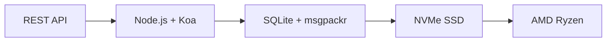

# Ensimmäinen täydellinen sähköposti-API: Kuinka Forward Email mullisti sähköpostien hallinnan {#the-first-complete-email-api-how-forward-email-revolutionized-email-management}


<p class="lead mt-3">
<strong>TL;DR:</strong> Rakensimme maailman ensimmäisen täydellisen REST-rajapinnan sähköpostinhallintaan, jossa on edistyneet hakuominaisuudet, joita mikään muu palvelu ei tarjoa. Vaikka Gmail, Outlook ja Apple pakottavat kehittäjät käyttämään IMAP-helvettiä tai nopeusrajoitettuja rajapintoja, Forward Email tarjoaa salamannopeita CRUD-operaatioita viesteille, kansioille, yhteystiedoille ja kalentereille yhtenäisen REST-rajapinnan kautta, jossa on yli 15 hakuparametria. Tätä sähköpostirajapinnan kehittäjät ovat odottaneet.
</p>

## Sisällysluettelo {#table-of-contents}

* [Sähköposti-API-ongelma](#the-email-api-problem)
* [Mitä kehittäjät oikeasti sanovat](#what-developers-are-actually-saying)
* [Sähköpostin välittämisen mullistava ratkaisu](#forward-emails-revolutionary-solution)
  * [Miksi rakensimme tämän](#why-we-built-this)
  * [Yksinkertainen todennus](#simple-authentication)
* [20 päätepistettä, jotka muuttavat kaiken](#20-endpoints-that-change-everything)
  * [Viestit (5 päätepistettä)](#messages-5-endpoints)
  * [Kansiot (5 päätepistettä)](#folders-5-endpoints)
  * [Yhteystiedot (5 päätepistettä)](#contacts-5-endpoints)
  * [Kalenterit (5 päätepistettä)](#calendars-5-endpoints)
* [Laajennettu haku: Ei muita palveluita vertailukelpoisia](#advanced-search-no-other-service-compares)
  * [Haku-API-ympäristö on rikki](#the-search-api-landscape-is-broken)
  * [Forward Emailin mullistava haku-API](#forward-emails-revolutionary-search-api)
  * [Todellisen maailman hakuesimerkkejä](#real-world-search-examples)
  * [Suorituskyvyn edut](#performance-advantages)
  * [Hakuominaisuudet, joita kenelläkään muulla ei ole](#search-features-no-one-else-has)
  * [Miksi tämä on tärkeää kehittäjille](#why-this-matters-for-developers)
  * [Tekninen toteutus](#the-technical-implementation)
* [Salamannopean suorituskyvyn arkkitehtuuri](#blazing-fast-performance-architecture)
  * [Suorituskyvyn vertailuarvot](#performance-benchmarks)
  * [Tietosuoja ensin -arkkitehtuuri](#privacy-first-architecture)
* [Miksi olemme erilaisia: Täydellinen vertailu](#why-were-different-the-complete-comparison)
  * [Tärkeimmät palveluntarjoajan rajoitukset](#major-provider-limitations)
  * [Sähköpostin edelleenlähetyksen edut](#forward-email-advantages)
  * [Avoimen lähdekoodin läpinäkyvyysongelma](#the-open-source-transparency-problem)
* [Yli 30 esimerkkiä reaalimaailman integraatioista](#30-real-world-integration-examples)
  * [1. WordPress-yhteydenottolomakkeen parannus](#1-wordpress-contact-form-enhancement)
  * [2. Zapierin vaihtoehto sähköpostien automatisointiin](#2-zapier-alternative-for-email-automation)
  * [3. CRM-sähköpostin synkronointi](#3-crm-email-synchronization)
  * [4. Verkkokaupan tilausten käsittely](#4-e-commerce-order-processing)
  * [5. Tukipyyntöjen integrointi](#5-support-ticket-integration)
  * [6. Uutiskirjeiden hallintajärjestelmä](#6-newsletter-management-system)
  * [7. Sähköpostipohjainen tehtävienhallinta](#7-email-based-task-management)
  * [8. Usean tilin sähköpostien yhdistäminen](#8-multi-account-email-aggregation)
  * [9. Edistynyt sähköpostianalytiikan hallintapaneeli](#9-advanced-email-analytics-dashboard)
  * [10. Älykäs sähköpostien arkistointi](#10-smart-email-archiving)
  * [11. Sähköpostin ja kalenterin integrointi](#11-email-to-calendar-integration)
  * [12. Sähköpostin varmuuskopiointi ja vaatimustenmukaisuus](#12-email-backup-and-compliance)
  * [13. Sähköpostipohjainen sisällönhallinta](#13-email-based-content-management)
  * [14. Sähköpostimallien hallinta](#14-email-template-management)
  * [15. Sähköpostipohjainen työnkulun automatisointi](#15-email-based-workflow-automation)
  * [16. Sähköpostin tietoturvan valvonta](#16-email-security-monitoring)
  * [17. Sähköpostipohjainen kyselytutkimus](#17-email-based-survey-collection)
  * [18. Sähköpostin suorituskyvyn seuranta](#18-email-performance-monitoring)
  * [19. Sähköpostipohjainen liidien kelpoisuus](#19-email-based-lead-qualification)
  * [20. Sähköpostipohjainen projektinhallinta](#20-email-based-project-management)
  * [21. Sähköpostipohjainen varastonhallinta](#21-email-based-inventory-management)
  * [22. Sähköpostipohjainen laskujen käsittely](#22-email-based-invoice-processing)
  * [23. Sähköpostipohjainen tapahtumailmoittautuminen](#23-email-based-event-registration)
  * [24. Sähköpostipohjainen asiakirjojen hyväksyntäprosessi](#24-email-based-document-approval-workflow)
  * [25. Sähköpostipohjainen asiakaspalautteen analyysi](#25-email-based-customer-feedback-analysis)
  * [26. Sähköpostipohjainen rekrytointiputki](#26-email-based-recruitment-pipeline)
  * [27. Sähköpostipohjaisten kuluraporttien käsittely](#27-email-based-expense-report-processing)
  * [28. Sähköpostipohjainen laadunvarmistusraportointi](#28-email-based-quality-assurance-reporting)
  * [29. Sähköpostipohjainen toimittajien hallinta](#29-email-based-vendor-management)
  * [30. Sähköpostipohjainen sosiaalisen median seuranta](#30-email-based-social-media-monitoring)
* [Aloittaminen](#getting-started)
  * [1. Luo sähköpostin edelleenlähetystili](#1-create-your-forward-email-account)
  * [2. Luo API-tunnistetiedot](#2-generate-api-credentials)
  * [3. Tee ensimmäinen API-kutsu](#3-make-your-first-api-call)
  * [4. Tutustu dokumentaatioon](#4-explore-the-documentation)
* [Tekniset resurssit](#technical-resources)

## Sähköposti-API-ongelma {#the-email-api-problem}

Sähköpostin API-rajapinnat ovat perustavanlaatuisesti rikki. Piste.

Jokainen merkittävä sähköpostipalveluntarjoaja pakottaa kehittäjät kahden kamalan vaihtoehdon eteen:

1. **IMAP-helvetti**: Painimista 30 vuotta vanhan protokollan kanssa, joka on suunniteltu työpöytäsovelluksille, ei nykyaikaisille sovelluksille
2. **Rajoitetut API:t**: Nopeudeltaan rajoitetut, vain luku -tilassa olevat, OAuth-kompleksit API:t, jotka eivät pysty hallitsemaan varsinaista sähköpostidataa

Tulos? Kehittäjät joko hylkäävät sähköposti-integraation kokonaan tai tuhlaavat viikkoja hauraiden IMAP-kääreiden rakentamiseen, jotka rikkoutuvat jatkuvasti.

> \[!WARNING]
> **Likainen salaisuus**: Useimmat "sähköposti-APIt" ovat vain lähetys-APIt. Et voi ohjelmallisesti järjestää kansioita, synkronoida yhteystietoja tai hallita kalentereita yksinkertaisen REST-käyttöliittymän kautta. Tähän asti.

## Mitä kehittäjät oikeastaan sanovat {#what-developers-are-actually-saying}

Turhautuminen on todellista ja sitä on dokumentoitu kaikkialla:

> "Yritin äskettäin integroida Gmailin sovellukseeni, ja käytin siihen liikaa aikaa. Päätin, ettei Gmailin tukeminen ole sen arvoista."

> *- [Hakkereiden uutisten kehittäjä](https://news.ycombinator.com/item?id=42106944), 147 plusääntä*

> "Ovatko kaikki sähköposti-API:t keskinkertaisia? Ne tuntuvat jollain tavalla rajoitetuilta tai rajoittavilta."

> > *- [Redditin r/SaaS-keskustelu](https://www.reddit.com/r/SaaS/comments/1cm84s7/are_all_email_apis_mediocre/)*

> "Miksi sähköpostin kehittämisen täytyy olla surkeaa?"

> *- [Reddit r/webdev](https://www.reddit.com/r/webdev/comments/15trnp2/why_does_email_development_have_to_suck/), 89 kommenttia kehittäjän tuskasta*

> "Mikä tekee Gmail API:sta tehokkaamman kuin IMAP? Toinen syy Gmail API:n tehokkuuteen on se, että sen tarvitsee ladata jokainen viesti vain kerran. IMAPin kanssa jokainen viesti on ladattava ja indeksoitava..."
>
> *- [Stack Overflow -kysymys](https://stackoverflow.com/questions/25431022/what-makes-the-gmail-api-more-efficient-than-imap), 47 plus-ääntä*

Todisteet ovat kaikkialla:

* **WordPressin SMTP-ongelmat**: [631 GitHub-ongelmaa](https://github.com/awesomemotive/WP-Mail-SMTP/issues) sähköpostin toimitusongelmista
* **Zapierin rajoitukset**: [Yhteisön valitukset](https://community.zapier.com/featured-articles-65/email-parser-by-zapier-limitations-and-alternatives-16958) noin 10 sähköpostin tuntirajoitus ja IMAP-tunnistuksen epäonnistumiset
* **IMAP API -projektit**: [Useita](https://github.com/ewildgoose/imap-api) [avoimen lähdekoodin](https://emailengine.app/) [projektit](https://www.npmjs.com/package/imapflow) on olemassa erityisesti "IMAPin muuntamista REST-muotoon", koska mikään tarjoaja ei tarjoa tätä
* **Gmail API -ongelmat**: [Pinon ylivuoto](https://stackoverflow.com/questions/tagged/gmail-api):llä on 4 847 kysymystä tagilla "gmail-api", joissa on yleisiä valituksia nopeusrajoituksista ja monimutkaisuudesta

## Sähköpostin edelleenlähetyksen mullistava ratkaisu {#forward-emails-revolutionary-solution}

**Olemme ensimmäinen sähköpostipalvelu, joka tarjoaa täydelliset CRUD-toiminnot kaikille sähköpostitiedoille yhtenäisen REST-rajapinnan kautta.**

Tämä ei ole vain yksi lähetys-API lisää. Tämä on täydellinen ohjelmallinen hallinta seuraaviin:

* **Viestit**: Luo, lue, päivitä, poista, hae, siirrä, merkitse
* **Kansiot**: Täydellinen IMAP-kansioiden hallinta REST-päätepisteiden kautta
* **Yhteystiedot**: [CardDAV](https://tools.ietf.org/html/rfc6352) yhteystietojen tallennus ja synkronointi
* **Kalenterit**: [CalDAV](https://tools.ietf.org/html/rfc4791) kalenteritapahtumat ja aikataulutus

### Miksi rakensimme tämän {#why-we-built-this}

**Ongelma**: Jokainen sähköpostipalveluntarjoaja käsittelee sähköpostia mustana laatikkona. Voit lähettää sähköposteja, ehkä lukea niitä monimutkaisella OAuth-todennuksella, mutta et voi todella *hallita* sähköpostitietojasi ohjelmallisesti.

**Visiomme**: Sähköpostin integroinnin tulisi olla yhtä helppoa kuin minkä tahansa modernin API:n. Ei IMAP-kirjastoja. Ei monimutkaista OAuth-todennusta. Ei nopeusrajoituksia. Vain yksinkertaisia, toimivia REST-päätepisteitä.

**Tulos**: Ensimmäinen sähköpostipalvelu, jossa voit rakentaa täydellisen sähköpostiohjelman, CRM-integraation tai automaatiojärjestelmän käyttämällä vain HTTP-pyyntöjä.

### Yksinkertainen todennus {#simple-authentication}

Ei [OAuth-monimutkaisuus](https://oauth.net/2/). Ei [sovelluskohtaiset salasanat](https://support.google.com/accounts/answer/185833). Vain alias-tunnuksesi:

```bash
curl -u "alias@yourdomain.com:password" \
  https://api.forwardemail.net/v1/messages
```

## 20 päätepistettä, jotka muuttavat kaiken {#20-endpoints-that-change-everything}

### Viestit (5 päätepistettä) {#messages-5-endpoints}

* `GET /v1/messages` - Listaa viestit suodatuksella (`?folder=`, `?is_unread=`, `?is_flagged=`)
* `POST /v1/messages` - Lähetä uudet viestit suoraan kansioihin
* `GET /v1/messages/:id` - Hae tietty viesti täydellisine metatietoineen
* `PUT /v1/messages/:id` - Päivitä viesti (merkinnät, kansio, lukutila)
* `DELETE /v1/messages/:id` - Poista viesti pysyvästi

### Kansiot (5 päätepistettä) {#folders-5-endpoints}

* `GET /v1/folders` - Listaa kaikki kansiot, joilla on tilaustila
* `POST /v1/folders` - Luo uusi kansio mukautetuilla ominaisuuksilla
* `GET /v1/folders/:id` - Hae kansion tiedot ja viestimäärät
* `PUT /v1/folders/:id` - Päivitä kansion ominaisuudet ja tilaus
* `DELETE /v1/folders/:id` - Poista kansio ja käsittele viestien siirto

### Yhteystiedot (5 päätepistettä) {#contacts-5-endpoints}

* `GET /v1/contacts` - Listaa yhteystiedot haulla ja sivutuksella
* `POST /v1/contacts` - Luo uusi yhteystieto täydellä vCard-tuella
* `GET /v1/contacts/:id` - Hae yhteystieto kaikkine kenttineen ja metatietoineen
* `PUT /v1/contacts/:id` - Päivitä yhteystiedot ETag-vahvistuksella
* `DELETE /v1/contacts/:id` - Poista yhteystieto kaskadikäsittelyllä

### Kalenterit (5 päätepistettä) {#calendars-5-endpoints}

* `GET /v1/calendars` - Listaa kalenteritapahtumat päivämääräsuodatuksella
* `POST /v1/calendars` - Luo kalenteritapahtuma osallistujilla ja toistumisilla
* `GET /v1/calendars/:id` - Hae tapahtuman tiedot aikavyöhykkeen käsittelyllä
* `PUT /v1/calendars/:id` - Päivitä tapahtuma ristiriitojen tunnistuksella
* `DELETE /v1/calendars/:id` - Poista tapahtuma osallistujailmoituksilla

## Laajennettu haku: Ei muita vastaavia palveluita {#advanced-search-no-other-service-compares}

**Forward Email on ainoa sähköpostipalvelu, joka tarjoaa kattavan, ohjelmallisen haun kaikissa viestikentissä REST-rajapinnan kautta.**

Vaikka muut palveluntarjoajat tarjoavat parhaimmillaankin perussuodatuksen, me olemme rakentaneet edistyneimmän koskaan luodun sähköpostihaku-API:n. Yksikään Gmail-API, Outlook-API tai mikään muu palvelu ei vedä vertoja hakuominaisuuksillemme.

### Haku-API-ympäristö on rikki {#the-search-api-landscape-is-broken}

**Gmail API -haun rajoitukset:**

* ✅ Vain perus `q`-parametri
* ❌ Ei kenttäkohtaista hakua
* ❌ Ei päivämäärävälisuodatusta
* ❌ Ei kokoon perustuvaa suodatusta
* ❌ Ei liitteiden suodatusta
* ❌ Rajoitettu Gmailin hakusyntaksiin

**Outlook API -haun rajoitukset:**

* ✅ Perus `$search`-parametri
* ❌ Ei edistynyttä kenttien kohdentamista
* ❌ Ei monimutkaisia kyselyyhdistelmiä
* ❌ Aggressiivinen nopeuden rajoitus
* ❌ Vaaditaan monimutkainen OData-syntaksi

**Apple iCloud:**

* ❌ Ei minkäänlaista API:a
* ❌ Vain IMAP-haku (jos saat sen toimimaan)

**ProtonMail ja Tuta:**

* ❌ Ei julkisia API-rajapintoja
* ❌ Ei ohjelmallisia hakuominaisuuksia

### Sähköpostin välityksen mullistava haku-API {#forward-emails-revolutionary-search-api}

**Tarjoamme yli 15 hakuparametria, joita mikään muu palvelu ei tarjoa:**

| Hakutoiminto | Lähetä sähköpostia eteenpäin | Gmail-sovellusliittymä | Outlook-sovellusliittymä | Muut |
| ------------------------------ | -------------------------------------- | ------------ | ------------------ | ------ |
| **Kenttäkohtainen haku** | ✅ Aihe, teksti, lähettäjä, vastaanottaja, kopio, otsikot | ❌ | ❌ | ❌ |
| **Monikenttäinen yleinen haku** | ✅ `?search=` kaikissa kentissä | ✅ Perus `q=` | ✅ Perus `$search=` | ❌ |
| **Ajanjakson suodatus** | ✅ `?since=` & `?before=` | ❌ | ❌ | ❌ |
| **Kokoon perustuva suodatus** | ✅ `?min_size=` & `?max_size=` | ❌ | ❌ | ❌ |
| **Liitteiden suodatus** | ✅ `?has_attachments=true/false` | ❌ | ❌ | ❌ |
| **Ylätunnisteen haku** | ✅ `?headers=X-Priority` | ❌ | ❌ | ❌ |
| **Viesti-ID-haku** | ✅ `?message_id=abc123` | ❌ | ❌ | ❌ |
| **Yhdistetyt suodattimet** | ✅ Useita parametreja JA-logiikalla | ❌ | ❌ | ❌ |
| **Kirjainkokoa ei erotella** | ✅ Kaikki haut | ✅ | ✅ | ❌ |
| **Sivutuksen tuki** | ✅ Toimii kaikkien hakuehtojen kanssa | ✅ | ✅ | ❌ |

### Todellisen maailman hakuesimerkkejä {#real-world-search-examples}

**Etsi kaikki laskut viimeiseltä neljännekseltä:**

```bash
# Forward Email - Simple and powerful
GET /v1/messages?subject=invoice&since=2024-01-01T00:00:00Z&before=2024-04-01T00:00:00Z

# Gmail API - Impossible with their limited search
# No date range filtering available

# Outlook API - Complex OData syntax, limited functionality
GET /me/messages?$search="invoice"&$filter=receivedDateTime ge 2024-01-01T00:00:00Z
```

**Etsi suuria liitteitä tietyltä lähettäjältä:**

```bash
# Forward Email - Comprehensive filtering
GET /v1/messages?from=finance@company.com&has_attachments=true&min_size=1000000

# Gmail API - Cannot filter by size or attachments programmatically
# Outlook API - No size filtering available
# Others - No APIs available
```

**Monimutkainen monikenttähaku:**

```bash
# Forward Email - Advanced query capabilities
GET /v1/messages?body=quarterly&from=manager&is_flagged=true&folder=Reports

# Gmail API - Limited to basic text search only
GET /gmail/v1/users/me/messages?q=quarterly

# Outlook API - Basic search without field targeting
GET /me/messages?$search="quarterly"
```

### Suorituskyvyn edut {#performance-advantages}

**Sähköpostin edelleenlähetyshaun tehokkuus:**

* ⚡ **Alle 100 ms:n vasteajat** monimutkaisille hauille
* 🔍 **Regulaarilausekkeiden optimointi** asianmukaisella indeksoinnilla
* 📊 **Rinnakkainen kyselyiden suoritus** määrälle ja datalle
* 💾 **Tehokas muistin käyttö** kevyillä kyselyillä

**Kilpailijoiden suorituskykyongelmat:**

* 🐌 **Gmail API**: Nopeus rajoitettu 250 kiintiöyksikköön käyttäjää kohden sekunnissa
* 🐌 **Outlook API**: Aggressiivinen rajoitus monimutkaisilla varausvaatimuksilla
* 🐌 **Muut**: Ei API-rajapintoja, joihin voisi verrata

### Hakuominaisuudet, joita ei ole kenelläkään muulla {#search-features-no-one-else-has}

#### 1. Otsikkokohtainen haku {#1-header-specific-search}

```bash
# Find messages with specific headers
GET /v1/messages?headers=X-Priority:1
GET /v1/messages?headers=X-Spam-Score
```

#### 2. Kokoon perustuva älykkyys {#2-size-based-intelligence}

```bash
# Find newsletter emails (typically large)
GET /v1/messages?min_size=50000&from=newsletter

# Find quick replies (typically small)
GET /v1/messages?max_size=1000&to=support
```

#### 3. Liitteisiin perustuvat työnkulut {#3-attachment-based-workflows}

```bash
# Find all documents sent to legal team
GET /v1/messages?to=legal&has_attachments=true&body=contract

# Find emails without attachments for cleanup
GET /v1/messages?has_attachments=false&before=2023-01-01T00:00:00Z
```

#### 4. Yhdistetty liiketoimintalogiikka {#4-combined-business-logic}

```bash
# Find urgent flagged messages from VIPs with attachments
GET /v1/messages?is_flagged=true&from=ceo&has_attachments=true&subject=urgent
```

### Miksi tämä on tärkeää kehittäjille {#why-this-matters-for-developers}

**Rakenna sovelluksia, jotka olivat aiemmin mahdottomia:**

1. **Edistynyt sähköpostianalytiikka**: Analysoi sähköpostimalleja koon, lähettäjän ja sisällön mukaan
2. **Älykäs sähköpostien hallinta**: Järjestä automaattisesti monimutkaisten kriteerien perusteella
3. **Vaatimustenmukaisuus ja löytäminen**: Etsi tiettyjä sähköposteja lakisääteisten vaatimusten mukaisesti
4. **Liiketoimintatiedustelu**: Poimi tietoja sähköpostiviestintämalleista
5. **Automatisoidut työnkulut**: Käynnistä toimintoja kehittyneiden sähköpostisuodattimien perusteella

### Tekninen toteutus {#the-technical-implementation}

Haku-API:mme käyttää:

* **Regulaarilausekkeiden optimointi** asianmukaisilla indeksointistrategioilla
* **Rinnakkaissuoritus** suorituskyvyn parantamiseksi
* **Syötteen validointi** turvallisuuden parantamiseksi
* **Kattava virheenkäsittely** luotettavuuden parantamiseksi

```javascript
// Example: Complex search implementation
const searchConditions = [];

if (ctx.query.subject) {
  searchConditions.push({
    subject: { $regex: ctx.query.subject, $options: 'i' }
  });
}

if (ctx.query.from) {
  searchConditions.push({
    $or: [
      { 'from.address': { $regex: ctx.query.from, $options: 'i' } },
      { 'from.name': { $regex: ctx.query.from, $options: 'i' } }
    ]
  });
}

// Combine with AND logic
if (searchConditions.length > 0) {
  query.$and = searchConditions;
}
```

> \[!TIP]
> **Kehittäjän etu**: Forward Emailin haku-API:n avulla voit rakentaa sähköpostisovelluksia, jotka kilpailevat toiminnallisuudeltaan työpöytäsovellusten kanssa säilyttäen samalla REST-API:en yksinkertaisuuden.

## Huippunopea suorituskykyarkkitehtuuri {#blazing-fast-performance-architecture}

Tekninen pinomme on rakennettu nopeutta ja luotettavuutta silmällä pitäen:



### Suorituskykyvertailuarvot {#performance-benchmarks}

**Miksi olemme salamannopeita:**

| Komponentti | Teknologia | Suorituskykyetu |
| ------------ | --------------------------------------------------------------------------------- | --------------------------------------------- |
| **Säilytys** | [NVMe SSD](https://en.wikipedia.org/wiki/NVM_Express) | 10 kertaa nopeampi kuin perinteinen SATA |
| **Tietokanta** | [SQLite](https://sqlite.org/) + [msgpackr](https://github.com/kriszyp/msgpackr) | Nolla verkkoviivettä, optimoitu sarjoittaminen |
| **Laitteisto** | [AMD Ryzen](https://www.amd.com/en/products/processors/desktops/ryzen) paljas metalli | Ei virtualisointikustannuksia |
| **Välimuisti** | Muistissa + pysyvä | Alle millisekunnin vasteajat |
| **Varmuuskopiot** | [Cloudflare R2](https://www.cloudflare.com/products/r2/) salattu | Yritystason luotettavuus |

**Todelliset suorituskykyluvut:**

* **API-vasteaika**: keskimäärin < 50 ms
* **Viestin haku**: < 10 ms välimuistissa oleville viesteille
* **Kansiotoiminnot**: < 5 ms metatietotoiminnoille
* **Yhteystietojen synkronointi**: yli 1000 yhteystietoa sekunnissa
* **Käyttöaika**: 99,99 % palvelutasotakuu redundanttisella infrastruktuurilla

### Tietosuoja ensin -arkkitehtuuri {#privacy-first-architecture}

**Tietoa vaativa suunnittelu**: Vain sinulla on pääsy IMAP-salasanallasi – emme voi lukea sähköpostejasi. [nollatietoarkkitehtuuri](https://forwardemail.net/en/security)-salasanamme takaa täydellisen yksityisyyden ja tarjoaa samalla huippuluokan suorituskyvyn.

## Miksi olemme erilaisia: Täydellinen vertailu {#why-were-different-the-complete-comparison}

### Tärkeimmät palveluntarjoajan rajoitukset {#major-provider-limitations}

| Palveluntarjoaja | Ydinongelmat | Erityiset rajoitukset |
| ---------------- | ----------------------------------------- | -------------------------------------------------------------------------------------------------------------------------------------------------------------------------------------------------------------------------------------------------------------------------------------------------------------------------------------------------------------------------------------------------------------------------------------------------------------------- |
| **Gmail-sovellusliittymä** | Vain luku, monimutkainen OAuth, erilliset API:t | • [Cannot modify existing messages](https://developers.google.com/gmail/api/reference/rest/v1/users.messages)<br>• [Labels ≠ folders](https://developers.google.com/gmail/api/reference/rest/v1/users.labels)<br>• [1 billion quota units/day limit](https://developers.google.com/gmail/api/reference/quota)<br>• [Requires separate APIs](https://developers.google.com/workspace) yhteystiedoille/kalenterille |
| **Outlook-sovellusliittymä** | Vanhentunut, hämmentävä, yrityskeskeinen | • [REST endpoints deprecated March 2024](https://learn.microsoft.com/en-us/outlook/rest/compare-graph)<br>• [Multiple confusing APIs](https://learn.microsoft.com/en-us/office/client-developer/outlook/selecting-an-api-or-technology-for-developing-solutions-for-outlook) (EWS, Graafi, REST)<br>• [Microsoft Graph complexity](https://learn.microsoft.com/en-us/graph/overview)<br>• [Aggressive throttling](https://learn.microsoft.com/en-us/graph/throttling) |
| **Apple iCloud** | Ei julkista API:a | • [No public API whatsoever](https://support.apple.com/en-us/102654)<br>• [IMAP-only with 1000 emails/day limit](https://support.apple.com/en-us/102654)<br>• [App-specific passwords required](https://support.apple.com/en-us/102654)<br>• [500 recipients per message limit](https://support.apple.com/en-us/102654) |
| **ProtonMail** | Ei API:a, vääriä avoimen lähdekoodin väitteitä | • [No public API available](https://proton.me/support/protonmail-bridge-clients)<br>• [Bridge software required](https://proton.me/mail/bridge) IMAP-yhteyttä varten<br>• [Claims "open source"](https://proton.me/blog/open-source) mutta [server code is proprietary](https://github.com/ProtonMail)<br>• [Limited to paid plans only](https://proton.me/pricing) |
| **Kokonais** | Ei API:a, harhaanjohtava läpinäkyvyys | • [No REST API for email management](https://tuta.com/support#technical)<br>• [Claims "open source"](https://tuta.com/blog/posts/open-source-email) mutta [backend is closed](https://github.com/tutao/tutanota)<br>• [IMAP/SMTP not supported](https://tuta.com/support#imap)<br>• [Proprietary encryption](https://tuta.com/encryption) estää vakiointegraatiot |
| **Zapier-sähköposti** | Ankarat nopeusrajoitukset | • [10 emails per hour limit](https://help.zapier.com/hc/en-us/articles/8496181555597-Email-Parser-by-Zapier-limitations-and-alternatives)<br>• [No IMAP folder access](https://help.zapier.com/hc/en-us/articles/8496181555597-Email-Parser-by-Zapier-limitations-and-alternatives)<br>• [Limited parsing capabilities](https://help.zapier.com/hc/en-us/articles/8496181555597-Email-Parser-by-Zapier-limitations-and-alternatives) |

### Sähköpostin edelleenlähetyksen edut {#forward-email-advantages}

| Ominaisuus | Lähetä sähköpostia eteenpäin | Kilpailu |
| ------------------ | -------------------------------------------------------------------------------------------- | ----------------------------------------- |
| **Täydellistä roskaa** | ✅ Kaikkien tietojen täysi luonti, luku, päivitys ja poisto | ❌ Vain luku - tai rajoitetut toiminnot |
| **Yhtenäinen API** | ✅ Viestit, kansiot, yhteystiedot, kalenterit yhdessä API:ssa | ❌ Erilliset API:t tai puuttuvat ominaisuudet |
| **Yksinkertainen todennus** | ✅ Perustunnistus alias-tunnuksilla | ❌ Monimutkainen OAuth useilla laajuusalueilla |
| **Ei hintarajoituksia** | ✅ Todellisiin sovelluksiin suunnitellut anteliaat rajoitukset | ❌ Rajoittavat kiintiöt, jotka rikkovat työnkulkuja |
| **Itsepalvelu** | ✅ [Complete self-hosting option](https://forwardemail.net/en/blog/docs/self-hosted-solution) | ❌ Vain myyjän lukitus |
| **Tietosuoja** | ✅ Tiedonvapaa, salattu, yksityinen | ❌ Tiedonlouhinta ja yksityisyyden suojaan liittyvät huolenaiheet |
| **Suorituskyky** | ✅ Alle 50 ms:n vasteajat, NVMe-tallennustila | ❌ Verkkoviive, rajoitusviiveet |

### Avoimen lähdekoodin läpinäkyvyysongelma {#the-open-source-transparency-problem}

**ProtonMail ja Tuta markkinoivat itseään "avoimen lähdekoodin" ja "läpinäkyvänä" palveluntarjoajana, mutta tämä on harhaanjohtavaa markkinointia, joka rikkoo nykyaikaisia yksityisyyden suojaa koskevia periaatteita.**

> \[!WARNING]
> **Vääriä läpinäkyvyysväitteitä**: Sekä ProtonMail että Tuta mainostavat näkyvästi "avoimen lähdekoodin" tunnistetietojaan pitäen samalla tärkeimmän palvelinpuolen koodinsa omana ja suljettuna.

**ProtonMailin petos:**

* **Väitteet**: ["Olemme avoimen lähdekoodin"](https://proton.me/blog/open-source) näkyvästi esillä markkinoinnissa
* **Todellisuus**: [Palvelinkoodi on täysin omaa omistusoikeutta](https://github.com/ProtonMail) - vain asiakassovellukset ovat avoimen lähdekoodin
* **Vaikutus**: Käyttäjät eivät voi vahvistaa palvelinpuolen salausta, tietojenkäsittelyä tai yksityisyysväitteitä
* **Läpinäkyvyysrikkomus**: Ei keinoa auditoida varsinaisia sähköpostin käsittely- ja tallennusjärjestelmiä

**Tutan harhaanjohtava markkinointi:**

* **Väitteet**: ["Avoimen lähdekoodin sähköposti"](https://tuta.com/blog/posts/open-source-email) keskeisenä myyntivalttina
* **Todellisuus**: [Taustajärjestelmäinfrastruktuuri on suljetun lähdekoodin](https://github.com/tutao/tutanota) - vain käyttöliittymä on saatavilla
* **Vaikutus**: Oma salaus estää standardien sähköpostiprotokollien (IMAP/SMTP) käytön
* **Lukitusstrategia**: Mukautettu salaus pakottaa toimittajariippuvuuteen

**Miksi tämä on tärkeää nykyaikaisen yksityisyyden kannalta:**

Vuonna 2025 todellinen yksityisyys vaatii **täydellistä läpinäkyvyyttä**. Kun sähköpostipalveluntarjoajat väittävät olevansa "avoimen lähdekoodin" tarjoajia, mutta piilottavat palvelinkoodinsa:

1. **Todentamaton salaus**: Et voi auditoida, miten tietosi todellisuudessa salataan.
2. **Piilotetun datan käytännöt**: Palvelinpuolen tiedonkäsittely on edelleen musta laatikko.
3. **Luottamukseen perustuva turvallisuus**: Sinun on luotettava heidän väitteisiinsä ilman vahvistusta.
4. **Toimittajan lukitseminen**: Omistetut järjestelmät estävät tiedon siirrettävyyden.

**Sähköpostin edelleenlähetyksen todellinen läpinäkyvyys:**

* ✅ **[Täysin avoimen lähdekoodin](https://github.com/forwardemail/forwardemail.net)** - palvelin- ja asiakaskoodi
* ✅ **[Oma hosting saatavilla](https://forwardemail.net/en/blog/docs/self-hosted-solution)** - oman instanssin ajaminen
* ✅ **Vakioprotokollat** - IMAP-, SMTP-, CardDAV- ja CalDAV-yhteensopivuus
* ✅ **Auditoitava suojaus** - jokainen koodirivi voidaan tarkastaa
* ✅ **Ei toimittajasidonnaisuutta** - sinun tietosi, sinun hallintasi

> \[!TIP]
> **Aito avoimen lähdekoodin ansiosta voit varmistaa jokaisen väitteen.** Forward Emailin avulla voit auditoida salauksemme, tarkastella tietojenkäsittelyämme ja jopa suorittaa oman instanssin. Se on todellista läpinäkyvyyttä.

## Yli 30 esimerkkiä reaalimaailman integraatiosta {#30-real-world-integration-examples}

### 1. WordPress-yhteydenottolomakkeen parannus {#1-wordpress-contact-form-enhancement}

**Ongelma**: [WordPress SMTP -määritysvirheet](https://github.com/awesomemotive/WP-Mail-SMTP/issues) ([631 GitHub-ongelmaa](https://github.com/awesomemotive/WP-Mail-SMTP/issues))
**Ratkaisu**: Suora API-integraatio ohittaa [SMTP](https://tools.ietf.org/html/rfc5321):n kokonaan

```javascript
// WordPress contact form that saves to Sent folder
await fetch('https://api.forwardemail.net/v1/messages', {
  method: 'POST',
  headers: {
    'Authorization': 'Basic ' + btoa('contact@site.com:password'),
    'Content-Type': 'application/json'
  },
  body: JSON.stringify({
    to: [{ address: 'owner@site.com' }],
    subject: 'Contact Form: ' + formData.subject,
    text: formData.message,
    folder: 'Sent'
  })
});
```

### 2. Zapierin vaihtoehto sähköpostien automatisointiin {#2-zapier-alternative-for-email-automation}

**Ongelma**: [Zapierin 10 sähköpostin tuntirajoitus](https://help.zapier.com/hc/en-us/articles/8496181555597-Email-Parser-by-Zapier-limitations-and-alternatives) ja [IMAP-tunnistuksen epäonnistumiset](https://community.zapier.com/featured-articles-65/email-parser-by-zapier-limitations-and-alternatives-16958)
**Ratkaisu**: Rajoittamaton automaatio ja täysi sähköpostin hallinta

```javascript
// Auto-organize emails by sender domain
const messages = await fetch('/v1/messages?folder=INBOX');
for (const message of messages) {
  const domain = message.from.split('@')[1];
  await fetch(`/v1/messages/${message.id}`, {
    method: 'PUT',
    body: JSON.stringify({ folder: `Clients/${domain}` })
  });
}
```

### 3. CRM-sähköpostin synkronointi {#3-crm-email-synchronization}

**Ongelma**: Manuaalinen yhteystietojen hallinta sähköpostin ja [CRM-järjestelmät](https://en.wikipedia.org/wiki/Customer_relationship_management):n välillä
**Ratkaisu**: Kaksisuuntainen synkronointi [CardDAV](https://tools.ietf.org/html/rfc6352)-yhteystieto-API:n kanssa

```javascript
// Sync new email contacts to CRM
const newContacts = await fetch('/v1/contacts');
for (const contact of newContacts) {
  await crmAPI.createContact({
    name: contact.name,
    email: contact.email,
    source: 'email_api'
  });
}
```

### 4. Verkkokauppatilausten käsittely {#4-e-commerce-order-processing}

**Ongelma**: Tilaussähköpostin manuaalinen käsittely käyttäjälle [verkkokauppa-alustat](https://en.wikipedia.org/wiki/E-commerce)
**Ratkaisu**: Automaattinen tilaustenhallintaprosessi

```javascript
// Process order confirmation emails
const orders = await fetch('/v1/messages?folder=Orders');
const orderEmails = orders.filter(msg =>
  msg.subject.includes('Order Confirmation')
);

for (const order of orderEmails) {
  const orderData = parseOrderEmail(order.text);
  await updateInventory(orderData);
  await fetch(`/v1/messages/${order.id}`, {
    method: 'PUT',
    body: JSON.stringify({ folder: 'Orders/Processed' })
  });
}
```

### 5. Tukipyyntöjen integrointi {#5-support-ticket-integration}

**Ongelma**: Sähköpostiketjut hajallaan [tukipalvelualustat](https://en.wikipedia.org/wiki/Help_desk_software)-kohteessa
**Ratkaisu**: Täydellinen sähköpostiketjujen seuranta

```javascript
// Create support ticket from email thread
const messages = await fetch('/v1/messages?folder=Support');
const supportEmails = messages.filter(msg =>
  msg.to.some(addr => addr.includes('support@'))
);

for (const email of supportEmails) {
  const ticket = await supportSystem.createTicket({
    subject: email.subject,
    from: email.from,
    body: email.text,
    timestamp: email.date
  });
}
```

### 6. Uutiskirjeiden hallintajärjestelmä {#6-newsletter-management-system}

**Ongelma**: Rajoitetut [uutiskirjealusta](https://en.wikipedia.org/wiki/Email_marketing)-integraatiot
**Ratkaisu**: Täydellinen tilaajan elinkaaren hallinta

```javascript
// Auto-manage newsletter subscriptions
const messages = await fetch('/v1/messages?folder=Newsletter');
const unsubscribes = messages.filter(msg =>
  msg.subject.toLowerCase().includes('unsubscribe')
);

for (const msg of unsubscribes) {
  await removeSubscriber(msg.from);
  await fetch(`/v1/messages/${msg.id}`, {
    method: 'PUT',
    body: JSON.stringify({ folder: 'Newsletter/Unsubscribed' })
  });
}
```

### 7. Sähköpostipohjainen tehtävienhallinta {#7-email-based-task-management}

**Ongelma**: Saapuneet-kansion ylikuormitus ja [tehtävien seuranta](https://en.wikipedia.org/wiki/Task_management)
**Ratkaisu**: Muunna sähköpostit toimintakehotuksiksi

```javascript
// Create tasks from flagged emails
const messages = await fetch('/v1/messages?is_flagged=true');
for (const email of messages) {
  await taskManager.createTask({
    title: email.subject,
    description: email.text,
    assignee: email.to[0].address,
    dueDate: extractDueDate(email.text)
  });
}
```

### 8. Usean tilin sähköpostien yhdistäminen {#8-multi-account-email-aggregation}

**Ongelma**: [useita sähköpostitilejä](https://en.wikipedia.org/wiki/Email_client):n hallinta eri palveluntarjoajien välillä
**Ratkaisu**: Yhtenäinen postilaatikon käyttöliittymä

```javascript
// Aggregate emails from multiple accounts
const accounts = ['work@domain.com', 'personal@domain.com'];
const allMessages = [];

for (const account of accounts) {
  const messages = await fetch('/v1/messages', {
    headers: { 'Authorization': getAuth(account) }
  });
  allMessages.push(...messages.map(m => ({ ...m, account })));
}
```

### 9. Edistynyt sähköpostianalytiikan hallintapaneeli {#9-advanced-email-analytics-dashboard}

**Ongelma**: Ei tietoa [sähköpostimallit](https://en.wikipedia.org/wiki/Email_analytics):sta kehittyneellä suodatuksella
**Ratkaisu**: Mukautettu sähköpostianalytiikka edistyneiden hakutoimintojen avulla

```javascript
// Generate comprehensive email analytics using advanced search
const analytics = {};

// Analyze email volume by sender domain
const messages = await fetch('/v1/messages');
analytics.senderDomains = analyzeSenderDomains(messages);

// Find large attachments consuming storage
const largeAttachments = await fetch('/v1/messages?has_attachments=true&min_size=1000000');
analytics.storageHogs = largeAttachments.map(msg => ({
  subject: msg.subject,
  from: msg.from,
  size: msg.size
}));

// Analyze communication patterns with VIPs
const vipEmails = await fetch('/v1/messages?from=ceo@company.com');
const urgentVipEmails = await fetch('/v1/messages?from=ceo@company.com&subject=urgent');
analytics.vipCommunication = {
  total: vipEmails.length,
  urgent: urgentVipEmails.length,
  urgencyRate: (urgentVipEmails.length / vipEmails.length) * 100
};

// Find unread emails by date range for follow-up
const lastWeek = new Date(Date.now() - 7 * 24 * 60 * 60 * 1000).toISOString();
const unreadRecent = await fetch(`/v1/messages?is_unread=true&since=${lastWeek}`);
analytics.followUpNeeded = unreadRecent.length;

// Analyze email sizes for optimization
const smallEmails = await fetch('/v1/messages?max_size=1000');
const mediumEmails = await fetch('/v1/messages?min_size=1000&max_size=50000');
const largeEmails = await fetch('/v1/messages?min_size=50000');
analytics.sizeDistribution = {
  small: smallEmails.length,
  medium: mediumEmails.length,
  large: largeEmails.length
};

// Search for compliance-related emails
const complianceEmails = await fetch('/v1/messages?body=confidential&has_attachments=true');
analytics.complianceReview = complianceEmails.length;
```

### 10. Älykäs sähköpostien arkistointi {#10-smart-email-archiving}

**Ongelma**: Manuaalinen [sähköpostin organisointi](https://en.wikipedia.org/wiki/Email_management)
**Ratkaisu**: Älykäs sähköpostin luokittelu

```javascript
// Auto-archive old emails by category
const messages = await fetch('/v1/messages');
const oldEmails = messages.filter(email =>
  isOlderThan(email.date, 90) // 90 days
);

for (const email of oldEmails) {
  const category = categorizeEmail(email);
  await fetch(`/v1/messages/${email.id}`, {
    method: 'PUT',
    body: JSON.stringify({ folder: `Archive/${category}` })
  });
}
```

### 11. Sähköpostin ja kalenterin integrointi {#11-email-to-calendar-integration}

**Ongelma**: Manuaalinen [kalenteritapahtuma](https://tools.ietf.org/html/rfc4791)-objektin luonti sähköposteista
**Ratkaisu**: Automaattinen tapahtumien poiminta ja luonti

```javascript
// Extract meeting details from emails
const messages = await fetch('/v1/messages?folder=Meetings');
const meetingEmails = messages.filter(email =>
  email.subject.toLowerCase().includes('meeting')
);

for (const email of meetingEmails) {
  const meetingData = extractMeetingInfo(email.text);
  if (meetingData.date && meetingData.time) {
    await fetch('/v1/calendars', {
      method: 'POST',
      body: JSON.stringify({
        title: email.subject,
        start: meetingData.datetime,
        attendees: [email.from, ...email.to]
      })
    });
  }
}
```

### 12. Sähköpostin varmuuskopiointi ja vaatimustenmukaisuus {#12-email-backup-and-compliance}

**Ongelma**: [Sähköpostin säilytys](https://en.wikipedia.org/wiki/Email_retention_policy) ja vaatimustenmukaisuusvaatimukset
**Ratkaisu**: Automaattinen varmuuskopiointi metatietojen säilytyksellä

```javascript
// Backup emails with full metadata
const allMessages = await fetch('/v1/messages');
const backup = {
  timestamp: new Date(),
  messages: allMessages.map(msg => ({
    id: msg.id,
    subject: msg.subject,
    from: msg.from,
    to: msg.to,
    date: msg.date,
    flags: msg.flags
  }))
};
await saveToComplianceStorage(backup);
```

### 13. Sähköpostipohjainen sisällönhallinta {#13-email-based-content-management}

**Ongelma**: Sähköpostitse lähetettyjen sisältöjen hallinta [CMS-alustat](https://en.wikipedia.org/wiki/Content_management_system):lle
**Ratkaisu**: Sähköposti sisällönhallintajärjestelmänä

```javascript
// Process content submissions from email
const messages = await fetch('/v1/messages?folder=Submissions');
const submissions = messages.filter(msg =>
  msg.to.some(addr => addr.includes('submit@'))
);

for (const submission of submissions) {
  const content = parseSubmission(submission.text);
  await cms.createDraft({
    title: submission.subject,
    content: content.body,
    author: submission.from
  });
}
```

### 14. Sähköpostimallien hallinta {#14-email-template-management}

**Ongelma**: Epäjohdonmukainen [sähköpostipohjat](https://en.wikipedia.org/wiki/Email_template) tiimissä
**Ratkaisu**: Keskitetty mallipohjajärjestelmä API:lla

```javascript
// Send templated emails with dynamic content
const template = await getEmailTemplate('welcome');
await fetch('/v1/messages', {
  method: 'POST',
  body: JSON.stringify({
    to: [{ address: newUser.email }],
    subject: template.subject.replace('{{name}}', newUser.name),
    html: template.html.replace('{{name}}', newUser.name),
    folder: 'Sent'
  })
});
```

### 15. Sähköpostipohjainen työnkulun automatisointi {#15-email-based-workflow-automation}

**Ongelma**: Manuaalinen [hyväksymisprosessit](https://en.wikipedia.org/wiki/Workflow) sähköpostitse
**Ratkaisu**: Automatisoidut työnkulun käynnistimet

```javascript
// Process approval emails
const messages = await fetch('/v1/messages?folder=Approvals');
const approvals = messages.filter(msg =>
  msg.subject.includes('APPROVAL')
);

for (const approval of approvals) {
  const decision = parseApprovalDecision(approval.text);
  await workflow.processApproval({
    requestId: extractRequestId(approval.subject),
    decision: decision,
    approver: approval.from
  });
}
```

### 16. Sähköpostin tietoturvan valvonta {#16-email-security-monitoring}

**Ongelma**: Manuaalinen [tietoturvauhkien havaitseminen](https://en.wikipedia.org/wiki/Email_security)
**Ratkaisu**: Automaattinen uhka-analyysi

```javascript
// Monitor for suspicious emails
const recentEmails = await fetch('/v1/messages');
for (const email of recentEmails) {
  const threatScore = analyzeThreat(email);
  if (threatScore > 0.8) {
    await fetch(`/v1/messages/${email.id}`, {
      method: 'PUT',
      body: JSON.stringify({ folder: 'Security/Quarantine' })
    });
    await alertSecurityTeam(email);
  }
}
```

### 17. Sähköpostipohjainen kyselytutkimus {#17-email-based-survey-collection}

**Ongelma**: Manuaalinen [kyselyvastaus](https://en.wikipedia.org/wiki/Survey_methodology)-käsittely
**Ratkaisu**: Automaattinen vastausten yhdistäminen

```javascript
// Collect and process survey responses
const messages = await fetch('/v1/messages?folder=Surveys');
const responses = messages.filter(msg =>
  msg.subject.includes('Survey Response')
);

const surveyData = responses.map(email => ({
  respondent: email.from,
  responses: parseSurveyData(email.text),
  timestamp: email.date
}));
await updateSurveyResults(surveyData);
```

### 18. Sähköpostin suorituskyvyn seuranta {#18-email-performance-monitoring}

**Ongelma**: Ei näkyvyyttä kohteeseen [sähköpostin toimitustehokkuus](https://en.wikipedia.org/wiki/Email_deliverability)
**Ratkaisu**: Reaaliaikaiset sähköpostitiedot

```javascript
// Monitor email delivery performance
const sentEmails = await fetch('/v1/messages?folder=Sent');
const deliveryStats = {
  sent: sentEmails.length,
  bounces: await countBounces(),
  deliveryRate: calculateDeliveryRate()
};
await updateDashboard(deliveryStats);
```

### 19. Sähköpostiin perustuva liidien kelpoisuus {#19-email-based-lead-qualification}

**Ongelma**: Manuaalinen [liidien pisteytys](https://en.wikipedia.org/wiki/Lead_scoring) sähköpostiviestien perusteella
**Ratkaisu**: Automaattinen liidien kelpuutusprosessi

```javascript
// Score leads based on email engagement
const prospects = await fetch('/v1/contacts');
for (const prospect of prospects) {
  const messages = await fetch('/v1/messages');
  const emails = messages.filter(msg =>
    msg.from.includes(prospect.email)
  );
  const score = calculateEngagementScore(emails);
  await crm.updateLeadScore(prospect.id, score);
}
```

### 20. Sähköpostipohjainen projektinhallinta {#20-email-based-project-management}

**Ongelma**: [Projektin päivitykset](https://en.wikipedia.org/wiki/Project_management) hajallaan sähköpostiketjuissa
**Ratkaisu**: Keskitetty projektin viestintäkeskus

```javascript
// Extract project updates from emails
const messages = await fetch('/v1/messages?folder=Projects');
const projectEmails = messages.filter(msg =>
  msg.subject.includes('Project Update')
);

for (const email of projectEmails) {
  const update = parseProjectUpdate(email.text);
  await projectManager.addUpdate({
    project: update.projectId,
    author: email.from,
    content: update.content
  });
}
```

### 21. Sähköpostipohjainen varastonhallinta {#21-email-based-inventory-management}

**Ongelma**: Manuaaliset varastopäivitykset toimittajien sähköposteista
**Ratkaisu**: Automaattinen varastoseuranta sähköposti-ilmoituksista

```javascript
// Process inventory updates from supplier emails
const messages = await fetch('/v1/messages?folder=Suppliers');
const inventoryEmails = messages.filter(msg =>
  msg.subject.includes('Inventory Update') || msg.subject.includes('Stock Alert')
);

for (const email of inventoryEmails) {
  const inventoryData = parseInventoryUpdate(email.text);
  await inventory.updateStock({
    sku: inventoryData.sku,
    quantity: inventoryData.quantity,
    supplier: email.from,
    timestamp: email.date
  });

  // Move to processed folder
  await fetch(`/v1/messages/${email.id}`, {
    method: 'PUT',
    body: JSON.stringify({ folder: 'Suppliers/Processed' })
  });
}
```

### 22. Sähköpostipohjainen laskujen käsittely {#22-email-based-invoice-processing}

**Ongelma**: Manuaalinen [laskujen käsittely](https://en.wikipedia.org/wiki/Invoice_processing):n ja kirjanpidon integrointi
**Ratkaisu**: Automaattinen laskujen poiminta ja kirjanpitojärjestelmän synkronointi

```javascript
// Extract invoice data from email attachments
const messages = await fetch('/v1/messages?folder=Invoices');
const invoiceEmails = messages.filter(msg =>
  msg.subject.toLowerCase().includes('invoice') && msg.attachments.length > 0
);

for (const email of invoiceEmails) {
  const invoiceData = await extractInvoiceData(email.attachments[0]);
  await accounting.createInvoice({
    vendor: email.from,
    amount: invoiceData.total,
    dueDate: invoiceData.dueDate,
    items: invoiceData.lineItems
  });

  // Flag as processed
  await fetch(`/v1/messages/${email.id}`, {
    method: 'PUT',
    body: JSON.stringify({ flags: ['\\Seen', '\\Flagged'] })
  });
}
```

### 23. Sähköpostipohjainen tapahtumarekisteröinti {#23-email-based-event-registration}

**Ongelma**: Sähköpostivastausten manuaalinen [tapahtuman rekisteröinti](https://en.wikipedia.org/wiki/Event_management)-käsittely
**Ratkaisu**: Automaattinen osallistujien hallinta ja kalenterin integrointi

```javascript
// Process event registration emails
const messages = await fetch('/v1/messages?folder=Events');
const registrations = messages.filter(msg =>
  msg.subject.includes('Registration') || msg.subject.includes('RSVP')
);

for (const registration of registrations) {
  const attendeeData = parseRegistration(registration.text);

  // Add to attendee list
  await events.addAttendee({
    event: attendeeData.eventId,
    name: attendeeData.name,
    email: registration.from,
    dietary: attendeeData.dietaryRestrictions
  });

  // Create calendar event for attendee
  await fetch('/v1/calendars', {
    method: 'POST',
    body: JSON.stringify({
      title: attendeeData.eventName,
      start: attendeeData.eventDate,
      attendees: [registration.from]
    })
  });
}
```

### 24. Sähköpostipohjainen asiakirjojen hyväksyntäprosessi {#24-email-based-document-approval-workflow}

**Ongelma**: Monimutkaiset [asiakirjan hyväksyntä](https://en.wikipedia.org/wiki/Document_management_system)-ketjut sähköpostin kautta
**Ratkaisu**: Automaattinen hyväksynnän seuranta ja dokumenttien versiointi

```javascript
// Track document approval workflow
const messages = await fetch('/v1/messages?folder=Approvals');
const approvalEmails = messages.filter(msg =>
  msg.subject.includes('Document Approval')
);

for (const email of approvalEmails) {
  const approval = parseApprovalEmail(email.text);

  await documentSystem.updateApproval({
    documentId: approval.documentId,
    approver: email.from,
    status: approval.decision, // 'approved', 'rejected', 'needs_changes'
    comments: approval.comments,
    timestamp: email.date
  });

  // Check if all approvals complete
  const document = await documentSystem.getDocument(approval.documentId);
  if (document.allApprovalsComplete) {
    await documentSystem.finalizeDocument(approval.documentId);
  }
}
```

### 25. Sähköpostipohjainen asiakaspalautteen analyysi {#25-email-based-customer-feedback-analysis}

**Ongelma**: Manuaalinen [asiakaspalaute](https://en.wikipedia.org/wiki/Customer_feedback)-keruu ja mielipideanalyysi
**Ratkaisu**: Automaattinen palautteen käsittely ja mielipiteiden seuranta

```javascript
// Analyze customer feedback from emails
const messages = await fetch('/v1/messages?folder=Feedback');
const feedbackEmails = messages.filter(msg =>
  msg.to.some(addr => addr.includes('feedback@'))
);

for (const email of feedbackEmails) {
  const sentiment = await analyzeSentiment(email.text);
  const category = categorizeFeeback(email.text);

  await feedback.recordFeedback({
    customer: email.from,
    content: email.text,
    sentiment: sentiment.score, // -1 to 1
    category: category, // 'bug', 'feature', 'complaint', 'praise'
    priority: calculatePriority(sentiment, category),
    timestamp: email.date
  });

  // Auto-escalate negative feedback
  if (sentiment.score < -0.5) {
    await escalateToSupport(email);
  }
}
```

### 26. Sähköpostipohjainen rekrytointiprosessi {#26-email-based-recruitment-pipeline}

**Ongelma**: Manuaalinen [rekrytointi](https://en.wikipedia.org/wiki/Recruitment) ja ehdokkaiden seuranta
**Ratkaisu**: Automaattinen ehdokkaiden hallinta ja haastattelujen aikataulutus

```javascript
// Process job application emails
const messages = await fetch('/v1/messages?folder=Careers');
const applications = messages.filter(msg =>
  msg.subject.toLowerCase().includes('application') && msg.attachments.length > 0
);

for (const application of applications) {
  const resume = await parseResume(application.attachments[0]);

  const candidate = await ats.createCandidate({
    name: resume.name,
    email: application.from,
    skills: resume.skills,
    experience: resume.experience,
    position: extractPosition(application.subject)
  });

  // Auto-schedule screening if qualified
  if (candidate.qualificationScore > 0.7) {
    await calendar.scheduleInterview({
      candidateId: candidate.id,
      type: 'phone_screening',
      duration: 30
    });
  }
}
```

### 27. Sähköpostipohjaisten kuluraporttien käsittely {#27-email-based-expense-report-processing}

**Ongelma**: Manuaalinen [kuluraportti](https://en.wikipedia.org/wiki/Expense_report)-lähetys ja hyväksyntä
**Ratkaisu**: Automatisoitu kulujen poiminta ja hyväksyntäprosessi

```javascript
// Process expense report emails
const messages = await fetch('/v1/messages?folder=Expenses');
const expenseEmails = messages.filter(msg =>
  msg.subject.includes('Expense') && msg.attachments.length > 0
);

for (const email of expenseEmails) {
  const receipts = await processReceipts(email.attachments);

  const expenseReport = await expenses.createReport({
    employee: email.from,
    expenses: receipts.map(receipt => ({
      amount: receipt.total,
      category: receipt.category,
      date: receipt.date,
      merchant: receipt.merchant
    })),
    totalAmount: receipts.reduce((sum, r) => sum + r.total, 0)
  });

  // Auto-approve small amounts
  if (expenseReport.totalAmount < 100) {
    await expenses.approve(expenseReport.id);
  } else {
    await expenses.sendForApproval(expenseReport.id);
  }
}
```

### 28. Sähköpostipohjainen laadunvarmistusraportointi {#28-email-based-quality-assurance-reporting}

**Ongelma**: Manuaalinen [laadunvarmistus](https://en.wikipedia.org/wiki/Quality_assurance)-ongelmien seuranta
**Ratkaisu**: Automaattinen laadunvarmistuksen ongelmien hallinta ja virheiden seuranta

```javascript
// Process QA bug reports from email
const messages = await fetch('/v1/messages?folder=QA');
const bugReports = messages.filter(msg =>
  msg.subject.includes('Bug Report') || msg.subject.includes('QA Issue')
);

for (const report of bugReports) {
  const bugData = parseBugReport(report.text);

  const ticket = await bugTracker.createIssue({
    title: report.subject,
    description: bugData.description,
    severity: bugData.severity,
    steps: bugData.stepsToReproduce,
    reporter: report.from,
    attachments: report.attachments
  });

  // Auto-assign based on component
  const assignee = await getComponentOwner(bugData.component);
  await bugTracker.assign(ticket.id, assignee);

  // Create calendar reminder for follow-up
  await fetch('/v1/calendars', {
    method: 'POST',
    body: JSON.stringify({
      title: `Follow up on ${ticket.id}`,
      start: addDays(new Date(), 3),
      attendees: [assignee]
    })
  });
}
```

### 29. Sähköpostipohjainen toimittajien hallinta {#29-email-based-vendor-management}

**Ongelma**: Manuaalinen [toimittajaviestintä](https://en.wikipedia.org/wiki/Vendor_management) ja sopimusten seuranta
**Ratkaisu**: Automaattinen toimittajasuhteiden hallinta

```javascript
// Track vendor communications and contracts
const messages = await fetch('/v1/messages?folder=Vendors');
const vendorEmails = messages.filter(msg =>
  isVendorEmail(msg.from)
);

for (const email of vendorEmails) {
  const vendor = await vendors.getByEmail(email.from);

  // Log communication
  await vendors.logCommunication({
    vendorId: vendor.id,
    type: 'email',
    subject: email.subject,
    content: email.text,
    timestamp: email.date
  });

  // Check for contract-related keywords
  if (email.text.includes('contract') || email.text.includes('renewal')) {
    await vendors.flagForContractReview({
      vendorId: vendor.id,
      emailId: email.id,
      priority: 'high'
    });

    // Create task for procurement team
    await tasks.create({
      title: `Review contract communication from ${vendor.name}`,
      assignee: 'procurement@company.com',
      dueDate: addDays(new Date(), 2)
    });
  }
}
```

### 30. Sähköpostipohjainen sosiaalisen median seuranta {#30-email-based-social-media-monitoring}

**Ongelma**: Manuaalinen [sosiaalinen media](https://en.wikipedia.org/wiki/Social_media_monitoring)-mainintojen seuranta ja niihin vastaaminen
**Ratkaisu**: Automaattinen sosiaalisen median hälytysten käsittely ja niihin vastaamisen koordinointi

```javascript
// Process social media alerts from email notifications
const messages = await fetch('/v1/messages?folder=Social');
const socialAlerts = messages.filter(msg =>
  msg.from.includes('alerts@') || msg.subject.includes('Social Mention')
);

for (const alert of socialAlerts) {
  const mention = parseSocialMention(alert.text);

  await socialMedia.recordMention({
    platform: mention.platform,
    author: mention.author,
    content: mention.content,
    sentiment: mention.sentiment,
    reach: mention.followerCount,
    url: mention.url
  });

  // Auto-escalate negative mentions with high reach
  if (mention.sentiment < -0.5 && mention.followerCount > 10000) {
    await socialMedia.escalateToTeam({
      mentionId: mention.id,
      priority: 'urgent',
      assignee: 'social-media-manager@company.com'
    });

    // Create calendar reminder for immediate response
    await fetch('/v1/calendars', {
      method: 'POST',
      body: JSON.stringify({
        title: `Urgent: Respond to negative social mention`,
        start: addMinutes(new Date(), 30),
        attendees: ['social-media-manager@company.com']
      })
    });
  }
}
```

## Aloittaminen {#getting-started}

### 1. Luo sähköpostin edelleenlähetystili {#1-create-your-forward-email-account}

Rekisteröidy osoitteessa [forwardemail.net](https://forwardemail.net) ja vahvista verkkotunnuksesi.

### 2. Luo API-tunnistetiedot {#2-generate-api-credentials}

Alias-sähköpostiosoitteesi ja salasanasi toimivat API-tunnuksina – lisäasetuksia ei tarvita.

### 3. Tee ensimmäinen API-kutsu {#3-make-your-first-api-call}

```bash
# List your messages
curl -u "your-alias@domain.com:password" \
  https://api.forwardemail.net/v1/messages

# Create a new contact
curl -u "your-alias@domain.com:password" \
  -X POST \
  -H "Content-Type: application/json" \
  -d '{"fullName":"John Doe","emails":[{"value":"john@example.com"}]}' \
  https://api.forwardemail.net/v1/contacts
```

### 4. Tutustu dokumentaatioon {#4-explore-the-documentation}

Täydellinen API-dokumentaatio interaktiivisten esimerkkien kera on osoitteessa [forwardemail.net/en/email-api](https://forwardemail.net/en/email-api).

## Tekniset resurssit {#technical-resources}

* **[Täydellinen API-dokumentaatio](https://forwardemail.net/en/email-api)** - Vuorovaikutteinen OpenAPI 3.0 -spesifikaatio
* **[Opas itsepalvelumajoitukseen](https://forwardemail.net/en/blog/docs/self-hosted-solution)** - Sähköpostin edelleenlähetyksen käyttöönotto infrastruktuurissasi
* **[Tietoturvaraportti](https://forwardemail.net/technical-whitepaper.pdf)** - Tekninen arkkitehtuuri ja tietoturvatiedot
* **[GitHub-arkisto](https://github.com/forwardemail/forwardemail.net)** - Avoimen lähdekoodin koodikanta
* **[Kehittäjätuki](mailto:api@forwardemail.net)** - Suora pääsy suunnittelutiimiimme

---

**Oletko valmis mullistamaan sähköpostiintegraatiosi?** [Aloita rakentaminen Forward Emailin API:n avulla jo tänään](https://forwardemail.net/en/email-api) ja koe ensimmäinen kehittäjille suunniteltu täydellinen sähköpostinhallinta-alusta.

*Sähköpostin edelleenlähetys: Sähköpostipalvelu, joka saa vihdoin API:t kuntoon.*