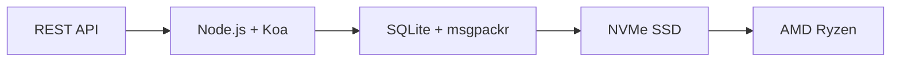

# Ensimmäinen Täydellinen Sähköpostin API: Kuinka Forward Email Mullisti Sähköpostinhallinnan {#the-first-complete-email-api-how-forward-email-revolutionized-email-management}


<p class="lead mt-3">
  <strong>Yhteenveto:</strong> Rakensimme maailman ensimmäisen täydellisen REST API:n sähköpostinhallintaan, jossa on edistyneet hakutoiminnot, joita mikään muu palvelu ei tarjoa. Kun Gmail, Outlook ja Apple pakottavat kehittäjät IMAP-paholaisuuteen tai rajoitettuihin API-rajapintoihin, Forward Email tarjoaa salamannopeat CRUD-toiminnot viesteille, kansioille, kontakteille ja kalentereille yhtenäisen REST-rajapinnan kautta, jossa on yli 15 hakuehtoa. Tämä on se sähköpostin API, jota kehittäjät ovat odottaneet.
</p>


## Sisällysluettelo {#table-of-contents}

* [Sähköpostin API-ongelma](#the-email-api-problem)
* [Mitä kehittäjät oikeasti sanovat](#what-developers-are-actually-saying)
* [Forward Emailin mullistava ratkaisu](#forward-emails-revolutionary-solution)
  * [Miksi rakensimme tämän](#why-we-built-this)
  * [Yksinkertainen todennus](#simple-authentication)
* [20 päätepistettä, jotka muuttavat kaiken](#20-endpoints-that-change-everything)
  * [Viestit (5 päätepistettä)](#messages-5-endpoints)
  * [Kansiot (5 päätepistettä)](#folders-5-endpoints)
  * [Kontaktit (5 päätepistettä)](#contacts-5-endpoints)
  * [Kalenterit (5 päätepistettä)](#calendars-5-endpoints)
* [Edistynyt haku: Mikään muu palvelu ei vedä vertoja](#advanced-search-no-other-service-compares)
  * [Hakujen API-tilanne on rikki](#the-search-api-landscape-is-broken)
  * [Forward Emailin mullistava hakujen API](#forward-emails-revolutionary-search-api)
  * [Todelliset hakuesimerkit](#real-world-search-examples)
  * [Suorituskykyedut](#performance-advantages)
  * [Hakutoiminnot, joita muilla ei ole](#search-features-no-one-else-has)
  * [Miksi tämä on tärkeää kehittäjille](#why-this-matters-for-developers)
  * [Tekninen toteutus](#the-technical-implementation)
* [Salamannopea suorituskykyarkkitehtuuri](#blazing-fast-performance-architecture)
  * [Suorituskykymittaukset](#performance-benchmarks)
  * [Yksityisyys ensin -arkkitehtuuri](#privacy-first-architecture)
* [Miksi olemme erilaisia: Täydellinen vertailu](#why-were-different-the-complete-comparison)
  * [Suurten tarjoajien rajoitukset](#major-provider-limitations)
  * [Forward Emailin edut](#forward-email-advantages)
  * [Avoimen lähdekoodin läpinäkyvyysongelma](#the-open-source-transparency-problem)
* [Yli 30 todellista integraatioesimerkkiä](#30-real-world-integration-examples)
  * [1. WordPress-yhteydenottolomakkeen parannus](#1-wordpress-contact-form-enhancement)
  * [2. Zapier-vaihtoehto sähköpostiautomaatiolle](#2-zapier-alternative-for-email-automation)
  * [3. CRM-sähköpostisynkronointi](#3-crm-email-synchronization)
  * [4. Verkkokaupan tilausten käsittely](#4-e-commerce-order-processing)
  * [5. Tukipyyntöjen integrointi](#5-support-ticket-integration)
  * [6. Uutiskirjeiden hallintajärjestelmä](#6-newsletter-management-system)
  * [7. Sähköpostipohjainen tehtävien hallinta](#7-email-based-task-management)
  * [8. Monitilin sähköpostien yhdistäminen](#8-multi-account-email-aggregation)
  * [9. Edistynyt sähköpostianalytiikan hallintapaneeli](#9-advanced-email-analytics-dashboard)
  * [10. Älykäs sähköpostien arkistointi](#10-smart-email-archiving)
  * [11. Sähköpostin ja kalenterin integrointi](#11-email-to-calendar-integration)
  * [12. Sähköpostien varmuuskopiointi ja vaatimustenmukaisuus](#12-email-backup-and-compliance)
  * [13. Sähköpostipohjainen sisällönhallinta](#13-email-based-content-management)
  * [14. Sähköpostimallien hallinta](#14-email-template-management)
  * [15. Sähköpostipohjainen työnkulun automaatio](#15-email-based-workflow-automation)
  * [16. Sähköpostin turvallisuuden valvonta](#16-email-security-monitoring)
  * [17. Sähköpostipohjainen kyselyiden keruu](#17-email-based-survey-collection)
  * [18. Sähköpostin suorituskyvyn valvonta](#18-email-performance-monitoring)
  * [19. Sähköpostipohjainen liidien kvalifiointi](#19-email-based-lead-qualification)
  * [20. Sähköpostipohjainen projektinhallinta](#20-email-based-project-management)
  * [21. Sähköpostipohjainen varastonhallinta](#21-email-based-inventory-management)
  * [22. Sähköpostipohjainen laskujen käsittely](#22-email-based-invoice-processing)
  * [23. Sähköpostipohjainen tapahtumailmoittautuminen](#23-email-based-event-registration)
  * [24. Sähköpostipohjainen asiakirjojen hyväksymisen työnkulku](#24-email-based-document-approval-workflow)
  * [25. Sähköpostipohjainen asiakaspalautteen analyysi](#25-email-based-customer-feedback-analysis)
  * [26. Sähköpostipohjainen rekrytointiputki](#26-email-based-recruitment-pipeline)
  * [27. Sähköpostipohjainen kuluraporttien käsittely](#27-email-based-expense-report-processing)
  * [28. Sähköpostipohjainen laadunvarmistusraportointi](#28-email-based-quality-assurance-reporting)
  * [29. Sähköpostipohjainen toimittajahallinta](#29-email-based-vendor-management)
  * [30. Sähköpostipohjainen sosiaalisen median valvonta](#30-email-based-social-media-monitoring)
* [Aloittaminen](#getting-started)
  * [1. Luo Forward Email -tilisi](#1-create-your-forward-email-account)
  * [2. Luo API-tunnukset](#2-generate-api-credentials)
  * [3. Tee ensimmäinen API-kutsu](#3-make-your-first-api-call)
  * [4. Tutustu dokumentaatioon](#4-explore-the-documentation)
* [Tekniset resurssit](#technical-resources)
## Sähköpostin API-ongelma {#the-email-api-problem}

Sähköpostin API:t ovat pohjimmiltaan rikki. Piste.

Jokainen merkittävä sähköpostipalveluntarjoaja pakottaa kehittäjät valitsemaan kahdesta kauheasta vaihtoehdosta:

1. **IMAP-helvetti**: Kamppailu 30 vuotta vanhan protokollan kanssa, joka on suunniteltu työpöytäsovelluksille, ei moderneille sovelluksille
2. **Kahlitut API:t**: Nopeusrajoitetut, vain luku -tilassa olevat, OAuth-monimutkaiset API:t, jotka eivät pysty hallitsemaan varsinaista sähköpostidataa

Tulos? Kehittäjät joko luopuvat kokonaan sähköpostin integroinnista tai tuhlaavat viikkoja rakentamalla hauraita IMAP-kääreitä, jotka rikkoutuvat jatkuvasti.

> \[!WARNING]
> **Likainen salaisuus**: Useimmat "sähköpostin API:t" ovat pelkästään lähetys-API:ita. Et voi ohjelmallisesti järjestää kansioita, synkronoida yhteystietoja tai hallita kalentereita yksinkertaisen REST-rajapinnan kautta. Ainakaan vielä.


## Mitä kehittäjät oikeasti sanovat {#what-developers-are-actually-saying}

Turhautuminen on todellista ja dokumentoitua kaikkialla:

> "Yritin äskettäin integroida Gmailin sovellukseeni, ja käytin siihen liikaa aikaa. Päätin, ettei Gmailin tukeminen ole sen arvoista."
>
> *- [Hacker News -kehittäjä](https://news.ycombinator.com/item?id=42106944), 147 tykkäystä*

> "Ovatko kaikki sähköpostin API:t keskinkertaisia? Ne vaikuttavat jotenkin rajoitetuilta tai rajoittavilta."
>
> *- [Reddit r/SaaS -keskustelu](https://www.reddit.com/r/SaaS/comments/1cm84s7/are_all_email_apis_mediocre/)*

> "Miksi sähköpostikehitys on pakko olla niin hankalaa?"
>
> *- [Reddit r/webdev](https://www.reddit.com/r/webdev/comments/15trnp2/why_does_email_development_have_to_suck/), 89 kommenttia kehittäjien tuskasta*

> "Mikä tekee Gmail API:sta tehokkaamman kuin IMAP? Toinen syy siihen, että Gmail API on paljon tehokkaampi, on se, että sen tarvitsee ladata jokainen viesti vain kerran. IMAP:ssa jokainen viesti täytyy ladata ja indeksoida..."
>
> *- [Stack Overflow -kysymys](https://stackoverflow.com/questions/25431022/what-makes-the-gmail-api-more-efficient-than-imap) 47 tykkäyksellä*

Todisteita on kaikkialla:

* **WordPressin SMTP-ongelmat**: [631 GitHub-ongelmaa](https://github.com/awesomemotive/WP-Mail-SMTP/issues) sähköpostin toimitusvirheistä
* **Zapierin rajoitukset**: [Yhteisön valituksia](https://community.zapier.com/featured-articles-65/email-parser-by-zapier-limitations-and-alternatives-16958) 10 sähköpostin/tunnissa rajoituksista ja IMAP-tunnistuksen epäonnistumisista
* **IMAP API -projektit**: [Useita](https://github.com/ewildgoose/imap-api) [avoimen lähdekoodin](https://emailengine.app/) [projekteja](https://www.npmjs.com/package/imapflow) on olemassa nimenomaan "IMAP:n muuttamiseksi RESTiksi", koska mikään palveluntarjoaja ei tätä tarjoa
* **Gmail API:n turhautumiset**: [Stack Overflow](https://stackoverflow.com/questions/tagged/gmail-api) sisältää 4 847 kysymystä, joissa on tunniste "gmail-api" ja yleisiä valituksia nopeusrajoituksista ja monimutkaisuudesta


## Forward Emailin mullistava ratkaisu {#forward-emails-revolutionary-solution}

**Olemme ensimmäinen sähköpostipalvelu, joka tarjoaa täydelliset CRUD-toiminnot kaikelle sähköpostidatalle yhtenäisen REST API:n kautta.**

Tämä ei ole pelkkä lähetys-API. Tämä on täydellinen ohjelmallinen hallinta:

* **Viestit**: Luo, lue, päivitä, poista, hae, siirrä, merkitse
* **Kansiot**: Täysi IMAP-kansioiden hallinta REST-päätepisteiden kautta
* **Yhteystiedot**: [CardDAV](https://tools.ietf.org/html/rfc6352) -yhteystietojen tallennus ja synkronointi
* **Kalenterit**: [CalDAV](https://tools.ietf.org/html/rfc4791) -kalenteritapahtumat ja aikataulutus

### Miksi rakensimme tämän {#why-we-built-this}

**Ongelma**: Jokainen sähköpostipalveluntarjoaja käsittelee sähköpostia mustana laatikkona. Voit lähettää sähköposteja, ehkä lukea niitä monimutkaisella OAuthilla, mutta et voi oikeasti *hallita* sähköpostidataa ohjelmallisesti.

**Visiomme**: Sähköpostin pitäisi olla yhtä helppoa integroida kuin mikä tahansa moderni API. Ei IMAP-kirjastoja. Ei OAuth-monimutkaisuutta. Ei nopeusrajoituspainajaisia. Vain yksinkertaiset REST-päätepisteet, jotka toimivat.

**Tulos**: Ensimmäinen sähköpostipalvelu, jossa voit rakentaa täydellisen sähköpostiohjelman, CRM-integraation tai automaatiojärjestelmän pelkillä HTTP-pyynnöillä.

### Yksinkertainen todennus {#simple-authentication}

Ei [OAuth-monimutkaisuutta](https://oauth.net/2/). Ei [sovelluskohtaisia salasanoja](https://support.google.com/accounts/answer/185833). Vain alias-tunnuksesi:

```bash
curl -u "alias@yourdomain.com:password" \
  https://api.forwardemail.net/v1/messages
```
## 20 Päätepistettä, Jotka Muuttavat Kaiken {#20-endpoints-that-change-everything}

### Viestit (5 päätepistettä) {#messages-5-endpoints}

* `GET /v1/messages` - Listaa viestit suodatuksella (`?folder=`, `?is_unread=`, `?is_flagged=`)
* `POST /v1/messages` - Lähetä uusia viestejä suoraan kansioihin
* `GET /v1/messages/:id` - Hae tietty viesti täydellisellä metatiedolla
* `PUT /v1/messages/:id` - Päivitä viesti (liput, kansio, lukemisen tila)
* `DELETE /v1/messages/:id` - Poista viesti pysyvästi

### Kansiot (5 päätepistettä) {#folders-5-endpoints}

* `GET /v1/folders` - Listaa kaikki kansiot tilausstatuksineen
* `POST /v1/folders` - Luo uusi kansio mukautetuilla ominaisuuksilla
* `GET /v1/folders/:id` - Hae kansion tiedot ja viestimäärät
* `PUT /v1/folders/:id` - Päivitä kansion ominaisuudet ja tilaus
* `DELETE /v1/folders/:id` - Poista kansio ja käsittele viestien siirto

### Yhteystiedot (5 päätepistettä) {#contacts-5-endpoints}

* `GET /v1/contacts` - Listaa yhteystiedot haun ja sivutuksen kanssa
* `POST /v1/contacts` - Luo uusi yhteystieto täydellä vCard-tuesta
* `GET /v1/contacts/:id` - Hae yhteystieto kaikilla kentillä ja metatiedoilla
* `PUT /v1/contacts/:id` - Päivitä yhteystiedon tiedot ETag-validoinnilla
* `DELETE /v1/contacts/:id` - Poista yhteystieto ketjutuksella

### Kalenterit (5 päätepistettä) {#calendars-5-endpoints}

* `GET /v1/calendars` - Listaa kalenteritapahtumat päivämääräsuodatuksella
* `POST /v1/calendars` - Luo kalenteritapahtuma osallistujilla ja toistolla
* `GET /v1/calendars/:id` - Hae tapahtuman tiedot aikavyöhykkeen käsittelyllä
* `PUT /v1/calendars/:id` - Päivitä tapahtuma ristiriitojen tunnistuksella
* `DELETE /v1/calendars/:id` - Poista tapahtuma osallistujailmoituksilla


## Edistynyt Haku: Mikään Muu Palvelu Ei Vertaudu {#advanced-search-no-other-service-compares}

**Forward Email on ainoa sähköpostipalvelu, joka tarjoaa kattavan, ohjelmallisen haun kaikista viestikentistä REST-rajapinnan kautta.**

Kun muut tarjoajat tarjoavat parhaimmillaan perussuodatusta, olemme rakentaneet edistyneimmän koskaan luodun sähköpostihakurajapinnan. Mikään Gmail API, Outlook API tai muu palvelu ei yllä meidän hakutoimintoihimme.

### Hakurajapintojen Tilanne On Rikkinäinen {#the-search-api-landscape-is-broken}

**Gmail API:n hakurajoitukset:**

* ✅ Perus `q`-parametri vain
* ❌ Ei kenttäkohtaista hakua
* ❌ Ei päivämäärävälin suodatusta
* ❌ Ei kokoon perustuvaa suodatusta
* ❌ Ei liitetiedostojen suodatusta
* ❌ Rajoittuu Gmailin hakusyntaksiin

**Outlook API:n hakurajoitukset:**

* ✅ Perus `$search`-parametri
* ❌ Ei edistynyttä kenttäosoitusta
* ❌ Ei monimutkaisia kyselyyhdistelmiä
* ❌ Tiukka nopeusrajoitus
* ❌ Vaatii monimutkaista OData-syntaksia

**Apple iCloud:**

* ❌ Ei lainkaan API:a
* ❌ Vain IMAP-haku (jos saat sen toimimaan)

**ProtonMail & Tuta:**

* ❌ Ei julkisia API-rajapintoja
* ❌ Ei ohjelmallisia hakumahdollisuuksia

### Forward Emailin Vallankumouksellinen Hakurajapinta {#forward-emails-revolutionary-search-api}

**Tarjoamme yli 15 hakuparametria, joita mikään muu palvelu ei tarjoa:**

| Hakutoiminto                  | Forward Email                        | Gmail API    | Outlook API        | Muut   |
| ------------------------------ | ---------------------------------- | ------------ | ------------------ | ------ |
| **Kenttäkohtainen haku**       | ✅ Aihe, sisältö, lähettäjä, vastaanottaja, kopio, otsikot | ❌            | ❌                  | ❌      |
| **Monikenttäinen yleishaku**  | ✅ `?search=` kaikissa kentissä     | ✅ Perus `q=` | ✅ Perus `$search=` | ❌      |
| **Päivämäärävälin suodatus**  | ✅ `?since=` & `?before=`           | ❌            | ❌                  | ❌      |
| **Kokoon perustuva suodatus** | ✅ `?min_size=` & `?max_size=`      | ❌            | ❌                  | ❌      |
| **Liitetiedostojen suodatus** | ✅ `?has_attachments=true/false`    | ❌            | ❌                  | ❌      |
| **Otsikkohaku**               | ✅ `?headers=X-Priority`            | ❌            | ❌                  | ❌      |
| **Viestin ID -haku**          | ✅ `?message_id=abc123`             | ❌            | ❌                  | ❌      |
| **Yhdistetyt suodattimet**    | ✅ Useita parametreja AND-logiikalla | ❌            | ❌                  | ❌      |
| **Kirjainkoon huomioimaton**  | ✅ Kaikki haut                      | ✅            | ✅                  | ❌      |
| **Sivutus**                   | ✅ Toimii kaikkien hakuparametrien kanssa | ✅            | ✅                  | ❌      |
### Todelliset Hakuesimerkit {#real-world-search-examples}

**Etsi kaikki viimeisen neljänneksen laskut:**

```bash
# Forward Email - Yksinkertainen ja tehokas
GET /v1/messages?subject=invoice&since=2024-01-01T00:00:00Z&before=2024-04-01T00:00:00Z

# Gmail API - Mahdotonta heidän rajoitetulla haullaan
# Ei päivämääräalueen suodatusta saatavilla

# Outlook API - Monimutkainen OData-syntaksi, rajallinen toiminnallisuus
GET /me/messages?$search="invoice"&$filter=receivedDateTime ge 2024-01-01T00:00:00Z
```

**Etsi suuret liitetiedostot tietystä lähettäjästä:**

```bash
# Forward Email - Kattava suodatus
GET /v1/messages?from=finance@company.com&has_attachments=true&min_size=1000000

# Gmail API - Ei voi suodattaa kokoa tai liitteitä ohjelmallisesti
# Outlook API - Ei kokosuodatusta saatavilla
# Muut - Ei API-rajapintoja saatavilla
```

**Monimutkainen monikenttähaku:**

```bash
# Forward Email - Edistyneet hakumahdollisuudet
GET /v1/messages?body=quarterly&from=manager&is_flagged=true&folder=Reports

# Gmail API - Rajoittuu pelkkään perustekstihakuun
GET /gmail/v1/users/me/messages?q=quarterly

# Outlook API - Perushaku ilman kenttäkohtaisuutta
GET /me/messages?$search="quarterly"
```

### Suorituskykyedut {#performance-advantages}

**Forward Email -haun suorituskyky:**

* ⚡ **Alle 100 ms vasteajat** monimutkaisissa hauissa
* 🔍 **Regex-optimointi** asianmukaisella indeksoinnilla
* 📊 **Rinnakkainen kyselyjen suoritus** laskentaan ja dataan
* 💾 **Tehokas muistin käyttö** kevyillä hauilla

**Kilpailijoiden suorituskykyongelmat:**

* 🐌 **Gmail API**: Käyttörajoitus 250 yksikköä käyttäjää kohden sekunnissa
* 🐌 **Outlook API**: Aggressiivinen rajoitus ja monimutkaiset takaisinkytkentävaatimukset
* 🐌 **Muut**: Ei vertailukelpoisia API-rajapintoja

### Hakutoiminnot, joita muilla ei ole {#search-features-no-one-else-has}

#### 1. Otsikkokohtainen haku {#1-header-specific-search}

```bash
# Etsi viestit, joissa on tietyt otsikot
GET /v1/messages?headers=X-Priority:1
GET /v1/messages?headers=X-Spam-Score
```

#### 2. Kokoon perustuva älykkyys {#2-size-based-intelligence}

```bash
# Etsi uutiskirjeet (yleensä suuria)
GET /v1/messages?min_size=50000&from=newsletter

# Etsi pikavastaukset (yleensä pieniä)
GET /v1/messages?max_size=1000&to=support
```

#### 3. Liitetiedostopohjaiset työnkulut {#3-attachment-based-workflows}

```bash
# Etsi kaikki oikeustiimille lähetetyt asiakirjat
GET /v1/messages?to=legal&has_attachments=true&body=contract

# Etsi liitteettömät sähköpostit siivousta varten
GET /v1/messages?has_attachments=false&before=2023-01-01T00:00:00Z
```

#### 4. Yhdistetty liiketoimintalogiikka {#4-combined-business-logic}

```bash
# Etsi kiireelliset liputetut viestit VIP-lähettäjiltä, joissa on liitteitä
GET /v1/messages?is_flagged=true&from=ceo&has_attachments=true&subject=urgent
```

### Miksi tämä on tärkeää kehittäjille {#why-this-matters-for-developers}

**Rakenna sovelluksia, jotka olivat aiemmin mahdottomia:**

1. **Edistynyt sähköpostianalytiikka**: Analysoi sähköpostimallit koon, lähettäjän ja sisällön mukaan
2. **Älykäs sähköpostinhallinta**: Automaattinen järjestely monimutkaisten kriteerien perusteella
3. **Säädösten noudattaminen ja tiedonhaku**: Löydä tietyt sähköpostit lakisääteisiin vaatimuksiin
4. **Liiketoimintatiedon hyödyntäminen**: Poimi oivalluksia sähköpostiviestinnästä
5. **Automaattiset työnkulut**: Käynnistä toimenpiteitä monimutkaisten suodattimien perusteella

### Tekninen toteutus {#the-technical-implementation}

Hakumme API käyttää:

* **Regex-optimointia** asianmukaisilla indeksointistrategioilla
* **Rinnakkaista suoritusta** suorituskyvyn parantamiseksi
* **Syötteen validointia** turvallisuuden takaamiseksi
* **Kattavaa virheenkäsittelyä** luotettavuuden varmistamiseksi

```javascript
// Esimerkki: Monimutkainen hakutoteutus
const searchConditions = [];

if (ctx.query.subject) {
  searchConditions.push({
    subject: { $regex: ctx.query.subject, $options: 'i' }
  });
}

if (ctx.query.from) {
  searchConditions.push({
    $or: [
      { 'from.address': { $regex: ctx.query.from, $options: 'i' } },
      { 'from.name': { $regex: ctx.query.from, $options: 'i' } }
    ]
  });
}

// Yhdistä JA-logiikalla
if (searchConditions.length > 0) {
  query.$and = searchConditions;
}
```

> \[!TIP]
> **Kehittäjän etu**: Forward Emailin hakupalvelun avulla voit rakentaa sähköpostisovelluksia, jotka kilpailevat työpöytäsovellusten kanssa toiminnallisuudessa, säilyttäen samalla REST-rajapintojen yksinkertaisuuden.
## Salamannopea Suorituskykyarkkitehtuuri {#blazing-fast-performance-architecture}

Tekninen pino on rakennettu nopeutta ja luotettavuutta varten:


```mermaid
graph LR
    A[REST API] --> B[Node.js + Koa]
    B --> C[SQLite + msgpackr]
    C --> D[NVMe SSD]
    D --> E[AMD Ryzen]
```

### Suorituskykyvertailut {#performance-benchmarks}

**Miksi Olemme Salamannopeita:**

| Komponentti  | Teknologia                                                                       | Suorituskykyetu                              |
| ------------ | -------------------------------------------------------------------------------- | -------------------------------------------- |
| **Tallennus**| [NVMe SSD](https://en.wikipedia.org/wiki/NVM_Express)                           | 10x nopeampi kuin perinteinen SATA           |
| **Tietokanta**| [SQLite](https://sqlite.org/) + [msgpackr](https://github.com/kriszyp/msgpackr) | Nolla verkkoviive, optimoitu sarjallistaminen |
| **Laitteisto**| [AMD Ryzen](https://www.amd.com/en/products/processors/desktops/ryzen) bare metal| Ei virtualisointikuormaa                      |
| **Välimuisti**| Muistissa + pysyvä                                                              | Alle millisekunnin vasteajat                  |
| **Varakopiot**| [Cloudflare R2](https://www.cloudflare.com/products/r2/) salattu                | Yritystason luotettavuus                       |

**Todelliset Suorituskykyluvut:**

* **API-vastausaika**: < 50 ms keskiarvo
* **Viestin haku**: < 10 ms välimuistissa oleville viesteille
* **Kansion toiminnot**: < 5 ms metatietotoiminnoille
* **Yhteystietojen synkronointi**: 1000+ yhteystietoa/sekunti
* **Käyttöaika**: 99,99 % SLA redundantilla infrastruktuurilla

### Yksityisyys Edellä -arkkitehtuuri {#privacy-first-architecture}

**Nollatietomalli**: Vain sinulla on pääsy IMAP-salasanallasi – emme voi lukea sähköpostejasi. Meidän [nollatietomallimme arkkitehtuuri](https://forwardemail.net/en/security) takaa täydellisen yksityisyyden samalla kun tarjoaa salamannopean suorituskyvyn.


## Miksi Olemme Eri: Täydellinen Vertailu {#why-were-different-the-complete-comparison}

### Suurten Palveluntarjoajien Rajoitukset {#major-provider-limitations}

| Palveluntarjoaja | Keskeiset Ongelmat                      | Tarkemmat Rajoitukset                                                                                                                                                                                                                                                                                                                                                                                                                                               |
| ---------------- | ------------------------------------- | ------------------------------------------------------------------------------------------------------------------------------------------------------------------------------------------------------------------------------------------------------------------------------------------------------------------------------------------------------------------------------------------------------------------------------------------------------------------ |
| **Gmail API**    | Vain luku, Monimutkainen OAuth, Eri API:t | • [Ei voi muokata olemassa olevia viestejä](https://developers.google.com/gmail/api/reference/rest/v1/users.messages)<br>• [Tunnisteet ≠ kansiot](https://developers.google.com/gmail/api/reference/rest/v1/users.labels)<br>• [1 miljardin käyttöyksikön päivärajoitus](https://developers.google.com/gmail/api/reference/quota)<br>• [Vaatii erilliset API:t](https://developers.google.com/workspace) yhteystiedoille/kalenterille                                                           |
| **Outlook API**  | Vanhentunut, Sekava, Yrityskeskeinen   | • [REST-päätepisteet vanhentuvat maaliskuussa 2024](https://learn.microsoft.com/en-us/outlook/rest/compare-graph)<br>• [Useita sekavia API:ita](https://learn.microsoft.com/en-us/office/client-developer/outlook/selecting-an-api-or-technology-for-developing-solutions-for-outlook) (EWS, Graph, REST)<br>• [Microsoft Graphin monimutkaisuus](https://learn.microsoft.com/en-us/graph/overview)<br>• [Aggressiivinen rajoitus](https://learn.microsoft.com/en-us/graph/throttling) |
| **Apple iCloud** | Ei julkista API:a                      | • [Ei lainkaan julkista API:a](https://support.apple.com/en-us/102654)<br>• [Vain IMAP, 1000 sähköpostin päivärajoitus](https://support.apple.com/en-us/102654)<br>• [Sovelluskohtaiset salasanat vaaditaan](https://support.apple.com/en-us/102654)<br>• [500 vastaanottajan rajoitus viestissä](https://support.apple.com/en-us/102654)                                                                                                                                              |
| **ProtonMail**   | Ei API:a, Väärät avoimen lähdekoodin väitteet | • [Ei julkista API:a saatavilla](https://proton.me/support/protonmail-bridge-clients)<br>• [Bridge-ohjelmisto vaaditaan](https://proton.me/mail/bridge) IMAP-yhteyteen<br>• [Väittää olevansa "avoin lähdekoodi"](https://proton.me/blog/open-source) mutta [palvelinkoodi on suljettu](https://github.com/ProtonMail)<br>• [Rajoitettu vain maksullisiin suunnitelmiin](https://proton.me/pricing)                                                                                                         |
| **Tuta**         | Ei API:a, Harhaanjohtava läpinäkyvyys  | • [Ei REST API:a sähköpostinhallintaan](https://tuta.com/support#technical)<br>• [Väittää olevansa "avoin lähdekoodi"](https://tuta.com/blog/posts/open-source-email) mutta [taustajärjestelmä on suljettu](https://github.com/tutao/tutanota)<br>• [IMAP/SMTP ei tuettu](https://tuta.com/support#imap)<br>• [Oma salaus](https://tuta.com/encryption) estää standardoidut integraatiot                                                                                               |
| **Zapier Email** | Tiukat Käyttörajoitukset               | • [10 sähköpostia tunnissa -rajoitus](https://help.zapier.com/hc/en-us/articles/8496181555597-Email-Parser-by-Zapier-limitations-and-alternatives)<br>• [Ei IMAP-kansiopääsyä](https://help.zapier.com/hc/en-us/articles/8496181555597-Email-Parser-by-Zapier-limitations-and-alternatives)<br>• [Rajoitetut jäsentämismahdollisuudet](https://help.zapier.com/hc/en-us/articles/8496181555597-Email-Parser-by-Zapier-limitations-and-alternatives)                                 |
### Sähköpostin edelleenlähetyksen edut {#forward-email-advantages}

| Ominaisuus         | Sähköpostin edelleenlähetys                                                                 | Kilpailu                                  |
| ------------------ | -------------------------------------------------------------------------------------------- | ----------------------------------------- |
| **Täysi CRUD**     | ✅ Täysi luonti, luku, päivitys, poisto kaikille tiedoille                                   | ❌ Vain luku tai rajoitetut toiminnot      |
| **Yhtenäinen API** | ✅ Viestit, kansiot, yhteystiedot, kalenterit yhdessä API:ssa                                | ❌ Erilliset API:t tai puuttuvat ominaisuudet |
| **Yksinkertainen tunnistus** | ✅ Perustason tunnistus alias-tunnuksilla                                               | ❌ Monimutkainen OAuth useilla oikeuksilla |
| **Ei käyttörajoituksia** | ✅ Anteliaat rajat suunniteltu oikeisiin sovelluksiin                                    | ❌ Rajoittavat kiintiöt, jotka katkaisevat työnkulut |
| **Itseisännöinti** | ✅ [Täydellinen itseisännöintivaihtoehto](https://forwardemail.net/en/blog/docs/self-hosted-solution) | ❌ Vain toimittajalukko                    |
| **Yksityisyys**    | ✅ Nollatietoinen, salattu, yksityinen                                                      | ❌ Tiedonlouhinta ja yksityisyysongelmat   |
| **Suorituskyky**   | ✅ Alle 50 ms vasteajat, NVMe-tallennus                                                     | ❌ Verkon viive, rajoitukset hidastavat    |

### Avoimen lähdekoodin läpinäkyvyysongelma {#the-open-source-transparency-problem}

**ProtonMail ja Tuta markkinoivat itseään "avoin lähdekoodi" ja "läpinäkyvänä", mutta tämä on harhaanjohtavaa markkinointia, joka rikkoo nykyaikaisia yksityisyysperiaatteita.**

> \[!WARNING]
> **Väärät läpinäkyvyysväitteet**: Sekä ProtonMail että Tuta mainostavat näkyvästi "avoin lähdekoodi" -tunnuksiaan, mutta pitävät kriittisimmän palvelinpuolen koodinsa suljettuna ja omistusoikeudellisena.

**ProtonMailin harhautus:**

* **Väitteet**: ["Olemme avoimen lähdekoodin"](https://proton.me/blog/open-source) näkyvästi markkinoinnissa
* **Todellisuus**: [Palvelinkoodi on täysin omistusoikeudellinen](https://github.com/ProtonMail) – vain asiakasohjelmat ovat avoimen lähdekoodin
* **Vaikutus**: Käyttäjät eivät voi varmistaa palvelimen salauksen, tietojen käsittelyn tai yksityisyysväitteiden paikkansapitävyyttä
* **Läpinäkyvyyden rikkomus**: Ei mahdollisuutta tarkastaa varsinaista sähköpostin käsittely- ja tallennusjärjestelmää

**Tutan harhaanjohtava markkinointi:**

* **Väitteet**: ["Avoimen lähdekoodin sähköposti"](https://tuta.com/blog/posts/open-source-email) keskeisenä myyntivalttina
* **Todellisuus**: [Taustajärjestelmä on suljettu lähdekoodi](https://github.com/tutao/tutanota) – vain käyttöliittymä on saatavilla
* **Vaikutus**: Omistusoikeudellinen salaus estää standardit sähköpostiprotokollat (IMAP/SMTP)
* **Toimittajalukko**: Räätälöity salaus pakottaa toimittajariippuvuuteen

**Miksi tämä on tärkeää nykyaikaiselle yksityisyydelle:**

Vuonna 2025 aito yksityisyys vaatii **täyttä läpinäkyvyyttä**. Kun sähköpostipalveluntarjoajat väittävät "avoin lähdekoodi" mutta piilottavat palvelinkoodinsa:

1. **Tarkastamaton salaus**: Et voi tarkastaa, miten tietosi todella salataan
2. **Piilotetut tietokäytännöt**: Palvelimen tietojenkäsittely on musta laatikko
3. **Luottamukseen perustuva turvallisuus**: Sinun on luotettava väitteisiin ilman varmennusta
4. **Toimittajalukko**: Omistusoikeudelliset järjestelmät estävät tietojen siirrettävyyden

**Forward Emailin aito läpinäkyvyys:**

* ✅ **[Täysi avoin lähdekoodi](https://github.com/forwardemail/forwardemail.net)** – palvelin- ja asiakaskoodi
* ✅ **[Itseisännöinti saatavilla](https://forwardemail.net/en/blog/docs/self-hosted-solution)** – aja oma instanssi
* ✅ **Standardiprotokollat** – IMAP, SMTP, CardDAV, CalDAV -yhteensopivuus
* ✅ **Tarkastettava turvallisuus** – jokainen koodirivi on tarkastettavissa
* ✅ **Ei toimittajalukkoa** – sinun datasi, sinun hallintasi

> \[!TIP]
> **Aito avoin lähdekoodi tarkoittaa, että voit varmistaa jokaisen väitteen.** Forward Emailin kanssa voit tarkastaa salauksemme, arvioida tietojenkäsittelymme ja jopa ajaa oman instanssisi. Se on todellista läpinäkyvyyttä.


## 30+ todellista integraatioesimerkkiä {#30-real-world-integration-examples}

### 1. WordPress-yhteydenottolomakkeen parannus {#1-wordpress-contact-form-enhancement}
**Ongelma**: [WordPressin SMTP-konfiguraation virheet](https://github.com/awesomemotive/WP-Mail-SMTP/issues) ([631 GitHub-ongelmaa](https://github.com/awesomemotive/WP-Mail-SMTP/issues))
**Ratkaisu**: Suora API-integraatio ohittaa [SMTP:n](https://tools.ietf.org/html/rfc5321) kokonaan

```javascript
// WordPressin yhteydenottolomake, joka tallentaa Lähetetyt-kansioon
await fetch('https://api.forwardemail.net/v1/messages', {
  method: 'POST',
  headers: {
    'Authorization': 'Basic ' + btoa('contact@site.com:password'),
    'Content-Type': 'application/json'
  },
  body: JSON.stringify({
    to: [{ address: 'owner@site.com' }],
    subject: 'Yhteydenottolomake: ' + formData.subject,
    text: formData.message,
    folder: 'Sent'
  })
});
```

### 2. Zapier-vaihtoehto sähköpostiautomaatiolle {#2-zapier-alternative-for-email-automation}

**Ongelma**: [Zapierin 10 sähköpostin/tunti -rajoitus](https://help.zapier.com/hc/en-us/articles/8496181555597-Email-Parser-by-Zapier-limitations-and-alternatives) ja [IMAP-tunnistuksen virheet](https://community.zapier.com/featured-articles-65/email-parser-by-zapier-limitations-and-alternatives-16958)
**Ratkaisu**: Rajoittamaton automaatio täydellisellä sähköpostin hallinnalla

```javascript
// Sähköpostien automaattinen järjestely lähettäjän verkkotunnuksen mukaan
const messages = await fetch('/v1/messages?folder=INBOX');
for (const message of messages) {
  const domain = message.from.split('@')[1];
  await fetch(`/v1/messages/${message.id}`, {
    method: 'PUT',
    body: JSON.stringify({ folder: `Clients/${domain}` })
  });
}
```

### 3. CRM-sähköpostien synkronointi {#3-crm-email-synchronization}

**Ongelma**: Manuaalinen yhteystietojen hallinta sähköpostin ja [CRM-järjestelmien](https://en.wikipedia.org/wiki/Customer_relationship_management) välillä
**Ratkaisu**: Kaksisuuntainen synkronointi [CardDAV](https://tools.ietf.org/html/rfc6352) -yhteystieto-API:n avulla

```javascript
// Synkronoi uudet sähköpostiyhteystiedot CRM:ään
const newContacts = await fetch('/v1/contacts');
for (const contact of newContacts) {
  await crmAPI.createContact({
    name: contact.name,
    email: contact.email,
    source: 'email_api'
  });
}
```

### 4. Verkkokaupan tilausten käsittely {#4-e-commerce-order-processing}

**Ongelma**: Manuaalinen tilaussähköpostien käsittely [verkkokauppa-alustoilla](https://en.wikipedia.org/wiki/E-commerce)
**Ratkaisu**: Automaattinen tilausten hallintaputki

```javascript
// Käsittele tilausvahvistussähköpostit
const orders = await fetch('/v1/messages?folder=Orders');
const orderEmails = orders.filter(msg =>
  msg.subject.includes('Order Confirmation')
);

for (const order of orderEmails) {
  const orderData = parseOrderEmail(order.text);
  await updateInventory(orderData);
  await fetch(`/v1/messages/${order.id}`, {
    method: 'PUT',
    body: JSON.stringify({ folder: 'Orders/Processed' })
  });
}
```

### 5. Tukipyyntöjen integrointi {#5-support-ticket-integration}

**Ongelma**: Sähköpostiketjut hajallaan eri [tukipalvelualustoilla](https://en.wikipedia.org/wiki/Help_desk_software)
**Ratkaisu**: Täydellinen sähköpostiketjujen seuranta

```javascript
// Luo tukipyyntö sähköpostiketjusta
const messages = await fetch('/v1/messages?folder=Support');
const supportEmails = messages.filter(msg =>
  msg.to.some(addr => addr.includes('support@'))
);

for (const email of supportEmails) {
  const ticket = await supportSystem.createTicket({
    subject: email.subject,
    from: email.from,
    body: email.text,
    timestamp: email.date
  });
}
```

### 6. Uutiskirjeiden hallintajärjestelmä {#6-newsletter-management-system}

**Ongelma**: Rajalliset [uutiskirjealustan](https://en.wikipedia.org/wiki/Email_marketing) integraatiot
**Ratkaisu**: Täydellinen tilaajien elinkaaren hallinta

```javascript
// Hallitse uutiskirjeiden tilauksia automaattisesti
const messages = await fetch('/v1/messages?folder=Newsletter');
const unsubscribes = messages.filter(msg =>
  msg.subject.toLowerCase().includes('unsubscribe')
);

for (const msg of unsubscribes) {
  await removeSubscriber(msg.from);
  await fetch(`/v1/messages/${msg.id}`, {
    method: 'PUT',
    body: JSON.stringify({ folder: 'Newsletter/Unsubscribed' })
  });
}
```

### 7. Sähköpostipohjainen tehtävien hallinta {#7-email-based-task-management}

**Ongelma**: Saapuneiden postilaatikon ylikuormitus ja [tehtävien seuranta](https://en.wikipedia.org/wiki/Task_management)
**Ratkaisu**: Muunna sähköpostit toimeenpantaviksi tehtäviksi
```javascript
// Create tasks from flagged emails
const messages = await fetch('/v1/messages?is_flagged=true');
for (const email of messages) {
  await taskManager.createTask({
    title: email.subject,
    description: email.text,
    assignee: email.to[0].address,
    dueDate: extractDueDate(email.text)
  });
}
```

### 8. Multi-Account Email Aggregation {#8-multi-account-email-aggregation}

**Problem**: Managing [multiple email accounts](https://en.wikipedia.org/wiki/Email_client) across providers
**Solution**: Unified inbox interface

```javascript
// Aggregate emails from multiple accounts
const accounts = ['work@domain.com', 'personal@domain.com'];
const allMessages = [];

for (const account of accounts) {
  const messages = await fetch('/v1/messages', {
    headers: { 'Authorization': getAuth(account) }
  });
  allMessages.push(...messages.map(m => ({ ...m, account })));
}
```

### 9. Advanced Email Analytics Dashboard {#9-advanced-email-analytics-dashboard}

**Problem**: No insights into [email patterns](https://en.wikipedia.org/wiki/Email_analytics) with sophisticated filtering
**Solution**: Custom email analytics using advanced search capabilities

```javascript
// Generate comprehensive email analytics using advanced search
const analytics = {};

// Analyze email volume by sender domain
const messages = await fetch('/v1/messages');
analytics.senderDomains = analyzeSenderDomains(messages);

// Find large attachments consuming storage
const largeAttachments = await fetch('/v1/messages?has_attachments=true&min_size=1000000');
analytics.storageHogs = largeAttachments.map(msg => ({
  subject: msg.subject,
  from: msg.from,
  size: msg.size
}));

// Analyze communication patterns with VIPs
const vipEmails = await fetch('/v1/messages?from=ceo@company.com');
const urgentVipEmails = await fetch('/v1/messages?from=ceo@company.com&subject=urgent');
analytics.vipCommunication = {
  total: vipEmails.length,
  urgent: urgentVipEmails.length,
  urgencyRate: (urgentVipEmails.length / vipEmails.length) * 100
};

// Find unread emails by date range for follow-up
const lastWeek = new Date(Date.now() - 7 * 24 * 60 * 60 * 1000).toISOString();
const unreadRecent = await fetch(`/v1/messages?is_unread=true&since=${lastWeek}`);
analytics.followUpNeeded = unreadRecent.length;

// Analyze email sizes for optimization
const smallEmails = await fetch('/v1/messages?max_size=1000');
const mediumEmails = await fetch('/v1/messages?min_size=1000&max_size=50000');
const largeEmails = await fetch('/v1/messages?min_size=50000');
analytics.sizeDistribution = {
  small: smallEmails.length,
  medium: mediumEmails.length,
  large: largeEmails.length
};

// Search for compliance-related emails
const complianceEmails = await fetch('/v1/messages?body=confidential&has_attachments=true');
analytics.complianceReview = complianceEmails.length;
```

### 10. Smart Email Archiving {#10-smart-email-archiving}

**Problem**: Manual [email organization](https://en.wikipedia.org/wiki/Email_management)
**Solution**: Intelligent email categorization

```javascript
// Auto-archive old emails by category
const messages = await fetch('/v1/messages');
const oldEmails = messages.filter(email =>
  isOlderThan(email.date, 90) // 90 days
);

for (const email of oldEmails) {
  const category = categorizeEmail(email);
  await fetch(`/v1/messages/${email.id}`, {
    method: 'PUT',
    body: JSON.stringify({ folder: `Archive/${category}` })
  });
}
```

### 11. Email-to-Calendar Integration {#11-email-to-calendar-integration}

**Problem**: Manual [calendar event](https://tools.ietf.org/html/rfc4791) creation from emails
**Solution**: Automatic event extraction and creation

```javascript
// Extract meeting details from emails
const messages = await fetch('/v1/messages?folder=Meetings');
const meetingEmails = messages.filter(email =>
  email.subject.toLowerCase().includes('meeting')
);

for (const email of meetingEmails) {
  const meetingData = extractMeetingInfo(email.text);
  if (meetingData.date && meetingData.time) {
    await fetch('/v1/calendars', {
      method: 'POST',
      body: JSON.stringify({
        title: email.subject,
        start: meetingData.datetime,
        attendees: [email.from, ...email.to]
      })
    });
  }
}
```

### 12. Sähköpostin varmuuskopiointi ja vaatimustenmukaisuus {#12-email-backup-and-compliance}

**Ongelma**: [Sähköpostin säilytys](https://en.wikipedia.org/wiki/Email_retention_policy) ja vaatimustenmukaisuus
**Ratkaisu**: Automaattinen varmuuskopiointi metatietojen säilyttämisellä

```javascript
// Varmuuskopioi sähköpostit täydellisine metatietoineen
const allMessages = await fetch('/v1/messages');
const backup = {
  timestamp: new Date(),
  messages: allMessages.map(msg => ({
    id: msg.id,
    subject: msg.subject,
    from: msg.from,
    to: msg.to,
    date: msg.date,
    flags: msg.flags
  }))
};
await saveToComplianceStorage(backup);
```

### 13. Sähköpostipohjainen sisällönhallinta {#13-email-based-content-management}

**Ongelma**: Sisällön lähettämisen hallinta sähköpostitse [CMS-alustoilla](https://en.wikipedia.org/wiki/Content_management_system)
**Ratkaisu**: Sähköposti sisällönhallintajärjestelmänä

```javascript
// Käsittele sisällön lähetykset sähköpostista
const messages = await fetch('/v1/messages?folder=Submissions');
const submissions = messages.filter(msg =>
  msg.to.some(addr => addr.includes('submit@'))
);

for (const submission of submissions) {
  const content = parseSubmission(submission.text);
  await cms.createDraft({
    title: submission.subject,
    content: content.body,
    author: submission.from
  });
}
```

### 14. Sähköpostipohjien hallinta {#14-email-template-management}

**Ongelma**: Epäyhtenäiset [sähköpostipohjat](https://en.wikipedia.org/wiki/Email_template) tiimin kesken
**Ratkaisu**: Keskitetty pohjajärjestelmä API:lla

```javascript
// Lähetä pohjallisia sähköposteja dynaamisella sisällöllä
const template = await getEmailTemplate('welcome');
await fetch('/v1/messages', {
  method: 'POST',
  body: JSON.stringify({
    to: [{ address: newUser.email }],
    subject: template.subject.replace('{{name}}', newUser.name),
    html: template.html.replace('{{name}}', newUser.name),
    folder: 'Sent'
  })
});
```

### 15. Sähköpostipohjainen työnkulun automaatio {#15-email-based-workflow-automation}

**Ongelma**: Manuaaliset [hyväksyntäprosessit](https://en.wikipedia.org/wiki/Workflow) sähköpostitse
**Ratkaisu**: Automaattiset työnkulun laukaisimet

```javascript
// Käsittele hyväksyntäsähköposteja
const messages = await fetch('/v1/messages?folder=Approvals');
const approvals = messages.filter(msg =>
  msg.subject.includes('APPROVAL')
);

for (const approval of approvals) {
  const decision = parseApprovalDecision(approval.text);
  await workflow.processApproval({
    requestId: extractRequestId(approval.subject),
    decision: decision,
    approver: approval.from
  });
}
```

### 16. Sähköpostin turvallisuuden valvonta {#16-email-security-monitoring}

**Ongelma**: Manuaalinen [turvauhkausten tunnistus](https://en.wikipedia.org/wiki/Email_security)
**Ratkaisu**: Automaattinen uhka-analyysi

```javascript
// Valvo epäilyttäviä sähköposteja
const recentEmails = await fetch('/v1/messages');
for (const email of recentEmails) {
  const threatScore = analyzeThreat(email);
  if (threatScore > 0.8) {
    await fetch(`/v1/messages/${email.id}`, {
      method: 'PUT',
      body: JSON.stringify({ folder: 'Security/Quarantine' })
    });
    await alertSecurityTeam(email);
  }
}
```

### 17. Sähköpostipohjainen kyselyiden keruu {#17-email-based-survey-collection}

**Ongelma**: Manuaalinen [kyselyvastausten](https://en.wikipedia.org/wiki/Survey_methodology) käsittely
**Ratkaisu**: Automaattinen vastausten kokoaminen

```javascript
// Kerää ja käsittele kyselyvastauksia
const messages = await fetch('/v1/messages?folder=Surveys');
const responses = messages.filter(msg =>
  msg.subject.includes('Survey Response')
);

const surveyData = responses.map(email => ({
  respondent: email.from,
  responses: parseSurveyData(email.text),
  timestamp: email.date
}));
await updateSurveyResults(surveyData);
```

### 18. Sähköpostin suorituskyvyn seuranta {#18-email-performance-monitoring}

**Ongelma**: Ei näkyvyyttä [sähköpostin toimituskykyyn](https://en.wikipedia.org/wiki/Email_deliverability)
**Ratkaisu**: Reaaliaikaiset sähköpostimittarit

```javascript
// Seuraa sähköpostin toimituskykyä
const sentEmails = await fetch('/v1/messages?folder=Sent');
const deliveryStats = {
  sent: sentEmails.length,
  bounces: await countBounces(),
  deliveryRate: calculateDeliveryRate()
};
await updateDashboard(deliveryStats);
```
### 19. Sähköpostipohjainen liidien kvalifiointi {#19-email-based-lead-qualification}

**Ongelma**: Manuaalinen [liidipisteytys](https://en.wikipedia.org/wiki/Lead_scoring) sähköpostiviestinnästä  
**Ratkaisu**: Automaattinen liidien kvalifiointiputki

```javascript
// Score leads based on email engagement
const prospects = await fetch('/v1/contacts');
for (const prospect of prospects) {
  const messages = await fetch('/v1/messages');
  const emails = messages.filter(msg =>
    msg.from.includes(prospect.email)
  );
  const score = calculateEngagementScore(emails);
  await crm.updateLeadScore(prospect.id, score);
}
```

### 20. Sähköpostipohjainen projektinhallinta {#20-email-based-project-management}

**Ongelma**: [Projektipäivitykset](https://en.wikipedia.org/wiki/Project_management) hajallaan sähköpostiketjuissa  
**Ratkaisu**: Keskitetty projektiviestintäalusta

```javascript
// Extract project updates from emails
const messages = await fetch('/v1/messages?folder=Projects');
const projectEmails = messages.filter(msg =>
  msg.subject.includes('Project Update')
);

for (const email of projectEmails) {
  const update = parseProjectUpdate(email.text);
  await projectManager.addUpdate({
    project: update.projectId,
    author: email.from,
    content: update.content
  });
}
```

### 21. Sähköpostipohjainen varastonhallinta {#21-email-based-inventory-management}

**Ongelma**: Manuaaliset varastopäivitykset toimittajien sähköposteista  
**Ratkaisu**: Automaattinen varaston seuranta sähköpostihälytyksistä

```javascript
// Process inventory updates from supplier emails
const messages = await fetch('/v1/messages?folder=Suppliers');
const inventoryEmails = messages.filter(msg =>
  msg.subject.includes('Inventory Update') || msg.subject.includes('Stock Alert')
);

for (const email of inventoryEmails) {
  const inventoryData = parseInventoryUpdate(email.text);
  await inventory.updateStock({
    sku: inventoryData.sku,
    quantity: inventoryData.quantity,
    supplier: email.from,
    timestamp: email.date
  });

  // Move to processed folder
  await fetch(`/v1/messages/${email.id}`, {
    method: 'PUT',
    body: JSON.stringify({ folder: 'Suppliers/Processed' })
  });
}
```

### 22. Sähköpostipohjainen laskujen käsittely {#22-email-based-invoice-processing}

**Ongelma**: Manuaalinen [laskujen käsittely](https://en.wikipedia.org/wiki/Invoice_processing) ja kirjanpidon integrointi  
**Ratkaisu**: Automaattinen laskutietojen poiminta ja kirjanpitojärjestelmän synkronointi

```javascript
// Extract invoice data from email attachments
const messages = await fetch('/v1/messages?folder=Invoices');
const invoiceEmails = messages.filter(msg =>
  msg.subject.toLowerCase().includes('invoice') && msg.attachments.length > 0
);

for (const email of invoiceEmails) {
  const invoiceData = await extractInvoiceData(email.attachments[0]);
  await accounting.createInvoice({
    vendor: email.from,
    amount: invoiceData.total,
    dueDate: invoiceData.dueDate,
    items: invoiceData.lineItems
  });

  // Flag as processed
  await fetch(`/v1/messages/${email.id}`, {
    method: 'PUT',
    body: JSON.stringify({ flags: ['\\Seen', '\\Flagged'] })
  });
}
```

### 23. Sähköpostipohjainen tapahtumailmoittautuminen {#23-email-based-event-registration}

**Ongelma**: Manuaalinen [tapahtumailmoittautumisten](https://en.wikipedia.org/wiki/Event_management) käsittely sähköpostivastauksista  
**Ratkaisu**: Automaattinen osallistujien hallinta ja kalenteriin integrointi

```javascript
// Process event registration emails
const messages = await fetch('/v1/messages?folder=Events');
const registrations = messages.filter(msg =>
  msg.subject.includes('Registration') || msg.subject.includes('RSVP')
);

for (const registration of registrations) {
  const attendeeData = parseRegistration(registration.text);

  // Add to attendee list
  await events.addAttendee({
    event: attendeeData.eventId,
    name: attendeeData.name,
    email: registration.from,
    dietary: attendeeData.dietaryRestrictions
  });

  // Create calendar event for attendee
  await fetch('/v1/calendars', {
    method: 'POST',
    body: JSON.stringify({
      title: attendeeData.eventName,
      start: attendeeData.eventDate,
      attendees: [registration.from]
    })
  });
}
```
### 24. Sähköpostipohjainen asiakirjan hyväksymisprosessi {#24-email-based-document-approval-workflow}

**Ongelma**: Monimutkaiset [asiakirjan hyväksymis](https://en.wikipedia.org/wiki/Document_management_system)ketjut sähköpostitse  
**Ratkaisu**: Automaattinen hyväksymisen seuranta ja asiakirjan versiointi

```javascript
// Track document approval workflow
const messages = await fetch('/v1/messages?folder=Approvals');
const approvalEmails = messages.filter(msg =>
  msg.subject.includes('Document Approval')
);

for (const email of approvalEmails) {
  const approval = parseApprovalEmail(email.text);

  await documentSystem.updateApproval({
    documentId: approval.documentId,
    approver: email.from,
    status: approval.decision, // 'approved', 'rejected', 'needs_changes'
    comments: approval.comments,
    timestamp: email.date
  });

  // Check if all approvals complete
  const document = await documentSystem.getDocument(approval.documentId);
  if (document.allApprovalsComplete) {
    await documentSystem.finalizeDocument(approval.documentId);
  }
}
```

### 25. Sähköpostipohjainen asiakaspalautteen analysointi {#25-email-based-customer-feedback-analysis}

**Ongelma**: Manuaalinen [asiakaspalautteen](https://en.wikipedia.org/wiki/Customer_feedback) keruu ja sentimenttianalyysi  
**Ratkaisu**: Automaattinen palautteen käsittely ja sentimentin seuranta

```javascript
// Analyze customer feedback from emails
const messages = await fetch('/v1/messages?folder=Feedback');
const feedbackEmails = messages.filter(msg =>
  msg.to.some(addr => addr.includes('feedback@'))
);

for (const email of feedbackEmails) {
  const sentiment = await analyzeSentiment(email.text);
  const category = categorizeFeeback(email.text);

  await feedback.recordFeedback({
    customer: email.from,
    content: email.text,
    sentiment: sentiment.score, // -1 to 1
    category: category, // 'bug', 'feature', 'complaint', 'praise'
    priority: calculatePriority(sentiment, category),
    timestamp: email.date
  });

  // Auto-escalate negative feedback
  if (sentiment.score < -0.5) {
    await escalateToSupport(email);
  }
}
```

### 26. Sähköpostipohjainen rekrytointiputki {#26-email-based-recruitment-pipeline}

**Ongelma**: Manuaalinen [rekrytointi](https://en.wikipedia.org/wiki/Recruitment) ja ehdokkaiden seuranta  
**Ratkaisu**: Automaattinen ehdokashallinta ja haastattelujen aikataulutus

```javascript
// Process job application emails
const messages = await fetch('/v1/messages?folder=Careers');
const applications = messages.filter(msg =>
  msg.subject.toLowerCase().includes('application') && msg.attachments.length > 0
);

for (const application of applications) {
  const resume = await parseResume(application.attachments[0]);

  const candidate = await ats.createCandidate({
    name: resume.name,
    email: application.from,
    skills: resume.skills,
    experience: resume.experience,
    position: extractPosition(application.subject)
  });

  // Auto-schedule screening if qualified
  if (candidate.qualificationScore > 0.7) {
    await calendar.scheduleInterview({
      candidateId: candidate.id,
      type: 'phone_screening',
      duration: 30
    });
  }
}
```

### 27. Sähköpostipohjainen kuluraporttien käsittely {#27-email-based-expense-report-processing}

**Ongelma**: Manuaalinen [kuluraporttien](https://en.wikipedia.org/wiki/Expense_report) lähetys ja hyväksyntä  
**Ratkaisu**: Automaattinen kulujen poiminta ja hyväksymisprosessi

```javascript
// Process expense report emails
const messages = await fetch('/v1/messages?folder=Expenses');
const expenseEmails = messages.filter(msg =>
  msg.subject.includes('Expense') && msg.attachments.length > 0
);

for (const email of expenseEmails) {
  const receipts = await processReceipts(email.attachments);

  const expenseReport = await expenses.createReport({
    employee: email.from,
    expenses: receipts.map(receipt => ({
      amount: receipt.total,
      category: receipt.category,
      date: receipt.date,
      merchant: receipt.merchant
    })),
    totalAmount: receipts.reduce((sum, r) => sum + r.total, 0)
  });

  // Auto-approve small amounts
  if (expenseReport.totalAmount < 100) {
    await expenses.approve(expenseReport.id);
  } else {
    await expenses.sendForApproval(expenseReport.id);
  }
}
```
### 28. Sähköpostipohjainen laadunvarmistusraportointi {#28-email-based-quality-assurance-reporting}

**Ongelma**: Manuaalinen [laadunvarmistuksen](https://en.wikipedia.org/wiki/Quality_assurance) ongelmien seuranta  
**Ratkaisu**: Automaattinen laadunvarmistusongelmien hallinta ja virheraportointi

```javascript
// Process QA bug reports from email
const messages = await fetch('/v1/messages?folder=QA');
const bugReports = messages.filter(msg =>
  msg.subject.includes('Bug Report') || msg.subject.includes('QA Issue')
);

for (const report of bugReports) {
  const bugData = parseBugReport(report.text);

  const ticket = await bugTracker.createIssue({
    title: report.subject,
    description: bugData.description,
    severity: bugData.severity,
    steps: bugData.stepsToReproduce,
    reporter: report.from,
    attachments: report.attachments
  });

  // Auto-assign based on component
  const assignee = await getComponentOwner(bugData.component);
  await bugTracker.assign(ticket.id, assignee);

  // Create calendar reminder for follow-up
  await fetch('/v1/calendars', {
    method: 'POST',
    body: JSON.stringify({
      title: `Follow up on ${ticket.id}`,
      start: addDays(new Date(), 3),
      attendees: [assignee]
    })
  });
}
```

### 29. Sähköpostipohjainen toimittajahallinta {#29-email-based-vendor-management}

**Ongelma**: Manuaalinen [toimittajaviestintä](https://en.wikipedia.org/wiki/Vendor_management) ja sopimusten seuranta  
**Ratkaisu**: Automaattinen toimittajasuhteiden hallinta

```javascript
// Track vendor communications and contracts
const messages = await fetch('/v1/messages?folder=Vendors');
const vendorEmails = messages.filter(msg =>
  isVendorEmail(msg.from)
);

for (const email of vendorEmails) {
  const vendor = await vendors.getByEmail(email.from);

  // Log communication
  await vendors.logCommunication({
    vendorId: vendor.id,
    type: 'email',
    subject: email.subject,
    content: email.text,
    timestamp: email.date
  });

  // Check for contract-related keywords
  if (email.text.includes('contract') || email.text.includes('renewal')) {
    await vendors.flagForContractReview({
      vendorId: vendor.id,
      emailId: email.id,
      priority: 'high'
    });

    // Create task for procurement team
    await tasks.create({
      title: `Review contract communication from ${vendor.name}`,
      assignee: 'procurement@company.com',
      dueDate: addDays(new Date(), 2)
    });
  }
}
```

### 30. Sähköpostipohjainen sosiaalisen median seuranta {#30-email-based-social-media-monitoring}

**Ongelma**: Manuaalinen [sosiaalisen median](https://en.wikipedia.org/wiki/Social_media_monitoring) mainintojen seuranta ja reagointi  
**Ratkaisu**: Automaattinen sosiaalisen median hälytysten käsittely ja vastausten koordinointi

```javascript
// Process social media alerts from email notifications
const messages = await fetch('/v1/messages?folder=Social');
const socialAlerts = messages.filter(msg =>
  msg.from.includes('alerts@') || msg.subject.includes('Social Mention')
);

for (const alert of socialAlerts) {
  const mention = parseSocialMention(alert.text);

  await socialMedia.recordMention({
    platform: mention.platform,
    author: mention.author,
    content: mention.content,
    sentiment: mention.sentiment,
    reach: mention.followerCount,
    url: mention.url
  });

  // Auto-escalate negative mentions with high reach
  if (mention.sentiment < -0.5 && mention.followerCount > 10000) {
    await socialMedia.escalateToTeam({
      mentionId: mention.id,
      priority: 'urgent',
      assignee: 'social-media-manager@company.com'
    });

    // Create calendar reminder for immediate response
    await fetch('/v1/calendars', {
      method: 'POST',
      body: JSON.stringify({
        title: `Urgent: Respond to negative social mention`,
        start: addMinutes(new Date(), 30),
        attendees: ['social-media-manager@company.com']
      })
    });
  }
}
```


## Aloittaminen {#getting-started}

### 1. Luo edelleenlähetyssähköpostitilisi {#1-create-your-forward-email-account}

Rekisteröidy osoitteessa [forwardemail.net](https://forwardemail.net) ja vahvista domainisi.

### 2. Luo API-tunnukset {#2-generate-api-credentials}

Alias-sähköpostiosoitteesi ja salasanasi toimivat API-tunnuksina – lisäasetuksia ei tarvita.
### 3. Tee Ensimmäinen API-kutsusi {#3-make-your-first-api-call}

```bash
# Listaa viestisi
curl -u "your-alias@domain.com:password" \
  https://api.forwardemail.net/v1/messages

# Luo uusi kontakti
curl -u "your-alias@domain.com:password" \
  -X POST \
  -H "Content-Type: application/json" \
  -d '{"fullName":"John Doe","emails":[{"value":"john@example.com"}]}' \
  https://api.forwardemail.net/v1/contacts
```

### 4. Tutustu Dokumentaatioon {#4-explore-the-documentation}

Vieraile osoitteessa [forwardemail.net/en/email-api](https://forwardemail.net/en/email-api) saadaksesi täydellisen API-dokumentaation interaktiivisilla esimerkeillä.


## Teknisiä Resursseja {#technical-resources}

* **[Täydellinen API-dokumentaatio](https://forwardemail.net/en/email-api)** - Interaktiivinen OpenAPI 3.0 -määrittely
* **[Itseisännöintiohje](https://forwardemail.net/en/blog/docs/self-hosted-solution)** - Ota Forward Email käyttöön omassa infrastruktuurissasi
* **[Turvallisuusraportti](https://forwardemail.net/technical-whitepaper.pdf)** - Tekninen arkkitehtuuri ja turvallisuustiedot
* **[GitHub-repositorio](https://github.com/forwardemail/forwardemail.net)** - Avoimen lähdekoodin koodi
* **[Kehittäjätuki](mailto:api@forwardemail.net)** - Suora yhteys insinööriryhmäämme

---

**Valmiina mullistamaan sähköpostin integrointisi?** [Aloita rakentaminen Forward Emailin API:lla jo tänään](https://forwardemail.net/en/email-api) ja koe ensimmäinen täydellinen sähköpostinhallinta-alusta, joka on suunniteltu kehittäjille.

*Forward Email: Sähköpostipalvelu, joka viimein hoitaa API:t oikein.*
