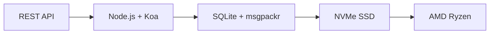

# La première API de messagerie complète : comment Forward Email a révolutionné la gestion des e-mails {#the-first-complete-email-api-how-forward-email-revolutionized-email-management}


<p class="lead mt-3">
<strong>TL;DR :</strong> Nous avons développé la première API REST complète au monde pour la gestion des e-mails, avec des fonctionnalités de recherche avancées qu'aucun autre service n'offre. Alors que Gmail, Outlook et Apple obligent les développeurs à se tourner vers l'enfer IMAP ou des API à débit limité, Forward Email offre des opérations CRUD ultra-rapides pour les messages, les dossiers, les contacts et les calendriers via une interface REST unifiée avec plus de 15 paramètres de recherche. C'est l'API de messagerie qu'attendaient les développeurs.
</p>

## Table des matières {#table-of-contents}

* [Le problème de l'API de messagerie électronique](#the-email-api-problem)
* [Ce que disent réellement les développeurs](#what-developers-are-actually-saying)
* [La solution révolutionnaire de Forward Email](#forward-emails-revolutionary-solution)
  * [Pourquoi nous avons construit ceci](#why-we-built-this)
  * [Authentification simple](#simple-authentication)
* [20 points de terminaison qui changent tout](#20-endpoints-that-change-everything)
  * [Messages (5 points de terminaison)](#messages-5-endpoints)
  * [Dossiers (5 points de terminaison)](#folders-5-endpoints)
  * [Contacts (5 points de terminaison)](#contacts-5-endpoints)
  * [Calendriers (5 points de terminaison)](#calendars-5-endpoints)
* [Recherche avancée : aucun autre service n'est comparable](#advanced-search-no-other-service-compares)
  * [Le paysage des API de recherche est brisé](#the-search-api-landscape-is-broken)
  * [L'API de recherche révolutionnaire de Forward Email](#forward-emails-revolutionary-search-api)
  * [Exemples de recherche dans le monde réel](#real-world-search-examples)
  * [Avantages en termes de performances](#performance-advantages)
  * [Des fonctionnalités de recherche que personne d'autre n'a](#search-features-no-one-else-has)
  * [Pourquoi cela est important pour les développeurs](#why-this-matters-for-developers)
  * [La mise en œuvre technique](#the-technical-implementation)
* [Architecture de performance ultra-rapide](#blazing-fast-performance-architecture)
  * [Critères de performance](#performance-benchmarks)
  * [Architecture axée sur la confidentialité](#privacy-first-architecture)
* [Pourquoi nous sommes différents : la comparaison complète](#why-were-different-the-complete-comparison)
  * [Principales limitations des fournisseurs](#major-provider-limitations)
  * [Avantages du transfert d'e-mails](#forward-email-advantages)
  * [Le problème de la transparence de l'open source](#the-open-source-transparency-problem)
* [Plus de 30 exemples d'intégration concrets](#30-real-world-integration-examples)
  * [1. Amélioration du formulaire de contact WordPress](#1-wordpress-contact-form-enhancement)
  * [2. Alternative à Zapier pour l'automatisation des e-mails](#2-zapier-alternative-for-email-automation)
  * [3. Synchronisation des e-mails CRM](#3-crm-email-synchronization)
  * [4. Traitement des commandes de commerce électronique](#4-e-commerce-order-processing)
  * [5. Intégration des tickets d'assistance](#5-support-ticket-integration)
  * [6. Système de gestion des newsletters](#6-newsletter-management-system)
  * [7. Gestion des tâches par courrier électronique](#7-email-based-task-management)
  * [8. Agrégation de courrier électronique multi-comptes](#8-multi-account-email-aggregation)
  * [9. Tableau de bord d'analyse avancée des e-mails](#9-advanced-email-analytics-dashboard)
  * [10. Archivage intelligent des e-mails](#10-smart-email-archiving)
  * [11. Intégration e-mail-calendrier](#11-email-to-calendar-integration)
  * [12. Sauvegarde et conformité des e-mails](#12-email-backup-and-compliance)
  * [13. Gestion de contenu par courrier électronique](#13-email-based-content-management)
  * [14. Gestion des modèles d'e-mails](#14-email-template-management)
  * [15. Automatisation des flux de travail par courrier électronique](#15-email-based-workflow-automation)
  * [16. Surveillance de la sécurité des e-mails](#16-email-security-monitoring)
  * [17. Collecte d'enquêtes par courrier électronique](#17-email-based-survey-collection)
  * [18. Surveillance des performances des e-mails](#18-email-performance-monitoring)
  * [19. Qualification des prospects par e-mail](#19-email-based-lead-qualification)
  * [20. Gestion de projet par courrier électronique](#20-email-based-project-management)
  * [21. Gestion des stocks par courrier électronique](#21-email-based-inventory-management)
  * [22. Traitement des factures par courrier électronique](#22-email-based-invoice-processing)
  * [23. Inscription à l'événement par e-mail](#23-email-based-event-registration)
  * [24. Flux de travail d'approbation de documents par courrier électronique](#24-email-based-document-approval-workflow)
  * [25. Analyse des commentaires des clients par courrier électronique](#25-email-based-customer-feedback-analysis)
  * [26. Pipeline de recrutement par e-mail](#26-email-based-recruitment-pipeline)
  * [27. Traitement des notes de frais par courrier électronique](#27-email-based-expense-report-processing)
  * [28. Rapports d'assurance qualité par courrier électronique](#28-email-based-quality-assurance-reporting)
  * [29. Gestion des fournisseurs par courrier électronique](#29-email-based-vendor-management)
  * [30. Surveillance des médias sociaux par courrier électronique](#30-email-based-social-media-monitoring)
* [Commencer](#getting-started)
  * [1. Créez votre compte de transfert de courrier électronique](#1-create-your-forward-email-account)
  * [2. Générer les informations d'identification de l'API](#2-generate-api-credentials)
  * [3. Effectuez votre premier appel API](#3-make-your-first-api-call)
  * [4. Explorez la documentation](#4-explore-the-documentation)
* [Ressources techniques](#technical-resources)

## Le problème de l'API de messagerie {#the-email-api-problem}

Les API de messagerie sont fondamentalement défectueuses. Point final.

Chaque grand fournisseur de messagerie électronique oblige les développeurs à faire l'un des deux choix terribles suivants :

1. **IMAP Hell** : Un protocole vieux de 30 ans conçu pour les clients de bureau, et non pour les applications modernes
2. **API paralysées** : Des API à débit limité, en lecture seule et complexes avec OAuth, incapables de gérer vos données de messagerie.

Résultat ? Soit les développeurs abandonnent complètement l'intégration des e-mails, soit ils perdent des semaines à développer des wrappers IMAP fragiles et constamment défaillants.

> \[!WARNING]
> **Le secret caché** : la plupart des « API de messagerie » ne sont que des API d'envoi. Il est impossible d'organiser des dossiers, de synchroniser des contacts ou de gérer des calendriers par programmation via une simple interface REST. Jusqu'à présent.

## Ce que disent réellement les développeurs {#what-developers-are-actually-saying}

La frustration est réelle et documentée partout :

> « J'ai récemment essayé d'intégrer Gmail à mon application, et j'y ai consacré trop de temps. J'ai décidé que la prise en charge de Gmail n'en valait pas la peine. »

> *- [Développeur de Hacker News](https://news.ycombinator.com/item?id=42106944), 147 votes positifs*

> « Les API de messagerie sont-elles toutes médiocres ? Elles semblent limitées ou restrictives d'une certaine manière. »

> *- [Discussion sur Reddit r/SaaS](https://www.reddit.com/r/SaaS/comments/1cm84s7/are_all_email_apis_mediocre/)*

> « Pourquoi le développement d'e-mails est-il forcément pénible ? »

> *- [Reddit r/webdev](https://www.reddit.com/r/webdev/comments/15trnp2/why_does_email_development_have_to_suck/), 89 commentaires de difficultés de développement*

> « Qu'est-ce qui rend l'API Gmail plus efficace qu'IMAP ? L'API Gmail est également bien plus performante car elle ne télécharge chaque message qu'une seule fois. Avec IMAP, chaque message doit être téléchargé et indexé… »
>
> *- [Question Stack Overflow](https://stackoverflow.com/questions/25431022/what-makes-the-gmail-api-more-efficient-than-imap) avec 47 votes positifs*

Les preuves sont partout :

* **Problèmes SMTP WordPress** : [631 problèmes GitHub](https://github.com/awesomemotive/WP-Mail-SMTP/issues) concernant les échecs de distribution des e-mails
* **Limites Zapier** : [Plaintes de la communauté](https://community.zapier.com/featured-articles-65/email-parser-by-zapier-limitations-and-alternatives-16958) concernant la limite de 10 e-mails/heure et les échecs de détection IMAP
* **Projets API IMAP** : [Multiple](https://github.com/ewildgoose/imap-api), [open source](https://emailengine.app/) et [projets](https://www.npmjs.com/package/imapflow) existent spécifiquement pour « convertir IMAP en REST », car aucun fournisseur ne propose cette option
* **Frustrations liées à l'API Gmail** : [Débordement de pile](https://stackoverflow.com/questions/tagged/gmail-api) a 4 847 questions étiquetées « gmail-api » avec des plaintes courantes concernant les limites de débit et la complexité

## La solution révolutionnaire de transfert d'e-mails {#forward-emails-revolutionary-solution}

**Nous sommes le premier service de messagerie à proposer des opérations CRUD complètes pour toutes les données de messagerie via une API REST unifiée.**

Il ne s'agit pas d'une simple API d'envoi. Il s'agit d'un contrôle programmatique complet sur :

* **Messages** : Créer, lire, mettre à jour, supprimer, rechercher, déplacer, signaler
* **Dossiers** : Gestion complète des dossiers IMAP via des points de terminaison REST
* **Contacts** : Stockage et synchronisation des contacts [CardDAV](https://tools.ietf.org/html/rfc6352)
* **Calendriers** : Événements et planification du calendrier [CalDAV](https://tools.ietf.org/html/rfc4791)

### Pourquoi nous avons construit ceci {#why-we-built-this}

**Le problème** : Tous les fournisseurs de messagerie traitent les e-mails comme une boîte noire. Vous pouvez envoyer des e-mails, voire les lire avec un protocole OAuth complexe, mais vous ne pouvez pas réellement gérer vos données de messagerie par programmation.

**Notre vision** : La messagerie électronique doit être aussi simple à intégrer que n'importe quelle API moderne. Pas de bibliothèques IMAP. Pas de complexité OAuth. Pas de problèmes de limitation de débit. Juste des points de terminaison REST simples et fonctionnels.

**Le résultat** : Le premier service de messagerie électronique où vous pouvez créer un client de messagerie électronique complet, une intégration CRM ou un système d'automatisation en utilisant uniquement des requêtes HTTP.

### Authentification simple {#simple-authentication}

Pas de [Complexité OAuth](https://oauth.net/2/). Pas de [mots de passe spécifiques à l'application](https://support.google.com/accounts/answer/185833). Juste vos identifiants d'alias :

```bash
curl -u "alias@yourdomain.com:password" \
  https://api.forwardemail.net/v1/messages
```

## 20 points de terminaison qui changent tout {#20-endpoints-that-change-everything}

### Messages (5 points de terminaison) {#messages-5-endpoints}

* `GET /v1/messages` - Liste des messages avec filtrage (`?folder=`, `?is_unread=`, `?is_flagged=`)
* `POST /v1/messages` - Envoi des nouveaux messages directement vers les dossiers
* `GET /v1/messages/:id` - Récupération d'un message spécifique avec métadonnées complètes
* `PUT /v1/messages/:id` - Mise à jour du message (indicateurs, dossier, statut de lecture)
* `DELETE /v1/messages/:id` - Supprimer définitivement le message

### Dossiers (5 points de terminaison) {#folders-5-endpoints}

* `GET /v1/folders` - Liste de tous les dossiers avec statut d'abonnement
* `POST /v1/folders` - Création d'un dossier avec des propriétés personnalisées
* `GET /v1/folders/:id` - Obtention des détails du dossier et du nombre de messages
* `PUT /v1/folders/:id` - Mise à jour des propriétés du dossier et de l'abonnement
* `DELETE /v1/folders/:id` - Suppression du dossier et gestion du déplacement des messages

### Contacts (5 points de terminaison) {#contacts-5-endpoints}

* `GET /v1/contacts` - Liste des contacts avec recherche et pagination
* `POST /v1/contacts` - Création d'un contact avec prise en charge complète de vCard
* `GET /v1/contacts/:id` - Récupération du contact avec tous les champs et métadonnées
* `PUT /v1/contacts/:id` - Mise à jour des informations de contact avec validation ETag
* `DELETE /v1/contacts/:id` - Suppression du contact avec gestion en cascade

### Calendriers (5 points de terminaison) {#calendars-5-endpoints}

* `GET /v1/calendars` - Liste des événements du calendrier avec filtrage par date
* `POST /v1/calendars` - Création d'un événement du calendrier avec participants et récurrence
* `GET /v1/calendars/:id` - Consultation des détails de l'événement avec gestion des fuseaux horaires
* `PUT /v1/calendars/:id` - Mise à jour de l'événement avec détection des conflits
* `DELETE /v1/calendars/:id` - Suppression d'un événement avec notifications aux participants

## Recherche avancée : aucun autre service comparable {#advanced-search-no-other-service-compares}

**Forward Email est le seul service de messagerie qui offre une recherche programmatique complète dans tous les champs de message via une API REST.**

Alors que d'autres fournisseurs proposent au mieux un filtrage basique, nous avons développé l'API de recherche d'e-mails la plus avancée jamais créée. Aucune API Gmail, Outlook ou tout autre service n'égale nos capacités de recherche.

### Le paysage de l'API de recherche est brisé {#the-search-api-landscape-is-broken}

**Limites de recherche de l'API Gmail :**

* ✅ Paramètre de base `q` uniquement
* ❌ Aucune recherche par champ
* ❌ Aucun filtrage par plage de dates
* ❌ Aucun filtrage par taille
* ❌ Aucun filtrage des pièces jointes
* ❌ Limité à la syntaxe de recherche de Gmail

**Limites de recherche de l'API Outlook :**

* ✅ Paramètre `$search` de base
* ❌ Pas de ciblage de champ avancé
* ❌ Pas de combinaisons de requêtes complexes
* ❌ Limitation de débit agressive
* ❌ Syntaxe OData complexe requise

**Apple iCloud :**

* ❌ Aucune API
* ❌ Recherche IMAP uniquement (si vous parvenez à la faire fonctionner)

**ProtonMail et Tuta :**

* ❌ Aucune API publique
* ❌ Aucune fonctionnalité de recherche programmatique

### API de recherche révolutionnaire de Forward Email {#forward-emails-revolutionary-search-api}

**Nous proposons plus de 15 paramètres de recherche qu'aucun autre service ne propose :**

| Capacité de recherche | Transférer un e-mail | API Gmail | API Outlook | Autres |
| ------------------------------ | -------------------------------------- | ------------ | ------------------ | ------ |
| **Recherche spécifique au domaine** | ✅ Objet, corps, de, à, cc, en-têtes | ❌ | ❌ | ❌ |
| **Recherche générale multi-champs** | ✅ `?search=` dans tous les champs | ✅ `q=` de base | ✅ `$search=` de base | ❌ |
| **Filtrage de plage de dates** | ✅ `?since=` & `?before=` | ❌ | ❌ | ❌ |
| **Filtrage basé sur la taille** | ✅ `?min_size=` & `?max_size=` | ❌ | ❌ | ❌ |
| **Filtrage des pièces jointes** | ✅ `?has_attachments=true/false` | ❌ | ❌ | ❌ |
| **Recherche d'en-tête** | ✅ `?headers=X-Priority` | ❌ | ❌ | ❌ |
| **Recherche d'ID de message** | ✅ `?message_id=abc123` | ❌ | ❌ | ❌ |
| **Filtres combinés** | ✅ Plusieurs paramètres avec logique ET | ❌ | ❌ | ❌ |
| **Insensible à la casse** | ✅ Toutes les recherches | ✅ | ✅ | ❌ |
| **Prise en charge de la pagination** | ✅ Fonctionne avec tous les paramètres de recherche | ✅ | ✅ | ❌ |

### Exemples de recherche dans le monde réel {#real-world-search-examples}

**Rechercher toutes les factures du dernier trimestre :**

```bash
# Forward Email - Simple and powerful
GET /v1/messages?subject=invoice&since=2024-01-01T00:00:00Z&before=2024-04-01T00:00:00Z

# Gmail API - Impossible with their limited search
# No date range filtering available

# Outlook API - Complex OData syntax, limited functionality
GET /me/messages?$search="invoice"&$filter=receivedDateTime ge 2024-01-01T00:00:00Z
```

**Rechercher des pièces jointes volumineuses provenant d'un expéditeur spécifique :**

```bash
# Forward Email - Comprehensive filtering
GET /v1/messages?from=finance@company.com&has_attachments=true&min_size=1000000

# Gmail API - Cannot filter by size or attachments programmatically
# Outlook API - No size filtering available
# Others - No APIs available
```

**Recherche multi-champs complexe :**

```bash
# Forward Email - Advanced query capabilities
GET /v1/messages?body=quarterly&from=manager&is_flagged=true&folder=Reports

# Gmail API - Limited to basic text search only
GET /gmail/v1/users/me/messages?q=quarterly

# Outlook API - Basic search without field targeting
GET /me/messages?$search="quarterly"
```

### Avantages de performance de {#performance-advantages}

**Performances de recherche d'e-mails transférés :**

* ⚡ **Temps de réponse inférieurs à 100 ms** pour les recherches complexes
* 🔍 **Optimisation des expressions régulières** avec indexation appropriée
* 📊 **Exécution de requêtes parallèles** pour les comptages et les données
* 💾 **Utilisation efficace de la mémoire** avec des requêtes simplifiées

**Problèmes de performances des concurrents :**

* 🐌 **API Gmail** : Débit limité à 250 unités de quota par utilisateur et par seconde
* 🐌 **API Outlook** : Limitation agressive avec exigences de délai complexes
* 🐌 **Autres** : Aucune API de comparaison

### Fonctionnalités de recherche que personne d'autre n'a {#search-features-no-one-else-has}

#### 1. Recherche spécifique à l'en-tête {#1-header-specific-search}

```bash
# Find messages with specific headers
GET /v1/messages?headers=X-Priority:1
GET /v1/messages?headers=X-Spam-Score
```

#### 2. Intelligence basée sur la taille {#2-size-based-intelligence}

```bash
# Find newsletter emails (typically large)
GET /v1/messages?min_size=50000&from=newsletter

# Find quick replies (typically small)
GET /v1/messages?max_size=1000&to=support
```

#### 3. Flux de travail basés sur les pièces jointes {#3-attachment-based-workflows}

```bash
# Find all documents sent to legal team
GET /v1/messages?to=legal&has_attachments=true&body=contract

# Find emails without attachments for cleanup
GET /v1/messages?has_attachments=false&before=2023-01-01T00:00:00Z
```

#### 4. Logique métier combinée {#4-combined-business-logic}

```bash
# Find urgent flagged messages from VIPs with attachments
GET /v1/messages?is_flagged=true&from=ceo&has_attachments=true&subject=urgent
```

### Pourquoi cela est important pour les développeurs {#why-this-matters-for-developers}

**Créer des applications qui étaient auparavant impossibles :**

1. **Analyse avancée des e-mails** : Analysez les modèles d'e-mails par taille, expéditeur et contenu
2. **Gestion intelligente des e-mails** : Organisation automatique selon des critères complexes
3. **Conformité et découverte** : Recherche d'e-mails spécifiques pour les exigences légales
4. **Business Intelligence** : Extrayez des informations à partir des modèles de communication par e-mail
5. **Flux de travail automatisés** : Déclenchez des actions grâce à des filtres d'e-mails sophistiqués

### L'implémentation technique {#the-technical-implementation}

Notre API de recherche utilise :

* **Optimisation des expressions régulières** avec des stratégies d'indexation appropriées
* **Exécution parallèle** pour les performances
* **Validation des entrées** pour la sécurité
* **Gestion complète des erreurs** pour la fiabilité

```javascript
// Example: Complex search implementation
const searchConditions = [];

if (ctx.query.subject) {
  searchConditions.push({
    subject: { $regex: ctx.query.subject, $options: 'i' }
  });
}

if (ctx.query.from) {
  searchConditions.push({
    $or: [
      { 'from.address': { $regex: ctx.query.from, $options: 'i' } },
      { 'from.name': { $regex: ctx.query.from, $options: 'i' } }
    ]
  });
}

// Combine with AND logic
if (searchConditions.length > 0) {
  query.$and = searchConditions;
}
```

> \[!TIP]
> **Avantage développeur** : grâce à l'API de recherche de Forward Email, vous pouvez créer des applications de messagerie qui rivalisent avec les clients de bureau en termes de fonctionnalités, tout en conservant la simplicité des API REST.

## Architecture de performances ultra-rapide {#blazing-fast-performance-architecture}

Notre pile technique est conçue pour la vitesse et la fiabilité :



### Benchmarks de performance {#performance-benchmarks}

**Pourquoi nous sommes ultra-rapides :**

| Composant | Technologie | Avantage de performance |
| ------------ | --------------------------------------------------------------------------------- | --------------------------------------------- |
| **Stockage** | [NVMe SSD](https://en.wikipedia.org/wiki/NVM_Express) | 10 fois plus rapide que le SATA traditionnel |
| **Base de données** | [SQLite](https://sqlite.org/) + [msgpackr](https://github.com/kriszyp/msgpackr) | Latence réseau nulle, sérialisation optimisée |
| **Matériel** | [AMD Ryzen](https://www.amd.com/en/products/processors/desktops/ryzen) métal nu | Aucune surcharge de virtualisation |
| **Mise en cache** | En mémoire + persistant | Temps de réponse inférieurs à la milliseconde |
| **Sauvegardes** | [Cloudflare R2](https://www.cloudflare.com/products/r2/) crypté | Fiabilité de niveau entreprise |

**Chiffres de performance réels :**

* **Temps de réponse de l'API** : < 50 ms en moyenne
* **Récupération des messages** : < 10 ms pour les messages en cache
* **Opérations sur les dossiers** : < 5 ms pour les opérations sur les métadonnées
* **Synchronisation des contacts** : Plus de 1 000 contacts/seconde
* **Disponibilité** : 99,99 % SLA avec infrastructure redondante

### Architecture axée sur la confidentialité {#privacy-first-architecture}

**Conception à connaissance nulle** : vous seul avez accès à vos e-mails grâce à votre mot de passe IMAP ; nous ne pouvons pas les lire. Notre [architecture à connaissance nulle](https://forwardemail.net/en/security) garantit une confidentialité totale tout en offrant des performances exceptionnelles.

## Pourquoi nous sommes différents : la comparaison complète {#why-were-different-the-complete-comparison}

### Principales limitations du fournisseur {#major-provider-limitations}

| Fournisseur | Problèmes fondamentaux | Limitations spécifiques |
| ---------------- | ----------------------------------------- | -------------------------------------------------------------------------------------------------------------------------------------------------------------------------------------------------------------------------------------------------------------------------------------------------------------------------------------------------------------------------------------------------------------------------------------------------------------------- |
| **API Gmail** | Lecture seule, OAuth complexe, API séparées | • [Cannot modify existing messages](https://developers.google.com/gmail/api/reference/rest/v1/users.messages)<br>• [Labels ≠ folders](https://developers.google.com/gmail/api/reference/rest/v1/users.labels)<br>• [1 billion quota units/day limit](https://developers.google.com/gmail/api/reference/quota)<br>• [Requires separate APIs](https://developers.google.com/workspace) pour les contacts/calendrier |
| **API Outlook** | Obsolète, déroutant, axé sur l'entreprise | • [REST endpoints deprecated March 2024](https://learn.microsoft.com/en-us/outlook/rest/compare-graph)<br>• [Multiple confusing APIs](https://learn.microsoft.com/en-us/office/client-developer/outlook/selecting-an-api-or-technology-for-developing-solutions-for-outlook) (EWS, Graphique, REST)<br>• [Microsoft Graph complexity](https://learn.microsoft.com/en-us/graph/overview)<br>• [Aggressive throttling](https://learn.microsoft.com/en-us/graph/throttling) |
| **Apple iCloud** | Aucune API publique | • [No public API whatsoever](https://support.apple.com/en-us/102654)<br>• [IMAP-only with 1000 emails/day limit](https://support.apple.com/en-us/102654)<br>• [App-specific passwords required](https://support.apple.com/en-us/102654)<br>• [500 recipients per message limit](https://support.apple.com/en-us/102654) |
| **ProtonMail** | Pas d'API, fausses déclarations Open Source | • [No public API available](https://proton.me/support/protonmail-bridge-clients)<br>• [Bridge software required](https://proton.me/mail/bridge) pour l'accès IMAP<br>• [Claims "open source"](https://proton.me/blog/open-source) mais [server code is proprietary](https://github.com/ProtonMail)<br>• [Limited to paid plans only](https://proton.me/pricing) |
| **Total** | Pas d'API, transparence trompeuse | • [No REST API for email management](https://tuta.com/support#technical)<br>• [Claims "open source"](https://tuta.com/blog/posts/open-source-email) mais [backend is closed](https://github.com/tutao/tutanota)<br>• [IMAP/SMTP not supported](https://tuta.com/support#imap)<br>• [Proprietary encryption](https://tuta.com/encryption) empêche les intégrations standard |
| **Courriel Zapier** | Limites de débit sévères | • [10 emails per hour limit](https://help.zapier.com/hc/en-us/articles/8496181555597-Email-Parser-by-Zapier-limitations-and-alternatives)<br>• [No IMAP folder access](https://help.zapier.com/hc/en-us/articles/8496181555597-Email-Parser-by-Zapier-limitations-and-alternatives)<br>• [Limited parsing capabilities](https://help.zapier.com/hc/en-us/articles/8496181555597-Email-Parser-by-Zapier-limitations-and-alternatives) |

### Avantages du transfert d'e-mails {#forward-email-advantages}

| Fonctionnalité | Transférer un e-mail | Concours |
| ------------------ | -------------------------------------------------------------------------------------------- | ----------------------------------------- |
| **CRUD complet** | ✅ Création, lecture, mise à jour et suppression complètes de toutes les données | ❌ Opérations en lecture seule ou limitées |
| **API unifiée** | ✅ Messages, dossiers, contacts, calendriers dans une seule API | ❌ API séparées ou fonctionnalités manquantes |
| **Authentification simple** | ✅ Authentification de base avec des informations d'identification d'alias | ❌ OAuth complexe avec plusieurs portées |
| **Aucune limite de débit** | ✅ Limites généreuses conçues pour des applications réelles | ❌ Des quotas restrictifs qui perturbent les flux de travail |
| **Auto-hébergement** | ✅ [Complete self-hosting option](https://forwardemail.net/en/blog/docs/self-hosted-solution) | ❌ Verrouillage du fournisseur uniquement |
| **Confidentialité** | ✅ Zéro connaissance, crypté, privé | ❌ Exploration de données et préoccupations en matière de confidentialité |
| **Performance** | ✅ Réponses inférieures à 50 ms, stockage NVMe | ❌ Latence du réseau, délais de limitation |

### Le problème de la transparence de l'open source {#the-open-source-transparency-problem}

**ProtonMail et Tuta se présentent comme « open source » et « transparents », mais il s'agit d'un marketing trompeur qui viole les principes modernes de confidentialité.**

> \[!WARNING]
> **Fausses déclarations de transparence** : ProtonMail et Tuta vantent tous deux haut et fort leurs atouts « open source » tout en conservant leur code côté serveur le plus critique comme propriétaire et fermé.

**La tromperie de ProtonMail :**

* **Allégations** : [« Nous sommes open source »](https://proton.me/blog/open-source) est mis en avant dans les campagnes marketing
* **Réalité** : [Le code du serveur est entièrement propriétaire](https://github.com/ProtonMail) : seules les applications clientes sont open source
* **Impact** : Les utilisateurs ne peuvent pas vérifier le chiffrement côté serveur, le traitement des données ni les déclarations de confidentialité
* **Violation de la transparence** : Impossible de vérifier les systèmes de traitement et de stockage des e-mails

**Le marketing trompeur de Tuta :**

* **Allégations** : [« Courriel open source »](https://tuta.com/blog/posts/open-source-email) comme argument de vente principal
* **Réalité** : [L'infrastructure backend est à source fermée](https://github.com/tutao/tutanota) : seul le frontend est disponible
* **Impact** : Le chiffrement propriétaire empêche l'utilisation des protocoles de messagerie standard (IMAP/SMTP)
* **Stratégie de verrouillage** : Le chiffrement personnalisé impose une dépendance vis-à-vis du fournisseur

**Pourquoi cela est important pour la confidentialité moderne :**

En 2025, une véritable confidentialité exige une transparence totale. Lorsque les fournisseurs de messagerie se revendiquent « open source » mais cachent le code de leur serveur :

1. **Chiffrement invérifiable** : Impossible de vérifier le cryptage de vos données.
2. **Pratiques de données cachées** : Le traitement des données côté serveur reste une boîte noire.
3. **Sécurité basée sur la confiance** : Vous devez faire confiance à leurs affirmations sans vérification.
4. **Lien fournisseur** : Les systèmes propriétaires empêchent la portabilité des données.

**La véritable transparence du transfert d'e-mails :**

* ✅ **[Open source complet](https://github.com/forwardemail/forwardemail.net)** - Code serveur et client
* ✅ **[Auto-hébergement disponible](https://forwardemail.net/en/blog/docs/self-hosted-solution)** - Exécutez votre propre instance
* ✅ **Protocoles standards** - Compatibilité IMAP, SMTP, CardDAV, CalDAV
* ✅ **Sécurité auditable** - Chaque ligne de code est inspectable
* ✅ **Pas de dépendance fournisseur** - Vos données, votre contrôle

> \[!TIP]
> **L'open source véritable vous permet de vérifier chaque affirmation.** Avec Forward Email, vous pouvez auditer notre chiffrement, examiner notre gestion des données et même exécuter votre propre instance. C'est la véritable transparence.

## Plus de 30 exemples d'intégration concrets {#30-real-world-integration-examples}

### 1. Amélioration du formulaire de contact WordPress {#1-wordpress-contact-form-enhancement}

**Problème** : [Échecs de configuration SMTP de WordPress](https://github.com/awesomemotive/WP-Mail-SMTP/issues) ([631 problèmes GitHub](https://github.com/awesomemotive/WP-Mail-SMTP/issues))
**Solution** : L'intégration directe de l'API contourne entièrement [SMTP](https://tools.ietf.org/html/rfc5321)

```javascript
// WordPress contact form that saves to Sent folder
await fetch('https://api.forwardemail.net/v1/messages', {
  method: 'POST',
  headers: {
    'Authorization': 'Basic ' + btoa('contact@site.com:password'),
    'Content-Type': 'application/json'
  },
  body: JSON.stringify({
    to: [{ address: 'owner@site.com' }],
    subject: 'Contact Form: ' + formData.subject,
    text: formData.message,
    folder: 'Sent'
  })
});
```

### 2. Alternative à Zapier pour l'automatisation des e-mails {#2-zapier-alternative-for-email-automation}

**Problème** : [La limite de 10 e-mails/heure de Zapier](https://help.zapier.com/hc/en-us/articles/8496181555597-Email-Parser-by-Zapier-limitations-and-alternatives) et [Échecs de détection IMAP](https://community.zapier.com/featured-articles-65/email-parser-by-zapier-limitations-and-alternatives-16958)
**Solution** : Automatisation illimitée avec contrôle total des e-mails

```javascript
// Auto-organize emails by sender domain
const messages = await fetch('/v1/messages?folder=INBOX');
for (const message of messages) {
  const domain = message.from.split('@')[1];
  await fetch(`/v1/messages/${message.id}`, {
    method: 'PUT',
    body: JSON.stringify({ folder: `Clients/${domain}` })
  });
}
```

### 3. Synchronisation des e-mails CRM {#3-crm-email-synchronization}

**Problème** : Gestion manuelle des contacts entre l'adresse e-mail et [systèmes CRM](https://en.wikipedia.org/wiki/Customer_relationship_management)
**Solution** : Synchronisation bidirectionnelle avec l'API de contact [CardDAV](https://tools.ietf.org/html/rfc6352)

```javascript
// Sync new email contacts to CRM
const newContacts = await fetch('/v1/contacts');
for (const contact of newContacts) {
  await crmAPI.createContact({
    name: contact.name,
    email: contact.email,
    source: 'email_api'
  });
}
```

### 4. Traitement des commandes de commerce électronique {#4-e-commerce-order-processing}

**Problème** : Traitement manuel des e-mails de commande pour [plateformes de commerce électronique](https://en.wikipedia.org/wiki/E-commerce)
**Solution** : Pipeline de gestion automatisée des commandes

```javascript
// Process order confirmation emails
const orders = await fetch('/v1/messages?folder=Orders');
const orderEmails = orders.filter(msg =>
  msg.subject.includes('Order Confirmation')
);

for (const order of orderEmails) {
  const orderData = parseOrderEmail(order.text);
  await updateInventory(orderData);
  await fetch(`/v1/messages/${order.id}`, {
    method: 'PUT',
    body: JSON.stringify({ folder: 'Orders/Processed' })
  });
}
```

### 5. Intégration des tickets d'assistance {#5-support-ticket-integration}

**Problème** : Fils de discussion dispersés sur [plateformes d'assistance](https://en.wikipedia.org/wiki/Help_desk_software)
**Solution** : Suivi complet des fils de discussion

```javascript
// Create support ticket from email thread
const messages = await fetch('/v1/messages?folder=Support');
const supportEmails = messages.filter(msg =>
  msg.to.some(addr => addr.includes('support@'))
);

for (const email of supportEmails) {
  const ticket = await supportSystem.createTicket({
    subject: email.subject,
    from: email.from,
    body: email.text,
    timestamp: email.date
  });
}
```

### 6. Système de gestion des newsletters {#6-newsletter-management-system}

**Problème** : Intégrations limitées de [plateforme de newsletter](https://en.wikipedia.org/wiki/Email_marketing)
**Solution** : Gestion complète du cycle de vie des abonnés

```javascript
// Auto-manage newsletter subscriptions
const messages = await fetch('/v1/messages?folder=Newsletter');
const unsubscribes = messages.filter(msg =>
  msg.subject.toLowerCase().includes('unsubscribe')
);

for (const msg of unsubscribes) {
  await removeSubscriber(msg.from);
  await fetch(`/v1/messages/${msg.id}`, {
    method: 'PUT',
    body: JSON.stringify({ folder: 'Newsletter/Unsubscribed' })
  });
}
```

### 7. Gestion des tâches par e-mail {#7-email-based-task-management}

**Problème** : Boîte de réception surchargée et [suivi des tâches](https://en.wikipedia.org/wiki/Task_management)
**Solution** : Convertir les e-mails en tâches exploitables

```javascript
// Create tasks from flagged emails
const messages = await fetch('/v1/messages?is_flagged=true');
for (const email of messages) {
  await taskManager.createTask({
    title: email.subject,
    description: email.text,
    assignee: email.to[0].address,
    dueDate: extractDueDate(email.text)
  });
}
```

### 8. Agrégation de courrier électronique multi-comptes {#8-multi-account-email-aggregation}

**Problème** : Gestion de [plusieurs comptes de messagerie](https://en.wikipedia.org/wiki/Email_client) entre les fournisseurs
**Solution** : Interface de boîte de réception unifiée

```javascript
// Aggregate emails from multiple accounts
const accounts = ['work@domain.com', 'personal@domain.com'];
const allMessages = [];

for (const account of accounts) {
  const messages = await fetch('/v1/messages', {
    headers: { 'Authorization': getAuth(account) }
  });
  allMessages.push(...messages.map(m => ({ ...m, account })));
}
```

### 9. Tableau de bord d'analyse avancée des e-mails {#9-advanced-email-analytics-dashboard}

**Problème** : Aucune information sur [modèles de courrier électronique](https://en.wikipedia.org/wiki/Email_analytics) avec un filtrage sophistiqué
**Solution** : Analyse personnalisée des e-mails grâce à des fonctionnalités de recherche avancées

```javascript
// Generate comprehensive email analytics using advanced search
const analytics = {};

// Analyze email volume by sender domain
const messages = await fetch('/v1/messages');
analytics.senderDomains = analyzeSenderDomains(messages);

// Find large attachments consuming storage
const largeAttachments = await fetch('/v1/messages?has_attachments=true&min_size=1000000');
analytics.storageHogs = largeAttachments.map(msg => ({
  subject: msg.subject,
  from: msg.from,
  size: msg.size
}));

// Analyze communication patterns with VIPs
const vipEmails = await fetch('/v1/messages?from=ceo@company.com');
const urgentVipEmails = await fetch('/v1/messages?from=ceo@company.com&subject=urgent');
analytics.vipCommunication = {
  total: vipEmails.length,
  urgent: urgentVipEmails.length,
  urgencyRate: (urgentVipEmails.length / vipEmails.length) * 100
};

// Find unread emails by date range for follow-up
const lastWeek = new Date(Date.now() - 7 * 24 * 60 * 60 * 1000).toISOString();
const unreadRecent = await fetch(`/v1/messages?is_unread=true&since=${lastWeek}`);
analytics.followUpNeeded = unreadRecent.length;

// Analyze email sizes for optimization
const smallEmails = await fetch('/v1/messages?max_size=1000');
const mediumEmails = await fetch('/v1/messages?min_size=1000&max_size=50000');
const largeEmails = await fetch('/v1/messages?min_size=50000');
analytics.sizeDistribution = {
  small: smallEmails.length,
  medium: mediumEmails.length,
  large: largeEmails.length
};

// Search for compliance-related emails
const complianceEmails = await fetch('/v1/messages?body=confidential&has_attachments=true');
analytics.complianceReview = complianceEmails.length;
```

### 10. Archivage intelligent des e-mails {#10-smart-email-archiving}

**Problème** : Manuel [organisation du courrier électronique](https://en.wikipedia.org/wiki/Email_management)
**Solution** : Catégorisation intelligente des e-mails

```javascript
// Auto-archive old emails by category
const messages = await fetch('/v1/messages');
const oldEmails = messages.filter(email =>
  isOlderThan(email.date, 90) // 90 days
);

for (const email of oldEmails) {
  const category = categorizeEmail(email);
  await fetch(`/v1/messages/${email.id}`, {
    method: 'PUT',
    body: JSON.stringify({ folder: `Archive/${category}` })
  });
}
```

### 11. Intégration e-mail-calendrier {#11-email-to-calendar-integration}

**Problème** : Création manuelle de [événement du calendrier](https://tools.ietf.org/html/rfc4791) à partir des e-mails
**Solution** : Extraction et création automatiques d'événements

```javascript
// Extract meeting details from emails
const messages = await fetch('/v1/messages?folder=Meetings');
const meetingEmails = messages.filter(email =>
  email.subject.toLowerCase().includes('meeting')
);

for (const email of meetingEmails) {
  const meetingData = extractMeetingInfo(email.text);
  if (meetingData.date && meetingData.time) {
    await fetch('/v1/calendars', {
      method: 'POST',
      body: JSON.stringify({
        title: email.subject,
        start: meetingData.datetime,
        attendees: [email.from, ...email.to]
      })
    });
  }
}
```

### 12. Sauvegarde et conformité des e-mails {#12-email-backup-and-compliance}

**Problème** : [Conservation des e-mails](https://en.wikipedia.org/wiki/Email_retention_policy) et exigences de conformité
**Solution** : Sauvegarde automatique avec conservation des métadonnées

```javascript
// Backup emails with full metadata
const allMessages = await fetch('/v1/messages');
const backup = {
  timestamp: new Date(),
  messages: allMessages.map(msg => ({
    id: msg.id,
    subject: msg.subject,
    from: msg.from,
    to: msg.to,
    date: msg.date,
    flags: msg.flags
  }))
};
await saveToComplianceStorage(backup);
```

### 13. Gestion de contenu par e-mail {#13-email-based-content-management}

**Problème** : Gestion des soumissions de contenu par e-mail pour [Plateformes CMS](https://en.wikipedia.org/wiki/Content_management_system)
**Solution** : E-mail comme système de gestion de contenu

```javascript
// Process content submissions from email
const messages = await fetch('/v1/messages?folder=Submissions');
const submissions = messages.filter(msg =>
  msg.to.some(addr => addr.includes('submit@'))
);

for (const submission of submissions) {
  const content = parseSubmission(submission.text);
  await cms.createDraft({
    title: submission.subject,
    content: content.body,
    author: submission.from
  });
}
```

### 14. Gestion des modèles d'e-mails {#14-email-template-management}

**Problème** : [modèles d'e-mails](https://en.wikipedia.org/wiki/Email_template) incohérent au sein de l'équipe
**Solution** : Système de modèles centralisé avec API

```javascript
// Send templated emails with dynamic content
const template = await getEmailTemplate('welcome');
await fetch('/v1/messages', {
  method: 'POST',
  body: JSON.stringify({
    to: [{ address: newUser.email }],
    subject: template.subject.replace('{{name}}', newUser.name),
    html: template.html.replace('{{name}}', newUser.name),
    folder: 'Sent'
  })
});
```

### 15. Automatisation du flux de travail par e-mail {#15-email-based-workflow-automation}

**Problème** : [processus d'approbation](https://en.wikipedia.org/wiki/Workflow) manuel par e-mail
**Solution** : Déclencheurs de workflow automatisés

```javascript
// Process approval emails
const messages = await fetch('/v1/messages?folder=Approvals');
const approvals = messages.filter(msg =>
  msg.subject.includes('APPROVAL')
);

for (const approval of approvals) {
  const decision = parseApprovalDecision(approval.text);
  await workflow.processApproval({
    requestId: extractRequestId(approval.subject),
    decision: decision,
    approver: approval.from
  });
}
```

### 16. Surveillance de la sécurité des e-mails {#16-email-security-monitoring}

**Problème** : [détection des menaces de sécurité](https://en.wikipedia.org/wiki/Email_security) manuel
**Solution** : Analyse automatisée des menaces

```javascript
// Monitor for suspicious emails
const recentEmails = await fetch('/v1/messages');
for (const email of recentEmails) {
  const threatScore = analyzeThreat(email);
  if (threatScore > 0.8) {
    await fetch(`/v1/messages/${email.id}`, {
      method: 'PUT',
      body: JSON.stringify({ folder: 'Security/Quarantine' })
    });
    await alertSecurityTeam(email);
  }
}
```

### 17. Collecte d'enquêtes par courrier électronique {#17-email-based-survey-collection}

**Problème** : Traitement manuel de [réponse à l'enquête](https://en.wikipedia.org/wiki/Survey_methodology)
**Solution** : Agrégation automatique des réponses

```javascript
// Collect and process survey responses
const messages = await fetch('/v1/messages?folder=Surveys');
const responses = messages.filter(msg =>
  msg.subject.includes('Survey Response')
);

const surveyData = responses.map(email => ({
  respondent: email.from,
  responses: parseSurveyData(email.text),
  timestamp: email.date
}));
await updateSurveyResults(surveyData);
```

### 18. Surveillance des performances des e-mails {#18-email-performance-monitoring}

**Problème** : Aucune visibilité sur [performances de livraison des e-mails](https://en.wikipedia.org/wiki/Email_deliverability)
**Solution** : Mesures des e-mails en temps réel

```javascript
// Monitor email delivery performance
const sentEmails = await fetch('/v1/messages?folder=Sent');
const deliveryStats = {
  sent: sentEmails.length,
  bounces: await countBounces(),
  deliveryRate: calculateDeliveryRate()
};
await updateDashboard(deliveryStats);
```

### 19. Qualification des prospects par e-mail {#19-email-based-lead-qualification}

**Problème** : [notation des prospects](https://en.wikipedia.org/wiki/Lead_scoring) manuel à partir des interactions par e-mail
**Solution** : Pipeline de qualification automatisé des prospects

```javascript
// Score leads based on email engagement
const prospects = await fetch('/v1/contacts');
for (const prospect of prospects) {
  const messages = await fetch('/v1/messages');
  const emails = messages.filter(msg =>
    msg.from.includes(prospect.email)
  );
  const score = calculateEngagementScore(emails);
  await crm.updateLeadScore(prospect.id, score);
}
```

### 20. Gestion de projet par e-mail {#20-email-based-project-management}

**Problème** : [Mises à jour du projet](https://en.wikipedia.org/wiki/Project_management) dispersé dans les fils de discussion
**Solution** : Plateforme de communication de projet centralisée

```javascript
// Extract project updates from emails
const messages = await fetch('/v1/messages?folder=Projects');
const projectEmails = messages.filter(msg =>
  msg.subject.includes('Project Update')
);

for (const email of projectEmails) {
  const update = parseProjectUpdate(email.text);
  await projectManager.addUpdate({
    project: update.projectId,
    author: email.from,
    content: update.content
  });
}
```

### 21. Gestion des stocks par e-mail {#21-email-based-inventory-management}

**Problème** : Mises à jour manuelles des stocks à partir des e-mails des fournisseurs
**Solution** : Suivi automatisé des stocks à partir des notifications par e-mail

```javascript
// Process inventory updates from supplier emails
const messages = await fetch('/v1/messages?folder=Suppliers');
const inventoryEmails = messages.filter(msg =>
  msg.subject.includes('Inventory Update') || msg.subject.includes('Stock Alert')
);

for (const email of inventoryEmails) {
  const inventoryData = parseInventoryUpdate(email.text);
  await inventory.updateStock({
    sku: inventoryData.sku,
    quantity: inventoryData.quantity,
    supplier: email.from,
    timestamp: email.date
  });

  // Move to processed folder
  await fetch(`/v1/messages/${email.id}`, {
    method: 'PUT',
    body: JSON.stringify({ folder: 'Suppliers/Processed' })
  });
}
```

### 22. Traitement des factures par e-mail {#22-email-based-invoice-processing}

**Problème** : [traitement des factures](https://en.wikipedia.org/wiki/Invoice_processing) manuel et intégration comptable
**Solution** : Extraction automatique des factures et synchronisation du système comptable

```javascript
// Extract invoice data from email attachments
const messages = await fetch('/v1/messages?folder=Invoices');
const invoiceEmails = messages.filter(msg =>
  msg.subject.toLowerCase().includes('invoice') && msg.attachments.length > 0
);

for (const email of invoiceEmails) {
  const invoiceData = await extractInvoiceData(email.attachments[0]);
  await accounting.createInvoice({
    vendor: email.from,
    amount: invoiceData.total,
    dueDate: invoiceData.dueDate,
    items: invoiceData.lineItems
  });

  // Flag as processed
  await fetch(`/v1/messages/${email.id}`, {
    method: 'PUT',
    body: JSON.stringify({ flags: ['\\Seen', '\\Flagged'] })
  });
}
```

### 23. Inscription à un événement par e-mail {#23-email-based-event-registration}

**Problème** : Traitement manuel de [inscription à l'événement](https://en.wikipedia.org/wiki/Event_management) à partir des réponses par e-mail
**Solution** : Gestion automatisée des participants et intégration du calendrier

```javascript
// Process event registration emails
const messages = await fetch('/v1/messages?folder=Events');
const registrations = messages.filter(msg =>
  msg.subject.includes('Registration') || msg.subject.includes('RSVP')
);

for (const registration of registrations) {
  const attendeeData = parseRegistration(registration.text);

  // Add to attendee list
  await events.addAttendee({
    event: attendeeData.eventId,
    name: attendeeData.name,
    email: registration.from,
    dietary: attendeeData.dietaryRestrictions
  });

  // Create calendar event for attendee
  await fetch('/v1/calendars', {
    method: 'POST',
    body: JSON.stringify({
      title: attendeeData.eventName,
      start: attendeeData.eventDate,
      attendees: [registration.from]
    })
  });
}
```

### 24. Flux de travail d'approbation de documents par courrier électronique {#24-email-based-document-approval-workflow}

**Problème** : Chaînes [approbation des documents](https://en.wikipedia.org/wiki/Document_management_system) complexes par e-mail
**Solution** : Suivi automatisé des approbations et gestion des versions des documents

```javascript
// Track document approval workflow
const messages = await fetch('/v1/messages?folder=Approvals');
const approvalEmails = messages.filter(msg =>
  msg.subject.includes('Document Approval')
);

for (const email of approvalEmails) {
  const approval = parseApprovalEmail(email.text);

  await documentSystem.updateApproval({
    documentId: approval.documentId,
    approver: email.from,
    status: approval.decision, // 'approved', 'rejected', 'needs_changes'
    comments: approval.comments,
    timestamp: email.date
  });

  // Check if all approvals complete
  const document = await documentSystem.getDocument(approval.documentId);
  if (document.allApprovalsComplete) {
    await documentSystem.finalizeDocument(approval.documentId);
  }
}
```

### 25. Analyse des commentaires des clients par e-mail {#25-email-based-customer-feedback-analysis}

**Problème** : Collecte manuelle des données [commentaires des clients](https://en.wikipedia.org/wiki/Customer_feedback) et analyse des sentiments
**Solution** : Traitement automatisé des commentaires et suivi des sentiments

```javascript
// Analyze customer feedback from emails
const messages = await fetch('/v1/messages?folder=Feedback');
const feedbackEmails = messages.filter(msg =>
  msg.to.some(addr => addr.includes('feedback@'))
);

for (const email of feedbackEmails) {
  const sentiment = await analyzeSentiment(email.text);
  const category = categorizeFeeback(email.text);

  await feedback.recordFeedback({
    customer: email.from,
    content: email.text,
    sentiment: sentiment.score, // -1 to 1
    category: category, // 'bug', 'feature', 'complaint', 'praise'
    priority: calculatePriority(sentiment, category),
    timestamp: email.date
  });

  // Auto-escalate negative feedback
  if (sentiment.score < -0.5) {
    await escalateToSupport(email);
  }
}
```

### 26. Pipeline de recrutement par e-mail {#26-email-based-recruitment-pipeline}

**Problème** : [recrutement](https://en.wikipedia.org/wiki/Recruitment) manuel et suivi des candidats
**Solution** : Gestion automatisée des candidats et planification des entretiens

```javascript
// Process job application emails
const messages = await fetch('/v1/messages?folder=Careers');
const applications = messages.filter(msg =>
  msg.subject.toLowerCase().includes('application') && msg.attachments.length > 0
);

for (const application of applications) {
  const resume = await parseResume(application.attachments[0]);

  const candidate = await ats.createCandidate({
    name: resume.name,
    email: application.from,
    skills: resume.skills,
    experience: resume.experience,
    position: extractPosition(application.subject)
  });

  // Auto-schedule screening if qualified
  if (candidate.qualificationScore > 0.7) {
    await calendar.scheduleInterview({
      candidateId: candidate.id,
      type: 'phone_screening',
      duration: 30
    });
  }
}
```

### 27. Traitement des notes de frais par courrier électronique {#27-email-based-expense-report-processing}

**Problème** : Soumission et approbation manuelles de [rapport de dépenses](https://en.wikipedia.org/wiki/Expense_report)
**Solution** : Extraction et approbation automatisées des dépenses

```javascript
// Process expense report emails
const messages = await fetch('/v1/messages?folder=Expenses');
const expenseEmails = messages.filter(msg =>
  msg.subject.includes('Expense') && msg.attachments.length > 0
);

for (const email of expenseEmails) {
  const receipts = await processReceipts(email.attachments);

  const expenseReport = await expenses.createReport({
    employee: email.from,
    expenses: receipts.map(receipt => ({
      amount: receipt.total,
      category: receipt.category,
      date: receipt.date,
      merchant: receipt.merchant
    })),
    totalAmount: receipts.reduce((sum, r) => sum + r.total, 0)
  });

  // Auto-approve small amounts
  if (expenseReport.totalAmount < 100) {
    await expenses.approve(expenseReport.id);
  } else {
    await expenses.sendForApproval(expenseReport.id);
  }
}
```

### 28. Rapports d'assurance qualité par e-mail {#28-email-based-quality-assurance-reporting}

**Problème** : Suivi manuel des problèmes [assurance qualité](https://en.wikipedia.org/wiki/Quality_assurance)
**Solution** : Gestion automatisée des problèmes d'assurance qualité et suivi des bugs

```javascript
// Process QA bug reports from email
const messages = await fetch('/v1/messages?folder=QA');
const bugReports = messages.filter(msg =>
  msg.subject.includes('Bug Report') || msg.subject.includes('QA Issue')
);

for (const report of bugReports) {
  const bugData = parseBugReport(report.text);

  const ticket = await bugTracker.createIssue({
    title: report.subject,
    description: bugData.description,
    severity: bugData.severity,
    steps: bugData.stepsToReproduce,
    reporter: report.from,
    attachments: report.attachments
  });

  // Auto-assign based on component
  const assignee = await getComponentOwner(bugData.component);
  await bugTracker.assign(ticket.id, assignee);

  // Create calendar reminder for follow-up
  await fetch('/v1/calendars', {
    method: 'POST',
    body: JSON.stringify({
      title: `Follow up on ${ticket.id}`,
      start: addDays(new Date(), 3),
      attendees: [assignee]
    })
  });
}
```

### 29. Gestion des fournisseurs par e-mail {#29-email-based-vendor-management}

**Problème** : [communication avec les fournisseurs](https://en.wikipedia.org/wiki/Vendor_management) manuel et suivi des contrats
**Solution** : Gestion automatisée des relations fournisseurs

```javascript
// Track vendor communications and contracts
const messages = await fetch('/v1/messages?folder=Vendors');
const vendorEmails = messages.filter(msg =>
  isVendorEmail(msg.from)
);

for (const email of vendorEmails) {
  const vendor = await vendors.getByEmail(email.from);

  // Log communication
  await vendors.logCommunication({
    vendorId: vendor.id,
    type: 'email',
    subject: email.subject,
    content: email.text,
    timestamp: email.date
  });

  // Check for contract-related keywords
  if (email.text.includes('contract') || email.text.includes('renewal')) {
    await vendors.flagForContractReview({
      vendorId: vendor.id,
      emailId: email.id,
      priority: 'high'
    });

    // Create task for procurement team
    await tasks.create({
      title: `Review contract communication from ${vendor.name}`,
      assignee: 'procurement@company.com',
      dueDate: addDays(new Date(), 2)
    });
  }
}
```

### 30. Surveillance des médias sociaux par e-mail {#30-email-based-social-media-monitoring}

**Problème** : Suivi manuel des mentions [réseaux sociaux](https://en.wikipedia.org/wiki/Social_media_monitoring) et réponse
**Solution** : Traitement automatisé des alertes sur les réseaux sociaux et coordination des réponses

```javascript
// Process social media alerts from email notifications
const messages = await fetch('/v1/messages?folder=Social');
const socialAlerts = messages.filter(msg =>
  msg.from.includes('alerts@') || msg.subject.includes('Social Mention')
);

for (const alert of socialAlerts) {
  const mention = parseSocialMention(alert.text);

  await socialMedia.recordMention({
    platform: mention.platform,
    author: mention.author,
    content: mention.content,
    sentiment: mention.sentiment,
    reach: mention.followerCount,
    url: mention.url
  });

  // Auto-escalate negative mentions with high reach
  if (mention.sentiment < -0.5 && mention.followerCount > 10000) {
    await socialMedia.escalateToTeam({
      mentionId: mention.id,
      priority: 'urgent',
      assignee: 'social-media-manager@company.com'
    });

    // Create calendar reminder for immediate response
    await fetch('/v1/calendars', {
      method: 'POST',
      body: JSON.stringify({
        title: `Urgent: Respond to negative social mention`,
        start: addMinutes(new Date(), 30),
        attendees: ['social-media-manager@company.com']
      })
    });
  }
}
```

## Mise en route {#getting-started}

### 1. Créez votre compte de transfert de courrier électronique {#1-create-your-forward-email-account}

Inscrivez-vous sur [forwardemail.net](https://forwardemail.net) et vérifiez votre domaine.

### 2. Générer les informations d'identification de l'API {#2-generate-api-credentials}

Votre e-mail d'alias et votre mot de passe servent d'identifiants API - aucune configuration supplémentaire n'est requise.

### 3. Effectuez votre premier appel API {#3-make-your-first-api-call}

```bash
# List your messages
curl -u "your-alias@domain.com:password" \
  https://api.forwardemail.net/v1/messages

# Create a new contact
curl -u "your-alias@domain.com:password" \
  -X POST \
  -H "Content-Type: application/json" \
  -d '{"fullName":"John Doe","emails":[{"value":"john@example.com"}]}' \
  https://api.forwardemail.net/v1/contacts
```

### 4. Explorez la documentation {#4-explore-the-documentation}

Visitez [forwardemail.net/en/email-api](https://forwardemail.net/en/email-api) pour une documentation API complète avec des exemples interactifs.

## Ressources techniques {#technical-resources}

* **[Documentation complète de l'API](https://forwardemail.net/en/email-api)** - Spécification OpenAPI 3.0 interactive
* **[Guide d'auto-hébergement](https://forwardemail.net/en/blog/docs/self-hosted-solution)** - Déploiement de Forward Email sur votre infrastructure
* **[Livre blanc sur la sécurité](https://forwardemail.net/technical-whitepaper.pdf)** - Architecture technique et détails de sécurité
* **[Dépôt GitHub](https://github.com/forwardemail/forwardemail.net)** - Code source ouvert
* **[Assistance aux développeurs](mailto:api@forwardemail.net)** - Accès direct à notre équipe d'ingénierie

---

**Prêt à révolutionner votre intégration de messagerie ?** [Commencez à créer avec l'API de Forward Email dès aujourd'hui](https://forwardemail.net/en/email-api) et découvrez la première plateforme complète de gestion de messagerie conçue pour les développeurs.

*Forward Email : Le service de messagerie qui maîtrise enfin les API.*