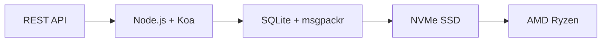

# La première API email complète : comment Forward Email a révolutionné la gestion des emails {#the-first-complete-email-api-how-forward-email-revolutionized-email-management}


<p class="lead mt-3">
  <strong>En bref :</strong> Nous avons créé la toute première API REST complète au monde pour la gestion des emails avec des capacités de recherche avancées qu’aucun autre service n’offre. Alors que Gmail, Outlook et Apple contraignent les développeurs à l’enfer IMAP ou à des API limitées en taux, Forward Email propose des opérations CRUD ultra-rapides pour les messages, dossiers, contacts et calendriers via une interface REST unifiée avec plus de 15 paramètres de recherche. C’est l’API email que les développeurs attendaient.
</p>


## Table des matières {#table-of-contents}

* [Le problème de l’API email](#the-email-api-problem)
* [Ce que disent réellement les développeurs](#what-developers-are-actually-saying)
* [La solution révolutionnaire de Forward Email](#forward-emails-revolutionary-solution)
  * [Pourquoi nous l’avons construite](#why-we-built-this)
  * [Authentification simple](#simple-authentication)
* [20 points de terminaison qui changent tout](#20-endpoints-that-change-everything)
  * [Messages (5 points de terminaison)](#messages-5-endpoints)
  * [Dossiers (5 points de terminaison)](#folders-5-endpoints)
  * [Contacts (5 points de terminaison)](#contacts-5-endpoints)
  * [Calendriers (5 points de terminaison)](#calendars-5-endpoints)
* [Recherche avancée : aucun autre service ne rivalise](#advanced-search-no-other-service-compares)
  * [Le paysage des API de recherche est cassé](#the-search-api-landscape-is-broken)
  * [L’API de recherche révolutionnaire de Forward Email](#forward-emails-revolutionary-search-api)
  * [Exemples de recherche en conditions réelles](#real-world-search-examples)
  * [Avantages en termes de performance](#performance-advantages)
  * [Fonctionnalités de recherche uniques](#search-features-no-one-else-has)
  * [Pourquoi c’est important pour les développeurs](#why-this-matters-for-developers)
  * [La mise en œuvre technique](#the-technical-implementation)
* [Architecture ultra-rapide](#blazing-fast-performance-architecture)
  * [Tests de performance](#performance-benchmarks)
  * [Architecture axée sur la confidentialité](#privacy-first-architecture)
* [Pourquoi nous sommes différents : la comparaison complète](#why-were-different-the-complete-comparison)
  * [Limitations majeures des fournisseurs](#major-provider-limitations)
  * [Avantages de Forward Email](#forward-email-advantages)
  * [Le problème de transparence de l’open source](#the-open-source-transparency-problem)
* [Plus de 30 exemples d’intégration en conditions réelles](#30-real-world-integration-examples)
  * [1. Amélioration du formulaire de contact WordPress](#1-wordpress-contact-form-enhancement)
  * [2. Alternative à Zapier pour l’automatisation des emails](#2-zapier-alternative-for-email-automation)
  * [3. Synchronisation CRM des emails](#3-crm-email-synchronization)
  * [4. Traitement des commandes e-commerce](#4-e-commerce-order-processing)
  * [5. Intégration des tickets de support](#5-support-ticket-integration)
  * [6. Système de gestion de newsletters](#6-newsletter-management-system)
  * [7. Gestion des tâches par email](#7-email-based-task-management)
  * [8. Agrégation multi-comptes email](#8-multi-account-email-aggregation)
  * [9. Tableau de bord avancé d’analytique email](#9-advanced-email-analytics-dashboard)
  * [10. Archivage intelligent des emails](#10-smart-email-archiving)
  * [11. Intégration email-calendrier](#11-email-to-calendar-integration)
  * [12. Sauvegarde et conformité des emails](#12-email-backup-and-compliance)
  * [13. Gestion de contenu basée sur les emails](#13-email-based-content-management)
  * [14. Gestion des modèles d’email](#14-email-template-management)
  * [15. Automatisation des workflows par email](#15-email-based-workflow-automation)
  * [16. Surveillance de la sécurité des emails](#16-email-security-monitoring)
  * [17. Collecte d’enquêtes par email](#17-email-based-survey-collection)
  * [18. Surveillance de la performance des emails](#18-email-performance-monitoring)
  * [19. Qualification des leads par email](#19-email-based-lead-qualification)
  * [20. Gestion de projet par email](#20-email-based-project-management)
  * [21. Gestion des stocks par email](#21-email-based-inventory-management)
  * [22. Traitement des factures par email](#22-email-based-invoice-processing)
  * [23. Inscription aux événements par email](#23-email-based-event-registration)
  * [24. Workflow d’approbation de documents par email](#24-email-based-document-approval-workflow)
  * [25. Analyse des retours clients par email](#25-email-based-customer-feedback-analysis)
  * [26. Pipeline de recrutement par email](#26-email-based-recruitment-pipeline)
  * [27. Traitement des notes de frais par email](#27-email-based-expense-report-processing)
  * [28. Rapport d’assurance qualité par email](#28-email-based-quality-assurance-reporting)
  * [29. Gestion des fournisseurs par email](#29-email-based-vendor-management)
  * [30. Surveillance des réseaux sociaux par email](#30-email-based-social-media-monitoring)
* [Commencer](#getting-started)
  * [1. Créez votre compte Forward Email](#1-create-your-forward-email-account)
  * [2. Générez vos identifiants API](#2-generate-api-credentials)
  * [3. Effectuez votre premier appel API](#3-make-your-first-api-call)
  * [4. Explorez la documentation](#4-explore-the-documentation)
* [Ressources techniques](#technical-resources)
## Le Problème des API Email {#the-email-api-problem}

Les API email sont fondamentalement défaillantes. Point final.

Chaque fournisseur majeur d’email force les développeurs à choisir entre deux mauvaises options :

1. **L’enfer IMAP** : Se débattre avec un protocole vieux de 30 ans conçu pour des clients de bureau, pas pour des applications modernes
2. **API limitées** : API en lecture seule, avec des limites de taux et une complexité OAuth qui ne peuvent pas gérer vos données email réelles

Le résultat ? Les développeurs abandonnent soit complètement l’intégration email, soit passent des semaines à construire des wrappers IMAP fragiles qui cassent constamment.

> \[!WARNING]
> **Le Secret Sale** : La plupart des « API email » sont juste des API d’envoi. Vous ne pouvez pas organiser les dossiers, synchroniser les contacts ou gérer les calendriers de manière programmatique via une simple interface REST. Jusqu’à maintenant.


## Ce Que Disent Réellement les Développeurs {#what-developers-are-actually-saying}

La frustration est réelle et documentée partout :

> « J’ai récemment essayé d’intégrer Gmail dans mon application, et j’y ai passé trop de temps. J’ai décidé que ça ne valait pas la peine de supporter Gmail. »
>
> *- [Développeur Hacker News](https://news.ycombinator.com/item?id=42106944), 147 votes positifs*

> « Est-ce que toutes les API email sont médiocres ? Elles semblent limitées ou restrictives d’une manière ou d’une autre. »
>
> *- [Discussion Reddit r/SaaS](https://www.reddit.com/r/SaaS/comments/1cm84s7/are_all_email_apis_mediocre/)*

> « Pourquoi le développement email doit-il être aussi pénible ? »
>
> *- [Reddit r/webdev](https://www.reddit.com/r/webdev/comments/15trnp2/why_does_email_development_have_to_suck/), 89 commentaires exprimant la douleur des développeurs*

> « Qu’est-ce qui rend l’API Gmail plus efficace que IMAP ? Une autre raison pour laquelle l’API Gmail est beaucoup plus efficace est qu’elle n’a besoin de télécharger chaque message qu’une seule fois. Avec IMAP, chaque message doit être téléchargé et indexé... »
>
> *- [Question Stack Overflow](https://stackoverflow.com/questions/25431022/what-makes-the-gmail-api-more-efficient-than-imap) avec 47 votes positifs*

Les preuves sont partout :

* **Problèmes SMTP WordPress** : [631 issues GitHub](https://github.com/awesomemotive/WP-Mail-SMTP/issues) concernant des échecs de livraison d’emails
* **Limitations Zapier** : [Plaintes de la communauté](https://community.zapier.com/featured-articles-65/email-parser-by-zapier-limitations-and-alternatives-16958) sur les limites de 10 emails/heure et les échecs de détection IMAP
* **Projets API IMAP** : [Plusieurs](https://github.com/ewildgoose/imap-api) [projets open-source](https://emailengine.app/) [existent](https://www.npmjs.com/package/imapflow) spécifiquement pour « convertir IMAP en REST » car aucun fournisseur ne propose cela
* **Frustrations API Gmail** : [Stack Overflow](https://stackoverflow.com/questions/tagged/gmail-api) compte 4 847 questions taguées « gmail-api » avec des plaintes courantes sur les limites de taux et la complexité


## La Solution Révolutionnaire de Forward Email {#forward-emails-revolutionary-solution}

**Nous sommes le premier service email à offrir des opérations CRUD complètes pour toutes les données email via une API REST unifiée.**

Ce n’est pas juste une autre API d’envoi. C’est un contrôle programmatique complet sur :

* **Messages** : Créer, lire, mettre à jour, supprimer, rechercher, déplacer, marquer
* **Dossiers** : Gestion complète des dossiers IMAP via des endpoints REST
* **Contacts** : Stockage et synchronisation des contacts [CardDAV](https://tools.ietf.org/html/rfc6352)
* **Calendriers** : Événements et planification de calendriers [CalDAV](https://tools.ietf.org/html/rfc4791)

### Pourquoi Nous Avons Construit Cela {#why-we-built-this}

**Le Problème** : Chaque fournisseur email traite l’email comme une boîte noire. Vous pouvez envoyer des emails, peut-être les lire avec un OAuth complexe, mais vous ne pouvez pas vraiment *gérer* vos données email de manière programmatique.

**Notre Vision** : L’email devrait être aussi facile à intégrer que n’importe quelle API moderne. Pas de bibliothèques IMAP. Pas de complexité OAuth. Pas de cauchemars de limites de taux. Juste des endpoints REST simples qui fonctionnent.

**Le Résultat** : Le premier service email où vous pouvez construire un client email complet, une intégration CRM ou un système d’automatisation en utilisant uniquement des requêtes HTTP.

### Authentification Simple {#simple-authentication}

Pas de [complexité OAuth](https://oauth.net/2/). Pas de [mots de passe spécifiques aux applications](https://support.google.com/accounts/answer/185833). Juste vos identifiants d’alias :

```bash
curl -u "alias@yourdomain.com:password" \
  https://api.forwardemail.net/v1/messages
```
## 20 Points de terminaison qui changent tout {#20-endpoints-that-change-everything}

### Messages (5 points de terminaison) {#messages-5-endpoints}

* `GET /v1/messages` - Lister les messages avec filtrage (`?folder=`, `?is_unread=`, `?is_flagged=`)
* `POST /v1/messages` - Envoyer de nouveaux messages directement dans les dossiers
* `GET /v1/messages/:id` - Récupérer un message spécifique avec toutes les métadonnées
* `PUT /v1/messages/:id` - Mettre à jour un message (drapeaux, dossier, statut de lecture)
* `DELETE /v1/messages/:id` - Supprimer un message définitivement

### Dossiers (5 points de terminaison) {#folders-5-endpoints}

* `GET /v1/folders` - Lister tous les dossiers avec le statut d'abonnement
* `POST /v1/folders` - Créer un nouveau dossier avec des propriétés personnalisées
* `GET /v1/folders/:id` - Obtenir les détails du dossier et le nombre de messages
* `PUT /v1/folders/:id` - Mettre à jour les propriétés du dossier et l'abonnement
* `DELETE /v1/folders/:id` - Supprimer le dossier et gérer la relocalisation des messages

### Contacts (5 points de terminaison) {#contacts-5-endpoints}

* `GET /v1/contacts` - Lister les contacts avec recherche et pagination
* `POST /v1/contacts` - Créer un nouveau contact avec prise en charge complète de vCard
* `GET /v1/contacts/:id` - Récupérer un contact avec tous les champs et métadonnées
* `PUT /v1/contacts/:id` - Mettre à jour les informations du contact avec validation ETag
* `DELETE /v1/contacts/:id` - Supprimer un contact avec gestion en cascade

### Calendriers (5 points de terminaison) {#calendars-5-endpoints}

* `GET /v1/calendars` - Lister les événements du calendrier avec filtrage par date
* `POST /v1/calendars` - Créer un événement de calendrier avec participants et récurrence
* `GET /v1/calendars/:id` - Obtenir les détails de l'événement avec gestion du fuseau horaire
* `PUT /v1/calendars/:id` - Mettre à jour l'événement avec détection de conflits
* `DELETE /v1/calendars/:id` - Supprimer l'événement avec notifications aux participants


## Recherche avancée : Aucun autre service ne s'en rapproche {#advanced-search-no-other-service-compares}

**Forward Email est le seul service de messagerie qui offre une recherche complète et programmatique sur tous les champs des messages via une API REST.**

Alors que d'autres fournisseurs proposent au mieux un filtrage basique, nous avons construit l'API de recherche d'e-mails la plus avancée jamais créée. Aucune API Gmail, Outlook ou autre service ne se rapproche de nos capacités de recherche.

### Le paysage des API de recherche est défaillant {#the-search-api-landscape-is-broken}

**Limitations de la recherche API Gmail :**

* ✅ Paramètre `q` basique uniquement
* ❌ Pas de recherche spécifique par champ
* ❌ Pas de filtrage par plage de dates
* ❌ Pas de filtrage par taille
* ❌ Pas de filtrage par pièce jointe
* ❌ Limité à la syntaxe de recherche de Gmail

**Limitations de la recherche API Outlook :**

* ✅ Paramètre `$search` basique
* ❌ Pas de ciblage avancé par champ
* ❌ Pas de combinaisons de requêtes complexes
* ❌ Limitation agressive du taux de requêtes
* ❌ Syntaxe OData complexe requise

**Apple iCloud :**

* ❌ Aucune API disponible
* ❌ Recherche IMAP uniquement (si vous parvenez à la faire fonctionner)

**ProtonMail & Tuta :**

* ❌ Pas d'API publique
* ❌ Pas de capacités de recherche programmatique

### L'API de recherche révolutionnaire de Forward Email {#forward-emails-revolutionary-search-api}

**Nous proposons plus de 15 paramètres de recherche qu'aucun autre service ne fournit :**

| Capacité de recherche           | Forward Email                          | API Gmail    | API Outlook        | Autres |
| ------------------------------ | -------------------------------------- | ------------ | ------------------ | ------ |
| **Recherche spécifique par champ** | ✅ Sujet, corps, de, à, cc, en-têtes    | ❌            | ❌                  | ❌      |
| **Recherche générale multi-champs** | ✅ `?search=` sur tous les champs        | ✅ Basique `q=` | ✅ Basique `$search=` | ❌      |
| **Filtrage par plage de dates** | ✅ `?since=` & `?before=`               | ❌            | ❌                  | ❌      |
| **Filtrage par taille**         | ✅ `?min_size=` & `?max_size=`          | ❌            | ❌                  | ❌      |
| **Filtrage par pièce jointe**   | ✅ `?has_attachments=true/false`        | ❌            | ❌                  | ❌      |
| **Recherche dans les en-têtes** | ✅ `?headers=X-Priority`                | ❌            | ❌                  | ❌      |
| **Recherche par ID de message** | ✅ `?message_id=abc123`                 | ❌            | ❌                  | ❌      |
| **Filtres combinés**            | ✅ Plusieurs paramètres avec logique ET  | ❌            | ❌                  | ❌      |
| **Insensible à la casse**       | ✅ Toutes les recherches                 | ✅            | ✅                  | ❌      |
| **Support de la pagination**    | ✅ Fonctionne avec tous les paramètres de recherche | ✅            | ✅                  | ❌      |
### Exemples de Recherche Réels {#real-world-search-examples}

**Trouver Toutes les Factures du Dernier Trimestre :**

```bash
# Forward Email - Simple et puissant
GET /v1/messages?subject=invoice&since=2024-01-01T00:00:00Z&before=2024-04-01T00:00:00Z

# Gmail API - Impossible avec leur recherche limitée
# Pas de filtrage par plage de dates disponible

# Outlook API - Syntaxe OData complexe, fonctionnalités limitées
GET /me/messages?$search="invoice"&$filter=receivedDateTime ge 2024-01-01T00:00:00Z
```

**Rechercher de Gros Pièces Jointes d’un Expéditeur Spécifique :**

```bash
# Forward Email - Filtrage complet
GET /v1/messages?from=finance@company.com&has_attachments=true&min_size=1000000

# Gmail API - Impossible de filtrer par taille ou pièces jointes de manière programmatique
# Outlook API - Pas de filtrage par taille disponible
# Autres - Pas d’API disponibles
```

**Recherche Complexe Multi-Champs :**

```bash
# Forward Email - Capacités avancées de requête
GET /v1/messages?body=quarterly&from=manager&is_flagged=true&folder=Reports

# Gmail API - Limité à une recherche textuelle basique uniquement
GET /gmail/v1/users/me/messages?q=quarterly

# Outlook API - Recherche basique sans ciblage de champ
GET /me/messages?$search="quarterly"
```

### Avantages de Performance {#performance-advantages}

**Performance de Recherche Forward Email :**

* ⚡ **Temps de réponse inférieurs à 100 ms** pour les recherches complexes
* 🔍 **Optimisation par regex** avec indexation appropriée
* 📊 **Exécution parallèle des requêtes** pour le comptage et les données
* 💾 **Utilisation efficace de la mémoire** avec des requêtes légères

**Problèmes de Performance des Concurrents :**

* 🐌 **Gmail API** : Limitation du débit à 250 unités de quota par utilisateur et par seconde
* 🐌 **Outlook API** : Limitation agressive avec exigences complexes de temporisation
* 🐌 **Autres** : Pas d’API disponibles pour comparaison

### Fonctionnalités de Recherche Uniques {#search-features-no-one-else-has}

#### 1. Recherche Spécifique aux En-têtes {#1-header-specific-search}

```bash
# Trouver les messages avec des en-têtes spécifiques
GET /v1/messages?headers=X-Priority:1
GET /v1/messages?headers=X-Spam-Score
```

#### 2. Intelligence Basée sur la Taille {#2-size-based-intelligence}

```bash
# Trouver les emails de newsletter (typiquement volumineux)
GET /v1/messages?min_size=50000&from=newsletter

# Trouver les réponses rapides (typiquement petites)
GET /v1/messages?max_size=1000&to=support
```

#### 3. Flux de Travail Basés sur les Pièces Jointes {#3-attachment-based-workflows}

```bash
# Trouver tous les documents envoyés à l’équipe juridique
GET /v1/messages?to=legal&has_attachments=true&body=contract

# Trouver les emails sans pièces jointes pour nettoyage
GET /v1/messages?has_attachments=false&before=2023-01-01T00:00:00Z
```

#### 4. Logique Métier Combinée {#4-combined-business-logic}

```bash
# Trouver les messages urgents marqués provenant de VIP avec pièces jointes
GET /v1/messages?is_flagged=true&from=ceo&has_attachments=true&subject=urgent
```

### Pourquoi Cela Compte pour les Développeurs {#why-this-matters-for-developers}

**Construisez des Applications Jusqu’ici Impossibles :**

1. **Analytique Avancée des Emails** : Analysez les modèles d’emails par taille, expéditeur, contenu
2. **Gestion Intelligente des Emails** : Auto-organisation basée sur des critères complexes
3. **Conformité et Recherche** : Trouvez des emails spécifiques pour les exigences légales
4. **Intelligence d’Affaires** : Extraire des insights des modèles de communication par email
5. **Flux de Travail Automatisés** : Déclenchez des actions basées sur des filtres sophistiqués

### L’Implémentation Technique {#the-technical-implementation}

Notre API de recherche utilise :

* **Optimisation par regex** avec des stratégies d’indexation appropriées
* **Exécution parallèle** pour la performance
* **Validation des entrées** pour la sécurité
* **Gestion complète des erreurs** pour la fiabilité

```javascript
// Exemple : Implémentation d’une recherche complexe
const searchConditions = [];

if (ctx.query.subject) {
  searchConditions.push({
    subject: { $regex: ctx.query.subject, $options: 'i' }
  });
}

if (ctx.query.from) {
  searchConditions.push({
    $or: [
      { 'from.address': { $regex: ctx.query.from, $options: 'i' } },
      { 'from.name': { $regex: ctx.query.from, $options: 'i' } }
    ]
  });
}

// Combiner avec une logique ET
if (searchConditions.length > 0) {
  query.$and = searchConditions;
}
```

> \[!TIP]
> **Avantage Développeur** : Avec l’API de recherche Forward Email, vous pouvez créer des applications email rivalisant avec les clients de bureau en fonctionnalités tout en conservant la simplicité des API REST.
## Architecture de Performance Ultra-Rapide {#blazing-fast-performance-architecture}

Notre stack technique est conçue pour la rapidité et la fiabilité :


```mermaid
graph LR
    A[REST API] --> B[Node.js + Koa]
    B --> C[SQLite + msgpackr]
    C --> D[NVMe SSD]
    D --> E[AMD Ryzen]
```

### Tests de Performance {#performance-benchmarks}

**Pourquoi Nous Sommes Ultra-Rapides :**

| Composant    | Technologie                                                                      | Bénéfice de Performance                      |
| ------------ | -------------------------------------------------------------------------------- | -------------------------------------------- |
| **Stockage** | [NVMe SSD](https://en.wikipedia.org/wiki/NVM_Express)                           | 10x plus rapide que le SATA traditionnel     |
| **Base de données** | [SQLite](https://sqlite.org/) + [msgpackr](https://github.com/kriszyp/msgpackr) | Latence réseau nulle, sérialisation optimisée |
| **Matériel** | [AMD Ryzen](https://www.amd.com/en/products/processors/desktops/ryzen) bare metal | Pas de surcharge de virtualisation           |
| **Cache**    | En mémoire + persistant                                                          | Temps de réponse en dessous de la milliseconde |
| **Sauvegardes** | [Cloudflare R2](https://www.cloudflare.com/products/r2/) chiffré                | Fiabilité de niveau entreprise                |

**Chiffres Réels de Performance :**

* **Temps de réponse API** : < 50ms en moyenne
* **Récupération de messages** : < 10ms pour les messages en cache
* **Opérations sur dossiers** : < 5ms pour les opérations sur métadonnées
* **Synchronisation des contacts** : 1000+ contacts/seconde
* **Disponibilité** : SLA de 99,99 % avec infrastructure redondante

### Architecture Respectueuse de la Vie Privée {#privacy-first-architecture}

**Conception Zero-Knowledge** : Seul vous avez accès avec votre mot de passe IMAP – nous ne pouvons pas lire vos emails. Notre [architecture zero-knowledge](https://forwardemail.net/en/security) garantit une confidentialité totale tout en offrant des performances ultra-rapides.


## Pourquoi Nous Sommes Différents : La Comparaison Complète {#why-were-different-the-complete-comparison}

### Limitations Majeures des Fournisseurs {#major-provider-limitations}

| Fournisseur     | Problèmes Principaux                      | Limitations Spécifiques                                                                                                                                                                                                                                                                                                                                                                                                                                               |
| --------------- | ----------------------------------------- | ---------------------------------------------------------------------------------------------------------------------------------------------------------------------------------------------------------------------------------------------------------------------------------------------------------------------------------------------------------------------------------------------------------------------------------------------------------------------- |
| **Gmail API**   | Lecture seule, OAuth complexe, APIs séparées | • [Impossible de modifier les messages existants](https://developers.google.com/gmail/api/reference/rest/v1/users.messages)<br>• [Les libellés ≠ dossiers](https://developers.google.com/gmail/api/reference/rest/v1/users.labels)<br>• [Limite de 1 milliard d’unités de quota/jour](https://developers.google.com/gmail/api/reference/quota)<br>• [Nécessite des APIs séparées](https://developers.google.com/workspace) pour contacts/calendrier                                                           |
| **Outlook API** | Obsolète, Confus, Orienté entreprise      | • [Points de terminaison REST obsolètes depuis mars 2024](https://learn.microsoft.com/en-us/outlook/rest/compare-graph)<br>• [Multiples APIs confuses](https://learn.microsoft.com/en-us/office/client-developer/outlook/selecting-an-api-or-technology-for-developing-solutions-for-outlook) (EWS, Graph, REST)<br>• [Complexité de Microsoft Graph](https://learn.microsoft.com/en-us/graph/overview)<br>• [Limitation agressive](https://learn.microsoft.com/en-us/graph/throttling) |
| **Apple iCloud**| Pas d’API publique                        | • [Aucune API publique](https://support.apple.com/en-us/102654)<br>• [IMAP uniquement avec limite de 1000 emails/jour](https://support.apple.com/en-us/102654)<br>• [Mots de passe spécifiques aux apps requis](https://support.apple.com/en-us/102654)<br>• [Limite de 500 destinataires par message](https://support.apple.com/en-us/102654)                                                                                                                                              |
| **ProtonMail**  | Pas d’API, fausses revendications open-source | • [Pas d’API publique disponible](https://proton.me/support/protonmail-bridge-clients)<br>• [Logiciel Bridge requis](https://proton.me/mail/bridge) pour accès IMAP<br>• [Revendique "open source"](https://proton.me/blog/open-source) mais [code serveur propriétaire](https://github.com/ProtonMail)<br>• [Limité aux plans payants uniquement](https://proton.me/pricing)                                                                                                         |
| **Tuta**        | Pas d’API, transparence trompeuse          | • [Pas d’API REST pour la gestion des emails](https://tuta.com/support#technical)<br>• [Revendique "open source"](https://tuta.com/blog/posts/open-source-email) mais [backend fermé](https://github.com/tutao/tutanota)<br>• [IMAP/SMTP non supportés](https://tuta.com/support#imap)<br>• [Chiffrement propriétaire](https://tuta.com/encryption) empêchant les intégrations standards                                                                                               |
| **Zapier Email**| Limites sévères de débit                   | • [Limite de 10 emails par heure](https://help.zapier.com/hc/en-us/articles/8496181555597-Email-Parser-by-Zapier-limitations-and-alternatives)<br>• [Pas d’accès aux dossiers IMAP](https://help.zapier.com/hc/en-us/articles/8496181555597-Email-Parser-by-Zapier-limitations-and-alternatives)<br>• [Capacités de parsing limitées](https://help.zapier.com/hc/en-us/articles/8496181555597-Email-Parser-by-Zapier-limitations-and-alternatives)                                 |
### Avantages de la redirection d’email {#forward-email-advantages}

| Fonctionnalité     | Redirection d’email                                                                           | Concurrence                              |
| ------------------ | -------------------------------------------------------------------------------------------- | --------------------------------------- |
| **CRUD complet**   | ✅ Création, lecture, mise à jour, suppression complètes pour toutes les données              | ❌ Lecture seule ou opérations limitées |
| **API unifiée**    | ✅ Messages, dossiers, contacts, calendriers dans une seule API                               | ❌ APIs séparées ou fonctionnalités manquantes |
| **Authentification simple** | ✅ Authentification basique avec identifiants alias                                      | ❌ OAuth complexe avec multiples scopes  |
| **Pas de limites de débit** | ✅ Limites généreuses conçues pour des applications réelles                            | ❌ Quotas restrictifs qui perturbent les flux de travail |
| **Auto-hébergement** | ✅ [Option complète d’auto-hébergement](https://forwardemail.net/en/blog/docs/self-hosted-solution) | ❌ Verrouillage fournisseur uniquement  |
| **Confidentialité** | ✅ Zéro connaissance, chiffré, privé                                                        | ❌ Exploitation des données et problèmes de confidentialité |
| **Performance**    | ✅ Réponses en moins de 50 ms, stockage NVMe                                                | ❌ Latence réseau, délais de limitation  |

### Le problème de transparence de l’open source {#the-open-source-transparency-problem}

**ProtonMail et Tuta se présentent comme « open source » et « transparents », mais c’est un marketing trompeur qui viole les principes modernes de confidentialité.**

> \[!WARNING]
> **Fausse transparence** : ProtonMail et Tuta mettent en avant leurs « open source » tout en gardant leur code serveur le plus critique propriétaire et fermé.

**La tromperie de ProtonMail :**

* **Revendications** : ["Nous sommes open source"](https://proton.me/blog/open-source) largement mises en avant dans le marketing
* **Réalité** : [Le code serveur est complètement propriétaire](https://github.com/ProtonMail) – seules les applications clientes sont open source
* **Impact** : Les utilisateurs ne peuvent pas vérifier le chiffrement côté serveur, la gestion des données ou les affirmations de confidentialité
* **Violation de transparence** : Impossible d’auditer les systèmes réels de traitement et de stockage des emails

**Le marketing trompeur de Tuta :**

* **Revendications** : ["Email open source"](https://tuta.com/blog/posts/open-source-email) comme argument principal
* **Réalité** : [L’infrastructure backend est propriétaire](https://github.com/tutao/tutanota) – seul le frontend est disponible
* **Impact** : Le chiffrement propriétaire empêche les protocoles email standards (IMAP/SMTP)
* **Stratégie de verrouillage** : Le chiffrement personnalisé force la dépendance au fournisseur

**Pourquoi cela importe pour la confidentialité moderne :**

En 2025, la vraie confidentialité exige **une transparence complète**. Quand les fournisseurs d’email prétendent être « open source » mais cachent leur code serveur :

1. **Chiffrement non vérifiable** : Vous ne pouvez pas auditer comment vos données sont réellement chiffrées
2. **Pratiques de données cachées** : La gestion des données côté serveur reste une boîte noire
3. **Sécurité basée sur la confiance** : Vous devez croire leurs affirmations sans vérification
4. **Verrouillage fournisseur** : Les systèmes propriétaires empêchent la portabilité des données

**La vraie transparence de Forward Email :**

* ✅ **[Open source complet](https://github.com/forwardemail/forwardemail.net)** – code serveur et client
* ✅ **[Auto-hébergement disponible](https://forwardemail.net/en/blog/docs/self-hosted-solution)** – exécutez votre propre instance
* ✅ **Protocoles standards** – compatibilité IMAP, SMTP, CardDAV, CalDAV
* ✅ **Sécurité auditable** – chaque ligne de code peut être inspectée
* ✅ **Pas de verrouillage fournisseur** – vos données, votre contrôle

> \[!TIP]
> **Le vrai open source signifie que vous pouvez vérifier chaque affirmation.** Avec Forward Email, vous pouvez auditer notre chiffrement, examiner notre gestion des données, et même exécuter votre propre instance. Voilà la vraie transparence.


## Plus de 30 exemples d’intégrations réelles {#30-real-world-integration-examples}

### 1. Amélioration du formulaire de contact WordPress {#1-wordpress-contact-form-enhancement}
**Problème** : [Échecs de configuration SMTP WordPress](https://github.com/awesomemotive/WP-Mail-SMTP/issues) ([631 problèmes GitHub](https://github.com/awesomemotive/WP-Mail-SMTP/issues))  
**Solution** : L'intégration directe via API contourne entièrement le [SMTP](https://tools.ietf.org/html/rfc5321)

```javascript
// Formulaire de contact WordPress qui enregistre dans le dossier Envoyés
await fetch('https://api.forwardemail.net/v1/messages', {
  method: 'POST',
  headers: {
    'Authorization': 'Basic ' + btoa('contact@site.com:password'),
    'Content-Type': 'application/json'
  },
  body: JSON.stringify({
    to: [{ address: 'owner@site.com' }],
    subject: 'Formulaire de contact : ' + formData.subject,
    text: formData.message,
    folder: 'Sent'
  })
});
```

### 2. Alternative Zapier pour l'automatisation des emails {#2-zapier-alternative-for-email-automation}

**Problème** : [Limite de 10 emails/heure de Zapier](https://help.zapier.com/hc/en-us/articles/8496181555597-Email-Parser-by-Zapier-limitations-and-alternatives) et [échecs de détection IMAP](https://community.zapier.com/featured-articles-65/email-parser-by-zapier-limitations-and-alternatives-16958)  
**Solution** : Automatisation illimitée avec contrôle total des emails

```javascript
// Auto-organiser les emails par domaine de l'expéditeur
const messages = await fetch('/v1/messages?folder=INBOX');
for (const message of messages) {
  const domain = message.from.split('@')[1];
  await fetch(`/v1/messages/${message.id}`, {
    method: 'PUT',
    body: JSON.stringify({ folder: `Clients/${domain}` })
  });
}
```

### 3. Synchronisation des emails CRM {#3-crm-email-synchronization}

**Problème** : Gestion manuelle des contacts entre email et [systèmes CRM](https://en.wikipedia.org/wiki/Customer_relationship_management)  
**Solution** : Synchronisation bidirectionnelle avec l'API contact [CardDAV](https://tools.ietf.org/html/rfc6352)

```javascript
// Synchroniser les nouveaux contacts email vers le CRM
const newContacts = await fetch('/v1/contacts');
for (const contact of newContacts) {
  await crmAPI.createContact({
    name: contact.name,
    email: contact.email,
    source: 'email_api'
  });
}
```

### 4. Traitement des commandes e-commerce {#4-e-commerce-order-processing}

**Problème** : Traitement manuel des emails de commande pour les [plateformes e-commerce](https://en.wikipedia.org/wiki/E-commerce)  
**Solution** : Pipeline automatisé de gestion des commandes

```javascript
// Traiter les emails de confirmation de commande
const orders = await fetch('/v1/messages?folder=Orders');
const orderEmails = orders.filter(msg =>
  msg.subject.includes('Order Confirmation')
);

for (const order of orderEmails) {
  const orderData = parseOrderEmail(order.text);
  await updateInventory(orderData);
  await fetch(`/v1/messages/${order.id}`, {
    method: 'PUT',
    body: JSON.stringify({ folder: 'Orders/Processed' })
  });
}
```

### 5. Intégration des tickets de support {#5-support-ticket-integration}

**Problème** : Fils d'emails dispersés sur les [plateformes helpdesk](https://en.wikipedia.org/wiki/Help_desk_software)  
**Solution** : Suivi complet des fils d'emails

```javascript
// Créer un ticket de support à partir d'un fil d'emails
const messages = await fetch('/v1/messages?folder=Support');
const supportEmails = messages.filter(msg =>
  msg.to.some(addr => addr.includes('support@'))
);

for (const email of supportEmails) {
  const ticket = await supportSystem.createTicket({
    subject: email.subject,
    from: email.from,
    body: email.text,
    timestamp: email.date
  });
}
```

### 6. Système de gestion de newsletter {#6-newsletter-management-system}

**Problème** : Intégrations limitées des [plateformes de newsletter](https://en.wikipedia.org/wiki/Email_marketing)  
**Solution** : Gestion complète du cycle de vie des abonnés

```javascript
// Gestion automatique des abonnements à la newsletter
const messages = await fetch('/v1/messages?folder=Newsletter');
const unsubscribes = messages.filter(msg =>
  msg.subject.toLowerCase().includes('unsubscribe')
);

for (const msg of unsubscribes) {
  await removeSubscriber(msg.from);
  await fetch(`/v1/messages/${msg.id}`, {
    method: 'PUT',
    body: JSON.stringify({ folder: 'Newsletter/Unsubscribed' })
  });
}
```

### 7. Gestion des tâches par email {#7-email-based-task-management}

**Problème** : Surcharge de la boîte de réception et [suivi des tâches](https://en.wikipedia.org/wiki/Task_management)  
**Solution** : Convertir les emails en tâches exploitables
```javascript
// Create tasks from flagged emails
const messages = await fetch('/v1/messages?is_flagged=true');
for (const email of messages) {
  await taskManager.createTask({
    title: email.subject,
    description: email.text,
    assignee: email.to[0].address,
    dueDate: extractDueDate(email.text)
  });
}
```

### 8. Multi-Account Email Aggregation {#8-multi-account-email-aggregation}

**Problem**: Managing [multiple email accounts](https://en.wikipedia.org/wiki/Email_client) across providers
**Solution**: Unified inbox interface

```javascript
// Aggregate emails from multiple accounts
const accounts = ['work@domain.com', 'personal@domain.com'];
const allMessages = [];

for (const account of accounts) {
  const messages = await fetch('/v1/messages', {
    headers: { 'Authorization': getAuth(account) }
  });
  allMessages.push(...messages.map(m => ({ ...m, account })));
}
```

### 9. Advanced Email Analytics Dashboard {#9-advanced-email-analytics-dashboard}

**Problem**: No insights into [email patterns](https://en.wikipedia.org/wiki/Email_analytics) with sophisticated filtering
**Solution**: Custom email analytics using advanced search capabilities

```javascript
// Generate comprehensive email analytics using advanced search
const analytics = {};

// Analyze email volume by sender domain
const messages = await fetch('/v1/messages');
analytics.senderDomains = analyzeSenderDomains(messages);

// Find large attachments consuming storage
const largeAttachments = await fetch('/v1/messages?has_attachments=true&min_size=1000000');
analytics.storageHogs = largeAttachments.map(msg => ({
  subject: msg.subject,
  from: msg.from,
  size: msg.size
}));

// Analyze communication patterns with VIPs
const vipEmails = await fetch('/v1/messages?from=ceo@company.com');
const urgentVipEmails = await fetch('/v1/messages?from=ceo@company.com&subject=urgent');
analytics.vipCommunication = {
  total: vipEmails.length,
  urgent: urgentVipEmails.length,
  urgencyRate: (urgentVipEmails.length / vipEmails.length) * 100
};

// Find unread emails by date range for follow-up
const lastWeek = new Date(Date.now() - 7 * 24 * 60 * 60 * 1000).toISOString();
const unreadRecent = await fetch(`/v1/messages?is_unread=true&since=${lastWeek}`);
analytics.followUpNeeded = unreadRecent.length;

// Analyze email sizes for optimization
const smallEmails = await fetch('/v1/messages?max_size=1000');
const mediumEmails = await fetch('/v1/messages?min_size=1000&max_size=50000');
const largeEmails = await fetch('/v1/messages?min_size=50000');
analytics.sizeDistribution = {
  small: smallEmails.length,
  medium: mediumEmails.length,
  large: largeEmails.length
};

// Search for compliance-related emails
const complianceEmails = await fetch('/v1/messages?body=confidential&has_attachments=true');
analytics.complianceReview = complianceEmails.length;
```

### 10. Smart Email Archiving {#10-smart-email-archiving}

**Problem**: Manual [email organization](https://en.wikipedia.org/wiki/Email_management)
**Solution**: Intelligent email categorization

```javascript
// Auto-archive old emails by category
const messages = await fetch('/v1/messages');
const oldEmails = messages.filter(email =>
  isOlderThan(email.date, 90) // 90 days
);

for (const email of oldEmails) {
  const category = categorizeEmail(email);
  await fetch(`/v1/messages/${email.id}`, {
    method: 'PUT',
    body: JSON.stringify({ folder: `Archive/${category}` })
  });
}
```

### 11. Email-to-Calendar Integration {#11-email-to-calendar-integration}

**Problem**: Manual [calendar event](https://tools.ietf.org/html/rfc4791) creation from emails
**Solution**: Automatic event extraction and creation

```javascript
// Extract meeting details from emails
const messages = await fetch('/v1/messages?folder=Meetings');
const meetingEmails = messages.filter(email =>
  email.subject.toLowerCase().includes('meeting')
);

for (const email of meetingEmails) {
  const meetingData = extractMeetingInfo(email.text);
  if (meetingData.date && meetingData.time) {
    await fetch('/v1/calendars', {
      method: 'POST',
      body: JSON.stringify({
        title: email.subject,
        start: meetingData.datetime,
        attendees: [email.from, ...email.to]
      })
    });
  }
}
```

### 12. Sauvegarde des Emails et Conformité {#12-email-backup-and-compliance}

**Problème** : [Rétention des emails](https://en.wikipedia.org/wiki/Email_retention_policy) et exigences de conformité  
**Solution** : Sauvegarde automatisée avec préservation des métadonnées

```javascript
// Backup emails with full metadata
const allMessages = await fetch('/v1/messages');
const backup = {
  timestamp: new Date(),
  messages: allMessages.map(msg => ({
    id: msg.id,
    subject: msg.subject,
    from: msg.from,
    to: msg.to,
    date: msg.date,
    flags: msg.flags
  }))
};
await saveToComplianceStorage(backup);
```

### 13. Gestion de Contenu Basée sur les Emails {#13-email-based-content-management}

**Problème** : Gestion des soumissions de contenu via email pour les [plateformes CMS](https://en.wikipedia.org/wiki/Content_management_system)  
**Solution** : Email comme système de gestion de contenu

```javascript
// Process content submissions from email
const messages = await fetch('/v1/messages?folder=Submissions');
const submissions = messages.filter(msg =>
  msg.to.some(addr => addr.includes('submit@'))
);

for (const submission of submissions) {
  const content = parseSubmission(submission.text);
  await cms.createDraft({
    title: submission.subject,
    content: content.body,
    author: submission.from
  });
}
```

### 14. Gestion des Modèles d'Email {#14-email-template-management}

**Problème** : Modèles d'[email](https://en.wikipedia.org/wiki/Email_template) incohérents au sein de l'équipe  
**Solution** : Système centralisé de modèles avec API

```javascript
// Send templated emails with dynamic content
const template = await getEmailTemplate('welcome');
await fetch('/v1/messages', {
  method: 'POST',
  body: JSON.stringify({
    to: [{ address: newUser.email }],
    subject: template.subject.replace('{{name}}', newUser.name),
    html: template.html.replace('{{name}}', newUser.name),
    folder: 'Sent'
  })
});
```

### 15. Automatisation des Flux de Travail Basée sur les Emails {#15-email-based-workflow-automation}

**Problème** : Processus d'[approbation](https://en.wikipedia.org/wiki/Workflow) manuels via email  
**Solution** : Déclencheurs automatisés de flux de travail

```javascript
// Process approval emails
const messages = await fetch('/v1/messages?folder=Approvals');
const approvals = messages.filter(msg =>
  msg.subject.includes('APPROVAL')
);

for (const approval of approvals) {
  const decision = parseApprovalDecision(approval.text);
  await workflow.processApproval({
    requestId: extractRequestId(approval.subject),
    decision: decision,
    approver: approval.from
  });
}
```

### 16. Surveillance de la Sécurité des Emails {#16-email-security-monitoring}

**Problème** : Détection manuelle des [menaces de sécurité](https://en.wikipedia.org/wiki/Email_security)  
**Solution** : Analyse automatisée des menaces

```javascript
// Monitor for suspicious emails
const recentEmails = await fetch('/v1/messages');
for (const email of recentEmails) {
  const threatScore = analyzeThreat(email);
  if (threatScore > 0.8) {
    await fetch(`/v1/messages/${email.id}`, {
      method: 'PUT',
      body: JSON.stringify({ folder: 'Security/Quarantine' })
    });
    await alertSecurityTeam(email);
  }
}
```

### 17. Collecte de Sondages Basée sur les Emails {#17-email-based-survey-collection}

**Problème** : Traitement manuel des [réponses aux sondages](https://en.wikipedia.org/wiki/Survey_methodology)  
**Solution** : Agrégation automatisée des réponses

```javascript
// Collect and process survey responses
const messages = await fetch('/v1/messages?folder=Surveys');
const responses = messages.filter(msg =>
  msg.subject.includes('Survey Response')
);

const surveyData = responses.map(email => ({
  respondent: email.from,
  responses: parseSurveyData(email.text),
  timestamp: email.date
}));
await updateSurveyResults(surveyData);
```

### 18. Surveillance de la Performance des Emails {#18-email-performance-monitoring}

**Problème** : Absence de visibilité sur la [performance de livraison des emails](https://en.wikipedia.org/wiki/Email_deliverability)  
**Solution** : Indicateurs d'emails en temps réel

```javascript
// Monitor email delivery performance
const sentEmails = await fetch('/v1/messages?folder=Sent');
const deliveryStats = {
  sent: sentEmails.length,
  bounces: await countBounces(),
  deliveryRate: calculateDeliveryRate()
};
await updateDashboard(deliveryStats);
```
### 19. Qualification des prospects par email {#19-email-based-lead-qualification}

**Problème** : [Lead scoring](https://en.wikipedia.org/wiki/Lead_scoring) manuel à partir des interactions par email  
**Solution** : Pipeline automatisé de qualification des prospects

```javascript
// Score leads based on email engagement
const prospects = await fetch('/v1/contacts');
for (const prospect of prospects) {
  const messages = await fetch('/v1/messages');
  const emails = messages.filter(msg =>
    msg.from.includes(prospect.email)
  );
  const score = calculateEngagementScore(emails);
  await crm.updateLeadScore(prospect.id, score);
}
```

### 20. Gestion de projet par email {#20-email-based-project-management}

**Problème** : [Mises à jour de projet](https://en.wikipedia.org/wiki/Project_management) dispersées dans les fils d'emails  
**Solution** : Hub centralisé de communication de projet

```javascript
// Extract project updates from emails
const messages = await fetch('/v1/messages?folder=Projects');
const projectEmails = messages.filter(msg =>
  msg.subject.includes('Project Update')
);

for (const email of projectEmails) {
  const update = parseProjectUpdate(email.text);
  await projectManager.addUpdate({
    project: update.projectId,
    author: email.from,
    content: update.content
  });
}
```

### 21. Gestion des stocks par email {#21-email-based-inventory-management}

**Problème** : Mises à jour manuelles des stocks à partir des emails fournisseurs  
**Solution** : Suivi automatisé des stocks à partir des notifications par email

```javascript
// Process inventory updates from supplier emails
const messages = await fetch('/v1/messages?folder=Suppliers');
const inventoryEmails = messages.filter(msg =>
  msg.subject.includes('Inventory Update') || msg.subject.includes('Stock Alert')
);

for (const email of inventoryEmails) {
  const inventoryData = parseInventoryUpdate(email.text);
  await inventory.updateStock({
    sku: inventoryData.sku,
    quantity: inventoryData.quantity,
    supplier: email.from,
    timestamp: email.date
  });

  // Move to processed folder
  await fetch(`/v1/messages/${email.id}`, {
    method: 'PUT',
    body: JSON.stringify({ folder: 'Suppliers/Processed' })
  });
}
```

### 22. Traitement des factures par email {#22-email-based-invoice-processing}

**Problème** : Traitement manuel des [factures](https://en.wikipedia.org/wiki/Invoice_processing) et intégration comptable  
**Solution** : Extraction automatisée des factures et synchronisation avec le système comptable

```javascript
// Extract invoice data from email attachments
const messages = await fetch('/v1/messages?folder=Invoices');
const invoiceEmails = messages.filter(msg =>
  msg.subject.toLowerCase().includes('invoice') && msg.attachments.length > 0
);

for (const email of invoiceEmails) {
  const invoiceData = await extractInvoiceData(email.attachments[0]);
  await accounting.createInvoice({
    vendor: email.from,
    amount: invoiceData.total,
    dueDate: invoiceData.dueDate,
    items: invoiceData.lineItems
  });

  // Flag as processed
  await fetch(`/v1/messages/${email.id}`, {
    method: 'PUT',
    body: JSON.stringify({ flags: ['\\Seen', '\\Flagged'] })
  });
}
```

### 23. Inscription à un événement par email {#23-email-based-event-registration}

**Problème** : Traitement manuel des [inscriptions à un événement](https://en.wikipedia.org/wiki/Event_management) à partir des réponses par email  
**Solution** : Gestion automatisée des participants et intégration au calendrier

```javascript
// Process event registration emails
const messages = await fetch('/v1/messages?folder=Events');
const registrations = messages.filter(msg =>
  msg.subject.includes('Registration') || msg.subject.includes('RSVP')
);

for (const registration of registrations) {
  const attendeeData = parseRegistration(registration.text);

  // Add to attendee list
  await events.addAttendee({
    event: attendeeData.eventId,
    name: attendeeData.name,
    email: registration.from,
    dietary: attendeeData.dietaryRestrictions
  });

  // Create calendar event for attendee
  await fetch('/v1/calendars', {
    method: 'POST',
    body: JSON.stringify({
      title: attendeeData.eventName,
      start: attendeeData.eventDate,
      attendees: [registration.from]
    })
  });
}
```
### 24. Workflow d'approbation de documents par email {#24-email-based-document-approval-workflow}

**Problème** : Chaînes complexes d'[approbation de documents](https://en.wikipedia.org/wiki/Document_management_system) par email  
**Solution** : Suivi automatisé des approbations et gestion des versions de documents

```javascript
// Track document approval workflow
const messages = await fetch('/v1/messages?folder=Approvals');
const approvalEmails = messages.filter(msg =>
  msg.subject.includes('Document Approval')
);

for (const email of approvalEmails) {
  const approval = parseApprovalEmail(email.text);

  await documentSystem.updateApproval({
    documentId: approval.documentId,
    approver: email.from,
    status: approval.decision, // 'approved', 'rejected', 'needs_changes'
    comments: approval.comments,
    timestamp: email.date
  });

  // Check if all approvals complete
  const document = await documentSystem.getDocument(approval.documentId);
  if (document.allApprovalsComplete) {
    await documentSystem.finalizeDocument(approval.documentId);
  }
}
```

### 25. Analyse des retours clients par email {#25-email-based-customer-feedback-analysis}

**Problème** : Collecte manuelle des [retours clients](https://en.wikipedia.org/wiki/Customer_feedback) et analyse de sentiment  
**Solution** : Traitement automatisé des retours et suivi du sentiment

```javascript
// Analyze customer feedback from emails
const messages = await fetch('/v1/messages?folder=Feedback');
const feedbackEmails = messages.filter(msg =>
  msg.to.some(addr => addr.includes('feedback@'))
);

for (const email of feedbackEmails) {
  const sentiment = await analyzeSentiment(email.text);
  const category = categorizeFeeback(email.text);

  await feedback.recordFeedback({
    customer: email.from,
    content: email.text,
    sentiment: sentiment.score, // -1 to 1
    category: category, // 'bug', 'feature', 'complaint', 'praise'
    priority: calculatePriority(sentiment, category),
    timestamp: email.date
  });

  // Auto-escalate negative feedback
  if (sentiment.score < -0.5) {
    await escalateToSupport(email);
  }
}
```

### 26. Pipeline de recrutement par email {#26-email-based-recruitment-pipeline}

**Problème** : Suivi manuel du [recrutement](https://en.wikipedia.org/wiki/Recruitment) et des candidats  
**Solution** : Gestion automatisée des candidats et planification des entretiens

```javascript
// Process job application emails
const messages = await fetch('/v1/messages?folder=Careers');
const applications = messages.filter(msg =>
  msg.subject.toLowerCase().includes('application') && msg.attachments.length > 0
);

for (const application of applications) {
  const resume = await parseResume(application.attachments[0]);

  const candidate = await ats.createCandidate({
    name: resume.name,
    email: application.from,
    skills: resume.skills,
    experience: resume.experience,
    position: extractPosition(application.subject)
  });

  // Auto-schedule screening if qualified
  if (candidate.qualificationScore > 0.7) {
    await calendar.scheduleInterview({
      candidateId: candidate.id,
      type: 'phone_screening',
      duration: 30
    });
  }
}
```

### 27. Traitement des notes de frais par email {#27-email-based-expense-report-processing}

**Problème** : Soumission et approbation manuelles des [notes de frais](https://en.wikipedia.org/wiki/Expense_report)  
**Solution** : Extraction automatisée des dépenses et workflow d'approbation

```javascript
// Process expense report emails
const messages = await fetch('/v1/messages?folder=Expenses');
const expenseEmails = messages.filter(msg =>
  msg.subject.includes('Expense') && msg.attachments.length > 0
);

for (const email of expenseEmails) {
  const receipts = await processReceipts(email.attachments);

  const expenseReport = await expenses.createReport({
    employee: email.from,
    expenses: receipts.map(receipt => ({
      amount: receipt.total,
      category: receipt.category,
      date: receipt.date,
      merchant: receipt.merchant
    })),
    totalAmount: receipts.reduce((sum, r) => sum + r.total, 0)
  });

  // Auto-approve small amounts
  if (expenseReport.totalAmount < 100) {
    await expenses.approve(expenseReport.id);
  } else {
    await expenses.sendForApproval(expenseReport.id);
  }
}
```
### 28. Rapport d'assurance qualité basé sur les emails {#28-email-based-quality-assurance-reporting}

**Problème** : Suivi manuel des problèmes de [contrôle qualité](https://en.wikipedia.org/wiki/Quality_assurance)  
**Solution** : Gestion automatisée des problèmes QA et suivi des bugs

```javascript
// Process QA bug reports from email
const messages = await fetch('/v1/messages?folder=QA');
const bugReports = messages.filter(msg =>
  msg.subject.includes('Bug Report') || msg.subject.includes('QA Issue')
);

for (const report of bugReports) {
  const bugData = parseBugReport(report.text);

  const ticket = await bugTracker.createIssue({
    title: report.subject,
    description: bugData.description,
    severity: bugData.severity,
    steps: bugData.stepsToReproduce,
    reporter: report.from,
    attachments: report.attachments
  });

  // Auto-assign based on component
  const assignee = await getComponentOwner(bugData.component);
  await bugTracker.assign(ticket.id, assignee);

  // Create calendar reminder for follow-up
  await fetch('/v1/calendars', {
    method: 'POST',
    body: JSON.stringify({
      title: `Follow up on ${ticket.id}`,
      start: addDays(new Date(), 3),
      attendees: [assignee]
    })
  });
}
```

### 29. Gestion des fournisseurs basée sur les emails {#29-email-based-vendor-management}

**Problème** : Communication manuelle avec les [fournisseurs](https://en.wikipedia.org/wiki/Vendor_management) et suivi des contrats  
**Solution** : Gestion automatisée des relations fournisseurs

```javascript
// Track vendor communications and contracts
const messages = await fetch('/v1/messages?folder=Vendors');
const vendorEmails = messages.filter(msg =>
  isVendorEmail(msg.from)
);

for (const email of vendorEmails) {
  const vendor = await vendors.getByEmail(email.from);

  // Log communication
  await vendors.logCommunication({
    vendorId: vendor.id,
    type: 'email',
    subject: email.subject,
    content: email.text,
    timestamp: email.date
  });

  // Check for contract-related keywords
  if (email.text.includes('contract') || email.text.includes('renewal')) {
    await vendors.flagForContractReview({
      vendorId: vendor.id,
      emailId: email.id,
      priority: 'high'
    });

    // Create task for procurement team
    await tasks.create({
      title: `Examiner la communication contractuelle de ${vendor.name}`,
      assignee: 'procurement@company.com',
      dueDate: addDays(new Date(), 2)
    });
  }
}
```

### 30. Surveillance des réseaux sociaux basée sur les emails {#30-email-based-social-media-monitoring}

**Problème** : Suivi manuel des mentions sur les [réseaux sociaux](https://en.wikipedia.org/wiki/Social_media_monitoring) et réponse  
**Solution** : Traitement automatisé des alertes sociales et coordination des réponses

```javascript
// Process social media alerts from email notifications
const messages = await fetch('/v1/messages?folder=Social');
const socialAlerts = messages.filter(msg =>
  msg.from.includes('alerts@') || msg.subject.includes('Social Mention')
);

for (const alert of socialAlerts) {
  const mention = parseSocialMention(alert.text);

  await socialMedia.recordMention({
    platform: mention.platform,
    author: mention.author,
    content: mention.content,
    sentiment: mention.sentiment,
    reach: mention.followerCount,
    url: mention.url
  });

  // Auto-escalate negative mentions with high reach
  if (mention.sentiment < -0.5 && mention.followerCount > 10000) {
    await socialMedia.escalateToTeam({
      mentionId: mention.id,
      priority: 'urgent',
      assignee: 'social-media-manager@company.com'
    });

    // Create calendar reminder for immediate response
    await fetch('/v1/calendars', {
      method: 'POST',
      body: JSON.stringify({
        title: `Urgent : Répondre à la mention sociale négative`,
        start: addMinutes(new Date(), 30),
        attendees: ['social-media-manager@company.com']
      })
    });
  }
}
```


## Pour commencer {#getting-started}

### 1. Créez votre compte email de redirection {#1-create-your-forward-email-account}

Inscrivez-vous sur [forwardemail.net](https://forwardemail.net) et vérifiez votre domaine.

### 2. Générez vos identifiants API {#2-generate-api-credentials}

Votre alias email et mot de passe servent d’identifiants API - aucune configuration supplémentaire requise.
### 3. Effectuez Votre Première Requête API {#3-make-your-first-api-call}

```bash
# Listez vos messages
curl -u "your-alias@domain.com:password" \
  https://api.forwardemail.net/v1/messages

# Créez un nouveau contact
curl -u "your-alias@domain.com:password" \
  -X POST \
  -H "Content-Type: application/json" \
  -d '{"fullName":"John Doe","emails":[{"value":"john@example.com"}]}' \
  https://api.forwardemail.net/v1/contacts
```

### 4. Explorez la Documentation {#4-explore-the-documentation}

Visitez [forwardemail.net/en/email-api](https://forwardemail.net/en/email-api) pour la documentation complète de l’API avec des exemples interactifs.


## Ressources Techniques {#technical-resources}

* **[Documentation Complète de l’API](https://forwardemail.net/en/email-api)** - Spécification OpenAPI 3.0 interactive
* **[Guide d’Auto-Hébergement](https://forwardemail.net/en/blog/docs/self-hosted-solution)** - Déployez Forward Email sur votre infrastructure
* **[Livre Blanc sur la Sécurité](https://forwardemail.net/technical-whitepaper.pdf)** - Architecture technique et détails de sécurité
* **[Dépôt GitHub](https://github.com/forwardemail/forwardemail.net)** - Code source open source
* **[Support Développeur](mailto:api@forwardemail.net)** - Accès direct à notre équipe d’ingénierie

---

**Prêt à révolutionner votre intégration email ?** [Commencez à développer avec l’API de Forward Email dès aujourd’hui](https://forwardemail.net/en/email-api) et découvrez la première plateforme complète de gestion d’emails conçue pour les développeurs.

*Forward Email : Le service email qui comprend enfin les APIs.*
