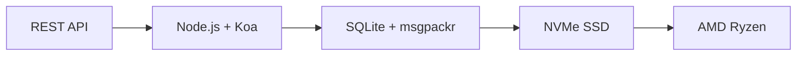

# ממשק ה-API השלם הראשון לאימייל: כיצד דוא"ל עתידי חולל מהפכה בניהול האימייל {#the-first-complete-email-api-how-forward-email-revolutionized-email-management}


<p class="lead mt-3">
<strong>TL;DR:</strong> בנינו את ממשק ה-API REST השלם הראשון בעולם לניהול דוא"ל עם יכולות חיפוש מתקדמות שאף שירות אחר לא מציע. בעוד ש-Gmail, Outlook ו-Apple מאלצים מפתחים להיכנס לגיהנום IMAP או ממשקי API בעלי קצב חיפוש מוגבל, Forward Email מספק פעולות CRUD מהירות במיוחד עבור הודעות, תיקיות, אנשי קשר ויומנים באמצעות ממשק REST מאוחד עם יותר מ-15 פרמטרי חיפוש. זהו ממשק ה-API של דוא"ל שחיכו לו.
</p>

## תוכן עניינים

* [בעיית ה-API של הדוא"ל](#the-email-api-problem)
* [מה באמת אומרים המפתחים](#what-developers-are-actually-saying)
* [הפתרון המהפכני של העברת דוא"ל](#forward-emails-revolutionary-solution)
  * [למה בנינו את זה](#why-we-built-this)
  * [אימות פשוט](#simple-authentication)
* [20 נקודות קצה שמשנות הכל](#20-endpoints-that-change-everything)
  * [הודעות (5 נקודות קצה)](#messages-5-endpoints)
  * [תיקיות (5 נקודות קצה)](#folders-5-endpoints)
  * [אנשי קשר (5 נקודות קצה)](#contacts-5-endpoints)
  * [לוחות שנה (5 נקודות קצה)](#calendars-5-endpoints)
* [חיפוש מתקדם: אין שירות אחר שמשתווה אליו](#advanced-search-no-other-service-compares)
  * [נוף ה-API של החיפוש שבור](#the-search-api-landscape-is-broken)
  * [ממשק ה-API לחיפוש מהפכני של העברת דוא"ל](#forward-emails-revolutionary-search-api)
  * [דוגמאות לחיפוש מהעולם האמיתי](#real-world-search-examples)
  * [יתרונות ביצועים](#performance-advantages)
  * [תכונות חיפוש שאין לאף אחד אחר](#search-features-no-one-else-has)
  * [למה זה חשוב למפתחים](#why-this-matters-for-developers)
  * [היישום הטכני](#the-technical-implementation)
* [ארכיטקטורת ביצועים מהירה מסחררת](#blazing-fast-performance-architecture)
  * [מדדי ביצועים](#performance-benchmarks)
  * [ארכיטקטורת פרטיות תחילה](#privacy-first-architecture)
* [למה אנחנו שונים: ההשוואה המלאה](#why-were-different-the-complete-comparison)
  * [מגבלות עיקריות של הספק](#major-provider-limitations)
  * [יתרונות העברת דוא"ל](#forward-email-advantages)
  * [בעיית השקיפות בקוד פתוח](#the-open-source-transparency-problem)
* [30+ דוגמאות לאינטגרציה מהעולם האמיתי](#30-real-world-integration-examples)
  * [1. שיפור טופס יצירת קשר בוורדפרס](#1-wordpress-contact-form-enhancement)
  * [2. אלטרנטיבה לזאפייר לאוטומציה של דוא"ל](#2-zapier-alternative-for-email-automation)
  * [3. סנכרון דוא"ל CRM](#3-crm-email-synchronization)
  * [4. עיבוד הזמנות מסחר אלקטרוני](#4-e-commerce-order-processing)
  * [5. תמיכה בשילוב כרטיסים](#5-support-ticket-integration)
  * [6. מערכת ניהול ניוזלטרים](#6-newsletter-management-system)
  * [7. ניהול משימות מבוסס דוא"ל](#7-email-based-task-management)
  * [8. צבירת דוא"ל מרובי חשבונות](#8-multi-account-email-aggregation)
  * [9. לוח מחוונים מתקדם לניתוח דוא"ל](#9-advanced-email-analytics-dashboard)
  * [10. אחסון דוא"ל חכם](#10-smart-email-archiving)
  * [11. שילוב דוא"ל ליומן](#11-email-to-calendar-integration)
  * [12. גיבוי ותאימות של דוא"ל](#12-email-backup-and-compliance)
  * [13. ניהול תוכן מבוסס דוא"ל](#13-email-based-content-management)
  * [14. ניהול תבניות דוא"ל](#14-email-template-management)
  * [15. אוטומציה של זרימת עבודה מבוססת דוא"ל](#15-email-based-workflow-automation)
  * [16. ניטור אבטחת דוא"ל](#16-email-security-monitoring)
  * [17. איסוף סקרים מבוסס דוא"ל](#17-email-based-survey-collection)
  * [18. ניטור ביצועי דוא"ל](#18-email-performance-monitoring)
  * [19. הסמכת לידים מבוססת דוא"ל](#19-email-based-lead-qualification)
  * [20. ניהול פרויקטים מבוסס דוא"ל](#20-email-based-project-management)
  * [21. ניהול מלאי מבוסס דוא"ל](#21-email-based-inventory-management)
  * [22. עיבוד חשבוניות מבוסס דוא"ל](#22-email-based-invoice-processing)
  * [23. רישום לאירוע באמצעות דוא"ל](#23-email-based-event-registration)
  * [24. תהליך עבודה לאישור מסמכים מבוסס דוא"ל](#24-email-based-document-approval-workflow)
  * [25. ניתוח משוב לקוחות מבוסס דוא"ל](#25-email-based-customer-feedback-analysis)
  * [26. צינור גיוס מבוסס דוא"ל](#26-email-based-recruitment-pipeline)
  * [27. עיבוד דוחות הוצאות מבוססי דוא"ל](#27-email-based-expense-report-processing)
  * [28. דיווח אבטחת איכות מבוסס דוא"ל](#28-email-based-quality-assurance-reporting)
  * [29. ניהול ספקים מבוסס דוא"ל](#29-email-based-vendor-management)
  * [30. ניטור מדיה חברתית מבוסס דוא"ל](#30-email-based-social-media-monitoring)
* [תחילת העבודה](#getting-started)
  * [1. צור חשבון דוא"ל להעברת דוא"ל](#1-create-your-forward-email-account)
  * [2. צור אישורי API](#2-generate-api-credentials)
  * [3. בצע את קריאת ה-API הראשונה שלך](#3-make-your-first-api-call)
  * [4. עיין בתיעוד](#4-explore-the-documentation)
* [משאבים טכניים](#technical-resources)

## בעיית ה-API של הדוא"ל {#the-email-api-problem}

ממשקי API של דוא"ל שבורים מיסודם. נקודה.

כל ספק דוא"ל גדול מאלץ מפתחים לבחור אחת משתי אפשרויות גרועות:

1. **גיהנום IMAP**: התמודדות עם פרוטוקול בן 30 שנה שנועד ללקוחות שולחניים, לא ליישומים מודרניים
2. **ממשקי API משותקים**: ממשקי API מורכבים, לקריאה בלבד, בעלי קצב מוגבל, שאינם יכולים לנהל את נתוני הדוא"ל שלך בפועל

התוצאה? מפתחים או נוטשים לחלוטין את שילוב הדוא"ל או מבזבזים שבועות בבניית מעטפות IMAP שבירות שמתקלקלות ללא הרף.

> \[!WARNING]
> **הסוד המלוכלך**: רוב "ממשקי ה-API של דוא"ל" הם רק ממשקי API לשליחה. לא ניתן לארגן תיקיות, לסנכרן אנשי קשר או לנהל יומנים באופן תכנותי דרך ממשק REST פשוט. עד עכשיו.

## מה באמת אומרים המפתחים {#what-developers-are-actually-saying}

התסכול אמיתי ומתועד בכל מקום:

> "לאחרונה ניסיתי לשלב את Gmail באפליקציה שלי, והשקעתי בזה יותר מדי זמן. החלטתי שלא כדאי לתמוך ב-Gmail."
>
> *- [מפתח חדשות האקר](https://news.ycombinator.com/item?id=42106944), 147 הצבעות חיוביות*

> "האם כל ממשקי ה-API של הדוא"ל בינוניים? הם נראים מוגבלים או מגבילים בצורה כלשהי."
>
> *- [דיון r/SaaS על Reddit](https://www.reddit.com/r/SaaS/comments/1cm84s7/are_all_email_apis_mediocre/)*

> "למה פיתוח דוא"ל חייב להיות גרוע?"
>
> *- [Reddit r/webdev](https://www.reddit.com/r/webdev/comments/15trnp2/why_does_email_development_have_to_suck/), 89 תגובות של כאב מפתחים*

> "מה הופך את ממשק ה-API של Gmail ליעיל יותר מ-IMAP? סיבה נוספת לכך שממשק ה-API של Gmail יעיל הרבה יותר היא שהוא צריך להוריד כל הודעה פעם אחת בלבד. עם IMAP, כל הודעה חייבת להיות מורדת ומאונדקסת..."
>
> *- [שאלת הצפת מחסנית](https://stackoverflow.com/questions/25431022/what-makes-the-gmail-api-more-efficient-than-imap) עם 47 הצבעות חיוביות*

הראיות נמצאות בכל מקום:

* **בעיות SMTP בוורדפרס**: [631 בעיות ב-GitHub](https://github.com/awesomemotive/WP-Mail-SMTP/issues) בנוגע לכשלים במסירת דוא"ל
* **מגבלות Zapier**: [תלונות הקהילה](https://community.zapier.com/featured-articles-65/email-parser-by-zapier-limitations-and-alternatives-16958) בנוגע למגבלות של 10 דוא"ל/שעה וכשלים בזיהוי IMAP
* **פרויקטים של IMAP API**: [מְרוּבֶּה](https://github.com/ewildgoose/imap-api) [קוד פתוח](https://emailengine.app/) [פרויקטים](https://www.npmjs.com/package/imapflow) קיימים במיוחד כדי "להמיר IMAP ל-REST" מכיוון שאף ספק לא מציע זאת
* **תסכולים ב-Gmail API**: ל-[גלישת מחסנית](https://stackoverflow.com/questions/tagged/gmail-api) יש 4,847 שאלות שתויגו "gmail-api" עם תלונות נפוצות בנוגע למגבלות קצב ומורכבות

## הפתרון המהפכני להעברת דוא"ל {#forward-emails-revolutionary-solution}

אנחנו שירות הדוא"ל הראשון שמציע פעולות CRUD מלאות עבור כל נתוני הדוא"ל דרך ממשק REST API מאוחד.

זה לא עוד סתם API של שליחה. זוהי שליטה תכנותית מלאה על:

* **הודעות**: יצירה, קריאה, עדכון, מחיקה, חיפוש, העברה, סימון
* **תיקיות**: ניהול מלא של תיקיות IMAP דרך נקודות קצה של REST
* **אנשי קשר**: אחסון וסנכרון של אנשי קשר [כרטיסDAV](https://tools.ietf.org/html/rfc6352)
* **יומנים**: אירועי יומן ותזמון [CalDAV](https://tools.ietf.org/html/rfc4791)

### למה בנינו את זה {#why-we-built-this}

**הבעיה**: כל ספק דוא"ל מתייחס לדוא"ל כקופסה שחורה. אפשר לשלוח מיילים, אולי לקרוא אותם עם OAuth מורכב, אבל אי אפשר באמת *לנהל* את נתוני הדוא"ל שלך באופן תכנותי.

**החזון שלנו**: אימייל צריך להיות קל לשילוב כמו כל API מודרני. ללא ספריות IMAP. ללא מורכבות OAuth. ללא סיוטים של מגבלות קצב. רק נקודות קצה REST פשוטות שעובדות.

**התוצאה**: שירות הדוא"ל הראשון שבו ניתן לבנות לקוח דוא"ל שלם, שילוב CRM או מערכת אוטומציה באמצעות בקשות HTTP בלבד.

### אימות פשוט {#simple-authentication}

אין [מורכבות OAuth](https://oauth.net/2/). אין [סיסמאות ספציפיות לאפליקציה](https://support.google.com/accounts/answer/185833). רק פרטי הכינוי שלך:

```bash
curl -u "alias@yourdomain.com:password" \
  https://api.forwardemail.net/v1/messages
```

## 20 נקודות קצה שמשנות הכל {#20-endpoints-that-change-everything}

### הודעות (5 נקודות קצה) {#messages-5-endpoints}

* `GET /v1/messages` - רשימת הודעות עם סינון (`?folder=`, `?is_unread=`, `?is_flagged=`)
* `POST /v1/messages` - שליחת הודעות חדשות ישירות לתיקיות
* `GET /v1/messages/:id` - אחזור הודעה ספציפית עם מטא-נתונים מלאים
* `PUT /v1/messages/:id` - עדכון הודעה (דגלים, תיקייה, סטטוס קריאה)
* `DELETE /v1/messages/:id` - מחיקת הודעה לצמיתות

### תיקיות (5 נקודות קצה) {#folders-5-endpoints}

* `GET /v1/folders` - רשימת כל התיקיות עם סטטוס המנוי
* `POST /v1/folders` - יצירת תיקייה חדשה עם מאפיינים מותאמים אישית
* `GET /v1/folders/:id` - קבלת פרטי תיקייה וספירת הודעות
* `PUT /v1/folders/:id` - עדכון מאפייני תיקייה ומנוי
* `DELETE /v1/folders/:id` - מחיקת תיקייה וטיפל בהעברת הודעות

### אנשי קשר (5 נקודות קצה) {#contacts-5-endpoints}

* `GET /v1/contacts` - רשימת אנשי קשר עם חיפוש ועמודים
* `POST /v1/contacts` - יצירת איש קשר חדש עם תמיכה מלאה ב-vCard
* `GET /v1/contacts/:id` - אחזור איש קשר עם כל השדות והמטא-דאטה
* `PUT /v1/contacts/:id` - עדכון פרטי איש קשר עם אימות ETag
* `DELETE /v1/contacts/:id` - מחיקת איש קשר עם טיפול מדורג

### לוחות שנה (5 נקודות קצה) {#calendars-5-endpoints}

* `GET /v1/calendars` - רשימת אירועי לוח שנה עם סינון תאריכים
* `POST /v1/calendars` - יצירת אירוע לוח שנה עם משתתפים ואירוע חוזר
* `GET /v1/calendars/:id` - קבלת פרטי אירוע עם טיפול באזור זמן
* `PUT /v1/calendars/:id` - עדכון אירוע עם זיהוי התנגשויות
* `DELETE /v1/calendars/:id` - מחיקת אירוע עם התראות משתתפים

## חיפוש מתקדם: אין שירות אחר המשתווה {#advanced-search-no-other-service-compares}

**Forward Email הוא שירות הדוא"ל היחיד המציע חיפוש מקיף ותכנותי בכל שדות ההודעה באמצעות REST API.**

בעוד שספקים אחרים מציעים סינון בסיסי במקרה הטוב, בנינו את ממשק ה-API לחיפוש דוא"ל המתקדם ביותר שנוצר אי פעם. אף ממשק API של Gmail, ממשק API של Outlook או כל שירות אחר לא מתקרב ליכולות החיפוש שלנו.

### סביבת ה-API של החיפוש פגומה {#the-search-api-landscape-is-broken}

**מגבלות חיפוש ב-API של Gmail:**

* ✅ פרמטר בסיסי `q` בלבד
* ❌ אין חיפוש ספציפי לשדה
* ❌ אין סינון לפי טווח תאריכים
* ❌ אין סינון לפי גודל
* ❌ אין סינון לפי קבצים מצורפים
* ❌ מוגבל לתחביר החיפוש של Gmail

**מגבלות חיפוש ב-API של Outlook:**

* ✅ פרמטר בסיסי `$search`
* ❌ אין מיקוד שדות מתקדם
* ❌ אין צירופי שאילתות מורכבים
* ❌ הגבלת קצב אגרסיבית
* ❌ נדרש תחביר OData מורכב

**אפל iCloud:**

* ❌ אין שום API
* ❌ חיפוש IMAP בלבד (אם תצליחו לגרום לזה לעבוד)

**ProtonMail ו-Tuta:**

* ❌ אין ממשקי API ציבוריים
* ❌ אין יכולות חיפוש פרוגרמטיות

### ממשק ה-API המהפכני לחיפוש העברת דוא"ל {#forward-emails-revolutionary-search-api}

**אנו מציעים 15+ פרמטרים לחיפוש שאף שירות אחר לא מספק:**

| יכולת חיפוש | העברת דוא"ל | ממשק ה-API של ג'ימייל | ממשק API של Outlook | אחרים |
| ------------------------------ | -------------------------------------- | ------------ | ------------------ | ------ |
| **חיפוש ספציפי לשדה** | ✅ נושא, גוף, מאת, אל, עותק, כותרות | ❌ | ❌ | ❌ |
| **חיפוש כללי מרובה שדות** | ✅ `?search=` בכל השדות | ✅ `q=` בסיסי | ✅ `$search=` בסיסי | ❌ |
| **סינון טווח תאריכים** | ✅ `?since=` & `?before=` | ❌ | ❌ | ❌ |
| **סינון מבוסס גודל** | ✅ `?min_size=` & `?max_size=` | ❌ | ❌ | ❌ |
| **סינון קבצים מצורפים** | ✅ `?has_attachments=true/false` | ❌ | ❌ | ❌ |
| **חיפוש כותרת** | ✅ `?headers=X-Priority` | ❌ | ❌ | ❌ |
| **חיפוש מזהה הודעה** | ✅ `?message_id=abc123` | ❌ | ❌ | ❌ |
| **מסננים משולבים** | ✅ פרמטרים מרובים עם לוגיקת AND | ❌ | ❌ | ❌ |
| **לא תלוי רישיות** | ✅ כל החיפושים | ✅ | ✅ | ❌ |
| **תמיכה בעמודים** | ✅ עובד עם כל פרמטרי החיפוש | ✅ | ✅ | ❌ |

### דוגמאות לחיפוש מהעולם האמיתי {#real-world-search-examples}

**מצא את כל החשבוניות מהרבעון האחרון:**

```bash
# Forward Email - Simple and powerful
GET /v1/messages?subject=invoice&since=2024-01-01T00:00:00Z&before=2024-04-01T00:00:00Z

# Gmail API - Impossible with their limited search
# No date range filtering available

# Outlook API - Complex OData syntax, limited functionality
GET /me/messages?$search="invoice"&$filter=receivedDateTime ge 2024-01-01T00:00:00Z
```

**חיפוש קבצים מצורפים גדולים משולח ספציפי:**

```bash
# Forward Email - Comprehensive filtering
GET /v1/messages?from=finance@company.com&has_attachments=true&min_size=1000000

# Gmail API - Cannot filter by size or attachments programmatically
# Outlook API - No size filtering available
# Others - No APIs available
```

**חיפוש מורכב מרובה שדות:**

```bash
# Forward Email - Advanced query capabilities
GET /v1/messages?body=quarterly&from=manager&is_flagged=true&folder=Reports

# Gmail API - Limited to basic text search only
GET /gmail/v1/users/me/messages?q=quarterly

# Outlook API - Basic search without field targeting
GET /me/messages?$search="quarterly"
```

### יתרונות ביצועים {#performance-advantages}

**ביצועי חיפוש דוא"ל העברת דוא"ל:**

* ⚡ **זמני תגובה מתחת ל-100ms** עבור חיפושים מורכבים
* 🔍 **אופטימיזציה של ביטויים רגולריים** עם אינדוקס נכון
* 📊 **ביצוע שאילתה מקביל** עבור ספירה ונתונים
* 💾 **ניצול יעיל של זיכרון** עם שאילתות רזות

**בעיות ביצועים של מתחרים:**

* 🐌 **API של Gmail**: קצב מוגבל ל-250 יחידות מכסה למשתמש לשנייה
* 🐌 **API של Outlook**: ויסות אגרסיבי עם דרישות גיבוי מורכבות
* 🐌 **אחרים**: אין ממשקי API להשוואה

### תכונות חיפוש שאין לאף אחד אחר {#search-features-no-one-else-has}

#### 1. חיפוש ספציפי לכותרת {#1-header-specific-search}

```bash
# Find messages with specific headers
GET /v1/messages?headers=X-Priority:1
GET /v1/messages?headers=X-Spam-Score
```

#### 2. מודיעין מבוסס גודל {#2-size-based-intelligence}

```bash
# Find newsletter emails (typically large)
GET /v1/messages?min_size=50000&from=newsletter

# Find quick replies (typically small)
GET /v1/messages?max_size=1000&to=support
```

#### 3. זרימות עבודה מבוססות קבצים מצורפים {#3-attachment-based-workflows}

```bash
# Find all documents sent to legal team
GET /v1/messages?to=legal&has_attachments=true&body=contract

# Find emails without attachments for cleanup
GET /v1/messages?has_attachments=false&before=2023-01-01T00:00:00Z
```

#### 4. לוגיקה עסקית משולבת {#4-combined-business-logic}

```bash
# Find urgent flagged messages from VIPs with attachments
GET /v1/messages?is_flagged=true&from=ceo&has_attachments=true&subject=urgent
```

### למה זה חשוב למפתחים {#why-this-matters-for-developers}

**בניית יישומים שהיו בלתי אפשריים בעבר:**

1. **ניתוח דוא"ל מתקדם**: ניתוח דפוסי דוא"ל לפי גודל, שולח, תוכן
2. **ניהול דוא"ל חכם**: ארגון אוטומטי על סמך קריטריונים מורכבים
3. **תאימות וגילוי**: מציאת דוא"ל ספציפיים לדרישות משפטיות
4. **בינה עסקית**: חילוץ תובנות מדפוסי תקשורת דוא"ל
5. **זרימות עבודה אוטומטיות**: הפעלת פעולות על סמך מסנני דוא"ל מתוחכמים

### היישום הטכני {#the-technical-implementation}

ממשק ה-API לחיפוש שלנו משתמש ב:

* **אופטימיזציה של ביטויים רגולריים** עם אסטרטגיות אינדוקס מתאימות
* **ביצוע מקביל** לשיפור ביצועים
* **אימות קלט** לאבטחה
* **טיפול מקיף בשגיאות** לאמינות

```javascript
// Example: Complex search implementation
const searchConditions = [];

if (ctx.query.subject) {
  searchConditions.push({
    subject: { $regex: ctx.query.subject, $options: 'i' }
  });
}

if (ctx.query.from) {
  searchConditions.push({
    $or: [
      { 'from.address': { $regex: ctx.query.from, $options: 'i' } },
      { 'from.name': { $regex: ctx.query.from, $options: 'i' } }
    ]
  });
}

// Combine with AND logic
if (searchConditions.length > 0) {
  query.$and = searchConditions;
}
```

> \[!TIP]
> **יתרון למפתחים**: בעזרת ממשק ה-API לחיפוש של Forward Email, תוכלו לבנות יישומי דוא"ל שיתחרו בפונקציונליות של לקוחות שולחן עבודה, תוך שמירה על הפשטות של ממשקי API של REST.

## ארכיטקטורת ביצועים מהירה במיוחד {#blazing-fast-performance-architecture}

הערימה הטכנית שלנו בנויה למהירות ואמינות:



### מדדי ביצועים {#performance-benchmarks}

**למה אנחנו מהירים כברק:**

| רְכִיב | טֶכנוֹלוֹגִיָה | תועלת ביצועים |
| ------------ | --------------------------------------------------------------------------------- | --------------------------------------------- |
| **אִחסוּן** | [NVMe SSD](https://en.wikipedia.org/wiki/NVM_Express) | מהיר פי 10 מ-SATA מסורתי |
| **מסד נתונים** | [SQLite](https://sqlite.org/) + [msgpackr](https://github.com/kriszyp/msgpackr) | אפס השהיית רשת, סידור אופטימלי |
| **חוּמרָה** | [AMD Ryzen](https://www.amd.com/en/products/processors/desktops/ryzen) מתכת חשופה | אין תקורה של וירטואליזציה |
| **אחסון במטמון** | בזיכרון + מתמיד | זמני תגובה של פחות ממילישנייה |
| **גיבויים** | [Cloudflare R2](https://www.cloudflare.com/products/r2/) מוצפן | אמינות ברמה ארגונית |

**מספרי ביצועים אמיתיים:**

* **זמן תגובה של API**: פחות מ-50ms בממוצע
* **אחזור הודעות**: פחות מ-10ms עבור הודעות במטמון
* **פעולות תיקייה**: פחות מ-5ms עבור פעולות מטא-נתונים
* **סנכרון אנשי קשר**: יותר מ-1000 אנשי קשר/שנייה
* **זמן פעולה**: הסכם רמת שירות של 99.99% עם תשתית יתירה

### ארכיטקטורת פרטיות במקום הראשון {#privacy-first-architecture}

**עיצוב ללא ידע**: רק לך יש גישה באמצעות סיסמת ה-IMAP שלך - אנחנו לא יכולים לקרוא את האימיילים שלך. [ארכיטקטורת אפס ידע](https://forwardemail.net/en/security) שלנו מבטיח פרטיות מוחלטת תוך מתן ביצועים מעולים.

## למה אנחנו שונים: ההשוואה המלאה {#why-were-different-the-complete-comparison}

### מגבלות ספק עיקריות {#major-provider-limitations}

| ספק | בעיות ליבה | מגבלות ספציפיות |
| ---------------- | ----------------------------------------- | -------------------------------------------------------------------------------------------------------------------------------------------------------------------------------------------------------------------------------------------------------------------------------------------------------------------------------------------------------------------------------------------------------------------------------------------------------------------- |
| **ממשק ה-API של ג'ימייל** | קריאה בלבד, OAuth מורכב, ממשקי API נפרדים | • [Cannot modify existing messages](https://developers.google.com/gmail/api/reference/rest/v1/users.messages)<br>• [Labels ≠ folders](https://developers.google.com/gmail/api/reference/rest/v1/users.labels)<br>• [1 billion quota units/day limit](https://developers.google.com/gmail/api/reference/quota)<br>• [Requires separate APIs](https://developers.google.com/workspace) עבור אנשי קשר/יומן |
| **ממשק API של Outlook** | מיושן, מבלבל, ממוקד ארגונים | • [REST endpoints deprecated March 2024](https://learn.microsoft.com/en-us/outlook/rest/compare-graph)<br>• [Multiple confusing APIs](https://learn.microsoft.com/en-us/office/client-developer/outlook/selecting-an-api-or-technology-for-developing-solutions-for-outlook) (EWS, גרף, REST)<br>• [Microsoft Graph complexity](https://learn.microsoft.com/en-us/graph/overview)<br>• [Aggressive throttling](https://learn.microsoft.com/en-us/graph/throttling) |
| **אפל iCloud** | אין API ציבורי | • [No public API whatsoever](https://support.apple.com/en-us/102654)<br>• [IMAP-only with 1000 emails/day limit](https://support.apple.com/en-us/102654)<br>• [App-specific passwords required](https://support.apple.com/en-us/102654)<br>• [500 recipients per message limit](https://support.apple.com/en-us/102654) |
| **פרוטון מייל** | אין API, טענות שקריות בקוד פתוח | • [No public API available](https://proton.me/support/protonmail-bridge-clients)<br>• [Bridge software required](https://proton.me/mail/bridge) עבור גישת IMAP<br>• [Claims "open source"](https://proton.me/blog/open-source) אבל [server code is proprietary](https://github.com/ProtonMail)<br>• [Limited to paid plans only](https://proton.me/pricing) |
| **סַך הַכֹּל** | אין API, שקיפות מטעה | • [No REST API for email management](https://tuta.com/support#technical)<br>• [Claims "open source"](https://tuta.com/blog/posts/open-source-email) אבל [backend is closed](https://github.com/tutao/tutanota)<br>• [IMAP/SMTP not supported](https://tuta.com/support#imap)<br>• [Proprietary encryption](https://tuta.com/encryption) מונע אינטגרציות סטנדרטיות |
| **אימייל של זאפייר** | מגבלות קצב חמורות | • [10 emails per hour limit](https://help.zapier.com/hc/en-us/articles/8496181555597-Email-Parser-by-Zapier-limitations-and-alternatives)<br>• [No IMAP folder access](https://help.zapier.com/hc/en-us/articles/8496181555597-Email-Parser-by-Zapier-limitations-and-alternatives)<br>• [Limited parsing capabilities](https://help.zapier.com/hc/en-us/articles/8496181555597-Email-Parser-by-Zapier-limitations-and-alternatives) |

יתרונות ### להעברת דוא"ל {#forward-email-advantages}

| תכונה | העברת דוא"ל | תַחֲרוּת |
| ------------------ | -------------------------------------------------------------------------------------------- | ----------------------------------------- |
| **גרועה לחלוטין** | ✅ יצירה מלאה, קריאה, עדכון ומחיקה של כל הנתונים | ❌ פעולות לקריאה בלבד או מוגבלות |
| **ממשק API מאוחד** | ✅ הודעות, תיקיות, אנשי קשר, יומנים בממשק API אחד | ❌ ממשקי API נפרדים או תכונות חסרות |
| **אישור פשוט** | ✅ אימות בסיסי עם אישורי כינוי | ❌ OAuth מורכב עם מספר סקופים |
| **אין הגבלות תעריף** | ✅ מגבלות נדיבות שנועדו ליישומים אמיתיים | ❌ מכסות מגבילות שמפריעות לזרימות עבודה |
| **אירוח עצמי** | ✅ [Complete self-hosting option](https://forwardemail.net/en/blog/docs/self-hosted-solution) | ❌ נעילת ספק בלבד |
| **פְּרָטִיוּת** | ✅ אפס ידע, מוצפן, פרטי | כריית נתונים וחששות בנוגע לפרטיות |
| **ביצועים** | ✅ תגובות של פחות מ-50ms, אחסון NVMe | ❌ השהיית רשת, עיכובים בוויסות |

### בעיית השקיפות בקוד פתוח {#the-open-source-transparency-problem}

**ProtonMail ו-Tuta משווקות את עצמן כ"קוד פתוח" ו"שקופות", אך זהו שיווק מטעה המפר עקרונות פרטיות מודרניים.**

> \[!WARNING]
> **טענות שקיפות כוזבות**: גם ProtonMail וגם Tuta מפרסמים באופן בולט את אישורי "קוד פתוח" שלהם תוך שמירה על קוד צד השרת הקריטי ביותר שלהם קנייני וסגור.

**ההונאה של ProtonMail:**

* **טענות**: ["אנחנו קוד פתוח"](https://proton.me/blog/open-source) הוצגו באופן בולט בשיווק
* **מציאות**: [קוד השרת הוא קנייני לחלוטין](https://github.com/ProtonMail) - רק אפליקציות לקוח הן בקוד פתוח
* **השפעה**: משתמשים אינם יכולים לאמת הצפנה בצד השרת, טיפול בנתונים או טענות פרטיות
* **הפרת שקיפות**: אין דרך לבקר את מערכות עיבוד ואחסון הדוא"ל בפועל

**השיווק המטעה של טוטה:**

* **טענות**: ["דוא"ל בקוד פתוח"](https://tuta.com/blog/posts/open-source-email) כנקודת מכירה מרכזית
* **מציאות**: [תשתית Backend היא קוד סגור](https://github.com/tutao/tutanota) - רק קצה קדמי זמין
* **השפעה**: הצפנה קניינית מונעת פרוטוקולי דוא"ל סטנדרטיים (IMAP/SMTP)
* **אסטרטגיית נעילה**: הצפנה מותאמת אישית כופה תלות בספק

**מדוע זה חשוב לפרטיות מודרנית:**

בשנת 2025, פרטיות אמיתית דורשת **שקיפות מוחלטת**. כאשר ספקי דוא"ל טוענים שהם "קוד פתוח" אך מסתירים את קוד השרת שלהם:

1. **הצפנה בלתי ניתנת לאימות**: לא ניתן לבדוק כיצד הנתונים שלך מוצפנים בפועל
2. **שיטות עבודה נסתרות של נתונים**: טיפול בנתונים בצד השרת נותר בגדר קופסה שחורה
3. **אבטחה מבוססת אמון**: עליך לסמוך על הטענות שלהם ללא אימות
4. **נעילת ספק**: מערכות קנייניות מונעות ניידות נתונים

**שקיפות אמיתית של העברת דוא"ל:**

* ✅ **[קוד פתוח מלא](https://github.com/forwardemail/forwardemail.net)** - קוד שרת ולקוח
* ✅ **[אירוח עצמי זמין](https://forwardemail.net/en/blog/docs/self-hosted-solution)** - הפעלת מופע משלך
* ✅ **פרוטוקולים סטנדרטיים** - תאימות IMAP, SMTP, CardDAV, CalDAV
* ✅ **אבטחה ניתנת לביקורת** - כל שורת קוד ניתנת לבדיקה
* ✅ **אין נעילת ספק** - הנתונים שלך, השליטה שלך

> \[!TIP]
> **קוד פתוח אמיתי מאפשר לך לאמת כל טענה.** בעזרת Forward Email, תוכל לבקר את ההצפנה שלנו, לסקור את הטיפול בנתונים שלנו ואפילו להפעיל מופע משלך. זוהי שקיפות אמיתית.

## 30+ דוגמאות לאינטגרציה מהעולם האמיתי {#30-real-world-integration-examples}

### 1. שיפור טופס יצירת קשר בוורדפרס {#1-wordpress-contact-form-enhancement}

**בעיה**: [כשלים בהגדרת SMTP של וורדפרס](https://github.com/awesomemotive/WP-Mail-SMTP/issues) ([631 בעיות ב-GitHub](https://github.com/awesomemotive/WP-Mail-SMTP/issues))
**פתרון**: שילוב ישיר של API עוקף לחלוטין את [SMTP](https://tools.ietf.org/html/rfc5321)

```javascript
// WordPress contact form that saves to Sent folder
await fetch('https://api.forwardemail.net/v1/messages', {
  method: 'POST',
  headers: {
    'Authorization': 'Basic ' + btoa('contact@site.com:password'),
    'Content-Type': 'application/json'
  },
  body: JSON.stringify({
    to: [{ address: 'owner@site.com' }],
    subject: 'Contact Form: ' + formData.subject,
    text: formData.message,
    folder: 'Sent'
  })
});
```

### 2. אלטרנטיבה לזאפייר לאוטומציה של דוא"ל {#2-zapier-alternative-for-email-automation}

**בעיה**: [מגבלת 10 מיילים לשעה של זאפייר](https://help.zapier.com/hc/en-us/articles/8496181555597-Email-Parser-by-Zapier-limitations-and-alternatives) ו- [כשלים בזיהוי IMAP](https://community.zapier.com/featured-articles-65/email-parser-by-zapier-limitations-and-alternatives-16958)
**פתרון**: אוטומציה בלתי מוגבלת עם שליטה מלאה בדוא"ל

```javascript
// Auto-organize emails by sender domain
const messages = await fetch('/v1/messages?folder=INBOX');
for (const message of messages) {
  const domain = message.from.split('@')[1];
  await fetch(`/v1/messages/${message.id}`, {
    method: 'PUT',
    body: JSON.stringify({ folder: `Clients/${domain}` })
  });
}
```

### 3. סנכרון דוא"ל CRM {#3-crm-email-synchronization}

**בעיה**: ניהול אנשי קשר ידני בין דוא"ל ל-[מערכות CRM](https://en.wikipedia.org/wiki/Customer_relationship_management)
**פתרון**: סנכרון דו-כיווני עם ממשק ה-API של אנשי קשר של [כרטיסDAV](https://tools.ietf.org/html/rfc6352)

```javascript
// Sync new email contacts to CRM
const newContacts = await fetch('/v1/contacts');
for (const contact of newContacts) {
  await crmAPI.createContact({
    name: contact.name,
    email: contact.email,
    source: 'email_api'
  });
}
```

### 4. עיבוד הזמנות מסחר אלקטרוני {#4-e-commerce-order-processing}

**בעיה**: עיבוד ידני של דוא"ל הזמנות עבור [פלטפורמות מסחר אלקטרוני](https://en.wikipedia.org/wiki/E-commerce)
**פתרון**: ניהול הזמנות אוטומטי

```javascript
// Process order confirmation emails
const orders = await fetch('/v1/messages?folder=Orders');
const orderEmails = orders.filter(msg =>
  msg.subject.includes('Order Confirmation')
);

for (const order of orderEmails) {
  const orderData = parseOrderEmail(order.text);
  await updateInventory(orderData);
  await fetch(`/v1/messages/${order.id}`, {
    method: 'PUT',
    body: JSON.stringify({ folder: 'Orders/Processed' })
  });
}
```

### 5. שילוב כרטיסים עם תמיכה {#5-support-ticket-integration}

**בעיה**: שרשורי דוא"ל מפוזרים ב-[פלטפורמות תמיכה](https://en.wikipedia.org/wiki/Help_desk_software)
**פתרון**: מעקב מלא אחר שרשורי דוא"ל

```javascript
// Create support ticket from email thread
const messages = await fetch('/v1/messages?folder=Support');
const supportEmails = messages.filter(msg =>
  msg.to.some(addr => addr.includes('support@'))
);

for (const email of supportEmails) {
  const ticket = await supportSystem.createTicket({
    subject: email.subject,
    from: email.from,
    body: email.text,
    timestamp: email.date
  });
}
```

### 6. מערכת ניהול ניוזלטרים {#6-newsletter-management-system}

**בעיה**: אינטגרציות מוגבלות של [פלטפורמת ניוזלטרים](https://en.wikipedia.org/wiki/Email_marketing)
**פתרון**: ניהול מחזור חיים מלא של מנויים

```javascript
// Auto-manage newsletter subscriptions
const messages = await fetch('/v1/messages?folder=Newsletter');
const unsubscribes = messages.filter(msg =>
  msg.subject.toLowerCase().includes('unsubscribe')
);

for (const msg of unsubscribes) {
  await removeSubscriber(msg.from);
  await fetch(`/v1/messages/${msg.id}`, {
    method: 'PUT',
    body: JSON.stringify({ folder: 'Newsletter/Unsubscribed' })
  });
}
```

### 7. ניהול משימות מבוסס דוא"ל {#7-email-based-task-management}

**בעיה**: עומס בתיבת הדואר הנכנס ו-[מעקב אחר משימות](https://en.wikipedia.org/wiki/Task_management)
**פתרון**: המרת הודעות דוא"ל למשימות ניתנות לפעולה

```javascript
// Create tasks from flagged emails
const messages = await fetch('/v1/messages?is_flagged=true');
for (const email of messages) {
  await taskManager.createTask({
    title: email.subject,
    description: email.text,
    assignee: email.to[0].address,
    dueDate: extractDueDate(email.text)
  });
}
```

### 8. צבירת דוא"ל מרובת חשבונות {#8-multi-account-email-aggregation}

**בעיה**: ניהול [חשבונות דוא"ל מרובים](https://en.wikipedia.org/wiki/Email_client) בין ספקים
**פתרון**: ממשק מאוחד של תיבת הדואר הנכנס

```javascript
// Aggregate emails from multiple accounts
const accounts = ['work@domain.com', 'personal@domain.com'];
const allMessages = [];

for (const account of accounts) {
  const messages = await fetch('/v1/messages', {
    headers: { 'Authorization': getAuth(account) }
  });
  allMessages.push(...messages.map(m => ({ ...m, account })));
}
```

### 9. לוח מחוונים לניתוח דוא"ל מתקדם {#9-advanced-email-analytics-dashboard}

**בעיה**: אין תובנות לגבי [דפוסי דוא"ל](https://en.wikipedia.org/wiki/Email_analytics) עם סינון מתוחכם
**פתרון**: ניתוח דוא"ל מותאם אישית באמצעות יכולות חיפוש מתקדמות

```javascript
// Generate comprehensive email analytics using advanced search
const analytics = {};

// Analyze email volume by sender domain
const messages = await fetch('/v1/messages');
analytics.senderDomains = analyzeSenderDomains(messages);

// Find large attachments consuming storage
const largeAttachments = await fetch('/v1/messages?has_attachments=true&min_size=1000000');
analytics.storageHogs = largeAttachments.map(msg => ({
  subject: msg.subject,
  from: msg.from,
  size: msg.size
}));

// Analyze communication patterns with VIPs
const vipEmails = await fetch('/v1/messages?from=ceo@company.com');
const urgentVipEmails = await fetch('/v1/messages?from=ceo@company.com&subject=urgent');
analytics.vipCommunication = {
  total: vipEmails.length,
  urgent: urgentVipEmails.length,
  urgencyRate: (urgentVipEmails.length / vipEmails.length) * 100
};

// Find unread emails by date range for follow-up
const lastWeek = new Date(Date.now() - 7 * 24 * 60 * 60 * 1000).toISOString();
const unreadRecent = await fetch(`/v1/messages?is_unread=true&since=${lastWeek}`);
analytics.followUpNeeded = unreadRecent.length;

// Analyze email sizes for optimization
const smallEmails = await fetch('/v1/messages?max_size=1000');
const mediumEmails = await fetch('/v1/messages?min_size=1000&max_size=50000');
const largeEmails = await fetch('/v1/messages?min_size=50000');
analytics.sizeDistribution = {
  small: smallEmails.length,
  medium: mediumEmails.length,
  large: largeEmails.length
};

// Search for compliance-related emails
const complianceEmails = await fetch('/v1/messages?body=confidential&has_attachments=true');
analytics.complianceReview = complianceEmails.length;
```

### 10. אחסון חכם של דוא"ל {#10-smart-email-archiving}

**בעיה**: [ארגון דוא"ל](https://en.wikipedia.org/wiki/Email_management) ידני
**פתרון**: סיווג חכם של דוא"ל

```javascript
// Auto-archive old emails by category
const messages = await fetch('/v1/messages');
const oldEmails = messages.filter(email =>
  isOlderThan(email.date, 90) // 90 days
);

for (const email of oldEmails) {
  const category = categorizeEmail(email);
  await fetch(`/v1/messages/${email.id}`, {
    method: 'PUT',
    body: JSON.stringify({ folder: `Archive/${category}` })
  });
}
```

### 11. שילוב דוא"ל ליומן {#11-email-to-calendar-integration}

**בעיה**: יצירה ידנית של [אירוע בלוח השנה](https://tools.ietf.org/html/rfc4791) מהודעות דוא"ל
**פתרון**: חילוץ ויצירה אוטומטיים של אירועים

```javascript
// Extract meeting details from emails
const messages = await fetch('/v1/messages?folder=Meetings');
const meetingEmails = messages.filter(email =>
  email.subject.toLowerCase().includes('meeting')
);

for (const email of meetingEmails) {
  const meetingData = extractMeetingInfo(email.text);
  if (meetingData.date && meetingData.time) {
    await fetch('/v1/calendars', {
      method: 'POST',
      body: JSON.stringify({
        title: email.subject,
        start: meetingData.datetime,
        attendees: [email.from, ...email.to]
      })
    });
  }
}
```

### 12. גיבוי ותאימות של דוא"ל {#12-email-backup-and-compliance}

**בעיה**: [שמירת דוא"ל](https://en.wikipedia.org/wiki/Email_retention_policy) ודרישות תאימות
**פתרון**: גיבוי אוטומטי עם שימור מטא-נתונים

```javascript
// Backup emails with full metadata
const allMessages = await fetch('/v1/messages');
const backup = {
  timestamp: new Date(),
  messages: allMessages.map(msg => ({
    id: msg.id,
    subject: msg.subject,
    from: msg.from,
    to: msg.to,
    date: msg.date,
    flags: msg.flags
  }))
};
await saveToComplianceStorage(backup);
```

### 13. ניהול תוכן מבוסס דוא"ל {#13-email-based-content-management}

**בעיה**: ניהול הגשות תוכן באמצעות דוא"ל עבור [פלטפורמות CMS](https://en.wikipedia.org/wiki/Content_management_system)
**פתרון**: דוא"ל כמערכת ניהול תוכן

```javascript
// Process content submissions from email
const messages = await fetch('/v1/messages?folder=Submissions');
const submissions = messages.filter(msg =>
  msg.to.some(addr => addr.includes('submit@'))
);

for (const submission of submissions) {
  const content = parseSubmission(submission.text);
  await cms.createDraft({
    title: submission.subject,
    content: content.body,
    author: submission.from
  });
}
```

### 14. ניהול תבניות דוא"ל {#14-email-template-management}

**בעיה**: [תבניות דוא"ל](https://en.wikipedia.org/wiki/Email_template) לא עקבי בצוות
**פתרון**: מערכת תבניות מרכזית עם API

```javascript
// Send templated emails with dynamic content
const template = await getEmailTemplate('welcome');
await fetch('/v1/messages', {
  method: 'POST',
  body: JSON.stringify({
    to: [{ address: newUser.email }],
    subject: template.subject.replace('{{name}}', newUser.name),
    html: template.html.replace('{{name}}', newUser.name),
    folder: 'Sent'
  })
});
```

### 15. אוטומציה של זרימת עבודה מבוססת דוא"ל {#15-email-based-workflow-automation}

**בעיה**: [תהליכי אישור](https://en.wikipedia.org/wiki/Workflow) ידני באמצעות דוא"ל
**פתרון**: טריגרים אוטומטיים של זרימת עבודה

```javascript
// Process approval emails
const messages = await fetch('/v1/messages?folder=Approvals');
const approvals = messages.filter(msg =>
  msg.subject.includes('APPROVAL')
);

for (const approval of approvals) {
  const decision = parseApprovalDecision(approval.text);
  await workflow.processApproval({
    requestId: extractRequestId(approval.subject),
    decision: decision,
    approver: approval.from
  });
}
```

### 16. ניטור אבטחת דוא"ל {#16-email-security-monitoring}

**בעיה**: ידני [גילוי איומי אבטחה](https://en.wikipedia.org/wiki/Email_security)
**פתרון**: ניתוח איומים אוטומטי

```javascript
// Monitor for suspicious emails
const recentEmails = await fetch('/v1/messages');
for (const email of recentEmails) {
  const threatScore = analyzeThreat(email);
  if (threatScore > 0.8) {
    await fetch(`/v1/messages/${email.id}`, {
      method: 'PUT',
      body: JSON.stringify({ folder: 'Security/Quarantine' })
    });
    await alertSecurityTeam(email);
  }
}
```

### 17. איסוף סקרים מבוסס דוא"ל {#17-email-based-survey-collection}

**בעיה**: עיבוד ידני של [תשובת הסקר](https://en.wikipedia.org/wiki/Survey_methodology)
**פתרון**: צבירת תגובות אוטומטית

```javascript
// Collect and process survey responses
const messages = await fetch('/v1/messages?folder=Surveys');
const responses = messages.filter(msg =>
  msg.subject.includes('Survey Response')
);

const surveyData = responses.map(email => ({
  respondent: email.from,
  responses: parseSurveyData(email.text),
  timestamp: email.date
}));
await updateSurveyResults(surveyData);
```

### 18. ניטור ביצועי דוא"ל {#18-email-performance-monitoring}

**בעיה**: אין נראות לתוך [ביצועי מסירת דוא"ל](https://en.wikipedia.org/wiki/Email_deliverability)
**פתרון**: מדדי דוא"ל בזמן אמת

```javascript
// Monitor email delivery performance
const sentEmails = await fetch('/v1/messages?folder=Sent');
const deliveryStats = {
  sent: sentEmails.length,
  bounces: await countBounces(),
  deliveryRate: calculateDeliveryRate()
};
await updateDashboard(deliveryStats);
```

### 19. הסמכת לידים מבוססת דוא"ל {#19-email-based-lead-qualification}

**בעיה**: [ניקוד לידים](https://en.wikipedia.org/wiki/Lead_scoring) ידני מאינטראקציות בדוא"ל
**פתרון**: צינור אוטומטי של סיווג לידים

```javascript
// Score leads based on email engagement
const prospects = await fetch('/v1/contacts');
for (const prospect of prospects) {
  const messages = await fetch('/v1/messages');
  const emails = messages.filter(msg =>
    msg.from.includes(prospect.email)
  );
  const score = calculateEngagementScore(emails);
  await crm.updateLeadScore(prospect.id, score);
}
```

### 20. ניהול פרויקטים מבוסס דוא"ל {#20-email-based-project-management}

**בעיה**: [עדכוני פרויקט](https://en.wikipedia.org/wiki/Project_management) מפוזר בשרשורי דוא"ל
**פתרון**: מרכז תקשורת מרכזי של הפרויקט

```javascript
// Extract project updates from emails
const messages = await fetch('/v1/messages?folder=Projects');
const projectEmails = messages.filter(msg =>
  msg.subject.includes('Project Update')
);

for (const email of projectEmails) {
  const update = parseProjectUpdate(email.text);
  await projectManager.addUpdate({
    project: update.projectId,
    author: email.from,
    content: update.content
  });
}
```

### 21. ניהול מלאי מבוסס דוא"ל {#21-email-based-inventory-management}

**בעיה**: עדכוני מלאי ידניים מהודעות דוא"ל של ספקים
**פתרון**: מעקב מלאי אוטומטי מהודעות דוא"ל

```javascript
// Process inventory updates from supplier emails
const messages = await fetch('/v1/messages?folder=Suppliers');
const inventoryEmails = messages.filter(msg =>
  msg.subject.includes('Inventory Update') || msg.subject.includes('Stock Alert')
);

for (const email of inventoryEmails) {
  const inventoryData = parseInventoryUpdate(email.text);
  await inventory.updateStock({
    sku: inventoryData.sku,
    quantity: inventoryData.quantity,
    supplier: email.from,
    timestamp: email.date
  });

  // Move to processed folder
  await fetch(`/v1/messages/${email.id}`, {
    method: 'PUT',
    body: JSON.stringify({ folder: 'Suppliers/Processed' })
  });
}
```

### 22. עיבוד חשבוניות מבוסס דוא"ל {#22-email-based-invoice-processing}

**בעיה**: [עיבוד חשבוניות](https://en.wikipedia.org/wiki/Invoice_processing) ידני ואינטגרציה חשבונאית
**פתרון**: חילוץ חשבוניות אוטומטי וסנכרון מערכת חשבונאות

```javascript
// Extract invoice data from email attachments
const messages = await fetch('/v1/messages?folder=Invoices');
const invoiceEmails = messages.filter(msg =>
  msg.subject.toLowerCase().includes('invoice') && msg.attachments.length > 0
);

for (const email of invoiceEmails) {
  const invoiceData = await extractInvoiceData(email.attachments[0]);
  await accounting.createInvoice({
    vendor: email.from,
    amount: invoiceData.total,
    dueDate: invoiceData.dueDate,
    items: invoiceData.lineItems
  });

  // Flag as processed
  await fetch(`/v1/messages/${email.id}`, {
    method: 'PUT',
    body: JSON.stringify({ flags: ['\\Seen', '\\Flagged'] })
  });
}
```

### 23. רישום אירועים מבוסס דוא"ל {#23-email-based-event-registration}

**בעיה**: עיבוד ידני של [רישום לאירוע](https://en.wikipedia.org/wiki/Event_management) מתגובות דוא"ל
**פתרון**: ניהול אוטומטי של משתתפים ושילוב לוח שנה

```javascript
// Process event registration emails
const messages = await fetch('/v1/messages?folder=Events');
const registrations = messages.filter(msg =>
  msg.subject.includes('Registration') || msg.subject.includes('RSVP')
);

for (const registration of registrations) {
  const attendeeData = parseRegistration(registration.text);

  // Add to attendee list
  await events.addAttendee({
    event: attendeeData.eventId,
    name: attendeeData.name,
    email: registration.from,
    dietary: attendeeData.dietaryRestrictions
  });

  // Create calendar event for attendee
  await fetch('/v1/calendars', {
    method: 'POST',
    body: JSON.stringify({
      title: attendeeData.eventName,
      start: attendeeData.eventDate,
      attendees: [registration.from]
    })
  });
}
```

### 24. תהליך עבודה לאישור מסמכים מבוסס דוא"ל {#24-email-based-document-approval-workflow}

**בעיה**: שרשראות מורכבות של [אישור מסמך](https://en.wikipedia.org/wiki/Document_management_system) באמצעות דוא"ל
**פתרון**: מעקב אוטומטי אחר אישורים וניהול גרסאות של מסמכים

```javascript
// Track document approval workflow
const messages = await fetch('/v1/messages?folder=Approvals');
const approvalEmails = messages.filter(msg =>
  msg.subject.includes('Document Approval')
);

for (const email of approvalEmails) {
  const approval = parseApprovalEmail(email.text);

  await documentSystem.updateApproval({
    documentId: approval.documentId,
    approver: email.from,
    status: approval.decision, // 'approved', 'rejected', 'needs_changes'
    comments: approval.comments,
    timestamp: email.date
  });

  // Check if all approvals complete
  const document = await documentSystem.getDocument(approval.documentId);
  if (document.allApprovalsComplete) {
    await documentSystem.finalizeDocument(approval.documentId);
  }
}
```

### 25. ניתוח משוב לקוחות מבוסס דוא"ל {#25-email-based-customer-feedback-analysis}

**בעיה**: איסוף ידני של [משוב לקוחות](https://en.wikipedia.org/wiki/Customer_feedback) וניתוח סנטימנטים
**פתרון**: עיבוד אוטומטי של משוב ומעקב אחר סנטימנטים

```javascript
// Analyze customer feedback from emails
const messages = await fetch('/v1/messages?folder=Feedback');
const feedbackEmails = messages.filter(msg =>
  msg.to.some(addr => addr.includes('feedback@'))
);

for (const email of feedbackEmails) {
  const sentiment = await analyzeSentiment(email.text);
  const category = categorizeFeeback(email.text);

  await feedback.recordFeedback({
    customer: email.from,
    content: email.text,
    sentiment: sentiment.score, // -1 to 1
    category: category, // 'bug', 'feature', 'complaint', 'praise'
    priority: calculatePriority(sentiment, category),
    timestamp: email.date
  });

  // Auto-escalate negative feedback
  if (sentiment.score < -0.5) {
    await escalateToSupport(email);
  }
}
```

### 26. צינור גיוס מבוסס דוא"ל {#26-email-based-recruitment-pipeline}

**בעיה**: [גִיוּס](https://en.wikipedia.org/wiki/Recruitment) ידני ומעקב אחר מועמדים
**פתרון**: ניהול אוטומטי של מועמדים ותזמון ראיונות

```javascript
// Process job application emails
const messages = await fetch('/v1/messages?folder=Careers');
const applications = messages.filter(msg =>
  msg.subject.toLowerCase().includes('application') && msg.attachments.length > 0
);

for (const application of applications) {
  const resume = await parseResume(application.attachments[0]);

  const candidate = await ats.createCandidate({
    name: resume.name,
    email: application.from,
    skills: resume.skills,
    experience: resume.experience,
    position: extractPosition(application.subject)
  });

  // Auto-schedule screening if qualified
  if (candidate.qualificationScore > 0.7) {
    await calendar.scheduleInterview({
      candidateId: candidate.id,
      type: 'phone_screening',
      duration: 30
    });
  }
}
```

### 27. עיבוד דוחות הוצאות מבוססי דוא"ל {#27-email-based-expense-report-processing}

**בעיה**: הגשה ואישור ידניים של [דוח הוצאות](https://en.wikipedia.org/wiki/Expense_report)
**פתרון**: תהליך עבודה אוטומטי של חילוץ ואישור הוצאות

```javascript
// Process expense report emails
const messages = await fetch('/v1/messages?folder=Expenses');
const expenseEmails = messages.filter(msg =>
  msg.subject.includes('Expense') && msg.attachments.length > 0
);

for (const email of expenseEmails) {
  const receipts = await processReceipts(email.attachments);

  const expenseReport = await expenses.createReport({
    employee: email.from,
    expenses: receipts.map(receipt => ({
      amount: receipt.total,
      category: receipt.category,
      date: receipt.date,
      merchant: receipt.merchant
    })),
    totalAmount: receipts.reduce((sum, r) => sum + r.total, 0)
  });

  // Auto-approve small amounts
  if (expenseReport.totalAmount < 100) {
    await expenses.approve(expenseReport.id);
  } else {
    await expenses.sendForApproval(expenseReport.id);
  }
}
```

### 28. דיווח אבטחת איכות מבוסס דוא"ל {#28-email-based-quality-assurance-reporting}

**בעיה**: מעקב ידני אחר בעיות [אבטחת איכות](https://en.wikipedia.org/wiki/Quality_assurance)
**פתרון**: ניהול אוטומטי של בעיות QA ומעקב אחר באגים

```javascript
// Process QA bug reports from email
const messages = await fetch('/v1/messages?folder=QA');
const bugReports = messages.filter(msg =>
  msg.subject.includes('Bug Report') || msg.subject.includes('QA Issue')
);

for (const report of bugReports) {
  const bugData = parseBugReport(report.text);

  const ticket = await bugTracker.createIssue({
    title: report.subject,
    description: bugData.description,
    severity: bugData.severity,
    steps: bugData.stepsToReproduce,
    reporter: report.from,
    attachments: report.attachments
  });

  // Auto-assign based on component
  const assignee = await getComponentOwner(bugData.component);
  await bugTracker.assign(ticket.id, assignee);

  // Create calendar reminder for follow-up
  await fetch('/v1/calendars', {
    method: 'POST',
    body: JSON.stringify({
      title: `Follow up on ${ticket.id}`,
      start: addDays(new Date(), 3),
      attendees: [assignee]
    })
  });
}
```

### 29. ניהול ספקים מבוסס דוא"ל {#29-email-based-vendor-management}

**בעיה**: [תקשורת עם ספקים](https://en.wikipedia.org/wiki/Vendor_management) ידני ומעקב אחר חוזים
**פתרון**: ניהול קשרי ספקים אוטומטי

```javascript
// Track vendor communications and contracts
const messages = await fetch('/v1/messages?folder=Vendors');
const vendorEmails = messages.filter(msg =>
  isVendorEmail(msg.from)
);

for (const email of vendorEmails) {
  const vendor = await vendors.getByEmail(email.from);

  // Log communication
  await vendors.logCommunication({
    vendorId: vendor.id,
    type: 'email',
    subject: email.subject,
    content: email.text,
    timestamp: email.date
  });

  // Check for contract-related keywords
  if (email.text.includes('contract') || email.text.includes('renewal')) {
    await vendors.flagForContractReview({
      vendorId: vendor.id,
      emailId: email.id,
      priority: 'high'
    });

    // Create task for procurement team
    await tasks.create({
      title: `Review contract communication from ${vendor.name}`,
      assignee: 'procurement@company.com',
      dueDate: addDays(new Date(), 2)
    });
  }
}
```

### 30. ניטור מדיה חברתית מבוסס דוא"ל {#30-email-based-social-media-monitoring}

**בעיה**: מעקב ידני אחר אזכורים ותגובה ל-[מדיה חברתית](https://en.wikipedia.org/wiki/Social_media_monitoring)
**פתרון**: עיבוד אוטומטי של התראות ותיאום תגובה לרשתות חברתיות

```javascript
// Process social media alerts from email notifications
const messages = await fetch('/v1/messages?folder=Social');
const socialAlerts = messages.filter(msg =>
  msg.from.includes('alerts@') || msg.subject.includes('Social Mention')
);

for (const alert of socialAlerts) {
  const mention = parseSocialMention(alert.text);

  await socialMedia.recordMention({
    platform: mention.platform,
    author: mention.author,
    content: mention.content,
    sentiment: mention.sentiment,
    reach: mention.followerCount,
    url: mention.url
  });

  // Auto-escalate negative mentions with high reach
  if (mention.sentiment < -0.5 && mention.followerCount > 10000) {
    await socialMedia.escalateToTeam({
      mentionId: mention.id,
      priority: 'urgent',
      assignee: 'social-media-manager@company.com'
    });

    // Create calendar reminder for immediate response
    await fetch('/v1/calendars', {
      method: 'POST',
      body: JSON.stringify({
        title: `Urgent: Respond to negative social mention`,
        start: addMinutes(new Date(), 30),
        attendees: ['social-media-manager@company.com']
      })
    });
  }
}
```

## תחילת העבודה {#getting-started}

### 1. צור את חשבון הדוא"ל שלך להעברת דוא"ל {#1-create-your-forward-email-account}

הירשם ב-[forwardemail.net](https://forwardemail.net) ואמת את הדומיין שלך.

### 2. צור אישורי API {#2-generate-api-credentials}

כתובת הדוא"ל והסיסמה שלך משמשים כפרטי API - אין צורך בהגדרה נוספת.

### 3. בצע את קריאת ה-API הראשונה שלך {#3-make-your-first-api-call}

```bash
# List your messages
curl -u "your-alias@domain.com:password" \
  https://api.forwardemail.net/v1/messages

# Create a new contact
curl -u "your-alias@domain.com:password" \
  -X POST \
  -H "Content-Type: application/json" \
  -d '{"fullName":"John Doe","emails":[{"value":"john@example.com"}]}' \
  https://api.forwardemail.net/v1/contacts
```

### 4. עיין בתיעוד {#4-explore-the-documentation}

בקר באתר [forwardemail.net/en/email-api](https://forwardemail.net/en/email-api) לקבלת תיעוד API מלא עם דוגמאות אינטראקטיביות.

## משאבים טכניים {#technical-resources}

* **[תיעוד API מלא](https://forwardemail.net/en/email-api)** - מפרט OpenAPI 3.0 אינטראקטיבי
* **[מדריך לאירוח עצמי](https://forwardemail.net/en/blog/docs/self-hosted-solution)** - פריסת דוא"ל מורחב בתשתית שלך
* **[סקירת אבטחה](https://forwardemail.net/technical-whitepaper.pdf)** - ארכיטקטורה טכנית ופרטי אבטחה
* **[מאגר גיטהאב](https://github.com/forwardemail/forwardemail.net)** - בסיס קוד בקוד פתוח
* **[תמיכה למפתחים](mailto:api@forwardemail.net)** - גישה ישירה לצוות ההנדסה שלנו

---

**מוכנים לחולל מהפכה באינטגרציית הדוא"ל שלכם?** [התחילו לבנות עם ה-API של Forward Email עוד היום](https://forwardemail.net/en/email-api) וחוו את פלטפורמת ניהול הדוא"ל המלאה הראשונה שנועדה למפתחים.

*העברת דוא"ל: שירות הדוא"ל שסוף סוף מצליח לנתח את ממשקי ה-API.*