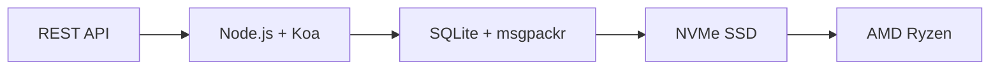

# ה-API המלא הראשון לדואר אלקטרוני: איך Forward Email חוללה מהפכה בניהול דואר אלקטרוני {#the-first-complete-email-api-how-forward-email-revolutionized-email-management}


<p class="lead mt-3">
  <strong>תקציר:</strong> בנינו את ה-REST API המלא הראשון בעולם לניהול דואר אלקטרוני עם יכולות חיפוש מתקדמות שאף שירות אחר לא מציע. בעוד Gmail, Outlook ו-Apple מכריחים מפתחים להסתבך בגיהנום IMAP או ב-APIs עם הגבלות קצב, Forward Email מספקת פעולות CRUD מהירות להפליא עבור הודעות, תיקיות, אנשי קשר ולוחות שנה דרך ממשק REST מאוחד עם מעל 15 פרמטרי חיפוש. זהו ה-API לדואר אלקטרוני שמפתחים חיכו לו.
</p>


## תוכן העניינים {#table-of-contents}

* [הבעיה עם API לדואר אלקטרוני](#the-email-api-problem)
* [מה שמפתחים באמת אומרים](#what-developers-are-actually-saying)
* [הפתרון המהפכני של Forward Email](#forward-emails-revolutionary-solution)
  * [למה בנינו את זה](#why-we-built-this)
  * [אימות פשוט](#simple-authentication)
* [20 נקודות קצה שמשנות הכל](#20-endpoints-that-change-everything)
  * [הודעות (5 נקודות קצה)](#messages-5-endpoints)
  * [תיקיות (5 נקודות קצה)](#folders-5-endpoints)
  * [אנשי קשר (5 נקודות קצה)](#contacts-5-endpoints)
  * [לוחות שנה (5 נקודות קצה)](#calendars-5-endpoints)
* [חיפוש מתקדם: אין שירות אחר שמשווה](#advanced-search-no-other-service-compares)
  * [נוף ה-API לחיפוש שבור](#the-search-api-landscape-is-broken)
  * [ה-API המהפכני לחיפוש של Forward Email](#forward-emails-revolutionary-search-api)
  * [דוגמאות חיפוש מהעולם האמיתי](#real-world-search-examples)
  * [יתרונות ביצועים](#performance-advantages)
  * [תכונות חיפוש שאף אחד אחר לא מציע](#search-features-no-one-else-has)
  * [למה זה חשוב למפתחים](#why-this-matters-for-developers)
  * [היישום הטכני](#the-technical-implementation)
* [ארכיטקטורת ביצועים מהירה להפליא](#blazing-fast-performance-architecture)
  * [מדדי ביצועים](#performance-benchmarks)
  * [ארכיטקטורת פרטיות בראשונה](#privacy-first-architecture)
* [למה אנחנו שונים: ההשוואה המלאה](#why-were-different-the-complete-comparison)
  * [מגבלות ספקים מרכזיים](#major-provider-limitations)
  * [יתרונות Forward Email](#forward-email-advantages)
  * [בעיית השקיפות בקוד פתוח](#the-open-source-transparency-problem)
* [מעל 30 דוגמאות אינטגרציה מהעולם האמיתי](#30-real-world-integration-examples)
  * [1. שיפור טופס יצירת קשר בוורדפרס](#1-wordpress-contact-form-enhancement)
  * [2. אלטרנטיבה ל-Zapier לאוטומציה בדואר אלקטרוני](#2-zapier-alternative-for-email-automation)
  * [3. סינכרון דואר אלקטרוני ב-CRM](#3-crm-email-synchronization)
  * [4. עיבוד הזמנות מסחר אלקטרוני](#4-e-commerce-order-processing)
  * [5. אינטגרציה עם מערכת כרטיסי תמיכה](#5-support-ticket-integration)
  * [6. מערכת ניהול ניוזלטרים](#6-newsletter-management-system)
  * [7. ניהול משימות מבוסס דואר אלקטרוני](#7-email-based-task-management)
  * [8. איסוף דואר אלקטרוני מריבוי חשבונות](#8-multi-account-email-aggregation)
  * [9. לוח מחוונים לניתוח דואר אלקטרוני מתקדם](#9-advanced-email-analytics-dashboard)
  * [10. ארכיון דואר אלקטרוני חכם](#10-smart-email-archiving)
  * [11. אינטגרציה בין דואר אלקטרוני ללוח שנה](#11-email-to-calendar-integration)
  * [12. גיבוי דואר אלקטרוני וציות](#12-email-backup-and-compliance)
  * [13. ניהול תוכן מבוסס דואר אלקטרוני](#13-email-based-content-management)
  * [14. ניהול תבניות דואר אלקטרוני](#14-email-template-management)
  * [15. אוטומציה של זרימות עבודה מבוססות דואר אלקטרוני](#15-email-based-workflow-automation)
  * [16. ניטור אבטחת דואר אלקטרוני](#16-email-security-monitoring)
  * [17. איסוף סקרים מבוסס דואר אלקטרוני](#17-email-based-survey-collection)
  * [18. ניטור ביצועי דואר אלקטרוני](#18-email-performance-monitoring)
  * [19. סינון לידים מבוסס דואר אלקטרוני](#19-email-based-lead-qualification)
  * [20. ניהול פרויקטים מבוסס דואר אלקטרוני](#20-email-based-project-management)
  * [21. ניהול מלאי מבוסס דואר אלקטרוני](#21-email-based-inventory-management)
  * [22. עיבוד חשבוניות מבוסס דואר אלקטרוני](#22-email-based-invoice-processing)
  * [23. רישום לאירועים מבוסס דואר אלקטרוני](#23-email-based-event-registration)
  * [24. זרימת עבודה לאישור מסמכים מבוססת דואר אלקטרוני](#24-email-based-document-approval-workflow)
  * [25. ניתוח משוב לקוחות מבוסס דואר אלקטרוני](#25-email-based-customer-feedback-analysis)
  * [26. צינור גיוס מבוסס דואר אלקטרוני](#26-email-based-recruitment-pipeline)
  * [27. עיבוד דוחות הוצאות מבוסס דואר אלקטרוני](#27-email-based-expense-report-processing)
  * [28. דיווח אבטחת איכות מבוסס דואר אלקטרוני](#28-email-based-quality-assurance-reporting)
  * [29. ניהול ספקים מבוסס דואר אלקטרוני](#29-email-based-vendor-management)
  * [30. ניטור מדיה חברתית מבוסס דואר אלקטרוני](#30-email-based-social-media-monitoring)
* [התחלת עבודה](#getting-started)
  * [1. צור את חשבון Forward Email שלך](#1-create-your-forward-email-account)
  * [2. הפק אישורי API](#2-generate-api-credentials)
  * [3. בצע את קריאת ה-API הראשונה שלך](#3-make-your-first-api-call)
  * [4. עיין בתיעוד](#4-explore-the-documentation)
* [משאבים טכניים](#technical-resources)
## הבעיה עם API של דואר אלקטרוני {#the-email-api-problem}

API של דואר אלקטרוני שבורים ביסודם. נקודה.

כל ספק דואר אלקטרוני גדול מאלץ מפתחים לבחור באחת משתי אפשרויות נוראות:

1. **גיהינום IMAP**: התמודדות עם פרוטוקול בן 30 שנה שנועד ללקוחות שולחן עבודה, לא לאפליקציות מודרניות  
2. **API מוגבלים**: API עם הגבלות קצב, קריאה בלבד, מורכבות OAuth שלא יכולים לנהל את נתוני הדואר האלקטרוני שלך בפועל

התוצאה? מפתחים או מוותרים לחלוטין על אינטגרציית דואר אלקטרוני או מבזבזים שבועות בבניית עטיפות IMAP שבירות שמתפרקות כל הזמן.

> \[!WARNING]  
> **הסוד המלוכלך**: רוב "API של דואר אלקטרוני" הם רק API לשליחה. אי אפשר לארגן תיקיות, לסנכרן אנשי קשר או לנהל לוחות שנה בצורה תכנותית דרך ממשק REST פשוט. עד עכשיו.


## מה שמפתחים באמת אומרים {#what-developers-are-actually-saying}

התסכול אמיתי ומתועד בכל מקום:

> "ניסיתי לאחרונה לשלב את Gmail באפליקציה שלי, והשקעתי בזה יותר מדי זמן. החלטתי שזה לא שווה לתמוך ב-Gmail."  
>  
> *- [מפתח ב-Hacker News](https://news.ycombinator.com/item?id=42106944), 147 הצבעות חיוביות*

> "האם כל API של דואר אלקטרוני בינוניים? הם נראים מוגבלים או מגבילים במידה כלשהי."  
>  
> *- [דיון ב-Reddit r/SaaS](https://www.reddit.com/r/SaaS/comments/1cm84s7/are_all_email_apis_mediocre/)*

> "למה פיתוח דואר אלקטרוני חייב להיות כל כך גרוע?"  
>  
> *- [Reddit r/webdev](https://www.reddit.com/r/webdev/comments/15trnp2/why_does_email_development_have_to_suck/), 89 תגובות של כאב מפתחים*

> "מה עושה את ה-Gmail API ליעיל יותר מ-IMAP? סיבה נוספת לכך שה-Gmail API הרבה יותר יעיל היא שהוא צריך להוריד כל הודעה רק פעם אחת. עם IMAP, כל הודעה חייבת להיות מורדת ומאונדקסת..."  
>  
> *- [שאלה ב-Stack Overflow](https://stackoverflow.com/questions/25431022/what-makes-the-gmail-api-more-efficient-than-imap) עם 47 הצבעות חיוביות*

הראיות נמצאות בכל מקום:

* **בעיות SMTP בוורדפרס**: [631 דיווחים ב-GitHub](https://github.com/awesomemotive/WP-Mail-SMTP/issues) על כשלונות בהעברת דואר  
* **מגבלות Zapier**: [תלונות קהילה](https://community.zapier.com/featured-articles-65/email-parser-by-zapier-limitations-and-alternatives-16958) על הגבלת 10 מיילים לשעה וכשלונות בזיהוי IMAP  
* **פרויקטים של API ל-IMAP**: [רבים](https://github.com/ewildgoose/imap-api) [קוד פתוח](https://emailengine.app/) [קיימים](https://www.npmjs.com/package/imapflow) במיוחד כדי "להמיר IMAP ל-REST" כי אף ספק לא מציע זאת  
* **תסכולים מ-Gmail API**: [Stack Overflow](https://stackoverflow.com/questions/tagged/gmail-api) מכיל 4,847 שאלות עם התג "gmail-api" עם תלונות נפוצות על הגבלות קצב ומורכבות


## הפתרון המהפכני של Forward Email {#forward-emails-revolutionary-solution}

**אנחנו השירות הראשון לדואר אלקטרוני שמציע פעולות CRUD מלאות לכל נתוני הדואר דרך API REST מאוחד.**

זה לא רק API לשליחה. זו שליטה תכנותית מלאה על:

* **הודעות**: יצירה, קריאה, עדכון, מחיקה, חיפוש, העברה, סימון  
* **תיקיות**: ניהול תיקיות IMAP מלא דרך נקודות קצה REST  
* **אנשי קשר**: אחסון וסנכרון אנשי קשר ב-[CardDAV](https://tools.ietf.org/html/rfc6352)  
* **לוחות שנה**: אירועים ותזמון בלוחות שנה ב-[CalDAV](https://tools.ietf.org/html/rfc4791)  

### למה בנינו את זה {#why-we-built-this}

**הבעיה**: כל ספק דואר אלקטרוני מתייחס לדואר כקופסה שחורה. אפשר לשלוח מיילים, אולי לקרוא אותם עם OAuth מורכב, אבל אי אפשר באמת *לנהל* את נתוני הדואר שלך בצורה תכנותית.

**החזון שלנו**: דואר אלקטרוני צריך להיות קל לשילוב כמו כל API מודרני. בלי ספריות IMAP. בלי מורכבות OAuth. בלי סיוטי הגבלת קצב. רק נקודות קצה REST פשוטות שעובדות.

**התוצאה**: השירות הראשון לדואר אלקטרוני שבו אפשר לבנות לקוח דואר מלא, אינטגרציית CRM או מערכת אוטומציה באמצעות בקשות HTTP בלבד.

### אימות פשוט {#simple-authentication}

בלי [מורכבות OAuth](https://oauth.net/2/). בלי [סיסמאות ספציפיות לאפליקציה](https://support.google.com/accounts/answer/185833). רק אישורי האליאס שלך:

```bash
curl -u "alias@yourdomain.com:password" \
  https://api.forwardemail.net/v1/messages
```
## 20 נקודות קצה שמשנות הכל {#20-endpoints-that-change-everything}

### הודעות (5 נקודות קצה) {#messages-5-endpoints}

* `GET /v1/messages` - רשימת הודעות עם סינון (`?folder=`, `?is_unread=`, `?is_flagged=`)
* `POST /v1/messages` - שליחת הודעות חדשות ישירות לתיקיות
* `GET /v1/messages/:id` - קבלת הודעה ספציפית עם כל המטא-דאטה
* `PUT /v1/messages/:id` - עדכון הודעה (דגלים, תיקיה, סטטוס קריאה)
* `DELETE /v1/messages/:id` - מחיקת הודעה לצמיתות

### תיקיות (5 נקודות קצה) {#folders-5-endpoints}

* `GET /v1/folders` - רשימת כל התיקיות עם סטטוס מנוי
* `POST /v1/folders` - יצירת תיקיה חדשה עם מאפיינים מותאמים אישית
* `GET /v1/folders/:id` - קבלת פרטי תיקיה ומספר ההודעות
* `PUT /v1/folders/:id` - עדכון מאפייני תיקיה ומנוי
* `DELETE /v1/folders/:id` - מחיקת תיקיה וטיפול בהעברת הודעות

### אנשי קשר (5 נקודות קצה) {#contacts-5-endpoints}

* `GET /v1/contacts` - רשימת אנשי קשר עם חיפוש ודפדוף
* `POST /v1/contacts` - יצירת איש קשר חדש עם תמיכה מלאה ב-vCard
* `GET /v1/contacts/:id` - קבלת איש קשר עם כל השדות והמטא-דאטה
* `PUT /v1/contacts/:id` - עדכון פרטי איש קשר עם אימות ETag
* `DELETE /v1/contacts/:id` - מחיקת איש קשר עם טיפול מפלסי

### לוחות שנה (5 נקודות קצה) {#calendars-5-endpoints}

* `GET /v1/calendars` - רשימת אירועי לוח שנה עם סינון תאריכים
* `POST /v1/calendars` - יצירת אירוע לוח שנה עם משתתפים וחזרה
* `GET /v1/calendars/:id` - קבלת פרטי אירוע עם טיפול באזור זמן
* `PUT /v1/calendars/:id` - עדכון אירוע עם זיהוי קונפליקטים
* `DELETE /v1/calendars/:id` - מחיקת אירוע עם התראות למשתתפים


## חיפוש מתקדם: אף שירות אחר לא מתקרב {#advanced-search-no-other-service-compares}

**Forward Email הוא שירות הדואר האלקטרוני היחיד שמציע חיפוש מקיף ותכנותי בכל שדות ההודעה דרך REST API.**

בעוד שספקים אחרים מציעים סינון בסיסי בלבד, בנינו את ממשק ה-API לחיפוש הדואר האלקטרוני המתקדם ביותר שנוצר אי פעם. אף API של Gmail, Outlook או שירות אחר לא מתקרב ליכולות החיפוש שלנו.

### נוף ממשקי ה-API לחיפוש שבור {#the-search-api-landscape-is-broken}

**מגבלות חיפוש ב-Gmail API:**

* ✅ פרמטר `q` בסיסי בלבד
* ❌ אין חיפוש לפי שדה ספציפי
* ❌ אין סינון טווח תאריכים
* ❌ אין סינון לפי גודל
* ❌ אין סינון לפי קבצים מצורפים
* ❌ מוגבל לסינטקס החיפוש של Gmail

**מגבלות חיפוש ב-Outlook API:**

* ✅ פרמטר `$search` בסיסי
* ❌ אין מיקוד מתקדם בשדות
* ❌ אין שילובי שאילתות מורכבים
* ❌ הגבלת קצב אגרסיבית
* ❌ דרוש סינטקס OData מורכב

**Apple iCloud:**

* ❌ אין API כלל
* ❌ חיפוש IMAP בלבד (אם מצליחים להפעיל אותו)

**ProtonMail & Tuta:**

* ❌ אין APIs ציבוריים
* ❌ אין יכולות חיפוש תכנותיות

### ממשק החיפוש המהפכני של Forward Email {#forward-emails-revolutionary-search-api}

**אנו מציעים מעל 15 פרמטרי חיפוש שאף שירות אחר לא מספק:**

| יכולת חיפוש                  | Forward Email                          | Gmail API    | Outlook API        | אחרים |
| ------------------------------ | -------------------------------------- | ------------ | ------------------ | ------ |
| **חיפוש לפי שדה ספציפי**      | ✅ נושא, גוף, מ-אל, אל, העתק, כותרות    | ❌            | ❌                  | ❌      |
| **חיפוש כללי רב-שדות**         | ✅ `?search=` על כל השדות               | ✅ בסיסי `q=` | ✅ בסיסי `$search=` | ❌      |
| **סינון טווח תאריכים**         | ✅ `?since=` & `?before=`               | ❌            | ❌                  | ❌      |
| **סינון לפי גודל**              | ✅ `?min_size=` & `?max_size=`          | ❌            | ❌                  | ❌      |
| **סינון לפי קבצים מצורפים**    | ✅ `?has_attachments=true/false`        | ❌            | ❌                  | ❌      |
| **חיפוש בכותרות**              | ✅ `?headers=X-Priority`                | ❌            | ❌                  | ❌      |
| **חיפוש לפי מזהה הודעה**       | ✅ `?message_id=abc123`                 | ❌            | ❌                  | ❌      |
| **פילטרים משולבים**            | ✅ פרמטרים מרובים עם לוגיקת AND        | ❌            | ❌                  | ❌      |
| **חיפוש שאינו תלוי רישיות**    | ✅ כל החיפושים                         | ✅            | ✅                  | ❌      |
| **תמיכה בדפדוף**               | ✅ עובד עם כל פרמטרי החיפוש            | ✅            | ✅                  | ❌      |
### דוגמאות חיפוש מהעולם האמיתי {#real-world-search-examples}

**מצא את כל החשבוניות מהרבעון האחרון:**

```bash
# Forward Email - פשוט וחזק
GET /v1/messages?subject=invoice&since=2024-01-01T00:00:00Z&before=2024-04-01T00:00:00Z

# Gmail API - בלתי אפשרי עם החיפוש המוגבל שלהם
# אין סינון טווח תאריכים זמין

# Outlook API - תחביר OData מורכב, פונקציונליות מוגבלת
GET /me/messages?$search="invoice"&$filter=receivedDateTime ge 2024-01-01T00:00:00Z
```

**חפש קבצים מצורפים גדולים ממקור ספציפי:**

```bash
# Forward Email - סינון מקיף
GET /v1/messages?from=finance@company.com&has_attachments=true&min_size=1000000

# Gmail API - לא ניתן לסנן לפי גודל או קבצים מצורפים באופן תכנותי
# Outlook API - אין סינון לפי גודל זמין
# אחרים - אין APIs זמינים
```

**חיפוש מורכב עם שדות מרובים:**

```bash
# Forward Email - יכולות שאילתות מתקדמות
GET /v1/messages?body=quarterly&from=manager&is_flagged=true&folder=Reports

# Gmail API - מוגבל לחיפוש טקסט בסיסי בלבד
GET /gmail/v1/users/me/messages?q=quarterly

# Outlook API - חיפוש בסיסי ללא מיקוד שדות
GET /me/messages?$search="quarterly"
```

### יתרונות ביצועים {#performance-advantages}

**ביצועי חיפוש Forward Email:**

* ⚡ **זמני תגובה מתחת ל-100ms** עבור חיפושים מורכבים
* 🔍 **אופטימיזציית Regex** עם אינדקסים נכונים
* 📊 **הרצת שאילתות במקביל** לספירה ונתונים
* 💾 **שימוש יעיל בזיכרון** עם שאילתות קלות

**בעיות ביצועים אצל מתחרים:**

* 🐌 **Gmail API**: מוגבל ל-250 יחידות קצב למשתמש לשנייה
* 🐌 **Outlook API**: הגבלת קצב אגרסיבית עם דרישות חזרה מורכבות
* 🐌 **אחרים**: אין APIs להשוואה

### תכונות חיפוש שאף אחד אחר לא מציע {#search-features-no-one-else-has}

#### 1. חיפוש לפי כותרות ספציפיות {#1-header-specific-search}

```bash
# מצא הודעות עם כותרות ספציפיות
GET /v1/messages?headers=X-Priority:1
GET /v1/messages?headers=X-Spam-Score
```

#### 2. אינטיליגנציה מבוססת גודל {#2-size-based-intelligence}

```bash
# מצא מיילים של ניוזלטר (בדרך כלל גדולים)
GET /v1/messages?min_size=50000&from=newsletter

# מצא תגובות מהירות (בדרך כלל קטנים)
GET /v1/messages?max_size=1000&to=support
```

#### 3. זרימות עבודה מבוססות קבצים מצורפים {#3-attachment-based-workflows}

```bash
# מצא את כל המסמכים שנשלחו לצוות המשפטי
GET /v1/messages?to=legal&has_attachments=true&body=contract

# מצא מיילים ללא קבצים מצורפים לניקוי
GET /v1/messages?has_attachments=false&before=2023-01-01T00:00:00Z
```

#### 4. לוגיקה עסקית משולבת {#4-combined-business-logic}

```bash
# מצא הודעות דחופות עם דגלים מ-VIP עם קבצים מצורפים
GET /v1/messages?is_flagged=true&from=ceo&has_attachments=true&subject=urgent
```

### למה זה חשוב למפתחים {#why-this-matters-for-developers}

**בנה אפליקציות שהיו בלתי אפשריות בעבר:**

1. **אנליטיקה מתקדמת של מיילים**: ניתוח דפוסי מייל לפי גודל, שולח, תוכן
2. **ניהול מיילים חכם**: ארגון אוטומטי על בסיס קריטריונים מורכבים
3. **ציות וגילוי**: מצא מיילים ספציפיים לצרכים משפטיים
4. **בינה עסקית**: הפקת תובנות מדפוסי תקשורת במייל
5. **זרימות עבודה אוטומטיות**: הפעלת פעולות על בסיס מסנני מייל מתוחכמים

### המימוש הטכני {#the-technical-implementation}

API החיפוש שלנו משתמש ב:

* **אופטימיזציית Regex** עם אסטרטגיות אינדקס נכונות
* **הרצה במקביל** לשיפור ביצועים
* **אימות קלט** לאבטחה
* **טיפול שגיאות מקיף** לאמינות

```javascript
// דוגמה: מימוש חיפוש מורכב
const searchConditions = [];

if (ctx.query.subject) {
  searchConditions.push({
    subject: { $regex: ctx.query.subject, $options: 'i' }
  });
}

if (ctx.query.from) {
  searchConditions.push({
    $or: [
      { 'from.address': { $regex: ctx.query.from, $options: 'i' } },
      { 'from.name': { $regex: ctx.query.from, $options: 'i' } }
    ]
  });
}

// שילוב עם לוגיקת AND
if (searchConditions.length > 0) {
  query.$and = searchConditions;
}
```

> \[!TIP]
> **יתרון למפתחים**: עם API החיפוש של Forward Email, תוכלו לבנות אפליקציות מייל שמתחרות בלקוחות שולחן עבודה בפונקציונליות תוך שמירה על הפשטות של REST APIs.
## ארכיטקטורת ביצועים מהירה במיוחד {#blazing-fast-performance-architecture}

הטכנולוגיה שלנו בנויה למהירות ואמינות:


```mermaid
graph LR
    A[REST API] --> B[Node.js + Koa]
    B --> C[SQLite + msgpackr]
    C --> D[NVMe SSD]
    D --> E[AMD Ryzen]
```

### מדדי ביצועים {#performance-benchmarks}

**למה אנחנו מהירים כמו ברק:**

| רכיב         | טכנולוגיה                                                                        | יתרון ביצועים                                |
| ------------ | --------------------------------------------------------------------------------- | --------------------------------------------- |
| **אחסון**    | [NVMe SSD](https://en.wikipedia.org/wiki/NVM_Express)                             | מהיר פי 10 מ-SATA מסורתי                      |
| **מסד נתונים** | [SQLite](https://sqlite.org/) + [msgpackr](https://github.com/kriszyp/msgpackr)   | אפס השהיית רשת, סריאליזציה מותאמת            |
| **חומרה**   | [AMD Ryzen](https://www.amd.com/en/products/processors/desktops/ryzen) bare metal | ללא עומס וירטואליזציה                         |
| **מטמון**   | בזיכרון + מתמיד                                                                  | זמני תגובה מתחת למילישנייה                     |
| **גיבויים** | [Cloudflare R2](https://www.cloudflare.com/products/r2/) מוצפן                    | אמינות ברמת ארגון                              |

**מספרי ביצועים אמיתיים:**

* **זמן תגובת API**: < 50ms בממוצע
* **שליפת הודעות**: < 10ms להודעות במטמון
* **פעולות תיקייה**: < 5ms לפעולות מטה-נתונים
* **סנכרון אנשי קשר**: 1000+ אנשי קשר לשנייה
* **זמינות**: 99.99% SLA עם תשתית מיותרת

### ארכיטקטורת פרטיות בראש סדר העדיפויות {#privacy-first-architecture}

**עיצוב ללא ידע**: רק לך יש גישה עם סיסמת ה-IMAP שלך - אנחנו לא יכולים לקרוא את המיילים שלך. ה-[ארכיטקטורת ללא ידע](https://forwardemail.net/en/security) שלנו מבטיחה פרטיות מלאה תוך כדי מתן ביצועים מהירים במיוחד.


## למה אנחנו שונים: ההשוואה המלאה {#why-were-different-the-complete-comparison}

### מגבלות ספקים מרכזיים {#major-provider-limitations}

| ספק             | בעיות עיקריות                          | מגבלות ספציפיות                                                                                                                                                                                                                                                                                                                                                                                                                                                   |
| ---------------- | ------------------------------------- | ------------------------------------------------------------------------------------------------------------------------------------------------------------------------------------------------------------------------------------------------------------------------------------------------------------------------------------------------------------------------------------------------------------------------------------------------------------------ |
| **Gmail API**    | קריאה בלבד, OAuth מורכב, APIs נפרדים  | • [לא ניתן לשנות הודעות קיימות](https://developers.google.com/gmail/api/reference/rest/v1/users.messages)<br>• [תוויות ≠ תיקיות](https://developers.google.com/gmail/api/reference/rest/v1/users.labels)<br>• [מגבלת 1 מיליארד יחידות קווטה ליום](https://developers.google.com/gmail/api/reference/quota)<br>• [דורש APIs נפרדים](https://developers.google.com/workspace) לאנשי קשר/לוח שנה                                                           |
| **Outlook API**  | מיושן, מבלבל, ממוקד ארגונים          | • [נקודות קצה REST מיושנות במרץ 2024](https://learn.microsoft.com/en-us/outlook/rest/compare-graph)<br>• [מספר APIs מבלבלים](https://learn.microsoft.com/en-us/office/client-developer/outlook/selecting-an-api-or-technology-for-developing-solutions-for-outlook) (EWS, Graph, REST)<br>• [מורכבות Microsoft Graph](https://learn.microsoft.com/en-us/graph/overview)<br>• [הגבלת תעבורה אגרסיבית](https://learn.microsoft.com/en-us/graph/throttling) |
| **Apple iCloud** | ללא API ציבורי                       | • [אין API ציבורי כלל](https://support.apple.com/en-us/102654)<br>• [IMAP בלבד עם מגבלת 1000 מיילים ליום](https://support.apple.com/en-us/102654)<br>• [נדרשות סיסמאות ספציפיות לאפליקציה](https://support.apple.com/en-us/102654)<br>• [מגבלת 500 נמענים להודעה](https://support.apple.com/en-us/102654)                                                                                                                                              |
| **ProtonMail**   | ללא API, טענות שגויות על קוד פתוח     | • [אין API ציבורי זמין](https://proton.me/support/protonmail-bridge-clients)<br>• [נדרש תוכנת Bridge](https://proton.me/mail/bridge) לגישה ל-IMAP<br>• [טוענים "קוד פתוח"](https://proton.me/blog/open-source) אך [קוד השרת קנייני](https://github.com/ProtonMail)<br>• [מוגבל לתכניות בתשלום בלבד](https://proton.me/pricing)                                                                                                         |
| **Tuta**         | ללא API, שקיפות מטעה                  | • [אין REST API לניהול מיילים](https://tuta.com/support#technical)<br>• [טוענים "קוד פתוח"](https://tuta.com/blog/posts/open-source-email) אך [השרת סגור](https://github.com/tutao/tutanota)<br>• [IMAP/SMTP לא נתמכים](https://tuta.com/support#imap)<br>• [הצפנה קניינית](https://tuta.com/encryption) מונעת אינטגרציות סטנדרטיות                                                                                               |
| **Zapier Email** | מגבלות קצב חמורות                   | • [מגבלת 10 מיילים לשעה](https://help.zapier.com/hc/en-us/articles/8496181555597-Email-Parser-by-Zapier-limitations-and-alternatives)<br>• [אין גישה לתיקיות IMAP](https://help.zapier.com/hc/en-us/articles/8496181555597-Email-Parser-by-Zapier-limitations-and-alternatives)<br>• [יכולות ניתוח מוגבלות](https://help.zapier.com/hc/en-us/articles/8496181555597-Email-Parser-by-Zapier-limitations-and-alternatives)                                 |
### יתרונות של העברת דואר אלקטרוני {#forward-email-advantages}

| תכונה              | העברת דואר אלקטרוני                                                                          | תחרות                                    |
| ------------------ | -------------------------------------------------------------------------------------------- | ----------------------------------------- |
| **CRUD מלא**       | ✅ יצירה, קריאה, עדכון ומחיקה מלאים לכל הנתונים                                            | ❌ קריאה בלבד או פעולות מוגבלות            |
| **API מאוחד**      | ✅ הודעות, תיקיות, אנשי קשר, לוחות שנה ב-API אחד                                           | ❌ APIs נפרדים או תכונות חסרות            |
| **אימות פשוט**     | ✅ אימות בסיסי עם פרטי זיהוי של כינוי                                                        | ❌ OAuth מורכב עם תחומי הרשאה מרובים        |
| **ללא הגבלות קצב** | ✅ מגבלות נדיבות המיועדות ליישומים אמיתיים                                                | ❌ מכסות מגבילות שמפריעות לזרימות עבודה    |
| **אירוח עצמי**     | ✅ [אפשרות אירוח עצמי מלאה](https://forwardemail.net/en/blog/docs/self-hosted-solution)     | ❌ נעילה לספק בלבד                         |
| **פרטיות**        | ✅ אפס ידע, מוצפן, פרטי                                                                     | ❌ כריית נתונים ודאגות פרטיות              |
| **ביצועים**       | ✅ תגובות מתחת ל-50ms, אחסון NVMe                                                          | ❌ השהיות רשת, האטות                      |

### בעיית השקיפות בקוד פתוח {#the-open-source-transparency-problem}

**ProtonMail ו-Tuta משווקים את עצמם כ"קוד פתוח" ו"שקופים", אך זהו שיווק מטעה המפר את עקרונות הפרטיות המודרניים.**

> \[!WARNING]
> **טענות שקיפות שגויות**: גם ProtonMail וגם Tuta מפרסמים בולטות את תעודות ה"קוד הפתוח" שלהם תוך שמירת קוד השרת הקריטי שלהם כסגור וקנייני.

**הטעיית ProtonMail:**

* **טענות**: ["אנחנו קוד פתוח"](https://proton.me/blog/open-source) מופיע בולט בשיווק
* **מציאות**: [קוד השרת הוא קנייני לחלוטין](https://github.com/ProtonMail) - רק אפליקציות הלקוח הן קוד פתוח
* **השפעה**: משתמשים אינם יכולים לאמת את ההצפנה בצד השרת, טיפול בנתונים או טענות פרטיות
* **הפרת שקיפות**: אין דרך לבדוק את מערכות עיבוד ואחסון הדואר האלקטרוני בפועל

**שיווק מטעה של Tuta:**

* **טענות**: ["דואר אלקטרוני בקוד פתוח"](https://tuta.com/blog/posts/open-source-email) כנקודת מכירה מרכזית
* **מציאות**: [תשתית השרת היא קוד סגור](https://github.com/tutao/tutanota) - רק הממשק הקדמי זמין
* **השפעה**: הצפנה קניינית מונעת פרוטוקולי דואר סטנדרטיים (IMAP/SMTP)
* **אסטרטגיית נעילה**: הצפנה מותאמת מאלצת תלות בספק

**מדוע זה חשוב לפרטיות מודרנית:**

בשנת 2025, פרטיות אמיתית דורשת **שקיפות מלאה**. כאשר ספקי דואר טוענים "קוד פתוח" אך מסתירים את קוד השרת:

1. **הצפנה בלתי ניתנת לאימות**: אינך יכול לבדוק כיצד הנתונים שלך מוצפנים בפועל
2. **פרקטיקות נתונים מוסתרות**: טיפול בנתונים בצד השרת נשאר תיבת שחורה
3. **אבטחה מבוססת אמון**: עליך לסמוך על הטענות ללא אימות
4. **נעילה לספק**: מערכות קנייניות מונעות העברת נתונים

**השקיפות האמיתית של Forward Email:**

* ✅ **[קוד פתוח מלא](https://github.com/forwardemail/forwardemail.net)** - קוד שרת ולקוח
* ✅ **[אפשרות אירוח עצמי](https://forwardemail.net/en/blog/docs/self-hosted-solution)** - הפעל מופע משלך
* ✅ **פרוטוקולים סטנדרטיים** - תאימות ל-IMAP, SMTP, CardDAV, CalDAV
* ✅ **אבטחה ניתנת לבדיקה** - כל שורת קוד ניתנת לבחינה
* ✅ **ללא נעילה לספק** - הנתונים שלך, השליטה שלך

> \[!TIP]
> **קוד פתוח אמיתי מאפשר לך לאמת כל טענה.** עם Forward Email, אתה יכול לבדוק את ההצפנה שלנו, לסקור את טיפול הנתונים, ואפילו להפעיל מופע משלך. זו שקיפות אמיתית.


## 30+ דוגמאות אינטגרציה מהעולם האמיתי {#30-real-world-integration-examples}

### 1. שיפור טופס יצירת קשר בוורדפרס {#1-wordpress-contact-form-enhancement}
**בעיה**: [כשלונות בקונפיגורציית SMTP של וורדפרס](https://github.com/awesomemotive/WP-Mail-SMTP/issues) ([631 נושאים בגיטהאב](https://github.com/awesomemotive/WP-Mail-SMTP/issues))
**פתרון**: אינטגרציה ישירה עם API מדלגת על [SMTP](https://tools.ietf.org/html/rfc5321) לחלוטין

```javascript
// טופס יצירת קשר בוורדפרס ששומר בתיקיית נשלחו
await fetch('https://api.forwardemail.net/v1/messages', {
  method: 'POST',
  headers: {
    'Authorization': 'Basic ' + btoa('contact@site.com:password'),
    'Content-Type': 'application/json'
  },
  body: JSON.stringify({
    to: [{ address: 'owner@site.com' }],
    subject: 'טופס יצירת קשר: ' + formData.subject,
    text: formData.message,
    folder: 'Sent'
  })
});
```

### 2. אלטרנטיבה ל-Zapier לאוטומציה של דואר אלקטרוני {#2-zapier-alternative-for-email-automation}

**בעיה**: [מגבלת 10 מיילים לשעה של Zapier](https://help.zapier.com/hc/en-us/articles/8496181555597-Email-Parser-by-Zapier-limitations-and-alternatives) ו-[כשלונות בזיהוי IMAP](https://community.zapier.com/featured-articles-65/email-parser-by-zapier-limitations-and-alternatives-16958)
**פתרון**: אוטומציה בלתי מוגבלת עם שליטה מלאה בדואר האלקטרוני

```javascript
// ארגון אוטומטי של מיילים לפי דומיין השולח
const messages = await fetch('/v1/messages?folder=INBOX');
for (const message of messages) {
  const domain = message.from.split('@')[1];
  await fetch(`/v1/messages/${message.id}`, {
    method: 'PUT',
    body: JSON.stringify({ folder: `Clients/${domain}` })
  });
}
```

### 3. סינכרון דואר אלקטרוני עם CRM {#3-crm-email-synchronization}

**בעיה**: ניהול ידני של אנשי קשר בין דואר אלקטרוני ל-[מערכות CRM](https://en.wikipedia.org/wiki/Customer_relationship_management)
**פתרון**: סינכרון דו-כיווני עם API אנשי קשר של [CardDAV](https://tools.ietf.org/html/rfc6352)

```javascript
// סנכרון אנשי קשר חדשים מהדואר אלקטרוני ל-CRM
const newContacts = await fetch('/v1/contacts');
for (const contact of newContacts) {
  await crmAPI.createContact({
    name: contact.name,
    email: contact.email,
    source: 'email_api'
  });
}
```

### 4. עיבוד הזמנות מסחר אלקטרוני {#4-e-commerce-order-processing}

**בעיה**: עיבוד ידני של מיילי הזמנות עבור [פלטפורמות מסחר אלקטרוני](https://en.wikipedia.org/wiki/E-commerce)
**פתרון**: צינור ניהול הזמנות אוטומטי

```javascript
// עיבוד מיילי אישור הזמנה
const orders = await fetch('/v1/messages?folder=Orders');
const orderEmails = orders.filter(msg =>
  msg.subject.includes('Order Confirmation')
);

for (const order of orderEmails) {
  const orderData = parseOrderEmail(order.text);
  await updateInventory(orderData);
  await fetch(`/v1/messages/${order.id}`, {
    method: 'PUT',
    body: JSON.stringify({ folder: 'Orders/Processed' })
  });
}
```

### 5. אינטגרציה של כרטיסי תמיכה {#5-support-ticket-integration}

**בעיה**: שרשורי מייל מפוזרים ברחבי [פלטפורמות תמיכה](https://en.wikipedia.org/wiki/Help_desk_software)
**פתרון**: מעקב מלא אחר שרשורי דואר אלקטרוני

```javascript
// יצירת כרטיס תמיכה משרשור מיילים
const messages = await fetch('/v1/messages?folder=Support');
const supportEmails = messages.filter(msg =>
  msg.to.some(addr => addr.includes('support@'))
);

for (const email of supportEmails) {
  const ticket = await supportSystem.createTicket({
    subject: email.subject,
    from: email.from,
    body: email.text,
    timestamp: email.date
  });
}
```

### 6. מערכת ניהול ניוזלטרים {#6-newsletter-management-system}

**בעיה**: אינטגרציות מוגבלות עם [פלטפורמות ניוזלטר](https://en.wikipedia.org/wiki/Email_marketing)
**פתרון**: ניהול מלא של מחזור חיי המנויים

```javascript
// ניהול אוטומטי של הרשמות לניוזלטר
const messages = await fetch('/v1/messages?folder=Newsletter');
const unsubscribes = messages.filter(msg =>
  msg.subject.toLowerCase().includes('unsubscribe')
);

for (const msg of unsubscribes) {
  await removeSubscriber(msg.from);
  await fetch(`/v1/messages/${msg.id}`, {
    method: 'PUT',
    body: JSON.stringify({ folder: 'Newsletter/Unsubscribed' })
  });
}
```

### 7. ניהול משימות מבוסס דואר אלקטרוני {#7-email-based-task-management}

**בעיה**: עומס בתיבת הדואר ו-[מעקב משימות](https://en.wikipedia.org/wiki/Task_management)
**פתרון**: המרת מיילים למשימות ניתנות לביצוע
```javascript
// Create tasks from flagged emails
const messages = await fetch('/v1/messages?is_flagged=true');
for (const email of messages) {
  await taskManager.createTask({
    title: email.subject,
    description: email.text,
    assignee: email.to[0].address,
    dueDate: extractDueDate(email.text)
  });
}
```

### 8. Multi-Account Email Aggregation {#8-multi-account-email-aggregation}

**Problem**: Managing [multiple email accounts](https://en.wikipedia.org/wiki/Email_client) across providers
**Solution**: Unified inbox interface

```javascript
// Aggregate emails from multiple accounts
const accounts = ['work@domain.com', 'personal@domain.com'];
const allMessages = [];

for (const account of accounts) {
  const messages = await fetch('/v1/messages', {
    headers: { 'Authorization': getAuth(account) }
  });
  allMessages.push(...messages.map(m => ({ ...m, account })));
}
```

### 9. Advanced Email Analytics Dashboard {#9-advanced-email-analytics-dashboard}

**Problem**: No insights into [email patterns](https://en.wikipedia.org/wiki/Email_analytics) with sophisticated filtering
**Solution**: Custom email analytics using advanced search capabilities

```javascript
// Generate comprehensive email analytics using advanced search
const analytics = {};

// Analyze email volume by sender domain
const messages = await fetch('/v1/messages');
analytics.senderDomains = analyzeSenderDomains(messages);

// Find large attachments consuming storage
const largeAttachments = await fetch('/v1/messages?has_attachments=true&min_size=1000000');
analytics.storageHogs = largeAttachments.map(msg => ({
  subject: msg.subject,
  from: msg.from,
  size: msg.size
}));

// Analyze communication patterns with VIPs
const vipEmails = await fetch('/v1/messages?from=ceo@company.com');
const urgentVipEmails = await fetch('/v1/messages?from=ceo@company.com&subject=urgent');
analytics.vipCommunication = {
  total: vipEmails.length,
  urgent: urgentVipEmails.length,
  urgencyRate: (urgentVipEmails.length / vipEmails.length) * 100
};

// Find unread emails by date range for follow-up
const lastWeek = new Date(Date.now() - 7 * 24 * 60 * 60 * 1000).toISOString();
const unreadRecent = await fetch(`/v1/messages?is_unread=true&since=${lastWeek}`);
analytics.followUpNeeded = unreadRecent.length;

// Analyze email sizes for optimization
const smallEmails = await fetch('/v1/messages?max_size=1000');
const mediumEmails = await fetch('/v1/messages?min_size=1000&max_size=50000');
const largeEmails = await fetch('/v1/messages?min_size=50000');
analytics.sizeDistribution = {
  small: smallEmails.length,
  medium: mediumEmails.length,
  large: largeEmails.length
};

// Search for compliance-related emails
const complianceEmails = await fetch('/v1/messages?body=confidential&has_attachments=true');
analytics.complianceReview = complianceEmails.length;
```

### 10. Smart Email Archiving {#10-smart-email-archiving}

**Problem**: Manual [email organization](https://en.wikipedia.org/wiki/Email_management)
**Solution**: Intelligent email categorization

```javascript
// Auto-archive old emails by category
const messages = await fetch('/v1/messages');
const oldEmails = messages.filter(email =>
  isOlderThan(email.date, 90) // 90 days
);

for (const email of oldEmails) {
  const category = categorizeEmail(email);
  await fetch(`/v1/messages/${email.id}`, {
    method: 'PUT',
    body: JSON.stringify({ folder: `Archive/${category}` })
  });
}
```

### 11. Email-to-Calendar Integration {#11-email-to-calendar-integration}

**Problem**: Manual [calendar event](https://tools.ietf.org/html/rfc4791) creation from emails
**Solution**: Automatic event extraction and creation

```javascript
// Extract meeting details from emails
const messages = await fetch('/v1/messages?folder=Meetings');
const meetingEmails = messages.filter(email =>
  email.subject.toLowerCase().includes('meeting')
);

for (const email of meetingEmails) {
  const meetingData = extractMeetingInfo(email.text);
  if (meetingData.date && meetingData.time) {
    await fetch('/v1/calendars', {
      method: 'POST',
      body: JSON.stringify({
        title: email.subject,
        start: meetingData.datetime,
        attendees: [email.from, ...email.to]
      })
    });
  }
}
```

### 12. גיבוי דואר אלקטרוני וציות {#12-email-backup-and-compliance}

**בעיה**: [שמירת דואר אלקטרוני](https://en.wikipedia.org/wiki/Email_retention_policy) ודרישות ציות  
**פתרון**: גיבוי אוטומטי עם שימור מטא-דאטה

```javascript
// Backup emails with full metadata
const allMessages = await fetch('/v1/messages');
const backup = {
  timestamp: new Date(),
  messages: allMessages.map(msg => ({
    id: msg.id,
    subject: msg.subject,
    from: msg.from,
    to: msg.to,
    date: msg.date,
    flags: msg.flags
  }))
};
await saveToComplianceStorage(backup);
```

### 13. ניהול תוכן מבוסס דואר אלקטרוני {#13-email-based-content-management}

**בעיה**: ניהול הגשות תוכן דרך דואר אלקטרוני עבור [פלטפורמות CMS](https://en.wikipedia.org/wiki/Content_management_system)  
**פתרון**: דואר אלקטרוני כמערכת ניהול תוכן

```javascript
// Process content submissions from email
const messages = await fetch('/v1/messages?folder=Submissions');
const submissions = messages.filter(msg =>
  msg.to.some(addr => addr.includes('submit@'))
);

for (const submission of submissions) {
  const content = parseSubmission(submission.text);
  await cms.createDraft({
    title: submission.subject,
    content: content.body,
    author: submission.from
  });
}
```

### 14. ניהול תבניות דואר אלקטרוני {#14-email-template-management}

**בעיה**: [תבניות דואר אלקטרוני](https://en.wikipedia.org/wiki/Email_template) לא עקביות בצוות  
**פתרון**: מערכת תבניות מרכזית עם API

```javascript
// Send templated emails with dynamic content
const template = await getEmailTemplate('welcome');
await fetch('/v1/messages', {
  method: 'POST',
  body: JSON.stringify({
    to: [{ address: newUser.email }],
    subject: template.subject.replace('{{name}}', newUser.name),
    html: template.html.replace('{{name}}', newUser.name),
    folder: 'Sent'
  })
});
```

### 15. אוטומציה של תהליכי עבודה מבוססי דואר אלקטרוני {#15-email-based-workflow-automation}

**בעיה**: תהליכי [אישור ידניים](https://en.wikipedia.org/wiki/Workflow) דרך דואר אלקטרוני  
**פתרון**: טריגרים אוטומטיים לתהליכי עבודה

```javascript
// Process approval emails
const messages = await fetch('/v1/messages?folder=Approvals');
const approvals = messages.filter(msg =>
  msg.subject.includes('APPROVAL')
);

for (const approval of approvals) {
  const decision = parseApprovalDecision(approval.text);
  await workflow.processApproval({
    requestId: extractRequestId(approval.subject),
    decision: decision,
    approver: approval.from
  });
}
```

### 16. ניטור אבטחת דואר אלקטרוני {#16-email-security-monitoring}

**בעיה**: גילוי איומי אבטחה [ידני](https://en.wikipedia.org/wiki/Email_security)  
**פתרון**: ניתוח איומים אוטומטי

```javascript
// Monitor for suspicious emails
const recentEmails = await fetch('/v1/messages');
for (const email of recentEmails) {
  const threatScore = analyzeThreat(email);
  if (threatScore > 0.8) {
    await fetch(`/v1/messages/${email.id}`, {
      method: 'PUT',
      body: JSON.stringify({ folder: 'Security/Quarantine' })
    });
    await alertSecurityTeam(email);
  }
}
```

### 17. איסוף סקרים מבוסס דואר אלקטרוני {#17-email-based-survey-collection}

**בעיה**: עיבוד תגובות סקר [ידני](https://en.wikipedia.org/wiki/Survey_methodology)  
**פתרון**: אגירת תגובות אוטומטית

```javascript
// Collect and process survey responses
const messages = await fetch('/v1/messages?folder=Surveys');
const responses = messages.filter(msg =>
  msg.subject.includes('Survey Response')
);

const surveyData = responses.map(email => ({
  respondent: email.from,
  responses: parseSurveyData(email.text),
  timestamp: email.date
}));
await updateSurveyResults(surveyData);
```

### 18. ניטור ביצועי דואר אלקטרוני {#18-email-performance-monitoring}

**בעיה**: חוסר נראות על [ביצועי משלוח דואר אלקטרוני](https://en.wikipedia.org/wiki/Email_deliverability)  
**פתרון**: מדדי דואר אלקטרוני בזמן אמת

```javascript
// Monitor email delivery performance
const sentEmails = await fetch('/v1/messages?folder=Sent');
const deliveryStats = {
  sent: sentEmails.length,
  bounces: await countBounces(),
  deliveryRate: calculateDeliveryRate()
};
await updateDashboard(deliveryStats);
```
### 19. סינון לידים מבוסס דואר אלקטרוני {#19-email-based-lead-qualification}

**בעיה**: ניקוד לידים ידני ([lead scoring](https://en.wikipedia.org/wiki/Lead_scoring)) מתוך אינטראקציות בדואר אלקטרוני  
**פתרון**: צינור סינון לידים אוטומטי

```javascript
// Score leads based on email engagement
const prospects = await fetch('/v1/contacts');
for (const prospect of prospects) {
  const messages = await fetch('/v1/messages');
  const emails = messages.filter(msg =>
    msg.from.includes(prospect.email)
  );
  const score = calculateEngagementScore(emails);
  await crm.updateLeadScore(prospect.id, score);
}
```

### 20. ניהול פרויקטים מבוסס דואר אלקטרוני {#20-email-based-project-management}

**בעיה**: [עדכוני פרויקטים](https://en.wikipedia.org/wiki/Project_management) מפוזרים בשרשורי דואר אלקטרוני  
**פתרון**: מרכז תקשורת פרויקטים מרוכז

```javascript
// Extract project updates from emails
const messages = await fetch('/v1/messages?folder=Projects');
const projectEmails = messages.filter(msg =>
  msg.subject.includes('Project Update')
);

for (const email of projectEmails) {
  const update = parseProjectUpdate(email.text);
  await projectManager.addUpdate({
    project: update.projectId,
    author: email.from,
    content: update.content
  });
}
```

### 21. ניהול מלאי מבוסס דואר אלקטרוני {#21-email-based-inventory-management}

**בעיה**: עדכוני מלאי ידניים מתוך מיילים מספקים  
**פתרון**: מעקב מלאי אוטומטי מתוך התראות בדואר אלקטרוני

```javascript
// Process inventory updates from supplier emails
const messages = await fetch('/v1/messages?folder=Suppliers');
const inventoryEmails = messages.filter(msg =>
  msg.subject.includes('Inventory Update') || msg.subject.includes('Stock Alert')
);

for (const email of inventoryEmails) {
  const inventoryData = parseInventoryUpdate(email.text);
  await inventory.updateStock({
    sku: inventoryData.sku,
    quantity: inventoryData.quantity,
    supplier: email.from,
    timestamp: email.date
  });

  // Move to processed folder
  await fetch(`/v1/messages/${email.id}`, {
    method: 'PUT',
    body: JSON.stringify({ folder: 'Suppliers/Processed' })
  });
}
```

### 22. עיבוד חשבוניות מבוסס דואר אלקטרוני {#22-email-based-invoice-processing}

**בעיה**: עיבוד חשבוניות ידני ([invoice processing](https://en.wikipedia.org/wiki/Invoice_processing)) ואינטגרציה עם מערכת הנהלת חשבונות  
**פתרון**: חילוץ חשבוניות אוטומטי וסנכרון עם מערכת הנהלת חשבונות

```javascript
// Extract invoice data from email attachments
const messages = await fetch('/v1/messages?folder=Invoices');
const invoiceEmails = messages.filter(msg =>
  msg.subject.toLowerCase().includes('invoice') && msg.attachments.length > 0
);

for (const email of invoiceEmails) {
  const invoiceData = await extractInvoiceData(email.attachments[0]);
  await accounting.createInvoice({
    vendor: email.from,
    amount: invoiceData.total,
    dueDate: invoiceData.dueDate,
    items: invoiceData.lineItems
  });

  // Flag as processed
  await fetch(`/v1/messages/${email.id}`, {
    method: 'PUT',
    body: JSON.stringify({ flags: ['\\Seen', '\\Flagged'] })
  });
}
```

### 23. רישום לאירועים מבוסס דואר אלקטרוני {#23-email-based-event-registration}

**בעיה**: עיבוד ידני של [רישום לאירועים](https://en.wikipedia.org/wiki/Event_management) מתוך תגובות בדואר אלקטרוני  
**פתרון**: ניהול משתתפים אוטומטי ואינטגרציה עם לוח שנה

```javascript
// Process event registration emails
const messages = await fetch('/v1/messages?folder=Events');
const registrations = messages.filter(msg =>
  msg.subject.includes('Registration') || msg.subject.includes('RSVP')
);

for (const registration of registrations) {
  const attendeeData = parseRegistration(registration.text);

  // Add to attendee list
  await events.addAttendee({
    event: attendeeData.eventId,
    name: attendeeData.name,
    email: registration.from,
    dietary: attendeeData.dietaryRestrictions
  });

  // Create calendar event for attendee
  await fetch('/v1/calendars', {
    method: 'POST',
    body: JSON.stringify({
      title: attendeeData.eventName,
      start: attendeeData.eventDate,
      attendees: [registration.from]
    })
  });
}
```
### 24. זרימת עבודה לאישור מסמכים מבוססת דואר אלקטרוני {#24-email-based-document-approval-workflow}

**בעיה**: שרשראות [אישור מסמכים](https://en.wikipedia.org/wiki/Document_management_system) מורכבות באמצעות דואר אלקטרוני  
**פתרון**: מעקב אוטומטי אחר אישורים וגרסאות מסמכים

```javascript
// Track document approval workflow
const messages = await fetch('/v1/messages?folder=Approvals');
const approvalEmails = messages.filter(msg =>
  msg.subject.includes('Document Approval')
);

for (const email of approvalEmails) {
  const approval = parseApprovalEmail(email.text);

  await documentSystem.updateApproval({
    documentId: approval.documentId,
    approver: email.from,
    status: approval.decision, // 'approved', 'rejected', 'needs_changes'
    comments: approval.comments,
    timestamp: email.date
  });

  // Check if all approvals complete
  const document = await documentSystem.getDocument(approval.documentId);
  if (document.allApprovalsComplete) {
    await documentSystem.finalizeDocument(approval.documentId);
  }
}
```

### 25. ניתוח משוב לקוחות מבוסס דואר אלקטרוני {#25-email-based-customer-feedback-analysis}

**בעיה**: איסוף וניתוח רגשות [משוב לקוחות](https://en.wikipedia.org/wiki/Customer_feedback) ידני  
**פתרון**: עיבוד משוב אוטומטי ומעקב רגשי

```javascript
// Analyze customer feedback from emails
const messages = await fetch('/v1/messages?folder=Feedback');
const feedbackEmails = messages.filter(msg =>
  msg.to.some(addr => addr.includes('feedback@'))
);

for (const email of feedbackEmails) {
  const sentiment = await analyzeSentiment(email.text);
  const category = categorizeFeeback(email.text);

  await feedback.recordFeedback({
    customer: email.from,
    content: email.text,
    sentiment: sentiment.score, // -1 to 1
    category: category, // 'bug', 'feature', 'complaint', 'praise'
    priority: calculatePriority(sentiment, category),
    timestamp: email.date
  });

  // Auto-escalate negative feedback
  if (sentiment.score < -0.5) {
    await escalateToSupport(email);
  }
}
```

### 26. צינור גיוס מבוסס דואר אלקטרוני {#26-email-based-recruitment-pipeline}

**בעיה**: גיוס ומעקב מועמדים ידני [גיוס](https://en.wikipedia.org/wiki/Recruitment)  
**פתרון**: ניהול מועמדים אוטומטי ותזמון ראיונות

```javascript
// Process job application emails
const messages = await fetch('/v1/messages?folder=Careers');
const applications = messages.filter(msg =>
  msg.subject.toLowerCase().includes('application') && msg.attachments.length > 0
);

for (const application of applications) {
  const resume = await parseResume(application.attachments[0]);

  const candidate = await ats.createCandidate({
    name: resume.name,
    email: application.from,
    skills: resume.skills,
    experience: resume.experience,
    position: extractPosition(application.subject)
  });

  // Auto-schedule screening if qualified
  if (candidate.qualificationScore > 0.7) {
    await calendar.scheduleInterview({
      candidateId: candidate.id,
      type: 'phone_screening',
      duration: 30
    });
  }
}
```

### 27. עיבוד דוחות הוצאות מבוסס דואר אלקטרוני {#27-email-based-expense-report-processing}

**בעיה**: הגשה ואישור ידני של [דוחות הוצאות](https://en.wikipedia.org/wiki/Expense_report)  
**פתרון**: חילוץ הוצאות אוטומטי וזרימת עבודה לאישור

```javascript
// Process expense report emails
const messages = await fetch('/v1/messages?folder=Expenses');
const expenseEmails = messages.filter(msg =>
  msg.subject.includes('Expense') && msg.attachments.length > 0
);

for (const email of expenseEmails) {
  const receipts = await processReceipts(email.attachments);

  const expenseReport = await expenses.createReport({
    employee: email.from,
    expenses: receipts.map(receipt => ({
      amount: receipt.total,
      category: receipt.category,
      date: receipt.date,
      merchant: receipt.merchant
    })),
    totalAmount: receipts.reduce((sum, r) => sum + r.total, 0)
  });

  // Auto-approve small amounts
  if (expenseReport.totalAmount < 100) {
    await expenses.approve(expenseReport.id);
  } else {
    await expenses.sendForApproval(expenseReport.id);
  }
}
```
### 28. דיווח אבטחת איכות מבוסס דואר אלקטרוני {#28-email-based-quality-assurance-reporting}

**בעיה**: מעקב ידני אחר [אבטחת איכות](https://en.wikipedia.org/wiki/Quality_assurance)  
**פתרון**: ניהול אוטומטי של בעיות אבטחת איכות ומעקב אחר באגים

```javascript
// Process QA bug reports from email
const messages = await fetch('/v1/messages?folder=QA');
const bugReports = messages.filter(msg =>
  msg.subject.includes('Bug Report') || msg.subject.includes('QA Issue')
);

for (const report of bugReports) {
  const bugData = parseBugReport(report.text);

  const ticket = await bugTracker.createIssue({
    title: report.subject,
    description: bugData.description,
    severity: bugData.severity,
    steps: bugData.stepsToReproduce,
    reporter: report.from,
    attachments: report.attachments
  });

  // Auto-assign based on component
  const assignee = await getComponentOwner(bugData.component);
  await bugTracker.assign(ticket.id, assignee);

  // Create calendar reminder for follow-up
  await fetch('/v1/calendars', {
    method: 'POST',
    body: JSON.stringify({
      title: `Follow up on ${ticket.id}`,
      start: addDays(new Date(), 3),
      attendees: [assignee]
    })
  });
}
```

### 29. ניהול ספקים מבוסס דואר אלקטרוני {#29-email-based-vendor-management}

**בעיה**: תקשורת ידנית עם [ספקים](https://en.wikipedia.org/wiki/Vendor_management) ומעקב אחר חוזים  
**פתרון**: ניהול אוטומטי של קשרי ספקים

```javascript
// Track vendor communications and contracts
const messages = await fetch('/v1/messages?folder=Vendors');
const vendorEmails = messages.filter(msg =>
  isVendorEmail(msg.from)
);

for (const email of vendorEmails) {
  const vendor = await vendors.getByEmail(email.from);

  // Log communication
  await vendors.logCommunication({
    vendorId: vendor.id,
    type: 'email',
    subject: email.subject,
    content: email.text,
    timestamp: email.date
  });

  // Check for contract-related keywords
  if (email.text.includes('contract') || email.text.includes('renewal')) {
    await vendors.flagForContractReview({
      vendorId: vendor.id,
      emailId: email.id,
      priority: 'high'
    });

    // Create task for procurement team
    await tasks.create({
      title: `Review contract communication from ${vendor.name}`,
      assignee: 'procurement@company.com',
      dueDate: addDays(new Date(), 2)
    });
  }
}
```

### 30. ניטור מדיה חברתית מבוסס דואר אלקטרוני {#30-email-based-social-media-monitoring}

**בעיה**: מעקב ידני אחר אזכורים ב[מדיה חברתית](https://en.wikipedia.org/wiki/Social_media_monitoring) ותגובה  
**פתרון**: עיבוד אוטומטי של התראות מדיה חברתית ותיאום תגובות

```javascript
// Process social media alerts from email notifications
const messages = await fetch('/v1/messages?folder=Social');
const socialAlerts = messages.filter(msg =>
  msg.from.includes('alerts@') || msg.subject.includes('Social Mention')
);

for (const alert of socialAlerts) {
  const mention = parseSocialMention(alert.text);

  await socialMedia.recordMention({
    platform: mention.platform,
    author: mention.author,
    content: mention.content,
    sentiment: mention.sentiment,
    reach: mention.followerCount,
    url: mention.url
  });

  // Auto-escalate negative mentions with high reach
  if (mention.sentiment < -0.5 && mention.followerCount > 10000) {
    await socialMedia.escalateToTeam({
      mentionId: mention.id,
      priority: 'urgent',
      assignee: 'social-media-manager@company.com'
    });

    // Create calendar reminder for immediate response
    await fetch('/v1/calendars', {
      method: 'POST',
      body: JSON.stringify({
        title: `Urgent: Respond to negative social mention`,
        start: addMinutes(new Date(), 30),
        attendees: ['social-media-manager@company.com']
      })
    });
  }
}
```


## התחלה {#getting-started}

### 1. צור את חשבון הדואר המועבר שלך {#1-create-your-forward-email-account}

הירשם ב-[forwardemail.net](https://forwardemail.net) ואמת את הדומיין שלך.

### 2. הפק אישורי API {#2-generate-api-credentials}

כתובת הדואר האלקטרוני החלופית והסיסמה שלך משמשים כאישורי API - אין צורך בהגדרות נוספות.
### 3. בצע את קריאת ה-API הראשונה שלך {#3-make-your-first-api-call}

```bash
# רשום את ההודעות שלך
curl -u "your-alias@domain.com:password" \
  https://api.forwardemail.net/v1/messages

# צור איש קשר חדש
curl -u "your-alias@domain.com:password" \
  -X POST \
  -H "Content-Type: application/json" \
  -d '{"fullName":"John Doe","emails":[{"value":"john@example.com"}]}' \
  https://api.forwardemail.net/v1/contacts
```

### 4. חקור את התיעוד {#4-explore-the-documentation}

בקר ב-[forwardemail.net/en/email-api](https://forwardemail.net/en/email-api) לקבלת תיעוד API מלא עם דוגמאות אינטראקטיביות.


## משאבים טכניים {#technical-resources}

* **[תיעוד API מלא](https://forwardemail.net/en/email-api)** - מפרט OpenAPI 3.0 אינטראקטיבי
* **[מדריך לאירוח עצמי](https://forwardemail.net/en/blog/docs/self-hosted-solution)** - פרוס את Forward Email בתשתית שלך
* **[מסמך אבטחה](https://forwardemail.net/technical-whitepaper.pdf)** - ארכיטקטורה טכנית ופרטי אבטחה
* **[מאגר GitHub](https://github.com/forwardemail/forwardemail.net)** - קוד מקור בקוד פתוח
* **[תמיכה למפתחים](mailto:api@forwardemail.net)** - גישה ישירה לצוות ההנדסה שלנו

---

**מוכן לחולל מהפכה באינטגרציית האימייל שלך?** [התחל לבנות עם ה-API של Forward Email היום](https://forwardemail.net/en/email-api) וחווה את פלטפורמת ניהול האימייל הראשונה והשלמה שנועדה למפתחים.

*Forward Email: שירות האימייל שמבין סוף סוף APIs.*
