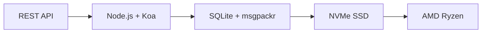

# Az első teljes e-mail API: Hogyan forradalmasította a Forward Email az e-mail-kezelést {#the-first-complete-email-api-how-forward-email-revolutionized-email-management}


<p class="lead mt-3">
<strong>TL;DR:</strong> Mi építettük a világ első teljes REST API-ját e-mail-kezeléshez, olyan fejlett keresési lehetőségekkel, amelyeket egyetlen más szolgáltatás sem kínál. Míg a Gmail, az Outlook és az Apple az IMAP pokolba vagy sebességkorlátozott API-kba kényszeríti a fejlesztőket, a Forward Email villámgyors CRUD műveleteket biztosít üzenetek, mappák, névjegyek és naptárak számára egy egységes REST felületen keresztül, több mint 15 keresési paraméterrel. Erre vártak az e-mail API-fejlesztők.
</p>

## Tartalomjegyzék {#table-of-contents}

* [Az e-mail API problémája](#the-email-api-problem)
* [Amit a fejlesztők valójában mondanak](#what-developers-are-actually-saying)
* [Forradalmi megoldás az e-mail továbbítására](#forward-emails-revolutionary-solution)
  * [Miért építettük ezt](#why-we-built-this)
  * [Egyszerű hitelesítés](#simple-authentication)
* [20 végpont, ami mindent megváltoztat](#20-endpoints-that-change-everything)
  * [Üzenetek (5 végpont)](#messages-5-endpoints)
  * [Mappák (5 végpont)](#folders-5-endpoints)
  * [Kapcsolatok (5 végpont)](#contacts-5-endpoints)
  * [Naptárak (5 végpont)](#calendars-5-endpoints)
* [Összetett keresés: Nincs ehhez hasonló szolgáltatás](#advanced-search-no-other-service-compares)
  * [A Search API környezete hibás](#the-search-api-landscape-is-broken)
  * [A Forward Email forradalmi keresési API-ja](#forward-emails-revolutionary-search-api)
  * [Valós keresési példák](#real-world-search-examples)
  * [Teljesítménybeli előnyök](#performance-advantages)
  * [Olyan keresési funkciók, amelyek senki másnak nincsenek](#search-features-no-one-else-has)
  * [Miért fontos ez a fejlesztők számára?](#why-this-matters-for-developers)
  * [A technikai megvalósítás](#the-technical-implementation)
* [Villámgyors teljesítményű architektúra](#blazing-fast-performance-architecture)
  * [Teljesítménymutatók](#performance-benchmarks)
  * [Adatvédelem-első architektúra](#privacy-first-architecture)
* [Miért vagyunk mások: A teljes összehasonlítás](#why-were-different-the-complete-comparison)
  * [Főbb szolgáltatói korlátozások](#major-provider-limitations)
  * [E-mail továbbításának előnyei](#forward-email-advantages)
  * [A nyílt forráskódú átláthatósági probléma](#the-open-source-transparency-problem)
* [30+ valós integrációs példa](#30-real-world-integration-examples)
  * [1. WordPress kapcsolatfelvételi űrlap fejlesztése](#1-wordpress-contact-form-enhancement)
  * [2. Zapier alternatíva az e-mail automatizáláshoz](#2-zapier-alternative-for-email-automation)
  * [3. CRM e-mail szinkronizálás](#3-crm-email-synchronization)
  * [4. E-kereskedelmi megrendelések feldolgozása](#4-e-commerce-order-processing)
  * [5. Támogatási jegyek integrációja](#5-support-ticket-integration)
  * [6. Hírlevélkezelő rendszer](#6-newsletter-management-system)
  * [7. E-mail alapú feladatkezelés](#7-email-based-task-management)
  * [8. Többfiókos e-mail összesítés](#8-multi-account-email-aggregation)
  * [9. Speciális e-mail-elemzési irányítópult](#9-advanced-email-analytics-dashboard)
  * [10. Intelligens e-mail archiválás](#10-smart-email-archiving)
  * [11. E-mail-naptár integráció](#11-email-to-calendar-integration)
  * [12. E-mail biztonsági mentés és megfelelőség](#12-email-backup-and-compliance)
  * [13. E-mail alapú tartalomkezelés](#13-email-based-content-management)
  * [14. E-mail sablonok kezelése](#14-email-template-management)
  * [15. E-mail-alapú munkafolyamat-automatizálás](#15-email-based-workflow-automation)
  * [16. E-mail biztonsági monitorozás](#16-email-security-monitoring)
  * [17. E-mail alapú kérdőívgyűjtés](#17-email-based-survey-collection)
  * [18. E-mail teljesítményfigyelés](#18-email-performance-monitoring)
  * [19. E-mail alapú érdeklődő-minősítés](#19-email-based-lead-qualification)
  * [20. E-mail alapú projektmenedzsment](#20-email-based-project-management)
  * [21. E-mail alapú készletgazdálkodás](#21-email-based-inventory-management)
  * [22. E-mail alapú számlafeldolgozás](#22-email-based-invoice-processing)
  * [23. E-mail alapú eseményregisztráció](#23-email-based-event-registration)
  * [24. E-mail alapú dokumentum-jóváhagyási munkafolyamat](#24-email-based-document-approval-workflow)
  * [25. E-mail alapú ügyfél-visszajelzés-elemzés](#25-email-based-customer-feedback-analysis)
  * [26. E-mail alapú toborzási folyamat](#26-email-based-recruitment-pipeline)
  * [27. E-mail alapú költségjelentés-feldolgozás](#27-email-based-expense-report-processing)
  * [28. E-mail alapú minőségbiztosítási jelentéskészítés](#28-email-based-quality-assurance-reporting)
  * [29. E-mail alapú szállítókezelés](#29-email-based-vendor-management)
  * [30. E-mail alapú közösségi média monitorozás](#30-email-based-social-media-monitoring)
* [Első lépések](#getting-started)
  * [1. Hozd létre az e-mail továbbítási fiókodat](#1-create-your-forward-email-account)
  * [2. API hitelesítő adatok generálása](#2-generate-api-credentials)
  * [3. Első API-hívás végrehajtása](#3-make-your-first-api-call)
  * [4. A dokumentáció áttekintése](#4-explore-the-documentation)
* [Műszaki források](#technical-resources)

## Az e-mail API problémája {#the-email-api-problem}

Az e-mail API-k alapvetően hibásak. Pont.

Minden nagyobb e-mail szolgáltató két szörnyű választási lehetőség egyikébe kényszeríti a fejlesztőket:

1. **IMAP pokol**: Küzdelem egy 30 éves protokollal, amelyet asztali kliensekhez terveztek, nem modern alkalmazásokhoz.
2. **Megnyomorodott API-k**: Sebességkorlátozott, csak olvasható, OAuth-komplex API-k, amelyek nem tudják kezelni a tényleges e-mail adatait.

Az eredmény? A fejlesztők vagy teljesen elhagyják az e-mail integrációt, vagy heteket pazarolnak arra, hogy törékeny, folyamatosan hibás IMAP-burkolókat építsenek.

> \[!WARNING]
> **A piszkos titok**: A legtöbb „e-mail API” csak küldő API. Nem lehet programozottan mappákat rendezni, névjegyeket szinkronizálni vagy naptárakat kezelni egy egyszerű REST felületen keresztül. Eddig.

## Amit a fejlesztők valójában mondanak {#what-developers-are-actually-saying}

A frusztráció valós és mindenhol dokumentált:

> „Nemrég megpróbáltam integrálni a Gmailt az alkalmazásomba, és túl sok időt töltöttem vele. Úgy döntöttem, hogy nem éri meg támogatni a Gmailt.”

> > *- [Hacker News fejlesztő](https://news.ycombinator.com/item?id=42106944), 147 szavazat*

> „Minden e-mail API középszerű? Valamilyen módon korlátozottnak vagy korlátozónak tűnnek.”

> > *- [Reddit r/SaaS beszélgetés](https://www.reddit.com/r/SaaS/comments/1cm84s7/are_all_email_apis_mediocre/)*

> „Miért kell az e-mail fejlesztésnek pocséknak lennie?”

> *- [Reddit r/webdev](https://www.reddit.com/r/webdev/comments/15trnp2/why_does_email_development_have_to_suck/), 89 hozzászólás a fejlesztői fájdalomról*

> „Mi teszi a Gmail API-t hatékonyabbá az IMAP-nál? A Gmail API sokkal hatékonyabbá tételének másik oka az, hogy minden üzenetet csak egyszer kell letöltenie. Az IMAP használatával minden üzenetet le kell tölteni és indexelni kell...”
>
> *- [Stack Overflow kérdés](https://stackoverflow.com/questions/25431022/what-makes-the-gmail-api-more-efficient-than-imap) 47 szavazattal*

A bizonyítékok mindenhol ott vannak:

* **WordPress SMTP problémák**: [631 GitHub-problémák](https://github.com/awesomemotive/WP-Mail-SMTP/issues) az e-mail kézbesítési hibákról
* **Zapier korlátozások**: [Közösségi panaszok](https://community.zapier.com/featured-articles-65/email-parser-by-zapier-limitations-and-alternatives-16958) körülbelül 10 e-mail/óra limit és IMAP észlelési hibák
* **IMAP API projektek**: [Több](https://github.com/ewildgoose/imap-api) [nyílt forráskódú](https://emailengine.app/) A [projektek](https://www.npmjs.com/package/imapflow) kifejezetten az "IMAP REST-té konvertálására" szolgál, mert ezt egyetlen szolgáltató sem kínálja.
* **Gmail API problémák**: [Stack Overflow](https://stackoverflow.com/questions/tagged/gmail-api) 4847 kérdést tett fel "gmail-api" címkével, gyakori panaszokkal a sebességkorlátokkal és a bonyolultsággal kapcsolatban.

## Forradalmi megoldás az e-mail továbbítására {#forward-emails-revolutionary-solution}

**Mi vagyunk az első e-mail szolgáltató, amely teljes körű CRUD műveleteket kínál minden e-mail adathoz egy egységes REST API-n keresztül.**

Ez nem csak egy újabb küldő API. Ez teljes programozott kontrollt biztosít a következők felett:

* **Üzenetek**: Létrehozás, olvasás, frissítés, törlés, keresés, áthelyezés, megjelölés
* **Mappák**: Teljes IMAP mappakezelés REST végpontokon keresztül
* **Névjegyek**: [CardDAV](https://tools.ietf.org/html/rfc6352) névjegytárolás és szinkronizálás
* **Naptárak**: [CalDAV](https://tools.ietf.org/html/rfc4791) naptáresemények és ütemezés

### Miért építettük ezt a {#why-we-built-this}}

**A probléma**: Minden e-mail szolgáltató fekete dobozként kezeli az e-maileket. Küldhetsz e-maileket, esetleg el is olvashatod őket komplex OAuth hitelesítéssel, de az e-mail adataid *kezelése* nem igazán lehetséges programozottan.

**Víziónk**: Az e-mail integrálása olyan egyszerű kell, hogy legyen, mint bármely modern API. Nincsenek IMAP könyvtárak. Nincs bonyolult OAuth. Nincsenek rémálmok a sebességkorlátozással kapcsolatban. Csak egyszerű, működő REST végpontok.

**Az eredmény**: Az első olyan e-mail szolgáltatás, ahol teljes e-mail klienst, CRM-integrációt vagy automatizálási rendszert építhetsz fel pusztán HTTP-kérések használatával.

### Egyszerű hitelesítés {#simple-authentication}

Nincs [OAuth összetettség](https://oauth.net/2/). Nincs [alkalmazásspecifikus jelszavak](https://support.google.com/accounts/answer/185833). Csak az alias hitelesítő adatai:

```bash
curl -u "alias@yourdomain.com:password" \
  https://api.forwardemail.net/v1/messages
```

## 20 végpont, ami mindent megváltoztat {#20-endpoints-that-change-everything}

### Üzenetek (5 végpont) {#messages-5-endpoints}

* `GET /v1/messages` - Üzenetek listázása szűréssel (`?folder=`, `?is_unread=`, `?is_flagged=`)
* `POST /v1/messages` - Új üzenetek küldése közvetlenül a mappákba
* `GET /v1/messages/:id` - Adott üzenet lekérése teljes metaadataival
* `PUT /v1/messages/:id` - Üzenet frissítése (jelzők, mappa, olvasási állapot)
* `DELETE /v1/messages/:id` - Üzenet végleges törlése

### Mappák (5 végpont) {#folders-5-endpoints}

* `GET /v1/folders` - Feliratkozási állapotú összes mappa listázása
* `POST /v1/folders` - Új mappa létrehozása egyéni tulajdonságokkal
* `GET /v1/folders/:id` - Mappaadatok és üzenetek számának lekérése
* `PUT /v1/folders/:id` - Mappatulajdonságok és előfizetés frissítése
* `DELETE /v1/folders/:id` - Mappa törlése és üzenetek áthelyezésének kezelése

### Kapcsolatok (5 végpont) {#contacts-5-endpoints}

* `GET /v1/contacts` - Kapcsolatok listázása kereséssel és lapozással
* `POST /v1/contacts` - Új kapcsolat létrehozása teljes vCard-támogatással
* `GET /v1/contacts/:id` - Kapcsolat lekérése az összes mezővel és metaadattal
* `PUT /v1/contacts/:id` - Kapcsolati adatok frissítése ETag-érvényesítéssel
* `DELETE /v1/contacts/:id` - Kapcsolat törlése kaszkádkezeléssel

### Naptárak (5 végpont) {#calendars-5-endpoints}

* `GET /v1/calendars` - Naptáresemények listázása dátumszűréssel
* `POST /v1/calendars` - Naptáresemény létrehozása résztvevőkkel és ismétlődéssel
* `GET /v1/calendars/:id` - Esemény részleteinek lekérése időzóna-kezeléssel
* `PUT /v1/calendars/:id` - Esemény frissítése ütközésészleléssel
* `DELETE /v1/calendars/:id` - Esemény törlése résztvevői értesítésekkel

## Összetett keresés: Nincs ehhez hasonló szolgáltatás: {#advanced-search-no-other-service-compares}

**A Forward Email az egyetlen e-mail szolgáltatás, amely átfogó, programozott keresést kínál az összes üzenetmezőben REST API-n keresztül.**

Míg más szolgáltatók legfeljebb alapvető szűrést kínálnak, mi megépítettük a valaha készült legfejlettebb e-mail kereső API-t. Egyetlen Gmail API, Outlook API vagy más szolgáltatás sem közelíti meg a mi keresési képességeinket.

### A Search API környezete hibás {#the-search-api-landscape-is-broken}

**Gmail API keresési korlátai:**

* ✅ Csak az alapvető `q` paraméter
* ❌ Nincs mezőspecifikus keresés
* ❌ Nincs dátumtartomány-szűrés
* ❌ Nincs méretalapú szűrés
* ❌ Nincs mellékletszűrés
* ❌ A Gmail keresési szintaxisára korlátozva

**Az Outlook API keresési korlátai:**

* ✅ Alap `$search` paraméter
* ❌ Nincs speciális mezőcélzás
* ❌ Nincsenek összetett lekérdezéskombinációk
* ❌ Agresszív sebességkorlátozás
* ❌ Összetett OData szintaxis szükséges

**Apple iCloud:**

* ❌ Nincs API
* ❌ Csak IMAP keresés (ha működik)

**ProtonMail és Tuta:**

* ❌ Nincsenek nyilvános API-k
* ❌ Nincsenek programozott keresési lehetőségek

### Forward Email keresési API {#forward-emails-revolutionary-search-api}

**Több mint 15 keresési paramétert kínálunk, amelyeket más szolgáltatás nem biztosít:**

| Keresési képesség | E-mail továbbítása | Gmail API | Outlook API | Mások |
| ------------------------------ | -------------------------------------- | ------------ | ------------------ | ------ |
| **Mezőspecifikus keresés** | ✅ Tárgy, törzs, feladó, címzett, másolat, fejlécek | ❌ | ❌ | ❌ |
| **Több mezős általános keresés** | ✅ `?search=` minden mezőben | ✅ Alapvető `q=` | ✅ Alapvető `$search=` | ❌ |
| **Dátumtartomány szűrése** | ✅ `?since=` & `?before=` | ❌ | ❌ | ❌ |
| **Méretalapú szűrés** | ✅ `?min_size=` & `?max_size=` | ❌ | ❌ | ❌ |
| **Mellékletszűrés** | ✅ `?has_attachments=true/false` | ❌ | ❌ | ❌ |
| **Fejléc keresése** | ✅ `?headers=X-Priority` | ❌ | ❌ | ❌ |
| **Üzenetazonosító keresése** | ✅ `?message_id=abc123` | ❌ | ❌ | ❌ |
| **Kombinált szűrők** | ✅ Több paraméter ÉS logikával | ❌ | ❌ | ❌ |
| **Kis- és nagybetűket nem megkülönböztető** | ✅ Minden keresés | ✅ | ✅ | ❌ |
| **Oldalszámozás támogatása** | ✅ Minden keresési paraméterrel működik | ✅ | ✅ | ❌ |

### Valós keresési példák {#real-world-search-examples}

**Az előző negyedév összes számlájának megkeresése:**

```bash
# Forward Email - Simple and powerful
GET /v1/messages?subject=invoice&since=2024-01-01T00:00:00Z&before=2024-04-01T00:00:00Z

# Gmail API - Impossible with their limited search
# No date range filtering available

# Outlook API - Complex OData syntax, limited functionality
GET /me/messages?$search="invoice"&$filter=receivedDateTime ge 2024-01-01T00:00:00Z
```

**Nagyméretű mellékletek keresése adott feladótól:**

```bash
# Forward Email - Comprehensive filtering
GET /v1/messages?from=finance@company.com&has_attachments=true&min_size=1000000

# Gmail API - Cannot filter by size or attachments programmatically
# Outlook API - No size filtering available
# Others - No APIs available
```

**Összetett, többmezős keresés:**

```bash
# Forward Email - Advanced query capabilities
GET /v1/messages?body=quarterly&from=manager&is_flagged=true&folder=Reports

# Gmail API - Limited to basic text search only
GET /gmail/v1/users/me/messages?q=quarterly

# Outlook API - Basic search without field targeting
GET /me/messages?$search="quarterly"
```

### Teljesítménybeli előnyök {#performance-advantages}

**E-mail továbbítási keresési teljesítménye:**

* ⚡ **100 ms alatti válaszidők** összetett keresésekhez
* 🔍 **Reguláris kifejezések optimalizálása** megfelelő indexeléssel
* 📊 **Párhuzamos lekérdezés-végrehajtás** darabszámhoz és adatokhoz
* 💾 **Hatékony memória-kihasználás** lean lekérdezésekkel

**Versenytársi teljesítményproblémák:**

* 🐌 **Gmail API**: A sebesség felhasználónként másodpercenként legfeljebb 250 kvótaegységre korlátozódik.
* 🐌 **Outlook API**: Agresszív sávszélesség-szabályozás összetett várakozási követelményekkel.
* 🐌 **Egyéb**: Nincsenek összehasonlítható API-k.

### Keresési funkciók, amelyek senki másnak nincsenek {#search-features-no-one-else-has}

#### 1. Fejlécspecifikus keresés {#1-header-specific-search}

```bash
# Find messages with specific headers
GET /v1/messages?headers=X-Priority:1
GET /v1/messages?headers=X-Spam-Score
```

#### 2. Méretalapú intelligencia {#2-size-based-intelligence}

```bash
# Find newsletter emails (typically large)
GET /v1/messages?min_size=50000&from=newsletter

# Find quick replies (typically small)
GET /v1/messages?max_size=1000&to=support
```

#### 3. Mellékletalapú munkafolyamatok {#3-attachment-based-workflows}

```bash
# Find all documents sent to legal team
GET /v1/messages?to=legal&has_attachments=true&body=contract

# Find emails without attachments for cleanup
GET /v1/messages?has_attachments=false&before=2023-01-01T00:00:00Z
```

#### 4. Kombinált üzleti logika {#4-combined-business-logic}

```bash
# Find urgent flagged messages from VIPs with attachments
GET /v1/messages?is_flagged=true&from=ceo&has_attachments=true&subject=urgent
```

### Miért fontos ez a fejlesztők számára {#why-this-matters-for-developers}

**Olyan alkalmazások készítése, amelyek korábban lehetetlenek voltak:**

1. **Speciális e-mail-analitika**: E-mail-minták elemzése méret, feladó és tartalom szerint
2. **Intelligens e-mail-kezelés**: Automatikus rendezés összetett kritériumok alapján
3. **Megfelelőség és felderítés**: Jogi követelményeknek megfelelő e-mailek keresése
4. **Üzleti intelligencia**: Betekintések kinyerése az e-mail-kommunikációs mintákból
5. **Automatizált munkafolyamatok**: Műveletek indítása kifinomult e-mail-szűrők alapján

### A technikai megvalósítás {#the-technical-implementation}

Keresési API-nk a következőket használja:

* **Reguláris kifejezések optimalizálása** megfelelő indexelési stratégiákkal
* **Párhuzamos végrehajtás** a teljesítmény érdekében
* **Beviteli validáció** a biztonság érdekében
* **Átfogó hibakezelés** a megbízhatóság érdekében

```javascript
// Example: Complex search implementation
const searchConditions = [];

if (ctx.query.subject) {
  searchConditions.push({
    subject: { $regex: ctx.query.subject, $options: 'i' }
  });
}

if (ctx.query.from) {
  searchConditions.push({
    $or: [
      { 'from.address': { $regex: ctx.query.from, $options: 'i' } },
      { 'from.name': { $regex: ctx.query.from, $options: 'i' } }
    ]
  });
}

// Combine with AND logic
if (searchConditions.length > 0) {
  query.$and = searchConditions;
}
```

> \[!TIP]
> **Fejlesztői előny**: A Forward Email keresési API-jával olyan e-mail alkalmazásokat hozhat létre, amelyek funkcionalitásban vetekednek az asztali kliensekkel, miközben megőrzik a REST API-k egyszerűségét.

## Villámgyors teljesítményű architektúra {#blazing-fast-performance-architecture}

Technikai rendszerünket a sebességre és a megbízhatóságra építettük:



### Teljesítmény-összehasonlító tesztek {#performance-benchmarks}

**Miért vagyunk villámgyorsak:**

| Összetevő | Technológia | Teljesítménynövelő |
| ------------ | --------------------------------------------------------------------------------- | --------------------------------------------- |
| **Tárolás** | [NVMe SSD](https://en.wikipedia.org/wiki/NVM_Express) | 10-szer gyorsabb, mint a hagyományos SATA |
| **Adatbázis** | [SQLite](https://sqlite.org/) + [msgpackr](https://github.com/kriszyp/msgpackr) | Nulla hálózati késleltetés, optimalizált szerializáció |
| **Hardver** | [AMD Ryzen](https://www.amd.com/en/products/processors/desktops/ryzen) csupasz fém | Nincsenek virtualizációs költségek |
| **Gyorsítótárolás** | Memóriában tárolt + perzisztens | Milliszekundumos válaszidők |
| **Biztonsági mentések** | [Cloudflare R2](https://www.cloudflare.com/products/r2/) titkosítva | Vállalati szintű megbízhatóság |

**Valós teljesítményadatok:**

* **API válaszidő**: átlagosan < 50 ms
* **Üzenet lekérése**: < 10 ms gyorsítótárazott üzenetek esetén
* **Mappa műveletek**: < 5 ms metaadat-műveletek esetén
* **Kapcsolat szinkronizálása**: 1000+ kapcsolat/másodperc
* **Üzemidő**: 99,99%-os SLA redundáns infrastruktúrával

### Adatvédelem-első architektúra {#privacy-first-architecture}

**Nulla tudásalapú tervezés**: Csak Ön férhet hozzá az IMAP jelszavával – mi nem tudjuk elolvasni az e-mailjeit. A [nulla tudású architektúra](https://forwardemail.net/en/security) jelszavunk teljes adatvédelmet biztosít, miközben kiváló teljesítményt nyújt.

## Miért vagyunk mások: Teljes körű összehasonlítás {#why-were-different-the-complete-comparison}

### Főbb szolgáltatói korlátozások {#major-provider-limitations}

| Szolgáltató | Alapvető problémák | Specifikus korlátozások |
| ---------------- | ----------------------------------------- | -------------------------------------------------------------------------------------------------------------------------------------------------------------------------------------------------------------------------------------------------------------------------------------------------------------------------------------------------------------------------------------------------------------------------------------------------------------------- |
| **Gmail API** | Csak olvasható, összetett OAuth, külön API-k | • [Cannot modify existing messages](https://developers.google.com/gmail/api/reference/rest/v1/users.messages)<br>• [Labels ≠ folders](https://developers.google.com/gmail/api/reference/rest/v1/users.labels)<br>• [1 billion quota units/day limit](https://developers.google.com/gmail/api/reference/quota)<br>• [Requires separate APIs](https://developers.google.com/workspace) névjegyekhez/naptárhoz |
| **Outlook API** | Elavult, zavaró, vállalati fókuszú | • [REST endpoints deprecated March 2024](https://learn.microsoft.com/en-us/outlook/rest/compare-graph)<br>• [Multiple confusing APIs](https://learn.microsoft.com/en-us/office/client-developer/outlook/selecting-an-api-or-technology-for-developing-solutions-for-outlook) (EWS, Grafikon, REST)<br>• [Microsoft Graph complexity](https://learn.microsoft.com/en-us/graph/overview)<br>• [Aggressive throttling](https://learn.microsoft.com/en-us/graph/throttling) |
| **Apple iCloud** | Nincs nyilvános API | • [No public API whatsoever](https://support.apple.com/en-us/102654)<br>• [IMAP-only with 1000 emails/day limit](https://support.apple.com/en-us/102654)<br>• [App-specific passwords required](https://support.apple.com/en-us/102654)<br>• [500 recipients per message limit](https://support.apple.com/en-us/102654) |
| **ProtonMail** | Nincs API, hamis nyílt forráskódú állítások | • [No public API available](https://proton.me/support/protonmail-bridge-clients)<br>• [Bridge software required](https://proton.me/mail/bridge) IMAP hozzáféréshez<br>• [Claims "open source"](https://proton.me/blog/open-source) de [server code is proprietary](https://github.com/ProtonMail)<br>• [Limited to paid plans only](https://proton.me/pricing) |
| **Teljes** | Nincs API, félrevezető átláthatóság | • [No REST API for email management](https://tuta.com/support#technical)<br>• [Claims "open source"](https://tuta.com/blog/posts/open-source-email), de [backend is closed](https://github.com/tutao/tutanota)<br>• [IMAP/SMTP not supported](https://tuta.com/support#imap)<br>• [Proprietary encryption](https://tuta.com/encryption) megakadályozza a szabványos integrációkat |
| **Zapier e-mail** | Szigorú árkorlátozások | • [10 emails per hour limit](https://help.zapier.com/hc/en-us/articles/8496181555597-Email-Parser-by-Zapier-limitations-and-alternatives)<br>• [No IMAP folder access](https://help.zapier.com/hc/en-us/articles/8496181555597-Email-Parser-by-Zapier-limitations-and-alternatives)<br>• [Limited parsing capabilities](https://help.zapier.com/hc/en-us/articles/8496181555597-Email-Parser-by-Zapier-limitations-and-alternatives) |

### E-mail továbbításának előnyei {#forward-email-advantages}

| Jellemző | E-mail továbbítása | Verseny |
| ------------------ | -------------------------------------------------------------------------------------------- | ----------------------------------------- |
| **Teljes CRUD** | ✅ Teljes körű létrehozás, olvasás, frissítés és törlés az összes adathoz | ❌ Csak olvasható vagy korlátozott műveletek |
| **Egységes API** | ✅ Üzenetek, mappák, névjegyek, naptárak egyetlen API-ban | ❌ Külön API-k vagy hiányzó funkciók |
| **Egyszerű hitelesítés** | ✅ Alapszintű hitelesítés alias hitelesítő adatokkal | ❌ Komplex OAuth több hatókörrel |
| **Nincsenek díjkorlátok** | ✅ Nagylelkű korlátok valós alkalmazásokhoz tervezve | ❌ Korlátozó kvóták, amelyek megzavarják a munkafolyamatokat |
| **Saját tárhely** | ✅ [Complete self-hosting option](https://forwardemail.net/en/blog/docs/self-hosted-solution) | ❌ Csak szállítói zárolás |
| **Magánélet** | ✅ Nulla tudás, titkosított, privát | ❌ Adatbányászat és adatvédelmi aggályok |
| **Teljesítmény** | ✅ 50 ms alatti válaszidő, NVMe tárhely | ❌ Hálózati késleltetés, szabályozási késések |

### A nyílt forráskódú átláthatósági probléma {#the-open-source-transparency-problem}

**A ProtonMail és a Tuta „nyílt forráskódú” és „átlátható” szoftverként reklámozza magát, de ez félrevezető marketing, amely sérti a modern adatvédelmi elveket.**

> \[!WARNING]
> **Hamis átláthatósági állítások**: Mind a ProtonMail, mind a Tuta kiemelten reklámozza „nyílt forráskódú” hitelesítő adatait, miközben a legfontosabb szerveroldali kódjukat zártként és titokban tartják.

**A ProtonMail megtévesztése:**

* **Állítások**: A ["Nyílt forráskódúak vagyunk"](https://proton.me/blog/open-source) kiemelt helyen szerepel a marketingben
* **Valóság**: [A szerverkód teljes mértékben szabadalmaztatott](https://github.com/ProtonMail) - csak a kliensalkalmazások nyílt forráskódúak
* **Hatás**: A felhasználók nem tudják ellenőrizni a szerveroldali titkosítást, az adatkezelést vagy az adatvédelmi állításokat
* **Átláthatósági irányelvek megsértése**: Nincs mód a tényleges e-mail-feldolgozó és -tároló rendszerek auditálására

**Tuta félrevezető marketingje:**

* **Állítások**: A ["Nyílt forráskódú e-mail"](https://tuta.com/blog/posts/open-source-email), mint alapvető értékesítési pont
* **Valóság**: A [A háttérinfrastruktúra zárt forráskódú](https://github.com/tutao/tutanota) – csak a frontend érhető el
* **Hatás**: A saját fejlesztésű titkosítás megakadályozza a szabványos e-mail protokollok (IMAP/SMTP) használatát
* **Rögzítési stratégia**: Az egyéni titkosítás kikényszeríti a gyártótól való függőséget

**Miért fontos ez a modern adatvédelem szempontjából:**

2025-ben a valódi adatvédelem **teljes átláthatóságot** követel. Amikor az e-mail-szolgáltatók „nyílt forráskódúnak” vallják magukat, de elrejtik a szerverkódjukat:

1. **Ellenőrizhetetlen titkosítás**: Nem auditálható, hogy az adataid hogyan vannak valójában titkosítva.
2. **Rejtett adatkezelési gyakorlatok**: A szerveroldali adatkezelés továbbra is titoktartás alatt áll.
3. **Bizalomalapú biztonság**: Ellenőrzés nélkül meg kell bíznod az állításaikban.
4. **Beszállítóhoz kötöttség**: A saját fejlesztésű rendszerek megakadályozzák az adatok hordozhatóságát.

**Az e-mail továbbításának valódi átláthatósága:**

* ✅ **[Teljesen nyílt forráskódú](https://github.com/forwardemail/forwardemail.net)** - szerver és kliens kód
* ✅ **[Saját tárhely elérhető](https://forwardemail.net/en/blog/docs/self-hosted-solution)** - saját példány futtatása
* ✅ **Standard protokollok** - IMAP, SMTP, CardDAV, CalDAV kompatibilitás
* ✅ **Auditálható biztonság** - minden kódsor ellenőrizhető
* ✅ **Nincs gyártóhoz kötöttség** - az Ön adatai, az Ön irányítása

> \[!TIP]
> **A valódi nyílt forráskód azt jelenti, hogy minden állítást ellenőrizhet.** A Forward Email segítségével auditálhatja titkosításunkat, áttekintheti adatkezelésünket, sőt akár saját példányt is futtathat. Ez az igazi átláthatóság.

## Több mint 30 valós integrációs példa {#30-real-world-integration-examples}

### 1. WordPress kapcsolatfelvételi űrlap fejlesztése {#1-wordpress-contact-form-enhancement}

**Probléma**: [WordPress SMTP konfigurációs hibák](https://github.com/awesomemotive/WP-Mail-SMTP/issues) ([631 GitHub-problémák](https://github.com/awesomemotive/WP-Mail-SMTP/issues))
**Megoldás**: A közvetlen API-integráció teljesen megkerüli a [SMTP](https://tools.ietf.org/html/rfc5321)-t

```javascript
// WordPress contact form that saves to Sent folder
await fetch('https://api.forwardemail.net/v1/messages', {
  method: 'POST',
  headers: {
    'Authorization': 'Basic ' + btoa('contact@site.com:password'),
    'Content-Type': 'application/json'
  },
  body: JSON.stringify({
    to: [{ address: 'owner@site.com' }],
    subject: 'Contact Form: ' + formData.subject,
    text: formData.message,
    folder: 'Sent'
  })
});
```

### 2. Zapier alternatíva az e-mail automatizáláshoz {#2-zapier-alternative-for-email-automation}

**Probléma**: [A Zapier óránként 10 e-mail korláttal rendelkezik](https://help.zapier.com/hc/en-us/articles/8496181555597-Email-Parser-by-Zapier-limitations-and-alternatives) és [IMAP-észlelési hibák](https://community.zapier.com/featured-articles-65/email-parser-by-zapier-limitations-and-alternatives-16958)
**Megoldás**: Korlátlan automatizálás teljes e-mail-vezérléssel

```javascript
// Auto-organize emails by sender domain
const messages = await fetch('/v1/messages?folder=INBOX');
for (const message of messages) {
  const domain = message.from.split('@')[1];
  await fetch(`/v1/messages/${message.id}`, {
    method: 'PUT',
    body: JSON.stringify({ folder: `Clients/${domain}` })
  });
}
```

### 3. CRM e-mail szinkronizálás {#3-crm-email-synchronization}

**Probléma**: Manuális kapcsolatkezelés e-mail és [CRM rendszerek](https://en.wikipedia.org/wiki/Customer_relationship_management) között
**Megoldás**: Kétirányú szinkronizálás a [CardDAV](https://tools.ietf.org/html/rfc6352) kapcsolat API-val

```javascript
// Sync new email contacts to CRM
const newContacts = await fetch('/v1/contacts');
for (const contact of newContacts) {
  await crmAPI.createContact({
    name: contact.name,
    email: contact.email,
    source: 'email_api'
  });
}
```

### 4. E-kereskedelmi megrendelések feldolgozása {#4-e-commerce-order-processing}

**Probléma**: Manuális rendelési e-mail feldolgozás a [e-kereskedelmi platformok](https://en.wikipedia.org/wiki/E-commerce) felhasználóhoz
**Megoldás**: Automatizált rendeléskezelési folyamat

```javascript
// Process order confirmation emails
const orders = await fetch('/v1/messages?folder=Orders');
const orderEmails = orders.filter(msg =>
  msg.subject.includes('Order Confirmation')
);

for (const order of orderEmails) {
  const orderData = parseOrderEmail(order.text);
  await updateInventory(orderData);
  await fetch(`/v1/messages/${order.id}`, {
    method: 'PUT',
    body: JSON.stringify({ folder: 'Orders/Processed' })
  });
}
```

### 5. Támogatási jegyek integrációja {#5-support-ticket-integration}

**Probléma**: Az e-mail-szálak szétszórva jelennek meg a [ügyfélszolgálati platformok](https://en.wikipedia.org/wiki/Help_desk_software) mappában.**Megoldás**: Teljes körű e-mail-szálkövetés.

```javascript
// Create support ticket from email thread
const messages = await fetch('/v1/messages?folder=Support');
const supportEmails = messages.filter(msg =>
  msg.to.some(addr => addr.includes('support@'))
);

for (const email of supportEmails) {
  const ticket = await supportSystem.createTicket({
    subject: email.subject,
    from: email.from,
    body: email.text,
    timestamp: email.date
  });
}
```

### 6. Hírlevélkezelő rendszer {#6-newsletter-management-system}

**Probléma**: Korlátozott [hírlevél platform](https://en.wikipedia.org/wiki/Email_marketing) integrációk
**Megoldás**: Teljes körű előfizetői életciklus-kezelés

```javascript
// Auto-manage newsletter subscriptions
const messages = await fetch('/v1/messages?folder=Newsletter');
const unsubscribes = messages.filter(msg =>
  msg.subject.toLowerCase().includes('unsubscribe')
);

for (const msg of unsubscribes) {
  await removeSubscriber(msg.from);
  await fetch(`/v1/messages/${msg.id}`, {
    method: 'PUT',
    body: JSON.stringify({ folder: 'Newsletter/Unsubscribed' })
  });
}
```

### 7. E-mail alapú feladatkezelés {#7-email-based-task-management}

**Probléma**: A Beérkezett üzenetek túlterheltsége és [feladatkövetés](https://en.wikipedia.org/wiki/Task_management)
**Megoldás**: E-mailek átalakítása végrehajtható feladatokká

```javascript
// Create tasks from flagged emails
const messages = await fetch('/v1/messages?is_flagged=true');
for (const email of messages) {
  await taskManager.createTask({
    title: email.subject,
    description: email.text,
    assignee: email.to[0].address,
    dueDate: extractDueDate(email.text)
  });
}
```

### 8. Többfiókos e-mail-összesítés {#8-multi-account-email-aggregation}

**Probléma**: [több e-mail fiók](https://en.wikipedia.org/wiki/Email_client) kezelése több szolgáltató között
**Megoldás**: Egységes postafiók felület

```javascript
// Aggregate emails from multiple accounts
const accounts = ['work@domain.com', 'personal@domain.com'];
const allMessages = [];

for (const account of accounts) {
  const messages = await fetch('/v1/messages', {
    headers: { 'Authorization': getAuth(account) }
  });
  allMessages.push(...messages.map(m => ({ ...m, account })));
}
```

### 9. Speciális e-mail-elemzési irányítópult {#9-advanced-email-analytics-dashboard}

**Probléma**: Nincs betekintés a [e-mail minták](https://en.wikipedia.org/wiki/Email_analytics) objektumba kifinomult szűréssel
**Megoldás**: Egyéni e-mail elemzések speciális keresési funkciókkal

```javascript
// Generate comprehensive email analytics using advanced search
const analytics = {};

// Analyze email volume by sender domain
const messages = await fetch('/v1/messages');
analytics.senderDomains = analyzeSenderDomains(messages);

// Find large attachments consuming storage
const largeAttachments = await fetch('/v1/messages?has_attachments=true&min_size=1000000');
analytics.storageHogs = largeAttachments.map(msg => ({
  subject: msg.subject,
  from: msg.from,
  size: msg.size
}));

// Analyze communication patterns with VIPs
const vipEmails = await fetch('/v1/messages?from=ceo@company.com');
const urgentVipEmails = await fetch('/v1/messages?from=ceo@company.com&subject=urgent');
analytics.vipCommunication = {
  total: vipEmails.length,
  urgent: urgentVipEmails.length,
  urgencyRate: (urgentVipEmails.length / vipEmails.length) * 100
};

// Find unread emails by date range for follow-up
const lastWeek = new Date(Date.now() - 7 * 24 * 60 * 60 * 1000).toISOString();
const unreadRecent = await fetch(`/v1/messages?is_unread=true&since=${lastWeek}`);
analytics.followUpNeeded = unreadRecent.length;

// Analyze email sizes for optimization
const smallEmails = await fetch('/v1/messages?max_size=1000');
const mediumEmails = await fetch('/v1/messages?min_size=1000&max_size=50000');
const largeEmails = await fetch('/v1/messages?min_size=50000');
analytics.sizeDistribution = {
  small: smallEmails.length,
  medium: mediumEmails.length,
  large: largeEmails.length
};

// Search for compliance-related emails
const complianceEmails = await fetch('/v1/messages?body=confidential&has_attachments=true');
analytics.complianceReview = complianceEmails.length;
```

### 10. Intelligens e-mail archiválás {#10-smart-email-archiving}

**Probléma**: Manuális [e-mail szervezés](https://en.wikipedia.org/wiki/Email_management)
**Megoldás**: Intelligens e-mail kategorizálás

```javascript
// Auto-archive old emails by category
const messages = await fetch('/v1/messages');
const oldEmails = messages.filter(email =>
  isOlderThan(email.date, 90) // 90 days
);

for (const email of oldEmails) {
  const category = categorizeEmail(email);
  await fetch(`/v1/messages/${email.id}`, {
    method: 'PUT',
    body: JSON.stringify({ folder: `Archive/${category}` })
  });
}
```

### 11. E-mail-naptár integráció {#11-email-to-calendar-integration}

**Probléma**: Manuális [naptári esemény](https://tools.ietf.org/html/rfc4791) létrehozása e-mailekből
**Megoldás**: Automatikus eseménykinyerés és -létrehozás

```javascript
// Extract meeting details from emails
const messages = await fetch('/v1/messages?folder=Meetings');
const meetingEmails = messages.filter(email =>
  email.subject.toLowerCase().includes('meeting')
);

for (const email of meetingEmails) {
  const meetingData = extractMeetingInfo(email.text);
  if (meetingData.date && meetingData.time) {
    await fetch('/v1/calendars', {
      method: 'POST',
      body: JSON.stringify({
        title: email.subject,
        start: meetingData.datetime,
        attendees: [email.from, ...email.to]
      })
    });
  }
}
```

### 12. E-mail biztonsági mentés és megfelelőség {#12-email-backup-and-compliance}

**Probléma**: [E-mail-megőrzés](https://en.wikipedia.org/wiki/Email_retention_policy) és megfelelőségi követelmények
**Megoldás**: Automatikus biztonsági mentés metaadatok megőrzésével

```javascript
// Backup emails with full metadata
const allMessages = await fetch('/v1/messages');
const backup = {
  timestamp: new Date(),
  messages: allMessages.map(msg => ({
    id: msg.id,
    subject: msg.subject,
    from: msg.from,
    to: msg.to,
    date: msg.date,
    flags: msg.flags
  }))
};
await saveToComplianceStorage(backup);
```

### 13. E-mail alapú tartalomkezelés {#13-email-based-content-management}

**Probléma**: Tartalombeküldések kezelése e-mailben a [CMS platformok](https://en.wikipedia.org/wiki/Content_management_system) felhasználó számára
**Megoldás**: E-mail tartalomkezelő rendszerként

```javascript
// Process content submissions from email
const messages = await fetch('/v1/messages?folder=Submissions');
const submissions = messages.filter(msg =>
  msg.to.some(addr => addr.includes('submit@'))
);

for (const submission of submissions) {
  const content = parseSubmission(submission.text);
  await cms.createDraft({
    title: submission.subject,
    content: content.body,
    author: submission.from
  });
}
```

### 14. E-mail sablonok kezelése {#14-email-template-management}

**Probléma**: Inkonzisztens [e-mail sablonok](https://en.wikipedia.org/wiki/Email_template) a csapaton belül
**Megoldás**: Központosított sablonrendszer API-val

```javascript
// Send templated emails with dynamic content
const template = await getEmailTemplate('welcome');
await fetch('/v1/messages', {
  method: 'POST',
  body: JSON.stringify({
    to: [{ address: newUser.email }],
    subject: template.subject.replace('{{name}}', newUser.name),
    html: template.html.replace('{{name}}', newUser.name),
    folder: 'Sent'
  })
});
```

### 15. E-mail-alapú munkafolyamat-automatizálás {#15-email-based-workflow-automation}

**Probléma**: Manuális [jóváhagyási folyamatok](https://en.wikipedia.org/wiki/Workflow) e-mailben
**Megoldás**: Automatizált munkafolyamat-eseményindítók

```javascript
// Process approval emails
const messages = await fetch('/v1/messages?folder=Approvals');
const approvals = messages.filter(msg =>
  msg.subject.includes('APPROVAL')
);

for (const approval of approvals) {
  const decision = parseApprovalDecision(approval.text);
  await workflow.processApproval({
    requestId: extractRequestId(approval.subject),
    decision: decision,
    approver: approval.from
  });
}
```

### 16. E-mail biztonság figyelése {#16-email-security-monitoring}

**Probléma**: Manuális [biztonsági fenyegetések észlelése](https://en.wikipedia.org/wiki/Email_security)
**Megoldás**: Automatizált fenyegetéselemzés

```javascript
// Monitor for suspicious emails
const recentEmails = await fetch('/v1/messages');
for (const email of recentEmails) {
  const threatScore = analyzeThreat(email);
  if (threatScore > 0.8) {
    await fetch(`/v1/messages/${email.id}`, {
      method: 'PUT',
      body: JSON.stringify({ folder: 'Security/Quarantine' })
    });
    await alertSecurityTeam(email);
  }
}
```

### 17. E-mail alapú felmérésgyűjtés {#17-email-based-survey-collection}

**Probléma**: Manuális [felmérésre adott válasz](https://en.wikipedia.org/wiki/Survey_methodology) feldolgozás
**Megoldás**: Automatikus válaszösszesítés

```javascript
// Collect and process survey responses
const messages = await fetch('/v1/messages?folder=Surveys');
const responses = messages.filter(msg =>
  msg.subject.includes('Survey Response')
);

const surveyData = responses.map(email => ({
  respondent: email.from,
  responses: parseSurveyData(email.text),
  timestamp: email.date
}));
await updateSurveyResults(surveyData);
```

### 18. E-mail teljesítményfigyelés {#18-email-performance-monitoring}

**Probléma**: Nincs rálátás a [e-mail kézbesítési teljesítmény](https://en.wikipedia.org/wiki/Email_deliverability) elemre
**Megoldás**: Valós idejű e-mail-metrikák

```javascript
// Monitor email delivery performance
const sentEmails = await fetch('/v1/messages?folder=Sent');
const deliveryStats = {
  sent: sentEmails.length,
  bounces: await countBounces(),
  deliveryRate: calculateDeliveryRate()
};
await updateDashboard(deliveryStats);
```

### 19. E-mail alapú érdeklődő minősítése {#19-email-based-lead-qualification}

**Probléma**: Manuális [érdeklődő pontozás](https://en.wikipedia.org/wiki/Lead_scoring) az e-mailes interakciókból
**Megoldás**: Automatizált érdeklődő-minősítési folyamat

```javascript
// Score leads based on email engagement
const prospects = await fetch('/v1/contacts');
for (const prospect of prospects) {
  const messages = await fetch('/v1/messages');
  const emails = messages.filter(msg =>
    msg.from.includes(prospect.email)
  );
  const score = calculateEngagementScore(emails);
  await crm.updateLeadScore(prospect.id, score);
}
```

### 20. E-mail alapú projektmenedzsment {#20-email-based-project-management}

**Probléma**: [Projektfrissítések](https://en.wikipedia.org/wiki/Project_management) szétszórva az e-mail-szálakban
**Megoldás**: Központosított projektkommunikációs központ

```javascript
// Extract project updates from emails
const messages = await fetch('/v1/messages?folder=Projects');
const projectEmails = messages.filter(msg =>
  msg.subject.includes('Project Update')
);

for (const email of projectEmails) {
  const update = parseProjectUpdate(email.text);
  await projectManager.addUpdate({
    project: update.projectId,
    author: email.from,
    content: update.content
  });
}
```

### 21. E-mail alapú készletgazdálkodás {#21-email-based-inventory-management}

**Probléma**: Manuális készletfrissítések beszállítói e-mailekből
**Megoldás**: Automatizált készletkövetés e-mail értesítésekből

```javascript
// Process inventory updates from supplier emails
const messages = await fetch('/v1/messages?folder=Suppliers');
const inventoryEmails = messages.filter(msg =>
  msg.subject.includes('Inventory Update') || msg.subject.includes('Stock Alert')
);

for (const email of inventoryEmails) {
  const inventoryData = parseInventoryUpdate(email.text);
  await inventory.updateStock({
    sku: inventoryData.sku,
    quantity: inventoryData.quantity,
    supplier: email.from,
    timestamp: email.date
  });

  // Move to processed folder
  await fetch(`/v1/messages/${email.id}`, {
    method: 'PUT',
    body: JSON.stringify({ folder: 'Suppliers/Processed' })
  });
}
```

### 22. E-mail alapú számlafeldolgozás {#22-email-based-invoice-processing}

**Probléma**: Manuális [számlafeldolgozás](https://en.wikipedia.org/wiki/Invoice_processing) és könyvelési integráció
**Megoldás**: Automatizált számlakivonatolás és könyvelési rendszer szinkronizálása

```javascript
// Extract invoice data from email attachments
const messages = await fetch('/v1/messages?folder=Invoices');
const invoiceEmails = messages.filter(msg =>
  msg.subject.toLowerCase().includes('invoice') && msg.attachments.length > 0
);

for (const email of invoiceEmails) {
  const invoiceData = await extractInvoiceData(email.attachments[0]);
  await accounting.createInvoice({
    vendor: email.from,
    amount: invoiceData.total,
    dueDate: invoiceData.dueDate,
    items: invoiceData.lineItems
  });

  // Flag as processed
  await fetch(`/v1/messages/${email.id}`, {
    method: 'PUT',
    body: JSON.stringify({ flags: ['\\Seen', '\\Flagged'] })
  });
}
```

### 23. E-mail alapú eseményregisztráció {#23-email-based-event-registration}

**Probléma**: Manuális [eseményregisztráció](https://en.wikipedia.org/wiki/Event_management) feldolgozás e-mail válaszokból
**Megoldás**: Automatizált résztvevőkezelés és naptárintegráció

```javascript
// Process event registration emails
const messages = await fetch('/v1/messages?folder=Events');
const registrations = messages.filter(msg =>
  msg.subject.includes('Registration') || msg.subject.includes('RSVP')
);

for (const registration of registrations) {
  const attendeeData = parseRegistration(registration.text);

  // Add to attendee list
  await events.addAttendee({
    event: attendeeData.eventId,
    name: attendeeData.name,
    email: registration.from,
    dietary: attendeeData.dietaryRestrictions
  });

  // Create calendar event for attendee
  await fetch('/v1/calendars', {
    method: 'POST',
    body: JSON.stringify({
      title: attendeeData.eventName,
      start: attendeeData.eventDate,
      attendees: [registration.from]
    })
  });
}
```

### 24. E-mail alapú dokumentum-jóváhagyási munkafolyamat {#24-email-based-document-approval-workflow}

**Probléma**: Komplex [dokumentum jóváhagyása](https://en.wikipedia.org/wiki/Document_management_system) láncok e-mailben
**Megoldás**: Automatizált jóváhagyáskövetés és dokumentumverziókezelés

```javascript
// Track document approval workflow
const messages = await fetch('/v1/messages?folder=Approvals');
const approvalEmails = messages.filter(msg =>
  msg.subject.includes('Document Approval')
);

for (const email of approvalEmails) {
  const approval = parseApprovalEmail(email.text);

  await documentSystem.updateApproval({
    documentId: approval.documentId,
    approver: email.from,
    status: approval.decision, // 'approved', 'rejected', 'needs_changes'
    comments: approval.comments,
    timestamp: email.date
  });

  // Check if all approvals complete
  const document = await documentSystem.getDocument(approval.documentId);
  if (document.allApprovalsComplete) {
    await documentSystem.finalizeDocument(approval.documentId);
  }
}
```

### 25. E-mail alapú ügyfél-visszajelzés elemzés {#25-email-based-customer-feedback-analysis}

**Probléma**: Manuális [vásárlói visszajelzések](https://en.wikipedia.org/wiki/Customer_feedback) gyűjtés és véleményelemzés
**Megoldás**: Automatizált visszajelzés-feldolgozás és véleménykövetés

```javascript
// Analyze customer feedback from emails
const messages = await fetch('/v1/messages?folder=Feedback');
const feedbackEmails = messages.filter(msg =>
  msg.to.some(addr => addr.includes('feedback@'))
);

for (const email of feedbackEmails) {
  const sentiment = await analyzeSentiment(email.text);
  const category = categorizeFeeback(email.text);

  await feedback.recordFeedback({
    customer: email.from,
    content: email.text,
    sentiment: sentiment.score, // -1 to 1
    category: category, // 'bug', 'feature', 'complaint', 'praise'
    priority: calculatePriority(sentiment, category),
    timestamp: email.date
  });

  // Auto-escalate negative feedback
  if (sentiment.score < -0.5) {
    await escalateToSupport(email);
  }
}
```

### 26. E-mail alapú toborzási folyamat {#26-email-based-recruitment-pipeline}

**Probléma**: Manuális [toborzás](https://en.wikipedia.org/wiki/Recruitment) és jelöltkövetés
**Megoldás**: Automatizált jelöltkezelés és interjúütemezés

```javascript
// Process job application emails
const messages = await fetch('/v1/messages?folder=Careers');
const applications = messages.filter(msg =>
  msg.subject.toLowerCase().includes('application') && msg.attachments.length > 0
);

for (const application of applications) {
  const resume = await parseResume(application.attachments[0]);

  const candidate = await ats.createCandidate({
    name: resume.name,
    email: application.from,
    skills: resume.skills,
    experience: resume.experience,
    position: extractPosition(application.subject)
  });

  // Auto-schedule screening if qualified
  if (candidate.qualificationScore > 0.7) {
    await calendar.scheduleInterview({
      candidateId: candidate.id,
      type: 'phone_screening',
      duration: 30
    });
  }
}
```

### 27. E-mail alapú költségjelentés-feldolgozás {#27-email-based-expense-report-processing}

**Probléma**: Manuális [költségjelentés](https://en.wikipedia.org/wiki/Expense_report) beküldés és jóváhagyás
**Megoldás**: Automatizált költségkinyerési és jóváhagyási munkafolyamat

```javascript
// Process expense report emails
const messages = await fetch('/v1/messages?folder=Expenses');
const expenseEmails = messages.filter(msg =>
  msg.subject.includes('Expense') && msg.attachments.length > 0
);

for (const email of expenseEmails) {
  const receipts = await processReceipts(email.attachments);

  const expenseReport = await expenses.createReport({
    employee: email.from,
    expenses: receipts.map(receipt => ({
      amount: receipt.total,
      category: receipt.category,
      date: receipt.date,
      merchant: receipt.merchant
    })),
    totalAmount: receipts.reduce((sum, r) => sum + r.total, 0)
  });

  // Auto-approve small amounts
  if (expenseReport.totalAmount < 100) {
    await expenses.approve(expenseReport.id);
  } else {
    await expenses.sendForApproval(expenseReport.id);
  }
}
```

### 28. E-mail alapú minőségbiztosítási jelentéskészítés {#28-email-based-quality-assurance-reporting}

**Probléma**: Manuális [minőségbiztosítás](https://en.wikipedia.org/wiki/Quality_assurance) hibakövetés
**Megoldás**: Automatizált QA hibakezelés és hibakövetés

```javascript
// Process QA bug reports from email
const messages = await fetch('/v1/messages?folder=QA');
const bugReports = messages.filter(msg =>
  msg.subject.includes('Bug Report') || msg.subject.includes('QA Issue')
);

for (const report of bugReports) {
  const bugData = parseBugReport(report.text);

  const ticket = await bugTracker.createIssue({
    title: report.subject,
    description: bugData.description,
    severity: bugData.severity,
    steps: bugData.stepsToReproduce,
    reporter: report.from,
    attachments: report.attachments
  });

  // Auto-assign based on component
  const assignee = await getComponentOwner(bugData.component);
  await bugTracker.assign(ticket.id, assignee);

  // Create calendar reminder for follow-up
  await fetch('/v1/calendars', {
    method: 'POST',
    body: JSON.stringify({
      title: `Follow up on ${ticket.id}`,
      start: addDays(new Date(), 3),
      attendees: [assignee]
    })
  });
}
```

### 29. E-mail alapú szállítókezelés {#29-email-based-vendor-management}

**Probléma**: Manuális [szállítói kommunikáció](https://en.wikipedia.org/wiki/Vendor_management) és szerződéskövetés
**Megoldás**: Automatizált szállítói kapcsolatkezelés

```javascript
// Track vendor communications and contracts
const messages = await fetch('/v1/messages?folder=Vendors');
const vendorEmails = messages.filter(msg =>
  isVendorEmail(msg.from)
);

for (const email of vendorEmails) {
  const vendor = await vendors.getByEmail(email.from);

  // Log communication
  await vendors.logCommunication({
    vendorId: vendor.id,
    type: 'email',
    subject: email.subject,
    content: email.text,
    timestamp: email.date
  });

  // Check for contract-related keywords
  if (email.text.includes('contract') || email.text.includes('renewal')) {
    await vendors.flagForContractReview({
      vendorId: vendor.id,
      emailId: email.id,
      priority: 'high'
    });

    // Create task for procurement team
    await tasks.create({
      title: `Review contract communication from ${vendor.name}`,
      assignee: 'procurement@company.com',
      dueDate: addDays(new Date(), 2)
    });
  }
}
```

### 30. E-mail alapú közösségi média figyelés {#30-email-based-social-media-monitoring}

**Probléma**: Manuális [közösségi média](https://en.wikipedia.org/wiki/Social_media_monitoring) említéskövetés és válasz
**Megoldás**: Automatizált közösségi média riasztásfeldolgozás és válaszkoordináció

```javascript
// Process social media alerts from email notifications
const messages = await fetch('/v1/messages?folder=Social');
const socialAlerts = messages.filter(msg =>
  msg.from.includes('alerts@') || msg.subject.includes('Social Mention')
);

for (const alert of socialAlerts) {
  const mention = parseSocialMention(alert.text);

  await socialMedia.recordMention({
    platform: mention.platform,
    author: mention.author,
    content: mention.content,
    sentiment: mention.sentiment,
    reach: mention.followerCount,
    url: mention.url
  });

  // Auto-escalate negative mentions with high reach
  if (mention.sentiment < -0.5 && mention.followerCount > 10000) {
    await socialMedia.escalateToTeam({
      mentionId: mention.id,
      priority: 'urgent',
      assignee: 'social-media-manager@company.com'
    });

    // Create calendar reminder for immediate response
    await fetch('/v1/calendars', {
      method: 'POST',
      body: JSON.stringify({
        title: `Urgent: Respond to negative social mention`,
        start: addMinutes(new Date(), 30),
        attendees: ['social-media-manager@company.com']
      })
    });
  }
}
```

## Első lépések {#getting-started}

### 1. Hozza létre továbbított e-mail fiókját {#1-create-your-forward-email-account}

Regisztráljon a [forwardemail.net](https://forwardemail.net) oldalon, és igazolja a domainjét.

### 2. API hitelesítő adatok generálása {#2-generate-api-credentials}

Az alias e-mail címed és jelszavad API hitelesítő adatokként szolgálnak – további beállításra nincs szükség.

### 3. Első API-hívás végrehajtása {#3-make-your-first-api-call}

```bash
# List your messages
curl -u "your-alias@domain.com:password" \
  https://api.forwardemail.net/v1/messages

# Create a new contact
curl -u "your-alias@domain.com:password" \
  -X POST \
  -H "Content-Type: application/json" \
  -d '{"fullName":"John Doe","emails":[{"value":"john@example.com"}]}' \
  https://api.forwardemail.net/v1/contacts
```

### 4. Tekintse meg a dokumentációt {#4-explore-the-documentation}

A teljes API dokumentációért interaktív példákkal ellátogat a [forwardemail.net/en/email-api](https://forwardemail.net/en/email-api) oldalra.

## Műszaki források {#technical-resources}

* **[Teljes API dokumentáció](https://forwardemail.net/en/email-api)** - Interaktív OpenAPI 3.0 specifikáció
* **[Saját tárhely útmutató](https://forwardemail.net/en/blog/docs/self-hosted-solution)** - E-mail továbbításának telepítése az infrastruktúrán
* **[Biztonsági tanulmány](https://forwardemail.net/technical-whitepaper.pdf)** - Műszaki architektúra és biztonsági részletek
* **[GitHub adattár](https://github.com/forwardemail/forwardemail.net)** - Nyílt forráskódú kódbázis
* **[Fejlesztői támogatás](mailto:api@forwardemail.net)** - Közvetlen hozzáférés a mérnöki csapatunkhoz

---

**Készen állsz az e-mail integráció forradalmasítására?** [Kezdje el az építkezést még ma a Forward Email API-jával](https://forwardemail.net/en/email-api) és tapasztald meg az első, fejlesztők számára tervezett teljes e-mail-kezelő platformot.

*E-mail továbbítása: Az e-mail szolgáltatás, amely végre jól kezeli az API-kat.*