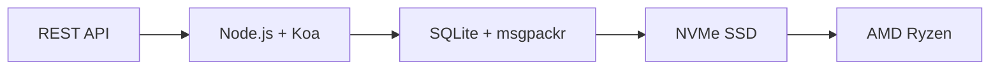

# Az első teljes körű e-mail API: Hogyan forradalmasította a Forward Email az e-mail kezelést {#the-first-complete-email-api-how-forward-email-revolutionized-email-management}


<p class="lead mt-3">
  <strong>Röviden:</strong> Megalkottuk a világ első teljes körű REST API-ját e-mail kezeléshez, fejlett keresési lehetőségekkel, amelyeket más szolgáltatás nem kínál. Míg a Gmail, Outlook és Apple az IMAP poklába vagy korlátozott API-kba kényszeríti a fejlesztőket, a Forward Email villámgyors CRUD műveleteket biztosít üzenetek, mappák, névjegyek és naptárak számára egy egységes REST interfészen keresztül, több mint 15 keresési paraméterrel. Ez az az e-mail API, amire a fejlesztők vártak.
</p>


## Tartalomjegyzék {#table-of-contents}

* [Az e-mail API probléma](#the-email-api-problem)
* [Mit mondanak valójában a fejlesztők](#what-developers-are-actually-saying)
* [A Forward Email forradalmi megoldása](#forward-emails-revolutionary-solution)
  * [Miért építettük ezt](#why-we-built-this)
  * [Egyszerű hitelesítés](#simple-authentication)
* [20 végpont, ami mindent megváltoztat](#20-endpoints-that-change-everything)
  * [Üzenetek (5 végpont)](#messages-5-endpoints)
  * [Mappák (5 végpont)](#folders-5-endpoints)
  * [Névjegyek (5 végpont)](#contacts-5-endpoints)
  * [Naptárak (5 végpont)](#calendars-5-endpoints)
* [Fejlett keresés: Egyetlen más szolgáltatás sem ér fel hozzá](#advanced-search-no-other-service-compares)
  * [A keresési API helyzete romokban](#the-search-api-landscape-is-broken)
  * [A Forward Email forradalmi keresési API-ja](#forward-emails-revolutionary-search-api)
  * [Valós keresési példák](#real-world-search-examples)
  * [Teljesítményelőnyök](#performance-advantages)
  * [Keresési funkciók, amik másnak nincsenek](#search-features-no-one-else-has)
  * [Miért fontos ez a fejlesztőknek](#why-this-matters-for-developers)
  * [A technikai megvalósítás](#the-technical-implementation)
* [Villámgyors teljesítmény architektúra](#blazing-fast-performance-architecture)
  * [Teljesítmény mérőszámok](#performance-benchmarks)
  * [Adatvédelmi szemléletű architektúra](#privacy-first-architecture)
* [Miért vagyunk mások: Teljes összehasonlítás](#why-were-different-the-complete-comparison)
  * [Főbb szolgáltató korlátozások](#major-provider-limitations)
  * [A Forward Email előnyei](#forward-email-advantages)
  * [Az open-source átláthatósági probléma](#the-open-source-transparency-problem)
* [30+ valós integrációs példa](#30-real-world-integration-examples)
  * [1. WordPress kapcsolatfelvételi űrlap fejlesztés](#1-wordpress-contact-form-enhancement)
  * [2. Zapier alternatíva e-mail automatizáláshoz](#2-zapier-alternative-for-email-automation)
  * [3. CRM e-mail szinkronizáció](#3-crm-email-synchronization)
  * [4. E-kereskedelmi rendelésfeldolgozás](#4-e-commerce-order-processing)
  * [5. Támogatási jegy integráció](#5-support-ticket-integration)
  * [6. Hírlevél kezelő rendszer](#6-newsletter-management-system)
  * [7. E-mail alapú feladatkezelés](#7-email-based-task-management)
  * [8. Több fiókos e-mail aggregáció](#8-multi-account-email-aggregation)
  * [9. Fejlett e-mail analitika irányítópult](#9-advanced-email-analytics-dashboard)
  * [10. Okos e-mail archiválás](#10-smart-email-archiving)
  * [11. E-mail-naptár integráció](#11-email-to-calendar-integration)
  * [12. E-mail biztonsági mentés és megfelelőség](#12-email-backup-and-compliance)
  * [13. E-mail alapú tartalomkezelés](#13-email-based-content-management)
  * [14. E-mail sablonkezelés](#14-email-template-management)
  * [15. E-mail alapú munkafolyamat automatizálás](#15-email-based-workflow-automation)
  * [16. E-mail biztonsági megfigyelés](#16-email-security-monitoring)
  * [17. E-mail alapú felmérésgyűjtés](#17-email-based-survey-collection)
  * [18. E-mail teljesítmény monitorozás](#18-email-performance-monitoring)
  * [19. E-mail alapú lead minősítés](#19-email-based-lead-qualification)
  * [20. E-mail alapú projektmenedzsment](#20-email-based-project-management)
  * [21. E-mail alapú készletkezelés](#21-email-based-inventory-management)
  * [22. E-mail alapú számlafeldolgozás](#22-email-based-invoice-processing)
  * [23. E-mail alapú eseményregisztráció](#23-email-based-event-registration)
  * [24. E-mail alapú dokumentum jóváhagyási munkafolyamat](#24-email-based-document-approval-workflow)
  * [25. E-mail alapú ügyfél visszajelzés elemzés](#25-email-based-customer-feedback-analysis)
  * [26. E-mail alapú toborzási folyamat](#26-email-based-recruitment-pipeline)
  * [27. E-mail alapú költségjelentés feldolgozás](#27-email-based-expense-report-processing)
  * [28. E-mail alapú minőségbiztosítási jelentés](#28-email-based-quality-assurance-reporting)
  * [29. E-mail alapú beszállítókezelés](#29-email-based-vendor-management)
  * [30. E-mail alapú közösségi média megfigyelés](#30-email-based-social-media-monitoring)
* [Első lépések](#getting-started)
  * [1. Hozd létre Forward Email fiókodat](#1-create-your-forward-email-account)
  * [2. Generálj API hitelesítő adatokat](#2-generate-api-credentials)
  * [3. Hajtsd végre első API hívásodat](#3-make-your-first-api-call)
  * [4. Fedezd fel a dokumentációt](#4-explore-the-documentation)
* [Technikai források](#technical-resources)
## Az Email API Probléma {#the-email-api-problem}

Az email API-k alapvetően hibásak. Pont.

Minden nagy email szolgáltató két szörnyű választás egyikére kényszeríti a fejlesztőket:

1. **IMAP Pokol**: Egy 30 éves protokollal küzdeni, amely asztali kliensekhez készült, nem modern alkalmazásokhoz
2. **Megnyomorított API-k**: Korlátozott, csak olvasható, OAuth-komplex API-k, amelyek nem tudják kezelni a tényleges email adataidat

Az eredmény? A fejlesztők vagy teljesen feladják az email integrációt, vagy heteket pazarolnak törékeny IMAP csomagolók építésére, amelyek folyamatosan elromlanak.

> \[!WARNING]
> **A piszkos titok**: A legtöbb "email API" valójában csak küldő API. Nem tudsz programozottan mappákat rendezni, névjegyeket szinkronizálni vagy naptárakat kezelni egy egyszerű REST interfészen keresztül. Egészen mostanáig.


## Amit a Fejlesztők Valójában Mondanak {#what-developers-are-actually-saying}

A frusztráció valós és mindenhol dokumentált:

> "Nemrég próbáltam integrálni a Gmailt az alkalmazásomba, és túl sok időt öntöttem bele. Úgy döntöttem, nem éri meg támogatni a Gmailt."
>
> *- [Hacker News fejlesztő](https://news.ycombinator.com/item?id=42106944), 147 szavazat*

> "Minden email API középszerű? Úgy tűnik, valamilyen módon korlátozottak vagy restriktívek."
>
> *- [Reddit r/SaaS beszélgetés](https://www.reddit.com/r/SaaS/comments/1cm84s7/are_all_email_apis_mediocre/)*

> "Miért kell az email fejlesztésnek szívásnak lennie?"
>
> *- [Reddit r/webdev](https://www.reddit.com/r/webdev/comments/15trnp2/why_does_email_development_have_to_suck/), 89 hozzászólás fejlesztői fájdalomról*

> "Mi teszi a Gmail API-t hatékonyabbá az IMAP-nál? Egy másik ok, amiért a Gmail API sokkal hatékonyabb, hogy csak egyszer kell letölteni minden üzenetet. IMAP esetén minden üzenetet le kell tölteni és indexelni..."
>
> *- [Stack Overflow kérdés](https://stackoverflow.com/questions/25431022/what-makes-the-gmail-api-more-efficient-than-imap) 47 szavazattal*

A bizonyíték mindenhol ott van:

* **WordPress SMTP problémák**: [631 GitHub issue](https://github.com/awesomemotive/WP-Mail-SMTP/issues) az email kézbesítési hibákról
* **Zapier korlátok**: [Közösségi panaszok](https://community.zapier.com/featured-articles-65/email-parser-by-zapier-limitations-and-alternatives-16958) 10 email/óra limitről és IMAP felismerési hibákról
* **IMAP API projektek**: [Több](https://github.com/ewildgoose/imap-api) [nyílt forráskódú](https://emailengine.app/) [projekt](https://www.npmjs.com/package/imapflow) létezik kifejezetten az "IMAP REST-re konvertálására", mert ezt egyetlen szolgáltató sem kínálja
* **Gmail API frusztrációk**: A [Stack Overflow](https://stackoverflow.com/questions/tagged/gmail-api) 4,847 "gmail-api" címkével ellátott kérdése gyakori panaszokkal a korlátozásokról és a komplexitásról


## A Forward Email Forradalmi Megoldása {#forward-emails-revolutionary-solution}

**Mi vagyunk az első email szolgáltatás, amely teljes CRUD műveleteket kínál az összes email adatodra egy egységes REST API-n keresztül.**

Ez nem csak egy újabb küldő API. Ez teljes programozott irányítás a következő felett:

* **Üzenetek**: Létrehozás, olvasás, frissítés, törlés, keresés, mozgatás, megjelölés
* **Mappák**: Teljes IMAP mappa kezelés REST végpontokon keresztül
* **Névjegyek**: [CardDAV](https://tools.ietf.org/html/rfc6352) névjegy tárolás és szinkronizáció
* **Naptárak**: [CalDAV](https://tools.ietf.org/html/rfc4791) naptár események és ütemezés

### Miért Építettük Ezt {#why-we-built-this}

**A Probléma**: Minden email szolgáltató fekete dobozként kezeli az emailt. Tudsz emailt küldeni, talán olvasni bonyolult OAuth-pal, de nem tudod igazán *kezelni* az email adataidat programozottan.

**A Látomásunk**: Az email integráció legyen olyan egyszerű, mint bármely modern API. Nincs IMAP könyvtár. Nincs OAuth komplexitás. Nincsenek korlátozási rémálmok. Csak egyszerű REST végpontok, amelyek működnek.

**Az Eredmény**: Az első email szolgáltatás, ahol teljes email klienst, CRM integrációt vagy automatizációs rendszert építhetsz kizárólag HTTP kérésekkel.

### Egyszerű Hitelesítés {#simple-authentication}

Nincs [OAuth komplexitás](https://oauth.net/2/). Nincsenek [alkalmazás-specifikus jelszavak](https://support.google.com/accounts/answer/185833). Csak az alias hitelesítő adataid:

```bash
curl -u "alias@yourdomain.com:password" \
  https://api.forwardemail.net/v1/messages
```
## 20 Végpont, Ami Minden Megváltoztat {#20-endpoints-that-change-everything}

### Üzenetek (5 végpont) {#messages-5-endpoints}

* `GET /v1/messages` - Üzenetek listázása szűréssel (`?folder=`, `?is_unread=`, `?is_flagged=`)
* `POST /v1/messages` - Új üzenetek küldése közvetlenül mappákba
* `GET /v1/messages/:id` - Egy adott üzenet lekérése teljes metaadatokkal
* `PUT /v1/messages/:id` - Üzenet frissítése (jelölők, mappa, olvasottság)
* `DELETE /v1/messages/:id` - Üzenet végleges törlése

### Mappák (5 végpont) {#folders-5-endpoints}

* `GET /v1/folders` - Mappák listázása előfizetési státusszal
* `POST /v1/folders` - Új mappa létrehozása egyedi tulajdonságokkal
* `GET /v1/folders/:id` - Mappa részleteinek és üzenetszámok lekérése
* `PUT /v1/folders/:id` - Mappa tulajdonságainak és előfizetésének frissítése
* `DELETE /v1/folders/:id` - Mappa törlése és az üzenetek áthelyezésének kezelése

### Kapcsolatok (5 végpont) {#contacts-5-endpoints}

* `GET /v1/contacts` - Kapcsolatok listázása kereséssel és lapozással
* `POST /v1/contacts` - Új kapcsolat létrehozása teljes vCard támogatással
* `GET /v1/contacts/:id` - Kapcsolat lekérése minden mezővel és metaadattal
* `PUT /v1/contacts/:id` - Kapcsolati adatok frissítése ETag érvényesítéssel
* `DELETE /v1/contacts/:id` - Kapcsolat törlése kaszkád kezeléssel

### Naptárak (5 végpont) {#calendars-5-endpoints}

* `GET /v1/calendars` - Naptári események listázása dátumszűréssel
* `POST /v1/calendars` - Naptári esemény létrehozása résztvevőkkel és ismétlődéssel
* `GET /v1/calendars/:id` - Esemény részleteinek lekérése időzóna kezeléssel
* `PUT /v1/calendars/:id` - Esemény frissítése ütközésészleléssel
* `DELETE /v1/calendars/:id` - Esemény törlése résztvevő értesítésekkel


## Fejlett Keresés: Egyik Szolgáltatás Sem Érhet Hozzánk {#advanced-search-no-other-service-compares}

**A Forward Email az egyetlen e-mail szolgáltatás, amely átfogó, programozható keresést kínál az összes üzenetmezőn keresztül REST API-n.**

Míg más szolgáltatók legfeljebb alap szűrést kínálnak, mi építettük a valaha volt legfejlettebb e-mail kereső API-t. Sem a Gmail API, sem az Outlook API, sem más szolgáltatás nem ér fel a keresési képességeinkhez.

### A Kereső API Helyzete Szétesett {#the-search-api-landscape-is-broken}

**Gmail API Keresési Korlátozások:**

* ✅ Csak alap `q` paraméter
* ❌ Nincs mezőspecifikus keresés
* ❌ Nincs dátumtartomány szűrés
* ❌ Nincs méret alapú szűrés
* ❌ Nincs csatolmány szűrés
* ❌ Csak a Gmail keresési szintaxis korlátozott használata

**Outlook API Keresési Korlátozások:**

* ✅ Alap `$search` paraméter
* ❌ Nincs fejlett mezőcélzás
* ❌ Nincs összetett lekérdezés kombináció
* ❌ Aggresszív sebességkorlátozás
* ❌ Bonyolult OData szintaxis szükséges

**Apple iCloud:**

* ❌ Egyáltalán nincs API
* ❌ Csak IMAP keresés (ha működésre bírja az ember)

**ProtonMail & Tuta:**

* ❌ Nincs nyilvános API
* ❌ Nincs programozható keresési lehetőség

### A Forward Email Forradalmi Kereső API-ja {#forward-emails-revolutionary-search-api}

**15+ keresési paramétert kínálunk, amit más szolgáltatás nem nyújt:**

| Keresési Képesség             | Forward Email                        | Gmail API    | Outlook API        | Egyéb  |
| ------------------------------ | ---------------------------------- | ------------ | ------------------ | ------ |
| **Mezőspecifikus Keresés**     | ✅ Tárgy, törzs, feladó, címzett, másolat, fejléc | ❌            | ❌                  | ❌      |
| **Többmezős Általános Keresés**| ✅ `?search=` az összes mezőn át    | ✅ Alap `q=` | ✅ Alap `$search=`  | ❌      |
| **Dátumtartomány Szűrés**      | ✅ `?since=` & `?before=`           | ❌            | ❌                  | ❌      |
| **Méret Alapú Szűrés**         | ✅ `?min_size=` & `?max_size=`      | ❌            | ❌                  | ❌      |
| **Csatolmány Szűrés**          | ✅ `?has_attachments=true/false`    | ❌            | ❌                  | ❌      |
| **Fejléc Keresés**             | ✅ `?headers=X-Priority`            | ❌            | ❌                  | ❌      |
| **Üzenetazonosító Keresés**    | ✅ `?message_id=abc123`             | ❌            | ❌                  | ❌      |
| **Összetett Szűrők**           | ✅ Több paraméter AND logikával     | ❌            | ❌                  | ❌      |
| **Nagybetű-Kisbetű Érzéketlen**| ✅ Minden keresés                   | ✅            | ✅                  | ❌      |
| **Lapozás Támogatás**           | ✅ Minden keresési paraméterrel működik | ✅            | ✅                  | ❌      |
### Valós Példák Keresésre {#real-world-search-examples}

**Az elmúlt negyedév összes számlájának megtalálása:**

```bash
# Forward Email - Egyszerű és hatékony
GET /v1/messages?subject=invoice&since=2024-01-01T00:00:00Z&before=2024-04-01T00:00:00Z

# Gmail API - Lehetetlen a korlátozott keresési lehetőségeik miatt
# Nincs elérhető dátumtartomány szűrés

# Outlook API - Bonyolult OData szintaxis, korlátozott funkcionalitás
GET /me/messages?$search="invoice"&$filter=receivedDateTime ge 2024-01-01T00:00:00Z
```

**Nagy méretű csatolmányok keresése adott feladótól:**

```bash
# Forward Email - Átfogó szűrés
GET /v1/messages?from=finance@company.com&has_attachments=true&min_size=1000000

# Gmail API - Nem lehet programozottan méret vagy csatolmány alapján szűrni
# Outlook API - Nincs méret szerinti szűrés
# Egyéb - Nincs elérhető API
```

**Összetett, több mezős keresés:**

```bash
# Forward Email - Fejlett lekérdezési képességek
GET /v1/messages?body=quarterly&from=manager&is_flagged=true&folder=Reports

# Gmail API - Csak alap szöveges keresés lehetséges
GET /gmail/v1/users/me/messages?q=quarterly

# Outlook API - Alap keresés mezőcélzás nélkül
GET /me/messages?$search="quarterly"
```

### Teljesítmény Előnyök {#performance-advantages}

**Forward Email keresési teljesítmény:**

* ⚡ **100 ms alatti válaszidők** összetett kereséseknél
* 🔍 **Regex optimalizáció** megfelelő indexeléssel
* 📊 **Párhuzamos lekérdezés végrehajtás** számláláshoz és adatokhoz
* 💾 **Hatékony memóriahasználat** karcsú lekérdezésekkel

**Versenytársak teljesítményproblémái:**

* 🐌 **Gmail API**: Felhasználónként másodpercenként 250 kvótaegységre korlátozva
* 🐌 **Outlook API**: Aggresszív korlátozás, bonyolult visszalépési szabályokkal
* 🐌 **Egyéb**: Nincs összehasonlítható API

### Egyedi Keresési Funkciók, Amik Másnak Nincsenek {#search-features-no-one-else-has}

#### 1. Fejléc-specifikus keresés {#1-header-specific-search}

```bash
# Üzenetek keresése adott fejléc alapján
GET /v1/messages?headers=X-Priority:1
GET /v1/messages?headers=X-Spam-Score
```

#### 2. Méret alapú intelligencia {#2-size-based-intelligence}

```bash
# Hírlevelek keresése (általában nagy méretűek)
GET /v1/messages?min_size=50000&from=newsletter

# Gyors válaszok keresése (általában kicsik)
GET /v1/messages?max_size=1000&to=support
```

#### 3. Csatolmány-alapú munkafolyamatok {#3-attachment-based-workflows}

```bash
# Minden dokumentum keresése, amit a jogi csapatnak küldtek
GET /v1/messages?to=legal&has_attachments=true&body=contract

# Csatolmány nélküli emailek keresése takarításhoz
GET /v1/messages?has_attachments=false&before=2023-01-01T00:00:00Z
```

#### 4. Kombinált üzleti logika {#4-combined-business-logic}

```bash
# Sürgős, megjelölt üzenetek keresése VIP feladóktól csatolmányokkal
GET /v1/messages?is_flagged=true&from=ceo&has_attachments=true&subject=urgent
```

### Miért Fontos Ez a Fejlesztők Számára {#why-this-matters-for-developers}

**Olyan alkalmazások építése, amik korábban lehetetlenek voltak:**

1. **Fejlett email elemzés**: Email minták elemzése méret, feladó, tartalom alapján
2. **Intelligens email kezelés**: Automatikus rendszerezés összetett feltételek alapján
3. **Megfelelőség és feltárás**: Specifikus emailek megtalálása jogi követelményekhez
4. **Üzleti intelligencia**: Információk kinyerése email kommunikációs mintákból
5. **Automatizált munkafolyamatok**: Műveletek indítása kifinomult email szűrők alapján

### A Technikai Megvalósítás {#the-technical-implementation}

Keresési API-nk használja:

* **Regex optimalizációt** megfelelő indexelési stratégiákkal
* **Párhuzamos végrehajtást** a teljesítményért
* **Bemeneti érvényesítést** a biztonságért
* **Átfogó hibakezelést** a megbízhatóságért

```javascript
// Példa: Összetett keresés megvalósítása
const searchConditions = [];

if (ctx.query.subject) {
  searchConditions.push({
    subject: { $regex: ctx.query.subject, $options: 'i' }
  });
}

if (ctx.query.from) {
  searchConditions.push({
    $or: [
      { 'from.address': { $regex: ctx.query.from, $options: 'i' } },
      { 'from.name': { $regex: ctx.query.from, $options: 'i' } }
    ]
  });
}

// Kombinálás ÉS logikával
if (searchConditions.length > 0) {
  query.$and = searchConditions;
}
```

> \[!TIP]
> **Fejlesztői előny**: A Forward Email keresési API-jával olyan email alkalmazásokat építhetsz, amelyek funkcionalitásban vetekednek az asztali kliensekkel, miközben megőrzik a REST API-k egyszerűségét.
## Villámgyors Teljesítmény Architektúra {#blazing-fast-performance-architecture}

Műszaki stackünk a sebességre és megbízhatóságra épül:


```mermaid
graph LR
    A[REST API] --> B[Node.js + Koa]
    B --> C[SQLite + msgpackr]
    C --> D[NVMe SSD]
    D --> E[AMD Ryzen]
```

### Teljesítmény Referenciák {#performance-benchmarks}

**Miért vagyunk villámgyorsak:**

| Összetevő   | Technológia                                                                       | Teljesítmény Előny                           |
| ------------| --------------------------------------------------------------------------------- | --------------------------------------------- |
| **Tárolás** | [NVMe SSD](https://en.wikipedia.org/wiki/NVM_Express)                            | 10x gyorsabb, mint a hagyományos SATA         |
| **Adatbázis** | [SQLite](https://sqlite.org/) + [msgpackr](https://github.com/kriszyp/msgpackr) | Nulla hálózati késleltetés, optimalizált sorosítás |
| **Hardver** | [AMD Ryzen](https://www.amd.com/en/products/processors/desktops/ryzen) natív    | Nincs virtualizációs többletterhelés          |
| **Gyorsítótár** | Memóriában + perzisztens                                                        | Szubmilliszekundumos válaszidők               |
| **Biztonsági mentések** | [Cloudflare R2](https://www.cloudflare.com/products/r2/) titkosított        | Vállalati szintű megbízhatóság                 |

**Valódi Teljesítmény Számok:**

* **API válaszidő**: < 50ms átlag
* **Üzenet lekérés**: < 10ms gyorsítótárazott üzeneteknél
* **Mappaműveletek**: < 5ms metaadat műveleteknél
* **Kapcsolat szinkronizálás**: 1000+ kapcsolat/másodperc
* **Üzemidő**: 99,99% SLA redundáns infrastruktúrával

### Adatvédelmi Központú Architektúra {#privacy-first-architecture}

**Zero-Knowledge Tervezés**: Csak Ön fér hozzá az IMAP jelszavával – mi nem olvassuk az e-mailjeit. A [zero-knowledge architektúránk](https://forwardemail.net/en/security) teljes adatvédelmet biztosít, miközben villámgyors teljesítményt nyújt.


## Miért Vagyunk Mások: Teljes Összehasonlítás {#why-were-different-the-complete-comparison}

### Fő Szolgáltató Korlátozások {#major-provider-limitations}

| Szolgáltató      | Fő Problémák                            | Specifikus Korlátozások                                                                                                                                                                                                                                                                                                                                                                                                                                             |
| ---------------- | ------------------------------------- | -------------------------------------------------------------------------------------------------------------------------------------------------------------------------------------------------------------------------------------------------------------------------------------------------------------------------------------------------------------------------------------------------------------------------------------------------------------------- |
| **Gmail API**    | Csak olvasható, Bonyolult OAuth, Külön API-k | • [Nem lehet módosítani meglévő üzeneteket](https://developers.google.com/gmail/api/reference/rest/v1/users.messages)<br>• [Címkék ≠ mappák](https://developers.google.com/gmail/api/reference/rest/v1/users.labels)<br>• [1 milliárd kvóta egység/nap limit](https://developers.google.com/gmail/api/reference/quota)<br>• [Külön API-k szükségesek](https://developers.google.com/workspace) névjegyek/naptár kezeléséhez |
| **Outlook API**  | Elavult, Zavaros, Vállalati fókuszú    | • [REST végpontok 2024 márciusában elavultak](https://learn.microsoft.com/en-us/outlook/rest/compare-graph)<br>• [Több zavaró API](https://learn.microsoft.com/en-us/office/client-developer/outlook/selecting-an-api-or-technology-for-developing-solutions-for-outlook) (EWS, Graph, REST)<br>• [Microsoft Graph bonyolultság](https://learn.microsoft.com/en-us/graph/overview)<br>• [Aggresszív korlátozások](https://learn.microsoft.com/en-us/graph/throttling) |
| **Apple iCloud** | Nincs nyilvános API                   | • [Egyáltalán nincs nyilvános API](https://support.apple.com/en-us/102654)<br>• [Csak IMAP, napi 1000 e-mail limit](https://support.apple.com/en-us/102654)<br>• [Alkalmazás-specifikus jelszavak szükségesek](https://support.apple.com/en-us/102654)<br>• [500 címzett üzenetenkénti limit](https://support.apple.com/en-us/102654)                                                                                              |
| **ProtonMail**   | Nincs API, Hamis nyílt forráskód állítások | • [Nincs elérhető nyilvános API](https://proton.me/support/protonmail-bridge-clients)<br>• [Bridge szoftver szükséges](https://proton.me/mail/bridge) az IMAP hozzáféréshez<br>• [Állítják, hogy "nyílt forráskódú"](https://proton.me/blog/open-source), de [a szerver kód zárt](https://github.com/ProtonMail)<br>• [Csak fizetős csomagokhoz elérhető](https://proton.me/pricing)                                                                 |
| **Tuta**         | Nincs API, Félrevezető átláthatóság    | • [Nincs REST API e-mail kezeléshez](https://tuta.com/support#technical)<br>• [Állítják, hogy "nyílt forráskódú"](https://tuta.com/blog/posts/open-source-email), de [a backend zárt](https://github.com/tutao/tutanota)<br>• [IMAP/SMTP nem támogatott](https://tuta.com/support#imap)<br>• [Saját titkosítás](https://tuta.com/encryption) akadályozza a szabványos integrációkat                                                                 |
| **Zapier Email** | Súlyos Korlátozások a Sebességben      | • [Óránként 10 e-mail limit](https://help.zapier.com/hc/en-us/articles/8496181555597-Email-Parser-by-Zapier-limitations-and-alternatives)<br>• [Nincs IMAP mappa hozzáférés](https://help.zapier.com/hc/en-us/articles/8496181555597-Email-Parser-by-Zapier-limitations-and-alternatives)<br>• [Korlátozott elemzési képességek](https://help.zapier.com/hc/en-us/articles/8496181555597-Email-Parser-by-Zapier-limitations-and-alternatives)
### Előnyök az Email Továbbításban {#forward-email-advantages}

| Jellemző           | Email Továbbítás                                                                              | Versenytársak                            |
| ------------------ | -------------------------------------------------------------------------------------------- | --------------------------------------- |
| **Teljes CRUD**    | ✅ Teljes létrehozás, olvasás, frissítés, törlés minden adat esetén                           | ❌ Csak olvasás vagy korlátozott műveletek |
| **Egységes API**   | ✅ Üzenetek, mappák, névjegyek, naptárak egy API-ban                                         | ❌ Külön API-k vagy hiányzó funkciók     |
| **Egyszerű hitelesítés** | ✅ Alap hitelesítés alias hitelesítő adatokkal                                              | ❌ Bonyolult OAuth több jogosultsággal   |
| **Nincs korlátozás** | ✅ Nagylelkű korlátok, valós alkalmazásokhoz tervezve                                        | ❌ Korlátozó kvóták, amelyek megszakítják a munkafolyamatokat |
| **Ön-tárhely**     | ✅ [Teljes ön-tárhely opció](https://forwardemail.net/en/blog/docs/self-hosted-solution)     | ❌ Csak szolgáltatófüggőség              |
| **Adatvédelem**    | ✅ Nulla tudás, titkosított, privát                                                           | ❌ Adatbányászat és adatvédelmi aggályok |
| **Teljesítmény**   | ✅ 50 ms alatti válaszidő, NVMe tárolás                                                      | ❌ Hálózati késleltetés, korlátozások    |

### Az Nyílt Forráskódú Átláthatóság Problémája {#the-open-source-transparency-problem}

**A ProtonMail és a Tuta "nyílt forráskódúként" és "átláthatóként" hirdetik magukat, de ez félrevezető marketing, amely sérti a modern adatvédelmi elveket.**

> \[!WARNING]
> **Hamis átláthatósági állítások**: Mind a ProtonMail, mind a Tuta hangsúlyosan hirdeti "nyílt forráskódú" hitelességét, miközben legkritikusabb szerveroldali kódjuk zárt és tulajdonosi.

**A ProtonMail megtévesztése:**

* **Állítások**: ["Mi nyílt forráskódúak vagyunk"](https://proton.me/blog/open-source) kiemelten a marketingben
* **Valóság**: [A szerverkód teljesen tulajdonosi](https://github.com/ProtonMail) – csak a kliensalkalmazások nyílt forráskódúak
* **Hatás**: A felhasználók nem ellenőrizhetik a szerveroldali titkosítást, adatkezelést vagy adatvédelmi állításokat
* **Átláthatósági megsértés**: Nincs mód az e-mail feldolgozó és tároló rendszerek auditálására

**A Tuta félrevezető marketingje:**

* **Állítások**: ["Nyílt forráskódú e-mail"](https://tuta.com/blog/posts/open-source-email) mint fő értékesítési pont
* **Valóság**: [A háttérinfrastruktúra zárt forráskódú](https://github.com/tutao/tutanota) – csak a frontend elérhető
* **Hatás**: A tulajdonosi titkosítás megakadályozza a szabványos e-mail protokollokat (IMAP/SMTP)
* **Zárolási stratégia**: Egyedi titkosítás szolgáltatófüggőséget kényszerít

**Miért fontos ez a modern adatvédelem szempontjából:**

2025-ben az igazi adatvédelem **teljes átláthatóságot** követel meg. Amikor az e-mail szolgáltatók "nyílt forráskódúnak" mondják magukat, de elrejtik a szerverkódot:

1. **Ellenőrizhetetlen titkosítás**: Nem auditálhatod, hogyan titkosítják az adataidat
2. **Rejtett adatkezelési gyakorlatok**: A szerveroldali adatkezelés fekete doboz marad
3. **Bizalmi alapú biztonság**: Hitelnélküli állításokat kell elfogadnod
4. **Szolgáltatófüggőség**: A tulajdonosi rendszerek megakadályozzák az adathordozhatóságot

**A Forward Email valódi átláthatósága:**

* ✅ **[Teljes nyílt forráskód](https://github.com/forwardemail/forwardemail.net)** – szerver és kliens kód
* ✅ **[Ön-tárhely elérhető](https://forwardemail.net/en/blog/docs/self-hosted-solution)** – saját példány futtatása
* ✅ **Szabványos protokollok** – IMAP, SMTP, CardDAV, CalDAV kompatibilitás
* ✅ **Auditálható biztonság** – minden kódsor ellenőrizhető
* ✅ **Nincs szolgáltatófüggőség** – a te adataid, a te irányításod

> \[!TIP]
> **Az igazi nyílt forráskód azt jelenti, hogy minden állítást ellenőrizhetsz.** A Forward Email-lel auditálhatod a titkosításunkat, áttekintheted az adatkezelést, és akár saját példányt is futtathatsz. Ez az igazi átláthatóság.


## Több mint 30 valós integrációs példa {#30-real-world-integration-examples}

### 1. WordPress Kapcsolati Űrlap Fejlesztés {#1-wordpress-contact-form-enhancement}
**Probléma**: [WordPress SMTP konfigurációs hibák](https://github.com/awesomemotive/WP-Mail-SMTP/issues) ([631 GitHub probléma](https://github.com/awesomemotive/WP-Mail-SMTP/issues))
**Megoldás**: Közvetlen API integráció teljesen megkerüli az [SMTP](https://tools.ietf.org/html/rfc5321)-t

```javascript
// WordPress kapcsolatfelvételi űrlap, amely a Kimenő mappába ment
await fetch('https://api.forwardemail.net/v1/messages', {
  method: 'POST',
  headers: {
    'Authorization': 'Basic ' + btoa('contact@site.com:password'),
    'Content-Type': 'application/json'
  },
  body: JSON.stringify({
    to: [{ address: 'owner@site.com' }],
    subject: 'Kapcsolatfelvételi űrlap: ' + formData.subject,
    text: formData.message,
    folder: 'Sent'
  })
});
```

### 2. Zapier alternatíva e-mail automatizáláshoz {#2-zapier-alternative-for-email-automation}

**Probléma**: [Zapier 10 e-mail/óra korlátja](https://help.zapier.com/hc/en-us/articles/8496181555597-Email-Parser-by-Zapier-limitations-and-alternatives) és [IMAP észlelési hibák](https://community.zapier.com/featured-articles-65/email-parser-by-zapier-limitations-and-alternatives-16958)
**Megoldás**: Korlátlan automatizálás teljes e-mail vezérléssel

```javascript
// E-mailek automatikus rendezése feladó domain alapján
const messages = await fetch('/v1/messages?folder=INBOX');
for (const message of messages) {
  const domain = message.from.split('@')[1];
  await fetch(`/v1/messages/${message.id}`, {
    method: 'PUT',
    body: JSON.stringify({ folder: `Clients/${domain}` })
  });
}
```

### 3. CRM e-mail szinkronizáció {#3-crm-email-synchronization}

**Probléma**: Manuális kapcsolattartás e-mail és [CRM rendszerek](https://en.wikipedia.org/wiki/Customer_relationship_management) között
**Megoldás**: Kétirányú szinkronizáció [CardDAV](https://tools.ietf.org/html/rfc6352) kapcsolati API-val

```javascript
// Új e-mail kapcsolatok szinkronizálása a CRM-be
const newContacts = await fetch('/v1/contacts');
for (const contact of newContacts) {
  await crmAPI.createContact({
    name: contact.name,
    email: contact.email,
    source: 'email_api'
  });
}
```

### 4. E-kereskedelmi rendelés feldolgozás {#4-e-commerce-order-processing}

**Probléma**: Manuális rendelés e-mail feldolgozás [e-kereskedelmi platformokon](https://en.wikipedia.org/wiki/E-commerce)
**Megoldás**: Automatizált rendeléskezelési folyamat

```javascript
// Rendelés visszaigazoló e-mailek feldolgozása
const orders = await fetch('/v1/messages?folder=Orders');
const orderEmails = orders.filter(msg =>
  msg.subject.includes('Order Confirmation')
);

for (const order of orderEmails) {
  const orderData = parseOrderEmail(order.text);
  await updateInventory(orderData);
  await fetch(`/v1/messages/${order.id}`, {
    method: 'PUT',
    body: JSON.stringify({ folder: 'Orders/Processed' })
  });
}
```

### 5. Támogatási jegy integráció {#5-support-ticket-integration}

**Probléma**: E-mail szálak szétszórva [helpdesk platformokon](https://en.wikipedia.org/wiki/Help_desk_software)
**Megoldás**: Teljes e-mail szál követés

```javascript
// Támogatási jegy létrehozása e-mail szálból
const messages = await fetch('/v1/messages?folder=Support');
const supportEmails = messages.filter(msg =>
  msg.to.some(addr => addr.includes('support@'))
);

for (const email of supportEmails) {
  const ticket = await supportSystem.createTicket({
    subject: email.subject,
    from: email.from,
    body: email.text,
    timestamp: email.date
  });
}
```

### 6. Hírlevél kezelő rendszer {#6-newsletter-management-system}

**Probléma**: Korlátozott [hírlevél platform](https://en.wikipedia.org/wiki/Email_marketing) integrációk
**Megoldás**: Teljes előfizetői életciklus kezelése

```javascript
// Hírlevél feliratkozások automatikus kezelése
const messages = await fetch('/v1/messages?folder=Newsletter');
const unsubscribes = messages.filter(msg =>
  msg.subject.toLowerCase().includes('unsubscribe')
);

for (const msg of unsubscribes) {
  await removeSubscriber(msg.from);
  await fetch(`/v1/messages/${msg.id}`, {
    method: 'PUT',
    body: JSON.stringify({ folder: 'Newsletter/Unsubscribed' })
  });
}
```

### 7. E-mail alapú feladatkezelés {#7-email-based-task-management}

**Probléma**: Bejövő levelek túlterheltsége és [feladatkövetés](https://en.wikipedia.org/wiki/Task_management)
**Megoldás**: E-mailek átalakítása végrehajtható feladatokká
```javascript
// Create tasks from flagged emails
const messages = await fetch('/v1/messages?is_flagged=true');
for (const email of messages) {
  await taskManager.createTask({
    title: email.subject,
    description: email.text,
    assignee: email.to[0].address,
    dueDate: extractDueDate(email.text)
  });
}
```

### 8. Multi-Account Email Aggregation {#8-multi-account-email-aggregation}

**Problem**: Managing [multiple email accounts](https://en.wikipedia.org/wiki/Email_client) across providers
**Solution**: Unified inbox interface

```javascript
// Aggregate emails from multiple accounts
const accounts = ['work@domain.com', 'personal@domain.com'];
const allMessages = [];

for (const account of accounts) {
  const messages = await fetch('/v1/messages', {
    headers: { 'Authorization': getAuth(account) }
  });
  allMessages.push(...messages.map(m => ({ ...m, account })));
}
```

### 9. Advanced Email Analytics Dashboard {#9-advanced-email-analytics-dashboard}

**Problem**: No insights into [email patterns](https://en.wikipedia.org/wiki/Email_analytics) with sophisticated filtering
**Solution**: Custom email analytics using advanced search capabilities

```javascript
// Generate comprehensive email analytics using advanced search
const analytics = {};

// Analyze email volume by sender domain
const messages = await fetch('/v1/messages');
analytics.senderDomains = analyzeSenderDomains(messages);

// Find large attachments consuming storage
const largeAttachments = await fetch('/v1/messages?has_attachments=true&min_size=1000000');
analytics.storageHogs = largeAttachments.map(msg => ({
  subject: msg.subject,
  from: msg.from,
  size: msg.size
}));

// Analyze communication patterns with VIPs
const vipEmails = await fetch('/v1/messages?from=ceo@company.com');
const urgentVipEmails = await fetch('/v1/messages?from=ceo@company.com&subject=urgent');
analytics.vipCommunication = {
  total: vipEmails.length,
  urgent: urgentVipEmails.length,
  urgencyRate: (urgentVipEmails.length / vipEmails.length) * 100
};

// Find unread emails by date range for follow-up
const lastWeek = new Date(Date.now() - 7 * 24 * 60 * 60 * 1000).toISOString();
const unreadRecent = await fetch(`/v1/messages?is_unread=true&since=${lastWeek}`);
analytics.followUpNeeded = unreadRecent.length;

// Analyze email sizes for optimization
const smallEmails = await fetch('/v1/messages?max_size=1000');
const mediumEmails = await fetch('/v1/messages?min_size=1000&max_size=50000');
const largeEmails = await fetch('/v1/messages?min_size=50000');
analytics.sizeDistribution = {
  small: smallEmails.length,
  medium: mediumEmails.length,
  large: largeEmails.length
};

// Search for compliance-related emails
const complianceEmails = await fetch('/v1/messages?body=confidential&has_attachments=true');
analytics.complianceReview = complianceEmails.length;
```

### 10. Smart Email Archiving {#10-smart-email-archiving}

**Problem**: Manual [email organization](https://en.wikipedia.org/wiki/Email_management)
**Solution**: Intelligent email categorization

```javascript
// Auto-archive old emails by category
const messages = await fetch('/v1/messages');
const oldEmails = messages.filter(email =>
  isOlderThan(email.date, 90) // 90 days
);

for (const email of oldEmails) {
  const category = categorizeEmail(email);
  await fetch(`/v1/messages/${email.id}`, {
    method: 'PUT',
    body: JSON.stringify({ folder: `Archive/${category}` })
  });
}
```

### 11. Email-to-Calendar Integration {#11-email-to-calendar-integration}

**Problem**: Manual [calendar event](https://tools.ietf.org/html/rfc4791) creation from emails
**Solution**: Automatic event extraction and creation

```javascript
// Extract meeting details from emails
const messages = await fetch('/v1/messages?folder=Meetings');
const meetingEmails = messages.filter(email =>
  email.subject.toLowerCase().includes('meeting')
);

for (const email of meetingEmails) {
  const meetingData = extractMeetingInfo(email.text);
  if (meetingData.date && meetingData.time) {
    await fetch('/v1/calendars', {
      method: 'POST',
      body: JSON.stringify({
        title: email.subject,
        start: meetingData.datetime,
        attendees: [email.from, ...email.to]
      })
    });
  }
}
```

### 12. E-mail Biztonsági Mentés és Megfelelőség {#12-email-backup-and-compliance}

**Probléma**: [E-mail megőrzési](https://en.wikipedia.org/wiki/Email_retention_policy) és megfelelőségi követelmények  
**Megoldás**: Automatikus biztonsági mentés metaadatok megőrzésével

```javascript
// E-mailek biztonsági mentése teljes metaadatokkal
const allMessages = await fetch('/v1/messages');
const backup = {
  timestamp: new Date(),
  messages: allMessages.map(msg => ({
    id: msg.id,
    subject: msg.subject,
    from: msg.from,
    to: msg.to,
    date: msg.date,
    flags: msg.flags
  }))
};
await saveToComplianceStorage(backup);
```

### 13. E-mail Alapú Tartalomkezelés {#13-email-based-content-management}

**Probléma**: Tartalom beküldések kezelése e-mailen keresztül [CMS platformok](https://en.wikipedia.org/wiki/Content_management_system) számára  
**Megoldás**: E-mail mint tartalomkezelő rendszer

```javascript
// Tartalom beküldések feldolgozása e-mailből
const messages = await fetch('/v1/messages?folder=Submissions');
const submissions = messages.filter(msg =>
  msg.to.some(addr => addr.includes('submit@'))
);

for (const submission of submissions) {
  const content = parseSubmission(submission.text);
  await cms.createDraft({
    title: submission.subject,
    content: content.body,
    author: submission.from
  });
}
```

### 14. E-mail Sablonkezelés {#14-email-template-management}

**Probléma**: Inkonzisztens [e-mail sablonok](https://en.wikipedia.org/wiki/Email_template) a csapatban  
**Megoldás**: Központosított sablonrendszer API-val

```javascript
// Sablonosított e-mailek küldése dinamikus tartalommal
const template = await getEmailTemplate('welcome');
await fetch('/v1/messages', {
  method: 'POST',
  body: JSON.stringify({
    to: [{ address: newUser.email }],
    subject: template.subject.replace('{{name}}', newUser.name),
    html: template.html.replace('{{name}}', newUser.name),
    folder: 'Sent'
  })
});
```

### 15. E-mail Alapú Munkafolyamat Automatizálás {#15-email-based-workflow-automation}

**Probléma**: Manuális [jóváhagyási folyamatok](https://en.wikipedia.org/wiki/Workflow) e-mailen keresztül  
**Megoldás**: Automatizált munkafolyamat-indítók

```javascript
// Jóváhagyási e-mailek feldolgozása
const messages = await fetch('/v1/messages?folder=Approvals');
const approvals = messages.filter(msg =>
  msg.subject.includes('APPROVAL')
);

for (const approval of approvals) {
  const decision = parseApprovalDecision(approval.text);
  await workflow.processApproval({
    requestId: extractRequestId(approval.subject),
    decision: decision,
    approver: approval.from
  });
}
```

### 16. E-mail Biztonsági Megfigyelés {#16-email-security-monitoring}

**Probléma**: Manuális [biztonsági fenyegetés felismerés](https://en.wikipedia.org/wiki/Email_security)  
**Megoldás**: Automatizált fenyegetés elemzés

```javascript
// Gyanús e-mailek figyelése
const recentEmails = await fetch('/v1/messages');
for (const email of recentEmails) {
  const threatScore = analyzeThreat(email);
  if (threatScore > 0.8) {
    await fetch(`/v1/messages/${email.id}`, {
      method: 'PUT',
      body: JSON.stringify({ folder: 'Security/Quarantine' })
    });
    await alertSecurityTeam(email);
  }
}
```

### 17. E-mail Alapú Felmérés Gyűjtés {#17-email-based-survey-collection}

**Probléma**: Manuális [felmérés válaszok](https://en.wikipedia.org/wiki/Survey_methodology) feldolgozása  
**Megoldás**: Automatikus válaszgyűjtés

```javascript
// Felmérés válaszok gyűjtése és feldolgozása
const messages = await fetch('/v1/messages?folder=Surveys');
const responses = messages.filter(msg =>
  msg.subject.includes('Survey Response')
);

const surveyData = responses.map(email => ({
  respondent: email.from,
  responses: parseSurveyData(email.text),
  timestamp: email.date
}));
await updateSurveyResults(surveyData);
```

### 18. E-mail Teljesítmény Figyelés {#18-email-performance-monitoring}

**Probléma**: Nincs átláthatóság az [e-mail kézbesítési teljesítmény](https://en.wikipedia.org/wiki/Email_deliverability) terén  
**Megoldás**: Valós idejű e-mail mutatók

```javascript
// E-mail kézbesítési teljesítmény figyelése
const sentEmails = await fetch('/v1/messages?folder=Sent');
const deliveryStats = {
  sent: sentEmails.length,
  bounces: await countBounces(),
  deliveryRate: calculateDeliveryRate()
};
await updateDashboard(deliveryStats);
```
### 19. E-mail alapú lead minősítés {#19-email-based-lead-qualification}

**Probléma**: Manuális [lead scoring](https://en.wikipedia.org/wiki/Lead_scoring) e-mail interakciókból  
**Megoldás**: Automatikus lead minősítési folyamat

```javascript
// Score leads based on email engagement
const prospects = await fetch('/v1/contacts');
for (const prospect of prospects) {
  const messages = await fetch('/v1/messages');
  const emails = messages.filter(msg =>
    msg.from.includes(prospect.email)
  );
  const score = calculateEngagementScore(emails);
  await crm.updateLeadScore(prospect.id, score);
}
```

### 20. E-mail alapú projektmenedzsment {#20-email-based-project-management}

**Probléma**: [Projektfrissítések](https://en.wikipedia.org/wiki/Project_management) szétszórva e-mail szálakban  
**Megoldás**: Központosított projektkommunikációs központ

```javascript
// Extract project updates from emails
const messages = await fetch('/v1/messages?folder=Projects');
const projectEmails = messages.filter(msg =>
  msg.subject.includes('Project Update')
);

for (const email of projectEmails) {
  const update = parseProjectUpdate(email.text);
  await projectManager.addUpdate({
    project: update.projectId,
    author: email.from,
    content: update.content
  });
}
```

### 21. E-mail alapú készletkezelés {#21-email-based-inventory-management}

**Probléma**: Manuális készletfrissítés beszállítói e-mailekből  
**Megoldás**: Automatikus készletkövetés e-mail értesítésekből

```javascript
// Process inventory updates from supplier emails
const messages = await fetch('/v1/messages?folder=Suppliers');
const inventoryEmails = messages.filter(msg =>
  msg.subject.includes('Inventory Update') || msg.subject.includes('Stock Alert')
);

for (const email of inventoryEmails) {
  const inventoryData = parseInventoryUpdate(email.text);
  await inventory.updateStock({
    sku: inventoryData.sku,
    quantity: inventoryData.quantity,
    supplier: email.from,
    timestamp: email.date
  });

  // Move to processed folder
  await fetch(`/v1/messages/${email.id}`, {
    method: 'PUT',
    body: JSON.stringify({ folder: 'Suppliers/Processed' })
  });
}
```

### 22. E-mail alapú számlafeldolgozás {#22-email-based-invoice-processing}

**Probléma**: Manuális [számlafeldolgozás](https://en.wikipedia.org/wiki/Invoice_processing) és könyvelési integráció  
**Megoldás**: Automatikus számla kinyerés és könyvelési rendszer szinkronizáció

```javascript
// Extract invoice data from email attachments
const messages = await fetch('/v1/messages?folder=Invoices');
const invoiceEmails = messages.filter(msg =>
  msg.subject.toLowerCase().includes('invoice') && msg.attachments.length > 0
);

for (const email of invoiceEmails) {
  const invoiceData = await extractInvoiceData(email.attachments[0]);
  await accounting.createInvoice({
    vendor: email.from,
    amount: invoiceData.total,
    dueDate: invoiceData.dueDate,
    items: invoiceData.lineItems
  });

  // Flag as processed
  await fetch(`/v1/messages/${email.id}`, {
    method: 'PUT',
    body: JSON.stringify({ flags: ['\\Seen', '\\Flagged'] })
  });
}
```

### 23. E-mail alapú eseményregisztráció {#23-email-based-event-registration}

**Probléma**: Manuális [eseményregisztráció](https://en.wikipedia.org/wiki/Event_management) feldolgozás e-mail válaszokból  
**Megoldás**: Automatikus résztvevőkezelés és naptár integráció

```javascript
// Process event registration emails
const messages = await fetch('/v1/messages?folder=Events');
const registrations = messages.filter(msg =>
  msg.subject.includes('Registration') || msg.subject.includes('RSVP')
);

for (const registration of registrations) {
  const attendeeData = parseRegistration(registration.text);

  // Add to attendee list
  await events.addAttendee({
    event: attendeeData.eventId,
    name: attendeeData.name,
    email: registration.from,
    dietary: attendeeData.dietaryRestrictions
  });

  // Create calendar event for attendee
  await fetch('/v1/calendars', {
    method: 'POST',
    body: JSON.stringify({
      title: attendeeData.eventName,
      start: attendeeData.eventDate,
      attendees: [registration.from]
    })
  });
}
```
### 24. E-mail alapú dokumentum jóváhagyási munkafolyamat {#24-email-based-document-approval-workflow}

**Probléma**: Bonyolult [dokumentum jóváhagyási](https://en.wikipedia.org/wiki/Document_management_system) láncok e-mailen keresztül  
**Megoldás**: Automatizált jóváhagyás követés és dokumentum verziókezelés

```javascript
// Track document approval workflow
const messages = await fetch('/v1/messages?folder=Approvals');
const approvalEmails = messages.filter(msg =>
  msg.subject.includes('Document Approval')
);

for (const email of approvalEmails) {
  const approval = parseApprovalEmail(email.text);

  await documentSystem.updateApproval({
    documentId: approval.documentId,
    approver: email.from,
    status: approval.decision, // 'approved', 'rejected', 'needs_changes'
    comments: approval.comments,
    timestamp: email.date
  });

  // Check if all approvals complete
  const document = await documentSystem.getDocument(approval.documentId);
  if (document.allApprovalsComplete) {
    await documentSystem.finalizeDocument(approval.documentId);
  }
}
```

### 25. E-mail alapú ügyfél visszajelzés elemzés {#25-email-based-customer-feedback-analysis}

**Probléma**: Manuális [ügyfél visszajelzés](https://en.wikipedia.org/wiki/Customer_feedback) gyűjtés és érzelem elemzés  
**Megoldás**: Automatizált visszajelzés feldolgozás és érzelem követés

```javascript
// Analyze customer feedback from emails
const messages = await fetch('/v1/messages?folder=Feedback');
const feedbackEmails = messages.filter(msg =>
  msg.to.some(addr => addr.includes('feedback@'))
);

for (const email of feedbackEmails) {
  const sentiment = await analyzeSentiment(email.text);
  const category = categorizeFeeback(email.text);

  await feedback.recordFeedback({
    customer: email.from,
    content: email.text,
    sentiment: sentiment.score, // -1 to 1
    category: category, // 'bug', 'feature', 'complaint', 'praise'
    priority: calculatePriority(sentiment, category),
    timestamp: email.date
  });

  // Auto-escalate negative feedback
  if (sentiment.score < -0.5) {
    await escalateToSupport(email);
  }
}
```

### 26. E-mail alapú toborzási folyamat {#26-email-based-recruitment-pipeline}

**Probléma**: Manuális [toborzás](https://en.wikipedia.org/wiki/Recruitment) és jelölt követés  
**Megoldás**: Automatizált jelöltkezelés és interjú ütemezés

```javascript
// Process job application emails
const messages = await fetch('/v1/messages?folder=Careers');
const applications = messages.filter(msg =>
  msg.subject.toLowerCase().includes('application') && msg.attachments.length > 0
);

for (const application of applications) {
  const resume = await parseResume(application.attachments[0]);

  const candidate = await ats.createCandidate({
    name: resume.name,
    email: application.from,
    skills: resume.skills,
    experience: resume.experience,
    position: extractPosition(application.subject)
  });

  // Auto-schedule screening if qualified
  if (candidate.qualificationScore > 0.7) {
    await calendar.scheduleInterview({
      candidateId: candidate.id,
      type: 'phone_screening',
      duration: 30
    });
  }
}
```

### 27. E-mail alapú költségelszámolás feldolgozás {#27-email-based-expense-report-processing}

**Probléma**: Manuális [költségelszámolás](https://en.wikipedia.org/wiki/Expense_report) benyújtás és jóváhagyás  
**Megoldás**: Automatizált költség kinyerés és jóváhagyási munkafolyamat

```javascript
// Process expense report emails
const messages = await fetch('/v1/messages?folder=Expenses');
const expenseEmails = messages.filter(msg =>
  msg.subject.includes('Expense') && msg.attachments.length > 0
);

for (const email of expenseEmails) {
  const receipts = await processReceipts(email.attachments);

  const expenseReport = await expenses.createReport({
    employee: email.from,
    expenses: receipts.map(receipt => ({
      amount: receipt.total,
      category: receipt.category,
      date: receipt.date,
      merchant: receipt.merchant
    })),
    totalAmount: receipts.reduce((sum, r) => sum + r.total, 0)
  });

  // Auto-approve small amounts
  if (expenseReport.totalAmount < 100) {
    await expenses.approve(expenseReport.id);
  } else {
    await expenses.sendForApproval(expenseReport.id);
  }
}
```
### 28. E-mail alapú minőségbiztosítási jelentés {#28-email-based-quality-assurance-reporting}

**Probléma**: Manuális [minőségbiztosítás](https://en.wikipedia.org/wiki/Quality_assurance) hibakövetés  
**Megoldás**: Automatizált QA hibakezelés és hibakövetés

```javascript
// Process QA bug reports from email
const messages = await fetch('/v1/messages?folder=QA');
const bugReports = messages.filter(msg =>
  msg.subject.includes('Bug Report') || msg.subject.includes('QA Issue')
);

for (const report of bugReports) {
  const bugData = parseBugReport(report.text);

  const ticket = await bugTracker.createIssue({
    title: report.subject,
    description: bugData.description,
    severity: bugData.severity,
    steps: bugData.stepsToReproduce,
    reporter: report.from,
    attachments: report.attachments
  });

  // Auto-assign based on component
  const assignee = await getComponentOwner(bugData.component);
  await bugTracker.assign(ticket.id, assignee);

  // Create calendar reminder for follow-up
  await fetch('/v1/calendars', {
    method: 'POST',
    body: JSON.stringify({
      title: `Follow up on ${ticket.id}`,
      start: addDays(new Date(), 3),
      attendees: [assignee]
    })
  });
}
```

### 29. E-mail alapú beszállítókezelés {#29-email-based-vendor-management}

**Probléma**: Manuális [beszállítói kommunikáció](https://en.wikipedia.org/wiki/Vendor_management) és szerződéskövetés  
**Megoldás**: Automatizált beszállítói kapcsolatok kezelése

```javascript
// Track vendor communications and contracts
const messages = await fetch('/v1/messages?folder=Vendors');
const vendorEmails = messages.filter(msg =>
  isVendorEmail(msg.from)
);

for (const email of vendorEmails) {
  const vendor = await vendors.getByEmail(email.from);

  // Log communication
  await vendors.logCommunication({
    vendorId: vendor.id,
    type: 'email',
    subject: email.subject,
    content: email.text,
    timestamp: email.date
  });

  // Check for contract-related keywords
  if (email.text.includes('contract') || email.text.includes('renewal')) {
    await vendors.flagForContractReview({
      vendorId: vendor.id,
      emailId: email.id,
      priority: 'high'
    });

    // Create task for procurement team
    await tasks.create({
      title: `Review contract communication from ${vendor.name}`,
      assignee: 'procurement@company.com',
      dueDate: addDays(new Date(), 2)
    });
  }
}
```

### 30. E-mail alapú közösségi média figyelés {#30-email-based-social-media-monitoring}

**Probléma**: Manuális [közösségi média](https://en.wikipedia.org/wiki/Social_media_monitoring) említéskövetés és válaszadás  
**Megoldás**: Automatizált közösségi média riasztások feldolgozása és válasz koordinációja

```javascript
// Process social media alerts from email notifications
const messages = await fetch('/v1/messages?folder=Social');
const socialAlerts = messages.filter(msg =>
  msg.from.includes('alerts@') || msg.subject.includes('Social Mention')
);

for (const alert of socialAlerts) {
  const mention = parseSocialMention(alert.text);

  await socialMedia.recordMention({
    platform: mention.platform,
    author: mention.author,
    content: mention.content,
    sentiment: mention.sentiment,
    reach: mention.followerCount,
    url: mention.url
  });

  // Auto-escalate negative mentions with high reach
  if (mention.sentiment < -0.5 && mention.followerCount > 10000) {
    await socialMedia.escalateToTeam({
      mentionId: mention.id,
      priority: 'urgent',
      assignee: 'social-media-manager@company.com'
    });

    // Create calendar reminder for immediate response
    await fetch('/v1/calendars', {
      method: 'POST',
      body: JSON.stringify({
        title: `Urgent: Respond to negative social mention`,
        start: addMinutes(new Date(), 30),
        attendees: ['social-media-manager@company.com']
      })
    });
  }
}
```


## Első lépések {#getting-started}

### 1. Hozd létre az átirányító e-mail fiókodat {#1-create-your-forward-email-account}

Regisztrálj a [forwardemail.net](https://forwardemail.net) oldalon, és igazold a domainedet.

### 2. Generáld le az API hitelesítő adatokat {#2-generate-api-credentials}

Az alias e-mail címed és jelszavad szolgálnak API hitelesítő adatként – további beállítás nem szükséges.
### 3. Tegye meg az első API hívását {#3-make-your-first-api-call}

```bash
# Listázza az üzeneteit
curl -u "your-alias@domain.com:password" \
  https://api.forwardemail.net/v1/messages

# Hozzon létre egy új kapcsolatot
curl -u "your-alias@domain.com:password" \
  -X POST \
  -H "Content-Type: application/json" \
  -d '{"fullName":"John Doe","emails":[{"value":"john@example.com"}]}' \
  https://api.forwardemail.net/v1/contacts
```

### 4. Fedezze fel a dokumentációt {#4-explore-the-documentation}

Látogasson el a [forwardemail.net/en/email-api](https://forwardemail.net/en/email-api) oldalra a teljes API dokumentációért interaktív példákkal.


## Műszaki források {#technical-resources}

* **[Teljes API dokumentáció](https://forwardemail.net/en/email-api)** - Interaktív OpenAPI 3.0 specifikáció
* **[Önálló telepítési útmutató](https://forwardemail.net/en/blog/docs/self-hosted-solution)** - Telepítse a Forward Email szolgáltatást a saját infrastruktúrájára
* **[Biztonsági fehér könyv](https://forwardemail.net/technical-whitepaper.pdf)** - Műszaki architektúra és biztonsági részletek
* **[GitHub tárhely](https://github.com/forwardemail/forwardemail.net)** - Nyílt forráskódú kódalap
* **[Fejlesztői támogatás](mailto:api@forwardemail.net)** - Közvetlen kapcsolat a mérnöki csapatunkkal

---

**Készen áll arra, hogy forradalmasítsa az e-mail integrációját?** [Kezdje el építeni a Forward Email API-jával még ma](https://forwardemail.net/en/email-api), és tapasztalja meg az első teljes körű e-mail kezelő platformot, amelyet kifejezetten fejlesztőknek terveztek.

*Forward Email: Az e-mail szolgáltatás, amely végre jól kezeli az API-kat.*
