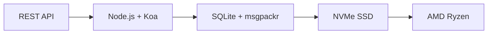

# API Email Lengkap Pertama: Bagaimana Forward Email Merevolusi Manajemen Email {#the-first-complete-email-api-how-forward-email-revolutionized-email-management}


<p class="lead mt-3">
<strong>TL;DR:</strong> Kami membangun REST API lengkap pertama di dunia untuk manajemen email dengan kemampuan pencarian canggih yang tidak ditawarkan layanan lain. Sementara Gmail, Outlook, dan Apple memaksa pengembang menggunakan IMAP atau API dengan batasan kecepatan, Forward Email menghadirkan operasi CRUD yang sangat cepat untuk pesan, folder, kontak, dan kalender melalui antarmuka REST terpadu dengan lebih dari 15 parameter pencarian. Inilah API email yang telah lama ditunggu-tunggu oleh para pengembang.
</p>

## Daftar Isi {#table-of-contents}

* [Masalah API Email](#the-email-api-problem)
* [Apa yang Sebenarnya Dikatakan Para Pengembang](#what-developers-are-actually-saying)
* [Solusi Revolusioner Forward Email](#forward-emails-revolutionary-solution)
  * [Mengapa Kami Membangun Ini](#why-we-built-this)
  * [Autentikasi Sederhana](#simple-authentication)
* [20 Titik Akhir yang Mengubah Segalanya](#20-endpoints-that-change-everything)
  * [Pesan (5 titik akhir)](#messages-5-endpoints)
  * [Folder (5 titik akhir)](#folders-5-endpoints)
  * [Kontak (5 titik akhir)](#contacts-5-endpoints)
  * [Kalender (5 titik akhir)](#calendars-5-endpoints)
* [Pencarian Lanjutan: Tidak Ada Layanan Lain yang Dapat Dibandingkan](#advanced-search-no-other-service-compares)
  * [Lanskap API Pencarian Rusak](#the-search-api-landscape-is-broken)
  * [API Pencarian Revolusioner Forward Email](#forward-emails-revolutionary-search-api)
  * [Contoh Pencarian Dunia Nyata](#real-world-search-examples)
  * [Keunggulan Performa](#performance-advantages)
  * [Fitur Pencarian yang Tidak Dimiliki Orang Lain](#search-features-no-one-else-has)
  * [Mengapa Hal Ini Penting bagi Pengembang](#why-this-matters-for-developers)
  * [Implementasi Teknis](#the-technical-implementation)
* [Arsitektur Performa Super Cepat](#blazing-fast-performance-architecture)
  * [Tolok Ukur Kinerja](#performance-benchmarks)
  * [Arsitektur Privasi-Utama](#privacy-first-architecture)
* [Mengapa Kami Berbeda: Perbandingan Lengkap](#why-were-different-the-complete-comparison)
  * [Batasan Penyedia Utama](#major-provider-limitations)
  * [Keuntungan Meneruskan Email](#forward-email-advantages)
  * [Masalah Transparansi Sumber Terbuka](#the-open-source-transparency-problem)
* [30+ Contoh Integrasi Dunia Nyata](#30-real-world-integration-examples)
  * [1. Peningkatan Formulir Kontak WordPress](#1-wordpress-contact-form-enhancement)
  * [2. Alternatif Zapier untuk Otomatisasi Email](#2-zapier-alternative-for-email-automation)
  * [3. Sinkronisasi Email CRM](#3-crm-email-synchronization)
  * [4. Pemrosesan Pesanan E-commerce](#4-e-commerce-order-processing)
  * [5. Integrasi Tiket Dukungan](#5-support-ticket-integration)
  * [6. Sistem Manajemen Buletin](#6-newsletter-management-system)
  * [7. Manajemen Tugas Berbasis Email](#7-email-based-task-management)
  * [8. Agregasi Email Multi-Akun](#8-multi-account-email-aggregation)
  * [9. Dasbor Analisis Email Lanjutan](#9-advanced-email-analytics-dashboard)
  * [10. Pengarsipan Email Cerdas](#10-smart-email-archiving)
  * [11. Integrasi Email ke Kalender](#11-email-to-calendar-integration)
  * [12. Pencadangan Email dan Kepatuhan](#12-email-backup-and-compliance)
  * [13. Manajemen Konten Berbasis Email](#13-email-based-content-management)
  * [14. Manajemen Template Email](#14-email-template-management)
  * [15. Otomatisasi Alur Kerja Berbasis Email](#15-email-based-workflow-automation)
  * [16. Pemantauan Keamanan Email](#16-email-security-monitoring)
  * [17. Pengumpulan Survei Berbasis Email](#17-email-based-survey-collection)
  * [18. Pemantauan Kinerja Email](#18-email-performance-monitoring)
  * [19. Kualifikasi Prospek Berbasis Email](#19-email-based-lead-qualification)
  * [20. Manajemen Proyek Berbasis Email](#20-email-based-project-management)
  * [21. Manajemen Inventaris Berbasis Email](#21-email-based-inventory-management)
  * [22. Pemrosesan Faktur Berbasis Email](#22-email-based-invoice-processing)
  * [23. Pendaftaran Acara Berbasis Email](#23-email-based-event-registration)
  * [24. Alur Kerja Persetujuan Dokumen Berbasis Email](#24-email-based-document-approval-workflow)
  * [25. Analisis Umpan Balik Pelanggan Berbasis Email](#25-email-based-customer-feedback-analysis)
  * [26. Jalur Perekrutan Berbasis Email](#26-email-based-recruitment-pipeline)
  * [27. Pemrosesan Laporan Pengeluaran Berbasis Email](#27-email-based-expense-report-processing)
  * [28. Pelaporan Penjaminan Mutu Berbasis Email](#28-email-based-quality-assurance-reporting)
  * [29. Manajemen Vendor Berbasis Email](#29-email-based-vendor-management)
  * [30. Pemantauan Media Sosial Berbasis Email](#30-email-based-social-media-monitoring)
* [Memulai](#getting-started)
  * [1. Buat Akun Email Penerusan Anda](#1-create-your-forward-email-account)
  * [2. Hasilkan Kredensial API](#2-generate-api-credentials)
  * [3. Lakukan Panggilan API Pertama Anda](#3-make-your-first-api-call)
  * [4. Jelajahi Dokumentasi](#4-explore-the-documentation)
* [Sumber Daya Teknis](#technical-resources)

## Masalah API Email {#the-email-api-problem}

API email pada dasarnya rusak. Titik.

Setiap penyedia email utama memaksa pengembang untuk membuat salah satu dari dua pilihan buruk:

1. **IMAP Hell**: Bergulat dengan protokol berusia 30 tahun yang dirancang untuk klien desktop, bukan aplikasi modern
2. **API yang Lumpuh**: API yang kompleks dengan batasan kecepatan, hanya baca, dan OAuth yang tidak dapat mengelola data email Anda yang sebenarnya

Hasilnya? Para pengembang akhirnya mengabaikan integrasi email sepenuhnya atau membuang waktu berminggu-minggu untuk membangun pembungkus IMAP yang rapuh dan terus-menerus rusak.

> \[!WARNING]
> **Rahasia Rahasia**: Kebanyakan "API email" hanyalah API pengiriman. Anda tidak dapat mengatur folder, menyinkronkan kontak, atau mengelola kalender secara terprogram melalui antarmuka REST yang sederhana. Hingga saat ini.

## Apa yang Sebenarnya Dikatakan Pengembang {#what-developers-are-actually-saying}

Frustrasi itu nyata dan terdokumentasi di mana-mana:

> "Baru-baru ini saya mencoba mengintegrasikan Gmail ke dalam aplikasi saya, dan saya menghabiskan terlalu banyak waktu untuk itu. Saya memutuskan bahwa tidak ada gunanya mendukung Gmail."
>
> *- [Pengembang Hacker News](https://news.ycombinator.com/item?id=42106944), 147 suara positif*

> "Apakah semua API email biasa-biasa saja? Sepertinya terbatas atau membatasi dalam beberapa hal."
>
> *- [Diskusi Reddit r/SaaS](https://www.reddit.com/r/SaaS/comments/1cm84s7/are_all_email_apis_mediocre/)*

> "Mengapa pengembangan email harus buruk?"
>
> *- [Reddit r/webdev](https://www.reddit.com/r/webdev/comments/15trnp2/why_does_email_development_have_to_suck/), 89 komentar tentang kesulitan pengembang*

> "Apa yang membuat API Gmail lebih efisien daripada IMAP? Alasan lain mengapa API Gmail jauh lebih efisien adalah karena ia hanya perlu mengunduh setiap pesan sekali. Dengan IMAP, setiap pesan harus diunduh dan diindeks..."
>
> *- [Pertanyaan Stack Overflow](https://stackoverflow.com/questions/25431022/what-makes-the-gmail-api-more-efficient-than-imap) dengan 47 upvote*

Buktinya ada dimana-mana:

* **Masalah SMTP WordPress**: [631 masalah GitHub](https://github.com/awesomemotive/WP-Mail-SMTP/issues) tentang kegagalan pengiriman email
* **Keterbatasan Zapier**: [Keluhan masyarakat](https://community.zapier.com/featured-articles-65/email-parser-by-zapier-limitations-and-alternatives-16958) tentang batas 10 email/jam dan kegagalan deteksi IMAP
* **Proyek API IMAP**: [Banyak](https://github.com/ewildgoose/imap-api) [sumber terbuka](https://emailengine.app/) [proyek](https://www.npmjs.com/package/imapflow) dibuat khusus untuk "mengonversi IMAP ke REST" karena tidak ada penyedia yang menawarkan ini
* **Kekecewaan API Gmail**: [Tumpukan Luapan](https://stackoverflow.com/questions/tagged/gmail-api) memiliki 4.847 pertanyaan yang ditandai "gmail-api" dengan keluhan umum tentang batas kecepatan dan kompleksitas

## Solusi Revolusioner Forward Email {#forward-emails-revolutionary-solution}

**Kami adalah layanan email pertama yang menawarkan operasi CRUD lengkap untuk semua data email melalui REST API terpadu.**

Ini bukan sekadar API pengiriman biasa. Ini adalah kendali terprogram penuh atas:

* **Pesan**: Membuat, membaca, memperbarui, menghapus, mencari, memindahkan, menandai
* **Folder**: Manajemen folder IMAP penuh melalui titik akhir REST
* **Kontak**: Penyimpanan dan sinkronisasi kontak [KartuDAV](https://tools.ietf.org/html/rfc6352)
* **Kalender**: Acara dan penjadwalan kalender [CalDAV](https://tools.ietf.org/html/rfc4791)

### Mengapa Kami Membangun Ini {#why-we-built-this}

**Masalahnya**: Setiap penyedia email memperlakukan email sebagai kotak hitam. Anda bisa mengirim email, mungkin membacanya dengan OAuth yang rumit, tetapi Anda tidak bisa benar-benar *mengelola* data email Anda secara terprogram.

**Visi Kami**: Email harus semudah integrasi API modern mana pun. Tanpa pustaka IMAP. Tanpa kerumitan OAuth. Tanpa mimpi buruk batas kecepatan. Hanya titik akhir REST sederhana yang berfungsi.

**Hasilnya**: Layanan email pertama tempat Anda dapat membangun klien email lengkap, integrasi CRM, atau sistem otomasi hanya dengan menggunakan permintaan HTTP.

### Autentikasi Sederhana {#simple-authentication}

Tidak ada [Kompleksitas OAuth](https://oauth.net/2/). Tidak ada [kata sandi khusus aplikasi](https://support.google.com/accounts/answer/185833). Hanya kredensial alias Anda:

```bash
curl -u "alias@yourdomain.com:password" \
  https://api.forwardemail.net/v1/messages
```

## 20 Titik Akhir yang Mengubah Segalanya {#20-endpoints-that-change-everything}

### Pesan (5 titik akhir) {#messages-5-endpoints}

* `GET /v1/messages` - Daftar pesan dengan pemfilteran (`?folder=`, `?is_unread=`, `?is_flagged=`)
* `POST /v1/messages` - Kirim pesan baru langsung ke folder
* `GET /v1/messages/:id` - Ambil pesan tertentu dengan metadata lengkap
* `PUT /v1/messages/:id` - Perbarui pesan (tanda, folder, status telah dibaca)
* `DELETE /v1/messages/:id` - Hapus pesan secara permanen

### Folder (5 titik akhir) {#folders-5-endpoints}

* `GET /v1/folders` - Daftar semua folder dengan status langganan
* `POST /v1/folders` - Buat folder baru dengan properti khusus
* `GET /v1/folders/:id` - Dapatkan detail folder dan jumlah pesan
* `PUT /v1/folders/:id` - Perbarui properti folder dan langganan
* `DELETE /v1/folders/:id` - Hapus folder dan tangani relokasi pesan

### Kontak (5 titik akhir) {#contacts-5-endpoints}

* `GET /v1/contacts` - Daftar kontak dengan pencarian dan paginasi
* `POST /v1/contacts` - Buat kontak baru dengan dukungan vCard penuh
* `GET /v1/contacts/:id` - Ambil kontak beserta semua kolom dan metadata
* `PUT /v1/contacts/:id` - Perbarui informasi kontak dengan validasi ETag
* `DELETE /v1/contacts/:id` - Hapus kontak dengan penanganan berjenjang

### Kalender (5 titik akhir) {#calendars-5-endpoints}

* `GET /v1/calendars` - Daftar acara kalender dengan pemfilteran tanggal
* `POST /v1/calendars` - Buat acara kalender dengan peserta dan pengulangan
* `GET /v1/calendars/:id` - Dapatkan detail acara dengan penanganan zona waktu
* `PUT /v1/calendars/:id` - Perbarui acara dengan deteksi konflik
* `DELETE /v1/calendars/:id` - Hapus acara dengan notifikasi peserta

## Pencarian Lanjutan: Tidak Ada Layanan Lain yang Membandingkan {#advanced-search-no-other-service-compares}

**Forward Email adalah satu-satunya layanan email yang menawarkan pencarian terprogram yang komprehensif di seluruh bidang pesan melalui REST API.**

Meskipun penyedia lain hanya menawarkan penyaringan dasar, kami telah membangun API pencarian email tercanggih yang pernah ada. Tidak ada API Gmail, API Outlook, atau layanan lain yang mampu menandingi kemampuan pencarian kami.

### Lanskap API Penelusuran Rusak {#the-search-api-landscape-is-broken}

**Keterbatasan Pencarian API Gmail:**

* ✅ Hanya parameter dasar `q`
* ❌ Tidak ada pencarian khusus bidang
* ❌ Tidak ada pemfilteran rentang tanggal
* ❌ Tidak ada pemfilteran berdasarkan ukuran
* ❌ Tidak ada pemfilteran lampiran
* ❌ Terbatas pada sintaks pencarian Gmail

**Keterbatasan Pencarian API Outlook:**

* ✅ Parameter `$search` dasar
* ❌ Tidak ada penargetan kolom lanjutan
* ❌ Tidak ada kombinasi kueri yang kompleks
* ❌ Pembatasan laju yang agresif
* ❌ Diperlukan sintaks OData yang kompleks

**Apple iCloud:**

* ❌ Tanpa API sama sekali
* ❌ Hanya pencarian IMAP (jika Anda bisa membuatnya berfungsi)

**ProtonMail & Tuta:**

* ❌ Tidak ada API publik
* ❌ Tidak ada kemampuan pencarian terprogram

### API Pencarian Revolusioner Forward Email {#forward-emails-revolutionary-search-api}

**Kami menawarkan 15+ parameter pencarian yang tidak disediakan oleh layanan lain:**

| Kemampuan Pencarian | Teruskan Email | Gmail API | API Outlook | Yang lain |
| ------------------------------ | -------------------------------------- | ------------ | ------------------ | ------ |
| **Pencarian Khusus Bidang** | ✅ Subjek, isi, dari, kepada, cc, tajuk | ❌ | ❌ | ❌ |
| **Pencarian Umum Multi-Bidang** | ✅ `?search=` di semua bidang | ✅ Dasar `q=` | ✅ Dasar `$search=` | ❌ |
| **Pemfilteran Rentang Tanggal** | ✅ `?since=` & `?before=` | ❌ | ❌ | ❌ |
| **Penyaringan Berbasis Ukuran** | ✅ `?min_size=` & `?max_size=` | ❌ | ❌ | ❌ |
| **Pemfilteran Lampiran** | ✅ `?has_attachments=true/false` | ❌ | ❌ | ❌ |
| **Pencarian Header** | ✅ `?headers=X-Priority` | ❌ | ❌ | ❌ |
| **Pencarian ID Pesan** | ✅ `?message_id=abc123` | ❌ | ❌ | ❌ |
| **Filter Gabungan** | ✅ Beberapa parameter dengan logika AND | ❌ | ❌ | ❌ |
| **Tidak Peka terhadap Huruf Besar/Kecil** | ✅ Semua pencarian | ✅ | ✅ | ❌ |
| **Dukungan Paginasi** | ✅ Bekerja dengan semua parameter pencarian | ✅ | ✅ | ❌ |

### Contoh Pencarian Dunia Nyata {#real-world-search-examples}

**Temukan Semua Faktur dari Kuartal Terakhir:**

```bash
# Forward Email - Simple and powerful
GET /v1/messages?subject=invoice&since=2024-01-01T00:00:00Z&before=2024-04-01T00:00:00Z

# Gmail API - Impossible with their limited search
# No date range filtering available

# Outlook API - Complex OData syntax, limited functionality
GET /me/messages?$search="invoice"&$filter=receivedDateTime ge 2024-01-01T00:00:00Z
```

**Cari Lampiran Besar dari Pengirim Tertentu:**

```bash
# Forward Email - Comprehensive filtering
GET /v1/messages?from=finance@company.com&has_attachments=true&min_size=1000000

# Gmail API - Cannot filter by size or attachments programmatically
# Outlook API - No size filtering available
# Others - No APIs available
```

**Pencarian Multi-Bidang Kompleks:**

```bash
# Forward Email - Advanced query capabilities
GET /v1/messages?body=quarterly&from=manager&is_flagged=true&folder=Reports

# Gmail API - Limited to basic text search only
GET /gmail/v1/users/me/messages?q=quarterly

# Outlook API - Basic search without field targeting
GET /me/messages?$search="quarterly"
```

### Keunggulan Performa {#performance-advantages}

**Kinerja Pencarian Email Teruskan:**

* ⚡ **Waktu respons di bawah 100 ms** untuk pencarian kompleks
* 🔍 **Optimasi Regex** dengan pengindeksan yang tepat
* 📊 **Eksekusi kueri paralel** untuk hitungan dan data
* 💾 **Penggunaan memori yang efisien** dengan kueri yang ramping

**Masalah Kinerja Pesaing:**

* 🐌 **API Gmail**: Batas kuota hingga 250 unit kuota per pengguna per detik
* 🐌 **API Outlook**: Pembatasan agresif dengan persyaratan penundaan yang kompleks
* 🐌 **Lainnya**: Tidak ada API yang dapat dibandingkan

### Fitur Pencarian yang Tidak Dimiliki Orang Lain {#search-features-no-one-else-has}

#### 1. Pencarian Spesifik Header {#1-header-specific-search}

```bash
# Find messages with specific headers
GET /v1/messages?headers=X-Priority:1
GET /v1/messages?headers=X-Spam-Score
```

#### 2. Kecerdasan Berbasis Ukuran {#2-size-based-intelligence}

```bash
# Find newsletter emails (typically large)
GET /v1/messages?min_size=50000&from=newsletter

# Find quick replies (typically small)
GET /v1/messages?max_size=1000&to=support
```

#### 3. Alur Kerja Berbasis Lampiran {#3-attachment-based-workflows}

```bash
# Find all documents sent to legal team
GET /v1/messages?to=legal&has_attachments=true&body=contract

# Find emails without attachments for cleanup
GET /v1/messages?has_attachments=false&before=2023-01-01T00:00:00Z
```

#### 4. Logika Bisnis Gabungan {#4-combined-business-logic}

```bash
# Find urgent flagged messages from VIPs with attachments
GET /v1/messages?is_flagged=true&from=ceo&has_attachments=true&subject=urgent
```

### Mengapa Hal Ini Penting bagi Pengembang {#why-this-matters-for-developers}

**Membangun Aplikasi yang Sebelumnya Tidak Mungkin:**

1. **Analisis Email Lanjutan**: Analisis pola email berdasarkan ukuran, pengirim, dan konten
2. **Manajemen Email Cerdas**: Atur otomatis berdasarkan kriteria yang kompleks
3. **Kepatuhan dan Penemuan**: Temukan email spesifik untuk persyaratan hukum
4. **Kecerdasan Bisnis**: Ekstrak wawasan dari pola komunikasi email
5. **Alur Kerja Otomatis**: Picu tindakan berdasarkan filter email yang canggih

### Implementasi Teknis {#the-technical-implementation}

API pencarian kami menggunakan:

**Optimalisasi Regex** dengan strategi pengindeksan yang tepat
* **Eksekusi paralel** untuk performa
* **Validasi input** untuk keamanan
* **Penanganan kesalahan komprehensif** untuk keandalan

```javascript
// Example: Complex search implementation
const searchConditions = [];

if (ctx.query.subject) {
  searchConditions.push({
    subject: { $regex: ctx.query.subject, $options: 'i' }
  });
}

if (ctx.query.from) {
  searchConditions.push({
    $or: [
      { 'from.address': { $regex: ctx.query.from, $options: 'i' } },
      { 'from.name': { $regex: ctx.query.from, $options: 'i' } }
    ]
  });
}

// Combine with AND logic
if (searchConditions.length > 0) {
  query.$and = searchConditions;
}
```

> \[!TIP]
> **Keunggulan Pengembang**: Dengan API pencarian Forward Email, Anda dapat membangun aplikasi email yang fungsionalitasnya menyaingi klien desktop, sekaligus tetap mempertahankan kesederhanaan REST API.

## Arsitektur Performa Super Cepat {#blazing-fast-performance-architecture}

Tumpukan teknis kami dibuat untuk kecepatan dan keandalan:



### Tolok Ukur Kinerja {#performance-benchmarks}

**Mengapa Kami Sangat Cepat:**

| Komponen | Teknologi | Manfaat Kinerja |
| ------------ | --------------------------------------------------------------------------------- | --------------------------------------------- |
| **Penyimpanan** | [NVMe SSD](https://en.wikipedia.org/wiki/NVM_Express) | 10x lebih cepat dari SATA tradisional |
| **Basis Data** | [SQLite](https://sqlite.org/) + [msgpackr](https://github.com/kriszyp/msgpackr) | Latensi jaringan nol, serialisasi yang dioptimalkan |
| **Perangkat keras** | [AMD Ryzen](https://www.amd.com/en/products/processors/desktops/ryzen) logam polos | Tidak ada overhead virtualisasi |
| **Penyimpanan dalam cache** | Dalam memori + persisten | Waktu respons sub-milidetik |
| **Cadangan** | [Cloudflare R2](https://www.cloudflare.com/products/r2/) terenkripsi | Keandalan tingkat perusahaan |

**Angka Kinerja Nyata:**

* **Waktu Respons API**: Rata-rata <50 md
* **Pengambilan Pesan**: <10 md untuk pesan yang di-cache
* **Operasi Folder**: <5 md untuk operasi metadata
* **Sinkronisasi Kontak**: 1000+ kontak/detik
* **Waktu Aktif**: 99,99% SLA dengan infrastruktur redundan

### Arsitektur Privasi Utama {#privacy-first-architecture}

**Desain Tanpa Pengetahuan**: Hanya Anda yang memiliki akses dengan kata sandi IMAP Anda - kami tidak dapat membaca email Anda. [arsitektur tanpa pengetahuan](https://forwardemail.net/en/security) kami memastikan privasi penuh sekaligus memberikan kinerja yang luar biasa.

## Mengapa Kami Berbeda: Perbandingan Lengkap {#why-were-different-the-complete-comparison}

### Batasan Penyedia Utama {#major-provider-limitations}

| Penyedia | Masalah Inti | Batasan Khusus |
| ---------------- | ----------------------------------------- | -------------------------------------------------------------------------------------------------------------------------------------------------------------------------------------------------------------------------------------------------------------------------------------------------------------------------------------------------------------------------------------------------------------------------------------------------------------------- |
| **Gmail API** | Hanya baca, OAuth Kompleks, API Terpisah | • [Cannot modify existing messages](https://developers.google.com/gmail/api/reference/rest/v1/users.messages)<br>• [Labels ≠ folders](https://developers.google.com/gmail/api/reference/rest/v1/users.labels)<br>• [1 billion quota units/day limit](https://developers.google.com/gmail/api/reference/quota)<br>• [Requires separate APIs](https://developers.google.com/workspace) untuk kontak/kalender |
| **API Outlook** | Tidak digunakan lagi, Membingungkan, Berfokus pada Perusahaan | • [REST endpoints deprecated March 2024](https://learn.microsoft.com/en-us/outlook/rest/compare-graph)<br>• [Multiple confusing APIs](https://learn.microsoft.com/en-us/office/client-developer/outlook/selecting-an-api-or-technology-for-developing-solutions-for-outlook) (EWS, Grafik, REST)<br>• [Microsoft Graph complexity](https://learn.microsoft.com/en-us/graph/overview)<br>• [Aggressive throttling](https://learn.microsoft.com/en-us/graph/throttling) |
| **Apple iCloud** | Tidak Ada API Publik | • [No public API whatsoever](https://support.apple.com/en-us/102654)<br>• [IMAP-only with 1000 emails/day limit](https://support.apple.com/en-us/102654)<br>• [App-specific passwords required](https://support.apple.com/en-us/102654)<br>• [500 recipients per message limit](https://support.apple.com/en-us/102654) |
| **ProtonMail** | Tidak Ada API, Klaim Open-Source Palsu | • [No public API available](https://proton.me/support/protonmail-bridge-clients)<br>• [Bridge software required](https://proton.me/mail/bridge) untuk akses IMAP<br>• [Claims "open source"](https://proton.me/blog/open-source) tetapi [server code is proprietary](https://github.com/ProtonMail)<br>• [Limited to paid plans only](https://proton.me/pricing) |
| **Total** | Tidak Ada API, Transparansi Menyesatkan | • [No REST API for email management](https://tuta.com/support#technical)<br>• [Claims "open source"](https://tuta.com/blog/posts/open-source-email) tetapi [backend is closed](https://github.com/tutao/tutanota)<br>• [IMAP/SMTP not supported](https://tuta.com/support#imap)<br>• [Proprietary encryption](https://tuta.com/encryption) mencegah integrasi standar |
| **Email Zapier** | Batasan Tarif Parah | • [10 emails per hour limit](https://help.zapier.com/hc/en-us/articles/8496181555597-Email-Parser-by-Zapier-limitations-and-alternatives)<br>• [No IMAP folder access](https://help.zapier.com/hc/en-us/articles/8496181555597-Email-Parser-by-Zapier-limitations-and-alternatives)<br>• [Limited parsing capabilities](https://help.zapier.com/hc/en-us/articles/8496181555597-Email-Parser-by-Zapier-limitations-and-alternatives) |

### Keuntungan Meneruskan Email {#forward-email-advantages}

| Fitur | Teruskan Email | Kompetisi |
| ------------------ | -------------------------------------------------------------------------------------------- | ----------------------------------------- |
| **CRUD Lengkap** | ✅ Buat, baca, perbarui, hapus penuh untuk semua data | ❌ Operasi hanya baca atau terbatas |
| **API Terpadu** | ✅ Pesan, folder, kontak, kalender dalam satu API | ❌ API terpisah atau fitur yang hilang |
| **Otorisasi Sederhana** | ✅ Otentikasi dasar dengan kredensial alias | ❌ OAuth kompleks dengan beberapa cakupan |
| **Tidak Ada Batasan Tarif** | ✅ Batasan yang besar dirancang untuk aplikasi nyata | ❌ Kuota terbatas yang mengganggu alur kerja |
| **Hosting Mandiri** | ✅ [Complete self-hosting option](https://forwardemail.net/en/blog/docs/self-hosted-solution) | ❌ Hanya untuk vendor lock-in |
| **Pribadi** | ✅ Tanpa pengetahuan, terenkripsi, pribadi | ❌ Penambangan data dan masalah privasi |
| **Pertunjukan** | ✅ Respons di bawah 50 ms, penyimpanan NVMe | ❌ Latensi jaringan, penundaan pelambatan |

### Masalah Transparansi Sumber Terbuka {#the-open-source-transparency-problem}

**ProtonMail dan Tuta memasarkan diri mereka sebagai "sumber terbuka" dan "transparan", tetapi ini adalah pemasaran yang menyesatkan dan melanggar prinsip privasi modern.**

> \[!WARNING]
> **Klaim Transparansi Palsu**: Baik ProtonMail maupun Tuta secara terang-terangan mengiklankan kredensial "sumber terbuka" mereka, namun tetap menjaga kode sisi server mereka yang paling penting tetap bersifat privat dan tertutup.

**Penipuan ProtonMail:**

* **Klaim**: ["Kami adalah sumber terbuka"](https://proton.me/blog/open-source) ditampilkan secara mencolok dalam pemasaran
* **Realitas**: [Kode server sepenuhnya merupakan hak milik](https://github.com/ProtonMail) - hanya aplikasi klien yang bersifat sumber terbuka
* **Dampak**: Pengguna tidak dapat memverifikasi enkripsi sisi server, penanganan data, atau klaim privasi
* **Pelanggaran Transparansi**: Tidak ada cara untuk mengaudit sistem pemrosesan dan penyimpanan email yang sebenarnya

**Pemasaran Tuta yang Menyesatkan:**

* **Klaim**: ["Email sumber terbuka"](https://tuta.com/blog/posts/open-source-email) sebagai nilai jual utama
* **Realitas**: [Infrastruktur backend bersifat sumber tertutup](https://github.com/tutao/tutanota) - hanya antarmuka pengguna yang tersedia
* **Dampak**: Enkripsi kepemilikan mencegah protokol email standar (IMAP/SMTP)
* **Strategi Penguncian**: Enkripsi khusus memaksa ketergantungan pada vendor

**Mengapa Hal Ini Penting untuk Privasi Modern:**

Pada tahun 2025, privasi sejati membutuhkan **transparansi penuh**. Ketika penyedia email mengklaim "sumber terbuka" tetapi menyembunyikan kode server mereka:

1. **Enkripsi yang Tidak Dapat Diverifikasi**: Anda tidak dapat mengaudit bagaimana data Anda sebenarnya dienkripsi
2. **Praktik Data Tersembunyi**: Penanganan data sisi server tetap menjadi kotak hitam
3. **Keamanan Berbasis Kepercayaan**: Anda harus memercayai klaim mereka tanpa verifikasi
4. **Penguncian Vendor**: Sistem kepemilikan mencegah portabilitas data

**Transparansi Sejati Email Teruskan:**

* ✅ **[Sumber terbuka lengkap](https://github.com/forwardemail/forwardemail.net)** - kode server dan klien
* ✅ **[Hosting mandiri tersedia](https://forwardemail.net/en/blog/docs/self-hosted-solution)** - jalankan instans Anda sendiri
* ✅ **Protokol standar** - kompatibilitas IMAP, SMTP, CardDAV, CalDAV
* ✅ **Keamanan yang dapat diaudit** - setiap baris kode dapat diperiksa
* ✅ **Tanpa vendor lock-in** - data Anda, kendali Anda

> \[!TIP]
> **Sumber terbuka sejati berarti Anda dapat memverifikasi setiap klaim.** Dengan Forward Email, Anda dapat mengaudit enkripsi kami, meninjau penanganan data kami, dan bahkan menjalankan instansi Anda sendiri. Itulah transparansi sejati.

## 30+ Contoh Integrasi Dunia Nyata {#30-real-world-integration-examples}

### 1. Peningkatan Formulir Kontak WordPress {#1-wordpress-contact-form-enhancement}

**Masalah**: [Kegagalan konfigurasi SMTP WordPress](https://github.com/awesomemotive/WP-Mail-SMTP/issues) ([631 masalah GitHub](https://github.com/awesomemotive/WP-Mail-SMTP/issues))
**Solusi**: Integrasi API langsung mengabaikan [SMTP](https://tools.ietf.org/html/rfc5321) sepenuhnya

```javascript
// WordPress contact form that saves to Sent folder
await fetch('https://api.forwardemail.net/v1/messages', {
  method: 'POST',
  headers: {
    'Authorization': 'Basic ' + btoa('contact@site.com:password'),
    'Content-Type': 'application/json'
  },
  body: JSON.stringify({
    to: [{ address: 'owner@site.com' }],
    subject: 'Contact Form: ' + formData.subject,
    text: formData.message,
    folder: 'Sent'
  })
});
```

### 2. Alternatif Zapier untuk Otomatisasi Email {#2-zapier-alternative-for-email-automation}

**Masalah**: [Batas 10 email/jam Zapier](https://help.zapier.com/hc/en-us/articles/8496181555597-Email-Parser-by-Zapier-limitations-and-alternatives) dan [Kegagalan deteksi IMAP](https://community.zapier.com/featured-articles-65/email-parser-by-zapier-limitations-and-alternatives-16958)
**Solusi**: Otomatisasi tanpa batas dengan kontrol email penuh

```javascript
// Auto-organize emails by sender domain
const messages = await fetch('/v1/messages?folder=INBOX');
for (const message of messages) {
  const domain = message.from.split('@')[1];
  await fetch(`/v1/messages/${message.id}`, {
    method: 'PUT',
    body: JSON.stringify({ folder: `Clients/${domain}` })
  });
}
```

### 3. Sinkronisasi Email CRM {#3-crm-email-synchronization}

**Masalah**: Manajemen kontak manual antara email dan [Sistem CRM](https://en.wikipedia.org/wiki/Customer_relationship_management)
**Solusi**: Sinkronisasi dua arah dengan API kontak [KartuDAV](https://tools.ietf.org/html/rfc6352)

```javascript
// Sync new email contacts to CRM
const newContacts = await fetch('/v1/contacts');
for (const contact of newContacts) {
  await crmAPI.createContact({
    name: contact.name,
    email: contact.email,
    source: 'email_api'
  });
}
```

### 4. Pemrosesan Pesanan E-niaga {#4-e-commerce-order-processing}

**Masalah**: Pemrosesan email pesanan manual untuk [platform e-commerce](https://en.wikipedia.org/wiki/E-commerce)
**Solusi**: Alur manajemen pesanan otomatis

```javascript
// Process order confirmation emails
const orders = await fetch('/v1/messages?folder=Orders');
const orderEmails = orders.filter(msg =>
  msg.subject.includes('Order Confirmation')
);

for (const order of orderEmails) {
  const orderData = parseOrderEmail(order.text);
  await updateInventory(orderData);
  await fetch(`/v1/messages/${order.id}`, {
    method: 'PUT',
    body: JSON.stringify({ folder: 'Orders/Processed' })
  });
}
```

### 5. Integrasi Tiket Dukungan {#5-support-ticket-integration}

**Masalah**: Rangkaian email tersebar di [platform meja bantuan](https://en.wikipedia.org/wiki/Help_desk_software)
**Solusi**: Pelacakan rangkaian email secara menyeluruh

```javascript
// Create support ticket from email thread
const messages = await fetch('/v1/messages?folder=Support');
const supportEmails = messages.filter(msg =>
  msg.to.some(addr => addr.includes('support@'))
);

for (const email of supportEmails) {
  const ticket = await supportSystem.createTicket({
    subject: email.subject,
    from: email.from,
    body: email.text,
    timestamp: email.date
  });
}
```

### 6. Sistem Manajemen Buletin {#6-newsletter-management-system}

**Masalah**: Integrasi [platform buletin](https://en.wikipedia.org/wiki/Email_marketing) terbatas
**Solusi**: Manajemen siklus hidup pelanggan yang lengkap

```javascript
// Auto-manage newsletter subscriptions
const messages = await fetch('/v1/messages?folder=Newsletter');
const unsubscribes = messages.filter(msg =>
  msg.subject.toLowerCase().includes('unsubscribe')
);

for (const msg of unsubscribes) {
  await removeSubscriber(msg.from);
  await fetch(`/v1/messages/${msg.id}`, {
    method: 'PUT',
    body: JSON.stringify({ folder: 'Newsletter/Unsubscribed' })
  });
}
```

### 7. Manajemen Tugas Berbasis Email {#7-email-based-task-management}

**Masalah**: Kotak masuk penuh dan [pelacakan tugas](https://en.wikipedia.org/wiki/Task_management)
**Solusi**: Ubah email menjadi tugas yang dapat ditindaklanjuti

```javascript
// Create tasks from flagged emails
const messages = await fetch('/v1/messages?is_flagged=true');
for (const email of messages) {
  await taskManager.createTask({
    title: email.subject,
    description: email.text,
    assignee: email.to[0].address,
    dueDate: extractDueDate(email.text)
  });
}
```

### 8. Agregasi Email Multi-Akun {#8-multi-account-email-aggregation}

**Masalah**: Mengelola [beberapa akun email](https://en.wikipedia.org/wiki/Email_client) di seluruh penyedia
**Solusi**: Antarmuka kotak masuk terpadu

```javascript
// Aggregate emails from multiple accounts
const accounts = ['work@domain.com', 'personal@domain.com'];
const allMessages = [];

for (const account of accounts) {
  const messages = await fetch('/v1/messages', {
    headers: { 'Authorization': getAuth(account) }
  });
  allMessages.push(...messages.map(m => ({ ...m, account })));
}
```

### 9. Dasbor Analisis Email Lanjutan {#9-advanced-email-analytics-dashboard}

**Masalah**: Tidak ada wawasan tentang [pola email](https://en.wikipedia.org/wiki/Email_analytics) dengan pemfilteran canggih
**Solusi**: Analisis email khusus menggunakan kemampuan pencarian lanjutan

```javascript
// Generate comprehensive email analytics using advanced search
const analytics = {};

// Analyze email volume by sender domain
const messages = await fetch('/v1/messages');
analytics.senderDomains = analyzeSenderDomains(messages);

// Find large attachments consuming storage
const largeAttachments = await fetch('/v1/messages?has_attachments=true&min_size=1000000');
analytics.storageHogs = largeAttachments.map(msg => ({
  subject: msg.subject,
  from: msg.from,
  size: msg.size
}));

// Analyze communication patterns with VIPs
const vipEmails = await fetch('/v1/messages?from=ceo@company.com');
const urgentVipEmails = await fetch('/v1/messages?from=ceo@company.com&subject=urgent');
analytics.vipCommunication = {
  total: vipEmails.length,
  urgent: urgentVipEmails.length,
  urgencyRate: (urgentVipEmails.length / vipEmails.length) * 100
};

// Find unread emails by date range for follow-up
const lastWeek = new Date(Date.now() - 7 * 24 * 60 * 60 * 1000).toISOString();
const unreadRecent = await fetch(`/v1/messages?is_unread=true&since=${lastWeek}`);
analytics.followUpNeeded = unreadRecent.length;

// Analyze email sizes for optimization
const smallEmails = await fetch('/v1/messages?max_size=1000');
const mediumEmails = await fetch('/v1/messages?min_size=1000&max_size=50000');
const largeEmails = await fetch('/v1/messages?min_size=50000');
analytics.sizeDistribution = {
  small: smallEmails.length,
  medium: mediumEmails.length,
  large: largeEmails.length
};

// Search for compliance-related emails
const complianceEmails = await fetch('/v1/messages?body=confidential&has_attachments=true');
analytics.complianceReview = complianceEmails.length;
```

### 10. Pengarsipan Email Cerdas {#10-smart-email-archiving}

**Masalah**: Manual [organisasi email](https://en.wikipedia.org/wiki/Email_management)
**Solusi**: Kategorisasi email yang cerdas

```javascript
// Auto-archive old emails by category
const messages = await fetch('/v1/messages');
const oldEmails = messages.filter(email =>
  isOlderThan(email.date, 90) // 90 days
);

for (const email of oldEmails) {
  const category = categorizeEmail(email);
  await fetch(`/v1/messages/${email.id}`, {
    method: 'PUT',
    body: JSON.stringify({ folder: `Archive/${category}` })
  });
}
```

### 11. Integrasi Email ke Kalender {#11-email-to-calendar-integration}

**Masalah**: Pembuatan [acara kalender](https://tools.ietf.org/html/rfc4791) secara manual dari email
**Solusi**: Ekstraksi dan pembuatan peristiwa secara otomatis

```javascript
// Extract meeting details from emails
const messages = await fetch('/v1/messages?folder=Meetings');
const meetingEmails = messages.filter(email =>
  email.subject.toLowerCase().includes('meeting')
);

for (const email of meetingEmails) {
  const meetingData = extractMeetingInfo(email.text);
  if (meetingData.date && meetingData.time) {
    await fetch('/v1/calendars', {
      method: 'POST',
      body: JSON.stringify({
        title: email.subject,
        start: meetingData.datetime,
        attendees: [email.from, ...email.to]
      })
    });
  }
}
```

### 12. Pencadangan dan Kepatuhan Email {#12-email-backup-and-compliance}

**Masalah**: [Retensi email](https://en.wikipedia.org/wiki/Email_retention_policy) dan persyaratan kepatuhan
**Solusi**: Pencadangan otomatis dengan pelestarian metadata

```javascript
// Backup emails with full metadata
const allMessages = await fetch('/v1/messages');
const backup = {
  timestamp: new Date(),
  messages: allMessages.map(msg => ({
    id: msg.id,
    subject: msg.subject,
    from: msg.from,
    to: msg.to,
    date: msg.date,
    flags: msg.flags
  }))
};
await saveToComplianceStorage(backup);
```

### 13. Manajemen Konten Berbasis Email {#13-email-based-content-management}

**Masalah**: Mengelola kiriman konten melalui email untuk [Platform CMS](https://en.wikipedia.org/wiki/Content_management_system)
**Solusi**: Email sebagai sistem manajemen konten

```javascript
// Process content submissions from email
const messages = await fetch('/v1/messages?folder=Submissions');
const submissions = messages.filter(msg =>
  msg.to.some(addr => addr.includes('submit@'))
);

for (const submission of submissions) {
  const content = parseSubmission(submission.text);
  await cms.createDraft({
    title: submission.subject,
    content: content.body,
    author: submission.from
  });
}
```

### 14. Manajemen Template Email {#14-email-template-management}

**Masalah**: [templat email](https://en.wikipedia.org/wiki/Email_template) tidak konsisten di seluruh tim
**Solusi**: Sistem templat terpusat dengan API

```javascript
// Send templated emails with dynamic content
const template = await getEmailTemplate('welcome');
await fetch('/v1/messages', {
  method: 'POST',
  body: JSON.stringify({
    to: [{ address: newUser.email }],
    subject: template.subject.replace('{{name}}', newUser.name),
    html: template.html.replace('{{name}}', newUser.name),
    folder: 'Sent'
  })
});
```

### 15. Otomatisasi Alur Kerja Berbasis Email {#15-email-based-workflow-automation}

**Masalah**: [proses persetujuan](https://en.wikipedia.org/wiki/Workflow) manual melalui email
**Solusi**: Pemicu alur kerja otomatis

```javascript
// Process approval emails
const messages = await fetch('/v1/messages?folder=Approvals');
const approvals = messages.filter(msg =>
  msg.subject.includes('APPROVAL')
);

for (const approval of approvals) {
  const decision = parseApprovalDecision(approval.text);
  await workflow.processApproval({
    requestId: extractRequestId(approval.subject),
    decision: decision,
    approver: approval.from
  });
}
```

### 16. Pemantauan Keamanan Email {#16-email-security-monitoring}

**Masalah**: [deteksi ancaman keamanan](https://en.wikipedia.org/wiki/Email_security) manual
**Solusi**: Analisis ancaman otomatis

```javascript
// Monitor for suspicious emails
const recentEmails = await fetch('/v1/messages');
for (const email of recentEmails) {
  const threatScore = analyzeThreat(email);
  if (threatScore > 0.8) {
    await fetch(`/v1/messages/${email.id}`, {
      method: 'PUT',
      body: JSON.stringify({ folder: 'Security/Quarantine' })
    });
    await alertSecurityTeam(email);
  }
}
```

### 17. Pengumpulan Survei Berbasis Email {#17-email-based-survey-collection}

**Masalah**: Pemrosesan [tanggapan survei](https://en.wikipedia.org/wiki/Survey_methodology) manual
**Solusi**: Agregasi respons otomatis

```javascript
// Collect and process survey responses
const messages = await fetch('/v1/messages?folder=Surveys');
const responses = messages.filter(msg =>
  msg.subject.includes('Survey Response')
);

const surveyData = responses.map(email => ({
  respondent: email.from,
  responses: parseSurveyData(email.text),
  timestamp: email.date
}));
await updateSurveyResults(surveyData);
```

### 18. Pemantauan Kinerja Email {#18-email-performance-monitoring}

**Masalah**: Tidak ada visibilitas ke [kinerja pengiriman email](https://en.wikipedia.org/wiki/Email_deliverability)
**Solusi**: Metrik email real-time

```javascript
// Monitor email delivery performance
const sentEmails = await fetch('/v1/messages?folder=Sent');
const deliveryStats = {
  sent: sentEmails.length,
  bounces: await countBounces(),
  deliveryRate: calculateDeliveryRate()
};
await updateDashboard(deliveryStats);
```

### 19. Kualifikasi Prospek Berbasis Email {#19-email-based-lead-qualification}

**Masalah**: Manual [skor prospek](https://en.wikipedia.org/wiki/Lead_scoring) dari interaksi email
**Solusi**: Jalur kualifikasi prospek otomatis

```javascript
// Score leads based on email engagement
const prospects = await fetch('/v1/contacts');
for (const prospect of prospects) {
  const messages = await fetch('/v1/messages');
  const emails = messages.filter(msg =>
    msg.from.includes(prospect.email)
  );
  const score = calculateEngagementScore(emails);
  await crm.updateLeadScore(prospect.id, score);
}
```

### 20. Manajemen Proyek Berbasis Email {#20-email-based-project-management}

**Masalah**: [Pembaruan proyek](https://en.wikipedia.org/wiki/Project_management) tersebar di seluruh rangkaian email
**Solusi**: Pusat komunikasi proyek terpusat

```javascript
// Extract project updates from emails
const messages = await fetch('/v1/messages?folder=Projects');
const projectEmails = messages.filter(msg =>
  msg.subject.includes('Project Update')
);

for (const email of projectEmails) {
  const update = parseProjectUpdate(email.text);
  await projectManager.addUpdate({
    project: update.projectId,
    author: email.from,
    content: update.content
  });
}
```

### 21. Manajemen Inventaris Berbasis Email {#21-email-based-inventory-management}

**Masalah**: Pembaruan inventaris manual dari email pemasok
**Solusi**: Pelacakan inventaris otomatis dari notifikasi email

```javascript
// Process inventory updates from supplier emails
const messages = await fetch('/v1/messages?folder=Suppliers');
const inventoryEmails = messages.filter(msg =>
  msg.subject.includes('Inventory Update') || msg.subject.includes('Stock Alert')
);

for (const email of inventoryEmails) {
  const inventoryData = parseInventoryUpdate(email.text);
  await inventory.updateStock({
    sku: inventoryData.sku,
    quantity: inventoryData.quantity,
    supplier: email.from,
    timestamp: email.date
  });

  // Move to processed folder
  await fetch(`/v1/messages/${email.id}`, {
    method: 'PUT',
    body: JSON.stringify({ folder: 'Suppliers/Processed' })
  });
}
```

### 22. Pemrosesan Faktur Berbasis Email {#22-email-based-invoice-processing}

**Masalah**: Integrasi manual [pemrosesan faktur](https://en.wikipedia.org/wiki/Invoice_processing) dan akuntansi
**Solusi**: Ekstraksi faktur otomatis dan sinkronisasi sistem akuntansi

```javascript
// Extract invoice data from email attachments
const messages = await fetch('/v1/messages?folder=Invoices');
const invoiceEmails = messages.filter(msg =>
  msg.subject.toLowerCase().includes('invoice') && msg.attachments.length > 0
);

for (const email of invoiceEmails) {
  const invoiceData = await extractInvoiceData(email.attachments[0]);
  await accounting.createInvoice({
    vendor: email.from,
    amount: invoiceData.total,
    dueDate: invoiceData.dueDate,
    items: invoiceData.lineItems
  });

  // Flag as processed
  await fetch(`/v1/messages/${email.id}`, {
    method: 'PUT',
    body: JSON.stringify({ flags: ['\\Seen', '\\Flagged'] })
  });
}
```

### 23. Pendaftaran Acara Berbasis Email {#23-email-based-event-registration}

**Masalah**: Pemrosesan [pendaftaran acara](https://en.wikipedia.org/wiki/Event_management) manual dari balasan email
**Solusi**: Manajemen peserta dan integrasi kalender otomatis

```javascript
// Process event registration emails
const messages = await fetch('/v1/messages?folder=Events');
const registrations = messages.filter(msg =>
  msg.subject.includes('Registration') || msg.subject.includes('RSVP')
);

for (const registration of registrations) {
  const attendeeData = parseRegistration(registration.text);

  // Add to attendee list
  await events.addAttendee({
    event: attendeeData.eventId,
    name: attendeeData.name,
    email: registration.from,
    dietary: attendeeData.dietaryRestrictions
  });

  // Create calendar event for attendee
  await fetch('/v1/calendars', {
    method: 'POST',
    body: JSON.stringify({
      title: attendeeData.eventName,
      start: attendeeData.eventDate,
      attendees: [registration.from]
    })
  });
}
```

### 24. Alur Kerja Persetujuan Dokumen Berbasis Email {#24-email-based-document-approval-workflow}

**Masalah**: Rantai [persetujuan dokumen](https://en.wikipedia.org/wiki/Document_management_system) yang kompleks melalui email
**Solusi**: Pelacakan persetujuan otomatis dan versi dokumen

```javascript
// Track document approval workflow
const messages = await fetch('/v1/messages?folder=Approvals');
const approvalEmails = messages.filter(msg =>
  msg.subject.includes('Document Approval')
);

for (const email of approvalEmails) {
  const approval = parseApprovalEmail(email.text);

  await documentSystem.updateApproval({
    documentId: approval.documentId,
    approver: email.from,
    status: approval.decision, // 'approved', 'rejected', 'needs_changes'
    comments: approval.comments,
    timestamp: email.date
  });

  // Check if all approvals complete
  const document = await documentSystem.getDocument(approval.documentId);
  if (document.allApprovalsComplete) {
    await documentSystem.finalizeDocument(approval.documentId);
  }
}
```

### 25. Analisis Umpan Balik Pelanggan Berbasis Email {#25-email-based-customer-feedback-analysis}

**Masalah**: Pengumpulan [umpan balik pelanggan](https://en.wikipedia.org/wiki/Customer_feedback) manual dan analisis sentimen
**Solusi**: Pemrosesan umpan balik dan pelacakan sentimen otomatis

```javascript
// Analyze customer feedback from emails
const messages = await fetch('/v1/messages?folder=Feedback');
const feedbackEmails = messages.filter(msg =>
  msg.to.some(addr => addr.includes('feedback@'))
);

for (const email of feedbackEmails) {
  const sentiment = await analyzeSentiment(email.text);
  const category = categorizeFeeback(email.text);

  await feedback.recordFeedback({
    customer: email.from,
    content: email.text,
    sentiment: sentiment.score, // -1 to 1
    category: category, // 'bug', 'feature', 'complaint', 'praise'
    priority: calculatePriority(sentiment, category),
    timestamp: email.date
  });

  // Auto-escalate negative feedback
  if (sentiment.score < -0.5) {
    await escalateToSupport(email);
  }
}
```

### 26. Alur Rekrutmen Berbasis Email {#26-email-based-recruitment-pipeline}

**Masalah**: Pelacakan [perekrutan](https://en.wikipedia.org/wiki/Recruitment) dan kandidat secara manual
**Solusi**: Manajemen kandidat dan penjadwalan wawancara otomatis

```javascript
// Process job application emails
const messages = await fetch('/v1/messages?folder=Careers');
const applications = messages.filter(msg =>
  msg.subject.toLowerCase().includes('application') && msg.attachments.length > 0
);

for (const application of applications) {
  const resume = await parseResume(application.attachments[0]);

  const candidate = await ats.createCandidate({
    name: resume.name,
    email: application.from,
    skills: resume.skills,
    experience: resume.experience,
    position: extractPosition(application.subject)
  });

  // Auto-schedule screening if qualified
  if (candidate.qualificationScore > 0.7) {
    await calendar.scheduleInterview({
      candidateId: candidate.id,
      type: 'phone_screening',
      duration: 30
    });
  }
}
```

### 27. Pemrosesan Laporan Pengeluaran Berbasis Email {#27-email-based-expense-report-processing}

**Masalah**: Pengiriman dan persetujuan [laporan pengeluaran](https://en.wikipedia.org/wiki/Expense_report) secara manual
**Solusi**: Alur kerja ekstraksi dan persetujuan pengeluaran otomatis

```javascript
// Process expense report emails
const messages = await fetch('/v1/messages?folder=Expenses');
const expenseEmails = messages.filter(msg =>
  msg.subject.includes('Expense') && msg.attachments.length > 0
);

for (const email of expenseEmails) {
  const receipts = await processReceipts(email.attachments);

  const expenseReport = await expenses.createReport({
    employee: email.from,
    expenses: receipts.map(receipt => ({
      amount: receipt.total,
      category: receipt.category,
      date: receipt.date,
      merchant: receipt.merchant
    })),
    totalAmount: receipts.reduce((sum, r) => sum + r.total, 0)
  });

  // Auto-approve small amounts
  if (expenseReport.totalAmount < 100) {
    await expenses.approve(expenseReport.id);
  } else {
    await expenses.sendForApproval(expenseReport.id);
  }
}
```

### 28. Pelaporan Jaminan Kualitas Berbasis Email {#28-email-based-quality-assurance-reporting}

**Masalah**: Pelacakan masalah [jaminan kualitas](https://en.wikipedia.org/wiki/Quality_assurance) manual
**Solusi**: Manajemen masalah QA otomatis dan pelacakan bug

```javascript
// Process QA bug reports from email
const messages = await fetch('/v1/messages?folder=QA');
const bugReports = messages.filter(msg =>
  msg.subject.includes('Bug Report') || msg.subject.includes('QA Issue')
);

for (const report of bugReports) {
  const bugData = parseBugReport(report.text);

  const ticket = await bugTracker.createIssue({
    title: report.subject,
    description: bugData.description,
    severity: bugData.severity,
    steps: bugData.stepsToReproduce,
    reporter: report.from,
    attachments: report.attachments
  });

  // Auto-assign based on component
  const assignee = await getComponentOwner(bugData.component);
  await bugTracker.assign(ticket.id, assignee);

  // Create calendar reminder for follow-up
  await fetch('/v1/calendars', {
    method: 'POST',
    body: JSON.stringify({
      title: `Follow up on ${ticket.id}`,
      start: addDays(new Date(), 3),
      attendees: [assignee]
    })
  });
}
```

### 29. Manajemen Vendor Berbasis Email {#29-email-based-vendor-management}

**Masalah**: Pelacakan [komunikasi vendor](https://en.wikipedia.org/wiki/Vendor_management) dan kontrak manual
**Solusi**: Manajemen hubungan vendor otomatis

```javascript
// Track vendor communications and contracts
const messages = await fetch('/v1/messages?folder=Vendors');
const vendorEmails = messages.filter(msg =>
  isVendorEmail(msg.from)
);

for (const email of vendorEmails) {
  const vendor = await vendors.getByEmail(email.from);

  // Log communication
  await vendors.logCommunication({
    vendorId: vendor.id,
    type: 'email',
    subject: email.subject,
    content: email.text,
    timestamp: email.date
  });

  // Check for contract-related keywords
  if (email.text.includes('contract') || email.text.includes('renewal')) {
    await vendors.flagForContractReview({
      vendorId: vendor.id,
      emailId: email.id,
      priority: 'high'
    });

    // Create task for procurement team
    await tasks.create({
      title: `Review contract communication from ${vendor.name}`,
      assignee: 'procurement@company.com',
      dueDate: addDays(new Date(), 2)
    });
  }
}
```

### 30. Pemantauan Media Sosial Berbasis Email {#30-email-based-social-media-monitoring}

**Masalah**: Pelacakan dan respons penyebutan [media sosial](https://en.wikipedia.org/wiki/Social_media_monitoring) manual
**Solusi**: Pemrosesan notifikasi media sosial dan koordinasi respons otomatis

```javascript
// Process social media alerts from email notifications
const messages = await fetch('/v1/messages?folder=Social');
const socialAlerts = messages.filter(msg =>
  msg.from.includes('alerts@') || msg.subject.includes('Social Mention')
);

for (const alert of socialAlerts) {
  const mention = parseSocialMention(alert.text);

  await socialMedia.recordMention({
    platform: mention.platform,
    author: mention.author,
    content: mention.content,
    sentiment: mention.sentiment,
    reach: mention.followerCount,
    url: mention.url
  });

  // Auto-escalate negative mentions with high reach
  if (mention.sentiment < -0.5 && mention.followerCount > 10000) {
    await socialMedia.escalateToTeam({
      mentionId: mention.id,
      priority: 'urgent',
      assignee: 'social-media-manager@company.com'
    });

    // Create calendar reminder for immediate response
    await fetch('/v1/calendars', {
      method: 'POST',
      body: JSON.stringify({
        title: `Urgent: Respond to negative social mention`,
        start: addMinutes(new Date(), 30),
        attendees: ['social-media-manager@company.com']
      })
    });
  }
}
```

## Memulai {#getting-started}

### 1. Buat Akun Email Penerusan Anda {#1-create-your-forward-email-account}

Daftar di [forwardemail.net](https://forwardemail.net) dan verifikasi domain Anda.

### 2. Hasilkan Kredensial API {#2-generate-api-credentials}

Email alias dan kata sandi Anda berfungsi sebagai kredensial API - tidak diperlukan pengaturan tambahan.

### 3. Lakukan Panggilan API Pertama Anda {#3-make-your-first-api-call}

```bash
# List your messages
curl -u "your-alias@domain.com:password" \
  https://api.forwardemail.net/v1/messages

# Create a new contact
curl -u "your-alias@domain.com:password" \
  -X POST \
  -H "Content-Type: application/json" \
  -d '{"fullName":"John Doe","emails":[{"value":"john@example.com"}]}' \
  https://api.forwardemail.net/v1/contacts
```

### 4. Jelajahi Dokumentasi {#4-explore-the-documentation}

Kunjungi [forwardemail.net/en/email-api](https://forwardemail.net/en/email-api) untuk dokumentasi API lengkap dengan contoh interaktif.

## Sumber Daya Teknis {#technical-resources}

* **[Dokumentasi API Lengkap](https://forwardemail.net/en/email-api)** - Spesifikasi OpenAPI 3.0 interaktif
* **[Panduan Hosting Mandiri](https://forwardemail.net/en/blog/docs/self-hosted-solution)** - Terapkan Forward Email di infrastruktur Anda
* **[Buku Putih Keamanan](https://forwardemail.net/technical-whitepaper.pdf)** - Detail arsitektur teknis dan keamanan
* **[Repositori GitHub](https://github.com/forwardemail/forwardemail.net)** - Basis kode sumber terbuka
* **[Dukungan Pengembang](mailto:api@forwardemail.net)** - Akses langsung ke tim teknisi kami

---

**Siap merevolusi integrasi email Anda?** [Mulailah membangun dengan API Forward Email hari ini](https://forwardemail.net/en/email-api) dan rasakan platform manajemen email lengkap pertama yang dirancang untuk pengembang.

*Email Terusan: Layanan email yang akhirnya menggunakan API yang tepat.*