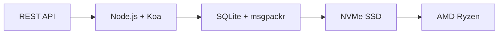

# API Email Lengkap Pertama: Bagaimana Forward Email Merevolusi Manajemen Email {#the-first-complete-email-api-how-forward-email-revolutionized-email-management}


<p class="lead mt-3">
  <strong>TL;DR:</strong> Kami membangun REST API lengkap pertama di dunia untuk manajemen email dengan kemampuan pencarian canggih yang tidak ditawarkan layanan lain. Sementara Gmail, Outlook, dan Apple memaksa pengembang ke dalam neraka IMAP atau API dengan batasan kecepatan, Forward Email menghadirkan operasi CRUD yang sangat cepat untuk pesan, folder, kontak, dan kalender melalui antarmuka REST terpadu dengan lebih dari 15 parameter pencarian. Ini adalah API email yang telah lama ditunggu oleh para pengembang.
</p>


## Daftar Isi {#table-of-contents}

* [Masalah API Email](#the-email-api-problem)
* [Apa yang Sebenarnya Dikatakan Pengembang](#what-developers-are-actually-saying)
* [Solusi Revolusioner Forward Email](#forward-emails-revolutionary-solution)
  * [Mengapa Kami Membangunnya](#why-we-built-this)
  * [Autentikasi Sederhana](#simple-authentication)
* [20 Endpoint yang Mengubah Segalanya](#20-endpoints-that-change-everything)
  * [Pesan (5 endpoint)](#messages-5-endpoints)
  * [Folder (5 endpoint)](#folders-5-endpoints)
  * [Kontak (5 endpoint)](#contacts-5-endpoints)
  * [Kalender (5 endpoint)](#calendars-5-endpoints)
* [Pencarian Lanjutan: Tidak Ada Layanan Lain yang Menyamai](#advanced-search-no-other-service-compares)
  * [Lanskap API Pencarian yang Rusak](#the-search-api-landscape-is-broken)
  * [API Pencarian Revolusioner Forward Email](#forward-emails-revolutionary-search-api)
  * [Contoh Pencarian Dunia Nyata](#real-world-search-examples)
  * [Keunggulan Performa](#performance-advantages)
  * [Fitur Pencarian yang Tidak Dimiliki Lainnya](#search-features-no-one-else-has)
  * [Mengapa Ini Penting bagi Pengembang](#why-this-matters-for-developers)
  * [Implementasi Teknis](#the-technical-implementation)
* [Arsitektur Performa Sangat Cepat](#blazing-fast-performance-architecture)
  * [Tolok Ukur Performa](#performance-benchmarks)
  * [Arsitektur Berbasis Privasi](#privacy-first-architecture)
* [Mengapa Kami Berbeda: Perbandingan Lengkap](#why-were-different-the-complete-comparison)
  * [Keterbatasan Penyedia Utama](#major-provider-limitations)
  * [Keunggulan Forward Email](#forward-email-advantages)
  * [Masalah Transparansi Open-Source](#the-open-source-transparency-problem)
* [30+ Contoh Integrasi Dunia Nyata](#30-real-world-integration-examples)
  * [1. Peningkatan Formulir Kontak WordPress](#1-wordpress-contact-form-enhancement)
  * [2. Alternatif Zapier untuk Otomasi Email](#2-zapier-alternative-for-email-automation)
  * [3. Sinkronisasi Email CRM](#3-crm-email-synchronization)
  * [4. Pemrosesan Pesanan E-commerce](#4-e-commerce-order-processing)
  * [5. Integrasi Tiket Dukungan](#5-support-ticket-integration)
  * [6. Sistem Manajemen Newsletter](#6-newsletter-management-system)
  * [7. Manajemen Tugas Berbasis Email](#7-email-based-task-management)
  * [8. Agregasi Email Multi-Akun](#8-multi-account-email-aggregation)
  * [9. Dasbor Analitik Email Lanjutan](#9-advanced-email-analytics-dashboard)
  * [10. Pengarsipan Email Cerdas](#10-smart-email-archiving)
  * [11. Integrasi Email ke Kalender](#11-email-to-calendar-integration)
  * [12. Cadangan Email dan Kepatuhan](#12-email-backup-and-compliance)
  * [13. Manajemen Konten Berbasis Email](#13-email-based-content-management)
  * [14. Manajemen Template Email](#14-email-template-management)
  * [15. Otomasi Alur Kerja Berbasis Email](#15-email-based-workflow-automation)
  * [16. Pemantauan Keamanan Email](#16-email-security-monitoring)
  * [17. Pengumpulan Survei Berbasis Email](#17-email-based-survey-collection)
  * [18. Pemantauan Performa Email](#18-email-performance-monitoring)
  * [19. Kualifikasi Lead Berbasis Email](#19-email-based-lead-qualification)
  * [20. Manajemen Proyek Berbasis Email](#20-email-based-project-management)
  * [21. Manajemen Inventaris Berbasis Email](#21-email-based-inventory-management)
  * [22. Pemrosesan Faktur Berbasis Email](#22-email-based-invoice-processing)
  * [23. Registrasi Acara Berbasis Email](#23-email-based-event-registration)
  * [24. Alur Kerja Persetujuan Dokumen Berbasis Email](#24-email-based-document-approval-workflow)
  * [25. Analisis Umpan Balik Pelanggan Berbasis Email](#25-email-based-customer-feedback-analysis)
  * [26. Pipeline Rekrutmen Berbasis Email](#26-email-based-recruitment-pipeline)
  * [27. Pemrosesan Laporan Pengeluaran Berbasis Email](#27-email-based-expense-report-processing)
  * [28. Pelaporan Jaminan Kualitas Berbasis Email](#28-email-based-quality-assurance-reporting)
  * [29. Manajemen Vendor Berbasis Email](#29-email-based-vendor-management)
  * [30. Pemantauan Media Sosial Berbasis Email](#30-email-based-social-media-monitoring)
* [Memulai](#getting-started)
  * [1. Buat Akun Forward Email Anda](#1-create-your-forward-email-account)
  * [2. Hasilkan Kredensial API](#2-generate-api-credentials)
  * [3. Lakukan Panggilan API Pertama Anda](#3-make-your-first-api-call)
  * [4. Jelajahi Dokumentasi](#4-explore-the-documentation)
* [Sumber Daya Teknis](#technical-resources)
## Masalah API Email {#the-email-api-problem}

API email pada dasarnya rusak. Titik.

Setiap penyedia email besar memaksa pengembang memilih salah satu dari dua pilihan buruk:

1. **Neraka IMAP**: Berjuang dengan protokol berusia 30 tahun yang dirancang untuk klien desktop, bukan aplikasi modern
2. **API Terbatas**: API yang dibatasi kecepatan, hanya baca, dan kompleksitas OAuth yang tidak bisa mengelola data email Anda secara nyata

Hasilnya? Pengembang entah meninggalkan integrasi email sepenuhnya atau membuang waktu berminggu-minggu membangun pembungkus IMAP yang rapuh dan sering rusak.

> \[!WARNING]
> **Rahasia Kotor**: Sebagian besar "API email" hanyalah API pengiriman. Anda tidak bisa secara programatik mengatur folder, menyinkronkan kontak, atau mengelola kalender melalui antarmuka REST sederhana. Sampai sekarang.


## Apa yang Sebenarnya Dikatakan Pengembang {#what-developers-are-actually-saying}

Frustrasi itu nyata dan terdokumentasi di mana-mana:

> "Saya baru-baru ini mencoba mengintegrasikan Gmail di aplikasi saya, dan saya menghabiskan terlalu banyak waktu untuk itu. Saya memutuskan tidak layak untuk mendukung Gmail."
>
> *- [Pengembang Hacker News](https://news.ycombinator.com/item?id=42106944), 147 suara suka*

> "Apakah semua API email biasa-biasa saja? Mereka tampak terbatas atau membatasi dalam beberapa hal."
>
> *- [Diskusi Reddit r/SaaS](https://www.reddit.com/r/SaaS/comments/1cm84s7/are_all_email_apis_mediocre/)*

> "Kenapa pengembangan email harus menyebalkan?"
>
> *- [Reddit r/webdev](https://www.reddit.com/r/webdev/comments/15trnp2/why_does_email_development_have_to_suck/), 89 komentar tentang kesulitan pengembang*

> "Apa yang membuat API Gmail lebih efisien daripada IMAP? Alasan lain API Gmail jauh lebih efisien adalah karena hanya perlu mengunduh setiap pesan sekali saja. Dengan IMAP, setiap pesan harus diunduh dan diindeks..."
>
> *- [Pertanyaan Stack Overflow](https://stackoverflow.com/questions/25431022/what-makes-the-gmail-api-more-efficient-than-imap) dengan 47 suara suka*

Buktinya ada di mana-mana:

* **Masalah SMTP WordPress**: [631 isu GitHub](https://github.com/awesomemotive/WP-Mail-SMTP/issues) tentang kegagalan pengiriman email
* **Batasan Zapier**: [Keluhan komunitas](https://community.zapier.com/featured-articles-65/email-parser-by-zapier-limitations-and-alternatives-16958) tentang batas 10 email/jam dan kegagalan deteksi IMAP
* **Proyek API IMAP**: [Banyak](https://github.com/ewildgoose/imap-api) [proyek sumber terbuka](https://emailengine.app/) [ada](https://www.npmjs.com/package/imapflow) khusus untuk "mengubah IMAP menjadi REST" karena tidak ada penyedia yang menawarkan ini
* **Frustrasi API Gmail**: [Stack Overflow](https://stackoverflow.com/questions/tagged/gmail-api) memiliki 4.847 pertanyaan berlabel "gmail-api" dengan keluhan umum tentang batas kecepatan dan kompleksitas


## Solusi Revolusioner Forward Email {#forward-emails-revolutionary-solution}

**Kami adalah layanan email pertama yang menawarkan operasi CRUD lengkap untuk semua data email melalui API REST terpadu.**

Ini bukan sekadar API pengiriman. Ini adalah kontrol programatik lengkap atas:

* **Pesan**: Buat, baca, perbarui, hapus, cari, pindah, beri tanda
* **Folder**: Manajemen folder IMAP penuh melalui endpoint REST
* **Kontak**: Penyimpanan dan sinkronisasi kontak [CardDAV](https://tools.ietf.org/html/rfc6352)
* **Kalender**: Acara kalender dan penjadwalan [CalDAV](https://tools.ietf.org/html/rfc4791)

### Mengapa Kami Membuat Ini {#why-we-built-this}

**Masalahnya**: Setiap penyedia email memperlakukan email sebagai kotak hitam. Anda bisa mengirim email, mungkin membacanya dengan OAuth yang kompleks, tapi Anda tidak benar-benar bisa *mengelola* data email Anda secara programatik.

**Visi Kami**: Email harus semudah mengintegrasikan API modern mana pun. Tanpa pustaka IMAP. Tanpa kompleksitas OAuth. Tanpa mimpi buruk batas kecepatan. Hanya endpoint REST sederhana yang bekerja.

**Hasilnya**: Layanan email pertama di mana Anda bisa membangun klien email lengkap, integrasi CRM, atau sistem otomatisasi hanya dengan permintaan HTTP.

### Autentikasi Sederhana {#simple-authentication}

Tanpa [kompleksitas OAuth](https://oauth.net/2/). Tanpa [kata sandi khusus aplikasi](https://support.google.com/accounts/answer/185833). Cukup kredensial alias Anda:

```bash
curl -u "alias@yourdomain.com:password" \
  https://api.forwardemail.net/v1/messages
```
## 20 Endpoint yang Mengubah Segalanya {#20-endpoints-that-change-everything}

### Pesan (5 endpoint) {#messages-5-endpoints}

* `GET /v1/messages` - Daftar pesan dengan penyaringan (`?folder=`, `?is_unread=`, `?is_flagged=`)
* `POST /v1/messages` - Kirim pesan baru langsung ke folder
* `GET /v1/messages/:id` - Ambil pesan spesifik dengan metadata lengkap
* `PUT /v1/messages/:id` - Perbarui pesan (flag, folder, status baca)
* `DELETE /v1/messages/:id` - Hapus pesan secara permanen

### Folder (5 endpoint) {#folders-5-endpoints}

* `GET /v1/folders` - Daftar semua folder dengan status langganan
* `POST /v1/folders` - Buat folder baru dengan properti kustom
* `GET /v1/folders/:id` - Dapatkan detail folder dan jumlah pesan
* `PUT /v1/folders/:id` - Perbarui properti folder dan langganan
* `DELETE /v1/folders/:id` - Hapus folder dan tangani relokasi pesan

### Kontak (5 endpoint) {#contacts-5-endpoints}

* `GET /v1/contacts` - Daftar kontak dengan pencarian dan paginasi
* `POST /v1/contacts` - Buat kontak baru dengan dukungan vCard lengkap
* `GET /v1/contacts/:id` - Ambil kontak dengan semua bidang dan metadata
* `PUT /v1/contacts/:id` - Perbarui informasi kontak dengan validasi ETag
* `DELETE /v1/contacts/:id` - Hapus kontak dengan penanganan cascade

### Kalender (5 endpoint) {#calendars-5-endpoints}

* `GET /v1/calendars` - Daftar acara kalender dengan penyaringan tanggal
* `POST /v1/calendars` - Buat acara kalender dengan peserta dan pengulangan
* `GET /v1/calendars/:id` - Dapatkan detail acara dengan penanganan zona waktu
* `PUT /v1/calendars/:id` - Perbarui acara dengan deteksi konflik
* `DELETE /v1/calendars/:id` - Hapus acara dengan notifikasi peserta


## Pencarian Lanjutan: Tidak Ada Layanan Lain yang Menyamai {#advanced-search-no-other-service-compares}

**Forward Email adalah satu-satunya layanan email yang menawarkan pencarian programatik komprehensif di semua bidang pesan melalui REST API.**

Sementara penyedia lain hanya menawarkan penyaringan dasar, kami telah membangun API pencarian email paling canggih yang pernah dibuat. Tidak ada Gmail API, Outlook API, atau layanan lain yang mendekati kemampuan pencarian kami.

### Lanskap API Pencarian yang Rusak {#the-search-api-landscape-is-broken}

**Batasan Pencarian Gmail API:**

* ✅ Parameter `q` dasar saja
* ❌ Tidak ada pencarian spesifik bidang
* ❌ Tidak ada penyaringan rentang tanggal
* ❌ Tidak ada penyaringan berdasarkan ukuran
* ❌ Tidak ada penyaringan lampiran
* ❌ Terbatas pada sintaks pencarian Gmail

**Batasan Pencarian Outlook API:**

* ✅ Parameter `$search` dasar
* ❌ Tidak ada penargetan bidang lanjutan
* ❌ Tidak ada kombinasi kueri kompleks
* ❌ Pembatasan tingkat yang agresif
* ❌ Sintaks OData yang kompleks diperlukan

**Apple iCloud:**

* ❌ Tidak ada API sama sekali
* ❌ Hanya pencarian IMAP (jika bisa dijalankan)

**ProtonMail & Tuta:**

* ❌ Tidak ada API publik
* ❌ Tidak ada kemampuan pencarian programatik

### API Pencarian Revolusioner Forward Email {#forward-emails-revolutionary-search-api}

**Kami menawarkan 15+ parameter pencarian yang tidak disediakan layanan lain:**

| Kemampuan Pencarian           | Forward Email                          | Gmail API    | Outlook API        | Lainnya |
| ---------------------------- | ------------------------------------ | ------------ | ------------------ | ------- |
| **Pencarian Spesifik Bidang** | ✅ Subjek, isi, dari, ke, cc, header | ❌            | ❌                  | ❌       |
| **Pencarian Umum Multi-Bidang** | ✅ `?search=` di semua bidang         | ✅ Dasar `q=` | ✅ Dasar `$search=` | ❌       |
| **Penyaringan Rentang Tanggal** | ✅ `?since=` & `?before=`             | ❌            | ❌                  | ❌       |
| **Penyaringan Berdasarkan Ukuran** | ✅ `?min_size=` & `?max_size=`        | ❌            | ❌                  | ❌       |
| **Penyaringan Lampiran**      | ✅ `?has_attachments=true/false`      | ❌            | ❌                  | ❌       |
| **Pencarian Header**          | ✅ `?headers=X-Priority`              | ❌            | ❌                  | ❌       |
| **Pencarian ID Pesan**        | ✅ `?message_id=abc123`               | ❌            | ❌                  | ❌       |
| **Filter Gabungan**           | ✅ Beberapa parameter dengan logika AND | ❌            | ❌                  | ❌       |
| **Tidak Sensitif Huruf Besar/Kecil** | ✅ Semua pencarian                   | ✅            | ✅                  | ❌       |
| **Dukungan Paginasi**         | ✅ Berfungsi dengan semua parameter pencarian | ✅            | ✅                  | ❌       |
### Contoh Pencarian Dunia Nyata {#real-world-search-examples}

**Temukan Semua Faktur dari Kuartal Terakhir:**

```bash
# Forward Email - Sederhana dan kuat
GET /v1/messages?subject=invoice&since=2024-01-01T00:00:00Z&before=2024-04-01T00:00:00Z

# Gmail API - Tidak mungkin dengan pencarian terbatas mereka
# Tidak ada penyaringan rentang tanggal yang tersedia

# Outlook API - Sintaks OData yang kompleks, fungsi terbatas
GET /me/messages?$search="invoice"&$filter=receivedDateTime ge 2024-01-01T00:00:00Z
```

**Cari Lampiran Besar dari Pengirim Tertentu:**

```bash
# Forward Email - Penyaringan komprehensif
GET /v1/messages?from=finance@company.com&has_attachments=true&min_size=1000000

# Gmail API - Tidak dapat memfilter berdasarkan ukuran atau lampiran secara programatik
# Outlook API - Tidak ada penyaringan ukuran yang tersedia
# Lainnya - Tidak ada API yang tersedia
```

**Pencarian Multi-Field Kompleks:**

```bash
# Forward Email - Kemampuan kueri lanjutan
GET /v1/messages?body=quarterly&from=manager&is_flagged=true&folder=Reports

# Gmail API - Terbatas pada pencarian teks dasar saja
GET /gmail/v1/users/me/messages?q=quarterly

# Outlook API - Pencarian dasar tanpa penargetan bidang
GET /me/messages?$search="quarterly"
```

### Keunggulan Performa {#performance-advantages}

**Performa Pencarian Forward Email:**

* ⚡ **Waktu respons di bawah 100ms** untuk pencarian kompleks
* 🔍 **Optimasi regex** dengan pengindeksan yang tepat
* 📊 **Eksekusi kueri paralel** untuk hitung dan data
* 💾 **Penggunaan memori efisien** dengan kueri ringan

**Masalah Performa Pesaing:**

* 🐌 **Gmail API**: Terbatas kuota 250 unit per pengguna per detik
* 🐌 **Outlook API**: Pembatasan agresif dengan persyaratan backoff kompleks
* 🐌 **Lainnya**: Tidak ada API untuk dibandingkan

### Fitur Pencarian yang Tidak Dimiliki Orang Lain {#search-features-no-one-else-has}

#### 1. Pencarian Spesifik Header {#1-header-specific-search}

```bash
# Temukan pesan dengan header tertentu
GET /v1/messages?headers=X-Priority:1
GET /v1/messages?headers=X-Spam-Score
```

#### 2. Intelijen Berdasarkan Ukuran {#2-size-based-intelligence}

```bash
# Temukan email newsletter (biasanya besar)
GET /v1/messages?min_size=50000&from=newsletter

# Temukan balasan cepat (biasanya kecil)
GET /v1/messages?max_size=1000&to=support
```

#### 3. Alur Kerja Berbasis Lampiran {#3-attachment-based-workflows}

```bash
# Temukan semua dokumen yang dikirim ke tim hukum
GET /v1/messages?to=legal&has_attachments=true&body=contract

# Temukan email tanpa lampiran untuk pembersihan
GET /v1/messages?has_attachments=false&before=2023-01-01T00:00:00Z
```

#### 4. Logika Bisnis Gabungan {#4-combined-business-logic}

```bash
# Temukan pesan penting yang ditandai dari VIP dengan lampiran
GET /v1/messages?is_flagged=true&from=ceo&has_attachments=true&subject=urgent
```

### Mengapa Ini Penting untuk Pengembang {#why-this-matters-for-developers}

**Bangun Aplikasi yang Sebelumnya Tidak Mungkin:**

1. **Analitik Email Lanjutan**: Analisis pola email berdasarkan ukuran, pengirim, konten
2. **Manajemen Email Cerdas**: Otomatis mengatur berdasarkan kriteria kompleks
3. **Kepatuhan dan Penemuan**: Temukan email spesifik untuk kebutuhan hukum
4. **Intelijen Bisnis**: Ekstrak wawasan dari pola komunikasi email
5. **Alur Kerja Otomatis**: Memicu tindakan berdasarkan filter email yang canggih

### Implementasi Teknis {#the-technical-implementation}

API pencarian kami menggunakan:

* **Optimasi regex** dengan strategi pengindeksan yang tepat
* **Eksekusi paralel** untuk performa
* **Validasi input** untuk keamanan
* **Penanganan kesalahan komprehensif** untuk keandalan

```javascript
// Contoh: Implementasi pencarian kompleks
const searchConditions = [];

if (ctx.query.subject) {
  searchConditions.push({
    subject: { $regex: ctx.query.subject, $options: 'i' }
  });
}

if (ctx.query.from) {
  searchConditions.push({
    $or: [
      { 'from.address': { $regex: ctx.query.from, $options: 'i' } },
      { 'from.name': { $regex: ctx.query.from, $options: 'i' } }
    ]
  });
}

// Gabungkan dengan logika AND
if (searchConditions.length > 0) {
  query.$and = searchConditions;
}
```

> \[!TIP]
> **Keuntungan Pengembang**: Dengan API pencarian Forward Email, Anda dapat membangun aplikasi email yang menyaingi klien desktop dalam fungsionalitas sambil mempertahankan kesederhanaan REST API.
## Arsitektur Performa Super Cepat {#blazing-fast-performance-architecture}

Tumpukan teknis kami dibangun untuk kecepatan dan keandalan:


```mermaid
graph LR
    A[REST API] --> B[Node.js + Koa]
    B --> C[SQLite + msgpackr]
    C --> D[NVMe SSD]
    D --> E[AMD Ryzen]
```

### Tolok Ukur Performa {#performance-benchmarks}

**Mengapa Kami Sangat Cepat:**

| Komponen    | Teknologi                                                                        | Manfaat Performa                            |
| ------------ | --------------------------------------------------------------------------------- | --------------------------------------------- |
| **Penyimpanan**  | [NVMe SSD](https://en.wikipedia.org/wiki/NVM_Express)                             | 10x lebih cepat daripada SATA tradisional    |
| **Database** | [SQLite](https://sqlite.org/) + [msgpackr](https://github.com/kriszyp/msgpackr)   | Nol latensi jaringan, serialisasi yang dioptimalkan |
| **Perangkat Keras** | [AMD Ryzen](https://www.amd.com/en/products/processors/desktops/ryzen) bare metal | Tanpa overhead virtualisasi                   |
| **Caching**  | Dalam memori + persisten                                                            | Waktu respons sub-milidetik                   |
| **Cadangan**  | [Cloudflare R2](https://www.cloudflare.com/products/r2/) terenkripsi                | Keandalan tingkat perusahaan                   |

**Angka Performa Nyata:**

* **Waktu Respons API**: < 50ms rata-rata
* **Pengambilan Pesan**: < 10ms untuk pesan yang di-cache
* **Operasi Folder**: < 5ms untuk operasi metadata
* **Sinkronisasi Kontak**: 1000+ kontak/detik
* **Waktu Aktif**: SLA 99,99% dengan infrastruktur redundan

### Arsitektur Berorientasi Privasi {#privacy-first-architecture}

**Desain Zero-Knowledge**: Hanya Anda yang memiliki akses dengan kata sandi IMAP Anda - kami tidak dapat membaca email Anda. [Arsitektur zero-knowledge](https://forwardemail.net/en/security) kami memastikan privasi lengkap sambil memberikan performa super cepat.


## Mengapa Kami Berbeda: Perbandingan Lengkap {#why-were-different-the-complete-comparison}

### Keterbatasan Penyedia Utama {#major-provider-limitations}

| Penyedia         | Masalah Utama                             | Keterbatasan Spesifik                                                                                                                                                                                                                                                                                                                                                                                                                                                 |
| ---------------- | ----------------------------------------- | -------------------------------------------------------------------------------------------------------------------------------------------------------------------------------------------------------------------------------------------------------------------------------------------------------------------------------------------------------------------------------------------------------------------------------------------------------------------- |
| **Gmail API**    | Hanya baca, OAuth kompleks, API terpisah   | • [Tidak dapat memodifikasi pesan yang ada](https://developers.google.com/gmail/api/reference/rest/v1/users.messages)<br>• [Label ≠ folder](https://developers.google.com/gmail/api/reference/rest/v1/users.labels)<br>• [Batas kuota 1 miliar unit/hari](https://developers.google.com/gmail/api/reference/quota)<br>• [Memerlukan API terpisah](https://developers.google.com/workspace) untuk kontak/kalender                                                           |
| **Outlook API**  | Tidak lagi didukung, membingungkan, fokus perusahaan | • [REST endpoint dihentikan Maret 2024](https://learn.microsoft.com/en-us/outlook/rest/compare-graph)<br>• [Banyak API membingungkan](https://learn.microsoft.com/en-us/office/client-developer/outlook/selecting-an-api-or-technology-for-developing-solutions-for-outlook) (EWS, Graph, REST)<br>• [Kompleksitas Microsoft Graph](https://learn.microsoft.com/en-us/graph/overview)<br>• [Pembatasan agresif](https://learn.microsoft.com/en-us/graph/throttling) |
| **Apple iCloud** | Tidak ada API Publik                             | • [Tidak ada API publik sama sekali](https://support.apple.com/en-us/102654)<br>• [Hanya IMAP dengan batas 1000 email/hari](https://support.apple.com/en-us/102654)<br>• [Diperlukan kata sandi khusus aplikasi](https://support.apple.com/en-us/102654)<br>• [Batas 500 penerima per pesan](https://support.apple.com/en-us/102654)                                                                                                                                              |
| **ProtonMail**   | Tidak ada API, Klaim Open-Source Palsu          | • [Tidak ada API publik tersedia](https://proton.me/support/protonmail-bridge-clients)<br>• [Perlu perangkat lunak Bridge](https://proton.me/mail/bridge) untuk akses IMAP<br>• [Mengklaim "open source"](https://proton.me/blog/open-source) tetapi [kode server adalah proprietary](https://github.com/ProtonMail)<br>• [Terbatas hanya untuk paket berbayar](https://proton.me/pricing)                                                                                                         |
| **Tuta**         | Tidak ada API, Transparansi Menyesatkan           | • [Tidak ada REST API untuk manajemen email](https://tuta.com/support#technical)<br>• [Mengklaim "open source"](https://tuta.com/blog/posts/open-source-email) tetapi [backend tertutup](https://github.com/tutao/tutanota)<br>• [IMAP/SMTP tidak didukung](https://tuta.com/support#imap)<br>• [Enkripsi proprietary](https://tuta.com/encryption) mencegah integrasi standar                                                                                               |
| **Zapier Email** | Batasan Tingkat Parah                        | • [Batas 10 email per jam](https://help.zapier.com/hc/en-us/articles/8496181555597-Email-Parser-by-Zapier-limitations-and-alternatives)<br>• [Tidak ada akses folder IMAP](https://help.zapier.com/hc/en-us/articles/8496181555597-Email-Parser-by-Zapier-limitations-and-alternatives)<br>• [Kemampuan parsing terbatas](https://help.zapier.com/hc/en-us/articles/8496181555597-Email-Parser-by-Zapier-limitations-and-alternatives)                                 |
### Keuntungan Meneruskan Email {#forward-email-advantages}

| Fitur              | Meneruskan Email                                                                             | Kompetisi                                |
| ------------------ | -------------------------------------------------------------------------------------------- | ----------------------------------------- |
| **CRUD Lengkap**   | ✅ Buat, baca, perbarui, hapus penuh untuk semua data                                        | ❌ Hanya baca atau operasi terbatas        |
| **API Terpadu**    | ✅ Pesan, folder, kontak, kalender dalam satu API                                            | ❌ API terpisah atau fitur hilang          |
| **Otentikasi Sederhana** | ✅ Otentikasi dasar dengan kredensial alias                                               | ❌ OAuth kompleks dengan banyak cakupan    |
| **Tanpa Batasan Kecepatan** | ✅ Batasan dermawan yang dirancang untuk aplikasi nyata                               | ❌ Kuota ketat yang mengganggu alur kerja  |
| **Self-Hosting**   | ✅ [Opsi self-hosting lengkap](https://forwardemail.net/en/blog/docs/self-hosted-solution)   | ❌ Hanya terkunci pada vendor               |
| **Privasi**        | ✅ Zero-knowledge, terenkripsi, pribadi                                                      | ❌ Penambangan data dan masalah privasi    |
| **Performa**       | ✅ Respon sub-50ms, penyimpanan NVMe                                                        | ❌ Latensi jaringan, penundaan throttling  |

### Masalah Transparansi Open-Source {#the-open-source-transparency-problem}

**ProtonMail dan Tuta memasarkan diri mereka sebagai "open source" dan "transparan," tetapi ini adalah pemasaran menyesatkan yang melanggar prinsip privasi modern.**

> \[!WARNING]
> **Klaim Transparansi Palsu**: Baik ProtonMail maupun Tuta secara mencolok mengiklankan kredensial "open source" mereka sementara kode server paling kritis tetap bersifat proprietary dan tertutup.

**Penipuan ProtonMail:**

* **Klaim**: ["Kami open source"](https://proton.me/blog/open-source) yang ditampilkan secara mencolok dalam pemasaran
* **Realita**: [Kode server sepenuhnya proprietary](https://github.com/ProtonMail) - hanya aplikasi klien yang open source
* **Dampak**: Pengguna tidak dapat memverifikasi enkripsi sisi server, penanganan data, atau klaim privasi
* **Pelanggaran Transparansi**: Tidak ada cara untuk mengaudit sistem pemrosesan dan penyimpanan email yang sebenarnya

**Pemasaran Menyesatkan Tuta:**

* **Klaim**: ["Email open source"](https://tuta.com/blog/posts/open-source-email) sebagai poin penjualan utama
* **Realita**: [Infrastruktur backend tertutup](https://github.com/tutao/tutanota) - hanya frontend yang tersedia
* **Dampak**: Enkripsi proprietary mencegah protokol email standar (IMAP/SMTP)
* **Strategi Lock-in**: Enkripsi khusus memaksa ketergantungan pada vendor

**Mengapa Ini Penting untuk Privasi Modern:**

Di tahun 2025, privasi sejati membutuhkan **transparansi lengkap**. Ketika penyedia email mengklaim "open source" tetapi menyembunyikan kode server mereka:

1. **Enkripsi Tidak Terverifikasi**: Anda tidak dapat mengaudit bagaimana data Anda sebenarnya dienkripsi
2. **Praktik Data Tersembunyi**: Penanganan data sisi server tetap menjadi kotak hitam
3. **Keamanan Berbasis Kepercayaan**: Anda harus mempercayai klaim mereka tanpa verifikasi
4. **Lock-in Vendor**: Sistem proprietary mencegah portabilitas data

**Transparansi Sejati Forward Email:**

* ✅ **[Open source lengkap](https://github.com/forwardemail/forwardemail.net)** - kode server dan klien
* ✅ **[Self-hosting tersedia](https://forwardemail.net/en/blog/docs/self-hosted-solution)** - jalankan instance Anda sendiri
* ✅ **Protokol standar** - kompatibilitas IMAP, SMTP, CardDAV, CalDAV
* ✅ **Keamanan dapat diaudit** - setiap baris kode dapat diperiksa
* ✅ **Tanpa lock-in vendor** - data Anda, kontrol Anda

> \[!TIP]
> **Open source sejati berarti Anda dapat memverifikasi setiap klaim.** Dengan Forward Email, Anda dapat mengaudit enkripsi kami, meninjau penanganan data kami, dan bahkan menjalankan instance Anda sendiri. Itulah transparansi sejati.


## 30+ Contoh Integrasi Dunia Nyata {#30-real-world-integration-examples}

### 1. Peningkatan Form Kontak WordPress {#1-wordpress-contact-form-enhancement}
**Masalah**: [Kegagalan konfigurasi SMTP WordPress](https://github.com/awesomemotive/WP-Mail-SMTP/issues) ([631 isu GitHub](https://github.com/awesomemotive/WP-Mail-SMTP/issues))  
**Solusi**: Integrasi API langsung melewati [SMTP](https://tools.ietf.org/html/rfc5321) sepenuhnya

```javascript
// Form kontak WordPress yang menyimpan ke folder Terkirim
await fetch('https://api.forwardemail.net/v1/messages', {
  method: 'POST',
  headers: {
    'Authorization': 'Basic ' + btoa('contact@site.com:password'),
    'Content-Type': 'application/json'
  },
  body: JSON.stringify({
    to: [{ address: 'owner@site.com' }],
    subject: 'Form Kontak: ' + formData.subject,
    text: formData.message,
    folder: 'Sent'
  })
});
```

### 2. Alternatif Zapier untuk Otomasi Email {#2-zapier-alternative-for-email-automation}

**Masalah**: [Batas 10 email/jam Zapier](https://help.zapier.com/hc/en-us/articles/8496181555597-Email-Parser-by-Zapier-limitations-and-alternatives) dan [kegagalan deteksi IMAP](https://community.zapier.com/featured-articles-65/email-parser-by-zapier-limitations-and-alternatives-16958)  
**Solusi**: Otomasi tanpa batas dengan kontrol email penuh

```javascript
// Mengatur email secara otomatis berdasarkan domain pengirim
const messages = await fetch('/v1/messages?folder=INBOX');
for (const message of messages) {
  const domain = message.from.split('@')[1];
  await fetch(`/v1/messages/${message.id}`, {
    method: 'PUT',
    body: JSON.stringify({ folder: `Clients/${domain}` })
  });
}
```

### 3. Sinkronisasi Email CRM {#3-crm-email-synchronization}

**Masalah**: Manajemen kontak manual antara email dan [sistem CRM](https://en.wikipedia.org/wiki/Customer_relationship_management)  
**Solusi**: Sinkronisasi dua arah dengan API kontak [CardDAV](https://tools.ietf.org/html/rfc6352)

```javascript
// Sinkronisasi kontak email baru ke CRM
const newContacts = await fetch('/v1/contacts');
for (const contact of newContacts) {
  await crmAPI.createContact({
    name: contact.name,
    email: contact.email,
    source: 'email_api'
  });
}
```

### 4. Pemrosesan Pesanan E-commerce {#4-e-commerce-order-processing}

**Masalah**: Pemrosesan email pesanan manual untuk [platform e-commerce](https://en.wikipedia.org/wiki/E-commerce)  
**Solusi**: Pipeline manajemen pesanan otomatis

```javascript
// Memproses email konfirmasi pesanan
const orders = await fetch('/v1/messages?folder=Orders');
const orderEmails = orders.filter(msg =>
  msg.subject.includes('Order Confirmation')
);

for (const order of orderEmails) {
  const orderData = parseOrderEmail(order.text);
  await updateInventory(orderData);
  await fetch(`/v1/messages/${order.id}`, {
    method: 'PUT',
    body: JSON.stringify({ folder: 'Orders/Processed' })
  });
}
```

### 5. Integrasi Tiket Dukungan {#5-support-ticket-integration}

**Masalah**: Thread email tersebar di berbagai [platform helpdesk](https://en.wikipedia.org/wiki/Help_desk_software)  
**Solusi**: Pelacakan thread email lengkap

```javascript
// Membuat tiket dukungan dari thread email
const messages = await fetch('/v1/messages?folder=Support');
const supportEmails = messages.filter(msg =>
  msg.to.some(addr => addr.includes('support@'))
);

for (const email of supportEmails) {
  const ticket = await supportSystem.createTicket({
    subject: email.subject,
    from: email.from,
    body: email.text,
    timestamp: email.date
  });
}
```

### 6. Sistem Manajemen Newsletter {#6-newsletter-management-system}

**Masalah**: Integrasi terbatas dengan [platform newsletter](https://en.wikipedia.org/wiki/Email_marketing)  
**Solusi**: Manajemen siklus hidup pelanggan lengkap

```javascript
// Mengelola langganan newsletter secara otomatis
const messages = await fetch('/v1/messages?folder=Newsletter');
const unsubscribes = messages.filter(msg =>
  msg.subject.toLowerCase().includes('unsubscribe')
);

for (const msg of unsubscribes) {
  await removeSubscriber(msg.from);
  await fetch(`/v1/messages/${msg.id}`, {
    method: 'PUT',
    body: JSON.stringify({ folder: 'Newsletter/Unsubscribed' })
  });
}
```

### 7. Manajemen Tugas Berbasis Email {#7-email-based-task-management}

**Masalah**: Kotak masuk penuh dan [pelacakan tugas](https://en.wikipedia.org/wiki/Task_management)  
**Solusi**: Mengubah email menjadi tugas yang dapat ditindaklanjuti
```javascript
// Create tasks from flagged emails
const messages = await fetch('/v1/messages?is_flagged=true');
for (const email of messages) {
  await taskManager.createTask({
    title: email.subject,
    description: email.text,
    assignee: email.to[0].address,
    dueDate: extractDueDate(email.text)
  });
}
```

### 8. Multi-Account Email Aggregation {#8-multi-account-email-aggregation}

**Problem**: Managing [multiple email accounts](https://en.wikipedia.org/wiki/Email_client) across providers
**Solution**: Unified inbox interface

```javascript
// Aggregate emails from multiple accounts
const accounts = ['work@domain.com', 'personal@domain.com'];
const allMessages = [];

for (const account of accounts) {
  const messages = await fetch('/v1/messages', {
    headers: { 'Authorization': getAuth(account) }
  });
  allMessages.push(...messages.map(m => ({ ...m, account })));
}
```

### 9. Advanced Email Analytics Dashboard {#9-advanced-email-analytics-dashboard}

**Problem**: No insights into [email patterns](https://en.wikipedia.org/wiki/Email_analytics) with sophisticated filtering
**Solution**: Custom email analytics using advanced search capabilities

```javascript
// Generate comprehensive email analytics using advanced search
const analytics = {};

// Analyze email volume by sender domain
const messages = await fetch('/v1/messages');
analytics.senderDomains = analyzeSenderDomains(messages);

// Find large attachments consuming storage
const largeAttachments = await fetch('/v1/messages?has_attachments=true&min_size=1000000');
analytics.storageHogs = largeAttachments.map(msg => ({
  subject: msg.subject,
  from: msg.from,
  size: msg.size
}));

// Analyze communication patterns with VIPs
const vipEmails = await fetch('/v1/messages?from=ceo@company.com');
const urgentVipEmails = await fetch('/v1/messages?from=ceo@company.com&subject=urgent');
analytics.vipCommunication = {
  total: vipEmails.length,
  urgent: urgentVipEmails.length,
  urgencyRate: (urgentVipEmails.length / vipEmails.length) * 100
};

// Find unread emails by date range for follow-up
const lastWeek = new Date(Date.now() - 7 * 24 * 60 * 60 * 1000).toISOString();
const unreadRecent = await fetch(`/v1/messages?is_unread=true&since=${lastWeek}`);
analytics.followUpNeeded = unreadRecent.length;

// Analyze email sizes for optimization
const smallEmails = await fetch('/v1/messages?max_size=1000');
const mediumEmails = await fetch('/v1/messages?min_size=1000&max_size=50000');
const largeEmails = await fetch('/v1/messages?min_size=50000');
analytics.sizeDistribution = {
  small: smallEmails.length,
  medium: mediumEmails.length,
  large: largeEmails.length
};

// Search for compliance-related emails
const complianceEmails = await fetch('/v1/messages?body=confidential&has_attachments=true');
analytics.complianceReview = complianceEmails.length;
```

### 10. Smart Email Archiving {#10-smart-email-archiving}

**Problem**: Manual [email organization](https://en.wikipedia.org/wiki/Email_management)
**Solution**: Intelligent email categorization

```javascript
// Auto-archive old emails by category
const messages = await fetch('/v1/messages');
const oldEmails = messages.filter(email =>
  isOlderThan(email.date, 90) // 90 days
);

for (const email of oldEmails) {
  const category = categorizeEmail(email);
  await fetch(`/v1/messages/${email.id}`, {
    method: 'PUT',
    body: JSON.stringify({ folder: `Archive/${category}` })
  });
}
```

### 11. Email-to-Calendar Integration {#11-email-to-calendar-integration}

**Problem**: Manual [calendar event](https://tools.ietf.org/html/rfc4791) creation from emails
**Solution**: Automatic event extraction and creation

```javascript
// Extract meeting details from emails
const messages = await fetch('/v1/messages?folder=Meetings');
const meetingEmails = messages.filter(email =>
  email.subject.toLowerCase().includes('meeting')
);

for (const email of meetingEmails) {
  const meetingData = extractMeetingInfo(email.text);
  if (meetingData.date && meetingData.time) {
    await fetch('/v1/calendars', {
      method: 'POST',
      body: JSON.stringify({
        title: email.subject,
        start: meetingData.datetime,
        attendees: [email.from, ...email.to]
      })
    });
  }
}
```

### 12. Cadangan Email dan Kepatuhan {#12-email-backup-and-compliance}

**Masalah**: [Retensi email](https://en.wikipedia.org/wiki/Email_retention_policy) dan persyaratan kepatuhan  
**Solusi**: Cadangan otomatis dengan pelestarian metadata

```javascript
// Backup emails with full metadata
const allMessages = await fetch('/v1/messages');
const backup = {
  timestamp: new Date(),
  messages: allMessages.map(msg => ({
    id: msg.id,
    subject: msg.subject,
    from: msg.from,
    to: msg.to,
    date: msg.date,
    flags: msg.flags
  }))
};
await saveToComplianceStorage(backup);
```

### 13. Manajemen Konten Berbasis Email {#13-email-based-content-management}

**Masalah**: Mengelola pengiriman konten melalui email untuk [platform CMS](https://en.wikipedia.org/wiki/Content_management_system)  
**Solusi**: Email sebagai sistem manajemen konten

```javascript
// Process content submissions from email
const messages = await fetch('/v1/messages?folder=Submissions');
const submissions = messages.filter(msg =>
  msg.to.some(addr => addr.includes('submit@'))
);

for (const submission of submissions) {
  const content = parseSubmission(submission.text);
  await cms.createDraft({
    title: submission.subject,
    content: content.body,
    author: submission.from
  });
}
```

### 14. Manajemen Template Email {#14-email-template-management}

**Masalah**: [Template email](https://en.wikipedia.org/wiki/Email_template) yang tidak konsisten di seluruh tim  
**Solusi**: Sistem template terpusat dengan API

```javascript
// Send templated emails with dynamic content
const template = await getEmailTemplate('welcome');
await fetch('/v1/messages', {
  method: 'POST',
  body: JSON.stringify({
    to: [{ address: newUser.email }],
    subject: template.subject.replace('{{name}}', newUser.name),
    html: template.html.replace('{{name}}', newUser.name),
    folder: 'Sent'
  })
});
```

### 15. Otomatisasi Alur Kerja Berbasis Email {#15-email-based-workflow-automation}

**Masalah**: Proses [persetujuan](https://en.wikipedia.org/wiki/Workflow) manual melalui email  
**Solusi**: Pemicu alur kerja otomatis

```javascript
// Process approval emails
const messages = await fetch('/v1/messages?folder=Approvals');
const approvals = messages.filter(msg =>
  msg.subject.includes('APPROVAL')
);

for (const approval of approvals) {
  const decision = parseApprovalDecision(approval.text);
  await workflow.processApproval({
    requestId: extractRequestId(approval.subject),
    decision: decision,
    approver: approval.from
  });
}
```

### 16. Pemantauan Keamanan Email {#16-email-security-monitoring}

**Masalah**: Deteksi [ancaman keamanan](https://en.wikipedia.org/wiki/Email_security) manual  
**Solusi**: Analisis ancaman otomatis

```javascript
// Monitor for suspicious emails
const recentEmails = await fetch('/v1/messages');
for (const email of recentEmails) {
  const threatScore = analyzeThreat(email);
  if (threatScore > 0.8) {
    await fetch(`/v1/messages/${email.id}`, {
      method: 'PUT',
      body: JSON.stringify({ folder: 'Security/Quarantine' })
    });
    await alertSecurityTeam(email);
  }
}
```

### 17. Pengumpulan Survei Berbasis Email {#17-email-based-survey-collection}

**Masalah**: Pemrosesan [respon survei](https://en.wikipedia.org/wiki/Survey_methodology) manual  
**Solusi**: Agregasi respon otomatis

```javascript
// Collect and process survey responses
const messages = await fetch('/v1/messages?folder=Surveys');
const responses = messages.filter(msg =>
  msg.subject.includes('Survey Response')
);

const surveyData = responses.map(email => ({
  respondent: email.from,
  responses: parseSurveyData(email.text),
  timestamp: email.date
}));
await updateSurveyResults(surveyData);
```

### 18. Pemantauan Kinerja Email {#18-email-performance-monitoring}

**Masalah**: Tidak ada visibilitas ke dalam [kinerja pengiriman email](https://en.wikipedia.org/wiki/Email_deliverability)  
**Solusi**: Metrik email waktu nyata

```javascript
// Monitor email delivery performance
const sentEmails = await fetch('/v1/messages?folder=Sent');
const deliveryStats = {
  sent: sentEmails.length,
  bounces: await countBounces(),
  deliveryRate: calculateDeliveryRate()
};
await updateDashboard(deliveryStats);
```
### 19. Kualifikasi Lead Berbasis Email {#19-email-based-lead-qualification}

**Masalah**: [Penilaian lead](https://en.wikipedia.org/wiki/Lead_scoring) manual dari interaksi email  
**Solusi**: Pipeline kualifikasi lead otomatis

```javascript
// Skor lead berdasarkan keterlibatan email
const prospects = await fetch('/v1/contacts');
for (const prospect of prospects) {
  const messages = await fetch('/v1/messages');
  const emails = messages.filter(msg =>
    msg.from.includes(prospect.email)
  );
  const score = calculateEngagementScore(emails);
  await crm.updateLeadScore(prospect.id, score);
}
```

### 20. Manajemen Proyek Berbasis Email {#20-email-based-project-management}

**Masalah**: [Pembaruan proyek](https://en.wikipedia.org/wiki/Project_management) tersebar di berbagai thread email  
**Solusi**: Pusat komunikasi proyek terpusat

```javascript
// Ekstrak pembaruan proyek dari email
const messages = await fetch('/v1/messages?folder=Projects');
const projectEmails = messages.filter(msg =>
  msg.subject.includes('Project Update')
);

for (const email of projectEmails) {
  const update = parseProjectUpdate(email.text);
  await projectManager.addUpdate({
    project: update.projectId,
    author: email.from,
    content: update.content
  });
}
```

### 21. Manajemen Inventaris Berbasis Email {#21-email-based-inventory-management}

**Masalah**: Pembaruan inventaris manual dari email pemasok  
**Solusi**: Pelacakan inventaris otomatis dari notifikasi email

```javascript
// Proses pembaruan inventaris dari email pemasok
const messages = await fetch('/v1/messages?folder=Suppliers');
const inventoryEmails = messages.filter(msg =>
  msg.subject.includes('Inventory Update') || msg.subject.includes('Stock Alert')
);

for (const email of inventoryEmails) {
  const inventoryData = parseInventoryUpdate(email.text);
  await inventory.updateStock({
    sku: inventoryData.sku,
    quantity: inventoryData.quantity,
    supplier: email.from,
    timestamp: email.date
  });

  // Pindahkan ke folder yang sudah diproses
  await fetch(`/v1/messages/${email.id}`, {
    method: 'PUT',
    body: JSON.stringify({ folder: 'Suppliers/Processed' })
  });
}
```

### 22. Pemrosesan Faktur Berbasis Email {#22-email-based-invoice-processing}

**Masalah**: Pemrosesan [faktur](https://en.wikipedia.org/wiki/Invoice_processing) manual dan integrasi akuntansi  
**Solusi**: Ekstraksi faktur otomatis dan sinkronisasi sistem akuntansi

```javascript
// Ekstrak data faktur dari lampiran email
const messages = await fetch('/v1/messages?folder=Invoices');
const invoiceEmails = messages.filter(msg =>
  msg.subject.toLowerCase().includes('invoice') && msg.attachments.length > 0
);

for (const email of invoiceEmails) {
  const invoiceData = await extractInvoiceData(email.attachments[0]);
  await accounting.createInvoice({
    vendor: email.from,
    amount: invoiceData.total,
    dueDate: invoiceData.dueDate,
    items: invoiceData.lineItems
  });

  // Tandai sebagai sudah diproses
  await fetch(`/v1/messages/${email.id}`, {
    method: 'PUT',
    body: JSON.stringify({ flags: ['\\Seen', '\\Flagged'] })
  });
}
```

### 23. Pendaftaran Acara Berbasis Email {#23-email-based-event-registration}

**Masalah**: Pemrosesan [pendaftaran acara](https://en.wikipedia.org/wiki/Event_management) manual dari balasan email  
**Solusi**: Manajemen peserta otomatis dan integrasi kalender

```javascript
// Proses email pendaftaran acara
const messages = await fetch('/v1/messages?folder=Events');
const registrations = messages.filter(msg =>
  msg.subject.includes('Registration') || msg.subject.includes('RSVP')
);

for (const registration of registrations) {
  const attendeeData = parseRegistration(registration.text);

  // Tambahkan ke daftar peserta
  await events.addAttendee({
    event: attendeeData.eventId,
    name: attendeeData.name,
    email: registration.from,
    dietary: attendeeData.dietaryRestrictions
  });

  // Buat acara kalender untuk peserta
  await fetch('/v1/calendars', {
    method: 'POST',
    body: JSON.stringify({
      title: attendeeData.eventName,
      start: attendeeData.eventDate,
      attendees: [registration.from]
    })
  });
}
```
### 24. Alur Kerja Persetujuan Dokumen Berbasis Email {#24-email-based-document-approval-workflow}

**Masalah**: Rantai [persetujuan dokumen](https://en.wikipedia.org/wiki/Document_management_system) yang kompleks melalui email  
**Solusi**: Pelacakan persetujuan otomatis dan versi dokumen

```javascript
// Track document approval workflow
const messages = await fetch('/v1/messages?folder=Approvals');
const approvalEmails = messages.filter(msg =>
  msg.subject.includes('Document Approval')
);

for (const email of approvalEmails) {
  const approval = parseApprovalEmail(email.text);

  await documentSystem.updateApproval({
    documentId: approval.documentId,
    approver: email.from,
    status: approval.decision, // 'approved', 'rejected', 'needs_changes'
    comments: approval.comments,
    timestamp: email.date
  });

  // Check if all approvals complete
  const document = await documentSystem.getDocument(approval.documentId);
  if (document.allApprovalsComplete) {
    await documentSystem.finalizeDocument(approval.documentId);
  }
}
```

### 25. Analisis Umpan Balik Pelanggan Berbasis Email {#25-email-based-customer-feedback-analysis}

**Masalah**: Pengumpulan dan analisis sentimen [umpan balik pelanggan](https://en.wikipedia.org/wiki/Customer_feedback) secara manual  
**Solusi**: Pemrosesan umpan balik otomatis dan pelacakan sentimen

```javascript
// Analyze customer feedback from emails
const messages = await fetch('/v1/messages?folder=Feedback');
const feedbackEmails = messages.filter(msg =>
  msg.to.some(addr => addr.includes('feedback@'))
);

for (const email of feedbackEmails) {
  const sentiment = await analyzeSentiment(email.text);
  const category = categorizeFeeback(email.text);

  await feedback.recordFeedback({
    customer: email.from,
    content: email.text,
    sentiment: sentiment.score, // -1 to 1
    category: category, // 'bug', 'feature', 'complaint', 'praise'
    priority: calculatePriority(sentiment, category),
    timestamp: email.date
  });

  // Auto-escalate negative feedback
  if (sentiment.score < -0.5) {
    await escalateToSupport(email);
  }
}
```

### 26. Pipeline Rekrutmen Berbasis Email {#26-email-based-recruitment-pipeline}

**Masalah**: Pelacakan [rekrutmen](https://en.wikipedia.org/wiki/Recruitment) dan kandidat secara manual  
**Solusi**: Manajemen kandidat otomatis dan penjadwalan wawancara

```javascript
// Process job application emails
const messages = await fetch('/v1/messages?folder=Careers');
const applications = messages.filter(msg =>
  msg.subject.toLowerCase().includes('application') && msg.attachments.length > 0
);

for (const application of applications) {
  const resume = await parseResume(application.attachments[0]);

  const candidate = await ats.createCandidate({
    name: resume.name,
    email: application.from,
    skills: resume.skills,
    experience: resume.experience,
    position: extractPosition(application.subject)
  });

  // Auto-schedule screening if qualified
  if (candidate.qualificationScore > 0.7) {
    await calendar.scheduleInterview({
      candidateId: candidate.id,
      type: 'phone_screening',
      duration: 30
    });
  }
}
```

### 27. Pemrosesan Laporan Pengeluaran Berbasis Email {#27-email-based-expense-report-processing}

**Masalah**: Pengajuan dan persetujuan [laporan pengeluaran](https://en.wikipedia.org/wiki/Expense_report) secara manual  
**Solusi**: Ekstraksi pengeluaran otomatis dan alur kerja persetujuan

```javascript
// Process expense report emails
const messages = await fetch('/v1/messages?folder=Expenses');
const expenseEmails = messages.filter(msg =>
  msg.subject.includes('Expense') && msg.attachments.length > 0
);

for (const email of expenseEmails) {
  const receipts = await processReceipts(email.attachments);

  const expenseReport = await expenses.createReport({
    employee: email.from,
    expenses: receipts.map(receipt => ({
      amount: receipt.total,
      category: receipt.category,
      date: receipt.date,
      merchant: receipt.merchant
    })),
    totalAmount: receipts.reduce((sum, r) => sum + r.total, 0)
  });

  // Auto-approve small amounts
  if (expenseReport.totalAmount < 100) {
    await expenses.approve(expenseReport.id);
  } else {
    await expenses.sendForApproval(expenseReport.id);
  }
}
```
### 28. Pelaporan Jaminan Kualitas Berbasis Email {#28-email-based-quality-assurance-reporting}

**Masalah**: Pelacakan masalah [jaminan kualitas](https://en.wikipedia.org/wiki/Quality_assurance) secara manual  
**Solusi**: Manajemen masalah QA dan pelacakan bug otomatis

```javascript
// Process QA bug reports from email
const messages = await fetch('/v1/messages?folder=QA');
const bugReports = messages.filter(msg =>
  msg.subject.includes('Bug Report') || msg.subject.includes('QA Issue')
);

for (const report of bugReports) {
  const bugData = parseBugReport(report.text);

  const ticket = await bugTracker.createIssue({
    title: report.subject,
    description: bugData.description,
    severity: bugData.severity,
    steps: bugData.stepsToReproduce,
    reporter: report.from,
    attachments: report.attachments
  });

  // Auto-assign based on component
  const assignee = await getComponentOwner(bugData.component);
  await bugTracker.assign(ticket.id, assignee);

  // Create calendar reminder for follow-up
  await fetch('/v1/calendars', {
    method: 'POST',
    body: JSON.stringify({
      title: `Follow up on ${ticket.id}`,
      start: addDays(new Date(), 3),
      attendees: [assignee]
    })
  });
}
```

### 29. Manajemen Vendor Berbasis Email {#29-email-based-vendor-management}

**Masalah**: Komunikasi [vendor](https://en.wikipedia.org/wiki/Vendor_management) dan pelacakan kontrak secara manual  
**Solusi**: Manajemen hubungan vendor otomatis

```javascript
// Track vendor communications and contracts
const messages = await fetch('/v1/messages?folder=Vendors');
const vendorEmails = messages.filter(msg =>
  isVendorEmail(msg.from)
);

for (const email of vendorEmails) {
  const vendor = await vendors.getByEmail(email.from);

  // Log communication
  await vendors.logCommunication({
    vendorId: vendor.id,
    type: 'email',
    subject: email.subject,
    content: email.text,
    timestamp: email.date
  });

  // Check for contract-related keywords
  if (email.text.includes('contract') || email.text.includes('renewal')) {
    await vendors.flagForContractReview({
      vendorId: vendor.id,
      emailId: email.id,
      priority: 'high'
    });

    // Create task for procurement team
    await tasks.create({
      title: `Review contract communication from ${vendor.name}`,
      assignee: 'procurement@company.com',
      dueDate: addDays(new Date(), 2)
    });
  }
}
```

### 30. Pemantauan Media Sosial Berbasis Email {#30-email-based-social-media-monitoring}

**Masalah**: Pelacakan dan tanggapan [media sosial](https://en.wikipedia.org/wiki/Social_media_monitoring) secara manual  
**Solusi**: Pemrosesan peringatan media sosial otomatis dan koordinasi tanggapan

```javascript
// Process social media alerts from email notifications
const messages = await fetch('/v1/messages?folder=Social');
const socialAlerts = messages.filter(msg =>
  msg.from.includes('alerts@') || msg.subject.includes('Social Mention')
);

for (const alert of socialAlerts) {
  const mention = parseSocialMention(alert.text);

  await socialMedia.recordMention({
    platform: mention.platform,
    author: mention.author,
    content: mention.content,
    sentiment: mention.sentiment,
    reach: mention.followerCount,
    url: mention.url
  });

  // Auto-escalate negative mentions with high reach
  if (mention.sentiment < -0.5 && mention.followerCount > 10000) {
    await socialMedia.escalateToTeam({
      mentionId: mention.id,
      priority: 'urgent',
      assignee: 'social-media-manager@company.com'
    });

    // Create calendar reminder for immediate response
    await fetch('/v1/calendars', {
      method: 'POST',
      body: JSON.stringify({
        title: `Urgent: Respond to negative social mention`,
        start: addMinutes(new Date(), 30),
        attendees: ['social-media-manager@company.com']
      })
    });
  }
}
```


## Memulai {#getting-started}

### 1. Buat Akun Email Forward Anda {#1-create-your-forward-email-account}

Daftar di [forwardemail.net](https://forwardemail.net) dan verifikasi domain Anda.

### 2. Hasilkan Kredensial API {#2-generate-api-credentials}

Email alias dan kata sandi Anda berfungsi sebagai kredensial API - tidak diperlukan pengaturan tambahan.
### 3. Buat Panggilan API Pertama Anda {#3-make-your-first-api-call}

```bash
# Daftar pesan Anda
curl -u "your-alias@domain.com:password" \
  https://api.forwardemail.net/v1/messages

# Buat kontak baru
curl -u "your-alias@domain.com:password" \
  -X POST \
  -H "Content-Type: application/json" \
  -d '{"fullName":"John Doe","emails":[{"value":"john@example.com"}]}' \
  https://api.forwardemail.net/v1/contacts
```

### 4. Jelajahi Dokumentasi {#4-explore-the-documentation}

Kunjungi [forwardemail.net/en/email-api](https://forwardemail.net/en/email-api) untuk dokumentasi API lengkap dengan contoh interaktif.


## Sumber Daya Teknis {#technical-resources}

* **[Dokumentasi API Lengkap](https://forwardemail.net/en/email-api)** - Spesifikasi OpenAPI 3.0 interaktif
* **[Panduan Self-Hosting](https://forwardemail.net/en/blog/docs/self-hosted-solution)** - Deploy Forward Email di infrastruktur Anda
* **[Whitepaper Keamanan](https://forwardemail.net/technical-whitepaper.pdf)** - Arsitektur teknis dan detail keamanan
* **[Repositori GitHub](https://github.com/forwardemail/forwardemail.net)** - Kode sumber terbuka
* **[Dukungan Pengembang](mailto:api@forwardemail.net)** - Akses langsung ke tim engineering kami

---

**Siap merevolusi integrasi email Anda?** [Mulai membangun dengan API Forward Email hari ini](https://forwardemail.net/en/email-api) dan rasakan platform manajemen email lengkap pertama yang dirancang untuk pengembang.

*Forward Email: Layanan email yang akhirnya memahami API dengan benar.*
