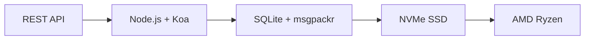

# La prima API di posta elettronica completa: come Forward Email ha rivoluzionato la gestione della posta elettronica {#the-first-complete-email-api-how-forward-email-revolutionized-email-management}


<p class="lead mt-3">

<strong>TL;DR:</strong> Abbiamo creato la prima API REST completa al mondo per la gestione della posta elettronica, con funzionalità di ricerca avanzate che nessun altro servizio offre. Mentre Gmail, Outlook e Apple costringono gli sviluppatori a usare IMAP o API con velocità limitata, Forward Email offre operazioni CRUD rapidissime per messaggi, cartelle, contatti e calendari tramite un'interfaccia REST unificata con oltre 15 parametri di ricerca. Questa è l'API di posta elettronica che gli sviluppatori aspettavano.
</p>

## Indice {#table-of-contents}

* [Il problema dell'API di posta elettronica](#the-email-api-problem)
* [Cosa dicono realmente gli sviluppatori](#what-developers-are-actually-saying)
* [La soluzione rivoluzionaria di Forward Email](#forward-emails-revolutionary-solution)
  * [Perché abbiamo costruito questo](#why-we-built-this)
  * [Autenticazione semplice](#simple-authentication)
* [20 endpoint che cambiano tutto](#20-endpoints-that-change-everything)
  * [Messaggi (5 endpoint)](#messages-5-endpoints)
  * [Cartelle (5 endpoint)](#folders-5-endpoints)
  * [Contatti (5 endpoint)](#contacts-5-endpoints)
  * [Calendari (5 endpoint)](#calendars-5-endpoints)
* [Ricerca avanzata: nessun altro servizio è paragonabile](#advanced-search-no-other-service-compares)
  * [Il panorama delle API di ricerca è compromesso](#the-search-api-landscape-is-broken)
  * [La rivoluzionaria API di ricerca di Forward Email](#forward-emails-revolutionary-search-api)
  * [Esempi di ricerca nel mondo reale](#real-world-search-examples)
  * [Vantaggi prestazionali](#performance-advantages)
  * [Funzionalità di ricerca che nessun altro ha](#search-features-no-one-else-has)
  * [Perché questo è importante per gli sviluppatori](#why-this-matters-for-developers)
  * [L'implementazione tecnica](#the-technical-implementation)
* [Architettura dalle prestazioni incredibilmente veloci](#blazing-fast-performance-architecture)
  * [Benchmark delle prestazioni](#performance-benchmarks)
  * [Architettura che mette al primo posto la privacy](#privacy-first-architecture)
* [Perché siamo diversi: il confronto completo](#why-were-different-the-complete-comparison)
  * [Limitazioni principali del fornitore](#major-provider-limitations)
  * [Vantaggi dell'inoltro e-mail](#forward-email-advantages)
  * [Il problema della trasparenza dell'open source](#the-open-source-transparency-problem)
* [Oltre 30 esempi di integrazione nel mondo reale](#30-real-world-integration-examples)
  * [1. Miglioramento del modulo di contatto di WordPress](#1-wordpress-contact-form-enhancement)
  * [2. Alternativa a Zapier per l'automazione delle email](#2-zapier-alternative-for-email-automation)
  * [3. Sincronizzazione e-mail CRM](#3-crm-email-synchronization)
  * [4. Elaborazione degli ordini di e-commerce](#4-e-commerce-order-processing)
  * [5. Integrazione dei ticket di supporto](#5-support-ticket-integration)
  * [6. Sistema di gestione delle newsletter](#6-newsletter-management-system)
  * [7. Gestione delle attività tramite e-mail](#7-email-based-task-management)
  * [8. Aggregazione di e-mail multi-account](#8-multi-account-email-aggregation)
  * [9. Dashboard di analisi email avanzata](#9-advanced-email-analytics-dashboard)
  * [10. Archiviazione intelligente delle e-mail](#10-smart-email-archiving)
  * [11. Integrazione e-mail-calendario](#11-email-to-calendar-integration)
  * [12. Backup e conformità della posta elettronica](#12-email-backup-and-compliance)
  * [13. Gestione dei contenuti basata sulla posta elettronica](#13-email-based-content-management)
  * [14. Gestione dei modelli di posta elettronica](#14-email-template-management)
  * [15. Automazione del flusso di lavoro basato su e-mail](#15-email-based-workflow-automation)
  * [16. Monitoraggio della sicurezza della posta elettronica](#16-email-security-monitoring)
  * [17. Raccolta di sondaggi tramite e-mail](#17-email-based-survey-collection)
  * [18. Monitoraggio delle prestazioni della posta elettronica](#18-email-performance-monitoring)
  * [19. Qualificazione dei lead basata su e-mail](#19-email-based-lead-qualification)
  * [20. Gestione dei progetti basata sulla posta elettronica](#20-email-based-project-management)
  * [21. Gestione dell'inventario basata sulla posta elettronica](#21-email-based-inventory-management)
  * [22. Elaborazione delle fatture tramite e-mail](#22-email-based-invoice-processing)
  * [23. Registrazione degli eventi tramite e-mail](#23-email-based-event-registration)
  * [24. Flusso di lavoro di approvazione dei documenti basato su e-mail](#24-email-based-document-approval-workflow)
  * [25. Analisi del feedback dei clienti basata su e-mail](#25-email-based-customer-feedback-analysis)
  * [26. Pipeline di reclutamento basata su e-mail](#26-email-based-recruitment-pipeline)
  * [27. Elaborazione dei report spese tramite e-mail](#27-email-based-expense-report-processing)
  * [28. Report di garanzia della qualità basati su e-mail](#28-email-based-quality-assurance-reporting)
  * [29. Gestione dei fornitori tramite e-mail](#29-email-based-vendor-management)
  * [30. Monitoraggio dei social media basato sulla posta elettronica](#30-email-based-social-media-monitoring)
* [Iniziare](#getting-started)
  * [1. Crea il tuo account di posta elettronica di inoltro](#1-create-your-forward-email-account)
  * [2. Generare le credenziali API](#2-generate-api-credentials)
  * [3. Effettua la tua prima chiamata API](#3-make-your-first-api-call)
  * [4. Esplora la documentazione](#4-explore-the-documentation)
* [Risorse tecniche](#technical-resources)

## Il problema dell'API di posta elettronica {#the-email-api-problem}

Le API di posta elettronica sono fondamentalmente rotte. Punto.

Tutti i principali provider di posta elettronica costringono gli sviluppatori a scegliere tra due terribili scelte:

1. **Inferno IMAP**: Alle prese con un protocollo trentennale progettato per client desktop, non per applicazioni moderne
2. **API compromesse**: API con limiti di velocità, di sola lettura e complesse con OAuth che non riescono a gestire i dati email effettivi

Il risultato? Gli sviluppatori abbandonano completamente l'integrazione email o sprecano settimane a sviluppare wrapper IMAP fragili che si rompono di continuo.

> \[!WARNING]
> **Il segreto sporco**: la maggior parte delle "API email" sono solo API di invio. Non è possibile organizzare cartelle, sincronizzare contatti o gestire calendari tramite una semplice interfaccia REST. Fino ad ora.

## Cosa dicono realmente gli sviluppatori {#what-developers-are-actually-saying}

La frustrazione è reale e documentata ovunque:

> "Di recente ho provato a integrare Gmail nella mia app, ma ci ho dedicato troppo tempo. Ho deciso che non vale la pena supportare Gmail."
>
> *- [Sviluppatore di Hacker News](https://news.ycombinator.com/item?id=42106944), 147 voti a favore*

> "Tutte le API email sono mediocri? Sembrano limitate o restrittive in qualche modo."
>
> *- [Discussione su Reddit r/SaaS](https://www.reddit.com/r/SaaS/comments/1cm84s7/are_all_email_apis_mediocre/)*

> "Perché lo sviluppo di email deve essere per forza una schifezza?"
>
> *- [Reddit r/webdev](https://www.reddit.com/r/webdev/comments/15trnp2/why_does_email_development_have_to_suck/), 89 commenti di sviluppatori in difficoltà*

> "Cosa rende l'API di Gmail più efficiente di IMAP? Un altro motivo per cui l'API di Gmail è molto più efficiente è che deve scaricare ogni messaggio una sola volta. Con IMAP, ogni messaggio deve essere scaricato e indicizzato..."
>
> *- [Domanda su Stack Overflow](https://stackoverflow.com/questions/25431022/what-makes-the-gmail-api-more-efficient-than-imap) con 47 voti a favore*

Le prove sono ovunque:

* **Problemi SMTP di WordPress**: [631 problemi su GitHub](https://github.com/awesomemotive/WP-Mail-SMTP/issues) sui problemi di recapito delle email
* **Limitazioni di Zapier**: [Reclami della comunità](https://community.zapier.com/featured-articles-65/email-parser-by-zapier-limitations-and-alternatives-16958) sui limiti di 10 email/ora e sui problemi di rilevamento IMAP
* **Progetti API IMAP**: [Multiplo](https://github.com/ewildgoose/imap-api) [open source](https://emailengine.app/) [progetti](https://www.npmjs.com/package/imapflow) esistono specificamente per "convertire IMAP in REST" perché nessun provider offre questa funzionalità
* **Frustazioni dell'API di Gmail**: [Overflow dello stack](https://stackoverflow.com/questions/tagged/gmail-api) ha 4.847 domande con il tag "gmail-api" con reclami comuni su limiti di velocità e complessità

## La soluzione rivoluzionaria di Forward Email {#forward-emails-revolutionary-solution}

**Siamo il primo servizio di posta elettronica a offrire operazioni CRUD complete per tutti i dati di posta elettronica tramite un'API REST unificata.**

Questa non è solo un'altra API di invio. Si tratta di un controllo programmatico completo su:

* **Messaggi**: Crea, leggi, aggiorna, elimina, cerca, sposta, contrassegna
* **Cartelle**: Gestione completa delle cartelle IMAP tramite endpoint REST
* **Contatti**: Archiviazione e sincronizzazione dei contatti [CardDAV](https://tools.ietf.org/html/rfc6352)
* **Calendari**: Eventi e pianificazione del calendario [CalDAV](https://tools.ietf.org/html/rfc4791)

### Perché abbiamo costruito questo {#why-we-built-this}

**Il problema**: Ogni provider di posta elettronica tratta la posta elettronica come una scatola nera. Puoi inviare email, magari leggerle con un OAuth complesso, ma non puoi davvero *gestire* i dati delle tue email a livello di programmazione.

**La nostra visione**: l'email dovrebbe essere facile da integrare come qualsiasi API moderna. Nessuna libreria IMAP. Nessuna complessità OAuth. Nessun incubo di limiti di velocità. Solo semplici endpoint REST funzionanti.

**Il risultato**: il primo servizio di posta elettronica con cui puoi creare un client di posta elettronica completo, un'integrazione CRM o un sistema di automazione utilizzando solo richieste HTTP.

### Autenticazione semplice {#simple-authentication}

Nessun [Complessità OAuth](https://oauth.net/2/). Nessun [password specifiche per app](https://support.google.com/accounts/answer/185833). Solo le tue credenziali alias:

```bash
curl -u "alias@yourdomain.com:password" \
  https://api.forwardemail.net/v1/messages
```

## 20 endpoint che cambiano tutto {#20-endpoints-that-change-everything}

### Messaggi (5 endpoint) {#messages-5-endpoints}

* `GET /v1/messages` - Elenca i messaggi con filtri (`?folder=`, `?is_unread=`, `?is_flagged=`)
* `POST /v1/messages` - Invia i nuovi messaggi direttamente alle cartelle
* `GET /v1/messages/:id` - Recupera un messaggio specifico con metadati completi
* `PUT /v1/messages/:id` - Aggiorna il messaggio (flag, cartella, stato di lettura)
* `DELETE /v1/messages/:id` - Elimina definitivamente il messaggio

### Cartelle (5 endpoint) {#folders-5-endpoints}

* `GET /v1/folders` - Elenca tutte le cartelle con stato di abbonamento
* `POST /v1/folders` - Crea una nuova cartella con proprietà personalizzate
* `GET /v1/folders/:id` - Ottieni i dettagli della cartella e il numero di messaggi
* `PUT /v1/folders/:id` - Aggiorna le proprietà della cartella e l'abbonamento
* `DELETE /v1/folders/:id` - Elimina la cartella e gestisci lo spostamento dei messaggi

### Contatti (5 endpoint) {#contacts-5-endpoints}

* `GET /v1/contacts` - Elenca i contatti con ricerca e impaginazione
* `POST /v1/contacts` - Crea un nuovo contatto con supporto vCard completo
* `GET /v1/contacts/:id` - Recupera il contatto con tutti i campi e i metadati
* `PUT /v1/contacts/:id` - Aggiorna le informazioni del contatto con convalida ETag
* `DELETE /v1/contacts/:id` - Elimina il contatto con gestione a cascata

### Calendari (5 endpoint) {#calendars-5-endpoints}

* `GET /v1/calendars` - Elenca gli eventi del calendario con filtro per data
* `POST /v1/calendars` - Crea un evento del calendario con partecipanti e ricorrenza
* `GET /v1/calendars/:id` - Ottieni i dettagli dell'evento con gestione del fuso orario
* `PUT /v1/calendars/:id` - Aggiorna l'evento con rilevamento dei conflitti
* `DELETE /v1/calendars/:id` - Elimina l'evento con notifiche ai partecipanti

## Ricerca avanzata: nessun altro servizio è paragonabile {#advanced-search-no-other-service-compares}

**Forward Email è l'unico servizio di posta elettronica che offre una ricerca programmatica completa in tutti i campi del messaggio tramite un'API REST.**

Mentre altri provider offrono al massimo un filtraggio di base, noi abbiamo creato l'API di ricerca email più avanzata mai creata. Nessuna API di Gmail, di Outlook o di qualsiasi altro servizio si avvicina alle nostre capacità di ricerca.

### Il panorama dell'API di ricerca è instabile {#the-search-api-landscape-is-broken}

**Limitazioni della ricerca dell'API di Gmail:**

* ✅ Solo parametro base `q`
* ❌ Nessuna ricerca specifica per campo
* ❌ Nessun filtro per intervallo di date
* ❌ Nessun filtro basato sulle dimensioni
* ❌ Nessun filtro per allegati
* ❌ Limitato alla sintassi di ricerca di Gmail

**Limitazioni della ricerca API di Outlook:**

* ✅ Parametro base `$search`
* ❌ Nessun targeting avanzato dei campi
* ❌ Nessuna combinazione di query complessa
* ❌ Limitazione della velocità aggressiva
* ❌ È richiesta una sintassi OData complessa

**Apple iCloud:**

* ❌ Nessuna API
* ❌ Solo ricerca IMAP (se riesci a farla funzionare)

**ProtonMail e Tuta:**

* ❌ Nessuna API pubblica
* ❌ Nessuna funzionalità di ricerca programmatica

### Inoltra la rivoluzionaria API di ricerca di Email {#forward-emails-revolutionary-search-api}

**Offriamo oltre 15 parametri di ricerca che nessun altro servizio fornisce:**

| Capacità di ricerca | Inoltra e-mail | API di Gmail | API di Outlook | Altri |
| ------------------------------ | -------------------------------------- | ------------ | ------------------ | ------ |
| **Ricerca specifica per campo** | ✅ Oggetto, corpo, mittente, destinatario, cc, intestazioni | ❌ | ❌ | ❌ |
| **Ricerca generale multicampo** | ✅ `?search=` in tutti i campi | ✅ Base `q=` | ✅ Base `$search=` | ❌ |
| **Filtro intervallo di date** | ✅ `?since=` & `?before=` | ❌ | ❌ | ❌ |
| **Filtro basato sulle dimensioni** | ✅ `?min_size=` & `?max_size=` | ❌ | ❌ | ❌ |
| **Filtro degli allegati** | ✅ `?has_attachments=true/false` | ❌ | ❌ | ❌ |
| **Ricerca intestazione** | ✅ `?headers=X-Priority` | ❌ | ❌ | ❌ |
| **Ricerca ID messaggio** | ✅ `?message_id=abc123` | ❌ | ❌ | ❌ |
| **Filtri combinati** | ✅ Parametri multipli con logica AND | ❌ | ❌ | ❌ |
| **Non distingue tra maiuscole e minuscole** | ✅ Tutte le ricerche | ✅ | ✅ | ❌ |
| **Supporto alla paginazione** | ✅ Funziona con tutti i parametri di ricerca | ✅ | ✅ | ❌ |

### Esempi di ricerca nel mondo reale {#real-world-search-examples}

**Trova tutte le fatture dell'ultimo trimestre:**

```bash
# Forward Email - Simple and powerful
GET /v1/messages?subject=invoice&since=2024-01-01T00:00:00Z&before=2024-04-01T00:00:00Z

# Gmail API - Impossible with their limited search
# No date range filtering available

# Outlook API - Complex OData syntax, limited functionality
GET /me/messages?$search="invoice"&$filter=receivedDateTime ge 2024-01-01T00:00:00Z
```

**Cerca allegati di grandi dimensioni da un mittente specifico:**

```bash
# Forward Email - Comprehensive filtering
GET /v1/messages?from=finance@company.com&has_attachments=true&min_size=1000000

# Gmail API - Cannot filter by size or attachments programmatically
# Outlook API - No size filtering available
# Others - No APIs available
```

**Ricerca complessa multicampo:**

```bash
# Forward Email - Advanced query capabilities
GET /v1/messages?body=quarterly&from=manager&is_flagged=true&folder=Reports

# Gmail API - Limited to basic text search only
GET /gmail/v1/users/me/messages?q=quarterly

# Outlook API - Basic search without field targeting
GET /me/messages?$search="quarterly"
```

### Vantaggi in termini di prestazioni {#performance-advantages}

**Prestazioni della ricerca tramite e-mail inoltrata:**

* ⚡ **Tempi di risposta inferiori a 100 ms** per ricerche complesse
* 🔍 **Ottimizzazione delle espressioni regolari** con indicizzazione corretta
* 📊 **Esecuzione di query parallele** per conteggio e dati
* 💾 **Utilizzo efficiente della memoria** con query snelle

**Problemi di prestazioni della concorrenza:**

* 🐌 **API di Gmail**: Velocità limitata a 250 unità di quota per utente al secondo
* 🐌 **API di Outlook**: Limitazione aggressiva con requisiti di backoff complessi
* 🐌 **Altro**: Nessuna API con cui effettuare il confronto

### Funzionalità di ricerca che nessun altro ha {#search-features-no-one-else-has}

#### 1. Ricerca specifica dell'intestazione {#1-header-specific-search}

```bash
# Find messages with specific headers
GET /v1/messages?headers=X-Priority:1
GET /v1/messages?headers=X-Spam-Score
```

#### 2. Intelligenza basata sulle dimensioni {#2-size-based-intelligence}

```bash
# Find newsletter emails (typically large)
GET /v1/messages?min_size=50000&from=newsletter

# Find quick replies (typically small)
GET /v1/messages?max_size=1000&to=support
```

#### 3. Flussi di lavoro basati sugli allegati {#3-attachment-based-workflows}

```bash
# Find all documents sent to legal team
GET /v1/messages?to=legal&has_attachments=true&body=contract

# Find emails without attachments for cleanup
GET /v1/messages?has_attachments=false&before=2023-01-01T00:00:00Z
```

#### 4. Logica aziendale combinata {#4-combined-business-logic}

```bash
# Find urgent flagged messages from VIPs with attachments
GET /v1/messages?is_flagged=true&from=ceo&has_attachments=true&subject=urgent
```

### Perché questo è importante per gli sviluppatori {#why-this-matters-for-developers}

**Crea applicazioni che prima erano impossibili:**

1. **Analisi email avanzata**: analizza i modelli di email in base a dimensioni, mittente e contenuto
2. **Gestione email intelligente**: organizza automaticamente in base a criteri complessi
3. **Conformità e rilevamento**: trova email specifiche per i requisiti legali
4. **Business Intelligence**: estrai informazioni dai modelli di comunicazione email
5. **Flussi di lavoro automatizzati**: attiva azioni basate su filtri email sofisticati

### L'implementazione tecnica {#the-technical-implementation}

La nostra API di ricerca utilizza:

* **Ottimizzazione delle espressioni regolari** con strategie di indicizzazione appropriate
* **Esecuzione parallela** per le prestazioni
* **Convalida dell'input** per la sicurezza
* **Gestione completa degli errori** per l'affidabilità

```javascript
// Example: Complex search implementation
const searchConditions = [];

if (ctx.query.subject) {
  searchConditions.push({
    subject: { $regex: ctx.query.subject, $options: 'i' }
  });
}

if (ctx.query.from) {
  searchConditions.push({
    $or: [
      { 'from.address': { $regex: ctx.query.from, $options: 'i' } },
      { 'from.name': { $regex: ctx.query.from, $options: 'i' } }
    ]
  });
}

// Combine with AND logic
if (searchConditions.length > 0) {
  query.$and = searchConditions;
}
```

> \[!TIP]
> **Vantaggio per gli sviluppatori**: con l'API di ricerca di Forward Email, puoi creare applicazioni di posta elettronica che rivaleggiano con i client desktop in termini di funzionalità, mantenendo la semplicità delle API REST.

## Architettura ad alte prestazioni {#blazing-fast-performance-architecture}

Il nostro stack tecnico è progettato per garantire velocità e affidabilità:



### Benchmark delle prestazioni {#performance-benchmarks}

**Perché siamo velocissimi:**

| Componente | Tecnologia | Vantaggio in termini di prestazioni |
| ------------ | --------------------------------------------------------------------------------- | --------------------------------------------- |
| **Magazzinaggio** | [NVMe SSD](https://en.wikipedia.org/wiki/NVM_Express) | 10 volte più veloce del tradizionale SATA |
| **Banca dati** | [SQLite](https://sqlite.org/) + [msgpackr](https://github.com/kriszyp/msgpackr) | Latenza di rete zero, serializzazione ottimizzata |
| **Hardware** | [AMD Ryzen](https://www.amd.com/en/products/processors/desktops/ryzen) metallo nudo | Nessun sovraccarico di virtualizzazione |
| **Memorizzazione nella cache** | In memoria + persistente | Tempi di risposta inferiori al millisecondo |
| **Backup** | [Cloudflare R2](https://www.cloudflare.com/products/r2/) crittografato | Affidabilità di livello aziendale |

**Numeri di prestazioni reali:**

* **Tempo di risposta API**: < 50 ms in media
* **Recupero messaggi**: < 10 ms per i messaggi memorizzati nella cache
* **Operazioni sulle cartelle**: < 5 ms per le operazioni sui metadati
* **Sincronizzazione contatti**: oltre 1000 contatti/secondo
* **Uptime**: SLA del 99,99% con infrastruttura ridondante

### Architettura che privilegia la privacy {#privacy-first-architecture}

**Progettazione a conoscenza zero**: solo tu hai accesso con la tua password IMAP: non possiamo leggere le tue email. Il nostro [architettura a conoscenza zero](https://forwardemail.net/en/security) garantisce la massima privacy, offrendo al contempo prestazioni eccezionali.

## Perché siamo diversi: il confronto completo {#why-were-different-the-complete-comparison}

### Limitazioni principali del provider {#major-provider-limitations}

| Fornitore | Problemi fondamentali | Limitazioni specifiche |
| ---------------- | ----------------------------------------- | -------------------------------------------------------------------------------------------------------------------------------------------------------------------------------------------------------------------------------------------------------------------------------------------------------------------------------------------------------------------------------------------------------------------------------------------------------------------- |
| **API di Gmail** | Sola lettura, OAuth complesso, API separate | • [Cannot modify existing messages](https://developers.google.com/gmail/api/reference/rest/v1/users.messages)<br>• [Labels ≠ folders](https://developers.google.com/gmail/api/reference/rest/v1/users.labels)<br>• [1 billion quota units/day limit](https://developers.google.com/gmail/api/reference/quota)<br>• [Requires separate APIs](https://developers.google.com/workspace) per contatti/calendario |
| **API di Outlook** | Obsoleto, confuso, focalizzato sull'impresa | • [REST endpoints deprecated March 2024](https://learn.microsoft.com/en-us/outlook/rest/compare-graph)<br>• [Multiple confusing APIs](https://learn.microsoft.com/en-us/office/client-developer/outlook/selecting-an-api-or-technology-for-developing-solutions-for-outlook) (EWS, Grafico, REST)<br>• [Microsoft Graph complexity](https://learn.microsoft.com/en-us/graph/overview)<br>• [Aggressive throttling](https://learn.microsoft.com/en-us/graph/throttling) |
| **Apple iCloud** | Nessuna API pubblica | • [No public API whatsoever](https://support.apple.com/en-us/102654)<br>• [IMAP-only with 1000 emails/day limit](https://support.apple.com/en-us/102654)<br>• [App-specific passwords required](https://support.apple.com/en-us/102654)<br>• [500 recipients per message limit](https://support.apple.com/en-us/102654) |
| **ProtonMail** | Nessuna API, false affermazioni open source | • [No public API available](https://proton.me/support/protonmail-bridge-clients)<br>• [Bridge software required](https://proton.me/mail/bridge) per accesso IMAP<br>• [Claims "open source"](https://proton.me/blog/open-source) ma [server code is proprietary](https://github.com/ProtonMail)<br>• [Limited to paid plans only](https://proton.me/pricing) |
| **Totale** | Nessuna API, trasparenza fuorviante | • [No REST API for email management](https://tuta.com/support#technical)<br>• [Claims "open source"](https://tuta.com/blog/posts/open-source-email) ma [backend is closed](https://github.com/tutao/tutanota)<br>• [IMAP/SMTP not supported](https://tuta.com/support#imap)<br>• [Proprietary encryption](https://tuta.com/encryption) impedisce le integrazioni standard |
| **Email Zapier** | Limiti di velocità severi | • [10 emails per hour limit](https://help.zapier.com/hc/en-us/articles/8496181555597-Email-Parser-by-Zapier-limitations-and-alternatives)<br>• [No IMAP folder access](https://help.zapier.com/hc/en-us/articles/8496181555597-Email-Parser-by-Zapier-limitations-and-alternatives)<br>• [Limited parsing capabilities](https://help.zapier.com/hc/en-us/articles/8496181555597-Email-Parser-by-Zapier-limitations-and-alternatives) |

### Vantaggi dell'inoltro e-mail {#forward-email-advantages}

| Caratteristica | Inoltra e-mail | Concorrenza |
| ------------------ | -------------------------------------------------------------------------------------------- | ----------------------------------------- |
| **CRUD completo** | ✅ Creazione, lettura, aggiornamento ed eliminazione complete per tutti i dati | ❌ Operazioni di sola lettura o limitate |
| **API unificata** | ✅ Messaggi, cartelle, contatti, calendari in un'unica API | ❌ API separate o funzionalità mancanti |
| **Autenticazione semplice** | ✅ Autenticazione di base con credenziali alias | ❌ OAuth complesso con più ambiti |
| **Nessun limite di tariffa** | ✅ Limiti generosi progettati per applicazioni reali | ❌ Quote restrittive che interrompono i flussi di lavoro |
| **Auto-hosting** | ✅ [Complete self-hosting option](https://forwardemail.net/en/blog/docs/self-hosted-solution) | ❌ Solo blocco del fornitore |
| **Privacy** | ✅ Zero-knowledge, crittografato, privato | ❌ Data mining e preoccupazioni sulla privacy |
| **Prestazione** | ✅ Risposte inferiori a 50 ms, archiviazione NVMe | ❌ Latenza di rete, ritardi di limitazione |

### Il problema della trasparenza dell'open source {#the-open-source-transparency-problem}

**ProtonMail e Tuta si pubblicizzano come "open source" e "trasparenti", ma si tratta di un marketing fuorviante che viola i moderni principi di privacy.**

> \[!WARNING]
> **False affermazioni di trasparenza**: sia ProtonMail che Tuta pubblicizzano in modo evidente le loro credenziali "open source", pur mantenendo il loro codice lato server più critico proprietario e chiuso.

**L'inganno di ProtonMail:**

* **Affermazioni**: ["Siamo open source"](https://proton.me/blog/open-source) in primo piano nel marketing
* **Realtà**: [Il codice del server è completamente proprietario](https://github.com/ProtonMail) - solo le app client sono open source
* **Impatto**: Gli utenti non possono verificare la crittografia lato server, la gestione dei dati o le dichiarazioni sulla privacy
* **Violazione della trasparenza**: Impossibile verificare i sistemi effettivi di elaborazione e archiviazione delle email

**Il marketing ingannevole di Tuta:**

* **Affermazioni**: ["Email open source"](https://tuta.com/blog/posts/open-source-email) come punto di forza
* **Realtà**: [L'infrastruttura backend è closed source](https://github.com/tutao/tutanota) - è disponibile solo il frontend
* **Impatto**: La crittografia proprietaria impedisce l'utilizzo dei protocolli di posta elettronica standard (IMAP/SMTP)
* **Strategia di lock-in**: La crittografia personalizzata impone la dipendenza dal fornitore

**Perché questo è importante per la privacy moderna:**

Nel 2025, la vera privacy richiede **completa trasparenza**. Quando i provider di posta elettronica dichiarano di essere "open source" ma nascondono il codice del loro server:

1. **Crittografia non verificabile**: non è possibile verificare come vengono effettivamente crittografati i dati
2. **Pratiche di gestione dei dati nascoste**: la gestione dei dati lato server rimane una scatola nera
3. **Sicurezza basata sulla fiducia**: è necessario fidarsi delle loro affermazioni senza verifica
4. **Blocco del fornitore**: i sistemi proprietari impediscono la portabilità dei dati

**La vera trasparenza dell'email inoltrata:**

* ✅ **[Open source completo](https://github.com/forwardemail/forwardemail.net)** - codice server e client
* ✅ **[Disponibile self-hosting](https://forwardemail.net/en/blog/docs/self-hosted-solution)** - esegui la tua istanza
* ✅ **Protocolli standard** - compatibilità con IMAP, SMTP, CardDAV, CalDAV
* ✅ **Sicurezza verificabile** - ogni riga di codice può essere ispezionata
* ✅ **Nessun vincolo con il fornitore** - i tuoi dati, il tuo controllo

> \[!TIP]
> **Vero open source significa che puoi verificare ogni affermazione.** Con Forward Email, puoi verificare la nostra crittografia, esaminare la nostra gestione dei dati e persino eseguire la tua istanza. Questa è vera trasparenza.

## Oltre 30 esempi di integrazione nel mondo reale {#30-real-world-integration-examples}

### 1. Miglioramento del modulo di contatto di WordPress {#1-wordpress-contact-form-enhancement}

**Problema**: [Errori di configurazione SMTP di WordPress](https://github.com/awesomemotive/WP-Mail-SMTP/issues) ([631 problemi su GitHub](https://github.com/awesomemotive/WP-Mail-SMTP/issues))
**Soluzione**: L'integrazione API diretta bypassa completamente [SMTP](https://tools.ietf.org/html/rfc5321)

```javascript
// WordPress contact form that saves to Sent folder
await fetch('https://api.forwardemail.net/v1/messages', {
  method: 'POST',
  headers: {
    'Authorization': 'Basic ' + btoa('contact@site.com:password'),
    'Content-Type': 'application/json'
  },
  body: JSON.stringify({
    to: [{ address: 'owner@site.com' }],
    subject: 'Contact Form: ' + formData.subject,
    text: formData.message,
    folder: 'Sent'
  })
});
```

### 2. Alternativa a Zapier per l'automazione delle e-mail {#2-zapier-alternative-for-email-automation}

**Problema**: [Limite di 10 email/ora di Zapier](https://help.zapier.com/hc/en-us/articles/8496181555597-Email-Parser-by-Zapier-limitations-and-alternatives) e [Errori di rilevamento IMAP](https://community.zapier.com/featured-articles-65/email-parser-by-zapier-limitations-and-alternatives-16958)
**Soluzione**: Automazione illimitata con controllo completo delle email

```javascript
// Auto-organize emails by sender domain
const messages = await fetch('/v1/messages?folder=INBOX');
for (const message of messages) {
  const domain = message.from.split('@')[1];
  await fetch(`/v1/messages/${message.id}`, {
    method: 'PUT',
    body: JSON.stringify({ folder: `Clients/${domain}` })
  });
}
```

### 3. Sincronizzazione e-mail CRM {#3-crm-email-synchronization}

**Problema**: Gestione manuale dei contatti tra email e [Sistemi CRM](https://en.wikipedia.org/wiki/Customer_relationship_management)
**Soluzione**: Sincronizzazione bidirezionale con l'API dei contatti [CardDAV](https://tools.ietf.org/html/rfc6352)

```javascript
// Sync new email contacts to CRM
const newContacts = await fetch('/v1/contacts');
for (const contact of newContacts) {
  await crmAPI.createContact({
    name: contact.name,
    email: contact.email,
    source: 'email_api'
  });
}
```

### 4. Elaborazione degli ordini di e-commerce {#4-e-commerce-order-processing}

**Problema**: Elaborazione manuale dell'email dell'ordine per [piattaforme di e-commerce](https://en.wikipedia.org/wiki/E-commerce)
**Soluzione**: Pipeline di gestione degli ordini automatizzata

```javascript
// Process order confirmation emails
const orders = await fetch('/v1/messages?folder=Orders');
const orderEmails = orders.filter(msg =>
  msg.subject.includes('Order Confirmation')
);

for (const order of orderEmails) {
  const orderData = parseOrderEmail(order.text);
  await updateInventory(orderData);
  await fetch(`/v1/messages/${order.id}`, {
    method: 'PUT',
    body: JSON.stringify({ folder: 'Orders/Processed' })
  });
}
```

### 5. Integrazione del ticket di supporto {#5-support-ticket-integration}

**Problema**: Thread di email sparsi su [piattaforme di helpdesk](https://en.wikipedia.org/wiki/Help_desk_software)
**Soluzione**: Monitoraggio completo dei thread di email

```javascript
// Create support ticket from email thread
const messages = await fetch('/v1/messages?folder=Support');
const supportEmails = messages.filter(msg =>
  msg.to.some(addr => addr.includes('support@'))
);

for (const email of supportEmails) {
  const ticket = await supportSystem.createTicket({
    subject: email.subject,
    from: email.from,
    body: email.text,
    timestamp: email.date
  });
}
```

### 6. Sistema di gestione delle newsletter {#6-newsletter-management-system}

**Problema**: Integrazioni [piattaforma di newsletter](https://en.wikipedia.org/wiki/Email_marketing) limitate
**Soluzione**: Gestione completa del ciclo di vita degli abbonati

```javascript
// Auto-manage newsletter subscriptions
const messages = await fetch('/v1/messages?folder=Newsletter');
const unsubscribes = messages.filter(msg =>
  msg.subject.toLowerCase().includes('unsubscribe')
);

for (const msg of unsubscribes) {
  await removeSubscriber(msg.from);
  await fetch(`/v1/messages/${msg.id}`, {
    method: 'PUT',
    body: JSON.stringify({ folder: 'Newsletter/Unsubscribed' })
  });
}
```

### 7. Gestione delle attività tramite e-mail {#7-email-based-task-management}

**Problema**: Posta in arrivo sovraccarica e [monitoraggio delle attività](https://en.wikipedia.org/wiki/Task_management)
**Soluzione**: Convertire le email in attività eseguibili

```javascript
// Create tasks from flagged emails
const messages = await fetch('/v1/messages?is_flagged=true');
for (const email of messages) {
  await taskManager.createTask({
    title: email.subject,
    description: email.text,
    assignee: email.to[0].address,
    dueDate: extractDueDate(email.text)
  });
}
```

### 8. Aggregazione e-mail multi-account {#8-multi-account-email-aggregation}

**Problema**: Gestione di [più account di posta elettronica](https://en.wikipedia.org/wiki/Email_client) tra i provider
**Soluzione**: Interfaccia di posta in arrivo unificata

```javascript
// Aggregate emails from multiple accounts
const accounts = ['work@domain.com', 'personal@domain.com'];
const allMessages = [];

for (const account of accounts) {
  const messages = await fetch('/v1/messages', {
    headers: { 'Authorization': getAuth(account) }
  });
  allMessages.push(...messages.map(m => ({ ...m, account })));
}
```

### 9. Dashboard di analisi email avanzata {#9-advanced-email-analytics-dashboard}

**Problema**: Nessuna analisi di [modelli di posta elettronica](https://en.wikipedia.org/wiki/Email_analytics) con filtri sofisticati
**Soluzione**: Analisi email personalizzate tramite funzionalità di ricerca avanzate

```javascript
// Generate comprehensive email analytics using advanced search
const analytics = {};

// Analyze email volume by sender domain
const messages = await fetch('/v1/messages');
analytics.senderDomains = analyzeSenderDomains(messages);

// Find large attachments consuming storage
const largeAttachments = await fetch('/v1/messages?has_attachments=true&min_size=1000000');
analytics.storageHogs = largeAttachments.map(msg => ({
  subject: msg.subject,
  from: msg.from,
  size: msg.size
}));

// Analyze communication patterns with VIPs
const vipEmails = await fetch('/v1/messages?from=ceo@company.com');
const urgentVipEmails = await fetch('/v1/messages?from=ceo@company.com&subject=urgent');
analytics.vipCommunication = {
  total: vipEmails.length,
  urgent: urgentVipEmails.length,
  urgencyRate: (urgentVipEmails.length / vipEmails.length) * 100
};

// Find unread emails by date range for follow-up
const lastWeek = new Date(Date.now() - 7 * 24 * 60 * 60 * 1000).toISOString();
const unreadRecent = await fetch(`/v1/messages?is_unread=true&since=${lastWeek}`);
analytics.followUpNeeded = unreadRecent.length;

// Analyze email sizes for optimization
const smallEmails = await fetch('/v1/messages?max_size=1000');
const mediumEmails = await fetch('/v1/messages?min_size=1000&max_size=50000');
const largeEmails = await fetch('/v1/messages?min_size=50000');
analytics.sizeDistribution = {
  small: smallEmails.length,
  medium: mediumEmails.length,
  large: largeEmails.length
};

// Search for compliance-related emails
const complianceEmails = await fetch('/v1/messages?body=confidential&has_attachments=true');
analytics.complianceReview = complianceEmails.length;
```

### 10. Archiviazione e-mail intelligente {#10-smart-email-archiving}

**Problema**: Manuale [organizzazione della posta elettronica](https://en.wikipedia.org/wiki/Email_management)
**Soluzione**: Categorizzazione intelligente delle email

```javascript
// Auto-archive old emails by category
const messages = await fetch('/v1/messages');
const oldEmails = messages.filter(email =>
  isOlderThan(email.date, 90) // 90 days
);

for (const email of oldEmails) {
  const category = categorizeEmail(email);
  await fetch(`/v1/messages/${email.id}`, {
    method: 'PUT',
    body: JSON.stringify({ folder: `Archive/${category}` })
  });
}
```

### 11. Integrazione e-mail-calendario {#11-email-to-calendar-integration}

**Problema**: Creazione manuale di [evento del calendario](https://tools.ietf.org/html/rfc4791) dalle email
**Soluzione**: Estrazione e creazione automatica di eventi

```javascript
// Extract meeting details from emails
const messages = await fetch('/v1/messages?folder=Meetings');
const meetingEmails = messages.filter(email =>
  email.subject.toLowerCase().includes('meeting')
);

for (const email of meetingEmails) {
  const meetingData = extractMeetingInfo(email.text);
  if (meetingData.date && meetingData.time) {
    await fetch('/v1/calendars', {
      method: 'POST',
      body: JSON.stringify({
        title: email.subject,
        start: meetingData.datetime,
        attendees: [email.from, ...email.to]
      })
    });
  }
}
```

### 12. Backup e conformità della posta elettronica {#12-email-backup-and-compliance}

**Problema**: [Conservazione delle e-mail](https://en.wikipedia.org/wiki/Email_retention_policy) e requisiti di conformità
**Soluzione**: Backup automatico con conservazione dei metadati

```javascript
// Backup emails with full metadata
const allMessages = await fetch('/v1/messages');
const backup = {
  timestamp: new Date(),
  messages: allMessages.map(msg => ({
    id: msg.id,
    subject: msg.subject,
    from: msg.from,
    to: msg.to,
    date: msg.date,
    flags: msg.flags
  }))
};
await saveToComplianceStorage(backup);
```

### 13. Gestione dei contenuti basata sulla posta elettronica {#13-email-based-content-management}

**Problema**: Gestione dell'invio di contenuti tramite email per [Piattaforme CMS](https://en.wikipedia.org/wiki/Content_management_system)
**Soluzione**: Email come sistema di gestione dei contenuti

```javascript
// Process content submissions from email
const messages = await fetch('/v1/messages?folder=Submissions');
const submissions = messages.filter(msg =>
  msg.to.some(addr => addr.includes('submit@'))
);

for (const submission of submissions) {
  const content = parseSubmission(submission.text);
  await cms.createDraft({
    title: submission.subject,
    content: content.body,
    author: submission.from
  });
}
```

### 14. Gestione dei modelli di posta elettronica {#14-email-template-management}

**Problema**: [modelli di posta elettronica](https://en.wikipedia.org/wiki/Email_template) non coerente nel team
**Soluzione**: Sistema di template centralizzato con API

```javascript
// Send templated emails with dynamic content
const template = await getEmailTemplate('welcome');
await fetch('/v1/messages', {
  method: 'POST',
  body: JSON.stringify({
    to: [{ address: newUser.email }],
    subject: template.subject.replace('{{name}}', newUser.name),
    html: template.html.replace('{{name}}', newUser.name),
    folder: 'Sent'
  })
});
```

### 15. Automazione del flusso di lavoro basato su e-mail {#15-email-based-workflow-automation}

**Problema**: [processi di approvazione](https://en.wikipedia.org/wiki/Workflow) manuale via email
**Soluzione**: Trigger del flusso di lavoro automatizzato

```javascript
// Process approval emails
const messages = await fetch('/v1/messages?folder=Approvals');
const approvals = messages.filter(msg =>
  msg.subject.includes('APPROVAL')
);

for (const approval of approvals) {
  const decision = parseApprovalDecision(approval.text);
  await workflow.processApproval({
    requestId: extractRequestId(approval.subject),
    decision: decision,
    approver: approval.from
  });
}
```

### 16. Monitoraggio della sicurezza della posta elettronica {#16-email-security-monitoring}

**Problema**: [rilevamento delle minacce alla sicurezza](https://en.wikipedia.org/wiki/Email_security) manuale
**Soluzione**: Analisi automatica delle minacce

```javascript
// Monitor for suspicious emails
const recentEmails = await fetch('/v1/messages');
for (const email of recentEmails) {
  const threatScore = analyzeThreat(email);
  if (threatScore > 0.8) {
    await fetch(`/v1/messages/${email.id}`, {
      method: 'PUT',
      body: JSON.stringify({ folder: 'Security/Quarantine' })
    });
    await alertSecurityTeam(email);
  }
}
```

### 17. Raccolta di sondaggi tramite e-mail {#17-email-based-survey-collection}

**Problema**: Elaborazione manuale di [risposta al sondaggio](https://en.wikipedia.org/wiki/Survey_methodology)
**Soluzione**: Aggregazione automatica delle risposte

```javascript
// Collect and process survey responses
const messages = await fetch('/v1/messages?folder=Surveys');
const responses = messages.filter(msg =>
  msg.subject.includes('Survey Response')
);

const surveyData = responses.map(email => ({
  respondent: email.from,
  responses: parseSurveyData(email.text),
  timestamp: email.date
}));
await updateSurveyResults(surveyData);
```

### 18. Monitoraggio delle prestazioni della posta elettronica {#18-email-performance-monitoring}

**Problema**: Nessuna visibilità su [prestazioni di recapito delle e-mail](https://en.wikipedia.org/wiki/Email_deliverability)
**Soluzione**: Metriche email in tempo reale

```javascript
// Monitor email delivery performance
const sentEmails = await fetch('/v1/messages?folder=Sent');
const deliveryStats = {
  sent: sentEmails.length,
  bounces: await countBounces(),
  deliveryRate: calculateDeliveryRate()
};
await updateDashboard(deliveryStats);
```

### 19. Qualificazione dei lead basata su e-mail {#19-email-based-lead-qualification}

**Problema**: [punteggio di lead](https://en.wikipedia.org/wiki/Lead_scoring) manuale dalle interazioni via email
**Soluzione**: Pipeline di qualificazione lead automatizzata

```javascript
// Score leads based on email engagement
const prospects = await fetch('/v1/contacts');
for (const prospect of prospects) {
  const messages = await fetch('/v1/messages');
  const emails = messages.filter(msg =>
    msg.from.includes(prospect.email)
  );
  const score = calculateEngagementScore(emails);
  await crm.updateLeadScore(prospect.id, score);
}
```

### 20. Gestione dei progetti basata sulla posta elettronica {#20-email-based-project-management}

**Problema**: [Aggiornamenti del progetto](https://en.wikipedia.org/wiki/Project_management) sparsi nei thread di posta elettronica
**Soluzione**: Hub di comunicazione centralizzato del progetto

```javascript
// Extract project updates from emails
const messages = await fetch('/v1/messages?folder=Projects');
const projectEmails = messages.filter(msg =>
  msg.subject.includes('Project Update')
);

for (const email of projectEmails) {
  const update = parseProjectUpdate(email.text);
  await projectManager.addUpdate({
    project: update.projectId,
    author: email.from,
    content: update.content
  });
}
```

### 21. Gestione dell'inventario tramite e-mail {#21-email-based-inventory-management}

**Problema**: Aggiornamenti manuali dell'inventario dalle email dei fornitori
**Soluzione**: Monitoraggio automatico dell'inventario tramite notifiche email

```javascript
// Process inventory updates from supplier emails
const messages = await fetch('/v1/messages?folder=Suppliers');
const inventoryEmails = messages.filter(msg =>
  msg.subject.includes('Inventory Update') || msg.subject.includes('Stock Alert')
);

for (const email of inventoryEmails) {
  const inventoryData = parseInventoryUpdate(email.text);
  await inventory.updateStock({
    sku: inventoryData.sku,
    quantity: inventoryData.quantity,
    supplier: email.from,
    timestamp: email.date
  });

  // Move to processed folder
  await fetch(`/v1/messages/${email.id}`, {
    method: 'PUT',
    body: JSON.stringify({ folder: 'Suppliers/Processed' })
  });
}
```

### 22. Elaborazione fatture tramite e-mail {#22-email-based-invoice-processing}

**Problema**: Integrazione manuale di [elaborazione delle fatture](https://en.wikipedia.org/wiki/Invoice_processing) e contabilità
**Soluzione**: Estrazione automatica delle fatture e sincronizzazione del sistema contabile

```javascript
// Extract invoice data from email attachments
const messages = await fetch('/v1/messages?folder=Invoices');
const invoiceEmails = messages.filter(msg =>
  msg.subject.toLowerCase().includes('invoice') && msg.attachments.length > 0
);

for (const email of invoiceEmails) {
  const invoiceData = await extractInvoiceData(email.attachments[0]);
  await accounting.createInvoice({
    vendor: email.from,
    amount: invoiceData.total,
    dueDate: invoiceData.dueDate,
    items: invoiceData.lineItems
  });

  // Flag as processed
  await fetch(`/v1/messages/${email.id}`, {
    method: 'PUT',
    body: JSON.stringify({ flags: ['\\Seen', '\\Flagged'] })
  });
}
```

### 23. Registrazione eventi tramite e-mail {#23-email-based-event-registration}

**Problema**: Elaborazione manuale di [registrazione dell'evento](https://en.wikipedia.org/wiki/Event_management) dalle risposte via email
**Soluzione**: Gestione automatizzata dei partecipanti e integrazione del calendario

```javascript
// Process event registration emails
const messages = await fetch('/v1/messages?folder=Events');
const registrations = messages.filter(msg =>
  msg.subject.includes('Registration') || msg.subject.includes('RSVP')
);

for (const registration of registrations) {
  const attendeeData = parseRegistration(registration.text);

  // Add to attendee list
  await events.addAttendee({
    event: attendeeData.eventId,
    name: attendeeData.name,
    email: registration.from,
    dietary: attendeeData.dietaryRestrictions
  });

  // Create calendar event for attendee
  await fetch('/v1/calendars', {
    method: 'POST',
    body: JSON.stringify({
      title: attendeeData.eventName,
      start: attendeeData.eventDate,
      attendees: [registration.from]
    })
  });
}
```

### 24. Flusso di lavoro per l'approvazione dei documenti tramite e-mail {#24-email-based-document-approval-workflow}

**Problema**: Catene complesse di [approvazione del documento](https://en.wikipedia.org/wiki/Document_management_system) via email
**Soluzione**: Monitoraggio automatico delle approvazioni e controllo delle versioni dei documenti

```javascript
// Track document approval workflow
const messages = await fetch('/v1/messages?folder=Approvals');
const approvalEmails = messages.filter(msg =>
  msg.subject.includes('Document Approval')
);

for (const email of approvalEmails) {
  const approval = parseApprovalEmail(email.text);

  await documentSystem.updateApproval({
    documentId: approval.documentId,
    approver: email.from,
    status: approval.decision, // 'approved', 'rejected', 'needs_changes'
    comments: approval.comments,
    timestamp: email.date
  });

  // Check if all approvals complete
  const document = await documentSystem.getDocument(approval.documentId);
  if (document.allApprovalsComplete) {
    await documentSystem.finalizeDocument(approval.documentId);
  }
}
```

### 25. Analisi del feedback dei clienti basata su e-mail {#25-email-based-customer-feedback-analysis}

**Problema**: Raccolta manuale di [feedback dei clienti](https://en.wikipedia.org/wiki/Customer_feedback) e analisi del sentiment
**Soluzione**: Elaborazione automatica del feedback e monitoraggio del sentiment

```javascript
// Analyze customer feedback from emails
const messages = await fetch('/v1/messages?folder=Feedback');
const feedbackEmails = messages.filter(msg =>
  msg.to.some(addr => addr.includes('feedback@'))
);

for (const email of feedbackEmails) {
  const sentiment = await analyzeSentiment(email.text);
  const category = categorizeFeeback(email.text);

  await feedback.recordFeedback({
    customer: email.from,
    content: email.text,
    sentiment: sentiment.score, // -1 to 1
    category: category, // 'bug', 'feature', 'complaint', 'praise'
    priority: calculatePriority(sentiment, category),
    timestamp: email.date
  });

  // Auto-escalate negative feedback
  if (sentiment.score < -0.5) {
    await escalateToSupport(email);
  }
}
```

### 26. Pipeline di reclutamento basata su e-mail {#26-email-based-recruitment-pipeline}

**Problema**: [reclutamento](https://en.wikipedia.org/wiki/Recruitment) manuale e monitoraggio dei candidati
**Soluzione**: Gestione automatizzata dei candidati e pianificazione dei colloqui

```javascript
// Process job application emails
const messages = await fetch('/v1/messages?folder=Careers');
const applications = messages.filter(msg =>
  msg.subject.toLowerCase().includes('application') && msg.attachments.length > 0
);

for (const application of applications) {
  const resume = await parseResume(application.attachments[0]);

  const candidate = await ats.createCandidate({
    name: resume.name,
    email: application.from,
    skills: resume.skills,
    experience: resume.experience,
    position: extractPosition(application.subject)
  });

  // Auto-schedule screening if qualified
  if (candidate.qualificationScore > 0.7) {
    await calendar.scheduleInterview({
      candidateId: candidate.id,
      type: 'phone_screening',
      duration: 30
    });
  }
}
```

### 27. Elaborazione dei report spese tramite e-mail {#27-email-based-expense-report-processing}

**Problema**: Invio e approvazione manuale di [nota spese](https://en.wikipedia.org/wiki/Expense_report)
**Soluzione**: Flusso di lavoro automatizzato per l'estrazione e l'approvazione delle spese

```javascript
// Process expense report emails
const messages = await fetch('/v1/messages?folder=Expenses');
const expenseEmails = messages.filter(msg =>
  msg.subject.includes('Expense') && msg.attachments.length > 0
);

for (const email of expenseEmails) {
  const receipts = await processReceipts(email.attachments);

  const expenseReport = await expenses.createReport({
    employee: email.from,
    expenses: receipts.map(receipt => ({
      amount: receipt.total,
      category: receipt.category,
      date: receipt.date,
      merchant: receipt.merchant
    })),
    totalAmount: receipts.reduce((sum, r) => sum + r.total, 0)
  });

  // Auto-approve small amounts
  if (expenseReport.totalAmount < 100) {
    await expenses.approve(expenseReport.id);
  } else {
    await expenses.sendForApproval(expenseReport.id);
  }
}
```

### 28. Report di garanzia della qualità basati su e-mail {#28-email-based-quality-assurance-reporting}

**Problema**: Monitoraggio manuale dei problemi [garanzia di qualità](https://en.wikipedia.org/wiki/Quality_assurance)
**Soluzione**: Gestione automatizzata dei problemi QA e monitoraggio dei bug

```javascript
// Process QA bug reports from email
const messages = await fetch('/v1/messages?folder=QA');
const bugReports = messages.filter(msg =>
  msg.subject.includes('Bug Report') || msg.subject.includes('QA Issue')
);

for (const report of bugReports) {
  const bugData = parseBugReport(report.text);

  const ticket = await bugTracker.createIssue({
    title: report.subject,
    description: bugData.description,
    severity: bugData.severity,
    steps: bugData.stepsToReproduce,
    reporter: report.from,
    attachments: report.attachments
  });

  // Auto-assign based on component
  const assignee = await getComponentOwner(bugData.component);
  await bugTracker.assign(ticket.id, assignee);

  // Create calendar reminder for follow-up
  await fetch('/v1/calendars', {
    method: 'POST',
    body: JSON.stringify({
      title: `Follow up on ${ticket.id}`,
      start: addDays(new Date(), 3),
      attendees: [assignee]
    })
  });
}
```

### 29. Gestione dei fornitori tramite e-mail {#29-email-based-vendor-management}

**Problema**: [comunicazione con il fornitore](https://en.wikipedia.org/wiki/Vendor_management) manuale e tracciamento dei contratti
**Soluzione**: Gestione automatizzata delle relazioni con i fornitori

```javascript
// Track vendor communications and contracts
const messages = await fetch('/v1/messages?folder=Vendors');
const vendorEmails = messages.filter(msg =>
  isVendorEmail(msg.from)
);

for (const email of vendorEmails) {
  const vendor = await vendors.getByEmail(email.from);

  // Log communication
  await vendors.logCommunication({
    vendorId: vendor.id,
    type: 'email',
    subject: email.subject,
    content: email.text,
    timestamp: email.date
  });

  // Check for contract-related keywords
  if (email.text.includes('contract') || email.text.includes('renewal')) {
    await vendors.flagForContractReview({
      vendorId: vendor.id,
      emailId: email.id,
      priority: 'high'
    });

    // Create task for procurement team
    await tasks.create({
      title: `Review contract communication from ${vendor.name}`,
      assignee: 'procurement@company.com',
      dueDate: addDays(new Date(), 2)
    });
  }
}
```

### 30. Monitoraggio dei social media basato su e-mail {#30-email-based-social-media-monitoring}

**Problema**: Tracciamento manuale delle menzioni [social media](https://en.wikipedia.org/wiki/Social_media_monitoring) e risposta
**Soluzione**: Elaborazione automatizzata degli avvisi sui social media e coordinamento delle risposte

```javascript
// Process social media alerts from email notifications
const messages = await fetch('/v1/messages?folder=Social');
const socialAlerts = messages.filter(msg =>
  msg.from.includes('alerts@') || msg.subject.includes('Social Mention')
);

for (const alert of socialAlerts) {
  const mention = parseSocialMention(alert.text);

  await socialMedia.recordMention({
    platform: mention.platform,
    author: mention.author,
    content: mention.content,
    sentiment: mention.sentiment,
    reach: mention.followerCount,
    url: mention.url
  });

  // Auto-escalate negative mentions with high reach
  if (mention.sentiment < -0.5 && mention.followerCount > 10000) {
    await socialMedia.escalateToTeam({
      mentionId: mention.id,
      priority: 'urgent',
      assignee: 'social-media-manager@company.com'
    });

    // Create calendar reminder for immediate response
    await fetch('/v1/calendars', {
      method: 'POST',
      body: JSON.stringify({
        title: `Urgent: Respond to negative social mention`,
        start: addMinutes(new Date(), 30),
        attendees: ['social-media-manager@company.com']
      })
    });
  }
}
```

## Per iniziare {#getting-started}

### 1. Crea il tuo account di posta elettronica di inoltro {#1-create-your-forward-email-account}

Registrati su [forwardemail.net](https://forwardemail.net) e verifica il tuo dominio.

### 2. Genera credenziali API {#2-generate-api-credentials}

Il tuo alias e-mail e la tua password servono come credenziali API: non è richiesta alcuna configurazione aggiuntiva.

### 3. Effettua la tua prima chiamata API {#3-make-your-first-api-call}

```bash
# List your messages
curl -u "your-alias@domain.com:password" \
  https://api.forwardemail.net/v1/messages

# Create a new contact
curl -u "your-alias@domain.com:password" \
  -X POST \
  -H "Content-Type: application/json" \
  -d '{"fullName":"John Doe","emails":[{"value":"john@example.com"}]}' \
  https://api.forwardemail.net/v1/contacts
```

### 4. Esplora la documentazione {#4-explore-the-documentation}

Visita [forwardemail.net/en/email-api](https://forwardemail.net/en/email-api) per la documentazione API completa con esempi interattivi.

## Risorse tecniche {#technical-resources}

* **[Documentazione API completa](https://forwardemail.net/en/email-api)** - Specifiche interattive OpenAPI 3.0
* **[Guida all'auto-hosting](https://forwardemail.net/en/blog/docs/self-hosted-solution)** - Distribuisci Forward Email sulla tua infrastruttura
* **[Libro bianco sulla sicurezza](https://forwardemail.net/technical-whitepaper.pdf)** - Dettagli tecnici su architettura e sicurezza
* **[Repository GitHub](https://github.com/forwardemail/forwardemail.net)** - Codice sorgente open source
* **[Supporto per sviluppatori](mailto:api@forwardemail.net)** - Accesso diretto al nostro team di ingegneri

---

**Pronto a rivoluzionare l'integrazione della tua posta elettronica?** [Inizia subito a creare con l'API di Forward Email](https://forwardemail.net/en/email-api) e scopri la prima piattaforma completa di gestione della posta elettronica progettata per gli sviluppatori.

*Forward Email: il servizio di posta elettronica che finalmente sfrutta al meglio le API.*