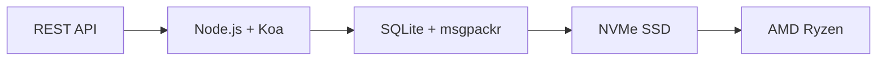

# La Prima API Email Completa: Come Forward Email ha Rivoluzionato la Gestione delle Email {#the-first-complete-email-api-how-forward-email-revolutionized-email-management}


<p class="lead mt-3">
  <strong>TL;DR:</strong> Abbiamo creato la prima API REST completa al mondo per la gestione delle email con capacità di ricerca avanzate che nessun altro servizio offre. Mentre Gmail, Outlook e Apple costringono gli sviluppatori a un inferno IMAP o a API con limiti di velocità, Forward Email offre operazioni CRUD fulminee per messaggi, cartelle, contatti e calendari tramite un'interfaccia REST unificata con oltre 15 parametri di ricerca. Questa è l'API email che gli sviluppatori stavano aspettando.
</p>


## Indice {#table-of-contents}

* [Il Problema delle API Email](#the-email-api-problem)
* [Cosa Dicono Davvero gli Sviluppatori](#what-developers-are-actually-saying)
* [La Soluzione Rivoluzionaria di Forward Email](#forward-emails-revolutionary-solution)
  * [Perché l'Abbiamo Costruita](#why-we-built-this)
  * [Autenticazione Semplice](#simple-authentication)
* [20 Endpoint che Cambiano Tutto](#20-endpoints-that-change-everything)
  * [Messaggi (5 endpoint)](#messages-5-endpoints)
  * [Cartelle (5 endpoint)](#folders-5-endpoints)
  * [Contatti (5 endpoint)](#contacts-5-endpoints)
  * [Calendari (5 endpoint)](#calendars-5-endpoints)
* [Ricerca Avanzata: Nessun Altro Servizio si Avvicina](#advanced-search-no-other-service-compares)
  * [Il Panorama delle API di Ricerca è Rotto](#the-search-api-landscape-is-broken)
  * [La Rivoluzionaria API di Ricerca di Forward Email](#forward-emails-revolutionary-search-api)
  * [Esempi di Ricerca nel Mondo Reale](#real-world-search-examples)
  * [Vantaggi di Prestazioni](#performance-advantages)
  * [Funzionalità di Ricerca che Nessun Altro Ha](#search-features-no-one-else-has)
  * [Perché Questo è Importante per gli Sviluppatori](#why-this-matters-for-developers)
  * [L'Implementazione Tecnica](#the-technical-implementation)
* [Architettura ad Alte Prestazioni Fulminee](#blazing-fast-performance-architecture)
  * [Benchmark di Prestazioni](#performance-benchmarks)
  * [Architettura Privacy-First](#privacy-first-architecture)
* [Perché Siamo Diversi: Il Confronto Completo](#why-were-different-the-complete-comparison)
  * [Limitazioni dei Principali Provider](#major-provider-limitations)
  * [Vantaggi di Forward Email](#forward-email-advantages)
  * [Il Problema della Trasparenza Open-Source](#the-open-source-transparency-problem)
* [Oltre 30 Esempi di Integrazione nel Mondo Reale](#30-real-world-integration-examples)
  * [1. Miglioramento del Modulo Contatti WordPress](#1-wordpress-contact-form-enhancement)
  * [2. Alternativa a Zapier per l'Automazione Email](#2-zapier-alternative-for-email-automation)
  * [3. Sincronizzazione Email CRM](#3-crm-email-synchronization)
  * [4. Gestione Ordini E-commerce](#4-e-commerce-order-processing)
  * [5. Integrazione Ticket di Supporto](#5-support-ticket-integration)
  * [6. Sistema di Gestione Newsletter](#6-newsletter-management-system)
  * [7. Gestione Attività via Email](#7-email-based-task-management)
  * [8. Aggregazione Email Multi-Account](#8-multi-account-email-aggregation)
  * [9. Dashboard Avanzata di Analisi Email](#9-advanced-email-analytics-dashboard)
  * [10. Archiviazione Email Intelligente](#10-smart-email-archiving)
  * [11. Integrazione Email-Calendario](#11-email-to-calendar-integration)
  * [12. Backup Email e Conformità](#12-email-backup-and-compliance)
  * [13. Gestione Contenuti via Email](#13-email-based-content-management)
  * [14. Gestione Template Email](#14-email-template-management)
  * [15. Automazione Workflow via Email](#15-email-based-workflow-automation)
  * [16. Monitoraggio Sicurezza Email](#16-email-security-monitoring)
  * [17. Raccolta Sondaggi via Email](#17-email-based-survey-collection)
  * [18. Monitoraggio Prestazioni Email](#18-email-performance-monitoring)
  * [19. Qualificazione Lead via Email](#19-email-based-lead-qualification)
  * [20. Gestione Progetti via Email](#20-email-based-project-management)
  * [21. Gestione Inventario via Email](#21-email-based-inventory-management)
  * [22. Elaborazione Fatture via Email](#22-email-based-invoice-processing)
  * [23. Registrazione Eventi via Email](#23-email-based-event-registration)
  * [24. Workflow di Approvazione Documenti via Email](#24-email-based-document-approval-workflow)
  * [25. Analisi Feedback Clienti via Email](#25-email-based-customer-feedback-analysis)
  * [26. Pipeline di Reclutamento via Email](#26-email-based-recruitment-pipeline)
  * [27. Elaborazione Report Spese via Email](#27-email-based-expense-report-processing)
  * [28. Report di Assicurazione Qualità via Email](#28-email-based-quality-assurance-reporting)
  * [29. Gestione Fornitori via Email](#29-email-based-vendor-management)
  * [30. Monitoraggio Social Media via Email](#30-email-based-social-media-monitoring)
* [Iniziare](#getting-started)
  * [1. Crea il Tuo Account Forward Email](#1-create-your-forward-email-account)
  * [2. Genera le Credenziali API](#2-generate-api-credentials)
  * [3. Effettua la Tua Prima Chiamata API](#3-make-your-first-api-call)
  * [4. Esplora la Documentazione](#4-explore-the-documentation)
* [Risorse Tecniche](#technical-resources)
## Il Problema delle API Email {#the-email-api-problem}

Le API email sono fondamentalmente rotte. Punto.

Ogni grande provider di email costringe gli sviluppatori a scegliere tra due opzioni terribili:

1. **Inferno IMAP**: Lottare con un protocollo vecchio di 30 anni progettato per client desktop, non per applicazioni moderne
2. **API Limitate**: API con limiti di velocità, solo in lettura, complesse con OAuth che non possono gestire i tuoi dati email reali

Il risultato? Gli sviluppatori o abbandonano completamente l'integrazione email o sprecano settimane a costruire wrapper IMAP fragili che si rompono continuamente.

> \[!WARNING]
> **Il Segreto Sporco**: La maggior parte delle "API email" sono solo API di invio. Non puoi organizzare programmaticamente cartelle, sincronizzare contatti o gestire calendari tramite una semplice interfaccia REST. Fino ad ora.


## Cosa Dicono Veramente gli Sviluppatori {#what-developers-are-actually-saying}

La frustrazione è reale e documentata ovunque:

> "Ho recentemente provato a integrare Gmail nella mia app, e ci ho messo troppo tempo. Ho deciso che non vale la pena supportare Gmail."
>
> *- [Sviluppatore Hacker News](https://news.ycombinator.com/item?id=42106944), 147 voti positivi*

> "Tutte le API email sono mediocri? Sembrano limitate o restrittive in qualche modo."
>
> *- [Discussione Reddit r/SaaS](https://www.reddit.com/r/SaaS/comments/1cm84s7/are_all_email_apis_mediocre/)*

> "Perché lo sviluppo email deve essere così frustrante?"
>
> *- [Reddit r/webdev](https://www.reddit.com/r/webdev/comments/15trnp2/why_does_email_development_have_to_suck/), 89 commenti di dolore da sviluppatori*

> "Cosa rende l'API Gmail più efficiente di IMAP? Un altro motivo per cui l'API Gmail è molto più efficiente è che deve scaricare ogni messaggio una sola volta. Con IMAP, ogni messaggio deve essere scaricato e indicizzato..."
>
> *- [Domanda Stack Overflow](https://stackoverflow.com/questions/25431022/what-makes-the-gmail-api-more-efficient-than-imap) con 47 voti positivi*

Le prove sono ovunque:

* **Problemi SMTP WordPress**: [631 issue GitHub](https://github.com/awesomemotive/WP-Mail-SMTP/issues) su fallimenti nella consegna email
* **Limitazioni Zapier**: [Lamentele della community](https://community.zapier.com/featured-articles-65/email-parser-by-zapier-limitations-and-alternatives-16958) su limiti di 10 email/ora e fallimenti nel rilevamento IMAP
* **Progetti API IMAP**: [Molti](https://github.com/ewildgoose/imap-api) [progetti open-source](https://emailengine.app/) [esistono](https://www.npmjs.com/package/imapflow) specificamente per "convertire IMAP in REST" perché nessun provider lo offre
* **Frustrazioni API Gmail**: [Stack Overflow](https://stackoverflow.com/questions/tagged/gmail-api) ha 4.847 domande taggate "gmail-api" con lamentele comuni su limiti di velocità e complessità


## La Soluzione Rivoluzionaria di Forward Email {#forward-emails-revolutionary-solution}

**Siamo il primo servizio email a offrire operazioni CRUD complete per tutti i dati email tramite un'API REST unificata.**

Non è solo un'altra API di invio. Questo è il controllo programmatico completo su:

* **Messaggi**: Creare, leggere, aggiornare, cancellare, cercare, spostare, contrassegnare
* **Cartelle**: Gestione completa delle cartelle IMAP tramite endpoint REST
* **Contatti**: Archiviazione e sincronizzazione contatti [CardDAV](https://tools.ietf.org/html/rfc6352)
* **Calendari**: Eventi e pianificazione calendari [CalDAV](https://tools.ietf.org/html/rfc4791)

### Perché Abbiamo Costruito Questo {#why-we-built-this}

**Il Problema**: Ogni provider email tratta l'email come una scatola nera. Puoi inviare email, forse leggerle con OAuth complesso, ma non puoi veramente *gestire* i tuoi dati email programmaticamente.

**La Nostra Visione**: L'email dovrebbe essere facile da integrare come qualsiasi API moderna. Niente librerie IMAP. Niente complessità OAuth. Niente incubi di limiti di velocità. Solo semplici endpoint REST che funzionano.

**Il Risultato**: Il primo servizio email dove puoi costruire un client email completo, integrazione CRM o sistema di automazione usando solo richieste HTTP.

### Autenticazione Semplice {#simple-authentication}

Niente [complessità OAuth](https://oauth.net/2/). Niente [password specifiche per app](https://support.google.com/accounts/answer/185833). Solo le tue credenziali alias:

```bash
curl -u "alias@yourdomain.com:password" \
  https://api.forwardemail.net/v1/messages
```
## 20 Endpoint Che Cambiano Tutto {#20-endpoints-that-change-everything}

### Messaggi (5 endpoint) {#messages-5-endpoints}

* `GET /v1/messages` - Elenca i messaggi con filtri (`?folder=`, `?is_unread=`, `?is_flagged=`)
* `POST /v1/messages` - Invia nuovi messaggi direttamente nelle cartelle
* `GET /v1/messages/:id` - Recupera messaggio specifico con metadati completi
* `PUT /v1/messages/:id` - Aggiorna messaggio (flag, cartella, stato di lettura)
* `DELETE /v1/messages/:id` - Elimina messaggio definitivamente

### Cartelle (5 endpoint) {#folders-5-endpoints}

* `GET /v1/folders` - Elenca tutte le cartelle con stato di iscrizione
* `POST /v1/folders` - Crea nuova cartella con proprietà personalizzate
* `GET /v1/folders/:id` - Ottieni dettagli cartella e conteggi messaggi
* `PUT /v1/folders/:id` - Aggiorna proprietà cartella e iscrizione
* `DELETE /v1/folders/:id` - Elimina cartella e gestisci la rilocazione dei messaggi

### Contatti (5 endpoint) {#contacts-5-endpoints}

* `GET /v1/contacts` - Elenca contatti con ricerca e paginazione
* `POST /v1/contacts` - Crea nuovo contatto con supporto completo vCard
* `GET /v1/contacts/:id` - Recupera contatto con tutti i campi e metadati
* `PUT /v1/contacts/:id` - Aggiorna informazioni contatto con validazione ETag
* `DELETE /v1/contacts/:id` - Elimina contatto con gestione a cascata

### Calendari (5 endpoint) {#calendars-5-endpoints}

* `GET /v1/calendars` - Elenca eventi del calendario con filtro per data
* `POST /v1/calendars` - Crea evento calendario con partecipanti e ricorrenza
* `GET /v1/calendars/:id` - Ottieni dettagli evento con gestione fuso orario
* `PUT /v1/calendars/:id` - Aggiorna evento con rilevamento conflitti
* `DELETE /v1/calendars/:id` - Elimina evento con notifiche ai partecipanti


## Ricerca Avanzata: Nessun Altro Servizio Si Avvicina {#advanced-search-no-other-service-compares}

**Forward Email è l’unico servizio email che offre una ricerca completa e programmabile su tutti i campi dei messaggi tramite una REST API.**

Mentre altri provider offrono al massimo filtri di base, noi abbiamo costruito l’API di ricerca email più avanzata mai creata. Nessuna API di Gmail, Outlook o altro servizio si avvicina alle nostre capacità di ricerca.

### Il Panorama delle API di Ricerca è Rotto {#the-search-api-landscape-is-broken}

**Limitazioni della Ricerca API Gmail:**

* ✅ Solo parametro base `q`
* ❌ Nessuna ricerca specifica per campo
* ❌ Nessun filtro per intervallo di date
* ❌ Nessun filtro per dimensione
* ❌ Nessun filtro per allegati
* ❌ Limitato alla sintassi di ricerca di Gmail

**Limitazioni della Ricerca API Outlook:**

* ✅ Parametro base `$search`
* ❌ Nessun targeting avanzato per campo
* ❌ Nessuna combinazione complessa di query
* ❌ Limitazioni aggressive di velocità
* ❌ Sintassi OData complessa richiesta

**Apple iCloud:**

* ❌ Nessuna API disponibile
* ❌ Solo ricerca IMAP (se riesci a farla funzionare)

**ProtonMail & Tuta:**

* ❌ Nessuna API pubblica
* ❌ Nessuna capacità di ricerca programmabile

### L’API di Ricerca Rivoluzionaria di Forward Email {#forward-emails-revolutionary-search-api}

**Offriamo oltre 15 parametri di ricerca che nessun altro servizio fornisce:**

| Capacità di Ricerca            | Forward Email                          | Gmail API    | Outlook API        | Altri  |
| ------------------------------ | -------------------------------------- | ------------ | ------------------ | ------ |
| **Ricerca Specifica per Campo**| ✅ Oggetto, corpo, da, a, cc, intestazioni | ❌            | ❌                  | ❌      |
| **Ricerca Generale Multi-Campo**| ✅ `?search=` su tutti i campi          | ✅ Base `q=` | ✅ Base `$search=` | ❌      |
| **Filtro per Intervallo di Date**| ✅ `?since=` & `?before=`               | ❌            | ❌                  | ❌      |
| **Filtro per Dimensione**       | ✅ `?min_size=` & `?max_size=`          | ❌            | ❌                  | ❌      |
| **Filtro per Allegati**         | ✅ `?has_attachments=true/false`        | ❌            | ❌                  | ❌      |
| **Ricerca nelle Intestazioni** | ✅ `?headers=X-Priority`                | ❌            | ❌                  | ❌      |
| **Ricerca per ID Messaggio**   | ✅ `?message_id=abc123`                 | ❌            | ❌                  | ❌      |
| **Filtri Combinati**            | ✅ Parametri multipli con logica AND    | ❌            | ❌                  | ❌      |
| **Case-Insensitive**            | ✅ Tutte le ricerche                    | ✅            | ✅                  | ❌      |
| **Supporto Paginazione**        | ✅ Funziona con tutti i parametri di ricerca | ✅            | ✅                  | ❌      |
### Esempi di Ricerca nel Mondo Reale {#real-world-search-examples}

**Trova Tutte le Fatture dell'Ultimo Trimestre:**

```bash
# Forward Email - Semplice e potente
GET /v1/messages?subject=invoice&since=2024-01-01T00:00:00Z&before=2024-04-01T00:00:00Z

# Gmail API - Impossibile con la loro ricerca limitata
# Nessun filtro per intervallo di date disponibile

# Outlook API - Sintassi OData complessa, funzionalità limitate
GET /me/messages?$search="invoice"&$filter=receivedDateTime ge 2024-01-01T00:00:00Z
```

**Cerca Allegati Grandi da un Mittente Specifico:**

```bash
# Forward Email - Filtraggio completo
GET /v1/messages?from=finance@company.com&has_attachments=true&min_size=1000000

# Gmail API - Non è possibile filtrare per dimensione o allegati programmaticamente
# Outlook API - Nessun filtro per dimensione disponibile
# Altri - Nessuna API disponibile
```

**Ricerca Complessa su Più Campi:**

```bash
# Forward Email - Capacità avanzate di query
GET /v1/messages?body=quarterly&from=manager&is_flagged=true&folder=Reports

# Gmail API - Limitato alla sola ricerca testuale di base
GET /gmail/v1/users/me/messages?q=quarterly

# Outlook API - Ricerca base senza targeting di campo
GET /me/messages?$search="quarterly"
```

### Vantaggi di Prestazione {#performance-advantages}

**Prestazioni della Ricerca Forward Email:**

* ⚡ **Tempi di risposta sotto i 100ms** per ricerche complesse
* 🔍 **Ottimizzazione regex** con indicizzazione adeguata
* 📊 **Esecuzione parallela delle query** per conteggio e dati
* 💾 **Uso efficiente della memoria** con query snelle

**Problemi di Prestazioni dei Competitor:**

* 🐌 **Gmail API**: Limitazione di quota a 250 unità per utente al secondo
* 🐌 **Outlook API**: Throttling aggressivo con requisiti complessi di backoff
* 🐌 **Altri**: Nessuna API con cui confrontarsi

### Funzionalità di Ricerca Che Nessun Altro Ha {#search-features-no-one-else-has}

#### 1. Ricerca Specifica per Intestazioni {#1-header-specific-search}

```bash
# Trova messaggi con intestazioni specifiche
GET /v1/messages?headers=X-Priority:1
GET /v1/messages?headers=X-Spam-Score
```

#### 2. Intelligenza Basata sulla Dimensione {#2-size-based-intelligence}

```bash
# Trova email di newsletter (tipicamente grandi)
GET /v1/messages?min_size=50000&from=newsletter

# Trova risposte rapide (tipicamente piccole)
GET /v1/messages?max_size=1000&to=support
```

#### 3. Flussi di Lavoro Basati sugli Allegati {#3-attachment-based-workflows}

```bash
# Trova tutti i documenti inviati al team legale
GET /v1/messages?to=legal&has_attachments=true&body=contract

# Trova email senza allegati per pulizia
GET /v1/messages?has_attachments=false&before=2023-01-01T00:00:00Z
```

#### 4. Logica Aziendale Combinata {#4-combined-business-logic}

```bash
# Trova messaggi urgenti contrassegnati da VIP con allegati
GET /v1/messages?is_flagged=true&from=ceo&has_attachments=true&subject=urgent
```

### Perché Questo è Importante per gli Sviluppatori {#why-this-matters-for-developers}

**Costruisci Applicazioni Prima Impossibili:**

1. **Analisi Avanzata delle Email**: Analizza i modelli di email per dimensione, mittente, contenuto
2. **Gestione Intelligente delle Email**: Organizza automaticamente basandoti su criteri complessi
3. **Conformità e Scoperta**: Trova email specifiche per requisiti legali
4. **Business Intelligence**: Estrai insight dai modelli di comunicazione email
5. **Flussi di Lavoro Automatizzati**: Attiva azioni basate su filtri email sofisticati

### L'Implementazione Tecnica {#the-technical-implementation}

La nostra API di ricerca utilizza:

* **Ottimizzazione regex** con strategie di indicizzazione adeguate
* **Esecuzione parallela** per le prestazioni
* **Validazione degli input** per la sicurezza
* **Gestione completa degli errori** per l'affidabilità

```javascript
// Esempio: Implementazione di ricerca complessa
const searchConditions = [];

if (ctx.query.subject) {
  searchConditions.push({
    subject: { $regex: ctx.query.subject, $options: 'i' }
  });
}

if (ctx.query.from) {
  searchConditions.push({
    $or: [
      { 'from.address': { $regex: ctx.query.from, $options: 'i' } },
      { 'from.name': { $regex: ctx.query.from, $options: 'i' } }
    ]
  });
}

// Combina con logica AND
if (searchConditions.length > 0) {
  query.$and = searchConditions;
}
```

> \[!TIP]
> **Vantaggio per gli Sviluppatori**: Con l'API di ricerca di Forward Email, puoi costruire applicazioni email che competono con i client desktop in funzionalità mantenendo la semplicità delle API REST.
## Architettura ad Alte Prestazioni Fulminee {#blazing-fast-performance-architecture}

Il nostro stack tecnico è costruito per velocità e affidabilità:


```mermaid
graph LR
    A[REST API] --> B[Node.js + Koa]
    B --> C[SQLite + msgpackr]
    C --> D[NVMe SSD]
    D --> E[AMD Ryzen]
```

### Benchmark di Prestazioni {#performance-benchmarks}

**Perché Siamo Fulminei:**

| Componente   | Tecnologia                                                                       | Vantaggio in Prestazioni                      |
| ------------ | -------------------------------------------------------------------------------- | --------------------------------------------- |
| **Storage**  | [NVMe SSD](https://en.wikipedia.org/wiki/NVM_Express)                           | 10 volte più veloce rispetto al SATA tradizionale |
| **Database** | [SQLite](https://sqlite.org/) + [msgpackr](https://github.com/kriszyp/msgpackr) | Zero latenza di rete, serializzazione ottimizzata |
| **Hardware** | [AMD Ryzen](https://www.amd.com/en/products/processors/desktops/ryzen) bare metal | Nessun overhead di virtualizzazione           |
| **Caching**  | In-memory + persistente                                                          | Tempi di risposta sotto il millisecondo       |
| **Backup**   | [Cloudflare R2](https://www.cloudflare.com/products/r2/) criptato                | Affidabilità di livello enterprise             |

**Numeri Reali di Prestazioni:**

* **Tempo di Risposta API**: < 50ms in media
* **Recupero Messaggi**: < 10ms per messaggi in cache
* **Operazioni su Cartelle**: < 5ms per operazioni sui metadati
* **Sincronizzazione Contatti**: oltre 1000 contatti/secondo
* **Uptime**: SLA 99,99% con infrastruttura ridondata

### Architettura Privacy-First {#privacy-first-architecture}

**Design Zero-Knowledge**: Solo tu hai accesso con la tua password IMAP - non possiamo leggere le tue email. La nostra [architettura zero-knowledge](https://forwardemail.net/en/security) garantisce completa privacy offrendo prestazioni fulminee.


## Perché Siamo Diversi: Il Confronto Completo {#why-were-different-the-complete-comparison}

### Limitazioni dei Principali Provider {#major-provider-limitations}

| Provider         | Problemi Principali                      | Limitazioni Specifiche                                                                                                                                                                                                                                                                                                                                                                                                                                               |
| ---------------- | --------------------------------------- | -------------------------------------------------------------------------------------------------------------------------------------------------------------------------------------------------------------------------------------------------------------------------------------------------------------------------------------------------------------------------------------------------------------------------------------------------------------------- |
| **Gmail API**    | Sola lettura, OAuth complesso, API separate | • [Impossibile modificare messaggi esistenti](https://developers.google.com/gmail/api/reference/rest/v1/users.messages)<br>• [Etichette ≠ cartelle](https://developers.google.com/gmail/api/reference/rest/v1/users.labels)<br>• [Limite di 1 miliardo di unità di quota/giorno](https://developers.google.com/gmail/api/reference/quota)<br>• [Richiede API separate](https://developers.google.com/workspace) per contatti/calendario                                                           |
| **Outlook API**  | Deprecato, Confuso, Focalizzato su Enterprise | • [Endpoint REST deprecati da marzo 2024](https://learn.microsoft.com/en-us/outlook/rest/compare-graph)<br>• [Molteplici API confuse](https://learn.microsoft.com/en-us/office/client-developer/outlook/selecting-an-api-or-technology-for-developing-solutions-for-outlook) (EWS, Graph, REST)<br>• [Complessità di Microsoft Graph](https://learn.microsoft.com/en-us/graph/overview)<br>• [Limitazioni aggressive](https://learn.microsoft.com/en-us/graph/throttling) |
| **Apple iCloud** | Nessuna API Pubblica                    | • [Nessuna API pubblica](https://support.apple.com/en-us/102654)<br>• [Solo IMAP con limite di 1000 email/giorno](https://support.apple.com/en-us/102654)<br>• [Password specifiche per app richieste](https://support.apple.com/en-us/102654)<br>• [Limite di 500 destinatari per messaggio](https://support.apple.com/en-us/102654)                                                                                                                                              |
| **ProtonMail**   | Nessuna API, Falsi claim Open-Source    | • [Nessuna API pubblica disponibile](https://proton.me/support/protonmail-bridge-clients)<br>• [Software Bridge richiesto](https://proton.me/mail/bridge) per accesso IMAP<br>• [Dichiarano "open source"](https://proton.me/blog/open-source) ma [il codice server è proprietario](https://github.com/ProtonMail)<br>• [Limitato solo ai piani a pagamento](https://proton.me/pricing)                                                                                                         |
| **Tuta**         | Nessuna API, Trasparenza Fuorviante    | • [Nessuna API REST per la gestione email](https://tuta.com/support#technical)<br>• [Dichiarano "open source"](https://tuta.com/blog/posts/open-source-email) ma [il backend è chiuso](https://github.com/tutao/tutanota)<br>• [IMAP/SMTP non supportati](https://tuta.com/support#imap)<br>• [Crittografia proprietaria](https://tuta.com/encryption) impedisce integrazioni standard                                                                                               |
| **Zapier Email** | Limiti Severi di Velocità               | • [Limite di 10 email all'ora](https://help.zapier.com/hc/en-us/articles/8496181555597-Email-Parser-by-Zapier-limitations-and-alternatives)<br>• [Nessun accesso alle cartelle IMAP](https://help.zapier.com/hc/en-us/articles/8496181555597-Email-Parser-by-Zapier-limitations-and-alternatives)<br>• [Capacità di parsing limitate](https://help.zapier.com/hc/en-us/articles/8496181555597-Email-Parser-by-Zapier-limitations-and-alternatives)                                 |
### Vantaggi di Forward Email {#forward-email-advantages}

| Funzionalità       | Forward Email                                                                                | Competizione                              |
| ------------------ | -------------------------------------------------------------------------------------------- | ----------------------------------------- |
| **CRUD Completo**  | ✅ Creazione, lettura, aggiornamento, cancellazione completa per tutti i dati                 | ❌ Solo lettura o operazioni limitate      |
| **API Unificata**  | ✅ Messaggi, cartelle, contatti, calendari in un’unica API                                    | ❌ API separate o funzionalità mancanti   |
| **Autenticazione Semplice** | ✅ Autenticazione base con credenziali alias                                               | ❌ OAuth complesso con molteplici scope    |
| **Nessun Limite di Velocità** | ✅ Limiti generosi progettati per applicazioni reali                                    | ❌ Quote restrittive che interrompono i flussi di lavoro |
| **Self-Hosting**   | ✅ [Opzione completa di self-hosting](https://forwardemail.net/en/blog/docs/self-hosted-solution) | ❌ Solo vendor lock-in                     |
| **Privacy**        | ✅ Zero-knowledge, crittografato, privato                                                     | ❌ Data mining e problemi di privacy       |
| **Prestazioni**    | ✅ Risposte sotto i 50ms, storage NVMe                                                        | ❌ Latenza di rete, ritardi da throttling  |

### Il Problema della Trasparenza Open-Source {#the-open-source-transparency-problem}

**ProtonMail e Tuta si presentano come "open source" e "trasparenti", ma si tratta di marketing fuorviante che viola i principi moderni della privacy.**

> \[!WARNING]
> **Falsi Reclami di Trasparenza**: Sia ProtonMail che Tuta pubblicizzano in modo prominente le loro credenziali "open source" mantenendo però il codice server più critico proprietario e chiuso.

**L’inganno di ProtonMail:**

* **Reclami**: ["Siamo open source"](https://proton.me/blog/open-source) evidenziato nel marketing
* **Realtà**: [Il codice server è completamente proprietario](https://github.com/ProtonMail) - solo le app client sono open source
* **Impatto**: Gli utenti non possono verificare la crittografia lato server, la gestione dei dati o le affermazioni sulla privacy
* **Violazione della Trasparenza**: Nessun modo per controllare i sistemi reali di elaborazione e archiviazione delle email

**Il marketing fuorviante di Tuta:**

* **Reclami**: ["Email open source"](https://tuta.com/blog/posts/open-source-email) come punto di forza principale
* **Realtà**: [L’infrastruttura backend è closed source](https://github.com/tutao/tutanota) - disponibile solo il frontend
* **Impatto**: La crittografia proprietaria impedisce i protocolli email standard (IMAP/SMTP)
* **Strategia di Lock-in**: La crittografia personalizzata obbliga alla dipendenza dal vendor

**Perché questo è importante per la privacy moderna:**

Nel 2025, la vera privacy richiede **trasparenza completa**. Quando i provider email dichiarano "open source" ma nascondono il codice server:

1. **Crittografia non verificabile**: Non puoi controllare come i tuoi dati sono effettivamente crittografati
2. **Pratiche di gestione dati nascoste**: La gestione dei dati lato server resta una scatola nera
3. **Sicurezza basata sulla fiducia**: Devi fidarti delle loro affermazioni senza verifica
4. **Vendor lock-in**: I sistemi proprietari impediscono la portabilità dei dati

**La vera trasparenza di Forward Email:**

* ✅ **[Completamente open source](https://github.com/forwardemail/forwardemail.net)** - codice server e client
* ✅ **[Self-hosting disponibile](https://forwardemail.net/en/blog/docs/self-hosted-solution)** - esegui la tua istanza
* ✅ **Protocolli standard** - compatibilità IMAP, SMTP, CardDAV, CalDAV
* ✅ **Sicurezza verificabile** - ogni riga di codice può essere ispezionata
* ✅ **Nessun vendor lock-in** - i tuoi dati, il tuo controllo

> \[!TIP]
> **Il vero open source significa poter verificare ogni affermazione.** Con Forward Email puoi controllare la nostra crittografia, rivedere la gestione dei dati e persino eseguire la tua istanza. Questa è vera trasparenza.


## Oltre 30 Esempi di Integrazione nel Mondo Reale {#30-real-world-integration-examples}

### 1. Miglioramento del Modulo Contatti WordPress {#1-wordpress-contact-form-enhancement}
**Problema**: [Errori di configurazione SMTP in WordPress](https://github.com/awesomemotive/WP-Mail-SMTP/issues) ([631 problemi su GitHub](https://github.com/awesomemotive/WP-Mail-SMTP/issues))  
**Soluzione**: L'integrazione diretta tramite API bypassa completamente [SMTP](https://tools.ietf.org/html/rfc5321)

```javascript
// Modulo di contatto WordPress che salva nella cartella Inviati
await fetch('https://api.forwardemail.net/v1/messages', {
  method: 'POST',
  headers: {
    'Authorization': 'Basic ' + btoa('contact@site.com:password'),
    'Content-Type': 'application/json'
  },
  body: JSON.stringify({
    to: [{ address: 'owner@site.com' }],
    subject: 'Modulo di contatto: ' + formData.subject,
    text: formData.message,
    folder: 'Sent'
  })
});
```

### 2. Alternativa a Zapier per l'automazione email {#2-zapier-alternative-for-email-automation}

**Problema**: [Limite di 10 email/ora di Zapier](https://help.zapier.com/hc/en-us/articles/8496181555597-Email-Parser-by-Zapier-limitations-and-alternatives) e [errori di rilevamento IMAP](https://community.zapier.com/featured-articles-65/email-parser-by-zapier-limitations-and-alternatives-16958)  
**Soluzione**: Automazione illimitata con pieno controllo delle email

```javascript
// Organizza automaticamente le email per dominio del mittente
const messages = await fetch('/v1/messages?folder=INBOX');
for (const message of messages) {
  const domain = message.from.split('@')[1];
  await fetch(`/v1/messages/${message.id}`, {
    method: 'PUT',
    body: JSON.stringify({ folder: `Clients/${domain}` })
  });
}
```

### 3. Sincronizzazione email CRM {#3-crm-email-synchronization}

**Problema**: Gestione manuale dei contatti tra email e [sistemi CRM](https://en.wikipedia.org/wiki/Customer_relationship_management)  
**Soluzione**: Sincronizzazione bidirezionale con API contatti [CardDAV](https://tools.ietf.org/html/rfc6352)

```javascript
// Sincronizza nuovi contatti email al CRM
const newContacts = await fetch('/v1/contacts');
for (const contact of newContacts) {
  await crmAPI.createContact({
    name: contact.name,
    email: contact.email,
    source: 'email_api'
  });
}
```

### 4. Gestione ordini e-commerce {#4-e-commerce-order-processing}

**Problema**: Elaborazione manuale delle email di ordine per [piattaforme e-commerce](https://en.wikipedia.org/wiki/E-commerce)  
**Soluzione**: Pipeline automatizzata per la gestione degli ordini

```javascript
// Elabora email di conferma ordine
const orders = await fetch('/v1/messages?folder=Orders');
const orderEmails = orders.filter(msg =>
  msg.subject.includes('Order Confirmation')
);

for (const order of orderEmails) {
  const orderData = parseOrderEmail(order.text);
  await updateInventory(orderData);
  await fetch(`/v1/messages/${order.id}`, {
    method: 'PUT',
    body: JSON.stringify({ folder: 'Orders/Processed' })
  });
}
```

### 5. Integrazione ticket di supporto {#5-support-ticket-integration}

**Problema**: Thread email sparsi su [piattaforme helpdesk](https://en.wikipedia.org/wiki/Help_desk_software)  
**Soluzione**: Tracciamento completo dei thread email

```javascript
// Crea ticket di supporto da thread email
const messages = await fetch('/v1/messages?folder=Support');
const supportEmails = messages.filter(msg =>
  msg.to.some(addr => addr.includes('support@'))
);

for (const email of supportEmails) {
  const ticket = await supportSystem.createTicket({
    subject: email.subject,
    from: email.from,
    body: email.text,
    timestamp: email.date
  });
}
```

### 6. Sistema di gestione newsletter {#6-newsletter-management-system}

**Problema**: Integrazioni limitate con piattaforme [newsletter](https://en.wikipedia.org/wiki/Email_marketing)  
**Soluzione**: Gestione completa del ciclo di vita degli iscritti

```javascript
// Gestione automatica delle iscrizioni alla newsletter
const messages = await fetch('/v1/messages?folder=Newsletter');
const unsubscribes = messages.filter(msg =>
  msg.subject.toLowerCase().includes('unsubscribe')
);

for (const msg of unsubscribes) {
  await removeSubscriber(msg.from);
  await fetch(`/v1/messages/${msg.id}`, {
    method: 'PUT',
    body: JSON.stringify({ folder: 'Newsletter/Unsubscribed' })
  });
}
```

### 7. Gestione attività via email {#7-email-based-task-management}

**Problema**: Sovraccarico della casella di posta e [tracciamento attività](https://en.wikipedia.org/wiki/Task_management)  
**Soluzione**: Conversione delle email in attività operative
```javascript
// Create tasks from flagged emails
const messages = await fetch('/v1/messages?is_flagged=true');
for (const email of messages) {
  await taskManager.createTask({
    title: email.subject,
    description: email.text,
    assignee: email.to[0].address,
    dueDate: extractDueDate(email.text)
  });
}
```

### 8. Multi-Account Email Aggregation {#8-multi-account-email-aggregation}

**Problem**: Managing [multiple email accounts](https://en.wikipedia.org/wiki/Email_client) across providers
**Solution**: Unified inbox interface

```javascript
// Aggregate emails from multiple accounts
const accounts = ['work@domain.com', 'personal@domain.com'];
const allMessages = [];

for (const account of accounts) {
  const messages = await fetch('/v1/messages', {
    headers: { 'Authorization': getAuth(account) }
  });
  allMessages.push(...messages.map(m => ({ ...m, account })));
}
```

### 9. Advanced Email Analytics Dashboard {#9-advanced-email-analytics-dashboard}

**Problem**: No insights into [email patterns](https://en.wikipedia.org/wiki/Email_analytics) with sophisticated filtering
**Solution**: Custom email analytics using advanced search capabilities

```javascript
// Generate comprehensive email analytics using advanced search
const analytics = {};

// Analyze email volume by sender domain
const messages = await fetch('/v1/messages');
analytics.senderDomains = analyzeSenderDomains(messages);

// Find large attachments consuming storage
const largeAttachments = await fetch('/v1/messages?has_attachments=true&min_size=1000000');
analytics.storageHogs = largeAttachments.map(msg => ({
  subject: msg.subject,
  from: msg.from,
  size: msg.size
}));

// Analyze communication patterns with VIPs
const vipEmails = await fetch('/v1/messages?from=ceo@company.com');
const urgentVipEmails = await fetch('/v1/messages?from=ceo@company.com&subject=urgent');
analytics.vipCommunication = {
  total: vipEmails.length,
  urgent: urgentVipEmails.length,
  urgencyRate: (urgentVipEmails.length / vipEmails.length) * 100
};

// Find unread emails by date range for follow-up
const lastWeek = new Date(Date.now() - 7 * 24 * 60 * 60 * 1000).toISOString();
const unreadRecent = await fetch(`/v1/messages?is_unread=true&since=${lastWeek}`);
analytics.followUpNeeded = unreadRecent.length;

// Analyze email sizes for optimization
const smallEmails = await fetch('/v1/messages?max_size=1000');
const mediumEmails = await fetch('/v1/messages?min_size=1000&max_size=50000');
const largeEmails = await fetch('/v1/messages?min_size=50000');
analytics.sizeDistribution = {
  small: smallEmails.length,
  medium: mediumEmails.length,
  large: largeEmails.length
};

// Search for compliance-related emails
const complianceEmails = await fetch('/v1/messages?body=confidential&has_attachments=true');
analytics.complianceReview = complianceEmails.length;
```

### 10. Smart Email Archiving {#10-smart-email-archiving}

**Problem**: Manual [email organization](https://en.wikipedia.org/wiki/Email_management)
**Solution**: Intelligent email categorization

```javascript
// Auto-archive old emails by category
const messages = await fetch('/v1/messages');
const oldEmails = messages.filter(email =>
  isOlderThan(email.date, 90) // 90 days
);

for (const email of oldEmails) {
  const category = categorizeEmail(email);
  await fetch(`/v1/messages/${email.id}`, {
    method: 'PUT',
    body: JSON.stringify({ folder: `Archive/${category}` })
  });
}
```

### 11. Email-to-Calendar Integration {#11-email-to-calendar-integration}

**Problem**: Manual [calendar event](https://tools.ietf.org/html/rfc4791) creation from emails
**Solution**: Automatic event extraction and creation

```javascript
// Extract meeting details from emails
const messages = await fetch('/v1/messages?folder=Meetings');
const meetingEmails = messages.filter(email =>
  email.subject.toLowerCase().includes('meeting')
);

for (const email of meetingEmails) {
  const meetingData = extractMeetingInfo(email.text);
  if (meetingData.date && meetingData.time) {
    await fetch('/v1/calendars', {
      method: 'POST',
      body: JSON.stringify({
        title: email.subject,
        start: meetingData.datetime,
        attendees: [email.from, ...email.to]
      })
    });
  }
}
```

### 12. Backup e Conformità Email {#12-email-backup-and-compliance}

**Problema**: [Conservazione delle email](https://en.wikipedia.org/wiki/Email_retention_policy) e requisiti di conformità  
**Soluzione**: Backup automatico con conservazione dei metadati

```javascript
// Backup delle email con metadati completi
const allMessages = await fetch('/v1/messages');
const backup = {
  timestamp: new Date(),
  messages: allMessages.map(msg => ({
    id: msg.id,
    subject: msg.subject,
    from: msg.from,
    to: msg.to,
    date: msg.date,
    flags: msg.flags
  }))
};
await saveToComplianceStorage(backup);
```

### 13. Gestione dei Contenuti via Email {#13-email-based-content-management}

**Problema**: Gestione delle submission di contenuti tramite email per [piattaforme CMS](https://en.wikipedia.org/wiki/Content_management_system)  
**Soluzione**: Email come sistema di gestione dei contenuti

```javascript
// Processa le submission di contenuti da email
const messages = await fetch('/v1/messages?folder=Submissions');
const submissions = messages.filter(msg =>
  msg.to.some(addr => addr.includes('submit@'))
);

for (const submission of submissions) {
  const content = parseSubmission(submission.text);
  await cms.createDraft({
    title: submission.subject,
    content: content.body,
    author: submission.from
  });
}
```

### 14. Gestione dei Modelli Email {#14-email-template-management}

**Problema**: [Modelli email](https://en.wikipedia.org/wiki/Email_template) incoerenti nel team  
**Soluzione**: Sistema centralizzato di modelli con API

```javascript
// Invia email con modelli e contenuti dinamici
const template = await getEmailTemplate('welcome');
await fetch('/v1/messages', {
  method: 'POST',
  body: JSON.stringify({
    to: [{ address: newUser.email }],
    subject: template.subject.replace('{{name}}', newUser.name),
    html: template.html.replace('{{name}}', newUser.name),
    folder: 'Sent'
  })
});
```

### 15. Automazione del Workflow via Email {#15-email-based-workflow-automation}

**Problema**: Processi di [approvazione manuale](https://en.wikipedia.org/wiki/Workflow) tramite email  
**Soluzione**: Attivazione automatica del workflow

```javascript
// Processa le email di approvazione
const messages = await fetch('/v1/messages?folder=Approvals');
const approvals = messages.filter(msg =>
  msg.subject.includes('APPROVAL')
);

for (const approval of approvals) {
  const decision = parseApprovalDecision(approval.text);
  await workflow.processApproval({
    requestId: extractRequestId(approval.subject),
    decision: decision,
    approver: approval.from
  });
}
```

### 16. Monitoraggio della Sicurezza Email {#16-email-security-monitoring}

**Problema**: Rilevamento manuale delle [minacce alla sicurezza](https://en.wikipedia.org/wiki/Email_security)  
**Soluzione**: Analisi automatizzata delle minacce

```javascript
// Monitora email sospette
const recentEmails = await fetch('/v1/messages');
for (const email of recentEmails) {
  const threatScore = analyzeThreat(email);
  if (threatScore > 0.8) {
    await fetch(`/v1/messages/${email.id}`, {
      method: 'PUT',
      body: JSON.stringify({ folder: 'Security/Quarantine' })
    });
    await alertSecurityTeam(email);
  }
}
```

### 17. Raccolta di Sondaggi via Email {#17-email-based-survey-collection}

**Problema**: Elaborazione manuale delle [risposte ai sondaggi](https://en.wikipedia.org/wiki/Survey_methodology)  
**Soluzione**: Aggregazione automatica delle risposte

```javascript
// Raccogli e processa le risposte ai sondaggi
const messages = await fetch('/v1/messages?folder=Surveys');
const responses = messages.filter(msg =>
  msg.subject.includes('Survey Response')
);

const surveyData = responses.map(email => ({
  respondent: email.from,
  responses: parseSurveyData(email.text),
  timestamp: email.date
}));
await updateSurveyResults(surveyData);
```

### 18. Monitoraggio delle Prestazioni Email {#18-email-performance-monitoring}

**Problema**: Mancanza di visibilità sulle [prestazioni di consegna email](https://en.wikipedia.org/wiki/Email_deliverability)  
**Soluzione**: Metriche email in tempo reale

```javascript
// Monitora le prestazioni di consegna email
const sentEmails = await fetch('/v1/messages?folder=Sent');
const deliveryStats = {
  sent: sentEmails.length,
  bounces: await countBounces(),
  deliveryRate: calculateDeliveryRate()
};
await updateDashboard(deliveryStats);
```
### 19. Qualificazione Lead Basata su Email {#19-email-based-lead-qualification}

**Problema**: [Lead scoring](https://en.wikipedia.org/wiki/Lead_scoring) manuale dalle interazioni email  
**Soluzione**: Pipeline automatizzata di qualificazione lead

```javascript
// Score leads based on email engagement
const prospects = await fetch('/v1/contacts');
for (const prospect of prospects) {
  const messages = await fetch('/v1/messages');
  const emails = messages.filter(msg =>
    msg.from.includes(prospect.email)
  );
  const score = calculateEngagementScore(emails);
  await crm.updateLeadScore(prospect.id, score);
}
```

### 20. Gestione Progetti Basata su Email {#20-email-based-project-management}

**Problema**: [Aggiornamenti di progetto](https://en.wikipedia.org/wiki/Project_management) sparsi tra thread email  
**Soluzione**: Hub centralizzato per la comunicazione di progetto

```javascript
// Extract project updates from emails
const messages = await fetch('/v1/messages?folder=Projects');
const projectEmails = messages.filter(msg =>
  msg.subject.includes('Project Update')
);

for (const email of projectEmails) {
  const update = parseProjectUpdate(email.text);
  await projectManager.addUpdate({
    project: update.projectId,
    author: email.from,
    content: update.content
  });
}
```

### 21. Gestione Inventario Basata su Email {#21-email-based-inventory-management}

**Problema**: Aggiornamenti manuali dell'inventario da email dei fornitori  
**Soluzione**: Tracciamento automatico dell'inventario da notifiche email

```javascript
// Process inventory updates from supplier emails
const messages = await fetch('/v1/messages?folder=Suppliers');
const inventoryEmails = messages.filter(msg =>
  msg.subject.includes('Inventory Update') || msg.subject.includes('Stock Alert')
);

for (const email of inventoryEmails) {
  const inventoryData = parseInventoryUpdate(email.text);
  await inventory.updateStock({
    sku: inventoryData.sku,
    quantity: inventoryData.quantity,
    supplier: email.from,
    timestamp: email.date
  });

  // Move to processed folder
  await fetch(`/v1/messages/${email.id}`, {
    method: 'PUT',
    body: JSON.stringify({ folder: 'Suppliers/Processed' })
  });
}
```

### 22. Elaborazione Fatture Basata su Email {#22-email-based-invoice-processing}

**Problema**: [Elaborazione fatture](https://en.wikipedia.org/wiki/Invoice_processing) manuale e integrazione contabile  
**Soluzione**: Estrazione automatica delle fatture e sincronizzazione con sistema contabile

```javascript
// Extract invoice data from email attachments
const messages = await fetch('/v1/messages?folder=Invoices');
const invoiceEmails = messages.filter(msg =>
  msg.subject.toLowerCase().includes('invoice') && msg.attachments.length > 0
);

for (const email of invoiceEmails) {
  const invoiceData = await extractInvoiceData(email.attachments[0]);
  await accounting.createInvoice({
    vendor: email.from,
    amount: invoiceData.total,
    dueDate: invoiceData.dueDate,
    items: invoiceData.lineItems
  });

  // Flag as processed
  await fetch(`/v1/messages/${email.id}`, {
    method: 'PUT',
    body: JSON.stringify({ flags: ['\\Seen', '\\Flagged'] })
  });
}
```

### 23. Registrazione Eventi Basata su Email {#23-email-based-event-registration}

**Problema**: Elaborazione manuale delle [registrazioni eventi](https://en.wikipedia.org/wiki/Event_management) da risposte email  
**Soluzione**: Gestione automatica dei partecipanti e integrazione calendario

```javascript
// Process event registration emails
const messages = await fetch('/v1/messages?folder=Events');
const registrations = messages.filter(msg =>
  msg.subject.includes('Registration') || msg.subject.includes('RSVP')
);

for (const registration of registrations) {
  const attendeeData = parseRegistration(registration.text);

  // Add to attendee list
  await events.addAttendee({
    event: attendeeData.eventId,
    name: attendeeData.name,
    email: registration.from,
    dietary: attendeeData.dietaryRestrictions
  });

  // Create calendar event for attendee
  await fetch('/v1/calendars', {
    method: 'POST',
    body: JSON.stringify({
      title: attendeeData.eventName,
      start: attendeeData.eventDate,
      attendees: [registration.from]
    })
  });
}
```
### 24. Flusso di Lavoro per l'Approvazione di Documenti via Email {#24-email-based-document-approval-workflow}

**Problema**: Catene complesse di [approvazione documenti](https://en.wikipedia.org/wiki/Document_management_system) tramite email  
**Soluzione**: Tracciamento automatico delle approvazioni e versionamento dei documenti

```javascript
// Track document approval workflow
const messages = await fetch('/v1/messages?folder=Approvals');
const approvalEmails = messages.filter(msg =>
  msg.subject.includes('Document Approval')
);

for (const email of approvalEmails) {
  const approval = parseApprovalEmail(email.text);

  await documentSystem.updateApproval({
    documentId: approval.documentId,
    approver: email.from,
    status: approval.decision, // 'approved', 'rejected', 'needs_changes'
    comments: approval.comments,
    timestamp: email.date
  });

  // Check if all approvals complete
  const document = await documentSystem.getDocument(approval.documentId);
  if (document.allApprovalsComplete) {
    await documentSystem.finalizeDocument(approval.documentId);
  }
}
```

### 25. Analisi del Feedback dei Clienti via Email {#25-email-based-customer-feedback-analysis}

**Problema**: Raccolta manuale di [feedback dei clienti](https://en.wikipedia.org/wiki/Customer_feedback) e analisi del sentiment  
**Soluzione**: Elaborazione automatica del feedback e tracciamento del sentiment

```javascript
// Analyze customer feedback from emails
const messages = await fetch('/v1/messages?folder=Feedback');
const feedbackEmails = messages.filter(msg =>
  msg.to.some(addr => addr.includes('feedback@'))
);

for (const email of feedbackEmails) {
  const sentiment = await analyzeSentiment(email.text);
  const category = categorizeFeeback(email.text);

  await feedback.recordFeedback({
    customer: email.from,
    content: email.text,
    sentiment: sentiment.score, // -1 to 1
    category: category, // 'bug', 'feature', 'complaint', 'praise'
    priority: calculatePriority(sentiment, category),
    timestamp: email.date
  });

  // Auto-escalate negative feedback
  if (sentiment.score < -0.5) {
    await escalateToSupport(email);
  }
}
```

### 26. Pipeline di Reclutamento via Email {#26-email-based-recruitment-pipeline}

**Problema**: Gestione manuale del [reclutamento](https://en.wikipedia.org/wiki/Recruitment) e del tracciamento dei candidati  
**Soluzione**: Gestione automatizzata dei candidati e pianificazione dei colloqui

```javascript
// Process job application emails
const messages = await fetch('/v1/messages?folder=Careers');
const applications = messages.filter(msg =>
  msg.subject.toLowerCase().includes('application') && msg.attachments.length > 0
);

for (const application of applications) {
  const resume = await parseResume(application.attachments[0]);

  const candidate = await ats.createCandidate({
    name: resume.name,
    email: application.from,
    skills: resume.skills,
    experience: resume.experience,
    position: extractPosition(application.subject)
  });

  // Auto-schedule screening if qualified
  if (candidate.qualificationScore > 0.7) {
    await calendar.scheduleInterview({
      candidateId: candidate.id,
      type: 'phone_screening',
      duration: 30
    });
  }
}
```

### 27. Elaborazione di Report Spese via Email {#27-email-based-expense-report-processing}

**Problema**: Invio e approvazione manuale di [report spese](https://en.wikipedia.org/wiki/Expense_report)  
**Soluzione**: Estrazione automatica delle spese e flusso di approvazione

```javascript
// Process expense report emails
const messages = await fetch('/v1/messages?folder=Expenses');
const expenseEmails = messages.filter(msg =>
  msg.subject.includes('Expense') && msg.attachments.length > 0
);

for (const email of expenseEmails) {
  const receipts = await processReceipts(email.attachments);

  const expenseReport = await expenses.createReport({
    employee: email.from,
    expenses: receipts.map(receipt => ({
      amount: receipt.total,
      category: receipt.category,
      date: receipt.date,
      merchant: receipt.merchant
    })),
    totalAmount: receipts.reduce((sum, r) => sum + r.total, 0)
  });

  // Auto-approve small amounts
  if (expenseReport.totalAmount < 100) {
    await expenses.approve(expenseReport.id);
  } else {
    await expenses.sendForApproval(expenseReport.id);
  }
}
```
### 28. Reportistica di Qualità Basata su Email {#28-email-based-quality-assurance-reporting}

**Problema**: Tracciamento manuale dei problemi di [assicurazione qualità](https://en.wikipedia.org/wiki/Quality_assurance)  
**Soluzione**: Gestione automatizzata dei problemi QA e tracciamento dei bug

```javascript
// Process QA bug reports from email
const messages = await fetch('/v1/messages?folder=QA');
const bugReports = messages.filter(msg =>
  msg.subject.includes('Bug Report') || msg.subject.includes('QA Issue')
);

for (const report of bugReports) {
  const bugData = parseBugReport(report.text);

  const ticket = await bugTracker.createIssue({
    title: report.subject,
    description: bugData.description,
    severity: bugData.severity,
    steps: bugData.stepsToReproduce,
    reporter: report.from,
    attachments: report.attachments
  });

  // Auto-assign based on component
  const assignee = await getComponentOwner(bugData.component);
  await bugTracker.assign(ticket.id, assignee);

  // Create calendar reminder for follow-up
  await fetch('/v1/calendars', {
    method: 'POST',
    body: JSON.stringify({
      title: `Follow up on ${ticket.id}`,
      start: addDays(new Date(), 3),
      attendees: [assignee]
    })
  });
}
```

### 29. Gestione Fornitori Basata su Email {#29-email-based-vendor-management}

**Problema**: Comunicazione manuale con i [fornitori](https://en.wikipedia.org/wiki/Vendor_management) e tracciamento dei contratti  
**Soluzione**: Gestione automatizzata delle relazioni con i fornitori

```javascript
// Track vendor communications and contracts
const messages = await fetch('/v1/messages?folder=Vendors');
const vendorEmails = messages.filter(msg =>
  isVendorEmail(msg.from)
);

for (const email of vendorEmails) {
  const vendor = await vendors.getByEmail(email.from);

  // Log communication
  await vendors.logCommunication({
    vendorId: vendor.id,
    type: 'email',
    subject: email.subject,
    content: email.text,
    timestamp: email.date
  });

  // Check for contract-related keywords
  if (email.text.includes('contract') || email.text.includes('renewal')) {
    await vendors.flagForContractReview({
      vendorId: vendor.id,
      emailId: email.id,
      priority: 'high'
    });

    // Create task for procurement team
    await tasks.create({
      title: `Review contract communication from ${vendor.name}`,
      assignee: 'procurement@company.com',
      dueDate: addDays(new Date(), 2)
    });
  }
}
```

### 30. Monitoraggio dei Social Media Basato su Email {#30-email-based-social-media-monitoring}

**Problema**: Tracciamento manuale delle menzioni sui [social media](https://en.wikipedia.org/wiki/Social_media_monitoring) e risposta  
**Soluzione**: Elaborazione automatizzata degli alert social e coordinamento delle risposte

```javascript
// Process social media alerts from email notifications
const messages = await fetch('/v1/messages?folder=Social');
const socialAlerts = messages.filter(msg =>
  msg.from.includes('alerts@') || msg.subject.includes('Social Mention')
);

for (const alert of socialAlerts) {
  const mention = parseSocialMention(alert.text);

  await socialMedia.recordMention({
    platform: mention.platform,
    author: mention.author,
    content: mention.content,
    sentiment: mention.sentiment,
    reach: mention.followerCount,
    url: mention.url
  });

  // Auto-escalate negative mentions with high reach
  if (mention.sentiment < -0.5 && mention.followerCount > 10000) {
    await socialMedia.escalateToTeam({
      mentionId: mention.id,
      priority: 'urgent',
      assignee: 'social-media-manager@company.com'
    });

    // Create calendar reminder for immediate response
    await fetch('/v1/calendars', {
      method: 'POST',
      body: JSON.stringify({
        title: `Urgent: Respond to negative social mention`,
        start: addMinutes(new Date(), 30),
        attendees: ['social-media-manager@company.com']
      })
    });
  }
}
```


## Iniziare {#getting-started}

### 1. Crea il Tuo Account Email di Inoltro {#1-create-your-forward-email-account}

Iscriviti su [forwardemail.net](https://forwardemail.net) e verifica il tuo dominio.

### 2. Genera le Credenziali API {#2-generate-api-credentials}

La tua email alias e la password fungono da credenziali API - nessuna configurazione aggiuntiva richiesta.
### 3. Effettua la tua prima chiamata API {#3-make-your-first-api-call}

```bash
# Elenca i tuoi messaggi
curl -u "your-alias@domain.com:password" \
  https://api.forwardemail.net/v1/messages

# Crea un nuovo contatto
curl -u "your-alias@domain.com:password" \
  -X POST \
  -H "Content-Type: application/json" \
  -d '{"fullName":"John Doe","emails":[{"value":"john@example.com"}]}' \
  https://api.forwardemail.net/v1/contacts
```

### 4. Esplora la documentazione {#4-explore-the-documentation}

Visita [forwardemail.net/en/email-api](https://forwardemail.net/en/email-api) per la documentazione completa dell'API con esempi interattivi.


## Risorse tecniche {#technical-resources}

* **[Documentazione completa API](https://forwardemail.net/en/email-api)** - Specifica OpenAPI 3.0 interattiva
* **[Guida all’auto-ospitazione](https://forwardemail.net/en/blog/docs/self-hosted-solution)** - Distribuisci Forward Email sulla tua infrastruttura
* **[Whitepaper sulla sicurezza](https://forwardemail.net/technical-whitepaper.pdf)** - Architettura tecnica e dettagli sulla sicurezza
* **[Repository GitHub](https://github.com/forwardemail/forwardemail.net)** - Codice open source
* **[Supporto per sviluppatori](mailto:api@forwardemail.net)** - Accesso diretto al nostro team di ingegneri

---

**Pronto a rivoluzionare l’integrazione della tua email?** [Inizia a sviluppare con l’API di Forward Email oggi stesso](https://forwardemail.net/en/email-api) e scopri la prima piattaforma completa per la gestione delle email progettata per sviluppatori.

*Forward Email: il servizio email che finalmente fa le API come si deve.*
