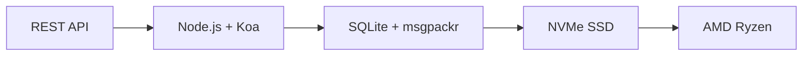

# 最初の完全なメールAPI：Forward Emailがメール管理に革命をもたらした方法 {#the-first-complete-email-api-how-forward-email-revolutionized-email-management}


<p class="lead mt-3">
<strong>TL;DR:</strong> 私たちは、他のサービスにはない高度な検索機能を備えた、世界初のメール管理向けREST APIを構築しました。Gmail、Outlook、Appleといったサービスでは、開発者がIMAP地獄やレート制限のあるAPIに縛られているのに対し、Forward Emailは、15以上の検索パラメータを備えた統合RESTインターフェースを通じて、メッセージ、フォルダ、連絡先、カレンダーに対する超高速CRUD操作を提供します。これこそ、開発者が待ち望んでいたメールAPIです。
</p>

## 目次 {#table-of-contents}

* [メールAPIの問題](#the-email-api-problem)
* [開発者の実際の声](#what-developers-are-actually-saying)
* [メール転送の革新的なソリューション](#forward-emails-revolutionary-solution)
  * [なぜこれを作ったのか](#why-we-built-this)
  * [シンプルな認証](#simple-authentication)
* [すべてを変える20のエンドポイント](#20-endpoints-that-change-everything)
  * [メッセージ（5つのエンドポイント）](#messages-5-endpoints)
  * [フォルダー（5つのエンドポイント）](#folders-5-endpoints)
  * [連絡先（5つのエンドポイント）](#contacts-5-endpoints)
  * [カレンダー（5つのエンドポイント）](#calendars-5-endpoints)
* [高度な検索: 他のサービスに匹敵するものはありません](#advanced-search-no-other-service-compares)
  * [検索API環境は壊れている](#the-search-api-landscape-is-broken)
  * [Forward Emailの革新的な検索API](#forward-emails-revolutionary-search-api)
  * [実際の検索例](#real-world-search-examples)
  * [パフォーマンス上の利点](#performance-advantages)
  * [他社にはない検索機能](#search-features-no-one-else-has)
  * [開発者にとってこれが重要な理由](#why-this-matters-for-developers)
  * [技術的実装](#the-technical-implementation)
* [超高速パフォーマンスアーキテクチャ](#blazing-fast-performance-architecture)
  * [パフォーマンスベンチマーク](#performance-benchmarks)
  * [プライバシー重視のアーキテクチャ](#privacy-first-architecture)
* [私たちが他社と違う理由：徹底比較](#why-were-different-the-complete-comparison)
  * [主要プロバイダーの制限](#major-provider-limitations)
  * [メール転送のメリット](#forward-email-advantages)
  * [オープンソースの透明性の問題](#the-open-source-transparency-problem)
* [30以上の実際の統合例](#30-real-world-integration-examples)
  * [1. WordPressのお問い合わせフォームの強化](#1-wordpress-contact-form-enhancement)
  * [2. メール自動化のためのZapierの代替](#2-zapier-alternative-for-email-automation)
  * [3. CRMメール同期](#3-crm-email-synchronization)
  * [4. 電子商取引の注文処理](#4-e-commerce-order-processing)
  * [5. サポートチケットの統合](#5-support-ticket-integration)
  * [6. ニュースレター管理システム](#6-newsletter-management-system)
  * [7. メールベースのタスク管理](#7-email-based-task-management)
  * [8. 複数アカウントのメール集約](#8-multi-account-email-aggregation)
  * [9. 高度なメール分析ダッシュボード](#9-advanced-email-analytics-dashboard)
  * [10. スマートなメールアーカイブ](#10-smart-email-archiving)
  * [11. メールとカレンダーの統合](#11-email-to-calendar-integration)
  * [12. メールのバックアップとコンプライアンス](#12-email-backup-and-compliance)
  * [13. メールベースのコンテンツ管理](#13-email-based-content-management)
  * [14. メールテンプレートの管理](#14-email-template-management)
  * [15. メールベースのワークフロー自動化](#15-email-based-workflow-automation)
  * [16. メールセキュリティ監視](#16-email-security-monitoring)
  * [17. メールによるアンケート収集](#17-email-based-survey-collection)
  * [18. メールパフォーマンス監視](#18-email-performance-monitoring)
  * [19. メールベースのリード選別](#19-email-based-lead-qualification)
  * [20. メールベースのプロジェクト管理](#20-email-based-project-management)
  * [21. メールベースの在庫管理](#21-email-based-inventory-management)
  * [22. メールベースの請求書処理](#22-email-based-invoice-processing)
  * [23. メールによるイベント登録](#23-email-based-event-registration)
  * [24. メールベースの文書承認ワークフロー](#24-email-based-document-approval-workflow)
  * [25. メールベースの顧客フィードバック分析](#25-email-based-customer-feedback-analysis)
  * [26. メールベースの採用パイプライン](#26-email-based-recruitment-pipeline)
  * [27. メールベースの経費報告書処理](#27-email-based-expense-report-processing)
  * [28. メールベースの品質保証レポート](#28-email-based-quality-assurance-reporting)
  * [29. メールベースのベンダー管理](#29-email-based-vendor-management)
  * [30. メールベースのソーシャルメディアモニタリング](#30-email-based-social-media-monitoring)
* [はじめる](#getting-started)
  * [1. 転送用メールアカウントを作成する](#1-create-your-forward-email-account)
  * [2. API認証情報を生成する](#2-generate-api-credentials)
  * [3. 最初のAPI呼び出しを行う](#3-make-your-first-api-call)
  * [4. ドキュメントを調べる](#4-explore-the-documentation)
* [技術リソース](#technical-resources)

## メールAPIの問題 {#the-email-api-problem}

メール API は根本的に壊れています。以上です。

すべての主要なメールプロバイダーは、開発者に次の 2 つの恐ろしい選択のいずれかを強制します。

1. **IMAP地獄**: 最新のアプリケーションではなくデスクトップクライアント向けに設計された30年前のプロトコルとの格闘
2. **機能不全のAPI**: レート制限があり、読み取り専用で、OAuthが複雑に絡み合うAPIでは、実際のメールデータを管理できない

その結果、開発者は電子メールの統合を完全に断念するか、頻繁に壊れる脆弱な IMAP ラッパーの構築に何週間も費やすことになります。

> \[!WARNING]
> **隠された秘密**：ほとんどの「メールAPI」は送信APIに過ぎません。シンプルなRESTインターフェースを使って、プログラムでフォルダを整理したり、連絡先を同期したり、カレンダーを管理したりすることはできません。しかし、これまではそうでした。

## 開発者の実際の声 {#what-developers-are-actually-saying}

このフラストレーションは現実であり、あらゆるところで文書化されています。

> 「最近、アプリにGmailを統合しようとしたのですが、時間がかかりすぎてしまいました。Gmailをサポートする価値はないと判断しました。」
>
> *- [Hacker News開発者](https://news.ycombinator.com/item?id=42106944)、147件の賛成票*

> 「メールAPIはどれも凡庸なのでしょうか？ 何か制限や制約があるように思えます。」
>
> *- [Reddit r/SaaS の議論](https://www.reddit.com/r/SaaS/comments/1cm84s7/are_all_email_apis_mediocre/)*

> 「なぜメール開発はつまらないのか？」
>
> *- [Reddit r/webdev](https://www.reddit.com/r/webdev/comments/15trnp2/why_does_email_development_have_to_suck/)、開発者の苦悩に関するコメント89件*

> 「Gmail API が IMAP よりも効率的なのはなぜでしょうか？ Gmail API がはるかに効率的なもう一つの理由は、各メッセージを一度だけダウンロードするだけで済むことです。IMAP では、すべてのメッセージをダウンロードしてインデックスに登録する必要があります…」
>
> *- [スタックオーバーフローの質問](https://stackoverflow.com/questions/25431022/what-makes-the-gmail-api-more-efficient-than-imap)（47 件の賛成票）*

証拠はどこにでもある。

* **WordPress SMTPの問題**: [631 件の GitHub の問題](https://github.com/awesomemotive/WP-Mail-SMTP/issues) メール配信エラーについて
* **Zapierの制限**: [コミュニティからの苦情](https://community.zapier.com/featured-articles-65/email-parser-by-zapier-limitations-and-alternatives-16958) 1時間あたり10通のメール送信制限とIMAP検出エラーについて
* **IMAP APIプロジェクト**: [複数](https://github.com/ewildgoose/imap-api) [オープンソース](https://emailengine.app/) [プロジェクト](https://www.npmjs.com/package/imapflow) は、IMAPをRESTに変換することに特化したものですが、これを提供するプロバイダーは存在しません。
* **Gmail APIの不満**: [スタックオーバーフロー](https://stackoverflow.com/questions/tagged/gmail-api)には、「gmail-api」タグが付けられた質問が4,847件あり、レート制限や複雑さに関するよくある不満が挙げられています。

## メール転送の革新的なソリューション {#forward-emails-revolutionary-solution}

**当社は、統合された REST API を通じてすべての電子メール データに対する完全な CRUD 操作を提供する最初の電子メール サービスです。**

これは単なる送信APIではありません。以下の項目を完全にプログラムで制御できます。

* **メッセージ**: 作成、閲覧、更新、削除、検索、移動、フラグ設定
* **フォルダ**: RESTエンドポイントを介した完全なIMAPフォルダ管理
* **連絡先**: [カードDAV](https://tools.ietf.org/html/rfc6352) 連絡先の保存と同期
* **カレンダー**: [CalDAV](https://tools.ietf.org/html/rfc4791) カレンダーイベントとスケジュール

### この製品を作った理由 {#why-we-built-this}

**問題**: どのメールプロバイダーもメールをブラックボックスとして扱っています。メールを送信したり、複雑なOAuthを使って読み取ったりすることはできますが、メールデータをプログラムで真に*管理*することはできません。

**私たちのビジョン**: メールは、あらゆる最新APIと同じくらい簡単に統合できるべきです。IMAPライブラリは不要。OAuthの複雑さも不要。レート制限の悪夢もありません。シンプルで機能するRESTエンドポイントだけで実現します。

**結果**: HTTP リクエストのみを使用して、完全な電子メール クライアント、CRM 統合、または自動化システムを構築できる最初の電子メール サービス。

### シンプル認証 {#simple-authentication}

[OAuthの複雑さ](https://oauth.net/2/) は不要です。[アプリ固有のパスワード](https://support.google.com/accounts/answer/185833) も不要です。エイリアスの認証情報のみを入力してください。

```bash
curl -u "alias@yourdomain.com:password" \
  https://api.forwardemail.net/v1/messages
```

## すべてを変える20のエンドポイント {#20-endpoints-that-change-everything}

### メッセージ（5つのエンドポイント）{#messages-5-endpoints}

* `GET /v1/messages` - フィルタリング（`?folder=`、`?is_unread=`、`?is_flagged=`）を使用してメッセージを一覧表示します。
* `POST /v1/messages` - 新着メッセージをフォルダに直接送信します。
* `GET /v1/messages/:id` - 特定のメッセージを完全なメタデータとともに取得します。
* `PUT /v1/messages/:id` - メッセージを更新します（フラグ、フォルダ、既読ステータス）。
* `DELETE /v1/messages/:id` - メッセージを完全に削除します。

### フォルダ（5つのエンドポイント） {#folders-5-endpoints}

* `GET /v1/folders` - サブスクリプションステータスを持つすべてのフォルダを一覧表示します
* `POST /v1/folders` - カスタムプロパティを使用して新しいフォルダを作成します
* `GET /v1/folders/:id` - フォルダの詳細とメッセージ数を取得します
* `PUT /v1/folders/:id` - フォルダのプロパティとサブスクリプションを更新します
* `DELETE /v1/folders/:id` - フォルダを削除し、メッセージの再配置を処理します

### 連絡先（5つのエンドポイント）{#contacts-5-endpoints}

* `GET /v1/contacts` - 検索とページ区切り機能を使用して連絡先を一覧表示します
* `POST /v1/contacts` - vCardをフルサポートして連絡先を新規作成します
* `GET /v1/contacts/:id` - すべてのフィールドとメタデータを使用して連絡先を取得します
* `PUT /v1/contacts/:id` - ETag検証を使用して連絡先情報を更新します
* `DELETE /v1/contacts/:id` - カスケード処理を使用して連絡先を削除します

### カレンダー（5つのエンドポイント）{#calendars-5-endpoints}

* `GET /v1/calendars` - 日付フィルタリング付きでカレンダーイベントを一覧表示
* `POST /v1/calendars` - 参加者と定期的な予定を指定してカレンダーイベントを作成
* `GET /v1/calendars/:id` - タイムゾーン処理付きでイベントの詳細を取得
* `PUT /v1/calendars/:id` - 競合検出付きでイベントを更新
* `DELETE /v1/calendars/:id` - 参加者通知付きでイベントを削除

## 詳細検索: 他のサービスに匹敵するものはありません {#advanced-search-no-other-service-compares}

**Forward Email は、REST API を通じてすべてのメッセージ フィールドにわたる包括的なプログラム検索を提供する唯一の電子メール サービスです。**

他のプロバイダはせいぜい基本的なフィルタリング機能しか提供していませんが、私たちはこれまでで最も高度なメール検索APIを構築しました。Gmail API、Outlook API、その他いかなるサービスも、私たちの検索機能に匹敵するものはありません。

### 検索API環境が壊れている {#the-search-api-landscape-is-broken}

**Gmail API 検索の制限:**

* ✅ 基本的な`q`パラメータのみ
* ❌ フィールド指定検索なし
* ❌ 日付範囲フィルタリングなし
* ❌ サイズに基づくフィルタリングなし
* ❌ 添付ファイルフィルタリングなし
* ❌ Gmailの検索構文に制限されます

**Outlook API 検索の制限:**

* ✅ 基本的な`$search`パラメータ
* ❌ 高度なフィールドターゲティングは不要
* ❌ 複雑なクエリの組み合わせは不要
* ❌ 厳格なレート制限
* ❌ 複雑なOData構文が必要

**Apple iCloud:**

* ❌ APIは一切ありません
* ❌ IMAP検索のみ（動作確認済みの場合）

**ProtonMailとTuta:**

* ❌ 公開APIなし
* ❌ プログラムによる検索機能なし

### Forward Emailの革新的な検索API {#forward-emails-revolutionary-search-api}

**他のサービスでは提供されていない15以上の検索パラメータを提供しています:**

| 検索機能 | メールを転送する | Gmail API | Outlook API | その他 |
| ------------------------------ | -------------------------------------- | ------------ | ------------------ | ------ |
| **分野別検索** | ✅ 件名、本文、送信者、宛先、CC、ヘッダー | ❌ | ❌ | ❌ |
| **複数フィールドの一般検索** | ✅ すべてのフィールドで`?search=` | ✅ 基本 `q=` | ✅ 基本 `$search=` | ❌ |
| **日付範囲フィルタリング** | ✅ `?since=` & `?before=` | ❌ | ❌ | ❌ |
| **サイズベースのフィルタリング** | ✅ `?min_size=` & `?max_size=` | ❌ | ❌ | ❌ |
| **添付ファイルフィルタリング** | ✅ `?has_attachments=true/false` | ❌ | ❌ | ❌ |
| **ヘッダー検索** | ✅ `?headers=X-Priority` | ❌ | ❌ | ❌ |
| **メッセージID検索** | ✅ `?message_id=abc123` | ❌ | ❌ | ❌ |
| **複合フィルター** | ✅ ANDロジックを使用した複数のパラメータ | ❌ | ❌ | ❌ |
| **大文字と小文字を区別しません** | ✅ すべての検索 | ✅ | ✅ | ❌ |
| **ページネーションのサポート** | ✅ すべての検索パラメータで動作します | ✅ | ✅ | ❌ |

### 実際の検索例 {#real-world-search-examples}

**前四半期のすべての請求書を検索:**

```bash
# Forward Email - Simple and powerful
GET /v1/messages?subject=invoice&since=2024-01-01T00:00:00Z&before=2024-04-01T00:00:00Z

# Gmail API - Impossible with their limited search
# No date range filtering available

# Outlook API - Complex OData syntax, limited functionality
GET /me/messages?$search="invoice"&$filter=receivedDateTime ge 2024-01-01T00:00:00Z
```

**特定の送信者からの大きな添付ファイルを検索:**

```bash
# Forward Email - Comprehensive filtering
GET /v1/messages?from=finance@company.com&has_attachments=true&min_size=1000000

# Gmail API - Cannot filter by size or attachments programmatically
# Outlook API - No size filtering available
# Others - No APIs available
```

**複雑な複数フィールド検索:**

```bash
# Forward Email - Advanced query capabilities
GET /v1/messages?body=quarterly&from=manager&is_flagged=true&folder=Reports

# Gmail API - Limited to basic text search only
GET /gmail/v1/users/me/messages?q=quarterly

# Outlook API - Basic search without field targeting
GET /me/messages?$search="quarterly"
```

### パフォーマンス上の利点 {#performance-advantages}

**転送メール検索のパフォーマンス:**

* ⚡ 複雑な検索でも**100ミリ秒未満の応答時間**
* 🔍 適切なインデックスによる**正規表現の最適化**
* 📊 カウントとデータに対する**並列クエリ実行**
* 💾 無駄のないクエリによる**効率的なメモリ使用**

**競合他社のパフォーマンスの問題:**

* 🐌 **Gmail API**: 1ユーザーあたり1秒あたり250クォータユニットに制限されています
* 🐌 **Outlook API**: 複雑なバックオフ要件を伴う積極的なスロットリング
* 🐌 **その他**: 比較対象となるAPIはありません

### 他社にはない検索機能 {#search-features-no-one-else-has}

#### 1. ヘッダー固有の検索 {#1-header-specific-search}

```bash
# Find messages with specific headers
GET /v1/messages?headers=X-Priority:1
GET /v1/messages?headers=X-Spam-Score
```

#### 2. サイズベースのインテリジェンス {#2-size-based-intelligence}

```bash
# Find newsletter emails (typically large)
GET /v1/messages?min_size=50000&from=newsletter

# Find quick replies (typically small)
GET /v1/messages?max_size=1000&to=support
```

#### 3. 添付ファイルベースのワークフロー {#3-attachment-based-workflows}

```bash
# Find all documents sent to legal team
GET /v1/messages?to=legal&has_attachments=true&body=contract

# Find emails without attachments for cleanup
GET /v1/messages?has_attachments=false&before=2023-01-01T00:00:00Z
```

#### 4. 統合ビジネスロジック {#4-combined-business-logic}

```bash
# Find urgent flagged messages from VIPs with attachments
GET /v1/messages?is_flagged=true&from=ceo&has_attachments=true&subject=urgent
```

### 開発者にとってこれが重要な理由 {#why-this-matters-for-developers}

**これまで不可能だったアプリケーションの構築:**

1. **高度なメール分析**: サイズ、送信者、内容に基づいてメールのパターンを分析します
2. **インテリジェントなメール管理**: 複雑な基準に基づいてメールを自動整理します
3. **コンプライアンスと検出**: 法的要件を満たす特定のメールを検索します
4. **ビジネスインテリジェンス**: メールのコミュニケーションパターンからインサイトを抽出します
5. **自動ワークフロー**: 高度なメールフィルターに基づいてアクションをトリガーします

### 技術的実装 {#the-technical-implementation}

当社の検索 API では以下を使用します。

* 適切なインデックス戦略による **正規表現の最適化**
* パフォーマンス向上のための **並列実行**
* セキュリティ向上のための **入力検証**
* 信頼性向上のための **包括的なエラー処理**

```javascript
// Example: Complex search implementation
const searchConditions = [];

if (ctx.query.subject) {
  searchConditions.push({
    subject: { $regex: ctx.query.subject, $options: 'i' }
  });
}

if (ctx.query.from) {
  searchConditions.push({
    $or: [
      { 'from.address': { $regex: ctx.query.from, $options: 'i' } },
      { 'from.name': { $regex: ctx.query.from, $options: 'i' } }
    ]
  });
}

// Combine with AND logic
if (searchConditions.length > 0) {
  query.$and = searchConditions;
}
```

> \[!TIP]
> **開発者のメリット**: Forward Email の検索 API を使用すると、REST API のシンプルさを維持しながら、デスクトップ クライアントに匹敵する機能を備えたメール アプリケーションを構築できます。

## 超高速パフォーマンスアーキテクチャ {#blazing-fast-performance-architecture}

当社の技術スタックはスピードと信頼性を重視して構築されています。



### パフォーマンスベンチマーク {#performance-benchmarks}

**なぜ私たちは超高速なのか:**

| 成分 | テクノロジー | パフォーマンス上の利点 |
| ------------ | --------------------------------------------------------------------------------- | --------------------------------------------- |
| **ストレージ** | [NVMe SSD](https://en.wikipedia.org/wiki/NVM_Express) | 従来のSATAより10倍高速 |
| **データベース** | [SQLite](https://sqlite.org/) + [msgpackr](https://github.com/kriszyp/msgpackr) | ゼロネットワーク遅延、最適化されたシリアル化 |
| **ハードウェア** | [AMD Ryzen](https://www.amd.com/en/products/processors/desktops/ryzen) ベアメタル | 仮想化のオーバーヘッドなし |
| **キャッシング** | インメモリ + 永続 | 1ミリ秒未満の応答時間 |
| **バックアップ** | [Cloudflare R2](https://www.cloudflare.com/products/r2/) 暗号化されました | エンタープライズグレードの信頼性 |

**実際のパフォーマンス数値:**

* **API応答時間**: 平均50ミリ秒未満
* **メッセージ取得**: キャッシュされたメッセージの場合10ミリ秒未満
* **フォルダ操作**: メタデータ操作の場合5ミリ秒未満
* **連絡先同期**: 1秒あたり1,000件以上の連絡先
* **稼働時間**: 冗長化されたインフラストラクチャにより99.99%のSLA

### プライバシー優先アーキテクチャ {#privacy-first-architecture}

**ゼロ知識設計**：IMAPパスワードを知っているのはあなただけ。私たちはあなたのメールを読むことはできません。[ゼロ知識アーキテクチャ](https://forwardemail.net/en/security)は、完全なプライバシーを確保しながら、驚異的なパフォーマンスを実現します。

## 私たちが他社と違う理由：完全な比較 {#why-were-different-the-complete-comparison}

### 主要プロバイダーの制限事項 {#major-provider-limitations}

| プロバイダー | 中核問題 | 特定の制限 |
| ---------------- | ----------------------------------------- | -------------------------------------------------------------------------------------------------------------------------------------------------------------------------------------------------------------------------------------------------------------------------------------------------------------------------------------------------------------------------------------------------------------------------------------------------------------------- |
| **Gmail API** | 読み取り専用、複雑な OAuth、個別の API | • [Cannot modify existing messages](https://developers.google.com/gmail/api/reference/rest/v1/users.messages)<br>• [Labels ≠ folders](https://developers.google.com/gmail/api/reference/rest/v1/users.labels)<br>• [1 billion quota units/day limit](https://developers.google.com/gmail/api/reference/quota)<br>• [Requires separate APIs](https://developers.google.com/workspace) （連絡先/カレンダー用） |
| **Outlook API** | 非推奨、わかりにくい、エンタープライズ向け | • [REST endpoints deprecated March 2024](https://learn.microsoft.com/en-us/outlook/rest/compare-graph)<br>• [Multiple confusing APIs](https://learn.microsoft.com/en-us/office/client-developer/outlook/selecting-an-api-or-technology-for-developing-solutions-for-outlook) (EWS、グラフ、REST)<br>• [Microsoft Graph complexity](https://learn.microsoft.com/en-us/graph/overview)<br>• [Aggressive throttling](https://learn.microsoft.com/en-us/graph/throttling) |
| **Apple iCloud** | 公開APIなし | • [No public API whatsoever](https://support.apple.com/en-us/102654)<br>• [IMAP-only with 1000 emails/day limit](https://support.apple.com/en-us/102654)<br>• [App-specific passwords required](https://support.apple.com/en-us/102654)<br>• [500 recipients per message limit](https://support.apple.com/en-us/102654) |
| **プロトンメール** | APIなし、オープンソースの虚偽の主張 | • [No public API available](https://proton.me/support/protonmail-bridge-clients)<br>• IMAP アクセスの場合は [Bridge software required](https://proton.me/mail/bridge)<br>• [Claims "open source"](https://proton.me/blog/open-source) ですが [server code is proprietary](https://github.com/ProtonMail)<br>• [Limited to paid plans only](https://proton.me/pricing) |
| **合計** | APIなし、誤解を招く透明性 | • [No REST API for email management](https://tuta.com/support#technical)<br>• [Claims "open source"](https://tuta.com/blog/posts/open-source-email) ですが、[backend is closed](https://github.com/tutao/tutanota)<br>• [IMAP/SMTP not supported](https://tuta.com/support#imap)<br>• [Proprietary encryption](https://tuta.com/encryption) は標準統合を妨げます |
| **Zapier メール** | 厳しいレート制限 | • [10 emails per hour limit](https://help.zapier.com/hc/en-us/articles/8496181555597-Email-Parser-by-Zapier-limitations-and-alternatives)<br>• [No IMAP folder access](https://help.zapier.com/hc/en-us/articles/8496181555597-Email-Parser-by-Zapier-limitations-and-alternatives)<br>• [Limited parsing capabilities](https://help.zapier.com/hc/en-us/articles/8496181555597-Email-Parser-by-Zapier-limitations-and-alternatives) |

### メール転送のメリット {#forward-email-advantages}

| 特徴 | メールを転送する | 競争 |
| ------------------ | -------------------------------------------------------------------------------------------- | ----------------------------------------- |
| **完全なCRUD** | ✅ すべてのデータに対する完全な作成、読み取り、更新、削除 | ❌ 読み取り専用または制限された操作 |
| **統合API** | ✅ メッセージ、フォルダー、連絡先、カレンダーを 1 つの API にまとめました | ❌ 別々のAPIまたは欠落した機能 |
| **シンプル認証** | ✅ エイリアス認証を使用した基本認証 | ❌ 複数のスコープを持つ複雑なOAuth |
| **レート制限なし** | ✅ 実際のアプリケーション向けに設計された寛大な制限 | ❌ ワークフローを中断させる制限的なクォータ |
| **セルフホスティング** | ✅ [Complete self-hosting option](https://forwardemail.net/en/blog/docs/self-hosted-solution) | ❌ ベンダーロックインのみ |
| **プライバシー** | ✅ ゼロ知識、暗号化、プライベート | ❌ データマイニングとプライバシーに関する懸念 |
| **パフォーマンス** | ✅ 50ms未満の応答速度、NVMeストレージ | ❌ ネットワーク遅延、スロットリング遅延 |

### オープンソースの透明性の問題 {#the-open-source-transparency-problem}

**ProtonMail と Tuta は自らを「オープンソース」かつ「透明性」があると宣伝していますが、これは誤解を招くマーケティングであり、現代のプライバシー原則に違反しています。**

> \[!WARNING]
> **虚偽の透明性の主張**: ProtonMailとTutaはどちらも「オープンソース」の資格を大々的に宣伝していますが、最も重要なサーバーサイドコードは独自仕様のままで、非公開のままです。

**ProtonMailの欺瞞:**

* **主張**: [「私たちはオープンソースです」](https://proton.me/blog/open-source) がマーケティングで大きく取り上げられている
* **現実**: [サーバーコードは完全に独自のものである](https://github.com/ProtonMail) - クライアントアプリのみがオープンソース
* **影響**: ユーザーはサーバー側の暗号化、データ処理、プライバシーに関する主張を検証できない
* **透明性の侵害**: 実際のメール処理および保存システムを監査する方法がない

**Tuta の誤解を招くマーケティング:**

* **主張**: [「オープンソースメール」](https://tuta.com/blog/posts/open-source-email) がセールスポイント
* **現実**: [バックエンドのインフラストラクチャはクローズドソースです](https://github.com/tutao/tutanota) - フロントエンドのみ利用可能
* **影響**: 独自の暗号化により、標準的なメールプロトコル (IMAP/SMTP) が利用できない
* **ロックイン戦略**: カスタム暗号化により、ベンダーへの依存が強まる

**現代のプライバシーにとってこれが重要な理由:**

2025年、真のプライバシーには**完全な透明性**が不可欠です。メールプロバイダーが「オープンソース」を謳いながら、サーバーコードを隠蔽している場合、次のような事態が起こります。

1. **検証不可能な暗号化**: データが実際にどのように暗号化されているかを監査できない
2. **秘匿データ処理**: サーバー側のデータ処理はブラックボックスのまま
3. **信頼に基づくセキュリティ**: 検証なしにベンダーの主張を信頼する必要がある
4. **ベンダーロックイン**: 独自のシステムによりデータのポータビリティが妨げられる

**メール転送の真の透明性:**

* ✅ **[完全なオープンソース](https://github.com/forwardemail/forwardemail.net)** - サーバーおよびクライアントコード
* ✅ **[セルフホスティング可能](https://forwardemail.net/en/blog/docs/self-hosted-solution)** - 独自のインスタンスを実行
* ✅ **標準プロトコル** - IMAP、SMTP、CardDAV、CalDAVとの互換性
* ✅ **監査可能なセキュリティ** - すべてのコード行を検査可能
* ✅ **ベンダーロックインなし** - データはあなたのもの、コントロールはあなたのもの

> \[!TIP]
> **真のオープンソースとは、すべての主張を検証できることを意味します。** Forward Email では、暗号化の監査、データ処理の確認、さらには独自のインスタンスの実行も可能です。これが真の透明性です。

## 30以上の実際の統合例 {#30-real-world-integration-examples}

### 1. WordPressお問い合わせフォームの強化 {#1-wordpress-contact-form-enhancement}

**問題**: [WordPressのSMTP設定の失敗](https://github.com/awesomemotive/WP-Mail-SMTP/issues) ([631 件の GitHub の問題](https://github.com/awesomemotive/WP-Mail-SMTP/issues))
**解決策**: 直接API連携により[SMTP](https://tools.ietf.org/html/rfc5321)が完全にバイパスされる

```javascript
// WordPress contact form that saves to Sent folder
await fetch('https://api.forwardemail.net/v1/messages', {
  method: 'POST',
  headers: {
    'Authorization': 'Basic ' + btoa('contact@site.com:password'),
    'Content-Type': 'application/json'
  },
  body: JSON.stringify({
    to: [{ address: 'owner@site.com' }],
    subject: 'Contact Form: ' + formData.subject,
    text: formData.message,
    folder: 'Sent'
  })
});
```

### 2. メール自動化のためのZapierの代替 {#2-zapier-alternative-for-email-automation}

**問題**: [Zapierの1時間あたり10通のメール制限](https://help.zapier.com/hc/en-us/articles/8496181555597-Email-Parser-by-Zapier-limitations-and-alternatives) と [IMAP検出の失敗](https://community.zapier.com/featured-articles-65/email-parser-by-zapier-limitations-and-alternatives-16958)
**解決策**: メールを完全に制御し、無制限の自動化を実現

```javascript
// Auto-organize emails by sender domain
const messages = await fetch('/v1/messages?folder=INBOX');
for (const message of messages) {
  const domain = message.from.split('@')[1];
  await fetch(`/v1/messages/${message.id}`, {
    method: 'PUT',
    body: JSON.stringify({ folder: `Clients/${domain}` })
  });
}
```

### 3. CRMメール同期 {#3-crm-email-synchronization}

**問題**: メールと[CRMシステム](https://en.wikipedia.org/wiki/Customer_relationship_management)間の連絡先の手動管理
**解決策**: [カードDAV](https://tools.ietf.org/html/rfc6352)の連絡先APIとの双方向同期

```javascript
// Sync new email contacts to CRM
const newContacts = await fetch('/v1/contacts');
for (const contact of newContacts) {
  await crmAPI.createContact({
    name: contact.name,
    email: contact.email,
    source: 'email_api'
  });
}
```

### 4. Eコマース注文処理 {#4-e-commerce-order-processing}

**問題**: [電子商取引プラットフォーム](https://en.wikipedia.org/wiki/E-commerce) の注文メールを手動で処理する
**解決策**: 自動化された注文管理パイプライン

```javascript
// Process order confirmation emails
const orders = await fetch('/v1/messages?folder=Orders');
const orderEmails = orders.filter(msg =>
  msg.subject.includes('Order Confirmation')
);

for (const order of orderEmails) {
  const orderData = parseOrderEmail(order.text);
  await updateInventory(orderData);
  await fetch(`/v1/messages/${order.id}`, {
    method: 'PUT',
    body: JSON.stringify({ folder: 'Orders/Processed' })
  });
}
```

### 5. サポートチケットの統合 {#5-support-ticket-integration}

**問題**: メールスレッドが[ヘルプデスクプラットフォーム](https://en.wikipedia.org/wiki/Help_desk_software)に分散している
**解決策**: メールスレッドの完全な追跡

```javascript
// Create support ticket from email thread
const messages = await fetch('/v1/messages?folder=Support');
const supportEmails = messages.filter(msg =>
  msg.to.some(addr => addr.includes('support@'))
);

for (const email of supportEmails) {
  const ticket = await supportSystem.createTicket({
    subject: email.subject,
    from: email.from,
    body: email.text,
    timestamp: email.date
  });
}
```

### 6. ニュースレター管理システム {#6-newsletter-management-system}

**問題**: [ニュースレタープラットフォーム](https://en.wikipedia.org/wiki/Email_marketing) の連携が限られている
**解決策**: 加入者ライフサイクルの包括的な管理

```javascript
// Auto-manage newsletter subscriptions
const messages = await fetch('/v1/messages?folder=Newsletter');
const unsubscribes = messages.filter(msg =>
  msg.subject.toLowerCase().includes('unsubscribe')
);

for (const msg of unsubscribes) {
  await removeSubscriber(msg.from);
  await fetch(`/v1/messages/${msg.id}`, {
    method: 'PUT',
    body: JSON.stringify({ folder: 'Newsletter/Unsubscribed' })
  });
}
```

### 7. メールベースのタスク管理 {#7-email-based-task-management}

**問題**: 受信トレイの混雑と[タスク追跡](https://en.wikipedia.org/wiki/Task_management)
**解決策**: メールを実行可能なタスクに変換する

```javascript
// Create tasks from flagged emails
const messages = await fetch('/v1/messages?is_flagged=true');
for (const email of messages) {
  await taskManager.createTask({
    title: email.subject,
    description: email.text,
    assignee: email.to[0].address,
    dueDate: extractDueDate(email.text)
  });
}
```

### 8. 複数アカウントのメール集約 {#8-multi-account-email-aggregation}

**問題**: 複数のプロバイダ間で[複数のメールアカウント](https://en.wikipedia.org/wiki/Email_client)を管理する
**解決策**: 統合受信トレイインターフェース

```javascript
// Aggregate emails from multiple accounts
const accounts = ['work@domain.com', 'personal@domain.com'];
const allMessages = [];

for (const account of accounts) {
  const messages = await fetch('/v1/messages', {
    headers: { 'Authorization': getAuth(account) }
  });
  allMessages.push(...messages.map(m => ({ ...m, account })));
}
```

### 9. 高度なメール分析ダッシュボード {#9-advanced-email-analytics-dashboard}

**問題**: 高度なフィルタリングを行っても [メールパターン](https://en.wikipedia.org/wiki/Email_analytics) に関する情報が得られない
**解決策**: 高度な検索機能を使用したカスタムメール分析

```javascript
// Generate comprehensive email analytics using advanced search
const analytics = {};

// Analyze email volume by sender domain
const messages = await fetch('/v1/messages');
analytics.senderDomains = analyzeSenderDomains(messages);

// Find large attachments consuming storage
const largeAttachments = await fetch('/v1/messages?has_attachments=true&min_size=1000000');
analytics.storageHogs = largeAttachments.map(msg => ({
  subject: msg.subject,
  from: msg.from,
  size: msg.size
}));

// Analyze communication patterns with VIPs
const vipEmails = await fetch('/v1/messages?from=ceo@company.com');
const urgentVipEmails = await fetch('/v1/messages?from=ceo@company.com&subject=urgent');
analytics.vipCommunication = {
  total: vipEmails.length,
  urgent: urgentVipEmails.length,
  urgencyRate: (urgentVipEmails.length / vipEmails.length) * 100
};

// Find unread emails by date range for follow-up
const lastWeek = new Date(Date.now() - 7 * 24 * 60 * 60 * 1000).toISOString();
const unreadRecent = await fetch(`/v1/messages?is_unread=true&since=${lastWeek}`);
analytics.followUpNeeded = unreadRecent.length;

// Analyze email sizes for optimization
const smallEmails = await fetch('/v1/messages?max_size=1000');
const mediumEmails = await fetch('/v1/messages?min_size=1000&max_size=50000');
const largeEmails = await fetch('/v1/messages?min_size=50000');
analytics.sizeDistribution = {
  small: smallEmails.length,
  medium: mediumEmails.length,
  large: largeEmails.length
};

// Search for compliance-related emails
const complianceEmails = await fetch('/v1/messages?body=confidential&has_attachments=true');
analytics.complianceReview = complianceEmails.length;
```

### 10. スマートメールアーカイブ {#10-smart-email-archiving}

**問題**: 手動の[電子メールの組織](https://en.wikipedia.org/wiki/Email_management)
**解決策**: インテリジェントなメール分類

```javascript
// Auto-archive old emails by category
const messages = await fetch('/v1/messages');
const oldEmails = messages.filter(email =>
  isOlderThan(email.date, 90) // 90 days
);

for (const email of oldEmails) {
  const category = categorizeEmail(email);
  await fetch(`/v1/messages/${email.id}`, {
    method: 'PUT',
    body: JSON.stringify({ folder: `Archive/${category}` })
  });
}
```

### 11. メールとカレンダーの統合 {#11-email-to-calendar-integration}

**問題**: メールからの[カレンダーイベント](https://tools.ietf.org/html/rfc4791)の手動作成
**解決策**: イベントの自動抽出と作成

```javascript
// Extract meeting details from emails
const messages = await fetch('/v1/messages?folder=Meetings');
const meetingEmails = messages.filter(email =>
  email.subject.toLowerCase().includes('meeting')
);

for (const email of meetingEmails) {
  const meetingData = extractMeetingInfo(email.text);
  if (meetingData.date && meetingData.time) {
    await fetch('/v1/calendars', {
      method: 'POST',
      body: JSON.stringify({
        title: email.subject,
        start: meetingData.datetime,
        attendees: [email.from, ...email.to]
      })
    });
  }
}
```

### 12. メールのバックアップとコンプライアンス {#12-email-backup-and-compliance}

**問題**: [メールの保持](https://en.wikipedia.org/wiki/Email_retention_policy) とコンプライアンス要件
**解決策**: メタデータ保存機能を備えた自動バックアップ

```javascript
// Backup emails with full metadata
const allMessages = await fetch('/v1/messages');
const backup = {
  timestamp: new Date(),
  messages: allMessages.map(msg => ({
    id: msg.id,
    subject: msg.subject,
    from: msg.from,
    to: msg.to,
    date: msg.date,
    flags: msg.flags
  }))
};
await saveToComplianceStorage(backup);
```

### 13. メールベースのコンテンツ管理 {#13-email-based-content-management}

**問題**: [CMSプラットフォーム](https://en.wikipedia.org/wiki/Content_management_system) へのコンテンツ投稿をメールで管理する
**解決策**: メールをコンテンツ管理システムとして使用する

```javascript
// Process content submissions from email
const messages = await fetch('/v1/messages?folder=Submissions');
const submissions = messages.filter(msg =>
  msg.to.some(addr => addr.includes('submit@'))
);

for (const submission of submissions) {
  const content = parseSubmission(submission.text);
  await cms.createDraft({
    title: submission.subject,
    content: content.body,
    author: submission.from
  });
}
```

### 14. メールテンプレートの管理 {#14-email-template-management}

**問題**: チーム全体で[メールテンプレート](https://en.wikipedia.org/wiki/Email_template)の一貫性がない
**解決策**: APIを使用した一元的なテンプレートシステム

```javascript
// Send templated emails with dynamic content
const template = await getEmailTemplate('welcome');
await fetch('/v1/messages', {
  method: 'POST',
  body: JSON.stringify({
    to: [{ address: newUser.email }],
    subject: template.subject.replace('{{name}}', newUser.name),
    html: template.html.replace('{{name}}', newUser.name),
    folder: 'Sent'
  })
});
```

### 15. メールベースのワークフロー自動化 {#15-email-based-workflow-automation}

**問題**: メールで[承認プロセス](https://en.wikipedia.org/wiki/Workflow)を手動で送信
**解決策**: 自動化されたワークフロートリガー

```javascript
// Process approval emails
const messages = await fetch('/v1/messages?folder=Approvals');
const approvals = messages.filter(msg =>
  msg.subject.includes('APPROVAL')
);

for (const approval of approvals) {
  const decision = parseApprovalDecision(approval.text);
  await workflow.processApproval({
    requestId: extractRequestId(approval.subject),
    decision: decision,
    approver: approval.from
  });
}
```

### 16. メールセキュリティ監視 {#16-email-security-monitoring}

**問題**: 手動[セキュリティ脅威検出](https://en.wikipedia.org/wiki/Email_security)
**解決策**: 自動脅威分析

```javascript
// Monitor for suspicious emails
const recentEmails = await fetch('/v1/messages');
for (const email of recentEmails) {
  const threatScore = analyzeThreat(email);
  if (threatScore > 0.8) {
    await fetch(`/v1/messages/${email.id}`, {
      method: 'PUT',
      body: JSON.stringify({ folder: 'Security/Quarantine' })
    });
    await alertSecurityTeam(email);
  }
}
```

### 17. メールによるアンケート収集 {#17-email-based-survey-collection}

**問題**: [調査回答](https://en.wikipedia.org/wiki/Survey_methodology) の手動処理
**解決策**: 自動レスポンス集計

```javascript
// Collect and process survey responses
const messages = await fetch('/v1/messages?folder=Surveys');
const responses = messages.filter(msg =>
  msg.subject.includes('Survey Response')
);

const surveyData = responses.map(email => ({
  respondent: email.from,
  responses: parseSurveyData(email.text),
  timestamp: email.date
}));
await updateSurveyResults(surveyData);
```

### 18. メールパフォーマンス監視 {#18-email-performance-monitoring}

**問題**: [メール配信パフォーマンス](https://en.wikipedia.org/wiki/Email_deliverability) が表示されない
**解決策**: リアルタイムのメール指標

```javascript
// Monitor email delivery performance
const sentEmails = await fetch('/v1/messages?folder=Sent');
const deliveryStats = {
  sent: sentEmails.length,
  bounces: await countBounces(),
  deliveryRate: calculateDeliveryRate()
};
await updateDashboard(deliveryStats);
```

### 19. メールベースのリード選定 {#19-email-based-lead-qualification}

**問題**: メールのやり取りから手動で[リードスコアリング](https://en.wikipedia.org/wiki/Lead_scoring)を取得する
**解決策**: 自動化されたリード選別パイプライン

```javascript
// Score leads based on email engagement
const prospects = await fetch('/v1/contacts');
for (const prospect of prospects) {
  const messages = await fetch('/v1/messages');
  const emails = messages.filter(msg =>
    msg.from.includes(prospect.email)
  );
  const score = calculateEngagementScore(emails);
  await crm.updateLeadScore(prospect.id, score);
}
```

### 20. メールベースのプロジェクト管理 {#20-email-based-project-management}

**問題**: [プロジェクトの最新情報](https://en.wikipedia.org/wiki/Project_management) がメールスレッドに散在している
**解決策**: 一元化されたプロジェクトコミュニケーションハブ

```javascript
// Extract project updates from emails
const messages = await fetch('/v1/messages?folder=Projects');
const projectEmails = messages.filter(msg =>
  msg.subject.includes('Project Update')
);

for (const email of projectEmails) {
  const update = parseProjectUpdate(email.text);
  await projectManager.addUpdate({
    project: update.projectId,
    author: email.from,
    content: update.content
  });
}
```

### 21. メールベースの在庫管理 {#21-email-based-inventory-management}

**問題**: サプライヤーからのメールによる在庫更新の手動実行
**解決策**: メール通知による自動在庫追跡

```javascript
// Process inventory updates from supplier emails
const messages = await fetch('/v1/messages?folder=Suppliers');
const inventoryEmails = messages.filter(msg =>
  msg.subject.includes('Inventory Update') || msg.subject.includes('Stock Alert')
);

for (const email of inventoryEmails) {
  const inventoryData = parseInventoryUpdate(email.text);
  await inventory.updateStock({
    sku: inventoryData.sku,
    quantity: inventoryData.quantity,
    supplier: email.from,
    timestamp: email.date
  });

  // Move to processed folder
  await fetch(`/v1/messages/${email.id}`, {
    method: 'PUT',
    body: JSON.stringify({ folder: 'Suppliers/Processed' })
  });
}
```

### 22. メールベースの請求書処理 {#22-email-based-invoice-processing}

**問題**: [請求書処理](https://en.wikipedia.org/wiki/Invoice_processing)と会計システムの手動統合
**解決策**: 請求書の自動抽出と会計システムの同期

```javascript
// Extract invoice data from email attachments
const messages = await fetch('/v1/messages?folder=Invoices');
const invoiceEmails = messages.filter(msg =>
  msg.subject.toLowerCase().includes('invoice') && msg.attachments.length > 0
);

for (const email of invoiceEmails) {
  const invoiceData = await extractInvoiceData(email.attachments[0]);
  await accounting.createInvoice({
    vendor: email.from,
    amount: invoiceData.total,
    dueDate: invoiceData.dueDate,
    items: invoiceData.lineItems
  });

  // Flag as processed
  await fetch(`/v1/messages/${email.id}`, {
    method: 'PUT',
    body: JSON.stringify({ flags: ['\\Seen', '\\Flagged'] })
  });
}
```

### 23. メールによるイベント登録 {#23-email-based-event-registration}

**問題**: メール返信からの[イベント登録](https://en.wikipedia.org/wiki/Event_management)の手動処理
**解決策**: 出席者管理とカレンダーの統合の自動化

```javascript
// Process event registration emails
const messages = await fetch('/v1/messages?folder=Events');
const registrations = messages.filter(msg =>
  msg.subject.includes('Registration') || msg.subject.includes('RSVP')
);

for (const registration of registrations) {
  const attendeeData = parseRegistration(registration.text);

  // Add to attendee list
  await events.addAttendee({
    event: attendeeData.eventId,
    name: attendeeData.name,
    email: registration.from,
    dietary: attendeeData.dietaryRestrictions
  });

  // Create calendar event for attendee
  await fetch('/v1/calendars', {
    method: 'POST',
    body: JSON.stringify({
      title: attendeeData.eventName,
      start: attendeeData.eventDate,
      attendees: [registration.from]
    })
  });
}
```

### 24. 電子メールベースのドキュメント承認ワークフロー {#24-email-based-document-approval-workflow}

**問題**: メール経由の複雑な[文書承認](https://en.wikipedia.org/wiki/Document_management_system)チェーン
**解決策**: 承認の追跡とドキュメントのバージョン管理の自動化

```javascript
// Track document approval workflow
const messages = await fetch('/v1/messages?folder=Approvals');
const approvalEmails = messages.filter(msg =>
  msg.subject.includes('Document Approval')
);

for (const email of approvalEmails) {
  const approval = parseApprovalEmail(email.text);

  await documentSystem.updateApproval({
    documentId: approval.documentId,
    approver: email.from,
    status: approval.decision, // 'approved', 'rejected', 'needs_changes'
    comments: approval.comments,
    timestamp: email.date
  });

  // Check if all approvals complete
  const document = await documentSystem.getDocument(approval.documentId);
  if (document.allApprovalsComplete) {
    await documentSystem.finalizeDocument(approval.documentId);
  }
}
```

### 25. メールベースの顧客フィードバック分析 {#25-email-based-customer-feedback-analysis}

**問題**: [顧客からのフィードバック](https://en.wikipedia.org/wiki/Customer_feedback) の手動収集と感情分析
**解決策**: フィードバック処理と感情追跡の自動化

```javascript
// Analyze customer feedback from emails
const messages = await fetch('/v1/messages?folder=Feedback');
const feedbackEmails = messages.filter(msg =>
  msg.to.some(addr => addr.includes('feedback@'))
);

for (const email of feedbackEmails) {
  const sentiment = await analyzeSentiment(email.text);
  const category = categorizeFeeback(email.text);

  await feedback.recordFeedback({
    customer: email.from,
    content: email.text,
    sentiment: sentiment.score, // -1 to 1
    category: category, // 'bug', 'feature', 'complaint', 'praise'
    priority: calculatePriority(sentiment, category),
    timestamp: email.date
  });

  // Auto-escalate negative feedback
  if (sentiment.score < -0.5) {
    await escalateToSupport(email);
  }
}
```

### 26. メールベースの採用パイプライン {#26-email-based-recruitment-pipeline}

**問題**: [採用](https://en.wikipedia.org/wiki/Recruitment) と候補者の追跡を手動で行う
**解決策**: 候補者管理と面接スケジュールの自動化

```javascript
// Process job application emails
const messages = await fetch('/v1/messages?folder=Careers');
const applications = messages.filter(msg =>
  msg.subject.toLowerCase().includes('application') && msg.attachments.length > 0
);

for (const application of applications) {
  const resume = await parseResume(application.attachments[0]);

  const candidate = await ats.createCandidate({
    name: resume.name,
    email: application.from,
    skills: resume.skills,
    experience: resume.experience,
    position: extractPosition(application.subject)
  });

  // Auto-schedule screening if qualified
  if (candidate.qualificationScore > 0.7) {
    await calendar.scheduleInterview({
      candidateId: candidate.id,
      type: 'phone_screening',
      duration: 30
    });
  }
}
```

### 27. メールベースの経費精算書処理 {#27-email-based-expense-report-processing}

**問題**: [経費報告書](https://en.wikipedia.org/wiki/Expense_report) の手動送信と承認
**解決策**: 経費の抽出と承認のワークフローを自動化

```javascript
// Process expense report emails
const messages = await fetch('/v1/messages?folder=Expenses');
const expenseEmails = messages.filter(msg =>
  msg.subject.includes('Expense') && msg.attachments.length > 0
);

for (const email of expenseEmails) {
  const receipts = await processReceipts(email.attachments);

  const expenseReport = await expenses.createReport({
    employee: email.from,
    expenses: receipts.map(receipt => ({
      amount: receipt.total,
      category: receipt.category,
      date: receipt.date,
      merchant: receipt.merchant
    })),
    totalAmount: receipts.reduce((sum, r) => sum + r.total, 0)
  });

  // Auto-approve small amounts
  if (expenseReport.totalAmount < 100) {
    await expenses.approve(expenseReport.id);
  } else {
    await expenses.sendForApproval(expenseReport.id);
  }
}
```

### 28. メールベースの品質保証レポート {#28-email-based-quality-assurance-reporting}

**問題**: [品質保証](https://en.wikipedia.org/wiki/Quality_assurance) の手動による問題追跡
**解決策**: 自動化された QA 問題管理とバグ追跡

```javascript
// Process QA bug reports from email
const messages = await fetch('/v1/messages?folder=QA');
const bugReports = messages.filter(msg =>
  msg.subject.includes('Bug Report') || msg.subject.includes('QA Issue')
);

for (const report of bugReports) {
  const bugData = parseBugReport(report.text);

  const ticket = await bugTracker.createIssue({
    title: report.subject,
    description: bugData.description,
    severity: bugData.severity,
    steps: bugData.stepsToReproduce,
    reporter: report.from,
    attachments: report.attachments
  });

  // Auto-assign based on component
  const assignee = await getComponentOwner(bugData.component);
  await bugTracker.assign(ticket.id, assignee);

  // Create calendar reminder for follow-up
  await fetch('/v1/calendars', {
    method: 'POST',
    body: JSON.stringify({
      title: `Follow up on ${ticket.id}`,
      start: addDays(new Date(), 3),
      attendees: [assignee]
    })
  });
}
```

### 29. メールベースのベンダー管理 {#29-email-based-vendor-management}

**問題**: [ベンダーとのコミュニケーション](https://en.wikipedia.org/wiki/Vendor_management) と契約の追跡を手動で行う
**解決策**: ベンダー関係管理を自動化する

```javascript
// Track vendor communications and contracts
const messages = await fetch('/v1/messages?folder=Vendors');
const vendorEmails = messages.filter(msg =>
  isVendorEmail(msg.from)
);

for (const email of vendorEmails) {
  const vendor = await vendors.getByEmail(email.from);

  // Log communication
  await vendors.logCommunication({
    vendorId: vendor.id,
    type: 'email',
    subject: email.subject,
    content: email.text,
    timestamp: email.date
  });

  // Check for contract-related keywords
  if (email.text.includes('contract') || email.text.includes('renewal')) {
    await vendors.flagForContractReview({
      vendorId: vendor.id,
      emailId: email.id,
      priority: 'high'
    });

    // Create task for procurement team
    await tasks.create({
      title: `Review contract communication from ${vendor.name}`,
      assignee: 'procurement@company.com',
      dueDate: addDays(new Date(), 2)
    });
  }
}
```

### 30. メールベースのソーシャルメディアモニタリング {#30-email-based-social-media-monitoring}

**問題**: [ソーシャルメディア](https://en.wikipedia.org/wiki/Social_media_monitoring) メンションの手動追跡と対応
**解決策**: ソーシャルメディアアラート処理と対応調整の自動化

```javascript
// Process social media alerts from email notifications
const messages = await fetch('/v1/messages?folder=Social');
const socialAlerts = messages.filter(msg =>
  msg.from.includes('alerts@') || msg.subject.includes('Social Mention')
);

for (const alert of socialAlerts) {
  const mention = parseSocialMention(alert.text);

  await socialMedia.recordMention({
    platform: mention.platform,
    author: mention.author,
    content: mention.content,
    sentiment: mention.sentiment,
    reach: mention.followerCount,
    url: mention.url
  });

  // Auto-escalate negative mentions with high reach
  if (mention.sentiment < -0.5 && mention.followerCount > 10000) {
    await socialMedia.escalateToTeam({
      mentionId: mention.id,
      priority: 'urgent',
      assignee: 'social-media-manager@company.com'
    });

    // Create calendar reminder for immediate response
    await fetch('/v1/calendars', {
      method: 'POST',
      body: JSON.stringify({
        title: `Urgent: Respond to negative social mention`,
        start: addMinutes(new Date(), 30),
        attendees: ['social-media-manager@company.com']
      })
    });
  }
}
```

## はじめに {#getting-started}

### 1. 転送用メールアカウントを作成する {#1-create-your-forward-email-account}

[forwardemail.net](https://forwardemail.net) にサインアップしてドメインを確認してください。

### 2. API認証情報を生成する {#2-generate-api-credentials}

エイリアスのメール アドレスとパスワードは API 認証情報として機能します。追加の設定は必要ありません。

### 3. 最初のAPI呼び出しを実行する {#3-make-your-first-api-call}

```bash
# List your messages
curl -u "your-alias@domain.com:password" \
  https://api.forwardemail.net/v1/messages

# Create a new contact
curl -u "your-alias@domain.com:password" \
  -X POST \
  -H "Content-Type: application/json" \
  -d '{"fullName":"John Doe","emails":[{"value":"john@example.com"}]}' \
  https://api.forwardemail.net/v1/contacts
```

### 4. ドキュメントを調べる {#4-explore-the-documentation}

インタラクティブな例を含む完全な API ドキュメントについては、[forwardemail.net/en/email-api](https://forwardemail.net/en/email-api) をご覧ください。

## 技術リソース {#technical-resources}

* **[完全なAPIドキュメント](https://forwardemail.net/en/email-api)** - インタラクティブな OpenAPI 3.0 仕様
* **[セルフホスティングガイド](https://forwardemail.net/en/blog/docs/self-hosted-solution)** - 貴社インフラストラクチャへのメール転送の導入
* **[セキュリティホワイトペーパー](https://forwardemail.net/technical-whitepaper.pdf)** - 技術アーキテクチャとセキュリティの詳細
* **[GitHubリポジトリ](https://github.com/forwardemail/forwardemail.net)** - オープンソースのコードベース
* **[開発者サポート](mailto:api@forwardemail.net)** - エンジニアリングチームへの直接アクセス

---

**電子メール統合に革命を起こす準備はできていますか?** [今すぐForward EmailのAPIを使って構築を始めましょう](https://forwardemail.net/en/email-api) 開発者向けに設計された初の完全な電子メール管理プラットフォームを体験してください。

*Forward Email: ついに API を正しく使用できるメール サービス。*