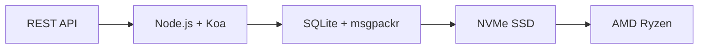

# 最初の完全なメールAPI：Forward Emailがメール管理を革命的に変えた方法 {#the-first-complete-email-api-how-forward-email-revolutionized-email-management}


<p class="lead mt-3">
  <strong>要約:</strong> 私たちは、他のどのサービスも提供していない高度な検索機能を備えた、世界初の完全なREST APIによるメール管理システムを構築しました。Gmail、Outlook、Appleが開発者をIMAPの地獄やレート制限されたAPIに追い込む一方で、Forward Emailは15以上の検索パラメータを備えた統一されたRESTインターフェースを通じて、メッセージ、フォルダ、連絡先、カレンダーのCRUD操作を超高速で提供します。これは開発者が待ち望んでいたメールAPIです。
</p>


## 目次 {#table-of-contents}

* [メールAPIの問題点](#the-email-api-problem)
* [開発者が実際に言っていること](#what-developers-are-actually-saying)
* [Forward Emailの革命的なソリューション](#forward-emails-revolutionary-solution)
  * [なぜこれを作ったのか](#why-we-built-this)
  * [シンプルな認証](#simple-authentication)
* [すべてを変える20のエンドポイント](#20-endpoints-that-change-everything)
  * [メッセージ（5つのエンドポイント）](#messages-5-endpoints)
  * [フォルダ（5つのエンドポイント）](#folders-5-endpoints)
  * [連絡先（5つのエンドポイント）](#contacts-5-endpoints)
  * [カレンダー（5つのエンドポイント）](#calendars-5-endpoints)
* [高度な検索：他のサービスとは比較にならない](#advanced-search-no-other-service-compares)
  * [検索APIの現状は壊れている](#the-search-api-landscape-is-broken)
  * [Forward Emailの革命的な検索API](#forward-emails-revolutionary-search-api)
  * [実際の検索例](#real-world-search-examples)
  * [パフォーマンスの利点](#performance-advantages)
  * [他にない検索機能](#search-features-no-one-else-has)
  * [開発者にとってなぜ重要か](#why-this-matters-for-developers)
  * [技術的な実装](#the-technical-implementation)
* [超高速パフォーマンスアーキテクチャ](#blazing-fast-performance-architecture)
  * [パフォーマンスベンチマーク](#performance-benchmarks)
  * [プライバシーファーストのアーキテクチャ](#privacy-first-architecture)
* [私たちが違う理由：完全比較](#why-were-different-the-complete-comparison)
  * [主要プロバイダーの制限](#major-provider-limitations)
  * [Forward Emailの利点](#forward-email-advantages)
  * [オープンソースの透明性問題](#the-open-source-transparency-problem)
* [30以上の実際の統合例](#30-real-world-integration-examples)
  * [1. WordPressのコンタクトフォーム強化](#1-wordpress-contact-form-enhancement)
  * [2. Zapierの代替となるメール自動化](#2-zapier-alternative-for-email-automation)
  * [3. CRMメール同期](#3-crm-email-synchronization)
  * [4. Eコマースの注文処理](#4-e-commerce-order-processing)
  * [5. サポートチケット統合](#5-support-ticket-integration)
  * [6. ニュースレター管理システム](#6-newsletter-management-system)
  * [7. メールベースのタスク管理](#7-email-based-task-management)
  * [8. マルチアカウントメール集約](#8-multi-account-email-aggregation)
  * [9. 高度なメール分析ダッシュボード](#9-advanced-email-analytics-dashboard)
  * [10. スマートメールアーカイブ](#10-smart-email-archiving)
  * [11. メールからカレンダーへの統合](#11-email-to-calendar-integration)
  * [12. メールバックアップとコンプライアンス](#12-email-backup-and-compliance)
  * [13. メールベースのコンテンツ管理](#13-email-based-content-management)
  * [14. メールテンプレート管理](#14-email-template-management)
  * [15. メールベースのワークフロー自動化](#15-email-based-workflow-automation)
  * [16. メールセキュリティ監視](#16-email-security-monitoring)
  * [17. メールベースのアンケート収集](#17-email-based-survey-collection)
  * [18. メールパフォーマンス監視](#18-email-performance-monitoring)
  * [19. メールベースのリード評価](#19-email-based-lead-qualification)
  * [20. メールベースのプロジェクト管理](#20-email-based-project-management)
  * [21. メールベースの在庫管理](#21-email-based-inventory-management)
  * [22. メールベースの請求書処理](#22-email-based-invoice-processing)
  * [23. メールベースのイベント登録](#23-email-based-event-registration)
  * [24. メールベースのドキュメント承認ワークフロー](#24-email-based-document-approval-workflow)
  * [25. メールベースの顧客フィードバック分析](#25-email-based-customer-feedback-analysis)
  * [26. メールベースの採用パイプライン](#26-email-based-recruitment-pipeline)
  * [27. メールベースの経費報告処理](#27-email-based-expense-report-processing)
  * [28. メールベースの品質保証報告](#28-email-based-quality-assurance-reporting)
  * [29. メールベースのベンダー管理](#29-email-based-vendor-management)
  * [30. メールベースのソーシャルメディア監視](#30-email-based-social-media-monitoring)
* [はじめに](#getting-started)
  * [1. Forward Emailアカウントを作成する](#1-create-your-forward-email-account)
  * [2. API認証情報を生成する](#2-generate-api-credentials)
  * [3. 最初のAPIコールを行う](#3-make-your-first-api-call)
  * [4. ドキュメントを探索する](#4-explore-the-documentation)
* [技術リソース](#technical-resources)
## メールAPIの問題 {#the-email-api-problem}

メールAPIは根本的に壊れています。以上です。

すべての主要なメールプロバイダーは開発者に次の2つのひどい選択肢のいずれかを強制します：

1. **IMAP地獄**：デスクトップクライアント向けに設計された30年前のプロトコルと格闘し、現代のアプリケーションには不向き
2. **制限されたAPI**：レート制限があり、読み取り専用で、OAuthが複雑なAPIで実際のメールデータを管理できない

結果は？開発者はメール統合を完全にあきらめるか、壊れやすいIMAPラッパーを何週間もかけて作成し続けるかのどちらかです。

> \[!WARNING]
> **汚い秘密**：ほとんどの「メールAPI」は単なる送信APIです。単純なRESTインターフェースでフォルダの整理、連絡先の同期、カレンダーの管理はプログラム的にできません。今までは。

## 開発者が実際に言っていること {#what-developers-are-actually-saying}

フラストレーションは現実で、あらゆるところで記録されています：

> 「最近アプリにGmailを統合しようとしましたが、時間をかけすぎました。Gmailをサポートする価値はないと判断しました。」
>
> *- [Hacker Newsの開発者](https://news.ycombinator.com/item?id=42106944)、147アップボート*

> 「すべてのメールAPIは平凡なの？どこか制限や制約があるように見えます。」
>
> *- [Reddit r/SaaSの議論](https://www.reddit.com/r/SaaS/comments/1cm84s7/are_all_email_apis_mediocre/)*

> 「なぜメール開発はこんなに面倒なのか？」
>
> *- [Reddit r/webdev](https://www.reddit.com/r/webdev/comments/15trnp2/why_does_email_development_have_to_suck/)、89件の開発者の苦悩コメント*

> 「Gmail APIがIMAPより効率的なのはなぜ？もう一つの理由は、Gmail APIは各メッセージを一度だけダウンロードすればよいからです。IMAPでは各メッセージをダウンロードしてインデックス化しなければなりません…」
>
> *- [Stack Overflowの質問](https://stackoverflow.com/questions/25431022/what-makes-the-gmail-api-more-efficient-than-imap)、47アップボート*

証拠はあらゆるところにあります：

* **WordPress SMTPの問題**：メール配信失敗に関する[631件のGitHubイシュー](https://github.com/awesomemotive/WP-Mail-SMTP/issues)
* **Zapierの制限**：[10通/時の制限やIMAP検出失敗に関するコミュニティの不満](https://community.zapier.com/featured-articles-65/email-parser-by-zapier-limitations-and-alternatives-16958)
* **IMAP APIプロジェクト**：IMAPをRESTに変換するために存在する[複数の](https://github.com/ewildgoose/imap-api) [オープンソース](https://emailengine.app/) [プロジェクト](https://www.npmjs.com/package/imapflow)、なぜならどのプロバイダーもこれを提供していないから
* **Gmail APIの不満**：[Stack Overflow](https://stackoverflow.com/questions/tagged/gmail-api)には「gmail-api」タグ付きの4,847件の質問があり、レート制限や複雑さに関する共通の不満がある

## Forward Emailの革命的な解決策 {#forward-emails-revolutionary-solution}

**私たちはすべてのメールデータに対して統一されたREST APIを通じて完全なCRUD操作を提供する最初のメールサービスです。**

これは単なる送信APIではありません。完全なプログラム制御が可能です：

* **メッセージ**：作成、読み取り、更新、削除、検索、移動、フラグ付け
* **フォルダ**：RESTエンドポイントを通じた完全なIMAPフォルダ管理
* **連絡先**：[CardDAV](https://tools.ietf.org/html/rfc6352)による連絡先の保存と同期
* **カレンダー**：[CalDAV](https://tools.ietf.org/html/rfc4791)によるカレンダーイベントとスケジューリング

### なぜこれを作ったのか {#why-we-built-this}

**問題点**：すべてのメールプロバイダーはメールをブラックボックスとして扱います。メールを送信できるかもしれませんし、複雑なOAuthで読み取ることもできますが、メールデータをプログラム的に*管理*することはできません。

**私たちのビジョン**：メールはどんな最新APIと同じくらい簡単に統合できるべきです。IMAPライブラリ不要。OAuthの複雑さ不要。レート制限の悪夢も不要。ただ動作するシンプルなRESTエンドポイントだけ。

**結果**：HTTPリクエストだけで完全なメールクライアント、CRM統合、または自動化システムを構築できる最初のメールサービス。

### シンプルな認証 {#simple-authentication}

[OAuthの複雑さ](https://oauth.net/2/)なし。[アプリ固有パスワード](https://support.google.com/accounts/answer/185833)なし。あなたのエイリアス認証情報だけ：

```bash
curl -u "alias@yourdomain.com:password" \
  https://api.forwardemail.net/v1/messages
```
## すべてを変える20のエンドポイント {#20-endpoints-that-change-everything}

### メッセージ（5つのエンドポイント） {#messages-5-endpoints}

* `GET /v1/messages` - フィルタリング付きメッセージ一覧取得（`?folder=`, `?is_unread=`, `?is_flagged=`）
* `POST /v1/messages` - 新しいメッセージをフォルダに直接送信
* `GET /v1/messages/:id` - 特定メッセージの完全なメタデータ取得
* `PUT /v1/messages/:id` - メッセージの更新（フラグ、フォルダ、既読状態）
* `DELETE /v1/messages/:id` - メッセージを完全に削除

### フォルダ（5つのエンドポイント） {#folders-5-endpoints}

* `GET /v1/folders` - すべてのフォルダと購読状況の一覧取得
* `POST /v1/folders` - カスタムプロパティ付きの新規フォルダ作成
* `GET /v1/folders/:id` - フォルダの詳細とメッセージ数取得
* `PUT /v1/folders/:id` - フォルダのプロパティと購読の更新
* `DELETE /v1/folders/:id` - フォルダ削除とメッセージの移動処理

### 連絡先（5つのエンドポイント） {#contacts-5-endpoints}

* `GET /v1/contacts` - 検索・ページネーション付き連絡先一覧取得
* `POST /v1/contacts` - フルvCard対応の新規連絡先作成
* `GET /v1/contacts/:id` - すべてのフィールドとメタデータ付き連絡先取得
* `PUT /v1/contacts/:id` - ETag検証付き連絡先情報の更新
* `DELETE /v1/contacts/:id` - カスケード処理付き連絡先削除

### カレンダー（5つのエンドポイント） {#calendars-5-endpoints}

* `GET /v1/calendars` - 日付フィルタリング付きカレンダーイベント一覧取得
* `POST /v1/calendars` - 参加者と繰り返し対応のカレンダーイベント作成
* `GET /v1/calendars/:id` - タイムゾーン対応のイベント詳細取得
* `PUT /v1/calendars/:id` - 競合検出付きイベント更新
* `DELETE /v1/calendars/:id` - 参加者通知付きイベント削除


## 高度な検索：他のサービスは比較にならない {#advanced-search-no-other-service-compares}

**Forward Emailは、すべてのメッセージフィールドにわたる包括的でプログラム可能な検索をREST APIで提供する唯一のメールサービスです。**

他のプロバイダーは基本的なフィルタリングしか提供していませんが、私たちはこれまでで最も高度なメール検索APIを構築しました。Gmail API、Outlook API、その他のサービスは私たちの検索機能に及びません。

### 検索APIの現状は壊れている {#the-search-api-landscape-is-broken}

**Gmail APIの検索制限:**

* ✅ 基本的な `q` パラメータのみ
* ❌ フィールド指定検索なし
* ❌ 日付範囲フィルタリングなし
* ❌ サイズベースのフィルタリングなし
* ❌ 添付ファイルフィルタリングなし
* ❌ Gmailの検索構文に限定

**Outlook APIの検索制限:**

* ✅ 基本的な `$search` パラメータ
* ❌ 高度なフィールド指定なし
* ❌ 複雑なクエリの組み合わせ不可
* ❌ 厳しいレート制限
* ❌ 複雑なOData構文が必要

**Apple iCloud:**

* ❌ APIは一切なし
* ❌ IMAP検索のみ（動作させられれば）

**ProtonMail & Tuta:**

* ❌ 公開APIなし
* ❌ プログラム可能な検索機能なし

### Forward Emailの革命的な検索API {#forward-emails-revolutionary-search-api}

**他のサービスにはない15以上の検索パラメータを提供しています：**

| 検索機能                      | Forward Email                          | Gmail API    | Outlook API        | その他 |
| ------------------------------ | -------------------------------------- | ------------ | ------------------ | ------ |
| **フィールド指定検索**          | ✅ 件名、本文、送信者、宛先、CC、ヘッダー | ❌            | ❌                  | ❌      |
| **複数フィールドの一般検索**    | ✅ 全フィールド対象の `?search=`       | ✅ 基本的な `q=` | ✅ 基本的な `$search=` | ❌      |
| **日付範囲フィルタリング**      | ✅ `?since=` & `?before=`               | ❌            | ❌                  | ❌      |
| **サイズベースのフィルタリング**| ✅ `?min_size=` & `?max_size=`          | ❌            | ❌                  | ❌      |
| **添付ファイルフィルタリング**  | ✅ `?has_attachments=true/false`        | ❌            | ❌                  | ❌      |
| **ヘッダー検索**                | ✅ `?headers=X-Priority`                | ❌            | ❌                  | ❌      |
| **メッセージID検索**            | ✅ `?message_id=abc123`                 | ❌            | ❌                  | ❌      |
| **複合フィルタ**                | ✅ 複数パラメータのANDロジック          | ❌            | ❌                  | ❌      |
| **大文字小文字を区別しない**    | ✅ すべての検索で対応                   | ✅            | ✅                  | ❌      |
| **ページネーション対応**        | ✅ すべての検索パラメータで動作         | ✅            | ✅                  | ❌      |
### 実際の検索例 {#real-world-search-examples}

**前四半期のすべての請求書を見つける:**

```bash
# Forward Email - シンプルで強力
GET /v1/messages?subject=invoice&since=2024-01-01T00:00:00Z&before=2024-04-01T00:00:00Z

# Gmail API - 制限された検索で不可能
# 日付範囲のフィルタリング不可

# Outlook API - 複雑なOData構文、機能制限あり
GET /me/messages?$search="invoice"&$filter=receivedDateTime ge 2024-01-01T00:00:00Z
```

**特定の送信者からの大きな添付ファイルを検索:**

```bash
# Forward Email - 包括的なフィルタリング
GET /v1/messages?from=finance@company.com&has_attachments=true&min_size=1000000

# Gmail API - サイズや添付ファイルでのプログラムによるフィルタリング不可
# Outlook API - サイズフィルタリング不可
# その他 - APIなし
```

**複雑な複数フィールド検索:**

```bash
# Forward Email - 高度なクエリ機能
GET /v1/messages?body=quarterly&from=manager&is_flagged=true&folder=Reports

# Gmail API - 基本的なテキスト検索のみ
GET /gmail/v1/users/me/messages?q=quarterly

# Outlook API - フィールド指定なしの基本検索
GET /me/messages?$search="quarterly"
```

### パフォーマンスの利点 {#performance-advantages}

**Forward Emailの検索パフォーマンス:**

* ⚡ **複雑な検索でも100ms未満の応答時間**
* 🔍 **適切なインデックスによる正規表現最適化**
* 📊 **カウントとデータの並列クエリ実行**
* 💾 **軽量クエリによる効率的なメモリ使用**

**競合他社のパフォーマンス問題:**

* 🐌 **Gmail API**: ユーザーごとに1秒あたり250クォータユニットのレート制限
* 🐌 **Outlook API**: 複雑なバックオフ要件を伴う厳しいスロットリング
* 🐌 **その他**: 比較可能なAPIなし

### 他にない検索機能 {#search-features-no-one-else-has}

#### 1. ヘッダー特定検索 {#1-header-specific-search}

```bash
# 特定のヘッダーを持つメッセージを検索
GET /v1/messages?headers=X-Priority:1
GET /v1/messages?headers=X-Spam-Score
```

#### 2. サイズベースのインテリジェンス {#2-size-based-intelligence}

```bash
# ニュースレターのメールを検索（通常大きい）
GET /v1/messages?min_size=50000&from=newsletter

# クイック返信を検索（通常小さい）
GET /v1/messages?max_size=1000&to=support
```

#### 3. 添付ファイルベースのワークフロー {#3-attachment-based-workflows}

```bash
# 法務チーム宛のすべてのドキュメントを検索
GET /v1/messages?to=legal&has_attachments=true&body=contract

# 添付ファイルなしのメールをクリーンアップ用に検索
GET /v1/messages?has_attachments=false&before=2023-01-01T00:00:00Z
```

#### 4. 複合ビジネスロジック {#4-combined-business-logic}

```bash
# 添付ファイル付きのVIPからの緊急フラグ付きメッセージを検索
GET /v1/messages?is_flagged=true&from=ceo&has_attachments=true&subject=urgent
```

### 開発者にとっての重要性 {#why-this-matters-for-developers}

**これまで不可能だったアプリケーションを構築:**

1. **高度なメール分析**: サイズ、送信者、内容によるメールパターン分析
2. **インテリジェントなメール管理**: 複雑な条件に基づく自動整理
3. **コンプライアンスとディスカバリー**: 法的要件に応じた特定メールの検索
4. **ビジネスインテリジェンス**: メール通信パターンからの洞察抽出
5. **自動化ワークフロー**: 高度なメールフィルターに基づくアクションのトリガー

### 技術的な実装 {#the-technical-implementation}

当社の検索APIは以下を使用:

* **適切なインデックス戦略による正規表現最適化**
* **パフォーマンス向上のための並列実行**
* **セキュリティのための入力検証**
* **信頼性のための包括的なエラーハンドリング**

```javascript
// 例: 複雑な検索の実装
const searchConditions = [];

if (ctx.query.subject) {
  searchConditions.push({
    subject: { $regex: ctx.query.subject, $options: 'i' }
  });
}

if (ctx.query.from) {
  searchConditions.push({
    $or: [
      { 'from.address': { $regex: ctx.query.from, $options: 'i' } },
      { 'from.name': { $regex: ctx.query.from, $options: 'i' } }
    ]
  });
}

// ANDロジックで結合
if (searchConditions.length > 0) {
  query.$and = searchConditions;
}
```

> \[!TIP]
> **開発者の利点**: Forward Emailの検索APIを使えば、REST APIのシンプルさを保ちながら、デスクトップクライアントに匹敵する機能を持つメールアプリケーションを構築できます。
## 超高速パフォーマンスアーキテクチャ {#blazing-fast-performance-architecture}

当社の技術スタックは速度と信頼性のために構築されています：


```mermaid
graph LR
    A[REST API] --> B[Node.js + Koa]
    B --> C[SQLite + msgpackr]
    C --> D[NVMe SSD]
    D --> E[AMD Ryzen]
```

### パフォーマンスベンチマーク {#performance-benchmarks}

**なぜ私たちは超高速なのか：**

| コンポーネント | 技術                                                                                 | パフォーマンスの利点                            |
| -------------- | ------------------------------------------------------------------------------------ | ---------------------------------------------- |
| **ストレージ** | [NVMe SSD](https://en.wikipedia.org/wiki/NVM_Express)                              | 従来のSATAより10倍高速                         |
| **データベース** | [SQLite](https://sqlite.org/) + [msgpackr](https://github.com/kriszyp/msgpackr)    | ネットワーク遅延ゼロ、最適化されたシリアライズ |
| **ハードウェア** | [AMD Ryzen](https://www.amd.com/en/products/processors/desktops/ryzen) ベアメタル  | 仮想化オーバーヘッドなし                        |
| **キャッシュ** | インメモリ + 永続化                                                                 | サブミリ秒の応答時間                            |
| **バックアップ** | [Cloudflare R2](https://www.cloudflare.com/products/r2/) 暗号化済み               | エンタープライズグレードの信頼性                |

**実際のパフォーマンス数値：**

* **API応答時間**：平均 < 50ms
* **メッセージ取得**：キャッシュ済みメッセージで < 10ms
* **フォルダー操作**：メタデータ操作で < 5ms
* **連絡先同期**：毎秒1000件以上
* **稼働率**：冗長インフラによる99.99% SLA

### プライバシーファーストアーキテクチャ {#privacy-first-architecture}

**ゼロ知識設計**：IMAPパスワードを持つあなただけがアクセス可能で、私たちはメールを読むことができません。当社の[ゼロ知識アーキテクチャ](https://forwardemail.net/en/security)は、超高速パフォーマンスを提供しながら完全なプライバシーを保証します。


## 私たちが違う理由：完全比較 {#why-were-different-the-complete-comparison}

### 主要プロバイダーの制限 {#major-provider-limitations}

| プロバイダー       | 主な問題点                              | 具体的な制限                                                                                                                                                                                                                                                                                                                                                                                                                                                      |
| ------------------ | ------------------------------------- | ----------------------------------------------------------------------------------------------------------------------------------------------------------------------------------------------------------------------------------------------------------------------------------------------------------------------------------------------------------------------------------------------------------------------------------------------------------------- |
| **Gmail API**      | 読み取り専用、複雑なOAuth、別API       | • [既存メッセージの変更不可](https://developers.google.com/gmail/api/reference/rest/v1/users.messages)<br>• [ラベル ≠ フォルダー](https://developers.google.com/gmail/api/reference/rest/v1/users.labels)<br>• [1日あたり10億クォータユニット制限](https://developers.google.com/gmail/api/reference/quota)<br>• 連絡先/カレンダーには[別APIが必要](https://developers.google.com/workspace)                                                           |
| **Outlook API**    | 廃止予定、混乱を招く、企業向け         | • [RESTエンドポイントは2024年3月に廃止予定](https://learn.microsoft.com/en-us/outlook/rest/compare-graph)<br>• [複数の混乱するAPI](https://learn.microsoft.com/en-us/office/client-developer/outlook/selecting-an-api-or-technology-for-developing-solutions-for-outlook)（EWS、Graph、REST）<br>• [Microsoft Graphの複雑さ](https://learn.microsoft.com/en-us/graph/overview)<br>• [厳しいスロットリング](https://learn.microsoft.com/en-us/graph/throttling) |
| **Apple iCloud**   | 公開APIなし                           | • [公開APIは一切なし](https://support.apple.com/en-us/102654)<br>• [IMAPのみで1日1000通の制限](https://support.apple.com/en-us/102654)<br>• [アプリ固有パスワードが必要](https://support.apple.com/en-us/102654)<br>• [1メッセージあたり500受信者の制限](https://support.apple.com/en-us/102654)                                                                                                                                              |
| **ProtonMail**     | APIなし、偽のオープンソース主張       | • [公開APIは利用不可](https://proton.me/support/protonmail-bridge-clients)<br>• IMAPアクセスには[Bridgeソフトウェアが必要](https://proton.me/mail/bridge)<br>• [「オープンソース」と主張](https://proton.me/blog/open-source)しているが[サーバーコードは独自](https://github.com/ProtonMail)<br>• [有料プラン限定](https://proton.me/pricing)                                                                                                         |
| **Tuta**           | APIなし、誤解を招く透明性             | • メール管理用の[REST APIなし](https://tuta.com/support#technical)<br>• [「オープンソース」と主張](https://tuta.com/blog/posts/open-source-email)しているが[バックエンドは非公開](https://github.com/tutao/tutanota)<br>• [IMAP/SMTP非対応](https://tuta.com/support#imap)<br>• [独自暗号化](https://tuta.com/encryption)により標準統合が不可能                                                                                               |
| **Zapier Email**   | 厳しいレート制限                     | • [1時間あたり10通の制限](https://help.zapier.com/hc/en-us/articles/8496181555597-Email-Parser-by-Zapier-limitations-and-alternatives)<br>• [IMAPフォルダーアクセスなし](https://help.zapier.com/hc/en-us/articles/8496181555597-Email-Parser-by-Zapier-limitations-and-alternatives)<br>• [限定的な解析機能](https://help.zapier.com/hc/en-us/articles/8496181555597-Email-Parser-by-Zapier-limitations-and-alternatives)                                 |
### 転送メールの利点 {#forward-email-advantages}

| 機能               | 転送メール                                                                                  | 競合                                     |
| ------------------ | -------------------------------------------------------------------------------------------- | ----------------------------------------- |
| **完全なCRUD**     | ✅ すべてのデータに対する作成、読み取り、更新、削除が可能                                    | ❌ 読み取り専用または限定的な操作           |
| **統合API**       | ✅ メッセージ、フォルダ、連絡先、カレンダーを1つのAPIで提供                                  | ❌ 別々のAPIまたは機能不足                   |
| **シンプル認証**   | ✅ エイリアス認証情報による基本認証                                                          | ❌ 複雑なOAuthで複数のスコープが必要         |
| **レート制限なし** | ✅ 実際のアプリケーション向けに設計された寛大な制限                                          | ❌ ワークフローを妨げる制限的なクォータ       |
| **セルフホスティング** | ✅ [完全なセルフホスティングオプション](https://forwardemail.net/en/blog/docs/self-hosted-solution) | ❌ ベンダーロックインのみ                     |
| **プライバシー**   | ✅ ゼロ知識、暗号化、プライベート                                                          | ❌ データマイニングとプライバシーの懸念       |
| **パフォーマンス** | ✅ 50ms未満の応答、NVMeストレージ                                                           | ❌ ネットワーク遅延、スロットリングによる遅延  |

### オープンソースの透明性問題 {#the-open-source-transparency-problem}

**ProtonMailとTutaは「オープンソース」かつ「透明性がある」としてマーケティングしていますが、これは現代のプライバシー原則に反する誤解を招く宣伝です。**

> \[!WARNING]
> **誤った透明性の主張**：ProtonMailとTutaは「オープンソース」を大々的に宣伝していますが、最も重要なサーバー側コードは独自で非公開のままです。

**ProtonMailの欺瞞：**

* **主張**：マーケティングで「[私たちはオープンソースです](https://proton.me/blog/open-source)」と強調
* **実態**：[サーバーコードは完全に独自](https://github.com/ProtonMail) - クライアントアプリのみがオープンソース
* **影響**：ユーザーはサーバー側の暗号化、データ処理、プライバシー主張を検証できない
* **透明性違反**：実際のメール処理と保存システムを監査する方法がない

**Tutaの誤解を招くマーケティング：**

* **主張**：「[オープンソースメール](https://tuta.com/blog/posts/open-source-email)」を主要な売りにしている
* **実態**：[バックエンドインフラはクローズドソース](https://github.com/tutao/tutanota) - フロントエンドのみ公開
* **影響**：独自の暗号化により標準メールプロトコル（IMAP/SMTP）が使えない
* **ロックイン戦略**：カスタム暗号化によりベンダー依存を強制

**なぜこれが現代のプライバシーに重要か：**

2025年には、真のプライバシーは**完全な透明性**を必要とします。メールプロバイダーが「オープンソース」と主張しながらサーバーコードを隠すと：

1. **検証不可能な暗号化**：データがどのように暗号化されているか監査できない
2. **隠されたデータ処理**：サーバー側のデータ処理がブラックボックスのまま
3. **信頼に基づくセキュリティ**：主張を検証せずに信頼しなければならない
4. **ベンダーロックイン**：独自システムによりデータ移行が困難

**Forward Emailの真の透明性：**

* ✅ **[完全なオープンソース](https://github.com/forwardemail/forwardemail.net)** - サーバーとクライアントコード
* ✅ **[セルフホスティング可能](https://forwardemail.net/en/blog/docs/self-hosted-solution)** - 自分のインスタンスを運用可能
* ✅ **標準プロトコル対応** - IMAP、SMTP、CardDAV、CalDAV対応
* ✅ **監査可能なセキュリティ** - すべてのコードを検査可能
* ✅ **ベンダーロックインなし** - あなたのデータ、あなたの管理

> \[!TIP]
> **本当のオープンソースとは、すべての主張を検証できることです。** Forward Emailなら暗号化を監査し、データ処理をレビューし、自分のインスタンスを運用できます。これが真の透明性です。


## 30以上の実世界統合例 {#30-real-world-integration-examples}

### 1. WordPressお問い合わせフォームの強化 {#1-wordpress-contact-form-enhancement}
**問題**: [WordPress SMTP 設定の失敗](https://github.com/awesomemotive/WP-Mail-SMTP/issues)（[631件のGitHub問題](https://github.com/awesomemotive/WP-Mail-SMTP/issues)）
**解決策**: 直接API統合により[SMTP](https://tools.ietf.org/html/rfc5321)を完全に回避

```javascript
// 送信済みフォルダに保存するWordPressのコンタクトフォーム
await fetch('https://api.forwardemail.net/v1/messages', {
  method: 'POST',
  headers: {
    'Authorization': 'Basic ' + btoa('contact@site.com:password'),
    'Content-Type': 'application/json'
  },
  body: JSON.stringify({
    to: [{ address: 'owner@site.com' }],
    subject: 'お問い合わせフォーム: ' + formData.subject,
    text: formData.message,
    folder: 'Sent'
  })
});
```

### 2. メール自動化のためのZapier代替 {#2-zapier-alternative-for-email-automation}

**問題**: [Zapierの1時間あたり10通のメール制限](https://help.zapier.com/hc/en-us/articles/8496181555597-Email-Parser-by-Zapier-limitations-and-alternatives)および[IMAP検出の失敗](https://community.zapier.com/featured-articles-65/email-parser-by-zapier-limitations-and-alternatives-16958)
**解決策**: 完全なメール制御による無制限の自動化

```javascript
// 送信者ドメインごとにメールを自動整理
const messages = await fetch('/v1/messages?folder=INBOX');
for (const message of messages) {
  const domain = message.from.split('@')[1];
  await fetch(`/v1/messages/${message.id}`, {
    method: 'PUT',
    body: JSON.stringify({ folder: `Clients/${domain}` })
  });
}
```

### 3. CRMメール同期 {#3-crm-email-synchronization}

**問題**: メールと[CRMシステム](https://en.wikipedia.org/wiki/Customer_relationship_management)間の手動連絡先管理
**解決策**: [CardDAV](https://tools.ietf.org/html/rfc6352)連絡先APIによる双方向同期

```javascript
// 新しいメール連絡先をCRMに同期
const newContacts = await fetch('/v1/contacts');
for (const contact of newContacts) {
  await crmAPI.createContact({
    name: contact.name,
    email: contact.email,
    source: 'email_api'
  });
}
```

### 4. Eコマース注文処理 {#4-e-commerce-order-processing}

**問題**: [Eコマースプラットフォーム](https://en.wikipedia.org/wiki/E-commerce)の注文メールの手動処理
**解決策**: 自動化された注文管理パイプライン

```javascript
// 注文確認メールを処理
const orders = await fetch('/v1/messages?folder=Orders');
const orderEmails = orders.filter(msg =>
  msg.subject.includes('Order Confirmation')
);

for (const order of orderEmails) {
  const orderData = parseOrderEmail(order.text);
  await updateInventory(orderData);
  await fetch(`/v1/messages/${order.id}`, {
    method: 'PUT',
    body: JSON.stringify({ folder: 'Orders/Processed' })
  });
}
```

### 5. サポートチケット統合 {#5-support-ticket-integration}

**問題**: [ヘルプデスクプラットフォーム](https://en.wikipedia.org/wiki/Help_desk_software)に散在するメールスレッド
**解決策**: 完全なメールスレッド追跡

```javascript
// メールスレッドからサポートチケットを作成
const messages = await fetch('/v1/messages?folder=Support');
const supportEmails = messages.filter(msg =>
  msg.to.some(addr => addr.includes('support@'))
);

for (const email of supportEmails) {
  const ticket = await supportSystem.createTicket({
    subject: email.subject,
    from: email.from,
    body: email.text,
    timestamp: email.date
  });
}
```

### 6. ニュースレター管理システム {#6-newsletter-management-system}

**問題**: 限られた[ニュースレタープラットフォーム](https://en.wikipedia.org/wiki/Email_marketing)統合
**解決策**: 完全な購読者ライフサイクル管理

```javascript
// ニュースレター購読管理の自動化
const messages = await fetch('/v1/messages?folder=Newsletter');
const unsubscribes = messages.filter(msg =>
  msg.subject.toLowerCase().includes('unsubscribe')
);

for (const msg of unsubscribes) {
  await removeSubscriber(msg.from);
  await fetch(`/v1/messages/${msg.id}`, {
    method: 'PUT',
    body: JSON.stringify({ folder: 'Newsletter/Unsubscribed' })
  });
}
```

### 7. メールベースのタスク管理 {#7-email-based-task-management}

**問題**: 受信箱の過負荷と[タスク追跡](https://en.wikipedia.org/wiki/Task_management)
**解決策**: メールを実行可能なタスクに変換
```javascript
// Create tasks from flagged emails
const messages = await fetch('/v1/messages?is_flagged=true');
for (const email of messages) {
  await taskManager.createTask({
    title: email.subject,
    description: email.text,
    assignee: email.to[0].address,
    dueDate: extractDueDate(email.text)
  });
}
```

### 8. Multi-Account Email Aggregation {#8-multi-account-email-aggregation}

**Problem**: Managing [multiple email accounts](https://en.wikipedia.org/wiki/Email_client) across providers
**Solution**: Unified inbox interface

```javascript
// Aggregate emails from multiple accounts
const accounts = ['work@domain.com', 'personal@domain.com'];
const allMessages = [];

for (const account of accounts) {
  const messages = await fetch('/v1/messages', {
    headers: { 'Authorization': getAuth(account) }
  });
  allMessages.push(...messages.map(m => ({ ...m, account })));
}
```

### 9. Advanced Email Analytics Dashboard {#9-advanced-email-analytics-dashboard}

**Problem**: No insights into [email patterns](https://en.wikipedia.org/wiki/Email_analytics) with sophisticated filtering
**Solution**: Custom email analytics using advanced search capabilities

```javascript
// Generate comprehensive email analytics using advanced search
const analytics = {};

// Analyze email volume by sender domain
const messages = await fetch('/v1/messages');
analytics.senderDomains = analyzeSenderDomains(messages);

// Find large attachments consuming storage
const largeAttachments = await fetch('/v1/messages?has_attachments=true&min_size=1000000');
analytics.storageHogs = largeAttachments.map(msg => ({
  subject: msg.subject,
  from: msg.from,
  size: msg.size
}));

// Analyze communication patterns with VIPs
const vipEmails = await fetch('/v1/messages?from=ceo@company.com');
const urgentVipEmails = await fetch('/v1/messages?from=ceo@company.com&subject=urgent');
analytics.vipCommunication = {
  total: vipEmails.length,
  urgent: urgentVipEmails.length,
  urgencyRate: (urgentVipEmails.length / vipEmails.length) * 100
};

// Find unread emails by date range for follow-up
const lastWeek = new Date(Date.now() - 7 * 24 * 60 * 60 * 1000).toISOString();
const unreadRecent = await fetch(`/v1/messages?is_unread=true&since=${lastWeek}`);
analytics.followUpNeeded = unreadRecent.length;

// Analyze email sizes for optimization
const smallEmails = await fetch('/v1/messages?max_size=1000');
const mediumEmails = await fetch('/v1/messages?min_size=1000&max_size=50000');
const largeEmails = await fetch('/v1/messages?min_size=50000');
analytics.sizeDistribution = {
  small: smallEmails.length,
  medium: mediumEmails.length,
  large: largeEmails.length
};

// Search for compliance-related emails
const complianceEmails = await fetch('/v1/messages?body=confidential&has_attachments=true');
analytics.complianceReview = complianceEmails.length;
```

### 10. Smart Email Archiving {#10-smart-email-archiving}

**Problem**: Manual [email organization](https://en.wikipedia.org/wiki/Email_management)
**Solution**: Intelligent email categorization

```javascript
// Auto-archive old emails by category
const messages = await fetch('/v1/messages');
const oldEmails = messages.filter(email =>
  isOlderThan(email.date, 90) // 90 days
);

for (const email of oldEmails) {
  const category = categorizeEmail(email);
  await fetch(`/v1/messages/${email.id}`, {
    method: 'PUT',
    body: JSON.stringify({ folder: `Archive/${category}` })
  });
}
```

### 11. Email-to-Calendar Integration {#11-email-to-calendar-integration}

**Problem**: Manual [calendar event](https://tools.ietf.org/html/rfc4791) creation from emails
**Solution**: Automatic event extraction and creation

```javascript
// Extract meeting details from emails
const messages = await fetch('/v1/messages?folder=Meetings');
const meetingEmails = messages.filter(email =>
  email.subject.toLowerCase().includes('meeting')
);

for (const email of meetingEmails) {
  const meetingData = extractMeetingInfo(email.text);
  if (meetingData.date && meetingData.time) {
    await fetch('/v1/calendars', {
      method: 'POST',
      body: JSON.stringify({
        title: email.subject,
        start: meetingData.datetime,
        attendees: [email.from, ...email.to]
      })
    });
  }
}
```

### 12. Email Backup and Compliance {#12-email-backup-and-compliance}

**問題**: [メール保持](https://en.wikipedia.org/wiki/Email_retention_policy) とコンプライアンス要件  
**解決策**: メタデータを保持した自動バックアップ

```javascript
// Backup emails with full metadata
const allMessages = await fetch('/v1/messages');
const backup = {
  timestamp: new Date(),
  messages: allMessages.map(msg => ({
    id: msg.id,
    subject: msg.subject,
    from: msg.from,
    to: msg.to,
    date: msg.date,
    flags: msg.flags
  }))
};
await saveToComplianceStorage(backup);
```

### 13. Email-Based Content Management {#13-email-based-content-management}

**問題**: [CMSプラットフォーム](https://en.wikipedia.org/wiki/Content_management_system)向けのメールによるコンテンツ提出の管理  
**解決策**: コンテンツ管理システムとしてのメール利用

```javascript
// Process content submissions from email
const messages = await fetch('/v1/messages?folder=Submissions');
const submissions = messages.filter(msg =>
  msg.to.some(addr => addr.includes('submit@'))
);

for (const submission of submissions) {
  const content = parseSubmission(submission.text);
  await cms.createDraft({
    title: submission.subject,
    content: content.body,
    author: submission.from
  });
}
```

### 14. Email Template Management {#14-email-template-management}

**問題**: チーム内での[メールテンプレート](https://en.wikipedia.org/wiki/Email_template)の不統一  
**解決策**: APIによる集中管理テンプレートシステム

```javascript
// Send templated emails with dynamic content
const template = await getEmailTemplate('welcome');
await fetch('/v1/messages', {
  method: 'POST',
  body: JSON.stringify({
    to: [{ address: newUser.email }],
    subject: template.subject.replace('{{name}}', newUser.name),
    html: template.html.replace('{{name}}', newUser.name),
    folder: 'Sent'
  })
});
```

### 15. Email-Based Workflow Automation {#15-email-based-workflow-automation}

**問題**: メールによる手動の[承認プロセス](https://en.wikipedia.org/wiki/Workflow)  
**解決策**: 自動化されたワークフロートリガー

```javascript
// Process approval emails
const messages = await fetch('/v1/messages?folder=Approvals');
const approvals = messages.filter(msg =>
  msg.subject.includes('APPROVAL')
);

for (const approval of approvals) {
  const decision = parseApprovalDecision(approval.text);
  await workflow.processApproval({
    requestId: extractRequestId(approval.subject),
    decision: decision,
    approver: approval.from
  });
}
```

### 16. Email Security Monitoring {#16-email-security-monitoring}

**問題**: 手動による[セキュリティ脅威検出](https://en.wikipedia.org/wiki/Email_security)  
**解決策**: 自動化された脅威分析

```javascript
// Monitor for suspicious emails
const recentEmails = await fetch('/v1/messages');
for (const email of recentEmails) {
  const threatScore = analyzeThreat(email);
  if (threatScore > 0.8) {
    await fetch(`/v1/messages/${email.id}`, {
      method: 'PUT',
      body: JSON.stringify({ folder: 'Security/Quarantine' })
    });
    await alertSecurityTeam(email);
  }
}
```

### 17. Email-Based Survey Collection {#17-email-based-survey-collection}

**問題**: 手動による[アンケート回答](https://en.wikipedia.org/wiki/Survey_methodology)の処理  
**解決策**: 自動化された回答集計

```javascript
// Collect and process survey responses
const messages = await fetch('/v1/messages?folder=Surveys');
const responses = messages.filter(msg =>
  msg.subject.includes('Survey Response')
);

const surveyData = responses.map(email => ({
  respondent: email.from,
  responses: parseSurveyData(email.text),
  timestamp: email.date
}));
await updateSurveyResults(surveyData);
```

### 18. Email Performance Monitoring {#18-email-performance-monitoring}

**問題**: [メール配信パフォーマンス](https://en.wikipedia.org/wiki/Email_deliverability)の可視化不足  
**解決策**: リアルタイムのメール指標

```javascript
// Monitor email delivery performance
const sentEmails = await fetch('/v1/messages?folder=Sent');
const deliveryStats = {
  sent: sentEmails.length,
  bounces: await countBounces(),
  deliveryRate: calculateDeliveryRate()
};
await updateDashboard(deliveryStats);
```
### 19. メールベースのリード評価 {#19-email-based-lead-qualification}

**問題**: メールのやり取りからの手動による[リードスコアリング](https://en.wikipedia.org/wiki/Lead_scoring)  
**解決策**: 自動化されたリード評価パイプライン

```javascript
// メールのエンゲージメントに基づいてリードをスコアリング
const prospects = await fetch('/v1/contacts');
for (const prospect of prospects) {
  const messages = await fetch('/v1/messages');
  const emails = messages.filter(msg =>
    msg.from.includes(prospect.email)
  );
  const score = calculateEngagementScore(emails);
  await crm.updateLeadScore(prospect.id, score);
}
```

### 20. メールベースのプロジェクト管理 {#20-email-based-project-management}

**問題**: メールスレッドに散在する[プロジェクト更新](https://en.wikipedia.org/wiki/Project_management)  
**解決策**: 集中管理されたプロジェクトコミュニケーションハブ

```javascript
// メールからプロジェクト更新を抽出
const messages = await fetch('/v1/messages?folder=Projects');
const projectEmails = messages.filter(msg =>
  msg.subject.includes('Project Update')
);

for (const email of projectEmails) {
  const update = parseProjectUpdate(email.text);
  await projectManager.addUpdate({
    project: update.projectId,
    author: email.from,
    content: update.content
  });
}
```

### 21. メールベースの在庫管理 {#21-email-based-inventory-management}

**問題**: 仕入先からのメールによる手動の在庫更新  
**解決策**: メール通知からの自動在庫追跡

```javascript
// 仕入先メールからの在庫更新を処理
const messages = await fetch('/v1/messages?folder=Suppliers');
const inventoryEmails = messages.filter(msg =>
  msg.subject.includes('Inventory Update') || msg.subject.includes('Stock Alert')
);

for (const email of inventoryEmails) {
  const inventoryData = parseInventoryUpdate(email.text);
  await inventory.updateStock({
    sku: inventoryData.sku,
    quantity: inventoryData.quantity,
    supplier: email.from,
    timestamp: email.date
  });

  // 処理済みフォルダへ移動
  await fetch(`/v1/messages/${email.id}`, {
    method: 'PUT',
    body: JSON.stringify({ folder: 'Suppliers/Processed' })
  });
}
```

### 22. メールベースの請求書処理 {#22-email-based-invoice-processing}

**問題**: 手動の[請求書処理](https://en.wikipedia.org/wiki/Invoice_processing)および会計システム連携  
**解決策**: 請求書の自動抽出と会計システム同期

```javascript
// メール添付ファイルから請求書データを抽出
const messages = await fetch('/v1/messages?folder=Invoices');
const invoiceEmails = messages.filter(msg =>
  msg.subject.toLowerCase().includes('invoice') && msg.attachments.length > 0
);

for (const email of invoiceEmails) {
  const invoiceData = await extractInvoiceData(email.attachments[0]);
  await accounting.createInvoice({
    vendor: email.from,
    amount: invoiceData.total,
    dueDate: invoiceData.dueDate,
    items: invoiceData.lineItems
  });

  // 処理済みとしてフラグを設定
  await fetch(`/v1/messages/${email.id}`, {
    method: 'PUT',
    body: JSON.stringify({ flags: ['\\Seen', '\\Flagged'] })
  });
}
```

### 23. メールベースのイベント登録 {#23-email-based-event-registration}

**問題**: メール返信による手動の[イベント登録](https://en.wikipedia.org/wiki/Event_management)処理  
**解決策**: 自動化された参加者管理とカレンダー連携

```javascript
// イベント登録メールを処理
const messages = await fetch('/v1/messages?folder=Events');
const registrations = messages.filter(msg =>
  msg.subject.includes('Registration') || msg.subject.includes('RSVP')
);

for (const registration of registrations) {
  const attendeeData = parseRegistration(registration.text);

  // 参加者リストに追加
  await events.addAttendee({
    event: attendeeData.eventId,
    name: attendeeData.name,
    email: registration.from,
    dietary: attendeeData.dietaryRestrictions
  });

  // 参加者用のカレンダーイベントを作成
  await fetch('/v1/calendars', {
    method: 'POST',
    body: JSON.stringify({
      title: attendeeData.eventName,
      start: attendeeData.eventDate,
      attendees: [registration.from]
    })
  });
}
```
### 24. メールベースの文書承認ワークフロー {#24-email-based-document-approval-workflow}

**問題**: 複雑なメールによる[文書承認](https://en.wikipedia.org/wiki/Document_management_system)チェーン  
**解決策**: 承認追跡と文書バージョン管理の自動化

```javascript
// Track document approval workflow
const messages = await fetch('/v1/messages?folder=Approvals');
const approvalEmails = messages.filter(msg =>
  msg.subject.includes('Document Approval')
);

for (const email of approvalEmails) {
  const approval = parseApprovalEmail(email.text);

  await documentSystem.updateApproval({
    documentId: approval.documentId,
    approver: email.from,
    status: approval.decision, // 'approved', 'rejected', 'needs_changes'
    comments: approval.comments,
    timestamp: email.date
  });

  // Check if all approvals complete
  const document = await documentSystem.getDocument(approval.documentId);
  if (document.allApprovalsComplete) {
    await documentSystem.finalizeDocument(approval.documentId);
  }
}
```

### 25. メールベースの顧客フィードバック分析 {#25-email-based-customer-feedback-analysis}

**問題**: 手動による[顧客フィードバック](https://en.wikipedia.org/wiki/Customer_feedback)収集と感情分析  
**解決策**: フィードバック処理と感情追跡の自動化

```javascript
// Analyze customer feedback from emails
const messages = await fetch('/v1/messages?folder=Feedback');
const feedbackEmails = messages.filter(msg =>
  msg.to.some(addr => addr.includes('feedback@'))
);

for (const email of feedbackEmails) {
  const sentiment = await analyzeSentiment(email.text);
  const category = categorizeFeeback(email.text);

  await feedback.recordFeedback({
    customer: email.from,
    content: email.text,
    sentiment: sentiment.score, // -1 to 1
    category: category, // 'bug', 'feature', 'complaint', 'praise'
    priority: calculatePriority(sentiment, category),
    timestamp: email.date
  });

  // Auto-escalate negative feedback
  if (sentiment.score < -0.5) {
    await escalateToSupport(email);
  }
}
```

### 26. メールベースの採用パイプライン {#26-email-based-recruitment-pipeline}

**問題**: 手動による[採用](https://en.wikipedia.org/wiki/Recruitment)と候補者管理  
**解決策**: 候補者管理と面接スケジューリングの自動化

```javascript
// Process job application emails
const messages = await fetch('/v1/messages?folder=Careers');
const applications = messages.filter(msg =>
  msg.subject.toLowerCase().includes('application') && msg.attachments.length > 0
);

for (const application of applications) {
  const resume = await parseResume(application.attachments[0]);

  const candidate = await ats.createCandidate({
    name: resume.name,
    email: application.from,
    skills: resume.skills,
    experience: resume.experience,
    position: extractPosition(application.subject)
  });

  // Auto-schedule screening if qualified
  if (candidate.qualificationScore > 0.7) {
    await calendar.scheduleInterview({
      candidateId: candidate.id,
      type: 'phone_screening',
      duration: 30
    });
  }
}
```

### 27. メールベースの経費報告処理 {#27-email-based-expense-report-processing}

**問題**: 手動による[経費報告](https://en.wikipedia.org/wiki/Expense_report)の提出と承認  
**解決策**: 経費抽出と承認ワークフローの自動化

```javascript
// Process expense report emails
const messages = await fetch('/v1/messages?folder=Expenses');
const expenseEmails = messages.filter(msg =>
  msg.subject.includes('Expense') && msg.attachments.length > 0
);

for (const email of expenseEmails) {
  const receipts = await processReceipts(email.attachments);

  const expenseReport = await expenses.createReport({
    employee: email.from,
    expenses: receipts.map(receipt => ({
      amount: receipt.total,
      category: receipt.category,
      date: receipt.date,
      merchant: receipt.merchant
    })),
    totalAmount: receipts.reduce((sum, r) => sum + r.total, 0)
  });

  // Auto-approve small amounts
  if (expenseReport.totalAmount < 100) {
    await expenses.approve(expenseReport.id);
  } else {
    await expenses.sendForApproval(expenseReport.id);
  }
}
```
### 28. Email-Based Quality Assurance Reporting {#28-email-based-quality-assurance-reporting}

**問題**: 手動の[品質保証](https://en.wikipedia.org/wiki/Quality_assurance)問題追跡  
**解決策**: 自動化されたQA問題管理とバグ追跡

```javascript
// Process QA bug reports from email
const messages = await fetch('/v1/messages?folder=QA');
const bugReports = messages.filter(msg =>
  msg.subject.includes('Bug Report') || msg.subject.includes('QA Issue')
);

for (const report of bugReports) {
  const bugData = parseBugReport(report.text);

  const ticket = await bugTracker.createIssue({
    title: report.subject,
    description: bugData.description,
    severity: bugData.severity,
    steps: bugData.stepsToReproduce,
    reporter: report.from,
    attachments: report.attachments
  });

  // Auto-assign based on component
  const assignee = await getComponentOwner(bugData.component);
  await bugTracker.assign(ticket.id, assignee);

  // Create calendar reminder for follow-up
  await fetch('/v1/calendars', {
    method: 'POST',
    body: JSON.stringify({
      title: `Follow up on ${ticket.id}`,
      start: addDays(new Date(), 3),
      attendees: [assignee]
    })
  });
}
```

### 29. Email-Based Vendor Management {#29-email-based-vendor-management}

**問題**: 手動の[ベンダーコミュニケーション](https://en.wikipedia.org/wiki/Vendor_management)および契約追跡  
**解決策**: 自動化されたベンダー関係管理

```javascript
// Track vendor communications and contracts
const messages = await fetch('/v1/messages?folder=Vendors');
const vendorEmails = messages.filter(msg =>
  isVendorEmail(msg.from)
);

for (const email of vendorEmails) {
  const vendor = await vendors.getByEmail(email.from);

  // Log communication
  await vendors.logCommunication({
    vendorId: vendor.id,
    type: 'email',
    subject: email.subject,
    content: email.text,
    timestamp: email.date
  });

  // Check for contract-related keywords
  if (email.text.includes('contract') || email.text.includes('renewal')) {
    await vendors.flagForContractReview({
      vendorId: vendor.id,
      emailId: email.id,
      priority: 'high'
    });

    // Create task for procurement team
    await tasks.create({
      title: `Review contract communication from ${vendor.name}`,
      assignee: 'procurement@company.com',
      dueDate: addDays(new Date(), 2)
    });
  }
}
```

### 30. Email-Based Social Media Monitoring {#30-email-based-social-media-monitoring}

**問題**: 手動の[ソーシャルメディア](https://en.wikipedia.org/wiki/Social_media_monitoring)言及追跡と対応  
**解決策**: 自動化されたソーシャルメディアアラート処理と対応調整

```javascript
// Process social media alerts from email notifications
const messages = await fetch('/v1/messages?folder=Social');
const socialAlerts = messages.filter(msg =>
  msg.from.includes('alerts@') || msg.subject.includes('Social Mention')
);

for (const alert of socialAlerts) {
  const mention = parseSocialMention(alert.text);

  await socialMedia.recordMention({
    platform: mention.platform,
    author: mention.author,
    content: mention.content,
    sentiment: mention.sentiment,
    reach: mention.followerCount,
    url: mention.url
  });

  // Auto-escalate negative mentions with high reach
  if (mention.sentiment < -0.5 && mention.followerCount > 10000) {
    await socialMedia.escalateToTeam({
      mentionId: mention.id,
      priority: 'urgent',
      assignee: 'social-media-manager@company.com'
    });

    // Create calendar reminder for immediate response
    await fetch('/v1/calendars', {
      method: 'POST',
      body: JSON.stringify({
        title: `Urgent: Respond to negative social mention`,
        start: addMinutes(new Date(), 30),
        attendees: ['social-media-manager@company.com']
      })
    });
  }
}
```


## Getting Started {#getting-started}

### 1. Create Your Forward Email Account {#1-create-your-forward-email-account}

[forwardemail.net](https://forwardemail.net) にサインアップし、ドメインを確認してください。

### 2. Generate API Credentials {#2-generate-api-credentials}

あなたのエイリアスメールとパスワードがAPI認証情報として機能します — 追加の設定は不要です。
### 3. 最初のAPIコールを行う {#3-make-your-first-api-call}

```bash
# メッセージを一覧表示する
curl -u "your-alias@domain.com:password" \
  https://api.forwardemail.net/v1/messages

# 新しい連絡先を作成する
curl -u "your-alias@domain.com:password" \
  -X POST \
  -H "Content-Type: application/json" \
  -d '{"fullName":"John Doe","emails":[{"value":"john@example.com"}]}' \
  https://api.forwardemail.net/v1/contacts
```

### 4. ドキュメントを探る {#4-explore-the-documentation}

完全なAPIドキュメントとインタラクティブな例については、[forwardemail.net/en/email-api](https://forwardemail.net/en/email-api) をご覧ください。


## 技術リソース {#technical-resources}

* **[完全なAPIドキュメント](https://forwardemail.net/en/email-api)** - インタラクティブなOpenAPI 3.0仕様
* **[セルフホスティングガイド](https://forwardemail.net/en/blog/docs/self-hosted-solution)** - Forward Emailをあなたのインフラにデプロイする方法
* **[セキュリティホワイトペーパー](https://forwardemail.net/technical-whitepaper.pdf)** - 技術的アーキテクチャとセキュリティの詳細
* **[GitHubリポジトリ](https://github.com/forwardemail/forwardemail.net)** - オープンソースコードベース
* **[開発者サポート](mailto:api@forwardemail.net)** - エンジニアリングチームへの直接アクセス

---

**メール統合を革新する準備はできましたか？** [Forward EmailのAPIで今すぐ構築を始めましょう](https://forwardemail.net/en/email-api) 。開発者のために設計された初の完全なメール管理プラットフォームを体験してください。

*Forward Email: APIを本当に理解したメールサービス。*
