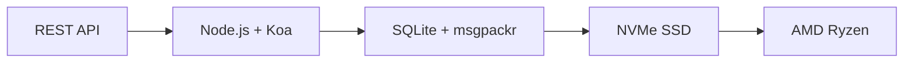

# 최초의 완전한 이메일 API: Forward Email이 이메일 관리에 혁신을 가져온 방법 {#the-first-complete-email-api-how-forward-email-revolutionized-email-management}


<p class="lead mt-3">
<strong>요약:</strong> 저희는 다른 어떤 서비스도 제공하지 않는 고급 검색 기능을 갖춘 세계 최초의 이메일 관리용 REST API를 구축했습니다. Gmail, Outlook, Apple은 개발자에게 IMAP 지옥이나 속도 제한 API를 강요하는 반면, Forward Email은 15개 이상의 검색 매개변수를 갖춘 통합 REST 인터페이스를 통해 메시지, 폴더, 연락처 및 캘린더에 대한 초고속 CRUD 작업을 제공합니다. 이것이 바로 이메일 API 개발자들이 기다려온 것입니다.
</p>

## 목차 {#table-of-contents}

* [이메일 API 문제](#the-email-api-problem)
* [개발자들이 실제로 말하는 것](#what-developers-are-actually-saying)
* [Forward Email의 혁신적인 솔루션](#forward-emails-revolutionary-solution)
  * [우리가 이것을 만든 이유](#why-we-built-this)
  * [간단한 인증](#simple-authentication)
* [모든 것을 바꾸는 20가지 엔드포인트](#20-endpoints-that-change-everything)
  * [메시지(5개 엔드포인트)](#messages-5-endpoints)
  * [폴더(5개 엔드포인트)](#folders-5-endpoints)
  * [연락처(5개 엔드포인트)](#contacts-5-endpoints)
  * [캘린더(5개 엔드포인트)](#calendars-5-endpoints)
* [고급 검색: 다른 서비스와 비교할 수 없습니다](#advanced-search-no-other-service-compares)
  * [검색 API 환경이 망가졌습니다](#the-search-api-landscape-is-broken)
  * [Forward Email의 혁신적인 검색 API](#forward-emails-revolutionary-search-api)
  * [실제 검색 예시](#real-world-search-examples)
  * [성능 이점](#performance-advantages)
  * [다른 누구도 가지고 있지 않은 검색 기능](#search-features-no-one-else-has)
  * [이것이 개발자에게 중요한 이유](#why-this-matters-for-developers)
  * [기술 구현](#the-technical-implementation)
* [초고속 성능 아키텍처](#blazing-fast-performance-architecture)
  * [성능 벤치마크](#performance-benchmarks)
  * [개인 정보 보호 우선 아키텍처](#privacy-first-architecture)
* [우리가 다른 이유: 완벽한 비교](#why-were-different-the-complete-comparison)
  * [주요 공급자 제한 사항](#major-provider-limitations)
  * [전달 이메일의 장점](#forward-email-advantages)
  * [오픈소스 투명성 문제](#the-open-source-transparency-problem)
* [30개 이상의 실제 통합 사례](#30-real-world-integration-examples)
  * [1. WordPress 연락처 양식 개선](#1-wordpress-contact-form-enhancement)
  * [2. 이메일 자동화를 위한 Zapier 대안](#2-zapier-alternative-for-email-automation)
  * [3. CRM 이메일 동기화](#3-crm-email-synchronization)
  * [4. 전자상거래 주문 처리](#4-e-commerce-order-processing)
  * [5. 지원 티켓 통합](#5-support-ticket-integration)
  * [6. 뉴스레터 관리 시스템](#6-newsletter-management-system)
  * [7. 이메일 기반 작업 관리](#7-email-based-task-management)
  * [8. 다중 계정 이메일 집계](#8-multi-account-email-aggregation)
  * [9. 고급 이메일 분석 대시보드](#9-advanced-email-analytics-dashboard)
  * [10. 스마트 이메일 보관](#10-smart-email-archiving)
  * [11. 이메일-캘린더 통합](#11-email-to-calendar-integration)
  * [12. 이메일 백업 및 규정 준수](#12-email-backup-and-compliance)
  * [13. 이메일 기반 콘텐츠 관리](#13-email-based-content-management)
  * [14. 이메일 템플릿 관리](#14-email-template-management)
  * [15. 이메일 기반 워크플로 자동화](#15-email-based-workflow-automation)
  * [16. 이메일 보안 모니터링](#16-email-security-monitoring)
  * [17. 이메일 기반 설문조사 수집](#17-email-based-survey-collection)
  * [18. 이메일 성능 모니터링](#18-email-performance-monitoring)
  * [19. 이메일 기반 리드 자격 심사](#19-email-based-lead-qualification)
  * [20. 이메일 기반 프로젝트 관리](#20-email-based-project-management)
  * [21. 이메일 기반 재고 관리](#21-email-based-inventory-management)
  * [22. 이메일 기반 송장 처리](#22-email-based-invoice-processing)
  * [23. 이메일 기반 이벤트 등록](#23-email-based-event-registration)
  * [24. 이메일 기반 문서 승인 워크플로](#24-email-based-document-approval-workflow)
  * [25. 이메일 기반 고객 피드백 분석](#25-email-based-customer-feedback-analysis)
  * [26. 이메일 기반 채용 파이프라인](#26-email-based-recruitment-pipeline)
  * [27. 이메일 기반 경비 보고서 처리](#27-email-based-expense-report-processing)
  * [28. 이메일 기반 품질 보증 보고](#28-email-based-quality-assurance-reporting)
  * [29. 이메일 기반 공급업체 관리](#29-email-based-vendor-management)
  * [30. 이메일 기반 소셜 미디어 모니터링](#30-email-based-social-media-monitoring)
* [시작하기](#getting-started)
  * [1. 전달 이메일 계정 만들기](#1-create-your-forward-email-account)
  * [2. API 자격 증명 생성](#2-generate-api-credentials)
  * [3. 첫 번째 API 호출하기](#3-make-your-first-api-call)
  * [4. 문서 탐색](#4-explore-the-documentation)
* [기술 리소스](#technical-resources)

## 이메일 API 문제 {#the-email-api-problem}

이메일 API는 근본적으로 망가졌습니다. 끝.

모든 주요 이메일 제공업체는 개발자에게 두 가지 끔찍한 선택 중 하나를 강요합니다.

1. **IMAP 지옥**: 최신 애플리케이션이 아닌 데스크톱 클라이언트용으로 설계된 30년 된 프로토콜과의 씨름
2. **불완전한 API**: 실제 이메일 데이터를 관리할 수 없는 속도 제한적이고 읽기 전용이며 OAuth가 복잡한 API

그 결과는? 개발자들은 이메일 통합을 완전히 포기하거나, 끊임없이 중단되는 취약한 IMAP 래퍼를 개발하는 데 몇 주를 허비하게 됩니다.

> \[!WARNING]
> **불길한 비밀**: 대부분의 "이메일 API"는 단순히 전송 API일 뿐입니다. 간단한 REST 인터페이스를 통해 폴더를 프로그래밍 방식으로 정리하거나, 연락처를 동기화하거나, 캘린더를 관리할 수는 없습니다. 지금까지는 말이죠.

## 개발자들이 실제로 말하는 내용 {#what-developers-are-actually-saying}

좌절감은 실제적이며 모든 곳에서 기록되어 있습니다.

> "최근 앱에 Gmail을 통합하려고 했는데, 너무 많은 시간을 투자했습니다. Gmail을 지원하는 것이 가치 없다고 판단했습니다."
>
> *- [해커 뉴스 개발자](https://news.ycombinator.com/item?id=42106944), 147개 추천*

> "모든 이메일 API가 평범한가요? 어떤 면에서는 제한적이거나 제약이 많은 것 같습니다."
>
> *- [Reddit r/SaaS 토론](https://www.reddit.com/r/SaaS/comments/1cm84s7/are_all_email_apis_mediocre/)*

> "이메일 개발은 왜 이렇게 어려워야 하죠?"
>
> *- [레딧 r/webdev](https://www.reddit.com/r/webdev/comments/15trnp2/why_does_email_development_have_to_suck/), 개발자의 고민에 대한 댓글 89개*

> "Gmail API가 IMAP보다 효율적인 이유는 무엇일까요? Gmail API가 훨씬 더 효율적인 또 다른 이유는 각 메시지를 한 번만 다운로드하면 되기 때문입니다. IMAP을 사용하면 각 메시지를 다운로드하고 색인을 생성해야 합니다..."
>
> *- [스택 오버플로 질문](https://stackoverflow.com/questions/25431022/what-makes-the-gmail-api-more-efficient-than-imap) (좋아요 47개)*

증거는 어디에나 있습니다.

* **WordPress SMTP 문제**: 이메일 전송 실패 관련 [631개의 GitHub 이슈](https://github.com/awesomemotive/WP-Mail-SMTP/issues)
* **Zapier 제한 사항**: [지역 사회 불만](https://community.zapier.com/featured-articles-65/email-parser-by-zapier-limitations-and-alternatives-16958): 시간당 최대 10개 이메일 제한 및 IMAP 감지 실패 관련
* **IMAP API 프로젝트**: [다수의](https://github.com/ewildgoose/imap-api) [오픈소스](https://emailengine.app/) [프로젝트](https://www.npmjs.com/package/imapflow): "IMAP을 REST로 변환"을 위한 프로젝트로, 이 기능을 제공하는 공급업체가 없습니다.
* **Gmail API 관련 불만 사항**: [스택 오버플로](https://stackoverflow.com/questions/tagged/gmail-api)에는 "gmail-api" 태그가 달린 질문 4,847개가 있으며, 속도 제한 및 복잡성에 대한 일반적인 불만이 있습니다.

## 이메일 전달의 혁신적인 솔루션 {#forward-emails-revolutionary-solution}

**우리는 통합 REST API를 통해 모든 이메일 데이터에 대한 완전한 CRUD 작업을 제공하는 최초의 이메일 서비스입니다.**

이건 단순한 전송 API가 아닙니다. 다음 항목에 대한 완벽한 프로그래밍 제어가 가능합니다.

* **메시지**: 생성, 읽기, 업데이트, 삭제, 검색, 이동, 플래그 지정
* **폴더**: REST 엔드포인트를 통한 전체 IMAP 폴더 관리
* **연락처**: [카드다브](https://tools.ietf.org/html/rfc6352): 연락처 저장 및 동기화
* **캘린더**: [칼다브](https://tools.ietf.org/html/rfc4791): 캘린더 이벤트 및 일정 관리

### 우리가 이것을 만든 이유 {#why-we-built-this}

**문제**: 모든 이메일 제공업체는 이메일을 블랙박스처럼 취급합니다. 복잡한 OAuth를 사용하여 이메일을 보내고 읽을 수는 있지만, 이메일 데이터를 프로그래밍 방식으로 *관리*할 수는 없습니다.

**비전**: 이메일은 최신 API처럼 쉽게 통합할 수 있어야 합니다. IMAP 라이브러리도, OAuth의 복잡성도, 속도 제한의 악몽도 없습니다. 작동하는 간단한 REST 엔드포인트만 있으면 됩니다.

**결과**: HTTP 요청만을 사용하여 완벽한 이메일 클라이언트, CRM 통합 또는 자동화 시스템을 구축할 수 있는 최초의 이메일 서비스입니다.

### 간단 인증 {#simple-authentication}

[OAuth 복잡성](https://oauth.net/2/)이 없습니다. [앱별 비밀번호](https://support.google.com/accounts/answer/185833)이 없습니다. 별칭 자격 증명만 있습니다.

```bash
curl -u "alias@yourdomain.com:password" \
  https://api.forwardemail.net/v1/messages
```

## 모든 것을 바꾸는 20가지 엔드포인트 {#20-endpoints-that-change-everything}

### 메시지(5개 엔드포인트) {#messages-5-endpoints}

* `GET /v1/messages` - 필터링을 사용하여 메시지 목록 표시(`?folder=`, `?is_unread=`, `?is_flagged=`)
* `POST /v1/messages` - 새 메시지를 폴더로 직접 전송
* `GET /v1/messages/:id` - 전체 메타데이터를 포함한 특정 메시지 검색
* `PUT /v1/messages/:id` - 메시지 업데이트(플래그, 폴더, 읽음 상태)
* `DELETE /v1/messages/:id` - 메시지 영구 삭제

### 폴더(5개 엔드포인트) {#folders-5-endpoints}

* `GET /v1/folders` - 구독 상태가 있는 모든 폴더 나열
* `POST /v1/folders` - 사용자 지정 속성을 사용하여 새 폴더 생성
* `GET /v1/folders/:id` - 폴더 세부 정보 및 메시지 개수 가져오기
* `PUT /v1/folders/:id` - 폴더 속성 및 구독 업데이트
* `DELETE /v1/folders/:id` - 폴더 삭제 및 메시지 이동 처리

### 연락처(5개 엔드포인트) {#contacts-5-endpoints}

* `GET /v1/contacts` - 검색 및 페이지 매김 기능을 사용하여 연락처 목록 생성
* `POST /v1/contacts` - vCard를 완벽하게 지원하는 새 연락처 생성
* `GET /v1/contacts/:id` - 모든 필드 및 메타데이터를 사용하여 연락처 검색
* `PUT /v1/contacts/:id` - ETag 유효성 검사를 사용하여 연락처 정보 업데이트
* `DELETE /v1/contacts/:id` - 계단식 처리를 사용하여 연락처 삭제

### 캘린더(5개 엔드포인트) {#calendars-5-endpoints}

* `GET /v1/calendars` - 날짜 필터링을 사용하여 캘린더 이벤트 나열
* `POST /v1/calendars` - 참석자 및 반복 일정을 포함한 캘린더 이벤트 생성
* `GET /v1/calendars/:id` - 시간대를 처리하여 이벤트 세부 정보 가져오기
* `PUT /v1/calendars/:id` - 충돌 감지를 사용하여 이벤트 업데이트
* `DELETE /v1/calendars/:id` - 참석자 알림이 포함된 이벤트 삭제

## 고급 검색: 다른 서비스는 {#advanced-search-no-other-service-compares}과 비교할 수 없습니다.

**Forward Email은 REST API를 통해 모든 메시지 필드에 대한 포괄적이고 프로그래밍적인 검색을 제공하는 유일한 이메일 서비스입니다.**

다른 업체들은 기본적인 필터링만 제공하는 반면, 저희는 역대 가장 진보된 이메일 검색 API를 구축했습니다. Gmail API, Outlook API 등 어떤 서비스도 저희의 검색 기능에 필적할 수 없습니다.

### 검색 API 환경이 손상되었습니다. {#the-search-api-landscape-is-broken}

**Gmail API 검색 제한 사항:**

* ✅ 기본 `q` 매개변수만 해당
* ❌ 필드별 검색 없음
* ❌ 날짜 범위 필터링 없음
* ❌ 크기 기반 필터링 없음
* ❌ 첨부파일 필터링 없음
* ❌ Gmail 검색 구문으로 제한됨

**Outlook API 검색 제한 사항:**

* ✅ 기본 `$search` 매개변수
* ❌ 고급 필드 타겟팅 없음
* ❌ 복잡한 쿼리 조합 없음
* ❌ 공격적인 속도 제한
* ❌ 복잡한 OData 구문 필요

**애플 아이클라우드:**

* ❌ API는 전혀 없습니다
* ❌ IMAP 검색만 가능합니다(작동하도록 설정 가능하면)

**ProtonMail & Tuta:**

* ❌ 공개 API 없음
* ❌ 프로그래밍 방식 검색 기능 없음

### 이메일 전달의 혁신적인 검색 API {#forward-emails-revolutionary-search-api}

**다른 서비스에서는 제공하지 않는 15개 이상의 검색 매개변수를 제공합니다:**

| 검색 기능 | 이메일 전달 | Gmail API | 아웃룩 API | 기타 |
| ------------------------------ | -------------------------------------- | ------------ | ------------------ | ------ |
| **분야별 검색** | ✅ 제목, 본문, 보낸 사람, 받는 사람, 참조, 헤더 | ❌ | ❌ | ❌ |
| **다중 필드 일반 검색** | ✅ 모든 필드에 걸쳐 `?search=` | ✅ 기본 `q=` | ✅ 기본 `$search=` | ❌ |
| **날짜 범위 필터링** | ✅ `?since=` & `?before=` | ❌ | ❌ | ❌ |
| **크기 기반 필터링** | ✅ `?min_size=` & `?max_size=` | ❌ | ❌ | ❌ |
| **첨부 파일 필터링** | ✅ `?has_attachments=true/false` | ❌ | ❌ | ❌ |
| **헤더 검색** | ✅ `?headers=X-Priority` | ❌ | ❌ | ❌ |
| **메시지 ID 검색** | ✅ `?message_id=abc123` | ❌ | ❌ | ❌ |
| **결합 필터** | ✅ AND 논리를 사용한 여러 매개변수 | ❌ | ❌ | ❌ |
| **대소문자 구분 안 함** | ✅ 모든 검색 | ✅ | ✅ | ❌ |
| **페이지 매김 지원** | ✅ 모든 검색 매개변수와 함께 작동합니다 | ✅ | ✅ | ❌ |

### 실제 검색 예 {#real-world-search-examples}

**지난 분기의 모든 송장 찾기:**

```bash
# Forward Email - Simple and powerful
GET /v1/messages?subject=invoice&since=2024-01-01T00:00:00Z&before=2024-04-01T00:00:00Z

# Gmail API - Impossible with their limited search
# No date range filtering available

# Outlook API - Complex OData syntax, limited functionality
GET /me/messages?$search="invoice"&$filter=receivedDateTime ge 2024-01-01T00:00:00Z
```

**특정 발신자가 보낸 대용량 첨부 파일 검색:**

```bash
# Forward Email - Comprehensive filtering
GET /v1/messages?from=finance@company.com&has_attachments=true&min_size=1000000

# Gmail API - Cannot filter by size or attachments programmatically
# Outlook API - No size filtering available
# Others - No APIs available
```

**복잡한 다중 필드 검색:**

```bash
# Forward Email - Advanced query capabilities
GET /v1/messages?body=quarterly&from=manager&is_flagged=true&folder=Reports

# Gmail API - Limited to basic text search only
GET /gmail/v1/users/me/messages?q=quarterly

# Outlook API - Basic search without field targeting
GET /me/messages?$search="quarterly"
```

### 성능 이점 {#performance-advantages}

**전방 이메일 검색 성과:**

* ⚡ 복잡한 검색 시 **100ms 미만의 응답 시간**
* 🔍 적절한 인덱싱을 통한 **정규 표현식 최적화**
* 📊 카운트 및 데이터에 대한 **병렬 쿼리 실행**
* 💾 린 쿼리를 통한 **효율적인 메모리 사용**

**경쟁사 성과 문제:**

* 🐌 **Gmail API**: 사용자당 초당 250개의 할당량 단위로 속도가 제한됨
* 🐌 **Outlook API**: 복잡한 백오프 요구 사항을 적용한 공격적인 속도 조절
* 🐌 **기타**: 비교 대상 API 없음

### 다른 누구도 가지고 있지 않은 검색 기능 {#search-features-no-one-else-has}

#### 1. 헤더별 검색 {#1-header-specific-search}

```bash
# Find messages with specific headers
GET /v1/messages?headers=X-Priority:1
GET /v1/messages?headers=X-Spam-Score
```

#### 2. 크기 기반 인텔리전스 {#2-size-based-intelligence}

```bash
# Find newsletter emails (typically large)
GET /v1/messages?min_size=50000&from=newsletter

# Find quick replies (typically small)
GET /v1/messages?max_size=1000&to=support
```

#### 3. 첨부 파일 기반 워크플로 {#3-attachment-based-workflows}

```bash
# Find all documents sent to legal team
GET /v1/messages?to=legal&has_attachments=true&body=contract

# Find emails without attachments for cleanup
GET /v1/messages?has_attachments=false&before=2023-01-01T00:00:00Z
```

#### 4. 결합된 비즈니스 로직 {#4-combined-business-logic}

```bash
# Find urgent flagged messages from VIPs with attachments
GET /v1/messages?is_flagged=true&from=ceo&has_attachments=true&subject=urgent
```

### 개발자에게 중요한 이유 {#why-this-matters-for-developers}

**이전에는 불가능했던 애플리케이션 구축:**

1. **고급 이메일 분석**: 크기, 발신자, 내용별로 이메일 패턴을 분석합니다.
2. **지능형 이메일 관리**: 복잡한 기준에 따라 자동 정리합니다.
3. **규정 준수 및 증거 조사**: 법적 요건에 맞는 특정 이메일을 찾습니다.
4. **비즈니스 인텔리전스**: 이메일 커뮤니케이션 패턴에서 인사이트를 추출합니다.
5. **자동화된 워크플로**: 정교한 이메일 필터를 기반으로 작업을 트리거합니다.

### 기술 구현 {#the-technical-implementation}

당사의 검색 API는 다음을 사용합니다.

* 적절한 인덱싱 전략을 통한 **정규 표현식 최적화**
* 성능을 위한 **병렬 실행**
* 보안을 위한 **입력 검증**
* 안정성을 위한 **종합적인 오류 처리**

```javascript
// Example: Complex search implementation
const searchConditions = [];

if (ctx.query.subject) {
  searchConditions.push({
    subject: { $regex: ctx.query.subject, $options: 'i' }
  });
}

if (ctx.query.from) {
  searchConditions.push({
    $or: [
      { 'from.address': { $regex: ctx.query.from, $options: 'i' } },
      { 'from.name': { $regex: ctx.query.from, $options: 'i' } }
    ]
  });
}

// Combine with AND logic
if (searchConditions.length > 0) {
  query.$and = searchConditions;
}
```

> \[!TIP]
> **개발자 이점**: Forward Email의 검색 API를 사용하면 REST API의 단순성을 유지하면서도 데스크톱 클라이언트에 버금가는 기능을 갖춘 이메일 애플리케이션을 구축할 수 있습니다.

## 초고속 성능 아키텍처 {#blazing-fast-performance-architecture}

당사의 기술 스택은 속도와 안정성을 위해 구축되었습니다.



### 성능 벤치마크 {#performance-benchmarks}

**우리가 번개처럼 빠른 이유:**

| 요소 | 기술 | 성과 이점 |
| ------------ | --------------------------------------------------------------------------------- | --------------------------------------------- |
| **저장** | [NVMe SSD](https://en.wikipedia.org/wiki/NVM_Express) | 기존 SATA보다 10배 빠름 |
| **데이터 베이스** | [SQLite](https://sqlite.org/) + [msgpackr](https://github.com/kriszyp/msgpackr) | 네트워크 지연 시간 0, 최적화된 직렬화 |
| **하드웨어** | [AMD Ryzen](https://www.amd.com/en/products/processors/desktops/ryzen) 베어 메탈 | 가상화 오버헤드 없음 |
| **캐싱** | 메모리 내 + 지속형 | 밀리초 미만의 응답 시간 |
| **백업** | [Cloudflare R2](https://www.cloudflare.com/products/r2/) 암호화됨 | 엔터프라이즈급 안정성 |

**실제 성능 수치:**

* **API 응답 시간**: 평균 50ms 미만
* **메시지 검색**: 캐시된 메시지의 경우 10ms 미만
* **폴더 작업**: 메타데이터 작업의 경우 5ms 미만
* **연락처 동기화**: 초당 1,000개 이상의 연락처
* **가동 시간**: 중복 인프라를 통해 99.99% SLA 보장

### 개인 정보 보호 우선 아키텍처 {#privacy-first-architecture}

**영지식 설계**: IMAP 비밀번호를 통해 본인만 접근할 수 있으며, 저희는 귀하의 이메일을 읽을 수 없습니다. [제로 지식 아키텍처](https://forwardemail.net/en/security)은 뛰어난 성능을 제공하는 동시에 완벽한 개인 정보 보호를 보장합니다.

## 우리가 다른 이유: 전체 비교 {#why-were-different-the-complete-comparison}

### 주요 공급자 제한 사항 {#major-provider-limitations}

| 공급자 | 핵심 문제 | 특정 제한 사항 |
| ---------------- | ----------------------------------------- | -------------------------------------------------------------------------------------------------------------------------------------------------------------------------------------------------------------------------------------------------------------------------------------------------------------------------------------------------------------------------------------------------------------------------------------------------------------------- |
| **Gmail API** | 읽기 전용, 복잡한 OAuth, 별도의 API | • [Cannot modify existing messages](https://developers.google.com/gmail/api/reference/rest/v1/users.messages)<br>• [Labels ≠ folders](https://developers.google.com/gmail/api/reference/rest/v1/users.labels)<br>• [1 billion quota units/day limit](https://developers.google.com/gmail/api/reference/quota)<br>• 연락처/캘린더용 [Requires separate APIs](https://developers.google.com/workspace) |
| **Outlook API** | 더 이상 사용되지 않음, 혼란스러움, 기업 중심 | • [REST endpoints deprecated March 2024](https://learn.microsoft.com/en-us/outlook/rest/compare-graph)<br>• [Multiple confusing APIs](https://learn.microsoft.com/en-us/office/client-developer/outlook/selecting-an-api-or-technology-for-developing-solutions-for-outlook) (EWS, 그래프, REST)<br>• [Microsoft Graph complexity](https://learn.microsoft.com/en-us/graph/overview)<br>• [Aggressive throttling](https://learn.microsoft.com/en-us/graph/throttling) |
| **애플 아이클라우드** | 공개 API 없음 | • __셀_링크_0__<br>• __셀_링크_1__<br>• __셀_링크_2__<br>• __셀_링크_3__ |
| **프로톤메일** | API 없음, 허위 오픈소스 주장 | • [No public API available](https://proton.me/support/protonmail-bridge-clients)<br>• IMAP 액세스를 위한 [Bridge software required](https://proton.me/mail/bridge)<br>• [Claims "open source"](https://proton.me/blog/open-source) 하지만 [server code is proprietary](https://github.com/ProtonMail)<br>• [Limited to paid plans only](https://proton.me/pricing) |
| **총** | API 없음, 오해의 소지가 있는 투명성 | • [No REST API for email management](https://tuta.com/support#technical)<br>• [Claims "open source"](https://tuta.com/blog/posts/open-source-email) 하지만 [backend is closed](https://github.com/tutao/tutanota)<br>• [IMAP/SMTP not supported](https://tuta.com/support#imap)<br>• [Proprietary encryption](https://tuta.com/encryption)는 표준 통합을 방지합니다. |
| **Zapier 이메일** | 심각한 요금 제한 | • __셀_링크_0__<br>• __셀_링크_1__<br>• __셀_링크_2__ |

### 전달 이메일의 장점 {#forward-email-advantages}

| 특징 | 이메일 전달 | 경쟁 |
| ------------------ | -------------------------------------------------------------------------------------------- | ----------------------------------------- |
| **완전한 CRUD** | ✅ 모든 데이터에 대한 전체 생성, 읽기, 업데이트, 삭제 | ❌ 읽기 전용 또는 제한된 작업 |
| **통합 API** | ✅ 하나의 API로 메시지, 폴더, 연락처, 캘린더 관리 | ❌ 별도의 API 또는 누락된 기능 |
| **간단한 인증** | ✅ 별칭 자격 증명을 사용한 기본 인증 | ❌ 여러 범위를 포함하는 복잡한 OAuth |
| **요금 제한 없음** | ✅ 실제 적용을 위해 설계된 관대한 제한 | ❌ 워크플로를 방해하는 제한적인 할당량 |
| **셀프 호스팅** | ✅ [Complete self-hosting option](https://forwardemail.net/en/blog/docs/self-hosted-solution) | ❌ 공급업체 잠금만 가능 |
| **은둔** | ✅ 제로 지식, 암호화, 개인 정보 보호 | ❌ 데이터 마이닝과 개인정보 보호 문제 |
| **성능** | ✅ 50ms 미만의 응답 속도, NVMe 스토리지 | ❌ 네트워크 지연, 지연 제한 |

### 오픈소스 투명성 문제 {#the-open-source-transparency-problem}

**ProtonMail과 Tuta는 스스로를 "오픈 소스"이자 "투명한" 기업이라고 홍보하지만, 이는 현대의 개인정보 보호 원칙을 위반하는 오해의 소지가 있는 마케팅입니다.**

> \[!WARNING]
> **거짓된 투명성 주장**: ProtonMail과 Tuta는 모두 자사의 "오픈 소스" 자격 증명을 대대적으로 광고하는 반면, 가장 중요한 서버 측 코드는 독점적이고 비공개로 유지됩니다.

**ProtonMail의 속임수:**

* **주장**: ["우리는 오픈소스입니다"](https://proton.me/blog/open-source)이 마케팅에 눈에 띄게 등장
* **실제**: [서버 코드는 완전히 독점적입니다.](https://github.com/ProtonMail) - 클라이언트 앱만 오픈 소스
* **영향**: 사용자가 서버 측 암호화, 데이터 처리 또는 개인정보 보호 주장을 확인할 수 없음
* **투명성 위반**: 실제 이메일 처리 및 저장 시스템을 감사할 방법 없음

**Tuta의 오해를 불러일으키는 마케팅:**

* **주장**: 핵심 판매 포인트로 ["오픈소스 이메일"](https://tuta.com/blog/posts/open-source-email)
* **실제**: [백엔드 인프라는 폐쇄 소스입니다](https://github.com/tutao/tutanota) - 프런트엔드만 사용 가능
* **영향**: 독점 암호화로 인해 표준 이메일 프로토콜(IMAP/SMTP) 사용 불가
* **락인 전략**: 맞춤형 암호화로 인해 공급업체 종속성 강화

**이것이 현대 개인 정보 보호에 중요한 이유:**

2025년에는 진정한 프라이버시를 위해서는 **완전한 투명성**이 필수입니다. 이메일 제공업체가 "오픈 소스"라고 주장하면서도 서버 코드를 숨기는 경우:

1. **검증 불가능한 암호화**: 데이터가 실제로 어떻게 암호화되는지 감사할 수 없습니다.
2. **숨겨진 데이터 관행**: 서버 측 데이터 처리는 여전히 블랙박스입니다.
3. **신뢰 기반 보안**: 검증 없이 해당 업체의 주장을 신뢰해야 합니다.
4. **공급업체 종속**: 독점 시스템으로 인해 데이터 이동성이 제한됩니다.

**이메일의 진정한 투명성을 전달하세요:**

* ✅ **[완전한 오픈 소스](https://github.com/forwardemail/forwardemail.net)** - 서버 및 클라이언트 코드
* ✅ **[셀프 호스팅 가능](https://forwardemail.net/en/blog/docs/self-hosted-solution)** - 자체 인스턴스 실행
* ✅ **표준 프로토콜** - IMAP, SMTP, CardDAV, CalDAV 호환
* ✅ **감사 가능한 보안** - 모든 코드 줄 검사 가능
* ✅ **공급업체 종속 없음** - 데이터, 제어권은 사용자에게 있습니다

> \[!TIP]
> **진정한 오픈 소스이므로 모든 클레임을 검증할 수 있습니다.** Forward Email을 사용하면 암호화 감사, 데이터 처리 검토, 심지어 자체 인스턴스 실행까지 가능합니다. 이것이 바로 진정한 투명성입니다.

## 30개 이상의 실제 통합 예제 {#30-real-world-integration-examples}

### 1. WordPress 연락처 양식 개선 {#1-wordpress-contact-form-enhancement}

**문제**: [WordPress SMTP 구성 실패](https://github.com/awesomemotive/WP-Mail-SMTP/issues) ([631개의 GitHub 이슈](https://github.com/awesomemotive/WP-Mail-SMTP/issues))
**해결책**: API 직접 통합으로 [SMTP](https://tools.ietf.org/html/rfc5321)를 완전히 우회합니다.

```javascript
// WordPress contact form that saves to Sent folder
await fetch('https://api.forwardemail.net/v1/messages', {
  method: 'POST',
  headers: {
    'Authorization': 'Basic ' + btoa('contact@site.com:password'),
    'Content-Type': 'application/json'
  },
  body: JSON.stringify({
    to: [{ address: 'owner@site.com' }],
    subject: 'Contact Form: ' + formData.subject,
    text: formData.message,
    folder: 'Sent'
  })
});
```

### 2. 이메일 자동화를 위한 Zapier 대안 {#2-zapier-alternative-for-email-automation}

**문제**: [Zapier의 시간당 이메일 10개 제한](https://help.zapier.com/hc/en-us/articles/8496181555597-Email-Parser-by-Zapier-limitations-and-alternatives) 및 [IMAP 감지 실패](https://community.zapier.com/featured-articles-65/email-parser-by-zapier-limitations-and-alternatives-16958)
**해결책**: 이메일 전체 제어를 통한 무제한 자동화

```javascript
// Auto-organize emails by sender domain
const messages = await fetch('/v1/messages?folder=INBOX');
for (const message of messages) {
  const domain = message.from.split('@')[1];
  await fetch(`/v1/messages/${message.id}`, {
    method: 'PUT',
    body: JSON.stringify({ folder: `Clients/${domain}` })
  });
}
```

### 3. CRM 이메일 동기화 {#3-crm-email-synchronization}

**문제**: 이메일과 [CRM 시스템](https://en.wikipedia.org/wiki/Customer_relationship_management) 간의 수동 연락처 관리
**해결책**: [카드다브](https://tools.ietf.org/html/rfc6352) 연락처 API와의 양방향 동기화

```javascript
// Sync new email contacts to CRM
const newContacts = await fetch('/v1/contacts');
for (const contact of newContacts) {
  await crmAPI.createContact({
    name: contact.name,
    email: contact.email,
    source: 'email_api'
  });
}
```

### 4. 전자상거래 주문 처리 {#4-e-commerce-order-processing}

**문제**: [전자상거래 플랫폼](https://en.wikipedia.org/wiki/E-commerce)에 대한 수동 주문 이메일 처리
**해결책**: 자동화된 주문 관리 파이프라인

```javascript
// Process order confirmation emails
const orders = await fetch('/v1/messages?folder=Orders');
const orderEmails = orders.filter(msg =>
  msg.subject.includes('Order Confirmation')
);

for (const order of orderEmails) {
  const orderData = parseOrderEmail(order.text);
  await updateInventory(orderData);
  await fetch(`/v1/messages/${order.id}`, {
    method: 'PUT',
    body: JSON.stringify({ folder: 'Orders/Processed' })
  });
}
```

### 5. 지원 티켓 통합 {#5-support-ticket-integration}

**문제**: 이메일 스레드가 [헬프데스크 플랫폼](https://en.wikipedia.org/wiki/Help_desk_software)에 분산되어 있습니다.
**해결책**: 이메일 스레드 추적을 완료하세요.

```javascript
// Create support ticket from email thread
const messages = await fetch('/v1/messages?folder=Support');
const supportEmails = messages.filter(msg =>
  msg.to.some(addr => addr.includes('support@'))
);

for (const email of supportEmails) {
  const ticket = await supportSystem.createTicket({
    subject: email.subject,
    from: email.from,
    body: email.text,
    timestamp: email.date
  });
}
```

### 6. 뉴스레터 관리 시스템 {#6-newsletter-management-system}

**문제**: [뉴스레터 플랫폼](https://en.wikipedia.org/wiki/Email_marketing) 통합 제한
**해결책**: 구독자 수명 주기 전체 관리

```javascript
// Auto-manage newsletter subscriptions
const messages = await fetch('/v1/messages?folder=Newsletter');
const unsubscribes = messages.filter(msg =>
  msg.subject.toLowerCase().includes('unsubscribe')
);

for (const msg of unsubscribes) {
  await removeSubscriber(msg.from);
  await fetch(`/v1/messages/${msg.id}`, {
    method: 'PUT',
    body: JSON.stringify({ folder: 'Newsletter/Unsubscribed' })
  });
}
```

### 7. 이메일 기반 작업 관리 {#7-email-based-task-management}

**문제**: 받은 편지함 과부하 및 [작업 추적](https://en.wikipedia.org/wiki/Task_management)
**해결책**: 이메일을 실행 가능한 작업으로 전환

```javascript
// Create tasks from flagged emails
const messages = await fetch('/v1/messages?is_flagged=true');
for (const email of messages) {
  await taskManager.createTask({
    title: email.subject,
    description: email.text,
    assignee: email.to[0].address,
    dueDate: extractDueDate(email.text)
  });
}
```

### 8. 다중 계정 이메일 집계 {#8-multi-account-email-aggregation}

**문제**: 여러 공급업체에서 [여러 이메일 계정](https://en.wikipedia.org/wiki/Email_client) 관리
**해결책**: 통합된 받은 편지함 인터페이스

```javascript
// Aggregate emails from multiple accounts
const accounts = ['work@domain.com', 'personal@domain.com'];
const allMessages = [];

for (const account of accounts) {
  const messages = await fetch('/v1/messages', {
    headers: { 'Authorization': getAuth(account) }
  });
  allMessages.push(...messages.map(m => ({ ...m, account })));
}
```

### 9. 고급 이메일 분석 대시보드 {#9-advanced-email-analytics-dashboard}

**문제**: 정교한 필터링을 통해 [이메일 패턴](https://en.wikipedia.org/wiki/Email_analytics)에 대한 인사이트를 얻을 수 없음
**해결책**: 고급 검색 기능을 활용한 맞춤형 이메일 분석

```javascript
// Generate comprehensive email analytics using advanced search
const analytics = {};

// Analyze email volume by sender domain
const messages = await fetch('/v1/messages');
analytics.senderDomains = analyzeSenderDomains(messages);

// Find large attachments consuming storage
const largeAttachments = await fetch('/v1/messages?has_attachments=true&min_size=1000000');
analytics.storageHogs = largeAttachments.map(msg => ({
  subject: msg.subject,
  from: msg.from,
  size: msg.size
}));

// Analyze communication patterns with VIPs
const vipEmails = await fetch('/v1/messages?from=ceo@company.com');
const urgentVipEmails = await fetch('/v1/messages?from=ceo@company.com&subject=urgent');
analytics.vipCommunication = {
  total: vipEmails.length,
  urgent: urgentVipEmails.length,
  urgencyRate: (urgentVipEmails.length / vipEmails.length) * 100
};

// Find unread emails by date range for follow-up
const lastWeek = new Date(Date.now() - 7 * 24 * 60 * 60 * 1000).toISOString();
const unreadRecent = await fetch(`/v1/messages?is_unread=true&since=${lastWeek}`);
analytics.followUpNeeded = unreadRecent.length;

// Analyze email sizes for optimization
const smallEmails = await fetch('/v1/messages?max_size=1000');
const mediumEmails = await fetch('/v1/messages?min_size=1000&max_size=50000');
const largeEmails = await fetch('/v1/messages?min_size=50000');
analytics.sizeDistribution = {
  small: smallEmails.length,
  medium: mediumEmails.length,
  large: largeEmails.length
};

// Search for compliance-related emails
const complianceEmails = await fetch('/v1/messages?body=confidential&has_attachments=true');
analytics.complianceReview = complianceEmails.length;
```

### 10. 스마트 이메일 보관 {#10-smart-email-archiving}

**문제**: 수동 [이메일 구성](https://en.wikipedia.org/wiki/Email_management)
**해결책**: 지능형 이메일 분류

```javascript
// Auto-archive old emails by category
const messages = await fetch('/v1/messages');
const oldEmails = messages.filter(email =>
  isOlderThan(email.date, 90) // 90 days
);

for (const email of oldEmails) {
  const category = categorizeEmail(email);
  await fetch(`/v1/messages/${email.id}`, {
    method: 'PUT',
    body: JSON.stringify({ folder: `Archive/${category}` })
  });
}
```

### 11. 이메일-캘린더 통합 {#11-email-to-calendar-integration}

**문제**: 이메일에서 [캘린더 이벤트](https://tools.ietf.org/html/rfc4791) 수동 생성
**해결책**: 자동 이벤트 추출 및 생성

```javascript
// Extract meeting details from emails
const messages = await fetch('/v1/messages?folder=Meetings');
const meetingEmails = messages.filter(email =>
  email.subject.toLowerCase().includes('meeting')
);

for (const email of meetingEmails) {
  const meetingData = extractMeetingInfo(email.text);
  if (meetingData.date && meetingData.time) {
    await fetch('/v1/calendars', {
      method: 'POST',
      body: JSON.stringify({
        title: email.subject,
        start: meetingData.datetime,
        attendees: [email.from, ...email.to]
      })
    });
  }
}
```

### 12. 이메일 백업 및 규정 준수 {#12-email-backup-and-compliance}

**문제**: [이메일 보존](https://en.wikipedia.org/wiki/Email_retention_policy) 및 규정 준수 요구 사항
**해결책**: 메타데이터 보존을 통한 자동 백업

```javascript
// Backup emails with full metadata
const allMessages = await fetch('/v1/messages');
const backup = {
  timestamp: new Date(),
  messages: allMessages.map(msg => ({
    id: msg.id,
    subject: msg.subject,
    from: msg.from,
    to: msg.to,
    date: msg.date,
    flags: msg.flags
  }))
};
await saveToComplianceStorage(backup);
```

### 13. 이메일 기반 콘텐츠 관리 {#13-email-based-content-management}

**문제**: [CMS 플랫폼](https://en.wikipedia.org/wiki/Content_management_system)의 이메일을 통한 콘텐츠 제출 관리
**해결책**: 이메일을 콘텐츠 관리 시스템으로 활용

```javascript
// Process content submissions from email
const messages = await fetch('/v1/messages?folder=Submissions');
const submissions = messages.filter(msg =>
  msg.to.some(addr => addr.includes('submit@'))
);

for (const submission of submissions) {
  const content = parseSubmission(submission.text);
  await cms.createDraft({
    title: submission.subject,
    content: content.body,
    author: submission.from
  });
}
```

### 14. 이메일 템플릿 관리 {#14-email-template-management}

**문제**: 팀 전체에서 [이메일 템플릿](https://en.wikipedia.org/wiki/Email_template)이 일치하지 않습니다.
**해결책**: API를 활용한 중앙 집중식 템플릿 시스템

```javascript
// Send templated emails with dynamic content
const template = await getEmailTemplate('welcome');
await fetch('/v1/messages', {
  method: 'POST',
  body: JSON.stringify({
    to: [{ address: newUser.email }],
    subject: template.subject.replace('{{name}}', newUser.name),
    html: template.html.replace('{{name}}', newUser.name),
    folder: 'Sent'
  })
});
```

### 15. 이메일 기반 워크플로 자동화 {#15-email-based-workflow-automation}

**문제**: 이메일을 통한 수동 [승인 프로세스](https://en.wikipedia.org/wiki/Workflow)
**해결책**: 자동화된 워크플로 트리거

```javascript
// Process approval emails
const messages = await fetch('/v1/messages?folder=Approvals');
const approvals = messages.filter(msg =>
  msg.subject.includes('APPROVAL')
);

for (const approval of approvals) {
  const decision = parseApprovalDecision(approval.text);
  await workflow.processApproval({
    requestId: extractRequestId(approval.subject),
    decision: decision,
    approver: approval.from
  });
}
```

### 16. 이메일 보안 모니터링 {#16-email-security-monitoring}

**문제**: 수동 [보안 위협 탐지](https://en.wikipedia.org/wiki/Email_security)
**해결책**: 자동 위협 분석

```javascript
// Monitor for suspicious emails
const recentEmails = await fetch('/v1/messages');
for (const email of recentEmails) {
  const threatScore = analyzeThreat(email);
  if (threatScore > 0.8) {
    await fetch(`/v1/messages/${email.id}`, {
      method: 'PUT',
      body: JSON.stringify({ folder: 'Security/Quarantine' })
    });
    await alertSecurityTeam(email);
  }
}
```

### 17. 이메일 기반 설문조사 수집 {#17-email-based-survey-collection}

**문제**: [설문 조사 응답](https://en.wikipedia.org/wiki/Survey_methodology) 수동 처리
**해결책**: 자동 응답 집계

```javascript
// Collect and process survey responses
const messages = await fetch('/v1/messages?folder=Surveys');
const responses = messages.filter(msg =>
  msg.subject.includes('Survey Response')
);

const surveyData = responses.map(email => ({
  respondent: email.from,
  responses: parseSurveyData(email.text),
  timestamp: email.date
}));
await updateSurveyResults(surveyData);
```

### 18. 이메일 성능 모니터링 {#18-email-performance-monitoring}

**문제**: [이메일 전달 성능](https://en.wikipedia.org/wiki/Email_deliverability)을 확인할 수 없습니다.
**해결책**: 실시간 이메일 지표

```javascript
// Monitor email delivery performance
const sentEmails = await fetch('/v1/messages?folder=Sent');
const deliveryStats = {
  sent: sentEmails.length,
  bounces: await countBounces(),
  deliveryRate: calculateDeliveryRate()
};
await updateDashboard(deliveryStats);
```

### 19. 이메일 기반 리드 자격 평가 {#19-email-based-lead-qualification}

**문제**: 이메일 상호작용에서 수동 [리드 스코어링](https://en.wikipedia.org/wiki/Lead_scoring) 발생
**해결책**: 자동화된 리드 선별 파이프라인

```javascript
// Score leads based on email engagement
const prospects = await fetch('/v1/contacts');
for (const prospect of prospects) {
  const messages = await fetch('/v1/messages');
  const emails = messages.filter(msg =>
    msg.from.includes(prospect.email)
  );
  const score = calculateEngagementScore(emails);
  await crm.updateLeadScore(prospect.id, score);
}
```

### 20. 이메일 기반 프로젝트 관리 {#20-email-based-project-management}

**문제**: [프로젝트 업데이트](https://en.wikipedia.org/wiki/Project_management)이 여러 이메일 스레드에 분산되어 있습니다.
**해결책**: 중앙 집중식 프로젝트 커뮤니케이션 허브

```javascript
// Extract project updates from emails
const messages = await fetch('/v1/messages?folder=Projects');
const projectEmails = messages.filter(msg =>
  msg.subject.includes('Project Update')
);

for (const email of projectEmails) {
  const update = parseProjectUpdate(email.text);
  await projectManager.addUpdate({
    project: update.projectId,
    author: email.from,
    content: update.content
  });
}
```

### 21. 이메일 기반 재고 관리 {#21-email-based-inventory-management}

**문제**: 공급업체 이메일을 통한 수동 재고 업데이트
**해결책**: 이메일 알림을 통한 자동 재고 추적

```javascript
// Process inventory updates from supplier emails
const messages = await fetch('/v1/messages?folder=Suppliers');
const inventoryEmails = messages.filter(msg =>
  msg.subject.includes('Inventory Update') || msg.subject.includes('Stock Alert')
);

for (const email of inventoryEmails) {
  const inventoryData = parseInventoryUpdate(email.text);
  await inventory.updateStock({
    sku: inventoryData.sku,
    quantity: inventoryData.quantity,
    supplier: email.from,
    timestamp: email.date
  });

  // Move to processed folder
  await fetch(`/v1/messages/${email.id}`, {
    method: 'PUT',
    body: JSON.stringify({ folder: 'Suppliers/Processed' })
  });
}
```

### 22. 이메일 기반 송장 처리 {#22-email-based-invoice-processing}

**문제**: 수동 [송장 처리](https://en.wikipedia.org/wiki/Invoice_processing) 및 회계 통합
**해결책**: 자동 송장 추출 및 회계 시스템 동기화

```javascript
// Extract invoice data from email attachments
const messages = await fetch('/v1/messages?folder=Invoices');
const invoiceEmails = messages.filter(msg =>
  msg.subject.toLowerCase().includes('invoice') && msg.attachments.length > 0
);

for (const email of invoiceEmails) {
  const invoiceData = await extractInvoiceData(email.attachments[0]);
  await accounting.createInvoice({
    vendor: email.from,
    amount: invoiceData.total,
    dueDate: invoiceData.dueDate,
    items: invoiceData.lineItems
  });

  // Flag as processed
  await fetch(`/v1/messages/${email.id}`, {
    method: 'PUT',
    body: JSON.stringify({ flags: ['\\Seen', '\\Flagged'] })
  });
}
```

### 23. 이메일 기반 이벤트 등록 {#23-email-based-event-registration}

**문제**: 이메일 응답에서 [이벤트 등록](https://en.wikipedia.org/wiki/Event_management) 수동 처리
**해결책**: 참석자 관리 및 캘린더 통합 자동화

```javascript
// Process event registration emails
const messages = await fetch('/v1/messages?folder=Events');
const registrations = messages.filter(msg =>
  msg.subject.includes('Registration') || msg.subject.includes('RSVP')
);

for (const registration of registrations) {
  const attendeeData = parseRegistration(registration.text);

  // Add to attendee list
  await events.addAttendee({
    event: attendeeData.eventId,
    name: attendeeData.name,
    email: registration.from,
    dietary: attendeeData.dietaryRestrictions
  });

  // Create calendar event for attendee
  await fetch('/v1/calendars', {
    method: 'POST',
    body: JSON.stringify({
      title: attendeeData.eventName,
      start: attendeeData.eventDate,
      attendees: [registration.from]
    })
  });
}
```

### 24. 이메일 기반 문서 승인 워크플로 {#24-email-based-document-approval-workflow}

**문제**: 이메일을 통한 복잡한 [문서 승인](https://en.wikipedia.org/wiki/Document_management_system) 체인
**해결책**: 자동 승인 추적 및 문서 버전 관리

```javascript
// Track document approval workflow
const messages = await fetch('/v1/messages?folder=Approvals');
const approvalEmails = messages.filter(msg =>
  msg.subject.includes('Document Approval')
);

for (const email of approvalEmails) {
  const approval = parseApprovalEmail(email.text);

  await documentSystem.updateApproval({
    documentId: approval.documentId,
    approver: email.from,
    status: approval.decision, // 'approved', 'rejected', 'needs_changes'
    comments: approval.comments,
    timestamp: email.date
  });

  // Check if all approvals complete
  const document = await documentSystem.getDocument(approval.documentId);
  if (document.allApprovalsComplete) {
    await documentSystem.finalizeDocument(approval.documentId);
  }
}
```

### 25. 이메일 기반 고객 피드백 분석 {#25-email-based-customer-feedback-analysis}

**문제**: 수동 [고객 피드백](https://en.wikipedia.org/wiki/Customer_feedback) 수집 및 감정 분석
**해결책**: 자동 피드백 처리 및 감정 추적

```javascript
// Analyze customer feedback from emails
const messages = await fetch('/v1/messages?folder=Feedback');
const feedbackEmails = messages.filter(msg =>
  msg.to.some(addr => addr.includes('feedback@'))
);

for (const email of feedbackEmails) {
  const sentiment = await analyzeSentiment(email.text);
  const category = categorizeFeeback(email.text);

  await feedback.recordFeedback({
    customer: email.from,
    content: email.text,
    sentiment: sentiment.score, // -1 to 1
    category: category, // 'bug', 'feature', 'complaint', 'praise'
    priority: calculatePriority(sentiment, category),
    timestamp: email.date
  });

  // Auto-escalate negative feedback
  if (sentiment.score < -0.5) {
    await escalateToSupport(email);
  }
}
```

### 26. 이메일 기반 채용 파이프라인 {#26-email-based-recruitment-pipeline}

**문제**: 수동 [신병 모집](https://en.wikipedia.org/wiki/Recruitment) 및 후보자 추적
**해결책**: 후보자 관리 및 면접 일정 자동 조정

```javascript
// Process job application emails
const messages = await fetch('/v1/messages?folder=Careers');
const applications = messages.filter(msg =>
  msg.subject.toLowerCase().includes('application') && msg.attachments.length > 0
);

for (const application of applications) {
  const resume = await parseResume(application.attachments[0]);

  const candidate = await ats.createCandidate({
    name: resume.name,
    email: application.from,
    skills: resume.skills,
    experience: resume.experience,
    position: extractPosition(application.subject)
  });

  // Auto-schedule screening if qualified
  if (candidate.qualificationScore > 0.7) {
    await calendar.scheduleInterview({
      candidateId: candidate.id,
      type: 'phone_screening',
      duration: 30
    });
  }
}
```

### 27. 이메일 기반 경비 보고서 처리 {#27-email-based-expense-report-processing}

**문제**: [경비 보고서](https://en.wikipedia.org/wiki/Expense_report) 수동 제출 및 승인
**해결책**: 자동화된 경비 추출 및 승인 워크플로

```javascript
// Process expense report emails
const messages = await fetch('/v1/messages?folder=Expenses');
const expenseEmails = messages.filter(msg =>
  msg.subject.includes('Expense') && msg.attachments.length > 0
);

for (const email of expenseEmails) {
  const receipts = await processReceipts(email.attachments);

  const expenseReport = await expenses.createReport({
    employee: email.from,
    expenses: receipts.map(receipt => ({
      amount: receipt.total,
      category: receipt.category,
      date: receipt.date,
      merchant: receipt.merchant
    })),
    totalAmount: receipts.reduce((sum, r) => sum + r.total, 0)
  });

  // Auto-approve small amounts
  if (expenseReport.totalAmount < 100) {
    await expenses.approve(expenseReport.id);
  } else {
    await expenses.sendForApproval(expenseReport.id);
  }
}
```

### 28. 이메일 기반 품질 보증 보고 {#28-email-based-quality-assurance-reporting}

**문제**: 수동 [품질 보증](https://en.wikipedia.org/wiki/Quality_assurance) 문제 추적
**해결책**: 자동화된 QA 문제 관리 및 버그 추적

```javascript
// Process QA bug reports from email
const messages = await fetch('/v1/messages?folder=QA');
const bugReports = messages.filter(msg =>
  msg.subject.includes('Bug Report') || msg.subject.includes('QA Issue')
);

for (const report of bugReports) {
  const bugData = parseBugReport(report.text);

  const ticket = await bugTracker.createIssue({
    title: report.subject,
    description: bugData.description,
    severity: bugData.severity,
    steps: bugData.stepsToReproduce,
    reporter: report.from,
    attachments: report.attachments
  });

  // Auto-assign based on component
  const assignee = await getComponentOwner(bugData.component);
  await bugTracker.assign(ticket.id, assignee);

  // Create calendar reminder for follow-up
  await fetch('/v1/calendars', {
    method: 'POST',
    body: JSON.stringify({
      title: `Follow up on ${ticket.id}`,
      start: addDays(new Date(), 3),
      attendees: [assignee]
    })
  });
}
```

### 29. 이메일 기반 공급업체 관리 {#29-email-based-vendor-management}

**문제**: 수동 [공급업체 커뮤니케이션](https://en.wikipedia.org/wiki/Vendor_management) 및 계약 추적
**해결책**: 자동화된 공급업체 관계 관리

```javascript
// Track vendor communications and contracts
const messages = await fetch('/v1/messages?folder=Vendors');
const vendorEmails = messages.filter(msg =>
  isVendorEmail(msg.from)
);

for (const email of vendorEmails) {
  const vendor = await vendors.getByEmail(email.from);

  // Log communication
  await vendors.logCommunication({
    vendorId: vendor.id,
    type: 'email',
    subject: email.subject,
    content: email.text,
    timestamp: email.date
  });

  // Check for contract-related keywords
  if (email.text.includes('contract') || email.text.includes('renewal')) {
    await vendors.flagForContractReview({
      vendorId: vendor.id,
      emailId: email.id,
      priority: 'high'
    });

    // Create task for procurement team
    await tasks.create({
      title: `Review contract communication from ${vendor.name}`,
      assignee: 'procurement@company.com',
      dueDate: addDays(new Date(), 2)
    });
  }
}
```

### 30. 이메일 기반 소셜 미디어 모니터링 {#30-email-based-social-media-monitoring}

**문제**: [소셜 미디어](https://en.wikipedia.org/wiki/Social_media_monitoring) 멘션 추적 및 대응 수동 설정
**해결책**: 소셜 미디어 알림 처리 자동화 및 대응 조정

```javascript
// Process social media alerts from email notifications
const messages = await fetch('/v1/messages?folder=Social');
const socialAlerts = messages.filter(msg =>
  msg.from.includes('alerts@') || msg.subject.includes('Social Mention')
);

for (const alert of socialAlerts) {
  const mention = parseSocialMention(alert.text);

  await socialMedia.recordMention({
    platform: mention.platform,
    author: mention.author,
    content: mention.content,
    sentiment: mention.sentiment,
    reach: mention.followerCount,
    url: mention.url
  });

  // Auto-escalate negative mentions with high reach
  if (mention.sentiment < -0.5 && mention.followerCount > 10000) {
    await socialMedia.escalateToTeam({
      mentionId: mention.id,
      priority: 'urgent',
      assignee: 'social-media-manager@company.com'
    });

    // Create calendar reminder for immediate response
    await fetch('/v1/calendars', {
      method: 'POST',
      body: JSON.stringify({
        title: `Urgent: Respond to negative social mention`,
        start: addMinutes(new Date(), 30),
        attendees: ['social-media-manager@company.com']
      })
    });
  }
}
```

## 시작하기 {#getting-started}

### 1. 전달 이메일 계정 만들기 {#1-create-your-forward-email-account}

[forwardemail.net](https://forwardemail.net)에 가입하고 도메인을 확인하세요.

### 2. API 자격 증명 생성 {#2-generate-api-credentials}

별칭 이메일과 비밀번호는 API 자격 증명으로 사용되므로 추가 설정이 필요하지 않습니다.

### 3. 첫 번째 API 호출하기 {#3-make-your-first-api-call}

```bash
# List your messages
curl -u "your-alias@domain.com:password" \
  https://api.forwardemail.net/v1/messages

# Create a new contact
curl -u "your-alias@domain.com:password" \
  -X POST \
  -H "Content-Type: application/json" \
  -d '{"fullName":"John Doe","emails":[{"value":"john@example.com"}]}' \
  https://api.forwardemail.net/v1/contacts
```

### 4. 문서 탐색 {#4-explore-the-documentation}

대화형 예제가 포함된 전체 API 설명서를 보려면 [forwardemail.net/en/email-api](https://forwardemail.net/en/email-api)을 방문하세요.

## 기술 리소스 {#technical-resources}

* **[완전한 API 문서](https://forwardemail.net/en/email-api)** - 대화형 OpenAPI 3.0 사양
* **[셀프 호스팅 가이드](https://forwardemail.net/en/blog/docs/self-hosted-solution)** - 인프라에 Forward Email 배포
* **[보안 백서](https://forwardemail.net/technical-whitepaper.pdf)** - 기술 아키텍처 및 보안 세부 정보
* **[GitHub 저장소](https://github.com/forwardemail/forwardemail.net)** - 오픈 소스 코드베이스
* **[개발자 지원](mailto:api@forwardemail.net)** - 엔지니어링 팀에 직접 문의

---

**이메일 통합을 혁신할 준비가 되셨나요?** [오늘 Forward Email의 API로 구축을 시작하세요](https://forwardemail.net/en/email-api)에서 개발자를 위해 설계된 최초의 완벽한 이메일 관리 플랫폼을 경험해 보세요.

*Forward Email: 마침내 API를 제대로 구현한 이메일 서비스입니다.*