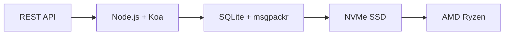

# 최초의 완전한 이메일 API: Forward Email이 이메일 관리를 혁신한 방법 {#the-first-complete-email-api-how-forward-email-revolutionized-email-management}


<p class="lead mt-3">
  <strong>요약:</strong> 우리는 다른 어떤 서비스도 제공하지 않는 고급 검색 기능을 갖춘 세계 최초의 완전한 이메일 관리용 REST API를 구축했습니다. Gmail, Outlook, Apple이 개발자를 IMAP 지옥이나 속도 제한된 API로 몰아넣는 반면, Forward Email은 15개 이상의 검색 매개변수를 갖춘 통합 REST 인터페이스를 통해 메시지, 폴더, 연락처, 캘린더에 대해 초고속 CRUD 작업을 제공합니다. 이것이 개발자들이 기다려온 이메일 API입니다.
</p>


## 목차 {#table-of-contents}

* [이메일 API 문제](#the-email-api-problem)
* [개발자들이 실제로 말하는 것](#what-developers-are-actually-saying)
* [Forward Email의 혁신적인 솔루션](#forward-emails-revolutionary-solution)
  * [우리가 이것을 만든 이유](#why-we-built-this)
  * [간단한 인증](#simple-authentication)
* [모든 것을 바꾸는 20개의 엔드포인트](#20-endpoints-that-change-everything)
  * [메시지 (5개 엔드포인트)](#messages-5-endpoints)
  * [폴더 (5개 엔드포인트)](#folders-5-endpoints)
  * [연락처 (5개 엔드포인트)](#contacts-5-endpoints)
  * [캘린더 (5개 엔드포인트)](#calendars-5-endpoints)
* [고급 검색: 비교할 수 없는 서비스](#advanced-search-no-other-service-compares)
  * [검색 API 환경의 문제점](#the-search-api-landscape-is-broken)
  * [Forward Email의 혁신적인 검색 API](#forward-emails-revolutionary-search-api)
  * [실제 검색 예시](#real-world-search-examples)
  * [성능상의 이점](#performance-advantages)
  * [다른 곳에는 없는 검색 기능](#search-features-no-one-else-has)
  * [개발자에게 중요한 이유](#why-this-matters-for-developers)
  * [기술적 구현](#the-technical-implementation)
* [초고속 성능 아키텍처](#blazing-fast-performance-architecture)
  * [성능 벤치마크](#performance-benchmarks)
  * [프라이버시 우선 아키텍처](#privacy-first-architecture)
* [우리가 다른 이유: 완전한 비교](#why-were-different-the-complete-comparison)
  * [주요 제공자 제한 사항](#major-provider-limitations)
  * [Forward Email의 장점](#forward-email-advantages)
  * [오픈 소스 투명성 문제](#the-open-source-transparency-problem)
* [30개 이상의 실제 통합 예시](#30-real-world-integration-examples)
  * [1. 워드프레스 연락처 폼 개선](#1-wordpress-contact-form-enhancement)
  * [2. 이메일 자동화를 위한 Zapier 대안](#2-zapier-alternative-for-email-automation)
  * [3. CRM 이메일 동기화](#3-crm-email-synchronization)
  * [4. 전자상거래 주문 처리](#4-e-commerce-order-processing)
  * [5. 지원 티켓 통합](#5-support-ticket-integration)
  * [6. 뉴스레터 관리 시스템](#6-newsletter-management-system)
  * [7. 이메일 기반 작업 관리](#7-email-based-task-management)
  * [8. 다계정 이메일 집계](#8-multi-account-email-aggregation)
  * [9. 고급 이메일 분석 대시보드](#9-advanced-email-analytics-dashboard)
  * [10. 스마트 이메일 아카이빙](#10-smart-email-archiving)
  * [11. 이메일-캘린더 통합](#11-email-to-calendar-integration)
  * [12. 이메일 백업 및 준수](#12-email-backup-and-compliance)
  * [13. 이메일 기반 콘텐츠 관리](#13-email-based-content-management)
  * [14. 이메일 템플릿 관리](#14-email-template-management)
  * [15. 이메일 기반 워크플로우 자동화](#15-email-based-workflow-automation)
  * [16. 이메일 보안 모니터링](#16-email-security-monitoring)
  * [17. 이메일 기반 설문 수집](#17-email-based-survey-collection)
  * [18. 이메일 성능 모니터링](#18-email-performance-monitoring)
  * [19. 이메일 기반 리드 자격 평가](#19-email-based-lead-qualification)
  * [20. 이메일 기반 프로젝트 관리](#20-email-based-project-management)
  * [21. 이메일 기반 재고 관리](#21-email-based-inventory-management)
  * [22. 이메일 기반 송장 처리](#22-email-based-invoice-processing)
  * [23. 이메일 기반 이벤트 등록](#23-email-based-event-registration)
  * [24. 이메일 기반 문서 승인 워크플로우](#24-email-based-document-approval-workflow)
  * [25. 이메일 기반 고객 피드백 분석](#25-email-based-customer-feedback-analysis)
  * [26. 이메일 기반 채용 파이프라인](#26-email-based-recruitment-pipeline)
  * [27. 이메일 기반 비용 보고서 처리](#27-email-based-expense-report-processing)
  * [28. 이메일 기반 품질 보증 보고](#28-email-based-quality-assurance-reporting)
  * [29. 이메일 기반 공급업체 관리](#29-email-based-vendor-management)
  * [30. 이메일 기반 소셜 미디어 모니터링](#30-email-based-social-media-monitoring)
* [시작하기](#getting-started)
  * [1. Forward Email 계정 생성](#1-create-your-forward-email-account)
  * [2. API 자격 증명 생성](#2-generate-api-credentials)
  * [3. 첫 API 호출하기](#3-make-your-first-api-call)
  * [4. 문서 탐색하기](#4-explore-the-documentation)
* [기술 자료](#technical-resources)
## 이메일 API 문제 {#the-email-api-problem}

이메일 API는 근본적으로 망가져 있습니다. 끝.

모든 주요 이메일 제공업체는 개발자에게 두 가지 끔찍한 선택 중 하나를 강요합니다:

1. **IMAP 지옥**: 현대 애플리케이션이 아닌 데스크톱 클라이언트를 위해 설계된 30년 된 프로토콜과 씨름하기
2. **제한된 API**: 실제 이메일 데이터를 관리할 수 없는 속도 제한, 읽기 전용, OAuth 복잡한 API

결과는? 개발자들은 이메일 통합을 완전히 포기하거나 끊임없이 깨지는 취약한 IMAP 래퍼를 만드는 데 몇 주를 낭비합니다.

> \[!WARNING]
> **더러운 비밀**: 대부분의 "이메일 API"는 단순히 발송 API일 뿐입니다. 간단한 REST 인터페이스를 통해 폴더를 프로그래밍 방식으로 정리하거나, 연락처를 동기화하거나, 캘린더를 관리할 수 없습니다. 지금까지는요.


## 개발자들이 실제로 말하는 것 {#what-developers-are-actually-saying}

좌절감은 현실이며 어디서나 문서화되어 있습니다:

> "최근에 내 앱에 Gmail을 통합하려고 했는데 너무 많은 시간을 쏟았어요. Gmail 지원은 가치가 없다고 결정했습니다."
>
> *- [Hacker News 개발자](https://news.ycombinator.com/item?id=42106944), 147 추천*

> "모든 이메일 API가 형편없는가요? 뭔가 제한적이거나 제약이 있는 것 같아요."
>
> *- [Reddit r/SaaS 토론](https://www.reddit.com/r/SaaS/comments/1cm84s7/are_all_email_apis_mediocre/)*

> "왜 이메일 개발은 이렇게 힘들어야 하나요?"
>
> *- [Reddit r/webdev](https://www.reddit.com/r/webdev/comments/15trnp2/why_does_email_development_have_to_suck/), 89개의 개발자 고통 댓글*

> "Gmail API가 IMAP보다 더 효율적인 이유는 무엇인가요? 또 다른 이유는 Gmail API는 각 메시지를 한 번만 다운로드하면 되기 때문입니다. IMAP은 각 메시지를 다운로드하고 인덱싱해야 합니다..."
>
> *- [Stack Overflow 질문](https://stackoverflow.com/questions/25431022/what-makes-the-gmail-api-more-efficient-than-imap), 47 추천*

증거는 곳곳에 있습니다:

* **WordPress SMTP 문제**: 이메일 전달 실패에 관한 [631 GitHub 이슈](https://github.com/awesomemotive/WP-Mail-SMTP/issues)
* **Zapier 제한**: 시간당 10개 이메일 제한 및 IMAP 감지 실패에 관한 [커뮤니티 불만](https://community.zapier.com/featured-articles-65/email-parser-by-zapier-limitations-and-alternatives-16958)
* **IMAP API 프로젝트**: "IMAP을 REST로 변환"하기 위해 존재하는 [여러](https://github.com/ewildgoose/imap-api) [오픈소스](https://emailengine.app/) [프로젝트](https://www.npmjs.com/package/imapflow), 제공업체는 이를 제공하지 않음
* **Gmail API 불만**: [Stack Overflow](https://stackoverflow.com/questions/tagged/gmail-api)에는 "gmail-api" 태그가 붙은 4,847개의 질문이 있으며, 속도 제한과 복잡성에 대한 일반적인 불만이 있음


## Forward Email의 혁신적인 솔루션 {#forward-emails-revolutionary-solution}

**우리는 모든 이메일 데이터를 통합 REST API를 통해 완전한 CRUD 작업을 제공하는 최초의 이메일 서비스입니다.**

이것은 단순한 발송 API가 아닙니다. 이것은 다음에 대한 완전한 프로그래밍 제어입니다:

* **메시지**: 생성, 읽기, 업데이트, 삭제, 검색, 이동, 플래그 지정
* **폴더**: REST 엔드포인트를 통한 완전한 IMAP 폴더 관리
* **연락처**: [CardDAV](https://tools.ietf.org/html/rfc6352) 연락처 저장 및 동기화
* **캘린더**: [CalDAV](https://tools.ietf.org/html/rfc4791) 캘린더 이벤트 및 일정 관리

### 우리가 이것을 만든 이유 {#why-we-built-this}

**문제**: 모든 이메일 제공업체는 이메일을 블랙박스로 취급합니다. 이메일을 보낼 수는 있지만, 복잡한 OAuth를 통해 읽을 수는 있어도 이메일 데이터를 진정으로 *관리*할 수는 없습니다.

**우리의 비전**: 이메일은 어떤 현대 API만큼 쉽게 통합되어야 합니다. IMAP 라이브러리 없음. OAuth 복잡성 없음. 속도 제한 악몽 없음. 단지 작동하는 간단한 REST 엔드포인트만 있으면 됩니다.

**결과**: HTTP 요청만으로 완전한 이메일 클라이언트, CRM 통합 또는 자동화 시스템을 구축할 수 있는 최초의 이메일 서비스입니다.

### 간단한 인증 {#simple-authentication}

[OAuth 복잡성](https://oauth.net/2/) 없음. [앱 전용 비밀번호](https://support.google.com/accounts/answer/185833) 없음. 단지 별칭 자격 증명만 있으면 됩니다:

```bash
curl -u "alias@yourdomain.com:password" \
  https://api.forwardemail.net/v1/messages
```
## 모든 것을 바꾸는 20개의 엔드포인트 {#20-endpoints-that-change-everything}

### 메시지 (5개 엔드포인트) {#messages-5-endpoints}

* `GET /v1/messages` - 필터링하여 메시지 목록 조회 (`?folder=`, `?is_unread=`, `?is_flagged=`)
* `POST /v1/messages` - 새 메시지를 폴더로 직접 전송
* `GET /v1/messages/:id` - 전체 메타데이터와 함께 특정 메시지 조회
* `PUT /v1/messages/:id` - 메시지 업데이트 (플래그, 폴더, 읽음 상태)
* `DELETE /v1/messages/:id` - 메시지 영구 삭제

### 폴더 (5개 엔드포인트) {#folders-5-endpoints}

* `GET /v1/folders` - 구독 상태와 함께 모든 폴더 목록 조회
* `POST /v1/folders` - 사용자 정의 속성으로 새 폴더 생성
* `GET /v1/folders/:id` - 폴더 세부 정보 및 메시지 수 조회
* `PUT /v1/folders/:id` - 폴더 속성 및 구독 상태 업데이트
* `DELETE /v1/folders/:id` - 폴더 삭제 및 메시지 재배치 처리

### 연락처 (5개 엔드포인트) {#contacts-5-endpoints}

* `GET /v1/contacts` - 검색 및 페이지네이션과 함께 연락처 목록 조회
* `POST /v1/contacts` - 전체 vCard 지원으로 새 연락처 생성
* `GET /v1/contacts/:id` - 모든 필드와 메타데이터 포함 연락처 조회
* `PUT /v1/contacts/:id` - ETag 검증과 함께 연락처 정보 업데이트
* `DELETE /v1/contacts/:id` - 연쇄 처리와 함께 연락처 삭제

### 캘린더 (5개 엔드포인트) {#calendars-5-endpoints}

* `GET /v1/calendars` - 날짜 필터링과 함께 캘린더 이벤트 목록 조회
* `POST /v1/calendars` - 참석자 및 반복 설정이 포함된 캘린더 이벤트 생성
* `GET /v1/calendars/:id` - 시간대 처리가 포함된 이벤트 세부 정보 조회
* `PUT /v1/calendars/:id` - 충돌 감지와 함께 이벤트 업데이트
* `DELETE /v1/calendars/:id` - 참석자 알림과 함께 이벤트 삭제


## 고급 검색: 비교할 수 있는 서비스는 없다 {#advanced-search-no-other-service-compares}

**Forward Email은 모든 메시지 필드를 아우르는 포괄적이고 프로그래밍 가능한 검색을 REST API를 통해 제공하는 유일한 이메일 서비스입니다.**

다른 제공업체들은 기본적인 필터링만 제공하는 반면, 우리는 지금까지 만들어진 가장 진보된 이메일 검색 API를 구축했습니다. Gmail API, Outlook API, 그 어떤 서비스도 우리의 검색 기능에 근접하지 못합니다.

### 검색 API 환경은 문제투성이 {#the-search-api-landscape-is-broken}

**Gmail API 검색 제한 사항:**

* ✅ 기본 `q` 파라미터만 지원
* ❌ 필드별 검색 불가
* ❌ 날짜 범위 필터링 불가
* ❌ 크기 기반 필터링 불가
* ❌ 첨부파일 필터링 불가
* ❌ Gmail 검색 구문에 제한됨

**Outlook API 검색 제한 사항:**

* ✅ 기본 `$search` 파라미터 지원
* ❌ 고급 필드 타겟팅 불가
* ❌ 복잡한 쿼리 조합 불가
* ❌ 엄격한 속도 제한
* ❌ 복잡한 OData 구문 필요

**Apple iCloud:**

* ❌ API 전혀 없음
* ❌ IMAP 검색만 가능 (작동시킬 수 있다면)

**ProtonMail & Tuta:**

* ❌ 공개 API 없음
* ❌ 프로그래밍 가능한 검색 기능 없음

### Forward Email의 혁신적인 검색 API {#forward-emails-revolutionary-search-api}

**우리는 다른 어떤 서비스도 제공하지 않는 15개 이상의 검색 파라미터를 제공합니다:**

| 검색 기능                      | Forward Email                          | Gmail API    | Outlook API        | 기타    |
| ------------------------------ | -------------------------------------- | ------------ | ------------------ | ------ |
| **필드별 검색**                | ✅ 제목, 본문, 발신자, 수신자, 참조, 헤더 | ❌            | ❌                  | ❌      |
| **다중 필드 일반 검색**        | ✅ `?search=` 모든 필드 대상             | ✅ 기본 `q=`  | ✅ 기본 `$search=`  | ❌      |
| **날짜 범위 필터링**           | ✅ `?since=` & `?before=`               | ❌            | ❌                  | ❌      |
| **크기 기반 필터링**           | ✅ `?min_size=` & `?max_size=`          | ❌            | ❌                  | ❌      |
| **첨부파일 필터링**            | ✅ `?has_attachments=true/false`        | ❌            | ❌                  | ❌      |
| **헤더 검색**                  | ✅ `?headers=X-Priority`                | ❌            | ❌                  | ❌      |
| **메시지 ID 검색**             | ✅ `?message_id=abc123`                 | ❌            | ❌                  | ❌      |
| **복합 필터**                 | ✅ AND 논리로 여러 파라미터 조합 가능    | ❌            | ❌                  | ❌      |
| **대소문자 구분 없음**         | ✅ 모든 검색에 적용                      | ✅            | ✅                  | ❌      |
| **페이지네이션 지원**           | ✅ 모든 검색 파라미터에 적용 가능         | ✅            | ✅                  | ❌      |
### 실제 검색 예시 {#real-world-search-examples}

**지난 분기 모든 송장 찾기:**

```bash
# Forward Email - 간단하고 강력함
GET /v1/messages?subject=invoice&since=2024-01-01T00:00:00Z&before=2024-04-01T00:00:00Z

# Gmail API - 제한된 검색으로 불가능
# 날짜 범위 필터링 불가

# Outlook API - 복잡한 OData 문법, 제한된 기능
GET /me/messages?$search="invoice"&$filter=receivedDateTime ge 2024-01-01T00:00:00Z
```

**특정 발신자의 큰 첨부파일 검색:**

```bash
# Forward Email - 포괄적 필터링
GET /v1/messages?from=finance@company.com&has_attachments=true&min_size=1000000

# Gmail API - 크기나 첨부파일로 프로그래밍 필터링 불가
# Outlook API - 크기 필터링 불가
# 기타 - API 없음
```

**복합 다중 필드 검색:**

```bash
# Forward Email - 고급 쿼리 기능
GET /v1/messages?body=quarterly&from=manager&is_flagged=true&folder=Reports

# Gmail API - 기본 텍스트 검색만 가능
GET /gmail/v1/users/me/messages?q=quarterly

# Outlook API - 필드 지정 없는 기본 검색
GET /me/messages?$search="quarterly"
```

### 성능 이점 {#performance-advantages}

**Forward Email 검색 성능:**

* ⚡ **복잡한 검색도 100ms 미만 응답 시간**
* 🔍 **적절한 인덱싱을 통한 정규식 최적화**
* 📊 **카운트와 데이터 병렬 쿼리 실행**
* 💾 **효율적인 메모리 사용과 경량 쿼리**

**경쟁사 성능 문제:**

* 🐌 **Gmail API**: 사용자당 초당 250 쿼터 단위 제한
* 🐌 **Outlook API**: 복잡한 백오프 요구와 공격적 제한
* 🐌 **기타**: 비교 가능한 API 없음

### 다른 곳에는 없는 검색 기능 {#search-features-no-one-else-has}

#### 1. 헤더 특정 검색 {#1-header-specific-search}

```bash
# 특정 헤더가 있는 메시지 찾기
GET /v1/messages?headers=X-Priority:1
GET /v1/messages?headers=X-Spam-Score
```

#### 2. 크기 기반 인텔리전스 {#2-size-based-intelligence}

```bash
# 뉴스레터 이메일 찾기 (보통 큼)
GET /v1/messages?min_size=50000&from=newsletter

# 빠른 답장 찾기 (보통 작음)
GET /v1/messages?max_size=1000&to=support
```

#### 3. 첨부파일 기반 워크플로우 {#3-attachment-based-workflows}

```bash
# 법무팀에 보낸 모든 문서 찾기
GET /v1/messages?to=legal&has_attachments=true&body=contract

# 정리를 위한 첨부파일 없는 이메일 찾기
GET /v1/messages?has_attachments=false&before=2023-01-01T00:00:00Z
```

#### 4. 결합된 비즈니스 로직 {#4-combined-business-logic}

```bash
# 첨부파일이 있는 VIP의 긴급 플래그 메시지 찾기
GET /v1/messages?is_flagged=true&from=ceo&has_attachments=true&subject=urgent
```

### 개발자에게 중요한 이유 {#why-this-matters-for-developers}

**이전에는 불가능했던 애플리케이션 구축:**

1. **고급 이메일 분석**: 크기, 발신자, 내용별 이메일 패턴 분석
2. **지능형 이메일 관리**: 복잡한 기준에 따른 자동 정리
3. **컴플라이언스 및 검색**: 법적 요구사항에 맞는 특정 이메일 찾기
4. **비즈니스 인텔리전스**: 이메일 커뮤니케이션 패턴에서 인사이트 추출
5. **자동화 워크플로우**: 정교한 이메일 필터 기반 작업 트리거

### 기술적 구현 {#the-technical-implementation}

우리의 검색 API는 다음을 사용합니다:

* **적절한 인덱싱 전략을 통한 정규식 최적화**
* **성능을 위한 병렬 실행**
* **보안을 위한 입력 검증**
* **신뢰성을 위한 포괄적 오류 처리**

```javascript
// 예시: 복잡한 검색 구현
const searchConditions = [];

if (ctx.query.subject) {
  searchConditions.push({
    subject: { $regex: ctx.query.subject, $options: 'i' }
  });
}

if (ctx.query.from) {
  searchConditions.push({
    $or: [
      { 'from.address': { $regex: ctx.query.from, $options: 'i' } },
      { 'from.name': { $regex: ctx.query.from, $options: 'i' } }
    ]
  });
}

// AND 논리로 결합
if (searchConditions.length > 0) {
  query.$and = searchConditions;
}
```

> \[!TIP]
> **개발자 이점**: Forward Email의 검색 API를 사용하면 REST API의 단순함을 유지하면서 데스크톱 클라이언트에 필적하는 기능의 이메일 애플리케이션을 구축할 수 있습니다.
## 초고속 성능 아키텍처 {#blazing-fast-performance-architecture}

저희 기술 스택은 속도와 신뢰성을 위해 설계되었습니다:


```mermaid
graph LR
    A[REST API] --> B[Node.js + Koa]
    B --> C[SQLite + msgpackr]
    C --> D[NVMe SSD]
    D --> E[AMD Ryzen]
```

### 성능 벤치마크 {#performance-benchmarks}

**저희가 번개처럼 빠른 이유:**

| 구성 요소    | 기술                                                                                 | 성능 이점                                      |
| ------------ | ------------------------------------------------------------------------------------ | --------------------------------------------- |
| **스토리지** | [NVMe SSD](https://en.wikipedia.org/wiki/NVM_Express)                              | 기존 SATA 대비 10배 빠름                       |
| **데이터베이스** | [SQLite](https://sqlite.org/) + [msgpackr](https://github.com/kriszyp/msgpackr)   | 네트워크 지연 없음, 최적화된 직렬화           |
| **하드웨어** | [AMD Ryzen](https://www.amd.com/en/products/processors/desktops/ryzen) 베어메탈      | 가상화 오버헤드 없음                           |
| **캐싱**    | 인메모리 + 영속성                                                                    | 밀리초 미만 응답 시간                          |
| **백업**    | [Cloudflare R2](https://www.cloudflare.com/products/r2/) 암호화                     | 엔터프라이즈급 신뢰성                          |

**실제 성능 수치:**

* **API 응답 시간**: 평균 50ms 미만
* **메시지 검색**: 캐시된 메시지 10ms 미만
* **폴더 작업**: 메타데이터 작업 5ms 미만
* **연락처 동기화**: 초당 1000개 이상
* **가동 시간**: 중복 인프라로 99.99% SLA

### 프라이버시 우선 아키텍처 {#privacy-first-architecture}

**제로 지식 설계**: IMAP 비밀번호로만 접근 가능하며, 저희는 이메일을 읽을 수 없습니다. 저희의 [제로 지식 아키텍처](https://forwardemail.net/en/security)는 완전한 프라이버시를 보장하면서도 초고속 성능을 제공합니다.


## 저희가 다른 이유: 완전 비교 {#why-were-different-the-complete-comparison}

### 주요 제공자 제한 사항 {#major-provider-limitations}

| 제공자           | 주요 문제점                              | 구체적 제한 사항                                                                                                                                                                                                                                                                                                                                                                                                                                                   |
| ---------------- | ------------------------------------- | ------------------------------------------------------------------------------------------------------------------------------------------------------------------------------------------------------------------------------------------------------------------------------------------------------------------------------------------------------------------------------------------------------------------------------------------------------------------ |
| **Gmail API**    | 읽기 전용, 복잡한 OAuth, 분리된 API    | • [기존 메시지 수정 불가](https://developers.google.com/gmail/api/reference/rest/v1/users.messages)<br>• [라벨 ≠ 폴더](https://developers.google.com/gmail/api/reference/rest/v1/users.labels)<br>• [일일 10억 쿼터 단위 제한](https://developers.google.com/gmail/api/reference/quota)<br>• 연락처/캘린더는 [별도 API 필요](https://developers.google.com/workspace)                                                           |
| **Outlook API**  | 지원 중단, 혼란스러움, 기업 중심        | • [REST 엔드포인트 2024년 3월 지원 종료](https://learn.microsoft.com/en-us/outlook/rest/compare-graph)<br>• [여러 혼란스러운 API](https://learn.microsoft.com/en-us/office/client-developer/outlook/selecting-an-api-or-technology-for-developing-solutions-for-outlook) (EWS, Graph, REST)<br>• [Microsoft Graph 복잡성](https://learn.microsoft.com/en-us/graph/overview)<br>• [강력한 제한](https://learn.microsoft.com/en-us/graph/throttling) |
| **Apple iCloud** | 공개 API 없음                         | • [공개 API 전혀 없음](https://support.apple.com/en-us/102654)<br>• [IMAP 전용, 일일 1000개 이메일 제한](https://support.apple.com/en-us/102654)<br>• [앱 전용 비밀번호 필요](https://support.apple.com/en-us/102654)<br>• [메시지당 500명 수신자 제한](https://support.apple.com/en-us/102654)                                                                                                                                              |
| **ProtonMail**   | API 없음, 거짓 오픈소스 주장           | • [공개 API 없음](https://proton.me/support/protonmail-bridge-clients)<br>• IMAP 접근을 위한 [Bridge 소프트웨어 필요](https://proton.me/mail/bridge)<br>• ["오픈 소스"라고 주장](https://proton.me/blog/open-source)하지만 [서버 코드는 독점](https://github.com/ProtonMail)<br>• [유료 플랜에만 제한](https://proton.me/pricing)                                                                                                         |
| **Tuta**         | API 없음, 오해의 소지가 있는 투명성     | • 이메일 관리를 위한 [REST API 없음](https://tuta.com/support#technical)<br>• ["오픈 소스"라고 주장](https://tuta.com/blog/posts/open-source-email)하지만 [백엔드는 폐쇄](https://github.com/tutao/tutanota)<br>• [IMAP/SMTP 미지원](https://tuta.com/support#imap)<br>• [독점 암호화](https://tuta.com/encryption)로 표준 통합 불가                                                                                               |
| **Zapier Email** | 심각한 속도 제한                      | • 시간당 [10개 이메일 제한](https://help.zapier.com/hc/en-us/articles/8496181555597-Email-Parser-by-Zapier-limitations-and-alternatives)<br>• [IMAP 폴더 접근 불가](https://help.zapier.com/hc/en-us/articles/8496181555597-Email-Parser-by-Zapier-limitations-and-alternatives)<br>• [제한된 파싱 기능](https://help.zapier.com/hc/en-us/articles/8496181555597-Email-Parser-by-Zapier-limitations-and-alternatives)                                 |
### 이메일 전달 장점 {#forward-email-advantages}

| 기능               | 이메일 전달                                                                                  | 경쟁사                                    |
| ------------------ | -------------------------------------------------------------------------------------------- | ----------------------------------------- |
| **완전한 CRUD**    | ✅ 모든 데이터에 대해 생성, 읽기, 업데이트, 삭제 완전 지원                                    | ❌ 읽기 전용 또는 제한된 작업               |
| **통합 API**       | ✅ 메시지, 폴더, 연락처, 캘린더를 하나의 API에서 제공                                        | ❌ 별도의 API 또는 기능 누락                |
| **간단한 인증**   | ✅ 별칭 자격 증명을 사용하는 기본 인증                                                        | ❌ 여러 권한 범위가 있는 복잡한 OAuth       |
| **요율 제한 없음** | ✅ 실제 애플리케이션을 위해 설계된 관대한 제한                                                 | ❌ 워크플로우를 방해하는 제한적 할당량       |
| **셀프 호스팅**   | ✅ [완전한 셀프 호스팅 옵션](https://forwardemail.net/en/blog/docs/self-hosted-solution) 제공 | ❌ 공급업체 종속만 가능                      |
| **개인정보 보호** | ✅ 제로 지식, 암호화, 개인 정보 보호                                                         | ❌ 데이터 마이닝 및 개인정보 우려            |
| **성능**          | ✅ 50ms 미만 응답, NVMe 스토리지                                                             | ❌ 네트워크 지연, 속도 제한 지연             |

### 오픈 소스 투명성 문제 {#the-open-source-transparency-problem}

**ProtonMail과 Tuta는 자신들을 "오픈 소스" 및 "투명"하다고 홍보하지만, 이는 현대 개인정보 보호 원칙을 위반하는 오해의 소지가 있는 마케팅입니다.**

> \[!WARNING]
> **거짓 투명성 주장**: ProtonMail과 Tuta는 "오픈 소스" 자격을 대대적으로 광고하면서 가장 중요한 서버 측 코드는 독점적이고 비공개로 유지합니다.

**ProtonMail의 기만:**

* **주장**: ["우리는 오픈 소스입니다"](https://proton.me/blog/open-source)라는 마케팅 문구
* **현실**: [서버 코드는 완전히 독점적](https://github.com/ProtonMail)이며 클라이언트 앱만 오픈 소스임
* **영향**: 사용자는 서버 측 암호화, 데이터 처리 또는 개인정보 보호 주장을 검증할 수 없음
* **투명성 위반**: 실제 이메일 처리 및 저장 시스템을 감사할 방법이 없음

**Tuta의 오해의 소지가 있는 마케팅:**

* **주장**: ["오픈 소스 이메일"](https://tuta.com/blog/posts/open-source-email)을 핵심 판매 포인트로 내세움
* **현실**: [백엔드 인프라는 폐쇄 소스](https://github.com/tutao/tutanota)이며 프론트엔드만 공개됨
* **영향**: 독점 암호화로 표준 이메일 프로토콜(IMAP/SMTP) 사용 불가
* **종속 전략**: 맞춤형 암호화로 공급업체 의존 강제

**이것이 현대 개인정보 보호에 중요한 이유:**

2025년에는 진정한 개인정보 보호를 위해 **완전한 투명성**이 필요합니다. 이메일 제공자가 "오픈 소스"라고 주장하면서 서버 코드를 숨길 때:

1. **검증 불가능한 암호화**: 데이터가 실제로 어떻게 암호화되는지 감시할 수 없음
2. **숨겨진 데이터 처리**: 서버 측 데이터 처리가 블랙박스 상태로 남음
3. **신뢰 기반 보안**: 검증 없이 그들의 주장만 믿어야 함
4. **공급업체 종속**: 독점 시스템으로 데이터 이동성 제한

**Forward Email의 진정한 투명성:**

* ✅ **[완전한 오픈 소스](https://github.com/forwardemail/forwardemail.net)** - 서버 및 클라이언트 코드 모두 공개
* ✅ **[셀프 호스팅 가능](https://forwardemail.net/en/blog/docs/self-hosted-solution)** - 직접 인스턴스 운영 가능
* ✅ **표준 프로토콜 지원** - IMAP, SMTP, CardDAV, CalDAV 호환
* ✅ **감사 가능한 보안** - 모든 코드 라인 검토 가능
* ✅ **공급업체 종속 없음** - 데이터는 사용자 소유, 완전한 제어 가능

> \[!TIP]
> **진짜 오픈 소스는 모든 주장을 검증할 수 있음을 의미합니다.** Forward Email과 함께라면 암호화를 감사하고, 데이터 처리 방식을 검토하며, 직접 인스턴스를 운영할 수 있습니다. 이것이 진정한 투명성입니다.


## 30개 이상의 실제 통합 사례 {#30-real-world-integration-examples}

### 1. 워드프레스 연락처 폼 향상 {#1-wordpress-contact-form-enhancement}
**문제**: [WordPress SMTP 구성 실패](https://github.com/awesomemotive/WP-Mail-SMTP/issues) ([631 GitHub 이슈](https://github.com/awesomemotive/WP-Mail-SMTP/issues))  
**해결책**: 직접 API 통합으로 [SMTP](https://tools.ietf.org/html/rfc5321)를 완전히 우회

```javascript
// WordPress 연락처 폼을 보낸 편지함에 저장
await fetch('https://api.forwardemail.net/v1/messages', {
  method: 'POST',
  headers: {
    'Authorization': 'Basic ' + btoa('contact@site.com:password'),
    'Content-Type': 'application/json'
  },
  body: JSON.stringify({
    to: [{ address: 'owner@site.com' }],
    subject: '연락처 폼: ' + formData.subject,
    text: formData.message,
    folder: 'Sent'
  })
});
```

### 2. 이메일 자동화를 위한 Zapier 대안 {#2-zapier-alternative-for-email-automation}

**문제**: [Zapier의 시간당 10개 이메일 제한](https://help.zapier.com/hc/en-us/articles/8496181555597-Email-Parser-by-Zapier-limitations-and-alternatives) 및 [IMAP 감지 실패](https://community.zapier.com/featured-articles-65/email-parser-by-zapier-limitations-and-alternatives-16958)  
**해결책**: 완전한 이메일 제어와 무제한 자동화

```javascript
// 발신자 도메인별 이메일 자동 분류
const messages = await fetch('/v1/messages?folder=INBOX');
for (const message of messages) {
  const domain = message.from.split('@')[1];
  await fetch(`/v1/messages/${message.id}`, {
    method: 'PUT',
    body: JSON.stringify({ folder: `Clients/${domain}` })
  });
}
```

### 3. CRM 이메일 동기화 {#3-crm-email-synchronization}

**문제**: 이메일과 [CRM 시스템](https://en.wikipedia.org/wiki/Customer_relationship_management) 간 수동 연락처 관리  
**해결책**: [CardDAV](https://tools.ietf.org/html/rfc6352) 연락처 API를 통한 양방향 동기화

```javascript
// 새 이메일 연락처를 CRM에 동기화
const newContacts = await fetch('/v1/contacts');
for (const contact of newContacts) {
  await crmAPI.createContact({
    name: contact.name,
    email: contact.email,
    source: 'email_api'
  });
}
```

### 4. 전자상거래 주문 처리 {#4-e-commerce-order-processing}

**문제**: [전자상거래 플랫폼](https://en.wikipedia.org/wiki/E-commerce)의 수동 주문 이메일 처리  
**해결책**: 자동화된 주문 관리 파이프라인

```javascript
// 주문 확인 이메일 처리
const orders = await fetch('/v1/messages?folder=Orders');
const orderEmails = orders.filter(msg =>
  msg.subject.includes('Order Confirmation')
);

for (const order of orderEmails) {
  const orderData = parseOrderEmail(order.text);
  await updateInventory(orderData);
  await fetch(`/v1/messages/${order.id}`, {
    method: 'PUT',
    body: JSON.stringify({ folder: 'Orders/Processed' })
  });
}
```

### 5. 지원 티켓 통합 {#5-support-ticket-integration}

**문제**: [헬프데스크 플랫폼](https://en.wikipedia.org/wiki/Help_desk_software)에 흩어진 이메일 스레드  
**해결책**: 완전한 이메일 스레드 추적

```javascript
// 이메일 스레드에서 지원 티켓 생성
const messages = await fetch('/v1/messages?folder=Support');
const supportEmails = messages.filter(msg =>
  msg.to.some(addr => addr.includes('support@'))
);

for (const email of supportEmails) {
  const ticket = await supportSystem.createTicket({
    subject: email.subject,
    from: email.from,
    body: email.text,
    timestamp: email.date
  });
}
```

### 6. 뉴스레터 관리 시스템 {#6-newsletter-management-system}

**문제**: 제한된 [뉴스레터 플랫폼](https://en.wikipedia.org/wiki/Email_marketing) 통합  
**해결책**: 완전한 구독자 생애주기 관리

```javascript
// 뉴스레터 구독 자동 관리
const messages = await fetch('/v1/messages?folder=Newsletter');
const unsubscribes = messages.filter(msg =>
  msg.subject.toLowerCase().includes('unsubscribe')
);

for (const msg of unsubscribes) {
  await removeSubscriber(msg.from);
  await fetch(`/v1/messages/${msg.id}`, {
    method: 'PUT',
    body: JSON.stringify({ folder: 'Newsletter/Unsubscribed' })
  });
}
```

### 7. 이메일 기반 작업 관리 {#7-email-based-task-management}

**문제**: 받은 편지함 과부하 및 [작업 추적](https://en.wikipedia.org/wiki/Task_management)  
**해결책**: 이메일을 실행 가능한 작업으로 변환
```javascript
// Create tasks from flagged emails
const messages = await fetch('/v1/messages?is_flagged=true');
for (const email of messages) {
  await taskManager.createTask({
    title: email.subject,
    description: email.text,
    assignee: email.to[0].address,
    dueDate: extractDueDate(email.text)
  });
}
```

### 8. Multi-Account Email Aggregation {#8-multi-account-email-aggregation}

**Problem**: Managing [multiple email accounts](https://en.wikipedia.org/wiki/Email_client) across providers
**Solution**: Unified inbox interface

```javascript
// Aggregate emails from multiple accounts
const accounts = ['work@domain.com', 'personal@domain.com'];
const allMessages = [];

for (const account of accounts) {
  const messages = await fetch('/v1/messages', {
    headers: { 'Authorization': getAuth(account) }
  });
  allMessages.push(...messages.map(m => ({ ...m, account })));
}
```

### 9. Advanced Email Analytics Dashboard {#9-advanced-email-analytics-dashboard}

**Problem**: No insights into [email patterns](https://en.wikipedia.org/wiki/Email_analytics) with sophisticated filtering
**Solution**: Custom email analytics using advanced search capabilities

```javascript
// Generate comprehensive email analytics using advanced search
const analytics = {};

// Analyze email volume by sender domain
const messages = await fetch('/v1/messages');
analytics.senderDomains = analyzeSenderDomains(messages);

// Find large attachments consuming storage
const largeAttachments = await fetch('/v1/messages?has_attachments=true&min_size=1000000');
analytics.storageHogs = largeAttachments.map(msg => ({
  subject: msg.subject,
  from: msg.from,
  size: msg.size
}));

// Analyze communication patterns with VIPs
const vipEmails = await fetch('/v1/messages?from=ceo@company.com');
const urgentVipEmails = await fetch('/v1/messages?from=ceo@company.com&subject=urgent');
analytics.vipCommunication = {
  total: vipEmails.length,
  urgent: urgentVipEmails.length,
  urgencyRate: (urgentVipEmails.length / vipEmails.length) * 100
};

// Find unread emails by date range for follow-up
const lastWeek = new Date(Date.now() - 7 * 24 * 60 * 60 * 1000).toISOString();
const unreadRecent = await fetch(`/v1/messages?is_unread=true&since=${lastWeek}`);
analytics.followUpNeeded = unreadRecent.length;

// Analyze email sizes for optimization
const smallEmails = await fetch('/v1/messages?max_size=1000');
const mediumEmails = await fetch('/v1/messages?min_size=1000&max_size=50000');
const largeEmails = await fetch('/v1/messages?min_size=50000');
analytics.sizeDistribution = {
  small: smallEmails.length,
  medium: mediumEmails.length,
  large: largeEmails.length
};

// Search for compliance-related emails
const complianceEmails = await fetch('/v1/messages?body=confidential&has_attachments=true');
analytics.complianceReview = complianceEmails.length;
```

### 10. Smart Email Archiving {#10-smart-email-archiving}

**Problem**: Manual [email organization](https://en.wikipedia.org/wiki/Email_management)
**Solution**: Intelligent email categorization

```javascript
// Auto-archive old emails by category
const messages = await fetch('/v1/messages');
const oldEmails = messages.filter(email =>
  isOlderThan(email.date, 90) // 90 days
);

for (const email of oldEmails) {
  const category = categorizeEmail(email);
  await fetch(`/v1/messages/${email.id}`, {
    method: 'PUT',
    body: JSON.stringify({ folder: `Archive/${category}` })
  });
}
```

### 11. Email-to-Calendar Integration {#11-email-to-calendar-integration}

**Problem**: Manual [calendar event](https://tools.ietf.org/html/rfc4791) creation from emails
**Solution**: Automatic event extraction and creation

```javascript
// Extract meeting details from emails
const messages = await fetch('/v1/messages?folder=Meetings');
const meetingEmails = messages.filter(email =>
  email.subject.toLowerCase().includes('meeting')
);

for (const email of meetingEmails) {
  const meetingData = extractMeetingInfo(email.text);
  if (meetingData.date && meetingData.time) {
    await fetch('/v1/calendars', {
      method: 'POST',
      body: JSON.stringify({
        title: email.subject,
        start: meetingData.datetime,
        attendees: [email.from, ...email.to]
      })
    });
  }
}
```

### 12. 이메일 백업 및 준수 {#12-email-backup-and-compliance}

**문제**: [이메일 보존](https://en.wikipedia.org/wiki/Email_retention_policy) 및 준수 요구사항  
**해결책**: 메타데이터 보존을 포함한 자동 백업

```javascript
// Backup emails with full metadata
const allMessages = await fetch('/v1/messages');
const backup = {
  timestamp: new Date(),
  messages: allMessages.map(msg => ({
    id: msg.id,
    subject: msg.subject,
    from: msg.from,
    to: msg.to,
    date: msg.date,
    flags: msg.flags
  }))
};
await saveToComplianceStorage(backup);
```

### 13. 이메일 기반 콘텐츠 관리 {#13-email-based-content-management}

**문제**: [CMS 플랫폼](https://en.wikipedia.org/wiki/Content_management_system)용 이메일을 통한 콘텐츠 제출 관리  
**해결책**: 콘텐츠 관리 시스템으로서의 이메일 활용

```javascript
// Process content submissions from email
const messages = await fetch('/v1/messages?folder=Submissions');
const submissions = messages.filter(msg =>
  msg.to.some(addr => addr.includes('submit@'))
);

for (const submission of submissions) {
  const content = parseSubmission(submission.text);
  await cms.createDraft({
    title: submission.subject,
    content: content.body,
    author: submission.from
  });
}
```

### 14. 이메일 템플릿 관리 {#14-email-template-management}

**문제**: 팀 내 일관성 없는 [이메일 템플릿](https://en.wikipedia.org/wiki/Email_template)  
**해결책**: API를 통한 중앙 집중식 템플릿 시스템

```javascript
// Send templated emails with dynamic content
const template = await getEmailTemplate('welcome');
await fetch('/v1/messages', {
  method: 'POST',
  body: JSON.stringify({
    to: [{ address: newUser.email }],
    subject: template.subject.replace('{{name}}', newUser.name),
    html: template.html.replace('{{name}}', newUser.name),
    folder: 'Sent'
  })
});
```

### 15. 이메일 기반 워크플로우 자동화 {#15-email-based-workflow-automation}

**문제**: 이메일을 통한 수동 [승인 프로세스](https://en.wikipedia.org/wiki/Workflow)  
**해결책**: 자동화된 워크플로우 트리거

```javascript
// Process approval emails
const messages = await fetch('/v1/messages?folder=Approvals');
const approvals = messages.filter(msg =>
  msg.subject.includes('APPROVAL')
);

for (const approval of approvals) {
  const decision = parseApprovalDecision(approval.text);
  await workflow.processApproval({
    requestId: extractRequestId(approval.subject),
    decision: decision,
    approver: approval.from
  });
}
```

### 16. 이메일 보안 모니터링 {#16-email-security-monitoring}

**문제**: 수동 [보안 위협 탐지](https://en.wikipedia.org/wiki/Email_security)  
**해결책**: 자동화된 위협 분석

```javascript
// Monitor for suspicious emails
const recentEmails = await fetch('/v1/messages');
for (const email of recentEmails) {
  const threatScore = analyzeThreat(email);
  if (threatScore > 0.8) {
    await fetch(`/v1/messages/${email.id}`, {
      method: 'PUT',
      body: JSON.stringify({ folder: 'Security/Quarantine' })
    });
    await alertSecurityTeam(email);
  }
}
```

### 17. 이메일 기반 설문조사 수집 {#17-email-based-survey-collection}

**문제**: 수동 [설문 응답](https://en.wikipedia.org/wiki/Survey_methodology) 처리  
**해결책**: 자동화된 응답 집계

```javascript
// Collect and process survey responses
const messages = await fetch('/v1/messages?folder=Surveys');
const responses = messages.filter(msg =>
  msg.subject.includes('Survey Response')
);

const surveyData = responses.map(email => ({
  respondent: email.from,
  responses: parseSurveyData(email.text),
  timestamp: email.date
}));
await updateSurveyResults(surveyData);
```

### 18. 이메일 성능 모니터링 {#18-email-performance-monitoring}

**문제**: [이메일 전달 성능](https://en.wikipedia.org/wiki/Email_deliverability)에 대한 가시성 부족  
**해결책**: 실시간 이메일 지표

```javascript
// Monitor email delivery performance
const sentEmails = await fetch('/v1/messages?folder=Sent');
const deliveryStats = {
  sent: sentEmails.length,
  bounces: await countBounces(),
  deliveryRate: calculateDeliveryRate()
};
await updateDashboard(deliveryStats);
```
### 19. 이메일 기반 리드 자격 판단 {#19-email-based-lead-qualification}

**문제**: 이메일 상호작용에서 수동 [리드 스코어링](https://en.wikipedia.org/wiki/Lead_scoring)  
**해결책**: 자동화된 리드 자격 판단 파이프라인

```javascript
// 이메일 참여도를 기반으로 리드 점수 매기기
const prospects = await fetch('/v1/contacts');
for (const prospect of prospects) {
  const messages = await fetch('/v1/messages');
  const emails = messages.filter(msg =>
    msg.from.includes(prospect.email)
  );
  const score = calculateEngagementScore(emails);
  await crm.updateLeadScore(prospect.id, score);
}
```

### 20. 이메일 기반 프로젝트 관리 {#20-email-based-project-management}

**문제**: 이메일 스레드에 흩어진 [프로젝트 업데이트](https://en.wikipedia.org/wiki/Project_management)  
**해결책**: 중앙 집중식 프로젝트 커뮤니케이션 허브

```javascript
// 이메일에서 프로젝트 업데이트 추출
const messages = await fetch('/v1/messages?folder=Projects');
const projectEmails = messages.filter(msg =>
  msg.subject.includes('Project Update')
);

for (const email of projectEmails) {
  const update = parseProjectUpdate(email.text);
  await projectManager.addUpdate({
    project: update.projectId,
    author: email.from,
    content: update.content
  });
}
```

### 21. 이메일 기반 재고 관리 {#21-email-based-inventory-management}

**문제**: 공급업체 이메일에서 수동 재고 업데이트  
**해결책**: 이메일 알림에서 자동 재고 추적

```javascript
// 공급업체 이메일에서 재고 업데이트 처리
const messages = await fetch('/v1/messages?folder=Suppliers');
const inventoryEmails = messages.filter(msg =>
  msg.subject.includes('Inventory Update') || msg.subject.includes('Stock Alert')
);

for (const email of inventoryEmails) {
  const inventoryData = parseInventoryUpdate(email.text);
  await inventory.updateStock({
    sku: inventoryData.sku,
    quantity: inventoryData.quantity,
    supplier: email.from,
    timestamp: email.date
  });

  // 처리된 폴더로 이동
  await fetch(`/v1/messages/${email.id}`, {
    method: 'PUT',
    body: JSON.stringify({ folder: 'Suppliers/Processed' })
  });
}
```

### 22. 이메일 기반 송장 처리 {#22-email-based-invoice-processing}

**문제**: 수동 [송장 처리](https://en.wikipedia.org/wiki/Invoice_processing) 및 회계 통합  
**해결책**: 자동 송장 추출 및 회계 시스템 동기화

```javascript
// 이메일 첨부파일에서 송장 데이터 추출
const messages = await fetch('/v1/messages?folder=Invoices');
const invoiceEmails = messages.filter(msg =>
  msg.subject.toLowerCase().includes('invoice') && msg.attachments.length > 0
);

for (const email of invoiceEmails) {
  const invoiceData = await extractInvoiceData(email.attachments[0]);
  await accounting.createInvoice({
    vendor: email.from,
    amount: invoiceData.total,
    dueDate: invoiceData.dueDate,
    items: invoiceData.lineItems
  });

  // 처리됨으로 표시
  await fetch(`/v1/messages/${email.id}`, {
    method: 'PUT',
    body: JSON.stringify({ flags: ['\\Seen', '\\Flagged'] })
  });
}
```

### 23. 이메일 기반 이벤트 등록 {#23-email-based-event-registration}

**문제**: 이메일 응답에서 수동 [이벤트 등록](https://en.wikipedia.org/wiki/Event_management) 처리  
**해결책**: 자동 참석자 관리 및 캘린더 통합

```javascript
// 이벤트 등록 이메일 처리
const messages = await fetch('/v1/messages?folder=Events');
const registrations = messages.filter(msg =>
  msg.subject.includes('Registration') || msg.subject.includes('RSVP')
);

for (const registration of registrations) {
  const attendeeData = parseRegistration(registration.text);

  // 참석자 목록에 추가
  await events.addAttendee({
    event: attendeeData.eventId,
    name: attendeeData.name,
    email: registration.from,
    dietary: attendeeData.dietaryRestrictions
  });

  // 참석자용 캘린더 이벤트 생성
  await fetch('/v1/calendars', {
    method: 'POST',
    body: JSON.stringify({
      title: attendeeData.eventName,
      start: attendeeData.eventDate,
      attendees: [registration.from]
    })
  });
}
```
### 24. 이메일 기반 문서 승인 워크플로우 {#24-email-based-document-approval-workflow}

**문제**: 이메일을 통한 복잡한 [문서 승인](https://en.wikipedia.org/wiki/Document_management_system) 체인  
**해결책**: 자동화된 승인 추적 및 문서 버전 관리

```javascript
// Track document approval workflow
const messages = await fetch('/v1/messages?folder=Approvals');
const approvalEmails = messages.filter(msg =>
  msg.subject.includes('Document Approval')
);

for (const email of approvalEmails) {
  const approval = parseApprovalEmail(email.text);

  await documentSystem.updateApproval({
    documentId: approval.documentId,
    approver: email.from,
    status: approval.decision, // 'approved', 'rejected', 'needs_changes'
    comments: approval.comments,
    timestamp: email.date
  });

  // Check if all approvals complete
  const document = await documentSystem.getDocument(approval.documentId);
  if (document.allApprovalsComplete) {
    await documentSystem.finalizeDocument(approval.documentId);
  }
}
```

### 25. 이메일 기반 고객 피드백 분석 {#25-email-based-customer-feedback-analysis}

**문제**: 수동 [고객 피드백](https://en.wikipedia.org/wiki/Customer_feedback) 수집 및 감정 분석  
**해결책**: 자동화된 피드백 처리 및 감정 추적

```javascript
// Analyze customer feedback from emails
const messages = await fetch('/v1/messages?folder=Feedback');
const feedbackEmails = messages.filter(msg =>
  msg.to.some(addr => addr.includes('feedback@'))
);

for (const email of feedbackEmails) {
  const sentiment = await analyzeSentiment(email.text);
  const category = categorizeFeeback(email.text);

  await feedback.recordFeedback({
    customer: email.from,
    content: email.text,
    sentiment: sentiment.score, // -1 to 1
    category: category, // 'bug', 'feature', 'complaint', 'praise'
    priority: calculatePriority(sentiment, category),
    timestamp: email.date
  });

  // Auto-escalate negative feedback
  if (sentiment.score < -0.5) {
    await escalateToSupport(email);
  }
}
```

### 26. 이메일 기반 채용 파이프라인 {#26-email-based-recruitment-pipeline}

**문제**: 수동 [채용](https://en.wikipedia.org/wiki/Recruitment) 및 후보자 추적  
**해결책**: 자동화된 후보자 관리 및 면접 일정 관리

```javascript
// Process job application emails
const messages = await fetch('/v1/messages?folder=Careers');
const applications = messages.filter(msg =>
  msg.subject.toLowerCase().includes('application') && msg.attachments.length > 0
);

for (const application of applications) {
  const resume = await parseResume(application.attachments[0]);

  const candidate = await ats.createCandidate({
    name: resume.name,
    email: application.from,
    skills: resume.skills,
    experience: resume.experience,
    position: extractPosition(application.subject)
  });

  // Auto-schedule screening if qualified
  if (candidate.qualificationScore > 0.7) {
    await calendar.scheduleInterview({
      candidateId: candidate.id,
      type: 'phone_screening',
      duration: 30
    });
  }
}
```

### 27. 이메일 기반 경비 보고서 처리 {#27-email-based-expense-report-processing}

**문제**: 수동 [경비 보고서](https://en.wikipedia.org/wiki/Expense_report) 제출 및 승인  
**해결책**: 자동화된 경비 추출 및 승인 워크플로우

```javascript
// Process expense report emails
const messages = await fetch('/v1/messages?folder=Expenses');
const expenseEmails = messages.filter(msg =>
  msg.subject.includes('Expense') && msg.attachments.length > 0
);

for (const email of expenseEmails) {
  const receipts = await processReceipts(email.attachments);

  const expenseReport = await expenses.createReport({
    employee: email.from,
    expenses: receipts.map(receipt => ({
      amount: receipt.total,
      category: receipt.category,
      date: receipt.date,
      merchant: receipt.merchant
    })),
    totalAmount: receipts.reduce((sum, r) => sum + r.total, 0)
  });

  // Auto-approve small amounts
  if (expenseReport.totalAmount < 100) {
    await expenses.approve(expenseReport.id);
  } else {
    await expenses.sendForApproval(expenseReport.id);
  }
}
```
### 28. 이메일 기반 품질 보증 보고 {#28-email-based-quality-assurance-reporting}

**문제**: 수동 [품질 보증](https://en.wikipedia.org/wiki/Quality_assurance) 이슈 추적  
**해결책**: 자동화된 QA 이슈 관리 및 버그 추적

```javascript
// Process QA bug reports from email
const messages = await fetch('/v1/messages?folder=QA');
const bugReports = messages.filter(msg =>
  msg.subject.includes('Bug Report') || msg.subject.includes('QA Issue')
);

for (const report of bugReports) {
  const bugData = parseBugReport(report.text);

  const ticket = await bugTracker.createIssue({
    title: report.subject,
    description: bugData.description,
    severity: bugData.severity,
    steps: bugData.stepsToReproduce,
    reporter: report.from,
    attachments: report.attachments
  });

  // Auto-assign based on component
  const assignee = await getComponentOwner(bugData.component);
  await bugTracker.assign(ticket.id, assignee);

  // Create calendar reminder for follow-up
  await fetch('/v1/calendars', {
    method: 'POST',
    body: JSON.stringify({
      title: `Follow up on ${ticket.id}`,
      start: addDays(new Date(), 3),
      attendees: [assignee]
    })
  });
}
```

### 29. 이메일 기반 공급업체 관리 {#29-email-based-vendor-management}

**문제**: 수동 [공급업체 커뮤니케이션](https://en.wikipedia.org/wiki/Vendor_management) 및 계약 추적  
**해결책**: 자동화된 공급업체 관계 관리

```javascript
// Track vendor communications and contracts
const messages = await fetch('/v1/messages?folder=Vendors');
const vendorEmails = messages.filter(msg =>
  isVendorEmail(msg.from)
);

for (const email of vendorEmails) {
  const vendor = await vendors.getByEmail(email.from);

  // Log communication
  await vendors.logCommunication({
    vendorId: vendor.id,
    type: 'email',
    subject: email.subject,
    content: email.text,
    timestamp: email.date
  });

  // Check for contract-related keywords
  if (email.text.includes('contract') || email.text.includes('renewal')) {
    await vendors.flagForContractReview({
      vendorId: vendor.id,
      emailId: email.id,
      priority: 'high'
    });

    // Create task for procurement team
    await tasks.create({
      title: `Review contract communication from ${vendor.name}`,
      assignee: 'procurement@company.com',
      dueDate: addDays(new Date(), 2)
    });
  }
}
```

### 30. 이메일 기반 소셜 미디어 모니터링 {#30-email-based-social-media-monitoring}

**문제**: 수동 [소셜 미디어](https://en.wikipedia.org/wiki/Social_media_monitoring) 언급 추적 및 대응  
**해결책**: 자동화된 소셜 미디어 알림 처리 및 대응 조정

```javascript
// Process social media alerts from email notifications
const messages = await fetch('/v1/messages?folder=Social');
const socialAlerts = messages.filter(msg =>
  msg.from.includes('alerts@') || msg.subject.includes('Social Mention')
);

for (const alert of socialAlerts) {
  const mention = parseSocialMention(alert.text);

  await socialMedia.recordMention({
    platform: mention.platform,
    author: mention.author,
    content: mention.content,
    sentiment: mention.sentiment,
    reach: mention.followerCount,
    url: mention.url
  });

  // Auto-escalate negative mentions with high reach
  if (mention.sentiment < -0.5 && mention.followerCount > 10000) {
    await socialMedia.escalateToTeam({
      mentionId: mention.id,
      priority: 'urgent',
      assignee: 'social-media-manager@company.com'
    });

    // Create calendar reminder for immediate response
    await fetch('/v1/calendars', {
      method: 'POST',
      body: JSON.stringify({
        title: `Urgent: Respond to negative social mention`,
        start: addMinutes(new Date(), 30),
        attendees: ['social-media-manager@company.com']
      })
    });
  }
}
```


## 시작하기 {#getting-started}

### 1. 전달 이메일 계정 생성하기 {#1-create-your-forward-email-account}

[forwardemail.net](https://forwardemail.net)에서 가입하고 도메인을 인증하세요.

### 2. API 자격 증명 생성하기 {#2-generate-api-credentials}

별칭 이메일과 비밀번호가 API 자격 증명 역할을 하므로 추가 설정이 필요 없습니다.
### 3. 첫 번째 API 호출하기 {#3-make-your-first-api-call}

```bash
# 메시지 목록 가져오기
curl -u "your-alias@domain.com:password" \
  https://api.forwardemail.net/v1/messages

# 새 연락처 생성하기
curl -u "your-alias@domain.com:password" \
  -X POST \
  -H "Content-Type: application/json" \
  -d '{"fullName":"John Doe","emails":[{"value":"john@example.com"}]}' \
  https://api.forwardemail.net/v1/contacts
```

### 4. 문서 탐색하기 {#4-explore-the-documentation}

완전한 API 문서와 인터랙티브 예제를 보려면 [forwardemail.net/en/email-api](https://forwardemail.net/en/email-api)를 방문하세요.


## 기술 자료 {#technical-resources}

* **[완전한 API 문서](https://forwardemail.net/en/email-api)** - 인터랙티브 OpenAPI 3.0 명세
* **[셀프 호스팅 가이드](https://forwardemail.net/en/blog/docs/self-hosted-solution)** - Forward Email을 자체 인프라에 배포하기
* **[보안 백서](https://forwardemail.net/technical-whitepaper.pdf)** - 기술 아키텍처 및 보안 세부사항
* **[GitHub 저장소](https://github.com/forwardemail/forwardemail.net)** - 오픈 소스 코드베이스
* **[개발자 지원](mailto:api@forwardemail.net)** - 엔지니어링 팀과 직접 연결

---

**이메일 통합을 혁신할 준비가 되셨나요?** [지금 Forward Email의 API로 개발을 시작하세요](https://forwardemail.net/en/email-api) 그리고 개발자를 위해 설계된 최초의 완전한 이메일 관리 플랫폼을 경험해보세요.

*Forward Email: 마침내 API를 제대로 이해한 이메일 서비스.*
