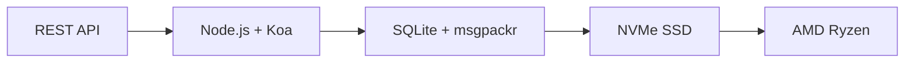

# De eerste complete e-mail-API: hoe Forward Email e-mailbeheer revolutioneerde {#the-first-complete-email-api-how-forward-email-revolutionized-email-management}


<p class="lead mt-3">
<strong>TL;DR:</strong> We hebben 's werelds eerste complete REST API voor e-mailbeheer gebouwd met geavanceerde zoekmogelijkheden die geen enkele andere dienst biedt. Terwijl Gmail, Outlook en Apple ontwikkelaars dwingen tot IMAP-hel of API's met beperkte snelheid, biedt Forward Email razendsnelle CRUD-bewerkingen voor berichten, mappen, contacten en agenda's via een uniforme REST-interface met meer dan 15 zoekparameters. Dit is de e-mail API waar ontwikkelaars op hebben gewacht.
</p>

## Inhoudsopgave {#table-of-contents}

* [Het e-mail API-probleem](#the-email-api-problem)
* [Wat ontwikkelaars eigenlijk zeggen](#what-developers-are-actually-saying)
* [De revolutionaire oplossing van Forward Email](#forward-emails-revolutionary-solution)
  * [Waarom we dit hebben gebouwd](#why-we-built-this)
  * [Eenvoudige authenticatie](#simple-authentication)
* [20 eindpunten die alles veranderen](#20-endpoints-that-change-everything)
  * [Berichten (5 eindpunten)](#messages-5-endpoints)
  * [Mappen (5 eindpunten)](#folders-5-endpoints)
  * [Contacten (5 eindpunten)](#contacts-5-endpoints)
  * [Kalenders (5 eindpunten)](#calendars-5-endpoints)
* [Geavanceerd zoeken: geen enkele andere service is vergelijkbaar](#advanced-search-no-other-service-compares)
  * [Het zoek-API-landschap is kapot](#the-search-api-landscape-is-broken)
  * [De revolutionaire zoek-API van Forward Email](#forward-emails-revolutionary-search-api)
  * [Voorbeelden van zoekopdrachten in de echte wereld](#real-world-search-examples)
  * [Prestatievoordelen](#performance-advantages)
  * [Zoekfuncties die niemand anders heeft](#search-features-no-one-else-has)
  * [Waarom dit belangrijk is voor ontwikkelaars](#why-this-matters-for-developers)
  * [De technische implementatie](#the-technical-implementation)
* [Razendsnelle prestatiearchitectuur](#blazing-fast-performance-architecture)
  * [Prestatiebenchmarks](#performance-benchmarks)
  * [Privacy-First Architectuur](#privacy-first-architecture)
* [Waarom wij anders zijn: de volledige vergelijking](#why-were-different-the-complete-comparison)
  * [Beperkingen van grote aanbieders](#major-provider-limitations)
  * [Voordelen van het doorsturen van e-mails](#forward-email-advantages)
  * [Het probleem van open-source transparantie](#the-open-source-transparency-problem)
* [30+ voorbeelden van integratie uit de praktijk](#30-real-world-integration-examples)
  * [1. Verbetering van het WordPress-contactformulier](#1-wordpress-contact-form-enhancement)
  * [2. Zapier-alternatief voor e-mailautomatisering](#2-zapier-alternative-for-email-automation)
  * [3. CRM-e-mailsynchronisatie](#3-crm-email-synchronization)
  * [4. E-commerce orderverwerking](#4-e-commerce-order-processing)
  * [5. Integratie van supporttickets](#5-support-ticket-integration)
  * [6. Nieuwsbriefbeheersysteem](#6-newsletter-management-system)
  * [7. E-mailgebaseerd takenbeheer](#7-email-based-task-management)
  * [8. E-mailaggregatie voor meerdere accounts](#8-multi-account-email-aggregation)
  * [9. Geavanceerd e-mailanalysedashboard](#9-advanced-email-analytics-dashboard)
  * [10. Slimme e-mailarchivering](#10-smart-email-archiving)
  * [11. Integratie van e-mail naar agenda](#11-email-to-calendar-integration)
  * [12. E-mailback-up en naleving](#12-email-backup-and-compliance)
  * [13. E-mailgebaseerd contentbeheer](#13-email-based-content-management)
  * [14. Beheer van e-mailsjablonen](#14-email-template-management)
  * [15. E-mailgebaseerde workflowautomatisering](#15-email-based-workflow-automation)
  * [16. E-mailbeveiligingsbewaking](#16-email-security-monitoring)
  * [17. E-mailgebaseerde enquêteverzameling](#17-email-based-survey-collection)
  * [18. E-mailprestatiebewaking](#18-email-performance-monitoring)
  * [19. E-mailgebaseerde leadkwalificatie](#19-email-based-lead-qualification)
  * [20. E-mailgebaseerd projectmanagement](#20-email-based-project-management)
  * [21. E-mailgebaseerd voorraadbeheer](#21-email-based-inventory-management)
  * [22. E-mailgebaseerde factuurverwerking](#22-email-based-invoice-processing)
  * [23. Registratie voor evenementen via e-mail](#23-email-based-event-registration)
  * [24. E-mailgebaseerde workflow voor documentgoedkeuring](#24-email-based-document-approval-workflow)
  * [25. E-mailgebaseerde klantfeedbackanalyse](#25-email-based-customer-feedback-analysis)
  * [26. E-mailgebaseerde wervingspijplijn](#26-email-based-recruitment-pipeline)
  * [27. E-mailgebaseerde verwerking van onkostennota's](#27-email-based-expense-report-processing)
  * [28. E-mailgebaseerde kwaliteitsborgingsrapportage](#28-email-based-quality-assurance-reporting)
  * [29. E-mailgebaseerd leveranciersbeheer](#29-email-based-vendor-management)
  * [30. E-mailgebaseerde sociale media monitoring](#30-email-based-social-media-monitoring)
* [Aan de slag](#getting-started)
  * [1. Maak uw doorstuur-e-mailaccount aan](#1-create-your-forward-email-account)
  * [2. API-referenties genereren](#2-generate-api-credentials)
  * [3. Maak uw eerste API-aanroep](#3-make-your-first-api-call)
  * [4. Verken de documentatie](#4-explore-the-documentation)
* [Technische bronnen](#technical-resources)

## Het e-mail API-probleem {#the-email-api-problem}

E-mail-API's zijn fundamenteel defect. Punt.

Elke grote e-mailprovider dwingt ontwikkelaars tot een van de twee verschrikkelijke keuzes:

1. **IMAP Hell**: worstelen met een 30 jaar oud protocol, ontworpen voor desktopclients, niet voor moderne applicaties
2. **Verminkte API's**: API's met beperkte snelheid, alleen-lezen en OAuth-complexe API's die je e-mailgegevens niet kunnen beheren

Het resultaat? Ontwikkelaars laten e-mailintegratie volledig links liggen of verspillen weken aan het bouwen van kwetsbare IMAP-wrappers die voortdurend vastlopen.

> \[!WARNING]
> **Het vuile geheim**: De meeste "e-mail-API's" zijn gewoon verzend-API's. Je kunt mappen niet programmatisch ordenen, contacten synchroniseren of agenda's beheren via een eenvoudige REST-interface. Tot nu toe.

## Wat ontwikkelaars eigenlijk zeggen {#what-developers-are-actually-saying}

De frustratie is reëel en overal gedocumenteerd:

> "Ik heb onlangs geprobeerd Gmail in mijn app te integreren, maar ik heb er te veel tijd in gestoken. Ik heb besloten dat het de moeite niet waard is om Gmail te ondersteunen."
>
> *- [Hacker News-ontwikkelaar](https://news.ycombinator.com/item?id=42106944), 147 upvotes*

> "Zijn alle e-mail-API's middelmatig? Ze lijken op de een of andere manier beperkt of beperkend."
>
> *- [Reddit r/SaaS-discussie](https://www.reddit.com/r/SaaS/comments/1cm84s7/are_all_email_apis_mediocre/)*

> "Waarom is e-mailontwikkeling zo slecht?"

> *- [Reddit r/webdev](https://www.reddit.com/r/webdev/comments/15trnp2/why_does_email_development_have_to_suck/), 89 reacties over ontwikkelaarsproblemen*

> "Wat maakt de Gmail API efficiënter dan IMAP? Een andere reden waarom de Gmail API veel efficiënter is, is dat elk bericht maar één keer hoeft te worden gedownload. Met IMAP moet elk bericht worden gedownload en geïndexeerd..."
>
> *- [Stack Overflow-vraag](https://stackoverflow.com/questions/25431022/what-makes-the-gmail-api-more-efficient-than-imap) met 47 upvotes*

Het bewijs is overal:

* **WordPress SMTP-problemen**: [631 GitHub-problemen](https://github.com/awesomemotive/WP-Mail-SMTP/issues) over mislukte e-mailbezorging
* **Zapier-beperkingen**: [Klachten van de gemeenschap](https://community.zapier.com/featured-articles-65/email-parser-by-zapier-limitations-and-alternatives-16958) over limieten van 10 e-mails/uur en mislukte IMAP-detectie
* **IMAP API-projecten**: [Meervoudig](https://github.com/ewildgoose/imap-api) [open source](https://emailengine.app/) [projecten](https://www.npmjs.com/package/imapflow) bestaan specifiek om "IMAP naar REST te converteren", omdat geen enkele provider dit aanbiedt
* **Frustraties met de Gmail API**: [Stapeloverloop](https://stackoverflow.com/questions/tagged/gmail-api) heeft 4847 vragen met de tag "gmail-api" met veelvoorkomende klachten over snelheidslimieten en complexiteit

## De revolutionaire oplossing van Forward Email {#forward-emails-revolutionary-solution}

**Wij zijn de eerste e-mailservice die complete CRUD-bewerkingen voor alle e-mailgegevens aanbiedt via een uniforme REST API.**

Dit is niet zomaar een verzendende API. Dit is volledige programmatische controle over:

* **Berichten**: Maken, lezen, bijwerken, verwijderen, zoeken, verplaatsen, markeren
* **Mappen**: Volledig IMAP-mapbeheer via REST-eindpunten
* **Contacten**: [KaartDAV](https://tools.ietf.org/html/rfc6352) contactopslag en -synchronisatie
* **Agenda's**: [CalDAV](https://tools.ietf.org/html/rfc4791) agenda-afspraken en planning

### Waarom we deze {#why-we-built-this} hebben gebouwd

**Het probleem**: Elke e-mailprovider behandelt e-mail als een black box. Je kunt e-mails versturen en misschien lezen met complexe OAuth, maar je kunt je e-mailgegevens niet echt programmatisch *beheren*.

**Onze visie**: E-mail moet net zo eenvoudig te integreren zijn als elke moderne API. Geen IMAP-bibliotheken. Geen OAuth-complexiteit. Geen nachtmerries over snelheidslimieten. Gewoon eenvoudige REST-eindpunten die werken.

**Het resultaat**: De eerste e-mailservice waarmee u een complete e-mailclient, CRM-integratie of automatiseringssysteem kunt bouwen met alleen HTTP-verzoeken.

### Eenvoudige authenticatie {#simple-authentication}

Geen [OAuth-complexiteit](https://oauth.net/2/). Geen [app-specifieke wachtwoorden](https://support.google.com/accounts/answer/185833). Alleen uw aliasgegevens:

```bash
curl -u "alias@yourdomain.com:password" \
  https://api.forwardemail.net/v1/messages
```

## 20 eindpunten die alles veranderen {#20-endpoints-that-change-everything}

### Berichten (5 eindpunten) {#messages-5-endpoints}

* `GET /v1/messages` - Berichten weergeven met filtering (`?folder=`, `?is_unread=`, `?is_flagged=`)
* `POST /v1/messages` - Nieuwe berichten rechtstreeks naar mappen sturen
* `GET /v1/messages/:id` - Specifiek bericht ophalen met volledige metadata
* `PUT /v1/messages/:id` - Bericht bijwerken (vlaggen, map, leesstatus)
* `DELETE /v1/messages/:id` - Bericht permanent verwijderen

### Mappen (5 eindpunten) {#folders-5-endpoints}

* `GET /v1/folders` - Alle mappen met abonnementsstatus weergeven
* `POST /v1/folders` - Nieuwe map aanmaken met aangepaste eigenschappen
* `GET /v1/folders/:id` - Mapdetails en berichtenaantallen ophalen
* `PUT /v1/folders/:id` - Mapeigenschappen en abonnement bijwerken
* `DELETE /v1/folders/:id` - Map verwijderen en berichten verplaatsen

### Contacten (5 eindpunten) {#contacts-5-endpoints}

* `GET /v1/contacts` - Contacten weergeven met zoekfunctie en paginering
* `POST /v1/contacts` - Nieuw contact aanmaken met volledige vCard-ondersteuning
* `GET /v1/contacts/:id` - Contact ophalen met alle velden en metadata
* `PUT /v1/contacts/:id` - Contactgegevens bijwerken met ETag-validatie
* `DELETE /v1/contacts/:id` - Contact verwijderen met cascadeverwerking

### Kalenders (5 eindpunten) {#calendars-5-endpoints}

* `GET /v1/calendars` - Agenda-evenementen weergeven met datumfiltering
* `POST /v1/calendars` - Agenda-evenement aanmaken met deelnemers en herhaling
* `GET /v1/calendars/:id` - Evenementdetails ophalen met tijdzonebeheer
* `PUT /v1/calendars/:id` - Evenement bijwerken met conflictdetectie
* `DELETE /v1/calendars/:id` - Evenement verwijderen met deelnemersmeldingen

## Geavanceerd zoeken: Geen andere service is vergelijkbaar met {#advanced-search-no-other-service-compares}

**Forward Email is de enige e-mailservice die via een REST API een uitgebreide, programmatische zoekopdracht in alle berichtvelden biedt.**

Terwijl andere providers hooguit basisfiltering bieden, hebben wij de meest geavanceerde e-mailzoek-API ooit ontwikkeld. Geen enkele Gmail API, Outlook API of andere dienst komt in de buurt van onze zoekmogelijkheden.

### Het zoek-API-landschap is kapot {#the-search-api-landscape-is-broken}

**Beperkingen van Gmail API-zoekopdrachten:**

* ✅ Alleen de basisparameter `q`
* ❌ Geen veldspecifieke zoekopdracht
* ❌ Geen filtering op datumbereik
* ❌ Geen filtering op basis van grootte
* ❌ Geen filtering op bijlagen
* ❌ Beperkt tot de zoeksyntaxis van Gmail

**Beperkingen van Outlook API-zoekopdrachten:**

* ✅ Basisparameter `$search`
* ❌ Geen geavanceerde veldtargeting
* ❌ Geen complexe querycombinaties
* ❌ Agressieve snelheidsbeperking
* ❌ Complexe OData-syntaxis vereist

**Apple iCloud:**

* ❌ Geen enkele API
* ❌ Alleen IMAP-zoekfunctie (als je het werkend krijgt)

**ProtonMail en Tuta:**

* ❌ Geen openbare API's
* ❌ Geen programmatische zoekmogelijkheden

### Revolutionaire zoek-API van Forward Email {#forward-emails-revolutionary-search-api}

**Wij bieden meer dan 15 zoekparameters die geen enkele andere service biedt:**

| Zoekmogelijkheid | E-mail doorsturen | Gmail API | Outlook API | Anderen |
| ------------------------------ | -------------------------------------- | ------------ | ------------------ | ------ |
| **Veldspecifieke zoekopdracht** | ✅ Onderwerp, hoofdtekst, van, aan, cc, kopteksten | ❌ | ❌ | ❌ |
| **Algemene zoekopdracht met meerdere velden** | ✅ `?search=` in alle velden | ✅ Basis `q=` | ✅ Basis `$search=` | ❌ |
| **Datumbereikfiltering** | ✅ `?since=` & `?before=` | ❌ | ❌ | ❌ |
| **Filtering op basis van grootte** | ✅ `?min_size=` & `?max_size=` | ❌ | ❌ | ❌ |
| **Bijlagefiltering** | ✅ `?has_attachments=true/false` | ❌ | ❌ | ❌ |
| **Koptekst zoeken** | ✅ `?headers=X-Priority` | ❌ | ❌ | ❌ |
| **Bericht-ID zoeken** | ✅ `?message_id=abc123` | ❌ | ❌ | ❌ |
| **Gecombineerde filters** | ✅ Meerdere parameters met EN-logica | ❌ | ❌ | ❌ |
| **Hoofdlettergevoelig** | ✅ Alle zoekopdrachten | ✅ | ✅ | ❌ |
| **Ondersteuning voor pagina-indeling** | ✅ Werkt met alle zoekparameters | ✅ | ✅ | ❌ |

### Voorbeelden van zoekopdrachten in de echte wereld {#real-world-search-examples}

**Vind alle facturen van het afgelopen kwartaal:**

```bash
# Forward Email - Simple and powerful
GET /v1/messages?subject=invoice&since=2024-01-01T00:00:00Z&before=2024-04-01T00:00:00Z

# Gmail API - Impossible with their limited search
# No date range filtering available

# Outlook API - Complex OData syntax, limited functionality
GET /me/messages?$search="invoice"&$filter=receivedDateTime ge 2024-01-01T00:00:00Z
```

**Zoeken naar grote bijlagen van een specifieke afzender:**

```bash
# Forward Email - Comprehensive filtering
GET /v1/messages?from=finance@company.com&has_attachments=true&min_size=1000000

# Gmail API - Cannot filter by size or attachments programmatically
# Outlook API - No size filtering available
# Others - No APIs available
```

**Complexe zoekopdracht in meerdere velden:**

```bash
# Forward Email - Advanced query capabilities
GET /v1/messages?body=quarterly&from=manager&is_flagged=true&folder=Reports

# Gmail API - Limited to basic text search only
GET /gmail/v1/users/me/messages?q=quarterly

# Outlook API - Basic search without field targeting
GET /me/messages?$search="quarterly"
```

### Prestatievoordelen {#performance-advantages}

**Prestaties van doorstuur-e-mailzoekopdrachten:**

* ⚡ **Responstijden onder de 100 ms** voor complexe zoekopdrachten
* 🔍 **Regex-optimalisatie** met correcte indexering
* 📊 **Parallelle query-uitvoering** voor tellingen en gegevens
* 💾 **Efficiënt geheugengebruik** met lean query's

**Problemen met de prestaties van concurrenten:**

* 🐌 **Gmail API**: Snelheid beperkt tot 250 quota-eenheden per gebruiker per seconde
* 🐌 **Outlook API**: Agressieve throttling met complexe backoff-vereisten
* 🐌 **Overige**: Geen API's om mee te vergelijken

### Zoekfuncties die niemand anders heeft {#search-features-no-one-else-has}

#### 1. Header-specifieke zoekopdracht {#1-header-specific-search}

```bash
# Find messages with specific headers
GET /v1/messages?headers=X-Priority:1
GET /v1/messages?headers=X-Spam-Score
```

#### 2. Op grootte gebaseerde intelligentie {#2-size-based-intelligence}

```bash
# Find newsletter emails (typically large)
GET /v1/messages?min_size=50000&from=newsletter

# Find quick replies (typically small)
GET /v1/messages?max_size=1000&to=support
```

#### 3. Op bijlagen gebaseerde workflows {#3-attachment-based-workflows}

```bash
# Find all documents sent to legal team
GET /v1/messages?to=legal&has_attachments=true&body=contract

# Find emails without attachments for cleanup
GET /v1/messages?has_attachments=false&before=2023-01-01T00:00:00Z
```

#### 4. Gecombineerde bedrijfslogica {#4-combined-business-logic}

```bash
# Find urgent flagged messages from VIPs with attachments
GET /v1/messages?is_flagged=true&from=ceo&has_attachments=true&subject=urgent
```

### Waarom dit belangrijk is voor ontwikkelaars {#why-this-matters-for-developers}

**Bouw applicaties die voorheen onmogelijk waren:**

1. **Geavanceerde e-mailanalyse**: Analyseer e-mailpatronen op basis van grootte, afzender en inhoud
2. **Intelligent e-mailbeheer**: Organiseer automatisch op basis van complexe criteria
3. **Compliance en detectie**: Vind specifieke e-mails die voldoen aan wettelijke vereisten
4. **Business intelligence**: Haal inzichten uit e-mailcommunicatiepatronen
5. **Geautomatiseerde workflows**: Activeer acties op basis van geavanceerde e-mailfilters

### De technische implementatie {#the-technical-implementation}

Onze zoek-API maakt gebruik van:

* **Regex-optimalisatie** met de juiste indexeringsstrategieën
* **Parallelle uitvoering** voor prestaties
* **Invoervalidatie** voor beveiliging
* **Uitgebreide foutverwerking** voor betrouwbaarheid

```javascript
// Example: Complex search implementation
const searchConditions = [];

if (ctx.query.subject) {
  searchConditions.push({
    subject: { $regex: ctx.query.subject, $options: 'i' }
  });
}

if (ctx.query.from) {
  searchConditions.push({
    $or: [
      { 'from.address': { $regex: ctx.query.from, $options: 'i' } },
      { 'from.name': { $regex: ctx.query.from, $options: 'i' } }
    ]
  });
}

// Combine with AND logic
if (searchConditions.length > 0) {
  query.$and = searchConditions;
}
```

> \[!TIP]
> **Ontwikkelaarsvoordeel**: Met de zoek-API van Forward Email kunt u e-mailapplicaties bouwen die qua functionaliteit concurreren met desktopclients, terwijl u de eenvoud van REST API's behoudt.

## Razendsnelle prestatie-architectuur {#blazing-fast-performance-architecture}

Onze technische stack is gebouwd voor snelheid en betrouwbaarheid:



### Prestatiebenchmarks {#performance-benchmarks}

**Waarom we razendsnel zijn:**

| Onderdeel | Technologie | Prestatievoordeel |
| ------------ | --------------------------------------------------------------------------------- | --------------------------------------------- |
| **Opslag** | [NVMe SSD](https://en.wikipedia.org/wiki/NVM_Express) | 10x sneller dan traditionele SATA |
| **Databank** | [SQLite](https://sqlite.org/) + [msgpackr](https://github.com/kriszyp/msgpackr) | Geen netwerklatentie, geoptimaliseerde serialisatie |
| **Hardware** | [AMD Ryzen](https://www.amd.com/en/products/processors/desktops/ryzen) blank metaal | Geen virtualisatie-overhead |
| **Cachen** | In het geheugen + persistent | Responstijden van minder dan een milliseconde |
| **Back-ups** | [Cloudflare R2](https://www.cloudflare.com/products/r2/) gecodeerd | Betrouwbaarheid op ondernemingsniveau |

**Echte prestatiecijfers:**

* **API-responstijd**: gemiddeld < 50 ms
* **Berichtophaling**: < 10 ms voor gecachte berichten
* **Mapbewerkingen**: < 5 ms voor metadatabewerkingen
* **Contactsynchronisatie**: meer dan 1000 contacten/seconde
* **Uptime**: 99,99% SLA met redundante infrastructuur

### Privacy-eerste architectuur {#privacy-first-architecture}

**Zero-Knowledge Design**: Alleen jij hebt toegang met je IMAP-wachtwoord - wij kunnen je e-mails niet lezen. Onze [zero-knowledge architectuur](https://forwardemail.net/en/security) garandeert volledige privacy en levert tegelijkertijd razendsnelle prestaties.

## Waarom wij anders zijn: de volledige vergelijking {#why-were-different-the-complete-comparison}

### Belangrijke beperkingen voor aanbieders {#major-provider-limitations}

| Aanbieder | Kernproblemen | Specifieke beperkingen |
| ---------------- | ----------------------------------------- | -------------------------------------------------------------------------------------------------------------------------------------------------------------------------------------------------------------------------------------------------------------------------------------------------------------------------------------------------------------------------------------------------------------------------------------------------------------------- |
| **Gmail API** | Alleen-lezen, complexe OAuth, afzonderlijke API's | • [Cannot modify existing messages](https://developers.google.com/gmail/api/reference/rest/v1/users.messages)<br>• [Labels ≠ folders](https://developers.google.com/gmail/api/reference/rest/v1/users.labels)<br>• [1 billion quota units/day limit](https://developers.google.com/gmail/api/reference/quota)<br>• [Requires separate APIs](https://developers.google.com/workspace) voor contacten/agenda |
| **Outlook API** | Verouderd, verwarrend, gericht op ondernemingen | • [REST endpoints deprecated March 2024](https://learn.microsoft.com/en-us/outlook/rest/compare-graph)<br>• [Multiple confusing APIs](https://learn.microsoft.com/en-us/office/client-developer/outlook/selecting-an-api-or-technology-for-developing-solutions-for-outlook) (EWS, Grafiek, REST)<br>• [Microsoft Graph complexity](https://learn.microsoft.com/en-us/graph/overview)<br>• [Aggressive throttling](https://learn.microsoft.com/en-us/graph/throttling) |
| **Apple iCloud** | Geen openbare API | • [No public API whatsoever](https://support.apple.com/en-us/102654)<br>• [IMAP-only with 1000 emails/day limit](https://support.apple.com/en-us/102654)<br>• [App-specific passwords required](https://support.apple.com/en-us/102654)<br>• [500 recipients per message limit](https://support.apple.com/en-us/102654) |
| **ProtonMail** | Geen API, valse open-sourceclaims | • [No public API available](https://proton.me/support/protonmail-bridge-clients)<br>• [Bridge software required](https://proton.me/mail/bridge) voor IMAP-toegang<br>• [Claims "open source"](https://proton.me/blog/open-source) maar [server code is proprietary](https://github.com/ProtonMail)<br>• [Limited to paid plans only](https://proton.me/pricing) |
| **Totaal** | Geen API, misleidende transparantie | • [No REST API for email management](https://tuta.com/support#technical)<br>• [Claims "open source"](https://tuta.com/blog/posts/open-source-email) maar [backend is closed](https://github.com/tutao/tutanota)<br>• [IMAP/SMTP not supported](https://tuta.com/support#imap)<br>• [Proprietary encryption](https://tuta.com/encryption) voorkomt standaardintegraties |
| **Zapier-e-mail** | Ernstige tarieflimieten | • [10 emails per hour limit](https://help.zapier.com/hc/en-us/articles/8496181555597-Email-Parser-by-Zapier-limitations-and-alternatives)<br>• [No IMAP folder access](https://help.zapier.com/hc/en-us/articles/8496181555597-Email-Parser-by-Zapier-limitations-and-alternatives)<br>• [Limited parsing capabilities](https://help.zapier.com/hc/en-us/articles/8496181555597-Email-Parser-by-Zapier-limitations-and-alternatives) |

### Voordelen van doorsturen van e-mail {#forward-email-advantages}

| Functie | E-mail doorsturen | Concurrentie |
| ------------------ | -------------------------------------------------------------------------------------------- | ----------------------------------------- |
| **Volledige CRUD** | ✅ Volledig aanmaken, lezen, bijwerken en verwijderen voor alle gegevens | ❌ Alleen-lezen of beperkte bewerkingen |
| **Geünificeerde API** | ✅ Berichten, mappen, contacten, agenda's in één API | ❌ Afzonderlijke API's of ontbrekende functies |
| **Eenvoudige autorisatie** | ✅ Basisverificatie met alias-inloggegevens | ❌ Complexe OAuth met meerdere scopes |
| **Geen tarieflimieten** | ✅ Ruime limieten ontworpen voor echte toepassingen | ❌ Beperkende quota's die workflows verstoren |
| **Zelfhosting** | ✅ [Complete self-hosting option](https://forwardemail.net/en/blog/docs/self-hosted-solution) | ❌ Alleen leveranciersbinding |
| **Privacy** | ✅ Zero-knowledge, gecodeerd, privé | ❌ Data mining en privacyproblemen |
| **Prestatie** | ✅ Reacties van minder dan 50 ms, NVMe-opslag | ❌ Netwerklatentie, vertragingen door throttling |

### Het probleem van open-source transparantie {#the-open-source-transparency-problem}

**ProtonMail en Tuta profileren zichzelf als "open source" en "transparant", maar dit is misleidende marketing die in strijd is met de moderne privacybeginselen.**

> \[!WARNING]
> **Onjuiste transparantieclaims**: Zowel ProtonMail als Tuta adverteren prominent met hun "open source"-referenties, terwijl hun belangrijkste server-side code eigendom en gesloten blijft.

**ProtonMail's Bedrog:**

* **Claims**: ["Wij zijn open source"](https://proton.me/blog/open-source) prominent in marketing
* **Realiteit**: [De servercode is volledig eigendom](https://github.com/ProtonMail) - alleen client-apps zijn open source
* **Impact**: Gebruikers kunnen server-side encryptie, gegevensverwerking of privacyclaims niet verifiëren
* **Transparantieschending**: Geen manier om de daadwerkelijke e-mailverwerkings- en opslagsystemen te controleren

**Tuta's misleidende marketing:**

* **Claims**: ["Open source e-mail"](https://tuta.com/blog/posts/open-source-email) als belangrijk verkoopargument
* **Realiteit**: [Backend-infrastructuur is gesloten bron](https://github.com/tutao/tutanota) - alleen frontend is beschikbaar
* **Impact**: Eigen encryptie voorkomt standaard e-mailprotocollen (IMAP/SMTP)
* **Lock-in-strategie**: Aangepaste encryptie dwingt tot leveranciersafhankelijkheid

**Waarom dit belangrijk is voor moderne privacy:**

In 2025 vereist echte privacy **volledige transparantie**. Wanneer e-mailproviders "open source" claimen, maar hun servercode verbergen:

1. **Onverifieerbare encryptie**: U kunt niet controleren hoe uw gegevens daadwerkelijk zijn versleuteld
2. **Verborgen datapraktijken**: Server-side dataverwerking blijft een black box
3. **Op vertrouwen gebaseerde beveiliging**: U moet hun beweringen zonder verificatie vertrouwen
4. **Leverancierslock-in**: Eigen systemen verhinderen dataportabiliteit

**Echte transparantie van Forward Email:**

* ✅ **[Volledig open source](https://github.com/forwardemail/forwardemail.net)** - server- en clientcode
* ✅ **[Zelfhosting beschikbaar](https://forwardemail.net/en/blog/docs/self-hosted-solution)** - voer uw eigen instance uit
* ✅ **Standaardprotocollen** - IMAP, SMTP, CardDAV, CalDAV-compatibiliteit
* ✅ **Controleerbare beveiliging** - elke regel code kan worden gecontroleerd
* ✅ **Geen vendor lock-in** - uw gegevens, uw controle

> \[!TIP]
> **Echte open source betekent dat u elke claim kunt verifiëren.** Met Forward Email kunt u onze encryptie controleren, onze gegevensverwerking bekijken en zelfs uw eigen instance uitvoeren. Dat is échte transparantie.

## 30+ Real-world integratievoorbeelden {#30-real-world-integration-examples}

### 1. Verbetering van WordPress-contactformulier {#1-wordpress-contact-form-enhancement}

**Probleem**: [WordPress SMTP-configuratiefouten](https://github.com/awesomemotive/WP-Mail-SMTP/issues) ([631 GitHub-problemen](https://github.com/awesomemotive/WP-Mail-SMTP/issues))
**Oplossing**: Directe API-integratie omzeilt [SMTP](https://tools.ietf.org/html/rfc5321) volledig

```javascript
// WordPress contact form that saves to Sent folder
await fetch('https://api.forwardemail.net/v1/messages', {
  method: 'POST',
  headers: {
    'Authorization': 'Basic ' + btoa('contact@site.com:password'),
    'Content-Type': 'application/json'
  },
  body: JSON.stringify({
    to: [{ address: 'owner@site.com' }],
    subject: 'Contact Form: ' + formData.subject,
    text: formData.message,
    folder: 'Sent'
  })
});
```

### 2. Zapier-alternatief voor e-mailautomatisering {#2-zapier-alternative-for-email-automation}

**Probleem**: [Zapier's limiet van 10 e-mails/uur](https://help.zapier.com/hc/en-us/articles/8496181555597-Email-Parser-by-Zapier-limitations-and-alternatives) en [IMAP-detectiefouten](https://community.zapier.com/featured-articles-65/email-parser-by-zapier-limitations-and-alternatives-16958)
**Oplossing**: Onbeperkte automatisering met volledige e-mailcontrole

```javascript
// Auto-organize emails by sender domain
const messages = await fetch('/v1/messages?folder=INBOX');
for (const message of messages) {
  const domain = message.from.split('@')[1];
  await fetch(`/v1/messages/${message.id}`, {
    method: 'PUT',
    body: JSON.stringify({ folder: `Clients/${domain}` })
  });
}
```

### 3. CRM-e-mailsynchronisatie {#3-crm-email-synchronization}

**Probleem**: Handmatig contactbeheer tussen e-mail en [CRM-systemen](https://en.wikipedia.org/wiki/Customer_relationship_management)
**Oplossing**: Tweerichtingssynchronisatie met de contact-API van [KaartDAV](https://tools.ietf.org/html/rfc6352)

```javascript
// Sync new email contacts to CRM
const newContacts = await fetch('/v1/contacts');
for (const contact of newContacts) {
  await crmAPI.createContact({
    name: contact.name,
    email: contact.email,
    source: 'email_api'
  });
}
```

### 4. E-commerce orderverwerking {#4-e-commerce-order-processing}

**Probleem**: Handmatige orderverwerking via e-mail voor [e-commerceplatforms](https://en.wikipedia.org/wiki/E-commerce)
**Oplossing**: Geautomatiseerde orderbeheerpijplijn

```javascript
// Process order confirmation emails
const orders = await fetch('/v1/messages?folder=Orders');
const orderEmails = orders.filter(msg =>
  msg.subject.includes('Order Confirmation')
);

for (const order of orderEmails) {
  const orderData = parseOrderEmail(order.text);
  await updateInventory(orderData);
  await fetch(`/v1/messages/${order.id}`, {
    method: 'PUT',
    body: JSON.stringify({ folder: 'Orders/Processed' })
  });
}
```

### 5. Integratie van supporttickets {#5-support-ticket-integration}

**Probleem**: E-mailthreads verspreid over [helpdeskplatforms](https://en.wikipedia.org/wiki/Help_desk_software)
**Oplossing**: Volledige e-mailthreadtracking

```javascript
// Create support ticket from email thread
const messages = await fetch('/v1/messages?folder=Support');
const supportEmails = messages.filter(msg =>
  msg.to.some(addr => addr.includes('support@'))
);

for (const email of supportEmails) {
  const ticket = await supportSystem.createTicket({
    subject: email.subject,
    from: email.from,
    body: email.text,
    timestamp: email.date
  });
}
```

### 6. Nieuwsbriefbeheersysteem {#6-newsletter-management-system}

**Probleem**: Beperkte [nieuwsbriefplatform](https://en.wikipedia.org/wiki/Email_marketing)-integraties
**Oplossing**: Volledig beheer van de levenscyclus van abonnees

```javascript
// Auto-manage newsletter subscriptions
const messages = await fetch('/v1/messages?folder=Newsletter');
const unsubscribes = messages.filter(msg =>
  msg.subject.toLowerCase().includes('unsubscribe')
);

for (const msg of unsubscribes) {
  await removeSubscriber(msg.from);
  await fetch(`/v1/messages/${msg.id}`, {
    method: 'PUT',
    body: JSON.stringify({ folder: 'Newsletter/Unsubscribed' })
  });
}
```

### 7. E-mailgebaseerd takenbeheer {#7-email-based-task-management}

**Probleem**: Overvolle inbox en [taakregistratie](https://en.wikipedia.org/wiki/Task_management)
**Oplossing**: E-mails omzetten in uitvoerbare taken

```javascript
// Create tasks from flagged emails
const messages = await fetch('/v1/messages?is_flagged=true');
for (const email of messages) {
  await taskManager.createTask({
    title: email.subject,
    description: email.text,
    assignee: email.to[0].address,
    dueDate: extractDueDate(email.text)
  });
}
```

### 8. E-mailaggregatie voor meerdere accounts {#8-multi-account-email-aggregation}

**Probleem**: [meerdere e-mailaccounts](https://en.wikipedia.org/wiki/Email_client) beheren voor meerdere providers
**Oplossing**: Geïntegreerde inboxinterface

```javascript
// Aggregate emails from multiple accounts
const accounts = ['work@domain.com', 'personal@domain.com'];
const allMessages = [];

for (const account of accounts) {
  const messages = await fetch('/v1/messages', {
    headers: { 'Authorization': getAuth(account) }
  });
  allMessages.push(...messages.map(m => ({ ...m, account })));
}
```

### 9. Geavanceerd dashboard voor e-mailanalyse {#9-advanced-email-analytics-dashboard}

**Probleem**: Geen inzicht in [e-mailpatronen](https://en.wikipedia.org/wiki/Email_analytics) met geavanceerde filtering
**Oplossing**: Aangepaste e-mailanalyse met geavanceerde zoekmogelijkheden

```javascript
// Generate comprehensive email analytics using advanced search
const analytics = {};

// Analyze email volume by sender domain
const messages = await fetch('/v1/messages');
analytics.senderDomains = analyzeSenderDomains(messages);

// Find large attachments consuming storage
const largeAttachments = await fetch('/v1/messages?has_attachments=true&min_size=1000000');
analytics.storageHogs = largeAttachments.map(msg => ({
  subject: msg.subject,
  from: msg.from,
  size: msg.size
}));

// Analyze communication patterns with VIPs
const vipEmails = await fetch('/v1/messages?from=ceo@company.com');
const urgentVipEmails = await fetch('/v1/messages?from=ceo@company.com&subject=urgent');
analytics.vipCommunication = {
  total: vipEmails.length,
  urgent: urgentVipEmails.length,
  urgencyRate: (urgentVipEmails.length / vipEmails.length) * 100
};

// Find unread emails by date range for follow-up
const lastWeek = new Date(Date.now() - 7 * 24 * 60 * 60 * 1000).toISOString();
const unreadRecent = await fetch(`/v1/messages?is_unread=true&since=${lastWeek}`);
analytics.followUpNeeded = unreadRecent.length;

// Analyze email sizes for optimization
const smallEmails = await fetch('/v1/messages?max_size=1000');
const mediumEmails = await fetch('/v1/messages?min_size=1000&max_size=50000');
const largeEmails = await fetch('/v1/messages?min_size=50000');
analytics.sizeDistribution = {
  small: smallEmails.length,
  medium: mediumEmails.length,
  large: largeEmails.length
};

// Search for compliance-related emails
const complianceEmails = await fetch('/v1/messages?body=confidential&has_attachments=true');
analytics.complianceReview = complianceEmails.length;
```

### 10. Slimme e-mailarchivering {#10-smart-email-archiving}

**Probleem**: Handmatige [e-mailorganisatie](https://en.wikipedia.org/wiki/Email_management)
**Oplossing**: Intelligente e-mailcategorisering

```javascript
// Auto-archive old emails by category
const messages = await fetch('/v1/messages');
const oldEmails = messages.filter(email =>
  isOlderThan(email.date, 90) // 90 days
);

for (const email of oldEmails) {
  const category = categorizeEmail(email);
  await fetch(`/v1/messages/${email.id}`, {
    method: 'PUT',
    body: JSON.stringify({ folder: `Archive/${category}` })
  });
}
```

### 11. Integratie van e-mail naar agenda {#11-email-to-calendar-integration}

**Probleem**: Handmatige aanmaak van [kalendergebeurtenis](https://tools.ietf.org/html/rfc4791) vanuit e-mails
**Oplossing**: Automatische extractie en aanmaak van gebeurtenissen

```javascript
// Extract meeting details from emails
const messages = await fetch('/v1/messages?folder=Meetings');
const meetingEmails = messages.filter(email =>
  email.subject.toLowerCase().includes('meeting')
);

for (const email of meetingEmails) {
  const meetingData = extractMeetingInfo(email.text);
  if (meetingData.date && meetingData.time) {
    await fetch('/v1/calendars', {
      method: 'POST',
      body: JSON.stringify({
        title: email.subject,
        start: meetingData.datetime,
        attendees: [email.from, ...email.to]
      })
    });
  }
}
```

### 12. E-mailback-up en naleving {#12-email-backup-and-compliance}

**Probleem**: [E-mailbehoud](https://en.wikipedia.org/wiki/Email_retention_policy) en nalevingsvereisten
**Oplossing**: Geautomatiseerde back-up met behoud van metadata

```javascript
// Backup emails with full metadata
const allMessages = await fetch('/v1/messages');
const backup = {
  timestamp: new Date(),
  messages: allMessages.map(msg => ({
    id: msg.id,
    subject: msg.subject,
    from: msg.from,
    to: msg.to,
    date: msg.date,
    flags: msg.flags
  }))
};
await saveToComplianceStorage(backup);
```

### 13. E-mailgebaseerd contentbeheer {#13-email-based-content-management}

**Probleem**: Het beheren van contentinzendingen via e-mail voor [CMS-platformen](https://en.wikipedia.org/wiki/Content_management_system)
**Oplossing**: E-mail als contentmanagementsysteem

```javascript
// Process content submissions from email
const messages = await fetch('/v1/messages?folder=Submissions');
const submissions = messages.filter(msg =>
  msg.to.some(addr => addr.includes('submit@'))
);

for (const submission of submissions) {
  const content = parseSubmission(submission.text);
  await cms.createDraft({
    title: submission.subject,
    content: content.body,
    author: submission.from
  });
}
```

### 14. Beheer van e-mailsjablonen {#14-email-template-management}

**Probleem**: Inconsistente [e-mailsjablonen](https://en.wikipedia.org/wiki/Email_template) binnen het team
**Oplossing**: Gecentraliseerd templatesysteem met API

```javascript
// Send templated emails with dynamic content
const template = await getEmailTemplate('welcome');
await fetch('/v1/messages', {
  method: 'POST',
  body: JSON.stringify({
    to: [{ address: newUser.email }],
    subject: template.subject.replace('{{name}}', newUser.name),
    html: template.html.replace('{{name}}', newUser.name),
    folder: 'Sent'
  })
});
```

### 15. E-mailgebaseerde workflowautomatisering {#15-email-based-workflow-automation}

**Probleem**: Handmatige [goedkeuringsprocessen](https://en.wikipedia.org/wiki/Workflow) via e-mail
**Oplossing**: Geautomatiseerde workflowtriggers

```javascript
// Process approval emails
const messages = await fetch('/v1/messages?folder=Approvals');
const approvals = messages.filter(msg =>
  msg.subject.includes('APPROVAL')
);

for (const approval of approvals) {
  const decision = parseApprovalDecision(approval.text);
  await workflow.processApproval({
    requestId: extractRequestId(approval.subject),
    decision: decision,
    approver: approval.from
  });
}
```

### 16. E-mailbeveiligingsbewaking {#16-email-security-monitoring}

**Probleem**: Handmatige [detectie van beveiligingsbedreigingen](https://en.wikipedia.org/wiki/Email_security)
**Oplossing**: Geautomatiseerde bedreigingsanalyse

```javascript
// Monitor for suspicious emails
const recentEmails = await fetch('/v1/messages');
for (const email of recentEmails) {
  const threatScore = analyzeThreat(email);
  if (threatScore > 0.8) {
    await fetch(`/v1/messages/${email.id}`, {
      method: 'PUT',
      body: JSON.stringify({ folder: 'Security/Quarantine' })
    });
    await alertSecurityTeam(email);
  }
}
```

### 17. E-mailgebaseerde enquêteverzameling {#17-email-based-survey-collection}

**Probleem**: Handmatige verwerking van [enquêterespons](https://en.wikipedia.org/wiki/Survey_methodology)
**Oplossing**: Geautomatiseerde responsaggregatie

```javascript
// Collect and process survey responses
const messages = await fetch('/v1/messages?folder=Surveys');
const responses = messages.filter(msg =>
  msg.subject.includes('Survey Response')
);

const surveyData = responses.map(email => ({
  respondent: email.from,
  responses: parseSurveyData(email.text),
  timestamp: email.date
}));
await updateSurveyResults(surveyData);
```

### 18. E-mailprestatiebewaking {#18-email-performance-monitoring}

**Probleem**: Geen inzicht in [e-mailbezorgingsprestaties](https://en.wikipedia.org/wiki/Email_deliverability)
**Oplossing**: Realtime e-mailstatistieken

```javascript
// Monitor email delivery performance
const sentEmails = await fetch('/v1/messages?folder=Sent');
const deliveryStats = {
  sent: sentEmails.length,
  bounces: await countBounces(),
  deliveryRate: calculateDeliveryRate()
};
await updateDashboard(deliveryStats);
```

### 19. E-mailgebaseerde leadkwalificatie {#19-email-based-lead-qualification}

**Probleem**: Handmatige [lead scoring](https://en.wikipedia.org/wiki/Lead_scoring) vanuit e-mailinteracties
**Oplossing**: Geautomatiseerde leadkwalificatiepijplijn

```javascript
// Score leads based on email engagement
const prospects = await fetch('/v1/contacts');
for (const prospect of prospects) {
  const messages = await fetch('/v1/messages');
  const emails = messages.filter(msg =>
    msg.from.includes(prospect.email)
  );
  const score = calculateEngagementScore(emails);
  await crm.updateLeadScore(prospect.id, score);
}
```

### 20. E-mailgebaseerd projectbeheer {#20-email-based-project-management}

**Probleem**: [Projectupdates](https://en.wikipedia.org/wiki/Project_management) verspreid over e-mailthreads
**Oplossing**: Gecentraliseerde projectcommunicatiehub

```javascript
// Extract project updates from emails
const messages = await fetch('/v1/messages?folder=Projects');
const projectEmails = messages.filter(msg =>
  msg.subject.includes('Project Update')
);

for (const email of projectEmails) {
  const update = parseProjectUpdate(email.text);
  await projectManager.addUpdate({
    project: update.projectId,
    author: email.from,
    content: update.content
  });
}
```

### 21. E-mailgebaseerd voorraadbeheer {#21-email-based-inventory-management}

**Probleem**: Handmatige voorraadupdates vanuit e-mails van leveranciers
**Oplossing**: Geautomatiseerde voorraadregistratie vanuit e-mailmeldingen

```javascript
// Process inventory updates from supplier emails
const messages = await fetch('/v1/messages?folder=Suppliers');
const inventoryEmails = messages.filter(msg =>
  msg.subject.includes('Inventory Update') || msg.subject.includes('Stock Alert')
);

for (const email of inventoryEmails) {
  const inventoryData = parseInventoryUpdate(email.text);
  await inventory.updateStock({
    sku: inventoryData.sku,
    quantity: inventoryData.quantity,
    supplier: email.from,
    timestamp: email.date
  });

  // Move to processed folder
  await fetch(`/v1/messages/${email.id}`, {
    method: 'PUT',
    body: JSON.stringify({ folder: 'Suppliers/Processed' })
  });
}
```

### 22. E-mailgebaseerde factuurverwerking {#22-email-based-invoice-processing}

**Probleem**: Handmatige integratie van [factuurverwerking](https://en.wikipedia.org/wiki/Invoice_processing) en boekhoudsysteem
**Oplossing**: Geautomatiseerde factuurextractie en synchronisatie met boekhoudsystemen

```javascript
// Extract invoice data from email attachments
const messages = await fetch('/v1/messages?folder=Invoices');
const invoiceEmails = messages.filter(msg =>
  msg.subject.toLowerCase().includes('invoice') && msg.attachments.length > 0
);

for (const email of invoiceEmails) {
  const invoiceData = await extractInvoiceData(email.attachments[0]);
  await accounting.createInvoice({
    vendor: email.from,
    amount: invoiceData.total,
    dueDate: invoiceData.dueDate,
    items: invoiceData.lineItems
  });

  // Flag as processed
  await fetch(`/v1/messages/${email.id}`, {
    method: 'PUT',
    body: JSON.stringify({ flags: ['\\Seen', '\\Flagged'] })
  });
}
```

### 23. E-mailgebaseerde evenementregistratie {#23-email-based-event-registration}

**Probleem**: Handmatige verwerking van [evenementregistratie](https://en.wikipedia.org/wiki/Event_management) vanuit e-mailreacties
**Oplossing**: Geautomatiseerd deelnemersbeheer en agenda-integratie

```javascript
// Process event registration emails
const messages = await fetch('/v1/messages?folder=Events');
const registrations = messages.filter(msg =>
  msg.subject.includes('Registration') || msg.subject.includes('RSVP')
);

for (const registration of registrations) {
  const attendeeData = parseRegistration(registration.text);

  // Add to attendee list
  await events.addAttendee({
    event: attendeeData.eventId,
    name: attendeeData.name,
    email: registration.from,
    dietary: attendeeData.dietaryRestrictions
  });

  // Create calendar event for attendee
  await fetch('/v1/calendars', {
    method: 'POST',
    body: JSON.stringify({
      title: attendeeData.eventName,
      start: attendeeData.eventDate,
      attendees: [registration.from]
    })
  });
}
```

### 24. E-mailgebaseerde workflow voor documentgoedkeuring {#24-email-based-document-approval-workflow}

**Probleem**: Complexe [documentgoedkeuring](https://en.wikipedia.org/wiki/Document_management_system)-ketens via e-mail
**Oplossing**: Geautomatiseerde goedkeuringsregistratie en documentversiebeheer

```javascript
// Track document approval workflow
const messages = await fetch('/v1/messages?folder=Approvals');
const approvalEmails = messages.filter(msg =>
  msg.subject.includes('Document Approval')
);

for (const email of approvalEmails) {
  const approval = parseApprovalEmail(email.text);

  await documentSystem.updateApproval({
    documentId: approval.documentId,
    approver: email.from,
    status: approval.decision, // 'approved', 'rejected', 'needs_changes'
    comments: approval.comments,
    timestamp: email.date
  });

  // Check if all approvals complete
  const document = await documentSystem.getDocument(approval.documentId);
  if (document.allApprovalsComplete) {
    await documentSystem.finalizeDocument(approval.documentId);
  }
}
```

### 25. E-mailgebaseerde klantfeedbackanalyse {#25-email-based-customer-feedback-analysis}

**Probleem**: Handmatige verzameling van [feedback van klanten](https://en.wikipedia.org/wiki/Customer_feedback) en sentimentanalyse
**Oplossing**: Geautomatiseerde feedbackverwerking en sentimenttracking

```javascript
// Analyze customer feedback from emails
const messages = await fetch('/v1/messages?folder=Feedback');
const feedbackEmails = messages.filter(msg =>
  msg.to.some(addr => addr.includes('feedback@'))
);

for (const email of feedbackEmails) {
  const sentiment = await analyzeSentiment(email.text);
  const category = categorizeFeeback(email.text);

  await feedback.recordFeedback({
    customer: email.from,
    content: email.text,
    sentiment: sentiment.score, // -1 to 1
    category: category, // 'bug', 'feature', 'complaint', 'praise'
    priority: calculatePriority(sentiment, category),
    timestamp: email.date
  });

  // Auto-escalate negative feedback
  if (sentiment.score < -0.5) {
    await escalateToSupport(email);
  }
}
```

### 26. E-mailgebaseerde wervingspijplijn {#26-email-based-recruitment-pipeline}

**Probleem**: Handmatige [werving](https://en.wikipedia.org/wiki/Recruitment) en kandidatentracking
**Oplossing**: Geautomatiseerd kandidatenbeheer en interviewplanning

```javascript
// Process job application emails
const messages = await fetch('/v1/messages?folder=Careers');
const applications = messages.filter(msg =>
  msg.subject.toLowerCase().includes('application') && msg.attachments.length > 0
);

for (const application of applications) {
  const resume = await parseResume(application.attachments[0]);

  const candidate = await ats.createCandidate({
    name: resume.name,
    email: application.from,
    skills: resume.skills,
    experience: resume.experience,
    position: extractPosition(application.subject)
  });

  // Auto-schedule screening if qualified
  if (candidate.qualificationScore > 0.7) {
    await calendar.scheduleInterview({
      candidateId: candidate.id,
      type: 'phone_screening',
      duration: 30
    });
  }
}
```

### 27. E-mailgebaseerde verwerking van onkostennota's {#27-email-based-expense-report-processing}

**Probleem**: Handmatige indiening en goedkeuring van [onkostennota](https://en.wikipedia.org/wiki/Expense_report)
**Oplossing**: Geautomatiseerde workflow voor het extraheren en goedkeuren van onkosten

```javascript
// Process expense report emails
const messages = await fetch('/v1/messages?folder=Expenses');
const expenseEmails = messages.filter(msg =>
  msg.subject.includes('Expense') && msg.attachments.length > 0
);

for (const email of expenseEmails) {
  const receipts = await processReceipts(email.attachments);

  const expenseReport = await expenses.createReport({
    employee: email.from,
    expenses: receipts.map(receipt => ({
      amount: receipt.total,
      category: receipt.category,
      date: receipt.date,
      merchant: receipt.merchant
    })),
    totalAmount: receipts.reduce((sum, r) => sum + r.total, 0)
  });

  // Auto-approve small amounts
  if (expenseReport.totalAmount < 100) {
    await expenses.approve(expenseReport.id);
  } else {
    await expenses.sendForApproval(expenseReport.id);
  }
}
```

### 28. E-mailgebaseerde kwaliteitsborgingsrapportage {#28-email-based-quality-assurance-reporting}

**Probleem**: Handmatige [kwaliteitsborging](https://en.wikipedia.org/wiki/Quality_assurance) issue tracking
**Oplossing**: Geautomatiseerd QA issue management en bug tracking

```javascript
// Process QA bug reports from email
const messages = await fetch('/v1/messages?folder=QA');
const bugReports = messages.filter(msg =>
  msg.subject.includes('Bug Report') || msg.subject.includes('QA Issue')
);

for (const report of bugReports) {
  const bugData = parseBugReport(report.text);

  const ticket = await bugTracker.createIssue({
    title: report.subject,
    description: bugData.description,
    severity: bugData.severity,
    steps: bugData.stepsToReproduce,
    reporter: report.from,
    attachments: report.attachments
  });

  // Auto-assign based on component
  const assignee = await getComponentOwner(bugData.component);
  await bugTracker.assign(ticket.id, assignee);

  // Create calendar reminder for follow-up
  await fetch('/v1/calendars', {
    method: 'POST',
    body: JSON.stringify({
      title: `Follow up on ${ticket.id}`,
      start: addDays(new Date(), 3),
      attendees: [assignee]
    })
  });
}
```

### 29. E-mailgebaseerd leveranciersbeheer {#29-email-based-vendor-management}

**Probleem**: Handmatige [leverancierscommunicatie](https://en.wikipedia.org/wiki/Vendor_management) en contracttracking
**Oplossing**: Geautomatiseerd leveranciersrelatiebeheer

```javascript
// Track vendor communications and contracts
const messages = await fetch('/v1/messages?folder=Vendors');
const vendorEmails = messages.filter(msg =>
  isVendorEmail(msg.from)
);

for (const email of vendorEmails) {
  const vendor = await vendors.getByEmail(email.from);

  // Log communication
  await vendors.logCommunication({
    vendorId: vendor.id,
    type: 'email',
    subject: email.subject,
    content: email.text,
    timestamp: email.date
  });

  // Check for contract-related keywords
  if (email.text.includes('contract') || email.text.includes('renewal')) {
    await vendors.flagForContractReview({
      vendorId: vendor.id,
      emailId: email.id,
      priority: 'high'
    });

    // Create task for procurement team
    await tasks.create({
      title: `Review contract communication from ${vendor.name}`,
      assignee: 'procurement@company.com',
      dueDate: addDays(new Date(), 2)
    });
  }
}
```

### 30. E-mailgebaseerde monitoring van sociale media {#30-email-based-social-media-monitoring}

**Probleem**: Handmatige tracking en reactie van [sociale media](https://en.wikipedia.org/wiki/Social_media_monitoring)-vermeldingen
**Oplossing**: Geautomatiseerde verwerking van social media-meldingen en coördinatie van reacties

```javascript
// Process social media alerts from email notifications
const messages = await fetch('/v1/messages?folder=Social');
const socialAlerts = messages.filter(msg =>
  msg.from.includes('alerts@') || msg.subject.includes('Social Mention')
);

for (const alert of socialAlerts) {
  const mention = parseSocialMention(alert.text);

  await socialMedia.recordMention({
    platform: mention.platform,
    author: mention.author,
    content: mention.content,
    sentiment: mention.sentiment,
    reach: mention.followerCount,
    url: mention.url
  });

  // Auto-escalate negative mentions with high reach
  if (mention.sentiment < -0.5 && mention.followerCount > 10000) {
    await socialMedia.escalateToTeam({
      mentionId: mention.id,
      priority: 'urgent',
      assignee: 'social-media-manager@company.com'
    });

    // Create calendar reminder for immediate response
    await fetch('/v1/calendars', {
      method: 'POST',
      body: JSON.stringify({
        title: `Urgent: Respond to negative social mention`,
        start: addMinutes(new Date(), 30),
        attendees: ['social-media-manager@company.com']
      })
    });
  }
}
```

## Aan de slag {#getting-started}

### 1. Maak uw doorstuur-e-mailaccount {#1-create-your-forward-email-account}

Meld u aan op [forwardemail.net](https://forwardemail.net) en verifieer uw domein.

### 2. API-referenties genereren {#2-generate-api-credentials}

Uw alias-e-mailadres en wachtwoord dienen als API-inloggegevens. Er is geen aanvullende installatie vereist.

### 3. Maak uw eerste API-aanroep {#3-make-your-first-api-call}

```bash
# List your messages
curl -u "your-alias@domain.com:password" \
  https://api.forwardemail.net/v1/messages

# Create a new contact
curl -u "your-alias@domain.com:password" \
  -X POST \
  -H "Content-Type: application/json" \
  -d '{"fullName":"John Doe","emails":[{"value":"john@example.com"}]}' \
  https://api.forwardemail.net/v1/contacts
```

### 4. Verken de documentatie {#4-explore-the-documentation}

Bezoek [forwardemail.net/en/email-api](https://forwardemail.net/en/email-api) voor volledige API-documentatie met interactieve voorbeelden.

## Technische bronnen {#technical-resources}

* **[Volledige API-documentatie](https://forwardemail.net/en/email-api)** - Interactieve OpenAPI 3.0-specificatie
* **[Zelfhostinggids](https://forwardemail.net/en/blog/docs/self-hosted-solution)** - Implementeer Forward Email op uw infrastructuur
* **[Beveiligingswhitepaper](https://forwardemail.net/technical-whitepaper.pdf)** - Technische architectuur en beveiligingsdetails
* **[GitHub-repository](https://github.com/forwardemail/forwardemail.net)** - Open-source codebase
* **[Ontwikkelaarsondersteuning](mailto:api@forwardemail.net)** - Directe toegang tot ons engineeringteam

---

**Klaar om uw e-mailintegratie te revolutioneren?** [Begin vandaag nog met bouwen met de API van Forward Email](https://forwardemail.net/en/email-api) en ervaar het eerste complete e-mailbeheerplatform dat speciaal is ontworpen voor ontwikkelaars.

*Forward Email: De e-mailservice die eindelijk API's op orde heeft.*