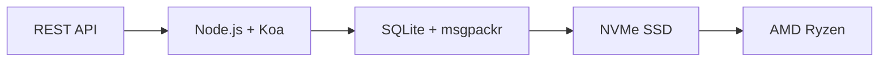

# De Eerste Complete Email API: Hoe Forward Email Emailbeheer Revolutioneerde {#the-first-complete-email-api-how-forward-email-revolutionized-email-management}


<p class="lead mt-3">
  <strong>TL;DR:</strong> We hebben 's werelds eerste complete REST API voor emailbeheer gebouwd met geavanceerde zoekmogelijkheden die geen enkele andere dienst biedt. Terwijl Gmail, Outlook en Apple ontwikkelaars dwingen tot IMAP-hel of rate-limited API's, levert Forward Email razendsnelle CRUD-operaties voor berichten, mappen, contacten en agenda's via een uniforme REST-interface met meer dan 15 zoekparameters. Dit is de email API waar ontwikkelaars op hebben gewacht.
</p>


## Inhoudsopgave {#table-of-contents}

* [Het Email API Probleem](#the-email-api-problem)
* [Wat Ontwikkelaars Eigenlijk Zeggen](#what-developers-are-actually-saying)
* [De Revolutionaire Oplossing van Forward Email](#forward-emails-revolutionary-solution)
  * [Waarom We Dit Gebouwd Hebben](#why-we-built-this)
  * [Eenvoudige Authenticatie](#simple-authentication)
* [20 Endpoints Die Alles Veranderen](#20-endpoints-that-change-everything)
  * [Berichten (5 endpoints)](#messages-5-endpoints)
  * [Mappen (5 endpoints)](#folders-5-endpoints)
  * [Contacten (5 endpoints)](#contacts-5-endpoints)
  * [Agenda's (5 endpoints)](#calendars-5-endpoints)
* [Geavanceerd Zoeken: Geen Enkele Andere Dienst Komt in de Buurt](#advanced-search-no-other-service-compares)
  * [Het Zoek-API Landschap is Kapot](#the-search-api-landscape-is-broken)
  * [De Revolutionaire Zoek-API van Forward Email](#forward-emails-revolutionary-search-api)
  * [Praktijkvoorbeelden van Zoeken](#real-world-search-examples)
  * [Prestatievoordelen](#performance-advantages)
  * [Zoekfuncties Die Niemand Anders Heeft](#search-features-no-one-else-has)
  * [Waarom Dit Belangrijk is voor Ontwikkelaars](#why-this-matters-for-developers)
  * [De Technische Implementatie](#the-technical-implementation)
* [Razendsnelle Prestatie-Architectuur](#blazing-fast-performance-architecture)
  * [Prestatiebenchmarks](#performance-benchmarks)
  * [Privacy-First Architectuur](#privacy-first-architecture)
* [Waarom Wij Anders Zijn: De Complete Vergelijking](#why-were-different-the-complete-comparison)
  * [Belangrijke Beperkingen van Providers](#major-provider-limitations)
  * [Voordelen van Forward Email](#forward-email-advantages)
  * [Het Transparantieprobleem van Open Source](#the-open-source-transparency-problem)
* [30+ Praktijkvoorbeelden van Integraties](#30-real-world-integration-examples)
  * [1. Verbetering van WordPress Contactformulier](#1-wordpress-contact-form-enhancement)
  * [2. Zapier Alternatief voor Email Automatisering](#2-zapier-alternative-for-email-automation)
  * [3. CRM Email Synchronisatie](#3-crm-email-synchronization)
  * [4. E-commerce Orderverwerking](#4-e-commerce-order-processing)
  * [5. Support Ticket Integratie](#5-support-ticket-integration)
  * [6. Nieuwsbrief Beheersysteem](#6-newsletter-management-system)
  * [7. Email-gebaseerd Taakbeheer](#7-email-based-task-management)
  * [8. Multi-Account Email Aggregatie](#8-multi-account-email-aggregation)
  * [9. Geavanceerd Email Analytics Dashboard](#9-advanced-email-analytics-dashboard)
  * [10. Slimme Email Archivering](#10-smart-email-archiving)
  * [11. Email-naar-Agenda Integratie](#11-email-to-calendar-integration)
  * [12. Email Backup en Compliance](#12-email-backup-and-compliance)
  * [13. Email-gebaseerd Contentbeheer](#13-email-based-content-management)
  * [14. Email Sjabloonbeheer](#14-email-template-management)
  * [15. Email-gebaseerde Workflow Automatisering](#15-email-based-workflow-automation)
  * [16. Email Beveiligingsmonitoring](#16-email-security-monitoring)
  * [17. Email-gebaseerde Enquêteverzameling](#17-email-based-survey-collection)
  * [18. Email Prestatiemonitoring](#18-email-performance-monitoring)
  * [19. Email-gebaseerde Leadkwalificatie](#19-email-based-lead-qualification)
  * [20. Email-gebaseerd Projectbeheer](#20-email-based-project-management)
  * [21. Email-gebaseerd Voorraadbeheer](#21-email-based-inventory-management)
  * [22. Email-gebaseerde Factuurverwerking](#22-email-based-invoice-processing)
  * [23. Email-gebaseerde Evenementregistratie](#23-email-based-event-registration)
  * [24. Email-gebaseerde Documentgoedkeuringsworkflow](#24-email-based-document-approval-workflow)
  * [25. Email-gebaseerde Klantfeedbackanalyse](#25-email-based-customer-feedback-analysis)
  * [26. Email-gebaseerde Recruitment Pipeline](#26-email-based-recruitment-pipeline)
  * [27. Email-gebaseerde Onkostenrapportageverwerking](#27-email-based-expense-report-processing)
  * [28. Email-gebaseerde Kwaliteitsborgingsrapportage](#28-email-based-quality-assurance-reporting)
  * [29. Email-gebaseerd Leveranciersbeheer](#29-email-based-vendor-management)
  * [30. Email-gebaseerde Social Media Monitoring](#30-email-based-social-media-monitoring)
* [Aan de Slag](#getting-started)
  * [1. Maak Je Forward Email Account Aan](#1-create-your-forward-email-account)
  * [2. Genereer API Referenties](#2-generate-api-credentials)
  * [3. Doe Je Eerste API Aanroep](#3-make-your-first-api-call)
  * [4. Verken de Documentatie](#4-explore-the-documentation)
* [Technische Bronnen](#technical-resources)
## Het Email API Probleem {#the-email-api-problem}

Email API's zijn fundamenteel kapot. Punt.

Elke grote emailprovider dwingt ontwikkelaars tot een van twee verschrikkelijke keuzes:

1. **IMAP Hel**: Worstelen met een 30 jaar oud protocol ontworpen voor desktopclients, niet voor moderne applicaties
2. **Verlamde API's**: Rate-gelimiteerde, alleen-lezen, OAuth-complexe API's die je daadwerkelijke emaildata niet kunnen beheren

Het resultaat? Ontwikkelaars geven emailintegratie helemaal op of verspillen weken aan het bouwen van fragiele IMAP wrappers die constant breken.

> \[!WARNING]
> **Het Vuile Geheim**: De meeste "email API's" zijn gewoon verzend-API's. Je kunt niet programmatisch mappen organiseren, contacten synchroniseren of agenda's beheren via een simpele REST-interface. Tot nu toe.


## Wat Ontwikkelaars Eigenlijk Zeggen {#what-developers-are-actually-saying}

De frustratie is echt en overal gedocumenteerd:

> "Ik heb onlangs geprobeerd Gmail in mijn app te integreren, en ik heb er te veel tijd aan besteed. Ik besloot dat het niet de moeite waard is om Gmail te ondersteunen."
>
> *- [Hacker News ontwikkelaar](https://news.ycombinator.com/item?id=42106944), 147 upvotes*

> "Zijn alle email API's middelmatig? Ze lijken op de een of andere manier beperkt of restrictief."
>
> *- [Reddit r/SaaS discussie](https://www.reddit.com/r/SaaS/comments/1cm84s7/are_all_email_apis_mediocre/)*

> "Waarom moet emailontwikkeling zo slecht zijn?"
>
> *- [Reddit r/webdev](https://www.reddit.com/r/webdev/comments/15trnp2/why_does_email_development_have_to_suck/), 89 reacties vol ontwikkelaarsleed*

> "Wat maakt de Gmail API efficiënter dan IMAP? Een andere reden dat de Gmail API veel efficiënter is, is omdat hij elk bericht maar één keer hoeft te downloaden. Met IMAP moet elk bericht worden gedownload en geïndexeerd..."
>
> *- [Stack Overflow vraag](https://stackoverflow.com/questions/25431022/what-makes-the-gmail-api-more-efficient-than-imap) met 47 upvotes*

Het bewijs is overal:

* **WordPress SMTP problemen**: [631 GitHub issues](https://github.com/awesomemotive/WP-Mail-SMTP/issues) over emailbezorgingsfouten
* **Zapier beperkingen**: [Community klachten](https://community.zapier.com/featured-articles-65/email-parser-by-zapier-limitations-and-alternatives-16958) over limieten van 10 emails/uur en IMAP detectiefouten
* **IMAP API projecten**: [Meerdere](https://github.com/ewildgoose/imap-api) [open-source](https://emailengine.app/) [projecten](https://www.npmjs.com/package/imapflow) bestaan specifiek om "IMAP naar REST te converteren" omdat geen enkele provider dit aanbiedt
* **Gmail API frustraties**: [Stack Overflow](https://stackoverflow.com/questions/tagged/gmail-api) heeft 4.847 vragen getagd met "gmail-api" met veelvoorkomende klachten over rate limits en complexiteit


## Forward Email's Revolutionaire Oplossing {#forward-emails-revolutionary-solution}

**Wij zijn de eerste emailservice die volledige CRUD-operaties voor alle emaildata aanbiedt via een uniforme REST API.**

Dit is niet zomaar een verzend-API. Dit is volledige programmatische controle over:

* **Berichten**: Aanmaken, lezen, bijwerken, verwijderen, zoeken, verplaatsen, markeren
* **Mappen**: Volledig IMAP mapbeheer via REST endpoints
* **Contacten**: [CardDAV](https://tools.ietf.org/html/rfc6352) contactopslag en synchronisatie
* **Agenda's**: [CalDAV](https://tools.ietf.org/html/rfc4791) agendagebeurtenissen en planning

### Waarom We Dit Gebouwd Hebben {#why-we-built-this}

**Het Probleem**: Elke emailprovider behandelt email als een black box. Je kunt emails versturen, misschien lezen met complexe OAuth, maar je kunt je emaildata niet echt *beheer* programmatisch.

**Onze Visie**: Email moet net zo makkelijk te integreren zijn als elke moderne API. Geen IMAP bibliotheken. Geen OAuth complexiteit. Geen nachtmerries van rate limits. Gewoon simpele REST endpoints die werken.

**Het Resultaat**: De eerste emailservice waar je een volledige emailclient, CRM-integratie of automatiseringssysteem kunt bouwen met alleen HTTP-verzoeken.

### Eenvoudige Authenticatie {#simple-authentication}

Geen [OAuth complexiteit](https://oauth.net/2/). Geen [app-specifieke wachtwoorden](https://support.google.com/accounts/answer/185833). Alleen je alias-gegevens:

```bash
curl -u "alias@yourdomain.com:password" \
  https://api.forwardemail.net/v1/messages
```
## 20 Eindpunten Die Alles Veranderen {#20-endpoints-that-change-everything}

### Berichten (5 eindpunten) {#messages-5-endpoints}

* `GET /v1/messages` - Lijst berichten met filtering (`?folder=`, `?is_unread=`, `?is_flagged=`)
* `POST /v1/messages` - Verstuur nieuwe berichten direct naar mappen
* `GET /v1/messages/:id` - Haal specifiek bericht op met volledige metadata
* `PUT /v1/messages/:id` - Werk bericht bij (vlaggen, map, leesstatus)
* `DELETE /v1/messages/:id` - Verwijder bericht permanent

### Mappen (5 eindpunten) {#folders-5-endpoints}

* `GET /v1/folders` - Lijst alle mappen met abonnementsstatus
* `POST /v1/folders` - Maak nieuwe map met aangepaste eigenschappen
* `GET /v1/folders/:id` - Krijg mapdetails en berichtentellingen
* `PUT /v1/folders/:id` - Werk mapeigenschappen en abonnement bij
* `DELETE /v1/folders/:id` - Verwijder map en handel berichtverplaatsing af

### Contacten (5 eindpunten) {#contacts-5-endpoints}

* `GET /v1/contacts` - Lijst contacten met zoeken en paginering
* `POST /v1/contacts` - Maak nieuw contact met volledige vCard-ondersteuning
* `GET /v1/contacts/:id` - Haal contact op met alle velden en metadata
* `PUT /v1/contacts/:id` - Werk contactinformatie bij met ETag-validatie
* `DELETE /v1/contacts/:id` - Verwijder contact met cascade-afhandeling

### Kalenders (5 eindpunten) {#calendars-5-endpoints}

* `GET /v1/calendars` - Lijst kalendergebeurtenissen met datumfiltering
* `POST /v1/calendars` - Maak kalendergebeurtenis met deelnemers en herhaling
* `GET /v1/calendars/:id` - Krijg gebeurtenisdetails met tijdzone-afhandeling
* `PUT /v1/calendars/:id` - Werk gebeurtenis bij met conflictdetectie
* `DELETE /v1/calendars/:id` - Verwijder gebeurtenis met deelnemersmeldingen


## Geavanceerd Zoeken: Geen Andere Dienst Komt Eraan {#advanced-search-no-other-service-compares}

**Forward Email is de enige e-maildienst die uitgebreide, programmatische zoekmogelijkheden biedt over alle berichtvelden via een REST API.**

Terwijl andere aanbieders hooguit basisfiltering bieden, hebben wij de meest geavanceerde e-mailzoek-API ooit gebouwd. Geen enkele Gmail API, Outlook API of andere dienst komt in de buurt van onze zoekmogelijkheden.

### Het Zoek-API Landschap is Kapot {#the-search-api-landscape-is-broken}

**Beperkingen van Gmail API Zoeken:**

* ✅ Alleen basis `q` parameter
* ❌ Geen veldspecifieke zoekopdrachten
* ❌ Geen datumrange-filtering
* ❌ Geen groottegebaseerde filtering
* ❌ Geen bijlage-filtering
* ❌ Beperkt tot Gmail's zoeksyntax

**Beperkingen van Outlook API Zoeken:**

* ✅ Basis `$search` parameter
* ❌ Geen geavanceerde veldgerichte zoekopdrachten
* ❌ Geen complexe querycombinaties
* ❌ Strenge rate limiting
* ❌ Complexe OData-syntax vereist

**Apple iCloud:**

* ❌ Geen API beschikbaar
* ❌ Alleen IMAP-zoekopdrachten (als je het werkend krijgt)

**ProtonMail & Tuta:**

* ❌ Geen publieke API's
* ❌ Geen programmatische zoekmogelijkheden

### Forward Email's Revolutionaire Zoek-API {#forward-emails-revolutionary-search-api}

**Wij bieden 15+ zoekparameters die geen enkele andere dienst levert:**

| Zoekmogelijkheid              | Forward Email                          | Gmail API    | Outlook API        | Anderen |
| ------------------------------ | -------------------------------------- | ------------ | ------------------ | ------ |
| **Veldspecifieke Zoekopdracht**      | ✅ Onderwerp, inhoud, van, aan, cc, headers | ❌            | ❌                  | ❌      |
| **Multi-Veld Algemene Zoekopdracht** | ✅ `?search=` over alle velden           | ✅ Basis `q=` | ✅ Basis `$search=` | ❌      |
| **Datumrange Filtering**       | ✅ `?since=` & `?before=`               | ❌            | ❌                  | ❌      |
| **Groottegebaseerde Filtering**       | ✅ `?min_size=` & `?max_size=`          | ❌            | ❌                  | ❌      |
| **Bijlage Filtering**       | ✅ `?has_attachments=true/false`        | ❌            | ❌                  | ❌      |
| **Header Zoekopdracht**              | ✅ `?headers=X-Priority`                | ❌            | ❌                  | ❌      |
| **Bericht-ID Zoekopdracht**          | ✅ `?message_id=abc123`                 | ❌            | ❌                  | ❌      |
| **Gecombineerde Filters**           | ✅ Meerdere parameters met EN-logica    | ❌            | ❌                  | ❌      |
| **Hoofdletterongevoelig**           | ✅ Alle zoekopdrachten                   | ✅            | ✅                  | ❌      |
| **Paginering Ondersteuning**         | ✅ Werkt met alle zoekparameters         | ✅            | ✅                  | ❌      |
### Real-World Zoekvoorbeelden {#real-world-search-examples}

**Vind Alle Facturen van Het Laatste Kwartaal:**

```bash
# Forward Email - Eenvoudig en krachtig
GET /v1/messages?subject=invoice&since=2024-01-01T00:00:00Z&before=2024-04-01T00:00:00Z

# Gmail API - Onmogelijk met hun beperkte zoekfunctie
# Geen datumrange-filtering beschikbaar

# Outlook API - Complexe OData-syntaxis, beperkte functionaliteit
GET /me/messages?$search="invoice"&$filter=receivedDateTime ge 2024-01-01T00:00:00Z
```

**Zoek naar Grote Bijlagen van Specifieke Afzender:**

```bash
# Forward Email - Uitgebreide filtering
GET /v1/messages?from=finance@company.com&has_attachments=true&min_size=1000000

# Gmail API - Kan niet filteren op grootte of bijlagen via API
# Outlook API - Geen grootte-filtering beschikbaar
# Overigen - Geen beschikbare API's
```

**Complexe Multi-Veld Zoekopdracht:**

```bash
# Forward Email - Geavanceerde query-mogelijkheden
GET /v1/messages?body=quarterly&from=manager&is_flagged=true&folder=Reports

# Gmail API - Beperkt tot basis tekstzoekopdrachten
GET /gmail/v1/users/me/messages?q=quarterly

# Outlook API - Basiszoekopdracht zonder veldgerichte targeting
GET /me/messages?$search="quarterly"
```

### Prestatievoordelen {#performance-advantages}

**Forward Email Zoekprestaties:**

* ⚡ **Reactietijden onder 100ms** voor complexe zoekopdrachten
* 🔍 **Regex-optimalisatie** met juiste indexering
* 📊 **Parallelle query-uitvoering** voor telling en data
* 💾 **Efficiënt geheugenverbruik** met slanke queries

**Prestaties van Concurrenten:**

* 🐌 **Gmail API**: Beperkt tot 250 quotapunten per gebruiker per seconde
* 🐌 **Outlook API**: Agressieve throttling met complexe backoff-eisen
* 🐌 **Overigen**: Geen API's om mee te vergelijken

### Zoekfuncties Die Niemand Anders Heeft {#search-features-no-one-else-has}

#### 1. Header-Specifieke Zoekopdracht {#1-header-specific-search}

```bash
# Vind berichten met specifieke headers
GET /v1/messages?headers=X-Priority:1
GET /v1/messages?headers=X-Spam-Score
```

#### 2. Groottegebaseerde Intelligentie {#2-size-based-intelligence}

```bash
# Vind nieuwsbrief-e-mails (meestal groot)
GET /v1/messages?min_size=50000&from=newsletter

# Vind snelle antwoorden (meestal klein)
GET /v1/messages?max_size=1000&to=support
```

#### 3. Bijlagegebaseerde Workflows {#3-attachment-based-workflows}

```bash
# Vind alle documenten gestuurd naar het juridische team
GET /v1/messages?to=legal&has_attachments=true&body=contract

# Vind e-mails zonder bijlagen voor opruiming
GET /v1/messages?has_attachments=false&before=2023-01-01T00:00:00Z
```

#### 4. Gecombineerde Bedrijfslogica {#4-combined-business-logic}

```bash
# Vind urgente gemarkeerde berichten van VIP's met bijlagen
GET /v1/messages?is_flagged=true&from=ceo&has_attachments=true&subject=urgent
```

### Waarom Dit Belangrijk Is Voor Ontwikkelaars {#why-this-matters-for-developers}

**Bouw Applicaties Die Voorheen Onmogelijk Waren:**

1. **Geavanceerde E-mailanalyse**: Analyseer e-mailpatronen op grootte, afzender, inhoud
2. **Intelligent E-mailbeheer**: Automatisch organiseren op basis van complexe criteria
3. **Compliance en Discovery**: Vind specifieke e-mails voor juridische vereisten
4. **Business Intelligence**: Haal inzichten uit e-mailcommunicatiepatronen
5. **Geautomatiseerde Workflows**: Trigger acties op basis van geavanceerde e-mailfilters

### De Technische Implementatie {#the-technical-implementation}

Onze zoek-API gebruikt:

* **Regex-optimalisatie** met juiste indexeringsstrategieën
* **Parallelle uitvoering** voor prestaties
* **Inputvalidatie** voor veiligheid
* **Uitgebreide foutafhandeling** voor betrouwbaarheid

```javascript
// Voorbeeld: Complexe zoekimplementatie
const searchConditions = [];

if (ctx.query.subject) {
  searchConditions.push({
    subject: { $regex: ctx.query.subject, $options: 'i' }
  });
}

if (ctx.query.from) {
  searchConditions.push({
    $or: [
      { 'from.address': { $regex: ctx.query.from, $options: 'i' } },
      { 'from.name': { $regex: ctx.query.from, $options: 'i' } }
    ]
  });
}

// Combineren met AND-logica
if (searchConditions.length > 0) {
  query.$and = searchConditions;
}
```

> \[!TIP]
> **Voordeel voor Ontwikkelaars**: Met de zoek-API van Forward Email kunt u e-mailapplicaties bouwen die qua functionaliteit kunnen concurreren met desktopclients, terwijl u de eenvoud van REST-API's behoudt.
## Blazing Fast Performance Architectuur {#blazing-fast-performance-architecture}

Onze technische stack is gebouwd voor snelheid en betrouwbaarheid:


```mermaid
graph LR
    A[REST API] --> B[Node.js + Koa]
    B --> C[SQLite + msgpackr]
    C --> D[NVMe SSD]
    D --> E[AMD Ryzen]
```

### Prestatiebenchmarks {#performance-benchmarks}

**Waarom Wij Razendsnel Zijn:**

| Component    | Technologie                                                                      | Prestatievoordeel                            |
| ------------ | -------------------------------------------------------------------------------- | -------------------------------------------- |
| **Opslag**   | [NVMe SSD](https://en.wikipedia.org/wiki/NVM_Express)                           | 10x sneller dan traditionele SATA            |
| **Database** | [SQLite](https://sqlite.org/) + [msgpackr](https://github.com/kriszyp/msgpackr) | Geen netwerkvertraging, geoptimaliseerde serialisatie |
| **Hardware** | [AMD Ryzen](https://www.amd.com/en/products/processors/desktops/ryzen) bare metal | Geen virtualisatie-overhead                   |
| **Caching**  | In-memory + persistent                                                          | Reactietijden onder de milliseconde          |
| **Back-ups** | [Cloudflare R2](https://www.cloudflare.com/products/r2/) versleuteld            | Enterprise-grade betrouwbaarheid              |

**Echte Prestatiecijfers:**

* **API Reactietijd**: < 50ms gemiddeld
* **Bericht Ophalen**: < 10ms voor gecachte berichten
* **Mapbewerkingen**: < 5ms voor metadata-bewerkingen
* **Contact Sync**: 1000+ contacten/seconde
* **Uptime**: 99,99% SLA met redundante infrastructuur

### Privacy-First Architectuur {#privacy-first-architecture}

**Zero-Knowledge Ontwerp**: Alleen jij hebt toegang met je IMAP-wachtwoord - wij kunnen je e-mails niet lezen. Onze [zero-knowledge architectuur](https://forwardemail.net/en/security) garandeert volledige privacy terwijl we razendsnelle prestaties leveren.


## Waarom Wij Anders Zijn: De Complete Vergelijking {#why-were-different-the-complete-comparison}

### Belangrijke Beperkingen van Providers {#major-provider-limitations}

| Provider         | Kernproblemen                            | Specifieke Beperkingen                                                                                                                                                                                                                                                                                                                                                                                                                                               |
| ---------------- | --------------------------------------- | -------------------------------------------------------------------------------------------------------------------------------------------------------------------------------------------------------------------------------------------------------------------------------------------------------------------------------------------------------------------------------------------------------------------------------------------------------------------- |
| **Gmail API**    | Alleen-lezen, Complexe OAuth, Gescheiden API's | • [Kan bestaande berichten niet wijzigen](https://developers.google.com/gmail/api/reference/rest/v1/users.messages)<br>• [Labels ≠ mappen](https://developers.google.com/gmail/api/reference/rest/v1/users.labels)<br>• [1 miljard quotum-eenheden/dag limiet](https://developers.google.com/gmail/api/reference/quota)<br>• [Vereist gescheiden API's](https://developers.google.com/workspace) voor contacten/agenda                                                           |
| **Outlook API**  | Verouderd, Verwarrend, Enterprise-gericht | • [REST endpoints verouderd maart 2024](https://learn.microsoft.com/en-us/outlook/rest/compare-graph)<br>• [Meerdere verwarrende API's](https://learn.microsoft.com/en-us/office/client-developer/outlook/selecting-an-api-or-technology-for-developing-solutions-for-outlook) (EWS, Graph, REST)<br>• [Microsoft Graph complexiteit](https://learn.microsoft.com/en-us/graph/overview)<br>• [Agressieve throttling](https://learn.microsoft.com/en-us/graph/throttling) |
| **Apple iCloud** | Geen Publieke API                       | • [Geen publieke API beschikbaar](https://support.apple.com/en-us/102654)<br>• [Alleen IMAP met limiet van 1000 e-mails/dag](https://support.apple.com/en-us/102654)<br>• [App-specifieke wachtwoorden vereist](https://support.apple.com/en-us/102654)<br>• [Limiet van 500 ontvangers per bericht](https://support.apple.com/en-us/102654)                                                                                                                                              |
| **ProtonMail**   | Geen API, Valse Open-Source Claims      | • [Geen publieke API beschikbaar](https://proton.me/support/protonmail-bridge-clients)<br>• [Bridge-software vereist](https://proton.me/mail/bridge) voor IMAP-toegang<br>• [Claimt "open source"](https://proton.me/blog/open-source) maar [servercode is propriëtair](https://github.com/ProtonMail)<br>• [Beperkt tot betaalde abonnementen](https://proton.me/pricing)                                                                                                         |
| **Tuta**         | Geen API, Misleidende Transparantie     | • [Geen REST API voor e-mailbeheer](https://tuta.com/support#technical)<br>• [Claimt "open source"](https://tuta.com/blog/posts/open-source-email) maar [backend is gesloten](https://github.com/tutao/tutanota)<br>• [IMAP/SMTP niet ondersteund](https://tuta.com/support#imap)<br>• [Propriëtaire encryptie](https://tuta.com/encryption) verhindert standaardintegraties                                                                                               |
| **Zapier Email** | Strenge Limieten op Snelheid            | • [Limiet van 10 e-mails per uur](https://help.zapier.com/hc/en-us/articles/8496181555597-Email-Parser-by-Zapier-limitations-and-alternatives)<br>• [Geen toegang tot IMAP-mappen](https://help.zapier.com/hc/en-us/articles/8496181555597-Email-Parser-by-Zapier-limitations-and-alternatives)<br>• [Beperkte parser-mogelijkheden](https://help.zapier.com/hc/en-us/articles/8496181555597-Email-Parser-by-Zapier-limitations-and-alternatives)                                 |
### Voordelen van Doorsturen van E-mail {#forward-email-advantages}

| Kenmerk            | Doorsturen van E-mail                                                                        | Concurrentie                             |
| ------------------ | -------------------------------------------------------------------------------------------- | --------------------------------------- |
| **Volledige CRUD** | ✅ Volledig creëren, lezen, bijwerken, verwijderen voor alle data                             | ❌ Alleen-lezen of beperkte bewerkingen  |
| **Geünificeerde API** | ✅ Berichten, mappen, contacten, agenda's in één API                                         | ❌ Gescheiden API's of ontbrekende functies |
| **Eenvoudige Auth** | ✅ Basis authenticatie met alias-gegevens                                                    | ❌ Complexe OAuth met meerdere scopes    |
| **Geen Limieten**  | ✅ Ruimhartige limieten ontworpen voor echte toepassingen                                    | ❌ Beperkende quota die workflows breken |
| **Zelf-Hosten**   | ✅ [Volledige zelf-hosting optie](https://forwardemail.net/en/blog/docs/self-hosted-solution) | ❌ Alleen vendor lock-in                  |
| **Privacy**        | ✅ Zero-knowledge, versleuteld, privé                                                        | ❌ Data mining en privacyzorgen          |
| **Prestaties**     | ✅ Reactietijden onder 50ms, NVMe opslag                                                     | ❌ Netwerkvertraging, throttling vertragingen |

### Het Transparantieprobleem van Open Source {#the-open-source-transparency-problem}

**ProtonMail en Tuta profileren zich als "open source" en "transparant," maar dit is misleidende marketing die moderne privacyprincipes schendt.**

> \[!WARNING]
> **Valse Transparantieclaims**: Zowel ProtonMail als Tuta adverteren prominent hun "open source" credentials terwijl hun meest kritieke server-side code propriëtair en gesloten blijft.

**De Misleiding van ProtonMail:**

* **Claims**: ["Wij zijn open source"](https://proton.me/blog/open-source) prominent in marketing
* **Realiteit**: [Servercode is volledig propriëtair](https://github.com/ProtonMail) - alleen client-apps zijn open source
* **Impact**: Gebruikers kunnen server-side encryptie, dataverwerking of privacyclaims niet verifiëren
* **Transparantie Schending**: Geen mogelijkheid om de daadwerkelijke e-mailverwerking en opslag te auditen

**De Misleidende Marketing van Tuta:**

* **Claims**: ["Open source e-mail"](https://tuta.com/blog/posts/open-source-email) als kernverkooppunt
* **Realiteit**: [Backend infrastructuur is closed source](https://github.com/tutao/tutanota) - alleen frontend is beschikbaar
* **Impact**: Propriëtaire encryptie verhindert standaard e-mailprotocollen (IMAP/SMTP)
* **Lock-in Strategie**: Aangepaste encryptie dwingt vendor-afhankelijkheid af

**Waarom Dit Belangrijk is voor Moderne Privacy:**

In 2025 vereist echte privacy **volledige transparantie**. Wanneer e-mailproviders "open source" claimen maar hun servercode verbergen:

1. **Niet-verifieerbare Encryptie**: Je kunt niet auditen hoe je data daadwerkelijk wordt versleuteld
2. **Verborgen Datapraktijken**: Server-side dataverwerking blijft een black box
3. **Vertrouwensgebaseerde Beveiliging**: Je moet hun claims vertrouwen zonder verificatie
4. **Vendor Lock-in**: Propriëtaire systemen verhinderen dataportabiliteit

**De Echte Transparantie van Forward Email:**

* ✅ **[Volledig open source](https://github.com/forwardemail/forwardemail.net)** - server- en clientcode
* ✅ **[Zelf-hosting beschikbaar](https://forwardemail.net/en/blog/docs/self-hosted-solution)** - draai je eigen instantie
* ✅ **Standaard protocollen** - IMAP, SMTP, CardDAV, CalDAV compatibiliteit
* ✅ **Auditbare beveiliging** - elke regel code kan worden geïnspecteerd
* ✅ **Geen vendor lock-in** - jouw data, jouw controle

> \[!TIP]
> **Echte open source betekent dat je elke claim kunt verifiëren.** Met Forward Email kun je onze encryptie auditen, onze dataverwerking beoordelen en zelfs je eigen instantie draaien. Dat is echte transparantie.


## 30+ Voorbeelden van Integraties in de Praktijk {#30-real-world-integration-examples}

### 1. Verbetering van WordPress Contactformulier {#1-wordpress-contact-form-enhancement}
**Probleem**: [WordPress SMTP-configuratiefouten](https://github.com/awesomemotive/WP-Mail-SMTP/issues) ([631 GitHub-issues](https://github.com/awesomemotive/WP-Mail-SMTP/issues))
**Oplossing**: Directe API-integratie omzeilt [SMTP](https://tools.ietf.org/html/rfc5321) volledig

```javascript
// WordPress contactformulier dat opslaat in de Verzonden map
await fetch('https://api.forwardemail.net/v1/messages', {
  method: 'POST',
  headers: {
    'Authorization': 'Basic ' + btoa('contact@site.com:password'),
    'Content-Type': 'application/json'
  },
  body: JSON.stringify({
    to: [{ address: 'owner@site.com' }],
    subject: 'Contactformulier: ' + formData.subject,
    text: formData.message,
    folder: 'Sent'
  })
});
```

### 2. Zapier-alternatief voor e-mailautomatisering {#2-zapier-alternative-for-email-automation}

**Probleem**: [Zapier's limiet van 10 e-mails per uur](https://help.zapier.com/hc/en-us/articles/8496181555597-Email-Parser-by-Zapier-limitations-and-alternatives) en [IMAP-detectiefouten](https://community.zapier.com/featured-articles-65/email-parser-by-zapier-limitations-and-alternatives-16958)
**Oplossing**: Onbeperkte automatisering met volledige e-mailcontrole

```javascript
// E-mails automatisch organiseren op afzenderdomein
const messages = await fetch('/v1/messages?folder=INBOX');
for (const message of messages) {
  const domain = message.from.split('@')[1];
  await fetch(`/v1/messages/${message.id}`, {
    method: 'PUT',
    body: JSON.stringify({ folder: `Clients/${domain}` })
  });
}
```

### 3. CRM e-mail synchronisatie {#3-crm-email-synchronization}

**Probleem**: Handmatig contactbeheer tussen e-mail en [CRM-systemen](https://en.wikipedia.org/wiki/Customer_relationship_management)
**Oplossing**: Tweerichtingssynchronisatie met [CardDAV](https://tools.ietf.org/html/rfc6352) contact-API

```javascript
// Nieuwe e-mailcontacten synchroniseren naar CRM
const newContacts = await fetch('/v1/contacts');
for (const contact of newContacts) {
  await crmAPI.createContact({
    name: contact.name,
    email: contact.email,
    source: 'email_api'
  });
}
```

### 4. E-commerce orderverwerking {#4-e-commerce-order-processing}

**Probleem**: Handmatige verwerking van order-e-mails voor [e-commerceplatforms](https://en.wikipedia.org/wiki/E-commerce)
**Oplossing**: Geautomatiseerde orderbeheer-pijplijn

```javascript
// Verwerking van orderbevestigings-e-mails
const orders = await fetch('/v1/messages?folder=Orders');
const orderEmails = orders.filter(msg =>
  msg.subject.includes('Order Confirmation')
);

for (const order of orderEmails) {
  const orderData = parseOrderEmail(order.text);
  await updateInventory(orderData);
  await fetch(`/v1/messages/${order.id}`, {
    method: 'PUT',
    body: JSON.stringify({ folder: 'Orders/Processed' })
  });
}
```

### 5. Support ticket integratie {#5-support-ticket-integration}

**Probleem**: E-mailthreads verspreid over [helpdeskplatforms](https://en.wikipedia.org/wiki/Help_desk_software)
**Oplossing**: Volledige tracking van e-mailthreads

```javascript
// Supportticket aanmaken vanuit e-mailthread
const messages = await fetch('/v1/messages?folder=Support');
const supportEmails = messages.filter(msg =>
  msg.to.some(addr => addr.includes('support@'))
);

for (const email of supportEmails) {
  const ticket = await supportSystem.createTicket({
    subject: email.subject,
    from: email.from,
    body: email.text,
    timestamp: email.date
  });
}
```

### 6. Nieuwsbriefbeheersysteem {#6-newsletter-management-system}

**Probleem**: Beperkte integraties met [nieuwsbriefplatforms](https://en.wikipedia.org/wiki/Email_marketing)
**Oplossing**: Volledig beheer van de levenscyclus van abonnees

```javascript
// Nieuwsbriefabonnementen automatisch beheren
const messages = await fetch('/v1/messages?folder=Newsletter');
const unsubscribes = messages.filter(msg =>
  msg.subject.toLowerCase().includes('unsubscribe')
);

for (const msg of unsubscribes) {
  await removeSubscriber(msg.from);
  await fetch(`/v1/messages/${msg.id}`, {
    method: 'PUT',
    body: JSON.stringify({ folder: 'Newsletter/Unsubscribed' })
  });
}
```

### 7. E-mailgebaseerd taakbeheer {#7-email-based-task-management}

**Probleem**: Overbelasting van de inbox en [taakbeheer](https://en.wikipedia.org/wiki/Task_management)
**Oplossing**: E-mails omzetten in uitvoerbare taken
```javascript
// Create tasks from flagged emails
const messages = await fetch('/v1/messages?is_flagged=true');
for (const email of messages) {
  await taskManager.createTask({
    title: email.subject,
    description: email.text,
    assignee: email.to[0].address,
    dueDate: extractDueDate(email.text)
  });
}
```

### 8. Multi-Account Email Aggregation {#8-multi-account-email-aggregation}

**Problem**: Managing [multiple email accounts](https://en.wikipedia.org/wiki/Email_client) across providers
**Solution**: Unified inbox interface

```javascript
// Aggregate emails from multiple accounts
const accounts = ['work@domain.com', 'personal@domain.com'];
const allMessages = [];

for (const account of accounts) {
  const messages = await fetch('/v1/messages', {
    headers: { 'Authorization': getAuth(account) }
  });
  allMessages.push(...messages.map(m => ({ ...m, account })));
}
```

### 9. Advanced Email Analytics Dashboard {#9-advanced-email-analytics-dashboard}

**Problem**: No insights into [email patterns](https://en.wikipedia.org/wiki/Email_analytics) with sophisticated filtering
**Solution**: Custom email analytics using advanced search capabilities

```javascript
// Generate comprehensive email analytics using advanced search
const analytics = {};

// Analyze email volume by sender domain
const messages = await fetch('/v1/messages');
analytics.senderDomains = analyzeSenderDomains(messages);

// Find large attachments consuming storage
const largeAttachments = await fetch('/v1/messages?has_attachments=true&min_size=1000000');
analytics.storageHogs = largeAttachments.map(msg => ({
  subject: msg.subject,
  from: msg.from,
  size: msg.size
}));

// Analyze communication patterns with VIPs
const vipEmails = await fetch('/v1/messages?from=ceo@company.com');
const urgentVipEmails = await fetch('/v1/messages?from=ceo@company.com&subject=urgent');
analytics.vipCommunication = {
  total: vipEmails.length,
  urgent: urgentVipEmails.length,
  urgencyRate: (urgentVipEmails.length / vipEmails.length) * 100
};

// Find unread emails by date range for follow-up
const lastWeek = new Date(Date.now() - 7 * 24 * 60 * 60 * 1000).toISOString();
const unreadRecent = await fetch(`/v1/messages?is_unread=true&since=${lastWeek}`);
analytics.followUpNeeded = unreadRecent.length;

// Analyze email sizes for optimization
const smallEmails = await fetch('/v1/messages?max_size=1000');
const mediumEmails = await fetch('/v1/messages?min_size=1000&max_size=50000');
const largeEmails = await fetch('/v1/messages?min_size=50000');
analytics.sizeDistribution = {
  small: smallEmails.length,
  medium: mediumEmails.length,
  large: largeEmails.length
};

// Search for compliance-related emails
const complianceEmails = await fetch('/v1/messages?body=confidential&has_attachments=true');
analytics.complianceReview = complianceEmails.length;
```

### 10. Smart Email Archiving {#10-smart-email-archiving}

**Problem**: Manual [email organization](https://en.wikipedia.org/wiki/Email_management)
**Solution**: Intelligent email categorization

```javascript
// Auto-archive old emails by category
const messages = await fetch('/v1/messages');
const oldEmails = messages.filter(email =>
  isOlderThan(email.date, 90) // 90 days
);

for (const email of oldEmails) {
  const category = categorizeEmail(email);
  await fetch(`/v1/messages/${email.id}`, {
    method: 'PUT',
    body: JSON.stringify({ folder: `Archive/${category}` })
  });
}
```

### 11. Email-to-Calendar Integration {#11-email-to-calendar-integration}

**Problem**: Manual [calendar event](https://tools.ietf.org/html/rfc4791) creation from emails
**Solution**: Automatic event extraction and creation

```javascript
// Extract meeting details from emails
const messages = await fetch('/v1/messages?folder=Meetings');
const meetingEmails = messages.filter(email =>
  email.subject.toLowerCase().includes('meeting')
);

for (const email of meetingEmails) {
  const meetingData = extractMeetingInfo(email.text);
  if (meetingData.date && meetingData.time) {
    await fetch('/v1/calendars', {
      method: 'POST',
      body: JSON.stringify({
        title: email.subject,
        start: meetingData.datetime,
        attendees: [email.from, ...email.to]
      })
    });
  }
}
```

### 12. E-mail Backup en Compliance {#12-email-backup-and-compliance}

**Probleem**: [E-mailbewaring](https://en.wikipedia.org/wiki/Email_retention_policy) en compliance vereisten  
**Oplossing**: Geautomatiseerde backup met behoud van metadata

```javascript
// Backup e-mails met volledige metadata
const allMessages = await fetch('/v1/messages');
const backup = {
  timestamp: new Date(),
  messages: allMessages.map(msg => ({
    id: msg.id,
    subject: msg.subject,
    from: msg.from,
    to: msg.to,
    date: msg.date,
    flags: msg.flags
  }))
};
await saveToComplianceStorage(backup);
```

### 13. E-mailgebaseerd Contentbeheer {#13-email-based-content-management}

**Probleem**: Beheren van contentinzendingen via e-mail voor [CMS-platforms](https://en.wikipedia.org/wiki/Content_management_system)  
**Oplossing**: E-mail als contentbeheersysteem

```javascript
// Verwerk contentinzendingen vanuit e-mail
const messages = await fetch('/v1/messages?folder=Submissions');
const submissions = messages.filter(msg =>
  msg.to.some(addr => addr.includes('submit@'))
);

for (const submission of submissions) {
  const content = parseSubmission(submission.text);
  await cms.createDraft({
    title: submission.subject,
    content: content.body,
    author: submission.from
  });
}
```

### 14. E-mailsjabloonbeheer {#14-email-template-management}

**Probleem**: Inconsistente [e-mailsjablonen](https://en.wikipedia.org/wiki/Email_template) binnen het team  
**Oplossing**: Gecentraliseerd sjabloonsysteem met API

```javascript
// Verstuur e-mails met sjablonen en dynamische inhoud
const template = await getEmailTemplate('welcome');
await fetch('/v1/messages', {
  method: 'POST',
  body: JSON.stringify({
    to: [{ address: newUser.email }],
    subject: template.subject.replace('{{name}}', newUser.name),
    html: template.html.replace('{{name}}', newUser.name),
    folder: 'Sent'
  })
});
```

### 15. E-mailgebaseerde Workflowautomatisering {#15-email-based-workflow-automation}

**Probleem**: Handmatige [goedkeuringsprocessen](https://en.wikipedia.org/wiki/Workflow) via e-mail  
**Oplossing**: Geautomatiseerde workflow triggers

```javascript
// Verwerk goedkeurings-e-mails
const messages = await fetch('/v1/messages?folder=Approvals');
const approvals = messages.filter(msg =>
  msg.subject.includes('APPROVAL')
);

for (const approval of approvals) {
  const decision = parseApprovalDecision(approval.text);
  await workflow.processApproval({
    requestId: extractRequestId(approval.subject),
    decision: decision,
    approver: approval.from
  });
}
```

### 16. E-mailbeveiligingsmonitoring {#16-email-security-monitoring}

**Probleem**: Handmatige [detectie van beveiligingsbedreigingen](https://en.wikipedia.org/wiki/Email_security)  
**Oplossing**: Geautomatiseerde dreigingsanalyse

```javascript
// Monitor verdachte e-mails
const recentEmails = await fetch('/v1/messages');
for (const email of recentEmails) {
  const threatScore = analyzeThreat(email);
  if (threatScore > 0.8) {
    await fetch(`/v1/messages/${email.id}`, {
      method: 'PUT',
      body: JSON.stringify({ folder: 'Security/Quarantine' })
    });
    await alertSecurityTeam(email);
  }
}
```

### 17. E-mailgebaseerde Enquêteverzameling {#17-email-based-survey-collection}

**Probleem**: Handmatige verwerking van [enquête-antwoorden](https://en.wikipedia.org/wiki/Survey_methodology)  
**Oplossing**: Geautomatiseerde responsaggregatie

```javascript
// Verzamel en verwerk enquête-antwoorden
const messages = await fetch('/v1/messages?folder=Surveys');
const responses = messages.filter(msg =>
  msg.subject.includes('Survey Response')
);

const surveyData = responses.map(email => ({
  respondent: email.from,
  responses: parseSurveyData(email.text),
  timestamp: email.date
}));
await updateSurveyResults(surveyData);
```

### 18. E-mailprestatiemonitoring {#18-email-performance-monitoring}

**Probleem**: Geen inzicht in [e-mailbezorgprestaties](https://en.wikipedia.org/wiki/Email_deliverability)  
**Oplossing**: Real-time e-mailstatistieken

```javascript
// Monitor e-mailbezorgprestaties
const sentEmails = await fetch('/v1/messages?folder=Sent');
const deliveryStats = {
  sent: sentEmails.length,
  bounces: await countBounces(),
  deliveryRate: calculateDeliveryRate()
};
await updateDashboard(deliveryStats);
```
### 19. E-mailgebaseerde Leadkwalificatie {#19-email-based-lead-qualification}

**Probleem**: Handmatige [lead scoring](https://en.wikipedia.org/wiki/Lead_scoring) op basis van e-mailinteracties  
**Oplossing**: Geautomatiseerde leadkwalificatie-pijplijn

```javascript
// Score leads based on email engagement
const prospects = await fetch('/v1/contacts');
for (const prospect of prospects) {
  const messages = await fetch('/v1/messages');
  const emails = messages.filter(msg =>
    msg.from.includes(prospect.email)
  );
  const score = calculateEngagementScore(emails);
  await crm.updateLeadScore(prospect.id, score);
}
```

### 20. E-mailgebaseerd Projectmanagement {#20-email-based-project-management}

**Probleem**: [Projectupdates](https://en.wikipedia.org/wiki/Project_management) verspreid over e-mailthreads  
**Oplossing**: Gecentraliseerd communicatieplatform voor projecten

```javascript
// Extract project updates from emails
const messages = await fetch('/v1/messages?folder=Projects');
const projectEmails = messages.filter(msg =>
  msg.subject.includes('Project Update')
);

for (const email of projectEmails) {
  const update = parseProjectUpdate(email.text);
  await projectManager.addUpdate({
    project: update.projectId,
    author: email.from,
    content: update.content
  });
}
```

### 21. E-mailgebaseerd Voorraadbeheer {#21-email-based-inventory-management}

**Probleem**: Handmatige voorraadupdates vanuit leveranciersmails  
**Oplossing**: Geautomatiseerde voorraadtracking vanuit e-mailmeldingen

```javascript
// Process inventory updates from supplier emails
const messages = await fetch('/v1/messages?folder=Suppliers');
const inventoryEmails = messages.filter(msg =>
  msg.subject.includes('Inventory Update') || msg.subject.includes('Stock Alert')
);

for (const email of inventoryEmails) {
  const inventoryData = parseInventoryUpdate(email.text);
  await inventory.updateStock({
    sku: inventoryData.sku,
    quantity: inventoryData.quantity,
    supplier: email.from,
    timestamp: email.date
  });

  // Move to processed folder
  await fetch(`/v1/messages/${email.id}`, {
    method: 'PUT',
    body: JSON.stringify({ folder: 'Suppliers/Processed' })
  });
}
```

### 22. E-mailgebaseerde Factuurverwerking {#22-email-based-invoice-processing}

**Probleem**: Handmatige [factuurverwerking](https://en.wikipedia.org/wiki/Invoice_processing) en boekhoudkundige integratie  
**Oplossing**: Geautomatiseerde factuurextractie en synchronisatie met boekhoudsysteem

```javascript
// Extract invoice data from email attachments
const messages = await fetch('/v1/messages?folder=Invoices');
const invoiceEmails = messages.filter(msg =>
  msg.subject.toLowerCase().includes('invoice') && msg.attachments.length > 0
);

for (const email of invoiceEmails) {
  const invoiceData = await extractInvoiceData(email.attachments[0]);
  await accounting.createInvoice({
    vendor: email.from,
    amount: invoiceData.total,
    dueDate: invoiceData.dueDate,
    items: invoiceData.lineItems
  });

  // Flag as processed
  await fetch(`/v1/messages/${email.id}`, {
    method: 'PUT',
    body: JSON.stringify({ flags: ['\\Seen', '\\Flagged'] })
  });
}
```

### 23. E-mailgebaseerde Evenementregistratie {#23-email-based-event-registration}

**Probleem**: Handmatige verwerking van [evenementregistraties](https://en.wikipedia.org/wiki/Event_management) vanuit e-mailreacties  
**Oplossing**: Geautomatiseerd beheer van deelnemers en integratie met agenda

```javascript
// Process event registration emails
const messages = await fetch('/v1/messages?folder=Events');
const registrations = messages.filter(msg =>
  msg.subject.includes('Registration') || msg.subject.includes('RSVP')
);

for (const registration of registrations) {
  const attendeeData = parseRegistration(registration.text);

  // Add to attendee list
  await events.addAttendee({
    event: attendeeData.eventId,
    name: attendeeData.name,
    email: registration.from,
    dietary: attendeeData.dietaryRestrictions
  });

  // Create calendar event for attendee
  await fetch('/v1/calendars', {
    method: 'POST',
    body: JSON.stringify({
      title: attendeeData.eventName,
      start: attendeeData.eventDate,
      attendees: [registration.from]
    })
  });
}
```
### 24. E-mailgebaseerde Documentgoedkeuringsworkflow {#24-email-based-document-approval-workflow}

**Probleem**: Complexe [documentgoedkeurings](https://en.wikipedia.org/wiki/Document_management_system)ketens via e-mail  
**Oplossing**: Geautomatiseerde goedkeuringsregistratie en documentversiebeheer

```javascript
// Track document approval workflow
const messages = await fetch('/v1/messages?folder=Approvals');
const approvalEmails = messages.filter(msg =>
  msg.subject.includes('Document Approval')
);

for (const email of approvalEmails) {
  const approval = parseApprovalEmail(email.text);

  await documentSystem.updateApproval({
    documentId: approval.documentId,
    approver: email.from,
    status: approval.decision, // 'approved', 'rejected', 'needs_changes'
    comments: approval.comments,
    timestamp: email.date
  });

  // Check if all approvals complete
  const document = await documentSystem.getDocument(approval.documentId);
  if (document.allApprovalsComplete) {
    await documentSystem.finalizeDocument(approval.documentId);
  }
}
```

### 25. E-mailgebaseerde Klantfeedbackanalyse {#25-email-based-customer-feedback-analysis}

**Probleem**: Handmatige [klantfeedback](https://en.wikipedia.org/wiki/Customer_feedback)verzameling en sentimentanalyse  
**Oplossing**: Geautomatiseerde feedbackverwerking en sentimentregistratie

```javascript
// Analyze customer feedback from emails
const messages = await fetch('/v1/messages?folder=Feedback');
const feedbackEmails = messages.filter(msg =>
  msg.to.some(addr => addr.includes('feedback@'))
);

for (const email of feedbackEmails) {
  const sentiment = await analyzeSentiment(email.text);
  const category = categorizeFeeback(email.text);

  await feedback.recordFeedback({
    customer: email.from,
    content: email.text,
    sentiment: sentiment.score, // -1 to 1
    category: category, // 'bug', 'feature', 'complaint', 'praise'
    priority: calculatePriority(sentiment, category),
    timestamp: email.date
  });

  // Auto-escalate negative feedback
  if (sentiment.score < -0.5) {
    await escalateToSupport(email);
  }
}
```

### 26. E-mailgebaseerde Wervingspipeline {#26-email-based-recruitment-pipeline}

**Probleem**: Handmatige [werving](https://en.wikipedia.org/wiki/Recruitment) en kandidatenbeheer  
**Oplossing**: Geautomatiseerd kandidatenbeheer en interviewplanning

```javascript
// Process job application emails
const messages = await fetch('/v1/messages?folder=Careers');
const applications = messages.filter(msg =>
  msg.subject.toLowerCase().includes('application') && msg.attachments.length > 0
);

for (const application of applications) {
  const resume = await parseResume(application.attachments[0]);

  const candidate = await ats.createCandidate({
    name: resume.name,
    email: application.from,
    skills: resume.skills,
    experience: resume.experience,
    position: extractPosition(application.subject)
  });

  // Auto-schedule screening if qualified
  if (candidate.qualificationScore > 0.7) {
    await calendar.scheduleInterview({
      candidateId: candidate.id,
      type: 'phone_screening',
      duration: 30
    });
  }
}
```

### 27. E-mailgebaseerde Verwerking van Onkostendeclaraties {#27-email-based-expense-report-processing}

**Probleem**: Handmatige [onkostendeclaratie](https://en.wikipedia.org/wiki/Expense_report) indiening en goedkeuring  
**Oplossing**: Geautomatiseerde onkostenextractie en goedkeuringsworkflow

```javascript
// Process expense report emails
const messages = await fetch('/v1/messages?folder=Expenses');
const expenseEmails = messages.filter(msg =>
  msg.subject.includes('Expense') && msg.attachments.length > 0
);

for (const email of expenseEmails) {
  const receipts = await processReceipts(email.attachments);

  const expenseReport = await expenses.createReport({
    employee: email.from,
    expenses: receipts.map(receipt => ({
      amount: receipt.total,
      category: receipt.category,
      date: receipt.date,
      merchant: receipt.merchant
    })),
    totalAmount: receipts.reduce((sum, r) => sum + r.total, 0)
  });

  // Auto-approve small amounts
  if (expenseReport.totalAmount < 100) {
    await expenses.approve(expenseReport.id);
  } else {
    await expenses.sendForApproval(expenseReport.id);
  }
}
```
### 28. E-mailgebaseerde Kwaliteitsborgingsrapportage {#28-email-based-quality-assurance-reporting}

**Probleem**: Handmatige [kwaliteitsborging](https://en.wikipedia.org/wiki/Quality_assurance) probleemtracking  
**Oplossing**: Geautomatiseerd beheer van QA-problemen en bugtracking

```javascript
// Process QA bug reports from email
const messages = await fetch('/v1/messages?folder=QA');
const bugReports = messages.filter(msg =>
  msg.subject.includes('Bug Report') || msg.subject.includes('QA Issue')
);

for (const report of bugReports) {
  const bugData = parseBugReport(report.text);

  const ticket = await bugTracker.createIssue({
    title: report.subject,
    description: bugData.description,
    severity: bugData.severity,
    steps: bugData.stepsToReproduce,
    reporter: report.from,
    attachments: report.attachments
  });

  // Auto-assign based on component
  const assignee = await getComponentOwner(bugData.component);
  await bugTracker.assign(ticket.id, assignee);

  // Create calendar reminder for follow-up
  await fetch('/v1/calendars', {
    method: 'POST',
    body: JSON.stringify({
      title: `Follow up on ${ticket.id}`,
      start: addDays(new Date(), 3),
      attendees: [assignee]
    })
  });
}
```

### 29. E-mailgebaseerd Leveranciersbeheer {#29-email-based-vendor-management}

**Probleem**: Handmatige [leverancierscommunicatie](https://en.wikipedia.org/wiki/Vendor_management) en contracttracking  
**Oplossing**: Geautomatiseerd beheer van leveranciersrelaties

```javascript
// Track vendor communications and contracts
const messages = await fetch('/v1/messages?folder=Vendors');
const vendorEmails = messages.filter(msg =>
  isVendorEmail(msg.from)
);

for (const email of vendorEmails) {
  const vendor = await vendors.getByEmail(email.from);

  // Log communication
  await vendors.logCommunication({
    vendorId: vendor.id,
    type: 'email',
    subject: email.subject,
    content: email.text,
    timestamp: email.date
  });

  // Check for contract-related keywords
  if (email.text.includes('contract') || email.text.includes('renewal')) {
    await vendors.flagForContractReview({
      vendorId: vendor.id,
      emailId: email.id,
      priority: 'high'
    });

    // Create task for procurement team
    await tasks.create({
      title: `Review contract communication from ${vendor.name}`,
      assignee: 'procurement@company.com',
      dueDate: addDays(new Date(), 2)
    });
  }
}
```

### 30. E-mailgebaseerde Social Media Monitoring {#30-email-based-social-media-monitoring}

**Probleem**: Handmatige [social media](https://en.wikipedia.org/wiki/Social_media_monitoring) vermeldingstracking en respons  
**Oplossing**: Geautomatiseerde verwerking van social media alerts en coördinatie van reacties

```javascript
// Process social media alerts from email notifications
const messages = await fetch('/v1/messages?folder=Social');
const socialAlerts = messages.filter(msg =>
  msg.from.includes('alerts@') || msg.subject.includes('Social Mention')
);

for (const alert of socialAlerts) {
  const mention = parseSocialMention(alert.text);

  await socialMedia.recordMention({
    platform: mention.platform,
    author: mention.author,
    content: mention.content,
    sentiment: mention.sentiment,
    reach: mention.followerCount,
    url: mention.url
  });

  // Auto-escalate negative mentions with high reach
  if (mention.sentiment < -0.5 && mention.followerCount > 10000) {
    await socialMedia.escalateToTeam({
      mentionId: mention.id,
      priority: 'urgent',
      assignee: 'social-media-manager@company.com'
    });

    // Create calendar reminder for immediate response
    await fetch('/v1/calendars', {
      method: 'POST',
      body: JSON.stringify({
        title: `Urgent: Respond to negative social mention`,
        start: addMinutes(new Date(), 30),
        attendees: ['social-media-manager@company.com']
      })
    });
  }
}
```


## Aan de slag {#getting-started}

### 1. Maak uw doorstuur-e-mailaccount aan {#1-create-your-forward-email-account}

Meld u aan op [forwardemail.net](https://forwardemail.net) en verifieer uw domein.

### 2. Genereer API-referenties {#2-generate-api-credentials}

Uw alias-e-mailadres en wachtwoord dienen als API-referenties - geen extra configuratie vereist.
### 3. Maak je eerste API-aanroep {#3-make-your-first-api-call}

```bash
# Lijst je berichten
curl -u "your-alias@domain.com:password" \
  https://api.forwardemail.net/v1/messages

# Maak een nieuw contact aan
curl -u "your-alias@domain.com:password" \
  -X POST \
  -H "Content-Type: application/json" \
  -d '{"fullName":"John Doe","emails":[{"value":"john@example.com"}]}' \
  https://api.forwardemail.net/v1/contacts
```

### 4. Verken de documentatie {#4-explore-the-documentation}

Bezoek [forwardemail.net/en/email-api](https://forwardemail.net/en/email-api) voor volledige API-documentatie met interactieve voorbeelden.


## Technische bronnen {#technical-resources}

* **[Volledige API-documentatie](https://forwardemail.net/en/email-api)** - Interactieve OpenAPI 3.0-specificatie
* **[Zelfhostinggids](https://forwardemail.net/en/blog/docs/self-hosted-solution)** - Zet Forward Email op je eigen infrastructuur in
* **[Beveiligingswhitepaper](https://forwardemail.net/technical-whitepaper.pdf)** - Technische architectuur en beveiligingsdetails
* **[GitHub-repository](https://github.com/forwardemail/forwardemail.net)** - Open source codebase
* **[Ontwikkelaarsondersteuning](mailto:api@forwardemail.net)** - Directe toegang tot ons engineeringteam

---

**Klaar om je e-mailintegratie te revolutioneren?** [Begin vandaag nog met bouwen met de API van Forward Email](https://forwardemail.net/en/email-api) en ervaar het eerste complete e-mailbeheersplatform dat speciaal voor ontwikkelaars is ontworpen.

*Forward Email: De e-mailservice die API’s eindelijk goed begrijpt.*
