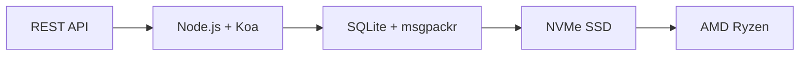

# Den første komplette e-post-API-en: Hvordan Forward Email revolusjonerte e-posthåndtering {#the-first-complete-email-api-how-forward-email-revolutionized-email-management}


<p class="lead mt-3">
  <strong>TL;DR:</strong> Vi bygde verdens første komplette REST API for e-posthåndtering med avanserte søkemuligheter som ingen annen tjeneste tilbyr. Mens Gmail, Outlook og Apple tvinger utviklere inn i IMAP-helvete eller rate-begrensede API-er, leverer Forward Email lynraske CRUD-operasjoner for meldinger, mapper, kontakter og kalendere gjennom et samlet REST-grensesnitt med 15+ søkeparametere. Dette er e-post-API-en utviklere har ventet på.
</p>


## Innholdsfortegnelse {#table-of-contents}

* [E-post-API-problemet](#the-email-api-problem)
* [Hva utviklere faktisk sier](#what-developers-are-actually-saying)
* [Forward Emails revolusjonerende løsning](#forward-emails-revolutionary-solution)
  * [Hvorfor vi bygde dette](#why-we-built-this)
  * [Enkel autentisering](#simple-authentication)
* [20 endepunkter som endrer alt](#20-endpoints-that-change-everything)
  * [Meldinger (5 endepunkter)](#messages-5-endpoints)
  * [Mapper (5 endepunkter)](#folders-5-endpoints)
  * [Kontakter (5 endepunkter)](#contacts-5-endpoints)
  * [Kalendere (5 endepunkter)](#calendars-5-endpoints)
* [Avansert søk: Ingen annen tjeneste kan måle seg](#advanced-search-no-other-service-compares)
  * [Søke-API-landskapet er ødelagt](#the-search-api-landscape-is-broken)
  * [Forward Emails revolusjonerende søke-API](#forward-emails-revolutionary-search-api)
  * [Virkelige søkeeksempler](#real-world-search-examples)
  * [Ytelsesfordeler](#performance-advantages)
  * [Søkefunksjoner ingen andre har](#search-features-no-one-else-has)
  * [Hvorfor dette betyr noe for utviklere](#why-this-matters-for-developers)
  * [Den tekniske implementeringen](#the-technical-implementation)
* [Lynrask ytelsesarkitektur](#blazing-fast-performance-architecture)
  * [Ytelsesmålinger](#performance-benchmarks)
  * [Personvern-først-arkitektur](#privacy-first-architecture)
* [Hvorfor vi er annerledes: Den komplette sammenligningen](#why-were-different-the-complete-comparison)
  * [Store leverandørbegrensninger](#major-provider-limitations)
  * [Forward Email fordeler](#forward-email-advantages)
  * [Problemet med åpen kildekode og transparens](#the-open-source-transparency-problem)
* [30+ virkelige integrasjonseksempler](#30-real-world-integration-examples)
  * [1. Forbedring av WordPress kontaktskjema](#1-wordpress-contact-form-enhancement)
  * [2. Zapier-alternativ for e-postautomatisering](#2-zapier-alternative-for-email-automation)
  * [3. CRM e-postsynkronisering](#3-crm-email-synchronization)
  * [4. E-handelsordrebehandling](#4-e-commerce-order-processing)
  * [5. Support-ticket-integrasjon](#5-support-ticket-integration)
  * [6. Nyhetsbrev-administrasjonssystem](#6-newsletter-management-system)
  * [7. E-postbasert oppgavehåndtering](#7-email-based-task-management)
  * [8. E-postaggregasjon for flere kontoer](#8-multi-account-email-aggregation)
  * [9. Avansert e-postanalyse-dashboard](#9-advanced-email-analytics-dashboard)
  * [10. Smart e-postarkivering](#10-smart-email-archiving)
  * [11. E-post-til-kalender-integrasjon](#11-email-to-calendar-integration)
  * [12. E-postsikkerhetskopiering og samsvar](#12-email-backup-and-compliance)
  * [13. E-postbasert innholdsstyring](#13-email-based-content-management)
  * [14. E-postmaladministrasjon](#14-email-template-management)
  * [15. E-postbasert arbeidsflytautomatisering](#15-email-based-workflow-automation)
  * [16. E-postsikkerhetsovervåking](#16-email-security-monitoring)
  * [17. E-postbasert undersøkelsessamling](#17-email-based-survey-collection)
  * [18. E-postytelsesovervåking](#18-email-performance-monitoring)
  * [19. E-postbasert lead-kvalifisering](#19-email-based-lead-qualification)
  * [20. E-postbasert prosjektstyring](#20-email-based-project-management)
  * [21. E-postbasert lagerstyring](#21-email-based-inventory-management)
  * [22. E-postbasert fakturabehandling](#22-email-based-invoice-processing)
  * [23. E-postbasert arrangementregistrering](#23-email-based-event-registration)
  * [24. E-postbasert dokumentgodkjenningsarbeidsflyt](#24-email-based-document-approval-workflow)
  * [25. E-postbasert kundetilbakemeldingsanalyse](#25-email-based-customer-feedback-analysis)
  * [26. E-postbasert rekrutteringspipeline](#26-email-based-recruitment-pipeline)
  * [27. E-postbasert utgiftsrapportbehandling](#27-email-based-expense-report-processing)
  * [28. E-postbasert kvalitetskontrollrapportering](#28-email-based-quality-assurance-reporting)
  * [29. E-postbasert leverandørstyring](#29-email-based-vendor-management)
  * [30. E-postbasert overvåking av sosiale medier](#30-email-based-social-media-monitoring)
* [Kom i gang](#getting-started)
  * [1. Opprett din Forward Email-konto](#1-create-your-forward-email-account)
  * [2. Generer API-legitimasjon](#2-generate-api-credentials)
  * [3. Foreta ditt første API-kall](#3-make-your-first-api-call)
  * [4. Utforsk dokumentasjonen](#4-explore-the-documentation)
* [Tekniske ressurser](#technical-resources)
## Problemet med e-post-APIer {#the-email-api-problem}

E-post-APIer er fundamentalt ødelagte. Punktum.

Hver eneste stor e-postleverandør tvinger utviklere til ett av to forferdelige valg:

1. **IMAP-helvete**: Å slite med en 30 år gammel protokoll designet for skrivebordsprogrammer, ikke moderne applikasjoner
2. **Handikappede APIer**: Rate-begrensede, skrivebeskyttede, OAuth-komplekse APIer som ikke kan håndtere dine faktiske e-postdata

Resultatet? Utviklere gir enten opp e-postintegrasjon helt eller kaster bort uker på å bygge skjøre IMAP-innpakninger som stadig bryter sammen.

> \[!WARNING]
> **Den skitne hemmeligheten**: De fleste "e-post-APIer" er bare sending-APIer. Du kan ikke programmere organisering av mapper, synkronisere kontakter eller administrere kalendere gjennom et enkelt REST-grensesnitt. Inntil nå.


## Hva utviklere faktisk sier {#what-developers-are-actually-saying}

Frustrasjonen er ekte og dokumentert overalt:

> "Jeg prøvde nylig å integrere Gmail i appen min, og jeg brukte altfor mye tid på det. Jeg bestemte meg for at det ikke er verdt å støtte Gmail."
>
> *- [Hacker News-utvikler](https://news.ycombinator.com/item?id=42106944), 147 oppstemmer*

> "Er alle e-post-APIer middelmådige? De virker begrensede eller restriktive på en eller annen måte."
>
> *- [Reddit r/SaaS diskusjon](https://www.reddit.com/r/SaaS/comments/1cm84s7/are_all_email_apis_mediocre/)*

> "Hvorfor må e-postutvikling være så vanskelig?"
>
> *- [Reddit r/webdev](https://www.reddit.com/r/webdev/comments/15trnp2/why_does_email_development_have_to_suck/), 89 kommentarer om utvikleres frustrasjon*

> "Hva gjør Gmail API mer effektivt enn IMAP? En annen grunn til at Gmail API er mye mer effektivt er fordi det bare trenger å laste ned hver melding én gang. Med IMAP må hver melding lastes ned og indekseres..."
>
> *- [Stack Overflow spørsmål](https://stackoverflow.com/questions/25431022/what-makes-the-gmail-api-more-efficient-than-imap) med 47 oppstemmer*

Bevisene finnes overalt:

* **WordPress SMTP-problemer**: [631 GitHub issues](https://github.com/awesomemotive/WP-Mail-SMTP/issues) om feil ved e-postlevering
* **Zapier-begrensninger**: [Fellesskapsklager](https://community.zapier.com/featured-articles-65/email-parser-by-zapier-limitations-and-alternatives-16958) om 10 e-poster/time-grense og IMAP-deteksjonsfeil
* **IMAP API-prosjekter**: [Flere](https://github.com/ewildgoose/imap-api) [open-source](https://emailengine.app/) [prosjekter](https://www.npmjs.com/package/imapflow) finnes spesielt for å "konvertere IMAP til REST" fordi ingen leverandør tilbyr dette
* **Gmail API-frustrasjoner**: [Stack Overflow](https://stackoverflow.com/questions/tagged/gmail-api) har 4 847 spørsmål merket "gmail-api" med vanlige klager om ratebegrensninger og kompleksitet


## Forward Emails revolusjonerende løsning {#forward-emails-revolutionary-solution}

**Vi er den første e-posttjenesten som tilbyr fullstendige CRUD-operasjoner for alle e-postdata gjennom et samlet REST API.**

Dette er ikke bare et annet sending-API. Dette er full programmatisk kontroll over:

* **Meldinger**: Opprett, les, oppdater, slett, søk, flytt, merk
* **Mapper**: Full IMAP-mappehåndtering via REST-endepunkter
* **Kontakter**: [CardDAV](https://tools.ietf.org/html/rfc6352) kontaktlagring og synkronisering
* **Kalendere**: [CalDAV](https://tools.ietf.org/html/rfc4791) kalenderhendelser og planlegging

### Hvorfor vi bygde dette {#why-we-built-this}

**Problemet**: Hver e-postleverandør behandler e-post som en svart boks. Du kan sende e-poster, kanskje lese dem med kompleks OAuth, men du kan ikke virkelig *administrere* e-postdataene dine programmert.

**Vår visjon**: E-post skal være like enkelt å integrere som hvilken som helst moderne API. Ingen IMAP-biblioteker. Ingen OAuth-kompleksitet. Ingen mareritt med ratebegrensninger. Bare enkle REST-endepunkter som fungerer.

**Resultatet**: Den første e-posttjenesten hvor du kan bygge en komplett e-postklient, CRM-integrasjon eller automatiseringssystem ved kun å bruke HTTP-forespørsler.

### Enkel autentisering {#simple-authentication}

Ingen [OAuth-kompleksitet](https://oauth.net/2/). Ingen [app-spesifikke passord](https://support.google.com/accounts/answer/185833). Bare dine alias-legitimasjoner:

```bash
curl -u "alias@yourdomain.com:password" \
  https://api.forwardemail.net/v1/messages
```
## 20 Endepunkter som Endrer Alt {#20-endpoints-that-change-everything}

### Meldinger (5 endepunkter) {#messages-5-endpoints}

* `GET /v1/messages` - List meldinger med filtrering (`?folder=`, `?is_unread=`, `?is_flagged=`)
* `POST /v1/messages` - Send nye meldinger direkte til mapper
* `GET /v1/messages/:id` - Hent spesifikk melding med full metadata
* `PUT /v1/messages/:id` - Oppdater melding (flagg, mappe, lest status)
* `DELETE /v1/messages/:id` - Slett melding permanent

### Mapper (5 endepunkter) {#folders-5-endpoints}

* `GET /v1/folders` - List alle mapper med abonnementsstatus
* `POST /v1/folders` - Opprett ny mappe med egendefinerte egenskaper
* `GET /v1/folders/:id` - Hent mappedetaljer og meldingsantall
* `PUT /v1/folders/:id` - Oppdater mappeegenskaper og abonnement
* `DELETE /v1/folders/:id` - Slett mappe og håndter meldingsoverføring

### Kontakter (5 endepunkter) {#contacts-5-endpoints}

* `GET /v1/contacts` - List kontakter med søk og paginering
* `POST /v1/contacts` - Opprett ny kontakt med full vCard-støtte
* `GET /v1/contacts/:id` - Hent kontakt med alle felt og metadata
* `PUT /v1/contacts/:id` - Oppdater kontaktinformasjon med ETag-validering
* `DELETE /v1/contacts/:id` - Slett kontakt med kaskadehåndtering

### Kalendere (5 endepunkter) {#calendars-5-endpoints}

* `GET /v1/calendars` - List kalenderhendelser med datofiltrering
* `POST /v1/calendars` - Opprett kalenderhendelse med deltakere og gjentakelse
* `GET /v1/calendars/:id` - Hent hendelsesdetaljer med tidssonehåndtering
* `PUT /v1/calendars/:id` - Oppdater hendelse med konfliktoppdagelse
* `DELETE /v1/calendars/:id` - Slett hendelse med deltakervarsler


## Avansert Søk: Ingen Andre Tjenester Kan Måle Seg {#advanced-search-no-other-service-compares}

**Forward Email er den eneste e-posttjenesten som tilbyr omfattende, programmatisk søk på tvers av alle meldingsfelt gjennom en REST API.**

Mens andre leverandører tilbyr grunnleggende filtrering på det beste, har vi bygget den mest avanserte e-postsøke-APIen som noensinne er laget. Ingen Gmail API, Outlook API eller noen annen tjeneste kommer i nærheten av våre søkemuligheter.

### Søke-API-landskapet er Ødelagt {#the-search-api-landscape-is-broken}

**Begrensninger i Gmail API-søk:**

* ✅ Grunnleggende `q`-parameter kun
* ❌ Ingen feltsøk
* ❌ Ingen datointervallfiltrering
* ❌ Ingen størrelsesbasert filtrering
* ❌ Ingen vedleggsfiltrering
* ❌ Begrenset til Gmails søkesyntaks

**Begrensninger i Outlook API-søk:**

* ✅ Grunnleggende `$search`-parameter
* ❌ Ingen avansert feltmålretting
* ❌ Ingen komplekse spørringskombinasjoner
* ❌ Aggressiv ratebegrensning
* ❌ Krever kompleks OData-syntaks

**Apple iCloud:**

* ❌ Ingen API i det hele tatt
* ❌ Kun IMAP-søk (hvis du får det til å fungere)

**ProtonMail & Tuta:**

* ❌ Ingen offentlige APIer
* ❌ Ingen programmatisk søkefunksjonalitet

### Forward Emails Revolusjonerende Søke-API {#forward-emails-revolutionary-search-api}

**Vi tilbyr 15+ søkeparametere som ingen andre tjenester tilbyr:**

| Søkemulighet                 | Forward Email                          | Gmail API    | Outlook API        | Andre  |
| ---------------------------- | ------------------------------------ | ------------ | ------------------ | ------ |
| **Feltsøk**                  | ✅ Emne, innhold, fra, til, kopi, headere | ❌            | ❌                  | ❌      |
| **Generelt søk på flere felt** | ✅ `?search=` på tvers av alle felt    | ✅ Grunnleggende `q=` | ✅ Grunnleggende `$search=` | ❌      |
| **Datointervallfiltrering**  | ✅ `?since=` & `?before=`             | ❌            | ❌                  | ❌      |
| **Størrelsesbasert filtrering** | ✅ `?min_size=` & `?max_size=`        | ❌            | ❌                  | ❌      |
| **Vedleggsfiltrering**        | ✅ `?has_attachments=true/false`      | ❌            | ❌                  | ❌      |
| **Header-søk**               | ✅ `?headers=X-Priority`              | ❌            | ❌                  | ❌      |
| **Meldings-ID-søk**          | ✅ `?message_id=abc123`               | ❌            | ❌                  | ❌      |
| **Kombinerte filtre**        | ✅ Flere parametere med OG-logikk     | ❌            | ❌                  | ❌      |
| **Søk uten hensyn til store/små bokstaver** | ✅ Alle søk                       | ✅            | ✅                  | ❌      |
| **Støtte for paginering**    | ✅ Fungerer med alle søkeparametere   | ✅            | ✅                  | ❌      |
### Eksempler på søk i virkeligheten {#real-world-search-examples}

**Finn alle fakturaer fra forrige kvartal:**

```bash
# Forward Email - Enkelt og kraftig
GET /v1/messages?subject=invoice&since=2024-01-01T00:00:00Z&before=2024-04-01T00:00:00Z

# Gmail API - Umulig med deres begrensede søk
# Ingen mulighet for datointervallfiltrering

# Outlook API - Kompleks OData-syntaks, begrenset funksjonalitet
GET /me/messages?$search="invoice"&$filter=receivedDateTime ge 2024-01-01T00:00:00Z
```

**Søk etter store vedlegg fra spesifikk avsender:**

```bash
# Forward Email - Omfattende filtrering
GET /v1/messages?from=finance@company.com&has_attachments=true&min_size=1000000

# Gmail API - Kan ikke filtrere på størrelse eller vedlegg programmert
# Outlook API - Ingen mulighet for størrelsesfiltrering
# Andre - Ingen tilgjengelige API-er
```

**Komplekst søk med flere felt:**

```bash
# Forward Email - Avanserte spørringsmuligheter
GET /v1/messages?body=quarterly&from=manager&is_flagged=true&folder=Reports

# Gmail API - Begrenset til grunnleggende tekstsøk
GET /gmail/v1/users/me/messages?q=quarterly

# Outlook API - Grunnleggende søk uten feltspesifisering
GET /me/messages?$search="quarterly"
```

### Ytelsesfordeler {#performance-advantages}

**Forward Email søkeytelse:**

* ⚡ **Svar på under 100 ms** for komplekse søk
* 🔍 **Regex-optimalisering** med riktig indeksering
* 📊 **Parallell spørringsutførelse** for telling og data
* 💾 **Effektiv minnebruk** med slanke spørringer

**Konkurrentenes ytelsesproblemer:**

* 🐌 **Gmail API**: Begrenset til 250 kvoteenheter per bruker per sekund
* 🐌 **Outlook API**: Aggressiv throttling med komplekse backoff-krav
* 🐌 **Andre**: Ingen API-er å sammenligne med

### Søkeegenskaper ingen andre har {#search-features-no-one-else-has}

#### 1. Header-spesifikt søk {#1-header-specific-search}

```bash
# Finn meldinger med spesifikke headere
GET /v1/messages?headers=X-Priority:1
GET /v1/messages?headers=X-Spam-Score
```

#### 2. Størrelsesbasert intelligens {#2-size-based-intelligence}

```bash
# Finn nyhetsbrev (typisk store)
GET /v1/messages?min_size=50000&from=newsletter

# Finn raske svar (typisk små)
GET /v1/messages?max_size=1000&to=support
```

#### 3. Vedleggsbaserte arbeidsflyter {#3-attachment-based-workflows}

```bash
# Finn alle dokumenter sendt til juridisk avdeling
GET /v1/messages?to=legal&has_attachments=true&body=contract

# Finn e-poster uten vedlegg for opprydding
GET /v1/messages?has_attachments=false&before=2023-01-01T00:00:00Z
```

#### 4. Kombinert forretningslogikk {#4-combined-business-logic}

```bash
# Finn viktige flaggede meldinger fra VIP-er med vedlegg
GET /v1/messages?is_flagged=true&from=ceo&has_attachments=true&subject=urgent
```

### Hvorfor dette er viktig for utviklere {#why-this-matters-for-developers}

**Bygg applikasjoner som tidligere var umulige:**

1. **Avansert e-postanalyse**: Analyser e-postmønstre etter størrelse, avsender, innhold
2. **Intelligent e-posthåndtering**: Auto-organiser basert på komplekse kriterier
3. **Samsvar og oppdagelse**: Finn spesifikke e-poster for juridiske krav
4. **Forretningsinnsikt**: Hent ut innsikt fra e-postkommunikasjonsmønstre
5. **Automatiserte arbeidsflyter**: Utløse handlinger basert på sofistikerte e-postfiltre

### Den tekniske implementasjonen {#the-technical-implementation}

Vår søke-API bruker:

* **Regex-optimalisering** med riktige indekseringsstrategier
* **Parallell utførelse** for ytelse
* **Inputvalidering** for sikkerhet
* **Omfattende feilhåndtering** for pålitelighet

```javascript
// Eksempel: Kompleks søkeimplementasjon
const searchConditions = [];

if (ctx.query.subject) {
  searchConditions.push({
    subject: { $regex: ctx.query.subject, $options: 'i' }
  });
}

if (ctx.query.from) {
  searchConditions.push({
    $or: [
      { 'from.address': { $regex: ctx.query.from, $options: 'i' } },
      { 'from.name': { $regex: ctx.query.from, $options: 'i' } }
    ]
  });
}

// Kombiner med OG-logikk
if (searchConditions.length > 0) {
  query.$and = searchConditions;
}
```

> \[!TIP]
> **Utviklerfordel**: Med Forward Emails søke-API kan du bygge e-postapplikasjoner som kan måle seg med desktop-klienter i funksjonalitet, samtidig som du beholder enkelheten til REST API-er.
## Lynrask ytelsesarkitektur {#blazing-fast-performance-architecture}

Vår tekniske stack er bygget for hastighet og pålitelighet:


```mermaid
graph LR
    A[REST API] --> B[Node.js + Koa]
    B --> C[SQLite + msgpackr]
    C --> D[NVMe SSD]
    D --> E[AMD Ryzen]
```

### Ytelsesmålinger {#performance-benchmarks}

**Hvorfor vi er lynraske:**

| Komponent   | Teknologi                                                                        | Ytelsesfordel                               |
| ----------- | -------------------------------------------------------------------------------- | ------------------------------------------- |
| **Lagring** | [NVMe SSD](https://en.wikipedia.org/wiki/NVM_Express)                           | 10x raskere enn tradisjonell SATA           |
| **Database**| [SQLite](https://sqlite.org/) + [msgpackr](https://github.com/kriszyp/msgpackr) | Null nettverksforsinkelse, optimalisert serialisering |
| **Maskinvare** | [AMD Ryzen](https://www.amd.com/en/products/processors/desktops/ryzen) bare metal | Ingen virtualiseringskostnader               |
| **Caching** | I minnet + vedvarende                                                           | Respons under millisekundet                   |
| **Sikkerhetskopier** | [Cloudflare R2](https://www.cloudflare.com/products/r2/) kryptert           | Bedriftsnivå pålitelighet                     |

**Reelle ytelsestall:**

* **API-responstid**: < 50 ms i gjennomsnitt
* **Meldingshenting**: < 10 ms for bufrede meldinger
* **Mappeoperasjoner**: < 5 ms for metadataoperasjoner
* **Kontakt-synkronisering**: 1000+ kontakter/sekund
* **Oppetid**: 99,99 % SLA med redundant infrastruktur

### Personvern-først arkitektur {#privacy-first-architecture}

**Null-kunnskap design**: Kun du har tilgang med ditt IMAP-passord – vi kan ikke lese e-postene dine. Vår [null-kunnskap arkitektur](https://forwardemail.net/en/security) sikrer fullstendig personvern samtidig som den leverer lynrask ytelse.


## Hvorfor vi er annerledes: Den komplette sammenligningen {#why-were-different-the-complete-comparison}

### Store leverandørbegrensninger {#major-provider-limitations}

| Leverandør       | Kjerneproblemer                          | Spesifikke begrensninger                                                                                                                                                                                                                                                                                                                                                                                                                                            |
| ---------------- | --------------------------------------- | ------------------------------------------------------------------------------------------------------------------------------------------------------------------------------------------------------------------------------------------------------------------------------------------------------------------------------------------------------------------------------------------------------------------------------------------------------------------- |
| **Gmail API**    | Kun lesetilgang, Kompleks OAuth, Separate API-er | • [Kan ikke endre eksisterende meldinger](https://developers.google.com/gmail/api/reference/rest/v1/users.messages)<br>• [Etiketter ≠ mapper](https://developers.google.com/gmail/api/reference/rest/v1/users.labels)<br>• [1 milliard kvoteenheter/dag grense](https://developers.google.com/gmail/api/reference/quota)<br>• [Krever separate API-er](https://developers.google.com/workspace) for kontakter/kalender                                                           |
| **Outlook API**  | Utdatert, Forvirrende, Enterprise-fokusert | • [REST-endepunkter utgått mars 2024](https://learn.microsoft.com/en-us/outlook/rest/compare-graph)<br>• [Flere forvirrende API-er](https://learn.microsoft.com/en-us/office/client-developer/outlook/selecting-an-api-or-technology-for-developing-solutions-for-outlook) (EWS, Graph, REST)<br>• [Microsoft Graph kompleksitet](https://learn.microsoft.com/en-us/graph/overview)<br>• [Aggressiv throttling](https://learn.microsoft.com/en-us/graph/throttling) |
| **Apple iCloud** | Ingen offentlig API                     | • [Ingen offentlig API overhodet](https://support.apple.com/en-us/102654)<br>• [Kun IMAP med 1000 e-poster/dag grense](https://support.apple.com/en-us/102654)<br>• [App-spesifikke passord kreves](https://support.apple.com/en-us/102654)<br>• [500 mottakere per melding grense](https://support.apple.com/en-us/102654)                                                                                                                                              |
| **ProtonMail**   | Ingen API, Falske åpen kildekode-påstander | • [Ingen offentlig API tilgjengelig](https://proton.me/support/protonmail-bridge-clients)<br>• [Bridge-programvare kreves](https://proton.me/mail/bridge) for IMAP-tilgang<br>• [Påstår "åpen kildekode"](https://proton.me/blog/open-source) men [serverkoden er proprietær](https://github.com/ProtonMail)<br>• [Begrenset til betalte planer](https://proton.me/pricing)                                                                                                         |
| **Tuta**         | Ingen API, Misvisende åpenhet            | • [Ingen REST API for e-posthåndtering](https://tuta.com/support#technical)<br>• [Påstår "åpen kildekode"](https://tuta.com/blog/posts/open-source-email) men [backend er lukket](https://github.com/tutao/tutanota)<br>• [IMAP/SMTP ikke støttet](https://tuta.com/support#imap)<br>• [Proprietær kryptering](https://tuta.com/encryption) hindrer standardintegrasjoner                                                                                               |
| **Zapier Email** | Strenge hastighetsbegrensninger          | • [10 e-poster per time grense](https://help.zapier.com/hc/en-us/articles/8496181555597-Email-Parser-by-Zapier-limitations-and-alternatives)<br>• [Ingen IMAP-mappe-tilgang](https://help.zapier.com/hc/en-us/articles/8496181555597-Email-Parser-by-Zapier-limitations-and-alternatives)<br>• [Begrensede parsing-muligheter](https://help.zapier.com/hc/en-us/articles/8496181555597-Email-Parser-by-Zapier-limitations-and-alternatives)                                 |
### Fordeler med videresending av e-post {#forward-email-advantages}

| Funksjon           | Videresending av e-post                                                                     | Konkurrenter                             |
| ------------------ | -------------------------------------------------------------------------------------------- | ----------------------------------------- |
| **Full CRUD**      | ✅ Full opprettelse, lesing, oppdatering, sletting for alle data                              | ❌ Kun lesing eller begrensede operasjoner |
| **Enhetlig API**   | ✅ Meldinger, mapper, kontakter, kalendere i ett API                                        | ❌ Separate API-er eller manglende funksjoner |
| **Enkel autentisering** | ✅ Enkel autentisering med alias-legitimasjon                                             | ❌ Kompleks OAuth med flere tillatelser    |
| **Ingen hastighetsbegrensninger** | ✅ Generøse grenser designet for reelle applikasjoner                              | ❌ Restriktive kvoter som bryter arbeidsflyt |
| **Selvhosting**    | ✅ [Fullstendig selvhosting-alternativ](https://forwardemail.net/en/blog/docs/self-hosted-solution) | ❌ Kun leverandørlåsning                   |
| **Personvern**     | ✅ Null-kunnskap, kryptert, privat                                                          | ❌ Datainnsamling og personvernproblemer  |
| **Ytelse**         | ✅ Under 50 ms responstid, NVMe-lagring                                                    | ❌ Nettverksforsinkelser, struping         |

### Problemet med åpen kildekode og gjennomsiktighet {#the-open-source-transparency-problem}

**ProtonMail og Tuta markedsfører seg som "åpen kildekode" og "gjennomsiktige," men dette er misvisende markedsføring som bryter med moderne personvernprinsipper.**

> \[!WARNING]
> **Falske påstander om gjennomsiktighet**: Både ProtonMail og Tuta reklamerer sterkt med sine "åpen kildekode"-kvalifikasjoner samtidig som de holder sin mest kritiske serverkode proprietær og lukket.

**ProtonMails bedrag:**

* **Påstander**: ["Vi er åpen kildekode"](https://proton.me/blog/open-source) fremhevet i markedsføring
* **Virkelighet**: [Serverkoden er helt proprietær](https://github.com/ProtonMail) – kun klientapper er åpen kildekode
* **Konsekvens**: Brukere kan ikke verifisere server-side kryptering, databehandling eller personvernpåstander
* **Brudd på gjennomsiktighet**: Ingen mulighet til å revidere de faktiske e-postbehandlings- og lagringssystemene

**Tutas misvisende markedsføring:**

* **Påstander**: ["Åpen kildekode e-post"](https://tuta.com/blog/posts/open-source-email) som et kjernepunkt
* **Virkelighet**: [Backend-infrastrukturen er lukket kildekode](https://github.com/tutao/tutanota) – kun frontend er tilgjengelig
* **Konsekvens**: Proprietær kryptering hindrer standard e-postprotokoller (IMAP/SMTP)
* **Låsestrategi**: Egendefinert kryptering tvinger leverandørafhengighet

**Hvorfor dette er viktig for moderne personvern:**

I 2025 krever ekte personvern **fullstendig gjennomsiktighet**. Når e-postleverandører hevder "åpen kildekode" men skjuler serverkoden:

1. **Uverifiserbar kryptering**: Du kan ikke revidere hvordan dataene dine faktisk krypteres
2. **Skjulte dataprosesser**: Server-side databehandling forblir en svart boks
3. **Tillitsbasert sikkerhet**: Du må stole på påstandene uten verifisering
4. **Leverandørlåsning**: Proprietære systemer hindrer dataportabilitet

**Forward Emails ekte gjennomsiktighet:**

* ✅ **[Fullstendig åpen kildekode](https://github.com/forwardemail/forwardemail.net)** – server- og klientkode
* ✅ **[Selvhosting tilgjengelig](https://forwardemail.net/en/blog/docs/self-hosted-solution)** – kjør din egen instans
* ✅ **Standardprotokoller** – IMAP, SMTP, CardDAV, CalDAV-kompatibilitet
* ✅ **Reviderbar sikkerhet** – hver kodelinje kan inspiseres
* ✅ **Ingen leverandørlåsning** – dine data, din kontroll

> \[!TIP]
> **Ekte åpen kildekode betyr at du kan verifisere hver påstand.** Med Forward Email kan du revidere vår kryptering, gjennomgå vår databehandling, og til og med kjøre din egen instans. Det er ekte gjennomsiktighet.


## 30+ ekte integrasjonseksempler {#30-real-world-integration-examples}

### 1. Forbedring av WordPress kontaktskjema {#1-wordpress-contact-form-enhancement}
**Problem**: [WordPress SMTP-konfigurasjonsfeil](https://github.com/awesomemotive/WP-Mail-SMTP/issues) ([631 GitHub-issues](https://github.com/awesomemotive/WP-Mail-SMTP/issues))
**Løsning**: Direkte API-integrasjon omgår [SMTP](https://tools.ietf.org/html/rfc5321) helt

```javascript
// WordPress kontaktskjema som lagrer til Sendt-mappen
await fetch('https://api.forwardemail.net/v1/messages', {
  method: 'POST',
  headers: {
    'Authorization': 'Basic ' + btoa('contact@site.com:password'),
    'Content-Type': 'application/json'
  },
  body: JSON.stringify({
    to: [{ address: 'owner@site.com' }],
    subject: 'Kontaktskjema: ' + formData.subject,
    text: formData.message,
    folder: 'Sent'
  })
});
```

### 2. Zapier-alternativ for e-postautomatisering {#2-zapier-alternative-for-email-automation}

**Problem**: [Zapiers grense på 10 e-poster/time](https://help.zapier.com/hc/en-us/articles/8496181555597-Email-Parser-by-Zapier-limitations-and-alternatives) og [IMAP-deteksjonsfeil](https://community.zapier.com/featured-articles-65/email-parser-by-zapier-limitations-and-alternatives-16958)
**Løsning**: Ubegrenset automatisering med full e-postkontroll

```javascript
// Auto-organiser e-poster etter avsenderdomene
const messages = await fetch('/v1/messages?folder=INBOX');
for (const message of messages) {
  const domain = message.from.split('@')[1];
  await fetch(`/v1/messages/${message.id}`, {
    method: 'PUT',
    body: JSON.stringify({ folder: `Clients/${domain}` })
  });
}
```

### 3. CRM e-postsynkronisering {#3-crm-email-synchronization}

**Problem**: Manuell kontaktadministrasjon mellom e-post og [CRM-systemer](https://en.wikipedia.org/wiki/Customer_relationship_management)
**Løsning**: To-veis synkronisering med [CardDAV](https://tools.ietf.org/html/rfc6352) kontakt-API

```javascript
// Synkroniser nye e-postkontakter til CRM
const newContacts = await fetch('/v1/contacts');
for (const contact of newContacts) {
  await crmAPI.createContact({
    name: contact.name,
    email: contact.email,
    source: 'email_api'
  });
}
```

### 4. E-handelsordrebehandling {#4-e-commerce-order-processing}

**Problem**: Manuell ordrebehandling av e-post for [e-handelsplattformer](https://en.wikipedia.org/wiki/E-commerce)
**Løsning**: Automatisert ordrebehandlingspipeline

```javascript
// Behandle ordrebekreftelses-e-poster
const orders = await fetch('/v1/messages?folder=Orders');
const orderEmails = orders.filter(msg =>
  msg.subject.includes('Order Confirmation')
);

for (const order of orderEmails) {
  const orderData = parseOrderEmail(order.text);
  await updateInventory(orderData);
  await fetch(`/v1/messages/${order.id}`, {
    method: 'PUT',
    body: JSON.stringify({ folder: 'Orders/Processed' })
  });
}
```

### 5. Support-sak-integrasjon {#5-support-ticket-integration}

**Problem**: E-posttråder spredt over [helpdesk-plattformer](https://en.wikipedia.org/wiki/Help_desk_software)
**Løsning**: Fullstendig sporing av e-posttråder

```javascript
// Opprett supportsak fra e-posttråd
const messages = await fetch('/v1/messages?folder=Support');
const supportEmails = messages.filter(msg =>
  msg.to.some(addr => addr.includes('support@'))
);

for (const email of supportEmails) {
  const ticket = await supportSystem.createTicket({
    subject: email.subject,
    from: email.from,
    body: email.text,
    timestamp: email.date
  });
}
```

### 6. Nyhetsbrev-administrasjonssystem {#6-newsletter-management-system}

**Problem**: Begrensede integrasjoner med [nyhetsbrevsplattformer](https://en.wikipedia.org/wiki/Email_marketing)
**Løsning**: Fullstendig administrasjon av abonnenters livssyklus

```javascript
// Automatisk administrasjon av nyhetsbrevsabonnementer
const messages = await fetch('/v1/messages?folder=Newsletter');
const unsubscribes = messages.filter(msg =>
  msg.subject.toLowerCase().includes('unsubscribe')
);

for (const msg of unsubscribes) {
  await removeSubscriber(msg.from);
  await fetch(`/v1/messages/${msg.id}`, {
    method: 'PUT',
    body: JSON.stringify({ folder: 'Newsletter/Unsubscribed' })
  });
}
```

### 7. E-postbasert oppgavehåndtering {#7-email-based-task-management}

**Problem**: Overveldende innboks og [oppgaveoppfølging](https://en.wikipedia.org/wiki/Task_management)
**Løsning**: Konverter e-poster til handlingsbare oppgaver
```javascript
// Create tasks from flagged emails
const messages = await fetch('/v1/messages?is_flagged=true');
for (const email of messages) {
  await taskManager.createTask({
    title: email.subject,
    description: email.text,
    assignee: email.to[0].address,
    dueDate: extractDueDate(email.text)
  });
}
```

### 8. Multi-Account Email Aggregation {#8-multi-account-email-aggregation}

**Problem**: Managing [multiple email accounts](https://en.wikipedia.org/wiki/Email_client) across providers
**Solution**: Unified inbox interface

```javascript
// Aggregate emails from multiple accounts
const accounts = ['work@domain.com', 'personal@domain.com'];
const allMessages = [];

for (const account of accounts) {
  const messages = await fetch('/v1/messages', {
    headers: { 'Authorization': getAuth(account) }
  });
  allMessages.push(...messages.map(m => ({ ...m, account })));
}
```

### 9. Advanced Email Analytics Dashboard {#9-advanced-email-analytics-dashboard}

**Problem**: No insights into [email patterns](https://en.wikipedia.org/wiki/Email_analytics) with sophisticated filtering
**Solution**: Custom email analytics using advanced search capabilities

```javascript
// Generate comprehensive email analytics using advanced search
const analytics = {};

// Analyze email volume by sender domain
const messages = await fetch('/v1/messages');
analytics.senderDomains = analyzeSenderDomains(messages);

// Find large attachments consuming storage
const largeAttachments = await fetch('/v1/messages?has_attachments=true&min_size=1000000');
analytics.storageHogs = largeAttachments.map(msg => ({
  subject: msg.subject,
  from: msg.from,
  size: msg.size
}));

// Analyze communication patterns with VIPs
const vipEmails = await fetch('/v1/messages?from=ceo@company.com');
const urgentVipEmails = await fetch('/v1/messages?from=ceo@company.com&subject=urgent');
analytics.vipCommunication = {
  total: vipEmails.length,
  urgent: urgentVipEmails.length,
  urgencyRate: (urgentVipEmails.length / vipEmails.length) * 100
};

// Find unread emails by date range for follow-up
const lastWeek = new Date(Date.now() - 7 * 24 * 60 * 60 * 1000).toISOString();
const unreadRecent = await fetch(`/v1/messages?is_unread=true&since=${lastWeek}`);
analytics.followUpNeeded = unreadRecent.length;

// Analyze email sizes for optimization
const smallEmails = await fetch('/v1/messages?max_size=1000');
const mediumEmails = await fetch('/v1/messages?min_size=1000&max_size=50000');
const largeEmails = await fetch('/v1/messages?min_size=50000');
analytics.sizeDistribution = {
  small: smallEmails.length,
  medium: mediumEmails.length,
  large: largeEmails.length
};

// Search for compliance-related emails
const complianceEmails = await fetch('/v1/messages?body=confidential&has_attachments=true');
analytics.complianceReview = complianceEmails.length;
```

### 10. Smart Email Archiving {#10-smart-email-archiving}

**Problem**: Manual [email organization](https://en.wikipedia.org/wiki/Email_management)
**Solution**: Intelligent email categorization

```javascript
// Auto-archive old emails by category
const messages = await fetch('/v1/messages');
const oldEmails = messages.filter(email =>
  isOlderThan(email.date, 90) // 90 days
);

for (const email of oldEmails) {
  const category = categorizeEmail(email);
  await fetch(`/v1/messages/${email.id}`, {
    method: 'PUT',
    body: JSON.stringify({ folder: `Archive/${category}` })
  });
}
```

### 11. Email-to-Calendar Integration {#11-email-to-calendar-integration}

**Problem**: Manual [calendar event](https://tools.ietf.org/html/rfc4791) creation from emails
**Solution**: Automatic event extraction and creation

```javascript
// Extract meeting details from emails
const messages = await fetch('/v1/messages?folder=Meetings');
const meetingEmails = messages.filter(email =>
  email.subject.toLowerCase().includes('meeting')
);

for (const email of meetingEmails) {
  const meetingData = extractMeetingInfo(email.text);
  if (meetingData.date && meetingData.time) {
    await fetch('/v1/calendars', {
      method: 'POST',
      body: JSON.stringify({
        title: email.subject,
        start: meetingData.datetime,
        attendees: [email.from, ...email.to]
      })
    });
  }
}
```

### 12. E-postsikkerhetskopiering og samsvar {#12-email-backup-and-compliance}

**Problem**: [E-postlagring](https://en.wikipedia.org/wiki/Email_retention_policy) og samsvarskrav  
**Løsning**: Automatisk sikkerhetskopiering med bevaring av metadata

```javascript
// Sikkerhetskopier e-poster med full metadata
const allMessages = await fetch('/v1/messages');
const backup = {
  timestamp: new Date(),
  messages: allMessages.map(msg => ({
    id: msg.id,
    subject: msg.subject,
    from: msg.from,
    to: msg.to,
    date: msg.date,
    flags: msg.flags
  }))
};
await saveToComplianceStorage(backup);
```

### 13. E-postbasert innholdsstyring {#13-email-based-content-management}

**Problem**: Håndtering av innholdsendringer via e-post for [CMS-plattformer](https://en.wikipedia.org/wiki/Content_management_system)  
**Løsning**: E-post som innholdsstyringssystem

```javascript
// Behandle innholdsendringer fra e-post
const messages = await fetch('/v1/messages?folder=Submissions');
const submissions = messages.filter(msg =>
  msg.to.some(addr => addr.includes('submit@'))
);

for (const submission of submissions) {
  const content = parseSubmission(submission.text);
  await cms.createDraft({
    title: submission.subject,
    content: content.body,
    author: submission.from
  });
}
```

### 14. E-postmaladministrasjon {#14-email-template-management}

**Problem**: Uensartede [e-postmaler](https://en.wikipedia.org/wiki/Email_template) i teamet  
**Løsning**: Sentralisert mal-system med API

```javascript
// Send e-poster med mal og dynamisk innhold
const template = await getEmailTemplate('welcome');
await fetch('/v1/messages', {
  method: 'POST',
  body: JSON.stringify({
    to: [{ address: newUser.email }],
    subject: template.subject.replace('{{name}}', newUser.name),
    html: template.html.replace('{{name}}', newUser.name),
    folder: 'Sent'
  })
});
```

### 15. E-postbasert arbeidsflytautomatisering {#15-email-based-workflow-automation}

**Problem**: Manuelle [godkjenningsprosesser](https://en.wikipedia.org/wiki/Workflow) via e-post  
**Løsning**: Automatiserte arbeidsflytutløsere

```javascript
// Behandle godkjennings-e-poster
const messages = await fetch('/v1/messages?folder=Approvals');
const approvals = messages.filter(msg =>
  msg.subject.includes('APPROVAL')
);

for (const approval of approvals) {
  const decision = parseApprovalDecision(approval.text);
  await workflow.processApproval({
    requestId: extractRequestId(approval.subject),
    decision: decision,
    approver: approval.from
  });
}
```

### 16. E-postsikkerhetsovervåking {#16-email-security-monitoring}

**Problem**: Manuell [trusseldeteksjon](https://en.wikipedia.org/wiki/Email_security)  
**Løsning**: Automatisk trusselanalyse

```javascript
// Overvåk mistenkelige e-poster
const recentEmails = await fetch('/v1/messages');
for (const email of recentEmails) {
  const threatScore = analyzeThreat(email);
  if (threatScore > 0.8) {
    await fetch(`/v1/messages/${email.id}`, {
      method: 'PUT',
      body: JSON.stringify({ folder: 'Security/Quarantine' })
    });
    await alertSecurityTeam(email);
  }
}
```

### 17. E-postbasert undersøkelsessamling {#17-email-based-survey-collection}

**Problem**: Manuell behandling av [undersøkelsessvar](https://en.wikipedia.org/wiki/Survey_methodology)  
**Løsning**: Automatisk responsaggregasjon

```javascript
// Samle inn og behandle undersøkelsessvar
const messages = await fetch('/v1/messages?folder=Surveys');
const responses = messages.filter(msg =>
  msg.subject.includes('Survey Response')
);

const surveyData = responses.map(email => ({
  respondent: email.from,
  responses: parseSurveyData(email.text),
  timestamp: email.date
}));
await updateSurveyResults(surveyData);
```

### 18. E-postytelsesovervåking {#18-email-performance-monitoring}

**Problem**: Manglende innsikt i [e-postleveringsytelse](https://en.wikipedia.org/wiki/Email_deliverability)  
**Løsning**: E-poststatistikk i sanntid

```javascript
// Overvåk e-postleveringsytelse
const sentEmails = await fetch('/v1/messages?folder=Sent');
const deliveryStats = {
  sent: sentEmails.length,
  bounces: await countBounces(),
  deliveryRate: calculateDeliveryRate()
};
await updateDashboard(deliveryStats);
```
### 19. E-postbasert lead-kvalifisering {#19-email-based-lead-qualification}

**Problem**: Manuell [lead scoring](https://en.wikipedia.org/wiki/Lead_scoring) fra e-postinteraksjoner  
**Løsning**: Automatisert lead-kvalifiseringspipeline

```javascript
// Score leads basert på e-postengasjement
const prospects = await fetch('/v1/contacts');
for (const prospect of prospects) {
  const messages = await fetch('/v1/messages');
  const emails = messages.filter(msg =>
    msg.from.includes(prospect.email)
  );
  const score = calculateEngagementScore(emails);
  await crm.updateLeadScore(prospect.id, score);
}
```

### 20. E-postbasert prosjektstyring {#20-email-based-project-management}

**Problem**: [Prosjektoppdateringer](https://en.wikipedia.org/wiki/Project_management) spredt over e-posttråder  
**Løsning**: Sentralisert kommunikasjonsnav for prosjekter

```javascript
// Hent prosjektoppdateringer fra e-poster
const messages = await fetch('/v1/messages?folder=Projects');
const projectEmails = messages.filter(msg =>
  msg.subject.includes('Project Update')
);

for (const email of projectEmails) {
  const update = parseProjectUpdate(email.text);
  await projectManager.addUpdate({
    project: update.projectId,
    author: email.from,
    content: update.content
  });
}
```

### 21. E-postbasert lagerstyring {#21-email-based-inventory-management}

**Problem**: Manuelle lageroppdateringer fra leverandøre-poster  
**Løsning**: Automatisert lageroppfølging fra e-postvarsler

```javascript
// Behandle lageroppdateringer fra leverandøre-poster
const messages = await fetch('/v1/messages?folder=Suppliers');
const inventoryEmails = messages.filter(msg =>
  msg.subject.includes('Inventory Update') || msg.subject.includes('Stock Alert')
);

for (const email of inventoryEmails) {
  const inventoryData = parseInventoryUpdate(email.text);
  await inventory.updateStock({
    sku: inventoryData.sku,
    quantity: inventoryData.quantity,
    supplier: email.from,
    timestamp: email.date
  });

  // Flytt til behandlet-mappe
  await fetch(`/v1/messages/${email.id}`, {
    method: 'PUT',
    body: JSON.stringify({ folder: 'Suppliers/Processed' })
  });
}
```

### 22. E-postbasert fakturabehandling {#22-email-based-invoice-processing}

**Problem**: Manuell [fakturabehandling](https://en.wikipedia.org/wiki/Invoice_processing) og regnskapsintegrasjon  
**Løsning**: Automatisert fakturauttrekk og synkronisering med regnskapssystem

```javascript
// Hent fakturadata fra e-postvedlegg
const messages = await fetch('/v1/messages?folder=Invoices');
const invoiceEmails = messages.filter(msg =>
  msg.subject.toLowerCase().includes('invoice') && msg.attachments.length > 0
);

for (const email of invoiceEmails) {
  const invoiceData = await extractInvoiceData(email.attachments[0]);
  await accounting.createInvoice({
    vendor: email.from,
    amount: invoiceData.total,
    dueDate: invoiceData.dueDate,
    items: invoiceData.lineItems
  });

  // Merk som behandlet
  await fetch(`/v1/messages/${email.id}`, {
    method: 'PUT',
    body: JSON.stringify({ flags: ['\\Seen', '\\Flagged'] })
  });
}
```

### 23. E-postbasert påmelding til arrangement {#23-email-based-event-registration}

**Problem**: Manuell [påmelding til arrangement](https://en.wikipedia.org/wiki/Event_management) fra e-postsvar  
**Løsning**: Automatisert deltakerhåndtering og kalenderintegrasjon

```javascript
// Behandle påmeldings-e-poster til arrangement
const messages = await fetch('/v1/messages?folder=Events');
const registrations = messages.filter(msg =>
  msg.subject.includes('Registration') || msg.subject.includes('RSVP')
);

for (const registration of registrations) {
  const attendeeData = parseRegistration(registration.text);

  // Legg til i deltakerlisten
  await events.addAttendee({
    event: attendeeData.eventId,
    name: attendeeData.name,
    email: registration.from,
    dietary: attendeeData.dietaryRestrictions
  });

  // Opprett kalenderhendelse for deltaker
  await fetch('/v1/calendars', {
    method: 'POST',
    body: JSON.stringify({
      title: attendeeData.eventName,
      start: attendeeData.eventDate,
      attendees: [registration.from]
    })
  });
}
```
### 24. E-postbasert dokumentgodkjenningsflyt {#24-email-based-document-approval-workflow}

**Problem**: Komplekse [dokumentgodkjennings](https://en.wikipedia.org/wiki/Document_management_system)-kjeder via e-post  
**Løsning**: Automatisert sporing av godkjenning og dokumentversjonering

```javascript
// Track document approval workflow
const messages = await fetch('/v1/messages?folder=Approvals');
const approvalEmails = messages.filter(msg =>
  msg.subject.includes('Document Approval')
);

for (const email of approvalEmails) {
  const approval = parseApprovalEmail(email.text);

  await documentSystem.updateApproval({
    documentId: approval.documentId,
    approver: email.from,
    status: approval.decision, // 'approved', 'rejected', 'needs_changes'
    comments: approval.comments,
    timestamp: email.date
  });

  // Check if all approvals complete
  const document = await documentSystem.getDocument(approval.documentId);
  if (document.allApprovalsComplete) {
    await documentSystem.finalizeDocument(approval.documentId);
  }
}
```

### 25. E-postbasert analyse av kundetilbakemeldinger {#25-email-based-customer-feedback-analysis}

**Problem**: Manuell innsamling av [kundetilbakemeldinger](https://en.wikipedia.org/wiki/Customer_feedback) og sentimentanalyse  
**Løsning**: Automatisert behandling av tilbakemeldinger og sporing av sentiment

```javascript
// Analyze customer feedback from emails
const messages = await fetch('/v1/messages?folder=Feedback');
const feedbackEmails = messages.filter(msg =>
  msg.to.some(addr => addr.includes('feedback@'))
);

for (const email of feedbackEmails) {
  const sentiment = await analyzeSentiment(email.text);
  const category = categorizeFeeback(email.text);

  await feedback.recordFeedback({
    customer: email.from,
    content: email.text,
    sentiment: sentiment.score, // -1 to 1
    category: category, // 'bug', 'feature', 'complaint', 'praise'
    priority: calculatePriority(sentiment, category),
    timestamp: email.date
  });

  // Auto-escalate negative feedback
  if (sentiment.score < -0.5) {
    await escalateToSupport(email);
  }
}
```

### 26. E-postbasert rekrutteringspipeline {#26-email-based-recruitment-pipeline}

**Problem**: Manuell [rekruttering](https://en.wikipedia.org/wiki/Recruitment) og kandidatsporing  
**Løsning**: Automatisert kandidatbehandling og intervjuscheduling

```javascript
// Process job application emails
const messages = await fetch('/v1/messages?folder=Careers');
const applications = messages.filter(msg =>
  msg.subject.toLowerCase().includes('application') && msg.attachments.length > 0
);

for (const application of applications) {
  const resume = await parseResume(application.attachments[0]);

  const candidate = await ats.createCandidate({
    name: resume.name,
    email: application.from,
    skills: resume.skills,
    experience: resume.experience,
    position: extractPosition(application.subject)
  });

  // Auto-schedule screening if qualified
  if (candidate.qualificationScore > 0.7) {
    await calendar.scheduleInterview({
      candidateId: candidate.id,
      type: 'phone_screening',
      duration: 30
    });
  }
}
```

### 27. E-postbasert behandling av utgiftsrapporter {#27-email-based-expense-report-processing}

**Problem**: Manuell innsending og godkjenning av [utgiftsrapporter](https://en.wikipedia.org/wiki/Expense_report)  
**Løsning**: Automatisert utgiftsuttrekking og godkjenningsflyt

```javascript
// Process expense report emails
const messages = await fetch('/v1/messages?folder=Expenses');
const expenseEmails = messages.filter(msg =>
  msg.subject.includes('Expense') && msg.attachments.length > 0
);

for (const email of expenseEmails) {
  const receipts = await processReceipts(email.attachments);

  const expenseReport = await expenses.createReport({
    employee: email.from,
    expenses: receipts.map(receipt => ({
      amount: receipt.total,
      category: receipt.category,
      date: receipt.date,
      merchant: receipt.merchant
    })),
    totalAmount: receipts.reduce((sum, r) => sum + r.total, 0)
  });

  // Auto-approve small amounts
  if (expenseReport.totalAmount < 100) {
    await expenses.approve(expenseReport.id);
  } else {
    await expenses.sendForApproval(expenseReport.id);
  }
}
```
### 28. E-postbasert kvalitetskontrollrapportering {#28-email-based-quality-assurance-reporting}

**Problem**: Manuell [kvalitetssikring](https://en.wikipedia.org/wiki/Quality_assurance) feilsporing  
**Løsning**: Automatisert QA-feilhåndtering og feilsporing

```javascript
// Process QA bug reports from email
const messages = await fetch('/v1/messages?folder=QA');
const bugReports = messages.filter(msg =>
  msg.subject.includes('Bug Report') || msg.subject.includes('QA Issue')
);

for (const report of bugReports) {
  const bugData = parseBugReport(report.text);

  const ticket = await bugTracker.createIssue({
    title: report.subject,
    description: bugData.description,
    severity: bugData.severity,
    steps: bugData.stepsToReproduce,
    reporter: report.from,
    attachments: report.attachments
  });

  // Auto-assign based on component
  const assignee = await getComponentOwner(bugData.component);
  await bugTracker.assign(ticket.id, assignee);

  // Create calendar reminder for follow-up
  await fetch('/v1/calendars', {
    method: 'POST',
    body: JSON.stringify({
      title: `Follow up on ${ticket.id}`,
      start: addDays(new Date(), 3),
      attendees: [assignee]
    })
  });
}
```

### 29. E-postbasert leverandørstyring {#29-email-based-vendor-management}

**Problem**: Manuell [leverandørkommunikasjon](https://en.wikipedia.org/wiki/Vendor_management) og kontraktssporing  
**Løsning**: Automatisert leverandørrelasjonsstyring

```javascript
// Track vendor communications and contracts
const messages = await fetch('/v1/messages?folder=Vendors');
const vendorEmails = messages.filter(msg =>
  isVendorEmail(msg.from)
);

for (const email of vendorEmails) {
  const vendor = await vendors.getByEmail(email.from);

  // Log communication
  await vendors.logCommunication({
    vendorId: vendor.id,
    type: 'email',
    subject: email.subject,
    content: email.text,
    timestamp: email.date
  });

  // Check for contract-related keywords
  if (email.text.includes('contract') || email.text.includes('renewal')) {
    await vendors.flagForContractReview({
      vendorId: vendor.id,
      emailId: email.id,
      priority: 'high'
    });

    // Create task for procurement team
    await tasks.create({
      title: `Gjennomgå kontraktskommunikasjon fra ${vendor.name}`,
      assignee: 'procurement@company.com',
      dueDate: addDays(new Date(), 2)
    });
  }
}
```

### 30. E-postbasert overvåking av sosiale medier {#30-email-based-social-media-monitoring}

**Problem**: Manuell [sosiale medier](https://en.wikipedia.org/wiki/Social_media_monitoring) omtalesporing og respons  
**Løsning**: Automatisert behandling av sosiale medier-varsler og koordinering av respons

```javascript
// Process social media alerts from email notifications
const messages = await fetch('/v1/messages?folder=Social');
const socialAlerts = messages.filter(msg =>
  msg.from.includes('alerts@') || msg.subject.includes('Social Mention')
);

for (const alert of socialAlerts) {
  const mention = parseSocialMention(alert.text);

  await socialMedia.recordMention({
    platform: mention.platform,
    author: mention.author,
    content: mention.content,
    sentiment: mention.sentiment,
    reach: mention.followerCount,
    url: mention.url
  });

  // Auto-escalate negative mentions with high reach
  if (mention.sentiment < -0.5 && mention.followerCount > 10000) {
    await socialMedia.escalateToTeam({
      mentionId: mention.id,
      priority: 'urgent',
      assignee: 'social-media-manager@company.com'
    });

    // Create calendar reminder for immediate response
    await fetch('/v1/calendars', {
      method: 'POST',
      body: JSON.stringify({
        title: `Haster: Svar på negativ omtale i sosiale medier`,
        start: addMinutes(new Date(), 30),
        attendees: ['social-media-manager@company.com']
      })
    });
  }
}
```


## Komme i gang {#getting-started}

### 1. Opprett din videresendings-e-postkonto {#1-create-your-forward-email-account}

Registrer deg på [forwardemail.net](https://forwardemail.net) og verifiser domenet ditt.

### 2. Generer API-legitimasjon {#2-generate-api-credentials}

Din alias-e-post og passord fungerer som API-legitimasjon – ingen ekstra oppsett kreves.
### 3. Gjør ditt første API-kall {#3-make-your-first-api-call}

```bash
# List opp meldingene dine
curl -u "your-alias@domain.com:password" \
  https://api.forwardemail.net/v1/messages

# Opprett en ny kontakt
curl -u "your-alias@domain.com:password" \
  -X POST \
  -H "Content-Type: application/json" \
  -d '{"fullName":"John Doe","emails":[{"value":"john@example.com"}]}' \
  https://api.forwardemail.net/v1/contacts
```

### 4. Utforsk dokumentasjonen {#4-explore-the-documentation}

Besøk [forwardemail.net/en/email-api](https://forwardemail.net/en/email-api) for komplett API-dokumentasjon med interaktive eksempler.


## Tekniske ressurser {#technical-resources}

* **[Komplett API-dokumentasjon](https://forwardemail.net/en/email-api)** - Interaktiv OpenAPI 3.0-spesifikasjon
* **[Veiledning for selvhosting](https://forwardemail.net/en/blog/docs/self-hosted-solution)** - Distribuer Forward Email på din infrastruktur
* **[Sikkerhets-whitepaper](https://forwardemail.net/technical-whitepaper.pdf)** - Teknisk arkitektur og sikkerhetsdetaljer
* **[GitHub-repositorium](https://github.com/forwardemail/forwardemail.net)** - Åpen kildekode
* **[Utviklerstøtte](mailto:api@forwardemail.net)** - Direkte tilgang til vårt ingeniørteam

---

**Klar til å revolusjonere e-postintegrasjonen din?** [Begynn å bygge med Forward Emails API i dag](https://forwardemail.net/en/email-api) og opplev den første komplette e-postadministrasjonsplattformen designet for utviklere.

*Forward Email: E-posttjenesten som endelig får API-er riktig.*
