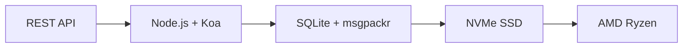

# Pierwszy kompletny interfejs API poczty e-mail: Jak Forward Email zrewolucjonizował zarządzanie pocztą e-mail {#the-first-complete-email-api-how-forward-email-revolutionized-email-management}


<p class="lead mt-3">
<strong>TL;DR:</strong> Stworzyliśmy pierwsze na świecie kompletne API REST do zarządzania pocztą e-mail z zaawansowanymi możliwościami wyszukiwania, których nie oferuje żadna inna usługa. Podczas gdy Gmail, Outlook i Apple zmuszają programistów do korzystania z piekła IMAP lub API o ograniczonej przepustowości, Forward Email zapewnia błyskawiczne operacje CRUD dla wiadomości, folderów, kontaktów i kalendarzy poprzez ujednolicony interfejs REST z ponad 15 parametrami wyszukiwania. To jest właśnie to API, na które czekali programiści.
</p>

## Spis treści {#table-of-contents}

* [Problem z API poczty e-mail](#the-email-api-problem)
* [Co tak naprawdę mówią deweloperzy](#what-developers-are-actually-saying)
* [Rewolucyjne rozwiązanie Forward Email](#forward-emails-revolutionary-solution)
  * [Dlaczego to zbudowaliśmy](#why-we-built-this)
  * [Proste uwierzytelnianie](#simple-authentication)
* [20 punktów końcowych, które zmieniają wszystko](#20-endpoints-that-change-everything)
  * [Wiadomości (5 punktów końcowych)](#messages-5-endpoints)
  * [Foldery (5 punktów końcowych)](#folders-5-endpoints)
  * [Kontakty (5 punktów końcowych)](#contacts-5-endpoints)
  * [Kalendarze (5 punktów końcowych)](#calendars-5-endpoints)
* [Zaawansowane wyszukiwanie: Żadna inna usługa nie może się z Tobą równać](#advanced-search-no-other-service-compares)
  * [Krajobraz API wyszukiwania jest zepsuty](#the-search-api-landscape-is-broken)
  * [Rewolucyjne API wyszukiwania Forward Email](#forward-emails-revolutionary-search-api)
  * [Przykłady wyszukiwania w świecie rzeczywistym](#real-world-search-examples)
  * [Zalety wydajnościowe](#performance-advantages)
  * [Funkcje wyszukiwania, których nikt inny nie ma](#search-features-no-one-else-has)
  * [Dlaczego to ma znaczenie dla programistów](#why-this-matters-for-developers)
  * [Wdrożenie techniczne](#the-technical-implementation)
* [Błyskawicznie szybka architektura wydajnościowa](#blazing-fast-performance-architecture)
  * [Testy wydajności](#performance-benchmarks)
  * [Architektura stawiająca prywatność na pierwszym miejscu](#privacy-first-architecture)
* [Dlaczego jesteśmy inni: kompletne porównanie](#why-were-different-the-complete-comparison)
  * [Ograniczenia głównych dostawców](#major-provider-limitations)
  * [Zalety przekazywania wiadomości e-mail](#forward-email-advantages)
  * [Problem przejrzystości oprogramowania typu open source](#the-open-source-transparency-problem)
* [Ponad 30 przykładów integracji w świecie rzeczywistym](#30-real-world-integration-examples)
  * [1. Ulepszenie formularza kontaktowego WordPress](#1-wordpress-contact-form-enhancement)
  * [2. Alternatywa dla Zapiera do automatyzacji poczty e-mail](#2-zapier-alternative-for-email-automation)
  * [3. Synchronizacja poczty e-mail CRM](#3-crm-email-synchronization)
  * [4. Przetwarzanie zamówień e-commerce](#4-e-commerce-order-processing)
  * [5. Integracja zgłoszeń pomocy technicznej](#5-support-ticket-integration)
  * [6. System zarządzania newsletterem](#6-newsletter-management-system)
  * [7. Zarządzanie zadaniami za pomocą poczty e-mail](#7-email-based-task-management)
  * [8. Agregacja poczty e-mail z wielu kont](#8-multi-account-email-aggregation)
  * [9. Zaawansowany panel analityki wiadomości e-mail](#9-advanced-email-analytics-dashboard)
  * [10. Inteligentne archiwizowanie wiadomości e-mail](#10-smart-email-archiving)
  * [11. Integracja poczty e-mail z kalendarzem](#11-email-to-calendar-integration)
  * [12. Kopia zapasowa poczty e-mail i zgodność z przepisami](#12-email-backup-and-compliance)
  * [13. Zarządzanie treścią w oparciu o pocztę e-mail](#13-email-based-content-management)
  * [14. Zarządzanie szablonami wiadomości e-mail](#14-email-template-management)
  * [15. Automatyzacja przepływu pracy oparta na poczcie e-mail](#15-email-based-workflow-automation)
  * [16. Monitorowanie bezpieczeństwa poczty elektronicznej](#16-email-security-monitoring)
  * [17. Zbieranie ankiet za pośrednictwem poczty e-mail](#17-email-based-survey-collection)
  * [18. Monitorowanie wydajności poczty e-mail](#18-email-performance-monitoring)
  * [19. Kwalifikacja potencjalnych klientów na podstawie wiadomości e-mail](#19-email-based-lead-qualification)
  * [20. Zarządzanie projektami w oparciu o pocztę e-mail](#20-email-based-project-management)
  * [21. Zarządzanie zapasami za pomocą poczty e-mail](#21-email-based-inventory-management)
  * [22. Przetwarzanie faktur za pośrednictwem poczty e-mail](#22-email-based-invoice-processing)
  * [23. Rejestracja na wydarzenie za pośrednictwem poczty e-mail](#23-email-based-event-registration)
  * [24. Przepływ pracy zatwierdzania dokumentów za pośrednictwem poczty e-mail](#24-email-based-document-approval-workflow)
  * [25. Analiza opinii klientów na podstawie wiadomości e-mail](#25-email-based-customer-feedback-analysis)
  * [26. Proces rekrutacji oparty na poczcie e-mail](#26-email-based-recruitment-pipeline)
  * [27. Przetwarzanie raportów wydatków na podstawie wiadomości e-mail](#27-email-based-expense-report-processing)
  * [28. Raportowanie zapewnienia jakości w oparciu o pocztę e-mail](#28-email-based-quality-assurance-reporting)
  * [29. Zarządzanie dostawcami za pomocą poczty e-mail](#29-email-based-vendor-management)
  * [30. Monitorowanie mediów społecznościowych za pomocą poczty e-mail](#30-email-based-social-media-monitoring)
* [Rozpoczęcie pracy](#getting-started)
  * [1. Utwórz konto e-mail do przekazywania dalej](#1-create-your-forward-email-account)
  * [2. Wygeneruj dane uwierzytelniające API](#2-generate-api-credentials)
  * [3. Wykonaj pierwsze wywołanie API](#3-make-your-first-api-call)
  * [4. Przeglądaj dokumentację](#4-explore-the-documentation)
* [Zasoby techniczne](#technical-resources)

## Problem z interfejsem API poczty e-mail {#the-email-api-problem}

Interfejsy API poczty e-mail są zasadniczo zepsute. Kropka.

Każdy duży dostawca poczty e-mail stawia programistów przed jedną z dwóch fatalnych decyzji:

1. **Piekło IMAP**: Zmaganie się z 30-letnim protokołem przeznaczonym dla klientów stacjonarnych, a nie dla nowoczesnych aplikacji
2. **Uszkodzone API**: Ograniczone pod względem przepustowości, tylko do odczytu, złożone interfejsy API OAuth, które nie potrafią zarządzać rzeczywistymi danymi e-mail

Efekt? Deweloperzy albo całkowicie rezygnują z integracji poczty e-mail, albo tracą tygodnie na tworzenie niestabilnych wrapperów IMAP, które ciągle się psują.

> \[!WARNING]
> **Brudny Sekret**: Większość „interfejsów API poczty e-mail” to po prostu interfejsy API do wysyłania. Nie można programowo organizować folderów, synchronizować kontaktów ani zarządzać kalendarzami za pomocą prostego interfejsu REST. Aż do teraz.

## Co tak naprawdę mówią programiści {#what-developers-are-actually-saying}

Frustracja jest prawdziwa i udokumentowana wszędzie:

> „Niedawno próbowałem zintegrować Gmaila z moją aplikacją i poświęciłem na to za dużo czasu. Doszedłem do wniosku, że nie warto wspierać Gmaila”.

> > *- [Twórca Hacker News](https://news.ycombinator.com/item?id=42106944), 147 głosów na tak*

> „Czy wszystkie interfejsy API poczty e-mail są przeciętne? Wydają się w jakiś sposób ograniczone lub restrykcyjne”.
>
> *- [Dyskusja na Reddicie r/SaaS](https://www.reddit.com/r/SaaS/comments/1cm84s7/are_all_email_apis_mediocre/)*

> „Dlaczego tworzenie poczty e-mail musi być do bani?”

> *- [Reddit r/webdev](https://www.reddit.com/r/webdev/comments/15trnp2/why_does_email_development_have_to_suck/), 89 komentarzy dotyczących bólu programisty*

> „Co sprawia, że API Gmaila jest wydajniejsze niż IMAP? Innym powodem, dla którego API Gmaila jest znacznie wydajniejsze, jest to, że wystarczy pobrać każdą wiadomość tylko raz. W przypadku IMAP każda wiadomość musi zostać pobrana i zindeksowana...”
>
> *- [Pytanie na Stack Overflow](https://stackoverflow.com/questions/25431022/what-makes-the-gmail-api-more-efficient-than-imap) z 47 głosami na tak*

Dowody są wszędzie:

* **Problemy z SMTP w WordPressie**: [631 problemów w serwisie GitHub](https://github.com/awesomemotive/WP-Mail-SMTP/issues) – problemy z dostarczaniem wiadomości e-mail
* **Ograniczenia Zapiera**: [Skargi społeczności](https://community.zapier.com/featured-articles-65/email-parser-by-zapier-limitations-and-alternatives-16958) – limit około 10 wiadomości e-mail na godzinę i błędy wykrywania IMAP
* **Projekty API IMAP**: [Wiele](https://github.com/ewildgoose/imap-api), [oprogramowanie typu open source](https://emailengine.app/) i [projektowanie](https://www.npmjs.com/package/imapflow) istnieją specjalnie po to, aby „konwertować IMAP na REST”, ponieważ żaden dostawca tego nie oferuje
* **Frustracje związane z API Gmaila**: [Stack Overflow](https://stackoverflow.com/questions/tagged/gmail-api) ma 4847 pytań oznaczonych tagiem „gmail-api” z typowymi skargami dotyczącymi limitów przepustowości i złożoności

## Rewolucyjne rozwiązanie Forward Email {#forward-emails-revolutionary-solution}

**Jesteśmy pierwszą firmą świadczącą usługi poczty elektronicznej oferującą kompletne operacje CRUD dla wszystkich danych e-mail za pośrednictwem ujednoliconego interfejsu API REST.**

To nie jest po prostu kolejny interfejs API do wysyłania. To pełna, programowa kontrola nad:

* **Wiadomości**: Tworzenie, odczytywanie, aktualizowanie, usuwanie, wyszukiwanie, przenoszenie, oznaczanie flagą
* **Foldery**: Pełne zarządzanie folderami IMAP za pośrednictwem punktów końcowych REST
* **Kontakty**: Przechowywanie i synchronizacja kontaktów [CardDAV](https://tools.ietf.org/html/rfc6352)
* **Kalendarze**: Wydarzenia w kalendarzu [CalDAV](https://tools.ietf.org/html/rfc4791) i planowanie

### Dlaczego zbudowaliśmy to {#why-we-built-this}

**Problem**: Każdy dostawca poczty elektronicznej traktuje pocztę e-mail jak czarną skrzynkę. Możesz wysyłać e-maile, a nawet je odczytywać za pomocą złożonego protokołu OAuth, ale nie możesz w pełni *zarządzać* swoimi danymi e-mail programowo.

**Nasza wizja**: E-mail powinien być tak łatwy w integracji, jak każde nowoczesne API. Bez bibliotek IMAP. Bez skomplikowanego OAuth. Bez koszmarów związanych z limitami przepustowości. Tylko proste, działające punkty końcowe REST.

**Rezultat**: Pierwsza usługa poczty e-mail, dzięki której możesz zbudować kompletnego klienta poczty e-mail, zintegrować system CRM lub zautomatyzować system, wykorzystując wyłącznie żądania HTTP.

### Proste uwierzytelnianie {#simple-authentication}

Brak [Złożoność OAuth](https://oauth.net/2/). Brak [hasła specyficzne dla aplikacji](https://support.google.com/accounts/answer/185833). Tylko dane uwierzytelniające aliasu:

```bash
curl -u "alias@yourdomain.com:password" \
  https://api.forwardemail.net/v1/messages
```

## 20 punktów końcowych, które zmieniają wszystko {#20-endpoints-that-change-everything}

### Wiadomości (5 punktów końcowych) {#messages-5-endpoints}

* `GET /v1/messages` – Wyświetla wiadomości z filtrowaniem (`?folder=`, `?is_unread=`, `?is_flagged=`)
* `POST /v1/messages` – Wysyła nowe wiadomości bezpośrednio do folderów
* `GET /v1/messages/:id` – Pobiera konkretną wiadomość z pełnymi metadanymi
* `PUT /v1/messages/:id` – Aktualizuje wiadomość (flagi, folder, status odczytu)
* `DELETE /v1/messages/:id` – Trwale usuwa wiadomość

### Foldery (5 punktów końcowych) {#folders-5-endpoints}

* `GET /v1/folders` – Wyświetla listę wszystkich folderów ze statusem subskrypcji
* `POST /v1/folders` – Tworzy nowy folder z niestandardowymi właściwościami
* `GET /v1/folders/:id` – Pobiera szczegóły folderu i liczbę wiadomości
* `PUT /v1/folders/:id` – Aktualizuje właściwości folderu i subskrypcję
* `DELETE /v1/folders/:id` – Usuwa folder i obsługuje relokację wiadomości

### Kontakty (5 punktów końcowych) {#contacts-5-endpoints}

* `GET /v1/contacts` – Wyświetla listę kontaktów z wyszukiwaniem i paginacją
* `POST /v1/contacts` – Tworzy nowy kontakt z pełną obsługą vCard
* `GET /v1/contacts/:id` – Pobiera kontakt ze wszystkimi polami i metadanymi
* `PUT /v1/contacts/:id` – Aktualizuje dane kontaktowe z walidacją ETag
* `DELETE /v1/contacts/:id` – Kasuje kontakt z obsługą kaskadową

### Kalendarze (5 punktów końcowych) {#calendars-5-endpoints}

* `GET /v1/calendars` – Wyświetla wydarzenia w kalendarzu z filtrowaniem dat
* `POST /v1/calendars` – Tworzy wydarzenie w kalendarzu z uczestnikami i możliwością powtarzania
* `GET /v1/calendars/:id` – Pobiera szczegóły wydarzenia z obsługą strefy czasowej
* `PUT /v1/calendars/:id` – Aktualizuje wydarzenie z wykrywaniem konfliktów
* `DELETE /v1/calendars/:id` – Usuwa wydarzenie z powiadomieniami dla uczestników

## Wyszukiwanie zaawansowane: Żadna inna usługa nie porównuje {#advanced-search-no-other-service-compares}

**Forward Email to jedyna usługa poczty e-mail oferująca kompleksowe, programowe wyszukiwanie we wszystkich polach wiadomości za pośrednictwem interfejsu API REST.**

Podczas gdy inni dostawcy oferują co najwyżej podstawowe filtrowanie, my stworzyliśmy najbardziej zaawansowane API wyszukiwania e-maili, jakie kiedykolwiek stworzono. Żadne API Gmaila, API Outlooka ani żadna inna usługa nie dorównuje naszym możliwościom wyszukiwania.

### Krajobraz interfejsu API wyszukiwania jest zepsuty {#the-search-api-landscape-is-broken}

**Ograniczenia wyszukiwania w interfejsie API Gmaila:**

* ✅ Tylko podstawowy parametr `q`
* ❌ Brak wyszukiwania według pola
* ❌ Brak filtrowania zakresu dat
* ❌ Brak filtrowania według rozmiaru
* ❌ Brak filtrowania załączników
* ❌ Ograniczenie do składni wyszukiwania Gmaila

**Ograniczenia wyszukiwania w interfejsie API programu Outlook:**

* ✅ Podstawowy parametr `$search`
* ❌ Brak zaawansowanego celowania w pola
* ❌ Brak złożonych kombinacji zapytań
* ❌ Agresywne ograniczanie szybkości
* ❌ Wymagana złożona składnia OData

**Apple iCloud:**

* ❌ Brak API
* ❌ Tylko wyszukiwanie IMAP (jeśli uda Ci się je uruchomić)

**ProtonMail i Tuta:**

* ❌ Brak publicznych interfejsów API
* ❌ Brak możliwości wyszukiwania programowego

### Rewolucyjny interfejs API wyszukiwania Forward Email {#forward-emails-revolutionary-search-api}

**Oferujemy ponad 15 parametrów wyszukiwania, których nie zapewnia żadna inna usługa:**

| Możliwość wyszukiwania | Przekaż dalej e-mail | Interfejs API Gmaila | Interfejs API programu Outlook | Inni |
| ------------------------------ | -------------------------------------- | ------------ | ------------------ | ------ |
| **Wyszukiwanie według pola** | ✅ Temat, treść, od, do, DW, nagłówki | ❌ | ❌ | ❌ |
| **Ogólne wyszukiwanie wielodziedzinowe** | ✅ `?search=` we wszystkich polach | ✅ Podstawowy `q=` | ✅ Podstawowy `$search=` | ❌ |
| **Filtrowanie zakresu dat** | ✅ `?since=` & `?before=` | ❌ | ❌ | ❌ |
| **Filtrowanie na podstawie rozmiaru** | ✅ `?min_size=` & `?max_size=` | ❌ | ❌ | ❌ |
| **Filtrowanie załączników** | ✅ `?has_attachments=true/false` | ❌ | ❌ | ❌ |
| **Wyszukiwanie w nagłówku** | ✅ `?headers=X-Priority` | ❌ | ❌ | ❌ |
| **Wyszukiwanie identyfikatorów wiadomości** | ✅ `?message_id=abc123` | ❌ | ❌ | ❌ |
| **Filtry łączone** | ✅ Wiele parametrów z logiką AND | ❌ | ❌ | ❌ |
| **Bez uwzględniania wielkości liter** | ✅ Wszystkie wyszukiwania | ✅ | ✅ | ❌ |
| **Obsługa paginacji** | ✅ Działa ze wszystkimi parametrami wyszukiwania | ✅ | ✅ | ❌ |

### Przykłady wyszukiwania w świecie rzeczywistym {#real-world-search-examples}

**Znajdź wszystkie faktury z ostatniego kwartału:**

```bash
# Forward Email - Simple and powerful
GET /v1/messages?subject=invoice&since=2024-01-01T00:00:00Z&before=2024-04-01T00:00:00Z

# Gmail API - Impossible with their limited search
# No date range filtering available

# Outlook API - Complex OData syntax, limited functionality
GET /me/messages?$search="invoice"&$filter=receivedDateTime ge 2024-01-01T00:00:00Z
```

**Szukaj dużych załączników od konkretnego nadawcy:**

```bash
# Forward Email - Comprehensive filtering
GET /v1/messages?from=finance@company.com&has_attachments=true&min_size=1000000

# Gmail API - Cannot filter by size or attachments programmatically
# Outlook API - No size filtering available
# Others - No APIs available
```

**Kompleksowe wyszukiwanie wielopolowe:**

```bash
# Forward Email - Advanced query capabilities
GET /v1/messages?body=quarterly&from=manager&is_flagged=true&folder=Reports

# Gmail API - Limited to basic text search only
GET /gmail/v1/users/me/messages?q=quarterly

# Outlook API - Basic search without field targeting
GET /me/messages?$search="quarterly"
```

### Zalety wydajnościowe {#performance-advantages}

**Wydajność wyszukiwania wiadomości e-mail:**

* ⚡ **Czas odpowiedzi poniżej 100 ms** dla złożonych wyszukiwań
* 🔍 **Optymalizacja wyrażeń regularnych** z odpowiednim indeksowaniem
* 📊 **Równoległe wykonywanie zapytań** dla liczb i danych
* 💾 **Efektywne wykorzystanie pamięci** dzięki oszczędnym zapytaniom

**Problemy z wydajnością konkurencji:**

* 🐌 **API Gmaila**: Ograniczenie przepustowości do 250 jednostek limitu na użytkownika na sekundę
* 🐌 **API Outlooka**: Agresywne ograniczanie przepustowości ze złożonymi wymaganiami dotyczącymi backoffu
* 🐌 **Inne**: Brak interfejsów API do porównania

### Funkcje wyszukiwania, których nikt inny nie ma {#search-features-no-one-else-has}

#### 1. Wyszukiwanie specyficzne dla nagłówka {#1-header-specific-search}

```bash
# Find messages with specific headers
GET /v1/messages?headers=X-Priority:1
GET /v1/messages?headers=X-Spam-Score
```

#### 2. Inteligencja oparta na rozmiarze {#2-size-based-intelligence}

```bash
# Find newsletter emails (typically large)
GET /v1/messages?min_size=50000&from=newsletter

# Find quick replies (typically small)
GET /v1/messages?max_size=1000&to=support
```

#### 3. Przepływy pracy oparte na załącznikach {#3-attachment-based-workflows}

```bash
# Find all documents sent to legal team
GET /v1/messages?to=legal&has_attachments=true&body=contract

# Find emails without attachments for cleanup
GET /v1/messages?has_attachments=false&before=2023-01-01T00:00:00Z
```

#### 4. Połączona logika biznesowa {#4-combined-business-logic}

```bash
# Find urgent flagged messages from VIPs with attachments
GET /v1/messages?is_flagged=true&from=ceo&has_attachments=true&subject=urgent
```

### Dlaczego to ma znaczenie dla programistów {#why-this-matters-for-developers}

**Tworzenie aplikacji, które wcześniej były niemożliwe:**

1. **Zaawansowana analityka wiadomości e-mail**: Analizuj wzorce wiadomości e-mail według rozmiaru, nadawcy i treści
2. **Inteligentne zarządzanie wiadomościami e-mail**: Automatyczna organizacja na podstawie złożonych kryteriów
3. **Zgodność i wykrywanie**: Znajdź konkretne wiadomości e-mail pod kątem wymogów prawnych
4. **Business Intelligence**: Wyciągnij wnioski ze wzorców komunikacji e-mail
5. **Zautomatyzowane przepływy pracy**: Wyzwalaj działania na podstawie zaawansowanych filtrów wiadomości e-mail

### Implementacja techniczna {#the-technical-implementation}

Nasze API wyszukiwania wykorzystuje:

* **Optymalizacja wyrażeń regularnych** z odpowiednimi strategiami indeksowania
* **Równoległe wykonywanie** dla zwiększenia wydajności
* **Walidacja danych wejściowych** dla bezpieczeństwa
* **Kompleksowa obsługa błędów** dla zwiększenia niezawodności

```javascript
// Example: Complex search implementation
const searchConditions = [];

if (ctx.query.subject) {
  searchConditions.push({
    subject: { $regex: ctx.query.subject, $options: 'i' }
  });
}

if (ctx.query.from) {
  searchConditions.push({
    $or: [
      { 'from.address': { $regex: ctx.query.from, $options: 'i' } },
      { 'from.name': { $regex: ctx.query.from, $options: 'i' } }
    ]
  });
}

// Combine with AND logic
if (searchConditions.length > 0) {
  query.$and = searchConditions;
}
```

> \[!TIP]
> **Zaleta dla programistów**: Dzięki interfejsowi API wyszukiwania Forward Email możesz tworzyć aplikacje pocztowe, które pod względem funkcjonalności dorównują klientom stacjonarnym, zachowując jednocześnie prostotę interfejsów API REST.

## Błyskawicznie szybka architektura wydajności {#blazing-fast-performance-architecture}

Nasz zestaw rozwiązań technicznych został stworzony z myślą o szybkości i niezawodności:



### Testy wydajności {#performance-benchmarks}

**Dlaczego jesteśmy błyskawiczni:**

| Część | Technologia | Korzyść wydajnościowa |
| ------------ | --------------------------------------------------------------------------------- | --------------------------------------------- |
| **Składowanie** | [NVMe SSD](https://en.wikipedia.org/wiki/NVM_Express) | 10x szybszy niż tradycyjny SATA |
| **Baza danych** | [SQLite](https://sqlite.org/) + [msgpackr](https://github.com/kriszyp/msgpackr) | Zerowe opóźnienie sieciowe, zoptymalizowana serializacja |
| **Sprzęt komputerowy** | [AMD Ryzen](https://www.amd.com/en/products/processors/desktops/ryzen) goły metal | Brak narzutu wirtualizacji |
| **Buforowanie** | W pamięci + trwałe | Czas reakcji poniżej milisekundy |
| **Kopie zapasowe** | [Cloudflare R2](https://www.cloudflare.com/products/r2/) zaszyfrowane | Niezawodność klasy korporacyjnej |

**Rzeczywiste liczby wydajności:**

* **Czas reakcji API**: średnio < 50 ms
* **Pobieranie wiadomości**: < 10 ms dla wiadomości z pamięci podręcznej
* **Operacje na folderach**: < 5 ms dla operacji na metadanych
* **Synchronizacja kontaktów**: ponad 1000 kontaktów na sekundę
* **Czas sprawności**: 99,99% SLA z redundantną infrastrukturą

### Architektura stawiająca prywatność na pierwszym miejscu {#privacy-first-architecture}

**Projekt Zero-Knowledge**: Tylko Ty masz dostęp do swoich wiadomości e-mail za pomocą hasła IMAP – nie możemy ich odczytać. Nasz [architektura zerowej wiedzy](https://forwardemail.net/en/security) zapewnia pełną prywatność, a jednocześnie imponującą wydajność.

## Dlaczego jesteśmy inni: kompletne porównanie {#why-were-different-the-complete-comparison}

### Główne ograniczenia dostawcy {#major-provider-limitations}

| Dostawca | Podstawowe problemy | Ograniczenia szczegółowe |
| ---------------- | ----------------------------------------- | -------------------------------------------------------------------------------------------------------------------------------------------------------------------------------------------------------------------------------------------------------------------------------------------------------------------------------------------------------------------------------------------------------------------------------------------------------------------- |
| **API Gmaila** | Tylko do odczytu, złożone OAuth, oddzielne interfejsy API | • [Cannot modify existing messages](https://developers.google.com/gmail/api/reference/rest/v1/users.messages)<br>• [Labels ≠ folders](https://developers.google.com/gmail/api/reference/rest/v1/users.labels)<br>• [1 billion quota units/day limit](https://developers.google.com/gmail/api/reference/quota)<br>• [Requires separate APIs](https://developers.google.com/workspace) dla kontaktów/kalendarza |
| **API Outlooka** | Przestarzałe, mylące, skoncentrowane na przedsiębiorstwach | • [REST endpoints deprecated March 2024](https://learn.microsoft.com/en-us/outlook/rest/compare-graph)<br>• [Multiple confusing APIs](https://learn.microsoft.com/en-us/office/client-developer/outlook/selecting-an-api-or-technology-for-developing-solutions-for-outlook) (EWS, Graf, REST)<br>• [Microsoft Graph complexity](https://learn.microsoft.com/en-us/graph/overview)<br>• [Aggressive throttling](https://learn.microsoft.com/en-us/graph/throttling) |
| **Apple iCloud** | Brak publicznego API | • [No public API whatsoever](https://support.apple.com/en-us/102654)<br>• [IMAP-only with 1000 emails/day limit](https://support.apple.com/en-us/102654)<br>• [App-specific passwords required](https://support.apple.com/en-us/102654)<br>• [500 recipients per message limit](https://support.apple.com/en-us/102654) |
| **ProtonMail** | Brak API, fałszywe twierdzenia o otwartym kodzie źródłowym | • [No public API available](https://proton.me/support/protonmail-bridge-clients)<br>• [Bridge software required](https://proton.me/mail/bridge) dla dostępu IMAP<br>• [Claims "open source"](https://proton.me/blog/open-source) ale [server code is proprietary](https://github.com/ProtonMail)<br>• [Limited to paid plans only](https://proton.me/pricing) |
| **Całkowity** | Brak API, myląca przejrzystość | • [No REST API for email management](https://tuta.com/support#technical)<br>• [Claims "open source"](https://tuta.com/blog/posts/open-source-email), ale [backend is closed](https://github.com/tutao/tutanota)<br>• [IMAP/SMTP not supported](https://tuta.com/support#imap)<br>• [Proprietary encryption](https://tuta.com/encryption) uniemożliwia standardowe integracje |
| **E-mail Zapier** | Ograniczenia prędkości przesyłu danych | • [10 emails per hour limit](https://help.zapier.com/hc/en-us/articles/8496181555597-Email-Parser-by-Zapier-limitations-and-alternatives)<br>• [No IMAP folder access](https://help.zapier.com/hc/en-us/articles/8496181555597-Email-Parser-by-Zapier-limitations-and-alternatives)<br>• [Limited parsing capabilities](https://help.zapier.com/hc/en-us/articles/8496181555597-Email-Parser-by-Zapier-limitations-and-alternatives) |

### Zalety przekazywania wiadomości e-mail {#forward-email-advantages}

| Funkcja | Przekaż dalej e-mail | Konkurs |
| ------------------ | -------------------------------------------------------------------------------------------- | ----------------------------------------- |
| **Kompletny CRUD** | ✅ Pełne tworzenie, odczytywanie, aktualizowanie i usuwanie wszystkich danych | ❌ Operacje tylko do odczytu lub ograniczone |
| **Ujednolicone API** | ✅ Wiadomości, foldery, kontakty, kalendarze w jednym API | ❌ Osobne API lub brakujące funkcje |
| **Proste uwierzytelnianie** | ✅ Podstawowe uwierzytelnianie z danymi uwierzytelniającymi alias | ❌ Złożone OAuth z wieloma zakresami |
| **Brak ograniczeń prędkości** | ✅ Hojne limity zaprojektowane z myślą o rzeczywistych zastosowaniach | ❌ Ograniczenia kwotowe, które zakłócają przepływy pracy |
| **Samodzielny hosting** | ✅ [Complete self-hosting option](https://forwardemail.net/en/blog/docs/self-hosted-solution) | ❌ Tylko blokada dostawcy |
| **Prywatność** | ✅ Zero-wiedza, szyfrowanie, prywatność | ❌ Eksploracja danych i obawy dotyczące prywatności |
| **Wydajność** | ✅ Reakcje poniżej 50 ms, pamięć masowa NVMe | ❌ Opóźnienia sieciowe, opóźnienia związane z ograniczaniem przepustowości |

### Problem przejrzystości oprogramowania typu open source {#the-open-source-transparency-problem}

**ProtonMail i Tuta reklamują się jako firmy „open source” i „transparentne”, ale jest to marketing wprowadzający w błąd i naruszający współczesne zasady prywatności.**

> \[!WARNING]
> **Fałszywe twierdzenia o przejrzystości**: Zarówno ProtonMail, jak i Tuta wyraźnie reklamują swoje dane uwierzytelniające typu „open source”, jednocześnie utrzymując, że ich najważniejszy kod po stronie serwera jest zastrzeżony i zamknięty.

**Oszustwo ProtonMail:**

* **Twierdzenia**: [„Jesteśmy open source”](https://proton.me/blog/open-source) jest szeroko prezentowany w materiałach marketingowych
* **Rzeczywistość**: [Kod serwera jest całkowicie zastrzeżony](https://github.com/ProtonMail) – tylko aplikacje klienckie są open source
* **Wpływ**: Użytkownicy nie mogą zweryfikować szyfrowania po stronie serwera, przetwarzania danych ani oświadczeń dotyczących prywatności
* **Naruszenie przejrzystości**: Brak możliwości audytu rzeczywistych systemów przetwarzania i przechowywania wiadomości e-mail

**Wprowadzający w błąd marketing Tuty:**

* **Twierdzenia**: [„E-mail o otwartym kodzie źródłowym”](https://tuta.com/blog/posts/open-source-email) jako główny argument sprzedażowy
* **Rzeczywistość**: [Infrastruktura zaplecza jest zamknięta](https://github.com/tutao/tutanota) — dostępny jest tylko frontend
* **Skutek**: Własnościowe szyfrowanie uniemożliwia korzystanie ze standardowych protokołów poczty e-mail (IMAP/SMTP)
* **Strategia blokady**: Niestandardowe szyfrowanie wymusza zależność od dostawcy

**Dlaczego ma to znaczenie dla współczesnej prywatności:**

W 2025 roku prawdziwa prywatność wymaga **pełnej przejrzystości**. Kiedy dostawcy poczty e-mail twierdzą, że są „open source”, ale ukrywają kod swojego serwera:

1. **Niezweryfikowane szyfrowanie**: Nie możesz sprawdzić, jak Twoje dane są faktycznie szyfrowane.
2. **Ukryte praktyki dotyczące danych**: Przetwarzanie danych po stronie serwera pozostaje czarną skrzynką.
3. **Bezpieczeństwo oparte na zaufaniu**: Musisz ufać ich zapewnieniom bez weryfikacji.
4. **Uzależnienie od dostawcy**: Systemy zastrzeżone uniemożliwiają przenoszenie danych.

**Prawdziwa przejrzystość przesyłania dalej wiadomości e-mail:**

* ✅ **[Całkowicie otwarte oprogramowanie](https://github.com/forwardemail/forwardemail.net)** – kod serwera i klienta
* ✅ **[Dostępny hosting własny](https://forwardemail.net/en/blog/docs/self-hosted-solution)** – uruchom własną instancję
* ✅ **Standardowe protokoły** – zgodność z IMAP, SMTP, CardDAV, CalDAV
* ✅ **Audytowalne bezpieczeństwo** – możliwość sprawdzenia każdej linijki kodu
* ✅ **Brak uzależnienia od dostawcy** – Twoje dane, Twoja kontrola

> \[!TIP]
> **Prawdziwe oprogramowanie open source oznacza, że możesz zweryfikować każde zgłoszenie.** Dzięki Forward Email możesz audytować nasze szyfrowanie, sprawdzać przetwarzanie danych, a nawet uruchamiać własną instancję. To prawdziwa transparentność.

## Ponad 30 przykładów integracji w świecie rzeczywistym {#30-real-world-integration-examples}

### 1. Ulepszenie formularza kontaktowego WordPress {#1-wordpress-contact-form-enhancement}

**Problem**: [Błędy konfiguracji SMTP WordPress](https://github.com/awesomemotive/WP-Mail-SMTP/issues) ([631 problemów w serwisie GitHub](https://github.com/awesomemotive/WP-Mail-SMTP/issues))
**Rozwiązanie**: Bezpośrednia integracja API całkowicie pomija [SMTP](https://tools.ietf.org/html/rfc5321)

```javascript
// WordPress contact form that saves to Sent folder
await fetch('https://api.forwardemail.net/v1/messages', {
  method: 'POST',
  headers: {
    'Authorization': 'Basic ' + btoa('contact@site.com:password'),
    'Content-Type': 'application/json'
  },
  body: JSON.stringify({
    to: [{ address: 'owner@site.com' }],
    subject: 'Contact Form: ' + formData.subject,
    text: formData.message,
    folder: 'Sent'
  })
});
```

### 2. Alternatywa dla Zapiera do automatyzacji poczty e-mail {#2-zapier-alternative-for-email-automation}

**Problem**: [Limit 10 wiadomości e-mail na godzinę w Zapier](https://help.zapier.com/hc/en-us/articles/8496181555597-Email-Parser-by-Zapier-limitations-and-alternatives) i [Błędy wykrywania IMAP](https://community.zapier.com/featured-articles-65/email-parser-by-zapier-limitations-and-alternatives-16958)
**Rozwiązanie**: Nieograniczona automatyzacja z pełną kontrolą poczty e-mail

```javascript
// Auto-organize emails by sender domain
const messages = await fetch('/v1/messages?folder=INBOX');
for (const message of messages) {
  const domain = message.from.split('@')[1];
  await fetch(`/v1/messages/${message.id}`, {
    method: 'PUT',
    body: JSON.stringify({ folder: `Clients/${domain}` })
  });
}
```

### 3. Synchronizacja poczty e-mail CRM {#3-crm-email-synchronization}

**Problem**: Ręczne zarządzanie kontaktami między pocztą e-mail a [Systemy CRM](https://en.wikipedia.org/wiki/Customer_relationship_management)
**Rozwiązanie**: Dwukierunkowa synchronizacja z API kontaktów [CardDAV](https://tools.ietf.org/html/rfc6352)

```javascript
// Sync new email contacts to CRM
const newContacts = await fetch('/v1/contacts');
for (const contact of newContacts) {
  await crmAPI.createContact({
    name: contact.name,
    email: contact.email,
    source: 'email_api'
  });
}
```

### 4. Przetwarzanie zamówień e-commerce {#4-e-commerce-order-processing}

**Problem**: Ręczne przetwarzanie zamówień e-mailem dla [platformy e-commerce](https://en.wikipedia.org/wiki/E-commerce)
**Rozwiązanie**: Zautomatyzowany proces zarządzania zamówieniami

```javascript
// Process order confirmation emails
const orders = await fetch('/v1/messages?folder=Orders');
const orderEmails = orders.filter(msg =>
  msg.subject.includes('Order Confirmation')
);

for (const order of orderEmails) {
  const orderData = parseOrderEmail(order.text);
  await updateInventory(orderData);
  await fetch(`/v1/messages/${order.id}`, {
    method: 'PUT',
    body: JSON.stringify({ folder: 'Orders/Processed' })
  });
}
```

### 5. Integracja zgłoszeń pomocy technicznej {#5-support-ticket-integration}

**Problem**: Wątki e-mail rozproszone w [platformy pomocy technicznej](https://en.wikipedia.org/wiki/Help_desk_software)
**Rozwiązanie**: Pełne śledzenie wątków e-mail

```javascript
// Create support ticket from email thread
const messages = await fetch('/v1/messages?folder=Support');
const supportEmails = messages.filter(msg =>
  msg.to.some(addr => addr.includes('support@'))
);

for (const email of supportEmails) {
  const ticket = await supportSystem.createTicket({
    subject: email.subject,
    from: email.from,
    body: email.text,
    timestamp: email.date
  });
}
```

### 6. System zarządzania newsletterami {#6-newsletter-management-system}

**Problem**: Ograniczona liczba integracji [platforma newslettera](https://en.wikipedia.org/wiki/Email_marketing)
**Rozwiązanie**: Pełne zarządzanie cyklem życia abonenta

```javascript
// Auto-manage newsletter subscriptions
const messages = await fetch('/v1/messages?folder=Newsletter');
const unsubscribes = messages.filter(msg =>
  msg.subject.toLowerCase().includes('unsubscribe')
);

for (const msg of unsubscribes) {
  await removeSubscriber(msg.from);
  await fetch(`/v1/messages/${msg.id}`, {
    method: 'PUT',
    body: JSON.stringify({ folder: 'Newsletter/Unsubscribed' })
  });
}
```

### 7. Zarządzanie zadaniami za pomocą poczty e-mail {#7-email-based-task-management}

**Problem**: Przeciążenie skrzynki odbiorczej i [śledzenie zadań](https://en.wikipedia.org/wiki/Task_management)
**Rozwiązanie**: Konwersja wiadomości e-mail na zadania do wykonania

```javascript
// Create tasks from flagged emails
const messages = await fetch('/v1/messages?is_flagged=true');
for (const email of messages) {
  await taskManager.createTask({
    title: email.subject,
    description: email.text,
    assignee: email.to[0].address,
    dueDate: extractDueDate(email.text)
  });
}
```

### 8. Agregacja wiadomości e-mail z wielu kont {#8-multi-account-email-aggregation}

**Problem**: Zarządzanie [wiele kont e-mail](https://en.wikipedia.org/wiki/Email_client) między dostawcami
**Rozwiązanie**: Ujednolicony interfejs skrzynki odbiorczej

```javascript
// Aggregate emails from multiple accounts
const accounts = ['work@domain.com', 'personal@domain.com'];
const allMessages = [];

for (const account of accounts) {
  const messages = await fetch('/v1/messages', {
    headers: { 'Authorization': getAuth(account) }
  });
  allMessages.push(...messages.map(m => ({ ...m, account })));
}
```

### 9. Zaawansowany panel analityki wiadomości e-mail {#9-advanced-email-analytics-dashboard}

**Problem**: Brak wglądu w [wzorce wiadomości e-mail](https://en.wikipedia.org/wiki/Email_analytics) przy użyciu zaawansowanego filtrowania
**Rozwiązanie**: Niestandardowa analiza wiadomości e-mail z wykorzystaniem zaawansowanych funkcji wyszukiwania

```javascript
// Generate comprehensive email analytics using advanced search
const analytics = {};

// Analyze email volume by sender domain
const messages = await fetch('/v1/messages');
analytics.senderDomains = analyzeSenderDomains(messages);

// Find large attachments consuming storage
const largeAttachments = await fetch('/v1/messages?has_attachments=true&min_size=1000000');
analytics.storageHogs = largeAttachments.map(msg => ({
  subject: msg.subject,
  from: msg.from,
  size: msg.size
}));

// Analyze communication patterns with VIPs
const vipEmails = await fetch('/v1/messages?from=ceo@company.com');
const urgentVipEmails = await fetch('/v1/messages?from=ceo@company.com&subject=urgent');
analytics.vipCommunication = {
  total: vipEmails.length,
  urgent: urgentVipEmails.length,
  urgencyRate: (urgentVipEmails.length / vipEmails.length) * 100
};

// Find unread emails by date range for follow-up
const lastWeek = new Date(Date.now() - 7 * 24 * 60 * 60 * 1000).toISOString();
const unreadRecent = await fetch(`/v1/messages?is_unread=true&since=${lastWeek}`);
analytics.followUpNeeded = unreadRecent.length;

// Analyze email sizes for optimization
const smallEmails = await fetch('/v1/messages?max_size=1000');
const mediumEmails = await fetch('/v1/messages?min_size=1000&max_size=50000');
const largeEmails = await fetch('/v1/messages?min_size=50000');
analytics.sizeDistribution = {
  small: smallEmails.length,
  medium: mediumEmails.length,
  large: largeEmails.length
};

// Search for compliance-related emails
const complianceEmails = await fetch('/v1/messages?body=confidential&has_attachments=true');
analytics.complianceReview = complianceEmails.length;
```

### 10. Inteligentna archiwizacja wiadomości e-mail {#10-smart-email-archiving}

**Problem**: Ręczny [organizacja poczty e-mail](https://en.wikipedia.org/wiki/Email_management)
**Rozwiązanie**: Inteligentna kategoryzacja wiadomości e-mail

```javascript
// Auto-archive old emails by category
const messages = await fetch('/v1/messages');
const oldEmails = messages.filter(email =>
  isOlderThan(email.date, 90) // 90 days
);

for (const email of oldEmails) {
  const category = categorizeEmail(email);
  await fetch(`/v1/messages/${email.id}`, {
    method: 'PUT',
    body: JSON.stringify({ folder: `Archive/${category}` })
  });
}
```

### 11. Integracja poczty e-mail z kalendarzem {#11-email-to-calendar-integration}

**Problem**: Ręczne tworzenie [wydarzenie w kalendarzu](https://tools.ietf.org/html/rfc4791) z wiadomości e-mail
**Rozwiązanie**: Automatyczne wyodrębnianie i tworzenie zdarzeń

```javascript
// Extract meeting details from emails
const messages = await fetch('/v1/messages?folder=Meetings');
const meetingEmails = messages.filter(email =>
  email.subject.toLowerCase().includes('meeting')
);

for (const email of meetingEmails) {
  const meetingData = extractMeetingInfo(email.text);
  if (meetingData.date && meetingData.time) {
    await fetch('/v1/calendars', {
      method: 'POST',
      body: JSON.stringify({
        title: email.subject,
        start: meetingData.datetime,
        attendees: [email.from, ...email.to]
      })
    });
  }
}
```

### 12. Kopia zapasowa poczty e-mail i zgodność {#12-email-backup-and-compliance}

**Problem**: [Przechowywanie wiadomości e-mail](https://en.wikipedia.org/wiki/Email_retention_policy) i wymagania zgodności
**Rozwiązanie**: Automatyczne tworzenie kopii zapasowych z zachowaniem metadanych

```javascript
// Backup emails with full metadata
const allMessages = await fetch('/v1/messages');
const backup = {
  timestamp: new Date(),
  messages: allMessages.map(msg => ({
    id: msg.id,
    subject: msg.subject,
    from: msg.from,
    to: msg.to,
    date: msg.date,
    flags: msg.flags
  }))
};
await saveToComplianceStorage(backup);
```

### 13. Zarządzanie treścią w oparciu o pocztę e-mail {#13-email-based-content-management}

**Problem**: Zarządzanie przesyłaniem treści pocztą elektroniczną dla [Platformy CMS](https://en.wikipedia.org/wiki/Content_management_system)
**Rozwiązanie**: E-mail jako system zarządzania treścią

```javascript
// Process content submissions from email
const messages = await fetch('/v1/messages?folder=Submissions');
const submissions = messages.filter(msg =>
  msg.to.some(addr => addr.includes('submit@'))
);

for (const submission of submissions) {
  const content = parseSubmission(submission.text);
  await cms.createDraft({
    title: submission.subject,
    content: content.body,
    author: submission.from
  });
}
```

### 14. Zarządzanie szablonami wiadomości e-mail {#14-email-template-management}

**Problem**: Niespójny [szablony e-maili](https://en.wikipedia.org/wiki/Email_template) w obrębie zespołu
**Rozwiązanie**: Scentralizowany system szablonów z API

```javascript
// Send templated emails with dynamic content
const template = await getEmailTemplate('welcome');
await fetch('/v1/messages', {
  method: 'POST',
  body: JSON.stringify({
    to: [{ address: newUser.email }],
    subject: template.subject.replace('{{name}}', newUser.name),
    html: template.html.replace('{{name}}', newUser.name),
    folder: 'Sent'
  })
});
```

### 15. Automatyzacja przepływu pracy oparta na poczcie e-mail {#15-email-based-workflow-automation}

**Problem**: Ręczne wysłanie [procesy zatwierdzania](https://en.wikipedia.org/wiki/Workflow) e-mailem
**Rozwiązanie**: Automatyczne wyzwalacze przepływu pracy

```javascript
// Process approval emails
const messages = await fetch('/v1/messages?folder=Approvals');
const approvals = messages.filter(msg =>
  msg.subject.includes('APPROVAL')
);

for (const approval of approvals) {
  const decision = parseApprovalDecision(approval.text);
  await workflow.processApproval({
    requestId: extractRequestId(approval.subject),
    decision: decision,
    approver: approval.from
  });
}
```

### 16. Monitorowanie bezpieczeństwa poczty e-mail {#16-email-security-monitoring}

**Problem**: Ręczne [wykrywanie zagrożeń bezpieczeństwa](https://en.wikipedia.org/wiki/Email_security)
**Rozwiązanie**: Automatyczna analiza zagrożeń

```javascript
// Monitor for suspicious emails
const recentEmails = await fetch('/v1/messages');
for (const email of recentEmails) {
  const threatScore = analyzeThreat(email);
  if (threatScore > 0.8) {
    await fetch(`/v1/messages/${email.id}`, {
      method: 'PUT',
      body: JSON.stringify({ folder: 'Security/Quarantine' })
    });
    await alertSecurityTeam(email);
  }
}
```

### 17. Zbieranie ankiet za pośrednictwem poczty e-mail {#17-email-based-survey-collection}

**Problem**: Ręczne przetwarzanie [odpowiedź na ankietę](https://en.wikipedia.org/wiki/Survey_methodology)
**Rozwiązanie**: Automatyczna agregacja odpowiedzi

```javascript
// Collect and process survey responses
const messages = await fetch('/v1/messages?folder=Surveys');
const responses = messages.filter(msg =>
  msg.subject.includes('Survey Response')
);

const surveyData = responses.map(email => ({
  respondent: email.from,
  responses: parseSurveyData(email.text),
  timestamp: email.date
}));
await updateSurveyResults(surveyData);
```

### 18. Monitorowanie wydajności poczty e-mail {#18-email-performance-monitoring}

**Problem**: Brak widoczności [wydajność dostarczania wiadomości e-mail](https://en.wikipedia.org/wiki/Email_deliverability)
**Rozwiązanie**: Metryki wiadomości e-mail w czasie rzeczywistym

```javascript
// Monitor email delivery performance
const sentEmails = await fetch('/v1/messages?folder=Sent');
const deliveryStats = {
  sent: sentEmails.length,
  bounces: await countBounces(),
  deliveryRate: calculateDeliveryRate()
};
await updateDashboard(deliveryStats);
```

### 19. Kwalifikacja potencjalnych klientów na podstawie wiadomości e-mail {#19-email-based-lead-qualification}

**Problem**: Ręczne [punktacja potencjalnych klientów](https://en.wikipedia.org/wiki/Lead_scoring) z interakcji e-mailowych
**Rozwiązanie**: Zautomatyzowany proces kwalifikacji potencjalnych klientów

```javascript
// Score leads based on email engagement
const prospects = await fetch('/v1/contacts');
for (const prospect of prospects) {
  const messages = await fetch('/v1/messages');
  const emails = messages.filter(msg =>
    msg.from.includes(prospect.email)
  );
  const score = calculateEngagementScore(emails);
  await crm.updateLeadScore(prospect.id, score);
}
```

### 20. Zarządzanie projektami oparte na poczcie e-mail {#20-email-based-project-management}

**Problem**: [Aktualizacje projektu](https://en.wikipedia.org/wiki/Project_management) rozproszony w wątkach e-mail
**Rozwiązanie**: Centralne centrum komunikacji projektu

```javascript
// Extract project updates from emails
const messages = await fetch('/v1/messages?folder=Projects');
const projectEmails = messages.filter(msg =>
  msg.subject.includes('Project Update')
);

for (const email of projectEmails) {
  const update = parseProjectUpdate(email.text);
  await projectManager.addUpdate({
    project: update.projectId,
    author: email.from,
    content: update.content
  });
}
```

### 21. Zarządzanie zapasami za pomocą poczty e-mail {#21-email-based-inventory-management}

**Problem**: Ręczne aktualizacje stanu zapasów z wiadomości e-mail od dostawców
**Rozwiązanie**: Automatyczne śledzenie stanu zapasów z powiadomień e-mail

```javascript
// Process inventory updates from supplier emails
const messages = await fetch('/v1/messages?folder=Suppliers');
const inventoryEmails = messages.filter(msg =>
  msg.subject.includes('Inventory Update') || msg.subject.includes('Stock Alert')
);

for (const email of inventoryEmails) {
  const inventoryData = parseInventoryUpdate(email.text);
  await inventory.updateStock({
    sku: inventoryData.sku,
    quantity: inventoryData.quantity,
    supplier: email.from,
    timestamp: email.date
  });

  // Move to processed folder
  await fetch(`/v1/messages/${email.id}`, {
    method: 'PUT',
    body: JSON.stringify({ folder: 'Suppliers/Processed' })
  });
}
```

### 22. Przetwarzanie faktur za pomocą poczty e-mail {#22-email-based-invoice-processing}

**Problem**: Ręczna integracja [przetwarzanie faktur](https://en.wikipedia.org/wiki/Invoice_processing) i księgowości
**Rozwiązanie**: Automatyczne pobieranie faktur i synchronizacja z systemem księgowym

```javascript
// Extract invoice data from email attachments
const messages = await fetch('/v1/messages?folder=Invoices');
const invoiceEmails = messages.filter(msg =>
  msg.subject.toLowerCase().includes('invoice') && msg.attachments.length > 0
);

for (const email of invoiceEmails) {
  const invoiceData = await extractInvoiceData(email.attachments[0]);
  await accounting.createInvoice({
    vendor: email.from,
    amount: invoiceData.total,
    dueDate: invoiceData.dueDate,
    items: invoiceData.lineItems
  });

  // Flag as processed
  await fetch(`/v1/messages/${email.id}`, {
    method: 'PUT',
    body: JSON.stringify({ flags: ['\\Seen', '\\Flagged'] })
  });
}
```

### 23. Rejestracja na wydarzenie za pośrednictwem poczty e-mail {#23-email-based-event-registration}

**Problem**: Ręczne przetwarzanie [rejestracja na wydarzenie](https://en.wikipedia.org/wiki/Event_management) z odpowiedzi e-mail
**Rozwiązanie**: Automatyczne zarządzanie uczestnikami i integracja kalendarza

```javascript
// Process event registration emails
const messages = await fetch('/v1/messages?folder=Events');
const registrations = messages.filter(msg =>
  msg.subject.includes('Registration') || msg.subject.includes('RSVP')
);

for (const registration of registrations) {
  const attendeeData = parseRegistration(registration.text);

  // Add to attendee list
  await events.addAttendee({
    event: attendeeData.eventId,
    name: attendeeData.name,
    email: registration.from,
    dietary: attendeeData.dietaryRestrictions
  });

  // Create calendar event for attendee
  await fetch('/v1/calendars', {
    method: 'POST',
    body: JSON.stringify({
      title: attendeeData.eventName,
      start: attendeeData.eventDate,
      attendees: [registration.from]
    })
  });
}
```

### 24. Przepływ pracy zatwierdzania dokumentów za pomocą poczty e-mail {#24-email-based-document-approval-workflow}

**Problem**: Złożone łańcuchy [zatwierdzenie dokumentu](https://en.wikipedia.org/wiki/Document_management_system) przesyłane e-mailem
**Rozwiązanie**: Automatyczne śledzenie zatwierdzeń i wersjonowanie dokumentów

```javascript
// Track document approval workflow
const messages = await fetch('/v1/messages?folder=Approvals');
const approvalEmails = messages.filter(msg =>
  msg.subject.includes('Document Approval')
);

for (const email of approvalEmails) {
  const approval = parseApprovalEmail(email.text);

  await documentSystem.updateApproval({
    documentId: approval.documentId,
    approver: email.from,
    status: approval.decision, // 'approved', 'rejected', 'needs_changes'
    comments: approval.comments,
    timestamp: email.date
  });

  // Check if all approvals complete
  const document = await documentSystem.getDocument(approval.documentId);
  if (document.allApprovalsComplete) {
    await documentSystem.finalizeDocument(approval.documentId);
  }
}
```

### 25. Analiza opinii klientów na podstawie wiadomości e-mail {#25-email-based-customer-feedback-analysis}

**Problem**: Ręczne zbieranie danych [opinie klientów](https://en.wikipedia.org/wiki/Customer_feedback) i analiza sentymentu
**Rozwiązanie**: Automatyczne przetwarzanie opinii i śledzenie sentymentu

```javascript
// Analyze customer feedback from emails
const messages = await fetch('/v1/messages?folder=Feedback');
const feedbackEmails = messages.filter(msg =>
  msg.to.some(addr => addr.includes('feedback@'))
);

for (const email of feedbackEmails) {
  const sentiment = await analyzeSentiment(email.text);
  const category = categorizeFeeback(email.text);

  await feedback.recordFeedback({
    customer: email.from,
    content: email.text,
    sentiment: sentiment.score, // -1 to 1
    category: category, // 'bug', 'feature', 'complaint', 'praise'
    priority: calculatePriority(sentiment, category),
    timestamp: email.date
  });

  // Auto-escalate negative feedback
  if (sentiment.score < -0.5) {
    await escalateToSupport(email);
  }
}
```

### 26. Proces rekrutacji oparty na poczcie e-mail {#26-email-based-recruitment-pipeline}

**Problem**: Ręczne [rekrutacja](https://en.wikipedia.org/wiki/Recruitment) i śledzenie kandydatów
**Rozwiązanie**: Automatyczne zarządzanie kandydatami i planowanie rozmów kwalifikacyjnych

```javascript
// Process job application emails
const messages = await fetch('/v1/messages?folder=Careers');
const applications = messages.filter(msg =>
  msg.subject.toLowerCase().includes('application') && msg.attachments.length > 0
);

for (const application of applications) {
  const resume = await parseResume(application.attachments[0]);

  const candidate = await ats.createCandidate({
    name: resume.name,
    email: application.from,
    skills: resume.skills,
    experience: resume.experience,
    position: extractPosition(application.subject)
  });

  // Auto-schedule screening if qualified
  if (candidate.qualificationScore > 0.7) {
    await calendar.scheduleInterview({
      candidateId: candidate.id,
      type: 'phone_screening',
      duration: 30
    });
  }
}
```

### 27. Przetwarzanie raportów wydatków na podstawie wiadomości e-mail {#27-email-based-expense-report-processing}

**Problem**: Ręczne przesyłanie i zatwierdzanie [raport wydatków](https://en.wikipedia.org/wiki/Expense_report)
**Rozwiązanie**: Zautomatyzowany proces pobierania i zatwierdzania wydatków

```javascript
// Process expense report emails
const messages = await fetch('/v1/messages?folder=Expenses');
const expenseEmails = messages.filter(msg =>
  msg.subject.includes('Expense') && msg.attachments.length > 0
);

for (const email of expenseEmails) {
  const receipts = await processReceipts(email.attachments);

  const expenseReport = await expenses.createReport({
    employee: email.from,
    expenses: receipts.map(receipt => ({
      amount: receipt.total,
      category: receipt.category,
      date: receipt.date,
      merchant: receipt.merchant
    })),
    totalAmount: receipts.reduce((sum, r) => sum + r.total, 0)
  });

  // Auto-approve small amounts
  if (expenseReport.totalAmount < 100) {
    await expenses.approve(expenseReport.id);
  } else {
    await expenses.sendForApproval(expenseReport.id);
  }
}
```

### 28. Raportowanie zapewnienia jakości w oparciu o pocztę e-mail {#28-email-based-quality-assurance-reporting}

**Problem**: Ręczne śledzenie zgłoszeń [zapewnienie jakości](https://en.wikipedia.org/wiki/Quality_assurance)
**Rozwiązanie**: Automatyczne zarządzanie zgłoszeniami i śledzenie błędów w dziale kontroli jakości

```javascript
// Process QA bug reports from email
const messages = await fetch('/v1/messages?folder=QA');
const bugReports = messages.filter(msg =>
  msg.subject.includes('Bug Report') || msg.subject.includes('QA Issue')
);

for (const report of bugReports) {
  const bugData = parseBugReport(report.text);

  const ticket = await bugTracker.createIssue({
    title: report.subject,
    description: bugData.description,
    severity: bugData.severity,
    steps: bugData.stepsToReproduce,
    reporter: report.from,
    attachments: report.attachments
  });

  // Auto-assign based on component
  const assignee = await getComponentOwner(bugData.component);
  await bugTracker.assign(ticket.id, assignee);

  // Create calendar reminder for follow-up
  await fetch('/v1/calendars', {
    method: 'POST',
    body: JSON.stringify({
      title: `Follow up on ${ticket.id}`,
      start: addDays(new Date(), 3),
      attendees: [assignee]
    })
  });
}
```

### 29. Zarządzanie dostawcami za pomocą poczty e-mail {#29-email-based-vendor-management}

**Problem**: Ręczne śledzenie [komunikacja z dostawcą](https://en.wikipedia.org/wiki/Vendor_management) i umów
**Rozwiązanie**: Automatyczne zarządzanie relacjami z dostawcami

```javascript
// Track vendor communications and contracts
const messages = await fetch('/v1/messages?folder=Vendors');
const vendorEmails = messages.filter(msg =>
  isVendorEmail(msg.from)
);

for (const email of vendorEmails) {
  const vendor = await vendors.getByEmail(email.from);

  // Log communication
  await vendors.logCommunication({
    vendorId: vendor.id,
    type: 'email',
    subject: email.subject,
    content: email.text,
    timestamp: email.date
  });

  // Check for contract-related keywords
  if (email.text.includes('contract') || email.text.includes('renewal')) {
    await vendors.flagForContractReview({
      vendorId: vendor.id,
      emailId: email.id,
      priority: 'high'
    });

    // Create task for procurement team
    await tasks.create({
      title: `Review contract communication from ${vendor.name}`,
      assignee: 'procurement@company.com',
      dueDate: addDays(new Date(), 2)
    });
  }
}
```

### 30. Monitorowanie mediów społecznościowych na podstawie poczty e-mail {#30-email-based-social-media-monitoring}

**Problem**: Ręczne śledzenie wzmianek [media społecznościowe](https://en.wikipedia.org/wiki/Social_media_monitoring) i reagowanie na nie
**Rozwiązanie**: Automatyczne przetwarzanie alertów w mediach społecznościowych i koordynacja reakcji

```javascript
// Process social media alerts from email notifications
const messages = await fetch('/v1/messages?folder=Social');
const socialAlerts = messages.filter(msg =>
  msg.from.includes('alerts@') || msg.subject.includes('Social Mention')
);

for (const alert of socialAlerts) {
  const mention = parseSocialMention(alert.text);

  await socialMedia.recordMention({
    platform: mention.platform,
    author: mention.author,
    content: mention.content,
    sentiment: mention.sentiment,
    reach: mention.followerCount,
    url: mention.url
  });

  // Auto-escalate negative mentions with high reach
  if (mention.sentiment < -0.5 && mention.followerCount > 10000) {
    await socialMedia.escalateToTeam({
      mentionId: mention.id,
      priority: 'urgent',
      assignee: 'social-media-manager@company.com'
    });

    // Create calendar reminder for immediate response
    await fetch('/v1/calendars', {
      method: 'POST',
      body: JSON.stringify({
        title: `Urgent: Respond to negative social mention`,
        start: addMinutes(new Date(), 30),
        attendees: ['social-media-manager@company.com']
      })
    });
  }
}
```

## Wprowadzenie {#getting-started}

### 1. Utwórz konto e-mail do przekazywania {#1-create-your-forward-email-account}

Zarejestruj się na [forwardemail.net](https://forwardemail.net) i zweryfikuj swoją domenę.

### 2. Wygeneruj dane uwierzytelniające API {#2-generate-api-credentials}

Twój alias e-mail i hasło stanowią dane uwierzytelniające API — nie jest wymagana żadna dodatkowa konfiguracja.

### 3. Wykonaj pierwsze wywołanie API {#3-make-your-first-api-call}

```bash
# List your messages
curl -u "your-alias@domain.com:password" \
  https://api.forwardemail.net/v1/messages

# Create a new contact
curl -u "your-alias@domain.com:password" \
  -X POST \
  -H "Content-Type: application/json" \
  -d '{"fullName":"John Doe","emails":[{"value":"john@example.com"}]}' \
  https://api.forwardemail.net/v1/contacts
```

### 4. Przeglądaj dokumentację {#4-explore-the-documentation}

Odwiedź [forwardemail.net/en/email-api](https://forwardemail.net/en/email-api), aby uzyskać pełną dokumentację API z interaktywnymi przykładami.

## Zasoby techniczne {#technical-resources}

* **[Pełna dokumentacja API](https://forwardemail.net/en/email-api)** – Interaktywna specyfikacja OpenAPI 3.0
* **[Przewodnik po samodzielnym hostingu](https://forwardemail.net/en/blog/docs/self-hosted-solution)** – Wdrażanie funkcji Forward Email w Twojej infrastrukturze
* **[Biała księga bezpieczeństwa](https://forwardemail.net/technical-whitepaper.pdf)** – Szczegóły techniczne dotyczące architektury i bezpieczeństwa
* **[Repozytorium GitHub](https://github.com/forwardemail/forwardemail.net)** – Baza kodu open source
* **[Wsparcie dla programistów](mailto:api@forwardemail.net)** – Bezpośredni dostęp do naszego zespołu inżynierów

---

**Gotowy na zrewolucjonizowanie integracji poczty e-mail?** [Zacznij budować z API Forward Email już dziś](https://forwardemail.net/en/email-api) i poznaj pierwszą kompleksową platformę do zarządzania pocztą e-mail przeznaczoną dla programistów.

*Forward Email: Usługa poczty e-mail, która w końcu poprawnie obsługuje interfejsy API.*