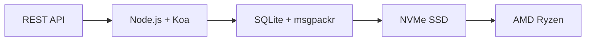

# Pierwsze Kompleksowe API do Emaili: Jak Forward Email Zrewolucjonizował Zarządzanie Emailami {#the-first-complete-email-api-how-forward-email-revolutionized-email-management}


<p class="lead mt-3">
  <strong>TL;DR:</strong> Stworzyliśmy pierwsze na świecie kompletne REST API do zarządzania emailami z zaawansowanymi możliwościami wyszukiwania, których nie oferuje żadna inna usługa. Podczas gdy Gmail, Outlook i Apple zmuszają deweloperów do korzystania z piekła IMAP lub API z limitami, Forward Email dostarcza błyskawicznie szybkie operacje CRUD na wiadomościach, folderach, kontaktach i kalendarzach przez zunifikowany interfejs REST z ponad 15 parametrami wyszukiwania. To jest API do emaili, na które deweloperzy czekali.
</p>


## Spis Treści {#table-of-contents}

* [Problem z API do Emaili](#the-email-api-problem)
* [Co Naprawdę Mówią Deweloperzy](#what-developers-are-actually-saying)
* [Rewolucyjne Rozwiązanie Forward Email](#forward-emails-revolutionary-solution)
  * [Dlaczego To Zbudowaliśmy](#why-we-built-this)
  * [Prosta Autoryzacja](#simple-authentication)
* [20 Endpointów, Które Zmienią Wszystko](#20-endpoints-that-change-everything)
  * [Wiadomości (5 endpointów)](#messages-5-endpoints)
  * [Foldery (5 endpointów)](#folders-5-endpoints)
  * [Kontakty (5 endpointów)](#contacts-5-endpoints)
  * [Kalendarze (5 endpointów)](#calendars-5-endpoints)
* [Zaawansowane Wyszukiwanie: Żadna Inna Usługa Nie Ma Równych](#advanced-search-no-other-service-compares)
  * [Krajobraz API Wyszukiwania jest Złamany](#the-search-api-landscape-is-broken)
  * [Rewolucyjne API Wyszukiwania Forward Email](#forward-emails-revolutionary-search-api)
  * [Przykłady Wyszukiwania z Życia](#real-world-search-examples)
  * [Zalety Wydajności](#performance-advantages)
  * [Funkcje Wyszukiwania, Których Nikt Inny Nie Ma](#search-features-no-one-else-has)
  * [Dlaczego To Ma Znaczenie dla Deweloperów](#why-this-matters-for-developers)
  * [Techniczna Implementacja](#the-technical-implementation)
* [Błyskawiczna Architektura Wydajności](#blazing-fast-performance-architecture)
  * [Benchmarki Wydajności](#performance-benchmarks)
  * [Architektura Priorytetująca Prywatność](#privacy-first-architecture)
* [Dlaczego Jesteśmy Inni: Kompleksowe Porównanie](#why-were-different-the-complete-comparison)
  * [Główne Ograniczenia Dostawców](#major-provider-limitations)
  * [Zalety Forward Email](#forward-email-advantages)
  * [Problem Transparentności Open-Source](#the-open-source-transparency-problem)
* [Ponad 30 Przykładów Integracji z Życia](#30-real-world-integration-examples)
  * [1. Ulepszenie Formularza Kontaktowego WordPress](#1-wordpress-contact-form-enhancement)
  * [2. Alternatywa dla Zapier do Automatyzacji Emaili](#2-zapier-alternative-for-email-automation)
  * [3. Synchronizacja Emaili w CRM](#3-crm-email-synchronization)
  * [4. Przetwarzanie Zamówień w E-commerce](#4-e-commerce-order-processing)
  * [5. Integracja Zgłoszeń Serwisowych](#5-support-ticket-integration)
  * [6. System Zarządzania Newsletterem](#6-newsletter-management-system)
  * [7. Zarządzanie Zadaniami przez Email](#7-email-based-task-management)
  * [8. Agregacja Emaili z Wielu Kont](#8-multi-account-email-aggregation)
  * [9. Zaawansowany Panel Analityki Emaili](#9-advanced-email-analytics-dashboard)
  * [10. Inteligentne Archiwizowanie Emaili](#10-smart-email-archiving)
  * [11. Integracja Email-Kalendarz](#11-email-to-calendar-integration)
  * [12. Kopie Zapasowe i Zgodność Emaili](#12-email-backup-and-compliance)
  * [13. Zarządzanie Treścią przez Email](#13-email-based-content-management)
  * [14. Zarządzanie Szablonami Emaili](#14-email-template-management)
  * [15. Automatyzacja Procesów przez Email](#15-email-based-workflow-automation)
  * [16. Monitorowanie Bezpieczeństwa Emaili](#16-email-security-monitoring)
  * [17. Zbieranie Ankiet przez Email](#17-email-based-survey-collection)
  * [18. Monitorowanie Wydajności Emaili](#18-email-performance-monitoring)
  * [19. Kwalifikacja Leadów przez Email](#19-email-based-lead-qualification)
  * [20. Zarządzanie Projektami przez Email](#20-email-based-project-management)
  * [21. Zarządzanie Zapasami przez Email](#21-email-based-inventory-management)
  * [22. Przetwarzanie Faktur przez Email](#22-email-based-invoice-processing)
  * [23. Rejestracja na Wydarzenia przez Email](#23-email-based-event-registration)
  * [24. Workflow Zatwierdzania Dokumentów przez Email](#24-email-based-document-approval-workflow)
  * [25. Analiza Opinii Klientów przez Email](#25-email-based-customer-feedback-analysis)
  * [26. Pipeline Rekrutacyjny przez Email](#26-email-based-recruitment-pipeline)
  * [27. Przetwarzanie Raportów Kosztów przez Email](#27-email-based-expense-report-processing)
  * [28. Raportowanie Kontroli Jakości przez Email](#28-email-based-quality-assurance-reporting)
  * [29. Zarządzanie Dostawcami przez Email](#29-email-based-vendor-management)
  * [30. Monitorowanie Mediów Społecznościowych przez Email](#30-email-based-social-media-monitoring)
* [Pierwsze Kroki](#getting-started)
  * [1. Załóż Konto Forward Email](#1-create-your-forward-email-account)
  * [2. Wygeneruj Dane Dostępowe do API](#2-generate-api-credentials)
  * [3. Wykonaj Pierwsze Wywołanie API](#3-make-your-first-api-call)
  * [4. Zapoznaj się z Dokumentacją](#4-explore-the-documentation)
* [Zasoby Techniczne](#technical-resources)
## Problem z API e-mail {#the-email-api-problem}

API e-mail są zasadniczo zepsute. Kropka.

Każdy większy dostawca e-mail zmusza programistów do wyboru jednej z dwóch okropnych opcji:

1. **Piekło IMAP**: Walka z 30-letnim protokołem zaprojektowanym dla klientów desktopowych, a nie nowoczesnych aplikacji
2. **Okrojone API**: Ograniczone ilościowo, tylko do odczytu, skomplikowane OAuth API, które nie potrafią zarządzać twoimi rzeczywistymi danymi e-mail

Efekt? Programiści albo całkowicie rezygnują z integracji e-mail, albo tracą tygodnie na budowanie kruchego wrappera IMAP, który ciągle się psuje.

> \[!WARNING]
> **Brudny sekret**: Większość „API e-mail” to tylko API do wysyłania. Nie możesz programowo organizować folderów, synchronizować kontaktów ani zarządzać kalendarzami przez prosty interfejs REST. Do teraz.


## Co naprawdę mówią programiści {#what-developers-are-actually-saying}

Frustracja jest prawdziwa i udokumentowana wszędzie:

> „Niedawno próbowałem zintegrować Gmail w mojej aplikacji i poświęciłem na to za dużo czasu. Zdecydowałem, że nie warto wspierać Gmaila.”
>
> *- [programista z Hacker News](https://news.ycombinator.com/item?id=42106944), 147 głosów poparcia*

> „Czy wszystkie API e-mail są przeciętne? Wydają się w jakiś sposób ograniczone lub restrykcyjne.”
>
> *- [dyskusja na Reddit r/SaaS](https://www.reddit.com/r/SaaS/comments/1cm84s7/are_all_email_apis_mediocre/)*

> „Dlaczego rozwój e-mail musi być taki trudny?”
>
> *- [Reddit r/webdev](https://www.reddit.com/r/webdev/comments/15trnp2/why_does_email_development_have_to_suck/), 89 komentarzy o problemach programistów*

> „Co sprawia, że API Gmail jest bardziej wydajne niż IMAP? Kolejnym powodem, dla którego API Gmail jest znacznie bardziej wydajne, jest to, że musi pobrać każdą wiadomość tylko raz. W IMAP każda wiadomość musi być pobrana i zindeksowana...”
>
> *- [pytanie na Stack Overflow](https://stackoverflow.com/questions/25431022/what-makes-the-gmail-api-more-efficient-than-imap) z 47 głosami poparcia*

Dowody są wszędzie:

* **Problemy SMTP WordPressa**: [631 zgłoszeń na GitHub](https://github.com/awesomemotive/WP-Mail-SMTP/issues) dotyczących niepowodzeń dostarczania e-maili
* **Ograniczenia Zapiera**: [Skargi społeczności](https://community.zapier.com/featured-articles-65/email-parser-by-zapier-limitations-and-alternatives-16958) na limity 10 e-maili/godzinę i błędy wykrywania IMAP
* **Projekty API IMAP**: [Wiele](https://github.com/ewildgoose/imap-api) [projektów open-source](https://emailengine.app/) [istnieje](https://www.npmjs.com/package/imapflow) specjalnie po to, by „konwertować IMAP na REST”, ponieważ żaden dostawca tego nie oferuje
* **Frustracje z API Gmail**: [Stack Overflow](https://stackoverflow.com/questions/tagged/gmail-api) ma 4 847 pytań oznaczonych tagiem „gmail-api” z typowymi skargami na limity i złożoność


## Rewolucyjne rozwiązanie Forward Email {#forward-emails-revolutionary-solution}

**Jesteśmy pierwszą usługą e-mail oferującą pełne operacje CRUD na wszystkich danych e-mail przez zunifikowane API REST.**

To nie jest kolejne API do wysyłania. To pełna programowa kontrola nad:

* **Wiadomościami**: Tworzenie, odczyt, aktualizacja, usuwanie, wyszukiwanie, przenoszenie, oznaczanie
* **Folderami**: Pełne zarządzanie folderami IMAP przez endpointy REST
* **Kontaktami**: Przechowywanie i synchronizacja kontaktów [CardDAV](https://tools.ietf.org/html/rfc6352)
* **Kalendarzami**: Wydarzenia i planowanie w kalendarzu [CalDAV](https://tools.ietf.org/html/rfc4791)

### Dlaczego to zbudowaliśmy {#why-we-built-this}

**Problem**: Każdy dostawca e-mail traktuje e-mail jako czarną skrzynkę. Możesz wysyłać e-maile, może je czytać przez skomplikowane OAuth, ale nie możesz naprawdę *zarządzać* swoimi danymi e-mail programowo.

**Nasza wizja**: E-mail powinien być tak łatwy do integracji jak każde nowoczesne API. Bez bibliotek IMAP. Bez złożoności OAuth. Bez koszmarów limitów. Tylko proste endpointy REST, które działają.

**Efekt**: Pierwsza usługa e-mail, gdzie możesz zbudować kompletny klient e-mail, integrację CRM lub system automatyzacji używając tylko zapytań HTTP.

### Prosta autoryzacja {#simple-authentication}

Bez [złożoności OAuth](https://oauth.net/2/). Bez [hasła specyficznego dla aplikacji](https://support.google.com/accounts/answer/185833). Tylko twoje dane aliasu:

```bash
curl -u "alias@yourdomain.com:password" \
  https://api.forwardemail.net/v1/messages
```
## 20 Punktów Końcowych, Które Zmienią Wszystko {#20-endpoints-that-change-everything}

### Wiadomości (5 punktów końcowych) {#messages-5-endpoints}

* `GET /v1/messages` - Lista wiadomości z filtrowaniem (`?folder=`, `?is_unread=`, `?is_flagged=`)
* `POST /v1/messages` - Wysyłanie nowych wiadomości bezpośrednio do folderów
* `GET /v1/messages/:id` - Pobierz konkretną wiadomość z pełnymi metadanymi
* `PUT /v1/messages/:id` - Aktualizuj wiadomość (flagi, folder, status przeczytania)
* `DELETE /v1/messages/:id` - Trwale usuń wiadomość

### Foldery (5 punktów końcowych) {#folders-5-endpoints}

* `GET /v1/folders` - Lista wszystkich folderów ze statusem subskrypcji
* `POST /v1/folders` - Utwórz nowy folder z niestandardowymi właściwościami
* `GET /v1/folders/:id` - Pobierz szczegóły folderu i liczbę wiadomości
* `PUT /v1/folders/:id` - Aktualizuj właściwości folderu i subskrypcję
* `DELETE /v1/folders/:id` - Usuń folder i obsłuż przeniesienie wiadomości

### Kontakty (5 punktów końcowych) {#contacts-5-endpoints}

* `GET /v1/contacts` - Lista kontaktów z wyszukiwaniem i paginacją
* `POST /v1/contacts` - Utwórz nowy kontakt z pełnym wsparciem vCard
* `GET /v1/contacts/:id` - Pobierz kontakt ze wszystkimi polami i metadanymi
* `PUT /v1/contacts/:id` - Aktualizuj informacje kontaktowe z walidacją ETag
* `DELETE /v1/contacts/:id` - Usuń kontakt z obsługą kaskadową

### Kalendarze (5 punktów końcowych) {#calendars-5-endpoints}

* `GET /v1/calendars` - Lista wydarzeń kalendarza z filtrowaniem po dacie
* `POST /v1/calendars` - Utwórz wydarzenie kalendarza z uczestnikami i powtarzalnością
* `GET /v1/calendars/:id` - Pobierz szczegóły wydarzenia z obsługą stref czasowych
* `PUT /v1/calendars/:id` - Aktualizuj wydarzenie z wykrywaniem konfliktów
* `DELETE /v1/calendars/:id` - Usuń wydarzenie z powiadomieniami dla uczestników


## Zaawansowane Wyszukiwanie: Żadna Inna Usługa Nie Dorównuje {#advanced-search-no-other-service-compares}

**Forward Email to jedyna usługa e-mail, która oferuje kompleksowe, programistyczne wyszukiwanie we wszystkich polach wiadomości przez REST API.**

Podczas gdy inni dostawcy oferują co najwyżej podstawowe filtrowanie, my stworzyliśmy najbardziej zaawansowane API do wyszukiwania e-maili, jakie kiedykolwiek powstało. Żadne API Gmail, Outlook ani żadna inna usługa nie dorównuje naszym możliwościom wyszukiwania.

### Krajobraz API Wyszukiwania jest Uszkodzony {#the-search-api-landscape-is-broken}

**Ograniczenia wyszukiwania w Gmail API:**

* ✅ Tylko podstawowy parametr `q`
* ❌ Brak wyszukiwania specyficznego dla pola
* ❌ Brak filtrowania po zakresie dat
* ❌ Brak filtrowania po rozmiarze
* ❌ Brak filtrowania załączników
* ❌ Ograniczone do składni wyszukiwania Gmaila

**Ograniczenia wyszukiwania w Outlook API:**

* ✅ Podstawowy parametr `$search`
* ❌ Brak zaawansowanego celowania w pola
* ❌ Brak złożonych kombinacji zapytań
* ❌ Agresywne ograniczenia szybkości
* ❌ Wymagana skomplikowana składnia OData

**Apple iCloud:**

* ❌ Brak jakiegokolwiek API
* ❌ Tylko wyszukiwanie IMAP (jeśli uda się je uruchomić)

**ProtonMail & Tuta:**

* ❌ Brak publicznych API
* ❌ Brak programistycznych możliwości wyszukiwania

### Rewolucyjne API Wyszukiwania Forward Email {#forward-emails-revolutionary-search-api}

**Oferujemy ponad 15 parametrów wyszukiwania, których nie zapewnia żadna inna usługa:**

| Możliwość wyszukiwania         | Forward Email                          | Gmail API    | Outlook API        | Inne   |
| ------------------------------ | -------------------------------------- | ------------ | ------------------ | ------ |
| **Wyszukiwanie specyficzne dla pola** | ✅ Temat, treść, od, do, DW, nagłówki    | ❌            | ❌                  | ❌      |
| **Wielopolowe wyszukiwanie ogólne** | ✅ `?search=` we wszystkich polach       | ✅ Podstawowe `q=` | ✅ Podstawowe `$search=` | ❌      |
| **Filtrowanie po zakresie dat** | ✅ `?since=` & `?before=`               | ❌            | ❌                  | ❌      |
| **Filtrowanie po rozmiarze**   | ✅ `?min_size=` & `?max_size=`          | ❌            | ❌                  | ❌      |
| **Filtrowanie załączników**    | ✅ `?has_attachments=true/false`        | ❌            | ❌                  | ❌      |
| **Wyszukiwanie w nagłówkach** | ✅ `?headers=X-Priority`                | ❌            | ❌                  | ❌      |
| **Wyszukiwanie po ID wiadomości** | ✅ `?message_id=abc123`                 | ❌            | ❌                  | ❌      |
| **Łączenie filtrów**           | ✅ Wiele parametrów z logiką AND         | ❌            | ❌                  | ❌      |
| **Niewrażliwość na wielkość liter** | ✅ Wszystkie wyszukiwania               | ✅            | ✅                  | ❌      |
| **Obsługa paginacji**          | ✅ Działa ze wszystkimi parametrami wyszukiwania | ✅            | ✅                  | ❌      |
### Przykłady wyszukiwania w rzeczywistych zastosowaniach {#real-world-search-examples}

**Znajdź wszystkie faktury z ostatniego kwartału:**

```bash
# Forward Email - Proste i potężne
GET /v1/messages?subject=invoice&since=2024-01-01T00:00:00Z&before=2024-04-01T00:00:00Z

# Gmail API - Niemożliwe z ich ograniczonym wyszukiwaniem
# Brak filtrowania zakresu dat

# Outlook API - Złożona składnia OData, ograniczona funkcjonalność
GET /me/messages?$search="invoice"&$filter=receivedDateTime ge 2024-01-01T00:00:00Z
```

**Wyszukaj duże załączniki od konkretnego nadawcy:**

```bash
# Forward Email - Kompleksowe filtrowanie
GET /v1/messages?from=finance@company.com&has_attachments=true&min_size=1000000

# Gmail API - Nie można programowo filtrować po rozmiarze ani załącznikach
# Outlook API - Brak filtrowania po rozmiarze
# Inne - Brak dostępnych API
```

**Złożone wyszukiwanie wielopolowe:**

```bash
# Forward Email - Zaawansowane możliwości zapytań
GET /v1/messages?body=quarterly&from=manager&is_flagged=true&folder=Reports

# Gmail API - Ograniczone do podstawowego wyszukiwania tekstowego
GET /gmail/v1/users/me/messages?q=quarterly

# Outlook API - Podstawowe wyszukiwanie bez celowania w pola
GET /me/messages?$search="quarterly"
```

### Zalety wydajności {#performance-advantages}

**Wydajność wyszukiwania Forward Email:**

* ⚡ **Czasy odpowiedzi poniżej 100 ms** dla złożonych wyszukiwań
* 🔍 **Optymalizacja regex** z właściwym indeksowaniem
* 📊 **Równoległe wykonywanie zapytań** dla liczenia i danych
* 💾 **Efektywne wykorzystanie pamięci** dzięki lekkim zapytaniom

**Problemy z wydajnością konkurencji:**

* 🐌 **Gmail API**: Limit 250 jednostek kwoty na użytkownika na sekundę
* 🐌 **Outlook API**: Agresywne ograniczenia złożone z wymogami backoffu
* 🐌 **Inne**: Brak API do porównania

### Funkcje wyszukiwania, których nikt inny nie ma {#search-features-no-one-else-has}

#### 1. Wyszukiwanie specyficzne dla nagłówków {#1-header-specific-search}

```bash
# Znajdź wiadomości z określonymi nagłówkami
GET /v1/messages?headers=X-Priority:1
GET /v1/messages?headers=X-Spam-Score
```

#### 2. Inteligencja oparta na rozmiarze {#2-size-based-intelligence}

```bash
# Znajdź e-maile newsletterów (zazwyczaj duże)
GET /v1/messages?min_size=50000&from=newsletter

# Znajdź szybkie odpowiedzi (zazwyczaj małe)
GET /v1/messages?max_size=1000&to=support
```

#### 3. Workflow oparte na załącznikach {#3-attachment-based-workflows}

```bash
# Znajdź wszystkie dokumenty wysłane do zespołu prawnego
GET /v1/messages?to=legal&has_attachments=true&body=contract

# Znajdź e-maile bez załączników do sprzątania
GET /v1/messages?has_attachments=false&before=2023-01-01T00:00:00Z
```

#### 4. Połączona logika biznesowa {#4-combined-business-logic}

```bash
# Znajdź pilne oznaczone wiadomości od VIP-ów z załącznikami
GET /v1/messages?is_flagged=true&from=ceo&has_attachments=true&subject=urgent
```

### Dlaczego to ma znaczenie dla programistów {#why-this-matters-for-developers}

**Buduj aplikacje, które wcześniej były niemożliwe:**

1. **Zaawansowana analiza e-maili**: Analizuj wzorce e-maili według rozmiaru, nadawcy, treści
2. **Inteligentne zarządzanie e-mailami**: Automatyczna organizacja na podstawie złożonych kryteriów
3. **Zgodność i odkrywanie**: Znajdź konkretne e-maile dla wymogów prawnych
4. **Business Intelligence**: Wydobywaj wnioski z wzorców komunikacji e-mailowej
5. **Automatyczne workflowy**: Wyzwalaj akcje na podstawie zaawansowanych filtrów e-maili

### Techniczna implementacja {#the-technical-implementation}

Nasze API wyszukiwania wykorzystuje:

* **Optymalizację regex** z właściwymi strategiami indeksowania
* **Równoległe wykonywanie** dla wydajności
* **Walidację wejścia** dla bezpieczeństwa
* **Kompleksową obsługę błędów** dla niezawodności

```javascript
// Przykład: implementacja złożonego wyszukiwania
const searchConditions = [];

if (ctx.query.subject) {
  searchConditions.push({
    subject: { $regex: ctx.query.subject, $options: 'i' }
  });
}

if (ctx.query.from) {
  searchConditions.push({
    $or: [
      { 'from.address': { $regex: ctx.query.from, $options: 'i' } },
      { 'from.name': { $regex: ctx.query.from, $options: 'i' } }
    ]
  });
}

// Połącz z logiką AND
if (searchConditions.length > 0) {
  query.$and = searchConditions;
}
```

> \[!TIP]
> **Przewaga dla programistów**: Dzięki API wyszukiwania Forward Email możesz tworzyć aplikacje e-mailowe, które dorównują funkcjonalnością klientom desktopowym, zachowując jednocześnie prostotę REST API.
## Architektura Ekstremalnie Szybkiej Wydajności {#blazing-fast-performance-architecture}

Nasz stos technologiczny jest zbudowany pod kątem szybkości i niezawodności:


```mermaid
graph LR
    A[REST API] --> B[Node.js + Koa]
    B --> C[SQLite + msgpackr]
    C --> D[NVMe SSD]
    D --> E[AMD Ryzen]
```

### Testy Wydajności {#performance-benchmarks}

**Dlaczego jesteśmy błyskawicznie szybcy:**

| Komponent   | Technologia                                                                       | Korzyść wydajnościowa                        |
| ----------- | -------------------------------------------------------------------------------- | -------------------------------------------- |
| **Pamięć**  | [NVMe SSD](https://en.wikipedia.org/wiki/NVM_Express)                           | 10x szybsze niż tradycyjne SATA              |
| **Baza danych** | [SQLite](https://sqlite.org/) + [msgpackr](https://github.com/kriszyp/msgpackr) | Zero opóźnień sieciowych, zoptymalizowana serializacja |
| **Sprzęt**  | [AMD Ryzen](https://www.amd.com/en/products/processors/desktops/ryzen) bare metal | Brak narzutu wirtualizacji                    |
| **Cache**   | W pamięci + trwały                                                                | Czas odpowiedzi poniżej milisekundy           |
| **Kopie zapasowe** | [Cloudflare R2](https://www.cloudflare.com/products/r2/) szyfrowane           | Niezawodność klasy korporacyjnej              |

**Rzeczywiste liczby wydajności:**

* **Czas odpowiedzi API**: średnio < 50ms
* **Pobieranie wiadomości**: < 10ms dla wiadomości z cache
* **Operacje na folderach**: < 5ms dla operacji na metadanych
* **Synchronizacja kontaktów**: 1000+ kontaktów/sekundę
* **Dostępność**: 99,99% SLA z redundantną infrastrukturą

### Architektura z Priorytetem Prywatności {#privacy-first-architecture}

**Projekt Zero-Knowledge**: Tylko Ty masz dostęp za pomocą swojego hasła IMAP – nie możemy czytać Twoich e-maili. Nasza [architektura zero-knowledge](https://forwardemail.net/en/security) zapewnia pełną prywatność przy jednoczesnym dostarczaniu ekstremalnej wydajności.


## Dlaczego Jesteśmy Inni: Pełne Porównanie {#why-were-different-the-complete-comparison}

### Główne Ograniczenia Dostawców {#major-provider-limitations}

| Dostawca         | Główne Problemy                          | Konkretne Ograniczenia                                                                                                                                                                                                                                                                                                                                                                                                                                               |
| ---------------- | --------------------------------------- | -------------------------------------------------------------------------------------------------------------------------------------------------------------------------------------------------------------------------------------------------------------------------------------------------------------------------------------------------------------------------------------------------------------------------------------------------------------------- |
| **Gmail API**    | Tylko do odczytu, złożony OAuth, osobne API | • [Nie można modyfikować istniejących wiadomości](https://developers.google.com/gmail/api/reference/rest/v1/users.messages)<br>• [Etykiety ≠ foldery](https://developers.google.com/gmail/api/reference/rest/v1/users.labels)<br>• [Limit 1 miliarda jednostek kwoty/dzień](https://developers.google.com/gmail/api/reference/quota)<br>• [Wymaga osobnych API](https://developers.google.com/workspace) dla kontaktów/kalendarza                                                           |
| **Outlook API**  | Przestarzałe, mylące, nastawione na przedsiębiorstwa | • [REST endpoints przestarzałe od marca 2024](https://learn.microsoft.com/en-us/outlook/rest/compare-graph)<br>• [Wiele mylących API](https://learn.microsoft.com/en-us/office/client-developer/outlook/selecting-an-api-or-technology-for-developing-solutions-for-outlook) (EWS, Graph, REST)<br>• [Złożoność Microsoft Graph](https://learn.microsoft.com/en-us/graph/overview)<br>• [Agresywne ograniczenia](https://learn.microsoft.com/en-us/graph/throttling) |
| **Apple iCloud** | Brak publicznego API                    | • [Brak jakiegokolwiek publicznego API](https://support.apple.com/en-us/102654)<br>• [Tylko IMAP z limitem 1000 e-maili/dzień](https://support.apple.com/en-us/102654)<br>• [Wymagane hasła specyficzne dla aplikacji](https://support.apple.com/en-us/102654)<br>• [Limit 500 odbiorców na wiadomość](https://support.apple.com/en-us/102654)                                                                                                                                              |
| **ProtonMail**   | Brak API, fałszywe twierdzenia o open-source | • [Brak publicznego API](https://proton.me/support/protonmail-bridge-clients)<br>• [Wymagane oprogramowanie Bridge](https://proton.me/mail/bridge) do dostępu IMAP<br>• [Twierdzenia o "open source"](https://proton.me/blog/open-source), ale [kod serwera jest własnościowy](https://github.com/ProtonMail)<br>• [Dostępne tylko w planach płatnych](https://proton.me/pricing)                                                                                                         |
| **Tuta**         | Brak API, myląca transparentność       | • [Brak REST API do zarządzania e-mailami](https://tuta.com/support#technical)<br>• [Twierdzenia o "open source"](https://tuta.com/blog/posts/open-source-email), ale [backend jest zamknięty](https://github.com/tutao/tutanota)<br>• [Brak wsparcia dla IMAP/SMTP](https://tuta.com/support#imap)<br>• [Własnościowe szyfrowanie](https://tuta.com/encryption) uniemożliwia standardowe integracje                                                                                               |
| **Zapier Email** | Surowe limity szybkości                 | • [Limit 10 e-maili na godzinę](https://help.zapier.com/hc/en-us/articles/8496181555597-Email-Parser-by-Zapier-limitations-and-alternatives)<br>• [Brak dostępu do folderów IMAP](https://help.zapier.com/hc/en-us/articles/8496181555597-Email-Parser-by-Zapier-limitations-and-alternatives)<br>• [Ograniczone możliwości parsowania](https://help.zapier.com/hc/en-us/articles/8496181555597-Email-Parser-by-Zapier-limitations-and-alternatives)                                 |
### Zalety Forward Email {#forward-email-advantages}

| Funkcja            | Forward Email                                                                                | Konkurencja                               |
| ------------------ | -------------------------------------------------------------------------------------------- | ----------------------------------------- |
| **Pełne CRUD**     | ✅ Pełne tworzenie, odczyt, aktualizacja, usuwanie dla wszystkich danych                      | ❌ Tylko odczyt lub ograniczone operacje  |
| **Zunifikowane API** | ✅ Wiadomości, foldery, kontakty, kalendarze w jednym API                                    | ❌ Oddzielne API lub brak funkcji          |
| **Prosta autoryzacja** | ✅ Podstawowa autoryzacja z danymi aliasu                                                 | ❌ Złożony OAuth z wieloma zakresami       |
| **Brak limitów szybkości** | ✅ Hojne limity zaprojektowane dla rzeczywistych zastosowań                            | ❌ Restrykcyjne limity przerywające pracę  |
| **Samodzielne hostowanie** | ✅ [Pełna opcja samodzielnego hostowania](https://forwardemail.net/en/blog/docs/self-hosted-solution) | ❌ Tylko zamknięty vendor lock-in          |
| **Prywatność**     | ✅ Zero-knowledge, szyfrowane, prywatne                                                      | ❌ Eksploatacja danych i problemy z prywatnością |
| **Wydajność**      | ✅ Odpowiedzi poniżej 50 ms, pamięć NVMe                                                     | ❌ Opóźnienia sieciowe, ograniczenia       |

### Problem transparentności open source {#the-open-source-transparency-problem}

**ProtonMail i Tuta reklamują się jako „open source” i „transparentne”, ale jest to mylący marketing naruszający współczesne zasady prywatności.**

> \[!WARNING]
> **Fałszywe twierdzenia o transparentności**: Zarówno ProtonMail, jak i Tuta wyraźnie reklamują swoje „open source” podczas gdy ich najważniejszy kod po stronie serwera jest własnościowy i zamknięty.

**Dezinformacja ProtonMail:**

* **Twierdzenia**: ["Jesteśmy open source"](https://proton.me/blog/open-source) wyraźnie podkreślane w marketingu
* **Rzeczywistość**: [Kod serwera jest całkowicie własnościowy](https://github.com/ProtonMail) – tylko aplikacje klienckie są open source
* **Skutek**: Użytkownicy nie mogą zweryfikować szyfrowania po stronie serwera, obsługi danych ani twierdzeń o prywatności
* **Naruszenie transparentności**: Brak możliwości audytu faktycznych systemów przetwarzania i przechowywania e-maili

**Mylący marketing Tuta:**

* **Twierdzenia**: ["Open source email"](https://tuta.com/blog/posts/open-source-email) jako główny punkt sprzedaży
* **Rzeczywistość**: [Infrastruktura backendowa jest zamknięta](https://github.com/tutao/tutanota) – dostępny jest tylko frontend
* **Skutek**: Własnościowe szyfrowanie uniemożliwia standardowe protokoły e-mail (IMAP/SMTP)
* **Strategia lock-in**: Niestandardowe szyfrowanie wymusza zależność od dostawcy

**Dlaczego to ma znaczenie dla współczesnej prywatności:**

W 2025 roku prawdziwa prywatność wymaga **pełnej transparentności**. Gdy dostawcy e-maili twierdzą „open source”, ale ukrywają kod serwera:

1. **Nieweryfikowalne szyfrowanie**: Nie możesz sprawdzić, jak twoje dane są faktycznie szyfrowane
2. **Ukryte praktyki danych**: Obsługa danych po stronie serwera pozostaje czarną skrzynką
3. **Bezpieczeństwo oparte na zaufaniu**: Musisz ufać ich twierdzeniom bez możliwości weryfikacji
4. **Vendor lock-in**: Własnościowe systemy uniemożliwiają przenoszenie danych

**Prawdziwa transparentność Forward Email:**

* ✅ **[Pełne open source](https://github.com/forwardemail/forwardemail.net)** – kod serwera i klienta
* ✅ **[Dostępne samodzielne hostowanie](https://forwardemail.net/en/blog/docs/self-hosted-solution)** – uruchom własną instancję
* ✅ **Standardowe protokoły** – kompatybilność IMAP, SMTP, CardDAV, CalDAV
* ✅ **Audytowalne bezpieczeństwo** – każdy wiersz kodu można sprawdzić
* ✅ **Brak vendor lock-in** – twoje dane, twoja kontrola

> \[!TIP]
> **Prawdziwe open source oznacza, że możesz zweryfikować każde twierdzenie.** Z Forward Email możesz audytować nasze szyfrowanie, przeglądać obsługę danych, a nawet uruchomić własną instancję. To prawdziwa transparentność.


## Ponad 30 przykładów integracji w rzeczywistych zastosowaniach {#30-real-world-integration-examples}

### 1. Ulepszenie formularza kontaktowego WordPress {#1-wordpress-contact-form-enhancement}
**Problem**: [Problemy z konfiguracją SMTP w WordPress](https://github.com/awesomemotive/WP-Mail-SMTP/issues) ([631 zgłoszeń na GitHub](https://github.com/awesomemotive/WP-Mail-SMTP/issues))
**Solution**: Bezpośrednia integracja API omija całkowicie [SMTP](https://tools.ietf.org/html/rfc5321)

```javascript
// Formularz kontaktowy WordPress, który zapisuje do folderu Wysłane
await fetch('https://api.forwardemail.net/v1/messages', {
  method: 'POST',
  headers: {
    'Authorization': 'Basic ' + btoa('contact@site.com:password'),
    'Content-Type': 'application/json'
  },
  body: JSON.stringify({
    to: [{ address: 'owner@site.com' }],
    subject: 'Formularz kontaktowy: ' + formData.subject,
    text: formData.message,
    folder: 'Sent'
  })
});
```

### 2. Alternatywa Zapier do automatyzacji e-maili {#2-zapier-alternative-for-email-automation}

**Problem**: [Limit 10 e-maili na godzinę w Zapier](https://help.zapier.com/hc/en-us/articles/8496181555597-Email-Parser-by-Zapier-limitations-and-alternatives) oraz [problemy z wykrywaniem IMAP](https://community.zapier.com/featured-articles-65/email-parser-by-zapier-limitations-and-alternatives-16958)
**Solution**: Nieograniczona automatyzacja z pełną kontrolą nad e-mailami

```javascript
// Automatyczne organizowanie e-maili według domeny nadawcy
const messages = await fetch('/v1/messages?folder=INBOX');
for (const message of messages) {
  const domain = message.from.split('@')[1];
  await fetch(`/v1/messages/${message.id}`, {
    method: 'PUT',
    body: JSON.stringify({ folder: `Clients/${domain}` })
  });
}
```

### 3. Synchronizacja e-maili z CRM {#3-crm-email-synchronization}

**Problem**: Ręczne zarządzanie kontaktami między e-mailami a [systemami CRM](https://en.wikipedia.org/wiki/Customer_relationship_management)
**Solution**: Dwukierunkowa synchronizacja z API kontaktów [CardDAV](https://tools.ietf.org/html/rfc6352)

```javascript
// Synchronizacja nowych kontaktów e-mail do CRM
const newContacts = await fetch('/v1/contacts');
for (const contact of newContacts) {
  await crmAPI.createContact({
    name: contact.name,
    email: contact.email,
    source: 'email_api'
  });
}
```

### 4. Przetwarzanie zamówień e-commerce {#4-e-commerce-order-processing}

**Problem**: Ręczne przetwarzanie e-maili z zamówieniami dla [platform e-commerce](https://en.wikipedia.org/wiki/E-commerce)
**Solution**: Zautomatyzowany pipeline zarządzania zamówieniami

```javascript
// Przetwarzanie e-maili potwierdzających zamówienia
const orders = await fetch('/v1/messages?folder=Orders');
const orderEmails = orders.filter(msg =>
  msg.subject.includes('Potwierdzenie zamówienia')
);

for (const order of orderEmails) {
  const orderData = parseOrderEmail(order.text);
  await updateInventory(orderData);
  await fetch(`/v1/messages/${order.id}`, {
    method: 'PUT',
    body: JSON.stringify({ folder: 'Orders/Processed' })
  });
}
```

### 5. Integracja zgłoszeń wsparcia {#5-support-ticket-integration}

**Problem**: Wątki e-mail rozproszone po [platformach helpdesk](https://en.wikipedia.org/wiki/Help_desk_software)
**Solution**: Kompletny tracking wątków e-mail

```javascript
// Tworzenie zgłoszenia wsparcia z wątku e-mail
const messages = await fetch('/v1/messages?folder=Support');
const supportEmails = messages.filter(msg =>
  msg.to.some(addr => addr.includes('support@'))
);

for (const email of supportEmails) {
  const ticket = await supportSystem.createTicket({
    subject: email.subject,
    from: email.from,
    body: email.text,
    timestamp: email.date
  });
}
```

### 6. System zarządzania newsletterem {#6-newsletter-management-system}

**Problem**: Ograniczone integracje z [platformami newsletterowymi](https://en.wikipedia.org/wiki/Email_marketing)
**Solution**: Kompleksowe zarządzanie cyklem życia subskrybenta

```javascript
// Automatyczne zarządzanie subskrypcjami newslettera
const messages = await fetch('/v1/messages?folder=Newsletter');
const unsubscribes = messages.filter(msg =>
  msg.subject.toLowerCase().includes('wypisz się')
);

for (const msg of unsubscribes) {
  await removeSubscriber(msg.from);
  await fetch(`/v1/messages/${msg.id}`, {
    method: 'PUT',
    body: JSON.stringify({ folder: 'Newsletter/Unsubscribed' })
  });
}
```

### 7. Zarządzanie zadaniami oparte na e-mailach {#7-email-based-task-management}

**Problem**: Przeładowanie skrzynki odbiorczej i [śledzenie zadań](https://en.wikipedia.org/wiki/Task_management)
**Solution**: Konwersja e-maili na zadania do wykonania
```javascript
// Create tasks from flagged emails
const messages = await fetch('/v1/messages?is_flagged=true');
for (const email of messages) {
  await taskManager.createTask({
    title: email.subject,
    description: email.text,
    assignee: email.to[0].address,
    dueDate: extractDueDate(email.text)
  });
}
```

### 8. Multi-Account Email Aggregation {#8-multi-account-email-aggregation}

**Problem**: Managing [multiple email accounts](https://en.wikipedia.org/wiki/Email_client) across providers
**Solution**: Unified inbox interface

```javascript
// Aggregate emails from multiple accounts
const accounts = ['work@domain.com', 'personal@domain.com'];
const allMessages = [];

for (const account of accounts) {
  const messages = await fetch('/v1/messages', {
    headers: { 'Authorization': getAuth(account) }
  });
  allMessages.push(...messages.map(m => ({ ...m, account })));
}
```

### 9. Advanced Email Analytics Dashboard {#9-advanced-email-analytics-dashboard}

**Problem**: No insights into [email patterns](https://en.wikipedia.org/wiki/Email_analytics) with sophisticated filtering
**Solution**: Custom email analytics using advanced search capabilities

```javascript
// Generate comprehensive email analytics using advanced search
const analytics = {};

// Analyze email volume by sender domain
const messages = await fetch('/v1/messages');
analytics.senderDomains = analyzeSenderDomains(messages);

// Find large attachments consuming storage
const largeAttachments = await fetch('/v1/messages?has_attachments=true&min_size=1000000');
analytics.storageHogs = largeAttachments.map(msg => ({
  subject: msg.subject,
  from: msg.from,
  size: msg.size
}));

// Analyze communication patterns with VIPs
const vipEmails = await fetch('/v1/messages?from=ceo@company.com');
const urgentVipEmails = await fetch('/v1/messages?from=ceo@company.com&subject=urgent');
analytics.vipCommunication = {
  total: vipEmails.length,
  urgent: urgentVipEmails.length,
  urgencyRate: (urgentVipEmails.length / vipEmails.length) * 100
};

// Find unread emails by date range for follow-up
const lastWeek = new Date(Date.now() - 7 * 24 * 60 * 60 * 1000).toISOString();
const unreadRecent = await fetch(`/v1/messages?is_unread=true&since=${lastWeek}`);
analytics.followUpNeeded = unreadRecent.length;

// Analyze email sizes for optimization
const smallEmails = await fetch('/v1/messages?max_size=1000');
const mediumEmails = await fetch('/v1/messages?min_size=1000&max_size=50000');
const largeEmails = await fetch('/v1/messages?min_size=50000');
analytics.sizeDistribution = {
  small: smallEmails.length,
  medium: mediumEmails.length,
  large: largeEmails.length
};

// Search for compliance-related emails
const complianceEmails = await fetch('/v1/messages?body=confidential&has_attachments=true');
analytics.complianceReview = complianceEmails.length;
```

### 10. Smart Email Archiving {#10-smart-email-archiving}

**Problem**: Manual [email organization](https://en.wikipedia.org/wiki/Email_management)
**Solution**: Intelligent email categorization

```javascript
// Auto-archive old emails by category
const messages = await fetch('/v1/messages');
const oldEmails = messages.filter(email =>
  isOlderThan(email.date, 90) // 90 days
);

for (const email of oldEmails) {
  const category = categorizeEmail(email);
  await fetch(`/v1/messages/${email.id}`, {
    method: 'PUT',
    body: JSON.stringify({ folder: `Archive/${category}` })
  });
}
```

### 11. Email-to-Calendar Integration {#11-email-to-calendar-integration}

**Problem**: Manual [calendar event](https://tools.ietf.org/html/rfc4791) creation from emails
**Solution**: Automatic event extraction and creation

```javascript
// Extract meeting details from emails
const messages = await fetch('/v1/messages?folder=Meetings');
const meetingEmails = messages.filter(email =>
  email.subject.toLowerCase().includes('meeting')
);

for (const email of meetingEmails) {
  const meetingData = extractMeetingInfo(email.text);
  if (meetingData.date && meetingData.time) {
    await fetch('/v1/calendars', {
      method: 'POST',
      body: JSON.stringify({
        title: email.subject,
        start: meetingData.datetime,
        attendees: [email.from, ...email.to]
      })
    });
  }
}
```

### 12. Kopia zapasowa i zgodność e-maili {#12-email-backup-and-compliance}

**Problem**: [Przechowywanie e-maili](https://en.wikipedia.org/wiki/Email_retention_policy) i wymagania dotyczące zgodności  
**Rozwiązanie**: Automatyczna kopia zapasowa z zachowaniem metadanych

```javascript
// Backup emails with full metadata
const allMessages = await fetch('/v1/messages');
const backup = {
  timestamp: new Date(),
  messages: allMessages.map(msg => ({
    id: msg.id,
    subject: msg.subject,
    from: msg.from,
    to: msg.to,
    date: msg.date,
    flags: msg.flags
  }))
};
await saveToComplianceStorage(backup);
```

### 13. Zarządzanie treścią oparte na e-mailach {#13-email-based-content-management}

**Problem**: Zarządzanie zgłoszeniami treści przez e-mail dla [platform CMS](https://en.wikipedia.org/wiki/Content_management_system)  
**Rozwiązanie**: E-mail jako system zarządzania treścią

```javascript
// Process content submissions from email
const messages = await fetch('/v1/messages?folder=Submissions');
const submissions = messages.filter(msg =>
  msg.to.some(addr => addr.includes('submit@'))
);

for (const submission of submissions) {
  const content = parseSubmission(submission.text);
  await cms.createDraft({
    title: submission.subject,
    content: content.body,
    author: submission.from
  });
}
```

### 14. Zarządzanie szablonami e-mail {#14-email-template-management}

**Problem**: Niespójne [szablony e-mail](https://en.wikipedia.org/wiki/Email_template) w zespole  
**Rozwiązanie**: Centralny system szablonów z API

```javascript
// Send templated emails with dynamic content
const template = await getEmailTemplate('welcome');
await fetch('/v1/messages', {
  method: 'POST',
  body: JSON.stringify({
    to: [{ address: newUser.email }],
    subject: template.subject.replace('{{name}}', newUser.name),
    html: template.html.replace('{{name}}', newUser.name),
    folder: 'Sent'
  })
});
```

### 15. Automatyzacja procesów oparta na e-mailach {#15-email-based-workflow-automation}

**Problem**: Ręczne [procesy zatwierdzania](https://en.wikipedia.org/wiki/Workflow) przez e-mail  
**Rozwiązanie**: Automatyczne wyzwalacze procesów

```javascript
// Process approval emails
const messages = await fetch('/v1/messages?folder=Approvals');
const approvals = messages.filter(msg =>
  msg.subject.includes('APPROVAL')
);

for (const approval of approvals) {
  const decision = parseApprovalDecision(approval.text);
  await workflow.processApproval({
    requestId: extractRequestId(approval.subject),
    decision: decision,
    approver: approval.from
  });
}
```

### 16. Monitorowanie bezpieczeństwa e-maili {#16-email-security-monitoring}

**Problem**: Ręczne [wykrywanie zagrożeń bezpieczeństwa](https://en.wikipedia.org/wiki/Email_security)  
**Rozwiązanie**: Automatyczna analiza zagrożeń

```javascript
// Monitor for suspicious emails
const recentEmails = await fetch('/v1/messages');
for (const email of recentEmails) {
  const threatScore = analyzeThreat(email);
  if (threatScore > 0.8) {
    await fetch(`/v1/messages/${email.id}`, {
      method: 'PUT',
      body: JSON.stringify({ folder: 'Security/Quarantine' })
    });
    await alertSecurityTeam(email);
  }
}
```

### 17. Zbieranie ankiet za pomocą e-maili {#17-email-based-survey-collection}

**Problem**: Ręczne przetwarzanie [odpowiedzi ankietowych](https://en.wikipedia.org/wiki/Survey_methodology)  
**Rozwiązanie**: Automatyczne agregowanie odpowiedzi

```javascript
// Collect and process survey responses
const messages = await fetch('/v1/messages?folder=Surveys');
const responses = messages.filter(msg =>
  msg.subject.includes('Survey Response')
);

const surveyData = responses.map(email => ({
  respondent: email.from,
  responses: parseSurveyData(email.text),
  timestamp: email.date
}));
await updateSurveyResults(surveyData);
```

### 18. Monitorowanie wydajności e-maili {#18-email-performance-monitoring}

**Problem**: Brak widoczności w [wydajność dostarczania e-maili](https://en.wikipedia.org/wiki/Email_deliverability)  
**Rozwiązanie**: Metryki e-mail w czasie rzeczywistym

```javascript
// Monitor email delivery performance
const sentEmails = await fetch('/v1/messages?folder=Sent');
const deliveryStats = {
  sent: sentEmails.length,
  bounces: await countBounces(),
  deliveryRate: calculateDeliveryRate()
};
await updateDashboard(deliveryStats);
```
### 19. Kwalifikacja leadów na podstawie e-maili {#19-email-based-lead-qualification}

**Problem**: Ręczne [ocenianie leadów](https://en.wikipedia.org/wiki/Lead_scoring) na podstawie interakcji e-mailowych  
**Rozwiązanie**: Zautomatyzowany proces kwalifikacji leadów

```javascript
// Score leads based on email engagement
const prospects = await fetch('/v1/contacts');
for (const prospect of prospects) {
  const messages = await fetch('/v1/messages');
  const emails = messages.filter(msg =>
    msg.from.includes(prospect.email)
  );
  const score = calculateEngagementScore(emails);
  await crm.updateLeadScore(prospect.id, score);
}
```

### 20. Zarządzanie projektami na podstawie e-maili {#20-email-based-project-management}

**Problem**: [Aktualizacje projektów](https://en.wikipedia.org/wiki/Project_management) rozproszone w wątkach e-mailowych  
**Rozwiązanie**: Centralne centrum komunikacji projektowej

```javascript
// Extract project updates from emails
const messages = await fetch('/v1/messages?folder=Projects');
const projectEmails = messages.filter(msg =>
  msg.subject.includes('Project Update')
);

for (const email of projectEmails) {
  const update = parseProjectUpdate(email.text);
  await projectManager.addUpdate({
    project: update.projectId,
    author: email.from,
    content: update.content
  });
}
```

### 21. Zarządzanie zapasami na podstawie e-maili {#21-email-based-inventory-management}

**Problem**: Ręczne aktualizacje zapasów na podstawie e-maili od dostawców  
**Rozwiązanie**: Zautomatyzowane śledzenie zapasów z powiadomień e-mailowych

```javascript
// Process inventory updates from supplier emails
const messages = await fetch('/v1/messages?folder=Suppliers');
const inventoryEmails = messages.filter(msg =>
  msg.subject.includes('Inventory Update') || msg.subject.includes('Stock Alert')
);

for (const email of inventoryEmails) {
  const inventoryData = parseInventoryUpdate(email.text);
  await inventory.updateStock({
    sku: inventoryData.sku,
    quantity: inventoryData.quantity,
    supplier: email.from,
    timestamp: email.date
  });

  // Move to processed folder
  await fetch(`/v1/messages/${email.id}`, {
    method: 'PUT',
    body: JSON.stringify({ folder: 'Suppliers/Processed' })
  });
}
```

### 22. Przetwarzanie faktur na podstawie e-maili {#22-email-based-invoice-processing}

**Problem**: Ręczne [przetwarzanie faktur](https://en.wikipedia.org/wiki/Invoice_processing) i integracja z systemem księgowym  
**Rozwiązanie**: Automatyczne wyodrębnianie faktur i synchronizacja z systemem księgowym

```javascript
// Extract invoice data from email attachments
const messages = await fetch('/v1/messages?folder=Invoices');
const invoiceEmails = messages.filter(msg =>
  msg.subject.toLowerCase().includes('invoice') && msg.attachments.length > 0
);

for (const email of invoiceEmails) {
  const invoiceData = await extractInvoiceData(email.attachments[0]);
  await accounting.createInvoice({
    vendor: email.from,
    amount: invoiceData.total,
    dueDate: invoiceData.dueDate,
    items: invoiceData.lineItems
  });

  // Flag as processed
  await fetch(`/v1/messages/${email.id}`, {
    method: 'PUT',
    body: JSON.stringify({ flags: ['\\Seen', '\\Flagged'] })
  });
}
```

### 23. Rejestracja na wydarzenia na podstawie e-maili {#23-email-based-event-registration}

**Problem**: Ręczne przetwarzanie [rejestracji na wydarzenia](https://en.wikipedia.org/wiki/Event_management) z odpowiedzi e-mailowych  
**Rozwiązanie**: Automatyczne zarządzanie uczestnikami i integracja z kalendarzem

```javascript
// Process event registration emails
const messages = await fetch('/v1/messages?folder=Events');
const registrations = messages.filter(msg =>
  msg.subject.includes('Registration') || msg.subject.includes('RSVP')
);

for (const registration of registrations) {
  const attendeeData = parseRegistration(registration.text);

  // Add to attendee list
  await events.addAttendee({
    event: attendeeData.eventId,
    name: attendeeData.name,
    email: registration.from,
    dietary: attendeeData.dietaryRestrictions
  });

  // Create calendar event for attendee
  await fetch('/v1/calendars', {
    method: 'POST',
    body: JSON.stringify({
      title: attendeeData.eventName,
      start: attendeeData.eventDate,
      attendees: [registration.from]
    })
  });
}
```
### 24. Workflow zatwierdzania dokumentów oparty na e-mailach {#24-email-based-document-approval-workflow}

**Problem**: Złożone łańcuchy [zatwierdzania dokumentów](https://en.wikipedia.org/wiki/Document_management_system) za pomocą e-maili  
**Rozwiązanie**: Automatyczne śledzenie zatwierdzeń i wersjonowanie dokumentów

```javascript
// Track document approval workflow
const messages = await fetch('/v1/messages?folder=Approvals');
const approvalEmails = messages.filter(msg =>
  msg.subject.includes('Document Approval')
);

for (const email of approvalEmails) {
  const approval = parseApprovalEmail(email.text);

  await documentSystem.updateApproval({
    documentId: approval.documentId,
    approver: email.from,
    status: approval.decision, // 'approved', 'rejected', 'needs_changes'
    comments: approval.comments,
    timestamp: email.date
  });

  // Check if all approvals complete
  const document = await documentSystem.getDocument(approval.documentId);
  if (document.allApprovalsComplete) {
    await documentSystem.finalizeDocument(approval.documentId);
  }
}
```

### 25. Analiza opinii klientów oparta na e-mailach {#25-email-based-customer-feedback-analysis}

**Problem**: Ręczne zbieranie [opinii klientów](https://en.wikipedia.org/wiki/Customer_feedback) i analiza sentymentu  
**Rozwiązanie**: Automatyczne przetwarzanie opinii i śledzenie sentymentu

```javascript
// Analyze customer feedback from emails
const messages = await fetch('/v1/messages?folder=Feedback');
const feedbackEmails = messages.filter(msg =>
  msg.to.some(addr => addr.includes('feedback@'))
);

for (const email of feedbackEmails) {
  const sentiment = await analyzeSentiment(email.text);
  const category = categorizeFeeback(email.text);

  await feedback.recordFeedback({
    customer: email.from,
    content: email.text,
    sentiment: sentiment.score, // -1 to 1
    category: category, // 'bug', 'feature', 'complaint', 'praise'
    priority: calculatePriority(sentiment, category),
    timestamp: email.date
  });

  // Auto-escalate negative feedback
  if (sentiment.score < -0.5) {
    await escalateToSupport(email);
  }
}
```

### 26. Pipeline rekrutacyjny oparty na e-mailach {#26-email-based-recruitment-pipeline}

**Problem**: Ręczne [rekrutowanie](https://en.wikipedia.org/wiki/Recruitment) i śledzenie kandydatów  
**Rozwiązanie**: Automatyczne zarządzanie kandydatami i planowanie rozmów kwalifikacyjnych

```javascript
// Process job application emails
const messages = await fetch('/v1/messages?folder=Careers');
const applications = messages.filter(msg =>
  msg.subject.toLowerCase().includes('application') && msg.attachments.length > 0
);

for (const application of applications) {
  const resume = await parseResume(application.attachments[0]);

  const candidate = await ats.createCandidate({
    name: resume.name,
    email: application.from,
    skills: resume.skills,
    experience: resume.experience,
    position: extractPosition(application.subject)
  });

  // Auto-schedule screening if qualified
  if (candidate.qualificationScore > 0.7) {
    await calendar.scheduleInterview({
      candidateId: candidate.id,
      type: 'phone_screening',
      duration: 30
    });
  }
}
```

### 27. Przetwarzanie raportów wydatków opartych na e-mailach {#27-email-based-expense-report-processing}

**Problem**: Ręczne składanie i zatwierdzanie [raportów wydatków](https://en.wikipedia.org/wiki/Expense_report)  
**Rozwiązanie**: Automatyczne wyodrębnianie wydatków i workflow zatwierdzania

```javascript
// Process expense report emails
const messages = await fetch('/v1/messages?folder=Expenses');
const expenseEmails = messages.filter(msg =>
  msg.subject.includes('Expense') && msg.attachments.length > 0
);

for (const email of expenseEmails) {
  const receipts = await processReceipts(email.attachments);

  const expenseReport = await expenses.createReport({
    employee: email.from,
    expenses: receipts.map(receipt => ({
      amount: receipt.total,
      category: receipt.category,
      date: receipt.date,
      merchant: receipt.merchant
    })),
    totalAmount: receipts.reduce((sum, r) => sum + r.total, 0)
  });

  // Auto-approve small amounts
  if (expenseReport.totalAmount < 100) {
    await expenses.approve(expenseReport.id);
  } else {
    await expenses.sendForApproval(expenseReport.id);
  }
}
```
### 28. Raportowanie Jakości oparte na Emailach {#28-email-based-quality-assurance-reporting}

**Problem**: Ręczne śledzenie problemów z [zapewnieniem jakości](https://en.wikipedia.org/wiki/Quality_assurance)  
**Rozwiązanie**: Zautomatyzowane zarządzanie problemami QA i śledzenie błędów

```javascript
// Process QA bug reports from email
const messages = await fetch('/v1/messages?folder=QA');
const bugReports = messages.filter(msg =>
  msg.subject.includes('Bug Report') || msg.subject.includes('QA Issue')
);

for (const report of bugReports) {
  const bugData = parseBugReport(report.text);

  const ticket = await bugTracker.createIssue({
    title: report.subject,
    description: bugData.description,
    severity: bugData.severity,
    steps: bugData.stepsToReproduce,
    reporter: report.from,
    attachments: report.attachments
  });

  // Auto-assign based on component
  const assignee = await getComponentOwner(bugData.component);
  await bugTracker.assign(ticket.id, assignee);

  // Create calendar reminder for follow-up
  await fetch('/v1/calendars', {
    method: 'POST',
    body: JSON.stringify({
      title: `Follow up on ${ticket.id}`,
      start: addDays(new Date(), 3),
      attendees: [assignee]
    })
  });
}
```

### 29. Zarządzanie Dostawcami oparte na Emailach {#29-email-based-vendor-management}

**Problem**: Ręczna komunikacja z [dostawcami](https://en.wikipedia.org/wiki/Vendor_management) i śledzenie umów  
**Rozwiązanie**: Zautomatyzowane zarządzanie relacjami z dostawcami

```javascript
// Track vendor communications and contracts
const messages = await fetch('/v1/messages?folder=Vendors');
const vendorEmails = messages.filter(msg =>
  isVendorEmail(msg.from)
);

for (const email of vendorEmails) {
  const vendor = await vendors.getByEmail(email.from);

  // Log communication
  await vendors.logCommunication({
    vendorId: vendor.id,
    type: 'email',
    subject: email.subject,
    content: email.text,
    timestamp: email.date
  });

  // Check for contract-related keywords
  if (email.text.includes('contract') || email.text.includes('renewal')) {
    await vendors.flagForContractReview({
      vendorId: vendor.id,
      emailId: email.id,
      priority: 'high'
    });

    // Create task for procurement team
    await tasks.create({
      title: `Review contract communication from ${vendor.name}`,
      assignee: 'procurement@company.com',
      dueDate: addDays(new Date(), 2)
    });
  }
}
```

### 30. Monitorowanie Mediów Społecznościowych oparte na Emailach {#30-email-based-social-media-monitoring}

**Problem**: Ręczne śledzenie i reagowanie na wzmianki w [mediach społecznościowych](https://en.wikipedia.org/wiki/Social_media_monitoring)  
**Rozwiązanie**: Zautomatyzowane przetwarzanie alertów z mediów społecznościowych i koordynacja odpowiedzi

```javascript
// Process social media alerts from email notifications
const messages = await fetch('/v1/messages?folder=Social');
const socialAlerts = messages.filter(msg =>
  msg.from.includes('alerts@') || msg.subject.includes('Social Mention')
);

for (const alert of socialAlerts) {
  const mention = parseSocialMention(alert.text);

  await socialMedia.recordMention({
    platform: mention.platform,
    author: mention.author,
    content: mention.content,
    sentiment: mention.sentiment,
    reach: mention.followerCount,
    url: mention.url
  });

  // Auto-escalate negative mentions with high reach
  if (mention.sentiment < -0.5 && mention.followerCount > 10000) {
    await socialMedia.escalateToTeam({
      mentionId: mention.id,
      priority: 'urgent',
      assignee: 'social-media-manager@company.com'
    });

    // Create calendar reminder for immediate response
    await fetch('/v1/calendars', {
      method: 'POST',
      body: JSON.stringify({
        title: `Urgent: Respond to negative social mention`,
        start: addMinutes(new Date(), 30),
        attendees: ['social-media-manager@company.com']
      })
    });
  }
}
```


## Pierwsze kroki {#getting-started}

### 1. Utwórz swoje konto do przekazywania emaili {#1-create-your-forward-email-account}

Zarejestruj się na [forwardemail.net](https://forwardemail.net) i zweryfikuj swoją domenę.

### 2. Wygeneruj dane uwierzytelniające API {#2-generate-api-credentials}

Twój alias email i hasło służą jako dane uwierzytelniające API – nie jest wymagana dodatkowa konfiguracja.
### 3. Wykonaj swoje pierwsze wywołanie API {#3-make-your-first-api-call}

```bash
# Wyświetl swoje wiadomości
curl -u "your-alias@domain.com:password" \
  https://api.forwardemail.net/v1/messages

# Utwórz nowy kontakt
curl -u "your-alias@domain.com:password" \
  -X POST \
  -H "Content-Type: application/json" \
  -d '{"fullName":"John Doe","emails":[{"value":"john@example.com"}]}' \
  https://api.forwardemail.net/v1/contacts
```

### 4. Przeglądaj dokumentację {#4-explore-the-documentation}

Odwiedź [forwardemail.net/en/email-api](https://forwardemail.net/en/email-api) po pełną dokumentację API z interaktywnymi przykładami.


## Zasoby techniczne {#technical-resources}

* **[Pełna dokumentacja API](https://forwardemail.net/en/email-api)** - Interaktywna specyfikacja OpenAPI 3.0
* **[Przewodnik po samodzielnym hostingu](https://forwardemail.net/en/blog/docs/self-hosted-solution)** - Wdróż Forward Email na swojej infrastrukturze
* **[Biała księga bezpieczeństwa](https://forwardemail.net/technical-whitepaper.pdf)** - Architektura techniczna i szczegóły bezpieczeństwa
* **[Repozytorium GitHub](https://github.com/forwardemail/forwardemail.net)** - Kod źródłowy open source
* **[Wsparcie dla programistów](mailto:api@forwardemail.net)** - Bezpośredni kontakt z naszym zespołem inżynierów

---

**Gotowy, aby zrewolucjonizować integrację e-mail?** [Zacznij budować z API Forward Email już dziś](https://forwardemail.net/en/email-api) i doświadcz pierwszej kompletnej platformy do zarządzania e-mailami stworzonej dla programistów.

*Forward Email: Usługa e-mail, która wreszcie rozumie API.*
