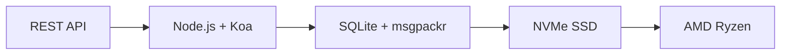

# A primeira API de e-mail completa: como o Forward Email revolucionou o gerenciamento de e-mail {#the-first-complete-email-api-how-forward-email-revolutionized-email-management}


<p class="lead mt-3">
<strong>TL;DR:</strong> Construímos a primeira API REST completa do mundo para gerenciamento de e-mail, com recursos de busca avançados que nenhum outro serviço oferece. Enquanto o Gmail, o Outlook e a Apple forçam os desenvolvedores a usar o IMAP ou APIs com taxa limitada, o Forward Email oferece operações CRUD extremamente rápidas para mensagens, pastas, contatos e calendários por meio de uma interface REST unificada com mais de 15 parâmetros de busca. Esta é a API de e-mail que os desenvolvedores estavam esperando.
</p>

## Índice {#table-of-contents}

* [O problema da API de e-mail](#the-email-api-problem)
* [O que os desenvolvedores estão realmente dizendo](#what-developers-are-actually-saying)
* [Solução revolucionária do Forward Email](#forward-emails-revolutionary-solution)
  * [Por que construímos isso](#why-we-built-this)
  * [Autenticação Simples](#simple-authentication)
* [20 endpoints que mudam tudo](#20-endpoints-that-change-everything)
  * [Mensagens (5 pontos finais)](#messages-5-endpoints)
  * [Pastas (5 pontos finais)](#folders-5-endpoints)
  * [Contatos (5 pontos finais)](#contacts-5-endpoints)
  * [Calendários (5 pontos finais)](#calendars-5-endpoints)
* [Pesquisa Avançada: Nenhum Outro Serviço se Compara](#advanced-search-no-other-service-compares)
  * [O cenário da API de pesquisa está quebrado](#the-search-api-landscape-is-broken)
  * [API de pesquisa revolucionária do Forward Email](#forward-emails-revolutionary-search-api)
  * [Exemplos de pesquisa no mundo real](#real-world-search-examples)
  * [Vantagens de desempenho](#performance-advantages)
  * [Recursos de pesquisa que ninguém mais tem](#search-features-no-one-else-has)
  * [Por que isso é importante para desenvolvedores](#why-this-matters-for-developers)
  * [A Implementação Técnica](#the-technical-implementation)
* [Arquitetura de desempenho extremamente rápida](#blazing-fast-performance-architecture)
  * [Benchmarks de desempenho](#performance-benchmarks)
  * [Arquitetura que prioriza a privacidade](#privacy-first-architecture)
* [Por que somos diferentes: a comparação completa](#why-were-different-the-complete-comparison)
  * [Limitações do principal provedor](#major-provider-limitations)
  * [Vantagens do encaminhamento de e-mail](#forward-email-advantages)
  * [O problema da transparência do código aberto](#the-open-source-transparency-problem)
* [Mais de 30 exemplos de integração do mundo real](#30-real-world-integration-examples)
  * [1. Aprimoramento do formulário de contato do WordPress](#1-wordpress-contact-form-enhancement)
  * [2. Alternativa Zapier para automação de e-mail](#2-zapier-alternative-for-email-automation)
  * [3. Sincronização de e-mail do CRM](#3-crm-email-synchronization)
  * [4. Processamento de pedidos de comércio eletrônico](#4-e-commerce-order-processing)
  * [5. Integração de tickets de suporte](#5-support-ticket-integration)
  * [6. Sistema de gerenciamento de boletins informativos](#6-newsletter-management-system)
  * [7. Gerenciamento de tarefas baseado em e-mail](#7-email-based-task-management)
  * [8. Agregação de e-mail de várias contas](#8-multi-account-email-aggregation)
  * [9. Painel de análise avançada de e-mail](#9-advanced-email-analytics-dashboard)
  * [10. Arquivamento inteligente de e-mail](#10-smart-email-archiving)
  * [11. Integração de e-mail com calendário](#11-email-to-calendar-integration)
  * [12. Backup e conformidade de e-mail](#12-email-backup-and-compliance)
  * [13. Gerenciamento de conteúdo baseado em e-mail](#13-email-based-content-management)
  * [14. Gerenciamento de modelos de e-mail](#14-email-template-management)
  * [15. Automação de fluxo de trabalho baseada em e-mail](#15-email-based-workflow-automation)
  * [16. Monitoramento de segurança de e-mail](#16-email-security-monitoring)
  * [17. Coleta de pesquisas por e-mail](#17-email-based-survey-collection)
  * [18. Monitoramento de desempenho de e-mail](#18-email-performance-monitoring)
  * [19. Qualificação de leads por e-mail](#19-email-based-lead-qualification)
  * [20. Gerenciamento de projetos baseado em e-mail](#20-email-based-project-management)
  * [21. Gerenciamento de estoque baseado em e-mail](#21-email-based-inventory-management)
  * [22. Processamento de faturas por e-mail](#22-email-based-invoice-processing)
  * [23. Registro de evento por e-mail](#23-email-based-event-registration)
  * [24. Fluxo de trabalho de aprovação de documentos por e-mail](#24-email-based-document-approval-workflow)
  * [25. Análise de feedback do cliente por e-mail](#25-email-based-customer-feedback-analysis)
  * [26. Pipeline de recrutamento baseado em e-mail](#26-email-based-recruitment-pipeline)
  * [27. Processamento de relatórios de despesas por e-mail](#27-email-based-expense-report-processing)
  * [28. Relatórios de garantia de qualidade baseados em e-mail](#28-email-based-quality-assurance-reporting)
  * [29. Gerenciamento de fornecedores baseado em e-mail](#29-email-based-vendor-management)
  * [30. Monitoramento de mídia social baseado em e-mail](#30-email-based-social-media-monitoring)
* [Começando](#getting-started)
  * [1. Crie sua conta de e-mail de encaminhamento](#1-create-your-forward-email-account)
  * [2. Gerar credenciais de API](#2-generate-api-credentials)
  * [3. Faça sua primeira chamada de API](#3-make-your-first-api-call)
  * [4. Explore a documentação](#4-explore-the-documentation)
* [Recursos Técnicos](#technical-resources)

## O problema da API de e-mail {#the-email-api-problem}

As APIs de e-mail estão fundamentalmente quebradas. Ponto final.

Todos os principais provedores de e-mail forçam os desenvolvedores a uma de duas escolhas terríveis:

1. **Inferno do IMAP**: Lutando com um protocolo de 30 anos projetado para clientes de desktop, não para aplicativos modernos
2. **APIs incapacitadas**: APIs com limitação de taxa, somente leitura e complexas em OAuth, que não conseguem gerenciar seus dados de e-mail reais

O resultado? Os desenvolvedores abandonam completamente a integração de e-mail ou perdem semanas construindo wrappers IMAP frágeis que quebram constantemente.

> \[!WARNING]
> **O Segredo Sujo**: A maioria das "APIs de e-mail" são apenas APIs de envio. Você não pode organizar pastas, sincronizar contatos ou gerenciar calendários programaticamente por meio de uma interface REST simples. Até agora.

## O que os desenvolvedores estão realmente dizendo {#what-developers-are-actually-saying}

A frustração é real e está documentada em todos os lugares:

> "Recentemente, tentei integrar o Gmail ao meu aplicativo, mas dediquei muito tempo a isso. Decidi que não valia a pena oferecer suporte ao Gmail."
>
> *- [Desenvolvedor do Hacker News](https://news.ycombinator.com/item?id=42106944), 147 votos positivos*

> "Todas as APIs de e-mail são medíocres? Elas parecem limitadas ou restritivas de alguma forma."
>
> *- [Discussão do Reddit r/SaaS](https://www.reddit.com/r/SaaS/comments/1cm84s7/are_all_email_apis_mediocre/)*

> "Por que o desenvolvimento de e-mails tem que ser péssimo?"
>
> *- [Reddit r/webdev](https://www.reddit.com/r/webdev/comments/15trnp2/why_does_email_development_have_to_suck/), 89 comentários sobre o sofrimento do desenvolvedor*

> "O que torna a API do Gmail mais eficiente que o IMAP? Outro motivo pelo qual a API do Gmail é muito mais eficiente é porque ela só precisa baixar cada mensagem uma vez. Com o IMAP, cada mensagem precisa ser baixada e indexada..."
>
> *- [Pergunta do Stack Overflow](https://stackoverflow.com/questions/25431022/what-makes-the-gmail-api-more-efficient-than-imap) com 47 votos positivos*

As evidências estão em toda parte:

* **Problemas com SMTP do WordPress**: [631 problemas do GitHub](https://github.com/awesomemotive/WP-Mail-SMTP/issues) sobre falhas na entrega de e-mails
* **Limitações do Zapier**: [Reclamações da comunidade](https://community.zapier.com/featured-articles-65/email-parser-by-zapier-limitations-and-alternatives-16958) sobre limites de 10 e-mails por hora e falhas na detecção de IMAP
* **Projetos de API IMAP**: [Múltiplos](https://github.com/ewildgoose/imap-api) [código aberto](https://emailengine.app/) [projetos](https://www.npmjs.com/package/imapflow) existem especificamente para "converter IMAP para REST" porque nenhum provedor oferece isso
* **Frustrações com a API do Gmail**: [Estouro de pilha](https://stackoverflow.com/questions/tagged/gmail-api) tem 4.847 perguntas com a tag "gmail-api" com reclamações comuns sobre limites de taxa e complexidade

## Solução revolucionária de encaminhamento de e-mail {#forward-emails-revolutionary-solution}

**Somos o primeiro serviço de e-mail a oferecer operações CRUD completas para todos os dados de e-mail por meio de uma API REST unificada.**

Esta não é apenas mais uma API de envio. Trata-se de um controle programático completo sobre:

* **Mensagens**: Criar, ler, atualizar, excluir, pesquisar, mover, sinalizar
* **Pastas**: Gerenciamento completo de pastas IMAP via endpoints REST
* **Contatos**: Armazenamento e sincronização de contatos [CardDAV](https://tools.ietf.org/html/rfc6352)
* **Calendários**: Eventos e agendamento de calendário [CalDAV](https://tools.ietf.org/html/rfc4791)

### Por que construímos isso {#why-we-built-this}

**O problema**: Todo provedor de e-mail trata o e-mail como uma caixa preta. Você pode enviar e-mails, talvez lê-los com OAuth complexo, mas não pode realmente *gerenciar* seus dados de e-mail programaticamente.

**Nossa Visão**: O e-mail deve ser tão fácil de integrar quanto qualquer API moderna. Sem bibliotecas IMAP. Sem complexidade de OAuth. Sem pesadelos com limites de taxa. Apenas endpoints REST simples que funcionam.

**O resultado**: O primeiro serviço de e-mail onde você pode criar um cliente de e-mail completo, integração de CRM ou sistema de automação usando apenas solicitações HTTP.

### Autenticação Simples {#simple-authentication}

Sem [Complexidade do OAuth](https://oauth.net/2/). Sem [senhas específicas do aplicativo](https://support.google.com/accounts/answer/185833). Apenas suas credenciais de alias:

```bash
curl -u "alias@yourdomain.com:password" \
  https://api.forwardemail.net/v1/messages
```

## 20 endpoints que mudam tudo {#20-endpoints-that-change-everything}

Mensagens ### (5 pontos de extremidade) {#messages-5-endpoints}

* `GET /v1/messages` - Lista mensagens com filtragem (`?folder=`, `?is_unread=`, `?is_flagged=`)
* `POST /v1/messages` - Envia novas mensagens diretamente para pastas
* `GET /v1/messages/:id` - Recupera mensagens específicas com metadados completos
* `PUT /v1/messages/:id` - Atualiza mensagens (sinalizadores, pasta, status de leitura)
* `DELETE /v1/messages/:id` - Exclui mensagens permanentemente

### Pastas (5 pontos de extremidade) {#folders-5-endpoints}

* `GET /v1/folders` - Listar todas as pastas com status de assinatura
* `POST /v1/folders` - Criar uma nova pasta com propriedades personalizadas
* `GET /v1/folders/:id` - Obter detalhes da pasta e contagem de mensagens
* `PUT /v1/folders/:id` - Atualizar as propriedades da pasta e assinatura
* `DELETE /v1/folders/:id` - Excluir pasta e gerenciar a realocação de mensagens

### Contatos (5 pontos de extremidade) {#contacts-5-endpoints}

* `GET /v1/contacts` - Listar contatos com pesquisa e paginação
* `POST /v1/contacts` - Criar novo contato com suporte completo a vCard
* `GET /v1/contacts/:id` - Recuperar contato com todos os campos e metadados
* `PUT /v1/contacts/:id` - Atualizar informações de contato com validação ETag
* `DELETE /v1/contacts/:id` - Excluir contato com tratamento em cascata

### Calendários (5 endpoints) {#calendars-5-endpoints}

* `GET /v1/calendars` - Listar eventos do calendário com filtragem por data
* `POST /v1/calendars` - Criar evento do calendário com participantes e recorrência
* `GET /v1/calendars/:id` - Obter detalhes do evento com tratamento de fuso horário
* `PUT /v1/calendars/:id` - Atualizar evento com detecção de conflitos
* `DELETE /v1/calendars/:id` - Excluir evento com notificações aos participantes

## Pesquisa avançada: Nenhum outro serviço se compara a {#advanced-search-no-other-service-compares}

**O Forward Email é o único serviço de e-mail que oferece pesquisa programática abrangente em todos os campos de mensagens por meio de uma API REST.**

Enquanto outros provedores oferecem, na melhor das hipóteses, filtros básicos, nós criamos a API de busca por e-mail mais avançada já criada. Nenhuma API do Gmail, API do Outlook ou qualquer outro serviço chega perto dos nossos recursos de busca.

### O cenário da API de pesquisa está quebrado {#the-search-api-landscape-is-broken}

**Limitações de pesquisa da API do Gmail:**

* ✅ Somente o parâmetro básico `q`
* ❌ Sem busca por campo específico
* ❌ Sem filtragem por intervalo de datas
* ❌ Sem filtragem por tamanho
* ❌ Sem filtragem por anexos
* ❌ Limitado à sintaxe de busca do Gmail

**Limitações da pesquisa da API do Outlook:**

* ✅ Parâmetro básico `$search`
* ❌ Sem segmentação avançada de campos
* ❌ Sem combinações complexas de consultas
* ❌ Limitação agressiva de taxas
* ❌ Sintaxe complexa do OData necessária

**Apple iCloud:**

* ❌ Nenhuma API
* ❌ Busca somente por IMAP (se você conseguir fazê-la funcionar)

**ProtonMail e Tuta:**

* ❌ Sem APIs públicas
* ❌ Sem recursos de busca programática

### API de pesquisa revolucionária do Forward Email {#forward-emails-revolutionary-search-api}

**Oferecemos mais de 15 parâmetros de pesquisa que nenhum outro serviço oferece:**

| Capacidade de pesquisa | Encaminhar e-mail | API do Gmail | API do Outlook | Outros |
| ------------------------------ | -------------------------------------- | ------------ | ------------------ | ------ |
| **Pesquisa específica de campo** | ✅ Assunto, corpo, de, para, cc, cabeçalhos | ❌ | ❌ | ❌ |
| **Pesquisa geral multicampo** | ✅ `?search=` em todos os campos | ✅ Básico `q=` | ✅ Básico `$search=` | ❌ |
| **Filtragem de intervalo de datas** | ✅ `?since=` & `?before=` | ❌ | ❌ | ❌ |
| **Filtragem baseada em tamanho** | ✅ `?min_size=` & `?max_size=` | ❌ | ❌ | ❌ |
| **Filtragem de anexos** | ✅ `?has_attachments=true/false` | ❌ | ❌ | ❌ |
| **Pesquisa de Cabeçalho** | ✅ `?headers=X-Priority` | ❌ | ❌ | ❌ |
| **Pesquisa de ID de mensagem** | ✅ `?message_id=abc123` | ❌ | ❌ | ❌ |
| **Filtros combinados** | ✅ Vários parâmetros com lógica AND | ❌ | ❌ | ❌ |
| **Não diferencia maiúsculas de minúsculas** | ✅ Todas as pesquisas | ✅ | ✅ | ❌ |
| **Suporte à paginação** | ✅ Funciona com todos os parâmetros de pesquisa | ✅ | ✅ | ❌ |

### Exemplos de pesquisa do mundo real {#real-world-search-examples}

**Encontre todas as faturas do último trimestre:**

```bash
# Forward Email - Simple and powerful
GET /v1/messages?subject=invoice&since=2024-01-01T00:00:00Z&before=2024-04-01T00:00:00Z

# Gmail API - Impossible with their limited search
# No date range filtering available

# Outlook API - Complex OData syntax, limited functionality
GET /me/messages?$search="invoice"&$filter=receivedDateTime ge 2024-01-01T00:00:00Z
```

**Pesquisar anexos grandes de remetentes específicos:**

```bash
# Forward Email - Comprehensive filtering
GET /v1/messages?from=finance@company.com&has_attachments=true&min_size=1000000

# Gmail API - Cannot filter by size or attachments programmatically
# Outlook API - No size filtering available
# Others - No APIs available
```

**Pesquisa complexa de vários campos:**

```bash
# Forward Email - Advanced query capabilities
GET /v1/messages?body=quarterly&from=manager&is_flagged=true&folder=Reports

# Gmail API - Limited to basic text search only
GET /gmail/v1/users/me/messages?q=quarterly

# Outlook API - Basic search without field targeting
GET /me/messages?$search="quarterly"
```

### Vantagens de desempenho {#performance-advantages}

**Desempenho da pesquisa de e-mail de encaminhamento:**

* ⚡ **Tempos de resposta abaixo de 100 ms** para pesquisas complexas
* 🔍 **Otimização de Regex** com indexação adequada
* 📊 **Execução de consulta paralela** para contagem e dados
* 💾 **Uso eficiente de memória** com consultas enxutas

**Problemas de desempenho dos concorrentes:**

* 🐌 **API do Gmail**: Taxa limitada a 250 unidades de cota por usuário por segundo
* 🐌 **API do Outlook**: Limitação agressiva com requisitos de backoff complexos
* 🐌 **Outros**: Nenhuma API para comparação

### Recursos de pesquisa que ninguém mais tem {#search-features-no-one-else-has}

#### 1. Pesquisa específica de cabeçalho {#1-header-specific-search}

```bash
# Find messages with specific headers
GET /v1/messages?headers=X-Priority:1
GET /v1/messages?headers=X-Spam-Score
```

#### 2. Inteligência baseada em tamanho {#2-size-based-intelligence}

```bash
# Find newsletter emails (typically large)
GET /v1/messages?min_size=50000&from=newsletter

# Find quick replies (typically small)
GET /v1/messages?max_size=1000&to=support
```

#### 3. Fluxos de trabalho baseados em anexos {#3-attachment-based-workflows}

```bash
# Find all documents sent to legal team
GET /v1/messages?to=legal&has_attachments=true&body=contract

# Find emails without attachments for cleanup
GET /v1/messages?has_attachments=false&before=2023-01-01T00:00:00Z
```

#### 4. Lógica de negócios combinada {#4-combined-business-logic}

```bash
# Find urgent flagged messages from VIPs with attachments
GET /v1/messages?is_flagged=true&from=ceo&has_attachments=true&subject=urgent
```

### Por que isso é importante para desenvolvedores {#why-this-matters-for-developers}

**Crie aplicativos que antes eram impossíveis:**

1. **Análise Avançada de E-mails**: Analise padrões de e-mails por tamanho, remetente e conteúdo
2. **Gerenciamento Inteligente de E-mails**: Autoorganização com base em critérios complexos
3. **Conformidade e Descoberta**: Encontre e-mails específicos para requisitos legais
4. **Business Intelligence**: Extraia insights de padrões de comunicação por e-mail
5. **Fluxos de Trabalho Automatizados**: Acione ações com base em filtros de e-mail sofisticados

### A Implementação Técnica {#the-technical-implementation}

Nossa API de pesquisa usa:

* **Otimização de expressões regulares** com estratégias de indexação adequadas
* **Execução paralela** para desempenho
* **Validação de entrada** para segurança
* **Tratamento abrangente de erros** para confiabilidade

```javascript
// Example: Complex search implementation
const searchConditions = [];

if (ctx.query.subject) {
  searchConditions.push({
    subject: { $regex: ctx.query.subject, $options: 'i' }
  });
}

if (ctx.query.from) {
  searchConditions.push({
    $or: [
      { 'from.address': { $regex: ctx.query.from, $options: 'i' } },
      { 'from.name': { $regex: ctx.query.from, $options: 'i' } }
    ]
  });
}

// Combine with AND logic
if (searchConditions.length > 0) {
  query.$and = searchConditions;
}
```

> \[!TIP]
> **Vantagem para o desenvolvedor**: Com a API de pesquisa do Forward Email, você pode criar aplicativos de e-mail que rivalizam com os clientes de desktop em funcionalidade, mantendo a simplicidade das APIs REST.

## Arquitetura de desempenho extremamente rápida {#blazing-fast-performance-architecture}

Nosso conjunto técnico é criado para velocidade e confiabilidade:



### Benchmarks de desempenho {#performance-benchmarks}

**Por que somos extremamente rápidos:**

| Componente | Tecnologia | Benefício de desempenho |
| ------------ | --------------------------------------------------------------------------------- | --------------------------------------------- |
| **Armazenar** | [NVMe SSD](https://en.wikipedia.org/wiki/NVM_Express) | 10x mais rápido que o SATA tradicional |
| **Banco de dados** | [SQLite](https://sqlite.org/) + [msgpackr](https://github.com/kriszyp/msgpackr) | Latência de rede zero, serialização otimizada |
| **Hardware** | [AMD Ryzen](https://www.amd.com/en/products/processors/desktops/ryzen) metal puro | Sem sobrecarga de virtualização |
| **Cache** | Na memória + persistente | Tempos de resposta abaixo de milissegundos |
| **Backups** | [Cloudflare R2](https://www.cloudflare.com/products/r2/) criptografado | Confiabilidade de nível empresarial |

**Números de desempenho real:**

* **Tempo de Resposta da API**: < 50 ms em média
* **Recuperação de Mensagens**: < 10 ms para mensagens em cache
* **Operações de Pasta**: < 5 ms para operações de metadados
* **Sincronização de Contatos**: Mais de 1.000 contatos/segundo
* **Tempo de Atividade**: SLA de 99,99% com infraestrutura redundante

Arquitetura que prioriza a privacidade {###

**Design de Conhecimento Zero**: Somente você tem acesso com sua senha IMAP — não podemos ler seus e-mails. Nosso [arquitetura de conhecimento zero](https://forwardemail.net/en/security) garante privacidade total e oferece desempenho excepcional.

## Por que somos diferentes: a comparação completa {#why-were-different-the-complete-comparison}

### Principais limitações do provedor {#major-provider-limitations}

| Provedor | Problemas Centrais | Limitações Específicas |
| ---------------- | ----------------------------------------- | -------------------------------------------------------------------------------------------------------------------------------------------------------------------------------------------------------------------------------------------------------------------------------------------------------------------------------------------------------------------------------------------------------------------------------------------------------------------- |
| **API do Gmail** | Somente leitura, OAuth complexo, APIs separadas | • [Cannot modify existing messages](https://developers.google.com/gmail/api/reference/rest/v1/users.messages)<br>• [Labels ≠ folders](https://developers.google.com/gmail/api/reference/rest/v1/users.labels)<br>• [1 billion quota units/day limit](https://developers.google.com/gmail/api/reference/quota)<br>• [Requires separate APIs](https://developers.google.com/workspace) para contatos/calendário |
| **API do Outlook** | Obsoleto, confuso e focado em empresas | • [REST endpoints deprecated March 2024](https://learn.microsoft.com/en-us/outlook/rest/compare-graph)<br>• [Multiple confusing APIs](https://learn.microsoft.com/en-us/office/client-developer/outlook/selecting-an-api-or-technology-for-developing-solutions-for-outlook) (EWS, Gráfico, REST)<br>• [Microsoft Graph complexity](https://learn.microsoft.com/en-us/graph/overview)<br>• [Aggressive throttling](https://learn.microsoft.com/en-us/graph/throttling) |
| **Apple iCloud** | Nenhuma API pública | • [No public API whatsoever](https://support.apple.com/en-us/102654)<br>• [IMAP-only with 1000 emails/day limit](https://support.apple.com/en-us/102654)<br>• [App-specific passwords required](https://support.apple.com/en-us/102654)<br>• [500 recipients per message limit](https://support.apple.com/en-us/102654) |
| **ProtonMail** | Sem API, falsas alegações de código aberto | • [No public API available](https://proton.me/support/protonmail-bridge-clients)<br>• [Bridge software required](https://proton.me/mail/bridge) para acesso IMAP<br>• [Claims "open source"](https://proton.me/blog/open-source) mas [server code is proprietary](https://github.com/ProtonMail)<br>• [Limited to paid plans only](https://proton.me/pricing) |
| **Total** | Sem API, transparência enganosa | • [No REST API for email management](https://tuta.com/support#technical)<br>• [Claims "open source"](https://tuta.com/blog/posts/open-source-email) mas [backend is closed](https://github.com/tutao/tutanota)<br>• [IMAP/SMTP not supported](https://tuta.com/support#imap)<br>• [Proprietary encryption](https://tuta.com/encryption) impede integrações padrão |
| **E-mail Zapier** | Limites de taxa severa | • [10 emails per hour limit](https://help.zapier.com/hc/en-us/articles/8496181555597-Email-Parser-by-Zapier-limitations-and-alternatives)<br>• [No IMAP folder access](https://help.zapier.com/hc/en-us/articles/8496181555597-Email-Parser-by-Zapier-limitations-and-alternatives)<br>• [Limited parsing capabilities](https://help.zapier.com/hc/en-us/articles/8496181555597-Email-Parser-by-Zapier-limitations-and-alternatives) |

### Vantagens de encaminhamento de e-mail {#forward-email-advantages}

| Recurso | Encaminhar e-mail | Concorrência |
| ------------------ | -------------------------------------------------------------------------------------------- | ----------------------------------------- |
| **CRUD completo** | ✅ Criação, leitura, atualização e exclusão completas de todos os dados | ❌ Operações somente leitura ou limitadas |
| **API unificada** | ✅ Mensagens, pastas, contatos, calendários em uma API | ❌ APIs separadas ou recursos ausentes |
| **Autenticação Simples** | ✅ Autenticação básica com credenciais de alias | ❌ OAuth complexo com múltiplos escopos |
| **Sem limites de taxa** | ✅ Limites generosos projetados para aplicações reais | ❌ Cotas restritivas que interrompem os fluxos de trabalho |
| **Auto-hospedagem** | ✅ [Complete self-hosting option](https://forwardemail.net/en/blog/docs/self-hosted-solution) | ❌ Somente bloqueio de fornecedor |
| **Privacidade** | ✅ Conhecimento zero, criptografado, privado | ❌ Mineração de dados e preocupações com privacidade |
| **Desempenho** | ✅ Respostas abaixo de 50 ms, armazenamento NVMe | ❌ Latência de rede, atrasos de limitação |

### O problema da transparência do código aberto {#the-open-source-transparency-problem}

**ProtonMail e Tuta se promovem como "código aberto" e "transparentes", mas isso é marketing enganoso que viola os princípios modernos de privacidade.**

> \[!WARNING]
> **Falsas Declarações de Transparência**: Tanto o ProtonMail quanto o Tuta anunciam com destaque suas credenciais de "código aberto", enquanto mantêm seu código mais crítico do lado do servidor proprietário e fechado.

**A decepção do ProtonMail:**

* **Alegações**: ["Somos de código aberto"](https://proton.me/blog/open-source) em destaque no marketing
* **Realidade**: [O código do servidor é totalmente proprietário](https://github.com/ProtonMail) - apenas aplicativos clientes são de código aberto
* **Impacto**: Usuários não conseguem verificar a criptografia do lado do servidor, o tratamento de dados ou as alegações de privacidade
* **Violação de Transparência**: Não há como auditar os sistemas reais de processamento e armazenamento de e-mails

**Marketing enganoso de Tuta:**

* **Alegações**: ["E-mail de código aberto"](https://tuta.com/blog/posts/open-source-email) como principal argumento de venda
* **Realidade**: [A infraestrutura de backend é de código fechado](https://github.com/tutao/tutanota) - apenas o frontend está disponível
* **Impacto**: Criptografia proprietária impede protocolos de e-mail padrão (IMAP/SMTP)
* **Estratégia de bloqueio**: Criptografia personalizada força dependência do fornecedor

**Por que isso é importante para a privacidade moderna:**

Em 2025, a verdadeira privacidade exige **transparência total**. Quando provedores de e-mail afirmam ser "código aberto", mas ocultam o código do servidor:

1. **Criptografia não verificável**: Você não pode auditar como seus dados são realmente criptografados
2. **Práticas de dados ocultos**: O manuseio de dados do lado do servidor continua sendo uma caixa-preta
3. **Segurança baseada em confiança**: Você deve confiar nas alegações deles sem verificação
4. **Aprisionamento de fornecedor**: Sistemas proprietários impedem a portabilidade de dados

**Transparência real do e-mail de encaminhamento:**

* ✅ **[Código aberto completo](https://github.com/forwardemail/forwardemail.net)** - código do servidor e do cliente
* ✅ **[Auto-hospedagem disponível](https://forwardemail.net/en/blog/docs/self-hosted-solution)** - execute sua própria instância
* ✅ **Protocolos padrão** - compatibilidade com IMAP, SMTP, CardDAV, CalDAV
* ✅ **Segurança auditável** - cada linha de código pode ser inspecionada
* ✅ **Sem dependência de fornecedor** - seus dados, seu controle

> \[!TIP]
> **Código aberto de verdade significa que você pode verificar todas as declarações.** Com o Forward Email, você pode auditar nossa criptografia, revisar nosso processamento de dados e até mesmo executar sua própria instância. Isso é transparência de verdade.

## Mais de 30 exemplos de integração do mundo real {#30-real-world-integration-examples}

### 1. Aprimoramento do formulário de contato do WordPress {#1-wordpress-contact-form-enhancement}

**Problema**: [Falhas de configuração SMTP do WordPress](https://github.com/awesomemotive/WP-Mail-SMTP/issues) ([631 problemas do GitHub](https://github.com/awesomemotive/WP-Mail-SMTP/issues))
**Solução**: A integração direta com a API ignora completamente o [SMTP](https://tools.ietf.org/html/rfc5321)

```javascript
// WordPress contact form that saves to Sent folder
await fetch('https://api.forwardemail.net/v1/messages', {
  method: 'POST',
  headers: {
    'Authorization': 'Basic ' + btoa('contact@site.com:password'),
    'Content-Type': 'application/json'
  },
  body: JSON.stringify({
    to: [{ address: 'owner@site.com' }],
    subject: 'Contact Form: ' + formData.subject,
    text: formData.message,
    folder: 'Sent'
  })
});
```

### 2. Alternativa Zapier para automação de e-mail {#2-zapier-alternative-for-email-automation}

**Problema**: [Limite de 10 e-mails/hora do Zapier](https://help.zapier.com/hc/en-us/articles/8496181555597-Email-Parser-by-Zapier-limitations-and-alternatives) e [Falhas de detecção de IMAP](https://community.zapier.com/featured-articles-65/email-parser-by-zapier-limitations-and-alternatives-16958)
**Solução**: Automação ilimitada com controle total de e-mail

```javascript
// Auto-organize emails by sender domain
const messages = await fetch('/v1/messages?folder=INBOX');
for (const message of messages) {
  const domain = message.from.split('@')[1];
  await fetch(`/v1/messages/${message.id}`, {
    method: 'PUT',
    body: JSON.stringify({ folder: `Clients/${domain}` })
  });
}
```

### 3. Sincronização de e-mail do CRM {#3-crm-email-synchronization}

**Problema**: Gerenciamento manual de contatos entre e-mail e [Sistemas de CRM](https://en.wikipedia.org/wiki/Customer_relationship_management)
**Solução**: Sincronização bidirecional com a API de contato [CardDAV](https://tools.ietf.org/html/rfc6352)

```javascript
// Sync new email contacts to CRM
const newContacts = await fetch('/v1/contacts');
for (const contact of newContacts) {
  await crmAPI.createContact({
    name: contact.name,
    email: contact.email,
    source: 'email_api'
  });
}
```

### 4. Processamento de pedidos de comércio eletrônico {#4-e-commerce-order-processing}

**Problema**: Processamento manual de e-mails de pedidos para [plataformas de comércio eletrônico](https://en.wikipedia.org/wiki/E-commerce)
**Solução**: Pipeline automatizado de gerenciamento de pedidos

```javascript
// Process order confirmation emails
const orders = await fetch('/v1/messages?folder=Orders');
const orderEmails = orders.filter(msg =>
  msg.subject.includes('Order Confirmation')
);

for (const order of orderEmails) {
  const orderData = parseOrderEmail(order.text);
  await updateInventory(orderData);
  await fetch(`/v1/messages/${order.id}`, {
    method: 'PUT',
    body: JSON.stringify({ folder: 'Orders/Processed' })
  });
}
```

### 5. Integração de tickets de suporte {#5-support-ticket-integration}

**Problema**: Tópicos de e-mail espalhados por [plataformas de helpdesk](https://en.wikipedia.org/wiki/Help_desk_software)
**Solução**: Rastreamento completo dos tópicos de e-mail

```javascript
// Create support ticket from email thread
const messages = await fetch('/v1/messages?folder=Support');
const supportEmails = messages.filter(msg =>
  msg.to.some(addr => addr.includes('support@'))
);

for (const email of supportEmails) {
  const ticket = await supportSystem.createTicket({
    subject: email.subject,
    from: email.from,
    body: email.text,
    timestamp: email.date
  });
}
```

### 6. Sistema de gerenciamento de boletins informativos {#6-newsletter-management-system}

**Problema**: Integrações limitadas de [plataforma de newsletter](https://en.wikipedia.org/wiki/Email_marketing)
**Solução**: Gerenciamento completo do ciclo de vida do assinante

```javascript
// Auto-manage newsletter subscriptions
const messages = await fetch('/v1/messages?folder=Newsletter');
const unsubscribes = messages.filter(msg =>
  msg.subject.toLowerCase().includes('unsubscribe')
);

for (const msg of unsubscribes) {
  await removeSubscriber(msg.from);
  await fetch(`/v1/messages/${msg.id}`, {
    method: 'PUT',
    body: JSON.stringify({ folder: 'Newsletter/Unsubscribed' })
  });
}
```

### 7. Gerenciamento de tarefas baseado em e-mail {#7-email-based-task-management}

**Problema**: Caixa de entrada sobrecarregada e [rastreamento de tarefas](https://en.wikipedia.org/wiki/Task_management)
**Solução**: Converter e-mails em tarefas práticas

```javascript
// Create tasks from flagged emails
const messages = await fetch('/v1/messages?is_flagged=true');
for (const email of messages) {
  await taskManager.createTask({
    title: email.subject,
    description: email.text,
    assignee: email.to[0].address,
    dueDate: extractDueDate(email.text)
  });
}
```

### 8. Agregação de e-mail de várias contas {#8-multi-account-email-aggregation}

**Problema**: Gerenciando [várias contas de e-mail](https://en.wikipedia.org/wiki/Email_client) entre provedores
**Solução**: Interface de caixa de entrada unificada

```javascript
// Aggregate emails from multiple accounts
const accounts = ['work@domain.com', 'personal@domain.com'];
const allMessages = [];

for (const account of accounts) {
  const messages = await fetch('/v1/messages', {
    headers: { 'Authorization': getAuth(account) }
  });
  allMessages.push(...messages.map(m => ({ ...m, account })));
}
```

### 9. Painel de análise avançada de e-mail {#9-advanced-email-analytics-dashboard}

**Problema**: Nenhum insight sobre [padrões de e-mail](https://en.wikipedia.org/wiki/Email_analytics) com filtragem sofisticada
**Solução**: Análise de e-mail personalizada usando recursos de pesquisa avançados

```javascript
// Generate comprehensive email analytics using advanced search
const analytics = {};

// Analyze email volume by sender domain
const messages = await fetch('/v1/messages');
analytics.senderDomains = analyzeSenderDomains(messages);

// Find large attachments consuming storage
const largeAttachments = await fetch('/v1/messages?has_attachments=true&min_size=1000000');
analytics.storageHogs = largeAttachments.map(msg => ({
  subject: msg.subject,
  from: msg.from,
  size: msg.size
}));

// Analyze communication patterns with VIPs
const vipEmails = await fetch('/v1/messages?from=ceo@company.com');
const urgentVipEmails = await fetch('/v1/messages?from=ceo@company.com&subject=urgent');
analytics.vipCommunication = {
  total: vipEmails.length,
  urgent: urgentVipEmails.length,
  urgencyRate: (urgentVipEmails.length / vipEmails.length) * 100
};

// Find unread emails by date range for follow-up
const lastWeek = new Date(Date.now() - 7 * 24 * 60 * 60 * 1000).toISOString();
const unreadRecent = await fetch(`/v1/messages?is_unread=true&since=${lastWeek}`);
analytics.followUpNeeded = unreadRecent.length;

// Analyze email sizes for optimization
const smallEmails = await fetch('/v1/messages?max_size=1000');
const mediumEmails = await fetch('/v1/messages?min_size=1000&max_size=50000');
const largeEmails = await fetch('/v1/messages?min_size=50000');
analytics.sizeDistribution = {
  small: smallEmails.length,
  medium: mediumEmails.length,
  large: largeEmails.length
};

// Search for compliance-related emails
const complianceEmails = await fetch('/v1/messages?body=confidential&has_attachments=true');
analytics.complianceReview = complianceEmails.length;
```

### 10. Arquivamento Inteligente de E-mail {#10-smart-email-archiving}

**Problema**: Manual [organização de e-mail](https://en.wikipedia.org/wiki/Email_management)
**Solução**: Categorização inteligente de e-mails

```javascript
// Auto-archive old emails by category
const messages = await fetch('/v1/messages');
const oldEmails = messages.filter(email =>
  isOlderThan(email.date, 90) // 90 days
);

for (const email of oldEmails) {
  const category = categorizeEmail(email);
  await fetch(`/v1/messages/${email.id}`, {
    method: 'PUT',
    body: JSON.stringify({ folder: `Archive/${category}` })
  });
}
```

### 11. Integração de e-mail com calendário {#11-email-to-calendar-integration}

**Problema**: Criação manual de [evento do calendário](https://tools.ietf.org/html/rfc4791) a partir de e-mails
**Solução**: Extração e criação automática de eventos

```javascript
// Extract meeting details from emails
const messages = await fetch('/v1/messages?folder=Meetings');
const meetingEmails = messages.filter(email =>
  email.subject.toLowerCase().includes('meeting')
);

for (const email of meetingEmails) {
  const meetingData = extractMeetingInfo(email.text);
  if (meetingData.date && meetingData.time) {
    await fetch('/v1/calendars', {
      method: 'POST',
      body: JSON.stringify({
        title: email.subject,
        start: meetingData.datetime,
        attendees: [email.from, ...email.to]
      })
    });
  }
}
```

### 12. Backup e conformidade de e-mail {#12-email-backup-and-compliance}

**Problema**: [Retenção de e-mail](https://en.wikipedia.org/wiki/Email_retention_policy) e requisitos de conformidade
**Solução**: Backup automatizado com preservação de metadados

```javascript
// Backup emails with full metadata
const allMessages = await fetch('/v1/messages');
const backup = {
  timestamp: new Date(),
  messages: allMessages.map(msg => ({
    id: msg.id,
    subject: msg.subject,
    from: msg.from,
    to: msg.to,
    date: msg.date,
    flags: msg.flags
  }))
};
await saveToComplianceStorage(backup);
```

### 13. Gerenciamento de conteúdo baseado em e-mail {#13-email-based-content-management}

**Problema**: Gerenciando envios de conteúdo por e-mail para [Plataformas CMS](https://en.wikipedia.org/wiki/Content_management_system)
**Solução**: E-mail como sistema de gerenciamento de conteúdo

```javascript
// Process content submissions from email
const messages = await fetch('/v1/messages?folder=Submissions');
const submissions = messages.filter(msg =>
  msg.to.some(addr => addr.includes('submit@'))
);

for (const submission of submissions) {
  const content = parseSubmission(submission.text);
  await cms.createDraft({
    title: submission.subject,
    content: content.body,
    author: submission.from
  });
}
```

### 14. Gerenciamento de modelos de e-mail {#14-email-template-management}

**Problema**: [modelos de e-mail](https://en.wikipedia.org/wiki/Email_template) inconsistente em toda a equipe
**Solução**: Sistema de modelos centralizado com API

```javascript
// Send templated emails with dynamic content
const template = await getEmailTemplate('welcome');
await fetch('/v1/messages', {
  method: 'POST',
  body: JSON.stringify({
    to: [{ address: newUser.email }],
    subject: template.subject.replace('{{name}}', newUser.name),
    html: template.html.replace('{{name}}', newUser.name),
    folder: 'Sent'
  })
});
```

### 15. Automação de fluxo de trabalho baseada em e-mail {#15-email-based-workflow-automation}

**Problema**: [processos de aprovação](https://en.wikipedia.org/wiki/Workflow) manual por e-mail
**Solução**: Gatilhos de fluxo de trabalho automatizados

```javascript
// Process approval emails
const messages = await fetch('/v1/messages?folder=Approvals');
const approvals = messages.filter(msg =>
  msg.subject.includes('APPROVAL')
);

for (const approval of approvals) {
  const decision = parseApprovalDecision(approval.text);
  await workflow.processApproval({
    requestId: extractRequestId(approval.subject),
    decision: decision,
    approver: approval.from
  });
}
```

### 16. Monitoramento de segurança de e-mail {#16-email-security-monitoring}

**Problema**: Manual [detecção de ameaças à segurança](https://en.wikipedia.org/wiki/Email_security)
**Solução**: Análise automatizada de ameaças

```javascript
// Monitor for suspicious emails
const recentEmails = await fetch('/v1/messages');
for (const email of recentEmails) {
  const threatScore = analyzeThreat(email);
  if (threatScore > 0.8) {
    await fetch(`/v1/messages/${email.id}`, {
      method: 'PUT',
      body: JSON.stringify({ folder: 'Security/Quarantine' })
    });
    await alertSecurityTeam(email);
  }
}
```

### 17. Coleta de pesquisas por e-mail {#17-email-based-survey-collection}

**Problema**: Processamento manual de [resposta da pesquisa](https://en.wikipedia.org/wiki/Survey_methodology)
**Solução**: Agregação automatizada de respostas

```javascript
// Collect and process survey responses
const messages = await fetch('/v1/messages?folder=Surveys');
const responses = messages.filter(msg =>
  msg.subject.includes('Survey Response')
);

const surveyData = responses.map(email => ({
  respondent: email.from,
  responses: parseSurveyData(email.text),
  timestamp: email.date
}));
await updateSurveyResults(surveyData);
```

### 18. Monitoramento de desempenho de e-mail {#18-email-performance-monitoring}

**Problema**: Sem visibilidade em [desempenho de entrega de e-mail](https://en.wikipedia.org/wiki/Email_deliverability)
**Solução**: Métricas de e-mail em tempo real

```javascript
// Monitor email delivery performance
const sentEmails = await fetch('/v1/messages?folder=Sent');
const deliveryStats = {
  sent: sentEmails.length,
  bounces: await countBounces(),
  deliveryRate: calculateDeliveryRate()
};
await updateDashboard(deliveryStats);
```

### 19. Qualificação de leads por e-mail {#19-email-based-lead-qualification}

**Problema**: [pontuação de leads](https://en.wikipedia.org/wiki/Lead_scoring) manual em interações por e-mail
**Solução**: Pipeline automatizado de qualificação de leads

```javascript
// Score leads based on email engagement
const prospects = await fetch('/v1/contacts');
for (const prospect of prospects) {
  const messages = await fetch('/v1/messages');
  const emails = messages.filter(msg =>
    msg.from.includes(prospect.email)
  );
  const score = calculateEngagementScore(emails);
  await crm.updateLeadScore(prospect.id, score);
}
```

### 20. Gerenciamento de Projetos Baseado em E-mail {#20-email-based-project-management}

**Problema**: [Atualizações do projeto](https://en.wikipedia.org/wiki/Project_management) espalhados em sequências de e-mail
**Solução**: Hub de comunicação centralizado para projetos

```javascript
// Extract project updates from emails
const messages = await fetch('/v1/messages?folder=Projects');
const projectEmails = messages.filter(msg =>
  msg.subject.includes('Project Update')
);

for (const email of projectEmails) {
  const update = parseProjectUpdate(email.text);
  await projectManager.addUpdate({
    project: update.projectId,
    author: email.from,
    content: update.content
  });
}
```

### 21. Gerenciamento de estoque baseado em e-mail {#21-email-based-inventory-management}

**Problema**: Atualizações manuais de estoque por e-mail de fornecedores
**Solução**: Rastreamento automatizado de estoque por meio de notificações por e-mail

```javascript
// Process inventory updates from supplier emails
const messages = await fetch('/v1/messages?folder=Suppliers');
const inventoryEmails = messages.filter(msg =>
  msg.subject.includes('Inventory Update') || msg.subject.includes('Stock Alert')
);

for (const email of inventoryEmails) {
  const inventoryData = parseInventoryUpdate(email.text);
  await inventory.updateStock({
    sku: inventoryData.sku,
    quantity: inventoryData.quantity,
    supplier: email.from,
    timestamp: email.date
  });

  // Move to processed folder
  await fetch(`/v1/messages/${email.id}`, {
    method: 'PUT',
    body: JSON.stringify({ folder: 'Suppliers/Processed' })
  });
}
```

### 22. Processamento de faturas por e-mail {#22-email-based-invoice-processing}

**Problema**: Integração manual de [processamento de faturas](https://en.wikipedia.org/wiki/Invoice_processing) e contabilidade
**Solução**: Extração automatizada de faturas e sincronização do sistema contábil

```javascript
// Extract invoice data from email attachments
const messages = await fetch('/v1/messages?folder=Invoices');
const invoiceEmails = messages.filter(msg =>
  msg.subject.toLowerCase().includes('invoice') && msg.attachments.length > 0
);

for (const email of invoiceEmails) {
  const invoiceData = await extractInvoiceData(email.attachments[0]);
  await accounting.createInvoice({
    vendor: email.from,
    amount: invoiceData.total,
    dueDate: invoiceData.dueDate,
    items: invoiceData.lineItems
  });

  // Flag as processed
  await fetch(`/v1/messages/${email.id}`, {
    method: 'PUT',
    body: JSON.stringify({ flags: ['\\Seen', '\\Flagged'] })
  });
}
```

### 23. Registro de evento por e-mail {#23-email-based-event-registration}

**Problema**: Processamento manual de [inscrição para eventos](https://en.wikipedia.org/wiki/Event_management) a partir de respostas por e-mail
**Solução**: Gerenciamento automatizado de participantes e integração de calendário

```javascript
// Process event registration emails
const messages = await fetch('/v1/messages?folder=Events');
const registrations = messages.filter(msg =>
  msg.subject.includes('Registration') || msg.subject.includes('RSVP')
);

for (const registration of registrations) {
  const attendeeData = parseRegistration(registration.text);

  // Add to attendee list
  await events.addAttendee({
    event: attendeeData.eventId,
    name: attendeeData.name,
    email: registration.from,
    dietary: attendeeData.dietaryRestrictions
  });

  // Create calendar event for attendee
  await fetch('/v1/calendars', {
    method: 'POST',
    body: JSON.stringify({
      title: attendeeData.eventName,
      start: attendeeData.eventDate,
      attendees: [registration.from]
    })
  });
}
```

### 24. Fluxo de trabalho de aprovação de documentos por e-mail {#24-email-based-document-approval-workflow}

**Problema**: Cadeias complexas de [aprovação de documentos](https://en.wikipedia.org/wiki/Document_management_system) por e-mail
**Solução**: Rastreamento automatizado de aprovações e controle de versão de documentos

```javascript
// Track document approval workflow
const messages = await fetch('/v1/messages?folder=Approvals');
const approvalEmails = messages.filter(msg =>
  msg.subject.includes('Document Approval')
);

for (const email of approvalEmails) {
  const approval = parseApprovalEmail(email.text);

  await documentSystem.updateApproval({
    documentId: approval.documentId,
    approver: email.from,
    status: approval.decision, // 'approved', 'rejected', 'needs_changes'
    comments: approval.comments,
    timestamp: email.date
  });

  // Check if all approvals complete
  const document = await documentSystem.getDocument(approval.documentId);
  if (document.allApprovalsComplete) {
    await documentSystem.finalizeDocument(approval.documentId);
  }
}
```

### 25. Análise de feedback do cliente por e-mail {#25-email-based-customer-feedback-analysis}

**Problema**: Coleta manual de [feedback do cliente](https://en.wikipedia.org/wiki/Customer_feedback) e análise de sentimentos
**Solução**: Processamento automatizado de feedback e rastreamento de sentimentos

```javascript
// Analyze customer feedback from emails
const messages = await fetch('/v1/messages?folder=Feedback');
const feedbackEmails = messages.filter(msg =>
  msg.to.some(addr => addr.includes('feedback@'))
);

for (const email of feedbackEmails) {
  const sentiment = await analyzeSentiment(email.text);
  const category = categorizeFeeback(email.text);

  await feedback.recordFeedback({
    customer: email.from,
    content: email.text,
    sentiment: sentiment.score, // -1 to 1
    category: category, // 'bug', 'feature', 'complaint', 'praise'
    priority: calculatePriority(sentiment, category),
    timestamp: email.date
  });

  // Auto-escalate negative feedback
  if (sentiment.score < -0.5) {
    await escalateToSupport(email);
  }
}
```

### 26. Pipeline de recrutamento baseado em e-mail {#26-email-based-recruitment-pipeline}

**Problema**: [recrutamento](https://en.wikipedia.org/wiki/Recruitment) manual e rastreamento de candidatos
**Solução**: Gerenciamento automatizado de candidatos e agendamento de entrevistas

```javascript
// Process job application emails
const messages = await fetch('/v1/messages?folder=Careers');
const applications = messages.filter(msg =>
  msg.subject.toLowerCase().includes('application') && msg.attachments.length > 0
);

for (const application of applications) {
  const resume = await parseResume(application.attachments[0]);

  const candidate = await ats.createCandidate({
    name: resume.name,
    email: application.from,
    skills: resume.skills,
    experience: resume.experience,
    position: extractPosition(application.subject)
  });

  // Auto-schedule screening if qualified
  if (candidate.qualificationScore > 0.7) {
    await calendar.scheduleInterview({
      candidateId: candidate.id,
      type: 'phone_screening',
      duration: 30
    });
  }
}
```

### 27. Processamento de relatórios de despesas por e-mail {#27-email-based-expense-report-processing}

**Problema**: Envio e aprovação manual de [relatório de despesas](https://en.wikipedia.org/wiki/Expense_report)
**Solução**: Fluxo de trabalho automatizado de extração e aprovação de despesas

```javascript
// Process expense report emails
const messages = await fetch('/v1/messages?folder=Expenses');
const expenseEmails = messages.filter(msg =>
  msg.subject.includes('Expense') && msg.attachments.length > 0
);

for (const email of expenseEmails) {
  const receipts = await processReceipts(email.attachments);

  const expenseReport = await expenses.createReport({
    employee: email.from,
    expenses: receipts.map(receipt => ({
      amount: receipt.total,
      category: receipt.category,
      date: receipt.date,
      merchant: receipt.merchant
    })),
    totalAmount: receipts.reduce((sum, r) => sum + r.total, 0)
  });

  // Auto-approve small amounts
  if (expenseReport.totalAmount < 100) {
    await expenses.approve(expenseReport.id);
  } else {
    await expenses.sendForApproval(expenseReport.id);
  }
}
```

### 28. Relatório de garantia de qualidade baseado em e-mail {#28-email-based-quality-assurance-reporting}

**Problema**: Rastreamento manual de problemas [garantia de qualidade](https://en.wikipedia.org/wiki/Quality_assurance)
**Solução**: Gerenciamento automatizado de problemas de QA e rastreamento de bugs

```javascript
// Process QA bug reports from email
const messages = await fetch('/v1/messages?folder=QA');
const bugReports = messages.filter(msg =>
  msg.subject.includes('Bug Report') || msg.subject.includes('QA Issue')
);

for (const report of bugReports) {
  const bugData = parseBugReport(report.text);

  const ticket = await bugTracker.createIssue({
    title: report.subject,
    description: bugData.description,
    severity: bugData.severity,
    steps: bugData.stepsToReproduce,
    reporter: report.from,
    attachments: report.attachments
  });

  // Auto-assign based on component
  const assignee = await getComponentOwner(bugData.component);
  await bugTracker.assign(ticket.id, assignee);

  // Create calendar reminder for follow-up
  await fetch('/v1/calendars', {
    method: 'POST',
    body: JSON.stringify({
      title: `Follow up on ${ticket.id}`,
      start: addDays(new Date(), 3),
      attendees: [assignee]
    })
  });
}
```

### 29. Gerenciamento de fornecedores baseado em e-mail {#29-email-based-vendor-management}

**Problema**: [comunicação com o fornecedor](https://en.wikipedia.org/wiki/Vendor_management) manual e rastreamento de contratos
**Solução**: Gestão automatizada de relacionamento com fornecedores

```javascript
// Track vendor communications and contracts
const messages = await fetch('/v1/messages?folder=Vendors');
const vendorEmails = messages.filter(msg =>
  isVendorEmail(msg.from)
);

for (const email of vendorEmails) {
  const vendor = await vendors.getByEmail(email.from);

  // Log communication
  await vendors.logCommunication({
    vendorId: vendor.id,
    type: 'email',
    subject: email.subject,
    content: email.text,
    timestamp: email.date
  });

  // Check for contract-related keywords
  if (email.text.includes('contract') || email.text.includes('renewal')) {
    await vendors.flagForContractReview({
      vendorId: vendor.id,
      emailId: email.id,
      priority: 'high'
    });

    // Create task for procurement team
    await tasks.create({
      title: `Review contract communication from ${vendor.name}`,
      assignee: 'procurement@company.com',
      dueDate: addDays(new Date(), 2)
    });
  }
}
```

### 30. Monitoramento de mídia social baseado em e-mail {#30-email-based-social-media-monitoring}

**Problema**: Rastreamento e resposta manual de menções [mídias sociais](https://en.wikipedia.org/wiki/Social_media_monitoring)
**Solução**: Processamento automatizado de alertas em mídias sociais e coordenação de respostas

```javascript
// Process social media alerts from email notifications
const messages = await fetch('/v1/messages?folder=Social');
const socialAlerts = messages.filter(msg =>
  msg.from.includes('alerts@') || msg.subject.includes('Social Mention')
);

for (const alert of socialAlerts) {
  const mention = parseSocialMention(alert.text);

  await socialMedia.recordMention({
    platform: mention.platform,
    author: mention.author,
    content: mention.content,
    sentiment: mention.sentiment,
    reach: mention.followerCount,
    url: mention.url
  });

  // Auto-escalate negative mentions with high reach
  if (mention.sentiment < -0.5 && mention.followerCount > 10000) {
    await socialMedia.escalateToTeam({
      mentionId: mention.id,
      priority: 'urgent',
      assignee: 'social-media-manager@company.com'
    });

    // Create calendar reminder for immediate response
    await fetch('/v1/calendars', {
      method: 'POST',
      body: JSON.stringify({
        title: `Urgent: Respond to negative social mention`,
        start: addMinutes(new Date(), 30),
        attendees: ['social-media-manager@company.com']
      })
    });
  }
}
```

## Introdução {#getting-started}

### 1. Crie sua conta de e-mail de encaminhamento {#1-create-your-forward-email-account}

Cadastre-se em [forwardemail.net](https://forwardemail.net) e verifique seu domínio.

### 2. Gerar credenciais de API {#2-generate-api-credentials}

Seu e-mail e senha de alias servem como credenciais de API - nenhuma configuração adicional é necessária.

### 3. Faça sua primeira chamada de API {#3-make-your-first-api-call}

```bash
# List your messages
curl -u "your-alias@domain.com:password" \
  https://api.forwardemail.net/v1/messages

# Create a new contact
curl -u "your-alias@domain.com:password" \
  -X POST \
  -H "Content-Type: application/json" \
  -d '{"fullName":"John Doe","emails":[{"value":"john@example.com"}]}' \
  https://api.forwardemail.net/v1/contacts
```

### 4. Explore a documentação {#4-explore-the-documentation}

Visite [forwardemail.net/en/email-api](https://forwardemail.net/en/email-api) para obter a documentação completa da API com exemplos interativos.

## Recursos técnicos {#technical-resources}

* **[Documentação completa da API](https://forwardemail.net/en/email-api)** - Especificação interativa do OpenAPI 3.0
* **[Guia de auto-hospedagem](https://forwardemail.net/en/blog/docs/self-hosted-solution)** - Implante o Forward Email em sua infraestrutura
* **[Whitepaper de segurança](https://forwardemail.net/technical-whitepaper.pdf)** - Arquitetura técnica e detalhes de segurança
* **[Repositório GitHub](https://github.com/forwardemail/forwardemail.net)** - Base de código aberto
* **[Suporte ao desenvolvedor](mailto:api@forwardemail.net)** - Acesso direto à nossa equipe de engenharia

---

**Pronto para revolucionar sua integração de e-mail?** [Comece a construir com a API do Forward Email hoje mesmo](https://forwardemail.net/en/email-api) e experimente a primeira plataforma completa de gerenciamento de e-mail projetada para desenvolvedores.

*Encaminhamento de e-mail: O serviço de e-mail que finalmente acerta nas APIs.*