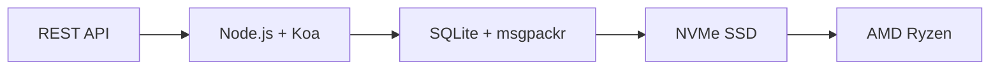

# A Primeira API Completa de Email: Como o Forward Email Revolucionou o Gerenciamento de Email {#the-first-complete-email-api-how-forward-email-revolutionized-email-management}


<p class="lead mt-3">
  <strong>Resumo:</strong> Construímos a primeira API REST completa do mundo para gerenciamento de email com capacidades avançadas de busca que nenhum outro serviço oferece. Enquanto Gmail, Outlook e Apple forçam desenvolvedores a lidarem com o inferno do IMAP ou APIs com limite de requisições, o Forward Email entrega operações CRUD extremamente rápidas para mensagens, pastas, contatos e calendários através de uma interface REST unificada com mais de 15 parâmetros de busca. Esta é a API de email que os desenvolvedores estavam esperando.
</p>


## Índice {#table-of-contents}

* [O Problema da API de Email](#the-email-api-problem)
* [O Que os Desenvolvedores Realmente Estão Dizendo](#what-developers-are-actually-saying)
* [A Solução Revolucionária do Forward Email](#forward-emails-revolutionary-solution)
  * [Por Que Construímos Isso](#why-we-built-this)
  * [Autenticação Simples](#simple-authentication)
* [20 Endpoints Que Mudam Tudo](#20-endpoints-that-change-everything)
  * [Mensagens (5 endpoints)](#messages-5-endpoints)
  * [Pastas (5 endpoints)](#folders-5-endpoints)
  * [Contatos (5 endpoints)](#contacts-5-endpoints)
  * [Calendários (5 endpoints)](#calendars-5-endpoints)
* [Busca Avançada: Nenhum Outro Serviço Se Compara](#advanced-search-no-other-service-compares)
  * [O Cenário Quebrado das APIs de Busca](#the-search-api-landscape-is-broken)
  * [A API de Busca Revolucionária do Forward Email](#forward-emails-revolutionary-search-api)
  * [Exemplos Reais de Busca](#real-world-search-examples)
  * [Vantagens de Performance](#performance-advantages)
  * [Recursos de Busca Que Ninguém Mais Tem](#search-features-no-one-else-has)
  * [Por Que Isso Importa para Desenvolvedores](#why-this-matters-for-developers)
  * [A Implementação Técnica](#the-technical-implementation)
* [Arquitetura de Performance Ultrarrápida](#blazing-fast-performance-architecture)
  * [Benchmarks de Performance](#performance-benchmarks)
  * [Arquitetura com Privacidade em Primeiro Lugar](#privacy-first-architecture)
* [Por Que Somos Diferentes: A Comparação Completa](#why-were-different-the-complete-comparison)
  * [Limitações dos Grandes Provedores](#major-provider-limitations)
  * [Vantagens do Forward Email](#forward-email-advantages)
  * [O Problema da Transparência Open-Source](#the-open-source-transparency-problem)
* [Mais de 30 Exemplos Reais de Integração](#30-real-world-integration-examples)
  * [1. Aprimoramento de Formulário de Contato no WordPress](#1-wordpress-contact-form-enhancement)
  * [2. Alternativa ao Zapier para Automação de Email](#2-zapier-alternative-for-email-automation)
  * [3. Sincronização de Email com CRM](#3-crm-email-synchronization)
  * [4. Processamento de Pedidos em E-commerce](#4-e-commerce-order-processing)
  * [5. Integração de Tickets de Suporte](#5-support-ticket-integration)
  * [6. Sistema de Gestão de Newsletter](#6-newsletter-management-system)
  * [7. Gestão de Tarefas Baseada em Email](#7-email-based-task-management)
  * [8. Agregação de Emails de Múltiplas Contas](#8-multi-account-email-aggregation)
  * [9. Painel Avançado de Análise de Emails](#9-advanced-email-analytics-dashboard)
  * [10. Arquivamento Inteligente de Emails](#10-smart-email-archiving)
  * [11. Integração de Email com Calendário](#11-email-to-calendar-integration)
  * [12. Backup e Conformidade de Emails](#12-email-backup-and-compliance)
  * [13. Gestão de Conteúdo Baseada em Email](#13-email-based-content-management)
  * [14. Gestão de Templates de Email](#14-email-template-management)
  * [15. Automação de Fluxo de Trabalho Baseada em Email](#15-email-based-workflow-automation)
  * [16. Monitoramento de Segurança de Email](#16-email-security-monitoring)
  * [17. Coleta de Pesquisas Baseada em Email](#17-email-based-survey-collection)
  * [18. Monitoramento de Performance de Email](#18-email-performance-monitoring)
  * [19. Qualificação de Leads Baseada em Email](#19-email-based-lead-qualification)
  * [20. Gestão de Projetos Baseada em Email](#20-email-based-project-management)
  * [21. Gestão de Inventário Baseada em Email](#21-email-based-inventory-management)
  * [22. Processamento de Faturas Baseado em Email](#22-email-based-invoice-processing)
  * [23. Registro de Eventos Baseado em Email](#23-email-based-event-registration)
  * [24. Fluxo de Aprovação de Documentos Baseado em Email](#24-email-based-document-approval-workflow)
  * [25. Análise de Feedback de Clientes Baseada em Email](#25-email-based-customer-feedback-analysis)
  * [26. Pipeline de Recrutamento Baseado em Email](#26-email-based-recruitment-pipeline)
  * [27. Processamento de Relatórios de Despesas Baseado em Email](#27-email-based-expense-report-processing)
  * [28. Relatórios de Garantia de Qualidade Baseados em Email](#28-email-based-quality-assurance-reporting)
  * [29. Gestão de Fornecedores Baseada em Email](#29-email-based-vendor-management)
  * [30. Monitoramento de Mídias Sociais Baseado em Email](#30-email-based-social-media-monitoring)
* [Começando](#getting-started)
  * [1. Crie Sua Conta no Forward Email](#1-create-your-forward-email-account)
  * [2. Gere Credenciais da API](#2-generate-api-credentials)
  * [3. Faça Sua Primeira Chamada à API](#3-make-your-first-api-call)
  * [4. Explore a Documentação](#4-explore-the-documentation)
* [Recursos Técnicos](#technical-resources)
## O Problema da API de Email {#the-email-api-problem}

APIs de email são fundamentalmente quebradas. Ponto final.

Todo grande provedor de email força os desenvolvedores a escolher entre duas opções terríveis:

1. **Inferno do IMAP**: Lidar com um protocolo de 30 anos projetado para clientes de desktop, não para aplicações modernas
2. **APIs Limitadas**: APIs com limite de taxa, somente leitura, complexas com OAuth que não conseguem gerenciar seus dados reais de email

O resultado? Os desenvolvedores ou abandonam completamente a integração de email ou perdem semanas construindo wrappers frágeis de IMAP que quebram constantemente.

> \[!WARNING]
> **O Segredo Sujo**: A maioria das "APIs de email" são apenas APIs de envio. Você não pode organizar pastas programaticamente, sincronizar contatos ou gerenciar calendários através de uma interface REST simples. Até agora.


## O Que os Desenvolvedores Realmente Estão Dizendo {#what-developers-are-actually-saying}

A frustração é real e documentada em todos os lugares:

> "Recentemente tentei integrar o Gmail no meu app, e gastei muito tempo nisso. Decidi que não vale a pena suportar o Gmail."
>
> *- [Desenvolvedor no Hacker News](https://news.ycombinator.com/item?id=42106944), 147 votos positivos*

> "Todas as APIs de email são medíocres? Elas parecem limitadas ou restritivas de alguma forma."
>
> *- [Discussão no Reddit r/SaaS](https://www.reddit.com/r/SaaS/comments/1cm84s7/are_all_email_apis_mediocre/)*

> "Por que o desenvolvimento de email tem que ser ruim?"
>
> *- [Reddit r/webdev](https://www.reddit.com/r/webdev/comments/15trnp2/why_does_email_development_have_to_suck/), 89 comentários de dor dos desenvolvedores*

> "O que torna a API do Gmail mais eficiente que o IMAP? Outra razão pela qual a API do Gmail é muito mais eficiente é porque ela só precisa baixar cada mensagem uma vez. Com IMAP, cada mensagem precisa ser baixada e indexada..."
>
> *- [Pergunta no Stack Overflow](https://stackoverflow.com/questions/25431022/what-makes-the-gmail-api-more-efficient-than-imap) com 47 votos positivos*

A evidência está em toda parte:

* **Problemas SMTP no WordPress**: [631 issues no GitHub](https://github.com/awesomemotive/WP-Mail-SMTP/issues) sobre falhas na entrega de email
* **Limitações do Zapier**: [Reclamações na comunidade](https://community.zapier.com/featured-articles-65/email-parser-by-zapier-limitations-and-alternatives-16958) sobre limites de 10 emails/hora e falhas na detecção IMAP
* **Projetos de API IMAP**: [Múltiplos](https://github.com/ewildgoose/imap-api) [projetos open-source](https://emailengine.app/) [existem](https://www.npmjs.com/package/imapflow) especificamente para "converter IMAP em REST" porque nenhum provedor oferece isso
* **Frustrações com a API do Gmail**: [Stack Overflow](https://stackoverflow.com/questions/tagged/gmail-api) tem 4.847 perguntas marcadas com "gmail-api" com reclamações comuns sobre limites de taxa e complexidade


## A Solução Revolucionária do Forward Email {#forward-emails-revolutionary-solution}

**Somos o primeiro serviço de email a oferecer operações CRUD completas para todos os dados de email através de uma API REST unificada.**

Isso não é apenas mais uma API de envio. É controle programático completo sobre:

* **Mensagens**: Criar, ler, atualizar, deletar, buscar, mover, sinalizar
* **Pastas**: Gerenciamento completo de pastas IMAP via endpoints REST
* **Contatos**: Armazenamento e sincronização de contatos [CardDAV](https://tools.ietf.org/html/rfc6352)
* **Calendários**: Eventos e agendamento de calendários [CalDAV](https://tools.ietf.org/html/rfc4791)

### Por Que Construímos Isso {#why-we-built-this}

**O Problema**: Todo provedor de email trata o email como uma caixa preta. Você pode enviar emails, talvez lê-los com OAuth complexo, mas não pode realmente *gerenciar* seus dados de email programaticamente.

**Nossa Visão**: Email deveria ser tão fácil de integrar quanto qualquer API moderna. Sem bibliotecas IMAP. Sem complexidade OAuth. Sem pesadelos de limite de taxa. Apenas endpoints REST simples que funcionam.

**O Resultado**: O primeiro serviço de email onde você pode construir um cliente de email completo, integração CRM ou sistema de automação usando apenas requisições HTTP.

### Autenticação Simples {#simple-authentication}

Sem [complexidade OAuth](https://oauth.net/2/). Sem [senhas específicas de app](https://support.google.com/accounts/answer/185833). Apenas suas credenciais de alias:

```bash
curl -u "alias@yourdomain.com:password" \
  https://api.forwardemail.net/v1/messages
```
## 20 Endpoints Que Mudam Tudo {#20-endpoints-that-change-everything}

### Mensagens (5 endpoints) {#messages-5-endpoints}

* `GET /v1/messages` - Listar mensagens com filtragem (`?folder=`, `?is_unread=`, `?is_flagged=`)
* `POST /v1/messages` - Enviar novas mensagens diretamente para pastas
* `GET /v1/messages/:id` - Recuperar mensagem específica com metadados completos
* `PUT /v1/messages/:id` - Atualizar mensagem (flags, pasta, status de leitura)
* `DELETE /v1/messages/:id` - Excluir mensagem permanentemente

### Pastas (5 endpoints) {#folders-5-endpoints}

* `GET /v1/folders` - Listar todas as pastas com status de assinatura
* `POST /v1/folders` - Criar nova pasta com propriedades personalizadas
* `GET /v1/folders/:id` - Obter detalhes da pasta e contagem de mensagens
* `PUT /v1/folders/:id` - Atualizar propriedades da pasta e assinatura
* `DELETE /v1/folders/:id` - Excluir pasta e gerenciar realocação de mensagens

### Contatos (5 endpoints) {#contacts-5-endpoints}

* `GET /v1/contacts` - Listar contatos com busca e paginação
* `POST /v1/contacts` - Criar novo contato com suporte completo a vCard
* `GET /v1/contacts/:id` - Recuperar contato com todos os campos e metadados
* `PUT /v1/contacts/:id` - Atualizar informações do contato com validação ETag
* `DELETE /v1/contacts/:id` - Excluir contato com tratamento em cascata

### Calendários (5 endpoints) {#calendars-5-endpoints}

* `GET /v1/calendars` - Listar eventos do calendário com filtragem por data
* `POST /v1/calendars` - Criar evento no calendário com participantes e recorrência
* `GET /v1/calendars/:id` - Obter detalhes do evento com tratamento de fuso horário
* `PUT /v1/calendars/:id` - Atualizar evento com detecção de conflitos
* `DELETE /v1/calendars/:id` - Excluir evento com notificações aos participantes


## Pesquisa Avançada: Nenhum Outro Serviço se Compara {#advanced-search-no-other-service-compares}

**Forward Email é o único serviço de email que oferece busca programática abrangente em todos os campos de mensagem através de uma API REST.**

Enquanto outros provedores oferecem no máximo filtragem básica, nós construímos a API de busca de email mais avançada já criada. Nenhuma API do Gmail, Outlook ou qualquer outro serviço chega perto das nossas capacidades de busca.

### O Cenário das APIs de Busca Está Quebrado {#the-search-api-landscape-is-broken}

**Limitações da Busca na API do Gmail:**

* ✅ Apenas parâmetro básico `q`
* ❌ Sem busca específica por campo
* ❌ Sem filtragem por intervalo de datas
* ❌ Sem filtragem por tamanho
* ❌ Sem filtragem por anexos
* ❌ Limitado à sintaxe de busca do Gmail

**Limitações da Busca na API do Outlook:**

* ✅ Parâmetro básico `$search`
* ❌ Sem direcionamento avançado por campo
* ❌ Sem combinações complexas de consultas
* ❌ Limitação agressiva de taxa
* ❌ Sintaxe OData complexa necessária

**Apple iCloud:**

* ❌ Sem API alguma
* ❌ Apenas busca IMAP (se conseguir fazer funcionar)

**ProtonMail & Tuta:**

* ❌ Sem APIs públicas
* ❌ Sem capacidades de busca programática

### A Revolucionária API de Busca do Forward Email {#forward-emails-revolutionary-search-api}

**Oferecemos mais de 15 parâmetros de busca que nenhum outro serviço fornece:**

| Capacidade de Busca            | Forward Email                        | API do Gmail | API do Outlook     | Outros |
| ------------------------------ | ---------------------------------- | ------------ | ------------------ | ------ |
| **Busca Específica por Campo** | ✅ Assunto, corpo, de, para, cc, cabeçalhos | ❌            | ❌                  | ❌      |
| **Busca Geral Multi-Campo**    | ✅ `?search=` em todos os campos    | ✅ Básico `q=` | ✅ Básico `$search=` | ❌      |
| **Filtragem por Intervalo de Datas** | ✅ `?since=` & `?before=`           | ❌            | ❌                  | ❌      |
| **Filtragem por Tamanho**      | ✅ `?min_size=` & `?max_size=`      | ❌            | ❌                  | ❌      |
| **Filtragem por Anexos**       | ✅ `?has_attachments=true/false`    | ❌            | ❌                  | ❌      |
| **Busca em Cabeçalhos**        | ✅ `?headers=X-Priority`            | ❌            | ❌                  | ❌      |
| **Busca por ID da Mensagem**   | ✅ `?message_id=abc123`             | ❌            | ❌                  | ❌      |
| **Filtros Combinados**         | ✅ Múltiplos parâmetros com lógica AND | ❌            | ❌                  | ❌      |
| **Busca Case-Insensitive**     | ✅ Todas as buscas                  | ✅            | ✅                  | ❌      |
| **Suporte a Paginação**        | ✅ Funciona com todos os parâmetros de busca | ✅            | ✅                  | ❌      |
### Exemplos Reais de Pesquisa {#real-world-search-examples}

**Encontrar Todas as Faturas do Último Trimestre:**

```bash
# Forward Email - Simples e poderoso
GET /v1/messages?subject=invoice&since=2024-01-01T00:00:00Z&before=2024-04-01T00:00:00Z

# Gmail API - Impossível com a pesquisa limitada deles
# Nenhum filtro de intervalo de datas disponível

# Outlook API - Sintaxe OData complexa, funcionalidade limitada
GET /me/messages?$search="invoice"&$filter=receivedDateTime ge 2024-01-01T00:00:00Z
```

**Pesquisar por Anexos Grandes de Remetente Específico:**

```bash
# Forward Email - Filtragem abrangente
GET /v1/messages?from=finance@company.com&has_attachments=true&min_size=1000000

# Gmail API - Não é possível filtrar por tamanho ou anexos programaticamente
# Outlook API - Nenhum filtro de tamanho disponível
# Outros - Nenhuma API disponível
```

**Pesquisa Complexa com Múltiplos Campos:**

```bash
# Forward Email - Capacidades avançadas de consulta
GET /v1/messages?body=quarterly&from=manager&is_flagged=true&folder=Reports

# Gmail API - Limitado a pesquisa básica de texto
GET /gmail/v1/users/me/messages?q=quarterly

# Outlook API - Pesquisa básica sem direcionamento de campo
GET /me/messages?$search="quarterly"
```

### Vantagens de Desempenho {#performance-advantages}

**Desempenho da Pesquisa Forward Email:**

* ⚡ **Tempos de resposta abaixo de 100ms** para pesquisas complexas
* 🔍 **Otimização com regex** e indexação adequada
* 📊 **Execução paralela de consultas** para contagem e dados
* 💾 **Uso eficiente de memória** com consultas enxutas

**Problemas de Desempenho dos Concorrentes:**

* 🐌 **Gmail API**: Limite de taxa de 250 unidades de cota por usuário por segundo
* 🐌 **Outlook API**: Restrição agressiva com requisitos complexos de backoff
* 🐌 **Outros**: Nenhuma API para comparação

### Recursos de Pesquisa que Ninguém Mais Tem {#search-features-no-one-else-has}

#### 1. Pesquisa Específica por Cabeçalho {#1-header-specific-search}

```bash
# Encontrar mensagens com cabeçalhos específicos
GET /v1/messages?headers=X-Priority:1
GET /v1/messages?headers=X-Spam-Score
```

#### 2. Inteligência Baseada em Tamanho {#2-size-based-intelligence}

```bash
# Encontrar emails de newsletter (tipicamente grandes)
GET /v1/messages?min_size=50000&from=newsletter

# Encontrar respostas rápidas (tipicamente pequenas)
GET /v1/messages?max_size=1000&to=support
```

#### 3. Fluxos de Trabalho Baseados em Anexos {#3-attachment-based-workflows}

```bash
# Encontrar todos os documentos enviados para o time jurídico
GET /v1/messages?to=legal&has_attachments=true&body=contract

# Encontrar emails sem anexos para limpeza
GET /v1/messages?has_attachments=false&before=2023-01-01T00:00:00Z
```

#### 4. Lógica de Negócio Combinada {#4-combined-business-logic}

```bash
# Encontrar mensagens sinalizadas como urgentes de VIPs com anexos
GET /v1/messages?is_flagged=true&from=ceo&has_attachments=true&subject=urgent
```

### Por Que Isso Importa para Desenvolvedores {#why-this-matters-for-developers}

**Construa Aplicações que Antes Eram Impossíveis:**

1. **Análise Avançada de Emails**: Analise padrões de email por tamanho, remetente, conteúdo
2. **Gerenciamento Inteligente de Emails**: Auto-organização baseada em critérios complexos
3. **Conformidade e Descoberta**: Encontre emails específicos para requisitos legais
4. **Inteligência de Negócios**: Extraia insights dos padrões de comunicação por email
5. **Fluxos de Trabalho Automatizados**: Acione ações baseadas em filtros sofisticados de email

### A Implementação Técnica {#the-technical-implementation}

Nossa API de pesquisa utiliza:

* **Otimização com regex** e estratégias adequadas de indexação
* **Execução paralela** para desempenho
* **Validação de entrada** para segurança
* **Tratamento abrangente de erros** para confiabilidade

```javascript
// Exemplo: Implementação de pesquisa complexa
const searchConditions = [];

if (ctx.query.subject) {
  searchConditions.push({
    subject: { $regex: ctx.query.subject, $options: 'i' }
  });
}

if (ctx.query.from) {
  searchConditions.push({
    $or: [
      { 'from.address': { $regex: ctx.query.from, $options: 'i' } },
      { 'from.name': { $regex: ctx.query.from, $options: 'i' } }
    ]
  });
}

// Combinar com lógica AND
if (searchConditions.length > 0) {
  query.$and = searchConditions;
}
```

> \[!TIP]
> **Vantagem para Desenvolvedores**: Com a API de pesquisa do Forward Email, você pode construir aplicações de email que rivalizam com clientes desktop em funcionalidade, mantendo a simplicidade das APIs REST.
## Arquitetura de Desempenho Ultra Rápido {#blazing-fast-performance-architecture}

Nossa pilha técnica é construída para velocidade e confiabilidade:


```mermaid
graph LR
    A[REST API] --> B[Node.js + Koa]
    B --> C[SQLite + msgpackr]
    C --> D[NVMe SSD]
    D --> E[AMD Ryzen]
```

### Benchmark de Desempenho {#performance-benchmarks}

**Por Que Somos Relâmpago:**

| Componente   | Tecnologia                                                                        | Benefício de Desempenho                      |
| ------------ | -------------------------------------------------------------------------------- | -------------------------------------------- |
| **Armazenamento** | [NVMe SSD](https://en.wikipedia.org/wiki/NVM_Express)                         | 10x mais rápido que SATA tradicional         |
| **Banco de Dados** | [SQLite](https://sqlite.org/) + [msgpackr](https://github.com/kriszyp/msgpackr) | Latência zero de rede, serialização otimizada |
| **Hardware** | [AMD Ryzen](https://www.amd.com/en/products/processors/desktops/ryzen) bare metal | Sem overhead de virtualização                 |
| **Cache**    | Em memória + persistente                                                         | Tempos de resposta sub-milisegundos           |
| **Backups**  | [Cloudflare R2](https://www.cloudflare.com/products/r2/) criptografado           | Confiabilidade nível empresarial              |

**Números Reais de Desempenho:**

* **Tempo de Resposta da API**: média < 50ms
* **Recuperação de Mensagens**: < 10ms para mensagens em cache
* **Operações em Pastas**: < 5ms para operações de metadados
* **Sincronização de Contatos**: 1000+ contatos/segundo
* **Disponibilidade**: SLA de 99,99% com infraestrutura redundante

### Arquitetura Focada em Privacidade {#privacy-first-architecture}

**Design Zero-Knowledge**: Apenas você tem acesso com sua senha IMAP - não podemos ler seus e-mails. Nossa [arquitetura zero-knowledge](https://forwardemail.net/en/security) garante privacidade completa enquanto entrega desempenho ultra rápido.


## Por Que Somos Diferentes: A Comparação Completa {#why-were-different-the-complete-comparison}

### Limitações dos Principais Provedores {#major-provider-limitations}

| Provedor        | Problemas Principais                      | Limitações Específicas                                                                                                                                                                                                                                                                                                                                                                                                                                               |
| ---------------- | ----------------------------------------- | -------------------------------------------------------------------------------------------------------------------------------------------------------------------------------------------------------------------------------------------------------------------------------------------------------------------------------------------------------------------------------------------------------------------------------------------------------------------- |
| **Gmail API**    | Somente leitura, OAuth complexo, APIs separadas | • [Não pode modificar mensagens existentes](https://developers.google.com/gmail/api/reference/rest/v1/users.messages)<br>• [Rótulos ≠ pastas](https://developers.google.com/gmail/api/reference/rest/v1/users.labels)<br>• [Limite de 1 bilhão de unidades de cota/dia](https://developers.google.com/gmail/api/reference/quota)<br>• [Requer APIs separadas](https://developers.google.com/workspace) para contatos/calendário                                                           |
| **Outlook API**  | Obsoleta, Confusa, Focada em empresas    | • [Endpoints REST obsoletos em março de 2024](https://learn.microsoft.com/en-us/outlook/rest/compare-graph)<br>• [Múltiplas APIs confusas](https://learn.microsoft.com/en-us/office/client-developer/outlook/selecting-an-api-or-technology-for-developing-solutions-for-outlook) (EWS, Graph, REST)<br>• [Complexidade do Microsoft Graph](https://learn.microsoft.com/en-us/graph/overview)<br>• [Throttling agressivo](https://learn.microsoft.com/en-us/graph/throttling) |
| **Apple iCloud** | Sem API Pública                          | • [Nenhuma API pública](https://support.apple.com/en-us/102654)<br>• [Apenas IMAP com limite de 1000 e-mails/dia](https://support.apple.com/en-us/102654)<br>• [Senhas específicas para apps necessárias](https://support.apple.com/en-us/102654)<br>• [Limite de 500 destinatários por mensagem](https://support.apple.com/en-us/102654)                                                                                                                                              |
| **ProtonMail**   | Sem API, Falsas alegações de código aberto | • [Nenhuma API pública disponível](https://proton.me/support/protonmail-bridge-clients)<br>• [Software Bridge necessário](https://proton.me/mail/bridge) para acesso IMAP<br>• [Alega ser "open source"](https://proton.me/blog/open-source) mas [código do servidor é proprietário](https://github.com/ProtonMail)<br>• [Limitado apenas a planos pagos](https://proton.me/pricing)                                                                                                         |
| **Tuta**         | Sem API, Transparência enganosa           | • [Sem API REST para gerenciamento de e-mails](https://tuta.com/support#technical)<br>• [Alega ser "open source"](https://tuta.com/blog/posts/open-source-email) mas [backend é fechado](https://github.com/tutao/tutanota)<br>• [IMAP/SMTP não suportados](https://tuta.com/support#imap)<br>• [Criptografia proprietária](https://tuta.com/encryption) impede integrações padrão                                                                                               |
| **Zapier Email** | Limites severos de taxa                   | • [Limite de 10 e-mails por hora](https://help.zapier.com/hc/en-us/articles/8496181555597-Email-Parser-by-Zapier-limitations-and-alternatives)<br>• [Sem acesso a pastas IMAP](https://help.zapier.com/hc/en-us/articles/8496181555597-Email-Parser-by-Zapier-limitations-and-alternatives)<br>• [Capacidades limitadas de parsing](https://help.zapier.com/hc/en-us/articles/8496181555597-Email-Parser-by-Zapier-limitations-and-alternatives)                                 |
### Vantagens do Encaminhamento de Email {#forward-email-advantages}

| Recurso            | Encaminhamento de Email                                                                       | Concorrência                             |
| ------------------ | -------------------------------------------------------------------------------------------- | --------------------------------------- |
| **CRUD Completo**  | ✅ Criação, leitura, atualização e exclusão completas para todos os dados                     | ❌ Somente leitura ou operações limitadas |
| **API Unificada**  | ✅ Mensagens, pastas, contatos, calendários em uma única API                                  | ❌ APIs separadas ou recursos ausentes   |
| **Autenticação Simples** | ✅ Autenticação básica com credenciais de alias                                           | ❌ OAuth complexo com múltiplos escopos  |
| **Sem Limites de Taxa** | ✅ Limites generosos projetados para aplicações reais                                    | ❌ Cotas restritivas que quebram fluxos de trabalho |
| **Auto-Hospedagem** | ✅ [Opção completa de auto-hospedagem](https://forwardemail.net/en/blog/docs/self-hosted-solution) | ❌ Apenas bloqueio pelo fornecedor        |
| **Privacidade**    | ✅ Zero conhecimento, criptografado, privado                                                 | ❌ Mineração de dados e preocupações com privacidade |
| **Desempenho**    | ✅ Respostas abaixo de 50ms, armazenamento NVMe                                              | ❌ Latência de rede, atrasos por limitação |

### O Problema da Transparência em Código Aberto {#the-open-source-transparency-problem}

**ProtonMail e Tuta se promovem como "código aberto" e "transparentes", mas isso é um marketing enganoso que viola princípios modernos de privacidade.**

> \[!WARNING]
> **Reivindicações Falsas de Transparência**: Tanto ProtonMail quanto Tuta anunciam de forma destacada suas credenciais de "código aberto" enquanto mantêm seu código mais crítico do lado do servidor proprietário e fechado.

**A Enganação do ProtonMail:**

* **Reivindicações**: ["Somos código aberto"](https://proton.me/blog/open-source) em destaque no marketing
* **Realidade**: [Código do servidor é completamente proprietário](https://github.com/ProtonMail) - apenas os aplicativos clientes são de código aberto
* **Impacto**: Usuários não podem verificar a criptografia do lado do servidor, o tratamento de dados ou as alegações de privacidade
* **Violação de Transparência**: Não há como auditar os sistemas reais de processamento e armazenamento de email

**Marketing Enganoso da Tuta:**

* **Reivindicações**: ["Email de código aberto"](https://tuta.com/blog/posts/open-source-email) como ponto central de venda
* **Realidade**: [Infraestrutura backend é código fechado](https://github.com/tutao/tutanota) - apenas o frontend está disponível
* **Impacto**: Criptografia proprietária impede protocolos padrão de email (IMAP/SMTP)
* **Estratégia de Bloqueio**: Criptografia personalizada força dependência do fornecedor

**Por Que Isso Importa para a Privacidade Moderna:**

Em 2025, a verdadeira privacidade requer **transparência completa**. Quando provedores de email afirmam ser "código aberto" mas escondem seu código do servidor:

1. **Criptografia Inaudível**: Você não pode auditar como seus dados são realmente criptografados
2. **Práticas de Dados Ocultas**: O tratamento de dados do lado do servidor permanece uma caixa preta
3. **Segurança Baseada em Confiança**: Você deve confiar nas alegações sem verificação
4. **Bloqueio pelo Fornecedor**: Sistemas proprietários impedem a portabilidade dos dados

**A Verdadeira Transparência do Forward Email:**

* ✅ **[Código aberto completo](https://github.com/forwardemail/forwardemail.net)** - código do servidor e cliente
* ✅ **[Auto-hospedagem disponível](https://forwardemail.net/en/blog/docs/self-hosted-solution)** - execute sua própria instância
* ✅ **Protocolos padrão** - compatibilidade com IMAP, SMTP, CardDAV, CalDAV
* ✅ **Segurança auditável** - cada linha de código pode ser inspecionada
* ✅ **Sem bloqueio pelo fornecedor** - seus dados, seu controle

> \[!TIP]
> **Código aberto real significa que você pode verificar cada alegação.** Com o Forward Email, você pode auditar nossa criptografia, revisar nosso tratamento de dados e até mesmo executar sua própria instância. Essa é a verdadeira transparência.


## Mais de 30 Exemplos de Integração no Mundo Real {#30-real-world-integration-examples}

### 1. Aprimoramento do Formulário de Contato do WordPress {#1-wordpress-contact-form-enhancement}
**Problema**: [Falhas na configuração SMTP do WordPress](https://github.com/awesomemotive/WP-Mail-SMTP/issues) ([631 issues no GitHub](https://github.com/awesomemotive/WP-Mail-SMTP/issues))  
**Solução**: Integração direta via API que ignora completamente o [SMTP](https://tools.ietf.org/html/rfc5321)

```javascript
// Formulário de contato do WordPress que salva na pasta Enviados
await fetch('https://api.forwardemail.net/v1/messages', {
  method: 'POST',
  headers: {
    'Authorization': 'Basic ' + btoa('contact@site.com:password'),
    'Content-Type': 'application/json'
  },
  body: JSON.stringify({
    to: [{ address: 'owner@site.com' }],
    subject: 'Formulário de Contato: ' + formData.subject,
    text: formData.message,
    folder: 'Sent'
  })
});
```

### 2. Alternativa ao Zapier para Automação de Email {#2-zapier-alternative-for-email-automation}

**Problema**: [Limite de 10 emails/hora do Zapier](https://help.zapier.com/hc/en-us/articles/8496181555597-Email-Parser-by-Zapier-limitations-and-alternatives) e [falhas na detecção IMAP](https://community.zapier.com/featured-articles-65/email-parser-by-zapier-limitations-and-alternatives-16958)  
**Solução**: Automação ilimitada com controle total do email

```javascript
// Auto-organizar emails por domínio do remetente
const messages = await fetch('/v1/messages?folder=INBOX');
for (const message of messages) {
  const domain = message.from.split('@')[1];
  await fetch(`/v1/messages/${message.id}`, {
    method: 'PUT',
    body: JSON.stringify({ folder: `Clients/${domain}` })
  });
}
```

### 3. Sincronização de Email com CRM {#3-crm-email-synchronization}

**Problema**: Gerenciamento manual de contatos entre email e [sistemas CRM](https://en.wikipedia.org/wiki/Customer_relationship_management)  
**Solução**: Sincronização bidirecional com API de contatos [CardDAV](https://tools.ietf.org/html/rfc6352)

```javascript
// Sincronizar novos contatos de email para o CRM
const newContacts = await fetch('/v1/contacts');
for (const contact of newContacts) {
  await crmAPI.createContact({
    name: contact.name,
    email: contact.email,
    source: 'email_api'
  });
}
```

### 4. Processamento de Pedidos para E-commerce {#4-e-commerce-order-processing}

**Problema**: Processamento manual de emails de pedidos para [plataformas de e-commerce](https://en.wikipedia.org/wiki/E-commerce)  
**Solução**: Pipeline automatizado de gerenciamento de pedidos

```javascript
// Processar emails de confirmação de pedido
const orders = await fetch('/v1/messages?folder=Orders');
const orderEmails = orders.filter(msg =>
  msg.subject.includes('Order Confirmation')
);

for (const order of orderEmails) {
  const orderData = parseOrderEmail(order.text);
  await updateInventory(orderData);
  await fetch(`/v1/messages/${order.id}`, {
    method: 'PUT',
    body: JSON.stringify({ folder: 'Orders/Processed' })
  });
}
```

### 5. Integração de Tickets de Suporte {#5-support-ticket-integration}

**Problema**: Conversas de email espalhadas por [plataformas de helpdesk](https://en.wikipedia.org/wiki/Help_desk_software)  
**Solução**: Rastreamento completo de threads de email

```javascript
// Criar ticket de suporte a partir da thread de email
const messages = await fetch('/v1/messages?folder=Support');
const supportEmails = messages.filter(msg =>
  msg.to.some(addr => addr.includes('support@'))
);

for (const email of supportEmails) {
  const ticket = await supportSystem.createTicket({
    subject: email.subject,
    from: email.from,
    body: email.text,
    timestamp: email.date
  });
}
```

### 6. Sistema de Gestão de Newsletter {#6-newsletter-management-system}

**Problema**: Integrações limitadas com [plataformas de newsletter](https://en.wikipedia.org/wiki/Email_marketing)  
**Solução**: Gestão completa do ciclo de vida dos assinantes

```javascript
// Gerenciar automaticamente inscrições em newsletter
const messages = await fetch('/v1/messages?folder=Newsletter');
const unsubscribes = messages.filter(msg =>
  msg.subject.toLowerCase().includes('unsubscribe')
);

for (const msg of unsubscribes) {
  await removeSubscriber(msg.from);
  await fetch(`/v1/messages/${msg.id}`, {
    method: 'PUT',
    body: JSON.stringify({ folder: 'Newsletter/Unsubscribed' })
  });
}
```

### 7. Gestão de Tarefas via Email {#7-email-based-task-management}

**Problema**: Sobrecarga da caixa de entrada e [rastreamento de tarefas](https://en.wikipedia.org/wiki/Task_management)  
**Solução**: Converter emails em tarefas acionáveis
```javascript
// Create tasks from flagged emails
const messages = await fetch('/v1/messages?is_flagged=true');
for (const email of messages) {
  await taskManager.createTask({
    title: email.subject,
    description: email.text,
    assignee: email.to[0].address,
    dueDate: extractDueDate(email.text)
  });
}
```

### 8. Multi-Account Email Aggregation {#8-multi-account-email-aggregation}

**Problem**: Managing [multiple email accounts](https://en.wikipedia.org/wiki/Email_client) across providers
**Solution**: Unified inbox interface

```javascript
// Aggregate emails from multiple accounts
const accounts = ['work@domain.com', 'personal@domain.com'];
const allMessages = [];

for (const account of accounts) {
  const messages = await fetch('/v1/messages', {
    headers: { 'Authorization': getAuth(account) }
  });
  allMessages.push(...messages.map(m => ({ ...m, account })));
}
```

### 9. Advanced Email Analytics Dashboard {#9-advanced-email-analytics-dashboard}

**Problem**: No insights into [email patterns](https://en.wikipedia.org/wiki/Email_analytics) with sophisticated filtering
**Solution**: Custom email analytics using advanced search capabilities

```javascript
// Generate comprehensive email analytics using advanced search
const analytics = {};

// Analyze email volume by sender domain
const messages = await fetch('/v1/messages');
analytics.senderDomains = analyzeSenderDomains(messages);

// Find large attachments consuming storage
const largeAttachments = await fetch('/v1/messages?has_attachments=true&min_size=1000000');
analytics.storageHogs = largeAttachments.map(msg => ({
  subject: msg.subject,
  from: msg.from,
  size: msg.size
}));

// Analyze communication patterns with VIPs
const vipEmails = await fetch('/v1/messages?from=ceo@company.com');
const urgentVipEmails = await fetch('/v1/messages?from=ceo@company.com&subject=urgent');
analytics.vipCommunication = {
  total: vipEmails.length,
  urgent: urgentVipEmails.length,
  urgencyRate: (urgentVipEmails.length / vipEmails.length) * 100
};

// Find unread emails by date range for follow-up
const lastWeek = new Date(Date.now() - 7 * 24 * 60 * 60 * 1000).toISOString();
const unreadRecent = await fetch(`/v1/messages?is_unread=true&since=${lastWeek}`);
analytics.followUpNeeded = unreadRecent.length;

// Analyze email sizes for optimization
const smallEmails = await fetch('/v1/messages?max_size=1000');
const mediumEmails = await fetch('/v1/messages?min_size=1000&max_size=50000');
const largeEmails = await fetch('/v1/messages?min_size=50000');
analytics.sizeDistribution = {
  small: smallEmails.length,
  medium: mediumEmails.length,
  large: largeEmails.length
};

// Search for compliance-related emails
const complianceEmails = await fetch('/v1/messages?body=confidential&has_attachments=true');
analytics.complianceReview = complianceEmails.length;
```

### 10. Smart Email Archiving {#10-smart-email-archiving}

**Problem**: Manual [email organization](https://en.wikipedia.org/wiki/Email_management)
**Solution**: Intelligent email categorization

```javascript
// Auto-archive old emails by category
const messages = await fetch('/v1/messages');
const oldEmails = messages.filter(email =>
  isOlderThan(email.date, 90) // 90 days
);

for (const email of oldEmails) {
  const category = categorizeEmail(email);
  await fetch(`/v1/messages/${email.id}`, {
    method: 'PUT',
    body: JSON.stringify({ folder: `Archive/${category}` })
  });
}
```

### 11. Email-to-Calendar Integration {#11-email-to-calendar-integration}

**Problem**: Manual [calendar event](https://tools.ietf.org/html/rfc4791) creation from emails
**Solution**: Automatic event extraction and creation

```javascript
// Extract meeting details from emails
const messages = await fetch('/v1/messages?folder=Meetings');
const meetingEmails = messages.filter(email =>
  email.subject.toLowerCase().includes('meeting')
);

for (const email of meetingEmails) {
  const meetingData = extractMeetingInfo(email.text);
  if (meetingData.date && meetingData.time) {
    await fetch('/v1/calendars', {
      method: 'POST',
      body: JSON.stringify({
        title: email.subject,
        start: meetingData.datetime,
        attendees: [email.from, ...email.to]
      })
    });
  }
}
```

### 12. Backup e Conformidade de Email {#12-email-backup-and-compliance}

**Problema**: [Retenção de email](https://en.wikipedia.org/wiki/Email_retention_policy) e requisitos de conformidade  
**Solução**: Backup automatizado com preservação de metadados

```javascript
// Backup de emails com metadados completos
const allMessages = await fetch('/v1/messages');
const backup = {
  timestamp: new Date(),
  messages: allMessages.map(msg => ({
    id: msg.id,
    subject: msg.subject,
    from: msg.from,
    to: msg.to,
    date: msg.date,
    flags: msg.flags
  }))
};
await saveToComplianceStorage(backup);
```

### 13. Gestão de Conteúdo Baseada em Email {#13-email-based-content-management}

**Problema**: Gerenciar submissões de conteúdo via email para [plataformas CMS](https://en.wikipedia.org/wiki/Content_management_system)  
**Solução**: Email como sistema de gestão de conteúdo

```javascript
// Processar submissões de conteúdo por email
const messages = await fetch('/v1/messages?folder=Submissions');
const submissions = messages.filter(msg =>
  msg.to.some(addr => addr.includes('submit@'))
);

for (const submission of submissions) {
  const content = parseSubmission(submission.text);
  await cms.createDraft({
    title: submission.subject,
    content: content.body,
    author: submission.from
  });
}
```

### 14. Gestão de Templates de Email {#14-email-template-management}

**Problema**: [Templates de email](https://en.wikipedia.org/wiki/Email_template) inconsistentes na equipe  
**Solução**: Sistema centralizado de templates com API

```javascript
// Enviar emails com templates e conteúdo dinâmico
const template = await getEmailTemplate('welcome');
await fetch('/v1/messages', {
  method: 'POST',
  body: JSON.stringify({
    to: [{ address: newUser.email }],
    subject: template.subject.replace('{{name}}', newUser.name),
    html: template.html.replace('{{name}}', newUser.name),
    folder: 'Sent'
  })
});
```

### 15. Automação de Fluxo de Trabalho Baseada em Email {#15-email-based-workflow-automation}

**Problema**: Processos manuais de [aprovação](https://en.wikipedia.org/wiki/Workflow) via email  
**Solução**: Gatilhos automatizados de fluxo de trabalho

```javascript
// Processar emails de aprovação
const messages = await fetch('/v1/messages?folder=Approvals');
const approvals = messages.filter(msg =>
  msg.subject.includes('APPROVAL')
);

for (const approval of approvals) {
  const decision = parseApprovalDecision(approval.text);
  await workflow.processApproval({
    requestId: extractRequestId(approval.subject),
    decision: decision,
    approver: approval.from
  });
}
```

### 16. Monitoramento de Segurança de Email {#16-email-security-monitoring}

**Problema**: Detecção manual de [ameaças de segurança](https://en.wikipedia.org/wiki/Email_security)  
**Solução**: Análise automatizada de ameaças

```javascript
// Monitorar emails suspeitos
const recentEmails = await fetch('/v1/messages');
for (const email of recentEmails) {
  const threatScore = analyzeThreat(email);
  if (threatScore > 0.8) {
    await fetch(`/v1/messages/${email.id}`, {
      method: 'PUT',
      body: JSON.stringify({ folder: 'Security/Quarantine' })
    });
    await alertSecurityTeam(email);
  }
}
```

### 17. Coleta de Pesquisas Baseada em Email {#17-email-based-survey-collection}

**Problema**: Processamento manual de [respostas de pesquisa](https://en.wikipedia.org/wiki/Survey_methodology)  
**Solução**: Agregação automatizada de respostas

```javascript
// Coletar e processar respostas de pesquisa
const messages = await fetch('/v1/messages?folder=Surveys');
const responses = messages.filter(msg =>
  msg.subject.includes('Survey Response')
);

const surveyData = responses.map(email => ({
  respondent: email.from,
  responses: parseSurveyData(email.text),
  timestamp: email.date
}));
await updateSurveyResults(surveyData);
```

### 18. Monitoramento de Performance de Email {#18-email-performance-monitoring}

**Problema**: Falta de visibilidade sobre a [performance de entrega de email](https://en.wikipedia.org/wiki/Email_deliverability)  
**Solução**: Métricas de email em tempo real

```javascript
// Monitorar performance de entrega de emails
const sentEmails = await fetch('/v1/messages?folder=Sent');
const deliveryStats = {
  sent: sentEmails.length,
  bounces: await countBounces(),
  deliveryRate: calculateDeliveryRate()
};
await updateDashboard(deliveryStats);
```
### 19. Qualificação de Leads Baseada em Email {#19-email-based-lead-qualification}

**Problema**: [Lead scoring](https://en.wikipedia.org/wiki/Lead_scoring) manual a partir de interações por email  
**Solução**: Pipeline automatizado de qualificação de leads

```javascript
// Score leads based on email engagement
const prospects = await fetch('/v1/contacts');
for (const prospect of prospects) {
  const messages = await fetch('/v1/messages');
  const emails = messages.filter(msg =>
    msg.from.includes(prospect.email)
  );
  const score = calculateEngagementScore(emails);
  await crm.updateLeadScore(prospect.id, score);
}
```

### 20. Gestão de Projetos Baseada em Email {#20-email-based-project-management}

**Problema**: [Atualizações de projeto](https://en.wikipedia.org/wiki/Project_management) espalhadas por threads de email  
**Solução**: Hub centralizado de comunicação de projetos

```javascript
// Extract project updates from emails
const messages = await fetch('/v1/messages?folder=Projects');
const projectEmails = messages.filter(msg =>
  msg.subject.includes('Project Update')
);

for (const email of projectEmails) {
  const update = parseProjectUpdate(email.text);
  await projectManager.addUpdate({
    project: update.projectId,
    author: email.from,
    content: update.content
  });
}
```

### 21. Gestão de Inventário Baseada em Email {#21-email-based-inventory-management}

**Problema**: Atualizações manuais de inventário a partir de emails de fornecedores  
**Solução**: Rastreamento automatizado de inventário a partir de notificações por email

```javascript
// Process inventory updates from supplier emails
const messages = await fetch('/v1/messages?folder=Suppliers');
const inventoryEmails = messages.filter(msg =>
  msg.subject.includes('Inventory Update') || msg.subject.includes('Stock Alert')
);

for (const email of inventoryEmails) {
  const inventoryData = parseInventoryUpdate(email.text);
  await inventory.updateStock({
    sku: inventoryData.sku,
    quantity: inventoryData.quantity,
    supplier: email.from,
    timestamp: email.date
  });

  // Move to processed folder
  await fetch(`/v1/messages/${email.id}`, {
    method: 'PUT',
    body: JSON.stringify({ folder: 'Suppliers/Processed' })
  });
}
```

### 22. Processamento de Faturas Baseado em Email {#22-email-based-invoice-processing}

**Problema**: Processamento manual de [faturas](https://en.wikipedia.org/wiki/Invoice_processing) e integração contábil  
**Solução**: Extração automatizada de faturas e sincronização com sistema contábil

```javascript
// Extract invoice data from email attachments
const messages = await fetch('/v1/messages?folder=Invoices');
const invoiceEmails = messages.filter(msg =>
  msg.subject.toLowerCase().includes('invoice') && msg.attachments.length > 0
);

for (const email of invoiceEmails) {
  const invoiceData = await extractInvoiceData(email.attachments[0]);
  await accounting.createInvoice({
    vendor: email.from,
    amount: invoiceData.total,
    dueDate: invoiceData.dueDate,
    items: invoiceData.lineItems
  });

  // Flag as processed
  await fetch(`/v1/messages/${email.id}`, {
    method: 'PUT',
    body: JSON.stringify({ flags: ['\\Seen', '\\Flagged'] })
  });
}
```

### 23. Registro de Eventos Baseado em Email {#23-email-based-event-registration}

**Problema**: Processamento manual de [registro de eventos](https://en.wikipedia.org/wiki/Event_management) a partir de respostas por email  
**Solução**: Gestão automatizada de participantes e integração com calendário

```javascript
// Process event registration emails
const messages = await fetch('/v1/messages?folder=Events');
const registrations = messages.filter(msg =>
  msg.subject.includes('Registration') || msg.subject.includes('RSVP')
);

for (const registration of registrations) {
  const attendeeData = parseRegistration(registration.text);

  // Add to attendee list
  await events.addAttendee({
    event: attendeeData.eventId,
    name: attendeeData.name,
    email: registration.from,
    dietary: attendeeData.dietaryRestrictions
  });

  // Create calendar event for attendee
  await fetch('/v1/calendars', {
    method: 'POST',
    body: JSON.stringify({
      title: attendeeData.eventName,
      start: attendeeData.eventDate,
      attendees: [registration.from]
    })
  });
}
```
### 24. Fluxo de Trabalho de Aprovação de Documentos Baseado em Email {#24-email-based-document-approval-workflow}

**Problema**: Cadeias complexas de [aprovação de documentos](https://en.wikipedia.org/wiki/Document_management_system) via email  
**Solução**: Rastreamento automatizado de aprovações e versionamento de documentos

```javascript
// Track document approval workflow
const messages = await fetch('/v1/messages?folder=Approvals');
const approvalEmails = messages.filter(msg =>
  msg.subject.includes('Document Approval')
);

for (const email of approvalEmails) {
  const approval = parseApprovalEmail(email.text);

  await documentSystem.updateApproval({
    documentId: approval.documentId,
    approver: email.from,
    status: approval.decision, // 'approved', 'rejected', 'needs_changes'
    comments: approval.comments,
    timestamp: email.date
  });

  // Check if all approvals complete
  const document = await documentSystem.getDocument(approval.documentId);
  if (document.allApprovalsComplete) {
    await documentSystem.finalizeDocument(approval.documentId);
  }
}
```

### 25. Análise de Feedback de Clientes Baseada em Email {#25-email-based-customer-feedback-analysis}

**Problema**: Coleta manual de [feedback de clientes](https://en.wikipedia.org/wiki/Customer_feedback) e análise de sentimento  
**Solução**: Processamento automatizado de feedback e rastreamento de sentimento

```javascript
// Analyze customer feedback from emails
const messages = await fetch('/v1/messages?folder=Feedback');
const feedbackEmails = messages.filter(msg =>
  msg.to.some(addr => addr.includes('feedback@'))
);

for (const email of feedbackEmails) {
  const sentiment = await analyzeSentiment(email.text);
  const category = categorizeFeeback(email.text);

  await feedback.recordFeedback({
    customer: email.from,
    content: email.text,
    sentiment: sentiment.score, // -1 to 1
    category: category, // 'bug', 'feature', 'complaint', 'praise'
    priority: calculatePriority(sentiment, category),
    timestamp: email.date
  });

  // Auto-escalate negative feedback
  if (sentiment.score < -0.5) {
    await escalateToSupport(email);
  }
}
```

### 26. Pipeline de Recrutamento Baseado em Email {#26-email-based-recruitment-pipeline}

**Problema**: Rastreamento manual de [recrutamento](https://en.wikipedia.org/wiki/Recruitment) e candidatos  
**Solução**: Gestão automatizada de candidatos e agendamento de entrevistas

```javascript
// Process job application emails
const messages = await fetch('/v1/messages?folder=Careers');
const applications = messages.filter(msg =>
  msg.subject.toLowerCase().includes('application') && msg.attachments.length > 0
);

for (const application of applications) {
  const resume = await parseResume(application.attachments[0]);

  const candidate = await ats.createCandidate({
    name: resume.name,
    email: application.from,
    skills: resume.skills,
    experience: resume.experience,
    position: extractPosition(application.subject)
  });

  // Auto-schedule screening if qualified
  if (candidate.qualificationScore > 0.7) {
    await calendar.scheduleInterview({
      candidateId: candidate.id,
      type: 'phone_screening',
      duration: 30
    });
  }
}
```

### 27. Processamento de Relatórios de Despesas Baseado em Email {#27-email-based-expense-report-processing}

**Problema**: Envio e aprovação manual de [relatórios de despesas](https://en.wikipedia.org/wiki/Expense_report)  
**Solução**: Extração automatizada de despesas e fluxo de aprovação

```javascript
// Process expense report emails
const messages = await fetch('/v1/messages?folder=Expenses');
const expenseEmails = messages.filter(msg =>
  msg.subject.includes('Expense') && msg.attachments.length > 0
);

for (const email of expenseEmails) {
  const receipts = await processReceipts(email.attachments);

  const expenseReport = await expenses.createReport({
    employee: email.from,
    expenses: receipts.map(receipt => ({
      amount: receipt.total,
      category: receipt.category,
      date: receipt.date,
      merchant: receipt.merchant
    })),
    totalAmount: receipts.reduce((sum, r) => sum + r.total, 0)
  });

  // Auto-approve small amounts
  if (expenseReport.totalAmount < 100) {
    await expenses.approve(expenseReport.id);
  } else {
    await expenses.sendForApproval(expenseReport.id);
  }
}
```
### 28. Relatórios de Garantia de Qualidade Baseados em Email {#28-email-based-quality-assurance-reporting}

**Problema**: Rastreamento manual de problemas de [garantia de qualidade](https://en.wikipedia.org/wiki/Quality_assurance)  
**Solução**: Gestão automatizada de problemas de QA e rastreamento de bugs

```javascript
// Processar relatórios de bugs de QA a partir do email
const messages = await fetch('/v1/messages?folder=QA');
const bugReports = messages.filter(msg =>
  msg.subject.includes('Bug Report') || msg.subject.includes('QA Issue')
);

for (const report of bugReports) {
  const bugData = parseBugReport(report.text);

  const ticket = await bugTracker.createIssue({
    title: report.subject,
    description: bugData.description,
    severity: bugData.severity,
    steps: bugData.stepsToReproduce,
    reporter: report.from,
    attachments: report.attachments
  });

  // Autoatribuir com base no componente
  const assignee = await getComponentOwner(bugData.component);
  await bugTracker.assign(ticket.id, assignee);

  // Criar lembrete no calendário para acompanhamento
  await fetch('/v1/calendars', {
    method: 'POST',
    body: JSON.stringify({
      title: `Follow up on ${ticket.id}`,
      start: addDays(new Date(), 3),
      attendees: [assignee]
    })
  });
}
```

### 29. Gestão de Fornecedores Baseada em Email {#29-email-based-vendor-management}

**Problema**: Comunicação manual com [fornecedores](https://en.wikipedia.org/wiki/Vendor_management) e rastreamento de contratos  
**Solução**: Gestão automatizada do relacionamento com fornecedores

```javascript
// Rastrear comunicações e contratos de fornecedores
const messages = await fetch('/v1/messages?folder=Vendors');
const vendorEmails = messages.filter(msg =>
  isVendorEmail(msg.from)
);

for (const email of vendorEmails) {
  const vendor = await vendors.getByEmail(email.from);

  // Registrar comunicação
  await vendors.logCommunication({
    vendorId: vendor.id,
    type: 'email',
    subject: email.subject,
    content: email.text,
    timestamp: email.date
  });

  // Verificar palavras-chave relacionadas a contrato
  if (email.text.includes('contract') || email.text.includes('renewal')) {
    await vendors.flagForContractReview({
      vendorId: vendor.id,
      emailId: email.id,
      priority: 'high'
    });

    // Criar tarefa para a equipe de compras
    await tasks.create({
      title: `Review contract communication from ${vendor.name}`,
      assignee: 'procurement@company.com',
      dueDate: addDays(new Date(), 2)
    });
  }
}
```

### 30. Monitoramento de Mídias Sociais Baseado em Email {#30-email-based-social-media-monitoring}

**Problema**: Rastreamento manual de menções em [mídias sociais](https://en.wikipedia.org/wiki/Social_media_monitoring) e resposta  
**Solução**: Processamento automatizado de alertas de mídias sociais e coordenação de respostas

```javascript
// Processar alertas de mídias sociais a partir de notificações por email
const messages = await fetch('/v1/messages?folder=Social');
const socialAlerts = messages.filter(msg =>
  msg.from.includes('alerts@') || msg.subject.includes('Social Mention')
);

for (const alert of socialAlerts) {
  const mention = parseSocialMention(alert.text);

  await socialMedia.recordMention({
    platform: mention.platform,
    author: mention.author,
    content: mention.content,
    sentiment: mention.sentiment,
    reach: mention.followerCount,
    url: mention.url
  });

  // Autoescalar menções negativas com grande alcance
  if (mention.sentiment < -0.5 && mention.followerCount > 10000) {
    await socialMedia.escalateToTeam({
      mentionId: mention.id,
      priority: 'urgent',
      assignee: 'social-media-manager@company.com'
    });

    // Criar lembrete no calendário para resposta imediata
    await fetch('/v1/calendars', {
      method: 'POST',
      body: JSON.stringify({
        title: `Urgent: Respond to negative social mention`,
        start: addMinutes(new Date(), 30),
        attendees: ['social-media-manager@company.com']
      })
    });
  }
}
```


## Começando {#getting-started}

### 1. Crie Sua Conta de Email de Encaminhamento {#1-create-your-forward-email-account}

Cadastre-se em [forwardemail.net](https://forwardemail.net) e verifique seu domínio.

### 2. Gere Credenciais de API {#2-generate-api-credentials}

Seu email alias e senha servem como credenciais de API - nenhuma configuração adicional é necessária.
### 3. Faça Sua Primeira Chamada de API {#3-make-your-first-api-call}

```bash
# Liste suas mensagens
curl -u "seu-apelido@dominio.com:senha" \
  https://api.forwardemail.net/v1/messages

# Crie um novo contato
curl -u "seu-apelido@dominio.com:senha" \
  -X POST \
  -H "Content-Type: application/json" \
  -d '{"fullName":"John Doe","emails":[{"value":"john@example.com"}]}' \
  https://api.forwardemail.net/v1/contacts
```

### 4. Explore a Documentação {#4-explore-the-documentation}

Visite [forwardemail.net/en/email-api](https://forwardemail.net/en/email-api) para documentação completa da API com exemplos interativos.


## Recursos Técnicos {#technical-resources}

* **[Documentação Completa da API](https://forwardemail.net/en/email-api)** - Especificação interativa OpenAPI 3.0
* **[Guia de Auto-Hospedagem](https://forwardemail.net/en/blog/docs/self-hosted-solution)** - Implante o Forward Email na sua infraestrutura
* **[Whitepaper de Segurança](https://forwardemail.net/technical-whitepaper.pdf)** - Arquitetura técnica e detalhes de segurança
* **[Repositório GitHub](https://github.com/forwardemail/forwardemail.net)** - Código-fonte aberto
* **[Suporte ao Desenvolvedor](mailto:api@forwardemail.net)** - Acesso direto à nossa equipe de engenharia

---

**Pronto para revolucionar sua integração de e-mail?** [Comece a construir com a API do Forward Email hoje](https://forwardemail.net/en/email-api) e experimente a primeira plataforma completa de gerenciamento de e-mails projetada para desenvolvedores.

*Forward Email: O serviço de e-mail que finalmente entende APIs.*
