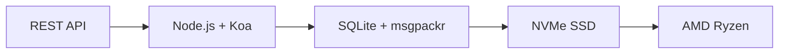

# Первый полноценный API электронной почты: как Forward Email произвел революцию в управлении электронной почтой {#the-first-complete-email-api-how-forward-email-revolutionized-email-management}


<p class="lead mt-3">
<strong>Кратко:</strong> Мы создали первый в мире полноценный REST API для управления электронной почтой с расширенными возможностями поиска, которых нет ни в одном другом сервисе. В то время как Gmail, Outlook и Apple заставляют разработчиков использовать IMAP-ад или API с ограниченной скоростью, Forward Email обеспечивает молниеносные CRUD-операции для сообщений, папок, контактов и календарей через унифицированный REST-интерфейс с более чем 15 параметрами поиска. Это именно тот API, которого ждали разработчики электронной почты.
</p>

## Содержание {#table-of-contents}

* [Проблема API электронной почты](#the-email-api-problem)
* [Что на самом деле говорят разработчики](#what-developers-are-actually-saying)
* [Революционное решение Forward Email](#forward-emails-revolutionary-solution)
  * [Почему мы это построили](#why-we-built-this)
  * [Простая аутентификация](#simple-authentication)
* [20 конечных точек, которые меняют всё](#20-endpoints-that-change-everything)
  * [Сообщения (5 конечных точек)](#messages-5-endpoints)
  * [Папки (5 конечных точек)](#folders-5-endpoints)
  * [Контакты (5 конечных точек)](#contacts-5-endpoints)
  * [Календари (5 конечных точек)](#calendars-5-endpoints)
* [Расширенный поиск: нет других сервисов, которые можно было бы сравнить](#advanced-search-no-other-service-compares)
  * [Ландшафт поискового API нарушен](#the-search-api-landscape-is-broken)
  * [Революционный поисковый API Forward Email](#forward-emails-revolutionary-search-api)
  * [Примеры реального поиска](#real-world-search-examples)
  * [Преимущества производительности](#performance-advantages)
  * [Функции поиска, которых нет ни у кого другого](#search-features-no-one-else-has)
  * [Почему это важно для разработчиков](#why-this-matters-for-developers)
  * [Техническая реализация](#the-technical-implementation)
* [Архитектура невероятно высокой производительности](#blazing-fast-performance-architecture)
  * [Показатели производительности](#performance-benchmarks)
  * [Архитектура, ориентированная на конфиденциальность](#privacy-first-architecture)
* [Почему мы разные: полное сравнение](#why-were-different-the-complete-comparison)
  * [Основные ограничения поставщика](#major-provider-limitations)
  * [Преимущества пересылки электронной почты](#forward-email-advantages)
  * [Проблема прозрачности открытого исходного кода](#the-open-source-transparency-problem)
* [Более 30 реальных примеров интеграции](#30-real-world-integration-examples)
  * [1. Улучшение контактной формы WordPress](#1-wordpress-contact-form-enhancement)
  * [2. Альтернатива Zapier для автоматизации электронной почты](#2-zapier-alternative-for-email-automation)
  * [3. Синхронизация электронной почты CRM](#3-crm-email-synchronization)
  * [4. Обработка заказов электронной коммерции](#4-e-commerce-order-processing)
  * [5. Интеграция тикетов поддержки](#5-support-ticket-integration)
  * [6. Система управления рассылкой новостей](#6-newsletter-management-system)
  * [7. Управление задачами с помощью электронной почты](#7-email-based-task-management)
  * [8. Агрегация электронной почты нескольких аккаунтов](#8-multi-account-email-aggregation)
  * [9. Панель расширенной аналитики электронной почты](#9-advanced-email-analytics-dashboard)
  * [10. Умное архивирование электронной почты](#10-smart-email-archiving)
  * [11. Интеграция электронной почты с календарем](#11-email-to-calendar-integration)
  * [12. Резервное копирование электронной почты и соответствие требованиям](#12-email-backup-and-compliance)
  * [13. Управление контентом на основе электронной почты](#13-email-based-content-management)
  * [14. Управление шаблонами электронной почты](#14-email-template-management)
  * [15. Автоматизация рабочих процессов на основе электронной почты](#15-email-based-workflow-automation)
  * [16. Мониторинг безопасности электронной почты](#16-email-security-monitoring)
  * [17. Сбор опросов по электронной почте](#17-email-based-survey-collection)
  * [18. Мониторинг эффективности электронной почты](#18-email-performance-monitoring)
  * [19. Квалификация лидов по электронной почте](#19-email-based-lead-qualification)
  * [20. Управление проектами с помощью электронной почты](#20-email-based-project-management)
  * [21. Управление запасами по электронной почте](#21-email-based-inventory-management)
  * [22. Обработка счетов по электронной почте](#22-email-based-invoice-processing)
  * [23. Регистрация на мероприятия по электронной почте](#23-email-based-event-registration)
  * [24. Рабочий процесс утверждения документов по электронной почте](#24-email-based-document-approval-workflow)
  * [25. Анализ отзывов клиентов по электронной почте](#25-email-based-customer-feedback-analysis)
  * [26. Канал рекрутинга по электронной почте](#26-email-based-recruitment-pipeline)
  * [27. Обработка отчетов о расходах по электронной почте](#27-email-based-expense-report-processing)
  * [28. Отчетность по контролю качества по электронной почте](#28-email-based-quality-assurance-reporting)
  * [29. Управление поставщиками по электронной почте](#29-email-based-vendor-management)
  * [30. Мониторинг социальных сетей на основе электронной почты](#30-email-based-social-media-monitoring)
* [Начиная](#getting-started)
  * [1. Создайте учетную запись электронной почты для пересылки](#1-create-your-forward-email-account)
  * [2. Сгенерируйте учетные данные API](#2-generate-api-credentials)
  * [3. Сделайте свой первый вызов API](#3-make-your-first-api-call)
  * [4. Изучите документацию](#4-explore-the-documentation)
* [Технические ресурсы](#technical-resources)

## Проблема API электронной почты {#the-email-api-problem}

API электронной почты в корне неисправны. Точка.

Каждый крупный поставщик услуг электронной почты ставит разработчиков перед одним из двух ужасных выборов:

1. **IMAP-ад**: борьба с 30-летним протоколом, разработанным для настольных клиентов, а не для современных приложений.
2. **Урезанные API**: API с ограниченной скоростью, доступными только для чтения и сложными OAuth-интерфейсами, которые не могут управлять вашими реальными данными электронной почты.

В результате разработчики либо полностью отказываются от интеграции с электронной почтой, либо тратят недели на создание хрупких IMAP-обёрток, которые постоянно выходят из строя.

> \[!WARNING]
> **Грязный секрет**: Большинство «почтовых API» — это просто API отправки. Программно организовывать папки, синхронизировать контакты или управлять календарями через простой REST-интерфейс было невозможно. До сих пор.

## Что на самом деле говорят разработчики {#what-developers-are-actually-saying}

Разочарование реально и задокументировано повсюду:

> «Недавно я пытался интегрировать Gmail в своё приложение, но потратил на это слишком много времени. Я решил, что поддержка Gmail не стоит того».

> *- [Разработчик Hacker News](https://news.ycombinator.com/item?id=42106944), 147 положительных отзывов*

> «Все ли API электронной почты посредственны? Они кажутся ограниченными или в чём-то сдерживающими».

> *- [Обсуждение r/SaaS на Reddit](https://www.reddit.com/r/SaaS/comments/1cm84s7/are_all_email_apis_mediocre/)*

> "Почему разработка электронной почты должна быть ужасной?"

> *- [Reddit r/webdev](https://www.reddit.com/r/webdev/comments/15trnp2/why_does_email_development_have_to_suck/), 89 комментариев о проблемах разработчиков*

> «Что делает API Gmail эффективнее IMAP? Ещё одна причина, по которой API Gmail гораздо эффективнее, заключается в том, что каждое сообщение нужно загрузить только один раз. При использовании IMAP каждое сообщение должно быть загружено и проиндексировано...»

> *- [Вопрос Stack Overflow](https://stackoverflow.com/questions/25431022/what-makes-the-gmail-api-more-efficient-than-imap) с 47 положительными отзывами*

Доказательства повсюду:

* **Проблемы с SMTP в WordPress**: [631 проблема GitHub](https://github.com/awesomemotive/WP-Mail-SMTP/issues) о сбоях доставки писем
* **Ограничения Zapier**: [Жалобы сообщества](https://community.zapier.com/featured-articles-65/email-parser-by-zapier-limitations-and-alternatives-16958) о лимите в 10 писем в час и сбоях обнаружения IMAP
* **Проекты API IMAP**: [Несколько](https://github.com/ewildgoose/imap-api), [с открытым исходным кодом](https://emailengine.app/) и [проекты](https://www.npmjs.com/package/imapflow) существуют специально для «конвертации IMAP в REST», поскольку ни один провайдер не предлагает такой возможности
* **Проблемы с API Gmail**: [Переполнение стека](https://stackoverflow.com/questions/tagged/gmail-api) содержит 4847 вопросов с тегом «gmail-api» с распространёнными жалобами на ограничения скорости и сложность.

## Революционное решение для пересылки электронной почты {#forward-emails-revolutionary-solution}

**Мы являемся первым сервисом электронной почты, предлагающим комплексные операции CRUD для всех данных электронной почты через унифицированный REST API.**

Это не просто ещё один API для отправки сообщений. Это полный программный контроль над:

* **Сообщения**: создание, чтение, обновление, удаление, поиск, перемещение, отметка
* **Папки**: полное управление папками IMAP через конечные точки REST
* **Контакты**: хранение и синхронизация контактов [CardDAV](https://tools.ietf.org/html/rfc6352)
* **Календари**: события и планирование календаря [CalDAV](https://tools.ietf.org/html/rfc4791)

### Почему мы построили это {#why-we-built-this}

**Проблема**: Каждый провайдер электронной почты относится к электронной почте как к чёрному ящику. Вы можете отправлять письма, возможно, читать их, используя сложную OAuth-аутентификацию, но вы не можете по-настоящему *управлять* данными электронной почты программно.

**Наше видение**: Электронная почта должна быть так же легко интегрируема, как любой современный API. Никаких библиотек IMAP. Никаких сложностей с OAuth. Никаких кошмаров с ограничениями скорости. Только простые рабочие конечные точки REST.

**Результат**: Первый сервис электронной почты, где вы можете создать полноценный почтовый клиент, интеграцию CRM или систему автоматизации, используя только HTTP-запросы.

### Простая аутентификация {#simple-authentication}

Нет [Сложность OAuth](https://oauth.net/2/). Нет [пароли для конкретных приложений](https://support.google.com/accounts/answer/185833). Только ваши учётные данные псевдонима:

```bash
curl -u "alias@yourdomain.com:password" \
  https://api.forwardemail.net/v1/messages
```

## 20 конечных точек, которые меняют все {#20-endpoints-that-change-everything}

### Сообщения (5 конечных точек) {#messages-5-endpoints}

* `GET /v1/messages` — Список сообщений с фильтрацией (`?folder=`, `?is_unread=`, `?is_flagged=`)
* `POST /v1/messages` — Отправка новых сообщений непосредственно в папки
* `GET /v1/messages/:id` — Получение конкретного сообщения с полными метаданными
* `PUT /v1/messages/:id` — Обновление сообщения (флаги, папка, статус прочтения)
* `DELETE /v1/messages/:id` — Удаление сообщения навсегда

### Папки (5 конечных точек) {#folders-5-endpoints}

* `GET /v1/folders` — Вывести список всех папок с подпиской
* `POST /v1/folders` — Создать новую папку с настраиваемыми свойствами
* `GET /v1/folders/:id` — Получить сведения о папке и количество сообщений
* `PUT /v1/folders/:id` — Обновить свойства папки и подписку
* `DELETE /v1/folders/:id` — Удалить папку и управлять перемещением сообщений

### Контакты (5 конечных точек) {#contacts-5-endpoints}

* `GET /v1/contacts` — Список контактов с поиском и пагинацией
* `POST /v1/contacts` — Создать новый контакт с полной поддержкой vCard
* `GET /v1/contacts/:id` — Извлечь контакт со всеми полями и метаданными
* `PUT /v1/contacts/:id` — Обновить информацию о контакте с проверкой ETag
* `DELETE /v1/contacts/:id` — Удалить контакт с каскадной обработкой

### Календари (5 конечных точек) {#calendars-5-endpoints}

* `GET /v1/calendars` — Список событий календаря с фильтрацией по дате
* `POST /v1/calendars` — Создать событие календаря с участниками и повторением
* `GET /v1/calendars/:id` — Получить информацию о событии с учетом часового пояса
* `PUT /v1/calendars/:id` — Обновить событие с обнаружением конфликтов
* `DELETE /v1/calendars/:id` — Удалить событие с уведомлениями участников

## Расширенный поиск: нет других сервисов, которые можно сравнить {#advanced-search-no-other-service-compares}

**Forward Email — единственный сервис электронной почты, который предлагает комплексный программный поиск по всем полям сообщений через REST API.**

В то время как другие провайдеры предлагают в лучшем случае базовую фильтрацию, мы создали самый продвинутый API поиска электронной почты из когда-либо созданных. Ни один API Gmail, API Outlook или какой-либо другой сервис не сравнится с нашими возможностями поиска.

### Ландшафт API поиска нарушен {#the-search-api-landscape-is-broken}

**Ограничения поиска API Gmail:**

* ✅ Только базовый параметр `q`
* ❌ Поиск по полям недоступен
* ❌ Фильтрация по диапазону дат недоступна
* ❌ Фильтрация по размеру недоступна
* ❌ Фильтрация по вложениям недоступна
* ❌ Ограничено синтаксисом поиска Gmail

**Ограничения поиска Outlook API:**

* ✅ Базовый параметр `$search`
* ❌ Нет расширенного таргетинга полей
* ❌ Нет сложных комбинаций запросов
* ❌ Агрессивное ограничение скорости
* ❌ Требуется сложный синтаксис OData

**Apple iCloud:**

* ❌ Никакого API
* ❌ Только поиск по IMAP (если получится заставить его работать)

**ProtonMail и Tuta:**

* ❌ Нет публичных API
* ❌ Нет возможностей программного поиска

### Революционный API поиска пересылки электронной почты {#forward-emails-revolutionary-search-api}

**Мы предлагаем более 15 параметров поиска, которых нет ни в одном другом сервисе:**

| Возможность поиска | Переслать электронное письмо | API Gmail | API Outlook | Другие |
| ------------------------------ | -------------------------------------- | ------------ | ------------------ | ------ |
| **Поиск по конкретному полю** | ✅ Тема, текст, от, кому, копия, заголовки | ❌ | ❌ | ❌ |
| **Общий поиск по нескольким полям** | ✅ `?search=` по всем полям | ✅ Базовый `q=` | ✅ Базовый `$search=` | ❌ |
| **Фильтрация по диапазону дат** | ✅ `?since=` & `?before=` | ❌ | ❌ | ❌ |
| **Фильтрация по размеру** | ✅ `?min_size=` & `?max_size=` | ❌ | ❌ | ❌ |
| **Фильтрация вложений** | ✅ `?has_attachments=true/false` | ❌ | ❌ | ❌ |
| **Поиск по заголовку** | ✅ `?headers=X-Priority` | ❌ | ❌ | ❌ |
| **Поиск идентификатора сообщения** | ✅ `?message_id=abc123` | ❌ | ❌ | ❌ |
| **Комбинированные фильтры** | ✅ Несколько параметров с логикой И | ❌ | ❌ | ❌ |
| **Без учета регистра** | ✅ Все поиски | ✅ | ✅ | ❌ |
| **Поддержка пагинации** | ✅ Работает со всеми параметрами поиска | ✅ | ✅ | ❌ |

### Примеры реального поиска {#real-world-search-examples}

**Найти все счета-фактуры за последний квартал:**

```bash
# Forward Email - Simple and powerful
GET /v1/messages?subject=invoice&since=2024-01-01T00:00:00Z&before=2024-04-01T00:00:00Z

# Gmail API - Impossible with their limited search
# No date range filtering available

# Outlook API - Complex OData syntax, limited functionality
GET /me/messages?$search="invoice"&$filter=receivedDateTime ge 2024-01-01T00:00:00Z
```

**Поиск больших вложений от определенного отправителя:**

```bash
# Forward Email - Comprehensive filtering
GET /v1/messages?from=finance@company.com&has_attachments=true&min_size=1000000

# Gmail API - Cannot filter by size or attachments programmatically
# Outlook API - No size filtering available
# Others - No APIs available
```

**Комплексный многополевой поиск:**

```bash
# Forward Email - Advanced query capabilities
GET /v1/messages?body=quarterly&from=manager&is_flagged=true&folder=Reports

# Gmail API - Limited to basic text search only
GET /gmail/v1/users/me/messages?q=quarterly

# Outlook API - Basic search without field targeting
GET /me/messages?$search="quarterly"
```

### Преимущества производительности {#performance-advantages}

**Эффективность поиска по пересылаемым электронным письмам:**

* ⚡ **Время отклика менее 100 мс** для сложных поисковых запросов
* 🔍 **Оптимизация регулярных выражений** с корректным индексированием
* 📊 **Параллельное выполнение запросов** для подсчёта и данных
* 💾 **Эффективное использование памяти** с небольшими запросами

**Проблемы с производительностью конкурентов:**

* 🐌 **API Gmail**: Ограничение скорости — 250 единиц квоты на пользователя в секунду
* 🐌 **API Outlook**: Агрессивное регулирование со сложными требованиями к отсрочке
* 🐌 **Другие**: Нет API для сравнения

### Функции поиска, которых нет ни у кого другого {#search-features-no-one-else-has}

#### 1. Поиск по заголовку {#1-header-specific-search}

```bash
# Find messages with specific headers
GET /v1/messages?headers=X-Priority:1
GET /v1/messages?headers=X-Spam-Score
```

#### 2. Интеллект, основанный на размере {#2-size-based-intelligence}

```bash
# Find newsletter emails (typically large)
GET /v1/messages?min_size=50000&from=newsletter

# Find quick replies (typically small)
GET /v1/messages?max_size=1000&to=support
```

#### 3. Рабочие процессы на основе вложений {#3-attachment-based-workflows}

```bash
# Find all documents sent to legal team
GET /v1/messages?to=legal&has_attachments=true&body=contract

# Find emails without attachments for cleanup
GET /v1/messages?has_attachments=false&before=2023-01-01T00:00:00Z
```

#### 4. Комбинированная бизнес-логика {#4-combined-business-logic}

```bash
# Find urgent flagged messages from VIPs with attachments
GET /v1/messages?is_flagged=true&from=ceo&has_attachments=true&subject=urgent
```

### Почему это важно для разработчиков {#why-this-matters-for-developers}

**Создавайте приложения, которые раньше было невозможно:**

1. **Расширенная аналитика электронной почты**: Анализ шаблонов электронных писем по размеру, отправителю и содержанию.
2. **Интеллектуальное управление электронной почтой**: Автоматическая организация на основе сложных критериев.
3. **Соответствие требованиям и обнаружение**: Поиск писем, соответствующих юридическим требованиям.
4. **Бизнес-аналитика**: Извлечение информации из шаблонов электронных писем.
5. **Автоматизированные рабочие процессы**: Активация действий на основе сложных фильтров электронной почты.

### Техническая реализация {#the-technical-implementation}

Наш поисковый API использует:

* **Оптимизация регулярных выражений** с правильными стратегиями индексации
* **Параллельное выполнение** для повышения производительности
* **Проверка входных данных** для повышения безопасности
* **Комплексная обработка ошибок** для повышения надежности

```javascript
// Example: Complex search implementation
const searchConditions = [];

if (ctx.query.subject) {
  searchConditions.push({
    subject: { $regex: ctx.query.subject, $options: 'i' }
  });
}

if (ctx.query.from) {
  searchConditions.push({
    $or: [
      { 'from.address': { $regex: ctx.query.from, $options: 'i' } },
      { 'from.name': { $regex: ctx.query.from, $options: 'i' } }
    ]
  });
}

// Combine with AND logic
if (searchConditions.length > 0) {
  query.$and = searchConditions;
}
```

> \[!TIP]
> **Преимущество для разработчиков**: с помощью API поиска Forward Email вы можете создавать почтовые приложения, которые по функциональности не уступают настольным клиентам, сохраняя при этом простоту REST API.

## Архитектура невероятно высокой производительности {#blazing-fast-performance-architecture}

Наш технический стек создан для скорости и надежности:



### Тесты производительности {#performance-benchmarks}

**Почему мы молниеносны:**

| Компонент | Технология | Преимущество в производительности |
| ------------ | --------------------------------------------------------------------------------- | --------------------------------------------- |
| **Хранилище** | [NVMe SSD](https://en.wikipedia.org/wiki/NVM_Express) | В 10 раз быстрее традиционного SATA |
| **База данных** | [SQLite](https://sqlite.org/) + [msgpackr](https://github.com/kriszyp/msgpackr) | Нулевая задержка в сети, оптимизированная сериализация |
| **Аппаратное обеспечение** | [AMD Ryzen](https://www.amd.com/en/products/processors/desktops/ryzen) голый металл | Никаких накладных расходов на виртуализацию |
| **Кэширование** | В памяти + постоянный | Время отклика менее миллисекунды |
| **Резервные копии** | [Cloudflare R2](https://www.cloudflare.com/products/r2/) зашифровано | Надежность корпоративного уровня |

**Реальные цифры производительности:**

* **Время отклика API**: в среднем < 50 мс
* **Извлечение сообщений**: < 10 мс для кэшированных сообщений
* **Операции с папками**: < 5 мс для операций с метаданными
* **Синхронизация контактов**: более 1000 контактов в секунду
* **Время безотказной работы**: 99,99% SLA с резервной инфраструктурой

### Архитектура, ориентированная на конфиденциальность {#privacy-first-architecture}

**Конструкция с нулевым разглашением**: доступ есть только у вас по паролю IMAP — мы не можем читать ваши письма. [архитектура с нулевым разглашением](https://forwardemail.net/en/security) обеспечивает полную конфиденциальность и высочайшую производительность.

## Почему мы разные: полное сравнение {#why-were-different-the-complete-comparison}

### Основные ограничения поставщика {#major-provider-limitations}

| Поставщик | Основные проблемы | Конкретные ограничения |
| ---------------- | ----------------------------------------- | -------------------------------------------------------------------------------------------------------------------------------------------------------------------------------------------------------------------------------------------------------------------------------------------------------------------------------------------------------------------------------------------------------------------------------------------------------------------- |
| **API Gmail** | Только для чтения, сложный OAuth, отдельные API | • [Cannot modify existing messages](https://developers.google.com/gmail/api/reference/rest/v1/users.messages)<br>• [Labels ≠ folders](https://developers.google.com/gmail/api/reference/rest/v1/users.labels)<br>• [1 billion quota units/day limit](https://developers.google.com/gmail/api/reference/quota)<br>• [Requires separate APIs](https://developers.google.com/workspace) для контактов/календаря |
| **API Outlook** | Устаревший, запутанный, ориентированный на корпоративный сектор | • [REST endpoints deprecated March 2024](https://learn.microsoft.com/en-us/outlook/rest/compare-graph)<br>• [Multiple confusing APIs](https://learn.microsoft.com/en-us/office/client-developer/outlook/selecting-an-api-or-technology-for-developing-solutions-for-outlook) (EWS, Graph, REST)<br>• [Microsoft Graph complexity](https://learn.microsoft.com/en-us/graph/overview)<br>• [Aggressive throttling](https://learn.microsoft.com/en-us/graph/throttling) |
| **Apple iCloud** | Нет публичного API | • [No public API whatsoever](https://support.apple.com/en-us/102654)<br>• [IMAP-only with 1000 emails/day limit](https://support.apple.com/en-us/102654)<br>• [App-specific passwords required](https://support.apple.com/en-us/102654)<br>• [500 recipients per message limit](https://support.apple.com/en-us/102654) |
| **ProtonMail** | Отсутствие API, ложные заявления об открытом исходном коде | • [No public API available](https://proton.me/support/protonmail-bridge-clients)<br>• [Bridge software required](https://proton.me/mail/bridge) для доступа IMAP<br>• [Claims "open source"](https://proton.me/blog/open-source), но [server code is proprietary](https://github.com/ProtonMail)<br>• [Limited to paid plans only](https://proton.me/pricing) |
| **Общий** | Отсутствие API, вводящая в заблуждение прозрачность | • [No REST API for email management](https://tuta.com/support#technical)<br>• [Claims "open source"](https://tuta.com/blog/posts/open-source-email), но [backend is closed](https://github.com/tutao/tutanota)<br>• [IMAP/SMTP not supported](https://tuta.com/support#imap)<br>• [Proprietary encryption](https://tuta.com/encryption) препятствует стандартной интеграции |
| **Электронная почта Zapier** | Строгие ограничения скорости | • [10 emails per hour limit](https://help.zapier.com/hc/en-us/articles/8496181555597-Email-Parser-by-Zapier-limitations-and-alternatives)<br>• [No IMAP folder access](https://help.zapier.com/hc/en-us/articles/8496181555597-Email-Parser-by-Zapier-limitations-and-alternatives)<br>• [Limited parsing capabilities](https://help.zapier.com/hc/en-us/articles/8496181555597-Email-Parser-by-Zapier-limitations-and-alternatives) |

### Преимущества пересылки электронной почты {#forward-email-advantages}

| Особенность | Переслать электронное письмо | Соревнование |
| ------------------ | -------------------------------------------------------------------------------------------- | ----------------------------------------- |
| **Полный CRUD** | ✅ Полное создание, чтение, обновление, удаление всех данных | ❌ Только для чтения или ограниченные операции |
| **Единый API** | ✅ Сообщения, папки, контакты, календари в одном API | ❌ Отдельные API или отсутствующие функции |
| **Простая аутентификация** | ✅ Базовая аутентификация с использованием псевдонима | ❌ Сложный OAuth с несколькими областями действия |
| **Без ограничений по ставкам** | ✅ Щедрые лимиты, разработанные для реальных приложений | ❌ Ограничительные квоты, которые нарушают рабочие процессы |
| **Самостоятельное размещение** | ✅ [Complete self-hosting option](https://forwardemail.net/en/blog/docs/self-hosted-solution) | ❌ Только привязка к поставщику |
| **Конфиденциальность** | ✅ Нулевое разглашение, шифрование, конфиденциальность | ❌ Проблемы интеллектуального анализа данных и конфиденциальности |
| **Производительность** | ✅ Время отклика менее 50 мс, хранилище NVMe | ❌ Задержка сети, задержки регулирования |

### Проблема прозрачности с открытым исходным кодом {#the-open-source-transparency-problem}

**ProtonMail и Tuta позиционируют себя как «с открытым исходным кодом» и «прозрачные», но это вводящий в заблуждение маркетинг, нарушающий современные принципы конфиденциальности.**

> \[!WARNING]
> **Ложные заявления о прозрачности**: И ProtonMail, и Tuta открыто рекламируют свою «открытую» авторизацию, при этом сохраняя свой наиболее важный серверный код проприетарным и закрытым.

**Обман ProtonMail:**

* **Заявления**: [«Мы — с открытым исходным кодом»](https://proton.me/blog/open-source) занимает видное место в маркетинге
* **Реальность**: [Код сервера полностью проприетарный](https://github.com/ProtonMail) — только клиентские приложения имеют открытый исходный код
* **Влияние**: Пользователи не могут проверить серверное шифрование, обработку данных или заявления о конфиденциальности
* **Нарушение прозрачности**: Отсутствие возможности аудита систем обработки и хранения электронной почты

**Вводящий в заблуждение маркетинг Туты:**

* **Заявления**: [«Электронная почта с открытым исходным кодом»](https://tuta.com/blog/posts/open-source-email) как основной аргумент
* **Реальность**: [Внутренняя инфраструктура имеет закрытый исходный код.](https://github.com/tutao/tutanota) — доступен только фронтенд
* **Влияние**: Проприетарное шифрование блокирует стандартные протоколы электронной почты (IMAP/SMTP)
* **Стратегия блокировки**: Пользовательское шифрование приводит к зависимости от поставщика

**Почему это важно для современной конфиденциальности:**

В 2025 году настоящая конфиденциальность требует **полной прозрачности**. Когда почтовые провайдеры заявляют об «открытом исходном коде», но скрывают код своего сервера:

1. **Непроверяемое шифрование**: Вы не можете проверить, как именно шифруются ваши данные.
2. **Скрытые методы обработки данных**: Обработка данных на стороне сервера остаётся «чёрным ящиком».
3. **Безопасность, основанная на доверии**: Вы должны доверять заявлениям поставщиков без проверки.
4. **Привязка к поставщику**: Проприетарные системы препятствуют переносимости данных.

**Настоящая прозрачность пересылки электронных писем:**

* ✅ **[Полностью открытый исходный код](https://github.com/forwardemail/forwardemail.net)** — серверный и клиентский код
* ✅ **[Доступен самостоятельный хостинг](https://forwardemail.net/en/blog/docs/self-hosted-solution)** — запуск собственного экземпляра
* ✅ **Стандартные протоколы** — совместимость с IMAP, SMTP, CardDAV, CalDAV
* ✅ **Проверяемая безопасность** — каждая строка кода может быть проверена
* ✅ **Нет привязки к поставщику** — ваши данные, ваш контроль

> \[!TIP]
> **Настоящий открытый исходный код означает, что вы можете проверить каждое утверждение.** С помощью Forward Email вы можете проверить наше шифрование, проверить обработку данных и даже запустить собственный экземпляр. Это настоящая прозрачность.

## Более 30 реальных примеров интеграции {#30-real-world-integration-examples}

### 1. Улучшение контактной формы WordPress {#1-wordpress-contact-form-enhancement}

**Проблема**: [Ошибки конфигурации SMTP WordPress](https://github.com/awesomemotive/WP-Mail-SMTP/issues) ([631 проблема GitHub](https://github.com/awesomemotive/WP-Mail-SMTP/issues))
**Решение**: Прямая интеграция API полностью обходит [SMTP](https://tools.ietf.org/html/rfc5321)

```javascript
// WordPress contact form that saves to Sent folder
await fetch('https://api.forwardemail.net/v1/messages', {
  method: 'POST',
  headers: {
    'Authorization': 'Basic ' + btoa('contact@site.com:password'),
    'Content-Type': 'application/json'
  },
  body: JSON.stringify({
    to: [{ address: 'owner@site.com' }],
    subject: 'Contact Form: ' + formData.subject,
    text: formData.message,
    folder: 'Sent'
  })
});
```

### 2. Альтернатива Zapier для автоматизации электронной почты {#2-zapier-alternative-for-email-automation}

**Проблема**: [Лимит Zapier — 10 писем в час](https://help.zapier.com/hc/en-us/articles/8496181555597-Email-Parser-by-Zapier-limitations-and-alternatives) и [Ошибки обнаружения IMAP](https://community.zapier.com/featured-articles-65/email-parser-by-zapier-limitations-and-alternatives-16958)
**Решение**: Неограниченная автоматизация с полным контролем электронной почты

```javascript
// Auto-organize emails by sender domain
const messages = await fetch('/v1/messages?folder=INBOX');
for (const message of messages) {
  const domain = message.from.split('@')[1];
  await fetch(`/v1/messages/${message.id}`, {
    method: 'PUT',
    body: JSON.stringify({ folder: `Clients/${domain}` })
  });
}
```

### 3. Синхронизация электронной почты CRM {#3-crm-email-synchronization}

**Проблема**: Ручное управление контактами между электронной почтой и [CRM-системы](https://en.wikipedia.org/wiki/Customer_relationship_management)
**Решение**: Двусторонняя синхронизация с API контактов [CardDAV](https://tools.ietf.org/html/rfc6352)

```javascript
// Sync new email contacts to CRM
const newContacts = await fetch('/v1/contacts');
for (const contact of newContacts) {
  await crmAPI.createContact({
    name: contact.name,
    email: contact.email,
    source: 'email_api'
  });
}
```

### 4. Обработка заказов электронной коммерции {#4-e-commerce-order-processing}

**Проблема**: Ручная обработка электронных писем с заказами для [платформы электронной коммерции](https://en.wikipedia.org/wiki/E-commerce)
**Решение**: Автоматизированная система управления заказами

```javascript
// Process order confirmation emails
const orders = await fetch('/v1/messages?folder=Orders');
const orderEmails = orders.filter(msg =>
  msg.subject.includes('Order Confirmation')
);

for (const order of orderEmails) {
  const orderData = parseOrderEmail(order.text);
  await updateInventory(orderData);
  await fetch(`/v1/messages/${order.id}`, {
    method: 'PUT',
    body: JSON.stringify({ folder: 'Orders/Processed' })
  });
}
```

### 5. Интеграция тикетов поддержки {#5-support-ticket-integration}

**Проблема**: цепочки писем разбросаны по [платформы службы поддержки](https://en.wikipedia.org/wiki/Help_desk_software)
**Решение**: Полное отслеживание цепочек писем

```javascript
// Create support ticket from email thread
const messages = await fetch('/v1/messages?folder=Support');
const supportEmails = messages.filter(msg =>
  msg.to.some(addr => addr.includes('support@'))
);

for (const email of supportEmails) {
  const ticket = await supportSystem.createTicket({
    subject: email.subject,
    from: email.from,
    body: email.text,
    timestamp: email.date
  });
}
```

### 6. Система управления рассылками {#6-newsletter-management-system}

**Проблема**: Ограниченная интеграция [платформа для новостных рассылок](https://en.wikipedia.org/wiki/Email_marketing)
**Решение**: Полное управление жизненным циклом подписчика

```javascript
// Auto-manage newsletter subscriptions
const messages = await fetch('/v1/messages?folder=Newsletter');
const unsubscribes = messages.filter(msg =>
  msg.subject.toLowerCase().includes('unsubscribe')
);

for (const msg of unsubscribes) {
  await removeSubscriber(msg.from);
  await fetch(`/v1/messages/${msg.id}`, {
    method: 'PUT',
    body: JSON.stringify({ folder: 'Newsletter/Unsubscribed' })
  });
}
```

### 7. Управление задачами на основе электронной почты {#7-email-based-task-management}

**Проблема**: Переполнение почтового ящика и [отслеживание задач](https://en.wikipedia.org/wiki/Task_management)
**Решение**: Преобразуйте электронные письма в задачи, которые можно выполнить

```javascript
// Create tasks from flagged emails
const messages = await fetch('/v1/messages?is_flagged=true');
for (const email of messages) {
  await taskManager.createTask({
    title: email.subject,
    description: email.text,
    assignee: email.to[0].address,
    dueDate: extractDueDate(email.text)
  });
}
```

### 8. Агрегация электронной почты нескольких учетных записей {#8-multi-account-email-aggregation}

**Проблема**: Управление [несколько учетных записей электронной почты](https://en.wikipedia.org/wiki/Email_client) у разных провайдеров
**Решение**: Единый интерфейс почтового ящика

```javascript
// Aggregate emails from multiple accounts
const accounts = ['work@domain.com', 'personal@domain.com'];
const allMessages = [];

for (const account of accounts) {
  const messages = await fetch('/v1/messages', {
    headers: { 'Authorization': getAuth(account) }
  });
  allMessages.push(...messages.map(m => ({ ...m, account })));
}
```

### 9. Панель расширенной аналитики электронной почты {#9-advanced-email-analytics-dashboard}

**Проблема**: Нет данных о [шаблоны электронной почты](https://en.wikipedia.org/wiki/Email_analytics) при сложной фильтрации.
**Решение**: Индивидуальная аналитика электронной почты с использованием расширенных возможностей поиска.

```javascript
// Generate comprehensive email analytics using advanced search
const analytics = {};

// Analyze email volume by sender domain
const messages = await fetch('/v1/messages');
analytics.senderDomains = analyzeSenderDomains(messages);

// Find large attachments consuming storage
const largeAttachments = await fetch('/v1/messages?has_attachments=true&min_size=1000000');
analytics.storageHogs = largeAttachments.map(msg => ({
  subject: msg.subject,
  from: msg.from,
  size: msg.size
}));

// Analyze communication patterns with VIPs
const vipEmails = await fetch('/v1/messages?from=ceo@company.com');
const urgentVipEmails = await fetch('/v1/messages?from=ceo@company.com&subject=urgent');
analytics.vipCommunication = {
  total: vipEmails.length,
  urgent: urgentVipEmails.length,
  urgencyRate: (urgentVipEmails.length / vipEmails.length) * 100
};

// Find unread emails by date range for follow-up
const lastWeek = new Date(Date.now() - 7 * 24 * 60 * 60 * 1000).toISOString();
const unreadRecent = await fetch(`/v1/messages?is_unread=true&since=${lastWeek}`);
analytics.followUpNeeded = unreadRecent.length;

// Analyze email sizes for optimization
const smallEmails = await fetch('/v1/messages?max_size=1000');
const mediumEmails = await fetch('/v1/messages?min_size=1000&max_size=50000');
const largeEmails = await fetch('/v1/messages?min_size=50000');
analytics.sizeDistribution = {
  small: smallEmails.length,
  medium: mediumEmails.length,
  large: largeEmails.length
};

// Search for compliance-related emails
const complianceEmails = await fetch('/v1/messages?body=confidential&has_attachments=true');
analytics.complianceReview = complianceEmails.length;
```

### 10. Умное архивирование электронной почты {#10-smart-email-archiving}

**Проблема**: Ручной [организация электронной почты](https://en.wikipedia.org/wiki/Email_management)
**Решение**: Интеллектуальная категоризация писем

```javascript
// Auto-archive old emails by category
const messages = await fetch('/v1/messages');
const oldEmails = messages.filter(email =>
  isOlderThan(email.date, 90) // 90 days
);

for (const email of oldEmails) {
  const category = categorizeEmail(email);
  await fetch(`/v1/messages/${email.id}`, {
    method: 'PUT',
    body: JSON.stringify({ folder: `Archive/${category}` })
  });
}
```

### 11. Интеграция электронной почты с календарем {#11-email-to-calendar-integration}

**Проблема**: Ручное создание [календарное событие](https://tools.ietf.org/html/rfc4791) из писем
**Решение**: Автоматическое извлечение и создание событий

```javascript
// Extract meeting details from emails
const messages = await fetch('/v1/messages?folder=Meetings');
const meetingEmails = messages.filter(email =>
  email.subject.toLowerCase().includes('meeting')
);

for (const email of meetingEmails) {
  const meetingData = extractMeetingInfo(email.text);
  if (meetingData.date && meetingData.time) {
    await fetch('/v1/calendars', {
      method: 'POST',
      body: JSON.stringify({
        title: email.subject,
        start: meetingData.datetime,
        attendees: [email.from, ...email.to]
      })
    });
  }
}
```

### 12. Резервное копирование электронной почты и соответствие требованиям {#12-email-backup-and-compliance}

**Проблема**: [Хранение электронной почты](https://en.wikipedia.org/wiki/Email_retention_policy) и требования соответствия
**Решение**: Автоматизированное резервное копирование с сохранением метаданных

```javascript
// Backup emails with full metadata
const allMessages = await fetch('/v1/messages');
const backup = {
  timestamp: new Date(),
  messages: allMessages.map(msg => ({
    id: msg.id,
    subject: msg.subject,
    from: msg.from,
    to: msg.to,
    date: msg.date,
    flags: msg.flags
  }))
};
await saveToComplianceStorage(backup);
```

### 13. Управление контентом на основе электронной почты {#13-email-based-content-management}

**Проблема**: Управление отправкой контента по электронной почте для [CMS-платформы](https://en.wikipedia.org/wiki/Content_management_system)
**Решение**: Электронная почта как система управления контентом

```javascript
// Process content submissions from email
const messages = await fetch('/v1/messages?folder=Submissions');
const submissions = messages.filter(msg =>
  msg.to.some(addr => addr.includes('submit@'))
);

for (const submission of submissions) {
  const content = parseSubmission(submission.text);
  await cms.createDraft({
    title: submission.subject,
    content: content.body,
    author: submission.from
  });
}
```

### 14. Управление шаблонами электронной почты {#14-email-template-management}

**Проблема**: Несогласованность [шаблоны электронной почты](https://en.wikipedia.org/wiki/Email_template) в команде
**Решение**: Централизованная система шаблонов с API

```javascript
// Send templated emails with dynamic content
const template = await getEmailTemplate('welcome');
await fetch('/v1/messages', {
  method: 'POST',
  body: JSON.stringify({
    to: [{ address: newUser.email }],
    subject: template.subject.replace('{{name}}', newUser.name),
    html: template.html.replace('{{name}}', newUser.name),
    folder: 'Sent'
  })
});
```

### 15. Автоматизация рабочих процессов на основе электронной почты {#15-email-based-workflow-automation}

**Проблема**: Ручное добавление [процессы утверждения](https://en.wikipedia.org/wiki/Workflow) по электронной почте
**Решение**: Автоматизированные триггеры рабочего процесса

```javascript
// Process approval emails
const messages = await fetch('/v1/messages?folder=Approvals');
const approvals = messages.filter(msg =>
  msg.subject.includes('APPROVAL')
);

for (const approval of approvals) {
  const decision = parseApprovalDecision(approval.text);
  await workflow.processApproval({
    requestId: extractRequestId(approval.subject),
    decision: decision,
    approver: approval.from
  });
}
```

### 16. Мониторинг безопасности электронной почты {#16-email-security-monitoring}

**Проблема**: Ручной [обнаружение угроз безопасности](https://en.wikipedia.org/wiki/Email_security)
**Решение**: Автоматизированный анализ угроз

```javascript
// Monitor for suspicious emails
const recentEmails = await fetch('/v1/messages');
for (const email of recentEmails) {
  const threatScore = analyzeThreat(email);
  if (threatScore > 0.8) {
    await fetch(`/v1/messages/${email.id}`, {
      method: 'PUT',
      body: JSON.stringify({ folder: 'Security/Quarantine' })
    });
    await alertSecurityTeam(email);
  }
}
```

### 17. Сбор опросов по электронной почте {#17-email-based-survey-collection}

**Проблема**: Ручная обработка [ответ на опрос](https://en.wikipedia.org/wiki/Survey_methodology)
**Решение**: Автоматическая агрегация ответов

```javascript
// Collect and process survey responses
const messages = await fetch('/v1/messages?folder=Surveys');
const responses = messages.filter(msg =>
  msg.subject.includes('Survey Response')
);

const surveyData = responses.map(email => ({
  respondent: email.from,
  responses: parseSurveyData(email.text),
  timestamp: email.date
}));
await updateSurveyResults(surveyData);
```

### 18. Мониторинг производительности электронной почты {#18-email-performance-monitoring}

**Проблема**: Отсутствует видимость [производительность доставки электронной почты](https://en.wikipedia.org/wiki/Email_deliverability)
**Решение**: Метрики электронной почты в режиме реального времени

```javascript
// Monitor email delivery performance
const sentEmails = await fetch('/v1/messages?folder=Sent');
const deliveryStats = {
  sent: sentEmails.length,
  bounces: await countBounces(),
  deliveryRate: calculateDeliveryRate()
};
await updateDashboard(deliveryStats);
```

### 19. Квалификация лидов по электронной почте {#19-email-based-lead-qualification}

**Проблема**: Ручное добавление [подсчет очков](https://en.wikipedia.org/wiki/Lead_scoring) из электронных писем
**Решение**: Автоматизированная воронка квалификации лидов

```javascript
// Score leads based on email engagement
const prospects = await fetch('/v1/contacts');
for (const prospect of prospects) {
  const messages = await fetch('/v1/messages');
  const emails = messages.filter(msg =>
    msg.from.includes(prospect.email)
  );
  const score = calculateEngagementScore(emails);
  await crm.updateLeadScore(prospect.id, score);
}
```

### 20. Управление проектами на основе электронной почты {#20-email-based-project-management}

**Проблема**: [Обновления проекта](https://en.wikipedia.org/wiki/Project_management) разбросан по цепочкам писем
**Решение**: Централизованный коммуникационный центр проекта

```javascript
// Extract project updates from emails
const messages = await fetch('/v1/messages?folder=Projects');
const projectEmails = messages.filter(msg =>
  msg.subject.includes('Project Update')
);

for (const email of projectEmails) {
  const update = parseProjectUpdate(email.text);
  await projectManager.addUpdate({
    project: update.projectId,
    author: email.from,
    content: update.content
  });
}
```

### 21. Управление запасами по электронной почте {#21-email-based-inventory-management}

**Проблема**: Обновление запасов вручную из электронных писем поставщиков.
**Решение**: Автоматическое отслеживание запасов с помощью уведомлений по электронной почте.

```javascript
// Process inventory updates from supplier emails
const messages = await fetch('/v1/messages?folder=Suppliers');
const inventoryEmails = messages.filter(msg =>
  msg.subject.includes('Inventory Update') || msg.subject.includes('Stock Alert')
);

for (const email of inventoryEmails) {
  const inventoryData = parseInventoryUpdate(email.text);
  await inventory.updateStock({
    sku: inventoryData.sku,
    quantity: inventoryData.quantity,
    supplier: email.from,
    timestamp: email.date
  });

  // Move to processed folder
  await fetch(`/v1/messages/${email.id}`, {
    method: 'PUT',
    body: JSON.stringify({ folder: 'Suppliers/Processed' })
  });
}
```

### 22. Обработка счетов по электронной почте {#22-email-based-invoice-processing}

**Проблема**: Ручное добавление [обработка счетов](https://en.wikipedia.org/wiki/Invoice_processing) и интеграция с бухгалтерским учетом
**Решение**: Автоматизированное извлечение счетов и синхронизация с бухгалтерской системой

```javascript
// Extract invoice data from email attachments
const messages = await fetch('/v1/messages?folder=Invoices');
const invoiceEmails = messages.filter(msg =>
  msg.subject.toLowerCase().includes('invoice') && msg.attachments.length > 0
);

for (const email of invoiceEmails) {
  const invoiceData = await extractInvoiceData(email.attachments[0]);
  await accounting.createInvoice({
    vendor: email.from,
    amount: invoiceData.total,
    dueDate: invoiceData.dueDate,
    items: invoiceData.lineItems
  });

  // Flag as processed
  await fetch(`/v1/messages/${email.id}`, {
    method: 'PUT',
    body: JSON.stringify({ flags: ['\\Seen', '\\Flagged'] })
  });
}
```

### 23. Регистрация на события по электронной почте {#23-email-based-event-registration}

**Проблема**: Ручная обработка [регистрация на мероприятие](https://en.wikipedia.org/wiki/Event_management) из ответов по электронной почте
**Решение**: Автоматизированное управление участниками и интеграция с календарем

```javascript
// Process event registration emails
const messages = await fetch('/v1/messages?folder=Events');
const registrations = messages.filter(msg =>
  msg.subject.includes('Registration') || msg.subject.includes('RSVP')
);

for (const registration of registrations) {
  const attendeeData = parseRegistration(registration.text);

  // Add to attendee list
  await events.addAttendee({
    event: attendeeData.eventId,
    name: attendeeData.name,
    email: registration.from,
    dietary: attendeeData.dietaryRestrictions
  });

  // Create calendar event for attendee
  await fetch('/v1/calendars', {
    method: 'POST',
    body: JSON.stringify({
      title: attendeeData.eventName,
      start: attendeeData.eventDate,
      attendees: [registration.from]
    })
  });
}
```

### 24. Рабочий процесс утверждения документов по электронной почте {#24-email-based-document-approval-workflow}

**Проблема**: Сложные цепочки [утверждение документа](https://en.wikipedia.org/wiki/Document_management_system) по электронной почте
**Решение**: Автоматизированное отслеживание утверждений и управление версиями документов

```javascript
// Track document approval workflow
const messages = await fetch('/v1/messages?folder=Approvals');
const approvalEmails = messages.filter(msg =>
  msg.subject.includes('Document Approval')
);

for (const email of approvalEmails) {
  const approval = parseApprovalEmail(email.text);

  await documentSystem.updateApproval({
    documentId: approval.documentId,
    approver: email.from,
    status: approval.decision, // 'approved', 'rejected', 'needs_changes'
    comments: approval.comments,
    timestamp: email.date
  });

  // Check if all approvals complete
  const document = await documentSystem.getDocument(approval.documentId);
  if (document.allApprovalsComplete) {
    await documentSystem.finalizeDocument(approval.documentId);
  }
}
```

### 25. Анализ отзывов клиентов по электронной почте {#25-email-based-customer-feedback-analysis}

**Проблема**: Ручной сбор [отзывы клиентов](https://en.wikipedia.org/wiki/Customer_feedback) и анализ тональности
**Решение**: Автоматизированная обработка отзывов и отслеживание тональности

```javascript
// Analyze customer feedback from emails
const messages = await fetch('/v1/messages?folder=Feedback');
const feedbackEmails = messages.filter(msg =>
  msg.to.some(addr => addr.includes('feedback@'))
);

for (const email of feedbackEmails) {
  const sentiment = await analyzeSentiment(email.text);
  const category = categorizeFeeback(email.text);

  await feedback.recordFeedback({
    customer: email.from,
    content: email.text,
    sentiment: sentiment.score, // -1 to 1
    category: category, // 'bug', 'feature', 'complaint', 'praise'
    priority: calculatePriority(sentiment, category),
    timestamp: email.date
  });

  // Auto-escalate negative feedback
  if (sentiment.score < -0.5) {
    await escalateToSupport(email);
  }
}
```

### 26. Канал рекрутинга по электронной почте {#26-email-based-recruitment-pipeline}

**Проблема**: Ручное управление [набор персонала](https://en.wikipedia.org/wiki/Recruitment) и отслеживание кандидатов
**Решение**: Автоматизированное управление кандидатами и планирование собеседований

```javascript
// Process job application emails
const messages = await fetch('/v1/messages?folder=Careers');
const applications = messages.filter(msg =>
  msg.subject.toLowerCase().includes('application') && msg.attachments.length > 0
);

for (const application of applications) {
  const resume = await parseResume(application.attachments[0]);

  const candidate = await ats.createCandidate({
    name: resume.name,
    email: application.from,
    skills: resume.skills,
    experience: resume.experience,
    position: extractPosition(application.subject)
  });

  // Auto-schedule screening if qualified
  if (candidate.qualificationScore > 0.7) {
    await calendar.scheduleInterview({
      candidateId: candidate.id,
      type: 'phone_screening',
      duration: 30
    });
  }
}
```

### 27. Обработка отчетов о расходах по электронной почте {#27-email-based-expense-report-processing}

**Проблема**: Ручная отправка и утверждение [отчет о расходах](https://en.wikipedia.org/wiki/Expense_report)
**Решение**: Автоматизированный процесс извлечения и утверждения расходов

```javascript
// Process expense report emails
const messages = await fetch('/v1/messages?folder=Expenses');
const expenseEmails = messages.filter(msg =>
  msg.subject.includes('Expense') && msg.attachments.length > 0
);

for (const email of expenseEmails) {
  const receipts = await processReceipts(email.attachments);

  const expenseReport = await expenses.createReport({
    employee: email.from,
    expenses: receipts.map(receipt => ({
      amount: receipt.total,
      category: receipt.category,
      date: receipt.date,
      merchant: receipt.merchant
    })),
    totalAmount: receipts.reduce((sum, r) => sum + r.total, 0)
  });

  // Auto-approve small amounts
  if (expenseReport.totalAmount < 100) {
    await expenses.approve(expenseReport.id);
  } else {
    await expenses.sendForApproval(expenseReport.id);
  }
}
```

### 28. Отчетность по контролю качества по электронной почте {#28-email-based-quality-assurance-reporting}

**Проблема**: Ручное отслеживание проблем [гарантия качества](https://en.wikipedia.org/wiki/Quality_assurance)
**Решение**: Автоматизированное управление проблемами контроля качества и отслеживание ошибок

```javascript
// Process QA bug reports from email
const messages = await fetch('/v1/messages?folder=QA');
const bugReports = messages.filter(msg =>
  msg.subject.includes('Bug Report') || msg.subject.includes('QA Issue')
);

for (const report of bugReports) {
  const bugData = parseBugReport(report.text);

  const ticket = await bugTracker.createIssue({
    title: report.subject,
    description: bugData.description,
    severity: bugData.severity,
    steps: bugData.stepsToReproduce,
    reporter: report.from,
    attachments: report.attachments
  });

  // Auto-assign based on component
  const assignee = await getComponentOwner(bugData.component);
  await bugTracker.assign(ticket.id, assignee);

  // Create calendar reminder for follow-up
  await fetch('/v1/calendars', {
    method: 'POST',
    body: JSON.stringify({
      title: `Follow up on ${ticket.id}`,
      start: addDays(new Date(), 3),
      attendees: [assignee]
    })
  });
}
```

### 29. Управление поставщиками по электронной почте {#29-email-based-vendor-management}

**Проблема**: Ручное управление [коммуникация с поставщиками](https://en.wikipedia.org/wiki/Vendor_management) и отслеживание контрактов
**Решение**: Автоматизированное управление взаимоотношениями с поставщиками

```javascript
// Track vendor communications and contracts
const messages = await fetch('/v1/messages?folder=Vendors');
const vendorEmails = messages.filter(msg =>
  isVendorEmail(msg.from)
);

for (const email of vendorEmails) {
  const vendor = await vendors.getByEmail(email.from);

  // Log communication
  await vendors.logCommunication({
    vendorId: vendor.id,
    type: 'email',
    subject: email.subject,
    content: email.text,
    timestamp: email.date
  });

  // Check for contract-related keywords
  if (email.text.includes('contract') || email.text.includes('renewal')) {
    await vendors.flagForContractReview({
      vendorId: vendor.id,
      emailId: email.id,
      priority: 'high'
    });

    // Create task for procurement team
    await tasks.create({
      title: `Review contract communication from ${vendor.name}`,
      assignee: 'procurement@company.com',
      dueDate: addDays(new Date(), 2)
    });
  }
}
```

### 30. Мониторинг социальных сетей на основе электронной почты {#30-email-based-social-media-monitoring}

**Проблема**: Ручное отслеживание упоминаний [социальные сети](https://en.wikipedia.org/wiki/Social_media_monitoring) и ответов
**Решение**: Автоматизированная обработка оповещений в социальных сетях и координация ответов

```javascript
// Process social media alerts from email notifications
const messages = await fetch('/v1/messages?folder=Social');
const socialAlerts = messages.filter(msg =>
  msg.from.includes('alerts@') || msg.subject.includes('Social Mention')
);

for (const alert of socialAlerts) {
  const mention = parseSocialMention(alert.text);

  await socialMedia.recordMention({
    platform: mention.platform,
    author: mention.author,
    content: mention.content,
    sentiment: mention.sentiment,
    reach: mention.followerCount,
    url: mention.url
  });

  // Auto-escalate negative mentions with high reach
  if (mention.sentiment < -0.5 && mention.followerCount > 10000) {
    await socialMedia.escalateToTeam({
      mentionId: mention.id,
      priority: 'urgent',
      assignee: 'social-media-manager@company.com'
    });

    // Create calendar reminder for immediate response
    await fetch('/v1/calendars', {
      method: 'POST',
      body: JSON.stringify({
        title: `Urgent: Respond to negative social mention`,
        start: addMinutes(new Date(), 30),
        attendees: ['social-media-manager@company.com']
      })
    });
  }
}
```

## Начало работы {#getting-started}

### 1. Создайте учетную запись электронной почты для пересылки {#1-create-your-forward-email-account}

Зарегистрируйтесь на [forwardemail.net](https://forwardemail.net) и подтвердите свой домен.

### 2. Сгенерируйте учетные данные API {#2-generate-api-credentials}

Ваш псевдоним электронной почты и пароль служат учетными данными API — дополнительная настройка не требуется.

### 3. Сделайте свой первый вызов API {#3-make-your-first-api-call}

```bash
# List your messages
curl -u "your-alias@domain.com:password" \
  https://api.forwardemail.net/v1/messages

# Create a new contact
curl -u "your-alias@domain.com:password" \
  -X POST \
  -H "Content-Type: application/json" \
  -d '{"fullName":"John Doe","emails":[{"value":"john@example.com"}]}' \
  https://api.forwardemail.net/v1/contacts
```

### 4. Изучите документацию {#4-explore-the-documentation}

Полную документацию по API с интерактивными примерами можно найти на странице [forwardemail.net/en/email-api](https://forwardemail.net/en/email-api).

## Технические ресурсы {#technical-resources}

* **[Полная документация API](https://forwardemail.net/en/email-api)** — Интерактивная спецификация OpenAPI 3.0
* **[Руководство по самостоятельному размещению](https://forwardemail.net/en/blog/docs/self-hosted-solution)** — Развертывание пересылки электронной почты в вашей инфраструктуре
* **[Белая книга по безопасности](https://forwardemail.net/technical-whitepaper.pdf)** — Техническая архитектура и сведения о безопасности
* **[Репозиторий GitHub](https://github.com/forwardemail/forwardemail.net)** — Открытый исходный код
* **[Поддержка разработчиков](mailto:api@forwardemail.net)** — Прямой доступ к нашей команде разработчиков

---

**Готовы революционизировать интеграцию своей электронной почты?** [Начните разработку с API Forward Email уже сегодня](https://forwardemail.net/en/email-api) и испытайте первую полноценную платформу управления электронной почтой, разработанную для разработчиков.

*Пересылка электронной почты: служба электронной почты, которая наконец-то правильно использует API.*