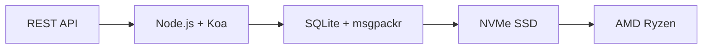

# Первый полный Email API: как Forward Email революционизировал управление электронной почтой {#the-first-complete-email-api-how-forward-email-revolutionized-email-management}


<p class="lead mt-3">
  <strong>Кратко:</strong> Мы создали первый в мире полный REST API для управления электронной почтой с расширенными возможностями поиска, которых нет ни у одного другого сервиса. В то время как Gmail, Outlook и Apple заставляют разработчиков страдать с IMAP или ограниченными по скорости API, Forward Email обеспечивает молниеносные операции CRUD с сообщениями, папками, контактами и календарями через единый REST-интерфейс с более чем 15 параметрами поиска. Это тот email API, которого ждали разработчики.
</p>


## Содержание {#table-of-contents}

* [Проблема Email API](#the-email-api-problem)
* [Что на самом деле говорят разработчики](#what-developers-are-actually-saying)
* [Революционное решение Forward Email](#forward-emails-revolutionary-solution)
  * [Почему мы это создали](#why-we-built-this)
  * [Простая аутентификация](#simple-authentication)
* [20 эндпоинтов, которые меняют всё](#20-endpoints-that-change-everything)
  * [Сообщения (5 эндпоинтов)](#messages-5-endpoints)
  * [Папки (5 эндпоинтов)](#folders-5-endpoints)
  * [Контакты (5 эндпоинтов)](#contacts-5-endpoints)
  * [Календари (5 эндпоинтов)](#calendars-5-endpoints)
* [Расширенный поиск: ни один сервис не сравнится](#advanced-search-no-other-service-compares)
  * [Ландшафт Search API сломан](#the-search-api-landscape-is-broken)
  * [Революционный Search API Forward Email](#forward-emails-revolutionary-search-api)
  * [Примеры поиска из реальной жизни](#real-world-search-examples)
  * [Преимущества производительности](#performance-advantages)
  * [Функции поиска, которых нет ни у кого другого](#search-features-no-one-else-has)
  * [Почему это важно для разработчиков](#why-this-matters-for-developers)
  * [Техническая реализация](#the-technical-implementation)
* [Молниеносная архитектура производительности](#blazing-fast-performance-architecture)
  * [Тесты производительности](#performance-benchmarks)
  * [Архитектура с приоритетом конфиденциальности](#privacy-first-architecture)
* [Почему мы отличаемся: полное сравнение](#why-were-different-the-complete-comparison)
  * [Основные ограничения провайдеров](#major-provider-limitations)
  * [Преимущества Forward Email](#forward-email-advantages)
  * [Проблема прозрачности с открытым исходным кодом](#the-open-source-transparency-problem)
* [30+ примеров интеграций из реальной жизни](#30-real-world-integration-examples)
  * [1. Улучшение контактной формы WordPress](#1-wordpress-contact-form-enhancement)
  * [2. Альтернатива Zapier для автоматизации email](#2-zapier-alternative-for-email-automation)
  * [3. Синхронизация email с CRM](#3-crm-email-synchronization)
  * [4. Обработка заказов в электронной коммерции](#4-e-commerce-order-processing)
  * [5. Интеграция с системой поддержки](#5-support-ticket-integration)
  * [6. Система управления рассылками](#6-newsletter-management-system)
  * [7. Управление задачами через email](#7-email-based-task-management)
  * [8. Агрегация email с нескольких аккаунтов](#8-multi-account-email-aggregation)
  * [9. Расширенная панель аналитики email](#9-advanced-email-analytics-dashboard)
  * [10. Умное архивирование email](#10-smart-email-archiving)
  * [11. Интеграция email с календарём](#11-email-to-calendar-integration)
  * [12. Резервное копирование и соответствие email](#12-email-backup-and-compliance)
  * [13. Управление контентом через email](#13-email-based-content-management)
  * [14. Управление шаблонами email](#14-email-template-management)
  * [15. Автоматизация рабочих процессов через email](#15-email-based-workflow-automation)
  * [16. Мониторинг безопасности email](#16-email-security-monitoring)
  * [17. Сбор опросов через email](#17-email-based-survey-collection)
  * [18. Мониторинг производительности email](#18-email-performance-monitoring)
  * [19. Квалификация лидов через email](#19-email-based-lead-qualification)
  * [20. Управление проектами через email](#20-email-based-project-management)
  * [21. Управление запасами через email](#21-email-based-inventory-management)
  * [22. Обработка счетов через email](#22-email-based-invoice-processing)
  * [23. Регистрация на мероприятия через email](#23-email-based-event-registration)
  * [24. Рабочий процесс утверждения документов через email](#24-email-based-document-approval-workflow)
  * [25. Анализ отзывов клиентов через email](#25-email-based-customer-feedback-analysis)
  * [26. Воронка найма через email](#26-email-based-recruitment-pipeline)
  * [27. Обработка отчетов о расходах через email](#27-email-based-expense-report-processing)
  * [28. Отчеты по контролю качества через email](#28-email-based-quality-assurance-reporting)
  * [29. Управление поставщиками через email](#29-email-based-vendor-management)
  * [30. Мониторинг социальных сетей через email](#30-email-based-social-media-monitoring)
* [Начало работы](#getting-started)
  * [1. Создайте аккаунт Forward Email](#1-create-your-forward-email-account)
  * [2. Сгенерируйте API-учётные данные](#2-generate-api-credentials)
  * [3. Сделайте первый API-запрос](#3-make-your-first-api-call)
  * [4. Изучите документацию](#4-explore-the-documentation)
* [Технические ресурсы](#technical-resources)
## Проблема Email API {#the-email-api-problem}

Email API по своей сути сломаны. Точка.

Каждый крупный почтовый провайдер заставляет разработчиков выбирать между двумя ужасными вариантами:

1. **Ад с IMAP**: Борьба с 30-летним протоколом, созданным для настольных клиентов, а не для современных приложений
2. **Ограниченные API**: Ограниченные по скорости, только для чтения, сложные в использовании OAuth API, которые не могут управлять вашими реальными почтовыми данными

Результат? Разработчики либо полностью отказываются от интеграции с электронной почтой, либо тратят недели на создание хрупких обёрток IMAP, которые постоянно ломаются.

> \[!WARNING]
> **Грязный секрет**: Большинство "email API" — это просто API для отправки. Вы не можете программно организовывать папки, синхронизировать контакты или управлять календарями через простой REST-интерфейс. До сих пор.


## Что на самом деле говорят разработчики {#what-developers-are-actually-saying}

Фрустрация реальна и задокументирована повсюду:

> "Я недавно пытался интегрировать Gmail в своё приложение и потратил на это слишком много времени. Я решил, что поддерживать Gmail не стоит."
>
> *- [разработчик на Hacker News](https://news.ycombinator.com/item?id=42106944), 147 голосов "за"*

> "Все ли email API посредственные? Они кажутся ограниченными или с какими-то ограничениями."
>
> *- [обсуждение на Reddit r/SaaS](https://www.reddit.com/r/SaaS/comments/1cm84s7/are_all_email_apis_mediocre/)*

> "Почему разработка email должна быть такой ужасной?"
>
> *- [Reddit r/webdev](https://www.reddit.com/r/webdev/comments/15trnp2/why_does_email_development_have_to_suck/), 89 комментариев о боли разработчиков*

> "Что делает Gmail API более эффективным, чем IMAP? Ещё одна причина, почему Gmail API гораздо эффективнее — он скачивает каждое сообщение только один раз. С IMAP каждое сообщение нужно скачивать и индексировать..."
>
> *- [вопрос на Stack Overflow](https://stackoverflow.com/questions/25431022/what-makes-the-gmail-api-more-efficient-than-imap) с 47 голосами "за"*

Доказательства повсюду:

* **Проблемы SMTP в WordPress**: [631 проблема на GitHub](https://github.com/awesomemotive/WP-Mail-SMTP/issues) о сбоях доставки почты
* **Ограничения Zapier**: [Жалобы сообщества](https://community.zapier.com/featured-articles-65/email-parser-by-zapier-limitations-and-alternatives-16958) на лимит 10 писем в час и сбои обнаружения IMAP
* **Проекты IMAP API**: [Несколько](https://github.com/ewildgoose/imap-api) [open-source](https://emailengine.app/) [проектов](https://www.npmjs.com/package/imapflow) существуют специально для "преобразования IMAP в REST", потому что ни один провайдер этого не предлагает
* **Фрустрации с Gmail API**: [Stack Overflow](https://stackoverflow.com/questions/tagged/gmail-api) содержит 4,847 вопросов с тегом "gmail-api" с частыми жалобами на лимиты и сложность


## Революционное решение Forward Email {#forward-emails-revolutionary-solution}

**Мы — первая почтовая служба, предлагающая полный CRUD для всех почтовых данных через единый REST API.**

Это не просто ещё один API для отправки. Это полный программный контроль над:

* **Сообщениями**: Создание, чтение, обновление, удаление, поиск, перемещение, пометка
* **Папками**: Полное управление папками IMAP через REST эндпоинты
* **Контактами**: Хранение и синхронизация контактов по [CardDAV](https://tools.ietf.org/html/rfc6352)
* **Календарями**: События календаря и планирование по [CalDAV](https://tools.ietf.org/html/rfc4791)

### Почему мы это сделали {#why-we-built-this}

**Проблема**: Каждый почтовый провайдер рассматривает почту как чёрный ящик. Вы можете отправлять письма, возможно читать их через сложный OAuth, но вы не можете по-настоящему *управлять* своими почтовыми данными программно.

**Наша цель**: Почта должна быть так же проста для интеграции, как любой современный API. Без библиотек IMAP. Без сложности OAuth. Без кошмаров с лимитами. Просто простые REST эндпоинты, которые работают.

**Результат**: Первая почтовая служба, где вы можете построить полноценный почтовый клиент, интеграцию CRM или систему автоматизации, используя только HTTP-запросы.

### Простая аутентификация {#simple-authentication}

Без [сложностей OAuth](https://oauth.net/2/). Без [паролей для приложений](https://support.google.com/accounts/answer/185833). Только ваши учётные данные алиаса:

```bash
curl -u "alias@yourdomain.com:password" \
  https://api.forwardemail.net/v1/messages
```
## 20 конечных точек, которые меняют всё {#20-endpoints-that-change-everything}

### Сообщения (5 конечных точек) {#messages-5-endpoints}

* `GET /v1/messages` - Список сообщений с фильтрацией (`?folder=`, `?is_unread=`, `?is_flagged=`)
* `POST /v1/messages` - Отправка новых сообщений напрямую в папки
* `GET /v1/messages/:id` - Получение конкретного сообщения с полной метаданными
* `PUT /v1/messages/:id` - Обновление сообщения (флаги, папка, статус прочтения)
* `DELETE /v1/messages/:id` - Удаление сообщения навсегда

### Папки (5 конечных точек) {#folders-5-endpoints}

* `GET /v1/folders` - Список всех папок с информацией о подписке
* `POST /v1/folders` - Создание новой папки с пользовательскими свойствами
* `GET /v1/folders/:id` - Получение деталей папки и количества сообщений
* `PUT /v1/folders/:id` - Обновление свойств папки и подписки
* `DELETE /v1/folders/:id` - Удаление папки и обработка перемещения сообщений

### Контакты (5 конечных точек) {#contacts-5-endpoints}

* `GET /v1/contacts` - Список контактов с поиском и пагинацией
* `POST /v1/contacts` - Создание нового контакта с полной поддержкой vCard
* `GET /v1/contacts/:id` - Получение контакта со всеми полями и метаданными
* `PUT /v1/contacts/:id` - Обновление информации контакта с проверкой ETag
* `DELETE /v1/contacts/:id` - Удаление контакта с каскадной обработкой

### Календарь (5 конечных точек) {#calendars-5-endpoints}

* `GET /v1/calendars` - Список событий календаря с фильтрацией по дате
* `POST /v1/calendars` - Создание события календаря с участниками и повторением
* `GET /v1/calendars/:id` - Получение деталей события с учётом часового пояса
* `PUT /v1/calendars/:id` - Обновление события с обнаружением конфликтов
* `DELETE /v1/calendars/:id` - Удаление события с уведомлениями участников


## Расширенный поиск: ни один другой сервис не сравнится {#advanced-search-no-other-service-compares}

**Forward Email — единственный почтовый сервис, который предлагает комплексный программный поиск по всем полям сообщений через REST API.**

В то время как другие провайдеры предлагают лишь базовую фильтрацию, мы создали самый продвинутый API поиска электронной почты, когда-либо существовавший. Ни Gmail API, ни Outlook API, ни какой-либо другой сервис не могут сравниться с нашими возможностями поиска.

### Ландшафт API поиска сломан {#the-search-api-landscape-is-broken}

**Ограничения поиска Gmail API:**

* ✅ Только базовый параметр `q`
* ❌ Нет поиска по конкретным полям
* ❌ Нет фильтрации по диапазону дат
* ❌ Нет фильтрации по размеру
* ❌ Нет фильтрации по вложениям
* ❌ Ограничено синтаксисом поиска Gmail

**Ограничения поиска Outlook API:**

* ✅ Базовый параметр `$search`
* ❌ Нет продвинутого таргетинга по полям
* ❌ Нет сложных комбинаций запросов
* ❌ Агрессивное ограничение по частоте запросов
* ❌ Требуется сложный синтаксис OData

**Apple iCloud:**

* ❌ Нет API вообще
* ❌ Только IMAP-поиск (если удастся его настроить)

**ProtonMail & Tuta:**

* ❌ Нет публичных API
* ❌ Нет программных возможностей поиска

### Революционный API поиска Forward Email {#forward-emails-revolutionary-search-api}

**Мы предлагаем более 15 параметров поиска, которых нет ни у одного другого сервиса:**

| Возможности поиска             | Forward Email                          | Gmail API    | Outlook API        | Другие |
| ------------------------------ | -------------------------------------- | ------------ | ------------------ | ------ |
| **Поиск по конкретным полям**  | ✅ Тема, тело, от, кому, копия, заголовки | ❌            | ❌                  | ❌      |
| **Общий поиск по нескольким полям** | ✅ `?search=` по всем полям              | ✅ Базовый `q=` | ✅ Базовый `$search=` | ❌      |
| **Фильтрация по диапазону дат** | ✅ `?since=` и `?before=`                | ❌            | ❌                  | ❌      |
| **Фильтрация по размеру**      | ✅ `?min_size=` и `?max_size=`           | ❌            | ❌                  | ❌      |
| **Фильтрация по вложениям**    | ✅ `?has_attachments=true/false`         | ❌            | ❌                  | ❌      |
| **Поиск по заголовкам**        | ✅ `?headers=X-Priority`                 | ❌            | ❌                  | ❌      |
| **Поиск по ID сообщения**      | ✅ `?message_id=abc123`                  | ❌            | ❌                  | ❌      |
| **Комбинированные фильтры**    | ✅ Несколько параметров с логикой AND    | ❌            | ❌                  | ❌      |
| **Нечувствительность к регистру** | ✅ Все поиски                          | ✅            | ✅                  | ❌      |
| **Поддержка пагинации**        | ✅ Работает со всеми параметрами поиска  | ✅            | ✅                  | ❌      |
### Примеры поиска в реальных условиях {#real-world-search-examples}

**Найти все счета за последний квартал:**

```bash
# Forward Email - Просто и мощно
GET /v1/messages?subject=invoice&since=2024-01-01T00:00:00Z&before=2024-04-01T00:00:00Z

# Gmail API - Невозможно с их ограниченным поиском
# Фильтрация по диапазону дат недоступна

# Outlook API - Сложный синтаксис OData, ограниченная функциональность
GET /me/messages?$search="invoice"&$filter=receivedDateTime ge 2024-01-01T00:00:00Z
```

**Поиск больших вложений от конкретного отправителя:**

```bash
# Forward Email - Полная фильтрация
GET /v1/messages?from=finance@company.com&has_attachments=true&min_size=1000000

# Gmail API - Невозможно программно фильтровать по размеру или вложениям
# Outlook API - Фильтрация по размеру недоступна
# Другие - API отсутствуют
```

**Сложный поиск по нескольким полям:**

```bash
# Forward Email - Расширенные возможности запросов
GET /v1/messages?body=quarterly&from=manager&is_flagged=true&folder=Reports

# Gmail API - Ограничен базовым текстовым поиском
GET /gmail/v1/users/me/messages?q=quarterly

# Outlook API - Базовый поиск без указания полей
GET /me/messages?$search="quarterly"
```

### Преимущества производительности {#performance-advantages}

**Производительность поиска Forward Email:**

* ⚡ **Время отклика менее 100 мс** для сложных запросов
* 🔍 **Оптимизация с помощью регулярных выражений** и правильной индексации
* 📊 **Параллельное выполнение запросов** для подсчёта и получения данных
* 💾 **Эффективное использование памяти** с минималистичными запросами

**Проблемы с производительностью конкурентов:**

* 🐌 **Gmail API**: Ограничение скорости до 250 единиц квоты на пользователя в секунду
* 🐌 **Outlook API**: Агрессивное ограничение с сложными требованиями к повторным попыткам
* 🐌 **Другие**: Отсутствие API для сравнения

### Уникальные функции поиска {#search-features-no-one-else-has}

#### 1. Поиск по заголовкам {#1-header-specific-search}

```bash
# Найти сообщения с определёнными заголовками
GET /v1/messages?headers=X-Priority:1
GET /v1/messages?headers=X-Spam-Score
```

#### 2. Интеллектуальный поиск по размеру {#2-size-based-intelligence}

```bash
# Найти письма рассылки (обычно большие)
GET /v1/messages?min_size=50000&from=newsletter

# Найти быстрые ответы (обычно маленькие)
GET /v1/messages?max_size=1000&to=support
```

#### 3. Рабочие процессы на основе вложений {#3-attachment-based-workflows}

```bash
# Найти все документы, отправленные юридической команде
GET /v1/messages?to=legal&has_attachments=true&body=contract

# Найти письма без вложений для очистки
GET /v1/messages?has_attachments=false&before=2023-01-01T00:00:00Z
```

#### 4. Комбинированная бизнес-логика {#4-combined-business-logic}

```bash
# Найти срочные помеченные сообщения от VIP с вложениями
GET /v1/messages?is_flagged=true&from=ceo&has_attachments=true&subject=urgent
```

### Почему это важно для разработчиков {#why-this-matters-for-developers}

**Создавайте приложения, которые раньше были невозможны:**

1. **Продвинутая аналитика электронной почты**: Анализируйте шаблоны писем по размеру, отправителю, содержимому
2. **Интеллектуальное управление почтой**: Автоматическая организация на основе сложных критериев
3. **Соответствие и поиск**: Находите конкретные письма для юридических требований
4. **Бизнес-аналитика**: Извлекайте инсайты из паттернов коммуникации по почте
5. **Автоматизация рабочих процессов**: Запускайте действия на основе сложных фильтров почты

### Техническая реализация {#the-technical-implementation}

Наш API поиска использует:

* **Оптимизацию регулярных выражений** с правильными стратегиями индексации
* **Параллельное выполнение** для повышения производительности
* **Валидацию входных данных** для безопасности
* **Полное обработку ошибок** для надежности

```javascript
// Пример: Реализация сложного поиска
const searchConditions = [];

if (ctx.query.subject) {
  searchConditions.push({
    subject: { $regex: ctx.query.subject, $options: 'i' }
  });
}

if (ctx.query.from) {
  searchConditions.push({
    $or: [
      { 'from.address': { $regex: ctx.query.from, $options: 'i' } },
      { 'from.name': { $regex: ctx.query.from, $options: 'i' } }
    ]
  });
}

// Объединение с логикой AND
if (searchConditions.length > 0) {
  query.$and = searchConditions;
}
```

> \[!TIP]
> **Преимущество для разработчиков**: С API поиска Forward Email вы можете создавать почтовые приложения, которые по функциональности соперничают с настольными клиентами, сохраняя при этом простоту REST API.
## Архитектура с Молниеносной Производительностью {#blazing-fast-performance-architecture}

Наш технический стек создан для скорости и надежности:


```mermaid
graph LR
    A[REST API] --> B[Node.js + Koa]
    B --> C[SQLite + msgpackr]
    C --> D[NVMe SSD]
    D --> E[AMD Ryzen]
```

### Тесты Производительности {#performance-benchmarks}

**Почему мы такие быстрые:**

| Компонент   | Технология                                                                       | Преимущество в производительности               |
| ----------- | -------------------------------------------------------------------------------- | ----------------------------------------------- |
| **Хранение**| [NVMe SSD](https://en.wikipedia.org/wiki/NVM_Express)                           | В 10 раз быстрее традиционного SATA             |
| **База данных** | [SQLite](https://sqlite.org/) + [msgpackr](https://github.com/kriszyp/msgpackr) | Нулевая сетевая задержка, оптимизированная сериализация |
| **Оборудование** | [AMD Ryzen](https://www.amd.com/en/products/processors/desktops/ryzen) bare metal | Отсутствие накладных расходов виртуализации     |
| **Кэширование** | В памяти + постоянное                                                        | Время отклика менее миллисекунды                 |
| **Резервные копии** | [Cloudflare R2](https://www.cloudflare.com/products/r2/) зашифрованные       | Надежность корпоративного уровня                 |

**Реальные показатели производительности:**

* **Время отклика API**: в среднем < 50 мс
* **Получение сообщений**: < 10 мс для кэшированных сообщений
* **Операции с папками**: < 5 мс для операций с метаданными
* **Синхронизация контактов**: более 1000 контактов в секунду
* **Время безотказной работы**: 99.99% SLA с резервной инфраструктурой

### Архитектура с Приоритетом Конфиденциальности {#privacy-first-architecture}

**Дизайн с нулевыми знаниями**: доступ есть только у вас с вашим IMAP паролем — мы не можем читать ваши письма. Наша [архитектура с нулевыми знаниями](https://forwardemail.net/en/security) обеспечивает полную конфиденциальность при молниеносной производительности.


## Почему Мы Отличаемся: Полное Сравнение {#why-were-different-the-complete-comparison}

### Основные Ограничения Провайдеров {#major-provider-limitations}

| Провайдер       | Основные проблемы                        | Конкретные ограничения                                                                                                                                                                                                                                                                                                                                                                                                                                               |
| --------------- | -------------------------------------- | -------------------------------------------------------------------------------------------------------------------------------------------------------------------------------------------------------------------------------------------------------------------------------------------------------------------------------------------------------------------------------------------------------------------------------------------------------------------- |
| **Gmail API**   | Только для чтения, сложный OAuth, отдельные API | • [Невозможно изменить существующие сообщения](https://developers.google.com/gmail/api/reference/rest/v1/users.messages)<br>• [Метки ≠ папки](https://developers.google.com/gmail/api/reference/rest/v1/users.labels)<br>• [Лимит 1 миллиард единиц квоты в день](https://developers.google.com/gmail/api/reference/quota)<br>• [Требуются отдельные API](https://developers.google.com/workspace) для контактов/календаря                                                           |
| **Outlook API** | Устаревший, запутанный, ориентирован на корпоративных пользователей | • [REST endpoints устарели в марте 2024](https://learn.microsoft.com/en-us/outlook/rest/compare-graph)<br>• [Несколько запутанных API](https://learn.microsoft.com/en-us/office/client-developer/outlook/selecting-an-api-or-technology-for-developing-solutions-for-outlook) (EWS, Graph, REST)<br>• [Сложность Microsoft Graph](https://learn.microsoft.com/en-us/graph/overview)<br>• [Агрессивное ограничение скорости](https://learn.microsoft.com/en-us/graph/throttling) |
| **Apple iCloud**| Нет публичного API                     | • [Отсутствует публичный API](https://support.apple.com/en-us/102654)<br>• [Только IMAP с лимитом 1000 писем в день](https://support.apple.com/en-us/102654)<br>• [Требуются пароли для конкретных приложений](https://support.apple.com/en-us/102654)<br>• [Лимит 500 получателей на сообщение](https://support.apple.com/en-us/102654)                                                                                                                                              |
| **ProtonMail**  | Нет API, ложные заявления об открытом исходном коде | • [Публичный API отсутствует](https://proton.me/support/protonmail-bridge-clients)<br>• [Для доступа по IMAP требуется Bridge](https://proton.me/mail/bridge)<br>• [Заявляют "открытый исходный код"](https://proton.me/blog/open-source), но [серверный код закрыт](https://github.com/ProtonMail)<br>• [Доступно только для платных тарифов](https://proton.me/pricing)                                                                                                         |
| **Tuta**        | Нет API, вводящая в заблуждение прозрачность | • [Нет REST API для управления почтой](https://tuta.com/support#technical)<br>• [Заявляют "открытый исходный код"](https://tuta.com/blog/posts/open-source-email), но [бэкенд закрыт](https://github.com/tutao/tutanota)<br>• [IMAP/SMTP не поддерживаются](https://tuta.com/support#imap)<br>• [Проприетарное шифрование](https://tuta.com/encryption) препятствует стандартным интеграциям                                                                                               |
| **Zapier Email**| Серьезные ограничения по скорости      | • [Лимит 10 писем в час](https://help.zapier.com/hc/en-us/articles/8496181555597-Email-Parser-by-Zapier-limitations-and-alternatives)<br>• [Нет доступа к папкам IMAP](https://help.zapier.com/hc/en-us/articles/8496181555597-Email-Parser-by-Zapier-limitations-and-alternatives)<br>• [Ограниченные возможности парсинга](https://help.zapier.com/hc/en-us/articles/8496181555597-Email-Parser-by-Zapier-limitations-and-alternatives)                                 |
### Преимущества пересылки электронной почты {#forward-email-advantages}

| Особенность        | Пересылка электронной почты                                                                 | Конкуренты                               |
| ------------------ | -------------------------------------------------------------------------------------------- | ----------------------------------------- |
| **Полный CRUD**    | ✅ Полное создание, чтение, обновление, удаление для всех данных                              | ❌ Только чтение или ограниченные операции |
| **Единый API**     | ✅ Сообщения, папки, контакты, календари в одном API                                         | ❌ Раздельные API или отсутствующие функции |
| **Простая аутентификация** | ✅ Базовая аутентификация с учетными данными псевдонима                                  | ❌ Сложный OAuth с множеством областей доступа |
| **Отсутствие ограничений по скорости** | ✅ Щедрые лимиты, рассчитанные на реальные приложения                              | ❌ Ограничительные квоты, нарушающие рабочие процессы |
| **Самостоятельный хостинг** | ✅ [Полная опция самостоятельного хостинга](https://forwardemail.net/en/blog/docs/self-hosted-solution) | ❌ Только привязка к поставщику             |
| **Конфиденциальность** | ✅ Нулевая осведомленность, шифрование, приватность                                         | ❌ Сбор данных и проблемы с конфиденциальностью |
| **Производительность** | ✅ Ответы менее 50 мс, NVMe-хранилище                                                      | ❌ Задержки из-за сетевой латентности и ограничения пропускной способности |

### Проблема прозрачности с открытым исходным кодом {#the-open-source-transparency-problem}

**ProtonMail и Tuta позиционируют себя как «открытые» и «прозрачные», но это вводящий в заблуждение маркетинг, нарушающий современные принципы конфиденциальности.**

> \[!WARNING]
> **Ложные заявления о прозрачности**: ProtonMail и Tuta активно рекламируют свои «открытые» полномочия, при этом их самый критичный серверный код является проприетарным и закрытым.

**Обман ProtonMail:**

* **Заявления**: ["Мы — открытый исходный код"](https://proton.me/blog/open-source), широко представленное в маркетинге
* **Реальность**: [Серверный код полностью проприетарен](https://github.com/ProtonMail) — только клиентские приложения с открытым исходным кодом
* **Последствия**: Пользователи не могут проверить серверное шифрование, обработку данных или заявления о конфиденциальности
* **Нарушение прозрачности**: Нет возможности проверить фактические системы обработки и хранения электронной почты

**Вводящий в заблуждение маркетинг Tuta:**

* **Заявления**: ["Открытая электронная почта"](https://tuta.com/blog/posts/open-source-email) как ключевой аргумент
* **Реальность**: [Бэкенд инфраструктура закрыта](https://github.com/tutao/tutanota) — доступен только фронтенд
* **Последствия**: Проприетарное шифрование препятствует использованию стандартных протоколов электронной почты (IMAP/SMTP)
* **Стратегия привязки**: Пользовательская система шифрования заставляет зависеть от поставщика

**Почему это важно для современной конфиденциальности:**

В 2025 году настоящая конфиденциальность требует **полной прозрачности**. Когда провайдеры электронной почты заявляют «открытый исходный код», но скрывают серверный код:

1. **Непроверяемое шифрование**: Вы не можете проверить, как ваши данные действительно шифруются
2. **Скрытые практики обработки данных**: Серверная обработка данных остается черным ящиком
3. **Безопасность на основе доверия**: Вы должны доверять заявлениям без проверки
4. **Привязка к поставщику**: Проприетарные системы препятствуют переносимости данных

**Истинная прозрачность Forward Email:**

* ✅ **[Полностью открытый исходный код](https://github.com/forwardemail/forwardemail.net)** — серверный и клиентский код
* ✅ **[Доступен самостоятельный хостинг](https://forwardemail.net/en/blog/docs/self-hosted-solution)** — запускайте собственный экземпляр
* ✅ **Стандартные протоколы** — совместимость с IMAP, SMTP, CardDAV, CalDAV
* ✅ **Проверяемая безопасность** — каждый строка кода доступна для проверки
* ✅ **Отсутствие привязки к поставщику** — ваши данные, ваш контроль

> \[!TIP]
> **Настоящий открытый исходный код означает, что вы можете проверить каждое заявление.** С Forward Email вы можете проверить наше шифрование, изучить обработку данных и даже запустить собственный экземпляр. Вот что такое настоящая прозрачность.


## Более 30 реальных примеров интеграции {#30-real-world-integration-examples}

### 1. Улучшение контактной формы WordPress {#1-wordpress-contact-form-enhancement}
**Проблема**: [Сбои конфигурации SMTP в WordPress](https://github.com/awesomemotive/WP-Mail-SMTP/issues) ([631 проблема на GitHub](https://github.com/awesomemotive/WP-Mail-SMTP/issues))  
**Решение**: Прямая интеграция с API полностью обходится без [SMTP](https://tools.ietf.org/html/rfc5321)

```javascript
// Контактная форма WordPress, которая сохраняет в папку Отправленные
await fetch('https://api.forwardemail.net/v1/messages', {
  method: 'POST',
  headers: {
    'Authorization': 'Basic ' + btoa('contact@site.com:password'),
    'Content-Type': 'application/json'
  },
  body: JSON.stringify({
    to: [{ address: 'owner@site.com' }],
    subject: 'Контактная форма: ' + formData.subject,
    text: formData.message,
    folder: 'Sent'
  })
});
```

### 2. Альтернатива Zapier для автоматизации электронной почты {#2-zapier-alternative-for-email-automation}

**Проблема**: [Ограничение Zapier в 10 писем в час](https://help.zapier.com/hc/en-us/articles/8496181555597-Email-Parser-by-Zapier-limitations-and-alternatives) и [сбои обнаружения IMAP](https://community.zapier.com/featured-articles-65/email-parser-by-zapier-limitations-and-alternatives-16958)  
**Решение**: Неограниченная автоматизация с полным контролем над электронной почтой

```javascript
// Автоматическая организация писем по домену отправителя
const messages = await fetch('/v1/messages?folder=INBOX');
for (const message of messages) {
  const domain = message.from.split('@')[1];
  await fetch(`/v1/messages/${message.id}`, {
    method: 'PUT',
    body: JSON.stringify({ folder: `Clients/${domain}` })
  });
}
```

### 3. Синхронизация электронной почты с CRM {#3-crm-email-synchronization}

**Проблема**: Ручное управление контактами между электронной почтой и [CRM-системами](https://en.wikipedia.org/wiki/Customer_relationship_management)  
**Решение**: Двунаправленная синхронизация с API контактов [CardDAV](https://tools.ietf.org/html/rfc6352)

```javascript
// Синхронизация новых email-контактов с CRM
const newContacts = await fetch('/v1/contacts');
for (const contact of newContacts) {
  await crmAPI.createContact({
    name: contact.name,
    email: contact.email,
    source: 'email_api'
  });
}
```

### 4. Обработка заказов в электронной коммерции {#4-e-commerce-order-processing}

**Проблема**: Ручная обработка писем с заказами для [платформ электронной коммерции](https://en.wikipedia.org/wiki/E-commerce)  
**Решение**: Автоматизированный конвейер управления заказами

```javascript
// Обработка писем с подтверждением заказов
const orders = await fetch('/v1/messages?folder=Orders');
const orderEmails = orders.filter(msg =>
  msg.subject.includes('Order Confirmation')
);

for (const order of orderEmails) {
  const orderData = parseOrderEmail(order.text);
  await updateInventory(orderData);
  await fetch(`/v1/messages/${order.id}`, {
    method: 'PUT',
    body: JSON.stringify({ folder: 'Orders/Processed' })
  });
}
```

### 5. Интеграция с системой поддержки {#5-support-ticket-integration}

**Проблема**: Разрозненные цепочки писем в разных [платформах службы поддержки](https://en.wikipedia.org/wiki/Help_desk_software)  
**Решение**: Полный трекинг цепочек писем

```javascript
// Создание тикета поддержки из цепочки писем
const messages = await fetch('/v1/messages?folder=Support');
const supportEmails = messages.filter(msg =>
  msg.to.some(addr => addr.includes('support@'))
);

for (const email of supportEmails) {
  const ticket = await supportSystem.createTicket({
    subject: email.subject,
    from: email.from,
    body: email.text,
    timestamp: email.date
  });
}
```

### 6. Система управления рассылками {#6-newsletter-management-system}

**Проблема**: Ограниченные интеграции с [платформами рассылок](https://en.wikipedia.org/wiki/Email_marketing)  
**Решение**: Полное управление жизненным циклом подписчиков

```javascript
// Автоматическое управление подписками на рассылку
const messages = await fetch('/v1/messages?folder=Newsletter');
const unsubscribes = messages.filter(msg =>
  msg.subject.toLowerCase().includes('unsubscribe')
);

for (const msg of unsubscribes) {
  await removeSubscriber(msg.from);
  await fetch(`/v1/messages/${msg.id}`, {
    method: 'PUT',
    body: JSON.stringify({ folder: 'Newsletter/Unsubscribed' })
  });
}
```

### 7. Управление задачами на основе электронной почты {#7-email-based-task-management}

**Проблема**: Перегрузка входящих и [отслеживание задач](https://en.wikipedia.org/wiki/Task_management)  
**Решение**: Преобразование писем в выполнимые задачи
```javascript
// Create tasks from flagged emails
const messages = await fetch('/v1/messages?is_flagged=true');
for (const email of messages) {
  await taskManager.createTask({
    title: email.subject,
    description: email.text,
    assignee: email.to[0].address,
    dueDate: extractDueDate(email.text)
  });
}
```

### 8. Multi-Account Email Aggregation {#8-multi-account-email-aggregation}

**Problem**: Managing [multiple email accounts](https://en.wikipedia.org/wiki/Email_client) across providers
**Solution**: Unified inbox interface

```javascript
// Aggregate emails from multiple accounts
const accounts = ['work@domain.com', 'personal@domain.com'];
const allMessages = [];

for (const account of accounts) {
  const messages = await fetch('/v1/messages', {
    headers: { 'Authorization': getAuth(account) }
  });
  allMessages.push(...messages.map(m => ({ ...m, account })));
}
```

### 9. Advanced Email Analytics Dashboard {#9-advanced-email-analytics-dashboard}

**Problem**: No insights into [email patterns](https://en.wikipedia.org/wiki/Email_analytics) with sophisticated filtering
**Solution**: Custom email analytics using advanced search capabilities

```javascript
// Generate comprehensive email analytics using advanced search
const analytics = {};

// Analyze email volume by sender domain
const messages = await fetch('/v1/messages');
analytics.senderDomains = analyzeSenderDomains(messages);

// Find large attachments consuming storage
const largeAttachments = await fetch('/v1/messages?has_attachments=true&min_size=1000000');
analytics.storageHogs = largeAttachments.map(msg => ({
  subject: msg.subject,
  from: msg.from,
  size: msg.size
}));

// Analyze communication patterns with VIPs
const vipEmails = await fetch('/v1/messages?from=ceo@company.com');
const urgentVipEmails = await fetch('/v1/messages?from=ceo@company.com&subject=urgent');
analytics.vipCommunication = {
  total: vipEmails.length,
  urgent: urgentVipEmails.length,
  urgencyRate: (urgentVipEmails.length / vipEmails.length) * 100
};

// Find unread emails by date range for follow-up
const lastWeek = new Date(Date.now() - 7 * 24 * 60 * 60 * 1000).toISOString();
const unreadRecent = await fetch(`/v1/messages?is_unread=true&since=${lastWeek}`);
analytics.followUpNeeded = unreadRecent.length;

// Analyze email sizes for optimization
const smallEmails = await fetch('/v1/messages?max_size=1000');
const mediumEmails = await fetch('/v1/messages?min_size=1000&max_size=50000');
const largeEmails = await fetch('/v1/messages?min_size=50000');
analytics.sizeDistribution = {
  small: smallEmails.length,
  medium: mediumEmails.length,
  large: largeEmails.length
};

// Search for compliance-related emails
const complianceEmails = await fetch('/v1/messages?body=confidential&has_attachments=true');
analytics.complianceReview = complianceEmails.length;
```

### 10. Smart Email Archiving {#10-smart-email-archiving}

**Problem**: Manual [email organization](https://en.wikipedia.org/wiki/Email_management)
**Solution**: Intelligent email categorization

```javascript
// Auto-archive old emails by category
const messages = await fetch('/v1/messages');
const oldEmails = messages.filter(email =>
  isOlderThan(email.date, 90) // 90 days
);

for (const email of oldEmails) {
  const category = categorizeEmail(email);
  await fetch(`/v1/messages/${email.id}`, {
    method: 'PUT',
    body: JSON.stringify({ folder: `Archive/${category}` })
  });
}
```

### 11. Email-to-Calendar Integration {#11-email-to-calendar-integration}

**Problem**: Manual [calendar event](https://tools.ietf.org/html/rfc4791) creation from emails
**Solution**: Automatic event extraction and creation

```javascript
// Extract meeting details from emails
const messages = await fetch('/v1/messages?folder=Meetings');
const meetingEmails = messages.filter(email =>
  email.subject.toLowerCase().includes('meeting')
);

for (const email of meetingEmails) {
  const meetingData = extractMeetingInfo(email.text);
  if (meetingData.date && meetingData.time) {
    await fetch('/v1/calendars', {
      method: 'POST',
      body: JSON.stringify({
        title: email.subject,
        start: meetingData.datetime,
        attendees: [email.from, ...email.to]
      })
    });
  }
}
```

### 12. Резервное копирование электронной почты и соответствие требованиям {#12-email-backup-and-compliance}

**Проблема**: [Хранение электронной почты](https://en.wikipedia.org/wiki/Email_retention_policy) и требования к соответствию  
**Решение**: Автоматическое резервное копирование с сохранением метаданных

```javascript
// Backup emails with full metadata
const allMessages = await fetch('/v1/messages');
const backup = {
  timestamp: new Date(),
  messages: allMessages.map(msg => ({
    id: msg.id,
    subject: msg.subject,
    from: msg.from,
    to: msg.to,
    date: msg.date,
    flags: msg.flags
  }))
};
await saveToComplianceStorage(backup);
```

### 13. Управление контентом на основе электронной почты {#13-email-based-content-management}

**Проблема**: Управление отправками контента через электронную почту для [CMS платформ](https://en.wikipedia.org/wiki/Content_management_system)  
**Решение**: Электронная почта как система управления контентом

```javascript
// Process content submissions from email
const messages = await fetch('/v1/messages?folder=Submissions');
const submissions = messages.filter(msg =>
  msg.to.some(addr => addr.includes('submit@'))
);

for (const submission of submissions) {
  const content = parseSubmission(submission.text);
  await cms.createDraft({
    title: submission.subject,
    content: content.body,
    author: submission.from
  });
}
```

### 14. Управление шаблонами электронной почты {#14-email-template-management}

**Проблема**: Несогласованность [шаблонов электронной почты](https://en.wikipedia.org/wiki/Email_template) в команде  
**Решение**: Централизованная система шаблонов с API

```javascript
// Send templated emails with dynamic content
const template = await getEmailTemplate('welcome');
await fetch('/v1/messages', {
  method: 'POST',
  body: JSON.stringify({
    to: [{ address: newUser.email }],
    subject: template.subject.replace('{{name}}', newUser.name),
    html: template.html.replace('{{name}}', newUser.name),
    folder: 'Sent'
  })
});
```

### 15. Автоматизация рабочих процессов на основе электронной почты {#15-email-based-workflow-automation}

**Проблема**: Ручные [процессы утверждения](https://en.wikipedia.org/wiki/Workflow) через электронную почту  
**Решение**: Автоматические триггеры рабочих процессов

```javascript
// Process approval emails
const messages = await fetch('/v1/messages?folder=Approvals');
const approvals = messages.filter(msg =>
  msg.subject.includes('APPROVAL')
);

for (const approval of approvals) {
  const decision = parseApprovalDecision(approval.text);
  await workflow.processApproval({
    requestId: extractRequestId(approval.subject),
    decision: decision,
    approver: approval.from
  });
}
```

### 16. Мониторинг безопасности электронной почты {#16-email-security-monitoring}

**Проблема**: Ручное [обнаружение угроз безопасности](https://en.wikipedia.org/wiki/Email_security)  
**Решение**: Автоматический анализ угроз

```javascript
// Monitor for suspicious emails
const recentEmails = await fetch('/v1/messages');
for (const email of recentEmails) {
  const threatScore = analyzeThreat(email);
  if (threatScore > 0.8) {
    await fetch(`/v1/messages/${email.id}`, {
      method: 'PUT',
      body: JSON.stringify({ folder: 'Security/Quarantine' })
    });
    await alertSecurityTeam(email);
  }
}
```

### 17. Сбор опросов на основе электронной почты {#17-email-based-survey-collection}

**Проблема**: Ручная обработка [ответов на опросы](https://en.wikipedia.org/wiki/Survey_methodology)  
**Решение**: Автоматическое агрегирование ответов

```javascript
// Collect and process survey responses
const messages = await fetch('/v1/messages?folder=Surveys');
const responses = messages.filter(msg =>
  msg.subject.includes('Survey Response')
);

const surveyData = responses.map(email => ({
  respondent: email.from,
  responses: parseSurveyData(email.text),
  timestamp: email.date
}));
await updateSurveyResults(surveyData);
```

### 18. Мониторинг производительности электронной почты {#18-email-performance-monitoring}

**Проблема**: Отсутствие видимости в [производительность доставки электронной почты](https://en.wikipedia.org/wiki/Email_deliverability)  
**Решение**: Метрики электронной почты в реальном времени

```javascript
// Monitor email delivery performance
const sentEmails = await fetch('/v1/messages?folder=Sent');
const deliveryStats = {
  sent: sentEmails.length,
  bounces: await countBounces(),
  deliveryRate: calculateDeliveryRate()
};
await updateDashboard(deliveryStats);
```
### 19. Квалификация лидов на основе электронной почты {#19-email-based-lead-qualification}

**Проблема**: Ручное [оценивание лидов](https://en.wikipedia.org/wiki/Lead_scoring) на основе взаимодействий по электронной почте  
**Решение**: Автоматизированный конвейер квалификации лидов

```javascript
// Score leads based on email engagement
const prospects = await fetch('/v1/contacts');
for (const prospect of prospects) {
  const messages = await fetch('/v1/messages');
  const emails = messages.filter(msg =>
    msg.from.includes(prospect.email)
  );
  const score = calculateEngagementScore(emails);
  await crm.updateLeadScore(prospect.id, score);
}
```

### 20. Управление проектами на основе электронной почты {#20-email-based-project-management}

**Проблема**: [Обновления проектов](https://en.wikipedia.org/wiki/Project_management), разбросанные по цепочкам писем  
**Решение**: Централизованный коммуникационный центр для проектов

```javascript
// Extract project updates from emails
const messages = await fetch('/v1/messages?folder=Projects');
const projectEmails = messages.filter(msg =>
  msg.subject.includes('Project Update')
);

for (const email of projectEmails) {
  const update = parseProjectUpdate(email.text);
  await projectManager.addUpdate({
    project: update.projectId,
    author: email.from,
    content: update.content
  });
}
```

### 21. Управление запасами на основе электронной почты {#21-email-based-inventory-management}

**Проблема**: Ручное обновление запасов на основе писем от поставщиков  
**Решение**: Автоматическое отслеживание запасов на основе уведомлений по электронной почте

```javascript
// Process inventory updates from supplier emails
const messages = await fetch('/v1/messages?folder=Suppliers');
const inventoryEmails = messages.filter(msg =>
  msg.subject.includes('Inventory Update') || msg.subject.includes('Stock Alert')
);

for (const email of inventoryEmails) {
  const inventoryData = parseInventoryUpdate(email.text);
  await inventory.updateStock({
    sku: inventoryData.sku,
    quantity: inventoryData.quantity,
    supplier: email.from,
    timestamp: email.date
  });

  // Move to processed folder
  await fetch(`/v1/messages/${email.id}`, {
    method: 'PUT',
    body: JSON.stringify({ folder: 'Suppliers/Processed' })
  });
}
```

### 22. Обработка счетов на основе электронной почты {#22-email-based-invoice-processing}

**Проблема**: Ручная [обработка счетов](https://en.wikipedia.org/wiki/Invoice_processing) и интеграция с бухгалтерией  
**Решение**: Автоматическое извлечение данных счетов и синхронизация с бухгалтерской системой

```javascript
// Extract invoice data from email attachments
const messages = await fetch('/v1/messages?folder=Invoices');
const invoiceEmails = messages.filter(msg =>
  msg.subject.toLowerCase().includes('invoice') && msg.attachments.length > 0
);

for (const email of invoiceEmails) {
  const invoiceData = await extractInvoiceData(email.attachments[0]);
  await accounting.createInvoice({
    vendor: email.from,
    amount: invoiceData.total,
    dueDate: invoiceData.dueDate,
    items: invoiceData.lineItems
  });

  // Flag as processed
  await fetch(`/v1/messages/${email.id}`, {
    method: 'PUT',
    body: JSON.stringify({ flags: ['\\Seen', '\\Flagged'] })
  });
}
```

### 23. Регистрация на мероприятия на основе электронной почты {#23-email-based-event-registration}

**Проблема**: Ручная обработка [регистраций на мероприятия](https://en.wikipedia.org/wiki/Event_management) из ответов по электронной почте  
**Решение**: Автоматическое управление участниками и интеграция с календарём

```javascript
// Process event registration emails
const messages = await fetch('/v1/messages?folder=Events');
const registrations = messages.filter(msg =>
  msg.subject.includes('Registration') || msg.subject.includes('RSVP')
);

for (const registration of registrations) {
  const attendeeData = parseRegistration(registration.text);

  // Add to attendee list
  await events.addAttendee({
    event: attendeeData.eventId,
    name: attendeeData.name,
    email: registration.from,
    dietary: attendeeData.dietaryRestrictions
  });

  // Create calendar event for attendee
  await fetch('/v1/calendars', {
    method: 'POST',
    body: JSON.stringify({
      title: attendeeData.eventName,
      start: attendeeData.eventDate,
      attendees: [registration.from]
    })
  });
}
```
### 24. Рабочий процесс утверждения документов по электронной почте {#24-email-based-document-approval-workflow}

**Проблема**: Сложные цепочки [утверждения документов](https://en.wikipedia.org/wiki/Document_management_system) по электронной почте  
**Решение**: Автоматическое отслеживание утверждений и версионирование документов

```javascript
// Track document approval workflow
const messages = await fetch('/v1/messages?folder=Approvals');
const approvalEmails = messages.filter(msg =>
  msg.subject.includes('Document Approval')
);

for (const email of approvalEmails) {
  const approval = parseApprovalEmail(email.text);

  await documentSystem.updateApproval({
    documentId: approval.documentId,
    approver: email.from,
    status: approval.decision, // 'approved', 'rejected', 'needs_changes'
    comments: approval.comments,
    timestamp: email.date
  });

  // Check if all approvals complete
  const document = await documentSystem.getDocument(approval.documentId);
  if (document.allApprovalsComplete) {
    await documentSystem.finalizeDocument(approval.documentId);
  }
}
```

### 25. Анализ отзывов клиентов по электронной почте {#25-email-based-customer-feedback-analysis}

**Проблема**: Ручной сбор и анализ настроений [отзывов клиентов](https://en.wikipedia.org/wiki/Customer_feedback)  
**Решение**: Автоматическая обработка отзывов и отслеживание настроений

```javascript
// Analyze customer feedback from emails
const messages = await fetch('/v1/messages?folder=Feedback');
const feedbackEmails = messages.filter(msg =>
  msg.to.some(addr => addr.includes('feedback@'))
);

for (const email of feedbackEmails) {
  const sentiment = await analyzeSentiment(email.text);
  const category = categorizeFeeback(email.text);

  await feedback.recordFeedback({
    customer: email.from,
    content: email.text,
    sentiment: sentiment.score, // -1 to 1
    category: category, // 'bug', 'feature', 'complaint', 'praise'
    priority: calculatePriority(sentiment, category),
    timestamp: email.date
  });

  // Auto-escalate negative feedback
  if (sentiment.score < -0.5) {
    await escalateToSupport(email);
  }
}
```

### 26. Рекрутинговый процесс по электронной почте {#26-email-based-recruitment-pipeline}

**Проблема**: Ручной [рекрутинг](https://en.wikipedia.org/wiki/Recruitment) и отслеживание кандидатов  
**Решение**: Автоматическое управление кандидатами и планирование собеседований

```javascript
// Process job application emails
const messages = await fetch('/v1/messages?folder=Careers');
const applications = messages.filter(msg =>
  msg.subject.toLowerCase().includes('application') && msg.attachments.length > 0
);

for (const application of applications) {
  const resume = await parseResume(application.attachments[0]);

  const candidate = await ats.createCandidate({
    name: resume.name,
    email: application.from,
    skills: resume.skills,
    experience: resume.experience,
    position: extractPosition(application.subject)
  });

  // Auto-schedule screening if qualified
  if (candidate.qualificationScore > 0.7) {
    await calendar.scheduleInterview({
      candidateId: candidate.id,
      type: 'phone_screening',
      duration: 30
    });
  }
}
```

### 27. Обработка отчетов о расходах по электронной почте {#27-email-based-expense-report-processing}

**Проблема**: Ручная подача и утверждение [отчетов о расходах](https://en.wikipedia.org/wiki/Expense_report)  
**Решение**: Автоматическое извлечение расходов и рабочий процесс утверждения

```javascript
// Process expense report emails
const messages = await fetch('/v1/messages?folder=Expenses');
const expenseEmails = messages.filter(msg =>
  msg.subject.includes('Expense') && msg.attachments.length > 0
);

for (const email of expenseEmails) {
  const receipts = await processReceipts(email.attachments);

  const expenseReport = await expenses.createReport({
    employee: email.from,
    expenses: receipts.map(receipt => ({
      amount: receipt.total,
      category: receipt.category,
      date: receipt.date,
      merchant: receipt.merchant
    })),
    totalAmount: receipts.reduce((sum, r) => sum + r.total, 0)
  });

  // Auto-approve small amounts
  if (expenseReport.totalAmount < 100) {
    await expenses.approve(expenseReport.id);
  } else {
    await expenses.sendForApproval(expenseReport.id);
  }
}
```
### 28. Отчёты по контролю качества на основе электронной почты {#28-email-based-quality-assurance-reporting}

**Проблема**: Ручное отслеживание вопросов [контроля качества](https://en.wikipedia.org/wiki/Quality_assurance)  
**Решение**: Автоматизированное управление вопросами контроля качества и отслеживание ошибок

```javascript
// Process QA bug reports from email
const messages = await fetch('/v1/messages?folder=QA');
const bugReports = messages.filter(msg =>
  msg.subject.includes('Bug Report') || msg.subject.includes('QA Issue')
);

for (const report of bugReports) {
  const bugData = parseBugReport(report.text);

  const ticket = await bugTracker.createIssue({
    title: report.subject,
    description: bugData.description,
    severity: bugData.severity,
    steps: bugData.stepsToReproduce,
    reporter: report.from,
    attachments: report.attachments
  });

  // Auto-assign based on component
  const assignee = await getComponentOwner(bugData.component);
  await bugTracker.assign(ticket.id, assignee);

  // Create calendar reminder for follow-up
  await fetch('/v1/calendars', {
    method: 'POST',
    body: JSON.stringify({
      title: `Follow up on ${ticket.id}`,
      start: addDays(new Date(), 3),
      attendees: [assignee]
    })
  });
}
```

### 29. Управление поставщиками на основе электронной почты {#29-email-based-vendor-management}

**Проблема**: Ручное [взаимодействие с поставщиками](https://en.wikipedia.org/wiki/Vendor_management) и отслеживание контрактов  
**Решение**: Автоматизированное управление отношениями с поставщиками

```javascript
// Track vendor communications and contracts
const messages = await fetch('/v1/messages?folder=Vendors');
const vendorEmails = messages.filter(msg =>
  isVendorEmail(msg.from)
);

for (const email of vendorEmails) {
  const vendor = await vendors.getByEmail(email.from);

  // Log communication
  await vendors.logCommunication({
    vendorId: vendor.id,
    type: 'email',
    subject: email.subject,
    content: email.text,
    timestamp: email.date
  });

  // Check for contract-related keywords
  if (email.text.includes('contract') || email.text.includes('renewal')) {
    await vendors.flagForContractReview({
      vendorId: vendor.id,
      emailId: email.id,
      priority: 'high'
    });

    // Create task for procurement team
    await tasks.create({
      title: `Review contract communication from ${vendor.name}`,
      assignee: 'procurement@company.com',
      dueDate: addDays(new Date(), 2)
    });
  }
}
```

### 30. Мониторинг социальных сетей на основе электронной почты {#30-email-based-social-media-monitoring}

**Проблема**: Ручное отслеживание упоминаний в [социальных сетях](https://en.wikipedia.org/wiki/Social_media_monitoring) и реагирование  
**Решение**: Автоматизированная обработка оповещений из социальных сетей и координация ответов

```javascript
// Process social media alerts from email notifications
const messages = await fetch('/v1/messages?folder=Social');
const socialAlerts = messages.filter(msg =>
  msg.from.includes('alerts@') || msg.subject.includes('Social Mention')
);

for (const alert of socialAlerts) {
  const mention = parseSocialMention(alert.text);

  await socialMedia.recordMention({
    platform: mention.platform,
    author: mention.author,
    content: mention.content,
    sentiment: mention.sentiment,
    reach: mention.followerCount,
    url: mention.url
  });

  // Auto-escalate negative mentions with high reach
  if (mention.sentiment < -0.5 && mention.followerCount > 10000) {
    await socialMedia.escalateToTeam({
      mentionId: mention.id,
      priority: 'urgent',
      assignee: 'social-media-manager@company.com'
    });

    // Create calendar reminder for immediate response
    await fetch('/v1/calendars', {
      method: 'POST',
      body: JSON.stringify({
        title: `Urgent: Respond to negative social mention`,
        start: addMinutes(new Date(), 30),
        attendees: ['social-media-manager@company.com']
      })
    });
  }
}
```


## Начало работы {#getting-started}

### 1. Создайте свой аккаунт для пересылки электронной почты {#1-create-your-forward-email-account}

Зарегистрируйтесь на [forwardemail.net](https://forwardemail.net) и подтвердите свой домен.

### 2. Сгенерируйте API-учётные данные {#2-generate-api-credentials}

Ваш псевдоним электронной почты и пароль служат учётными данными API — дополнительная настройка не требуется.
### 3. Сделайте свой первый API-запрос {#3-make-your-first-api-call}

```bash
# Просмотрите свои сообщения
curl -u "your-alias@domain.com:password" \
  https://api.forwardemail.net/v1/messages

# Создайте новый контакт
curl -u "your-alias@domain.com:password" \
  -X POST \
  -H "Content-Type: application/json" \
  -d '{"fullName":"John Doe","emails":[{"value":"john@example.com"}]}' \
  https://api.forwardemail.net/v1/contacts
```

### 4. Изучите документацию {#4-explore-the-documentation}

Посетите [forwardemail.net/en/email-api](https://forwardemail.net/en/email-api) для полной документации по API с интерактивными примерами.


## Технические ресурсы {#technical-resources}

* **[Полная документация API](https://forwardemail.net/en/email-api)** - Интерактивная спецификация OpenAPI 3.0
* **[Руководство по самостоятельному размещению](https://forwardemail.net/en/blog/docs/self-hosted-solution)** - Разверните Forward Email на своей инфраструктуре
* **[Технический документ по безопасности](https://forwardemail.net/technical-whitepaper.pdf)** - Техническая архитектура и детали безопасности
* **[Репозиторий на GitHub](https://github.com/forwardemail/forwardemail.net)** - Исходный код с открытым доступом
* **[Поддержка разработчиков](mailto:api@forwardemail.net)** - Прямой доступ к нашей инженерной команде

---

**Готовы революционизировать интеграцию электронной почты?** [Начните создавать с API Forward Email уже сегодня](https://forwardemail.net/en/email-api) и испытайте первую полноценную платформу управления электронной почтой, созданную для разработчиков.

*Forward Email: сервис электронной почты, который наконец-то правильно реализует API.*
