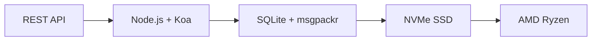

# Det första kompletta e-post-API:et: Hur vidarebefordran av e-post revolutionerade e-posthanteringen {#the-first-complete-email-api-how-forward-email-revolutionized-email-management}


<p class="lead mt-3">
<strong>TL;DR:</strong> Vi byggde världens första kompletta REST API för e-posthantering med avancerade sökfunktioner som ingen annan tjänst erbjuder. Medan Gmail, Outlook och Apple tvingar utvecklare in i IMAP-helvetet eller hastighetsbegränsade API:er, levererar Forward Email blixtsnabba CRUD-åtgärder för meddelanden, mappar, kontakter och kalendrar genom ett enhetligt REST-gränssnitt med 15+ sökparametrar. Detta är e-post-API-utvecklare har väntat på.
</p>

## Innehållsförteckning {#table-of-contents}

* [Problemet med e-post-API:et](#the-email-api-problem)
* [Vad utvecklarna faktiskt säger](#what-developers-are-actually-saying)
* [Vidarebefordra e-postens revolutionerande lösning](#forward-emails-revolutionary-solution)
  * [Varför vi byggde detta](#why-we-built-this)
  * [Enkel autentisering](#simple-authentication)
* [20 slutpunkter som förändrar allt](#20-endpoints-that-change-everything)
  * [Meddelanden (5 slutpunkter)](#messages-5-endpoints)
  * [Mappar (5 slutpunkter)](#folders-5-endpoints)
  * [Kontakter (5 slutpunkter)](#contacts-5-endpoints)
  * [Kalendrar (5 slutpunkter)](#calendars-5-endpoints)
* [Avancerad sökning: Ingen annan tjänst jämförs](#advanced-search-no-other-service-compares)
  * [Sök-API-landskapet är trasigt](#the-search-api-landscape-is-broken)
  * [Vidarebefordra e-postens revolutionerande sök-API](#forward-emails-revolutionary-search-api)
  * [Exempel på verkliga sökresultat](#real-world-search-examples)
  * [Prestandafördelar](#performance-advantages)
  * [Sökfunktioner som ingen annan har](#search-features-no-one-else-has)
  * [Varför detta är viktigt för utvecklare](#why-this-matters-for-developers)
  * [Den tekniska implementeringen](#the-technical-implementation)
* [Blixtsnabb prestandaarkitektur](#blazing-fast-performance-architecture)
  * [Prestandamått](#performance-benchmarks)
  * [Integritetsfokuserad arkitektur](#privacy-first-architecture)
* [Varför vi är annorlunda: Den kompletta jämförelsen](#why-were-different-the-complete-comparison)
  * [Viktiga leverantörsbegränsningar](#major-provider-limitations)
  * [Fördelar med vidarebefordran av e-post](#forward-email-advantages)
  * [Problemet med öppen källkods transparens](#the-open-source-transparency-problem)
* [30+ exempel på verkliga integrationer](#30-real-world-integration-examples)
  * [1. Förbättring av WordPress kontaktformulär](#1-wordpress-contact-form-enhancement)
  * [2. Zapier-alternativ för e-postautomation](#2-zapier-alternative-for-email-automation)
  * [3. CRM-e-postsynkronisering](#3-crm-email-synchronization)
  * [4. Orderhantering för e-handel](#4-e-commerce-order-processing)
  * [5. Stöd för ärendeintegration](#5-support-ticket-integration)
  * [6. System för hantering av nyhetsbrev](#6-newsletter-management-system)
  * [7. E-postbaserad uppgiftshantering](#7-email-based-task-management)
  * [8. E-postaggregering för flera konton](#8-multi-account-email-aggregation)
  * [9. Avancerad instrumentpanel för e-postanalys](#9-advanced-email-analytics-dashboard)
  * [10. Smart e-postarkivering](#10-smart-email-archiving)
  * [11. Integrering av e-post till kalender](#11-email-to-calendar-integration)
  * [12. Säkerhetskopiering och efterlevnad av e-post](#12-email-backup-and-compliance)
  * [13. E-postbaserad innehållshantering](#13-email-based-content-management)
  * [14. Hantering av e-postmallar](#14-email-template-management)
  * [15. E-postbaserad arbetsflödesautomation](#15-email-based-workflow-automation)
  * [16. Övervakning av e-postsäkerhet](#16-email-security-monitoring)
  * [17. E-postbaserad enkätinsamling](#17-email-based-survey-collection)
  * [18. Övervakning av e-postprestanda](#18-email-performance-monitoring)
  * [19. E-postbaserad leadkvalificering](#19-email-based-lead-qualification)
  * [20. E-postbaserad projektledning](#20-email-based-project-management)
  * [21. E-postbaserad lagerhantering](#21-email-based-inventory-management)
  * [22. E-postbaserad fakturahantering](#22-email-based-invoice-processing)
  * [23. E-postbaserad evenemangsregistrering](#23-email-based-event-registration)
  * [24. E-postbaserat arbetsflöde för dokumentgodkännande](#24-email-based-document-approval-workflow)
  * [25. Analys av kundfeedback via e-post](#25-email-based-customer-feedback-analysis)
  * [26. E-postbaserad rekryteringsprocess](#26-email-based-recruitment-pipeline)
  * [27. E-postbaserad hantering av utgiftsrapporter](#27-email-based-expense-report-processing)
  * [28. E-postbaserad kvalitetssäkringsrapportering](#28-email-based-quality-assurance-reporting)
  * [29. E-postbaserad leverantörshantering](#29-email-based-vendor-management)
  * [30. E-postbaserad övervakning av sociala medier](#30-email-based-social-media-monitoring)
* [Komma igång](#getting-started)
  * [1. Skapa ditt konto för vidarebefordran av e-post](#1-create-your-forward-email-account)
  * [2. Generera API-autentiseringsuppgifter](#2-generate-api-credentials)
  * [3. Gör ditt första API-anrop](#3-make-your-first-api-call)
  * [4. Utforska dokumentationen](#4-explore-the-documentation)
* [Tekniska resurser](#technical-resources)

## Problemet med e-post-API:et {#the-email-api-problem}

E-post-API:er är fundamentalt trasiga. Punkt slut.

Varje större e-postleverantör tvingar utvecklare till ett av två hemska val:

1. **IMAP-helvetet**: Brottas med ett 30 år gammalt protokoll designat för skrivbordsklienter, inte moderna applikationer
2. **Förlamade API:er**: Hastighetsbegränsade, skrivskyddade, OAuth-komplexa API:er som inte kan hantera dina faktiska e-postdata

Resultatet? Utvecklare överger antingen e-postintegrationen helt eller slösar veckor på att bygga ömtåliga IMAP-omslag som ständigt går sönder.

> \[!WARNING]
> **Den smutsiga hemligheten**: De flesta "e-post-API:er" är bara sändande API:er. Du kan inte programmatiskt organisera mappar, synkronisera kontakter eller hantera kalendrar via ett enkelt REST-gränssnitt. Fram tills nu.

## Vad utvecklarna faktiskt säger {#what-developers-are-actually-saying}

Frustrationen är verklig och dokumenterad överallt:

> "Jag försökte nyligen integrera Gmail i min app, och jag lade ner för mycket tid på det. Jag bestämde mig för att det inte är värt att stödja Gmail."
>
> *- [Hacker News-utvecklare](https://news.ycombinator.com/item?id=42106944), 147 uppröster*

> "Är alla e-post-API:er mediokra? De verkar begränsade eller restriktiva på något sätt."
>
> *- [Reddit r/SaaS-diskussion](https://www.reddit.com/r/SaaS/comments/1cm84s7/are_all_email_apis_mediocre/)*

> "Varför måste e-postutveckling vara dålig?"
>
> *- [Reddit r/webdev](https://www.reddit.com/r/webdev/comments/15trnp2/why_does_email_development_have_to_suck/), 89 kommentarer om utvecklarsmärta*

> "Vad gör Gmail API effektivare än IMAP? En annan anledning till att Gmail API är mycket effektivare är att det bara behöver ladda ner varje meddelande en gång. Med IMAP måste varje meddelande laddas ner och indexeras..."
>
> *- [Stack Overflow-fråga](https://stackoverflow.com/questions/25431022/what-makes-the-gmail-api-more-efficient-than-imap) med 47 uppröster*

Bevisen finns överallt:

* **Problem med WordPress SMTP**: [631 GitHub-problem](https://github.com/awesomemotive/WP-Mail-SMTP/issues) om leveransfel av e-post
* **Begränsningar med Zapier**: [Klagomål från samhället](https://community.zapier.com/featured-articles-65/email-parser-by-zapier-limitations-and-alternatives-16958) om gränser för 10 e-postmeddelanden/timme och fel med IMAP-detektering
* **IMAP API-projekt**: [Multipel](https://github.com/ewildgoose/imap-api) [öppen källkod](https://emailengine.app/) [projekt](https://www.npmjs.com/package/imapflow) finns specifikt för att "konvertera IMAP till REST" eftersom ingen leverantör erbjuder detta
* **Frustrationer med Gmail API**: [Stacköverflöde](https://stackoverflow.com/questions/tagged/gmail-api) har 4 847 frågor taggade med "gmail-api" med vanliga klagomål om hastighetsgränser och komplexitet

## Vidarebefordra e-postens revolutionerande lösning {#forward-emails-revolutionary-solution}

Vi är den första e-posttjänsten som erbjuder kompletta CRUD-operationer för all e-postdata via ett enhetligt REST API.

Detta är inte bara ytterligare ett sändande API. Detta är fullständig programmatisk kontroll över:

* **Meddelanden**: Skapa, läsa, uppdatera, ta bort, sök, flytta, flagga
* **Mappar**: Fullständig IMAP-mapphantering via REST-slutpunkter
* **Kontakter**: [CardDAV](https://tools.ietf.org/html/rfc6352) kontaktlagring och synkronisering
* **Kalendrar**: [CalDAV](https://tools.ietf.org/html/rfc4791) kalenderhändelser och schemaläggning

### Varför vi byggde detta {#why-we-built-this}

**Problemet**: Alla e-postleverantörer behandlar e-post som en svart låda. Du kan skicka e-postmeddelanden, kanske läsa dem med komplex OAuth, men du kan inte riktigt *hantera* dina e-postdata programmatiskt.

**Vår vision**: E-post ska vara lika enkel att integrera som vilket modernt API som helst. Inga IMAP-bibliotek. Ingen OAuth-komplexitet. Inga mardrömmar om hastighetsgränser. Bara enkla REST-slutpunkter som fungerar.

**Resultatet**: Den första e-posttjänsten där du kan bygga en komplett e-postklient, CRM-integration eller automatiseringssystem med hjälp av endast HTTP-förfrågningar.

### Enkel autentisering {#simple-authentication}

Ingen [OAuth-komplexitet](https://oauth.net/2/). Ingen [appspecifika lösenord](https://support.google.com/accounts/answer/185833). Bara dina aliasuppgifter:

```bash
curl -u "alias@yourdomain.com:password" \
  https://api.forwardemail.net/v1/messages
```

## 20 slutpunkter som förändrar allt {#20-endpoints-that-change-everything}

### Meddelanden (5 slutpunkter) {#messages-5-endpoints}

* `GET /v1/messages` - Lista meddelanden med filtrering (`?folder=`, `?is_unread=`, `?is_flagged=`)
* `POST /v1/messages` - Skicka nya meddelanden direkt till mappar
* `GET /v1/messages/:id` - Hämta specifikt meddelande med fullständiga metadata
* `PUT /v1/messages/:id` - Uppdatera meddelande (flaggor, mapp, lässtatus)
* `DELETE /v1/messages/:id` - Ta bort meddelande permanent

### Mappar (5 slutpunkter) {#folders-5-endpoints}

* `GET /v1/folders` - Lista alla mappar med prenumerationsstatus
* `POST /v1/folders` - Skapa ny mapp med anpassade egenskaper
* `GET /v1/folders/:id` - Hämta mappinformation och meddelandeantal
* `PUT /v1/folders/:id` - Uppdatera mappegenskaper och prenumeration
* `DELETE /v1/folders/:id` - Ta bort mapp och hantera meddelandeflyttning

### Kontakter (5 slutpunkter) {#contacts-5-endpoints}

* `GET /v1/contacts` - Lista kontakter med sökning och paginering
* `POST /v1/contacts` - Skapa ny kontakt med fullt vCard-stöd
* `GET /v1/contacts/:id` - Hämta kontakt med alla fält och metadata
* `PUT /v1/contacts/:id` - Uppdatera kontaktinformation med ETag-validering
* `DELETE /v1/contacts/:id` - Ta bort kontakt med kaskadhantering

### Kalendrar (5 slutpunkter) {#calendars-5-endpoints}

* `GET /v1/calendars` - Lista kalenderhändelser med datumfiltrering
* `POST /v1/calendars` - Skapa kalenderhändelse med deltagare och återkommande händelser
* `GET /v1/calendars/:id` - Hämta händelseinformation med tidszonshantering
* `PUT /v1/calendars/:id` - Uppdatera händelse med konfliktdetektering
* `DELETE /v1/calendars/:id` - Ta bort händelse med deltagaraviseringar

## Avancerad sökning: Ingen annan tjänst kan jämföras {#advanced-search-no-other-service-compares}

**Vidarebefordra e-post är den enda e-posttjänsten som erbjuder omfattande, programmatisk sökning i alla meddelandefält via ett REST API.**

Medan andra leverantörer i bästa fall erbjuder grundläggande filtrering, har vi byggt det mest avancerade e-postsöknings-API:et som någonsin skapats. Inget Gmail-API, Outlook-API eller någon annan tjänst kommer i närheten av våra sökmöjligheter.

### Sök-API-landskapet är trasigt {#the-search-api-landscape-is-broken}

**Begränsningar för sökning i Gmail API:**

* ✅ Endast grundläggande parameter `q`
* ❌ Ingen fältspecifik sökning
* ❌ Ingen filtrering av datumintervall
* ❌ Ingen storleksbaserad filtrering
* ❌ Ingen filtrering av bilagor
* ❌ Begränsad till Gmails söksyntax

**Begränsningar för sökning i Outlook API:**

* ✅ Grundläggande parameter `$search`
* ❌ Ingen avancerad fältinriktning
* ❌ Inga komplexa frågekombinationer
* ❌ Aggressiv hastighetsbegränsning
* ❌ Komplex OData-syntax krävs

**Apple iCloud:**

* ❌ Inget API alls
* ❌ Endast IMAP-sökning (om du kan få det att fungera)

**ProtonMail och Tuta:**

* ❌ Inga offentliga API:er
* ❌ Inga programmatiska sökfunktioner

### Vidarebefordra e-postens revolutionerande sök-API {#forward-emails-revolutionary-search-api}

**Vi erbjuder 15+ sökparametrar som ingen annan tjänst erbjuder:**

| Sökfunktion | Vidarebefordra e-post | Gmail API | Outlook API | Andra |
| ------------------------------ | -------------------------------------- | ------------ | ------------------ | ------ |
| **Fältspecifik sökning** | ✅ Ämne, brödtext, från, till, kopia, rubriker | ❌ | ❌ | ❌ |
| **Allmän sökning i flera fält** | ✅ `?search=` i alla fält | ✅ Grundläggande `q=` | ✅ Grundläggande `$search=` | ❌ |
| **Filtrering av datumintervall** | ✅ `?since=` & `?before=` | ❌ | ❌ | ❌ |
| **Storleksbaserad filtrering** | ✅ `?min_size=` & `?max_size=` | ❌ | ❌ | ❌ |
| **Filtrering av bilagor** | ✅ `?has_attachments=true/false` | ❌ | ❌ | ❌ |
| **Sökning av rubriker** | ✅ `?headers=X-Priority` | ❌ | ❌ | ❌ |
| **Sökning av meddelande-ID** | ✅ `?message_id=abc123` | ❌ | ❌ | ❌ |
| **Kombinerade filter** | ✅ Flera parametrar med OCH-logik | ❌ | ❌ | ❌ |
| **Okänsligt för versaler** | ✅ Alla sökningar | ✅ | ✅ | ❌ |
| **Stöd för paginering** | ✅ Fungerar med alla sökparametrar | ✅ | ✅ | ❌ |

### Sökexempel från verkligheten {#real-world-search-examples}

**Hitta alla fakturor från förra kvartalet:**

```bash
# Forward Email - Simple and powerful
GET /v1/messages?subject=invoice&since=2024-01-01T00:00:00Z&before=2024-04-01T00:00:00Z

# Gmail API - Impossible with their limited search
# No date range filtering available

# Outlook API - Complex OData syntax, limited functionality
GET /me/messages?$search="invoice"&$filter=receivedDateTime ge 2024-01-01T00:00:00Z
```

**Sök efter stora bilagor från specifik avsändare:**

```bash
# Forward Email - Comprehensive filtering
GET /v1/messages?from=finance@company.com&has_attachments=true&min_size=1000000

# Gmail API - Cannot filter by size or attachments programmatically
# Outlook API - No size filtering available
# Others - No APIs available
```

**Komplex sökning i flera fält:**

```bash
# Forward Email - Advanced query capabilities
GET /v1/messages?body=quarterly&from=manager&is_flagged=true&folder=Reports

# Gmail API - Limited to basic text search only
GET /gmail/v1/users/me/messages?q=quarterly

# Outlook API - Basic search without field targeting
GET /me/messages?$search="quarterly"
```

### Prestandafördelar {#performance-advantages}

**Prestanda för sökning efter vidarebefordran av e-post:**

* ⚡ **Svarstider under 100 ms** för komplexa sökningar
* 🔍 **Regex-optimering** med korrekt indexering
* 📊 **Parallell frågekörning** för antal och data
* 💾 **Effektiv minnesanvändning** med smidiga frågor

**Problem med konkurrenternas prestation:**

* 🐌 **Gmail API**: Hastigheten är begränsad till 250 kvotenheter per användare per sekund
* 🐌 **Outlook API**: Aggressiv strypning med komplexa backoff-krav
* 🐌 **Övriga**: Inga API:er att jämföra mot

### Sökfunktioner som ingen annan har {#search-features-no-one-else-has}

#### 1. Rubrikspecifik sökning {#1-header-specific-search}

```bash
# Find messages with specific headers
GET /v1/messages?headers=X-Priority:1
GET /v1/messages?headers=X-Spam-Score
```

#### 2. Storleksbaserad intelligens {#2-size-based-intelligence}

```bash
# Find newsletter emails (typically large)
GET /v1/messages?min_size=50000&from=newsletter

# Find quick replies (typically small)
GET /v1/messages?max_size=1000&to=support
```

#### 3. Arbetsflöden baserade på bilagor {#3-attachment-based-workflows}

```bash
# Find all documents sent to legal team
GET /v1/messages?to=legal&has_attachments=true&body=contract

# Find emails without attachments for cleanup
GET /v1/messages?has_attachments=false&before=2023-01-01T00:00:00Z
```

#### 4. Kombinerad affärslogik {#4-combined-business-logic}

```bash
# Find urgent flagged messages from VIPs with attachments
GET /v1/messages?is_flagged=true&from=ceo&has_attachments=true&subject=urgent
```

### Varför detta är viktigt för utvecklare {#why-this-matters-for-developers}

**Skapa applikationer som tidigare var omöjliga:**

1. **Avancerad e-postanalys**: Analysera e-postmönster efter storlek, avsändare och innehåll
2. **Intelligent e-posthantering**: Organisera automatiskt baserat på komplexa kriterier
3. **Efterlevnad och identifiering**: Hitta specifika e-postmeddelanden för juridiska krav
4. **Business Intelligence**: Extrahera insikter från e-postkommunikationsmönster
5. **Automatiserade arbetsflöden**: Utlös åtgärder baserat på sofistikerade e-postfilter

### Den tekniska implementeringen {#the-technical-implementation}

Vårt sök-API använder:

* **Regex-optimering** med korrekta indexeringsstrategier
* **Parallell exekvering** för prestanda
* **Indatavalidering** för säkerhet
* **Omfattande felhantering** för tillförlitlighet

```javascript
// Example: Complex search implementation
const searchConditions = [];

if (ctx.query.subject) {
  searchConditions.push({
    subject: { $regex: ctx.query.subject, $options: 'i' }
  });
}

if (ctx.query.from) {
  searchConditions.push({
    $or: [
      { 'from.address': { $regex: ctx.query.from, $options: 'i' } },
      { 'from.name': { $regex: ctx.query.from, $options: 'i' } }
    ]
  });
}

// Combine with AND logic
if (searchConditions.length > 0) {
  query.$and = searchConditions;
}
```

> \[!TIP]
> **Fördelar för utvecklare**: Med Forward Emails sök-API kan du bygga e-postprogram som konkurrerar med skrivbordsklienter i funktionalitet samtidigt som du bibehåller enkelheten hos REST API:er.

## Blixtsnabb prestandaarkitektur {#blazing-fast-performance-architecture}

Vår tekniska stack är byggd för snabbhet och tillförlitlighet:



### Prestandamått {#performance-benchmarks}

**Varför vi är blixtsnabba:**

| Komponent | Teknologi | Prestandafördel |
| ------------ | --------------------------------------------------------------------------------- | --------------------------------------------- |
| **Lagring** | [NVMe SSD](https://en.wikipedia.org/wiki/NVM_Express) | 10 gånger snabbare än traditionell SATA |
| **Databas** | [SQLite](https://sqlite.org/) + [msgpackr](https://github.com/kriszyp/msgpackr) | Noll nätverkslatens, optimerad serialisering |
| **Hårdvara** | [AMD Ryzen](https://www.amd.com/en/products/processors/desktops/ryzen) bar metall | Ingen virtualiseringsoverhead |
| **Cachning** | In-memory + persistent | Svarstider på under en millisekund |
| **Säkerhetskopior** | [Cloudflare R2](https://www.cloudflare.com/products/r2/) krypterad | Tillförlitlighet i företagsklass |

**Verkliga prestandasiffror:**

* **API-svarstid**: < 50 ms i genomsnitt
* **Meddelandehämtning**: < 10 ms för cachade meddelanden
* **Mappåtgärder**: < 5 ms för metadataåtgärder
* **Kontaktsynkronisering**: 1000+ kontakter/sekund
* **Drifttid**: 99,99 % SLA med redundant infrastruktur

### Arkitektur med sekretess i första hand {#privacy-first-architecture}

**Nollkunskapsdesign**: Endast du har åtkomst med ditt IMAP-lösenord – vi kan inte läsa dina e-postmeddelanden. Vår [nollkunskapsarkitektur](https://forwardemail.net/en/security) garanterar fullständig integritet samtidigt som den levererar blixtsnabb prestanda.

## Varför vi är annorlunda: Den kompletta jämförelsen {#why-were-different-the-complete-comparison}

### Viktiga leverantörsbegränsningar {#major-provider-limitations}

| Leverantör | Kärnproblem | Specifika begränsningar |
| ---------------- | ----------------------------------------- | -------------------------------------------------------------------------------------------------------------------------------------------------------------------------------------------------------------------------------------------------------------------------------------------------------------------------------------------------------------------------------------------------------------------------------------------------------------------- |
| **Gmail API** | Skrivskyddad, komplex OAuth, separata API:er | • [Cannot modify existing messages](https://developers.google.com/gmail/api/reference/rest/v1/users.messages)<br>• [Labels ≠ folders](https://developers.google.com/gmail/api/reference/rest/v1/users.labels)<br>• [1 billion quota units/day limit](https://developers.google.com/gmail/api/reference/quota)<br>• [Requires separate APIs](https://developers.google.com/workspace) för kontakter/kalender |
| **Outlook API** | Föråldrad, Förvirrande, Företagsfokuserad | • [REST endpoints deprecated March 2024](https://learn.microsoft.com/en-us/outlook/rest/compare-graph)<br>• [Multiple confusing APIs](https://learn.microsoft.com/en-us/office/client-developer/outlook/selecting-an-api-or-technology-for-developing-solutions-for-outlook) (EWS, graf, REST)<br>• [Microsoft Graph complexity](https://learn.microsoft.com/en-us/graph/overview)<br>• [Aggressive throttling](https://learn.microsoft.com/en-us/graph/throttling) |
| **Apple iCloud** | Inget offentligt API | • [No public API whatsoever](https://support.apple.com/en-us/102654)<br>• [IMAP-only with 1000 emails/day limit](https://support.apple.com/en-us/102654)<br>• [App-specific passwords required](https://support.apple.com/en-us/102654)<br>• [500 recipients per message limit](https://support.apple.com/en-us/102654) |
| **ProtonMail** | Inget API, falska påståenden om öppen källkod | • [No public API available](https://proton.me/support/protonmail-bridge-clients)<br>• [Bridge software required](https://proton.me/mail/bridge) för IMAP-åtkomst<br>• [Claims "open source"](https://proton.me/blog/open-source) men [server code is proprietary](https://github.com/ProtonMail)<br>• [Limited to paid plans only](https://proton.me/pricing) |
| **Total** | Inget API, vilseledande transparens | • [No REST API for email management](https://tuta.com/support#technical)<br>• [Claims "open source"](https://tuta.com/blog/posts/open-source-email) men [backend is closed](https://github.com/tutao/tutanota)<br>• [IMAP/SMTP not supported](https://tuta.com/support#imap)<br>• [Proprietary encryption](https://tuta.com/encryption) förhindrar standardintegrationer |
| **Zapier-e-post** | Svåra hastighetsgränser | • [10 emails per hour limit](https://help.zapier.com/hc/en-us/articles/8496181555597-Email-Parser-by-Zapier-limitations-and-alternatives)<br>• [No IMAP folder access](https://help.zapier.com/hc/en-us/articles/8496181555597-Email-Parser-by-Zapier-limitations-and-alternatives)<br>• [Limited parsing capabilities](https://help.zapier.com/hc/en-us/articles/8496181555597-Email-Parser-by-Zapier-limitations-and-alternatives) |

### Fördelar med vidarebefordran av e-post {#forward-email-advantages}

| Särdrag | Vidarebefordra e-post | Konkurrens |
| ------------------ | -------------------------------------------------------------------------------------------- | ----------------------------------------- |
| **Helt okej** | ✅ Fullständig skapande, läsning, uppdatering och radering av all data | ❌ Skrivskyddad eller begränsad användning |
| **Enhetligt API** | ✅ Meddelanden, mappar, kontakter, kalendrar i ett API | ❌ Separata API:er eller saknade funktioner |
| **Enkel autentisering** | ✅ Grundläggande autentisering med aliasuppgifter | ❌ Komplex OAuth med flera omfång |
| **Inga gränser** | ✅ Generösa gränser utformade för verkliga tillämpningar | ❌ Restriktiva kvoter som stör arbetsflöden |
| **Självhosting** | ✅ [Complete self-hosting option](https://forwardemail.net/en/blog/docs/self-hosted-solution) | ❌ Endast leverantörslåsning |
| **Privatliv** | ✅ Nollkunskap, krypterad, privat | ❌ Datautvinning och integritetsfrågor |
| **Prestanda** | ✅ Svarstid under 50 ms, NVMe-lagring | ❌ Nätverkslatens, strypningsfördröjningar |

### Problemet med öppen källkods transparens {#the-open-source-transparency-problem}

**ProtonMail och Tuta marknadsför sig själva som "öppen källkod" och "transparenta", men detta är vilseledande marknadsföring som bryter mot moderna integritetsprinciper.**

> \[!WARNING]
> **Falska påståenden om transparens**: Både ProtonMail och Tuta marknadsför tydligt sina "öppna källkod"-inloggningsuppgifter samtidigt som de håller sin viktigaste serverkod proprietär och stängd.

**ProtonMails bedrägeri:**

* **Påståenden**: ["Vi är öppen källkod"](https://proton.me/blog/open-source) framträdande i marknadsföring
* **Verklighet**: [Serverkoden är helt proprietär](https://github.com/ProtonMail) - endast klientappar är öppen källkod
* **Konsekvens**: Användare kan inte verifiera serversidans kryptering, datahantering eller sekretesskrav
* **Transparensöverträdelse**: Inget sätt att granska de faktiska e-postbehandlings- och lagringssystemen

**Tutas vilseledande marknadsföring:**

* **Påståenden**: ["Öppen källkods-e-post"](https://tuta.com/blog/posts/open-source-email) som en central försäljningsargument
* **Verklighet**: [Backend-infrastruktur är sluten källkod](https://github.com/tutao/tutanota) - endast frontend är tillgängligt
* **Påverkan**: Egenutvecklad kryptering förhindrar standard e-postprotokoll (IMAP/SMTP)
* **Låsningsstrategi**: Anpassad kryptering tvingar fram leverantörsberoende

**Varför detta är viktigt för modern integritet:**

År 2025 kräver sann integritet **fullständig transparens**. När e-postleverantörer hävdar att de är "öppen källkod" men döljer sin serverkod:

1. **Overifierbar kryptering**: Du kan inte granska hur dina data faktiskt är krypterade
2. **Dolda datametoder**: Datahantering på serversidan förblir en svart låda
3. **Förtroendebaserad säkerhet**: Du måste lita på deras påståenden utan verifiering
4. **Leverantörsinlåsning**: Proprietära system förhindrar dataportabilitet

**Vidarebefordra e-postens sanna transparens:**

* ✅ **[Komplett öppen källkod](https://github.com/forwardemail/forwardemail.net)** - server- och klientkod
* ✅ **[Självhosting tillgängligt](https://forwardemail.net/en/blog/docs/self-hosted-solution)** - kör din egen instans
* ✅ **Standardprotokoll** - IMAP-, SMTP-, CardDAV- och CalDAV-kompatibilitet
* ✅ **Granskningsbar säkerhet** - varje kodrad kan inspekteras
* ✅ **Ingen leverantörslåsning** - dina data, din kontroll

> \[!TIP]
> **Riktig öppen källkod innebär att du kan verifiera alla påståenden.** Med Vidarebefordra e-post kan du granska vår kryptering, granska vår datahantering och till och med köra din egen instans. Det är sann transparens.

## 30+ exempel på verkliga integrationer {#30-real-world-integration-examples}

### 1. Förbättring av WordPress kontaktformulär {#1-wordpress-contact-form-enhancement}

**Problem**: [WordPress SMTP-konfigurationsfel](https://github.com/awesomemotive/WP-Mail-SMTP/issues) ([631 GitHub-problem](https://github.com/awesomemotive/WP-Mail-SMTP/issues))
**Lösning**: Direkt API-integration kringgår [SMTP](https://tools.ietf.org/html/rfc5321) helt

```javascript
// WordPress contact form that saves to Sent folder
await fetch('https://api.forwardemail.net/v1/messages', {
  method: 'POST',
  headers: {
    'Authorization': 'Basic ' + btoa('contact@site.com:password'),
    'Content-Type': 'application/json'
  },
  body: JSON.stringify({
    to: [{ address: 'owner@site.com' }],
    subject: 'Contact Form: ' + formData.subject,
    text: formData.message,
    folder: 'Sent'
  })
});
```

### 2. Zapier-alternativ för e-postautomation {#2-zapier-alternative-for-email-automation}

**Problem**: [Zapiers gräns på 10 e-postmeddelanden/timme](https://help.zapier.com/hc/en-us/articles/8496181555597-Email-Parser-by-Zapier-limitations-and-alternatives) och [IMAP-detekteringsfel](https://community.zapier.com/featured-articles-65/email-parser-by-zapier-limitations-and-alternatives-16958)
**Lösning**: Obegränsad automatisering med fullständig e-postkontroll

```javascript
// Auto-organize emails by sender domain
const messages = await fetch('/v1/messages?folder=INBOX');
for (const message of messages) {
  const domain = message.from.split('@')[1];
  await fetch(`/v1/messages/${message.id}`, {
    method: 'PUT',
    body: JSON.stringify({ folder: `Clients/${domain}` })
  });
}
```

### 3. CRM-e-postsynkronisering {#3-crm-email-synchronization}

**Problem**: Manuell kontakthantering mellan e-post och [CRM-system](https://en.wikipedia.org/wiki/Customer_relationship_management)
**Lösning**: Tvåvägssynkronisering med [CardDAV](https://tools.ietf.org/html/rfc6352) kontakt-API

```javascript
// Sync new email contacts to CRM
const newContacts = await fetch('/v1/contacts');
for (const contact of newContacts) {
  await crmAPI.createContact({
    name: contact.name,
    email: contact.email,
    source: 'email_api'
  });
}
```

### 4. Bearbetning av e-handelsorder {#4-e-commerce-order-processing}

**Problem**: Manuell e-postbehandling av order för [e-handelsplattformar](https://en.wikipedia.org/wiki/E-commerce)
**Lösning**: Automatiserad orderhanteringspipeline

```javascript
// Process order confirmation emails
const orders = await fetch('/v1/messages?folder=Orders');
const orderEmails = orders.filter(msg =>
  msg.subject.includes('Order Confirmation')
);

for (const order of orderEmails) {
  const orderData = parseOrderEmail(order.text);
  await updateInventory(orderData);
  await fetch(`/v1/messages/${order.id}`, {
    method: 'PUT',
    body: JSON.stringify({ folder: 'Orders/Processed' })
  });
}
```

### 5. Stöd för ärendeintegration {#5-support-ticket-integration}

**Problem**: E-posttrådar utspridda över [helpdesk-plattformar](https://en.wikipedia.org/wiki/Help_desk_software)
**Lösning**: Fullständig spårning av e-posttrådar

```javascript
// Create support ticket from email thread
const messages = await fetch('/v1/messages?folder=Support');
const supportEmails = messages.filter(msg =>
  msg.to.some(addr => addr.includes('support@'))
);

for (const email of supportEmails) {
  const ticket = await supportSystem.createTicket({
    subject: email.subject,
    from: email.from,
    body: email.text,
    timestamp: email.date
  });
}
```

### 6. System för hantering av nyhetsbrev {#6-newsletter-management-system}

**Problem**: Begränsade [nyhetsbrevsplattform](https://en.wikipedia.org/wiki/Email_marketing)-integrationer
**Lösning**: Fullständig hantering av prenumeranternas livscykel

```javascript
// Auto-manage newsletter subscriptions
const messages = await fetch('/v1/messages?folder=Newsletter');
const unsubscribes = messages.filter(msg =>
  msg.subject.toLowerCase().includes('unsubscribe')
);

for (const msg of unsubscribes) {
  await removeSubscriber(msg.from);
  await fetch(`/v1/messages/${msg.id}`, {
    method: 'PUT',
    body: JSON.stringify({ folder: 'Newsletter/Unsubscribed' })
  });
}
```

### 7. E-postbaserad uppgiftshantering {#7-email-based-task-management}

**Problem**: Överbelastning i inkorgen och [uppgiftsspårning](https://en.wikipedia.org/wiki/Task_management)
**Lösning**: Konvertera e-postmeddelanden till handlingsbara uppgifter

```javascript
// Create tasks from flagged emails
const messages = await fetch('/v1/messages?is_flagged=true');
for (const email of messages) {
  await taskManager.createTask({
    title: email.subject,
    description: email.text,
    assignee: email.to[0].address,
    dueDate: extractDueDate(email.text)
  });
}
```

### 8. E-postaggregering för flera konton {#8-multi-account-email-aggregation}

**Problem**: Hantera [flera e-postkonton](https://en.wikipedia.org/wiki/Email_client) mellan leverantörer
**Lösning**: Enhetligt inkorgsgränssnitt

```javascript
// Aggregate emails from multiple accounts
const accounts = ['work@domain.com', 'personal@domain.com'];
const allMessages = [];

for (const account of accounts) {
  const messages = await fetch('/v1/messages', {
    headers: { 'Authorization': getAuth(account) }
  });
  allMessages.push(...messages.map(m => ({ ...m, account })));
}
```

### 9. Avancerad instrumentpanel för e-postanalys {#9-advanced-email-analytics-dashboard}

**Problem**: Ingen insikt i [e-postmönster](https://en.wikipedia.org/wiki/Email_analytics) med sofistikerad filtrering
**Lösning**: Anpassad e-postanalys med avancerade sökfunktioner

```javascript
// Generate comprehensive email analytics using advanced search
const analytics = {};

// Analyze email volume by sender domain
const messages = await fetch('/v1/messages');
analytics.senderDomains = analyzeSenderDomains(messages);

// Find large attachments consuming storage
const largeAttachments = await fetch('/v1/messages?has_attachments=true&min_size=1000000');
analytics.storageHogs = largeAttachments.map(msg => ({
  subject: msg.subject,
  from: msg.from,
  size: msg.size
}));

// Analyze communication patterns with VIPs
const vipEmails = await fetch('/v1/messages?from=ceo@company.com');
const urgentVipEmails = await fetch('/v1/messages?from=ceo@company.com&subject=urgent');
analytics.vipCommunication = {
  total: vipEmails.length,
  urgent: urgentVipEmails.length,
  urgencyRate: (urgentVipEmails.length / vipEmails.length) * 100
};

// Find unread emails by date range for follow-up
const lastWeek = new Date(Date.now() - 7 * 24 * 60 * 60 * 1000).toISOString();
const unreadRecent = await fetch(`/v1/messages?is_unread=true&since=${lastWeek}`);
analytics.followUpNeeded = unreadRecent.length;

// Analyze email sizes for optimization
const smallEmails = await fetch('/v1/messages?max_size=1000');
const mediumEmails = await fetch('/v1/messages?min_size=1000&max_size=50000');
const largeEmails = await fetch('/v1/messages?min_size=50000');
analytics.sizeDistribution = {
  small: smallEmails.length,
  medium: mediumEmails.length,
  large: largeEmails.length
};

// Search for compliance-related emails
const complianceEmails = await fetch('/v1/messages?body=confidential&has_attachments=true');
analytics.complianceReview = complianceEmails.length;
```

### 10. Smart e-postarkivering {#10-smart-email-archiving}

**Problem**: Manuell [e-postorganisation](https://en.wikipedia.org/wiki/Email_management)
**Lösning**: Intelligent e-postkategorisering

```javascript
// Auto-archive old emails by category
const messages = await fetch('/v1/messages');
const oldEmails = messages.filter(email =>
  isOlderThan(email.date, 90) // 90 days
);

for (const email of oldEmails) {
  const category = categorizeEmail(email);
  await fetch(`/v1/messages/${email.id}`, {
    method: 'PUT',
    body: JSON.stringify({ folder: `Archive/${category}` })
  });
}
```

### 11. Integrering av e-post till kalender {#11-email-to-calendar-integration}

**Problem**: Manuell skapande av [kalenderhändelse](https://tools.ietf.org/html/rfc4791) från e-postmeddelanden
**Lösning**: Automatisk extrahering och skapande av händelser

```javascript
// Extract meeting details from emails
const messages = await fetch('/v1/messages?folder=Meetings');
const meetingEmails = messages.filter(email =>
  email.subject.toLowerCase().includes('meeting')
);

for (const email of meetingEmails) {
  const meetingData = extractMeetingInfo(email.text);
  if (meetingData.date && meetingData.time) {
    await fetch('/v1/calendars', {
      method: 'POST',
      body: JSON.stringify({
        title: email.subject,
        start: meetingData.datetime,
        attendees: [email.from, ...email.to]
      })
    });
  }
}
```

### 12. Säkerhetskopiering och efterlevnad av e-post {#12-email-backup-and-compliance}

**Problem**: [E-postlagring](https://en.wikipedia.org/wiki/Email_retention_policy) och efterlevnadskrav
**Lösning**: Automatiserad säkerhetskopiering med bevarande av metadata

```javascript
// Backup emails with full metadata
const allMessages = await fetch('/v1/messages');
const backup = {
  timestamp: new Date(),
  messages: allMessages.map(msg => ({
    id: msg.id,
    subject: msg.subject,
    from: msg.from,
    to: msg.to,
    date: msg.date,
    flags: msg.flags
  }))
};
await saveToComplianceStorage(backup);
```

### 13. E-postbaserad innehållshantering {#13-email-based-content-management}

**Problem**: Hantera innehållsinskick via e-post för [CMS-plattformar](https://en.wikipedia.org/wiki/Content_management_system)
**Lösning**: E-post som innehållshanteringssystem

```javascript
// Process content submissions from email
const messages = await fetch('/v1/messages?folder=Submissions');
const submissions = messages.filter(msg =>
  msg.to.some(addr => addr.includes('submit@'))
);

for (const submission of submissions) {
  const content = parseSubmission(submission.text);
  await cms.createDraft({
    title: submission.subject,
    content: content.body,
    author: submission.from
  });
}
```

### 14. Hantering av e-postmallar {#14-email-template-management}

**Problem**: Inkonsekvent [e-postmallar](https://en.wikipedia.org/wiki/Email_template) i hela teamet
**Lösning**: Centraliserat mallsystem med API

```javascript
// Send templated emails with dynamic content
const template = await getEmailTemplate('welcome');
await fetch('/v1/messages', {
  method: 'POST',
  body: JSON.stringify({
    to: [{ address: newUser.email }],
    subject: template.subject.replace('{{name}}', newUser.name),
    html: template.html.replace('{{name}}', newUser.name),
    folder: 'Sent'
  })
});
```

### 15. E-postbaserad arbetsflödesautomation {#15-email-based-workflow-automation}

**Problem**: Manuell [godkännandeprocesser](https://en.wikipedia.org/wiki/Workflow) via e-post
**Lösning**: Automatiserade arbetsflödesutlösare

```javascript
// Process approval emails
const messages = await fetch('/v1/messages?folder=Approvals');
const approvals = messages.filter(msg =>
  msg.subject.includes('APPROVAL')
);

for (const approval of approvals) {
  const decision = parseApprovalDecision(approval.text);
  await workflow.processApproval({
    requestId: extractRequestId(approval.subject),
    decision: decision,
    approver: approval.from
  });
}
```

### 16. Övervakning av e-postsäkerhet {#16-email-security-monitoring}

**Problem**: Manuell [upptäckt av säkerhetshot](https://en.wikipedia.org/wiki/Email_security)
**Lösning**: Automatiserad hotanalys

```javascript
// Monitor for suspicious emails
const recentEmails = await fetch('/v1/messages');
for (const email of recentEmails) {
  const threatScore = analyzeThreat(email);
  if (threatScore > 0.8) {
    await fetch(`/v1/messages/${email.id}`, {
      method: 'PUT',
      body: JSON.stringify({ folder: 'Security/Quarantine' })
    });
    await alertSecurityTeam(email);
  }
}
```

### 17. E-postbaserad enkätinsamling {#17-email-based-survey-collection}

**Problem**: Manuell [enkätsvar](https://en.wikipedia.org/wiki/Survey_methodology)-bearbetning
**Lösning**: Automatiserad svarsaggregering

```javascript
// Collect and process survey responses
const messages = await fetch('/v1/messages?folder=Surveys');
const responses = messages.filter(msg =>
  msg.subject.includes('Survey Response')
);

const surveyData = responses.map(email => ({
  respondent: email.from,
  responses: parseSurveyData(email.text),
  timestamp: email.date
}));
await updateSurveyResults(surveyData);
```

### 18. Övervakning av e-postprestanda {#18-email-performance-monitoring}

**Problem**: Ingen insyn i [e-postleveransprestanda](https://en.wikipedia.org/wiki/Email_deliverability)
**Lösning**: E-poststatistik i realtid

```javascript
// Monitor email delivery performance
const sentEmails = await fetch('/v1/messages?folder=Sent');
const deliveryStats = {
  sent: sentEmails.length,
  bounces: await countBounces(),
  deliveryRate: calculateDeliveryRate()
};
await updateDashboard(deliveryStats);
```

### 19. E-postbaserad leadkvalificering {#19-email-based-lead-qualification}

**Problem**: Manuell [lead scoring](https://en.wikipedia.org/wiki/Lead_scoring) från e-postinteraktioner
**Lösning**: Automatiserad pipeline för leadkvalificering

```javascript
// Score leads based on email engagement
const prospects = await fetch('/v1/contacts');
for (const prospect of prospects) {
  const messages = await fetch('/v1/messages');
  const emails = messages.filter(msg =>
    msg.from.includes(prospect.email)
  );
  const score = calculateEngagementScore(emails);
  await crm.updateLeadScore(prospect.id, score);
}
```

### 20. E-postbaserad projekthantering {#20-email-based-project-management}

**Problem**: [Projektuppdateringar](https://en.wikipedia.org/wiki/Project_management) utspritt i e-posttrådar
**Lösning**: Centraliserad projektkommunikationsnav

```javascript
// Extract project updates from emails
const messages = await fetch('/v1/messages?folder=Projects');
const projectEmails = messages.filter(msg =>
  msg.subject.includes('Project Update')
);

for (const email of projectEmails) {
  const update = parseProjectUpdate(email.text);
  await projectManager.addUpdate({
    project: update.projectId,
    author: email.from,
    content: update.content
  });
}
```

### 21. E-postbaserad lagerhantering {#21-email-based-inventory-management}

**Problem**: Manuella lageruppdateringar från leverantörers e-postmeddelanden
**Lösning**: Automatiserad lagerspårning från e-postmeddelanden

```javascript
// Process inventory updates from supplier emails
const messages = await fetch('/v1/messages?folder=Suppliers');
const inventoryEmails = messages.filter(msg =>
  msg.subject.includes('Inventory Update') || msg.subject.includes('Stock Alert')
);

for (const email of inventoryEmails) {
  const inventoryData = parseInventoryUpdate(email.text);
  await inventory.updateStock({
    sku: inventoryData.sku,
    quantity: inventoryData.quantity,
    supplier: email.from,
    timestamp: email.date
  });

  // Move to processed folder
  await fetch(`/v1/messages/${email.id}`, {
    method: 'PUT',
    body: JSON.stringify({ folder: 'Suppliers/Processed' })
  });
}
```

### 22. E-postbaserad fakturahantering {#22-email-based-invoice-processing}

**Problem**: Manuell [fakturahantering](https://en.wikipedia.org/wiki/Invoice_processing) och redovisningsintegration
**Lösning**: Automatiserad fakturautvinning och synkronisering av redovisningssystem

```javascript
// Extract invoice data from email attachments
const messages = await fetch('/v1/messages?folder=Invoices');
const invoiceEmails = messages.filter(msg =>
  msg.subject.toLowerCase().includes('invoice') && msg.attachments.length > 0
);

for (const email of invoiceEmails) {
  const invoiceData = await extractInvoiceData(email.attachments[0]);
  await accounting.createInvoice({
    vendor: email.from,
    amount: invoiceData.total,
    dueDate: invoiceData.dueDate,
    items: invoiceData.lineItems
  });

  // Flag as processed
  await fetch(`/v1/messages/${email.id}`, {
    method: 'PUT',
    body: JSON.stringify({ flags: ['\\Seen', '\\Flagged'] })
  });
}
```

### 23. E-postbaserad evenemangsregistrering {#23-email-based-event-registration}

**Problem**: Manuell [evenemangsregistrering](https://en.wikipedia.org/wiki/Event_management)-bearbetning från e-postsvar
**Lösning**: Automatiserad deltagarhantering och kalenderintegration

```javascript
// Process event registration emails
const messages = await fetch('/v1/messages?folder=Events');
const registrations = messages.filter(msg =>
  msg.subject.includes('Registration') || msg.subject.includes('RSVP')
);

for (const registration of registrations) {
  const attendeeData = parseRegistration(registration.text);

  // Add to attendee list
  await events.addAttendee({
    event: attendeeData.eventId,
    name: attendeeData.name,
    email: registration.from,
    dietary: attendeeData.dietaryRestrictions
  });

  // Create calendar event for attendee
  await fetch('/v1/calendars', {
    method: 'POST',
    body: JSON.stringify({
      title: attendeeData.eventName,
      start: attendeeData.eventDate,
      attendees: [registration.from]
    })
  });
}
```

### 24. E-postbaserat arbetsflöde för dokumentgodkännande {#24-email-based-document-approval-workflow}

**Problem**: Komplexa [dokumentgodkännande](https://en.wikipedia.org/wiki/Document_management_system)-kedjor via e-post
**Lösning**: Automatiserad spårning av godkännanden och versionshantering av dokument

```javascript
// Track document approval workflow
const messages = await fetch('/v1/messages?folder=Approvals');
const approvalEmails = messages.filter(msg =>
  msg.subject.includes('Document Approval')
);

for (const email of approvalEmails) {
  const approval = parseApprovalEmail(email.text);

  await documentSystem.updateApproval({
    documentId: approval.documentId,
    approver: email.from,
    status: approval.decision, // 'approved', 'rejected', 'needs_changes'
    comments: approval.comments,
    timestamp: email.date
  });

  // Check if all approvals complete
  const document = await documentSystem.getDocument(approval.documentId);
  if (document.allApprovalsComplete) {
    await documentSystem.finalizeDocument(approval.documentId);
  }
}
```

### 25. E-postbaserad kundfeedbackanalys {#25-email-based-customer-feedback-analysis}

**Problem**: Manuell [kundfeedback](https://en.wikipedia.org/wiki/Customer_feedback)-insamling och sentimentanalys
**Lösning**: Automatiserad feedbackbearbetning och sentimentspårning

```javascript
// Analyze customer feedback from emails
const messages = await fetch('/v1/messages?folder=Feedback');
const feedbackEmails = messages.filter(msg =>
  msg.to.some(addr => addr.includes('feedback@'))
);

for (const email of feedbackEmails) {
  const sentiment = await analyzeSentiment(email.text);
  const category = categorizeFeeback(email.text);

  await feedback.recordFeedback({
    customer: email.from,
    content: email.text,
    sentiment: sentiment.score, // -1 to 1
    category: category, // 'bug', 'feature', 'complaint', 'praise'
    priority: calculatePriority(sentiment, category),
    timestamp: email.date
  });

  // Auto-escalate negative feedback
  if (sentiment.score < -0.5) {
    await escalateToSupport(email);
  }
}
```

### 26. E-postbaserad rekryteringspipeline {#26-email-based-recruitment-pipeline}

**Problem**: Manuell [rekrytering](https://en.wikipedia.org/wiki/Recruitment) och kandidatspårning
**Lösning**: Automatiserad kandidathantering och intervjuschemaläggning

```javascript
// Process job application emails
const messages = await fetch('/v1/messages?folder=Careers');
const applications = messages.filter(msg =>
  msg.subject.toLowerCase().includes('application') && msg.attachments.length > 0
);

for (const application of applications) {
  const resume = await parseResume(application.attachments[0]);

  const candidate = await ats.createCandidate({
    name: resume.name,
    email: application.from,
    skills: resume.skills,
    experience: resume.experience,
    position: extractPosition(application.subject)
  });

  // Auto-schedule screening if qualified
  if (candidate.qualificationScore > 0.7) {
    await calendar.scheduleInterview({
      candidateId: candidate.id,
      type: 'phone_screening',
      duration: 30
    });
  }
}
```

### 27. E-postbaserad bearbetning av utgiftsrapporter {#27-email-based-expense-report-processing}

**Problem**: Manuell inlämning och godkännande av [utgiftsrapport](https://en.wikipedia.org/wiki/Expense_report)
**Lösning**: Automatiserat arbetsflöde för utvinning och godkännande av utgifter

```javascript
// Process expense report emails
const messages = await fetch('/v1/messages?folder=Expenses');
const expenseEmails = messages.filter(msg =>
  msg.subject.includes('Expense') && msg.attachments.length > 0
);

for (const email of expenseEmails) {
  const receipts = await processReceipts(email.attachments);

  const expenseReport = await expenses.createReport({
    employee: email.from,
    expenses: receipts.map(receipt => ({
      amount: receipt.total,
      category: receipt.category,
      date: receipt.date,
      merchant: receipt.merchant
    })),
    totalAmount: receipts.reduce((sum, r) => sum + r.total, 0)
  });

  // Auto-approve small amounts
  if (expenseReport.totalAmount < 100) {
    await expenses.approve(expenseReport.id);
  } else {
    await expenses.sendForApproval(expenseReport.id);
  }
}
```

### 28. E-postbaserad kvalitetssäkringsrapportering {#28-email-based-quality-assurance-reporting}

**Problem**: Manuell [kvalitetssäkring](https://en.wikipedia.org/wiki/Quality_assurance)-problemspårning
**Lösning**: Automatiserad QA-problemhantering och felspårning

```javascript
// Process QA bug reports from email
const messages = await fetch('/v1/messages?folder=QA');
const bugReports = messages.filter(msg =>
  msg.subject.includes('Bug Report') || msg.subject.includes('QA Issue')
);

for (const report of bugReports) {
  const bugData = parseBugReport(report.text);

  const ticket = await bugTracker.createIssue({
    title: report.subject,
    description: bugData.description,
    severity: bugData.severity,
    steps: bugData.stepsToReproduce,
    reporter: report.from,
    attachments: report.attachments
  });

  // Auto-assign based on component
  const assignee = await getComponentOwner(bugData.component);
  await bugTracker.assign(ticket.id, assignee);

  // Create calendar reminder for follow-up
  await fetch('/v1/calendars', {
    method: 'POST',
    body: JSON.stringify({
      title: `Follow up on ${ticket.id}`,
      start: addDays(new Date(), 3),
      attendees: [assignee]
    })
  });
}
```

### 29. E-postbaserad leverantörshantering {#29-email-based-vendor-management}

**Problem**: Manuell [leverantörskommunikation](https://en.wikipedia.org/wiki/Vendor_management) och kontraktsspårning
**Lösning**: Automatiserad hantering av leverantörsrelationer

```javascript
// Track vendor communications and contracts
const messages = await fetch('/v1/messages?folder=Vendors');
const vendorEmails = messages.filter(msg =>
  isVendorEmail(msg.from)
);

for (const email of vendorEmails) {
  const vendor = await vendors.getByEmail(email.from);

  // Log communication
  await vendors.logCommunication({
    vendorId: vendor.id,
    type: 'email',
    subject: email.subject,
    content: email.text,
    timestamp: email.date
  });

  // Check for contract-related keywords
  if (email.text.includes('contract') || email.text.includes('renewal')) {
    await vendors.flagForContractReview({
      vendorId: vendor.id,
      emailId: email.id,
      priority: 'high'
    });

    // Create task for procurement team
    await tasks.create({
      title: `Review contract communication from ${vendor.name}`,
      assignee: 'procurement@company.com',
      dueDate: addDays(new Date(), 2)
    });
  }
}
```

### 30. E-postbaserad övervakning av sociala medier {#30-email-based-social-media-monitoring}

**Problem**: Manuell spårning och svar för [sociala medier](https://en.wikipedia.org/wiki/Social_media_monitoring)-omnämnanden
**Lösning**: Automatiserad bearbetning av sociala medier-aviseringar och samordning av svar

```javascript
// Process social media alerts from email notifications
const messages = await fetch('/v1/messages?folder=Social');
const socialAlerts = messages.filter(msg =>
  msg.from.includes('alerts@') || msg.subject.includes('Social Mention')
);

for (const alert of socialAlerts) {
  const mention = parseSocialMention(alert.text);

  await socialMedia.recordMention({
    platform: mention.platform,
    author: mention.author,
    content: mention.content,
    sentiment: mention.sentiment,
    reach: mention.followerCount,
    url: mention.url
  });

  // Auto-escalate negative mentions with high reach
  if (mention.sentiment < -0.5 && mention.followerCount > 10000) {
    await socialMedia.escalateToTeam({
      mentionId: mention.id,
      priority: 'urgent',
      assignee: 'social-media-manager@company.com'
    });

    // Create calendar reminder for immediate response
    await fetch('/v1/calendars', {
      method: 'POST',
      body: JSON.stringify({
        title: `Urgent: Respond to negative social mention`,
        start: addMinutes(new Date(), 30),
        attendees: ['social-media-manager@company.com']
      })
    });
  }
}
```

## Komma igång {#getting-started}

### 1. Skapa ditt konto för vidarebefordran av e-post {#1-create-your-forward-email-account}

Registrera dig på [forwardemail.net](https://forwardemail.net) och verifiera din domän.

### 2. Generera API-autentiseringsuppgifter {#2-generate-api-credentials}

Din alias-e-postadress och ditt lösenord fungerar som API-inloggningsuppgifter – ingen ytterligare konfiguration krävs.

### 3. Gör ditt första API-anrop {#3-make-your-first-api-call}

```bash
# List your messages
curl -u "your-alias@domain.com:password" \
  https://api.forwardemail.net/v1/messages

# Create a new contact
curl -u "your-alias@domain.com:password" \
  -X POST \
  -H "Content-Type: application/json" \
  -d '{"fullName":"John Doe","emails":[{"value":"john@example.com"}]}' \
  https://api.forwardemail.net/v1/contacts
```

### 4. Utforska dokumentationen {#4-explore-the-documentation}

Besök [forwardemail.net/en/email-api](https://forwardemail.net/en/email-api) för fullständig API-dokumentation med interaktiva exempel.

## Tekniska resurser {#technical-resources}

* **[Komplett API-dokumentation](https://forwardemail.net/en/email-api)** - Interaktiv OpenAPI 3.0-specifikation
* **[Guide för egenhosting](https://forwardemail.net/en/blog/docs/self-hosted-solution)** - Distribuera vidarebefordran av e-post i din infrastruktur
* **[Säkerhetsvitbok](https://forwardemail.net/technical-whitepaper.pdf)** - Teknisk arkitektur och säkerhetsdetaljer
* **[GitHub-arkivet](https://github.com/forwardemail/forwardemail.net)** - Kodbas med öppen källkod
* **[Utvecklarsupport](mailto:api@forwardemail.net)** - Direktåtkomst till vårt teknikteam

---

**Redo att revolutionera din e-postintegration?** [Börja bygga med Forward Emails API idag](https://forwardemail.net/en/email-api) och upplev den första kompletta e-posthanteringsplattformen designad för utvecklare.

*Vidarebefordra e-post: E-posttjänsten som äntligen får API:erna rätt.*