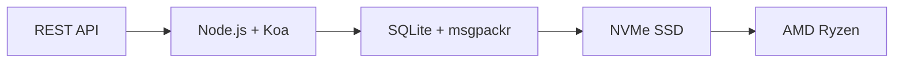

# Den Första Kompletta E-post-API:n: Hur Forward Email Revolutionerade E-posthantering {#the-first-complete-email-api-how-forward-email-revolutionized-email-management}


<p class="lead mt-3">
  <strong>TL;DR:</strong> Vi byggde världens första kompletta REST API för e-posthantering med avancerade sökfunktioner som ingen annan tjänst erbjuder. Medan Gmail, Outlook och Apple tvingar utvecklare in i IMAP-helvetet eller API:er med begränsad hastighet, levererar Forward Email blixtsnabba CRUD-operationer för meddelanden, mappar, kontakter och kalendrar genom ett enhetligt REST-gränssnitt med över 15 sökparametrar. Detta är det e-post-API som utvecklare har väntat på.
</p>


## Innehållsförteckning {#table-of-contents}

* [Problemet med E-post-API:n](#the-email-api-problem)
* [Vad Utvecklare Egentligen Säger](#what-developers-are-actually-saying)
* [Forward Emails Revolutionerande Lösning](#forward-emails-revolutionary-solution)
  * [Varför Vi Byggde Detta](#why-we-built-this)
  * [Enkel Autentisering](#simple-authentication)
* [20 Endpoints som Förändrar Allt](#20-endpoints-that-change-everything)
  * [Meddelanden (5 endpoints)](#messages-5-endpoints)
  * [Mappar (5 endpoints)](#folders-5-endpoints)
  * [Kontakter (5 endpoints)](#contacts-5-endpoints)
  * [Kalendrar (5 endpoints)](#calendars-5-endpoints)
* [Avancerad Sökning: Ingen Annan Tjänst Kan Mäta Sig](#advanced-search-no-other-service-compares)
  * [Sök-API-landskapet är Trasigt](#the-search-api-landscape-is-broken)
  * [Forward Emails Revolutionerande Sök-API](#forward-emails-revolutionary-search-api)
  * [Sökexempel från Verkligheten](#real-world-search-examples)
  * [Prestandafördelar](#performance-advantages)
  * [Sökfunktioner Ingen Annan Har](#search-features-no-one-else-has)
  * [Varför Detta Är Viktigt för Utvecklare](#why-this-matters-for-developers)
  * [Den Tekniska Implementeringen](#the-technical-implementation)
* [Blixtsnabb Prestandaarkitektur](#blazing-fast-performance-architecture)
  * [Prestandamått](#performance-benchmarks)
  * [Integritetsfokuserad Arkitektur](#privacy-first-architecture)
* [Varför Vi Är Annorlunda: Den Kompletta Jämförelsen](#why-were-different-the-complete-comparison)
  * [Stora Begränsningar hos Leverantörer](#major-provider-limitations)
  * [Forward Emails Fördelar](#forward-email-advantages)
  * [Problemet med Öppen Källkod och Transparens](#the-open-source-transparency-problem)
* [30+ Integrationsexempel från Verkligheten](#30-real-world-integration-examples)
  * [1. Förbättring av WordPress Kontaktformulär](#1-wordpress-contact-form-enhancement)
  * [2. Zapier-alternativ för E-postautomation](#2-zapier-alternative-for-email-automation)
  * [3. CRM E-postsynkronisering](#3-crm-email-synchronization)
  * [4. E-handelsorderhantering](#4-e-commerce-order-processing)
  * [5. Supportärendeintegration](#5-support-ticket-integration)
  * [6. Nyhetsbrevsystem](#6-newsletter-management-system)
  * [7. E-postbaserad Uppgiftshantering](#7-email-based-task-management)
  * [8. E-postaggregering för Flera Konton](#8-multi-account-email-aggregation)
  * [9. Avancerad E-postanalysdashboard](#9-advanced-email-analytics-dashboard)
  * [10. Smart E-postarkivering](#10-smart-email-archiving)
  * [11. E-post-till-Kalender Integration](#11-email-to-calendar-integration)
  * [12. E-postbackup och Efterlevnad](#12-email-backup-and-compliance)
  * [13. E-postbaserad Innehållshantering](#13-email-based-content-management)
  * [14. Hantering av E-postmallar](#14-email-template-management)
  * [15. E-postbaserad Arbetsflödesautomation](#15-email-based-workflow-automation)
  * [16. Övervakning av E-postsäkerhet](#16-email-security-monitoring)
  * [17. Insamling av Enkäter via E-post](#17-email-based-survey-collection)
  * [18. Övervakning av E-postprestanda](#18-email-performance-monitoring)
  * [19. Kvalificering av Leads via E-post](#19-email-based-lead-qualification)
  * [20. Projektledning via E-post](#20-email-based-project-management)
  * [21. Lagerhantering via E-post](#21-email-based-inventory-management)
  * [22. Fakturahantering via E-post](#22-email-based-invoice-processing)
  * [23. Evenemangsregistrering via E-post](#23-email-based-event-registration)
  * [24. Arbetsflöde för Dokumentgodkännande via E-post](#24-email-based-document-approval-workflow)
  * [25. Analys av Kundfeedback via E-post](#25-email-based-customer-feedback-analysis)
  * [26. Rekryteringspipeline via E-post](#26-email-based-recruitment-pipeline)
  * [27. Hantering av Utgiftsrapporter via E-post](#27-email-based-expense-report-processing)
  * [28. Rapportering av Kvalitetssäkring via E-post](#28-email-based-quality-assurance-reporting)
  * [29. Leverantörshantering via E-post](#29-email-based-vendor-management)
  * [30. Övervakning av Sociala Medier via E-post](#30-email-based-social-media-monitoring)
* [Komma Igång](#getting-started)
  * [1. Skapa Ditt Forward Email-konto](#1-create-your-forward-email-account)
  * [2. Generera API-uppgifter](#2-generate-api-credentials)
  * [3. Gör Ditt Första API-anrop](#3-make-your-first-api-call)
  * [4. Utforska Dokumentationen](#4-explore-the-documentation)
* [Tekniska Resurser](#technical-resources)
## Problemet med Email-API:er {#the-email-api-problem}

Email-API:er är fundamentalt trasiga. Punkt.

Varje stor email-leverantör tvingar utvecklare till ett av två hemska val:

1. **IMAP-helvetet**: Att kämpa med ett 30 år gammalt protokoll designat för skrivbordsklienter, inte moderna applikationer
2. **Handikappade API:er**: Hastighetsbegränsade, skrivskyddade, OAuth-komplexa API:er som inte kan hantera din faktiska email-data

Resultatet? Utvecklare överger antingen email-integration helt eller slösar veckor på att bygga sköra IMAP-wrapper som ständigt går sönder.

> \[!WARNING]
> **Den smutsiga hemligheten**: De flesta "email-API:er" är bara sändar-API:er. Du kan inte programmatisk organisera mappar, synka kontakter eller hantera kalendrar genom ett enkelt REST-gränssnitt. Fram tills nu.


## Vad Utvecklare Egentligen Säger {#what-developers-are-actually-saying}

Frustrationen är verklig och dokumenterad överallt:

> "Jag försökte nyligen integrera Gmail i min app, och jag lade för mycket tid på det. Jag bestämde mig för att det inte är värt att stödja Gmail."
>
> *- [Hacker News-utvecklare](https://news.ycombinator.com/item?id=42106944), 147 uppröster*

> "Är alla email-API:er mediokra? De verkar begränsade eller restriktiva på något sätt."
>
> *- [Reddit r/SaaS-diskussion](https://www.reddit.com/r/SaaS/comments/1cm84s7/are_all_email_apis_mediocre/)*

> "Varför måste email-utveckling vara så dålig?"
>
> *- [Reddit r/webdev](https://www.reddit.com/r/webdev/comments/15trnp2/why_does_email_development_have_to_suck/), 89 kommentarer om utvecklar-smärta*

> "Vad gör Gmail API mer effektivt än IMAP? En annan anledning till att Gmail API är mycket mer effektivt är att det bara behöver ladda ner varje meddelande en gång. Med IMAP måste varje meddelande laddas ner och indexeras..."
>
> *- [Stack Overflow-fråga](https://stackoverflow.com/questions/25431022/what-makes-the-gmail-api-more-efficient-than-imap) med 47 uppröster*

Bevisen finns överallt:

* **WordPress SMTP-problem**: [631 GitHub-ärenden](https://github.com/awesomemotive/WP-Mail-SMTP/issues) om leveransfel för email
* **Zapier-begränsningar**: [Community-klagomål](https://community.zapier.com/featured-articles-65/email-parser-by-zapier-limitations-and-alternatives-16958) om 10 email/timme-gränser och IMAP-detekteringsfel
* **IMAP API-projekt**: [Flera](https://github.com/ewildgoose/imap-api) [öppen-källkod](https://emailengine.app/) [projekt](https://www.npmjs.com/package/imapflow) finns specifikt för att "konvertera IMAP till REST" eftersom ingen leverantör erbjuder detta
* **Gmail API-frustrationer**: [Stack Overflow](https://stackoverflow.com/questions/tagged/gmail-api) har 4 847 frågor taggade "gmail-api" med vanliga klagomål om hastighetsbegränsningar och komplexitet


## Forward Emails Revolutionerande Lösning {#forward-emails-revolutionary-solution}

**Vi är den första email-tjänsten som erbjuder fullständiga CRUD-operationer för all email-data genom ett enhetligt REST API.**

Det här är inte bara ett annat sändar-API. Detta är fullständig programmatisk kontroll över:

* **Meddelanden**: Skapa, läs, uppdatera, ta bort, sök, flytta, flagga
* **Mappar**: Full IMAP-mapphantering via REST-endpoints
* **Kontakter**: [CardDAV](https://tools.ietf.org/html/rfc6352) kontaktlagring och synkronisering
* **Kalendrar**: [CalDAV](https://tools.ietf.org/html/rfc4791) kalenderhändelser och schemaläggning

### Varför Vi Byggde Detta {#why-we-built-this}

**Problemet**: Varje email-leverantör behandlar email som en svart låda. Du kan skicka email, kanske läsa dem med komplex OAuth, men du kan inte verkligen *hantera* din email-data programmatisk.

**Vår Vision**: Email ska vara lika enkelt att integrera som vilket modernt API som helst. Inga IMAP-bibliotek. Ingen OAuth-komplexitet. Inga mardrömmar med hastighetsbegränsningar. Bara enkla REST-endpoints som fungerar.

**Resultatet**: Den första email-tjänsten där du kan bygga en komplett email-klient, CRM-integration eller automationssystem med enbart HTTP-förfrågningar.

### Enkel Autentisering {#simple-authentication}

Ingen [OAuth-komplexitet](https://oauth.net/2/). Inga [app-specifika lösenord](https://support.google.com/accounts/answer/185833). Bara dina alias-uppgifter:

```bash
curl -u "alias@yourdomain.com:password" \
  https://api.forwardemail.net/v1/messages
```
## 20 Endpoints som förändrar allt {#20-endpoints-that-change-everything}

### Meddelanden (5 endpoints) {#messages-5-endpoints}

* `GET /v1/messages` - Lista meddelanden med filtrering (`?folder=`, `?is_unread=`, `?is_flagged=`)
* `POST /v1/messages` - Skicka nya meddelanden direkt till mappar
* `GET /v1/messages/:id` - Hämta specifikt meddelande med full metadata
* `PUT /v1/messages/:id` - Uppdatera meddelande (flaggor, mapp, läst status)
* `DELETE /v1/messages/:id` - Ta bort meddelande permanent

### Mappar (5 endpoints) {#folders-5-endpoints}

* `GET /v1/folders` - Lista alla mappar med prenumerationsstatus
* `POST /v1/folders` - Skapa ny mapp med anpassade egenskaper
* `GET /v1/folders/:id` - Hämta mappdetaljer och meddelanderäkning
* `PUT /v1/folders/:id` - Uppdatera mappegenskaper och prenumeration
* `DELETE /v1/folders/:id` - Ta bort mapp och hantera meddelandeomflyttning

### Kontakter (5 endpoints) {#contacts-5-endpoints}

* `GET /v1/contacts` - Lista kontakter med sökning och paginering
* `POST /v1/contacts` - Skapa ny kontakt med full vCard-support
* `GET /v1/contacts/:id` - Hämta kontakt med alla fält och metadata
* `PUT /v1/contacts/:id` - Uppdatera kontaktinformation med ETag-validering
* `DELETE /v1/contacts/:id` - Ta bort kontakt med kaskadhantering

### Kalendrar (5 endpoints) {#calendars-5-endpoints}

* `GET /v1/calendars` - Lista kalenderhändelser med datumfiltrering
* `POST /v1/calendars` - Skapa kalenderhändelse med deltagare och återkommande
* `GET /v1/calendars/:id` - Hämta händelsedetaljer med tidszonsstöd
* `PUT /v1/calendars/:id` - Uppdatera händelse med konfliktupptäckt
* `DELETE /v1/calendars/:id` - Ta bort händelse med deltagarnotifikationer


## Avancerad sökning: Ingen annan tjänst kan mäta sig {#advanced-search-no-other-service-compares}

**Forward Email är den enda e-posttjänsten som erbjuder omfattande, programmatisk sökning över alla meddelandefält via ett REST API.**

Medan andra leverantörer erbjuder högst grundläggande filtrering, har vi byggt det mest avancerade e-postsöknings-API som någonsin skapats. Ingen Gmail API, Outlook API eller någon annan tjänst kommer i närheten av våra sökmöjligheter.

### Landskapet för sök-API:er är trasigt {#the-search-api-landscape-is-broken}

**Begränsningar i Gmail API:s sökfunktion:**

* ✅ Endast grundläggande `q`-parameter
* ❌ Ingen fältspecifik sökning
* ❌ Ingen datumintervallsfiltrering
* ❌ Ingen storleksbaserad filtrering
* ❌ Ingen bilaga-filtrering
* ❌ Begränsad till Gmail:s söksyntax

**Begränsningar i Outlook API:s sökfunktion:**

* ✅ Grundläggande `$search`-parameter
* ❌ Ingen avancerad fältinriktning
* ❌ Inga komplexa frågekombinationer
* ❌ Aggressiv hastighetsbegränsning
* ❌ Komplex OData-syntax krävs

**Apple iCloud:**

* ❌ Inget API alls
* ❌ Endast IMAP-sökning (om du får det att fungera)

**ProtonMail & Tuta:**

* ❌ Inga publika API:er
* ❌ Inga programmatriska sökmöjligheter

### Forward Emails revolutionerande sök-API {#forward-emails-revolutionary-search-api}

**Vi erbjuder 15+ sökparametrar som ingen annan tjänst tillhandahåller:**

| Sökfunktion                   | Forward Email                        | Gmail API    | Outlook API        | Andra  |
| ----------------------------- | ---------------------------------- | ------------ | ------------------ | ------ |
| **Fältspecifik sökning**      | ✅ Ämne, innehåll, från, till, cc, headers | ❌            | ❌                  | ❌      |
| **Generell sökning i flera fält** | ✅ `?search=` över alla fält         | ✅ Grundläggande `q=` | ✅ Grundläggande `$search=` | ❌      |
| **Datumintervallsfiltrering** | ✅ `?since=` & `?before=`           | ❌            | ❌                  | ❌      |
| **Storleksbaserad filtrering** | ✅ `?min_size=` & `?max_size=`      | ❌            | ❌                  | ❌      |
| **Bilaga-filtrering**         | ✅ `?has_attachments=true/false`    | ❌            | ❌                  | ❌      |
| **Header-sökning**            | ✅ `?headers=X-Priority`            | ❌            | ❌                  | ❌      |
| **Meddelande-ID-sökning**     | ✅ `?message_id=abc123`             | ❌            | ❌                  | ❌      |
| **Kombinerade filter**        | ✅ Flera parametrar med OCH-logik   | ❌            | ❌                  | ❌      |
| **Skiftlägesokänslig**        | ✅ Alla sökningar                   | ✅            | ✅                  | ❌      |
| **Paginering stöd**           | ✅ Fungerar med alla sökparametrar  | ✅            | ✅                  | ❌      |
### Real-World Search Examples {#real-world-search-examples}

**Hitta alla fakturor från förra kvartalet:**

```bash
# Forward Email - Enkel och kraftfull
GET /v1/messages?subject=invoice&since=2024-01-01T00:00:00Z&before=2024-04-01T00:00:00Z

# Gmail API - Omöjligt med deras begränsade sökning
# Ingen filtrering på datumintervall tillgänglig

# Outlook API - Komplex OData-syntax, begränsad funktionalitet
GET /me/messages?$search="invoice"&$filter=receivedDateTime ge 2024-01-01T00:00:00Z
```

**Sök efter stora bilagor från specifik avsändare:**

```bash
# Forward Email - Omfattande filtrering
GET /v1/messages?from=finance@company.com&has_attachments=true&min_size=1000000

# Gmail API - Kan inte filtrera efter storlek eller bilagor programmässigt
# Outlook API - Ingen storleksfiltrering tillgänglig
# Andra - Inga API:er tillgängliga
```

**Komplex sökning med flera fält:**

```bash
# Forward Email - Avancerade frågemöjligheter
GET /v1/messages?body=quarterly&from=manager&is_flagged=true&folder=Reports

# Gmail API - Begränsad till grundläggande textsökning
GET /gmail/v1/users/me/messages?q=quarterly

# Outlook API - Grundläggande sökning utan fältinriktning
GET /me/messages?$search="quarterly"
```

### Performance Advantages {#performance-advantages}

**Forward Email sökprestanda:**

* ⚡ **Svarstider under 100 ms** för komplexa sökningar
* 🔍 **Regexoptimering** med korrekt indexering
* 📊 **Parallell frågekörning** för räkning och data
* 💾 **Effektiv minnesanvändning** med slanka frågor

**Konkurrenters prestandaproblem:**

* 🐌 **Gmail API**: Begränsad till 250 kvotenheter per användare per sekund
* 🐌 **Outlook API**: Aggressiv begränsning med komplexa backoff-krav
* 🐌 **Andra**: Inga API:er att jämföra med

### Search Features No One Else Has {#search-features-no-one-else-has}

#### 1. Header-Specific Search {#1-header-specific-search}

```bash
# Hitta meddelanden med specifika headers
GET /v1/messages?headers=X-Priority:1
GET /v1/messages?headers=X-Spam-Score
```

#### 2. Size-Based Intelligence {#2-size-based-intelligence}

```bash
# Hitta nyhetsbrev (vanligtvis stora)
GET /v1/messages?min_size=50000&from=newsletter

# Hitta snabba svar (vanligtvis små)
GET /v1/messages?max_size=1000&to=support
```

#### 3. Attachment-Based Workflows {#3-attachment-based-workflows}

```bash
# Hitta alla dokument skickade till juridiska avdelningen
GET /v1/messages?to=legal&has_attachments=true&body=contract

# Hitta e-post utan bilagor för rensning
GET /v1/messages?has_attachments=false&before=2023-01-01T00:00:00Z
```

#### 4. Combined Business Logic {#4-combined-business-logic}

```bash
# Hitta brådskande flaggade meddelanden från VIP med bilagor
GET /v1/messages?is_flagged=true&from=ceo&has_attachments=true&subject=urgent
```

### Why This Matters for Developers {#why-this-matters-for-developers}

**Bygg applikationer som tidigare var omöjliga:**

1. **Avancerad e-postanalys**: Analysera e-postmönster efter storlek, avsändare, innehåll
2. **Intelligent e-posthantering**: Auto-organisera baserat på komplexa kriterier
3. **Efterlevnad och upptäckt**: Hitta specifika e-postmeddelanden för juridiska krav
4. **Business Intelligence**: Extrahera insikter från e-postkommunikationsmönster
5. **Automatiserade arbetsflöden**: Trigga åtgärder baserat på sofistikerade e-postfilter

### The Technical Implementation {#the-technical-implementation}

Vårt sök-API använder:

* **Regexoptimering** med korrekta indexeringsstrategier
* **Parallell körning** för prestanda
* **Inmatningsvalidering** för säkerhet
* **Omfattande felhantering** för tillförlitlighet

```javascript
// Exempel: Implementering av komplex sökning
const searchConditions = [];

if (ctx.query.subject) {
  searchConditions.push({
    subject: { $regex: ctx.query.subject, $options: 'i' }
  });
}

if (ctx.query.from) {
  searchConditions.push({
    $or: [
      { 'from.address': { $regex: ctx.query.from, $options: 'i' } },
      { 'from.name': { $regex: ctx.query.from, $options: 'i' } }
    ]
  });
}

// Kombinera med OCH-logik
if (searchConditions.length > 0) {
  query.$and = searchConditions;
}
```

> \[!TIP]
> **Utvecklarfördel**: Med Forward Emails sök-API kan du bygga e-postapplikationer som kan mäta sig med desktopklienter i funktionalitet samtidigt som du behåller enkelheten i REST-API:er.
## Blazing Fast Performance Architecture {#blazing-fast-performance-architecture}

Vår tekniska stack är byggd för hastighet och tillförlitlighet:


```mermaid
graph LR
    A[REST API] --> B[Node.js + Koa]
    B --> C[SQLite + msgpackr]
    C --> D[NVMe SSD]
    D --> E[AMD Ryzen]
```

### Performance Benchmarks {#performance-benchmarks}

**Varför vi är blixtsnabba:**

| Komponent   | Teknik                                                                            | Prestandafördel                              |
| ----------- | -------------------------------------------------------------------------------- | -------------------------------------------- |
| **Lagring** | [NVMe SSD](https://en.wikipedia.org/wiki/NVM_Express)                           | 10x snabbare än traditionell SATA            |
| **Databas** | [SQLite](https://sqlite.org/) + [msgpackr](https://github.com/kriszyp/msgpackr) | Noll nätverksfördröjning, optimerad serialisering |
| **Hårdvara**| [AMD Ryzen](https://www.amd.com/en/products/processors/desktops/ryzen) bare metal | Ingen virtualiseringsöverhead                 |
| **Caching** | I minnet + persistent                                                            | Svarstider under millisekunden                |
| **Backups** | [Cloudflare R2](https://www.cloudflare.com/products/r2/) krypterad              | Företagsklassad tillförlitlighet              |

**Verkliga prestandasiffror:**

* **API-svarstid**: < 50 ms i genomsnitt
* **Meddelandehämtning**: < 10 ms för cachade meddelanden
* **Mappoperationer**: < 5 ms för metadataoperationer
* **Kontaktsynk**: 1000+ kontakter/sekund
* **Drifttid**: 99,99 % SLA med redundant infrastruktur

### Privacy-First Architecture {#privacy-first-architecture}

**Zero-Knowledge Design**: Endast du har tillgång med ditt IMAP-lösenord – vi kan inte läsa dina e-postmeddelanden. Vår [zero-knowledge-arkitektur](https://forwardemail.net/en/security) säkerställer fullständig integritet samtidigt som den levererar blixtsnabb prestanda.


## Why We're Different: The Complete Comparison {#why-were-different-the-complete-comparison}

### Major Provider Limitations {#major-provider-limitations}

| Leverantör      | Kärnproblem                              | Specifika begränsningar                                                                                                                                                                                                                                                                                                                                                                                                                                               |
| --------------- | --------------------------------------- | -------------------------------------------------------------------------------------------------------------------------------------------------------------------------------------------------------------------------------------------------------------------------------------------------------------------------------------------------------------------------------------------------------------------------------------------------------------------- |
| **Gmail API**   | Endast läsning, Komplex OAuth, Separata API:er | • [Kan inte ändra befintliga meddelanden](https://developers.google.com/gmail/api/reference/rest/v1/users.messages)<br>• [Etiketter ≠ mappar](https://developers.google.com/gmail/api/reference/rest/v1/users.labels)<br>• [1 miljard kvotenheter/dag gräns](https://developers.google.com/gmail/api/reference/quota)<br>• [Kräver separata API:er](https://developers.google.com/workspace) för kontakter/kalender                                                           |
| **Outlook API** | Föråldrad, Förvirrande, Företagsfokuserad | • [REST-endpoints föråldrade mars 2024](https://learn.microsoft.com/en-us/outlook/rest/compare-graph)<br>• [Flera förvirrande API:er](https://learn.microsoft.com/en-us/office/client-developer/outlook/selecting-an-api-or-technology-for-developing-solutions-for-outlook) (EWS, Graph, REST)<br>• [Microsoft Graph-komplexitet](https://learn.microsoft.com/en-us/graph/overview)<br>• [Aggressiv begränsning](https://learn.microsoft.com/en-us/graph/throttling) |
| **Apple iCloud**| Ingen offentlig API                      | • [Ingen offentlig API alls](https://support.apple.com/en-us/102654)<br>• [Endast IMAP med 1000 e-postmeddelanden/dag gräns](https://support.apple.com/en-us/102654)<br>• [App-specifika lösenord krävs](https://support.apple.com/en-us/102654)<br>• [500 mottagare per meddelande gräns](https://support.apple.com/en-us/102654)                                                                                                                                              |
| **ProtonMail**  | Ingen API, Falska öppen källkod-påståenden | • [Ingen offentlig API tillgänglig](https://proton.me/support/protonmail-bridge-clients)<br>• [Bridge-programvara krävs](https://proton.me/mail/bridge) för IMAP-åtkomst<br>• [Påstår sig vara "öppen källkod"](https://proton.me/blog/open-source) men [serverkoden är proprietär](https://github.com/ProtonMail)<br>• [Begränsad till betalplaner](https://proton.me/pricing)                                                                                                         |
| **Tuta**        | Ingen API, Vilseledande transparens      | • [Ingen REST API för e-posthantering](https://tuta.com/support#technical)<br>• [Påstår sig vara "öppen källkod"](https://tuta.com/blog/posts/open-source-email) men [backend är stängd](https://github.com/tutao/tutanota)<br>• [IMAP/SMTP stöds inte](https://tuta.com/support#imap)<br>• [Proprietär kryptering](https://tuta.com/encryption) förhindrar standardintegrationer                                                                                               |
| **Zapier Email**| Strikta hastighetsbegränsningar          | • [10 e-postmeddelanden per timme gräns](https://help.zapier.com/hc/en-us/articles/8496181555597-Email-Parser-by-Zapier-limitations-and-alternatives)<br>• [Ingen IMAP-mappåtkomst](https://help.zapier.com/hc/en-us/articles/8496181555597-Email-Parser-by-Zapier-limitations-and-alternatives)<br>• [Begränsade parsningsegenskaper](https://help.zapier.com/hc/en-us/articles/8496181555597-Email-Parser-by-Zapier-limitations-and-alternatives)                                 |
### Fördelar med Forward Email {#forward-email-advantages}

| Funktion           | Forward Email                                                                                | Konkurrenter                             |
| ------------------ | -------------------------------------------------------------------------------------------- | ----------------------------------------- |
| **Fullständigt CRUD** | ✅ Fullständig skapa, läsa, uppdatera, ta bort för all data                                  | ❌ Endast läsning eller begränsade operationer |
| **Enhetligt API**  | ✅ Meddelanden, mappar, kontakter, kalendrar i ett API                                       | ❌ Separata API:er eller saknade funktioner |
| **Enkel autentisering** | ✅ Grundläggande autentisering med aliasuppgifter                                         | ❌ Komplex OAuth med flera behörigheter   |
| **Inga hastighetsbegränsningar** | ✅ Generösa gränser utformade för riktiga applikationer                            | ❌ Restriktiva kvoter som bryter arbetsflöden |
| **Självhosting**   | ✅ [Fullständig självhostningslösning](https://forwardemail.net/en/blog/docs/self-hosted-solution) | ❌ Endast leverantörslåsning               |
| **Integritet**     | ✅ Nollkunskap, krypterad, privat                                                            | ❌ Datainsamling och integritetsproblem   |
| **Prestanda**      | ✅ Svarstider under 50 ms, NVMe-lagring                                                      | ❌ Nätverksfördröjning, strypningsförseningar |

### Problemet med öppen källkod och transparens {#the-open-source-transparency-problem}

**ProtonMail och Tuta marknadsför sig som "öppen källkod" och "transparenta", men detta är vilseledande marknadsföring som bryter mot moderna integritetsprinciper.**

> \[!WARNING]
> **Falska transparenspåståenden**: Både ProtonMail och Tuta framhäver sina "öppen källkod"-meriter samtidigt som deras mest kritiska serverkod är proprietär och stängd.

**ProtonMails vilseledning:**

* **Påståenden**: ["Vi är öppen källkod"](https://proton.me/blog/open-source) framträdande i marknadsföring
* **Verklighet**: [Serverkoden är helt proprietär](https://github.com/ProtonMail) – endast klientappar är öppen källkod
* **Konsekvens**: Användare kan inte verifiera serverkryptering, datahantering eller integritetspåståenden
* **Transparensbrott**: Ingen möjlighet att granska den faktiska e-posthanteringen och lagringssystemen

**Tutas vilseledande marknadsföring:**

* **Påståenden**: ["Öppen källkod e-post"](https://tuta.com/blog/posts/open-source-email) som en kärnförsäljningspunkt
* **Verklighet**: [Backend-infrastrukturen är stängd källkod](https://github.com/tutao/tutanota) – endast frontend är tillgänglig
* **Konsekvens**: Proprietär kryptering hindrar standardprotokoll för e-post (IMAP/SMTP)
* **Lås-in-strategi**: Anpassad kryptering tvingar leverantörsberoende

**Varför detta är viktigt för modern integritet:**

År 2025 kräver verklig integritet **fullständig transparens**. När e-postleverantörer påstår sig vara "öppen källkod" men döljer sin serverkod:

1. **Okontrollerbar kryptering**: Du kan inte granska hur dina data faktiskt krypteras
2. **Dolda datapraxis**: Serverns datahantering förblir en svart låda
3. **Säkerhet baserad på förtroende**: Du måste lita på deras påståenden utan verifiering
4. **Leverantörslåsning**: Proprietära system hindrar dataportabilitet

**Forward Emails verkliga transparens:**

* ✅ **[Fullständig öppen källkod](https://github.com/forwardemail/forwardemail.net)** – server- och klientkod
* ✅ **[Självhosting tillgängligt](https://forwardemail.net/en/blog/docs/self-hosted-solution)** – kör din egen instans
* ✅ **Standardprotokoll** – IMAP, SMTP, CardDAV, CalDAV-kompatibilitet
* ✅ **Granskbar säkerhet** – varje kodrad kan inspekteras
* ✅ **Ingen leverantörslåsning** – dina data, din kontroll

> \[!TIP]
> **Verklig öppen källkod betyder att du kan verifiera varje påstående.** Med Forward Email kan du granska vår kryptering, se över vår datahantering och till och med köra din egen instans. Det är sann transparens.


## 30+ Exempel på verkliga integrationer {#30-real-world-integration-examples}

### 1. Förbättring av WordPress kontaktformulär {#1-wordpress-contact-form-enhancement}
**Problem**: [WordPress SMTP-konfigurationsfel](https://github.com/awesomemotive/WP-Mail-SMTP/issues) ([631 GitHub-ärenden](https://github.com/awesomemotive/WP-Mail-SMTP/issues))
**Lösning**: Direkt API-integration kringgår [SMTP](https://tools.ietf.org/html/rfc5321) helt

```javascript
// WordPress kontaktformulär som sparar till Skickat-mappen
await fetch('https://api.forwardemail.net/v1/messages', {
  method: 'POST',
  headers: {
    'Authorization': 'Basic ' + btoa('contact@site.com:password'),
    'Content-Type': 'application/json'
  },
  body: JSON.stringify({
    to: [{ address: 'owner@site.com' }],
    subject: 'Kontaktformulär: ' + formData.subject,
    text: formData.message,
    folder: 'Sent'
  })
});
```

### 2. Zapier-alternativ för e-postautomation {#2-zapier-alternative-for-email-automation}

**Problem**: [Zapiers gräns på 10 e-postmeddelanden/timme](https://help.zapier.com/hc/en-us/articles/8496181555597-Email-Parser-by-Zapier-limitations-and-alternatives) och [IMAP-detekteringsfel](https://community.zapier.com/featured-articles-65/email-parser-by-zapier-limitations-and-alternatives-16958)
**Lösning**: Obegränsad automation med full kontroll över e-post

```javascript
// Auto-organisera e-post efter avsändardomän
const messages = await fetch('/v1/messages?folder=INBOX');
for (const message of messages) {
  const domain = message.from.split('@')[1];
  await fetch(`/v1/messages/${message.id}`, {
    method: 'PUT',
    body: JSON.stringify({ folder: `Clients/${domain}` })
  });
}
```

### 3. CRM-e-postsynkronisering {#3-crm-email-synchronization}

**Problem**: Manuell kontaktadministration mellan e-post och [CRM-system](https://en.wikipedia.org/wiki/Customer_relationship_management)
**Lösning**: Tvåvägssynk med [CardDAV](https://tools.ietf.org/html/rfc6352) kontakt-API

```javascript
// Synkronisera nya e-postkontakter till CRM
const newContacts = await fetch('/v1/contacts');
for (const contact of newContacts) {
  await crmAPI.createContact({
    name: contact.name,
    email: contact.email,
    source: 'email_api'
  });
}
```

### 4. E-handelsorderhantering {#4-e-commerce-order-processing}

**Problem**: Manuell orderhantering via e-post för [e-handelsplattformar](https://en.wikipedia.org/wiki/E-commerce)
**Lösning**: Automatiserad orderhanteringspipeline

```javascript
// Hantera orderbekräftelsemail
const orders = await fetch('/v1/messages?folder=Orders');
const orderEmails = orders.filter(msg =>
  msg.subject.includes('Order Confirmation')
);

for (const order of orderEmails) {
  const orderData = parseOrderEmail(order.text);
  await updateInventory(orderData);
  await fetch(`/v1/messages/${order.id}`, {
    method: 'PUT',
    body: JSON.stringify({ folder: 'Orders/Processed' })
  });
}
```

### 5. Supportärendeintegration {#5-support-ticket-integration}

**Problem**: E-posttrådar spridda över [helpdesk-plattformar](https://en.wikipedia.org/wiki/Help_desk_software)
**Lösning**: Komplett spårning av e-posttrådar

```javascript
// Skapa supportärende från e-posttråd
const messages = await fetch('/v1/messages?folder=Support');
const supportEmails = messages.filter(msg =>
  msg.to.some(addr => addr.includes('support@'))
);

for (const email of supportEmails) {
  const ticket = await supportSystem.createTicket({
    subject: email.subject,
    from: email.from,
    body: email.text,
    timestamp: email.date
  });
}
```

### 6. Nyhetsbrevsystem {#6-newsletter-management-system}

**Problem**: Begränsade [nyhetsbrevsplattformar](https://en.wikipedia.org/wiki/Email_marketing) integrationer
**Lösning**: Komplett hantering av prenumerantlivscykeln

```javascript
// Automatisk hantering av nyhetsbrevsprenumerationer
const messages = await fetch('/v1/messages?folder=Newsletter');
const unsubscribes = messages.filter(msg =>
  msg.subject.toLowerCase().includes('unsubscribe')
);

for (const msg of unsubscribes) {
  await removeSubscriber(msg.from);
  await fetch(`/v1/messages/${msg.id}`, {
    method: 'PUT',
    body: JSON.stringify({ folder: 'Newsletter/Unsubscribed' })
  });
}
```

### 7. E-postbaserad uppgiftshantering {#7-email-based-task-management}

**Problem**: Överbelastad inkorg och [uppgiftsspårning](https://en.wikipedia.org/wiki/Task_management)
**Lösning**: Konvertera e-post till handlingsbara uppgifter
```javascript
// Create tasks from flagged emails
const messages = await fetch('/v1/messages?is_flagged=true');
for (const email of messages) {
  await taskManager.createTask({
    title: email.subject,
    description: email.text,
    assignee: email.to[0].address,
    dueDate: extractDueDate(email.text)
  });
}
```

### 8. Multi-Account Email Aggregation {#8-multi-account-email-aggregation}

**Problem**: Managing [multiple email accounts](https://en.wikipedia.org/wiki/Email_client) across providers
**Solution**: Unified inbox interface

```javascript
// Aggregate emails from multiple accounts
const accounts = ['work@domain.com', 'personal@domain.com'];
const allMessages = [];

for (const account of accounts) {
  const messages = await fetch('/v1/messages', {
    headers: { 'Authorization': getAuth(account) }
  });
  allMessages.push(...messages.map(m => ({ ...m, account })));
}
```

### 9. Advanced Email Analytics Dashboard {#9-advanced-email-analytics-dashboard}

**Problem**: No insights into [email patterns](https://en.wikipedia.org/wiki/Email_analytics) with sophisticated filtering
**Solution**: Custom email analytics using advanced search capabilities

```javascript
// Generate comprehensive email analytics using advanced search
const analytics = {};

// Analyze email volume by sender domain
const messages = await fetch('/v1/messages');
analytics.senderDomains = analyzeSenderDomains(messages);

// Find large attachments consuming storage
const largeAttachments = await fetch('/v1/messages?has_attachments=true&min_size=1000000');
analytics.storageHogs = largeAttachments.map(msg => ({
  subject: msg.subject,
  from: msg.from,
  size: msg.size
}));

// Analyze communication patterns with VIPs
const vipEmails = await fetch('/v1/messages?from=ceo@company.com');
const urgentVipEmails = await fetch('/v1/messages?from=ceo@company.com&subject=urgent');
analytics.vipCommunication = {
  total: vipEmails.length,
  urgent: urgentVipEmails.length,
  urgencyRate: (urgentVipEmails.length / vipEmails.length) * 100
};

// Find unread emails by date range for follow-up
const lastWeek = new Date(Date.now() - 7 * 24 * 60 * 60 * 1000).toISOString();
const unreadRecent = await fetch(`/v1/messages?is_unread=true&since=${lastWeek}`);
analytics.followUpNeeded = unreadRecent.length;

// Analyze email sizes for optimization
const smallEmails = await fetch('/v1/messages?max_size=1000');
const mediumEmails = await fetch('/v1/messages?min_size=1000&max_size=50000');
const largeEmails = await fetch('/v1/messages?min_size=50000');
analytics.sizeDistribution = {
  small: smallEmails.length,
  medium: mediumEmails.length,
  large: largeEmails.length
};

// Search for compliance-related emails
const complianceEmails = await fetch('/v1/messages?body=confidential&has_attachments=true');
analytics.complianceReview = complianceEmails.length;
```

### 10. Smart Email Archiving {#10-smart-email-archiving}

**Problem**: Manual [email organization](https://en.wikipedia.org/wiki/Email_management)
**Solution**: Intelligent email categorization

```javascript
// Auto-archive old emails by category
const messages = await fetch('/v1/messages');
const oldEmails = messages.filter(email =>
  isOlderThan(email.date, 90) // 90 days
);

for (const email of oldEmails) {
  const category = categorizeEmail(email);
  await fetch(`/v1/messages/${email.id}`, {
    method: 'PUT',
    body: JSON.stringify({ folder: `Archive/${category}` })
  });
}
```

### 11. Email-to-Calendar Integration {#11-email-to-calendar-integration}

**Problem**: Manual [calendar event](https://tools.ietf.org/html/rfc4791) creation from emails
**Solution**: Automatic event extraction and creation

```javascript
// Extract meeting details from emails
const messages = await fetch('/v1/messages?folder=Meetings');
const meetingEmails = messages.filter(email =>
  email.subject.toLowerCase().includes('meeting')
);

for (const email of meetingEmails) {
  const meetingData = extractMeetingInfo(email.text);
  if (meetingData.date && meetingData.time) {
    await fetch('/v1/calendars', {
      method: 'POST',
      body: JSON.stringify({
        title: email.subject,
        start: meetingData.datetime,
        attendees: [email.from, ...email.to]
      })
    });
  }
}
```

### 12. E-postbackup och efterlevnad {#12-email-backup-and-compliance}

**Problem**: [E-postlagring](https://en.wikipedia.org/wiki/Email_retention_policy) och efterlevnadskrav  
**Lösning**: Automatisk backup med bevarande av metadata

```javascript
// Säkerhetskopiera e-post med full metadata
const allMessages = await fetch('/v1/messages');
const backup = {
  timestamp: new Date(),
  messages: allMessages.map(msg => ({
    id: msg.id,
    subject: msg.subject,
    from: msg.from,
    to: msg.to,
    date: msg.date,
    flags: msg.flags
  }))
};
await saveToComplianceStorage(backup);
```

### 13. E-postbaserad innehållshantering {#13-email-based-content-management}

**Problem**: Hantering av innehållsinskick via e-post för [CMS-plattformar](https://en.wikipedia.org/wiki/Content_management_system)  
**Lösning**: E-post som innehållshanteringssystem

```javascript
// Bearbeta innehållsinskick från e-post
const messages = await fetch('/v1/messages?folder=Submissions');
const submissions = messages.filter(msg =>
  msg.to.some(addr => addr.includes('submit@'))
);

for (const submission of submissions) {
  const content = parseSubmission(submission.text);
  await cms.createDraft({
    title: submission.subject,
    content: content.body,
    author: submission.from
  });
}
```

### 14. Hantering av e-postmallar {#14-email-template-management}

**Problem**: Inkonsekventa [e-postmallar](https://en.wikipedia.org/wiki/Email_template) inom teamet  
**Lösning**: Centraliserat mall-system med API

```javascript
// Skicka mallade e-postmeddelanden med dynamiskt innehåll
const template = await getEmailTemplate('welcome');
await fetch('/v1/messages', {
  method: 'POST',
  body: JSON.stringify({
    to: [{ address: newUser.email }],
    subject: template.subject.replace('{{name}}', newUser.name),
    html: template.html.replace('{{name}}', newUser.name),
    folder: 'Sent'
  })
});
```

### 15. E-postbaserad arbetsflödesautomatisering {#15-email-based-workflow-automation}

**Problem**: Manuella [godkännandeprocesser](https://en.wikipedia.org/wiki/Workflow) via e-post  
**Lösning**: Automatiska arbetsflödesutlösare

```javascript
// Bearbeta godkännandemail
const messages = await fetch('/v1/messages?folder=Approvals');
const approvals = messages.filter(msg =>
  msg.subject.includes('APPROVAL')
);

for (const approval of approvals) {
  const decision = parseApprovalDecision(approval.text);
  await workflow.processApproval({
    requestId: extractRequestId(approval.subject),
    decision: decision,
    approver: approval.from
  });
}
```

### 16. Övervakning av e-postsäkerhet {#16-email-security-monitoring}

**Problem**: Manuell [säkerhetshotdetektion](https://en.wikipedia.org/wiki/Email_security)  
**Lösning**: Automatisk hotanalys

```javascript
// Övervaka misstänkta e-postmeddelanden
const recentEmails = await fetch('/v1/messages');
for (const email of recentEmails) {
  const threatScore = analyzeThreat(email);
  if (threatScore > 0.8) {
    await fetch(`/v1/messages/${email.id}`, {
      method: 'PUT',
      body: JSON.stringify({ folder: 'Security/Quarantine' })
    });
    await alertSecurityTeam(email);
  }
}
```

### 17. E-postbaserad insamling av undersökningar {#17-email-based-survey-collection}

**Problem**: Manuell bearbetning av [undersökningssvar](https://en.wikipedia.org/wiki/Survey_methodology)  
**Lösning**: Automatisk aggregering av svar

```javascript
// Samla in och bearbeta undersökningssvar
const messages = await fetch('/v1/messages?folder=Surveys');
const responses = messages.filter(msg =>
  msg.subject.includes('Survey Response')
);

const surveyData = responses.map(email => ({
  respondent: email.from,
  responses: parseSurveyData(email.text),
  timestamp: email.date
}));
await updateSurveyResults(surveyData);
```

### 18. Övervakning av e-postprestanda {#18-email-performance-monitoring}

**Problem**: Ingen insyn i [e-postleveransprestanda](https://en.wikipedia.org/wiki/Email_deliverability)  
**Lösning**: Realtidsmått för e-post

```javascript
// Övervaka e-postleveransprestanda
const sentEmails = await fetch('/v1/messages?folder=Sent');
const deliveryStats = {
  sent: sentEmails.length,
  bounces: await countBounces(),
  deliveryRate: calculateDeliveryRate()
};
await updateDashboard(deliveryStats);
```
### 19. E-postbaserad lead-kvalificering {#19-email-based-lead-qualification}

**Problem**: Manuell [lead scoring](https://en.wikipedia.org/wiki/Lead_scoring) från e-postinteraktioner  
**Lösning**: Automatiserad pipeline för lead-kvalificering

```javascript
// Score leads based on email engagement
const prospects = await fetch('/v1/contacts');
for (const prospect of prospects) {
  const messages = await fetch('/v1/messages');
  const emails = messages.filter(msg =>
    msg.from.includes(prospect.email)
  );
  const score = calculateEngagementScore(emails);
  await crm.updateLeadScore(prospect.id, score);
}
```

### 20. E-postbaserad projektledning {#20-email-based-project-management}

**Problem**: [Projektuppdateringar](https://en.wikipedia.org/wiki/Project_management) spridda över e-posttrådar  
**Lösning**: Centraliserad kommunikationshub för projekt

```javascript
// Extract project updates from emails
const messages = await fetch('/v1/messages?folder=Projects');
const projectEmails = messages.filter(msg =>
  msg.subject.includes('Project Update')
);

for (const email of projectEmails) {
  const update = parseProjectUpdate(email.text);
  await projectManager.addUpdate({
    project: update.projectId,
    author: email.from,
    content: update.content
  });
}
```

### 21. E-postbaserad lagerhantering {#21-email-based-inventory-management}

**Problem**: Manuella lageruppdateringar från leverantörers e-post  
**Lösning**: Automatiserad lageruppföljning från e-postaviseringar

```javascript
// Process inventory updates from supplier emails
const messages = await fetch('/v1/messages?folder=Suppliers');
const inventoryEmails = messages.filter(msg =>
  msg.subject.includes('Inventory Update') || msg.subject.includes('Stock Alert')
);

for (const email of inventoryEmails) {
  const inventoryData = parseInventoryUpdate(email.text);
  await inventory.updateStock({
    sku: inventoryData.sku,
    quantity: inventoryData.quantity,
    supplier: email.from,
    timestamp: email.date
  });

  // Move to processed folder
  await fetch(`/v1/messages/${email.id}`, {
    method: 'PUT',
    body: JSON.stringify({ folder: 'Suppliers/Processed' })
  });
}
```

### 22. E-postbaserad fakturahantering {#22-email-based-invoice-processing}

**Problem**: Manuell [fakturahantering](https://en.wikipedia.org/wiki/Invoice_processing) och integration med bokföring  
**Lösning**: Automatiserad fakturautvinning och synkronisering med bokföringssystem

```javascript
// Extract invoice data from email attachments
const messages = await fetch('/v1/messages?folder=Invoices');
const invoiceEmails = messages.filter(msg =>
  msg.subject.toLowerCase().includes('invoice') && msg.attachments.length > 0
);

for (const email of invoiceEmails) {
  const invoiceData = await extractInvoiceData(email.attachments[0]);
  await accounting.createInvoice({
    vendor: email.from,
    amount: invoiceData.total,
    dueDate: invoiceData.dueDate,
    items: invoiceData.lineItems
  });

  // Flag as processed
  await fetch(`/v1/messages/${email.id}`, {
    method: 'PUT',
    body: JSON.stringify({ flags: ['\\Seen', '\\Flagged'] })
  });
}
```

### 23. E-postbaserad evenemangsregistrering {#23-email-based-event-registration}

**Problem**: Manuell [evenemangsregistrering](https://en.wikipedia.org/wiki/Event_management) från e-postsvar  
**Lösning**: Automatiserad hantering av deltagare och kalenderintegration

```javascript
// Process event registration emails
const messages = await fetch('/v1/messages?folder=Events');
const registrations = messages.filter(msg =>
  msg.subject.includes('Registration') || msg.subject.includes('RSVP')
);

for (const registration of registrations) {
  const attendeeData = parseRegistration(registration.text);

  // Add to attendee list
  await events.addAttendee({
    event: attendeeData.eventId,
    name: attendeeData.name,
    email: registration.from,
    dietary: attendeeData.dietaryRestrictions
  });

  // Create calendar event for attendee
  await fetch('/v1/calendars', {
    method: 'POST',
    body: JSON.stringify({
      title: attendeeData.eventName,
      start: attendeeData.eventDate,
      attendees: [registration.from]
    })
  });
}
```
### 24. E-postbaserat dokumentgodkännandeflöde {#24-email-based-document-approval-workflow}

**Problem**: Komplexa [dokumentgodkännanden](https://en.wikipedia.org/wiki/Document_management_system) via e-post
**Lösning**: Automatiserad spårning av godkännanden och versionshantering av dokument

```javascript
// Track document approval workflow
const messages = await fetch('/v1/messages?folder=Approvals');
const approvalEmails = messages.filter(msg =>
  msg.subject.includes('Document Approval')
);

for (const email of approvalEmails) {
  const approval = parseApprovalEmail(email.text);

  await documentSystem.updateApproval({
    documentId: approval.documentId,
    approver: email.from,
    status: approval.decision, // 'approved', 'rejected', 'needs_changes'
    comments: approval.comments,
    timestamp: email.date
  });

  // Check if all approvals complete
  const document = await documentSystem.getDocument(approval.documentId);
  if (document.allApprovalsComplete) {
    await documentSystem.finalizeDocument(approval.documentId);
  }
}
```

### 25. E-postbaserad kundfeedbackanalys {#25-email-based-customer-feedback-analysis}

**Problem**: Manuell insamling av [kundfeedback](https://en.wikipedia.org/wiki/Customer_feedback) och sentimentanalys
**Lösning**: Automatiserad bearbetning av feedback och spårning av sentiment

```javascript
// Analyze customer feedback from emails
const messages = await fetch('/v1/messages?folder=Feedback');
const feedbackEmails = messages.filter(msg =>
  msg.to.some(addr => addr.includes('feedback@'))
);

for (const email of feedbackEmails) {
  const sentiment = await analyzeSentiment(email.text);
  const category = categorizeFeeback(email.text);

  await feedback.recordFeedback({
    customer: email.from,
    content: email.text,
    sentiment: sentiment.score, // -1 to 1
    category: category, // 'bug', 'feature', 'complaint', 'praise'
    priority: calculatePriority(sentiment, category),
    timestamp: email.date
  });

  // Auto-escalate negative feedback
  if (sentiment.score < -0.5) {
    await escalateToSupport(email);
  }
}
```

### 26. E-postbaserad rekryteringspipeline {#26-email-based-recruitment-pipeline}

**Problem**: Manuell [rekrytering](https://en.wikipedia.org/wiki/Recruitment) och kandidatspårning
**Lösning**: Automatiserad kandidatadministration och schemaläggning av intervjuer

```javascript
// Process job application emails
const messages = await fetch('/v1/messages?folder=Careers');
const applications = messages.filter(msg =>
  msg.subject.toLowerCase().includes('application') && msg.attachments.length > 0
);

for (const application of applications) {
  const resume = await parseResume(application.attachments[0]);

  const candidate = await ats.createCandidate({
    name: resume.name,
    email: application.from,
    skills: resume.skills,
    experience: resume.experience,
    position: extractPosition(application.subject)
  });

  // Auto-schedule screening if qualified
  if (candidate.qualificationScore > 0.7) {
    await calendar.scheduleInterview({
      candidateId: candidate.id,
      type: 'phone_screening',
      duration: 30
    });
  }
}
```

### 27. E-postbaserad hantering av utgiftsrapporter {#27-email-based-expense-report-processing}

**Problem**: Manuell inlämning och godkännande av [utgiftsrapporter](https://en.wikipedia.org/wiki/Expense_report)
**Lösning**: Automatiserad utgiftsutvinning och godkännandeflöde

```javascript
// Process expense report emails
const messages = await fetch('/v1/messages?folder=Expenses');
const expenseEmails = messages.filter(msg =>
  msg.subject.includes('Expense') && msg.attachments.length > 0
);

for (const email of expenseEmails) {
  const receipts = await processReceipts(email.attachments);

  const expenseReport = await expenses.createReport({
    employee: email.from,
    expenses: receipts.map(receipt => ({
      amount: receipt.total,
      category: receipt.category,
      date: receipt.date,
      merchant: receipt.merchant
    })),
    totalAmount: receipts.reduce((sum, r) => sum + r.total, 0)
  });

  // Auto-approve small amounts
  if (expenseReport.totalAmount < 100) {
    await expenses.approve(expenseReport.id);
  } else {
    await expenses.sendForApproval(expenseReport.id);
  }
}
```
### 28. E-postbaserad kvalitetskontrollrapportering {#28-email-based-quality-assurance-reporting}

**Problem**: Manuell [kvalitetssäkring](https://en.wikipedia.org/wiki/Quality_assurance) och felspårning  
**Lösning**: Automatiserad hantering av QA-problem och felrapportering

```javascript
// Process QA bug reports from email
const messages = await fetch('/v1/messages?folder=QA');
const bugReports = messages.filter(msg =>
  msg.subject.includes('Bug Report') || msg.subject.includes('QA Issue')
);

for (const report of bugReports) {
  const bugData = parseBugReport(report.text);

  const ticket = await bugTracker.createIssue({
    title: report.subject,
    description: bugData.description,
    severity: bugData.severity,
    steps: bugData.stepsToReproduce,
    reporter: report.from,
    attachments: report.attachments
  });

  // Auto-assign based on component
  const assignee = await getComponentOwner(bugData.component);
  await bugTracker.assign(ticket.id, assignee);

  // Create calendar reminder for follow-up
  await fetch('/v1/calendars', {
    method: 'POST',
    body: JSON.stringify({
      title: `Follow up on ${ticket.id}`,
      start: addDays(new Date(), 3),
      attendees: [assignee]
    })
  });
}
```

### 29. E-postbaserad leverantörshantering {#29-email-based-vendor-management}

**Problem**: Manuell [leverantörskommunikation](https://en.wikipedia.org/wiki/Vendor_management) och kontraktsspårning  
**Lösning**: Automatiserad hantering av leverantörsrelationer

```javascript
// Track vendor communications and contracts
const messages = await fetch('/v1/messages?folder=Vendors');
const vendorEmails = messages.filter(msg =>
  isVendorEmail(msg.from)
);

for (const email of vendorEmails) {
  const vendor = await vendors.getByEmail(email.from);

  // Log communication
  await vendors.logCommunication({
    vendorId: vendor.id,
    type: 'email',
    subject: email.subject,
    content: email.text,
    timestamp: email.date
  });

  // Check for contract-related keywords
  if (email.text.includes('contract') || email.text.includes('renewal')) {
    await vendors.flagForContractReview({
      vendorId: vendor.id,
      emailId: email.id,
      priority: 'high'
    });

    // Create task for procurement team
    await tasks.create({
      title: `Granska kontraktskommunikation från ${vendor.name}`,
      assignee: 'procurement@company.com',
      dueDate: addDays(new Date(), 2)
    });
  }
}
```

### 30. E-postbaserad övervakning av sociala medier {#30-email-based-social-media-monitoring}

**Problem**: Manuell [övervakning av sociala medier](https://en.wikipedia.org/wiki/Social_media_monitoring) och svarshantering  
**Lösning**: Automatiserad bearbetning av sociala medievarningar och samordning av svar

```javascript
// Process social media alerts from email notifications
const messages = await fetch('/v1/messages?folder=Social');
const socialAlerts = messages.filter(msg =>
  msg.from.includes('alerts@') || msg.subject.includes('Social Mention')
);

for (const alert of socialAlerts) {
  const mention = parseSocialMention(alert.text);

  await socialMedia.recordMention({
    platform: mention.platform,
    author: mention.author,
    content: mention.content,
    sentiment: mention.sentiment,
    reach: mention.followerCount,
    url: mention.url
  });

  // Auto-escalate negative mentions with high reach
  if (mention.sentiment < -0.5 && mention.followerCount > 10000) {
    await socialMedia.escalateToTeam({
      mentionId: mention.id,
      priority: 'urgent',
      assignee: 'social-media-manager@company.com'
    });

    // Create calendar reminder for immediate response
    await fetch('/v1/calendars', {
      method: 'POST',
      body: JSON.stringify({
        title: `Brådskande: Svara på negativt omnämnande i sociala medier`,
        start: addMinutes(new Date(), 30),
        attendees: ['social-media-manager@company.com']
      })
    });
  }
}
```


## Kom igång {#getting-started}

### 1. Skapa ditt vidarebefordringskonto för e-post {#1-create-your-forward-email-account}

Registrera dig på [forwardemail.net](https://forwardemail.net) och verifiera din domän.

### 2. Generera API-referenser {#2-generate-api-credentials}

Din alias-e-post och lösenord fungerar som API-referenser – ingen ytterligare konfiguration krävs.
### 3. Gör ditt första API-anrop {#3-make-your-first-api-call}

```bash
# Lista dina meddelanden
curl -u "your-alias@domain.com:password" \
  https://api.forwardemail.net/v1/messages

# Skapa en ny kontakt
curl -u "your-alias@domain.com:password" \
  -X POST \
  -H "Content-Type: application/json" \
  -d '{"fullName":"John Doe","emails":[{"value":"john@example.com"}]}' \
  https://api.forwardemail.net/v1/contacts
```

### 4. Utforska dokumentationen {#4-explore-the-documentation}

Besök [forwardemail.net/en/email-api](https://forwardemail.net/en/email-api) för komplett API-dokumentation med interaktiva exempel.


## Tekniska resurser {#technical-resources}

* **[Komplett API-dokumentation](https://forwardemail.net/en/email-api)** - Interaktiv OpenAPI 3.0-specifikation
* **[Guide för egen hosting](https://forwardemail.net/en/blog/docs/self-hosted-solution)** - Distribuera Forward Email på din infrastruktur
* **[Säkerhetsvitbok](https://forwardemail.net/technical-whitepaper.pdf)** - Teknisk arkitektur och säkerhetsdetaljer
* **[GitHub-repository](https://github.com/forwardemail/forwardemail.net)** - Öppen källkod
* **[Utvecklarstöd](mailto:api@forwardemail.net)** - Direktkontakt med vårt ingenjörsteam

---

**Redo att revolutionera din e-postintegration?** [Börja bygga med Forward Emails API idag](https://forwardemail.net/en/email-api) och upplev den första kompletta e-posthanteringsplattformen designad för utvecklare.

*Forward Email: E-posttjänsten som äntligen får API:er rätt.*
