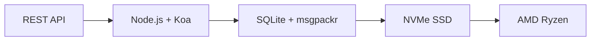

# API อีเมลที่สมบูรณ์แบบตัวแรก: Forward Email ปฏิวัติการจัดการอีเมลได้อย่างไร {#the-first-complete-email-api-how-forward-email-revolutionized-email-management}


<p class="lead mt-3">
<strong>สรุปโดยย่อ:</strong> เราได้สร้าง REST API ที่สมบูรณ์แบบตัวแรกของโลกสำหรับการจัดการอีเมล พร้อมความสามารถในการค้นหาขั้นสูงที่บริการอื่นไม่มี ในขณะที่ Gmail, Outlook และ Apple บังคับให้นักพัฒนาต้องใช้ IMAP หรือ API ที่จำกัดอัตรา Forward Email มอบการดำเนินการ CRUD ที่รวดเร็วอย่างเหลือเชื่อสำหรับข้อความ โฟลเดอร์ รายชื่อติดต่อ และปฏิทิน ผ่านอินเทอร์เฟซ REST แบบรวมศูนย์พร้อมพารามิเตอร์การค้นหามากกว่า 15 รายการ นี่คือสิ่งที่นักพัฒนา API อีเมลรอคอย
</p>

## สารบัญ {#table-of-contents}

* [ปัญหา API ของอีเมล](#the-email-api-problem)
* [สิ่งที่นักพัฒนาพูดจริงๆ](#what-developers-are-actually-saying)
* [โซลูชันปฏิวัติวงการของ Forward Email](#forward-emails-revolutionary-solution)
  * [เหตุใดเราจึงสร้างสิ่งนี้](#why-we-built-this)
  * [การตรวจสอบสิทธิ์แบบง่าย](#simple-authentication)
* [20 จุดสิ้นสุดที่เปลี่ยนแปลงทุกสิ่ง](#20-endpoints-that-change-everything)
  * [ข้อความ (5 จุดสิ้นสุด)](#messages-5-endpoints)
  * [โฟลเดอร์ (5 จุดสิ้นสุด)](#folders-5-endpoints)
  * [ผู้ติดต่อ (5 จุดสิ้นสุด)](#contacts-5-endpoints)
  * [ปฏิทิน (5 จุดสิ้นสุด)](#calendars-5-endpoints)
* [การค้นหาขั้นสูง: ไม่มีบริการอื่นใดที่เปรียบเทียบได้](#advanced-search-no-other-service-compares)
  * [ภูมิทัศน์ API การค้นหาถูกทำลาย](#the-search-api-landscape-is-broken)
  * [API การค้นหาอันปฏิวัติวงการของ Forward Email](#forward-emails-revolutionary-search-api)
  * [ตัวอย่างการค้นหาในโลกแห่งความเป็นจริง](#real-world-search-examples)
  * [ข้อได้เปรียบด้านประสิทธิภาพ](#performance-advantages)
  * [คุณสมบัติการค้นหาที่ไม่มีใครมี](#search-features-no-one-else-has)
  * [เหตุใดสิ่งนี้จึงสำคัญสำหรับนักพัฒนา](#why-this-matters-for-developers)
  * [การดำเนินการทางเทคนิค](#the-technical-implementation)
* [สถาปัตยกรรมประสิทธิภาพอันรวดเร็ว](#blazing-fast-performance-architecture)
  * [เกณฑ์มาตรฐานประสิทธิภาพ](#performance-benchmarks)
  * [สถาปัตยกรรมที่ให้ความสำคัญกับความเป็นส่วนตัวเป็นอันดับแรก](#privacy-first-architecture)
* [ทำไมเราถึงแตกต่าง: การเปรียบเทียบที่สมบูรณ์](#why-were-different-the-complete-comparison)
  * [ข้อจำกัดของผู้ให้บริการหลัก](#major-provider-limitations)
  * [ข้อดีของการส่งต่ออีเมล์](#forward-email-advantages)
  * [ปัญหาความโปร่งใสของโอเพนซอร์ส](#the-open-source-transparency-problem)
* [ตัวอย่างการบูรณาการในโลกแห่งความเป็นจริงมากกว่า 30 รายการ](#30-real-world-integration-examples)
  * [1. การปรับปรุงแบบฟอร์มติดต่อ WordPress](#1-wordpress-contact-form-enhancement)
  * [2. ทางเลือก Zapier สำหรับการทำงานอัตโนมัติของอีเมล](#2-zapier-alternative-for-email-automation)
  * [3. การซิงโครไนซ์อีเมล CRM](#3-crm-email-synchronization)
  * [4. การประมวลผลคำสั่งซื้ออีคอมเมิร์ซ](#4-e-commerce-order-processing)
  * [5. การรวมตั๋วสนับสนุน](#5-support-ticket-integration)
  * [6. ระบบจัดการจดหมายข่าว](#6-newsletter-management-system)
  * [7. การจัดการงานผ่านอีเมล](#7-email-based-task-management)
  * [8. การรวบรวมอีเมลหลายบัญชี](#8-multi-account-email-aggregation)
  * [9. แผงควบคุมการวิเคราะห์อีเมลขั้นสูง](#9-advanced-email-analytics-dashboard)
  * [10. การเก็บถาวรอีเมลอัจฉริยะ](#10-smart-email-archiving)
  * [11. การรวมอีเมลกับปฏิทิน](#11-email-to-calendar-integration)
  * [12. การสำรองข้อมูลอีเมลและการปฏิบัติตามข้อกำหนด](#12-email-backup-and-compliance)
  * [13. การจัดการเนื้อหาผ่านอีเมล](#13-email-based-content-management)
  * [14. การจัดการเทมเพลตอีเมล](#14-email-template-management)
  * [15. การทำงานอัตโนมัติบนอีเมล](#15-email-based-workflow-automation)
  * [16. การตรวจสอบความปลอดภัยอีเมล](#16-email-security-monitoring)
  * [17. การรวบรวมแบบสำรวจผ่านอีเมล](#17-email-based-survey-collection)
  * [18. การตรวจสอบประสิทธิภาพอีเมล](#18-email-performance-monitoring)
  * [19. การประเมินคุณสมบัติผู้มีแนวโน้มจะเป็นลูกค้าผ่านอีเมล](#19-email-based-lead-qualification)
  * [20. การจัดการโครงการผ่านอีเมล](#20-email-based-project-management)
  * [21. การจัดการสินค้าคงคลังผ่านอีเมล](#21-email-based-inventory-management)
  * [22. การประมวลผลใบแจ้งหนี้ผ่านอีเมล](#22-email-based-invoice-processing)
  * [23. การลงทะเบียนกิจกรรมผ่านอีเมล](#23-email-based-event-registration)
  * [24. เวิร์กโฟลว์การอนุมัติเอกสารผ่านอีเมล](#24-email-based-document-approval-workflow)
  * [25. การวิเคราะห์ข้อเสนอแนะของลูกค้าผ่านอีเมล](#25-email-based-customer-feedback-analysis)
  * [26. กระบวนการสรรหาบุคลากรผ่านอีเมล](#26-email-based-recruitment-pipeline)
  * [27. การประมวลผลรายงานค่าใช้จ่ายผ่านอีเมล](#27-email-based-expense-report-processing)
  * [28. การรายงานการประกันคุณภาพผ่านอีเมล](#28-email-based-quality-assurance-reporting)
  * [29. การจัดการผู้ขายผ่านอีเมล](#29-email-based-vendor-management)
  * [30. การติดตามโซเชียลมีเดียผ่านอีเมล](#30-email-based-social-media-monitoring)
* [การเริ่มต้น](#getting-started)
  * [1. สร้างบัญชีอีเมลส่งต่อของคุณ](#1-create-your-forward-email-account)
  * [2. สร้างข้อมูลประจำตัว API](#2-generate-api-credentials)
  * [3. สร้างการเรียก API ครั้งแรกของคุณ](#3-make-your-first-api-call)
  * [4. สำรวจเอกสาร](#4-explore-the-documentation)
* [ทรัพยากรทางเทคนิค](#technical-resources)

## ปัญหา API อีเมล {#the-email-api-problem}

API ของอีเมลมีปัญหาพื้นฐาน จบนะ

ผู้ให้บริการอีเมลรายใหญ่ทุกรายบังคับให้นักพัฒนาต้องเลือกหนึ่งในสองทางเลือกที่เลวร้าย:

1. **IMAP Hell**: ต่อสู้กับโปรโตคอลอายุ 30 ปีที่ออกแบบมาสำหรับไคลเอนต์เดสก์ท็อป ไม่ใช่แอปพลิเคชันสมัยใหม่
2. **API ที่มีปัญหา**: API ที่มีอัตราจำกัด อ่านอย่างเดียว และซับซ้อนแบบ OAuth ซึ่งไม่สามารถจัดการข้อมูลอีเมลจริงของคุณได้

ผลลัพธ์? นักพัฒนาจะละทิ้งการรวมอีเมลทั้งหมดหรือเสียเวลาหลายสัปดาห์ไปกับการสร้าง IMAP wrapper ที่เปราะบางและมีปัญหาอยู่ตลอดเวลา

> \[!WARNING]
> **ความลับสุดสกปรก**: "API อีเมล" ส่วนใหญ่เป็นเพียง API สำหรับส่งเท่านั้น คุณไม่สามารถจัดระเบียบโฟลเดอร์ ซิงค์รายชื่อติดต่อ หรือจัดการปฏิทินผ่านอินเทอร์เฟซ REST แบบง่ายๆ ได้ด้วยโปรแกรม จนกระทั่งบัดนี้

## สิ่งที่นักพัฒนากำลังพูดอยู่จริงๆ {#what-developers-are-actually-saying}

ความหงุดหงิดเป็นเรื่องจริงและมีการบันทึกไว้ทุกที่:

> "เมื่อเร็วๆ นี้ฉันพยายามรวม Gmail ไว้ในแอปของฉัน และใช้เวลากับมันมากเกินไป ฉันเลยตัดสินใจว่ามันไม่คุ้มค่าที่จะสนับสนุน Gmail"
>
> *- [ผู้พัฒนา Hacker News](https://news.ycombinator.com/item?id=42106944), 147 โหวต*

> "API อีเมลทั้งหมดอยู่ในระดับปานกลางหรือเปล่า? ดูเหมือนจะมีข้อจำกัดหรือข้อจำกัดบางประการ"
>
> *- [การสนทนา Reddit r/SaaS](https://www.reddit.com/r/SaaS/comments/1cm84s7/are_all_email_apis_mediocre/)*

> "ทำไมการพัฒนาอีเมลถึงต้องห่วยแตกด้วย?"
>
> *- [เรดดิต r/webdev](https://www.reddit.com/r/webdev/comments/15trnp2/why_does_email_development_have_to_suck/), 89 ความคิดเห็นที่ทำให้นักพัฒนาปวดหัว*

> "อะไรที่ทำให้ Gmail API มีประสิทธิภาพมากกว่า IMAP อีกเหตุผลหนึ่งที่ Gmail API มีประสิทธิภาพมากกว่ามากก็คือ มันต้องดาวน์โหลดแต่ละข้อความเพียงครั้งเดียวเท่านั้น แต่ด้วย IMAP แต่ละข้อความจะต้องได้รับการดาวน์โหลดและจัดทำดัชนี..."
>
> *- [คำถาม Stack Overflow](https://stackoverflow.com/questions/25431022/what-makes-the-gmail-api-more-efficient-than-imap) มีผู้โหวตเห็นด้วย 47 คน*

หลักฐานมีอยู่ทุกที่:

* **ปัญหา SMTP ของ WordPress**: [ปัญหา GitHub 631 รายการ](https://github.com/awesomemotive/WP-Mail-SMTP/issues) เกี่ยวกับความล้มเหลวในการส่งอีเมล
* **ข้อจำกัดของ Zapier**: [การร้องเรียนของชุมชน](https://community.zapier.com/featured-articles-65/email-parser-by-zapier-limitations-and-alternatives-16958) จำกัดอีเมลประมาณ 10 ฉบับต่อชั่วโมง และความล้มเหลวในการตรวจจับ IMAP
* **โครงการ IMAP API**: [หลายรายการ](https://github.com/ewildgoose/imap-api) [โอเพนซอร์ส](https://emailengine.app/) [โครงการต่างๆ](https://www.npmjs.com/package/imapflow) มีไว้สำหรับ "แปลง IMAP เป็น REST" โดยเฉพาะ เนื่องจากไม่มีผู้ให้บริการรายใดเสนอบริการนี้
* **ปัญหา Gmail API**: [สแต็คโอเวอร์โฟลว์](https://stackoverflow.com/questions/tagged/gmail-api) มีคำถาม 4,847 ข้อที่ติดแท็ก "gmail-api" พร้อมข้อร้องเรียนทั่วไปเกี่ยวกับขีดจำกัดอัตราและความซับซ้อน

## โซลูชันปฏิวัติวงการอีเมลส่งต่อ {#forward-emails-revolutionary-solution}

**เราเป็นบริการอีเมลรายแรกที่นำเสนอการดำเนินการ CRUD แบบครบวงจรสำหรับข้อมูลอีเมลทั้งหมดผ่าน REST API แบบรวม**

นี่ไม่ใช่แค่ API การส่งธรรมดาๆ แต่นี่คือการควบคุมโปรแกรมแบบสมบูรณ์สำหรับ:

* **ข้อความ**: สร้าง อ่าน อัปเดต ลบ ค้นหา ย้าย ตั้งค่าสถานะ
* **โฟลเดอร์**: การจัดการโฟลเดอร์ IMAP เต็มรูปแบบผ่านจุดปลายทาง REST
* **รายชื่อติดต่อ**: การจัดเก็บและซิงโครไนซ์รายชื่อติดต่อ [การ์ดเดฟ](https://tools.ietf.org/html/rfc6352)
* **ปฏิทิน**: กิจกรรมและกำหนดการในปฏิทิน [คาลเดฟ](https://tools.ietf.org/html/rfc4791)

### เหตุใดเราจึงสร้าง {#why-we-built-this} นี้

**ปัญหา**: ผู้ให้บริการอีเมลทุกรายถือว่าอีเมลเป็นกล่องดำ คุณสามารถส่งอีเมลหรืออ่านอีเมลด้วย OAuth ที่ซับซ้อนได้ แต่คุณไม่สามารถ *จัดการ* ข้อมูลอีเมลของคุณผ่านโปรแกรมได้อย่างแท้จริง

**วิสัยทัศน์ของเรา**: อีเมลควรผสานรวมได้ง่ายเหมือน API สมัยใหม่ ไม่ต้องใช้ไลบรารี IMAP ไม่ต้องใช้ OAuth ที่ซับซ้อน ไม่มีปัญหาเรื่องขีดจำกัดอัตรา มีเพียงจุดสิ้นสุด REST ง่ายๆ ที่ใช้งานได้จริง

**ผลลัพธ์**: บริการอีเมลแรกที่คุณสามารถสร้างไคลเอนต์อีเมล การบูรณาการ CRM หรือระบบอัตโนมัติที่สมบูรณ์โดยใช้เพียงคำขอ HTTP เท่านั้น

### การตรวจสอบสิทธิ์แบบง่าย {#simple-authentication}

ไม่มี [ความซับซ้อนของ OAuth](https://oauth.net/2/) ไม่มี [รหัสผ่านเฉพาะแอป](https://support.google.com/accounts/answer/185833) มีเพียงข้อมูลประจำตัวนามแฝงของคุณ:

```bash
curl -u "alias@yourdomain.com:password" \
  https://api.forwardemail.net/v1/messages
```

## 20 จุดสิ้นสุดที่เปลี่ยนแปลงทุกสิ่ง {#20-endpoints-that-change-everything}

ข้อความ ### (จุดสิ้นสุด 5 จุด) {#messages-5-endpoints}

* `GET /v1/messages` - แสดงรายการข้อความพร้อมตัวกรอง (`?folder=`, `?is_unread=`, `?is_flagged=`)
* `POST /v1/messages` - ส่งข้อความใหม่ไปยังโฟลเดอร์โดยตรง
* `GET /v1/messages/:id` - ดึงข้อมูลข้อความที่ระบุพร้อมข้อมูลเมตาทั้งหมด
* `PUT /v1/messages/:id` - อัปเดตข้อความ (แฟล็ก, โฟลเดอร์, สถานะการอ่าน)
* `DELETE /v1/messages/:id` - ลบข้อความอย่างถาวร

### โฟลเดอร์ (5 จุดสิ้นสุด) {#folders-5-endpoints}

* `GET /v1/folders` - แสดงรายการโฟลเดอร์ทั้งหมดพร้อมสถานะการสมัครรับข้อมูล
* `POST /v1/folders` - สร้างโฟลเดอร์ใหม่พร้อมคุณสมบัติที่กำหนดเอง
* `GET /v1/folders/:id` - ดูรายละเอียดโฟลเดอร์และจำนวนข้อความ
* `PUT /v1/folders/:id` - อัปเดตคุณสมบัติโฟลเดอร์และการสมัครรับข้อมูล
* `DELETE /v1/folders/:id` - ลบโฟลเดอร์และจัดการการย้ายข้อความ

### ผู้ติดต่อ (5 จุดสิ้นสุด) {#contacts-5-endpoints}

* `GET /v1/contacts` - แสดงรายการผู้ติดต่อพร้อมการค้นหาและการแบ่งหน้า
* `POST /v1/contacts` - สร้างผู้ติดต่อใหม่พร้อมรองรับ vCard อย่างเต็มรูปแบบ
* `GET /v1/contacts/:id` - ดึงข้อมูลผู้ติดต่อพร้อมฟิลด์และข้อมูลเมตาทั้งหมด
* `PUT /v1/contacts/:id` - อัปเดตข้อมูลผู้ติดต่อด้วยการตรวจสอบความถูกต้องของ ETag
* `DELETE /v1/contacts/:id` - ลบผู้ติดต่อด้วยการจัดการแบบเรียงซ้อน

### ปฏิทิน (5 จุดสิ้นสุด) {#calendars-5-endpoints}

* `GET /v1/calendars` - แสดงรายการกิจกรรมในปฏิทินพร้อมตัวกรองวันที่
* `POST /v1/calendars` - สร้างกิจกรรมในปฏิทินพร้อมผู้เข้าร่วมและการเกิดซ้ำ
* `GET /v1/calendars/:id` - รับรายละเอียดกิจกรรมพร้อมการจัดการเขตเวลา
* `PUT /v1/calendars/:id` - อัปเดตกิจกรรมพร้อมการตรวจจับความขัดแย้ง
* `DELETE /v1/calendars/:id` - ลบกิจกรรมพร้อมการแจ้งเตือนผู้เข้าร่วม

## การค้นหาขั้นสูง: ไม่มีบริการอื่นเปรียบเทียบ {#advanced-search-no-other-service-compares}

**Forward Email เป็นบริการอีเมลเพียงบริการเดียวที่นำเสนอการค้นหาแบบโปรแกรมที่ครอบคลุมในทุกฟิลด์ข้อความผ่าน REST API**

แม้ว่าผู้ให้บริการรายอื่นจะเสนอการกรองข้อมูลขั้นพื้นฐานที่ดีที่สุด แต่เราได้สร้าง API การค้นหาอีเมลที่ทันสมัยที่สุดเท่าที่เคยมีมา ไม่มี Gmail API, Outlook API หรือบริการอื่นใดที่เทียบเคียงได้กับความสามารถในการค้นหาของเรา

### ภูมิทัศน์ API การค้นหาเสียหาย {#the-search-api-landscape-is-broken}

**ข้อจำกัดในการค้นหา Gmail API:**

* ✅ เฉพาะพารามิเตอร์ `q` พื้นฐาน
* ❌ ไม่มีการค้นหาเฉพาะช่อง
* ❌ ไม่มีการกรองช่วงวันที่
* ❌ ไม่มีการกรองตามขนาด
* ❌ ไม่มีการกรองไฟล์แนบ
* ❌ จำกัดเฉพาะรูปแบบการค้นหาของ Gmail

**ข้อจำกัดในการค้นหา Outlook API:**

* ✅ พารามิเตอร์ `$search` พื้นฐาน
* ❌ ไม่มีการกำหนดเป้าหมายฟิลด์ขั้นสูง
* ❌ ไม่มีการรวมคิวรีที่ซับซ้อน
* ❌ การจำกัดอัตราที่เข้มงวด
* ❌ จำเป็นต้องใช้ไวยากรณ์ OData ที่ซับซ้อน

**แอปเปิล ไอคลาวน์:**

* ❌ ไม่มี API ใดๆ ทั้งสิ้น
* ❌ ค้นหาด้วย IMAP เท่านั้น (หากสามารถใช้งานได้)

**ProtonMail & Tuta:**

* ❌ ไม่มี API สาธารณะ
* ❌ ไม่มีความสามารถในการค้นหาแบบโปรแกรม

### ส่งต่ออีเมลด้วย API การค้นหาอันปฏิวัติวงการ {#forward-emails-revolutionary-search-api}

**เราเสนอพารามิเตอร์การค้นหามากกว่า 15 รายการที่ไม่มีบริการอื่นใดให้:**

| ความสามารถในการค้นหา | ส่งต่ออีเมล์ | API ของ Gmail | API ของ Outlook | คนอื่น |
| ------------------------------ | -------------------------------------- | ------------ | ------------------ | ------ |
| **การค้นหาเฉพาะสาขา** | ✅ หัวเรื่อง, เนื้อหา, จาก, ถึง, สำเนาถึง, ส่วนหัว | ❌ | ❌ | ❌ |
| **การค้นหาทั่วไปแบบหลายฟิลด์** | ✅ `?search=` ในทุกฟิลด์ | ✅ พื้นฐาน `q=` | ✅ พื้นฐาน `$search=` | ❌ |
| **การกรองช่วงวันที่** | ✅ `?since=` & `?before=` | ❌ | ❌ | ❌ |
| **การกรองตามขนาด** | ✅ `?min_size=` & `?max_size=` | ❌ | ❌ | ❌ |
| **การกรองสิ่งที่แนบมา** | ✅ `?has_attachments=true/false` | ❌ | ❌ | ❌ |
| **การค้นหาส่วนหัว** | ✅ `?headers=X-Priority` | ❌ | ❌ | ❌ |
| **การค้นหา ID ข้อความ** | ✅ `?message_id=abc123` | ❌ | ❌ | ❌ |
| **ตัวกรองรวม** | ✅ พารามิเตอร์หลายตัวพร้อมตรรกะ AND | ❌ | ❌ | ❌ |
| **ไม่คำนึงถึงตัวพิมพ์เล็ก-ใหญ่** | ✅ การค้นหาทั้งหมด | ✅ | ✅ | ❌ |
| **การรองรับการแบ่งหน้า** | ✅ ใช้งานได้กับพารามิเตอร์การค้นหาทั้งหมด | ✅ | ✅ | ❌ |

### ตัวอย่างการค้นหาในโลกแห่งความเป็นจริง {#real-world-search-examples}

**ค้นหาใบแจ้งหนี้ทั้งหมดจากไตรมาสที่แล้ว:**

```bash
# Forward Email - Simple and powerful
GET /v1/messages?subject=invoice&since=2024-01-01T00:00:00Z&before=2024-04-01T00:00:00Z

# Gmail API - Impossible with their limited search
# No date range filtering available

# Outlook API - Complex OData syntax, limited functionality
GET /me/messages?$search="invoice"&$filter=receivedDateTime ge 2024-01-01T00:00:00Z
```

**ค้นหาไฟล์แนบขนาดใหญ่จากผู้ส่งที่ระบุ:**

```bash
# Forward Email - Comprehensive filtering
GET /v1/messages?from=finance@company.com&has_attachments=true&min_size=1000000

# Gmail API - Cannot filter by size or attachments programmatically
# Outlook API - No size filtering available
# Others - No APIs available
```

**การค้นหาหลายฟิลด์ที่ซับซ้อน:**

```bash
# Forward Email - Advanced query capabilities
GET /v1/messages?body=quarterly&from=manager&is_flagged=true&folder=Reports

# Gmail API - Limited to basic text search only
GET /gmail/v1/users/me/messages?q=quarterly

# Outlook API - Basic search without field targeting
GET /me/messages?$search="quarterly"
```

### ข้อได้เปรียบด้านประสิทธิภาพของ {#performance-advantages}

**ประสิทธิภาพการค้นหาอีเมลแบบส่งต่อ:**

* ⚡ **เวลาตอบสนองต่ำกว่า 100 มิลลิวินาที** สำหรับการค้นหาที่ซับซ้อน
* 🔍 **การเพิ่มประสิทธิภาพ Regex** พร้อมการจัดทำดัชนีที่เหมาะสม
* 📊 **การดำเนินการคิวรีแบบขนาน** สำหรับการนับและข้อมูล
* 💾 **การใช้หน่วยความจำอย่างมีประสิทธิภาพ** พร้อมคิวรีแบบ Lean

**ปัญหาด้านประสิทธิภาพของคู่แข่ง:**

* 🐌 **Gmail API**: จำกัดอัตราการใช้งานไว้ที่ 250 หน่วยโควตาต่อผู้ใช้ต่อวินาที
* 🐌 **Outlook API**: การควบคุมปริมาณการใช้งานอย่างเข้มงวดพร้อมข้อกำหนดการย้อนกลับที่ซับซ้อน
* 🐌 **อื่นๆ**: ไม่มี API ใดให้เปรียบเทียบ

### คุณสมบัติการค้นหาที่ไม่มีใครมี {#search-features-no-one-else-has}

#### 1. การค้นหาเฉพาะส่วนหัว {#1-header-specific-search}

```bash
# Find messages with specific headers
GET /v1/messages?headers=X-Priority:1
GET /v1/messages?headers=X-Spam-Score
```

#### 2. ปัญญาประดิษฐ์ตามขนาด {#2-size-based-intelligence}

```bash
# Find newsletter emails (typically large)
GET /v1/messages?min_size=50000&from=newsletter

# Find quick replies (typically small)
GET /v1/messages?max_size=1000&to=support
```

#### 3. เวิร์กโฟลว์ตามไฟล์แนบ {#3-attachment-based-workflows}

```bash
# Find all documents sent to legal team
GET /v1/messages?to=legal&has_attachments=true&body=contract

# Find emails without attachments for cleanup
GET /v1/messages?has_attachments=false&before=2023-01-01T00:00:00Z
```

#### 4. ตรรกะทางธุรกิจรวม {#4-combined-business-logic}

```bash
# Find urgent flagged messages from VIPs with attachments
GET /v1/messages?is_flagged=true&from=ceo&has_attachments=true&subject=urgent
```

### เหตุใดสิ่งนี้จึงสำคัญสำหรับนักพัฒนา {#why-this-matters-for-developers}

**สร้างแอปพลิเคชันที่ก่อนหน้านี้เป็นไปไม่ได้:**

1. **การวิเคราะห์อีเมลขั้นสูง**: วิเคราะห์รูปแบบอีเมลตามขนาด ผู้ส่ง และเนื้อหา
2. **การจัดการอีเมลอัจฉริยะ**: จัดระเบียบอัตโนมัติตามเกณฑ์ที่ซับซ้อน
3. **การปฏิบัติตามข้อกำหนดและการค้นพบ**: ค้นหาอีเมลเฉพาะตามข้อกำหนดทางกฎหมาย
4. **ระบบอัจฉริยะทางธุรกิจ**: ดึงข้อมูลเชิงลึกจากรูปแบบการสื่อสารทางอีเมล
5. **เวิร์กโฟลว์อัตโนมัติ**: ทริกเกอร์การดำเนินการตามตัวกรองอีเมลที่ซับซ้อน

### การใช้งานทางเทคนิค {#the-technical-implementation}

API การค้นหาของเราใช้:

* **การเพิ่มประสิทธิภาพ Regex** ด้วยกลยุทธ์การสร้างดัชนีที่เหมาะสม
* **การทำงานแบบขนาน** เพื่อประสิทธิภาพ
* **การตรวจสอบอินพุต** เพื่อความปลอดภัย
* **การจัดการข้อผิดพลาดที่ครอบคลุม** เพื่อความน่าเชื่อถือ

```javascript
// Example: Complex search implementation
const searchConditions = [];

if (ctx.query.subject) {
  searchConditions.push({
    subject: { $regex: ctx.query.subject, $options: 'i' }
  });
}

if (ctx.query.from) {
  searchConditions.push({
    $or: [
      { 'from.address': { $regex: ctx.query.from, $options: 'i' } },
      { 'from.name': { $regex: ctx.query.from, $options: 'i' } }
    ]
  });
}

// Combine with AND logic
if (searchConditions.length > 0) {
  query.$and = searchConditions;
}
```

> \[!TIP]
> **ข้อได้เปรียบสำหรับนักพัฒนา**: ด้วย API การค้นหาของ Forward Email คุณสามารถสร้างแอปพลิเคชันอีเมลที่มีฟังก์ชันการทำงานเทียบเท่าไคลเอนต์เดสก์ท็อปได้ ในขณะที่ยังคงความเรียบง่ายของ REST API

## สถาปัตยกรรมประสิทธิภาพอันรวดเร็ว {#blazing-fast-performance-architecture}

สแต็กทางเทคนิคของเราสร้างขึ้นเพื่อความเร็วและความน่าเชื่อถือ:



### เกณฑ์มาตรฐานประสิทธิภาพ {#performance-benchmarks}

**ทำไมเราถึงเร็วปานสายฟ้าแลบ:**

| ส่วนประกอบ | เทคโนโลยี | ผลประโยชน์ด้านประสิทธิภาพ |
| ------------ | --------------------------------------------------------------------------------- | --------------------------------------------- |
| **พื้นที่จัดเก็บ** | [NVMe SSD](https://en.wikipedia.org/wiki/NVM_Express) | เร็วกว่า SATA ทั่วไปถึง 10 เท่า |
| **ฐานข้อมูล** | [SQLite](https://sqlite.org/) + [msgpackr](https://github.com/kriszyp/msgpackr) | ความหน่วงเครือข่ายเป็นศูนย์ การปรับให้เหมาะสมของการจัดลำดับ |
| **ฮาร์ดแวร์** | [AMD Ryzen](https://www.amd.com/en/products/processors/desktops/ryzen) โลหะเปล่า | ไม่มีค่าใช้จ่ายในการจำลองเสมือน |
| **การแคช** | ในหน่วยความจำ + ถาวร | เวลาตอบสนองต่ำกว่ามิลลิวินาที |
| **การสำรองข้อมูล** | [Cloudflare R2](https://www.cloudflare.com/products/r2/) เข้ารหัส | ความน่าเชื่อถือระดับองค์กร |

**ตัวเลขประสิทธิภาพที่แท้จริง:**

* **เวลาตอบสนอง API**: น้อยกว่า 50 มิลลิวินาทีโดยเฉลี่ย
* **การดึงข้อมูลข้อความ**: น้อยกว่า 10 มิลลิวินาทีสำหรับข้อความแคช
* **การดำเนินการโฟลเดอร์**: น้อยกว่า 5 มิลลิวินาทีสำหรับการดำเนินการเมตาดาต้า
* **การซิงค์ผู้ติดต่อ**: 1,000 ผู้ติดต่อ/วินาทีขึ้นไป
* **เวลาทำงาน**: SLA 99.99% พร้อมโครงสร้างพื้นฐานแบบซ้ำซ้อน

### สถาปัตยกรรมที่ให้ความสำคัญกับความเป็นส่วนตัวเป็นอันดับแรก {#privacy-first-architecture}

**การออกแบบแบบไร้ความรู้**: มีเพียงคุณเท่านั้นที่เข้าถึงได้ด้วยรหัสผ่าน IMAP ของคุณ เราไม่สามารถอ่านอีเมลของคุณได้ [สถาปัตยกรรมความรู้เป็นศูนย์](https://forwardemail.net/en/security) ของเรารับประกันความเป็นส่วนตัวอย่างสมบูรณ์ พร้อมมอบประสิทธิภาพที่ยอดเยี่ยม

## เหตุใดเราจึงแตกต่าง: การเปรียบเทียบที่สมบูรณ์ {#why-were-different-the-complete-comparison}

### ข้อจำกัดของผู้ให้บริการหลัก {#major-provider-limitations}

| ผู้ให้บริการ | ปัญหาหลัก | ข้อจำกัดเฉพาะ |
| ---------------- | ----------------------------------------- | -------------------------------------------------------------------------------------------------------------------------------------------------------------------------------------------------------------------------------------------------------------------------------------------------------------------------------------------------------------------------------------------------------------------------------------------------------------------- |
| **API ของ Gmail** | อ่านอย่างเดียว, OAuth ที่ซับซ้อน, API แยกต่างหาก | • [Cannot modify existing messages](https://developers.google.com/gmail/api/reference/rest/v1/users.messages)<br>• [Labels ≠ folders](https://developers.google.com/gmail/api/reference/rest/v1/users.labels)<br>• [1 billion quota units/day limit](https://developers.google.com/gmail/api/reference/quota)<br>• [Requires separate APIs](https://developers.google.com/workspace) สำหรับรายชื่อติดต่อ/ปฏิทิน |
| **Outlook API** | ไม่สนับสนุน สับสน เน้นองค์กร | • [REST endpoints deprecated March 2024](https://learn.microsoft.com/en-us/outlook/rest/compare-graph)<br>• [Multiple confusing APIs](https://learn.microsoft.com/en-us/office/client-developer/outlook/selecting-an-api-or-technology-for-developing-solutions-for-outlook) (EWS, กราฟ, REST)<br>• [Microsoft Graph complexity](https://learn.microsoft.com/en-us/graph/overview)<br>• [Aggressive throttling](https://learn.microsoft.com/en-us/graph/throttling) |
| **แอปเปิล ไอคลาวน์** | ไม่มี API สาธารณะ | • [No public API whatsoever](https://support.apple.com/en-us/102654)<br>• [IMAP-only with 1000 emails/day limit](https://support.apple.com/en-us/102654)<br>• [App-specific passwords required](https://support.apple.com/en-us/102654)<br>• [500 recipients per message limit](https://support.apple.com/en-us/102654) |
| **โปรตอนเมล์** | ไม่มี API, การอ้างสิทธิ์โอเพนซอร์สที่เป็นเท็จ | • [No public API available](https://proton.me/support/protonmail-bridge-clients)<br>• [Bridge software required](https://proton.me/mail/bridge) สำหรับการเข้าถึง IMAP<br>• [Claims "open source"](https://proton.me/blog/open-source) แต่ [server code is proprietary](https://github.com/ProtonMail)<br>• [Limited to paid plans only](https://proton.me/pricing) |
| **ทั้งหมด** | ไม่มี API ความโปร่งใสที่ทำให้เข้าใจผิด | • [No REST API for email management](https://tuta.com/support#technical)<br>• [Claims "open source"](https://tuta.com/blog/posts/open-source-email) แต่ [backend is closed](https://github.com/tutao/tutanota)<br>• [IMAP/SMTP not supported](https://tuta.com/support#imap)<br>• [Proprietary encryption](https://tuta.com/encryption) ป้องกันการผสานรวมมาตรฐาน |
| **อีเมล Zapier** | ขีดจำกัดอัตราที่รุนแรง | • [10 emails per hour limit](https://help.zapier.com/hc/en-us/articles/8496181555597-Email-Parser-by-Zapier-limitations-and-alternatives)<br>• [No IMAP folder access](https://help.zapier.com/hc/en-us/articles/8496181555597-Email-Parser-by-Zapier-limitations-and-alternatives)<br>• [Limited parsing capabilities](https://help.zapier.com/hc/en-us/articles/8496181555597-Email-Parser-by-Zapier-limitations-and-alternatives) |

### ข้อดีของการส่งต่ออีเมล {#forward-email-advantages}

| คุณสมบัติ | ส่งต่ออีเมล์ | การแข่งขัน |
| ------------------ | -------------------------------------------------------------------------------------------- | ----------------------------------------- |
| **CRUD สมบูรณ์** | ✅ สร้าง อ่าน อัปเดต ลบข้อมูลทั้งหมดได้อย่างสมบูรณ์ | ❌ อ่านอย่างเดียวหรือการดำเนินการแบบจำกัด |
| **API แบบรวม** | ✅ ข้อความ โฟลเดอร์ รายชื่อติดต่อ ปฏิทิน ใน API เดียว | ❌ API แยกกันหรือฟีเจอร์ที่ขาดหายไป |
| **การยืนยันแบบง่าย** | ✅ การยืนยันตัวตนขั้นพื้นฐานด้วยข้อมูลประจำตัวนามแฝง | ❌ OAuth ที่ซับซ้อนพร้อมขอบเขตหลายขอบเขต |
| **ไม่มีขีดจำกัดอัตรา** | ✅ ขีดจำกัดที่กว้างขวางออกแบบมาเพื่อการใช้งานจริง | ❌ โควตาจำกัดที่ทำลายเวิร์กโฟลว์ |
| **การโฮสต์ด้วยตนเอง** | ✅ [Complete self-hosting option](https://forwardemail.net/en/blog/docs/self-hosted-solution) | ❌ ล็อคอินผู้ขายเท่านั้น |
| **ความเป็นส่วนตัว** | ✅ ความรู้เป็นศูนย์ เข้ารหัส ส่วนตัว | ❌ ข้อกังวลเรื่องการขุดข้อมูลและความเป็นส่วนตัว |
| **ผลงาน** | ✅ การตอบสนองต่ำกว่า 50ms, พื้นที่เก็บข้อมูล NVMe | ❌ ความหน่วงของเครือข่าย ความล่าช้าในการควบคุมความเร็ว |

### ปัญหาความโปร่งใสของโอเพนซอร์ส {#the-open-source-transparency-problem}

**ProtonMail และ Tuta ทำการตลาดตัวเองโดยอ้างว่าเป็น "โอเพ่นซอร์ส" และ "โปร่งใส" แต่การกระทำดังกล่าวถือเป็นการตลาดที่เข้าใจผิดและละเมิดหลักการความเป็นส่วนตัวสมัยใหม่**

> \[!WARNING]
> **ข้อกล่าวอ้างความโปร่งใสที่เป็นเท็จ**: ทั้ง ProtonMail และ Tuta ต่างโฆษณาข้อมูลประจำตัว "โอเพนซอร์ส" ของตนอย่างเด่นชัด ในขณะที่ยังคงรักษาโค้ดฝั่งเซิร์ฟเวอร์ที่สำคัญที่สุดไว้เป็นกรรมสิทธิ์และปิดเป็นความลับ

**การหลอกลวงของ ProtonMail:**

* **ข้อกล่าวอ้าง**: [“เราเป็นโอเพ่นซอร์ส”](https://proton.me/blog/open-source) โดดเด่นในการตลาด
* **ความเป็นจริง**: [รหัสเซิร์ฟเวอร์เป็นกรรมสิทธิ์อย่างสมบูรณ์](https://github.com/ProtonMail) - มีเพียงแอปไคลเอนต์เท่านั้นที่เป็นโอเพนซอร์ส
* **ผลกระทบ**: ผู้ใช้ไม่สามารถยืนยันการเข้ารหัสฝั่งเซิร์ฟเวอร์ การจัดการข้อมูล หรือการกล่าวอ้างความเป็นส่วนตัวได้
* **การละเมิดความโปร่งใส**: ไม่มีวิธีตรวจสอบระบบการประมวลผลและจัดเก็บอีเมลจริง

**การตลาดที่ทำให้เข้าใจผิดของ Tuta:**

* **ข้ออ้าง**: ["อีเมลโอเพ่นซอร์ส"](https://tuta.com/blog/posts/open-source-email) เป็นจุดขายหลัก
* **ความเป็นจริง**: [โครงสร้างพื้นฐานแบ็กเอนด์เป็นแหล่งปิด](https://github.com/tutao/tutanota) - ใช้งานได้เฉพาะส่วนหน้าเท่านั้น
* **ผลกระทบ**: การเข้ารหัสแบบมีกรรมสิทธิ์ทำให้โปรโตคอลอีเมลมาตรฐาน (IMAP/SMTP) ใช้งานไม่ได้
* **กลยุทธ์การล็อกอิน**: การเข้ารหัสแบบกำหนดเองบังคับให้ต้องพึ่งพาผู้ให้บริการ

**เหตุใดสิ่งนี้จึงสำคัญต่อความเป็นส่วนตัวในยุคใหม่:**

ในปี 2025 ความเป็นส่วนตัวที่แท้จริงต้องอาศัย **ความโปร่งใสอย่างสมบูรณ์** เมื่อผู้ให้บริการอีเมลอ้างว่าเป็น "โอเพนซอร์ส" แต่ซ่อนรหัสเซิร์ฟเวอร์:

1. **การเข้ารหัสที่ไม่สามารถตรวจสอบได้**: คุณไม่สามารถตรวจสอบได้ว่าข้อมูลของคุณถูกเข้ารหัสจริงอย่างไร
2. **แนวปฏิบัติด้านข้อมูลที่ซ่อนเร้น**: การจัดการข้อมูลฝั่งเซิร์ฟเวอร์ยังคงเป็นกล่องดำ
3. **ความปลอดภัยบนพื้นฐานความน่าเชื่อถือ**: คุณต้องเชื่อถือคำกล่าวอ้างของพวกเขาโดยไม่ต้องมีการตรวจสอบ
4. **การผูกขาดกับผู้ขาย**: ระบบที่เป็นกรรมสิทธิ์ป้องกันการพกพาข้อมูล

**ความโปร่งใสที่แท้จริงของการส่งต่ออีเมล:**

* ✅ **[โอเพ่นซอร์สแบบสมบูรณ์](https://github.com/forwardemail/forwardemail.net)** - รหัสเซิร์ฟเวอร์และไคลเอนต์
* ✅ **[สามารถโฮสต์ด้วยตนเองได้](https://forwardemail.net/en/blog/docs/self-hosted-solution)** - รันอินสแตนซ์ของคุณเอง
* ✅ **โปรโตคอลมาตรฐาน** - รองรับ IMAP, SMTP, CardDAV, CalDAV
* ✅ **ความปลอดภัยที่ตรวจสอบได้** - สามารถตรวจสอบโค้ดได้ทุกบรรทัด
* ✅ **ไม่มีการล็อคอินจากผู้ขาย** - ข้อมูลของคุณ การควบคุมของคุณ

> \[!TIP]
> **โอเพนซอร์สที่แท้จริงหมายความว่าคุณสามารถตรวจสอบทุกข้ออ้างได้** ด้วย Forward Email คุณสามารถตรวจสอบการเข้ารหัสของเรา ตรวจสอบการจัดการข้อมูลของเรา และแม้แต่รันอินสแตนซ์ของคุณเองได้ นั่นคือความโปร่งใสอย่างแท้จริง

## ตัวอย่างการรวมในโลกแห่งความเป็นจริงมากกว่า 30 รายการ {#30-real-world-integration-examples}

### 1. การปรับปรุงแบบฟอร์มติดต่อ WordPress {#1-wordpress-contact-form-enhancement}

**ปัญหา**: [ความล้มเหลวในการกำหนดค่า SMTP ของ WordPress](https://github.com/awesomemotive/WP-Mail-SMTP/issues) ([ปัญหา GitHub 631 รายการ](https://github.com/awesomemotive/WP-Mail-SMTP/issues))
**วิธีแก้ไข**: การรวม API โดยตรงจะข้าม [SMTP](https://tools.ietf.org/html/rfc5321) ทั้งหมด

```javascript
// WordPress contact form that saves to Sent folder
await fetch('https://api.forwardemail.net/v1/messages', {
  method: 'POST',
  headers: {
    'Authorization': 'Basic ' + btoa('contact@site.com:password'),
    'Content-Type': 'application/json'
  },
  body: JSON.stringify({
    to: [{ address: 'owner@site.com' }],
    subject: 'Contact Form: ' + formData.subject,
    text: formData.message,
    folder: 'Sent'
  })
});
```

### 2. ทางเลือก Zapier สำหรับการทำงานอัตโนมัติของอีเมล {#2-zapier-alternative-for-email-automation}

**ปัญหา**: [Zapier จำกัดอีเมล 10 ฉบับต่อชั่วโมง](https://help.zapier.com/hc/en-us/articles/8496181555597-Email-Parser-by-Zapier-limitations-and-alternatives) และ [ความล้มเหลวในการตรวจจับ IMAP](https://community.zapier.com/featured-articles-65/email-parser-by-zapier-limitations-and-alternatives-16958)
**วิธีแก้ไข**: ระบบอัตโนมัติแบบไม่จำกัด พร้อมการควบคุมอีเมลแบบเต็มรูปแบบ

```javascript
// Auto-organize emails by sender domain
const messages = await fetch('/v1/messages?folder=INBOX');
for (const message of messages) {
  const domain = message.from.split('@')[1];
  await fetch(`/v1/messages/${message.id}`, {
    method: 'PUT',
    body: JSON.stringify({ folder: `Clients/${domain}` })
  });
}
```

### 3. การซิงโครไนซ์อีเมล CRM {#3-crm-email-synchronization}

**ปัญหา**: การจัดการการติดต่อด้วยตนเองระหว่างอีเมลและ [ระบบ CRM](https://en.wikipedia.org/wiki/Customer_relationship_management)
**วิธีแก้ไข**: การซิงค์แบบสองทางกับ API การติดต่อ [การ์ดเดฟ](https://tools.ietf.org/html/rfc6352)

```javascript
// Sync new email contacts to CRM
const newContacts = await fetch('/v1/contacts');
for (const contact of newContacts) {
  await crmAPI.createContact({
    name: contact.name,
    email: contact.email,
    source: 'email_api'
  });
}
```

### 4. การประมวลผลคำสั่งซื้ออีคอมเมิร์ซ {#4-e-commerce-order-processing}

**ปัญหา**: การประมวลผลอีเมลคำสั่งซื้อด้วยตนเองสำหรับ [แพลตฟอร์มอีคอมเมิร์ซ](https://en.wikipedia.org/wiki/E-commerce)
**วิธีแก้ไข**: ระบบจัดการคำสั่งซื้ออัตโนมัติ

```javascript
// Process order confirmation emails
const orders = await fetch('/v1/messages?folder=Orders');
const orderEmails = orders.filter(msg =>
  msg.subject.includes('Order Confirmation')
);

for (const order of orderEmails) {
  const orderData = parseOrderEmail(order.text);
  await updateInventory(orderData);
  await fetch(`/v1/messages/${order.id}`, {
    method: 'PUT',
    body: JSON.stringify({ folder: 'Orders/Processed' })
  });
}
```

### 5. การรวมตั๋วสนับสนุน {#5-support-ticket-integration}

**ปัญหา**: เธรดอีเมลกระจัดกระจายไปทั่ว [แพลตฟอร์มช่วยเหลือ](https://en.wikipedia.org/wiki/Help_desk_software)
**วิธีแก้ไข**: การติดตามเธรดอีเมลเสร็จสมบูรณ์

```javascript
// Create support ticket from email thread
const messages = await fetch('/v1/messages?folder=Support');
const supportEmails = messages.filter(msg =>
  msg.to.some(addr => addr.includes('support@'))
);

for (const email of supportEmails) {
  const ticket = await supportSystem.createTicket({
    subject: email.subject,
    from: email.from,
    body: email.text,
    timestamp: email.date
  });
}
```

### 6. ระบบจัดการจดหมายข่าว {#6-newsletter-management-system}

**ปัญหา**: การผสานรวม [แพลตฟอร์มจดหมายข่าว](https://en.wikipedia.org/wiki/Email_marketing) มีจำกัด
**วิธีแก้ไข**: การจัดการวงจรชีวิตสมาชิกแบบสมบูรณ์

```javascript
// Auto-manage newsletter subscriptions
const messages = await fetch('/v1/messages?folder=Newsletter');
const unsubscribes = messages.filter(msg =>
  msg.subject.toLowerCase().includes('unsubscribe')
);

for (const msg of unsubscribes) {
  await removeSubscriber(msg.from);
  await fetch(`/v1/messages/${msg.id}`, {
    method: 'PUT',
    body: JSON.stringify({ folder: 'Newsletter/Unsubscribed' })
  });
}
```

### 7. การจัดการงานผ่านอีเมล {#7-email-based-task-management}

**ปัญหา**: กล่องจดหมายล้นและ [การติดตามงาน](https://en.wikipedia.org/wiki/Task_management)
**วิธีแก้ไข**: แปลงอีเมลเป็นงานที่ดำเนินการได้

```javascript
// Create tasks from flagged emails
const messages = await fetch('/v1/messages?is_flagged=true');
for (const email of messages) {
  await taskManager.createTask({
    title: email.subject,
    description: email.text,
    assignee: email.to[0].address,
    dueDate: extractDueDate(email.text)
  });
}
```

### 8. การรวมอีเมลหลายบัญชี {#8-multi-account-email-aggregation}

**ปัญหา**: การจัดการ [บัญชีอีเมลหลายบัญชี](https://en.wikipedia.org/wiki/Email_client) ระหว่างผู้ให้บริการ
**วิธีแก้ไข**: อินเทอร์เฟซกล่องจดหมายแบบรวม

```javascript
// Aggregate emails from multiple accounts
const accounts = ['work@domain.com', 'personal@domain.com'];
const allMessages = [];

for (const account of accounts) {
  const messages = await fetch('/v1/messages', {
    headers: { 'Authorization': getAuth(account) }
  });
  allMessages.push(...messages.map(m => ({ ...m, account })));
}
```

### 9. แผงควบคุมการวิเคราะห์อีเมลขั้นสูง {#9-advanced-email-analytics-dashboard}

**ปัญหา**: ไม่มีข้อมูลเชิงลึกเกี่ยวกับ [รูปแบบอีเมล](https://en.wikipedia.org/wiki/Email_analytics) เมื่อใช้ตัวกรองที่ซับซ้อน
**วิธีแก้ไข**: การวิเคราะห์อีเมลแบบกำหนดเองโดยใช้ความสามารถในการค้นหาขั้นสูง

```javascript
// Generate comprehensive email analytics using advanced search
const analytics = {};

// Analyze email volume by sender domain
const messages = await fetch('/v1/messages');
analytics.senderDomains = analyzeSenderDomains(messages);

// Find large attachments consuming storage
const largeAttachments = await fetch('/v1/messages?has_attachments=true&min_size=1000000');
analytics.storageHogs = largeAttachments.map(msg => ({
  subject: msg.subject,
  from: msg.from,
  size: msg.size
}));

// Analyze communication patterns with VIPs
const vipEmails = await fetch('/v1/messages?from=ceo@company.com');
const urgentVipEmails = await fetch('/v1/messages?from=ceo@company.com&subject=urgent');
analytics.vipCommunication = {
  total: vipEmails.length,
  urgent: urgentVipEmails.length,
  urgencyRate: (urgentVipEmails.length / vipEmails.length) * 100
};

// Find unread emails by date range for follow-up
const lastWeek = new Date(Date.now() - 7 * 24 * 60 * 60 * 1000).toISOString();
const unreadRecent = await fetch(`/v1/messages?is_unread=true&since=${lastWeek}`);
analytics.followUpNeeded = unreadRecent.length;

// Analyze email sizes for optimization
const smallEmails = await fetch('/v1/messages?max_size=1000');
const mediumEmails = await fetch('/v1/messages?min_size=1000&max_size=50000');
const largeEmails = await fetch('/v1/messages?min_size=50000');
analytics.sizeDistribution = {
  small: smallEmails.length,
  medium: mediumEmails.length,
  large: largeEmails.length
};

// Search for compliance-related emails
const complianceEmails = await fetch('/v1/messages?body=confidential&has_attachments=true');
analytics.complianceReview = complianceEmails.length;
```

### 10. การเก็บถาวรอีเมลอัจฉริยะ {#10-smart-email-archiving}

**ปัญหา**: [การจัดระเบียบอีเมล](https://en.wikipedia.org/wiki/Email_management) ด้วยตนเอง
**วิธีแก้ไข**: การจัดหมวดหมู่อีเมลอัจฉริยะ

```javascript
// Auto-archive old emails by category
const messages = await fetch('/v1/messages');
const oldEmails = messages.filter(email =>
  isOlderThan(email.date, 90) // 90 days
);

for (const email of oldEmails) {
  const category = categorizeEmail(email);
  await fetch(`/v1/messages/${email.id}`, {
    method: 'PUT',
    body: JSON.stringify({ folder: `Archive/${category}` })
  });
}
```

### 11. การรวมอีเมลกับปฏิทิน {#11-email-to-calendar-integration}

**ปัญหา**: การสร้าง [กิจกรรมในปฏิทิน](https://tools.ietf.org/html/rfc4791) ด้วยตนเองจากอีเมล
**วิธีแก้ไข**: การแยกและสร้างเหตุการณ์อัตโนมัติ

```javascript
// Extract meeting details from emails
const messages = await fetch('/v1/messages?folder=Meetings');
const meetingEmails = messages.filter(email =>
  email.subject.toLowerCase().includes('meeting')
);

for (const email of meetingEmails) {
  const meetingData = extractMeetingInfo(email.text);
  if (meetingData.date && meetingData.time) {
    await fetch('/v1/calendars', {
      method: 'POST',
      body: JSON.stringify({
        title: email.subject,
        start: meetingData.datetime,
        attendees: [email.from, ...email.to]
      })
    });
  }
}
```

### 12. การสำรองข้อมูลอีเมลและการปฏิบัติตามข้อกำหนด {#12-email-backup-and-compliance}

**ปัญหา**: [การเก็บรักษาอีเมล](https://en.wikipedia.org/wiki/Email_retention_policy) และข้อกำหนดการปฏิบัติตาม
**วิธีแก้ไข**: การสำรองข้อมูลอัตโนมัติพร้อมการเก็บรักษาข้อมูลเมตา

```javascript
// Backup emails with full metadata
const allMessages = await fetch('/v1/messages');
const backup = {
  timestamp: new Date(),
  messages: allMessages.map(msg => ({
    id: msg.id,
    subject: msg.subject,
    from: msg.from,
    to: msg.to,
    date: msg.date,
    flags: msg.flags
  }))
};
await saveToComplianceStorage(backup);
```

### 13. การจัดการเนื้อหาทางอีเมล {#13-email-based-content-management}

**ปัญหา**: การจัดการการส่งเนื้อหาทางอีเมลสำหรับ [แพลตฟอร์ม CMS](https://en.wikipedia.org/wiki/Content_management_system)
**วิธีแก้ไข**: อีเมลในฐานะระบบจัดการเนื้อหา

```javascript
// Process content submissions from email
const messages = await fetch('/v1/messages?folder=Submissions');
const submissions = messages.filter(msg =>
  msg.to.some(addr => addr.includes('submit@'))
);

for (const submission of submissions) {
  const content = parseSubmission(submission.text);
  await cms.createDraft({
    title: submission.subject,
    content: content.body,
    author: submission.from
  });
}
```

### 14. การจัดการเทมเพลตอีเมล {#14-email-template-management}

**ปัญหา**: [เทมเพลตอีเมล](https://en.wikipedia.org/wiki/Email_template) ไม่สอดคล้องกันในทีม
**วิธีแก้ไข**: ระบบเทมเพลตรวมศูนย์พร้อม API

```javascript
// Send templated emails with dynamic content
const template = await getEmailTemplate('welcome');
await fetch('/v1/messages', {
  method: 'POST',
  body: JSON.stringify({
    to: [{ address: newUser.email }],
    subject: template.subject.replace('{{name}}', newUser.name),
    html: template.html.replace('{{name}}', newUser.name),
    folder: 'Sent'
  })
});
```

### 15. การทำงานอัตโนมัติบนอีเมล {#15-email-based-workflow-automation}

**ปัญหา**: ส่งอีเมล [กระบวนการอนุมัติ](https://en.wikipedia.org/wiki/Workflow) ด้วยตนเอง
**วิธีแก้ไข**: ทริกเกอร์เวิร์กโฟลว์อัตโนมัติ

```javascript
// Process approval emails
const messages = await fetch('/v1/messages?folder=Approvals');
const approvals = messages.filter(msg =>
  msg.subject.includes('APPROVAL')
);

for (const approval of approvals) {
  const decision = parseApprovalDecision(approval.text);
  await workflow.processApproval({
    requestId: extractRequestId(approval.subject),
    decision: decision,
    approver: approval.from
  });
}
```

### 16. การตรวจสอบความปลอดภัยอีเมล {#16-email-security-monitoring}

**ปัญหา**: [การตรวจจับภัยคุกคามด้านความปลอดภัย](https://en.wikipedia.org/wiki/Email_security) ด้วยตนเอง
**วิธีแก้ไข**: การวิเคราะห์ภัยคุกคามอัตโนมัติ

```javascript
// Monitor for suspicious emails
const recentEmails = await fetch('/v1/messages');
for (const email of recentEmails) {
  const threatScore = analyzeThreat(email);
  if (threatScore > 0.8) {
    await fetch(`/v1/messages/${email.id}`, {
      method: 'PUT',
      body: JSON.stringify({ folder: 'Security/Quarantine' })
    });
    await alertSecurityTeam(email);
  }
}
```

### 17. การรวบรวมแบบสำรวจทางอีเมล {#17-email-based-survey-collection}

**ปัญหา**: การประมวลผล [การตอบแบบสำรวจ](https://en.wikipedia.org/wiki/Survey_methodology) ด้วยตนเอง
**วิธีแก้ไข**: การรวมการตอบสนองอัตโนมัติ

```javascript
// Collect and process survey responses
const messages = await fetch('/v1/messages?folder=Surveys');
const responses = messages.filter(msg =>
  msg.subject.includes('Survey Response')
);

const surveyData = responses.map(email => ({
  respondent: email.from,
  responses: parseSurveyData(email.text),
  timestamp: email.date
}));
await updateSurveyResults(surveyData);
```

### 18. การตรวจสอบประสิทธิภาพอีเมล {#18-email-performance-monitoring}

**ปัญหา**: มองไม่เห็น [ประสิทธิภาพในการส่งอีเมล](https://en.wikipedia.org/wiki/Email_deliverability)
**วิธีแก้ไข**: เมตริกอีเมลแบบเรียลไทม์

```javascript
// Monitor email delivery performance
const sentEmails = await fetch('/v1/messages?folder=Sent');
const deliveryStats = {
  sent: sentEmails.length,
  bounces: await countBounces(),
  deliveryRate: calculateDeliveryRate()
};
await updateDashboard(deliveryStats);
```

### 19. การประเมินคุณสมบัติผู้มีแนวโน้มจะเป็นลูกค้าผ่านอีเมล {#19-email-based-lead-qualification}

**ปัญหา**: ตั้งค่า [การให้คะแนนลูกค้าเป้าหมาย](https://en.wikipedia.org/wiki/Lead_scoring) ด้วยตนเองจากการโต้ตอบทางอีเมล
**วิธีแก้ไข**: ขั้นตอนการคัดกรองผู้มีโอกาสเป็นลูกค้าอัตโนมัติ

```javascript
// Score leads based on email engagement
const prospects = await fetch('/v1/contacts');
for (const prospect of prospects) {
  const messages = await fetch('/v1/messages');
  const emails = messages.filter(msg =>
    msg.from.includes(prospect.email)
  );
  const score = calculateEngagementScore(emails);
  await crm.updateLeadScore(prospect.id, score);
}
```

### 20. การจัดการโครงการทางอีเมล {#20-email-based-project-management}

**ปัญหา**: [อัพเดทโครงการ](https://en.wikipedia.org/wiki/Project_management) กระจายอยู่ในเธรดอีเมล
**วิธีแก้ไข**: ศูนย์กลางการสื่อสารโครงการแบบรวมศูนย์

```javascript
// Extract project updates from emails
const messages = await fetch('/v1/messages?folder=Projects');
const projectEmails = messages.filter(msg =>
  msg.subject.includes('Project Update')
);

for (const email of projectEmails) {
  const update = parseProjectUpdate(email.text);
  await projectManager.addUpdate({
    project: update.projectId,
    author: email.from,
    content: update.content
  });
}
```

### 21. การจัดการสินค้าคงคลังผ่านอีเมล {#21-email-based-inventory-management}

**ปัญหา**: การอัปเดตสินค้าคงคลังด้วยตนเองจากอีเมลซัพพลายเออร์
**วิธีแก้ไข**: การติดตามสินค้าคงคลังอัตโนมัติจากการแจ้งเตือนทางอีเมล

```javascript
// Process inventory updates from supplier emails
const messages = await fetch('/v1/messages?folder=Suppliers');
const inventoryEmails = messages.filter(msg =>
  msg.subject.includes('Inventory Update') || msg.subject.includes('Stock Alert')
);

for (const email of inventoryEmails) {
  const inventoryData = parseInventoryUpdate(email.text);
  await inventory.updateStock({
    sku: inventoryData.sku,
    quantity: inventoryData.quantity,
    supplier: email.from,
    timestamp: email.date
  });

  // Move to processed folder
  await fetch(`/v1/messages/${email.id}`, {
    method: 'PUT',
    body: JSON.stringify({ folder: 'Suppliers/Processed' })
  });
}
```

### 22. การประมวลผลใบแจ้งหนี้ทางอีเมล {#22-email-based-invoice-processing}

**ปัญหา**: การรวม [การประมวลผลใบแจ้งหนี้](https://en.wikipedia.org/wiki/Invoice_processing) ด้วยตนเองและการผสานรวมบัญชี
**วิธีแก้ไข**: การดึงข้อมูลใบแจ้งหนี้และการซิงค์ระบบบัญชีอัตโนมัติ

```javascript
// Extract invoice data from email attachments
const messages = await fetch('/v1/messages?folder=Invoices');
const invoiceEmails = messages.filter(msg =>
  msg.subject.toLowerCase().includes('invoice') && msg.attachments.length > 0
);

for (const email of invoiceEmails) {
  const invoiceData = await extractInvoiceData(email.attachments[0]);
  await accounting.createInvoice({
    vendor: email.from,
    amount: invoiceData.total,
    dueDate: invoiceData.dueDate,
    items: invoiceData.lineItems
  });

  // Flag as processed
  await fetch(`/v1/messages/${email.id}`, {
    method: 'PUT',
    body: JSON.stringify({ flags: ['\\Seen', '\\Flagged'] })
  });
}
```

### 23. การลงทะเบียนกิจกรรมผ่านอีเมล {#23-email-based-event-registration}

**ปัญหา**: การประมวลผล [การลงทะเบียนกิจกรรม](https://en.wikipedia.org/wiki/Event_management) ด้วยตนเองจากการตอบกลับอีเมล
**วิธีแก้ไข**: การจัดการผู้เข้าร่วมอัตโนมัติและการผสานรวมปฏิทิน

```javascript
// Process event registration emails
const messages = await fetch('/v1/messages?folder=Events');
const registrations = messages.filter(msg =>
  msg.subject.includes('Registration') || msg.subject.includes('RSVP')
);

for (const registration of registrations) {
  const attendeeData = parseRegistration(registration.text);

  // Add to attendee list
  await events.addAttendee({
    event: attendeeData.eventId,
    name: attendeeData.name,
    email: registration.from,
    dietary: attendeeData.dietaryRestrictions
  });

  // Create calendar event for attendee
  await fetch('/v1/calendars', {
    method: 'POST',
    body: JSON.stringify({
      title: attendeeData.eventName,
      start: attendeeData.eventDate,
      attendees: [registration.from]
    })
  });
}
```

### 24. เวิร์กโฟลว์การอนุมัติเอกสารผ่านอีเมล {#24-email-based-document-approval-workflow}

**ปัญหา**: การเชื่อมต่อ [การอนุมัติเอกสาร](https://en.wikipedia.org/wiki/Document_management_system) ที่ซับซ้อนผ่านอีเมล
**วิธีแก้ไข**: การติดตามการอนุมัติและการจัดการเวอร์ชันเอกสารอัตโนมัติ

```javascript
// Track document approval workflow
const messages = await fetch('/v1/messages?folder=Approvals');
const approvalEmails = messages.filter(msg =>
  msg.subject.includes('Document Approval')
);

for (const email of approvalEmails) {
  const approval = parseApprovalEmail(email.text);

  await documentSystem.updateApproval({
    documentId: approval.documentId,
    approver: email.from,
    status: approval.decision, // 'approved', 'rejected', 'needs_changes'
    comments: approval.comments,
    timestamp: email.date
  });

  // Check if all approvals complete
  const document = await documentSystem.getDocument(approval.documentId);
  if (document.allApprovalsComplete) {
    await documentSystem.finalizeDocument(approval.documentId);
  }
}
```

### 25. การวิเคราะห์ความคิดเห็นของลูกค้าผ่านอีเมล {#25-email-based-customer-feedback-analysis}

**ปัญหา**: การรวบรวมและวิเคราะห์ความคิดเห็น [ความคิดเห็นของลูกค้า](https://en.wikipedia.org/wiki/Customer_feedback) ด้วยตนเอง
**วิธีแก้ไข**: การประมวลผลข้อเสนอแนะและการติดตามความคิดเห็นอัตโนมัติ

```javascript
// Analyze customer feedback from emails
const messages = await fetch('/v1/messages?folder=Feedback');
const feedbackEmails = messages.filter(msg =>
  msg.to.some(addr => addr.includes('feedback@'))
);

for (const email of feedbackEmails) {
  const sentiment = await analyzeSentiment(email.text);
  const category = categorizeFeeback(email.text);

  await feedback.recordFeedback({
    customer: email.from,
    content: email.text,
    sentiment: sentiment.score, // -1 to 1
    category: category, // 'bug', 'feature', 'complaint', 'praise'
    priority: calculatePriority(sentiment, category),
    timestamp: email.date
  });

  // Auto-escalate negative feedback
  if (sentiment.score < -0.5) {
    await escalateToSupport(email);
  }
}
```

### 26. กระบวนการสรรหาบุคลากรผ่านอีเมล {#26-email-based-recruitment-pipeline}

**ปัญหา**: [การสรรหาบุคลากร](https://en.wikipedia.org/wiki/Recruitment) และการติดตามผู้สมัครด้วยตนเอง
**วิธีแก้ไข**: การจัดการผู้สมัครและกำหนดการสัมภาษณ์อัตโนมัติ

```javascript
// Process job application emails
const messages = await fetch('/v1/messages?folder=Careers');
const applications = messages.filter(msg =>
  msg.subject.toLowerCase().includes('application') && msg.attachments.length > 0
);

for (const application of applications) {
  const resume = await parseResume(application.attachments[0]);

  const candidate = await ats.createCandidate({
    name: resume.name,
    email: application.from,
    skills: resume.skills,
    experience: resume.experience,
    position: extractPosition(application.subject)
  });

  // Auto-schedule screening if qualified
  if (candidate.qualificationScore > 0.7) {
    await calendar.scheduleInterview({
      candidateId: candidate.id,
      type: 'phone_screening',
      duration: 30
    });
  }
}
```

### 27. การประมวลผลรายงานค่าใช้จ่ายทางอีเมล {#27-email-based-expense-report-processing}

**ปัญหา**: การส่งและอนุมัติ [รายงานค่าใช้จ่าย](https://en.wikipedia.org/wiki/Expense_report) ด้วยตนเอง
**วิธีแก้ไข**: เวิร์กโฟลว์การดึงข้อมูลค่าใช้จ่ายและอนุมัติอัตโนมัติ

```javascript
// Process expense report emails
const messages = await fetch('/v1/messages?folder=Expenses');
const expenseEmails = messages.filter(msg =>
  msg.subject.includes('Expense') && msg.attachments.length > 0
);

for (const email of expenseEmails) {
  const receipts = await processReceipts(email.attachments);

  const expenseReport = await expenses.createReport({
    employee: email.from,
    expenses: receipts.map(receipt => ({
      amount: receipt.total,
      category: receipt.category,
      date: receipt.date,
      merchant: receipt.merchant
    })),
    totalAmount: receipts.reduce((sum, r) => sum + r.total, 0)
  });

  // Auto-approve small amounts
  if (expenseReport.totalAmount < 100) {
    await expenses.approve(expenseReport.id);
  } else {
    await expenses.sendForApproval(expenseReport.id);
  }
}
```

### 28. การรายงานการประกันคุณภาพทางอีเมล {#28-email-based-quality-assurance-reporting}

**ปัญหา**: การติดตามปัญหา [การประกันคุณภาพ](https://en.wikipedia.org/wiki/Quality_assurance) ด้วยตนเอง
**วิธีแก้ไข**: การจัดการปัญหา QA อัตโนมัติและการติดตามบั๊ก

```javascript
// Process QA bug reports from email
const messages = await fetch('/v1/messages?folder=QA');
const bugReports = messages.filter(msg =>
  msg.subject.includes('Bug Report') || msg.subject.includes('QA Issue')
);

for (const report of bugReports) {
  const bugData = parseBugReport(report.text);

  const ticket = await bugTracker.createIssue({
    title: report.subject,
    description: bugData.description,
    severity: bugData.severity,
    steps: bugData.stepsToReproduce,
    reporter: report.from,
    attachments: report.attachments
  });

  // Auto-assign based on component
  const assignee = await getComponentOwner(bugData.component);
  await bugTracker.assign(ticket.id, assignee);

  // Create calendar reminder for follow-up
  await fetch('/v1/calendars', {
    method: 'POST',
    body: JSON.stringify({
      title: `Follow up on ${ticket.id}`,
      start: addDays(new Date(), 3),
      attendees: [assignee]
    })
  });
}
```

### 29. การจัดการผู้ขายผ่านอีเมล {#29-email-based-vendor-management}

**ปัญหา**: [การสื่อสารกับผู้ขาย](https://en.wikipedia.org/wiki/Vendor_management) และการติดตามสัญญาด้วยตนเอง
**วิธีแก้ไข**: การจัดการความสัมพันธ์กับผู้ขายอัตโนมัติ

```javascript
// Track vendor communications and contracts
const messages = await fetch('/v1/messages?folder=Vendors');
const vendorEmails = messages.filter(msg =>
  isVendorEmail(msg.from)
);

for (const email of vendorEmails) {
  const vendor = await vendors.getByEmail(email.from);

  // Log communication
  await vendors.logCommunication({
    vendorId: vendor.id,
    type: 'email',
    subject: email.subject,
    content: email.text,
    timestamp: email.date
  });

  // Check for contract-related keywords
  if (email.text.includes('contract') || email.text.includes('renewal')) {
    await vendors.flagForContractReview({
      vendorId: vendor.id,
      emailId: email.id,
      priority: 'high'
    });

    // Create task for procurement team
    await tasks.create({
      title: `Review contract communication from ${vendor.name}`,
      assignee: 'procurement@company.com',
      dueDate: addDays(new Date(), 2)
    });
  }
}
```

### 30. การติดตามโซเชียลมีเดียผ่านอีเมล {#30-email-based-social-media-monitoring}

**ปัญหา**: การติดตามและตอบกลับการกล่าวถึง [โซเชียลมีเดีย](https://en.wikipedia.org/wiki/Social_media_monitoring) ด้วยตนเอง
**วิธีแก้ไข**: การประมวลผลการแจ้งเตือนทางโซเชียลมีเดียอัตโนมัติและการประสานงานการตอบกลับ

```javascript
// Process social media alerts from email notifications
const messages = await fetch('/v1/messages?folder=Social');
const socialAlerts = messages.filter(msg =>
  msg.from.includes('alerts@') || msg.subject.includes('Social Mention')
);

for (const alert of socialAlerts) {
  const mention = parseSocialMention(alert.text);

  await socialMedia.recordMention({
    platform: mention.platform,
    author: mention.author,
    content: mention.content,
    sentiment: mention.sentiment,
    reach: mention.followerCount,
    url: mention.url
  });

  // Auto-escalate negative mentions with high reach
  if (mention.sentiment < -0.5 && mention.followerCount > 10000) {
    await socialMedia.escalateToTeam({
      mentionId: mention.id,
      priority: 'urgent',
      assignee: 'social-media-manager@company.com'
    });

    // Create calendar reminder for immediate response
    await fetch('/v1/calendars', {
      method: 'POST',
      body: JSON.stringify({
        title: `Urgent: Respond to negative social mention`,
        start: addMinutes(new Date(), 30),
        attendees: ['social-media-manager@company.com']
      })
    });
  }
}
```

## เริ่มต้นใช้งาน {#getting-started}

### 1. สร้างบัญชีอีเมลส่งต่อของคุณ {#1-create-your-forward-email-account}

ลงทะเบียนที่ [forwardemail.net](https://forwardemail.net) และยืนยันโดเมนของคุณ

### 2. สร้างข้อมูลประจำตัว API {#2-generate-api-credentials}

อีเมลและรหัสผ่านนามแฝงของคุณทำหน้าที่เป็นข้อมูลรับรอง API โดยไม่ต้องตั้งค่าเพิ่มเติม

### 3. เรียกใช้ API ครั้งแรกของคุณ {#3-make-your-first-api-call}

```bash
# List your messages
curl -u "your-alias@domain.com:password" \
  https://api.forwardemail.net/v1/messages

# Create a new contact
curl -u "your-alias@domain.com:password" \
  -X POST \
  -H "Content-Type: application/json" \
  -d '{"fullName":"John Doe","emails":[{"value":"john@example.com"}]}' \
  https://api.forwardemail.net/v1/contacts
```

### 4. สำรวจเอกสาร {#4-explore-the-documentation}

เยี่ยมชม [forwardemail.net/en/email-api](https://forwardemail.net/en/email-api) เพื่อดูเอกสาร API ฉบับสมบูรณ์พร้อมตัวอย่างแบบโต้ตอบ

## ทรัพยากรทางเทคนิค {#technical-resources}

* **[เอกสาร API ที่สมบูรณ์](https://forwardemail.net/en/email-api)** - ข้อมูลจำเพาะ OpenAPI 3.0 แบบอินเทอร์แอคทีฟ
* **[คู่มือการโฮสต์ด้วยตนเอง](https://forwardemail.net/en/blog/docs/self-hosted-solution)** - ใช้งาน Forward Email บนโครงสร้างพื้นฐานของคุณ
* **[เอกสารข้อมูลความปลอดภัย](https://forwardemail.net/technical-whitepaper.pdf)** - รายละเอียดสถาปัตยกรรมทางเทคนิคและความปลอดภัย
* **[คลังเก็บ GitHub](https://github.com/forwardemail/forwardemail.net)** - ฐานโค้ดโอเพนซอร์ส
* **[การสนับสนุนนักพัฒนา](mailto:api@forwardemail.net)** - เข้าถึงทีมวิศวกรของเราได้โดยตรง

---

**พร้อมที่จะปฏิวัติการรวมอีเมลของคุณหรือยัง** [เริ่มสร้างด้วย API ของ Forward Email วันนี้](https://forwardemail.net/en/email-api) และสัมผัสประสบการณ์แพลตฟอร์มการจัดการอีเมลที่สมบูรณ์แบบแรกที่ออกแบบมาสำหรับนักพัฒนา

*ส่งต่ออีเมล: บริการอีเมลที่ได้รับ API ที่ถูกต้องในที่สุด*