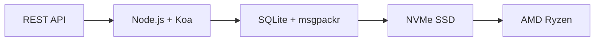

# API อีเมลครบวงจรตัวแรกของโลก: วิธีที่ Forward Email ปฏิวัติการจัดการอีเมล {#the-first-complete-email-api-how-forward-email-revolutionized-email-management}


<p class="lead mt-3">
  <strong>สรุปสั้น ๆ:</strong> เราสร้าง REST API สำหรับการจัดการอีเมลครบวงจรตัวแรกของโลกที่มีความสามารถในการค้นหาขั้นสูงซึ่งไม่มีบริการใดเสนอ ในขณะที่ Gmail, Outlook และ Apple บังคับให้นักพัฒนาใช้ IMAP ที่ยุ่งยากหรือ API ที่มีข้อจำกัดเรื่องอัตราการใช้งาน Forward Email มอบการดำเนินการ CRUD ที่รวดเร็วมากสำหรับข้อความ, โฟลเดอร์, รายชื่อ และปฏิทินผ่านอินเทอร์เฟซ REST เดียวที่มีพารามิเตอร์ค้นหามากกว่า 15 ตัว นี่คือ API อีเมลที่นักพัฒนารอคอย
</p>


## สารบัญ {#table-of-contents}

* [ปัญหา API อีเมล](#the-email-api-problem)
* [สิ่งที่นักพัฒนาพูดจริง ๆ](#what-developers-are-actually-saying)
* [โซลูชันปฏิวัติของ Forward Email](#forward-emails-revolutionary-solution)
  * [ทำไมเราถึงสร้างสิ่งนี้](#why-we-built-this)
  * [การตรวจสอบสิทธิ์ที่ง่าย](#simple-authentication)
* [20 จุดเชื่อมต่อที่เปลี่ยนทุกอย่าง](#20-endpoints-that-change-everything)
  * [ข้อความ (5 จุดเชื่อมต่อ)](#messages-5-endpoints)
  * [โฟลเดอร์ (5 จุดเชื่อมต่อ)](#folders-5-endpoints)
  * [รายชื่อ (5 จุดเชื่อมต่อ)](#contacts-5-endpoints)
  * [ปฏิทิน (5 จุดเชื่อมต่อ)](#calendars-5-endpoints)
* [การค้นหาขั้นสูง: ไม่มีบริการใดเทียบได้](#advanced-search-no-other-service-compares)
  * [ภูมิทัศน์ API การค้นหาที่เสียหาย](#the-search-api-landscape-is-broken)
  * [API การค้นหาปฏิวัติของ Forward Email](#forward-emails-revolutionary-search-api)
  * [ตัวอย่างการค้นหาในโลกจริง](#real-world-search-examples)
  * [ข้อได้เปรียบด้านประสิทธิภาพ](#performance-advantages)
  * [คุณสมบัติการค้นหาที่ไม่มีใครมี](#search-features-no-one-else-has)
  * [ทำไมสิ่งนี้ถึงสำคัญสำหรับนักพัฒนา](#why-this-matters-for-developers)
  * [การดำเนินการทางเทคนิค](#the-technical-implementation)
* [สถาปัตยกรรมประสิทธิภาพที่รวดเร็วมาก](#blazing-fast-performance-architecture)
  * [เกณฑ์มาตรฐานประสิทธิภาพ](#performance-benchmarks)
  * [สถาปัตยกรรมที่เน้นความเป็นส่วนตัวเป็นหลัก](#privacy-first-architecture)
* [ทำไมเราถึงแตกต่าง: การเปรียบเทียบครบถ้วน](#why-were-different-the-complete-comparison)
  * [ข้อจำกัดของผู้ให้บริการรายใหญ่](#major-provider-limitations)
  * [ข้อได้เปรียบของ Forward Email](#forward-email-advantages)
  * [ปัญหาความโปร่งใสของโอเพนซอร์ส](#the-open-source-transparency-problem)
* [ตัวอย่างการผสานรวมในโลกจริงกว่า 30 รายการ](#30-real-world-integration-examples)
  * [1. การปรับปรุงฟอร์มติดต่อ WordPress](#1-wordpress-contact-form-enhancement)
  * [2. ทางเลือก Zapier สำหรับระบบอัตโนมัติอีเมล](#2-zapier-alternative-for-email-automation)
  * [3. การซิงโครไนซ์อีเมล CRM](#3-crm-email-synchronization)
  * [4. การประมวลผลคำสั่งซื้ออีคอมเมิร์ซ](#4-e-commerce-order-processing)
  * [5. การผสานรวมตั๋วสนับสนุน](#5-support-ticket-integration)
  * [6. ระบบจัดการจดหมายข่าว](#6-newsletter-management-system)
  * [7. การจัดการงานผ่านอีเมล](#7-email-based-task-management)
  * [8. การรวบรวมอีเมลหลายบัญชี](#8-multi-account-email-aggregation)
  * [9. แดชบอร์ดวิเคราะห์อีเมลขั้นสูง](#9-advanced-email-analytics-dashboard)
  * [10. การเก็บถาวรอีเมลอัจฉริยะ](#10-smart-email-archiving)
  * [11. การผสานรวมอีเมลกับปฏิทิน](#11-email-to-calendar-integration)
  * [12. การสำรองข้อมูลและการปฏิบัติตามข้อกำหนดอีเมล](#12-email-backup-and-compliance)
  * [13. การจัดการเนื้อหาผ่านอีเมล](#13-email-based-content-management)
  * [14. การจัดการแม่แบบอีเมล](#14-email-template-management)
  * [15. ระบบอัตโนมัติของเวิร์กโฟลว์ผ่านอีเมล](#15-email-based-workflow-automation)
  * [16. การตรวจสอบความปลอดภัยอีเมล](#16-email-security-monitoring)
  * [17. การเก็บรวบรวมแบบสำรวจผ่านอีเมล](#17-email-based-survey-collection)
  * [18. การตรวจสอบประสิทธิภาพอีเมล](#18-email-performance-monitoring)
  * [19. การคัดกรองลูกค้าเป้าหมายผ่านอีเมล](#19-email-based-lead-qualification)
  * [20. การจัดการโครงการผ่านอีเมล](#20-email-based-project-management)
  * [21. การจัดการสินค้าคงคลังผ่านอีเมล](#21-email-based-inventory-management)
  * [22. การประมวลผลใบแจ้งหนี้ผ่านอีเมล](#22-email-based-invoice-processing)
  * [23. การลงทะเบียนกิจกรรมผ่านอีเมล](#23-email-based-event-registration)
  * [24. เวิร์กโฟลว์อนุมัติเอกสารผ่านอีเมล](#24-email-based-document-approval-workflow)
  * [25. การวิเคราะห์ข้อเสนอแนะลูกค้าผ่านอีเมล](#25-email-based-customer-feedback-analysis)
  * [26. ท่อสรรหาผ่านอีเมล](#26-email-based-recruitment-pipeline)
  * [27. การประมวลผลรายงานค่าใช้จ่ายผ่านอีเมล](#27-email-based-expense-report-processing)
  * [28. การรายงานประกันคุณภาพผ่านอีเมล](#28-email-based-quality-assurance-reporting)
  * [29. การจัดการผู้ขายผ่านอีเมล](#29-email-based-vendor-management)
  * [30. การตรวจสอบโซเชียลมีเดียผ่านอีเมล](#30-email-based-social-media-monitoring)
* [เริ่มต้นใช้งาน](#getting-started)
  * [1. สร้างบัญชี Forward Email ของคุณ](#1-create-your-forward-email-account)
  * [2. สร้างข้อมูลรับรอง API](#2-generate-api-credentials)
  * [3. เรียก API ครั้งแรกของคุณ](#3-make-your-first-api-call)
  * [4. สำรวจเอกสารประกอบ](#4-explore-the-documentation)
* [ทรัพยากรทางเทคนิค](#technical-resources)
## ปัญหา Email API {#the-email-api-problem}

Email API มีปัญหาพื้นฐานอย่างรุนแรง จุดจบ.

ผู้ให้บริการอีเมลรายใหญ่ทุกแห่งบังคับให้นักพัฒนาต้องเลือกอย่างใดอย่างหนึ่งที่แย่มาก:

1. **IMAP นรก**: ต่อสู้กับโปรโตคอลอายุ 30 ปีที่ออกแบบมาสำหรับไคลเอนต์เดสก์ท็อป ไม่ใช่แอปสมัยใหม่
2. **API ที่ถูกจำกัด**: API ที่จำกัดอัตราใช้งาน, อ่านอย่างเดียว, ซับซ้อนด้วย OAuth ที่ไม่สามารถจัดการข้อมูลอีเมลจริงของคุณได้

ผลลัพธ์? นักพัฒนาหลายคนเลิกบูรณาการอีเมลไปเลย หรือเสียเวลาหลายสัปดาห์สร้างตัวห่อ IMAP ที่เปราะบางและพังบ่อย

> \[!WARNING]
> **ความลับสกปรก**: "email APIs" ส่วนใหญ่เป็นแค่ API สำหรับส่งอีเมลเท่านั้น คุณไม่สามารถจัดระเบียบโฟลเดอร์, ซิงค์รายชื่อ, หรือจัดการปฏิทินผ่าน REST interface ง่ายๆ ได้ จนถึงตอนนี้


## สิ่งที่นักพัฒนาพูดจริงๆ {#what-developers-are-actually-saying}

ความหงุดหงิดนั้นมีจริงและถูกบันทึกไว้ทุกที่:

> "ฉันเพิ่งลองบูรณาการ Gmail ในแอปของฉัน และใช้เวลามากเกินไปกับมัน ฉันตัดสินใจว่าไม่คุ้มค่าที่จะสนับสนุน Gmail"
>
> *- [นักพัฒนาบน Hacker News](https://news.ycombinator.com/item?id=42106944), 147 โหวตขึ้น*

> "API อีเมลทั้งหมดแย่หรือ? ดูเหมือนจะจำกัดหรือมีข้อจำกัดบางอย่าง"
>
> *- [การสนทนา Reddit r/SaaS](https://www.reddit.com/r/SaaS/comments/1cm84s7/are_all_email_apis_mediocre/)*

> "ทำไมการพัฒนาอีเมลถึงแย่ขนาดนี้?"
>
> *- [Reddit r/webdev](https://www.reddit.com/r/webdev/comments/15trnp2/why_does_email_development_have_to_suck/), 89 ความเห็นเกี่ยวกับความเจ็บปวดของนักพัฒนา*

> "อะไรทำให้ Gmail API มีประสิทธิภาพมากกว่า IMAP? อีกเหตุผลหนึ่งคือ Gmail API ต้องดาวน์โหลดแต่ละข้อความเพียงครั้งเดียวเท่านั้น ในขณะที่ IMAP ต้องดาวน์โหลดและจัดทำดัชนีแต่ละข้อความ..."
>
> *- [คำถามบน Stack Overflow](https://stackoverflow.com/questions/25431022/what-makes-the-gmail-api-more-efficient-than-imap) ที่มี 47 โหวตขึ้น*

หลักฐานมีอยู่ทุกที่:

* **ปัญหา SMTP ของ WordPress**: [631 ปัญหาใน GitHub](https://github.com/awesomemotive/WP-Mail-SMTP/issues) เกี่ยวกับความล้มเหลวในการส่งอีเมล
* **ข้อจำกัดของ Zapier**: [คำร้องเรียนจากชุมชน](https://community.zapier.com/featured-articles-65/email-parser-by-zapier-limitations-and-alternatives-16958) เกี่ยวกับข้อจำกัด 10 อีเมล/ชั่วโมง และการตรวจจับ IMAP ล้มเหลว
* **โปรเจกต์ IMAP API**: [หลาย](https://github.com/ewildgoose/imap-api) [โปรเจกต์โอเพนซอร์ส](https://emailengine.app/) [ที่มีอยู่](https://www.npmjs.com/package/imapflow) เพื่อ "แปลง IMAP เป็น REST" เพราะไม่มีผู้ให้บริการรายใดเสนอสิ่งนี้
* **ความหงุดหงิดกับ Gmail API**: [Stack Overflow](https://stackoverflow.com/questions/tagged/gmail-api) มีคำถาม 4,847 คำถามที่ติดแท็ก "gmail-api" พร้อมคำร้องเรียนทั่วไปเกี่ยวกับข้อจำกัดอัตราและความซับซ้อน


## โซลูชันปฏิวัติของ Forward Email {#forward-emails-revolutionary-solution}

**เราเป็นบริการอีเมลแรกที่เสนอการดำเนินการ CRUD ครบถ้วนสำหรับข้อมูลอีเมลทั้งหมดผ่าน REST API เดียว**

นี่ไม่ใช่แค่ API สำหรับส่งอีเมลอีกต่อไป นี่คือการควบคุมโปรแกรมมิ่งเต็มรูปแบบสำหรับ:

* **ข้อความ**: สร้าง, อ่าน, อัปเดต, ลบ, ค้นหา, ย้าย, ทำเครื่องหมาย
* **โฟลเดอร์**: การจัดการโฟลเดอร์ IMAP แบบเต็มผ่าน REST endpoints
* **รายชื่อ**: การจัดเก็บและซิงค์รายชื่อด้วย [CardDAV](https://tools.ietf.org/html/rfc6352)
* **ปฏิทิน**: เหตุการณ์และการนัดหมายปฏิทินด้วย [CalDAV](https://tools.ietf.org/html/rfc4791)

### ทำไมเราถึงสร้างสิ่งนี้ {#why-we-built-this}

**ปัญหา**: ผู้ให้บริการอีเมลทุกแห่งมองอีเมลเป็นกล่องดำ คุณสามารถส่งอีเมล อาจอ่านได้ด้วย OAuth ที่ซับซ้อน แต่คุณไม่สามารถ *จัดการ* ข้อมูลอีเมลของคุณได้อย่างแท้จริงด้วยโปรแกรม

**วิสัยทัศน์ของเรา**: อีเมลควรบูรณาการง่ายเหมือน API สมัยใหม่ ไม่มีไลบรารี IMAP ไม่มีความซับซ้อนของ OAuth ไม่มีฝันร้ายเรื่องข้อจำกัดอัตรา แค่ REST endpoints ง่ายๆ ที่ใช้งานได้จริง

**ผลลัพธ์**: บริการอีเมลแรกที่คุณสามารถสร้างไคลเอนต์อีเมลครบวงจร, การบูรณาการ CRM หรือระบบอัตโนมัติ โดยใช้แค่คำขอ HTTP

### การยืนยันตัวตนที่ง่าย {#simple-authentication}

ไม่มี [ความซับซ้อนของ OAuth](https://oauth.net/2/) ไม่มี [รหัสผ่านเฉพาะแอป](https://support.google.com/accounts/answer/185833) แค่ข้อมูลรับรอง alias ของคุณ:

```bash
curl -u "alias@yourdomain.com:password" \
  https://api.forwardemail.net/v1/messages
```
## 20 จุดสิ้นสุดที่เปลี่ยนทุกอย่าง {#20-endpoints-that-change-everything}

### ข้อความ (5 จุดสิ้นสุด) {#messages-5-endpoints}

* `GET /v1/messages` - แสดงรายการข้อความพร้อมตัวกรอง (`?folder=`, `?is_unread=`, `?is_flagged=`)
* `POST /v1/messages` - ส่งข้อความใหม่ตรงไปยังโฟลเดอร์
* `GET /v1/messages/:id` - ดึงข้อความเฉพาะพร้อมข้อมูลเมตาเต็มรูปแบบ
* `PUT /v1/messages/:id` - อัปเดตข้อความ (ธง, โฟลเดอร์, สถานะอ่าน)
* `DELETE /v1/messages/:id` - ลบข้อความอย่างถาวร

### โฟลเดอร์ (5 จุดสิ้นสุด) {#folders-5-endpoints}

* `GET /v1/folders` - แสดงรายการโฟลเดอร์ทั้งหมดพร้อมสถานะการสมัคร
* `POST /v1/folders` - สร้างโฟลเดอร์ใหม่พร้อมคุณสมบัติที่กำหนดเอง
* `GET /v1/folders/:id` - ดูรายละเอียดโฟลเดอร์และจำนวนข้อความ
* `PUT /v1/folders/:id` - อัปเดตคุณสมบัติโฟลเดอร์และการสมัคร
* `DELETE /v1/folders/:id` - ลบโฟลเดอร์และจัดการการย้ายข้อความ

### รายชื่อผู้ติดต่อ (5 จุดสิ้นสุด) {#contacts-5-endpoints}

* `GET /v1/contacts` - แสดงรายการผู้ติดต่อพร้อมการค้นหาและแบ่งหน้า
* `POST /v1/contacts` - สร้างผู้ติดต่อใหม่พร้อมรองรับ vCard เต็มรูปแบบ
* `GET /v1/contacts/:id` - ดึงข้อมูลผู้ติดต่อพร้อมฟิลด์และข้อมูลเมตาทั้งหมด
* `PUT /v1/contacts/:id` - อัปเดตข้อมูลผู้ติดต่อพร้อมการตรวจสอบ ETag
* `DELETE /v1/contacts/:id` - ลบผู้ติดต่อพร้อมจัดการแบบ cascade

### ปฏิทิน (5 จุดสิ้นสุด) {#calendars-5-endpoints}

* `GET /v1/calendars` - แสดงรายการกิจกรรมปฏิทินพร้อมตัวกรองวันที่
* `POST /v1/calendars` - สร้างกิจกรรมปฏิทินพร้อมผู้เข้าร่วมและการเกิดซ้ำ
* `GET /v1/calendars/:id` - ดูรายละเอียดกิจกรรมพร้อมจัดการเขตเวลา
* `PUT /v1/calendars/:id` - อัปเดตกิจกรรมพร้อมตรวจจับความขัดแย้ง
* `DELETE /v1/calendars/:id` - ลบกิจกรรมพร้อมแจ้งเตือนผู้เข้าร่วม


## การค้นหาขั้นสูง: ไม่มีบริการใดเทียบได้ {#advanced-search-no-other-service-compares}

**Forward Email คือบริการอีเมลเดียวที่มีการค้นหาแบบโปรแกรมเมติกที่ครอบคลุมทุกฟิลด์ข้อความผ่าน REST API**

ในขณะที่ผู้ให้บริการรายอื่นมีเพียงตัวกรองพื้นฐานเท่านั้น เราได้สร้าง API การค้นหาอีเมลที่ล้ำหน้าที่สุดเท่าที่เคยมีมา ไม่มี Gmail API, Outlook API หรือบริการใดที่ใกล้เคียงกับความสามารถในการค้นหาของเรา

### ภาพรวมของ API การค้นหาที่มีปัญหา {#the-search-api-landscape-is-broken}

**ข้อจำกัดของ Gmail API ในการค้นหา:**

* ✅ พารามิเตอร์ `q` พื้นฐานเท่านั้น
* ❌ ไม่มีการค้นหาเฉพาะฟิลด์
* ❌ ไม่มีตัวกรองช่วงวันที่
* ❌ ไม่มีตัวกรองตามขนาด
* ❌ ไม่มีตัวกรองไฟล์แนบ
* ❌ จำกัดเฉพาะไวยากรณ์การค้นหาของ Gmail

**ข้อจำกัดของ Outlook API ในการค้นหา:**

* ✅ พารามิเตอร์ `$search` พื้นฐาน
* ❌ ไม่มีการกำหนดเป้าหมายฟิลด์ขั้นสูง
* ❌ ไม่มีการรวมคำค้นหาที่ซับซ้อน
* ❌ จำกัดอัตราการใช้งานอย่างเข้มงวด
* ❌ ต้องใช้ไวยากรณ์ OData ที่ซับซ้อน

**Apple iCloud:**

* ❌ ไม่มี API เลย
* ❌ มีแต่การค้นหา IMAP เท่านั้น (ถ้าคุณสามารถใช้งานได้)

**ProtonMail & Tuta:**

* ❌ ไม่มี API สาธารณะ
* ❌ ไม่มีความสามารถในการค้นหาแบบโปรแกรมเมติก

### API การค้นหาที่ปฏิวัติวงการของ Forward Email {#forward-emails-revolutionary-search-api}

**เรามีพารามิเตอร์การค้นหามากกว่า 15 ตัวที่ไม่มีบริการใดมี:**

| ความสามารถในการค้นหา           | Forward Email                          | Gmail API    | Outlook API        | อื่น ๆ  |
| ------------------------------ | -------------------------------------- | ------------ | ------------------ | ------ |
| **การค้นหาเฉพาะฟิลด์**         | ✅ หัวเรื่อง, เนื้อหา, จาก, ถึง, สำเนา, เฮดเดอร์ | ❌            | ❌                  | ❌      |
| **การค้นหาหลายฟิลด์ทั่วไป**    | ✅ `?search=` ครอบคลุมทุกฟิลด์          | ✅ พื้นฐาน `q=` | ✅ พื้นฐาน `$search=` | ❌      |
| **ตัวกรองช่วงวันที่**           | ✅ `?since=` & `?before=`               | ❌            | ❌                  | ❌      |
| **ตัวกรองตามขนาด**             | ✅ `?min_size=` & `?max_size=`          | ❌            | ❌                  | ❌      |
| **ตัวกรองไฟล์แนบ**             | ✅ `?has_attachments=true/false`        | ❌            | ❌                  | ❌      |
| **การค้นหาเฮดเดอร์**           | ✅ `?headers=X-Priority`                | ❌            | ❌                  | ❌      |
| **การค้นหา ID ข้อความ**        | ✅ `?message_id=abc123`                 | ❌            | ❌                  | ❌      |
| **การรวมตัวกรองหลายตัว**       | ✅ หลายพารามิเตอร์พร้อมตรรกะ AND       | ❌            | ❌                  | ❌      |
| **ไม่สนใจตัวพิมพ์ใหญ่/เล็ก**   | ✅ การค้นหาทั้งหมด                      | ✅            | ✅                  | ❌      |
| **รองรับการแบ่งหน้า**          | ✅ ใช้งานได้กับพารามิเตอร์ค้นหาทั้งหมด | ✅            | ✅                  | ❌      |
### ตัวอย่างการค้นหาในโลกจริง {#real-world-search-examples}

**ค้นหาทุกใบแจ้งหนี้จากไตรมาสที่ผ่านมา:**

```bash
# Forward Email - ง่ายและทรงพลัง
GET /v1/messages?subject=invoice&since=2024-01-01T00:00:00Z&before=2024-04-01T00:00:00Z

# Gmail API - เป็นไปไม่ได้กับการค้นหาที่จำกัดของพวกเขา
# ไม่มีการกรองช่วงวันที่

# Outlook API - ไวยากรณ์ OData ที่ซับซ้อน ฟังก์ชันการทำงานจำกัด
GET /me/messages?$search="invoice"&$filter=receivedDateTime ge 2024-01-01T00:00:00Z
```

**ค้นหาไฟล์แนบขนาดใหญ่จากผู้ส่งเฉพาะ:**

```bash
# Forward Email - การกรองที่ครอบคลุม
GET /v1/messages?from=finance@company.com&has_attachments=true&min_size=1000000

# Gmail API - ไม่สามารถกรองตามขนาดหรือไฟล์แนบได้โดยโปรแกรม
# Outlook API - ไม่มีการกรองขนาด
# อื่น ๆ - ไม่มี API ให้ใช้งาน
```

**การค้นหาที่ซับซ้อนหลายฟิลด์:**

```bash
# Forward Email - ความสามารถในการค้นหาขั้นสูง
GET /v1/messages?body=quarterly&from=manager&is_flagged=true&folder=Reports

# Gmail API - จำกัดเฉพาะการค้นหาข้อความพื้นฐานเท่านั้น
GET /gmail/v1/users/me/messages?q=quarterly

# Outlook API - การค้นหาพื้นฐานโดยไม่ระบุฟิลด์เป้าหมาย
GET /me/messages?$search="quarterly"
```

### ข้อได้เปรียบด้านประสิทธิภาพ {#performance-advantages}

**ประสิทธิภาพการค้นหาของ Forward Email:**

* ⚡ **เวลาตอบสนองต่ำกว่า 100ms** สำหรับการค้นหาที่ซับซ้อน
* 🔍 **การปรับแต่ง Regex** ด้วยการจัดทำดัชนีที่เหมาะสม
* 📊 **การประมวลผลคำค้นแบบขนาน** สำหรับการนับและข้อมูล
* 💾 **การใช้หน่วยความจำอย่างมีประสิทธิภาพ** ด้วยคำค้นที่เรียบง่าย

**ปัญหาด้านประสิทธิภาพของคู่แข่ง:**

* 🐌 **Gmail API**: จำกัดอัตรา 250 หน่วยโควตาต่อผู้ใช้ต่อวินาที
* 🐌 **Outlook API**: การจำกัดการใช้งานอย่างเข้มงวดพร้อมข้อกำหนดการหน่วงเวลาที่ซับซ้อน
* 🐌 **อื่น ๆ**: ไม่มี API ให้เปรียบเทียบ

### ฟีเจอร์การค้นหาที่ไม่มีใครมี {#search-features-no-one-else-has}

#### 1. การค้นหาเฉพาะส่วนหัว {#1-header-specific-search}

```bash
# ค้นหาข้อความที่มีส่วนหัวเฉพาะ
GET /v1/messages?headers=X-Priority:1
GET /v1/messages?headers=X-Spam-Score
```

#### 2. ความชาญฉลาดตามขนาด {#2-size-based-intelligence}

```bash
# ค้นหาอีเมลจดหมายข่าว (มักจะมีขนาดใหญ่)
GET /v1/messages?min_size=50000&from=newsletter

# ค้นหาการตอบกลับด่วน (มักจะมีขนาดเล็ก)
GET /v1/messages?max_size=1000&to=support
```

#### 3. เวิร์กโฟลว์ตามไฟล์แนบ {#3-attachment-based-workflows}

```bash
# ค้นหาเอกสารทั้งหมดที่ส่งถึงทีมกฎหมาย
GET /v1/messages?to=legal&has_attachments=true&body=contract

# ค้นหาอีเมลที่ไม่มีไฟล์แนบเพื่อทำความสะอาด
GET /v1/messages?has_attachments=false&before=2023-01-01T00:00:00Z
```

#### 4. การรวมตรรกะทางธุรกิจ {#4-combined-business-logic}

```bash
# ค้นหาข้อความที่ถูกติดธงด่วนจาก VIP พร้อมไฟล์แนบ
GET /v1/messages?is_flagged=true&from=ceo&has_attachments=true&subject=urgent
```

### ทำไมสิ่งนี้จึงสำคัญสำหรับนักพัฒนา {#why-this-matters-for-developers}

**สร้างแอปพลิเคชันที่เคยเป็นไปไม่ได้มาก่อน:**

1. **การวิเคราะห์อีเมลขั้นสูง**: วิเคราะห์รูปแบบอีเมลตามขนาด ผู้ส่ง เนื้อหา
2. **การจัดการอีเมลอัจฉริยะ**: จัดระเบียบอัตโนมัติตามเกณฑ์ซับซ้อน
3. **การปฏิบัติตามกฎและการค้นหา**: ค้นหาอีเมลเฉพาะสำหรับข้อกำหนดทางกฎหมาย
4. **ข้อมูลเชิงธุรกิจ**: สกัดข้อมูลเชิงลึกจากรูปแบบการสื่อสารทางอีเมล
5. **เวิร์กโฟลว์อัตโนมัติ**: เรียกใช้งานตามตัวกรองอีเมลที่ซับซ้อน

### การดำเนินการทางเทคนิค {#the-technical-implementation}

API การค้นหาของเรามี:

* **การปรับแต่ง Regex** ด้วยกลยุทธ์การจัดทำดัชนีที่เหมาะสม
* **การประมวลผลแบบขนาน** เพื่อประสิทธิภาพ
* **การตรวจสอบข้อมูลนำเข้า** เพื่อความปลอดภัย
* **การจัดการข้อผิดพลาดอย่างครอบคลุม** เพื่อความน่าเชื่อถือ

```javascript
// ตัวอย่าง: การดำเนินการค้นหาที่ซับซ้อน
const searchConditions = [];

if (ctx.query.subject) {
  searchConditions.push({
    subject: { $regex: ctx.query.subject, $options: 'i' }
  });
}

if (ctx.query.from) {
  searchConditions.push({
    $or: [
      { 'from.address': { $regex: ctx.query.from, $options: 'i' } },
      { 'from.name': { $regex: ctx.query.from, $options: 'i' } }
    ]
  });
}

// รวมด้วยตรรกะ AND
if (searchConditions.length > 0) {
  query.$and = searchConditions;
}
```

> \[!TIP]
> **ข้อได้เปรียบสำหรับนักพัฒนา**: ด้วย API การค้นหาของ Forward Email คุณสามารถสร้างแอปพลิเคชันอีเมลที่เทียบเท่ากับไคลเอนต์เดสก์ท็อปในด้านฟังก์ชันการทำงาน ในขณะที่ยังคงความเรียบง่ายของ REST API ไว้ได้อย่างครบถ้วน.
## สถาปัตยกรรมประสิทธิภาพรวดเร็วทันใจ {#blazing-fast-performance-architecture}

เทคโนโลยีของเราถูกสร้างขึ้นเพื่อความเร็วและความน่าเชื่อถือ:


```mermaid
graph LR
    A[REST API] --> B[Node.js + Koa]
    B --> C[SQLite + msgpackr]
    C --> D[NVMe SSD]
    D --> E[AMD Ryzen]
```

### เกณฑ์มาตรฐานประสิทธิภาพ {#performance-benchmarks}

**ทำไมเราถึงรวดเร็วเหมือนไฟฟ้า:**

| ส่วนประกอบ   | เทคโนโลยี                                                                        | ประโยชน์ด้านประสิทธิภาพ                       |
| ------------ | --------------------------------------------------------------------------------- | --------------------------------------------- |
| **ที่เก็บข้อมูล**  | [NVMe SSD](https://en.wikipedia.org/wiki/NVM_Express)                             | เร็วกว่า SATA แบบดั้งเดิม 10 เท่า              |
| **ฐานข้อมูล** | [SQLite](https://sqlite.org/) + [msgpackr](https://github.com/kriszyp/msgpackr)   | ไม่มีความหน่วงของเครือข่าย, การจัดเก็บข้อมูลที่เหมาะสม |
| **ฮาร์ดแวร์** | [AMD Ryzen](https://www.amd.com/en/products/processors/desktops/ryzen) แบบโลหะเปลือย | ไม่มีภาระของการจำลองเสมือน                    |
| **แคช**      | ในหน่วยความจำ + คงทน                                                            | เวลาตอบสนองต่ำกว่ามิลลิวินาที                |
| **การสำรองข้อมูล** | [Cloudflare R2](https://www.cloudflare.com/products/r2/) เข้ารหัส                | ความน่าเชื่อถือระดับองค์กร                      |

**ตัวเลขประสิทธิภาพจริง:**

* **เวลาตอบสนอง API**: เฉลี่ย < 50ms
* **การดึงข้อความ**: < 10ms สำหรับข้อความที่แคชไว้
* **การดำเนินการโฟลเดอร์**: < 5ms สำหรับการดำเนินการเมตาดาต้า
* **การซิงค์รายชื่อผู้ติดต่อ**: มากกว่า 1000 รายชื่อ/วินาที
* **เวลาทำงาน**: SLA 99.99% พร้อมโครงสร้างพื้นฐานซ้ำซ้อน

### สถาปัตยกรรมที่เน้นความเป็นส่วนตัวเป็นหลัก {#privacy-first-architecture}

**การออกแบบแบบไม่มีความรู้ (Zero-Knowledge)**: มีเพียงคุณเท่านั้นที่เข้าถึงได้ด้วยรหัสผ่าน IMAP ของคุณ - เราไม่สามารถอ่านอีเมลของคุณได้ สถาปัตยกรรม [zero-knowledge ของเรา](https://forwardemail.net/en/security) รับประกันความเป็นส่วนตัวอย่างสมบูรณ์พร้อมกับประสิทธิภาพที่รวดเร็วทันใจ


## ทำไมเราถึงแตกต่าง: การเปรียบเทียบอย่างครบถ้วน {#why-were-different-the-complete-comparison}

### ข้อจำกัดหลักของผู้ให้บริการ {#major-provider-limitations}

| ผู้ให้บริการ     | ปัญหาหลัก                             | ข้อจำกัดเฉพาะ                                                                                                                                                                                                                                                                                                                                                                                                                                                     |
| ---------------- | ----------------------------------------- | -------------------------------------------------------------------------------------------------------------------------------------------------------------------------------------------------------------------------------------------------------------------------------------------------------------------------------------------------------------------------------------------------------------------------------------------------------------------- |
| **Gmail API**    | อ่านได้อย่างเดียว, OAuth ซับซ้อน, API แยกกัน   | • [ไม่สามารถแก้ไขข้อความที่มีอยู่ได้](https://developers.google.com/gmail/api/reference/rest/v1/users.messages)<br>• [ป้ายกำกับ ≠ โฟลเดอร์](https://developers.google.com/gmail/api/reference/rest/v1/users.labels)<br>• [จำกัดโควต้า 1 พันล้านหน่วยต่อวัน](https://developers.google.com/gmail/api/reference/quota)<br>• [ต้องใช้ API แยกกัน](https://developers.google.com/workspace) สำหรับรายชื่อผู้ติดต่อ/ปฏิทิน                                                           |
| **Outlook API**  | เลิกใช้, สับสน, เน้นองค์กร                 | • [REST endpoints เลิกใช้ มีนาคม 2024](https://learn.microsoft.com/en-us/outlook/rest/compare-graph)<br>• [API หลายตัวที่สับสน](https://learn.microsoft.com/en-us/office/client-developer/outlook/selecting-an-api-or-technology-for-developing-solutions-for-outlook) (EWS, Graph, REST)<br>• [ความซับซ้อนของ Microsoft Graph](https://learn.microsoft.com/en-us/graph/overview)<br>• [การจำกัดการใช้งานอย่างเข้มงวด](https://learn.microsoft.com/en-us/graph/throttling) |
| **Apple iCloud** | ไม่มี API สาธารณะ                       | • [ไม่มี API สาธารณะเลย](https://support.apple.com/en-us/102654)<br>• [รองรับเฉพาะ IMAP พร้อมจำกัด 1000 อีเมลต่อวัน](https://support.apple.com/en-us/102654)<br>• [ต้องใช้รหัสผ่านเฉพาะแอป](https://support.apple.com/en-us/102654)<br>• [จำกัดผู้รับ 500 คนต่อข้อความ](https://support.apple.com/en-us/102654)                                                                                                                                              |
| **ProtonMail**   | ไม่มี API, อ้างว่าโอเพนซอร์สผิดพลาด          | • [ไม่มี API สาธารณะ](https://proton.me/support/protonmail-bridge-clients)<br>• [ต้องใช้ซอฟต์แวร์ Bridge](https://proton.me/mail/bridge) สำหรับการเข้าถึง IMAP<br>• [อ้างว่า "โอเพนซอร์ส"](https://proton.me/blog/open-source) แต่ [โค้ดเซิร์ฟเวอร์เป็นกรรมสิทธิ์](https://github.com/ProtonMail)<br>• [จำกัดเฉพาะแผนชำระเงินเท่านั้น](https://proton.me/pricing)                                                                                                         |
| **Tuta**         | ไม่มี API, ความโปร่งใสที่ทำให้เข้าใจผิด           | • [ไม่มี REST API สำหรับการจัดการอีเมล](https://tuta.com/support#technical)<br>• [อ้างว่า "โอเพนซอร์ส"](https://tuta.com/blog/posts/open-source-email) แต่ [แบ็กเอนด์ปิด](https://github.com/tutao/tutanota)<br>• [ไม่รองรับ IMAP/SMTP](https://tuta.com/support#imap)<br>• [การเข้ารหัสกรรมสิทธิ์](https://tuta.com/encryption) ป้องกันการรวมมาตรฐาน                                                                                               |
| **Zapier Email** | จำกัดอัตราการใช้งานอย่างรุนแรง              | • [จำกัด 10 อีเมลต่อชั่วโมง](https://help.zapier.com/hc/en-us/articles/8496181555597-Email-Parser-by-Zapier-limitations-and-alternatives)<br>• [ไม่สามารถเข้าถึงโฟลเดอร์ IMAP ได้](https://help.zapier.com/hc/en-us/articles/8496181555597-Email-Parser-by-Zapier-limitations-and-alternatives)<br>• [ความสามารถในการแยกวิเคราะห์จำกัด](https://help.zapier.com/hc/en-us/articles/8496181555597-Email-Parser-by-Zapier-limitations-and-alternatives)
### Forward Email Advantages {#forward-email-advantages}

| Feature            | Forward Email                                                                                | Competition                               |
| ------------------ | -------------------------------------------------------------------------------------------- | ----------------------------------------- |
| **Complete CRUD**  | ✅ สร้าง อ่าน อัปเดต ลบข้อมูลได้ครบถ้วน                                                    | ❌ อ่านได้อย่างเดียวหรือมีข้อจำกัดในการทำงานบางอย่าง |
| **Unified API**    | ✅ ข้อความ โฟลเดอร์ รายชื่อ ปฏิทิน ใน API เดียว                                           | ❌ API แยกกันหรือขาดฟีเจอร์บางอย่าง              |
| **Simple Auth**    | ✅ การยืนยันตัวตนพื้นฐานด้วยข้อมูลประจำตัวแบบนามแฝง                                        | ❌ OAuth ซับซ้อนพร้อมหลายขอบเขต                  |
| **No Rate Limits** | ✅ ขีดจำกัดที่เอื้อให้ใช้งานจริงได้อย่างเต็มที่                                            | ❌ โควตาจำกัดที่เข้มงวดจนทำให้กระบวนการทำงานสะดุด  |
| **Self-Hosting**   | ✅ [ตัวเลือกโฮสต์เองครบถ้วน](https://forwardemail.net/en/blog/docs/self-hosted-solution)    | ❌ จำกัดเฉพาะการล็อกอินกับผู้ให้บริการเท่านั้น       |
| **Privacy**        | ✅ ความเป็นส่วนตัวแบบไม่รู้ข้อมูลใด ๆ เข้ารหัสและเป็นส่วนตัว                               | ❌ การขุดข้อมูลและข้อกังวลเรื่องความเป็นส่วนตัว      |
| **Performance**    | ✅ ตอบสนองภายใน 50ms, ใช้ที่เก็บข้อมูล NVMe                                              | ❌ ความหน่วงของเครือข่ายและการจำกัดความเร็ว          |

### The Open-Source Transparency Problem {#the-open-source-transparency-problem}

**ProtonMail และ Tuta โปรโมตตัวเองว่าเป็น "โอเพนซอร์ส" และ "โปร่งใส" แต่เป็นการตลาดที่ทำให้เข้าใจผิดซึ่งละเมิดหลักการความเป็นส่วนตัวสมัยใหม่**

> \[!WARNING]
> **คำกล่าวอ้างความโปร่งใสที่ผิดพลาด**: ทั้ง ProtonMail และ Tuta โฆษณาอย่างเด่นชัดว่าตนเป็น "โอเพนซอร์ส" ในขณะที่เก็บโค้ดฝั่งเซิร์ฟเวอร์ที่สำคัญที่สุดไว้เป็นความลับและปิด

**การหลอกลวงของ ProtonMail:**

* **คำกล่าวอ้าง**: ["เราคือโอเพนซอร์ส"](https://proton.me/blog/open-source) ปรากฏเด่นชัดในโฆษณา
* **ความจริง**: [โค้ดเซิร์ฟเวอร์เป็นกรรมสิทธิ์ทั้งหมด](https://github.com/ProtonMail) - มีเพียงแอปไคลเอนต์เท่านั้นที่เป็นโอเพนซอร์ส
* **ผลกระทบ**: ผู้ใช้ไม่สามารถตรวจสอบการเข้ารหัสฝั่งเซิร์ฟเวอร์ การจัดการข้อมูล หรือคำกล่าวอ้างเรื่องความเป็นส่วนตัวได้
* **การละเมิดความโปร่งใส**: ไม่มีวิธีตรวจสอบระบบประมวลผลและจัดเก็บอีเมลจริง

**การตลาดที่ทำให้เข้าใจผิดของ Tuta:**

* **คำกล่าวอ้าง**: ["อีเมลโอเพนซอร์ส"](https://tuta.com/blog/posts/open-source-email) เป็นจุดขายหลัก
* **ความจริง**: [โครงสร้างพื้นฐานฝั่งหลังปิดเป็นความลับ](https://github.com/tutao/tutanota) - มีเพียงส่วนหน้าเท่านั้นที่เปิดเผย
* **ผลกระทบ**: การเข้ารหัสกรรมสิทธิ์ป้องกันโปรโตคอลอีเมลมาตรฐาน (IMAP/SMTP)
* **กลยุทธ์ล็อกอิน**: การเข้ารหัสแบบกำหนดเองบังคับให้พึ่งพาผู้ให้บริการ

**ทำไมเรื่องนี้จึงสำคัญสำหรับความเป็นส่วนตัวสมัยใหม่:**

ในปี 2025 ความเป็นส่วนตัวที่แท้จริงต้องการ **ความโปร่งใสอย่างสมบูรณ์** เมื่อผู้ให้บริการอีเมลอ้างว่า "โอเพนซอร์ส" แต่ซ่อนโค้ดเซิร์ฟเวอร์ไว้:

1. **การเข้ารหัสที่ตรวจสอบไม่ได้**: คุณไม่สามารถตรวจสอบได้ว่าข้อมูลของคุณถูกเข้ารหัสอย่างไรจริง ๆ
2. **การจัดการข้อมูลที่ซ่อนเร้น**: การจัดการข้อมูลฝั่งเซิร์ฟเวอร์ยังคงเป็นกล่องดำ
3. **ความปลอดภัยที่ต้องอาศัยความเชื่อใจ**: คุณต้องเชื่อคำกล่าวอ้างโดยไม่มีการตรวจสอบ
4. **การล็อกอินกับผู้ให้บริการ**: ระบบกรรมสิทธิ์ป้องกันการย้ายข้อมูล

**ความโปร่งใสที่แท้จริงของ Forward Email:**

* ✅ **[โอเพนซอร์สครบถ้วน](https://github.com/forwardemail/forwardemail.net)** - โค้ดเซิร์ฟเวอร์และไคลเอนต์
* ✅ **[รองรับการโฮสต์เอง](https://forwardemail.net/en/blog/docs/self-hosted-solution)** - รันอินสแตนซ์ของคุณเองได้
* ✅ **โปรโตคอลมาตรฐาน** - รองรับ IMAP, SMTP, CardDAV, CalDAV
* ✅ **ความปลอดภัยที่ตรวจสอบได้** - ทุกบรรทัดโค้ดสามารถตรวจสอบได้
* ✅ **ไม่มีการล็อกอินกับผู้ให้บริการ** - ข้อมูลของคุณ คุณเป็นผู้ควบคุม

> \[!TIP]
> **โอเพนซอร์สที่แท้จริงหมายถึงคุณสามารถตรวจสอบทุกคำกล่าวอ้างได้** ด้วย Forward Email คุณสามารถตรวจสอบการเข้ารหัสของเรา ทบทวนการจัดการข้อมูล และแม้แต่รันอินสแตนซ์ของคุณเอง นั่นคือความโปร่งใสที่แท้จริง


## 30+ Real-World Integration Examples {#30-real-world-integration-examples}

### 1. WordPress Contact Form Enhancement {#1-wordpress-contact-form-enhancement}
**ปัญหา**: [ข้อผิดพลาดในการตั้งค่า SMTP ของ WordPress](https://github.com/awesomemotive/WP-Mail-SMTP/issues) ([631 ปัญหาใน GitHub](https://github.com/awesomemotive/WP-Mail-SMTP/issues))  
**วิธีแก้ไข**: การเชื่อมต่อ API โดยตรงข้ามผ่าน [SMTP](https://tools.ietf.org/html/rfc5321) โดยสิ้นเชิง

```javascript
// แบบฟอร์มติดต่อ WordPress ที่บันทึกไปยังโฟลเดอร์ Sent
await fetch('https://api.forwardemail.net/v1/messages', {
  method: 'POST',
  headers: {
    'Authorization': 'Basic ' + btoa('contact@site.com:password'),
    'Content-Type': 'application/json'
  },
  body: JSON.stringify({
    to: [{ address: 'owner@site.com' }],
    subject: 'แบบฟอร์มติดต่อ: ' + formData.subject,
    text: formData.message,
    folder: 'Sent'
  })
});
```

### 2. ทางเลือก Zapier สำหรับระบบอัตโนมัติอีเมล {#2-zapier-alternative-for-email-automation}

**ปัญหา**: [ข้อจำกัด 10 อีเมลต่อชั่วโมงของ Zapier](https://help.zapier.com/hc/en-us/articles/8496181555597-Email-Parser-by-Zapier-limitations-and-alternatives) และ [ข้อผิดพลาดในการตรวจจับ IMAP](https://community.zapier.com/featured-articles-65/email-parser-by-zapier-limitations-and-alternatives-16958)  
**วิธีแก้ไข**: ระบบอัตโนมัติไม่จำกัดพร้อมการควบคุมอีเมลเต็มรูปแบบ

```javascript
// จัดระเบียบอีเมลโดยอัตโนมัติตามโดเมนผู้ส่ง
const messages = await fetch('/v1/messages?folder=INBOX');
for (const message of messages) {
  const domain = message.from.split('@')[1];
  await fetch(`/v1/messages/${message.id}`, {
    method: 'PUT',
    body: JSON.stringify({ folder: `Clients/${domain}` })
  });
}
```

### 3. การซิงค์อีเมล CRM {#3-crm-email-synchronization}

**ปัญหา**: การจัดการรายชื่อติดต่อด้วยตนเองระหว่างอีเมลและ [ระบบ CRM](https://en.wikipedia.org/wiki/Customer_relationship_management)  
**วิธีแก้ไข**: การซิงค์สองทางด้วย API รายชื่อติดต่อ [CardDAV](https://tools.ietf.org/html/rfc6352)

```javascript
// ซิงค์รายชื่อติดต่ออีเมลใหม่ไปยัง CRM
const newContacts = await fetch('/v1/contacts');
for (const contact of newContacts) {
  await crmAPI.createContact({
    name: contact.name,
    email: contact.email,
    source: 'email_api'
  });
}
```

### 4. การประมวลผลคำสั่งซื้ออีคอมเมิร์ซ {#4-e-commerce-order-processing}

**ปัญหา**: การประมวลผลอีเมลคำสั่งซื้อด้วยตนเองสำหรับ [แพลตฟอร์มอีคอมเมิร์ซ](https://en.wikipedia.org/wiki/E-commerce)  
**วิธีแก้ไข**: ระบบจัดการคำสั่งซื้ออัตโนมัติ

```javascript
// ประมวลผลอีเมลยืนยันคำสั่งซื้อ
const orders = await fetch('/v1/messages?folder=Orders');
const orderEmails = orders.filter(msg =>
  msg.subject.includes('Order Confirmation')
);

for (const order of orderEmails) {
  const orderData = parseOrderEmail(order.text);
  await updateInventory(orderData);
  await fetch(`/v1/messages/${order.id}`, {
    method: 'PUT',
    body: JSON.stringify({ folder: 'Orders/Processed' })
  });
}
```

### 5. การรวมตั๋วสนับสนุน {#5-support-ticket-integration}

**ปัญหา**: เธรดอีเมลกระจัดกระจายอยู่ใน [แพลตฟอร์มช่วยเหลือ](https://en.wikipedia.org/wiki/Help_desk_software)  
**วิธีแก้ไข**: การติดตามเธรดอีเมลอย่างครบถ้วน

```javascript
// สร้างตั๋วสนับสนุนจากเธรดอีเมล
const messages = await fetch('/v1/messages?folder=Support');
const supportEmails = messages.filter(msg =>
  msg.to.some(addr => addr.includes('support@'))
);

for (const email of supportEmails) {
  const ticket = await supportSystem.createTicket({
    subject: email.subject,
    from: email.from,
    body: email.text,
    timestamp: email.date
  });
}
```

### 6. ระบบจัดการจดหมายข่าว {#6-newsletter-management-system}

**ปัญหา**: การรวมแพลตฟอร์ม [จดหมายข่าว](https://en.wikipedia.org/wiki/Email_marketing) ที่จำกัด  
**วิธีแก้ไข**: การจัดการวงจรชีวิตผู้สมัครรับข้อมูลอย่างครบถ้วน

```javascript
// จัดการการสมัครรับจดหมายข่าวโดยอัตโนมัติ
const messages = await fetch('/v1/messages?folder=Newsletter');
const unsubscribes = messages.filter(msg =>
  msg.subject.toLowerCase().includes('unsubscribe')
);

for (const msg of unsubscribes) {
  await removeSubscriber(msg.from);
  await fetch(`/v1/messages/${msg.id}`, {
    method: 'PUT',
    body: JSON.stringify({ folder: 'Newsletter/Unsubscribed' })
  });
}
```

### 7. การจัดการงานผ่านอีเมล {#7-email-based-task-management}

**ปัญหา**: กล่องจดหมายล้นและ [การติดตามงาน](https://en.wikipedia.org/wiki/Task_management)  
**วิธีแก้ไข**: แปลงอีเมลเป็นงานที่สามารถดำเนินการได้
```javascript
// Create tasks from flagged emails
const messages = await fetch('/v1/messages?is_flagged=true');
for (const email of messages) {
  await taskManager.createTask({
    title: email.subject,
    description: email.text,
    assignee: email.to[0].address,
    dueDate: extractDueDate(email.text)
  });
}
```

### 8. Multi-Account Email Aggregation {#8-multi-account-email-aggregation}

**Problem**: Managing [multiple email accounts](https://en.wikipedia.org/wiki/Email_client) across providers
**Solution**: Unified inbox interface

```javascript
// Aggregate emails from multiple accounts
const accounts = ['work@domain.com', 'personal@domain.com'];
const allMessages = [];

for (const account of accounts) {
  const messages = await fetch('/v1/messages', {
    headers: { 'Authorization': getAuth(account) }
  });
  allMessages.push(...messages.map(m => ({ ...m, account })));
}
```

### 9. Advanced Email Analytics Dashboard {#9-advanced-email-analytics-dashboard}

**Problem**: No insights into [email patterns](https://en.wikipedia.org/wiki/Email_analytics) with sophisticated filtering
**Solution**: Custom email analytics using advanced search capabilities

```javascript
// Generate comprehensive email analytics using advanced search
const analytics = {};

// Analyze email volume by sender domain
const messages = await fetch('/v1/messages');
analytics.senderDomains = analyzeSenderDomains(messages);

// Find large attachments consuming storage
const largeAttachments = await fetch('/v1/messages?has_attachments=true&min_size=1000000');
analytics.storageHogs = largeAttachments.map(msg => ({
  subject: msg.subject,
  from: msg.from,
  size: msg.size
}));

// Analyze communication patterns with VIPs
const vipEmails = await fetch('/v1/messages?from=ceo@company.com');
const urgentVipEmails = await fetch('/v1/messages?from=ceo@company.com&subject=urgent');
analytics.vipCommunication = {
  total: vipEmails.length,
  urgent: urgentVipEmails.length,
  urgencyRate: (urgentVipEmails.length / vipEmails.length) * 100
};

// Find unread emails by date range for follow-up
const lastWeek = new Date(Date.now() - 7 * 24 * 60 * 60 * 1000).toISOString();
const unreadRecent = await fetch(`/v1/messages?is_unread=true&since=${lastWeek}`);
analytics.followUpNeeded = unreadRecent.length;

// Analyze email sizes for optimization
const smallEmails = await fetch('/v1/messages?max_size=1000');
const mediumEmails = await fetch('/v1/messages?min_size=1000&max_size=50000');
const largeEmails = await fetch('/v1/messages?min_size=50000');
analytics.sizeDistribution = {
  small: smallEmails.length,
  medium: mediumEmails.length,
  large: largeEmails.length
};

// Search for compliance-related emails
const complianceEmails = await fetch('/v1/messages?body=confidential&has_attachments=true');
analytics.complianceReview = complianceEmails.length;
```

### 10. Smart Email Archiving {#10-smart-email-archiving}

**Problem**: Manual [email organization](https://en.wikipedia.org/wiki/Email_management)
**Solution**: Intelligent email categorization

```javascript
// Auto-archive old emails by category
const messages = await fetch('/v1/messages');
const oldEmails = messages.filter(email =>
  isOlderThan(email.date, 90) // 90 days
);

for (const email of oldEmails) {
  const category = categorizeEmail(email);
  await fetch(`/v1/messages/${email.id}`, {
    method: 'PUT',
    body: JSON.stringify({ folder: `Archive/${category}` })
  });
}
```

### 11. Email-to-Calendar Integration {#11-email-to-calendar-integration}

**Problem**: Manual [calendar event](https://tools.ietf.org/html/rfc4791) creation from emails
**Solution**: Automatic event extraction and creation

```javascript
// Extract meeting details from emails
const messages = await fetch('/v1/messages?folder=Meetings');
const meetingEmails = messages.filter(email =>
  email.subject.toLowerCase().includes('meeting')
);

for (const email of meetingEmails) {
  const meetingData = extractMeetingInfo(email.text);
  if (meetingData.date && meetingData.time) {
    await fetch('/v1/calendars', {
      method: 'POST',
      body: JSON.stringify({
        title: email.subject,
        start: meetingData.datetime,
        attendees: [email.from, ...email.to]
      })
    });
  }
}
```

### 12. การสำรองข้อมูลอีเมลและการปฏิบัติตามข้อกำหนด {#12-email-backup-and-compliance}

**ปัญหา**: [การเก็บรักษาอีเมล](https://en.wikipedia.org/wiki/Email_retention_policy) และข้อกำหนดการปฏิบัติตาม  
**วิธีแก้ไข**: การสำรองข้อมูลอัตโนมัติพร้อมการเก็บรักษาเมตาดาต้า

```javascript
// Backup emails with full metadata
const allMessages = await fetch('/v1/messages');
const backup = {
  timestamp: new Date(),
  messages: allMessages.map(msg => ({
    id: msg.id,
    subject: msg.subject,
    from: msg.from,
    to: msg.to,
    date: msg.date,
    flags: msg.flags
  }))
};
await saveToComplianceStorage(backup);
```

### 13. การจัดการเนื้อหาผ่านอีเมล {#13-email-based-content-management}

**ปัญหา**: การจัดการการส่งเนื้อหาผ่านอีเมลสำหรับ [แพลตฟอร์ม CMS](https://en.wikipedia.org/wiki/Content_management_system)  
**วิธีแก้ไข**: ใช้อีเมลเป็นระบบจัดการเนื้อหา

```javascript
// Process content submissions from email
const messages = await fetch('/v1/messages?folder=Submissions');
const submissions = messages.filter(msg =>
  msg.to.some(addr => addr.includes('submit@'))
);

for (const submission of submissions) {
  const content = parseSubmission(submission.text);
  await cms.createDraft({
    title: submission.subject,
    content: content.body,
    author: submission.from
  });
}
```

### 14. การจัดการแม่แบบอีเมล {#14-email-template-management}

**ปัญหา**: [แม่แบบอีเมล](https://en.wikipedia.org/wiki/Email_template) ที่ไม่สอดคล้องกันในทีม  
**วิธีแก้ไข**: ระบบแม่แบบศูนย์กลางพร้อม API

```javascript
// Send templated emails with dynamic content
const template = await getEmailTemplate('welcome');
await fetch('/v1/messages', {
  method: 'POST',
  body: JSON.stringify({
    to: [{ address: newUser.email }],
    subject: template.subject.replace('{{name}}', newUser.name),
    html: template.html.replace('{{name}}', newUser.name),
    folder: 'Sent'
  })
});
```

### 15. การทำงานอัตโนมัติด้วยอีเมล {#15-email-based-workflow-automation}

**ปัญหา**: กระบวนการ [อนุมัติ](https://en.wikipedia.org/wiki/Workflow) ด้วยตนเองผ่านอีเมล  
**วิธีแก้ไข**: ทริกเกอร์เวิร์กโฟลว์อัตโนมัติ

```javascript
// Process approval emails
const messages = await fetch('/v1/messages?folder=Approvals');
const approvals = messages.filter(msg =>
  msg.subject.includes('APPROVAL')
);

for (const approval of approvals) {
  const decision = parseApprovalDecision(approval.text);
  await workflow.processApproval({
    requestId: extractRequestId(approval.subject),
    decision: decision,
    approver: approval.from
  });
}
```

### 16. การตรวจสอบความปลอดภัยอีเมล {#16-email-security-monitoring}

**ปัญหา**: การตรวจจับ [ภัยคุกคามด้านความปลอดภัย](https://en.wikipedia.org/wiki/Email_security) ด้วยตนเอง  
**วิธีแก้ไข**: การวิเคราะห์ภัยคุกคามอัตโนมัติ

```javascript
// Monitor for suspicious emails
const recentEmails = await fetch('/v1/messages');
for (const email of recentEmails) {
  const threatScore = analyzeThreat(email);
  if (threatScore > 0.8) {
    await fetch(`/v1/messages/${email.id}`, {
      method: 'PUT',
      body: JSON.stringify({ folder: 'Security/Quarantine' })
    });
    await alertSecurityTeam(email);
  }
}
```

### 17. การเก็บรวบรวมแบบสำรวจผ่านอีเมล {#17-email-based-survey-collection}

**ปัญหา**: การประมวลผล [คำตอบแบบสำรวจ](https://en.wikipedia.org/wiki/Survey_methodology) ด้วยตนเอง  
**วิธีแก้ไข**: การรวบรวมคำตอบอัตโนมัติ

```javascript
// Collect and process survey responses
const messages = await fetch('/v1/messages?folder=Surveys');
const responses = messages.filter(msg =>
  msg.subject.includes('Survey Response')
);

const surveyData = responses.map(email => ({
  respondent: email.from,
  responses: parseSurveyData(email.text),
  timestamp: email.date
}));
await updateSurveyResults(surveyData);
```

### 18. การตรวจสอบประสิทธิภาพอีเมล {#18-email-performance-monitoring}

**ปัญหา**: ไม่มีการมองเห็น [ประสิทธิภาพการส่งอีเมล](https://en.wikipedia.org/wiki/Email_deliverability)  
**วิธีแก้ไข**: เมตริกอีเมลแบบเรียลไทม์

```javascript
// Monitor email delivery performance
const sentEmails = await fetch('/v1/messages?folder=Sent');
const deliveryStats = {
  sent: sentEmails.length,
  bounces: await countBounces(),
  deliveryRate: calculateDeliveryRate()
};
await updateDashboard(deliveryStats);
```
### 19. การคัดกรองลูกค้าเป้าหมายจากอีเมล {#19-email-based-lead-qualification}

**ปัญหา**: การให้คะแนนลูกค้าเป้าหมายด้วยตนเองจากการโต้ตอบทางอีเมล [lead scoring](https://en.wikipedia.org/wiki/Lead_scoring)  
**ทางแก้ไข**: ระบบคัดกรองลูกค้าเป้าหมายอัตโนมัติ

```javascript
// Score leads based on email engagement
const prospects = await fetch('/v1/contacts');
for (const prospect of prospects) {
  const messages = await fetch('/v1/messages');
  const emails = messages.filter(msg =>
    msg.from.includes(prospect.email)
  );
  const score = calculateEngagementScore(emails);
  await crm.updateLeadScore(prospect.id, score);
}
```

### 20. การจัดการโครงการผ่านอีเมล {#20-email-based-project-management}

**ปัญหา**: การอัปเดตโครงการ [Project updates](https://en.wikipedia.org/wiki/Project_management) กระจัดกระจายอยู่ในเธรดอีเมล  
**ทางแก้ไข**: ศูนย์กลางการสื่อสารโครงการแบบรวมศูนย์

```javascript
// Extract project updates from emails
const messages = await fetch('/v1/messages?folder=Projects');
const projectEmails = messages.filter(msg =>
  msg.subject.includes('Project Update')
);

for (const email of projectEmails) {
  const update = parseProjectUpdate(email.text);
  await projectManager.addUpdate({
    project: update.projectId,
    author: email.from,
    content: update.content
  });
}
```

### 21. การจัดการสินค้าคงคลังผ่านอีเมล {#21-email-based-inventory-management}

**ปัญหา**: การอัปเดตสินค้าคงคลังด้วยตนเองจากอีเมลของซัพพลายเออร์  
**ทางแก้ไข**: การติดตามสินค้าคงคลังอัตโนมัติจากการแจ้งเตือนทางอีเมล

```javascript
// Process inventory updates from supplier emails
const messages = await fetch('/v1/messages?folder=Suppliers');
const inventoryEmails = messages.filter(msg =>
  msg.subject.includes('Inventory Update') || msg.subject.includes('Stock Alert')
);

for (const email of inventoryEmails) {
  const inventoryData = parseInventoryUpdate(email.text);
  await inventory.updateStock({
    sku: inventoryData.sku,
    quantity: inventoryData.quantity,
    supplier: email.from,
    timestamp: email.date
  });

  // Move to processed folder
  await fetch(`/v1/messages/${email.id}`, {
    method: 'PUT',
    body: JSON.stringify({ folder: 'Suppliers/Processed' })
  });
}
```

### 22. การประมวลผลใบแจ้งหนี้ผ่านอีเมล {#22-email-based-invoice-processing}

**ปัญหา**: การประมวลผลใบแจ้งหนี้ด้วยตนเอง [invoice processing](https://en.wikipedia.org/wiki/Invoice_processing) และการเชื่อมต่อกับระบบบัญชี  
**ทางแก้ไข**: การสกัดข้อมูลใบแจ้งหนี้อัตโนมัติและการซิงค์กับระบบบัญชี

```javascript
// Extract invoice data from email attachments
const messages = await fetch('/v1/messages?folder=Invoices');
const invoiceEmails = messages.filter(msg =>
  msg.subject.toLowerCase().includes('invoice') && msg.attachments.length > 0
);

for (const email of invoiceEmails) {
  const invoiceData = await extractInvoiceData(email.attachments[0]);
  await accounting.createInvoice({
    vendor: email.from,
    amount: invoiceData.total,
    dueDate: invoiceData.dueDate,
    items: invoiceData.lineItems
  });

  // Flag as processed
  await fetch(`/v1/messages/${email.id}`, {
    method: 'PUT',
    body: JSON.stringify({ flags: ['\\Seen', '\\Flagged'] })
  });
}
```

### 23. การลงทะเบียนเข้าร่วมงานผ่านอีเมล {#23-email-based-event-registration}

**ปัญหา**: การประมวลผลการลงทะเบียนเข้าร่วมงาน [event registration](https://en.wikipedia.org/wiki/Event_management) ด้วยตนเองจากการตอบกลับทางอีเมล  
**ทางแก้ไข**: การจัดการผู้เข้าร่วมงานอัตโนมัติและการเชื่อมต่อกับปฏิทิน

```javascript
// Process event registration emails
const messages = await fetch('/v1/messages?folder=Events');
const registrations = messages.filter(msg =>
  msg.subject.includes('Registration') || msg.subject.includes('RSVP')
);

for (const registration of registrations) {
  const attendeeData = parseRegistration(registration.text);

  // Add to attendee list
  await events.addAttendee({
    event: attendeeData.eventId,
    name: attendeeData.name,
    email: registration.from,
    dietary: attendeeData.dietaryRestrictions
  });

  // Create calendar event for attendee
  await fetch('/v1/calendars', {
    method: 'POST',
    body: JSON.stringify({
      title: attendeeData.eventName,
      start: attendeeData.eventDate,
      attendees: [registration.from]
    })
  });
}
```
### 24. การอนุมัติเอกสารผ่านอีเมล {#24-email-based-document-approval-workflow}

**ปัญหา**: โซ่การอนุมัติเอกสารที่ซับซ้อนผ่านอีเมล [document approval](https://en.wikipedia.org/wiki/Document_management_system)  
**ทางแก้ไข**: การติดตามการอนุมัติและการจัดการเวอร์ชันเอกสารแบบอัตโนมัติ

```javascript
// Track document approval workflow
const messages = await fetch('/v1/messages?folder=Approvals');
const approvalEmails = messages.filter(msg =>
  msg.subject.includes('Document Approval')
);

for (const email of approvalEmails) {
  const approval = parseApprovalEmail(email.text);

  await documentSystem.updateApproval({
    documentId: approval.documentId,
    approver: email.from,
    status: approval.decision, // 'approved', 'rejected', 'needs_changes'
    comments: approval.comments,
    timestamp: email.date
  });

  // Check if all approvals complete
  const document = await documentSystem.getDocument(approval.documentId);
  if (document.allApprovalsComplete) {
    await documentSystem.finalizeDocument(approval.documentId);
  }
}
```

### 25. การวิเคราะห์ความคิดเห็นลูกค้าผ่านอีเมล {#25-email-based-customer-feedback-analysis}

**ปัญหา**: การเก็บรวบรวมและวิเคราะห์ความรู้สึกของ [customer feedback](https://en.wikipedia.org/wiki/Customer_feedback) ด้วยตนเอง  
**ทางแก้ไข**: การประมวลผลความคิดเห็นและติดตามความรู้สึกแบบอัตโนมัติ

```javascript
// Analyze customer feedback from emails
const messages = await fetch('/v1/messages?folder=Feedback');
const feedbackEmails = messages.filter(msg =>
  msg.to.some(addr => addr.includes('feedback@'))
);

for (const email of feedbackEmails) {
  const sentiment = await analyzeSentiment(email.text);
  const category = categorizeFeeback(email.text);

  await feedback.recordFeedback({
    customer: email.from,
    content: email.text,
    sentiment: sentiment.score, // -1 to 1
    category: category, // 'bug', 'feature', 'complaint', 'praise'
    priority: calculatePriority(sentiment, category),
    timestamp: email.date
  });

  // Auto-escalate negative feedback
  if (sentiment.score < -0.5) {
    await escalateToSupport(email);
  }
}
```

### 26. กระบวนการสรรหาผ่านอีเมล {#26-email-based-recruitment-pipeline}

**ปัญหา**: การสรรหาและติดตามผู้สมัครงานด้วยตนเอง [recruitment](https://en.wikipedia.org/wiki/Recruitment)  
**ทางแก้ไข**: การจัดการผู้สมัครและการนัดหมายสัมภาษณ์แบบอัตโนมัติ

```javascript
// Process job application emails
const messages = await fetch('/v1/messages?folder=Careers');
const applications = messages.filter(msg =>
  msg.subject.toLowerCase().includes('application') && msg.attachments.length > 0
);

for (const application of applications) {
  const resume = await parseResume(application.attachments[0]);

  const candidate = await ats.createCandidate({
    name: resume.name,
    email: application.from,
    skills: resume.skills,
    experience: resume.experience,
    position: extractPosition(application.subject)
  });

  // Auto-schedule screening if qualified
  if (candidate.qualificationScore > 0.7) {
    await calendar.scheduleInterview({
      candidateId: candidate.id,
      type: 'phone_screening',
      duration: 30
    });
  }
}
```

### 27. การประมวลผลรายงานค่าใช้จ่ายผ่านอีเมล {#27-email-based-expense-report-processing}

**ปัญหา**: การส่งและอนุมัติ [expense report](https://en.wikipedia.org/wiki/Expense_report) ด้วยตนเอง  
**ทางแก้ไข**: การสกัดข้อมูลค่าใช้จ่ายและกระบวนการอนุมัติแบบอัตโนมัติ

```javascript
// Process expense report emails
const messages = await fetch('/v1/messages?folder=Expenses');
const expenseEmails = messages.filter(msg =>
  msg.subject.includes('Expense') && msg.attachments.length > 0
);

for (const email of expenseEmails) {
  const receipts = await processReceipts(email.attachments);

  const expenseReport = await expenses.createReport({
    employee: email.from,
    expenses: receipts.map(receipt => ({
      amount: receipt.total,
      category: receipt.category,
      date: receipt.date,
      merchant: receipt.merchant
    })),
    totalAmount: receipts.reduce((sum, r) => sum + r.total, 0)
  });

  // Auto-approve small amounts
  if (expenseReport.totalAmount < 100) {
    await expenses.approve(expenseReport.id);
  } else {
    await expenses.sendForApproval(expenseReport.id);
  }
}
```
### 28. รายงานการประกันคุณภาพผ่านอีเมล {#28-email-based-quality-assurance-reporting}

**ปัญหา**: การติดตามปัญหา [ประกันคุณภาพ](https://en.wikipedia.org/wiki/Quality_assurance) ด้วยตนเอง  
**วิธีแก้ไข**: การจัดการปัญหา QA และการติดตามบั๊กแบบอัตโนมัติ

```javascript
// Process QA bug reports from email
const messages = await fetch('/v1/messages?folder=QA');
const bugReports = messages.filter(msg =>
  msg.subject.includes('Bug Report') || msg.subject.includes('QA Issue')
);

for (const report of bugReports) {
  const bugData = parseBugReport(report.text);

  const ticket = await bugTracker.createIssue({
    title: report.subject,
    description: bugData.description,
    severity: bugData.severity,
    steps: bugData.stepsToReproduce,
    reporter: report.from,
    attachments: report.attachments
  });

  // Auto-assign based on component
  const assignee = await getComponentOwner(bugData.component);
  await bugTracker.assign(ticket.id, assignee);

  // Create calendar reminder for follow-up
  await fetch('/v1/calendars', {
    method: 'POST',
    body: JSON.stringify({
      title: `Follow up on ${ticket.id}`,
      start: addDays(new Date(), 3),
      attendees: [assignee]
    })
  });
}
```

### 29. การจัดการผู้ขายผ่านอีเมล {#29-email-based-vendor-management}

**ปัญหา**: การสื่อสารกับผู้ขายและการติดตามสัญญาแบบแมนนวล [vendor communication](https://en.wikipedia.org/wiki/Vendor_management)  
**วิธีแก้ไข**: การจัดการความสัมพันธ์กับผู้ขายแบบอัตโนมัติ

```javascript
// Track vendor communications and contracts
const messages = await fetch('/v1/messages?folder=Vendors');
const vendorEmails = messages.filter(msg =>
  isVendorEmail(msg.from)
);

for (const email of vendorEmails) {
  const vendor = await vendors.getByEmail(email.from);

  // Log communication
  await vendors.logCommunication({
    vendorId: vendor.id,
    type: 'email',
    subject: email.subject,
    content: email.text,
    timestamp: email.date
  });

  // Check for contract-related keywords
  if (email.text.includes('contract') || email.text.includes('renewal')) {
    await vendors.flagForContractReview({
      vendorId: vendor.id,
      emailId: email.id,
      priority: 'high'
    });

    // Create task for procurement team
    await tasks.create({
      title: `Review contract communication from ${vendor.name}`,
      assignee: 'procurement@company.com',
      dueDate: addDays(new Date(), 2)
    });
  }
}
```

### 30. การตรวจสอบโซเชียลมีเดียผ่านอีเมล {#30-email-based-social-media-monitoring}

**ปัญหา**: การติดตามและตอบสนองต่อการกล่าวถึงใน [โซเชียลมีเดีย](https://en.wikipedia.org/wiki/Social_media_monitoring) แบบแมนนวล  
**วิธีแก้ไข**: การประมวลผลแจ้งเตือนโซเชียลมีเดียและการประสานงานตอบสนองแบบอัตโนมัติ

```javascript
// Process social media alerts from email notifications
const messages = await fetch('/v1/messages?folder=Social');
const socialAlerts = messages.filter(msg =>
  msg.from.includes('alerts@') || msg.subject.includes('Social Mention')
);

for (const alert of socialAlerts) {
  const mention = parseSocialMention(alert.text);

  await socialMedia.recordMention({
    platform: mention.platform,
    author: mention.author,
    content: mention.content,
    sentiment: mention.sentiment,
    reach: mention.followerCount,
    url: mention.url
  });

  // Auto-escalate negative mentions with high reach
  if (mention.sentiment < -0.5 && mention.followerCount > 10000) {
    await socialMedia.escalateToTeam({
      mentionId: mention.id,
      priority: 'urgent',
      assignee: 'social-media-manager@company.com'
    });

    // Create calendar reminder for immediate response
    await fetch('/v1/calendars', {
      method: 'POST',
      body: JSON.stringify({
        title: `Urgent: Respond to negative social mention`,
        start: addMinutes(new Date(), 30),
        attendees: ['social-media-manager@company.com']
      })
    });
  }
}
```


## การเริ่มต้นใช้งาน {#getting-started}

### 1. สร้างบัญชีอีเมลสำหรับส่งต่อของคุณ {#1-create-your-forward-email-account}

สมัครที่ [forwardemail.net](https://forwardemail.net) และยืนยันโดเมนของคุณ

### 2. สร้างข้อมูลรับรอง API {#2-generate-api-credentials}

อีเมลนามแฝงและรหัสผ่านของคุณทำหน้าที่เป็นข้อมูลรับรอง API — ไม่ต้องตั้งค่าเพิ่มเติมใดๆ
### 3. ทำการเรียก API ครั้งแรกของคุณ {#3-make-your-first-api-call}

```bash
# แสดงรายการข้อความของคุณ
curl -u "your-alias@domain.com:password" \
  https://api.forwardemail.net/v1/messages

# สร้างรายชื่อติดต่อใหม่
curl -u "your-alias@domain.com:password" \
  -X POST \
  -H "Content-Type: application/json" \
  -d '{"fullName":"John Doe","emails":[{"value":"john@example.com"}]}' \
  https://api.forwardemail.net/v1/contacts
```

### 4. สำรวจเอกสาร {#4-explore-the-documentation}

เยี่ยมชม [forwardemail.net/en/email-api](https://forwardemail.net/en/email-api) สำหรับเอกสาร API ฉบับสมบูรณ์พร้อมตัวอย่างแบบโต้ตอบ


## แหล่งข้อมูลทางเทคนิค {#technical-resources}

* **[เอกสาร API ฉบับสมบูรณ์](https://forwardemail.net/en/email-api)** - สเปค OpenAPI 3.0 แบบโต้ตอบ
* **[คู่มือการโฮสต์ด้วยตนเอง](https://forwardemail.net/en/blog/docs/self-hosted-solution)** - ติดตั้ง Forward Email บนโครงสร้างพื้นฐานของคุณ
* **[เอกสารไวท์เปเปอร์ด้านความปลอดภัย](https://forwardemail.net/technical-whitepaper.pdf)** - สถาปัตยกรรมทางเทคนิคและรายละเอียดด้านความปลอดภัย
* **[ที่เก็บโค้ด GitHub](https://github.com/forwardemail/forwardemail.net)** - โค้ดฐานเปิด
* **[ฝ่ายสนับสนุนนักพัฒนา](mailto:api@forwardemail.net)** - ติดต่อโดยตรงกับทีมวิศวกรของเรา

---

**พร้อมที่จะปฏิวัติการรวมอีเมลของคุณหรือยัง?** [เริ่มสร้างด้วย API ของ Forward Email วันนี้](https://forwardemail.net/en/email-api) และสัมผัสกับแพลตฟอร์มจัดการอีเมลครบวงจรที่ออกแบบมาสำหรับนักพัฒนาโดยเฉพาะ

*Forward Email: บริการอีเมลที่เข้าใจ API อย่างแท้จริง*
