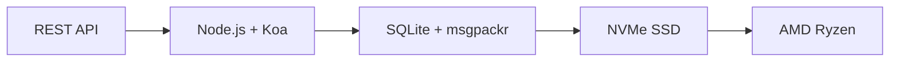

# İlk Tam E-posta API'si: Forward E-posta, E-posta Yönetiminde Nasıl Devrim Yarattı? {#the-first-complete-email-api-how-forward-email-revolutionized-email-management}


<p class="lead mt-3">
<strong>ÖZET:</strong> Başka hiçbir hizmetin sunmadığı gelişmiş arama özelliklerine sahip, e-posta yönetimi için dünyanın ilk eksiksiz REST API'sini oluşturduk. Gmail, Outlook ve Apple, geliştiricileri IMAP cehennemine veya hız sınırlı API'lere zorlarken, Forward Email, 15'ten fazla arama parametresine sahip birleşik bir REST arayüzü aracılığıyla mesajlar, klasörler, kişiler ve takvimler için inanılmaz hızlı CRUD işlemleri sunar. İşte e-posta API'si geliştiricilerinin beklediği şey.
</p>

## İçindekiler {#table-of-contents}

* [E-posta API Sorunu](#the-email-api-problem)
* [Geliştiriciler Aslında Ne Diyor?](#what-developers-are-actually-saying)
* [E-postayı İletmenin Devrim Niteliğindeki Çözümü](#forward-emails-revolutionary-solution)
  * [Bunu Neden İnşa Ettik](#why-we-built-this)
  * [Basit Kimlik Doğrulama](#simple-authentication)
* [Her Şeyi Değiştiren 20 Son Nokta](#20-endpoints-that-change-everything)
  * [Mesajlar (5 uç nokta)](#messages-5-endpoints)
  * [Klasörler (5 uç nokta)](#folders-5-endpoints)
  * [Kişiler (5 uç nokta)](#contacts-5-endpoints)
  * [Takvimler (5 uç nokta)](#calendars-5-endpoints)
* [Gelişmiş Arama: Başka Hiçbir Hizmet Karşılaştırılamaz](#advanced-search-no-other-service-compares)
  * [Arama API Manzarası Bozuldu](#the-search-api-landscape-is-broken)
  * [Forward Email'in Devrim Niteliğindeki Arama API'si](#forward-emails-revolutionary-search-api)
  * [Gerçek Dünya Arama Örnekleri](#real-world-search-examples)
  * [Performans Avantajları](#performance-advantages)
  * [Başka Kimsede Olmayan Arama Özellikleri](#search-features-no-one-else-has)
  * [Bu Neden Geliştiriciler İçin Önemlidir?](#why-this-matters-for-developers)
  * [Teknik Uygulama](#the-technical-implementation)
* [Yıldırım Hızında Performans Mimarisi](#blazing-fast-performance-architecture)
  * [Performans Ölçütleri](#performance-benchmarks)
  * [Gizlilik Öncelikli Mimari](#privacy-first-architecture)
* [Neden Farklıyız: Tam Karşılaştırma](#why-were-different-the-complete-comparison)
  * [Başlıca Sağlayıcı Sınırlamaları](#major-provider-limitations)
  * [E-postayı İletmenin Avantajları](#forward-email-advantages)
  * [Açık Kaynak Şeffaflık Sorunu](#the-open-source-transparency-problem)
* [30'dan Fazla Gerçek Dünya Entegrasyon Örneği](#30-real-world-integration-examples)
  * [1. WordPress İletişim Formu Geliştirmesi](#1-wordpress-contact-form-enhancement)
  * [2. E-posta Otomasyonu için Zapier Alternatifi](#2-zapier-alternative-for-email-automation)
  * [3. CRM E-posta Senkronizasyonu](#3-crm-email-synchronization)
  * [4. E-ticaret Sipariş İşleme](#4-e-commerce-order-processing)
  * [5. Destek Bileti Entegrasyonu](#5-support-ticket-integration)
  * [6. Bülten Yönetim Sistemi](#6-newsletter-management-system)
  * [7. E-posta Tabanlı Görev Yönetimi](#7-email-based-task-management)
  * [8. Çoklu Hesap E-posta Toplama](#8-multi-account-email-aggregation)
  * [9. Gelişmiş E-posta Analitiği Panosu](#9-advanced-email-analytics-dashboard)
  * [10. Akıllı E-posta Arşivleme](#10-smart-email-archiving)
  * [11. E-posta-Takvim Entegrasyonu](#11-email-to-calendar-integration)
  * [12. E-posta Yedekleme ve Uyumluluk](#12-email-backup-and-compliance)
  * [13. E-posta Tabanlı İçerik Yönetimi](#13-email-based-content-management)
  * [14. E-posta Şablonu Yönetimi](#14-email-template-management)
  * [15. E-posta Tabanlı İş Akışı Otomasyonu](#15-email-based-workflow-automation)
  * [16. E-posta Güvenliği İzleme](#16-email-security-monitoring)
  * [17. E-posta Tabanlı Anket Toplama](#17-email-based-survey-collection)
  * [18. E-posta Performans İzleme](#18-email-performance-monitoring)
  * [19. E-posta Tabanlı Potansiyel Müşteri Niteliği](#19-email-based-lead-qualification)
  * [20. E-posta Tabanlı Proje Yönetimi](#20-email-based-project-management)
  * [21. E-posta Tabanlı Envanter Yönetimi](#21-email-based-inventory-management)
  * [22. E-posta Tabanlı Fatura İşleme](#22-email-based-invoice-processing)
  * [23. E-posta Tabanlı Etkinlik Kaydı](#23-email-based-event-registration)
  * [24. E-posta Tabanlı Belge Onay İş Akışı](#24-email-based-document-approval-workflow)
  * [25. E-posta Tabanlı Müşteri Geri Bildirim Analizi](#25-email-based-customer-feedback-analysis)
  * [26. E-posta Tabanlı İşe Alma Süreci](#26-email-based-recruitment-pipeline)
  * [27. E-posta Tabanlı Gider Raporu İşleme](#27-email-based-expense-report-processing)
  * [28. E-posta Tabanlı Kalite Güvence Raporlaması](#28-email-based-quality-assurance-reporting)
  * [29. E-posta Tabanlı Satıcı Yönetimi](#29-email-based-vendor-management)
  * [30. E-posta Tabanlı Sosyal Medya İzleme](#30-email-based-social-media-monitoring)
* [Başlarken](#getting-started)
  * [1. Yönlendirme E-posta Hesabınızı Oluşturun](#1-create-your-forward-email-account)
  * [2. API Kimlik Bilgilerini Oluşturun](#2-generate-api-credentials)
  * [3. İlk API Çağrınızı Yapın](#3-make-your-first-api-call)
  * [4. Belgeleri inceleyin](#4-explore-the-documentation)
* [Teknik Kaynaklar](#technical-resources)

## E-posta API Sorunu {#the-email-api-problem}

E-posta API'leri temelden bozuk. Nokta.

Her büyük e-posta sağlayıcısı geliştiricileri iki korkunç seçimden birine zorluyor:

1. **IMAP Cehennemi**: Modern uygulamalar için değil, masaüstü istemcileri için tasarlanmış 30 yıllık bir protokolle boğuşmak
2. **Çökmüş API'ler**: Gerçek e-posta verilerinizi yönetemeyen, hız sınırlı, salt okunur, OAuth-karmaşık API'ler

Sonuç mu? Geliştiriciler ya e-posta entegrasyonunu tamamen terk ediyor ya da sürekli bozulan kırılgan IMAP paketleri oluşturmak için haftalarını harcıyor.

> \[!WARNING]
> **Kirli Sır**: Çoğu "e-posta API'si" yalnızca gönderme API'leridir. Basit bir REST arayüzü üzerinden klasörleri programatik olarak düzenleyemez, kişileri senkronize edemez veya takvimleri yönetemezsiniz. Ta ki şimdiye kadar.

## Geliştiricilerin Aslında Söyledikleri {#what-developers-are-actually-saying}

Hayal kırıklığı gerçektir ve her yerde belgelenmiştir:

> "Geçenlerde Gmail'i uygulamama entegre etmeye çalıştım ve çok fazla zaman harcadım. Gmail'i desteklemenin değmeyeceğine karar verdim."
>
> *- [Hacker News geliştiricisi](https://news.ycombinator.com/item?id=42106944), 147 oy*

> "Tüm e-posta API'leri vasat mı? Bir şekilde sınırlı veya kısıtlayıcı görünüyorlar."
>
> *- [Reddit r/SaaS tartışması](https://www.reddit.com/r/SaaS/comments/1cm84s7/are_all_email_apis_mediocre/)*

> "E-posta geliştirme neden berbat olmak zorunda?"
>
> *- [Reddit r/webdev](https://www.reddit.com/r/webdev/comments/15trnp2/why_does_email_development_have_to_suck/), geliştirici sıkıntısına dair 89 yorum*

> "Gmail API'yi IMAP'den daha verimli kılan nedir? Gmail API'nin çok daha verimli olmasının bir diğer nedeni de her mesajı yalnızca bir kez indirmesi gerekmesidir. IMAP ile her mesajın indirilmesi ve dizine eklenmesi gerekir..."
>
> *- [Stack Overflow sorusu](https://stackoverflow.com/questions/25431022/what-makes-the-gmail-api-more-efficient-than-imap) 47 oy aldı*

Kanıtlar her yerde:

* **WordPress SMTP sorunları**: [631 GitHub sorunu](https://github.com/awesomemotive/WP-Mail-SMTP/issues) e-posta teslim hataları hakkında
* **Zapier sınırlamaları**: [Topluluk şikayetleri](https://community.zapier.com/featured-articles-65/email-parser-by-zapier-limitations-and-alternatives-16958) yaklaşık 10 e-posta/saat sınırı ve IMAP algılama hataları
* **IMAP API projeleri**: [Çoklu](https://github.com/ewildgoose/imap-api) [açık kaynaklı](https://emailengine.app/) [projeler](https://www.npmjs.com/package/imapflow) özellikle "IMAP'yi REST'e dönüştürmek" için mevcuttur çünkü hiçbir sağlayıcı bunu sunmaz
* **Gmail API sorunları**: [Stack Overflow](https://stackoverflow.com/questions/tagged/gmail-api), hız sınırları ve karmaşıklık hakkında yaygın şikayetleri olan "gmail-api" etiketli 4.847 soruya sahip

## E-postayı İletmenin Devrim Niteliğindeki Çözümü {#forward-emails-revolutionary-solution}

**Tüm e-posta verileri için birleşik bir REST API aracılığıyla eksiksiz CRUD işlemleri sunan ilk e-posta hizmetiyiz.**

Bu, sıradan bir gönderim API'si değil. Bu, aşağıdakiler üzerinde tam bir programatik kontroldür:

* **Mesajlar**: Oluşturma, okuma, güncelleme, silme, arama, taşıma, işaretleme
* **Klasörler**: REST uç noktaları aracılığıyla tam IMAP klasör yönetimi
* **Kişiler**: [CardDAV](https://tools.ietf.org/html/rfc6352) kişi depolama ve senkronizasyon
* **Takvimler**: [CalDAV](https://tools.ietf.org/html/rfc4791) takvim etkinlikleri ve planlama

### Bunu Neden Oluşturduk? {#why-we-built-this}

**Sorun**: Her e-posta sağlayıcısı, e-postayı bir kara kutu olarak ele alır. E-posta gönderebilir, belki de karmaşık OAuth ile okuyabilirsiniz, ancak e-posta verilerinizi programatik olarak gerçek anlamda *yönetemezsiniz*.

**Vizyonumuz**: E-postanın, herhangi bir modern API kadar kolay entegre edilebilmesi gerekir. IMAP kütüphaneleri yok. OAuth karmaşıklığı yok. Hız sınırı kabusları yok. Sadece çalışan basit REST uç noktaları.

**Sonuç**: Sadece HTTP istekleri kullanarak eksiksiz bir e-posta istemcisi, CRM entegrasyonu veya otomasyon sistemi oluşturabileceğiniz ilk e-posta hizmeti.

### Basit Kimlik Doğrulaması {#simple-authentication}

[OAuth karmaşıklığı](https://oauth.net/2/) yok. [uygulamaya özel şifreler](https://support.google.com/accounts/answer/185833) yok. Sadece takma ad bilgileriniz:

```bash
curl -u "alias@yourdomain.com:password" \
  https://api.forwardemail.net/v1/messages
```

## Her Şeyi Değiştiren 20 Uç Nokta {#20-endpoints-that-change-everything}

### Mesajlar (5 uç nokta) {#messages-5-endpoints}

* `GET /v1/messages` - Filtrelemeli mesajları listele (`?folder=`, `?is_unread=`, `?is_flagged=`)
* `POST /v1/messages` - Yeni mesajları doğrudan klasörlere gönder
* `GET /v1/messages/:id` - Belirli bir mesajı tüm meta verileriyle al
* `PUT /v1/messages/:id` - Mesajı güncelle (işaretler, klasör, okunma durumu)
* `DELETE /v1/messages/:id` - Mesajı kalıcı olarak sil

### Klasörler (5 uç nokta) {#folders-5-endpoints}

* `GET /v1/folders` - Abonelik durumuna sahip tüm klasörleri listele
* `POST /v1/folders` - Özel özelliklere sahip yeni klasör oluştur
* `GET /v1/folders/:id` - Klasör ayrıntılarını ve mesaj sayılarını al
* `PUT /v1/folders/:id` - Klasör özelliklerini ve aboneliği güncelle
* `DELETE /v1/folders/:id` - Klasörü sil ve mesaj taşıma işlemini yönet

### Kişiler (5 uç nokta) {#contacts-5-endpoints}

* `GET /v1/contacts` - Kişileri arama ve sayfalama ile listele
* `POST /v1/contacts` - Tam vCard desteğiyle yeni kişi oluştur
* `GET /v1/contacts/:id` - Kişiyi tüm alanları ve meta verileriyle al
* `PUT /v1/contacts/:id` - Kişi bilgilerini ETag doğrulamasıyla güncelle
* `DELETE /v1/contacts/:id` - Kişiyi kademeli işlemeyle sil

### Takvimler (5 uç nokta) {#calendars-5-endpoints}

* `GET /v1/calendars` - Tarih filtrelemesiyle takvim etkinliklerini listele
* `POST /v1/calendars` - Katılımcılar ve tekrarlama ile takvim etkinliği oluştur
* `GET /v1/calendars/:id` - Saat dilimi işleme ile etkinlik ayrıntılarını al
* `PUT /v1/calendars/:id` - Çakışma algılama ile etkinliği güncelle
* `DELETE /v1/calendars/:id` - Katılımcı bildirimleri olan etkinliği sil

## Gelişmiş Arama: Başka Hiçbir Hizmet {#advanced-search-no-other-service-compares} ile Karşılaştırılamaz

**Forward Email, REST API aracılığıyla tüm mesaj alanlarında kapsamlı, programlı arama sunan tek e-posta hizmetidir.**

Diğer sağlayıcılar en iyi ihtimalle temel filtreleme sunarken, biz şimdiye kadar oluşturulmuş en gelişmiş e-posta arama API'sini geliştirdik. Hiçbir Gmail API, Outlook API veya başka bir hizmet, arama yeteneklerimize yaklaşamaz.

### Arama API Manzarası Bozuldu {#the-search-api-landscape-is-broken}

**Gmail API Arama Sınırlamaları:**

* ✅ Yalnızca temel `q` parametresi
* ❌ Alana özgü arama yok
* ❌ Tarih aralığı filtrelemesi yok
* ❌ Boyuta dayalı filtreleme yok
* ❌ Ek filtrelemesi yok
* ❌ Gmail'in arama sözdizimiyle sınırlıdır

**Outlook API Arama Sınırlamaları:**

* ✅ Temel `$search` parametresi
* ❌ Gelişmiş alan hedeflemesi yok
* ❌ Karmaşık sorgu kombinasyonları yok
* ❌ Agresif hız sınırlaması
* ❌ Karmaşık OData sözdizimi gerekli

**Apple iCloud:**

* ❌ Hiçbir API yok
* ❌ Yalnızca IMAP araması (çalışabilirseniz)

**ProtonMail ve Tuta:**

* ❌ Genel API yok
* ❌ Programatik arama yeteneği yok

### E-postayı İletmenin Devrim Niteliğindeki Arama API'si {#forward-emails-revolutionary-search-api}

**Başka hiçbir hizmetin sunmadığı 15'ten fazla arama parametresi sunuyoruz:**

| Arama Yeteneği | E-postayı İlet | Gmail API | Outlook API | Diğerleri |
| ------------------------------ | -------------------------------------- | ------------ | ------------------ | ------ |
| **Alana Özel Arama** | ✅ Konu, gövde, kimden, kime, cc, başlıklar | ❌ | ❌ | ❌ |
| **Çok Alanlı Genel Arama** | ✅ Tüm alanlarda `?search=` | ✅ Temel __HÜCRE_KODU_0__ | ✅ Temel __HÜCRE_KODU_0__ | ❌ |
| **Tarih Aralığı Filtreleme** | ✅ `?since=` & `?before=` | ❌ | ❌ | ❌ |
| **Boyut Tabanlı Filtreleme** | ✅ `?min_size=` & `?max_size=` | ❌ | ❌ | ❌ |
| **Ek Filtreleme** | ✅ `?has_attachments=true/false` | ❌ | ❌ | ❌ |
| **Başlık Araması** | ✅ `?headers=X-Priority` | ❌ | ❌ | ❌ |
| **Mesaj Kimliği Arama** | ✅ `?message_id=abc123` | ❌ | ❌ | ❌ |
| **Kombine Filtreler** | ✅ VE mantığıyla çoklu parametreler | ❌ | ❌ | ❌ |
| **Büyük-Küçük Harfe Duyarlı Değil** | ✅ Tüm aramalar | ✅ | ✅ | ❌ |
| **Sayfalandırma Desteği** | ✅ Tüm arama parametreleriyle çalışır | ✅ | ✅ | ❌ |

### Gerçek Dünya Arama Örnekleri {#real-world-search-examples}

**Son Çeyreğe Ait Tüm Faturaları Bulun:**

```bash
# Forward Email - Simple and powerful
GET /v1/messages?subject=invoice&since=2024-01-01T00:00:00Z&before=2024-04-01T00:00:00Z

# Gmail API - Impossible with their limited search
# No date range filtering available

# Outlook API - Complex OData syntax, limited functionality
GET /me/messages?$search="invoice"&$filter=receivedDateTime ge 2024-01-01T00:00:00Z
```

**Belirli Bir Gönderenden Gelen Büyük Ekleri Ara:**

```bash
# Forward Email - Comprehensive filtering
GET /v1/messages?from=finance@company.com&has_attachments=true&min_size=1000000

# Gmail API - Cannot filter by size or attachments programmatically
# Outlook API - No size filtering available
# Others - No APIs available
```

**Karmaşık Çok Alanlı Arama:**

```bash
# Forward Email - Advanced query capabilities
GET /v1/messages?body=quarterly&from=manager&is_flagged=true&folder=Reports

# Gmail API - Limited to basic text search only
GET /gmail/v1/users/me/messages?q=quarterly

# Outlook API - Basic search without field targeting
GET /me/messages?$search="quarterly"
```

### Performans Avantajları {#performance-advantages}

**İletilmiş E-posta Arama Performansı:**

* ⚡ Karmaşık aramalar için **100 ms'nin altında yanıt süreleri**
* 🔍 Uygun indeksleme ile **Regex optimizasyonu**
* 📊 Sayım ve veriler için **Paralel sorgu yürütme**
* 💾 Yalın sorgularla **Verimli bellek kullanımı**

**Rakip Performans Sorunları:**

* 🐌 **Gmail API**: Kullanıcı başına saniyede 250 kota birimiyle sınırlı oran
* 🐌 **Outlook API**: Karmaşık geri çekilme gereksinimleriyle agresif kısıtlama
* 🐌 **Diğerleri**: Karşılaştırılacak API yok

### Başka Kimsede Olmayan Arama Özellikleri {#search-features-no-one-else-has}

#### 1. Başlığa Özel Arama {#1-header-specific-search}

```bash
# Find messages with specific headers
GET /v1/messages?headers=X-Priority:1
GET /v1/messages?headers=X-Spam-Score
```

#### 2. Boyuta Dayalı Zeka {#2-size-based-intelligence}

```bash
# Find newsletter emails (typically large)
GET /v1/messages?min_size=50000&from=newsletter

# Find quick replies (typically small)
GET /v1/messages?max_size=1000&to=support
```

#### 3. Eklenti Tabanlı İş Akışları {#3-attachment-based-workflows}

```bash
# Find all documents sent to legal team
GET /v1/messages?to=legal&has_attachments=true&body=contract

# Find emails without attachments for cleanup
GET /v1/messages?has_attachments=false&before=2023-01-01T00:00:00Z
```

#### 4. Birleşik İş Mantığı {#4-combined-business-logic}

```bash
# Find urgent flagged messages from VIPs with attachments
GET /v1/messages?is_flagged=true&from=ceo&has_attachments=true&subject=urgent
```

### Geliştiriciler İçin Bunun Önemi {#why-this-matters-for-developers}

**Daha Önce İmkansız Olan Uygulamalar Oluşturun:**

1. **Gelişmiş E-posta Analizi**: E-posta modellerini boyuta, gönderene ve içeriğe göre analiz edin
2. **Akıllı E-posta Yönetimi**: Karmaşık kriterlere göre otomatik düzenleme
3. **Uyumluluk ve Keşif**: Yasal gereklilikler için belirli e-postaları bulun
4. **İş Zekası**: E-posta iletişim modellerinden içgörüler çıkarın
5. **Otomatik İş Akışları**: Gelişmiş e-posta filtrelerine göre eylemleri tetikleyin

### Teknik Uygulama {#the-technical-implementation}

Arama API'miz şunları kullanır:

* Uygun indeksleme stratejileriyle **Regex optimizasyonu**
* Performans için **Paralel yürütme**
* Güvenlik için **Giriş doğrulaması**
* Güvenilirlik için **Kapsamlı hata işleme**

```javascript
// Example: Complex search implementation
const searchConditions = [];

if (ctx.query.subject) {
  searchConditions.push({
    subject: { $regex: ctx.query.subject, $options: 'i' }
  });
}

if (ctx.query.from) {
  searchConditions.push({
    $or: [
      { 'from.address': { $regex: ctx.query.from, $options: 'i' } },
      { 'from.name': { $regex: ctx.query.from, $options: 'i' } }
    ]
  });
}

// Combine with AND logic
if (searchConditions.length > 0) {
  query.$and = searchConditions;
}
```

> \[!TIP]
> **Geliştirici Avantajı**: Forward Email'in arama API'si ile, REST API'lerinin basitliğini korurken işlevsellik açısından masaüstü istemcileriyle rekabet edebilecek e-posta uygulamaları oluşturabilirsiniz.

## Yıldırım Hızında Performans Mimarisi {#blazing-fast-performance-architecture}

Teknik yığınımız hız ve güvenilirlik için oluşturulmuştur:



### Performans Ölçütleri {#performance-benchmarks}

**Neden Yıldırım Hızındayız:**

| Bileşen | Teknoloji | Performans Faydası |
| ------------ | --------------------------------------------------------------------------------- | --------------------------------------------- |
| **Depolamak** | [NVMe SSD](https://en.wikipedia.org/wiki/NVM_Express) | Geleneksel SATA'dan 10 kat daha hızlı |
| **Veritabanı** | [SQLite](https://sqlite.org/) + [msgpackr](https://github.com/kriszyp/msgpackr) | Sıfır ağ gecikmesi, optimize edilmiş serileştirme |
| **Donanım** | [AMD Ryzen](https://www.amd.com/en/products/processors/desktops/ryzen) çıplak metal | Sanallaştırma yükü yok |
| **Önbelleğe Alma** | Bellekte + kalıcı | Milisaniyenin altında tepki süreleri |
| **Yedeklemeler** | [Cloudflare R2](https://www.cloudflare.com/products/r2/) şifrelendi | Kurumsal düzeyde güvenilirlik |

**Gerçek Performans Rakamları:**

* **API Yanıt Süresi**: < 50 ms ortalama
* **Mesaj Alma**: Önbelleğe alınmış mesajlar için < 10 ms
* **Klasör İşlemleri**: Meta veri işlemleri için < 5 ms
* **Kişi Senkronizasyonu**: Saniyede 1000+ kişi
* **Çalışma Süresi**: Yedekli altyapı ile %99,99 SLA

### Gizlilik Öncelikli Mimari {#privacy-first-architecture}

**Sıfır Bilgi Tasarımı**: IMAP şifrenizle yalnızca siz erişebilirsiniz; e-postalarınızı okuyamayız. [sıfır bilgi mimarisi](https://forwardemail.net/en/security), göz alıcı performans sunarken tam gizlilik sağlar.

## Neden Farklıyız: Tam Karşılaştırma {#why-were-different-the-complete-comparison}

### Önemli Sağlayıcı Sınırlamaları {#major-provider-limitations}

| Sağlayıcı | Temel Sorunlar | Belirli Sınırlamalar |
| ---------------- | ----------------------------------------- | -------------------------------------------------------------------------------------------------------------------------------------------------------------------------------------------------------------------------------------------------------------------------------------------------------------------------------------------------------------------------------------------------------------------------------------------------------------------- |
| **Gmail API'si** | Salt okunur, Karmaşık OAuth, Ayrı API'ler | • [Cannot modify existing messages](https://developers.google.com/gmail/api/reference/rest/v1/users.messages)<br>• [Labels ≠ folders](https://developers.google.com/gmail/api/reference/rest/v1/users.labels)<br>• [1 billion quota units/day limit](https://developers.google.com/gmail/api/reference/quota)<br>• [Requires separate APIs](https://developers.google.com/workspace) kişiler/takvim için |
| **Outlook API'si** | Kullanımdan kaldırılmış, kafa karıştırıcı, kurumsal odaklı | • __HÜCRE_BAĞLANTISI_0__<br>• __HÜCRE_BAĞLANTISI_1__ (EWS, Grafik, REST)<br>• __HÜCRE_BAĞLANTISI_2__<br>• __HÜCRE_BAĞLANTISI_3__ |
| **Apple iCloud** | Genel API Yok | • __HÜCRE_BAĞLANTISI_0__<br>• __HÜCRE_BAĞLANTISI_1__<br>• __HÜCRE_BAĞLANTISI_2__<br>• __HÜCRE_BAĞLANTISI_3__ |
| **ProtonPosta** | API Yok, Yanlış Açık Kaynak İddiaları | • [No public API available](https://proton.me/support/protonmail-bridge-clients)<br>• [Bridge software required](https://proton.me/mail/bridge) IMAP erişimi için<br>• [Claims "open source"](https://proton.me/blog/open-source) ancak [server code is proprietary](https://github.com/ProtonMail)<br>• [Limited to paid plans only](https://proton.me/pricing) |
| **Toplam** | API Yok, Yanıltıcı Şeffaflık | • [No REST API for email management](https://tuta.com/support#technical)<br>• [Claims "open source"](https://tuta.com/blog/posts/open-source-email) ancak [backend is closed](https://github.com/tutao/tutanota)<br>• [IMAP/SMTP not supported](https://tuta.com/support#imap)<br>• [Proprietary encryption](https://tuta.com/encryption) standart entegrasyonları engeller |
| **Zapier E-postası** | Ciddi Oran Sınırlamaları | • __HÜCRE_BAĞLANTISI_0__<br>• __HÜCRE_BAĞLANTISI_1__<br>• __HÜCRE_BAĞLANTISI_2__ |

### E-postayı İletmenin Avantajları {#forward-email-advantages}

| Özellik | E-postayı İlet | Yarışma |
| ------------------ | -------------------------------------------------------------------------------------------- | ----------------------------------------- |
| **Tam CRUD** | ✅ Tüm veriler için tam oluşturma, okuma, güncelleme ve silme | ❌ Salt okunur veya sınırlı işlemler |
| **Birleşik API** | ✅ Mesajlar, klasörler, kişiler, takvimler tek bir API'de | ❌ Ayrı API'ler veya eksik özellikler |
| **Basit Kimlik Doğrulama** | ✅ Takma ad kimlik bilgileriyle temel kimlik doğrulaması | ❌ Birden fazla kapsama sahip karmaşık OAuth |
| **Hiçbir Oran Sınırı Yok** | ✅ Gerçek uygulamalar için tasarlanmış cömert sınırlar | ❌ İş akışlarını bozan kısıtlayıcı kotalar |
| **Kendi Kendine Barındırma** | ✅ [Complete self-hosting option](https://forwardemail.net/en/blog/docs/self-hosted-solution) | ❌ Yalnızca satıcıya bağlılık |
| **Mahremiyet** | ✅ Sıfır bilgi, şifreli, özel | ❌ Veri madenciliği ve gizlilik endişeleri |
| **Performans** | ✅ 50 ms'nin altındaki yanıtlar, NVMe depolama | ❌ Ağ gecikmesi, kısıtlama gecikmeleri |

### Açık Kaynaklı Şeffaflık Sorunu {#the-open-source-transparency-problem}

**ProtonMail ve Tuta kendilerini "açık kaynaklı" ve "şeffaf" olarak pazarlıyorlar, ancak bu, modern gizlilik ilkelerini ihlal eden yanıltıcı bir pazarlama yöntemidir.**

> \[!WARNING]
> **Yanlış Şeffaflık İddiaları**: Hem ProtonMail hem de Tuta, en kritik sunucu tarafı kodlarını özel ve kapalı tutarken, "açık kaynaklı" kimlik bilgilerini açıkça duyuruyor.

**ProtonMail'in Aldatmacası:**

* **İddialar**: ["Biz açık kaynak kodluyuz"](https://proton.me/blog/open-source) pazarlamada öne çıkan bir özelliktir
* **Gerçeklik**: [Sunucu kodu tamamen özeldir](https://github.com/ProtonMail) - yalnızca istemci uygulamaları açık kaynaklıdır
* **Etkisi**: Kullanıcılar sunucu tarafı şifreleme, veri işleme veya gizlilik iddialarını doğrulayamaz
* **Şeffaflık İhlali**: Gerçek e-posta işleme ve depolama sistemlerini denetlemenin bir yolu yoktur

**Tuta'nın Yanıltıcı Pazarlaması:**

* **İddialar**: ["Açık kaynaklı e-posta"](https://tuta.com/blog/posts/open-source-email) temel bir satış noktası olarak
* **Gerçeklik**: [Arka uç altyapısı kapalı kaynaklıdır](https://github.com/tutao/tutanota) - yalnızca ön uç kullanılabilir
* **Etkisi**: Tescilli şifreleme, standart e-posta protokollerini (IMAP/SMTP) engeller
* **Kilitleme Stratejisi**: Özel şifreleme, satıcıya bağımlılığı zorunlu kılar

**Modern Gizlilik İçin Bunun Önemi:**

2025 yılında gerçek gizlilik **tam şeffaflık** gerektiriyor. E-posta sağlayıcıları "açık kaynak" iddiasında bulunup sunucu kodlarını gizlediğinde:

1. **Doğrulanamaz Şifreleme**: Verilerinizin nasıl şifrelendiğini denetleyemezsiniz.
2. **Gizli Veri Uygulamaları**: Sunucu tarafı veri işleme, bir kara kutu olarak kalır.
3. **Güven Tabanlı Güvenlik**: Doğrulama olmadan iddialarına güvenmelisiniz.
4. **Tedarikçi Bağımlılığı**: Tescilli sistemler veri taşınabilirliğini engeller.

**İletilen E-postanın Gerçek Şeffaflığı:**

* ✅ **[Tamamen açık kaynak](https://github.com/forwardemail/forwardemail.net)** - sunucu ve istemci kodu
* ✅ **[Kendi kendine barındırma mevcuttur](https://forwardemail.net/en/blog/docs/self-hosted-solution)** - kendi örneğinizi çalıştırın
* ✅ **Standart protokoller** - IMAP, SMTP, CardDAV, CalDAV uyumluluğu
* ✅ **Denetlenebilir güvenlik** - her kod satırı incelenebilir
* ✅ **Tedarikçi bağımlılığı yok** - verileriniz, kontrolünüz

> \[!TIP]
> **Gerçek açık kaynak, her iddiayı doğrulayabileceğiniz anlamına gelir.** Forward Email ile şifrelememizi denetleyebilir, veri işleme sürecimizi inceleyebilir ve hatta kendi örneğinizi çalıştırabilirsiniz. İşte gerçek şeffaflık budur.

## 30+ Gerçek Dünya Entegrasyon Örneği {#30-real-world-integration-examples}

### 1. WordPress İletişim Formu Geliştirmesi {#1-wordpress-contact-form-enhancement}

**Sorun**: [WordPress SMTP yapılandırma hataları](https://github.com/awesomemotive/WP-Mail-SMTP/issues) ([631 GitHub sorunu](https://github.com/awesomemotive/WP-Mail-SMTP/issues))
**Çözüm**: Doğrudan API entegrasyonu [SMTP](https://tools.ietf.org/html/rfc5321)'yi tamamen atlıyor

```javascript
// WordPress contact form that saves to Sent folder
await fetch('https://api.forwardemail.net/v1/messages', {
  method: 'POST',
  headers: {
    'Authorization': 'Basic ' + btoa('contact@site.com:password'),
    'Content-Type': 'application/json'
  },
  body: JSON.stringify({
    to: [{ address: 'owner@site.com' }],
    subject: 'Contact Form: ' + formData.subject,
    text: formData.message,
    folder: 'Sent'
  })
});
```

### 2. E-posta Otomasyonu için Zapier Alternatifi {#2-zapier-alternative-for-email-automation}

**Sorun**: [Zapier'ın saatte 10 e-posta sınırı](https://help.zapier.com/hc/en-us/articles/8496181555597-Email-Parser-by-Zapier-limitations-and-alternatives) ve [IMAP algılama hataları](https://community.zapier.com/featured-articles-65/email-parser-by-zapier-limitations-and-alternatives-16958)
**Çözüm**: Tam e-posta kontrolüyle sınırsız otomasyon

```javascript
// Auto-organize emails by sender domain
const messages = await fetch('/v1/messages?folder=INBOX');
for (const message of messages) {
  const domain = message.from.split('@')[1];
  await fetch(`/v1/messages/${message.id}`, {
    method: 'PUT',
    body: JSON.stringify({ folder: `Clients/${domain}` })
  });
}
```

### 3. CRM E-posta Senkronizasyonu {#3-crm-email-synchronization}

**Sorun**: E-posta ve [CRM sistemleri](https://en.wikipedia.org/wiki/Customer_relationship_management) arasında manuel iletişim yönetimi
**Çözüm**: [CardDAV](https://tools.ietf.org/html/rfc6352) iletişim API'siyle çift yönlü senkronizasyon

```javascript
// Sync new email contacts to CRM
const newContacts = await fetch('/v1/contacts');
for (const contact of newContacts) {
  await crmAPI.createContact({
    name: contact.name,
    email: contact.email,
    source: 'email_api'
  });
}
```

### 4. E-ticaret Sipariş İşleme {#4-e-commerce-order-processing}

**Sorun**: [e-ticaret platformları](https://en.wikipedia.org/wiki/E-commerce) için manuel sipariş e-postası işleme
**Çözüm**: Otomatik sipariş yönetimi hattı

```javascript
// Process order confirmation emails
const orders = await fetch('/v1/messages?folder=Orders');
const orderEmails = orders.filter(msg =>
  msg.subject.includes('Order Confirmation')
);

for (const order of orderEmails) {
  const orderData = parseOrderEmail(order.text);
  await updateInventory(orderData);
  await fetch(`/v1/messages/${order.id}`, {
    method: 'PUT',
    body: JSON.stringify({ folder: 'Orders/Processed' })
  });
}
```

### 5. Destek Talebi Entegrasyonu {#5-support-ticket-integration}

**Sorun**: E-posta dizileri [yardım masası platformları](https://en.wikipedia.org/wiki/Help_desk_software)'a dağılmış durumda
**Çözüm**: Tam e-posta dizisi takibi

```javascript
// Create support ticket from email thread
const messages = await fetch('/v1/messages?folder=Support');
const supportEmails = messages.filter(msg =>
  msg.to.some(addr => addr.includes('support@'))
);

for (const email of supportEmails) {
  const ticket = await supportSystem.createTicket({
    subject: email.subject,
    from: email.from,
    body: email.text,
    timestamp: email.date
  });
}
```

### 6. Bülten Yönetim Sistemi {#6-newsletter-management-system}

**Sorun**: Sınırlı [haber bülteni platformu](https://en.wikipedia.org/wiki/Email_marketing) entegrasyonu
**Çözüm**: Eksiksiz abone yaşam döngüsü yönetimi

```javascript
// Auto-manage newsletter subscriptions
const messages = await fetch('/v1/messages?folder=Newsletter');
const unsubscribes = messages.filter(msg =>
  msg.subject.toLowerCase().includes('unsubscribe')
);

for (const msg of unsubscribes) {
  await removeSubscriber(msg.from);
  await fetch(`/v1/messages/${msg.id}`, {
    method: 'PUT',
    body: JSON.stringify({ folder: 'Newsletter/Unsubscribed' })
  });
}
```

### 7. E-posta Tabanlı Görev Yönetimi {#7-email-based-task-management}

**Sorun**: Gelen kutusu doluluğu ve [görev takibi](https://en.wikipedia.org/wiki/Task_management)
**Çözüm**: E-postaları eyleme dönüştürülebilir görevlere dönüştürün

```javascript
// Create tasks from flagged emails
const messages = await fetch('/v1/messages?is_flagged=true');
for (const email of messages) {
  await taskManager.createTask({
    title: email.subject,
    description: email.text,
    assignee: email.to[0].address,
    dueDate: extractDueDate(email.text)
  });
}
```

### 8. Çoklu Hesap E-posta Toplama {#8-multi-account-email-aggregation}

**Sorun**: [birden fazla e-posta hesabı](https://en.wikipedia.org/wiki/Email_client)'ı sağlayıcılar arasında yönetme
**Çözüm**: Birleşik gelen kutusu arayüzü

```javascript
// Aggregate emails from multiple accounts
const accounts = ['work@domain.com', 'personal@domain.com'];
const allMessages = [];

for (const account of accounts) {
  const messages = await fetch('/v1/messages', {
    headers: { 'Authorization': getAuth(account) }
  });
  allMessages.push(...messages.map(m => ({ ...m, account })));
}
```

### 9. Gelişmiş E-posta Analizi Panosu {#9-advanced-email-analytics-dashboard}

**Sorun**: Gelişmiş filtrelemeyle [e-posta kalıpları](https://en.wikipedia.org/wiki/Email_analytics) hakkında bilgi yok
**Çözüm**: Gelişmiş arama özellikleri kullanılarak özel e-posta analitiği

```javascript
// Generate comprehensive email analytics using advanced search
const analytics = {};

// Analyze email volume by sender domain
const messages = await fetch('/v1/messages');
analytics.senderDomains = analyzeSenderDomains(messages);

// Find large attachments consuming storage
const largeAttachments = await fetch('/v1/messages?has_attachments=true&min_size=1000000');
analytics.storageHogs = largeAttachments.map(msg => ({
  subject: msg.subject,
  from: msg.from,
  size: msg.size
}));

// Analyze communication patterns with VIPs
const vipEmails = await fetch('/v1/messages?from=ceo@company.com');
const urgentVipEmails = await fetch('/v1/messages?from=ceo@company.com&subject=urgent');
analytics.vipCommunication = {
  total: vipEmails.length,
  urgent: urgentVipEmails.length,
  urgencyRate: (urgentVipEmails.length / vipEmails.length) * 100
};

// Find unread emails by date range for follow-up
const lastWeek = new Date(Date.now() - 7 * 24 * 60 * 60 * 1000).toISOString();
const unreadRecent = await fetch(`/v1/messages?is_unread=true&since=${lastWeek}`);
analytics.followUpNeeded = unreadRecent.length;

// Analyze email sizes for optimization
const smallEmails = await fetch('/v1/messages?max_size=1000');
const mediumEmails = await fetch('/v1/messages?min_size=1000&max_size=50000');
const largeEmails = await fetch('/v1/messages?min_size=50000');
analytics.sizeDistribution = {
  small: smallEmails.length,
  medium: mediumEmails.length,
  large: largeEmails.length
};

// Search for compliance-related emails
const complianceEmails = await fetch('/v1/messages?body=confidential&has_attachments=true');
analytics.complianceReview = complianceEmails.length;
```

### 10. Akıllı E-posta Arşivleme {#10-smart-email-archiving}

**Sorun**: Manuel [e-posta organizasyonu](https://en.wikipedia.org/wiki/Email_management)
**Çözüm**: Akıllı e-posta kategorilendirmesi

```javascript
// Auto-archive old emails by category
const messages = await fetch('/v1/messages');
const oldEmails = messages.filter(email =>
  isOlderThan(email.date, 90) // 90 days
);

for (const email of oldEmails) {
  const category = categorizeEmail(email);
  await fetch(`/v1/messages/${email.id}`, {
    method: 'PUT',
    body: JSON.stringify({ folder: `Archive/${category}` })
  });
}
```

### 11. E-postadan Takvime Entegrasyon {#11-email-to-calendar-integration}

**Sorun**: E-postalardan manuel [takvim etkinliği](https://tools.ietf.org/html/rfc4791) oluşturma
**Çözüm**: Otomatik olay ayıklama ve oluşturma

```javascript
// Extract meeting details from emails
const messages = await fetch('/v1/messages?folder=Meetings');
const meetingEmails = messages.filter(email =>
  email.subject.toLowerCase().includes('meeting')
);

for (const email of meetingEmails) {
  const meetingData = extractMeetingInfo(email.text);
  if (meetingData.date && meetingData.time) {
    await fetch('/v1/calendars', {
      method: 'POST',
      body: JSON.stringify({
        title: email.subject,
        start: meetingData.datetime,
        attendees: [email.from, ...email.to]
      })
    });
  }
}
```

### 12. E-posta Yedekleme ve Uyumluluk {#12-email-backup-and-compliance}

**Sorun**: [E-posta saklama](https://en.wikipedia.org/wiki/Email_retention_policy) ve uyumluluk gereksinimleri
**Çözüm**: Meta veri koruma ile otomatik yedekleme

```javascript
// Backup emails with full metadata
const allMessages = await fetch('/v1/messages');
const backup = {
  timestamp: new Date(),
  messages: allMessages.map(msg => ({
    id: msg.id,
    subject: msg.subject,
    from: msg.from,
    to: msg.to,
    date: msg.date,
    flags: msg.flags
  }))
};
await saveToComplianceStorage(backup);
```

### 13. E-posta Tabanlı İçerik Yönetimi {#13-email-based-content-management}

**Sorun**: [CMS platformları](https://en.wikipedia.org/wiki/Content_management_system) için e-posta yoluyla içerik gönderimlerini yönetme
**Çözüm**: İçerik yönetim sistemi olarak e-posta

```javascript
// Process content submissions from email
const messages = await fetch('/v1/messages?folder=Submissions');
const submissions = messages.filter(msg =>
  msg.to.some(addr => addr.includes('submit@'))
);

for (const submission of submissions) {
  const content = parseSubmission(submission.text);
  await cms.createDraft({
    title: submission.subject,
    content: content.body,
    author: submission.from
  });
}
```

### 14. E-posta Şablonu Yönetimi {#14-email-template-management}

**Sorun**: Ekip genelinde tutarsız [e-posta şablonları](https://en.wikipedia.org/wiki/Email_template)
**Çözüm**: API'li merkezi şablon sistemi

```javascript
// Send templated emails with dynamic content
const template = await getEmailTemplate('welcome');
await fetch('/v1/messages', {
  method: 'POST',
  body: JSON.stringify({
    to: [{ address: newUser.email }],
    subject: template.subject.replace('{{name}}', newUser.name),
    html: template.html.replace('{{name}}', newUser.name),
    folder: 'Sent'
  })
});
```

### 15. E-posta Tabanlı İş Akışı Otomasyonu {#15-email-based-workflow-automation}

**Sorun**: E-posta yoluyla manuel [onay süreçleri](https://en.wikipedia.org/wiki/Workflow)
**Çözüm**: Otomatik iş akışı tetikleyicileri

```javascript
// Process approval emails
const messages = await fetch('/v1/messages?folder=Approvals');
const approvals = messages.filter(msg =>
  msg.subject.includes('APPROVAL')
);

for (const approval of approvals) {
  const decision = parseApprovalDecision(approval.text);
  await workflow.processApproval({
    requestId: extractRequestId(approval.subject),
    decision: decision,
    approver: approval.from
  });
}
```

### 16. E-posta Güvenlik İzleme {#16-email-security-monitoring}

**Sorun**: Manuel [güvenlik tehdidi tespiti](https://en.wikipedia.org/wiki/Email_security)
**Çözüm**: Otomatik tehdit analizi

```javascript
// Monitor for suspicious emails
const recentEmails = await fetch('/v1/messages');
for (const email of recentEmails) {
  const threatScore = analyzeThreat(email);
  if (threatScore > 0.8) {
    await fetch(`/v1/messages/${email.id}`, {
      method: 'PUT',
      body: JSON.stringify({ folder: 'Security/Quarantine' })
    });
    await alertSecurityTeam(email);
  }
}
```

### 17. E-posta Tabanlı Anket Toplama {#17-email-based-survey-collection}

**Sorun**: [anket yanıtı](https://en.wikipedia.org/wiki/Survey_methodology)'ın manuel işlenmesi
**Çözüm**: Otomatik yanıt toplama

```javascript
// Collect and process survey responses
const messages = await fetch('/v1/messages?folder=Surveys');
const responses = messages.filter(msg =>
  msg.subject.includes('Survey Response')
);

const surveyData = responses.map(email => ({
  respondent: email.from,
  responses: parseSurveyData(email.text),
  timestamp: email.date
}));
await updateSurveyResults(surveyData);
```

### 18. E-posta Performans İzleme {#18-email-performance-monitoring}

**Sorun**: [e-posta teslim performansı](https://en.wikipedia.org/wiki/Email_deliverability) görünürlüğü yok
**Çözüm**: Gerçek zamanlı e-posta ölçümleri

```javascript
// Monitor email delivery performance
const sentEmails = await fetch('/v1/messages?folder=Sent');
const deliveryStats = {
  sent: sentEmails.length,
  bounces: await countBounces(),
  deliveryRate: calculateDeliveryRate()
};
await updateDashboard(deliveryStats);
```

### 19. E-posta Tabanlı Potansiyel Müşteri Niteliği {#19-email-based-lead-qualification}

**Sorun**: E-posta etkileşimlerinden manuel [puanlama liderliği](https://en.wikipedia.org/wiki/Lead_scoring)
**Çözüm**: Otomatik potansiyel müşteri yeterlilik süreci

```javascript
// Score leads based on email engagement
const prospects = await fetch('/v1/contacts');
for (const prospect of prospects) {
  const messages = await fetch('/v1/messages');
  const emails = messages.filter(msg =>
    msg.from.includes(prospect.email)
  );
  const score = calculateEngagementScore(emails);
  await crm.updateLeadScore(prospect.id, score);
}
```

### 20. E-posta Tabanlı Proje Yönetimi {#20-email-based-project-management}

**Sorun**: [Proje güncellemeleri](https://en.wikipedia.org/wiki/Project_management) e-posta dizilerine dağılmış durumda
**Çözüm**: Merkezi proje iletişim merkezi

```javascript
// Extract project updates from emails
const messages = await fetch('/v1/messages?folder=Projects');
const projectEmails = messages.filter(msg =>
  msg.subject.includes('Project Update')
);

for (const email of projectEmails) {
  const update = parseProjectUpdate(email.text);
  await projectManager.addUpdate({
    project: update.projectId,
    author: email.from,
    content: update.content
  });
}
```

### 21. E-posta Tabanlı Envanter Yönetimi {#21-email-based-inventory-management}

**Sorun**: Tedarikçi e-postalarından manuel envanter güncellemeleri
**Çözüm**: E-posta bildirimlerinden otomatik envanter takibi

```javascript
// Process inventory updates from supplier emails
const messages = await fetch('/v1/messages?folder=Suppliers');
const inventoryEmails = messages.filter(msg =>
  msg.subject.includes('Inventory Update') || msg.subject.includes('Stock Alert')
);

for (const email of inventoryEmails) {
  const inventoryData = parseInventoryUpdate(email.text);
  await inventory.updateStock({
    sku: inventoryData.sku,
    quantity: inventoryData.quantity,
    supplier: email.from,
    timestamp: email.date
  });

  // Move to processed folder
  await fetch(`/v1/messages/${email.id}`, {
    method: 'PUT',
    body: JSON.stringify({ folder: 'Suppliers/Processed' })
  });
}
```

### 22. E-posta Tabanlı Fatura İşleme {#22-email-based-invoice-processing}

**Sorun**: Manuel [fatura işleme](https://en.wikipedia.org/wiki/Invoice_processing) ve muhasebe entegrasyonu
**Çözüm**: Otomatik fatura çıkarma ve muhasebe sistemi senkronizasyonu

```javascript
// Extract invoice data from email attachments
const messages = await fetch('/v1/messages?folder=Invoices');
const invoiceEmails = messages.filter(msg =>
  msg.subject.toLowerCase().includes('invoice') && msg.attachments.length > 0
);

for (const email of invoiceEmails) {
  const invoiceData = await extractInvoiceData(email.attachments[0]);
  await accounting.createInvoice({
    vendor: email.from,
    amount: invoiceData.total,
    dueDate: invoiceData.dueDate,
    items: invoiceData.lineItems
  });

  // Flag as processed
  await fetch(`/v1/messages/${email.id}`, {
    method: 'PUT',
    body: JSON.stringify({ flags: ['\\Seen', '\\Flagged'] })
  });
}
```

### 23. E-posta Tabanlı Etkinlik Kaydı {#23-email-based-event-registration}

**Sorun**: E-posta yanıtlarından [etkinlik kaydı](https://en.wikipedia.org/wiki/Event_management)'ın manuel işlenmesi
**Çözüm**: Otomatik katılımcı yönetimi ve takvim entegrasyonu

```javascript
// Process event registration emails
const messages = await fetch('/v1/messages?folder=Events');
const registrations = messages.filter(msg =>
  msg.subject.includes('Registration') || msg.subject.includes('RSVP')
);

for (const registration of registrations) {
  const attendeeData = parseRegistration(registration.text);

  // Add to attendee list
  await events.addAttendee({
    event: attendeeData.eventId,
    name: attendeeData.name,
    email: registration.from,
    dietary: attendeeData.dietaryRestrictions
  });

  // Create calendar event for attendee
  await fetch('/v1/calendars', {
    method: 'POST',
    body: JSON.stringify({
      title: attendeeData.eventName,
      start: attendeeData.eventDate,
      attendees: [registration.from]
    })
  });
}
```

### 24. E-posta Tabanlı Belge Onay İş Akışı {#24-email-based-document-approval-workflow}

**Sorun**: E-posta yoluyla karmaşık [belge onayı](https://en.wikipedia.org/wiki/Document_management_system) zincirleri
**Çözüm**: Otomatik onay takibi ve belge sürümleme

```javascript
// Track document approval workflow
const messages = await fetch('/v1/messages?folder=Approvals');
const approvalEmails = messages.filter(msg =>
  msg.subject.includes('Document Approval')
);

for (const email of approvalEmails) {
  const approval = parseApprovalEmail(email.text);

  await documentSystem.updateApproval({
    documentId: approval.documentId,
    approver: email.from,
    status: approval.decision, // 'approved', 'rejected', 'needs_changes'
    comments: approval.comments,
    timestamp: email.date
  });

  // Check if all approvals complete
  const document = await documentSystem.getDocument(approval.documentId);
  if (document.allApprovalsComplete) {
    await documentSystem.finalizeDocument(approval.documentId);
  }
}
```

### 25. E-posta Tabanlı Müşteri Geri Bildirim Analizi {#25-email-based-customer-feedback-analysis}

**Sorun**: Manuel [müşteri geri bildirimi](https://en.wikipedia.org/wiki/Customer_feedback) toplama ve duygu analizi
**Çözüm**: Otomatik geri bildirim işleme ve duygu takibi

```javascript
// Analyze customer feedback from emails
const messages = await fetch('/v1/messages?folder=Feedback');
const feedbackEmails = messages.filter(msg =>
  msg.to.some(addr => addr.includes('feedback@'))
);

for (const email of feedbackEmails) {
  const sentiment = await analyzeSentiment(email.text);
  const category = categorizeFeeback(email.text);

  await feedback.recordFeedback({
    customer: email.from,
    content: email.text,
    sentiment: sentiment.score, // -1 to 1
    category: category, // 'bug', 'feature', 'complaint', 'praise'
    priority: calculatePriority(sentiment, category),
    timestamp: email.date
  });

  // Auto-escalate negative feedback
  if (sentiment.score < -0.5) {
    await escalateToSupport(email);
  }
}
```

### 26. E-posta Tabanlı İşe Alma Süreci {#26-email-based-recruitment-pipeline}

**Sorun**: Manuel [işe alım](https://en.wikipedia.org/wiki/Recruitment) ve aday takibi
**Çözüm**: Otomatik aday yönetimi ve mülakat planlaması

```javascript
// Process job application emails
const messages = await fetch('/v1/messages?folder=Careers');
const applications = messages.filter(msg =>
  msg.subject.toLowerCase().includes('application') && msg.attachments.length > 0
);

for (const application of applications) {
  const resume = await parseResume(application.attachments[0]);

  const candidate = await ats.createCandidate({
    name: resume.name,
    email: application.from,
    skills: resume.skills,
    experience: resume.experience,
    position: extractPosition(application.subject)
  });

  // Auto-schedule screening if qualified
  if (candidate.qualificationScore > 0.7) {
    await calendar.scheduleInterview({
      candidateId: candidate.id,
      type: 'phone_screening',
      duration: 30
    });
  }
}
```

### 27. E-posta Tabanlı Gider Raporu İşleme {#27-email-based-expense-report-processing}

**Sorun**: Manuel [gider raporu](https://en.wikipedia.org/wiki/Expense_report) gönderimi ve onayı
**Çözüm**: Otomatik gider çıkarma ve onay iş akışı

```javascript
// Process expense report emails
const messages = await fetch('/v1/messages?folder=Expenses');
const expenseEmails = messages.filter(msg =>
  msg.subject.includes('Expense') && msg.attachments.length > 0
);

for (const email of expenseEmails) {
  const receipts = await processReceipts(email.attachments);

  const expenseReport = await expenses.createReport({
    employee: email.from,
    expenses: receipts.map(receipt => ({
      amount: receipt.total,
      category: receipt.category,
      date: receipt.date,
      merchant: receipt.merchant
    })),
    totalAmount: receipts.reduce((sum, r) => sum + r.total, 0)
  });

  // Auto-approve small amounts
  if (expenseReport.totalAmount < 100) {
    await expenses.approve(expenseReport.id);
  } else {
    await expenses.sendForApproval(expenseReport.id);
  }
}
```

### 28. E-posta Tabanlı Kalite Güvence Raporlaması {#28-email-based-quality-assurance-reporting}

**Sorun**: Manuel [kalite güvencesi](https://en.wikipedia.org/wiki/Quality_assurance) sorun takibi
**Çözüm**: Otomatik QA sorun yönetimi ve hata takibi

```javascript
// Process QA bug reports from email
const messages = await fetch('/v1/messages?folder=QA');
const bugReports = messages.filter(msg =>
  msg.subject.includes('Bug Report') || msg.subject.includes('QA Issue')
);

for (const report of bugReports) {
  const bugData = parseBugReport(report.text);

  const ticket = await bugTracker.createIssue({
    title: report.subject,
    description: bugData.description,
    severity: bugData.severity,
    steps: bugData.stepsToReproduce,
    reporter: report.from,
    attachments: report.attachments
  });

  // Auto-assign based on component
  const assignee = await getComponentOwner(bugData.component);
  await bugTracker.assign(ticket.id, assignee);

  // Create calendar reminder for follow-up
  await fetch('/v1/calendars', {
    method: 'POST',
    body: JSON.stringify({
      title: `Follow up on ${ticket.id}`,
      start: addDays(new Date(), 3),
      attendees: [assignee]
    })
  });
}
```

### 29. E-posta Tabanlı Satıcı Yönetimi {#29-email-based-vendor-management}

**Sorun**: Manuel [satıcı iletişimi](https://en.wikipedia.org/wiki/Vendor_management) ve sözleşme takibi
**Çözüm**: Otomatik tedarikçi ilişkileri yönetimi

```javascript
// Track vendor communications and contracts
const messages = await fetch('/v1/messages?folder=Vendors');
const vendorEmails = messages.filter(msg =>
  isVendorEmail(msg.from)
);

for (const email of vendorEmails) {
  const vendor = await vendors.getByEmail(email.from);

  // Log communication
  await vendors.logCommunication({
    vendorId: vendor.id,
    type: 'email',
    subject: email.subject,
    content: email.text,
    timestamp: email.date
  });

  // Check for contract-related keywords
  if (email.text.includes('contract') || email.text.includes('renewal')) {
    await vendors.flagForContractReview({
      vendorId: vendor.id,
      emailId: email.id,
      priority: 'high'
    });

    // Create task for procurement team
    await tasks.create({
      title: `Review contract communication from ${vendor.name}`,
      assignee: 'procurement@company.com',
      dueDate: addDays(new Date(), 2)
    });
  }
}
```

### 30. E-posta Tabanlı Sosyal Medya İzleme {#30-email-based-social-media-monitoring}

**Sorun**: [sosyal medya](https://en.wikipedia.org/wiki/Social_media_monitoring) bildirimlerinin manuel takibi ve yanıtlanması
**Çözüm**: Otomatik sosyal medya uyarı işleme ve yanıt koordinasyonu

```javascript
// Process social media alerts from email notifications
const messages = await fetch('/v1/messages?folder=Social');
const socialAlerts = messages.filter(msg =>
  msg.from.includes('alerts@') || msg.subject.includes('Social Mention')
);

for (const alert of socialAlerts) {
  const mention = parseSocialMention(alert.text);

  await socialMedia.recordMention({
    platform: mention.platform,
    author: mention.author,
    content: mention.content,
    sentiment: mention.sentiment,
    reach: mention.followerCount,
    url: mention.url
  });

  // Auto-escalate negative mentions with high reach
  if (mention.sentiment < -0.5 && mention.followerCount > 10000) {
    await socialMedia.escalateToTeam({
      mentionId: mention.id,
      priority: 'urgent',
      assignee: 'social-media-manager@company.com'
    });

    // Create calendar reminder for immediate response
    await fetch('/v1/calendars', {
      method: 'POST',
      body: JSON.stringify({
        title: `Urgent: Respond to negative social mention`,
        start: addMinutes(new Date(), 30),
        attendees: ['social-media-manager@company.com']
      })
    });
  }
}
```

## Başlarken {#getting-started}

### 1. Yönlendirme E-posta Hesabınızı Oluşturun {#1-create-your-forward-email-account}

[forwardemail.net](https://forwardemail.net) adresine kaydolun ve alan adınızı doğrulayın.

### 2. API Kimlik Bilgilerini Oluşturun {#2-generate-api-credentials}

Takma adınız olan e-posta adresiniz ve parolanız API kimlik bilgileri olarak kullanılır; ek bir kurulum gerekmez.

### 3. İlk API Çağrınızı Yapın {#3-make-your-first-api-call}

```bash
# List your messages
curl -u "your-alias@domain.com:password" \
  https://api.forwardemail.net/v1/messages

# Create a new contact
curl -u "your-alias@domain.com:password" \
  -X POST \
  -H "Content-Type: application/json" \
  -d '{"fullName":"John Doe","emails":[{"value":"john@example.com"}]}' \
  https://api.forwardemail.net/v1/contacts
```

### 4. {#4-explore-the-documentation} Belgelerini inceleyin

Etkileşimli örneklerle birlikte tam API dokümantasyonu için [forwardemail.net/en/email-api](https://forwardemail.net/en/email-api) adresini ziyaret edin.

## Teknik Kaynaklar {#technical-resources}

* **[Tam API Dokümantasyonu](https://forwardemail.net/en/email-api)** - Etkileşimli OpenAPI 3.0 spesifikasyonu
* **[Kendi Kendine Barındırma Rehberi](https://forwardemail.net/en/blog/docs/self-hosted-solution)** - Altyapınıza Yönlendirme E-postası Dağıtın
* **[Güvenlik Beyaz Bülteni](https://forwardemail.net/technical-whitepaper.pdf)** - Teknik mimari ve güvenlik ayrıntıları
* **[GitHub Deposu](https://github.com/forwardemail/forwardemail.net)** - Açık kaynak kod tabanı
* **[Geliştirici Desteği](mailto:api@forwardemail.net)** - Mühendislik ekibimize doğrudan erişim

---

**E-posta entegrasyonunuzu devrim niteliğinde değiştirmeye hazır mısınız?** [Bugün Forward Email'in API'sini kullanarak oluşturmaya başlayın](https://forwardemail.net/en/email-api) ve geliştiriciler için tasarlanmış ilk eksiksiz e-posta yönetim platformunu deneyimleyin.

*E-postayı İlet: API'leri nihayet doğru hale getiren e-posta hizmeti.*