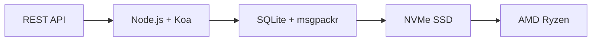

# İlk Tam E-posta API'si: Forward Email E-posta Yönetimini Nasıl Devrim Yarattı {#the-first-complete-email-api-how-forward-email-revolutionized-email-management}


<p class="lead mt-3">
  <strong>Özet:</strong> Dünyanın başka hiçbir hizmetin sunmadığı gelişmiş arama yeteneklerine sahip, e-posta yönetimi için ilk tam REST API'sini biz geliştirdik. Gmail, Outlook ve Apple geliştiricileri IMAP cehennemine veya hız sınırlandırmalı API'lere zorlayıp dururken, Forward Email mesajlar, klasörler, kişiler ve takvimler için 15'ten fazla arama parametresiyle birleşik bir REST arayüzü üzerinden yıldırım hızında CRUD işlemleri sunuyor. İşte geliştiricilerin beklediği e-posta API'si.
</p>


## İçindekiler {#table-of-contents}

* [E-posta API Sorunu](#the-email-api-problem)
* [Geliştiricilerin Gerçekten Söyledikleri](#what-developers-are-actually-saying)
* [Forward Email'in Devrim Yaratan Çözümü](#forward-emails-revolutionary-solution)
  * [Neden Bunu Geliştirdik](#why-we-built-this)
  * [Basit Kimlik Doğrulama](#simple-authentication)
* [Her Şeyi Değiştiren 20 Uç Nokta](#20-endpoints-that-change-everything)
  * [Mesajlar (5 uç nokta)](#messages-5-endpoints)
  * [Klasörler (5 uç nokta)](#folders-5-endpoints)
  * [Kişiler (5 uç nokta)](#contacts-5-endpoints)
  * [Takvimler (5 uç nokta)](#calendars-5-endpoints)
* [Gelişmiş Arama: Başka Hiçbir Hizmet Kıyaslanamaz](#advanced-search-no-other-service-compares)
  * [Arama API Manzarası Bozuk](#the-search-api-landscape-is-broken)
  * [Forward Email'in Devrim Yaratan Arama API'si](#forward-emails-revolutionary-search-api)
  * [Gerçek Dünya Arama Örnekleri](#real-world-search-examples)
  * [Performans Avantajları](#performance-advantages)
  * [Başka Hiç Kimsenin Sahip Olmadığı Arama Özellikleri](#search-features-no-one-else-has)
  * [Geliştiriciler İçin Neden Önemli](#why-this-matters-for-developers)
  * [Teknik Uygulama](#the-technical-implementation)
* [Yıldırım Hızında Performans Mimarisi](#blazing-fast-performance-architecture)
  * [Performans Kıyaslamaları](#performance-benchmarks)
  * [Gizlilik Öncelikli Mimari](#privacy-first-architecture)
* [Neden Farklıyız: Tam Karşılaştırma](#why-were-different-the-complete-comparison)
  * [Büyük Sağlayıcıların Kısıtlamaları](#major-provider-limitations)
  * [Forward Email Avantajları](#forward-email-advantages)
  * [Açık Kaynak Şeffaflık Sorunu](#the-open-source-transparency-problem)
* [30+ Gerçek Dünya Entegrasyon Örneği](#30-real-world-integration-examples)
  * [1. WordPress İletişim Formu Geliştirmesi](#1-wordpress-contact-form-enhancement)
  * [2. E-posta Otomasyonu için Zapier Alternatifi](#2-zapier-alternative-for-email-automation)
  * [3. CRM E-posta Senkronizasyonu](#3-crm-email-synchronization)
  * [4. E-ticaret Sipariş İşleme](#4-e-commerce-order-processing)
  * [5. Destek Talebi Entegrasyonu](#5-support-ticket-integration)
  * [6. Bülten Yönetim Sistemi](#6-newsletter-management-system)
  * [7. E-posta Tabanlı Görev Yönetimi](#7-email-based-task-management)
  * [8. Çoklu Hesap E-posta Toplama](#8-multi-account-email-aggregation)
  * [9. Gelişmiş E-posta Analitik Panosu](#9-advanced-email-analytics-dashboard)
  * [10. Akıllı E-posta Arşivleme](#10-smart-email-archiving)
  * [11. E-posta-Takvim Entegrasyonu](#11-email-to-calendar-integration)
  * [12. E-posta Yedekleme ve Uyumluluk](#12-email-backup-and-compliance)
  * [13. E-posta Tabanlı İçerik Yönetimi](#13-email-based-content-management)
  * [14. E-posta Şablon Yönetimi](#14-email-template-management)
  * [15. E-posta Tabanlı İş Akışı Otomasyonu](#15-email-based-workflow-automation)
  * [16. E-posta Güvenlik İzleme](#16-email-security-monitoring)
  * [17. E-posta Tabanlı Anket Toplama](#17-email-based-survey-collection)
  * [18. E-posta Performans İzleme](#18-email-performance-monitoring)
  * [19. E-posta Tabanlı Potansiyel Müşteri Nitelendirme](#19-email-based-lead-qualification)
  * [20. E-posta Tabanlı Proje Yönetimi](#20-email-based-project-management)
  * [21. E-posta Tabanlı Envanter Yönetimi](#21-email-based-inventory-management)
  * [22. E-posta Tabanlı Fatura İşleme](#22-email-based-invoice-processing)
  * [23. E-posta Tabanlı Etkinlik Kaydı](#23-email-based-event-registration)
  * [24. E-posta Tabanlı Belge Onay İş Akışı](#24-email-based-document-approval-workflow)
  * [25. E-posta Tabanlı Müşteri Geri Bildirim Analizi](#25-email-based-customer-feedback-analysis)
  * [26. E-posta Tabanlı İşe Alım Süreci](#26-email-based-recruitment-pipeline)
  * [27. E-posta Tabanlı Gider Raporu İşleme](#27-email-based-expense-report-processing)
  * [28. E-posta Tabanlı Kalite Güvence Raporlama](#28-email-based-quality-assurance-reporting)
  * [29. E-posta Tabanlı Tedarikçi Yönetimi](#29-email-based-vendor-management)
  * [30. E-posta Tabanlı Sosyal Medya İzleme](#30-email-based-social-media-monitoring)
* [Başlarken](#getting-started)
  * [1. Forward Email Hesabınızı Oluşturun](#1-create-your-forward-email-account)
  * [2. API Kimlik Bilgilerini Oluşturun](#2-generate-api-credentials)
  * [3. İlk API Çağrınızı Yapın](#3-make-your-first-api-call)
  * [4. Dokümantasyonu Keşfedin](#4-explore-the-documentation)
* [Teknik Kaynaklar](#technical-resources)
## E-posta API Sorunu {#the-email-api-problem}

E-posta API'leri temelde bozuk. Nokta.

Her büyük e-posta sağlayıcısı geliştiricileri iki korkunç tercihten birine zorluyor:

1. **IMAP Cehennemi**: Modern uygulamalar için değil, masaüstü istemcileri için tasarlanmış 30 yıllık bir protokolle uğraşmak
2. **Sakatlanmış API'ler**: Gerçek e-posta verilerinizi yönetemeyen, oran sınırlamalı, sadece okunabilir, karmaşık OAuth API'leri

Sonuç? Geliştiriciler ya e-posta entegrasyonunu tamamen bırakıyor ya da sürekli bozulan kırılgan IMAP sarmalayıcıları oluşturmak için haftalar harcıyor.

> \[!WARNING]
> **Kirli Sır**: Çoğu "e-posta API'si" sadece gönderim API'sidir. Basit bir REST arayüzüyle programatik olarak klasörleri düzenleyemez, kişileri senkronize edemez veya takvimleri yönetemezsiniz. Şimdiye kadar.


## Geliştiricilerin Gerçekten Söyledikleri {#what-developers-are-actually-saying}

Hayal kırıklığı gerçek ve her yerde belgelenmiş:

> "Son zamanlarda uygulamama Gmail'i entegre etmeye çalıştım ve çok fazla zaman harcadım. Gmail'i desteklemenin değmediğine karar verdim."
>
> *- [Hacker News geliştiricisi](https://news.ycombinator.com/item?id=42106944), 147 oy*

> "Tüm e-posta API'leri vasat mı? Bir şekilde sınırlı veya kısıtlayıcı görünüyorlar."
>
> *- [Reddit r/SaaS tartışması](https://www.reddit.com/r/SaaS/comments/1cm84s7/are_all_email_apis_mediocre/)*

> "Neden e-posta geliştirme bu kadar kötü olmak zorunda?"
>
> *- [Reddit r/webdev](https://www.reddit.com/r/webdev/comments/15trnp2/why_does_email_development_have_to_suck/), 89 yorum geliştirici sıkıntısı*

> "Gmail API'sini IMAP'ten daha verimli yapan nedir? Gmail API'sinin çok daha verimli olmasının bir diğer nedeni, her mesajı yalnızca bir kez indiriyor olmasıdır. IMAP'te ise her mesaj indirilmeli ve indekslenmelidir..."
>
> *- [Stack Overflow sorusu](https://stackoverflow.com/questions/25431022/what-makes-the-gmail-api-more-efficient-than-imap) 47 oyla*

Kanıt her yerde:

* **WordPress SMTP sorunları**: E-posta teslim hataları hakkında [631 GitHub sorunu](https://github.com/awesomemotive/WP-Mail-SMTP/issues)
* **Zapier kısıtlamaları**: Saatte 10 e-posta sınırı ve IMAP algılama hataları hakkında [Topluluk şikayetleri](https://community.zapier.com/featured-articles-65/email-parser-by-zapier-limitations-and-alternatives-16958)
* **IMAP API projeleri**: Hiçbir sağlayıcının sunmadığı için "IMAP'i REST'e dönüştürmek" amacıyla [birden fazla](https://github.com/ewildgoose/imap-api) [açık kaynak](https://emailengine.app/) [proje](https://www.npmjs.com/package/imapflow) mevcut
* **Gmail API hayal kırıklıkları**: "gmail-api" etiketiyle [Stack Overflow](https://stackoverflow.com/questions/tagged/gmail-api) üzerinde 4.847 soru, yaygın şikayetler oran sınırları ve karmaşıklık hakkında


## Forward Email'in Devrimci Çözümü {#forward-emails-revolutionary-solution}

**Tüm e-posta verileri için birleşik bir REST API üzerinden tam CRUD işlemleri sunan ilk e-posta servisiyiz.**

Bu sadece başka bir gönderim API'si değil. Bu, programatik olarak tam kontrol:

* **Mesajlar**: Oluştur, oku, güncelle, sil, ara, taşı, işaretle
* **Klasörler**: REST uç noktaları aracılığıyla tam IMAP klasör yönetimi
* **Kişiler**: [CardDAV](https://tools.ietf.org/html/rfc6352) kişi depolama ve senkronizasyonu
* **Takvimler**: [CalDAV](https://tools.ietf.org/html/rfc4791) takvim etkinlikleri ve planlama

### Neden Bunu Yaptık {#why-we-built-this}

**Sorun**: Her e-posta sağlayıcısı e-postayı kara kutu olarak görüyor. E-postaları gönderebilirsiniz, belki karmaşık OAuth ile okuyabilirsiniz, ama e-posta verilerinizi gerçekten *yönetemezsiniz*.

**Vizyonumuz**: E-posta, herhangi bir modern API kadar kolay entegre edilmeli. IMAP kütüphaneleri yok. OAuth karmaşası yok. Oran sınırı kabusları yok. Sadece çalışan basit REST uç noktaları.

**Sonuç**: Sadece HTTP istekleri kullanarak tam bir e-posta istemcisi, CRM entegrasyonu veya otomasyon sistemi oluşturabileceğiniz ilk e-posta servisi.

### Basit Kimlik Doğrulama {#simple-authentication}

[OAuth karmaşası](https://oauth.net/2/) yok. [Uygulamaya özel şifreler](https://support.google.com/accounts/answer/185833) yok. Sadece takma ad kimlik bilgileriniz:

```bash
curl -u "alias@yourdomain.com:password" \
  https://api.forwardemail.net/v1/messages
```
## Her Şeyi Değiştiren 20 Uç Nokta {#20-endpoints-that-change-everything}

### Mesajlar (5 uç nokta) {#messages-5-endpoints}

* `GET /v1/messages` - Filtreleme ile mesajları listele (`?folder=`, `?is_unread=`, `?is_flagged=`)
* `POST /v1/messages` - Yeni mesajları doğrudan klasörlere gönder
* `GET /v1/messages/:id` - Belirli mesajı tam meta verisiyle al
* `PUT /v1/messages/:id` - Mesajı güncelle (bayraklar, klasör, okuma durumu)
* `DELETE /v1/messages/:id` - Mesajı kalıcı olarak sil

### Klasörler (5 uç nokta) {#folders-5-endpoints}

* `GET /v1/folders` - Abonelik durumu ile tüm klasörleri listele
* `POST /v1/folders` - Özel özelliklerle yeni klasör oluştur
* `GET /v1/folders/:id` - Klasör detayları ve mesaj sayıları al
* `PUT /v1/folders/:id` - Klasör özelliklerini ve aboneliği güncelle
* `DELETE /v1/folders/:id` - Klasörü sil ve mesajların taşınmasını yönet

### Kişiler (5 uç nokta) {#contacts-5-endpoints}

* `GET /v1/contacts` - Arama ve sayfalama ile kişileri listele
* `POST /v1/contacts` - Tam vCard desteği ile yeni kişi oluştur
* `GET /v1/contacts/:id` - Tüm alanlar ve meta verilerle kişiyi al
* `PUT /v1/contacts/:id` - ETag doğrulaması ile kişi bilgilerini güncelle
* `DELETE /v1/contacts/:id` - Kişiyi kademeli silme ile kaldır

### Takvimler (5 uç nokta) {#calendars-5-endpoints}

* `GET /v1/calendars` - Tarih filtreleme ile takvim etkinliklerini listele
* `POST /v1/calendars` - Katılımcılar ve tekrar ile takvim etkinliği oluştur
* `GET /v1/calendars/:id` - Saat dilimi yönetimi ile etkinlik detaylarını al
* `PUT /v1/calendars/:id` - Çakışma tespiti ile etkinliği güncelle
* `DELETE /v1/calendars/:id` - Katılımcı bildirimleri ile etkinliği sil


## Gelişmiş Arama: Başka Hiçbir Hizmet Kıyaslanamaz {#advanced-search-no-other-service-compares}

**Forward Email, tüm mesaj alanlarında kapsamlı, programatik arama sunan tek e-posta hizmetidir ve bunu bir REST API aracılığıyla sağlar.**

Diğer sağlayıcılar en iyi ihtimalle temel filtreleme sunarken, biz şimdiye kadar oluşturulmuş en gelişmiş e-posta arama API'sini geliştirdik. Gmail API, Outlook API veya başka hiçbir hizmet arama yeteneklerimizle kıyaslanamaz.

### Arama API Manzarası Bozuk {#the-search-api-landscape-is-broken}

**Gmail API Arama Sınırlamaları:**

* ✅ Sadece temel `q` parametresi
* ❌ Alan bazlı arama yok
* ❌ Tarih aralığı filtrelemesi yok
* ❌ Boyut bazlı filtreleme yok
* ❌ Ek filtreleme yok
* ❌ Sadece Gmail'in arama sözdizimi ile sınırlı

**Outlook API Arama Sınırlamaları:**

* ✅ Temel `$search` parametresi
* ❌ Gelişmiş alan hedefleme yok
* ❌ Karmaşık sorgu kombinasyonları yok
* ❌ Sıkı hız limitlemesi
* ❌ Karmaşık OData sözdizimi gerekli

**Apple iCloud:**

* ❌ Hiç API yok
* ❌ Sadece IMAP araması (çalıştırabilirseniz)

**ProtonMail & Tuta:**

* ❌ Açık API yok
* ❌ Programatik arama yetenekleri yok

### Forward Email'in Devrim Yaratan Arama API'si {#forward-emails-revolutionary-search-api}

**Diğer hiçbir hizmetin sunmadığı 15+ arama parametresi sunuyoruz:**

| Arama Yeteneği                 | Forward Email                          | Gmail API    | Outlook API        | Diğerleri |
| ------------------------------ | -------------------------------------- | ------------ | ------------------ | --------- |
| **Alan Bazlı Arama**           | ✅ Konu, gövde, gönderen, alıcı, cc, başlıklar | ❌            | ❌                  | ❌         |
| **Çok Alanlı Genel Arama**     | ✅ Tüm alanlarda `?search=`             | ✅ Temel `q=` | ✅ Temel `$search=` | ❌         |
| **Tarih Aralığı Filtreleme**   | ✅ `?since=` & `?before=`               | ❌            | ❌                  | ❌         |
| **Boyut Bazlı Filtreleme**     | ✅ `?min_size=` & `?max_size=`          | ❌            | ❌                  | ❌         |
| **Ek Filtreleme**              | ✅ `?has_attachments=true/false`        | ❌            | ❌                  | ❌         |
| **Başlık Araması**             | ✅ `?headers=X-Priority`                | ❌            | ❌                  | ❌         |
| **Mesaj ID Araması**           | ✅ `?message_id=abc123`                 | ❌            | ❌                  | ❌         |
| **Birleşik Filtreler**          | ✅ AND mantığı ile birden fazla parametre | ❌            | ❌                  | ❌         |
| **Büyük/Küçük Harf Duyarsız** | ✅ Tüm aramalar                        | ✅            | ✅                  | ❌         |
| **Sayfalama Desteği**          | ✅ Tüm arama parametreleri ile çalışır  | ✅            | ✅                  | ❌         |
### Gerçek Dünya Arama Örnekleri {#real-world-search-examples}

**Geçen Çeyreğe Ait Tüm Faturaları Bulun:**

```bash
# Forward Email - Basit ve güçlü
GET /v1/messages?subject=invoice&since=2024-01-01T00:00:00Z&before=2024-04-01T00:00:00Z

# Gmail API - Sınırlı arama ile imkansız
# Tarih aralığı filtrelemesi yok

# Outlook API - Karmaşık OData sözdizimi, sınırlı işlevsellik
GET /me/messages?$search="invoice"&$filter=receivedDateTime ge 2024-01-01T00:00:00Z
```

**Belirli Gönderenin Büyük Eklerini Arayın:**

```bash
# Forward Email - Kapsamlı filtreleme
GET /v1/messages?from=finance@company.com&has_attachments=true&min_size=1000000

# Gmail API - Programatik olarak boyut veya ek filtreleme yapılamaz
# Outlook API - Boyut filtrelemesi yok
# Diğerleri - API yok
```

**Karmaşık Çok Alanlı Arama:**

```bash
# Forward Email - Gelişmiş sorgu yetenekleri
GET /v1/messages?body=quarterly&from=manager&is_flagged=true&folder=Reports

# Gmail API - Sadece temel metin araması ile sınırlı
GET /gmail/v1/users/me/messages?q=quarterly

# Outlook API - Alan hedeflemesi olmadan temel arama
GET /me/messages?$search="quarterly"
```

### Performans Avantajları {#performance-advantages}

**Forward Email Arama Performansı:**

* ⚡ **Karmaşık aramalar için 100ms altı yanıt süreleri**
* 🔍 **Doğru indeksleme ile Regex optimizasyonu**
* 📊 **Sayım ve veri için paralel sorgu yürütme**
* 💾 **Hafif sorgularla verimli bellek kullanımı**

**Rakip Performans Sorunları:**

* 🐌 **Gmail API**: Kullanıcı başına saniyede 250 kota birimi ile sınırlandırılmış
* 🐌 **Outlook API**: Karmaşık geri çekilme gereksinimleri ile agresif kısıtlama
* 🐌 **Diğerleri**: Karşılaştırılacak API yok

### Başkalarının Sahip Olmadığı Arama Özellikleri {#search-features-no-one-else-has}

#### 1. Başlık-Spesifik Arama {#1-header-specific-search}

```bash
# Belirli başlıklara sahip mesajları bulun
GET /v1/messages?headers=X-Priority:1
GET /v1/messages?headers=X-Spam-Score
```

#### 2. Boyuta Dayalı Zeka {#2-size-based-intelligence}

```bash
# Bülten e-postalarını bulun (genellikle büyük)
GET /v1/messages?min_size=50000&from=newsletter

# Hızlı yanıtları bulun (genellikle küçük)
GET /v1/messages?max_size=1000&to=support
```

#### 3. Ek Bazlı İş Akışları {#3-attachment-based-workflows}

```bash
# Hukuk ekibine gönderilen tüm belgeleri bulun
GET /v1/messages?to=legal&has_attachments=true&body=contract

# Temizlik için eki olmayan e-postaları bulun
GET /v1/messages?has_attachments=false&before=2023-01-01T00:00:00Z
```

#### 4. Birleşik İş Mantığı {#4-combined-business-logic}

```bash
# Ekleri olan VIP'lerden acil işaretli mesajları bulun
GET /v1/messages?is_flagged=true&from=ceo&has_attachments=true&subject=urgent
```

### Geliştiriciler İçin Neden Önemli {#why-this-matters-for-developers}

**Daha Önce İmkansız Olan Uygulamaları İnşa Edin:**

1. **Gelişmiş E-posta Analitiği**: E-posta desenlerini boyut, gönderen, içerik bazında analiz edin
2. **Akıllı E-posta Yönetimi**: Karmaşık kriterlere göre otomatik düzenleme
3. **Uyumluluk ve Keşif**: Hukuki gereksinimler için belirli e-postaları bulun
4. **İş Zekası**: E-posta iletişim desenlerinden içgörüler çıkarın
5. **Otomatik İş Akışları**: Gelişmiş e-posta filtrelerine dayalı tetiklemeler

### Teknik Uygulama {#the-technical-implementation}

Arama API'miz şunları kullanır:

* **Doğru indeksleme stratejileri ile Regex optimizasyonu**
* **Performans için paralel yürütme**
* **Güvenlik için giriş doğrulama**
* **Güvenilirlik için kapsamlı hata yönetimi**

```javascript
// Örnek: Karmaşık arama uygulaması
const searchConditions = [];

if (ctx.query.subject) {
  searchConditions.push({
    subject: { $regex: ctx.query.subject, $options: 'i' }
  });
}

if (ctx.query.from) {
  searchConditions.push({
    $or: [
      { 'from.address': { $regex: ctx.query.from, $options: 'i' } },
      { 'from.name': { $regex: ctx.query.from, $options: 'i' } }
    ]
  });
}

// VE mantığı ile birleştir
if (searchConditions.length > 0) {
  query.$and = searchConditions;
}
```

> \[!TIP]
> **Geliştirici Avantajı**: Forward Email'in arama API'si ile, REST API'lerin sadeliğini korurken masaüstü istemcilerle rekabet eden işlevsellikte e-posta uygulamaları geliştirebilirsiniz.
## Yıldırım Hızında Performans Mimarisi {#blazing-fast-performance-architecture}

Teknik yığınımız hız ve güvenilirlik için tasarlanmıştır:


```mermaid
graph LR
    A[REST API] --> B[Node.js + Koa]
    B --> C[SQLite + msgpackr]
    C --> D[NVMe SSD]
    D --> E[AMD Ryzen]
```

### Performans Kıyaslamaları {#performance-benchmarks}

**Neden Yıldırım Hızındayız:**

| Bileşen     | Teknoloji                                                                        | Performans Avantajı                           |
| ------------ | --------------------------------------------------------------------------------- | --------------------------------------------- |
| **Depolama** | [NVMe SSD](https://en.wikipedia.org/wiki/NVM_Express)                             | Geleneksel SATA'dan 10 kat daha hızlı         |
| **Veritabanı** | [SQLite](https://sqlite.org/) + [msgpackr](https://github.com/kriszyp/msgpackr)   | Sıfır ağ gecikmesi, optimize edilmiş serileştirme |
| **Donanım** | [AMD Ryzen](https://www.amd.com/en/products/processors/desktops/ryzen) çıplak metal | Sanallaştırma yükü yok                         |
| **Önbellekleme** | Bellek içi + kalıcı                                                            | Milisaniyenin altında yanıt süreleri          |
| **Yedeklemeler** | [Cloudflare R2](https://www.cloudflare.com/products/r2/) şifreli                | Kurumsal düzeyde güvenilirlik                  |

**Gerçek Performans Rakamları:**

* **API Yanıt Süresi**: Ortalama < 50ms
* **Mesaj Alma**: Önbelleğe alınmış mesajlar için < 10ms
* **Klasör İşlemleri**: Meta veri işlemleri için < 5ms
* **Kişi Senkronizasyonu**: Saniyede 1000+ kişi
* **Çalışma Süresi**: Yedekli altyapı ile %99.99 SLA

### Gizlilik Öncelikli Mimari {#privacy-first-architecture}

**Sıfır Bilgi Tasarımı**: Sadece siz IMAP şifrenizle erişebilirsiniz - e-postalarınızı okuyamayız. Bizim [sıfır bilgi mimarimiz](https://forwardemail.net/en/security) tam gizlilik sağlarken yıldırım hızında performans sunar.


## Neden Farklıyız: Tam Karşılaştırma {#why-were-different-the-complete-comparison}

### Büyük Sağlayıcı Kısıtlamaları {#major-provider-limitations}

| Sağlayıcı       | Temel Sorunlar                          | Özel Kısıtlamalar                                                                                                                                                                                                                                                                                                                                                                                                                                                  |
| ---------------- | -------------------------------------- | ------------------------------------------------------------------------------------------------------------------------------------------------------------------------------------------------------------------------------------------------------------------------------------------------------------------------------------------------------------------------------------------------------------------------------------------------------------------ |
| **Gmail API**    | Salt okunur, Karmaşık OAuth, Ayrı API'ler | • [Mevcut mesajları değiştiremez](https://developers.google.com/gmail/api/reference/rest/v1/users.messages)<br>• [Etiketler ≠ klasörler](https://developers.google.com/gmail/api/reference/rest/v1/users.labels)<br>• [Günde 1 milyar kota birimi limiti](https://developers.google.com/gmail/api/reference/quota)<br>• Kişiler/takvim için [ayrı API'ler gerekir](https://developers.google.com/workspace)                                                           |
| **Outlook API**  | Kullanımdan kalkmış, Karmaşık, Kurumsal odaklı | • [REST uç noktaları Mart 2024'te kullanımdan kalktı](https://learn.microsoft.com/en-us/outlook/rest/compare-graph)<br>• [Birden fazla kafa karıştırıcı API](https://learn.microsoft.com/en-us/office/client-developer/outlook/selecting-an-api-or-technology-for-developing-solutions-for-outlook) (EWS, Graph, REST)<br>• [Microsoft Graph karmaşıklığı](https://learn.microsoft.com/en-us/graph/overview)<br>• [Agresif kısıtlama](https://learn.microsoft.com/en-us/graph/throttling) |
| **Apple iCloud** | Genel API yok                          | • [Hiçbir genel API yok](https://support.apple.com/en-us/102654)<br>• [Sadece IMAP, günde 1000 e-posta limiti](https://support.apple.com/en-us/102654)<br>• [Uygulamaya özel şifreler gerekli](https://support.apple.com/en-us/102654)<br>• [Mesaj başına 500 alıcı limiti](https://support.apple.com/en-us/102654)                                                                                                                                              |
| **ProtonMail**   | API yok, Yanıltıcı Açık Kaynak İddiaları | • [Genel API mevcut değil](https://proton.me/support/protonmail-bridge-clients)<br>• IMAP erişimi için [Bridge yazılımı gerekli](https://proton.me/mail/bridge)<br>• ["Açık kaynak" iddiası](https://proton.me/blog/open-source) ama [sunucu kodu tescilli](https://github.com/ProtonMail)<br>• [Sadece ücretli planlarla sınırlı](https://proton.me/pricing)                                                                                                         |
| **Tuta**         | API yok, Yanıltıcı Şeffaflık           | • [E-posta yönetimi için REST API yok](https://tuta.com/support#technical)<br>• ["Açık kaynak" iddiası](https://tuta.com/blog/posts/open-source-email) ama [arka uç kapalı](https://github.com/tutao/tutanota)<br>• [IMAP/SMTP desteklenmiyor](https://tuta.com/support#imap)<br>• [Tescilli şifreleme](https://tuta.com/encryption) standart entegrasyonları engelliyor                                                                                               |
| **Zapier Email** | Ciddi Oran Sınırlamaları               | • [Saatte 10 e-posta limiti](https://help.zapier.com/hc/en-us/articles/8496181555597-Email-Parser-by-Zapier-limitations-and-alternatives)<br>• [IMAP klasör erişimi yok](https://help.zapier.com/hc/en-us/articles/8496181555597-Email-Parser-by-Zapier-limitations-and-alternatives)<br>• [Sınırlı ayrıştırma yetenekleri](https://help.zapier.com/hc/en-us/articles/8496181555597-Email-Parser-by-Zapier-limitations-and-alternatives)                                 |
### E-posta Yönlendirme Avantajları {#forward-email-advantages}

| Özellik            | E-posta Yönlendirme                                                                          | Rekabet                                  |
| ------------------ | -------------------------------------------------------------------------------------------- | ----------------------------------------- |
| **Tam CRUD**       | ✅ Tüm veriler için tam oluşturma, okuma, güncelleme, silme                                 | ❌ Sadece okuma veya sınırlı işlemler      |
| **Birleşik API**   | ✅ Mesajlar, klasörler, kişiler, takvimler tek API içinde                                   | ❌ Ayrı API'ler veya eksik özellikler      |
| **Basit Kimlik Doğrulama** | ✅ Takma ad kimlik bilgileri ile temel kimlik doğrulama                                  | ❌ Çoklu kapsamlarla karmaşık OAuth         |
| **Sınır Yok**      | ✅ Gerçek uygulamalar için tasarlanmış cömert sınırlar                                      | ❌ İş akışlarını bozan kısıtlayıcı kotalar  |
| **Kendi Sunucunda Barındırma** | ✅ [Tam kendi sunucunda barındırma seçeneği](https://forwardemail.net/en/blog/docs/self-hosted-solution) | ❌ Sadece satıcıya bağımlılık               |
| **Gizlilik**       | ✅ Sıfır bilgi, şifreli, özel                                                               | ❌ Veri madenciliği ve gizlilik endişeleri  |
| **Performans**     | ✅ 50ms altı yanıtlar, NVMe depolama                                                        | ❌ Ağ gecikmesi, hız sınırlama gecikmeleri  |

### Açık Kaynak Şeffaflık Sorunu {#the-open-source-transparency-problem}

**ProtonMail ve Tuta kendilerini "açık kaynak" ve "şeffaf" olarak pazarlıyorlar, ancak bu modern gizlilik ilkelerine aykırı yanıltıcı bir pazarlamadır.**

> \[!WARNING]
> **Yanlış Şeffaflık İddiaları**: Hem ProtonMail hem de Tuta, en kritik sunucu tarafı kodlarını özel ve kapalı tutarken "açık kaynak" kimliklerini öne çıkarıyorlar.

**ProtonMail'in Aldatmacası:**

* **İddialar**: Pazarlamada öne çıkan ["Biz açık kaynaklıyız"](https://proton.me/blog/open-source)
* **Gerçek**: [Sunucu kodu tamamen özel](https://github.com/ProtonMail) - sadece istemci uygulamaları açık kaynak
* **Etkisi**: Kullanıcılar sunucu tarafı şifreleme, veri işleme veya gizlilik iddialarını doğrulayamaz
* **Şeffaflık İhlali**: Gerçek e-posta işleme ve depolama sistemlerini denetlemenin yolu yok

**Tuta'nın Yanıltıcı Pazarlaması:**

* **İddialar**: Temel satış noktası olarak ["Açık kaynak e-posta"](https://tuta.com/blog/posts/open-source-email)
* **Gerçek**: [Arka uç altyapısı kapalı kaynak](https://github.com/tutao/tutanota) - sadece ön yüz mevcut
* **Etkisi**: Özel şifreleme standart e-posta protokollerini (IMAP/SMTP) engelliyor
* **Bağımlılık Stratejisi**: Özel şifreleme satıcı bağımlılığı yaratıyor

**Modern Gizlilik İçin Neden Önemli:**

2025'te gerçek gizlilik **tam şeffaflık** gerektirir. E-posta sağlayıcıları "açık kaynak" iddiasında bulunup sunucu kodlarını gizlediğinde:

1. **Doğrulanamayan Şifreleme**: Verilerinizin nasıl şifrelendiğini denetleyemezsiniz
2. **Gizli Veri Uygulamaları**: Sunucu tarafı veri işleme bir kara kutu olarak kalır
3. **Güvene Dayalı Güvenlik**: İddialarını doğrulamadan güvenmek zorundasınız
4. **Satıcı Bağımlılığı**: Özel sistemler veri taşınabilirliğini engeller

**Forward Email'in Gerçek Şeffaflığı:**

* ✅ **[Tam açık kaynak](https://github.com/forwardemail/forwardemail.net)** - sunucu ve istemci kodu
* ✅ **[Kendi sunucunda barındırma mevcut](https://forwardemail.net/en/blog/docs/self-hosted-solution)** - kendi örneğini çalıştır
* ✅ **Standart protokoller** - IMAP, SMTP, CardDAV, CalDAV uyumluluğu
* ✅ **Denetlenebilir güvenlik** - her satır kod incelenebilir
* ✅ **Satıcı bağımlılığı yok** - verin, sizin kontrolünüzde

> \[!TIP]
> **Gerçek açık kaynak, her iddiayı doğrulayabilmeniz demektir.** Forward Email ile şifrelememizi denetleyebilir, veri işleme yöntemlerimizi inceleyebilir ve hatta kendi örneğinizi çalıştırabilirsiniz. İşte gerçek şeffaflık.


## 30+ Gerçek Dünya Entegrasyon Örneği {#30-real-world-integration-examples}

### 1. WordPress İletişim Formu Geliştirmesi {#1-wordpress-contact-form-enhancement}
**Sorun**: [WordPress SMTP yapılandırma hataları](https://github.com/awesomemotive/WP-Mail-SMTP/issues) ([631 GitHub sorunu](https://github.com/awesomemotive/WP-Mail-SMTP/issues))
**Çözüm**: Doğrudan API entegrasyonu [SMTP](https://tools.ietf.org/html/rfc5321)'yi tamamen atlar

```javascript
// Gönderilenler klasörüne kaydeden WordPress iletişim formu
await fetch('https://api.forwardemail.net/v1/messages', {
  method: 'POST',
  headers: {
    'Authorization': 'Basic ' + btoa('contact@site.com:password'),
    'Content-Type': 'application/json'
  },
  body: JSON.stringify({
    to: [{ address: 'owner@site.com' }],
    subject: 'İletişim Formu: ' + formData.subject,
    text: formData.message,
    folder: 'Sent'
  })
});
```

### 2. E-posta Otomasyonu için Zapier Alternatifi {#2-zapier-alternative-for-email-automation}

**Sorun**: [Zapier'in saat başına 10 e-posta limiti](https://help.zapier.com/hc/en-us/articles/8496181555597-Email-Parser-by-Zapier-limitations-and-alternatives) ve [IMAP tespit hataları](https://community.zapier.com/featured-articles-65/email-parser-by-zapier-limitations-and-alternatives-16958)
**Çözüm**: Tam e-posta kontrolü ile sınırsız otomasyon

```javascript
// Gönderen alan adına göre e-postaları otomatik düzenle
const messages = await fetch('/v1/messages?folder=INBOX');
for (const message of messages) {
  const domain = message.from.split('@')[1];
  await fetch(`/v1/messages/${message.id}`, {
    method: 'PUT',
    body: JSON.stringify({ folder: `Clients/${domain}` })
  });
}
```

### 3. CRM E-posta Senkronizasyonu {#3-crm-email-synchronization}

**Sorun**: E-posta ile [CRM sistemleri](https://en.wikipedia.org/wiki/Customer_relationship_management) arasında manuel iletişim yönetimi
**Çözüm**: [CardDAV](https://tools.ietf.org/html/rfc6352) kişi API'si ile çift yönlü senkronizasyon

```javascript
// Yeni e-posta kişilerini CRM ile senkronize et
const newContacts = await fetch('/v1/contacts');
for (const contact of newContacts) {
  await crmAPI.createContact({
    name: contact.name,
    email: contact.email,
    source: 'email_api'
  });
}
```

### 4. E-ticaret Sipariş İşleme {#4-e-commerce-order-processing}

**Sorun**: [E-ticaret platformları](https://en.wikipedia.org/wiki/E-commerce) için manuel sipariş e-postası işleme
**Çözüm**: Otomatik sipariş yönetim hattı

```javascript
// Sipariş onay e-postalarını işle
const orders = await fetch('/v1/messages?folder=Orders');
const orderEmails = orders.filter(msg =>
  msg.subject.includes('Order Confirmation')
);

for (const order of orderEmails) {
  const orderData = parseOrderEmail(order.text);
  await updateInventory(orderData);
  await fetch(`/v1/messages/${order.id}`, {
    method: 'PUT',
    body: JSON.stringify({ folder: 'Orders/Processed' })
  });
}
```

### 5. Destek Talebi Entegrasyonu {#5-support-ticket-integration}

**Sorun**: [Yardım masası platformları](https://en.wikipedia.org/wiki/Help_desk_software) arasında dağınık e-posta dizileri
**Çözüm**: Tam e-posta dizisi takibi

```javascript
// E-posta dizisinden destek talebi oluştur
const messages = await fetch('/v1/messages?folder=Support');
const supportEmails = messages.filter(msg =>
  msg.to.some(addr => addr.includes('support@'))
);

for (const email of supportEmails) {
  const ticket = await supportSystem.createTicket({
    subject: email.subject,
    from: email.from,
    body: email.text,
    timestamp: email.date
  });
}
```

### 6. Bülten Yönetim Sistemi {#6-newsletter-management-system}

**Sorun**: Sınırlı [bülten platformu](https://en.wikipedia.org/wiki/Email_marketing) entegrasyonları
**Çözüm**: Tam abone yaşam döngüsü yönetimi

```javascript
// Bülten aboneliklerini otomatik yönet
const messages = await fetch('/v1/messages?folder=Newsletter');
const unsubscribes = messages.filter(msg =>
  msg.subject.toLowerCase().includes('unsubscribe')
);

for (const msg of unsubscribes) {
  await removeSubscriber(msg.from);
  await fetch(`/v1/messages/${msg.id}`, {
    method: 'PUT',
    body: JSON.stringify({ folder: 'Newsletter/Unsubscribed' })
  });
}
```

### 7. E-posta Tabanlı Görev Yönetimi {#7-email-based-task-management}

**Sorun**: Gelen kutusu aşırı yükü ve [görev takibi](https://en.wikipedia.org/wiki/Task_management)
**Çözüm**: E-postaları uygulanabilir görevlere dönüştürme
```javascript
// Create tasks from flagged emails
const messages = await fetch('/v1/messages?is_flagged=true');
for (const email of messages) {
  await taskManager.createTask({
    title: email.subject,
    description: email.text,
    assignee: email.to[0].address,
    dueDate: extractDueDate(email.text)
  });
}
```

### 8. Multi-Account Email Aggregation {#8-multi-account-email-aggregation}

**Problem**: Managing [multiple email accounts](https://en.wikipedia.org/wiki/Email_client) across providers
**Solution**: Unified inbox interface

```javascript
// Aggregate emails from multiple accounts
const accounts = ['work@domain.com', 'personal@domain.com'];
const allMessages = [];

for (const account of accounts) {
  const messages = await fetch('/v1/messages', {
    headers: { 'Authorization': getAuth(account) }
  });
  allMessages.push(...messages.map(m => ({ ...m, account })));
}
```

### 9. Advanced Email Analytics Dashboard {#9-advanced-email-analytics-dashboard}

**Problem**: No insights into [email patterns](https://en.wikipedia.org/wiki/Email_analytics) with sophisticated filtering
**Solution**: Custom email analytics using advanced search capabilities

```javascript
// Generate comprehensive email analytics using advanced search
const analytics = {};

// Analyze email volume by sender domain
const messages = await fetch('/v1/messages');
analytics.senderDomains = analyzeSenderDomains(messages);

// Find large attachments consuming storage
const largeAttachments = await fetch('/v1/messages?has_attachments=true&min_size=1000000');
analytics.storageHogs = largeAttachments.map(msg => ({
  subject: msg.subject,
  from: msg.from,
  size: msg.size
}));

// Analyze communication patterns with VIPs
const vipEmails = await fetch('/v1/messages?from=ceo@company.com');
const urgentVipEmails = await fetch('/v1/messages?from=ceo@company.com&subject=urgent');
analytics.vipCommunication = {
  total: vipEmails.length,
  urgent: urgentVipEmails.length,
  urgencyRate: (urgentVipEmails.length / vipEmails.length) * 100
};

// Find unread emails by date range for follow-up
const lastWeek = new Date(Date.now() - 7 * 24 * 60 * 60 * 1000).toISOString();
const unreadRecent = await fetch(`/v1/messages?is_unread=true&since=${lastWeek}`);
analytics.followUpNeeded = unreadRecent.length;

// Analyze email sizes for optimization
const smallEmails = await fetch('/v1/messages?max_size=1000');
const mediumEmails = await fetch('/v1/messages?min_size=1000&max_size=50000');
const largeEmails = await fetch('/v1/messages?min_size=50000');
analytics.sizeDistribution = {
  small: smallEmails.length,
  medium: mediumEmails.length,
  large: largeEmails.length
};

// Search for compliance-related emails
const complianceEmails = await fetch('/v1/messages?body=confidential&has_attachments=true');
analytics.complianceReview = complianceEmails.length;
```

### 10. Smart Email Archiving {#10-smart-email-archiving}

**Problem**: Manual [email organization](https://en.wikipedia.org/wiki/Email_management)
**Solution**: Intelligent email categorization

```javascript
// Auto-archive old emails by category
const messages = await fetch('/v1/messages');
const oldEmails = messages.filter(email =>
  isOlderThan(email.date, 90) // 90 days
);

for (const email of oldEmails) {
  const category = categorizeEmail(email);
  await fetch(`/v1/messages/${email.id}`, {
    method: 'PUT',
    body: JSON.stringify({ folder: `Archive/${category}` })
  });
}
```

### 11. Email-to-Calendar Integration {#11-email-to-calendar-integration}

**Problem**: Manual [calendar event](https://tools.ietf.org/html/rfc4791) creation from emails
**Solution**: Automatic event extraction and creation

```javascript
// Extract meeting details from emails
const messages = await fetch('/v1/messages?folder=Meetings');
const meetingEmails = messages.filter(email =>
  email.subject.toLowerCase().includes('meeting')
);

for (const email of meetingEmails) {
  const meetingData = extractMeetingInfo(email.text);
  if (meetingData.date && meetingData.time) {
    await fetch('/v1/calendars', {
      method: 'POST',
      body: JSON.stringify({
        title: email.subject,
        start: meetingData.datetime,
        attendees: [email.from, ...email.to]
      })
    });
  }
}
```

### 12. E-posta Yedekleme ve Uyumluluk {#12-email-backup-and-compliance}

**Sorun**: [E-posta saklama](https://en.wikipedia.org/wiki/Email_retention_policy) ve uyumluluk gereksinimleri  
**Çözüm**: Meta verilerin korunmasıyla otomatik yedekleme

```javascript
// E-postaları tam meta verilerle yedekle
const allMessages = await fetch('/v1/messages');
const backup = {
  timestamp: new Date(),
  messages: allMessages.map(msg => ({
    id: msg.id,
    subject: msg.subject,
    from: msg.from,
    to: msg.to,
    date: msg.date,
    flags: msg.flags
  }))
};
await saveToComplianceStorage(backup);
```

### 13. E-posta Tabanlı İçerik Yönetimi {#13-email-based-content-management}

**Sorun**: [CMS platformları](https://en.wikipedia.org/wiki/Content_management_system) için e-posta yoluyla içerik gönderimlerinin yönetimi  
**Çözüm**: İçerik yönetim sistemi olarak e-posta

```javascript
// E-postadan içerik gönderimlerini işle
const messages = await fetch('/v1/messages?folder=Submissions');
const submissions = messages.filter(msg =>
  msg.to.some(addr => addr.includes('submit@'))
);

for (const submission of submissions) {
  const content = parseSubmission(submission.text);
  await cms.createDraft({
    title: submission.subject,
    content: content.body,
    author: submission.from
  });
}
```

### 14. E-posta Şablon Yönetimi {#14-email-template-management}

**Sorun**: Takım içinde tutarsız [e-posta şablonları](https://en.wikipedia.org/wiki/Email_template)  
**Çözüm**: API ile merkezi şablon sistemi

```javascript
// Dinamik içerikle şablonlu e-postalar gönder
const template = await getEmailTemplate('welcome');
await fetch('/v1/messages', {
  method: 'POST',
  body: JSON.stringify({
    to: [{ address: newUser.email }],
    subject: template.subject.replace('{{name}}', newUser.name),
    html: template.html.replace('{{name}}', newUser.name),
    folder: 'Sent'
  })
});
```

### 15. E-posta Tabanlı İş Akışı Otomasyonu {#15-email-based-workflow-automation}

**Sorun**: E-posta yoluyla manuel [onay süreçleri](https://en.wikipedia.org/wiki/Workflow)  
**Çözüm**: Otomatik iş akışı tetikleyicileri

```javascript
// Onay e-postalarını işle
const messages = await fetch('/v1/messages?folder=Approvals');
const approvals = messages.filter(msg =>
  msg.subject.includes('APPROVAL')
);

for (const approval of approvals) {
  const decision = parseApprovalDecision(approval.text);
  await workflow.processApproval({
    requestId: extractRequestId(approval.subject),
    decision: decision,
    approver: approval.from
  });
}
```

### 16. E-posta Güvenlik İzleme {#16-email-security-monitoring}

**Sorun**: Manuel [güvenlik tehdit tespiti](https://en.wikipedia.org/wiki/Email_security)  
**Çözüm**: Otomatik tehdit analizi

```javascript
// Şüpheli e-postaları izle
const recentEmails = await fetch('/v1/messages');
for (const email of recentEmails) {
  const threatScore = analyzeThreat(email);
  if (threatScore > 0.8) {
    await fetch(`/v1/messages/${email.id}`, {
      method: 'PUT',
      body: JSON.stringify({ folder: 'Security/Quarantine' })
    });
    await alertSecurityTeam(email);
  }
}
```

### 17. E-posta Tabanlı Anket Toplama {#17-email-based-survey-collection}

**Sorun**: Manuel [anket yanıtı](https://en.wikipedia.org/wiki/Survey_methodology) işleme  
**Çözüm**: Otomatik yanıt toplama

```javascript
// Anket yanıtlarını topla ve işle
const messages = await fetch('/v1/messages?folder=Surveys');
const responses = messages.filter(msg =>
  msg.subject.includes('Survey Response')
);

const surveyData = responses.map(email => ({
  respondent: email.from,
  responses: parseSurveyData(email.text),
  timestamp: email.date
}));
await updateSurveyResults(surveyData);
```

### 18. E-posta Performans İzleme {#18-email-performance-monitoring}

**Sorun**: [E-posta teslim performansı](https://en.wikipedia.org/wiki/Email_deliverability) hakkında görünürlük olmaması  
**Çözüm**: Gerçek zamanlı e-posta metrikleri

```javascript
// E-posta teslim performansını izle
const sentEmails = await fetch('/v1/messages?folder=Sent');
const deliveryStats = {
  sent: sentEmails.length,
  bounces: await countBounces(),
  deliveryRate: calculateDeliveryRate()
};
await updateDashboard(deliveryStats);
```
### 19. E-posta Tabanlı Potansiyel Müşteri Nitelendirme {#19-email-based-lead-qualification}

**Sorun**: E-posta etkileşimlerinden manuel [potansiyel müşteri puanlama](https://en.wikipedia.org/wiki/Lead_scoring)  
**Çözüm**: Otomatik potansiyel müşteri nitelendirme hattı

```javascript
// E-posta etkileşimine göre potansiyel müşterileri puanla
const prospects = await fetch('/v1/contacts');
for (const prospect of prospects) {
  const messages = await fetch('/v1/messages');
  const emails = messages.filter(msg =>
    msg.from.includes(prospect.email)
  );
  const score = calculateEngagementScore(emails);
  await crm.updateLeadScore(prospect.id, score);
}
```

### 20. E-posta Tabanlı Proje Yönetimi {#20-email-based-project-management}

**Sorun**: E-posta dizilerinde dağınık [proje güncellemeleri](https://en.wikipedia.org/wiki/Project_management)  
**Çözüm**: Merkezi proje iletişim merkezi

```javascript
// E-postalardan proje güncellemelerini çıkar
const messages = await fetch('/v1/messages?folder=Projects');
const projectEmails = messages.filter(msg =>
  msg.subject.includes('Project Update')
);

for (const email of projectEmails) {
  const update = parseProjectUpdate(email.text);
  await projectManager.addUpdate({
    project: update.projectId,
    author: email.from,
    content: update.content
  });
}
```

### 21. E-posta Tabanlı Envanter Yönetimi {#21-email-based-inventory-management}

**Sorun**: Tedarikçi e-postalarından manuel envanter güncellemeleri  
**Çözüm**: E-posta bildirimlerinden otomatik envanter takibi

```javascript
// Tedarikçi e-postalarından envanter güncellemelerini işle
const messages = await fetch('/v1/messages?folder=Suppliers');
const inventoryEmails = messages.filter(msg =>
  msg.subject.includes('Inventory Update') || msg.subject.includes('Stock Alert')
);

for (const email of inventoryEmails) {
  const inventoryData = parseInventoryUpdate(email.text);
  await inventory.updateStock({
    sku: inventoryData.sku,
    quantity: inventoryData.quantity,
    supplier: email.from,
    timestamp: email.date
  });

  // İşlenmiş klasöre taşı
  await fetch(`/v1/messages/${email.id}`, {
    method: 'PUT',
    body: JSON.stringify({ folder: 'Suppliers/Processed' })
  });
}
```

### 22. E-posta Tabanlı Fatura İşleme {#22-email-based-invoice-processing}

**Sorun**: Manuel [fatura işleme](https://en.wikipedia.org/wiki/Invoice_processing) ve muhasebe entegrasyonu  
**Çözüm**: Otomatik fatura çıkarımı ve muhasebe sistemi senkronizasyonu

```javascript
// E-posta eklerinden fatura verilerini çıkar
const messages = await fetch('/v1/messages?folder=Invoices');
const invoiceEmails = messages.filter(msg =>
  msg.subject.toLowerCase().includes('invoice') && msg.attachments.length > 0
);

for (const email of invoiceEmails) {
  const invoiceData = await extractInvoiceData(email.attachments[0]);
  await accounting.createInvoice({
    vendor: email.from,
    amount: invoiceData.total,
    dueDate: invoiceData.dueDate,
    items: invoiceData.lineItems
  });

  // İşlenmiş olarak işaretle
  await fetch(`/v1/messages/${email.id}`, {
    method: 'PUT',
    body: JSON.stringify({ flags: ['\\Seen', '\\Flagged'] })
  });
}
```

### 23. E-posta Tabanlı Etkinlik Kaydı {#23-email-based-event-registration}

**Sorun**: E-posta yanıtlarından manuel [etkinlik kaydı](https://en.wikipedia.org/wiki/Event_management) işlemi  
**Çözüm**: Otomatik katılımcı yönetimi ve takvim entegrasyonu

```javascript
// Etkinlik kayıt e-postalarını işle
const messages = await fetch('/v1/messages?folder=Events');
const registrations = messages.filter(msg =>
  msg.subject.includes('Registration') || msg.subject.includes('RSVP')
);

for (const registration of registrations) {
  const attendeeData = parseRegistration(registration.text);

  // Katılımcı listesine ekle
  await events.addAttendee({
    event: attendeeData.eventId,
    name: attendeeData.name,
    email: registration.from,
    dietary: attendeeData.dietaryRestrictions
  });

  // Katılımcı için takvim etkinliği oluştur
  await fetch('/v1/calendars', {
    method: 'POST',
    body: JSON.stringify({
      title: attendeeData.eventName,
      start: attendeeData.eventDate,
      attendees: [registration.from]
    })
  });
}
```
### 24. E-posta Tabanlı Belge Onay İş Akışı {#24-email-based-document-approval-workflow}

**Sorun**: E-posta yoluyla karmaşık [belge onay](https://en.wikipedia.org/wiki/Document_management_system) zincirleri  
**Çözüm**: Otomatik onay takibi ve belge sürümleme

```javascript
// Track document approval workflow
const messages = await fetch('/v1/messages?folder=Approvals');
const approvalEmails = messages.filter(msg =>
  msg.subject.includes('Document Approval')
);

for (const email of approvalEmails) {
  const approval = parseApprovalEmail(email.text);

  await documentSystem.updateApproval({
    documentId: approval.documentId,
    approver: email.from,
    status: approval.decision, // 'approved', 'rejected', 'needs_changes'
    comments: approval.comments,
    timestamp: email.date
  });

  // Check if all approvals complete
  const document = await documentSystem.getDocument(approval.documentId);
  if (document.allApprovalsComplete) {
    await documentSystem.finalizeDocument(approval.documentId);
  }
}
```

### 25. E-posta Tabanlı Müşteri Geri Bildirimi Analizi {#25-email-based-customer-feedback-analysis}

**Sorun**: Manuel [müşteri geri bildirimi](https://en.wikipedia.org/wiki/Customer_feedback) toplama ve duygu analizi  
**Çözüm**: Otomatik geri bildirim işleme ve duygu takibi

```javascript
// Analyze customer feedback from emails
const messages = await fetch('/v1/messages?folder=Feedback');
const feedbackEmails = messages.filter(msg =>
  msg.to.some(addr => addr.includes('feedback@'))
);

for (const email of feedbackEmails) {
  const sentiment = await analyzeSentiment(email.text);
  const category = categorizeFeeback(email.text);

  await feedback.recordFeedback({
    customer: email.from,
    content: email.text,
    sentiment: sentiment.score, // -1 to 1
    category: category, // 'bug', 'feature', 'complaint', 'praise'
    priority: calculatePriority(sentiment, category),
    timestamp: email.date
  });

  // Auto-escalate negative feedback
  if (sentiment.score < -0.5) {
    await escalateToSupport(email);
  }
}
```

### 26. E-posta Tabanlı İşe Alım Süreci {#26-email-based-recruitment-pipeline}

**Sorun**: Manuel [işe alım](https://en.wikipedia.org/wiki/Recruitment) ve aday takibi  
**Çözüm**: Otomatik aday yönetimi ve mülakat planlama

```javascript
// Process job application emails
const messages = await fetch('/v1/messages?folder=Careers');
const applications = messages.filter(msg =>
  msg.subject.toLowerCase().includes('application') && msg.attachments.length > 0
);

for (const application of applications) {
  const resume = await parseResume(application.attachments[0]);

  const candidate = await ats.createCandidate({
    name: resume.name,
    email: application.from,
    skills: resume.skills,
    experience: resume.experience,
    position: extractPosition(application.subject)
  });

  // Auto-schedule screening if qualified
  if (candidate.qualificationScore > 0.7) {
    await calendar.scheduleInterview({
      candidateId: candidate.id,
      type: 'phone_screening',
      duration: 30
    });
  }
}
```

### 27. E-posta Tabanlı Gider Raporu İşleme {#27-email-based-expense-report-processing}

**Sorun**: Manuel [gider raporu](https://en.wikipedia.org/wiki/Expense_report) gönderimi ve onayı  
**Çözüm**: Otomatik gider çıkarımı ve onay iş akışı

```javascript
// Process expense report emails
const messages = await fetch('/v1/messages?folder=Expenses');
const expenseEmails = messages.filter(msg =>
  msg.subject.includes('Expense') && msg.attachments.length > 0
);

for (const email of expenseEmails) {
  const receipts = await processReceipts(email.attachments);

  const expenseReport = await expenses.createReport({
    employee: email.from,
    expenses: receipts.map(receipt => ({
      amount: receipt.total,
      category: receipt.category,
      date: receipt.date,
      merchant: receipt.merchant
    })),
    totalAmount: receipts.reduce((sum, r) => sum + r.total, 0)
  });

  // Auto-approve small amounts
  if (expenseReport.totalAmount < 100) {
    await expenses.approve(expenseReport.id);
  } else {
    await expenses.sendForApproval(expenseReport.id);
  }
}
```
### 28. E-posta Tabanlı Kalite Güvence Raporlama {#28-email-based-quality-assurance-reporting}

**Sorun**: Manuel [kalite güvencesi](https://en.wikipedia.org/wiki/Quality_assurance) sorun takibi  
**Çözüm**: Otomatik QA sorun yönetimi ve hata takibi

```javascript
// E-postadan QA hata raporlarını işleme
const messages = await fetch('/v1/messages?folder=QA');
const bugReports = messages.filter(msg =>
  msg.subject.includes('Bug Report') || msg.subject.includes('QA Issue')
);

for (const report of bugReports) {
  const bugData = parseBugReport(report.text);

  const ticket = await bugTracker.createIssue({
    title: report.subject,
    description: bugData.description,
    severity: bugData.severity,
    steps: bugData.stepsToReproduce,
    reporter: report.from,
    attachments: report.attachments
  });

  // Bileşene göre otomatik atama
  const assignee = await getComponentOwner(bugData.component);
  await bugTracker.assign(ticket.id, assignee);

  // Takip için takvim hatırlatıcısı oluştur
  await fetch('/v1/calendars', {
    method: 'POST',
    body: JSON.stringify({
      title: `Follow up on ${ticket.id}`,
      start: addDays(new Date(), 3),
      attendees: [assignee]
    })
  });
}
```

### 29. E-posta Tabanlı Tedarikçi Yönetimi {#29-email-based-vendor-management}

**Sorun**: Manuel [tedarikçi iletişimi](https://en.wikipedia.org/wiki/Vendor_management) ve sözleşme takibi  
**Çözüm**: Otomatik tedarikçi ilişkileri yönetimi

```javascript
// Tedarikçi iletişimlerini ve sözleşmeleri takip et
const messages = await fetch('/v1/messages?folder=Vendors');
const vendorEmails = messages.filter(msg =>
  isVendorEmail(msg.from)
);

for (const email of vendorEmails) {
  const vendor = await vendors.getByEmail(email.from);

  // İletişimi kaydet
  await vendors.logCommunication({
    vendorId: vendor.id,
    type: 'email',
    subject: email.subject,
    content: email.text,
    timestamp: email.date
  });

  // Sözleşme ile ilgili anahtar kelimeleri kontrol et
  if (email.text.includes('contract') || email.text.includes('renewal')) {
    await vendors.flagForContractReview({
      vendorId: vendor.id,
      emailId: email.id,
      priority: 'high'
    });

    // Satın alma ekibi için görev oluştur
    await tasks.create({
      title: `Review contract communication from ${vendor.name}`,
      assignee: 'procurement@company.com',
      dueDate: addDays(new Date(), 2)
    });
  }
}
```

### 30. E-posta Tabanlı Sosyal Medya İzleme {#30-email-based-social-media-monitoring}

**Sorun**: Manuel [sosyal medya](https://en.wikipedia.org/wiki/Social_media_monitoring) bahsetme takibi ve yanıt  
**Çözüm**: Otomatik sosyal medya uyarı işleme ve yanıt koordinasyonu

```javascript
// E-posta bildirimlerinden sosyal medya uyarılarını işle
const messages = await fetch('/v1/messages?folder=Social');
const socialAlerts = messages.filter(msg =>
  msg.from.includes('alerts@') || msg.subject.includes('Social Mention')
);

for (const alert of socialAlerts) {
  const mention = parseSocialMention(alert.text);

  await socialMedia.recordMention({
    platform: mention.platform,
    author: mention.author,
    content: mention.content,
    sentiment: mention.sentiment,
    reach: mention.followerCount,
    url: mention.url
  });

  // Yüksek erişime sahip olumsuz bahsetmeleri otomatik yükselt
  if (mention.sentiment < -0.5 && mention.followerCount > 10000) {
    await socialMedia.escalateToTeam({
      mentionId: mention.id,
      priority: 'urgent',
      assignee: 'social-media-manager@company.com'
    });

    // Hemen yanıt için takvim hatırlatıcısı oluştur
    await fetch('/v1/calendars', {
      method: 'POST',
      body: JSON.stringify({
        title: `Urgent: Respond to negative social mention`,
        start: addMinutes(new Date(), 30),
        attendees: ['social-media-manager@company.com']
      })
    });
  }
}
```


## Başlarken {#getting-started}

### 1. Yönlendirme E-posta Hesabınızı Oluşturun {#1-create-your-forward-email-account}

[forwardemail.net](https://forwardemail.net) adresinden kaydolun ve alan adınızı doğrulayın.

### 2. API Kimlik Bilgilerini Oluşturun {#2-generate-api-credentials}

Takma ad e-postanız ve şifreniz API kimlik bilgileri olarak hizmet eder - ek kurulum gerekmez.
### 3. İlk API Çağrınızı Yapın {#3-make-your-first-api-call}

```bash
# Mesajlarınızı listeleyin
curl -u "your-alias@domain.com:password" \
  https://api.forwardemail.net/v1/messages

# Yeni bir kişi oluşturun
curl -u "your-alias@domain.com:password" \
  -X POST \
  -H "Content-Type: application/json" \
  -d '{"fullName":"John Doe","emails":[{"value":"john@example.com"}]}' \
  https://api.forwardemail.net/v1/contacts
```

### 4. Dokümantasyonu Keşfedin {#4-explore-the-documentation}

Tam API dokümantasyonu ve etkileşimli örnekler için [forwardemail.net/en/email-api](https://forwardemail.net/en/email-api) adresini ziyaret edin.


## Teknik Kaynaklar {#technical-resources}

* **[Tam API Dokümantasyonu](https://forwardemail.net/en/email-api)** - Etkileşimli OpenAPI 3.0 spesifikasyonu
* **[Kendi Sunucunuzda Kurulum Rehberi](https://forwardemail.net/en/blog/docs/self-hosted-solution)** - Forward Email'i kendi altyapınızda dağıtın
* **[Güvenlik Teknik Belgesi](https://forwardemail.net/technical-whitepaper.pdf)** - Teknik mimari ve güvenlik detayları
* **[GitHub Deposu](https://github.com/forwardemail/forwardemail.net)** - Açık kaynak kod tabanı
* **[Geliştirici Desteği](mailto:api@forwardemail.net)** - Mühendislik ekibimize doğrudan erişim

---

**E-posta entegrasyonunuzu devrim niteliğinde değiştirmeye hazır mısınız?** [Forward Email'in API'si ile bugün geliştirmeye başlayın](https://forwardemail.net/en/email-api) ve geliştiriciler için tasarlanmış ilk eksiksiz e-posta yönetim platformunu deneyimleyin.

*Forward Email: API'leri nihayet doğru yapan e-posta servisi.*
