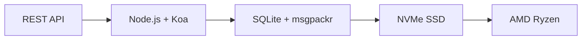

# Перший повний API електронної пошти: Як пересилання електронної пошти революціонізувало управління електронною поштою {#the-first-complete-email-api-how-forward-email-revolutionized-email-management}


<p class="lead mt-3">
<strong>TL;DR:</strong> Ми створили перший у світі повноцінний REST API для керування електронною поштою з розширеними можливостями пошуку, яких не пропонує жоден інший сервіс. У той час як Gmail, Outlook та Apple змушують розробників використовувати IMAP-пекло або API з обмеженою швидкістю, Forward Email забезпечує блискавично швидкі операції CRUD для повідомлень, папок, контактів та календарів через єдиний REST-інтерфейс з понад 15 параметрами пошуку. Це саме те, на що чекали розробники API електронної пошти.
</p>

## Зміст {#table-of-contents}

* [Проблема API електронної пошти](#the-email-api-problem)
* [Що насправді кажуть розробники](#what-developers-are-actually-saying)
* [Революційне рішення для пересилання електронної пошти](#forward-emails-revolutionary-solution)
  * [Чому ми це створили](#why-we-built-this)
  * [Проста автентифікація](#simple-authentication)
* [20 кінцевих точок, які змінюють усе](#20-endpoints-that-change-everything)
  * [Повідомлення (5 кінцевих точок)](#messages-5-endpoints)
  * [Папки (5 кінцевих точок)](#folders-5-endpoints)
  * [Контакти (5 кінцевих точок)](#contacts-5-endpoints)
  * [Календарі (5 кінцевих точок)](#calendars-5-endpoints)
* [Розширений пошук: Жоден інший сервіс не порівнює](#advanced-search-no-other-service-compares)
  * [Ландшафт API пошуку не працює](#the-search-api-landscape-is-broken)
  * [Революційний API пошуку Forward Email](#forward-emails-revolutionary-search-api)
  * [Приклади пошуку з реального світу](#real-world-search-examples)
  * [Переваги продуктивності](#performance-advantages)
  * [Функції пошуку, яких немає ні в кого іншого](#search-features-no-one-else-has)
  * [Чому це важливо для розробників](#why-this-matters-for-developers)
  * [Технічна реалізація](#the-technical-implementation)
* [Блискавично швидка архітектура продуктивності](#blazing-fast-performance-architecture)
  * [Тести продуктивності](#performance-benchmarks)
  * [Архітектура, що орієнтована на конфіденційність](#privacy-first-architecture)
* [Чому ми відрізняємося: повне порівняння](#why-were-different-the-complete-comparison)
  * [Обмеження основних постачальників](#major-provider-limitations)
  * [Переваги пересилання електронної пошти](#forward-email-advantages)
  * [Проблема прозорості відкритого коду](#the-open-source-transparency-problem)
* [30+ прикладів інтеграції з реального світу](#30-real-world-integration-examples)
  * [1. Покращення контактної форми WordPress](#1-wordpress-contact-form-enhancement)
  * [2. Альтернатива Zapier для автоматизації електронної пошти](#2-zapier-alternative-for-email-automation)
  * [3. Синхронізація електронної пошти CRM](#3-crm-email-synchronization)
  * [4. Обробка замовлень електронної комерції](#4-e-commerce-order-processing)
  * [5. Інтеграція заявок на підтримку](#5-support-ticket-integration)
  * [6. Система управління розсилкою новин](#6-newsletter-management-system)
  * [7. Керування завданнями на основі електронної пошти](#7-email-based-task-management)
  * [8. Агрегація електронної пошти для кількох облікових записів](#8-multi-account-email-aggregation)
  * [9. Розширена панель інструментів аналітики електронної пошти](#9-advanced-email-analytics-dashboard)
  * [10. Розумне архівування електронної пошти](#10-smart-email-archiving)
  * [11. Інтеграція електронної пошти з календарем](#11-email-to-calendar-integration)
  * [12. Резервне копіювання та відповідність електронної пошти](#12-email-backup-and-compliance)
  * [13. Управління контентом на основі електронної пошти](#13-email-based-content-management)
  * [14. Керування шаблонами електронних листів](#14-email-template-management)
  * [15. Автоматизація робочих процесів на основі електронної пошти](#15-email-based-workflow-automation)
  * [16. Моніторинг безпеки електронної пошти](#16-email-security-monitoring)
  * [17. Збір опитувань на основі електронної пошти](#17-email-based-survey-collection)
  * [18. Моніторинг ефективності електронної пошти](#18-email-performance-monitoring)
  * [19. Кваліфікація лідів на основі електронної пошти](#19-email-based-lead-qualification)
  * [20. Управління проектами на основі електронної пошти](#20-email-based-project-management)
  * [21. Управління запасами на основі електронної пошти](#21-email-based-inventory-management)
  * [22. Обробка рахунків-фактур на основі електронної пошти](#22-email-based-invoice-processing)
  * [23. Реєстрація на подію через електронну пошту](#23-email-based-event-registration)
  * [24. Робочий процес затвердження документів на основі електронної пошти](#24-email-based-document-approval-workflow)
  * [25. Аналіз відгуків клієнтів на основі електронної пошти](#25-email-based-customer-feedback-analysis)
  * [26. Конвеєр рекрутингу на основі електронної пошти](#26-email-based-recruitment-pipeline)
  * [27. Обробка звітів про витрати на основі електронної пошти](#27-email-based-expense-report-processing)
  * [28. Звітування про забезпечення якості на основі електронної пошти](#28-email-based-quality-assurance-reporting)
  * [29. Управління постачальниками на основі електронної пошти](#29-email-based-vendor-management)
  * [30. Моніторинг соціальних мереж на основі електронної пошти](#30-email-based-social-media-monitoring)
* [Початок роботи](#getting-started)
  * [1. Створіть обліковий запис електронної пошти для переадресації](#1-create-your-forward-email-account)
  * [2. Згенеруйте облікові дані API](#2-generate-api-credentials)
  * [3. Зробіть свій перший виклик API](#3-make-your-first-api-call)
  * [4. Ознайомтеся з документацією](#4-explore-the-documentation)
* [Технічні ресурси](#technical-resources)

## Проблема з API електронної пошти {#the-email-api-problem}

API електронної пошти принципово не працюють. Крапка.

Кожен великий постачальник послуг електронної пошти змушує розробників робити один із двох жахливих варіантів:

1. **Пекло IMAP**: Боротьба з 30-річним протоколом, розробленим для клієнтів настільних комп’ютерів, а не для сучасних програм
2. **Неефективні API**: API з обмеженою швидкістю, доступні лише для читання та складні для OAuth, які не можуть керувати вашими фактичними даними електронної пошти

Результат? Розробники або повністю відмовляються від інтеграції електронної пошти, або витрачають тижні на створення крихких обгорток IMAP, які постійно ламаються.

> \[!WARNING]
> **Брудний секрет**: Більшість «API електронної пошти» – це просто API надсилання. Ви не можете програмно впорядковувати папки, синхронізувати контакти чи керувати календарями через простий REST-інтерфейс. Дотепер.

## Що насправді говорять розробники {#what-developers-are-actually-saying}

Розчарування реальне і задокументоване всюди:

> «Нещодавно я спробував інтегрувати Gmail у свій додаток, але витратив на це забагато часу. Я вирішив, що не варто підтримувати Gmail».

> *- [Розробник Hacker News](https://news.ycombinator.com/item?id=42106944), 147 голосів «за»*

> «Чи всі API електронної пошти посередні? Вони здаються обмеженими або обмежувальними в чомусь.»
>
> *- [Обговорення SaaS на Reddit r/](https://www.reddit.com/r/SaaS/comments/1cm84s7/are_all_email_apis_mediocre/)*

> "Чому розробка електронної пошти має бути жахливою?"
>
> *- [Reddit r/веб-розробник](https://www.reddit.com/r/webdev/comments/15trnp2/why_does_email_development_have_to_suck/), 89 коментарів про проблеми розробника*

> «Що робить Gmail API ефективнішим за IMAP? Ще одна причина, чому Gmail API набагато ефективніший, полягає в тому, що йому потрібно завантажувати кожне повідомлення лише один раз. З IMAP кожне повідомлення має бути завантажене та проіндексоване...»

>> *- [Запитання щодо переповнення стека](https://stackoverflow.com/questions/25431022/what-makes-the-gmail-api-more-efficient-than-imap) з 47 голосами «за»*

Докази є всюди:

* **Проблеми з SMTP у WordPress**: [631 проблем із GitHub](https://github.com/awesomemotive/WP-Mail-SMTP/issues) щодо збоїв доставки електронної пошти
* **Обмеження Zapier**: [Скарги громади](https://community.zapier.com/featured-articles-65/email-parser-by-zapier-limitations-and-alternatives-16958) обмеження приблизно на 10 електронних листів на годину та збої виявлення IMAP
* **Проекти API IMAP**: [Кілька](https://github.com/ewildgoose/imap-api) [з відкритим кодом](https://emailengine.app/) [проекти](https://www.npmjs.com/package/imapflow) існують спеціально для «конвертації IMAP у REST», оскільки жоден постачальник не пропонує цього
* **Розчарування API Gmail**: [Переповнення стека](https://stackoverflow.com/questions/tagged/gmail-api) має 4847 запитань з тегом «gmail-api» із поширеними скаргами на обмеження швидкості та складність

## Революційне рішення для пересилання електронної пошти {#forward-emails-revolutionary-solution}

**Ми є першим сервісом електронної пошти, який пропонує повний спектр операцій CRUD для всіх даних електронної пошти через єдиний REST API.**

Це не просто черговий API для надсилання. Це повний програмний контроль над:

* **Повідомлення**: Створення, читання, оновлення, видалення, пошук, переміщення, позначка
* **Папки**: Повне керування папками IMAP через кінцеві точки REST
* **Контакти**: Зберігання та синхронізація контактів [CardDAV](https://tools.ietf.org/html/rfc6352)
* **Календарі**: Події календаря [CalDAV](https://tools.ietf.org/html/rfc4791) та планування

### Чому ми це створили {#why-we-built-this}

**Проблема**: Кожен постачальник послуг електронної пошти розглядає електронну пошту як чорну скриньку. Ви можете надсилати електронні листи, можливо, читати їх за допомогою складного OAuth, але ви не можете по-справжньому *керувати* даними своєї електронної пошти програмно.

**Наше бачення**: Електронна пошта має бути такою ж простою в інтеграції, як і будь-який сучасний API. Жодних бібліотек IMAP. Жодної складності OAuth. Жодних кошмарів з обмеженням швидкості. Тільки прості REST-кінцеві точки, які працюють.

**Результат**: Перший поштовий сервіс, де можна створити повноцінний поштовий клієнт, інтеграцію CRM або систему автоматизації, використовуючи лише HTTP-запити.

### Проста автентифікація {#simple-authentication}

Немає [Складність OAuth](https://oauth.net/2/). Немає [паролі для програм](https://support.google.com/accounts/answer/185833). Тільки ваші псевдоніми облікових даних:

```bash
curl -u "alias@yourdomain.com:password" \
  https://api.forwardemail.net/v1/messages
```

## 20 кінцевих точок, які змінюють усе {#20-endpoints-that-change-everything}

### Повідомлення (5 кінцевих точок) {#messages-5-endpoints}

* `GET /v1/messages` – Список повідомлень з фільтрацією (`?folder=`, `?is_unread=`, `?is_flagged=`)
* `POST /v1/messages` – Надсилати нові повідомлення безпосередньо до папок
* `GET /v1/messages/:id` – Отримувати певне повідомлення з повними метаданими
* `PUT /v1/messages/:id` – Оновлювати повідомлення (прапорці, папка, статус прочитання)
* `DELETE /v1/messages/:id` – Видаляти повідомлення назавжди

### Папки (5 кінцевих точок) {#folders-5-endpoints}

* `GET /v1/folders` – Показати список усіх папок зі статусом підписки
* `POST /v1/folders` – Створити нову папку з налаштовуваними властивостями
* `GET /v1/folders/:id` – Отримати деталі папки та кількість повідомлень
* `PUT /v1/folders/:id` – Оновити властивості папки та підписку
* `DELETE /v1/folders/:id` – Видалити папку та керувати переміщенням повідомлень

### Контакти (5 кінцевих точок) {#contacts-5-endpoints}

* `GET /v1/contacts` – Список контактів з пошуком та пагінацією
* `POST /v1/contacts` – Створення нового контакту з повною підтримкою vCard
* `GET /v1/contacts/:id` – Отримання контакту з усіма полями та метаданими
* `PUT /v1/contacts/:id` – Оновлення контактної інформації з перевіркою ETag
* `DELETE /v1/contacts/:id` – Видалення контакту з каскадною обробкою

### Календарі (5 кінцевих точок) {#calendars-5-endpoints}

* `GET /v1/calendars` – Список подій календаря з фільтрацією за датою
* `POST /v1/calendars` – Створення події календаря з учасниками та повторенням
* `GET /v1/calendars/:id` – Отримання деталей події з обробкою часового поясу
* `PUT /v1/calendars/:id` – Оновлення події з виявленням конфліктів
* `DELETE /v1/calendars/:id` – Видалення події зі сповіщеннями про учасників

## Розширений пошук: Немає інших сервісів, які порівнюють {#advanced-search-no-other-service-compares}

**Forward Email – єдиний сервіс електронної пошти, який пропонує комплексний програмний пошук по всіх полях повідомлення через REST API.**

Хоча інші постачальники пропонують щонайбільше базову фільтрацію, ми створили найсучасніший API пошуку електронної пошти з усіх коли-небудь створених. Жоден API Gmail, API Outlook чи будь-який інший сервіс не зрівняється з нашими можливостями пошуку.

### Ландшафт API пошуку пошкоджено {#the-search-api-landscape-is-broken}

**Обмеження пошуку API Gmail:**

* ✅ Тільки базовий параметр `q`
* ❌ Пошук за певним полем відсутній
* ❌ Фільтрування за діапазоном дат відсутній
* ❌ Фільтрування за розміром відсутній
* ❌ Фільтрування вкладень відсутній
* ❌ Обмежено синтаксисом пошуку Gmail

**Обмеження пошуку в Outlook API:**

* ✅ Базовий параметр `$search`
* ❌ Без розширеного таргетування полів
* ❌ Без складних комбінацій запитів
* ❌ Агресивне обмеження швидкості
* ❌ Потрібен складний синтаксис OData

**Apple iCloud:**

* ❌ Жодного API
* ❌ Тільки пошук IMAP (якщо ви зможете його запустити)

**ProtonMail та Tuta:**

* ❌ Немає публічних API
* ❌ Немає можливостей програмного пошуку

### Революційний API пошуку пересилання електронної пошти {#forward-emails-revolutionary-search-api}

**Ми пропонуємо понад 15 параметрів пошуку, яких не надає жоден інший сервіс:**

| Можливість пошуку | Переслати електронний лист | API Gmail | API Outlook | Інші |
| ------------------------------ | -------------------------------------- | ------------ | ------------------ | ------ |
| **Пошук за певним полем** | ✅ Тема, текст, від, до, копія, заголовки | ❌ | ❌ | ❌ |
| **Загальний пошук за кількома полями** | ✅ `?search=` у всіх полях | ✅ Базовий `q=` | ✅ Базовий `$search=` | ❌ |
| **Фільтрування діапазону дат** | ✅ `?since=` & `?before=` | ❌ | ❌ | ❌ |
| **Фільтрація за розміром** | ✅ `?min_size=` & `?max_size=` | ❌ | ❌ | ❌ |
| **Фільтрація вкладень** | ✅ `?has_attachments=true/false` | ❌ | ❌ | ❌ |
| **Пошук заголовка** | ✅ `?headers=X-Priority` | ❌ | ❌ | ❌ |
| **Пошук за ідентифікатором повідомлення** | ✅ `?message_id=abc123` | ❌ | ❌ | ❌ |
| **Комбіновані фільтри** | ✅ Кілька параметрів з логікою «І» | ❌ | ❌ | ❌ |
| **Без урахування регістру** | ✅ Усі пошукові запити | ✅ | ✅ | ❌ |
| **Підтримка пагінації** | ✅ Працює з усіма параметрами пошуку | ✅ | ✅ | ❌ |

### Приклади пошуку з реального світу {#real-world-search-examples}

**Знайти всі рахунки-фактури за останній квартал:**

```bash
# Forward Email - Simple and powerful
GET /v1/messages?subject=invoice&since=2024-01-01T00:00:00Z&before=2024-04-01T00:00:00Z

# Gmail API - Impossible with their limited search
# No date range filtering available

# Outlook API - Complex OData syntax, limited functionality
GET /me/messages?$search="invoice"&$filter=receivedDateTime ge 2024-01-01T00:00:00Z
```

**Пошук великих вкладень від певного відправника:**

```bash
# Forward Email - Comprehensive filtering
GET /v1/messages?from=finance@company.com&has_attachments=true&min_size=1000000

# Gmail API - Cannot filter by size or attachments programmatically
# Outlook API - No size filtering available
# Others - No APIs available
```

**Складний багатопольовий пошук:**

```bash
# Forward Email - Advanced query capabilities
GET /v1/messages?body=quarterly&from=manager&is_flagged=true&folder=Reports

# Gmail API - Limited to basic text search only
GET /gmail/v1/users/me/messages?q=quarterly

# Outlook API - Basic search without field targeting
GET /me/messages?$search="quarterly"
```

### Переваги продуктивності {#performance-advantages}

**Ефективність пошуку пересилання електронних листів:**

* ⚡ **Час відгуку менше 100 мс** для складних пошуків
* 🔍 **Оптимізація регулярних виразів** з належною індексацією
* 📊 **Паралельне виконання запитів** для підрахунку та даних
* 💾 **Ефективне використання пам'яті** з економними запитами

**Проблеми з продуктивністю конкурентів:**

* 🐌 **API Gmail**: Швидкість обмежена 250 одиницями квоти на користувача за секунду
* 🐌 **API Outlook**: Агресивне обмеження трафіку зі складними вимогами до відстрочки передачі даних
* 🐌 **Інші**: Немає API для порівняння

### Функції пошуку, яких немає ні в кого іншого {#search-features-no-one-else-has}

#### 1. Пошук за заголовком {#1-header-specific-search}

```bash
# Find messages with specific headers
GET /v1/messages?headers=X-Priority:1
GET /v1/messages?headers=X-Spam-Score
```

#### 2. Інтелект на основі розміру {#2-size-based-intelligence}

```bash
# Find newsletter emails (typically large)
GET /v1/messages?min_size=50000&from=newsletter

# Find quick replies (typically small)
GET /v1/messages?max_size=1000&to=support
```

#### 3. Робочі процеси на основі вкладень {#3-attachment-based-workflows}

```bash
# Find all documents sent to legal team
GET /v1/messages?to=legal&has_attachments=true&body=contract

# Find emails without attachments for cleanup
GET /v1/messages?has_attachments=false&before=2023-01-01T00:00:00Z
```

#### 4. Об'єднана бізнес-логіка {#4-combined-business-logic}

```bash
# Find urgent flagged messages from VIPs with attachments
GET /v1/messages?is_flagged=true&from=ceo&has_attachments=true&subject=urgent
```

### Чому це важливо для розробників {#why-this-matters-for-developers}

**Створюйте програми, які раніше були неможливими:**

1. **Розширена аналітика електронної пошти**: аналіз шаблонів електронної пошти за розміром, відправником, вмістом
2. **Інтелектуальне керування електронною поштою**: автоматична організація на основі складних критеріїв
3. **Відповідність та виявлення**: пошук конкретних електронних листів для відповідності юридичним вимогам
4. **Бізнес-аналітика**: отримання інформації з шаблонів електронного спілкування
5. **Автоматизовані робочі процеси**: запуск дій на основі складних фільтрів електронної пошти

### Технічна реалізація {#the-technical-implementation}

Наш пошуковий API використовує:

* **Оптимізація регулярних виразів** з належними стратегіями індексації
* **Паралельне виконання** для продуктивності
* **Перевірка вхідних даних** для безпеки
* **Комплексна обробка помилок** для надійності

```javascript
// Example: Complex search implementation
const searchConditions = [];

if (ctx.query.subject) {
  searchConditions.push({
    subject: { $regex: ctx.query.subject, $options: 'i' }
  });
}

if (ctx.query.from) {
  searchConditions.push({
    $or: [
      { 'from.address': { $regex: ctx.query.from, $options: 'i' } },
      { 'from.name': { $regex: ctx.query.from, $options: 'i' } }
    ]
  });
}

// Combine with AND logic
if (searchConditions.length > 0) {
  query.$and = searchConditions;
}
```

> \[!TIP]
> **Переваги для розробника**: За допомогою API пошуку Forward Email ви можете створювати поштові програми, які за функціональністю конкурують з клієнтами для настільних комп’ютерів, зберігаючи при цьому простоту REST API.

## Блискавично швидка архітектура продуктивності {#blazing-fast-performance-architecture}

Наш технічний стек створений для швидкості та надійності:



### Орієнтири продуктивності {#performance-benchmarks}

**Чому ми блискавично швидкі:**

| Компонент | Технології | Перевага в продуктивності |
| ------------ | --------------------------------------------------------------------------------- | --------------------------------------------- |
| **Сховище** | [NVMe SSD](https://en.wikipedia.org/wiki/NVM_Express) | У 10 разів швидше, ніж традиційний SATA |
| **База даних** | [SQLite](https://sqlite.org/) + [msgpackr](https://github.com/kriszyp/msgpackr) | Нульова мережева затримка, оптимізована серіалізація |
| **Апаратне забезпечення** | [AMD Ryzen](https://www.amd.com/en/products/processors/desktops/ryzen) голий метал | Відсутність накладних витрат на віртуалізацію |
| **Кешування** | В пам'яті + постійне зберігання | Час відгуку менше мілісекунди |
| **Резервні копії** | [Cloudflare R2](https://www.cloudflare.com/products/r2/) зашифровано | Надійність корпоративного рівня |

**Реальні показники продуктивності:**

* **Час відгуку API**: < 50 мс у середньому
* **Отримання повідомлень**: < 10 мс для кешованих повідомлень
* **Операції з папками**: < 5 мс для операцій з метаданими
* **Синхронізація контактів**: понад 1000 контактів/секунду
* **Час безвідмовної роботи**: 99,99% SLA з резервною інфраструктурою

### Архітектура, що орієнтована на конфіденційність {#privacy-first-architecture}

**Дизайн з нульовим розкриттям інформації**: Доступ маєте лише за допомогою пароля IMAP — ми не можемо читати ваші електронні листи. Наш [архітектура з нульовим розголошенням](https://forwardemail.net/en/security) забезпечує повну конфіденційність, забезпечуючи при цьому блискавичну продуктивність.

## Чим ми відрізняємося: Повне порівняння {#why-were-different-the-complete-comparison}

### Обмеження основних постачальників {#major-provider-limitations}

| Постачальник | Основні проблеми | Конкретні обмеження |
| ---------------- | ----------------------------------------- | -------------------------------------------------------------------------------------------------------------------------------------------------------------------------------------------------------------------------------------------------------------------------------------------------------------------------------------------------------------------------------------------------------------------------------------------------------------------- |
| **API Gmail** | Тільки для читання, складний OAuth, окремі API | • [Cannot modify existing messages](https://developers.google.com/gmail/api/reference/rest/v1/users.messages)<br>• [Labels ≠ folders](https://developers.google.com/gmail/api/reference/rest/v1/users.labels)<br>• [1 billion quota units/day limit](https://developers.google.com/gmail/api/reference/quota)<br>• [Requires separate APIs](https://developers.google.com/workspace) для контактів/календаря |
| **API Outlook** | Застаріле, заплутане, орієнтоване на підприємства | • [REST endpoints deprecated March 2024](https://learn.microsoft.com/en-us/outlook/rest/compare-graph)<br>• [Multiple confusing APIs](https://learn.microsoft.com/en-us/office/client-developer/outlook/selecting-an-api-or-technology-for-developing-solutions-for-outlook) (EWS, Графік, REST)<br>• [Microsoft Graph complexity](https://learn.microsoft.com/en-us/graph/overview)<br>• [Aggressive throttling](https://learn.microsoft.com/en-us/graph/throttling) |
| **Apple iCloud** | Немає публічного API | • [No public API whatsoever](https://support.apple.com/en-us/102654)<br>• [IMAP-only with 1000 emails/day limit](https://support.apple.com/en-us/102654)<br>• [App-specific passwords required](https://support.apple.com/en-us/102654)<br>• [500 recipients per message limit](https://support.apple.com/en-us/102654) |
| **Протонна пошта** | Немає API, хибні твердження про відкритий код | • [No public API available](https://proton.me/support/protonmail-bridge-clients)<br>• [Bridge software required](https://proton.me/mail/bridge) для доступу IMAP<br>• [Claims "open source"](https://proton.me/blog/open-source) але [server code is proprietary](https://github.com/ProtonMail)<br>• [Limited to paid plans only](https://proton.me/pricing) |
| **Всього** | Немає API, оманлива прозорість | • [No REST API for email management](https://tuta.com/support#technical)<br>• [Claims "open source"](https://tuta.com/blog/posts/open-source-email) але [backend is closed](https://github.com/tutao/tutanota)<br>• [IMAP/SMTP not supported](https://tuta.com/support#imap)<br>• [Proprietary encryption](https://tuta.com/encryption) запобігає стандартним інтеграціям |
| **Електронна пошта Zapier** | Суворі обмеження швидкості | • [10 emails per hour limit](https://help.zapier.com/hc/en-us/articles/8496181555597-Email-Parser-by-Zapier-limitations-and-alternatives)<br>• [No IMAP folder access](https://help.zapier.com/hc/en-us/articles/8496181555597-Email-Parser-by-Zapier-limitations-and-alternatives)<br>• [Limited parsing capabilities](https://help.zapier.com/hc/en-us/articles/8496181555597-Email-Parser-by-Zapier-limitations-and-alternatives) |

### Переваги пересилання електронної пошти {#forward-email-advantages}

| Функція | Переслати електронний лист | Конкуренція |
| ------------------ | -------------------------------------------------------------------------------------------- | ----------------------------------------- |
| **Повний CRUD** | ✅ Повне створення, читання, оновлення, видалення всіх даних | ❌ Тільки для читання або обмежені операції |
| **Уніфікований API** | ✅ Повідомлення, папки, контакти, календарі в одному API | ❌ Окремі API або відсутні функції |
| **Проста автентифікація** | ✅ Базова автентифікація з псевдонімом облікових даних | ❌ Складний OAuth з кількома областями дії |
| **Без обмежень за ставками** | ✅ Щедрі обмеження, розроблені для реальних застосувань | ❌ Обмежувальні квоти, що порушують робочі процеси |
| **Самостійний хостинг** | ✅ [Complete self-hosting option](https://forwardemail.net/en/blog/docs/self-hosted-solution) | ❌ Тільки прив’язка до постачальника |
| **Конфіденційність** | ✅ Нульове розголошення, зашифровано, конфіденційно | ❌ Видобування даних та проблеми конфіденційності |
| **Продуктивність** | ✅ Час відгуку менше 50 мс, NVMe-накопичувач | ❌ Затримка мережі, затримки дроселювання |

### Проблема прозорості відкритого коду {#the-open-source-transparency-problem}

**ProtonMail та Tuta рекламують себе як «програми з відкритим вихідним кодом» та «прозорі», але це оманливий маркетинг, який порушує сучасні принципи конфіденційності.**

> \[!WARNING]
> **Неправдиві заяви про прозорість**: Як ProtonMail, так і Tuta публічно рекламують свої дані про «відкритий вихідний код», водночас зберігаючи свій найважливіший серверний код власницьким та закритим.

**Обман ProtonMail:**

* **Заяви**: ["Ми працюємо з відкритим вихідним кодом"](https://proton.me/blog/open-source) помітно фігурує в маркетингу
* **Реальність**: [Код сервера повністю власний](https://github.com/ProtonMail) – лише клієнтські програми мають відкритий вихідний код
* **Наслідки**: Користувачі не можуть перевірити шифрування на стороні сервера, обробку даних або заяви про конфіденційність
* **Порушення прозорості**: Немає можливості перевірити фактичні системи обробки та зберігання електронної пошти

**Оманливий маркетинг Tuta:**

* **Твердження**: ["Електронна пошта з відкритим кодом"](https://tuta.com/blog/posts/open-source-email) як основний аргумент продажу
* **Реальність**: [Бекенд-інфраструктура має закритий вихідний код](https://github.com/tutao/tutanota) - доступний лише інтерфейс
* **Вплив**: Власне шифрування перешкоджає стандартним протоколам електронної пошти (IMAP/SMTP)
* **Стратегія блокування**: Користувацьке шифрування створює залежність від постачальника

**Чому це важливо для сучасної конфіденційності:**

У 2025 році справжня конфіденційність вимагає **повної прозорості**. Коли постачальники послуг електронної пошти заявляють про «відкритий вихідний код», але приховують код свого сервера:

1. **Неперевірюване шифрування**: Ви не можете перевірити, як ваші дані насправді зашифровані.
2. **Приховані методи обробки даних**: Обробка даних на стороні сервера залишається темою.
3. **Безпека на основі довіри**: Ви повинні довіряти їхнім заявам без перевірки.
4. **Залежність від постачальника**: Власні системи запобігають перенесенню даних.

**Справжня прозорість пересилання електронної пошти:**

* ✅ **[Повністю відкритий код](https://github.com/forwardemail/forwardemail.net)** – код сервера та клієнта
* ✅ **[Доступний самостійний хостинг](https://forwardemail.net/en/blog/docs/self-hosted-solution)** – запуск власного екземпляра
* ✅ **Стандартні протоколи** – сумісність з IMAP, SMTP, CardDAV, CalDAV
* ✅ **Аудит безпеки** – кожен рядок коду можна перевірити
* ✅ **Без прив’язки до постачальника** – ваші дані, ваш контроль

> \[!TIP]
> **Справжній відкритий код означає, що ви можете перевірити кожне твердження.** За допомогою Forward Email ви можете перевіряти наше шифрування, переглядати обробку даних і навіть запускати власний екземпляр. Це справжня прозорість.

## Понад 30 прикладів інтеграції з реального світу {#30-real-world-integration-examples}

### 1. Покращення контактної форми WordPress {#1-wordpress-contact-form-enhancement}

**Проблема**: [Збої конфігурації SMTP WordPress](https://github.com/awesomemotive/WP-Mail-SMTP/issues) ([631 проблем із GitHub](https://github.com/awesomemotive/WP-Mail-SMTP/issues))
**Рішення**: Пряма інтеграція API повністю обходить [SMTP](https://tools.ietf.org/html/rfc5321)

```javascript
// WordPress contact form that saves to Sent folder
await fetch('https://api.forwardemail.net/v1/messages', {
  method: 'POST',
  headers: {
    'Authorization': 'Basic ' + btoa('contact@site.com:password'),
    'Content-Type': 'application/json'
  },
  body: JSON.stringify({
    to: [{ address: 'owner@site.com' }],
    subject: 'Contact Form: ' + formData.subject,
    text: formData.message,
    folder: 'Sent'
  })
});
```

### 2. Альтернатива Zapier для автоматизації електронної пошти {#2-zapier-alternative-for-email-automation}

**Проблема**: [Ліміт Zapier – 10 електронних листів на годину](https://help.zapier.com/hc/en-us/articles/8496181555597-Email-Parser-by-Zapier-limitations-and-alternatives) та [Помилки виявлення IMAP](https://community.zapier.com/featured-articles-65/email-parser-by-zapier-limitations-and-alternatives-16958)
**Рішення**: Необмежена автоматизація з повним контролем електронної пошти

```javascript
// Auto-organize emails by sender domain
const messages = await fetch('/v1/messages?folder=INBOX');
for (const message of messages) {
  const domain = message.from.split('@')[1];
  await fetch(`/v1/messages/${message.id}`, {
    method: 'PUT',
    body: JSON.stringify({ folder: `Clients/${domain}` })
  });
}
```

### 3. Синхронізація електронної пошти CRM {#3-crm-email-synchronization}

**Проблема**: Ручне керування контактами між електронною поштою та [CRM-системи](https://en.wikipedia.org/wiki/Customer_relationship_management)
**Рішення**: Двостороння синхронізація з API контактів [CardDAV](https://tools.ietf.org/html/rfc6352)

```javascript
// Sync new email contacts to CRM
const newContacts = await fetch('/v1/contacts');
for (const contact of newContacts) {
  await crmAPI.createContact({
    name: contact.name,
    email: contact.email,
    source: 'email_api'
  });
}
```

### 4. Обробка замовлень електронної комерції {#4-e-commerce-order-processing}

**Проблема**: Ручна обробка електронної пошти із замовленнями для [платформи електронної комерції](https://en.wikipedia.org/wiki/E-commerce)
**Рішення**: Автоматизований конвеєр керування замовленнями

```javascript
// Process order confirmation emails
const orders = await fetch('/v1/messages?folder=Orders');
const orderEmails = orders.filter(msg =>
  msg.subject.includes('Order Confirmation')
);

for (const order of orderEmails) {
  const orderData = parseOrderEmail(order.text);
  await updateInventory(orderData);
  await fetch(`/v1/messages/${order.id}`, {
    method: 'PUT',
    body: JSON.stringify({ folder: 'Orders/Processed' })
  });
}
```

### 5. Інтеграція заявок на підтримку {#5-support-ticket-integration}

**Проблема**: Гілки електронних листів розкидані по [платформи служби підтримки](https://en.wikipedia.org/wiki/Help_desk_software)
**Рішення**: Повне відстеження гілок електронних листів

```javascript
// Create support ticket from email thread
const messages = await fetch('/v1/messages?folder=Support');
const supportEmails = messages.filter(msg =>
  msg.to.some(addr => addr.includes('support@'))
);

for (const email of supportEmails) {
  const ticket = await supportSystem.createTicket({
    subject: email.subject,
    from: email.from,
    body: email.text,
    timestamp: email.date
  });
}
```

### 6. Система управління розсилкою {#6-newsletter-management-system}

**Проблема**: Обмежена інтеграція [платформа для розсилки новин](https://en.wikipedia.org/wiki/Email_marketing)
**Рішення**: Повне управління життєвим циклом передплатника

```javascript
// Auto-manage newsletter subscriptions
const messages = await fetch('/v1/messages?folder=Newsletter');
const unsubscribes = messages.filter(msg =>
  msg.subject.toLowerCase().includes('unsubscribe')
);

for (const msg of unsubscribes) {
  await removeSubscriber(msg.from);
  await fetch(`/v1/messages/${msg.id}`, {
    method: 'PUT',
    body: JSON.stringify({ folder: 'Newsletter/Unsubscribed' })
  });
}
```

### 7. Керування завданнями на основі електронної пошти {#7-email-based-task-management}

**Проблема**: Перевантаження папки «Вхідні» та [відстеження завдань](https://en.wikipedia.org/wiki/Task_management)
**Рішення**: Перетворіть електронні листи на завдання, які можна виконати

```javascript
// Create tasks from flagged emails
const messages = await fetch('/v1/messages?is_flagged=true');
for (const email of messages) {
  await taskManager.createTask({
    title: email.subject,
    description: email.text,
    assignee: email.to[0].address,
    dueDate: extractDueDate(email.text)
  });
}
```

### 8. Агрегація електронної пошти для кількох облікових записів {#8-multi-account-email-aggregation}

**Проблема**: Керування [кілька облікових записів електронної пошти](https://en.wikipedia.org/wiki/Email_client) у різних постачальників
**Рішення**: Уніфікований інтерфейс папки "Вхідні"

```javascript
// Aggregate emails from multiple accounts
const accounts = ['work@domain.com', 'personal@domain.com'];
const allMessages = [];

for (const account of accounts) {
  const messages = await fetch('/v1/messages', {
    headers: { 'Authorization': getAuth(account) }
  });
  allMessages.push(...messages.map(m => ({ ...m, account })));
}
```

### 9. Розширена панель інструментів аналітики електронної пошти {#9-advanced-email-analytics-dashboard}

**Проблема**: Немає статистичних даних про [шаблони електронних листів](https://en.wikipedia.org/wiki/Email_analytics) завдяки складній фільтрації
**Рішення**: Налаштування аналітики електронної пошти за допомогою розширених можливостей пошуку

```javascript
// Generate comprehensive email analytics using advanced search
const analytics = {};

// Analyze email volume by sender domain
const messages = await fetch('/v1/messages');
analytics.senderDomains = analyzeSenderDomains(messages);

// Find large attachments consuming storage
const largeAttachments = await fetch('/v1/messages?has_attachments=true&min_size=1000000');
analytics.storageHogs = largeAttachments.map(msg => ({
  subject: msg.subject,
  from: msg.from,
  size: msg.size
}));

// Analyze communication patterns with VIPs
const vipEmails = await fetch('/v1/messages?from=ceo@company.com');
const urgentVipEmails = await fetch('/v1/messages?from=ceo@company.com&subject=urgent');
analytics.vipCommunication = {
  total: vipEmails.length,
  urgent: urgentVipEmails.length,
  urgencyRate: (urgentVipEmails.length / vipEmails.length) * 100
};

// Find unread emails by date range for follow-up
const lastWeek = new Date(Date.now() - 7 * 24 * 60 * 60 * 1000).toISOString();
const unreadRecent = await fetch(`/v1/messages?is_unread=true&since=${lastWeek}`);
analytics.followUpNeeded = unreadRecent.length;

// Analyze email sizes for optimization
const smallEmails = await fetch('/v1/messages?max_size=1000');
const mediumEmails = await fetch('/v1/messages?min_size=1000&max_size=50000');
const largeEmails = await fetch('/v1/messages?min_size=50000');
analytics.sizeDistribution = {
  small: smallEmails.length,
  medium: mediumEmails.length,
  large: largeEmails.length
};

// Search for compliance-related emails
const complianceEmails = await fetch('/v1/messages?body=confidential&has_attachments=true');
analytics.complianceReview = complianceEmails.length;
```

### 10. Розумне архівування електронної пошти {#10-smart-email-archiving}

**Проблема**: Вручну [організація електронної пошти](https://en.wikipedia.org/wiki/Email_management)
**Рішення**: Інтелектуальна категоризація електронної пошти

```javascript
// Auto-archive old emails by category
const messages = await fetch('/v1/messages');
const oldEmails = messages.filter(email =>
  isOlderThan(email.date, 90) // 90 days
);

for (const email of oldEmails) {
  const category = categorizeEmail(email);
  await fetch(`/v1/messages/${email.id}`, {
    method: 'PUT',
    body: JSON.stringify({ folder: `Archive/${category}` })
  });
}
```

### 11. Інтеграція електронної пошти з календарем {#11-email-to-calendar-integration}

**Проблема**: Ручне створення [подія календаря](https://tools.ietf.org/html/rfc4791) з електронних листів
**Рішення**: Автоматичне вилучення та створення подій

```javascript
// Extract meeting details from emails
const messages = await fetch('/v1/messages?folder=Meetings');
const meetingEmails = messages.filter(email =>
  email.subject.toLowerCase().includes('meeting')
);

for (const email of meetingEmails) {
  const meetingData = extractMeetingInfo(email.text);
  if (meetingData.date && meetingData.time) {
    await fetch('/v1/calendars', {
      method: 'POST',
      body: JSON.stringify({
        title: email.subject,
        start: meetingData.datetime,
        attendees: [email.from, ...email.to]
      })
    });
  }
}
```

### 12. Резервне копіювання та відповідність електронної пошти {#12-email-backup-and-compliance}

**Проблема**: [Збереження електронної пошти](https://en.wikipedia.org/wiki/Email_retention_policy) та вимоги до відповідності
**Рішення**: Автоматизоване резервне копіювання зі збереженням метаданих

```javascript
// Backup emails with full metadata
const allMessages = await fetch('/v1/messages');
const backup = {
  timestamp: new Date(),
  messages: allMessages.map(msg => ({
    id: msg.id,
    subject: msg.subject,
    from: msg.from,
    to: msg.to,
    date: msg.date,
    flags: msg.flags
  }))
};
await saveToComplianceStorage(backup);
```

### 13. Керування контентом на основі електронної пошти {#13-email-based-content-management}

**Проблема**: Керування надсиланням контенту електронною поштою для [CMS-платформи](https://en.wikipedia.org/wiki/Content_management_system)
**Рішення**: Електронна пошта як система керування контентом

```javascript
// Process content submissions from email
const messages = await fetch('/v1/messages?folder=Submissions');
const submissions = messages.filter(msg =>
  msg.to.some(addr => addr.includes('submit@'))
);

for (const submission of submissions) {
  const content = parseSubmission(submission.text);
  await cms.createDraft({
    title: submission.subject,
    content: content.body,
    author: submission.from
  });
}
```

### 14. Керування шаблонами електронних листів {#14-email-template-management}

**Проблема**: Невідповідність [шаблони електронних листів](https://en.wikipedia.org/wiki/Email_template) у команді
**Рішення**: Централізована система шаблонів з API

```javascript
// Send templated emails with dynamic content
const template = await getEmailTemplate('welcome');
await fetch('/v1/messages', {
  method: 'POST',
  body: JSON.stringify({
    to: [{ address: newUser.email }],
    subject: template.subject.replace('{{name}}', newUser.name),
    html: template.html.replace('{{name}}', newUser.name),
    folder: 'Sent'
  })
});
```

### 15. Автоматизація робочих процесів на основі електронної пошти {#15-email-based-workflow-automation}

**Проблема**: Ручне налаштування [процеси затвердження](https://en.wikipedia.org/wiki/Workflow) електронною поштою
**Рішення**: Автоматизовані тригери робочого процесу

```javascript
// Process approval emails
const messages = await fetch('/v1/messages?folder=Approvals');
const approvals = messages.filter(msg =>
  msg.subject.includes('APPROVAL')
);

for (const approval of approvals) {
  const decision = parseApprovalDecision(approval.text);
  await workflow.processApproval({
    requestId: extractRequestId(approval.subject),
    decision: decision,
    approver: approval.from
  });
}
```

### 16. Моніторинг безпеки електронної пошти {#16-email-security-monitoring}

**Проблема**: Ручне налаштування [виявлення загроз безпеці](https://en.wikipedia.org/wiki/Email_security)
**Рішення**: Автоматизований аналіз загроз

```javascript
// Monitor for suspicious emails
const recentEmails = await fetch('/v1/messages');
for (const email of recentEmails) {
  const threatScore = analyzeThreat(email);
  if (threatScore > 0.8) {
    await fetch(`/v1/messages/${email.id}`, {
      method: 'PUT',
      body: JSON.stringify({ folder: 'Security/Quarantine' })
    });
    await alertSecurityTeam(email);
  }
}
```

### 17. Колекція опитувань на основі електронної пошти {#17-email-based-survey-collection}

**Проблема**: Ручна обробка [відповідь на опитування](https://en.wikipedia.org/wiki/Survey_methodology)
**Рішення**: Автоматизована агрегація відповідей

```javascript
// Collect and process survey responses
const messages = await fetch('/v1/messages?folder=Surveys');
const responses = messages.filter(msg =>
  msg.subject.includes('Survey Response')
);

const surveyData = responses.map(email => ({
  respondent: email.from,
  responses: parseSurveyData(email.text),
  timestamp: email.date
}));
await updateSurveyResults(surveyData);
```

### 18. Моніторинг ефективності електронної пошти {#18-email-performance-monitoring}

**Проблема**: Немає видимості для [ефективність доставки електронної пошти](https://en.wikipedia.org/wiki/Email_deliverability)
**Рішення**: Метрики електронної пошти в режимі реального часу

```javascript
// Monitor email delivery performance
const sentEmails = await fetch('/v1/messages?folder=Sent');
const deliveryStats = {
  sent: sentEmails.length,
  bounces: await countBounces(),
  deliveryRate: calculateDeliveryRate()
};
await updateDashboard(deliveryStats);
```

### 19. Кваліфікація потенційного клієнта на основі електронної пошти {#19-email-based-lead-qualification}

**Проблема**: Ручне встановлення [підрахунок очок лідерства](https://en.wikipedia.org/wiki/Lead_scoring) з електронної пошти
**Рішення**: Автоматизований процес кваліфікації потенційних клієнтів

```javascript
// Score leads based on email engagement
const prospects = await fetch('/v1/contacts');
for (const prospect of prospects) {
  const messages = await fetch('/v1/messages');
  const emails = messages.filter(msg =>
    msg.from.includes(prospect.email)
  );
  const score = calculateEngagementScore(emails);
  await crm.updateLeadScore(prospect.id, score);
}
```

### 20. Управління проектами на основі електронної пошти {#20-email-based-project-management}

**Проблема**: [Оновлення проекту](https://en.wikipedia.org/wiki/Project_management) розкидано по ланцюжках електронних листів
**Рішення**: Централізований комунікаційний центр проекту

```javascript
// Extract project updates from emails
const messages = await fetch('/v1/messages?folder=Projects');
const projectEmails = messages.filter(msg =>
  msg.subject.includes('Project Update')
);

for (const email of projectEmails) {
  const update = parseProjectUpdate(email.text);
  await projectManager.addUpdate({
    project: update.projectId,
    author: email.from,
    content: update.content
  });
}
```

### 21. Управління запасами на основі електронної пошти {#21-email-based-inventory-management}

**Проблема**: Ручне оновлення запасів з електронних листів постачальників
**Рішення**: Автоматизоване відстеження запасів за допомогою сповіщень електронною поштою

```javascript
// Process inventory updates from supplier emails
const messages = await fetch('/v1/messages?folder=Suppliers');
const inventoryEmails = messages.filter(msg =>
  msg.subject.includes('Inventory Update') || msg.subject.includes('Stock Alert')
);

for (const email of inventoryEmails) {
  const inventoryData = parseInventoryUpdate(email.text);
  await inventory.updateStock({
    sku: inventoryData.sku,
    quantity: inventoryData.quantity,
    supplier: email.from,
    timestamp: email.date
  });

  // Move to processed folder
  await fetch(`/v1/messages/${email.id}`, {
    method: 'PUT',
    body: JSON.stringify({ folder: 'Suppliers/Processed' })
  });
}
```

### 22. Обробка рахунків-фактур на основі електронної пошти {#22-email-based-invoice-processing}

**Проблема**: Ручна інтеграція [обробка рахунків-фактур](https://en.wikipedia.org/wiki/Invoice_processing) та бухгалтерського обліку
**Рішення**: Автоматизоване вилучення рахунків-фактур та синхронізація бухгалтерської системи

```javascript
// Extract invoice data from email attachments
const messages = await fetch('/v1/messages?folder=Invoices');
const invoiceEmails = messages.filter(msg =>
  msg.subject.toLowerCase().includes('invoice') && msg.attachments.length > 0
);

for (const email of invoiceEmails) {
  const invoiceData = await extractInvoiceData(email.attachments[0]);
  await accounting.createInvoice({
    vendor: email.from,
    amount: invoiceData.total,
    dueDate: invoiceData.dueDate,
    items: invoiceData.lineItems
  });

  // Flag as processed
  await fetch(`/v1/messages/${email.id}`, {
    method: 'PUT',
    body: JSON.stringify({ flags: ['\\Seen', '\\Flagged'] })
  });
}
```

### 23. Реєстрація на подію через електронну пошту {#23-email-based-event-registration}

**Проблема**: Ручна обробка [реєстрація на подію](https://en.wikipedia.org/wiki/Event_management) з відповідей електронною поштою
**Рішення**: Автоматизоване керування учасниками та інтеграція календаря

```javascript
// Process event registration emails
const messages = await fetch('/v1/messages?folder=Events');
const registrations = messages.filter(msg =>
  msg.subject.includes('Registration') || msg.subject.includes('RSVP')
);

for (const registration of registrations) {
  const attendeeData = parseRegistration(registration.text);

  // Add to attendee list
  await events.addAttendee({
    event: attendeeData.eventId,
    name: attendeeData.name,
    email: registration.from,
    dietary: attendeeData.dietaryRestrictions
  });

  // Create calendar event for attendee
  await fetch('/v1/calendars', {
    method: 'POST',
    body: JSON.stringify({
      title: attendeeData.eventName,
      start: attendeeData.eventDate,
      attendees: [registration.from]
    })
  });
}
```

### 24. Робочий процес затвердження документів на основі електронної пошти {#24-email-based-document-approval-workflow}

**Проблема**: Складні ланцюжки [затвердження документа](https://en.wikipedia.org/wiki/Document_management_system) через електронну пошту
**Рішення**: Автоматизоване відстеження затверджень та керування версіями документів

```javascript
// Track document approval workflow
const messages = await fetch('/v1/messages?folder=Approvals');
const approvalEmails = messages.filter(msg =>
  msg.subject.includes('Document Approval')
);

for (const email of approvalEmails) {
  const approval = parseApprovalEmail(email.text);

  await documentSystem.updateApproval({
    documentId: approval.documentId,
    approver: email.from,
    status: approval.decision, // 'approved', 'rejected', 'needs_changes'
    comments: approval.comments,
    timestamp: email.date
  });

  // Check if all approvals complete
  const document = await documentSystem.getDocument(approval.documentId);
  if (document.allApprovalsComplete) {
    await documentSystem.finalizeDocument(approval.documentId);
  }
}
```

### 25. Аналіз відгуків клієнтів на основі електронної пошти {#25-email-based-customer-feedback-analysis}

**Проблема**: Ручний збір [відгуки клієнтів](https://en.wikipedia.org/wiki/Customer_feedback) та аналіз настроїв
**Рішення**: Автоматизована обробка відгуків та відстеження настроїв

```javascript
// Analyze customer feedback from emails
const messages = await fetch('/v1/messages?folder=Feedback');
const feedbackEmails = messages.filter(msg =>
  msg.to.some(addr => addr.includes('feedback@'))
);

for (const email of feedbackEmails) {
  const sentiment = await analyzeSentiment(email.text);
  const category = categorizeFeeback(email.text);

  await feedback.recordFeedback({
    customer: email.from,
    content: email.text,
    sentiment: sentiment.score, // -1 to 1
    category: category, // 'bug', 'feature', 'complaint', 'praise'
    priority: calculatePriority(sentiment, category),
    timestamp: email.date
  });

  // Auto-escalate negative feedback
  if (sentiment.score < -0.5) {
    await escalateToSupport(email);
  }
}
```

### 26. Конвеєр рекрутингу на основі електронної пошти {#26-email-based-recruitment-pipeline}

**Проблема**: Ручне налаштування [рекрутинг](https://en.wikipedia.org/wiki/Recruitment) та відстеження кандидатів
**Рішення**: Автоматизоване управління кандидатами та планування співбесід

```javascript
// Process job application emails
const messages = await fetch('/v1/messages?folder=Careers');
const applications = messages.filter(msg =>
  msg.subject.toLowerCase().includes('application') && msg.attachments.length > 0
);

for (const application of applications) {
  const resume = await parseResume(application.attachments[0]);

  const candidate = await ats.createCandidate({
    name: resume.name,
    email: application.from,
    skills: resume.skills,
    experience: resume.experience,
    position: extractPosition(application.subject)
  });

  // Auto-schedule screening if qualified
  if (candidate.qualificationScore > 0.7) {
    await calendar.scheduleInterview({
      candidateId: candidate.id,
      type: 'phone_screening',
      duration: 30
    });
  }
}
```

### 27. Обробка звітів про витрати на основі електронної пошти {#27-email-based-expense-report-processing}

**Проблема**: Ручне надсилання та затвердження [звіт про витрати](https://en.wikipedia.org/wiki/Expense_report)
**Рішення**: Автоматизований робочий процес вилучення та затвердження витрат

```javascript
// Process expense report emails
const messages = await fetch('/v1/messages?folder=Expenses');
const expenseEmails = messages.filter(msg =>
  msg.subject.includes('Expense') && msg.attachments.length > 0
);

for (const email of expenseEmails) {
  const receipts = await processReceipts(email.attachments);

  const expenseReport = await expenses.createReport({
    employee: email.from,
    expenses: receipts.map(receipt => ({
      amount: receipt.total,
      category: receipt.category,
      date: receipt.date,
      merchant: receipt.merchant
    })),
    totalAmount: receipts.reduce((sum, r) => sum + r.total, 0)
  });

  // Auto-approve small amounts
  if (expenseReport.totalAmount < 100) {
    await expenses.approve(expenseReport.id);
  } else {
    await expenses.sendForApproval(expenseReport.id);
  }
}
```

### 28. Звітування про забезпечення якості на основі електронної пошти {#28-email-based-quality-assurance-reporting}

**Проблема**: Ручне відстеження проблем [забезпечення якості](https://en.wikipedia.org/wiki/Quality_assurance)
**Рішення**: Автоматизоване керування проблемами контролю якості та відстеження помилок

```javascript
// Process QA bug reports from email
const messages = await fetch('/v1/messages?folder=QA');
const bugReports = messages.filter(msg =>
  msg.subject.includes('Bug Report') || msg.subject.includes('QA Issue')
);

for (const report of bugReports) {
  const bugData = parseBugReport(report.text);

  const ticket = await bugTracker.createIssue({
    title: report.subject,
    description: bugData.description,
    severity: bugData.severity,
    steps: bugData.stepsToReproduce,
    reporter: report.from,
    attachments: report.attachments
  });

  // Auto-assign based on component
  const assignee = await getComponentOwner(bugData.component);
  await bugTracker.assign(ticket.id, assignee);

  // Create calendar reminder for follow-up
  await fetch('/v1/calendars', {
    method: 'POST',
    body: JSON.stringify({
      title: `Follow up on ${ticket.id}`,
      start: addDays(new Date(), 3),
      attendees: [assignee]
    })
  });
}
```

### 29. Управління постачальниками на основі електронної пошти {#29-email-based-vendor-management}

**Проблема**: Ручне відстеження [комунікація з постачальниками](https://en.wikipedia.org/wiki/Vendor_management) та контракту
**Рішення**: Автоматизоване управління взаємовідносинами з постачальниками

```javascript
// Track vendor communications and contracts
const messages = await fetch('/v1/messages?folder=Vendors');
const vendorEmails = messages.filter(msg =>
  isVendorEmail(msg.from)
);

for (const email of vendorEmails) {
  const vendor = await vendors.getByEmail(email.from);

  // Log communication
  await vendors.logCommunication({
    vendorId: vendor.id,
    type: 'email',
    subject: email.subject,
    content: email.text,
    timestamp: email.date
  });

  // Check for contract-related keywords
  if (email.text.includes('contract') || email.text.includes('renewal')) {
    await vendors.flagForContractReview({
      vendorId: vendor.id,
      emailId: email.id,
      priority: 'high'
    });

    // Create task for procurement team
    await tasks.create({
      title: `Review contract communication from ${vendor.name}`,
      assignee: 'procurement@company.com',
      dueDate: addDays(new Date(), 2)
    });
  }
}
```

### 30. Моніторинг соціальних мереж на основі електронної пошти {#30-email-based-social-media-monitoring}

**Проблема**: Ручне відстеження згадок [соціальні мережі](https://en.wikipedia.org/wiki/Social_media_monitoring) та реагування
**Рішення**: Автоматизована обробка сповіщень у соціальних мережах та координація реагування

```javascript
// Process social media alerts from email notifications
const messages = await fetch('/v1/messages?folder=Social');
const socialAlerts = messages.filter(msg =>
  msg.from.includes('alerts@') || msg.subject.includes('Social Mention')
);

for (const alert of socialAlerts) {
  const mention = parseSocialMention(alert.text);

  await socialMedia.recordMention({
    platform: mention.platform,
    author: mention.author,
    content: mention.content,
    sentiment: mention.sentiment,
    reach: mention.followerCount,
    url: mention.url
  });

  // Auto-escalate negative mentions with high reach
  if (mention.sentiment < -0.5 && mention.followerCount > 10000) {
    await socialMedia.escalateToTeam({
      mentionId: mention.id,
      priority: 'urgent',
      assignee: 'social-media-manager@company.com'
    });

    // Create calendar reminder for immediate response
    await fetch('/v1/calendars', {
      method: 'POST',
      body: JSON.stringify({
        title: `Urgent: Respond to negative social mention`,
        start: addMinutes(new Date(), 30),
        attendees: ['social-media-manager@company.com']
      })
    });
  }
}
```

## Початок роботи {#getting-started}

### 1. Створіть обліковий запис для переадресації електронної пошти {#1-create-your-forward-email-account}

Зареєструйтесь на [forwardemail.net](https://forwardemail.net) та підтвердьте свій домен.

### 2. Згенерувати облікові дані API {#2-generate-api-credentials}

Ваші псевдонім електронної пошти та пароль слугують обліковими даними API – жодних додаткових налаштувань не потрібно.

### 3. Зробіть свій перший виклик API {#3-make-your-first-api-call}

```bash
# List your messages
curl -u "your-alias@domain.com:password" \
  https://api.forwardemail.net/v1/messages

# Create a new contact
curl -u "your-alias@domain.com:password" \
  -X POST \
  -H "Content-Type: application/json" \
  -d '{"fullName":"John Doe","emails":[{"value":"john@example.com"}]}' \
  https://api.forwardemail.net/v1/contacts
```

### 4. Перегляньте документацію {#4-explore-the-documentation}

Відвідайте [forwardemail.net/en/email-api](https://forwardemail.net/en/email-api) для отримання повної документації API з інтерактивними прикладами.

## Технічні ресурси {#technical-resources}

* **[Повна документація API](https://forwardemail.net/en/email-api)** – Інтерактивна специфікація OpenAPI 3.0
* **[Посібник з самостійного хостингу](https://forwardemail.net/en/blog/docs/self-hosted-solution)** – Розгортання пересилання електронної пошти у вашій інфраструктурі
* **[Технічний документ з безпеки](https://forwardemail.net/technical-whitepaper.pdf)** – Технічна архітектура та деталі безпеки
* **[Репозиторій GitHub](https://github.com/forwardemail/forwardemail.net)** – База коду з відкритим вихідним кодом
* **[Підтримка розробників](mailto:api@forwardemail.net)** – Прямий доступ до нашої команди інженерів

---

**Готові революціонізувати інтеграцію електронної пошти?** [Почніть створювати за допомогою API Forward Email вже сьогодні](https://forwardemail.net/en/email-api) та ознайомтеся з першою повноцінною платформою керування електронною поштою, розробленою для розробників.

*Пересилання електронної пошти: поштовий сервіс, який нарешті правильно використовує API.*