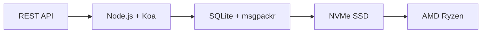

# Перший повний Email API: як Forward Email революціонізував управління електронною поштою {#the-first-complete-email-api-how-forward-email-revolutionized-email-management}


<p class="lead mt-3">
  <strong>Коротко:</strong> Ми створили перший у світі повний REST API для управління електронною поштою з розширеними можливостями пошуку, яких немає в жодного іншого сервісу. У той час як Gmail, Outlook і Apple змушують розробників працювати з IMAP-кошмаром або API з обмеженнями по швидкості, Forward Email забезпечує надшвидкі CRUD-операції з повідомленнями, папками, контактами та календарями через уніфікований REST-інтерфейс з понад 15 параметрами пошуку. Це той email API, якого чекали розробники.
</p>


## Зміст {#table-of-contents}

* [Проблема Email API](#the-email-api-problem)
* [Що насправді говорять розробники](#what-developers-are-actually-saying)
* [Революційне рішення Forward Email](#forward-emails-revolutionary-solution)
  * [Чому ми це створили](#why-we-built-this)
  * [Проста автентифікація](#simple-authentication)
* [20 кінцевих точок, які змінюють усе](#20-endpoints-that-change-everything)
  * [Повідомлення (5 кінцевих точок)](#messages-5-endpoints)
  * [Папки (5 кінцевих точок)](#folders-5-endpoints)
  * [Контакти (5 кінцевих точок)](#contacts-5-endpoints)
  * [Календарі (5 кінцевих точок)](#calendars-5-endpoints)
* [Розширений пошук: жоден інший сервіс не зрівняється](#advanced-search-no-other-service-compares)
  * [Ландшафт Search API зламаний](#the-search-api-landscape-is-broken)
  * [Революційний Search API Forward Email](#forward-emails-revolutionary-search-api)
  * [Приклади пошуку з реального життя](#real-world-search-examples)
  * [Переваги продуктивності](#performance-advantages)
  * [Функції пошуку, яких немає ні в кого іншого](#search-features-no-one-else-has)
  * [Чому це важливо для розробників](#why-this-matters-for-developers)
  * [Технічна реалізація](#the-technical-implementation)
* [Надшвидка архітектура продуктивності](#blazing-fast-performance-architecture)
  * [Бенчмарки продуктивності](#performance-benchmarks)
  * [Архітектура з пріоритетом конфіденційності](#privacy-first-architecture)
* [Чому ми відрізняємося: повне порівняння](#why-were-different-the-complete-comparison)
  * [Основні обмеження провайдерів](#major-provider-limitations)
  * [Переваги Forward Email](#forward-email-advantages)
  * [Проблема прозорості з відкритим кодом](#the-open-source-transparency-problem)
* [Понад 30 прикладів інтеграції з реального життя](#30-real-world-integration-examples)
  * [1. Покращення контактної форми WordPress](#1-wordpress-contact-form-enhancement)
  * [2. Альтернатива Zapier для автоматизації пошти](#2-zapier-alternative-for-email-automation)
  * [3. Синхронізація пошти CRM](#3-crm-email-synchronization)
  * [4. Обробка замовлень в електронній комерції](#4-e-commerce-order-processing)
  * [5. Інтеграція системи підтримки](#5-support-ticket-integration)
  * [6. Система управління розсилками](#6-newsletter-management-system)
  * [7. Управління завданнями на основі пошти](#7-email-based-task-management)
  * [8. Агрегація пошти з кількох акаунтів](#8-multi-account-email-aggregation)
  * [9. Панель розширеної аналітики пошти](#9-advanced-email-analytics-dashboard)
  * [10. Розумне архівування пошти](#10-smart-email-archiving)
  * [11. Інтеграція пошти з календарем](#11-email-to-calendar-integration)
  * [12. Резервне копіювання та відповідність пошти](#12-email-backup-and-compliance)
  * [13. Управління контентом на основі пошти](#13-email-based-content-management)
  * [14. Управління шаблонами пошти](#14-email-template-management)
  * [15. Автоматизація робочих процесів на основі пошти](#15-email-based-workflow-automation)
  * [16. Моніторинг безпеки пошти](#16-email-security-monitoring)
  * [17. Збір опитувань на основі пошти](#17-email-based-survey-collection)
  * [18. Моніторинг продуктивності пошти](#18-email-performance-monitoring)
  * [19. Кваліфікація лідів на основі пошти](#19-email-based-lead-qualification)
  * [20. Управління проектами на основі пошти](#20-email-based-project-management)
  * [21. Управління запасами на основі пошти](#21-email-based-inventory-management)
  * [22. Обробка рахунків на основі пошти](#22-email-based-invoice-processing)
  * [23. Реєстрація на події на основі пошти](#23-email-based-event-registration)
  * [24. Робочий процес затвердження документів на основі пошти](#24-email-based-document-approval-workflow)
  * [25. Аналіз відгуків клієнтів на основі пошти](#25-email-based-customer-feedback-analysis)
  * [26. Рекрутингова воронка на основі пошти](#26-email-based-recruitment-pipeline)
  * [27. Обробка звітів про витрати на основі пошти](#27-email-based-expense-report-processing)
  * [28. Звітність контролю якості на основі пошти](#28-email-based-quality-assurance-reporting)
  * [29. Управління постачальниками на основі пошти](#29-email-based-vendor-management)
  * [30. Моніторинг соціальних мереж на основі пошти](#30-email-based-social-media-monitoring)
* [Початок роботи](#getting-started)
  * [1. Створіть свій акаунт Forward Email](#1-create-your-forward-email-account)
  * [2. Згенеруйте API-облікові дані](#2-generate-api-credentials)
  * [3. Зробіть свій перший API-запит](#3-make-your-first-api-call)
  * [4. Ознайомтеся з документацією](#4-explore-the-documentation)
* [Технічні ресурси](#technical-resources)
## Проблема Email API {#the-email-api-problem}

Email API фундаментально зламані. Крапка.

Кожен великий провайдер електронної пошти змушує розробників обирати між двома жахливими варіантами:

1. **Пекло IMAP**: Боротися з 30-річним протоколом, створеним для десктопних клієнтів, а не сучасних додатків
2. **Обмежені API**: API з обмеженнями швидкості, лише для читання, складні в OAuth, які не можуть керувати вашими реальними даними електронної пошти

Результат? Розробники або повністю відмовляються від інтеграції електронної пошти, або витрачають тижні на створення крихких IMAP-обгорток, які постійно ламаються.

> \[!WARNING]
> **Брудний секрет**: Більшість "email API" — це просто API для відправки. Ви не можете програмно організовувати папки, синхронізувати контакти або керувати календарями через простий REST-інтерфейс. До цього часу.


## Що Насправді Кажуть Розробники {#what-developers-are-actually-saying}

Розчарування реальне і задокументоване всюди:

> "Нещодавно я намагався інтегрувати Gmail у свій додаток і витратив на це забагато часу. Я вирішив, що підтримувати Gmail не варто."
>
> *- [Розробник на Hacker News](https://news.ycombinator.com/item?id=42106944), 147 голосів "за"*

> "Чи всі email API посередні? Вони здаються обмеженими або обмежувальними в якийсь спосіб."
>
> *- [Обговорення на Reddit r/SaaS](https://www.reddit.com/r/SaaS/comments/1cm84s7/are_all_email_apis_mediocre/)*

> "Чому розробка електронної пошти має бути такою складною?"
>
> *- [Reddit r/webdev](https://www.reddit.com/r/webdev/comments/15trnp2/why_does_email_development_have_to_suck/), 89 коментарів про біль розробників*

> "Чим Gmail API ефективніший за IMAP? Ще одна причина, чому Gmail API набагато ефективніший, полягає в тому, що він завантажує кожне повідомлення лише один раз. З IMAP кожне повідомлення потрібно завантажувати та індексувати..."
>
> *- [Питання на Stack Overflow](https://stackoverflow.com/questions/25431022/what-makes-the-gmail-api-more-efficient-than-imap) з 47 голосами "за"*

Докази всюди:

* **Проблеми SMTP у WordPress**: [631 проблема на GitHub](https://github.com/awesomemotive/WP-Mail-SMTP/issues) про збої доставки пошти
* **Обмеження Zapier**: [Скарги спільноти](https://community.zapier.com/featured-articles-65/email-parser-by-zapier-limitations-and-alternatives-16958) про ліміти 10 листів на годину та збої виявлення IMAP
* **Проекти IMAP API**: [Кілька](https://github.com/ewildgoose/imap-api) [відкритих](https://emailengine.app/) [проектів](https://www.npmjs.com/package/imapflow) існують спеціально для "перетворення IMAP у REST", бо жоден провайдер цього не пропонує
* **Розчарування Gmail API**: [Stack Overflow](https://stackoverflow.com/questions/tagged/gmail-api) має 4,847 питань з тегом "gmail-api" з типовими скаргами на обмеження швидкості та складність


## Революційне Рішення Forward Email {#forward-emails-revolutionary-solution}

**Ми — перший сервіс електронної пошти, який пропонує повні CRUD-операції для всіх даних електронної пошти через уніфікований REST API.**

Це не просто ще один API для відправки. Це повний програмний контроль над:

* **Повідомленнями**: створення, читання, оновлення, видалення, пошук, переміщення, позначення
* **Папками**: повне керування папками IMAP через REST-ендпоінти
* **Контактами**: зберігання та синхронізація контактів за допомогою [CardDAV](https://tools.ietf.org/html/rfc6352)
* **Календарями**: події календаря та планування за допомогою [CalDAV](https://tools.ietf.org/html/rfc4791)

### Чому Ми Це Побудували {#why-we-built-this}

**Проблема**: Кожен провайдер електронної пошти розглядає пошту як чорний ящик. Ви можете відправляти листи, можливо читати їх через складний OAuth, але ви не можете справді *керувати* своїми даними електронної пошти програмно.

**Наша Візія**: Електронна пошта має бути такою ж простою для інтеграції, як будь-який сучасний API. Без бібліотек IMAP. Без складнощів OAuth. Без кошмарів з обмеженнями швидкості. Просто прості REST-ендпоінти, які працюють.

**Результат**: Перший сервіс електронної пошти, де ви можете створити повноцінний поштовий клієнт, інтеграцію CRM або систему автоматизації, використовуючи лише HTTP-запити.

### Проста Аутентифікація {#simple-authentication}

Без [складнощів OAuth](https://oauth.net/2/). Без [паролів для конкретних додатків](https://support.google.com/accounts/answer/185833). Лише ваші облікові дані псевдоніма:

```bash
curl -u "alias@yourdomain.com:password" \
  https://api.forwardemail.net/v1/messages
```
## 20 кінцевих точок, які змінюють усе {#20-endpoints-that-change-everything}

### Повідомлення (5 кінцевих точок) {#messages-5-endpoints}

* `GET /v1/messages` - Список повідомлень з фільтрацією (`?folder=`, `?is_unread=`, `?is_flagged=`)
* `POST /v1/messages` - Надіслати нові повідомлення безпосередньо у папки
* `GET /v1/messages/:id` - Отримати конкретне повідомлення з повними метаданими
* `PUT /v1/messages/:id` - Оновити повідомлення (позначки, папка, статус прочитання)
* `DELETE /v1/messages/:id` - Видалити повідомлення назавжди

### Папки (5 кінцевих точок) {#folders-5-endpoints}

* `GET /v1/folders` - Список усіх папок зі статусом підписки
* `POST /v1/folders` - Створити нову папку з користувацькими властивостями
* `GET /v1/folders/:id` - Отримати деталі папки та кількість повідомлень
* `PUT /v1/folders/:id` - Оновити властивості папки та підписку
* `DELETE /v1/folders/:id` - Видалити папку та обробити переміщення повідомлень

### Контакти (5 кінцевих точок) {#contacts-5-endpoints}

* `GET /v1/contacts` - Список контактів з пошуком та пагінацією
* `POST /v1/contacts` - Створити новий контакт з повною підтримкою vCard
* `GET /v1/contacts/:id` - Отримати контакт з усіма полями та метаданими
* `PUT /v1/contacts/:id` - Оновити інформацію контакту з валідацією ETag
* `DELETE /v1/contacts/:id` - Видалити контакт з каскадною обробкою

### Календарі (5 кінцевих точок) {#calendars-5-endpoints}

* `GET /v1/calendars` - Список подій календаря з фільтрацією за датою
* `POST /v1/calendars` - Створити подію календаря з учасниками та повторенням
* `GET /v1/calendars/:id` - Отримати деталі події з урахуванням часових поясів
* `PUT /v1/calendars/:id` - Оновити подію з виявленням конфліктів
* `DELETE /v1/calendars/:id` - Видалити подію з повідомленнями учасникам


## Розширений пошук: жоден інший сервіс не зрівняється {#advanced-search-no-other-service-compares}

**Forward Email — єдиний поштовий сервіс, який пропонує комплексний програмний пошук по всіх полях повідомлень через REST API.**

У той час як інші провайдери пропонують хіба що базову фільтрацію, ми створили найпросунутіший API пошуку електронної пошти, який коли-небудь існував. Жоден Gmail API, Outlook API чи інший сервіс не може зрівнятися з нашими можливостями пошуку.

### Ландшафт API пошуку зламаний {#the-search-api-landscape-is-broken}

**Обмеження пошуку Gmail API:**

* ✅ Лише базовий параметр `q`
* ❌ Відсутній пошук по конкретних полях
* ❌ Відсутня фільтрація за діапазоном дат
* ❌ Відсутня фільтрація за розміром
* ❌ Відсутня фільтрація за вкладеннями
* ❌ Обмежено синтаксисом пошуку Gmail

**Обмеження пошуку Outlook API:**

* ✅ Базовий параметр `$search`
* ❌ Відсутній розширений пошук по полях
* ❌ Відсутні складні комбінації запитів
* ❌ Агресивне обмеження швидкості
* ❌ Потрібен складний синтаксис OData

**Apple iCloud:**

* ❌ Відсутній будь-який API
* ❌ Лише пошук IMAP (якщо вдасться його налаштувати)

**ProtonMail & Tuta:**

* ❌ Відсутні публічні API
* ❌ Відсутні програмні можливості пошуку

### Революційний API пошуку Forward Email {#forward-emails-revolutionary-search-api}

**Ми пропонуємо понад 15 параметрів пошуку, яких немає в жодного іншого сервісу:**

| Можливість пошуку             | Forward Email                         | Gmail API    | Outlook API        | Інші   |
| ---------------------------- | ----------------------------------- | ------------ | ------------------ | ------ |
| **Пошук по конкретних полях** | ✅ Тема, тіло, від, до, копія, заголовки | ❌            | ❌                  | ❌      |
| **Загальний пошук по кількох полях** | ✅ `?search=` по всіх полях           | ✅ Базовий `q=` | ✅ Базовий `$search=` | ❌      |
| **Фільтрація за діапазоном дат** | ✅ `?since=` & `?before=`             | ❌            | ❌                  | ❌      |
| **Фільтрація за розміром**    | ✅ `?min_size=` & `?max_size=`        | ❌            | ❌                  | ❌      |
| **Фільтрація за вкладеннями** | ✅ `?has_attachments=true/false`      | ❌            | ❌                  | ❌      |
| **Пошук по заголовках**       | ✅ `?headers=X-Priority`              | ❌            | ❌                  | ❌      |
| **Пошук за ID повідомлення**  | ✅ `?message_id=abc123`               | ❌            | ❌                  | ❌      |
| **Комбіновані фільтри**       | ✅ Кілька параметрів з логікою AND    | ❌            | ❌                  | ❌      |
| **Реєстр не має значення**    | ✅ Усі пошуки                        | ✅            | ✅                  | ❌      |
| **Підтримка пагінації**       | ✅ Працює з усіма параметрами пошуку  | ✅            | ✅                  | ❌      |
### Приклади пошуку в реальному світі {#real-world-search-examples}

**Знайти всі рахунки за останній квартал:**

```bash
# Forward Email - Просто і потужно
GET /v1/messages?subject=invoice&since=2024-01-01T00:00:00Z&before=2024-04-01T00:00:00Z

# Gmail API - Неможливо з їх обмеженим пошуком
# Фільтрація за датою недоступна

# Outlook API - Складний синтаксис OData, обмежена функціональність
GET /me/messages?$search="invoice"&$filter=receivedDateTime ge 2024-01-01T00:00:00Z
```

**Пошук великих вкладень від конкретного відправника:**

```bash
# Forward Email - Комплексне фільтрування
GET /v1/messages?from=finance@company.com&has_attachments=true&min_size=1000000

# Gmail API - Неможливо програмно фільтрувати за розміром або вкладеннями
# Outlook API - Фільтрація за розміром недоступна
# Інші - API відсутні
```

**Складний пошук за кількома полями:**

```bash
# Forward Email - Розширені можливості запитів
GET /v1/messages?body=quarterly&from=manager&is_flagged=true&folder=Reports

# Gmail API - Обмежений лише базовим текстовим пошуком
GET /gmail/v1/users/me/messages?q=quarterly

# Outlook API - Базовий пошук без таргетування полів
GET /me/messages?$search="quarterly"
```

### Переваги продуктивності {#performance-advantages}

**Продуктивність пошуку Forward Email:**

* ⚡ **Час відповіді менше 100 мс** для складних пошуків
* 🔍 **Оптимізація за допомогою регулярних виразів** з правильним індексуванням
* 📊 **Паралельне виконання запитів** для підрахунку та отримання даних
* 💾 **Ефективне використання пам’яті** з легкими запитами

**Проблеми продуктивності конкурентів:**

* 🐌 **Gmail API**: Обмеження швидкості до 250 одиниць квоти на користувача за секунду
* 🐌 **Outlook API**: Агресивне обмеження з складними вимогами до повторних спроб
* 🐌 **Інші**: Відсутність API для порівняння

### Унікальні функції пошуку {#search-features-no-one-else-has}

#### 1. Пошук за конкретними заголовками {#1-header-specific-search}

```bash
# Знайти повідомлення з конкретними заголовками
GET /v1/messages?headers=X-Priority:1
GET /v1/messages?headers=X-Spam-Score
```

#### 2. Інтелектуальний пошук за розміром {#2-size-based-intelligence}

```bash
# Знайти листи розсилки (зазвичай великі)
GET /v1/messages?min_size=50000&from=newsletter

# Знайти швидкі відповіді (зазвичай малі)
GET /v1/messages?max_size=1000&to=support
```

#### 3. Робочі процеси на основі вкладень {#3-attachment-based-workflows}

```bash
# Знайти всі документи, надіслані юридичній команді
GET /v1/messages?to=legal&has_attachments=true&body=contract

# Знайти листи без вкладень для очищення
GET /v1/messages?has_attachments=false&before=2023-01-01T00:00:00Z
```

#### 4. Комбінована бізнес-логіка {#4-combined-business-logic}

```bash
# Знайти термінові позначені повідомлення від VIP з вкладеннями
GET /v1/messages?is_flagged=true&from=ceo&has_attachments=true&subject=urgent
```

### Чому це важливо для розробників {#why-this-matters-for-developers}

**Створюйте додатки, які раніше були неможливі:**

1. **Розширена аналітика електронної пошти**: Аналізуйте патерни листів за розміром, відправником, вмістом
2. **Інтелектуальне керування поштою**: Автоматична організація за складними критеріями
3. **Відповідність і пошук**: Знаходьте конкретні листи для юридичних вимог
4. **Бізнес-аналітика**: Витягуйте інсайти з патернів комунікації електронної пошти
5. **Автоматизовані робочі процеси**: Запускайте дії на основі складних фільтрів пошти

### Технічна реалізація {#the-technical-implementation}

Наш API пошуку використовує:

* **Оптимізацію регулярних виразів** з правильними стратегіями індексування
* **Паралельне виконання** для підвищення продуктивності
* **Валідацію введення** для безпеки
* **Комплексну обробку помилок** для надійності

```javascript
// Приклад: Реалізація складного пошуку
const searchConditions = [];

if (ctx.query.subject) {
  searchConditions.push({
    subject: { $regex: ctx.query.subject, $options: 'i' }
  });
}

if (ctx.query.from) {
  searchConditions.push({
    $or: [
      { 'from.address': { $regex: ctx.query.from, $options: 'i' } },
      { 'from.name': { $regex: ctx.query.from, $options: 'i' } }
    ]
  });
}

// Комбінування з логікою AND
if (searchConditions.length > 0) {
  query.$and = searchConditions;
}
```

> \[!TIP]
> **Перевага для розробників**: Завдяки API пошуку Forward Email ви можете створювати поштові додатки, які за функціональністю конкурують з десктопними клієнтами, зберігаючи простоту REST API.
## Архітектура надшвидкої продуктивності {#blazing-fast-performance-architecture}

Наш технічний стек створений для швидкості та надійності:


```mermaid
graph LR
    A[REST API] --> B[Node.js + Koa]
    B --> C[SQLite + msgpackr]
    C --> D[NVMe SSD]
    D --> E[AMD Ryzen]
```

### Бенчмарки продуктивності {#performance-benchmarks}

**Чому ми блискавично швидкі:**

| Компонент   | Технологія                                                                       | Перевага продуктивності                      |
| ----------- | -------------------------------------------------------------------------------- | -------------------------------------------- |
| **Сховище** | [NVMe SSD](https://en.wikipedia.org/wiki/NVM_Express)                           | у 10 разів швидше за традиційний SATA        |
| **База даних** | [SQLite](https://sqlite.org/) + [msgpackr](https://github.com/kriszyp/msgpackr) | Нульова затримка мережі, оптимізована серіалізація |
| **Обладнання** | [AMD Ryzen](https://www.amd.com/en/products/processors/desktops/ryzen) bare metal | Відсутність накладних витрат віртуалізації  |
| **Кешування** | В пам’яті + постійне                                                          | Відповідь за долі мілісекунди                |
| **Резервні копії** | [Cloudflare R2](https://www.cloudflare.com/products/r2/) зашифровані         | Надійність корпоративного рівня              |

**Реальні показники продуктивності:**

* **Час відповіді API**: < 50 мс в середньому
* **Отримання повідомлень**: < 10 мс для кешованих повідомлень
* **Операції з папками**: < 5 мс для операцій з метаданими
* **Синхронізація контактів**: понад 1000 контактів/секунду
* **Час безвідмовної роботи**: 99,99% SLA з резервною інфраструктурою

### Архітектура з пріоритетом на конфіденційність {#privacy-first-architecture}

**Дизайн з нульовим знанням**: доступ маєте лише ви з вашим IMAP паролем — ми не можемо читати ваші листи. Наша [архітектура з нульовим знанням](https://forwardemail.net/en/security) гарантує повну конфіденційність при блискавичній продуктивності.


## Чому ми інші: повне порівняння {#why-were-different-the-complete-comparison}

### Основні обмеження провайдерів {#major-provider-limitations}

| Провайдер       | Основні проблеми                         | Конкретні обмеження                                                                                                                                                                                                                                                                                                                                                                                                                                                 |
| --------------- | --------------------------------------- | -------------------------------------------------------------------------------------------------------------------------------------------------------------------------------------------------------------------------------------------------------------------------------------------------------------------------------------------------------------------------------------------------------------------------------------------------------------------- |
| **Gmail API**   | Лише для читання, складний OAuth, окремі API | • [Не можна змінювати існуючі повідомлення](https://developers.google.com/gmail/api/reference/rest/v1/users.messages)<br>• [Мітки ≠ папки](https://developers.google.com/gmail/api/reference/rest/v1/users.labels)<br>• [Ліміт 1 мільярд одиниць квоти на день](https://developers.google.com/gmail/api/reference/quota)<br>• [Потрібні окремі API](https://developers.google.com/workspace) для контактів/календаря                                                           |
| **Outlook API** | Застарілий, заплутаний, орієнтований на корпоративних користувачів | • [REST кінцеві точки застаріли у березні 2024](https://learn.microsoft.com/en-us/outlook/rest/compare-graph)<br>• [Кілька заплутаних API](https://learn.microsoft.com/en-us/office/client-developer/outlook/selecting-an-api-or-technology-for-developing-solutions-for-outlook) (EWS, Graph, REST)<br>• [Складність Microsoft Graph](https://learn.microsoft.com/en-us/graph/overview)<br>• [Агресивне обмеження швидкості](https://learn.microsoft.com/en-us/graph/throttling) |
| **Apple iCloud** | Відсутній публічний API                 | • [Взагалі немає публічного API](https://support.apple.com/en-us/102654)<br>• [Лише IMAP з лімітом 1000 листів на день](https://support.apple.com/en-us/102654)<br>• [Потрібні паролі для конкретних додатків](https://support.apple.com/en-us/102654)<br>• [Ліміт 500 отримувачів на повідомлення](https://support.apple.com/en-us/102654)                                                                                                                                              |
| **ProtonMail**  | Відсутній API, хибні заяви про відкритий код | • [Відсутній публічний API](https://proton.me/support/protonmail-bridge-clients)<br>• [Потрібне програмне забезпечення Bridge](https://proton.me/mail/bridge) для доступу через IMAP<br>• [Заявляють про "відкритий код"](https://proton.me/blog/open-source), але [серверний код є власницьким](https://github.com/ProtonMail)<br>• [Обмежено лише платними планами](https://proton.me/pricing)                                                                                                         |
| **Tuta**        | Відсутній API, оманлива прозорість       | • [Відсутній REST API для керування поштою](https://tuta.com/support#technical)<br>• [Заявляють про "відкритий код"](https://tuta.com/blog/posts/open-source-email), але [бекенд закритий](https://github.com/tutao/tutanota)<br>• [IMAP/SMTP не підтримуються](https://tuta.com/support#imap)<br>• [Власницьке шифрування](https://tuta.com/encryption) унеможливлює стандартні інтеграції                                                                                               |
| **Zapier Email** | Суворі обмеження швидкості               | • [Ліміт 10 листів на годину](https://help.zapier.com/hc/en-us/articles/8496181555597-Email-Parser-by-Zapier-limitations-and-alternatives)<br>• [Відсутній доступ до папок IMAP](https://help.zapier.com/hc/en-us/articles/8496181555597-Email-Parser-by-Zapier-limitations-and-alternatives)<br>• [Обмежені можливості парсингу](https://help.zapier.com/hc/en-us/articles/8496181555597-Email-Parser-by-Zapier-limitations-and-alternatives)                                 |
### Переваги пересилання електронної пошти {#forward-email-advantages}

| Функція            | Пересилання електронної пошти                                                                | Конкуренція                              |
| ------------------ | -------------------------------------------------------------------------------------------- | ----------------------------------------- |
| **Повний CRUD**    | ✅ Повне створення, читання, оновлення, видалення для всіх даних                              | ❌ Лише читання або обмежені операції      |
| **Уніфікований API** | ✅ Повідомлення, папки, контакти, календарі в одному API                                     | ❌ Окремі API або відсутні функції         |
| **Проста автентифікація** | ✅ Базова автентифікація з обліковими даними псевдоніма                                  | ❌ Складний OAuth з багатьма правами       |
| **Відсутність обмежень швидкості** | ✅ Щедрі ліміти, розроблені для реальних застосунків                                | ❌ Обмежувальні квоти, що порушують робочі процеси |
| **Самостійний хостинг** | ✅ [Повна опція самостійного хостингу](https://forwardemail.net/en/blog/docs/self-hosted-solution) | ❌ Лише залежність від постачальника       |
| **Конфіденційність** | ✅ Нульове знання, шифрування, приватність                                                  | ❌ Збір даних і проблеми з конфіденційністю |
| **Продуктивність** | ✅ Відповіді менше 50 мс, NVMe сховище                                                      | ❌ Затримки мережі, уповільнення            |

### Проблема прозорості з відкритим кодом {#the-open-source-transparency-problem}

**ProtonMail і Tuta позиціонують себе як "відкритий код" і "прозорі", але це оманливий маркетинг, що порушує сучасні принципи конфіденційності.**

> \[!WARNING]
> **Хибні заяви про прозорість**: ProtonMail і Tuta широко рекламують свої "відкриті" креденціали, при цьому їх найважливіший серверний код є власницьким і закритим.

**Обман ProtonMail:**

* **Заяви**: ["Ми відкритий код"](https://proton.me/blog/open-source) широко використовується в маркетингу
* **Реальність**: [Серверний код повністю власницький](https://github.com/ProtonMail) — відкритий лише клієнтський додаток
* **Наслідок**: Користувачі не можуть перевірити серверне шифрування, обробку даних чи заяви про конфіденційність
* **Порушення прозорості**: Немає можливості аудиту реальних систем обробки та зберігання пошти

**Оманливий маркетинг Tuta:**

* **Заяви**: ["Відкрита електронна пошта"](https://tuta.com/blog/posts/open-source-email) як ключова перевага
* **Реальність**: [Інфраструктура бекенду закрита](https://github.com/tutao/tutanota) — доступний лише фронтенд
* **Наслідок**: Власницьке шифрування заважає стандартним протоколам електронної пошти (IMAP/SMTP)
* **Стратегія блокування**: Кастомне шифрування змушує залежати від постачальника

**Чому це важливо для сучасної конфіденційності:**

У 2025 році справжня конфіденційність вимагає **повної прозорості**. Коли поштові провайдери заявляють "відкритий код", але приховують серверний код:

1. **Неперевірене шифрування**: Ви не можете перевірити, як саме шифруються ваші дані
2. **Приховані практики обробки даних**: Серверна обробка даних залишається "чорною скринькою"
3. **Безпека на основі довіри**: Ви змушені довіряти заявам без перевірки
4. **Залежність від постачальника**: Власницькі системи не дозволяють переносити дані

**Справжня прозорість Forward Email:**

* ✅ **[Повністю відкритий код](https://github.com/forwardemail/forwardemail.net)** — серверний і клієнтський код
* ✅ **[Доступний самостійний хостинг](https://forwardemail.net/en/blog/docs/self-hosted-solution)** — запускайте власний екземпляр
* ✅ **Стандартні протоколи** — сумісність з IMAP, SMTP, CardDAV, CalDAV
* ✅ **Аудитована безпека** — кожен рядок коду можна перевірити
* ✅ **Відсутність залежності від постачальника** — ваші дані, ваш контроль

> \[!TIP]
> **Справжній відкритий код означає, що ви можете перевірити кожне твердження.** З Forward Email ви можете аудіювати наше шифрування, переглядати обробку даних і навіть запускати власний екземпляр. Ось що таке справжня прозорість.


## 30+ Прикладів інтеграції в реальному світі {#30-real-world-integration-examples}

### 1. Покращення контактної форми WordPress {#1-wordpress-contact-form-enhancement}
**Проблема**: [Помилки конфігурації SMTP у WordPress](https://github.com/awesomemotive/WP-Mail-SMTP/issues) ([631 проблема на GitHub](https://github.com/awesomemotive/WP-Mail-SMTP/issues))  
**Рішення**: Пряма інтеграція через API повністю обходить [SMTP](https://tools.ietf.org/html/rfc5321)

```javascript
// WordPress контактна форма, що зберігає у папку Відправлені
await fetch('https://api.forwardemail.net/v1/messages', {
  method: 'POST',
  headers: {
    'Authorization': 'Basic ' + btoa('contact@site.com:password'),
    'Content-Type': 'application/json'
  },
  body: JSON.stringify({
    to: [{ address: 'owner@site.com' }],
    subject: 'Контактна форма: ' + formData.subject,
    text: formData.message,
    folder: 'Sent'
  })
});
```

### 2. Альтернатива Zapier для автоматизації електронної пошти {#2-zapier-alternative-for-email-automation}

**Проблема**: [Обмеження Zapier у 10 листів на годину](https://help.zapier.com/hc/en-us/articles/8496181555597-Email-Parser-by-Zapier-limitations-and-alternatives) та [помилки виявлення IMAP](https://community.zapier.com/featured-articles-65/email-parser-by-zapier-limitations-and-alternatives-16958)  
**Рішення**: Необмежена автоматизація з повним контролем електронної пошти

```javascript
// Автоматичне сортування листів за доменом відправника
const messages = await fetch('/v1/messages?folder=INBOX');
for (const message of messages) {
  const domain = message.from.split('@')[1];
  await fetch(`/v1/messages/${message.id}`, {
    method: 'PUT',
    body: JSON.stringify({ folder: `Clients/${domain}` })
  });
}
```

### 3. Синхронізація електронної пошти з CRM {#3-crm-email-synchronization}

**Проблема**: Ручне керування контактами між електронною поштою та [CRM-системами](https://en.wikipedia.org/wiki/Customer_relationship_management)  
**Рішення**: Двонаправлена синхронізація через API контактів [CardDAV](https://tools.ietf.org/html/rfc6352)

```javascript
// Синхронізація нових контактів електронної пошти з CRM
const newContacts = await fetch('/v1/contacts');
for (const contact of newContacts) {
  await crmAPI.createContact({
    name: contact.name,
    email: contact.email,
    source: 'email_api'
  });
}
```

### 4. Обробка замовлень в електронній комерції {#4-e-commerce-order-processing}

**Проблема**: Ручна обробка листів із замовленнями для [платформ електронної комерції](https://en.wikipedia.org/wiki/E-commerce)  
**Рішення**: Автоматизований конвеєр управління замовленнями

```javascript
// Обробка листів із підтвердженням замовлень
const orders = await fetch('/v1/messages?folder=Orders');
const orderEmails = orders.filter(msg =>
  msg.subject.includes('Order Confirmation')
);

for (const order of orderEmails) {
  const orderData = parseOrderEmail(order.text);
  await updateInventory(orderData);
  await fetch(`/v1/messages/${order.id}`, {
    method: 'PUT',
    body: JSON.stringify({ folder: 'Orders/Processed' })
  });
}
```

### 5. Інтеграція системи підтримки {#5-support-ticket-integration}

**Проблема**: Ланцюжки листів розкидані по різних [платформах служби підтримки](https://en.wikipedia.org/wiki/Help_desk_software)  
**Рішення**: Повний трекінг ланцюжків електронної пошти

```javascript
// Створення заявки підтримки з ланцюжка листів
const messages = await fetch('/v1/messages?folder=Support');
const supportEmails = messages.filter(msg =>
  msg.to.some(addr => addr.includes('support@'))
);

for (const email of supportEmails) {
  const ticket = await supportSystem.createTicket({
    subject: email.subject,
    from: email.from,
    body: email.text,
    timestamp: email.date
  });
}
```

### 6. Система управління розсилками {#6-newsletter-management-system}

**Проблема**: Обмежені інтеграції з [платформами розсилок](https://en.wikipedia.org/wiki/Email_marketing)  
**Рішення**: Повне управління життєвим циклом підписника

```javascript
// Автоматичне керування підписками на розсилку
const messages = await fetch('/v1/messages?folder=Newsletter');
const unsubscribes = messages.filter(msg =>
  msg.subject.toLowerCase().includes('unsubscribe')
);

for (const msg of unsubscribes) {
  await removeSubscriber(msg.from);
  await fetch(`/v1/messages/${msg.id}`, {
    method: 'PUT',
    body: JSON.stringify({ folder: 'Newsletter/Unsubscribed' })
  });
}
```

### 7. Управління завданнями на основі електронної пошти {#7-email-based-task-management}

**Проблема**: Перевантаження вхідної пошти та [відстеження завдань](https://en.wikipedia.org/wiki/Task_management)  
**Рішення**: Перетворення листів на виконувані завдання
```javascript
// Create tasks from flagged emails
const messages = await fetch('/v1/messages?is_flagged=true');
for (const email of messages) {
  await taskManager.createTask({
    title: email.subject,
    description: email.text,
    assignee: email.to[0].address,
    dueDate: extractDueDate(email.text)
  });
}
```

### 8. Multi-Account Email Aggregation {#8-multi-account-email-aggregation}

**Problem**: Managing [multiple email accounts](https://en.wikipedia.org/wiki/Email_client) across providers
**Solution**: Unified inbox interface

```javascript
// Aggregate emails from multiple accounts
const accounts = ['work@domain.com', 'personal@domain.com'];
const allMessages = [];

for (const account of accounts) {
  const messages = await fetch('/v1/messages', {
    headers: { 'Authorization': getAuth(account) }
  });
  allMessages.push(...messages.map(m => ({ ...m, account })));
}
```

### 9. Advanced Email Analytics Dashboard {#9-advanced-email-analytics-dashboard}

**Problem**: No insights into [email patterns](https://en.wikipedia.org/wiki/Email_analytics) with sophisticated filtering
**Solution**: Custom email analytics using advanced search capabilities

```javascript
// Generate comprehensive email analytics using advanced search
const analytics = {};

// Analyze email volume by sender domain
const messages = await fetch('/v1/messages');
analytics.senderDomains = analyzeSenderDomains(messages);

// Find large attachments consuming storage
const largeAttachments = await fetch('/v1/messages?has_attachments=true&min_size=1000000');
analytics.storageHogs = largeAttachments.map(msg => ({
  subject: msg.subject,
  from: msg.from,
  size: msg.size
}));

// Analyze communication patterns with VIPs
const vipEmails = await fetch('/v1/messages?from=ceo@company.com');
const urgentVipEmails = await fetch('/v1/messages?from=ceo@company.com&subject=urgent');
analytics.vipCommunication = {
  total: vipEmails.length,
  urgent: urgentVipEmails.length,
  urgencyRate: (urgentVipEmails.length / vipEmails.length) * 100
};

// Find unread emails by date range for follow-up
const lastWeek = new Date(Date.now() - 7 * 24 * 60 * 60 * 1000).toISOString();
const unreadRecent = await fetch(`/v1/messages?is_unread=true&since=${lastWeek}`);
analytics.followUpNeeded = unreadRecent.length;

// Analyze email sizes for optimization
const smallEmails = await fetch('/v1/messages?max_size=1000');
const mediumEmails = await fetch('/v1/messages?min_size=1000&max_size=50000');
const largeEmails = await fetch('/v1/messages?min_size=50000');
analytics.sizeDistribution = {
  small: smallEmails.length,
  medium: mediumEmails.length,
  large: largeEmails.length
};

// Search for compliance-related emails
const complianceEmails = await fetch('/v1/messages?body=confidential&has_attachments=true');
analytics.complianceReview = complianceEmails.length;
```

### 10. Smart Email Archiving {#10-smart-email-archiving}

**Problem**: Manual [email organization](https://en.wikipedia.org/wiki/Email_management)
**Solution**: Intelligent email categorization

```javascript
// Auto-archive old emails by category
const messages = await fetch('/v1/messages');
const oldEmails = messages.filter(email =>
  isOlderThan(email.date, 90) // 90 days
);

for (const email of oldEmails) {
  const category = categorizeEmail(email);
  await fetch(`/v1/messages/${email.id}`, {
    method: 'PUT',
    body: JSON.stringify({ folder: `Archive/${category}` })
  });
}
```

### 11. Email-to-Calendar Integration {#11-email-to-calendar-integration}

**Problem**: Manual [calendar event](https://tools.ietf.org/html/rfc4791) creation from emails
**Solution**: Automatic event extraction and creation

```javascript
// Extract meeting details from emails
const messages = await fetch('/v1/messages?folder=Meetings');
const meetingEmails = messages.filter(email =>
  email.subject.toLowerCase().includes('meeting')
);

for (const email of meetingEmails) {
  const meetingData = extractMeetingInfo(email.text);
  if (meetingData.date && meetingData.time) {
    await fetch('/v1/calendars', {
      method: 'POST',
      body: JSON.stringify({
        title: email.subject,
        start: meetingData.datetime,
        attendees: [email.from, ...email.to]
      })
    });
  }
}
```

### 12. Резервне копіювання електронної пошти та відповідність {#12-email-backup-and-compliance}

**Проблема**: [Збереження електронної пошти](https://en.wikipedia.org/wiki/Email_retention_policy) та вимоги відповідності  
**Рішення**: Автоматизоване резервне копіювання з збереженням метаданих

```javascript
// Backup emails with full metadata
const allMessages = await fetch('/v1/messages');
const backup = {
  timestamp: new Date(),
  messages: allMessages.map(msg => ({
    id: msg.id,
    subject: msg.subject,
    from: msg.from,
    to: msg.to,
    date: msg.date,
    flags: msg.flags
  }))
};
await saveToComplianceStorage(backup);
```

### 13. Управління контентом на основі електронної пошти {#13-email-based-content-management}

**Проблема**: Управління поданнями контенту через електронну пошту для [CMS платформ](https://en.wikipedia.org/wiki/Content_management_system)  
**Рішення**: Електронна пошта як система управління контентом

```javascript
// Process content submissions from email
const messages = await fetch('/v1/messages?folder=Submissions');
const submissions = messages.filter(msg =>
  msg.to.some(addr => addr.includes('submit@'))
);

for (const submission of submissions) {
  const content = parseSubmission(submission.text);
  await cms.createDraft({
    title: submission.subject,
    content: content.body,
    author: submission.from
  });
}
```

### 14. Управління шаблонами електронної пошти {#14-email-template-management}

**Проблема**: Непослідовні [шаблони електронної пошти](https://en.wikipedia.org/wiki/Email_template) в команді  
**Рішення**: Централізована система шаблонів з API

```javascript
// Send templated emails with dynamic content
const template = await getEmailTemplate('welcome');
await fetch('/v1/messages', {
  method: 'POST',
  body: JSON.stringify({
    to: [{ address: newUser.email }],
    subject: template.subject.replace('{{name}}', newUser.name),
    html: template.html.replace('{{name}}', newUser.name),
    folder: 'Sent'
  })
});
```

### 15. Автоматизація робочих процесів на основі електронної пошти {#15-email-based-workflow-automation}

**Проблема**: Ручні [процеси затвердження](https://en.wikipedia.org/wiki/Workflow) через електронну пошту  
**Рішення**: Автоматизовані тригери робочих процесів

```javascript
// Process approval emails
const messages = await fetch('/v1/messages?folder=Approvals');
const approvals = messages.filter(msg =>
  msg.subject.includes('APPROVAL')
);

for (const approval of approvals) {
  const decision = parseApprovalDecision(approval.text);
  await workflow.processApproval({
    requestId: extractRequestId(approval.subject),
    decision: decision,
    approver: approval.from
  });
}
```

### 16. Моніторинг безпеки електронної пошти {#16-email-security-monitoring}

**Проблема**: Ручне [виявлення загроз безпеці](https://en.wikipedia.org/wiki/Email_security)  
**Рішення**: Автоматизований аналіз загроз

```javascript
// Monitor for suspicious emails
const recentEmails = await fetch('/v1/messages');
for (const email of recentEmails) {
  const threatScore = analyzeThreat(email);
  if (threatScore > 0.8) {
    await fetch(`/v1/messages/${email.id}`, {
      method: 'PUT',
      body: JSON.stringify({ folder: 'Security/Quarantine' })
    });
    await alertSecurityTeam(email);
  }
}
```

### 17. Збір опитувань на основі електронної пошти {#17-email-based-survey-collection}

**Проблема**: Ручна обробка [відповідей на опитування](https://en.wikipedia.org/wiki/Survey_methodology)  
**Рішення**: Автоматизоване агрегування відповідей

```javascript
// Collect and process survey responses
const messages = await fetch('/v1/messages?folder=Surveys');
const responses = messages.filter(msg =>
  msg.subject.includes('Survey Response')
);

const surveyData = responses.map(email => ({
  respondent: email.from,
  responses: parseSurveyData(email.text),
  timestamp: email.date
}));
await updateSurveyResults(surveyData);
```

### 18. Моніторинг продуктивності електронної пошти {#18-email-performance-monitoring}

**Проблема**: Відсутність видимості щодо [продуктивності доставки електронної пошти](https://en.wikipedia.org/wiki/Email_deliverability)  
**Рішення**: Метрики електронної пошти в режимі реального часу

```javascript
// Monitor email delivery performance
const sentEmails = await fetch('/v1/messages?folder=Sent');
const deliveryStats = {
  sent: sentEmails.length,
  bounces: await countBounces(),
  deliveryRate: calculateDeliveryRate()
};
await updateDashboard(deliveryStats);
```
### 19. Кваліфікація лідів на основі електронної пошти {#19-email-based-lead-qualification}

**Проблема**: Ручне [оцінювання лідів](https://en.wikipedia.org/wiki/Lead_scoring) на основі взаємодії з електронною поштою  
**Рішення**: Автоматизований конвеєр кваліфікації лідів

```javascript
// Score leads based on email engagement
const prospects = await fetch('/v1/contacts');
for (const prospect of prospects) {
  const messages = await fetch('/v1/messages');
  const emails = messages.filter(msg =>
    msg.from.includes(prospect.email)
  );
  const score = calculateEngagementScore(emails);
  await crm.updateLeadScore(prospect.id, score);
}
```

### 20. Управління проектами на основі електронної пошти {#20-email-based-project-management}

**Проблема**: [Оновлення проектів](https://en.wikipedia.org/wiki/Project_management), розкидані по ланцюжках електронної пошти  
**Рішення**: Централізований хаб комунікації проекту

```javascript
// Extract project updates from emails
const messages = await fetch('/v1/messages?folder=Projects');
const projectEmails = messages.filter(msg =>
  msg.subject.includes('Project Update')
);

for (const email of projectEmails) {
  const update = parseProjectUpdate(email.text);
  await projectManager.addUpdate({
    project: update.projectId,
    author: email.from,
    content: update.content
  });
}
```

### 21. Управління запасами на основі електронної пошти {#21-email-based-inventory-management}

**Проблема**: Ручне оновлення запасів на основі листів від постачальників  
**Рішення**: Автоматизоване відстеження запасів з повідомлень електронної пошти

```javascript
// Process inventory updates from supplier emails
const messages = await fetch('/v1/messages?folder=Suppliers');
const inventoryEmails = messages.filter(msg =>
  msg.subject.includes('Inventory Update') || msg.subject.includes('Stock Alert')
);

for (const email of inventoryEmails) {
  const inventoryData = parseInventoryUpdate(email.text);
  await inventory.updateStock({
    sku: inventoryData.sku,
    quantity: inventoryData.quantity,
    supplier: email.from,
    timestamp: email.date
  });

  // Move to processed folder
  await fetch(`/v1/messages/${email.id}`, {
    method: 'PUT',
    body: JSON.stringify({ folder: 'Suppliers/Processed' })
  });
}
```

### 22. Обробка рахунків на основі електронної пошти {#22-email-based-invoice-processing}

**Проблема**: Ручна [обробка рахунків](https://en.wikipedia.org/wiki/Invoice_processing) та інтеграція з бухгалтерією  
**Рішення**: Автоматичне вилучення даних рахунків та синхронізація з бухгалтерською системою

```javascript
// Extract invoice data from email attachments
const messages = await fetch('/v1/messages?folder=Invoices');
const invoiceEmails = messages.filter(msg =>
  msg.subject.toLowerCase().includes('invoice') && msg.attachments.length > 0
);

for (const email of invoiceEmails) {
  const invoiceData = await extractInvoiceData(email.attachments[0]);
  await accounting.createInvoice({
    vendor: email.from,
    amount: invoiceData.total,
    dueDate: invoiceData.dueDate,
    items: invoiceData.lineItems
  });

  // Flag as processed
  await fetch(`/v1/messages/${email.id}`, {
    method: 'PUT',
    body: JSON.stringify({ flags: ['\\Seen', '\\Flagged'] })
  });
}
```

### 23. Реєстрація на події на основі електронної пошти {#23-email-based-event-registration}

**Проблема**: Ручна обробка [реєстрації на події](https://en.wikipedia.org/wiki/Event_management) з відповідей на електронні листи  
**Рішення**: Автоматизоване управління учасниками та інтеграція з календарем

```javascript
// Process event registration emails
const messages = await fetch('/v1/messages?folder=Events');
const registrations = messages.filter(msg =>
  msg.subject.includes('Registration') || msg.subject.includes('RSVP')
);

for (const registration of registrations) {
  const attendeeData = parseRegistration(registration.text);

  // Add to attendee list
  await events.addAttendee({
    event: attendeeData.eventId,
    name: attendeeData.name,
    email: registration.from,
    dietary: attendeeData.dietaryRestrictions
  });

  // Create calendar event for attendee
  await fetch('/v1/calendars', {
    method: 'POST',
    body: JSON.stringify({
      title: attendeeData.eventName,
      start: attendeeData.eventDate,
      attendees: [registration.from]
    })
  });
}
```
### 24. Робочий процес затвердження документів на основі електронної пошти {#24-email-based-document-approval-workflow}

**Проблема**: Складні ланцюжки [затвердження документів](https://en.wikipedia.org/wiki/Document_management_system) через електронну пошту  
**Рішення**: Автоматизоване відстеження затверджень і версіонування документів

```javascript
// Track document approval workflow
const messages = await fetch('/v1/messages?folder=Approvals');
const approvalEmails = messages.filter(msg =>
  msg.subject.includes('Document Approval')
);

for (const email of approvalEmails) {
  const approval = parseApprovalEmail(email.text);

  await documentSystem.updateApproval({
    documentId: approval.documentId,
    approver: email.from,
    status: approval.decision, // 'approved', 'rejected', 'needs_changes'
    comments: approval.comments,
    timestamp: email.date
  });

  // Check if all approvals complete
  const document = await documentSystem.getDocument(approval.documentId);
  if (document.allApprovalsComplete) {
    await documentSystem.finalizeDocument(approval.documentId);
  }
}
```

### 25. Аналіз відгуків клієнтів на основі електронної пошти {#25-email-based-customer-feedback-analysis}

**Проблема**: Ручний збір [відгуків клієнтів](https://en.wikipedia.org/wiki/Customer_feedback) та аналіз настроїв  
**Рішення**: Автоматизована обробка відгуків і відстеження настроїв

```javascript
// Analyze customer feedback from emails
const messages = await fetch('/v1/messages?folder=Feedback');
const feedbackEmails = messages.filter(msg =>
  msg.to.some(addr => addr.includes('feedback@'))
);

for (const email of feedbackEmails) {
  const sentiment = await analyzeSentiment(email.text);
  const category = categorizeFeeback(email.text);

  await feedback.recordFeedback({
    customer: email.from,
    content: email.text,
    sentiment: sentiment.score, // -1 to 1
    category: category, // 'bug', 'feature', 'complaint', 'praise'
    priority: calculatePriority(sentiment, category),
    timestamp: email.date
  });

  // Auto-escalate negative feedback
  if (sentiment.score < -0.5) {
    await escalateToSupport(email);
  }
}
```

### 26. Рекрутингова лінійка на основі електронної пошти {#26-email-based-recruitment-pipeline}

**Проблема**: Ручний [рекрутинг](https://en.wikipedia.org/wiki/Recruitment) та відстеження кандидатів  
**Рішення**: Автоматизоване управління кандидатами та планування співбесід

```javascript
// Process job application emails
const messages = await fetch('/v1/messages?folder=Careers');
const applications = messages.filter(msg =>
  msg.subject.toLowerCase().includes('application') && msg.attachments.length > 0
);

for (const application of applications) {
  const resume = await parseResume(application.attachments[0]);

  const candidate = await ats.createCandidate({
    name: resume.name,
    email: application.from,
    skills: resume.skills,
    experience: resume.experience,
    position: extractPosition(application.subject)
  });

  // Auto-schedule screening if qualified
  if (candidate.qualificationScore > 0.7) {
    await calendar.scheduleInterview({
      candidateId: candidate.id,
      type: 'phone_screening',
      duration: 30
    });
  }
}
```

### 27. Обробка звітів про витрати на основі електронної пошти {#27-email-based-expense-report-processing}

**Проблема**: Ручне подання та затвердження [звітів про витрати](https://en.wikipedia.org/wiki/Expense_report)  
**Рішення**: Автоматизоване вилучення витрат і робочий процес затвердження

```javascript
// Process expense report emails
const messages = await fetch('/v1/messages?folder=Expenses');
const expenseEmails = messages.filter(msg =>
  msg.subject.includes('Expense') && msg.attachments.length > 0
);

for (const email of expenseEmails) {
  const receipts = await processReceipts(email.attachments);

  const expenseReport = await expenses.createReport({
    employee: email.from,
    expenses: receipts.map(receipt => ({
      amount: receipt.total,
      category: receipt.category,
      date: receipt.date,
      merchant: receipt.merchant
    })),
    totalAmount: receipts.reduce((sum, r) => sum + r.total, 0)
  });

  // Auto-approve small amounts
  if (expenseReport.totalAmount < 100) {
    await expenses.approve(expenseReport.id);
  } else {
    await expenses.sendForApproval(expenseReport.id);
  }
}
```
### 28. Звітність про контроль якості на основі електронної пошти {#28-email-based-quality-assurance-reporting}

**Проблема**: Ручне відстеження проблем [контролю якості](https://en.wikipedia.org/wiki/Quality_assurance)  
**Рішення**: Автоматизоване управління проблемами контролю якості та відстеження помилок

```javascript
// Process QA bug reports from email
const messages = await fetch('/v1/messages?folder=QA');
const bugReports = messages.filter(msg =>
  msg.subject.includes('Bug Report') || msg.subject.includes('QA Issue')
);

for (const report of bugReports) {
  const bugData = parseBugReport(report.text);

  const ticket = await bugTracker.createIssue({
    title: report.subject,
    description: bugData.description,
    severity: bugData.severity,
    steps: bugData.stepsToReproduce,
    reporter: report.from,
    attachments: report.attachments
  });

  // Auto-assign based on component
  const assignee = await getComponentOwner(bugData.component);
  await bugTracker.assign(ticket.id, assignee);

  // Create calendar reminder for follow-up
  await fetch('/v1/calendars', {
    method: 'POST',
    body: JSON.stringify({
      title: `Follow up on ${ticket.id}`,
      start: addDays(new Date(), 3),
      attendees: [assignee]
    })
  });
}
```

### 29. Управління постачальниками на основі електронної пошти {#29-email-based-vendor-management}

**Проблема**: Ручне [спілкування з постачальниками](https://en.wikipedia.org/wiki/Vendor_management) та відстеження контрактів  
**Рішення**: Автоматизоване управління відносинами з постачальниками

```javascript
// Track vendor communications and contracts
const messages = await fetch('/v1/messages?folder=Vendors');
const vendorEmails = messages.filter(msg =>
  isVendorEmail(msg.from)
);

for (const email of vendorEmails) {
  const vendor = await vendors.getByEmail(email.from);

  // Log communication
  await vendors.logCommunication({
    vendorId: vendor.id,
    type: 'email',
    subject: email.subject,
    content: email.text,
    timestamp: email.date
  });

  // Check for contract-related keywords
  if (email.text.includes('contract') || email.text.includes('renewal')) {
    await vendors.flagForContractReview({
      vendorId: vendor.id,
      emailId: email.id,
      priority: 'high'
    });

    // Create task for procurement team
    await tasks.create({
      title: `Переглянути комунікацію щодо контракту від ${vendor.name}`,
      assignee: 'procurement@company.com',
      dueDate: addDays(new Date(), 2)
    });
  }
}
```

### 30. Моніторинг соціальних мереж на основі електронної пошти {#30-email-based-social-media-monitoring}

**Проблема**: Ручне відстеження згадок у [соціальних мережах](https://en.wikipedia.org/wiki/Social_media_monitoring) та реагування  
**Рішення**: Автоматизована обробка сповіщень соціальних мереж та координація відповіді

```javascript
// Process social media alerts from email notifications
const messages = await fetch('/v1/messages?folder=Social');
const socialAlerts = messages.filter(msg =>
  msg.from.includes('alerts@') || msg.subject.includes('Social Mention')
);

for (const alert of socialAlerts) {
  const mention = parseSocialMention(alert.text);

  await socialMedia.recordMention({
    platform: mention.platform,
    author: mention.author,
    content: mention.content,
    sentiment: mention.sentiment,
    reach: mention.followerCount,
    url: mention.url
  });

  // Auto-escalate negative mentions with high reach
  if (mention.sentiment < -0.5 && mention.followerCount > 10000) {
    await socialMedia.escalateToTeam({
      mentionId: mention.id,
      priority: 'urgent',
      assignee: 'social-media-manager@company.com'
    });

    // Create calendar reminder for immediate response
    await fetch('/v1/calendars', {
      method: 'POST',
      body: JSON.stringify({
        title: `Терміново: Відповісти на негативну згадку в соціальних мережах`,
        start: addMinutes(new Date(), 30),
        attendees: ['social-media-manager@company.com']
      })
    });
  }
}
```


## Початок роботи {#getting-started}

### 1. Створіть свій обліковий запис для пересилання електронної пошти {#1-create-your-forward-email-account}

Зареєструйтеся на [forwardemail.net](https://forwardemail.net) та підтвердіть свій домен.

### 2. Згенеруйте облікові дані API {#2-generate-api-credentials}

Ваш псевдонім електронної пошти та пароль слугують обліковими даними API — додаткове налаштування не потрібне.
### 3. Зробіть свій перший виклик API {#3-make-your-first-api-call}

```bash
# Перегляньте свої повідомлення
curl -u "your-alias@domain.com:password" \
  https://api.forwardemail.net/v1/messages

# Створіть новий контакт
curl -u "your-alias@domain.com:password" \
  -X POST \
  -H "Content-Type: application/json" \
  -d '{"fullName":"John Doe","emails":[{"value":"john@example.com"}]}' \
  https://api.forwardemail.net/v1/contacts
```

### 4. Ознайомтеся з документацією {#4-explore-the-documentation}

Відвідайте [forwardemail.net/en/email-api](https://forwardemail.net/en/email-api) для повної документації API з інтерактивними прикладами.


## Технічні ресурси {#technical-resources}

* **[Повна документація API](https://forwardemail.net/en/email-api)** - Інтерактивна специфікація OpenAPI 3.0
* **[Посібник з самостійного розгортання](https://forwardemail.net/en/blog/docs/self-hosted-solution)** - Розгортання Forward Email на вашій інфраструктурі
* **[Технічний документ з безпеки](https://forwardemail.net/technical-whitepaper.pdf)** - Технічна архітектура та деталі безпеки
* **[Репозиторій на GitHub](https://github.com/forwardemail/forwardemail.net)** - Відкритий вихідний код
* **[Підтримка розробників](mailto:api@forwardemail.net)** - Прямий доступ до нашої інженерної команди

---

**Готові революціонізувати інтеграцію електронної пошти?** [Почніть розробляти з API Forward Email сьогодні](https://forwardemail.net/en/email-api) і відчуйте першу повноцінну платформу управління електронною поштою, створену для розробників.

*Forward Email: сервіс електронної пошти, який нарешті правильно реалізував API.*
