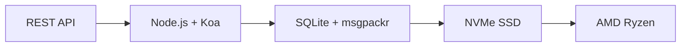

# API Email Hoàn chỉnh Đầu tiên: Cách Forward Email Cách mạng hóa Quản lý Email {#the-first-complete-email-api-how-forward-email-revolutionized-email-management}


<p class="lead mt-3">
<strong>Tóm tắt:</strong> Chúng tôi đã xây dựng API REST hoàn chỉnh đầu tiên trên thế giới cho việc quản lý email với khả năng tìm kiếm nâng cao mà không dịch vụ nào khác cung cấp. Trong khi Gmail, Outlook và Apple buộc các nhà phát triển phải sử dụng IMAP hoặc API bị giới hạn tốc độ, Forward Email cung cấp các thao tác CRUD cực nhanh cho tin nhắn, thư mục, danh bạ và lịch thông qua giao diện REST thống nhất với hơn 15 tham số tìm kiếm. Đây chính là API email mà các nhà phát triển đã chờ đợi.
</p>

## Mục lục {#table-of-contents}

* [Vấn đề về API Email](#the-email-api-problem)
* [Những gì các nhà phát triển thực sự đang nói](#what-developers-are-actually-saying)
* [Giải pháp mang tính cách mạng của Forward Email](#forward-emails-revolutionary-solution)
  * [Tại sao chúng tôi xây dựng điều này](#why-we-built-this)
  * [Xác thực đơn giản](#simple-authentication)
* [20 Điểm cuối Thay đổi Mọi thứ](#20-endpoints-that-change-everything)
  * [Tin nhắn (5 điểm cuối)](#messages-5-endpoints)
  * [Thư mục (5 điểm cuối)](#folders-5-endpoints)
  * [Danh bạ (5 điểm cuối)](#contacts-5-endpoints)
  * [Lịch (5 điểm cuối)](#calendars-5-endpoints)
* [Tìm kiếm nâng cao: Không có dịch vụ nào khác so sánh](#advanced-search-no-other-service-compares)
  * [Bối cảnh API tìm kiếm đã bị phá vỡ](#the-search-api-landscape-is-broken)
  * [API tìm kiếm mang tính cách mạng của Forward Email](#forward-emails-revolutionary-search-api)
  * [Ví dụ tìm kiếm trong thế giới thực](#real-world-search-examples)
  * [Ưu điểm về hiệu suất](#performance-advantages)
  * [Tính năng tìm kiếm không ai khác có](#search-features-no-one-else-has)
  * [Tại sao điều này quan trọng đối với các nhà phát triển](#why-this-matters-for-developers)
  * [Việc triển khai kỹ thuật](#the-technical-implementation)
* [Kiến trúc hiệu suất cực nhanh](#blazing-fast-performance-architecture)
  * [Tiêu chuẩn hiệu suất](#performance-benchmarks)
  * [Kiến trúc ưu tiên quyền riêng tư](#privacy-first-architecture)
* [Tại sao chúng tôi khác biệt: So sánh đầy đủ](#why-were-different-the-complete-comparison)
  * [Những hạn chế chính của nhà cung cấp](#major-provider-limitations)
  * [Ưu điểm của chuyển tiếp email](#forward-email-advantages)
  * [Vấn đề minh bạch nguồn mở](#the-open-source-transparency-problem)
* [Hơn 30 ví dụ tích hợp thực tế](#30-real-world-integration-examples)
  * [1. Cải tiến biểu mẫu liên hệ WordPress](#1-wordpress-contact-form-enhancement)
  * [2. Zapier thay thế cho tự động hóa email](#2-zapier-alternative-for-email-automation)
  * [3. Đồng bộ hóa email CRM](#3-crm-email-synchronization)
  * [4. Xử lý đơn hàng thương mại điện tử](#4-e-commerce-order-processing)
  * [5. Hỗ trợ tích hợp phiếu](#5-support-ticket-integration)
  * [6. Hệ thống quản lý bản tin](#6-newsletter-management-system)
  * [7. Quản lý tác vụ dựa trên email](#7-email-based-task-management)
  * [8. Tổng hợp email nhiều tài khoản](#8-multi-account-email-aggregation)
  * [9. Bảng điều khiển phân tích email nâng cao](#9-advanced-email-analytics-dashboard)
  * [10. Lưu trữ email thông minh](#10-smart-email-archiving)
  * [11. Tích hợp Email vào Lịch](#11-email-to-calendar-integration)
  * [12. Sao lưu và tuân thủ email](#12-email-backup-and-compliance)
  * [13. Quản lý nội dung dựa trên email](#13-email-based-content-management)
  * [14. Quản lý mẫu email](#14-email-template-management)
  * [15. Tự động hóa quy trình làm việc dựa trên email](#15-email-based-workflow-automation)
  * [16. Giám sát bảo mật email](#16-email-security-monitoring)
  * [17. Thu thập khảo sát qua email](#17-email-based-survey-collection)
  * [18. Giám sát hiệu suất email](#18-email-performance-monitoring)
  * [19. Đánh giá khách hàng tiềm năng dựa trên email](#19-email-based-lead-qualification)
  * [20. Quản lý dự án dựa trên email](#20-email-based-project-management)
  * [21. Quản lý hàng tồn kho dựa trên email](#21-email-based-inventory-management)
  * [22. Xử lý hóa đơn qua email](#22-email-based-invoice-processing)
  * [23. Đăng ký sự kiện qua email](#23-email-based-event-registration)
  * [24. Quy trình phê duyệt tài liệu qua email](#24-email-based-document-approval-workflow)
  * [25. Phân tích phản hồi của khách hàng qua email](#25-email-based-customer-feedback-analysis)
  * [26. Kênh tuyển dụng qua email](#26-email-based-recruitment-pipeline)
  * [27. Xử lý báo cáo chi phí qua email](#27-email-based-expense-report-processing)
  * [28. Báo cáo đảm bảo chất lượng dựa trên email](#28-email-based-quality-assurance-reporting)
  * [29. Quản lý nhà cung cấp dựa trên email](#29-email-based-vendor-management)
  * [30. Giám sát mạng xã hội qua email](#30-email-based-social-media-monitoring)
* [Bắt đầu](#getting-started)
  * [1. Tạo tài khoản email chuyển tiếp của bạn](#1-create-your-forward-email-account)
  * [2. Tạo thông tin xác thực API](#2-generate-api-credentials)
  * [3. Thực hiện lệnh gọi API đầu tiên của bạn](#3-make-your-first-api-call)
  * [4. Khám phá Tài liệu](#4-explore-the-documentation)
* [Tài nguyên kỹ thuật](#technical-resources)

## Sự cố API Email {#the-email-api-problem}

API email về cơ bản đã bị hỏng. Chấm hết.

Mọi nhà cung cấp email lớn đều buộc các nhà phát triển phải đưa ra một trong hai lựa chọn tồi tệ sau:

1. **Địa ngục IMAP**: Vật lộn với giao thức 30 năm tuổi được thiết kế cho máy khách để bàn, chứ không phải ứng dụng hiện đại
2. **API bị hạn chế**: API OAuth phức tạp, chỉ đọc, giới hạn tốc độ, không thể quản lý dữ liệu email thực tế của bạn

Kết quả là gì? Các nhà phát triển hoặc từ bỏ hoàn toàn việc tích hợp email hoặc mất nhiều tuần để xây dựng các trình bao bọc IMAP dễ hỏng liên tục.

> \[!WARNING]
> **Bí mật đen tối**: Hầu hết các "API email" chỉ là API gửi. Bạn không thể lập trình để sắp xếp thư mục, đồng bộ danh bạ hoặc quản lý lịch thông qua một giao diện REST đơn giản. Cho đến bây giờ.

## Những gì các nhà phát triển thực sự đang nói {#what-developers-are-actually-saying}

Sự thất vọng là có thật và được ghi chép lại ở khắp mọi nơi:

> "Gần đây tôi đã thử tích hợp Gmail vào ứng dụng của mình, và tôi đã dành quá nhiều thời gian cho nó. Tôi quyết định rằng việc hỗ trợ Gmail là không đáng."
>
> *- [Nhà phát triển Hacker News](https://news.ycombinator.com/item?id=42106944), 147 lượt bình chọn*

> "Có phải tất cả các API email đều tầm thường không? Chúng có vẻ hạn chế hoặc bị giới hạn theo một cách nào đó."
>
> *- [Thảo luận trên Reddit r/SaaS](https://www.reddit.com/r/SaaS/comments/1cm84s7/are_all_email_apis_mediocre/)*

> "Tại sao việc phát triển email lại tệ đến vậy?"
>
> *- [Reddit r/webdev](https://www.reddit.com/r/webdev/comments/15trnp2/why_does_email_development_have_to_suck/), 89 bình luận về nỗi đau của nhà phát triển*

> "Điều gì khiến API Gmail hiệu quả hơn IMAP? Một lý do khác khiến API Gmail hiệu quả hơn nhiều là vì nó chỉ cần tải xuống mỗi thư một lần. Với IMAP, mỗi thư phải được tải xuống và lập chỉ mục..."
>
> *- [Câu hỏi Stack Overflow](https://stackoverflow.com/questions/25431022/what-makes-the-gmail-api-more-efficient-than-imap) với 47 lượt bình chọn*

Bằng chứng ở khắp mọi nơi:

* **Các vấn đề về SMTP của WordPress**: [631 vấn đề GitHub](https://github.com/awesomemotive/WP-Mail-SMTP/issues) về lỗi gửi email
* **Hạn chế của Zapier**: [Khiếu nại của cộng đồng](https://community.zapier.com/featured-articles-65/email-parser-by-zapier-limitations-and-alternatives-16958) về giới hạn 10 email/giờ và lỗi phát hiện IMAP
* **Các dự án API IMAP**: [Nhiều](https://github.com/ewildgoose/imap-api) [mã nguồn mở](https://emailengine.app/) [các dự án](https://www.npmjs.com/package/imapflow) tồn tại chuyên biệt để "chuyển đổi IMAP sang REST" vì không có nhà cung cấp nào cung cấp tính năng này
* **Những khó chịu với API Gmail**: [Stack Overflow](https://stackoverflow.com/questions/tagged/gmail-api) có 4.847 câu hỏi được gắn thẻ "gmail-api" với các khiếu nại phổ biến về giới hạn tốc độ và độ phức tạp

## Giải pháp mang tính cách mạng của Email chuyển tiếp {#forward-emails-revolutionary-solution}

**Chúng tôi là dịch vụ email đầu tiên cung cấp các hoạt động CRUD hoàn chỉnh cho mọi dữ liệu email thông qua REST API thống nhất.**

Đây không chỉ là một API gửi dữ liệu đơn thuần. Đây là khả năng kiểm soát hoàn toàn theo chương trình đối với:

* **Tin nhắn**: Tạo, đọc, cập nhật, xóa, tìm kiếm, di chuyển, đánh dấu
* **Thư mục**: Quản lý thư mục IMAP đầy đủ thông qua các điểm cuối REST
* **Danh bạ**: Lưu trữ và đồng bộ hóa danh bạ [ThẻDAV](https://tools.ietf.org/html/rfc6352)
* **Lịch**: Sự kiện lịch [CalDAV](https://tools.ietf.org/html/rfc4791) và lịch trình

### Lý do chúng tôi xây dựng {#why-we-built-this}

**Vấn đề**: Mọi nhà cung cấp dịch vụ email đều coi email như một hộp đen. Bạn có thể gửi email, thậm chí đọc chúng bằng OAuth phức tạp, nhưng bạn không thể thực sự *quản lý* dữ liệu email của mình theo chương trình.

**Tầm nhìn của chúng tôi**: Email phải dễ tích hợp như bất kỳ API hiện đại nào. Không cần thư viện IMAP. Không cần OAuth phức tạp. Không cần giới hạn tốc độ. Chỉ cần các điểm cuối REST đơn giản và hoạt động.

**Kết quả**: Dịch vụ email đầu tiên cho phép bạn xây dựng một ứng dụng email hoàn chỉnh, tích hợp CRM hoặc hệ thống tự động hóa chỉ bằng các yêu cầu HTTP.

### Xác thực đơn giản {#simple-authentication}

Không có [Độ phức tạp của OAuth](https://oauth.net/2/). Không có [mật khẩu dành riêng cho ứng dụng](https://support.google.com/accounts/answer/185833). Chỉ có thông tin đăng nhập bí danh của bạn:

```bash
curl -u "alias@yourdomain.com:password" \
  https://api.forwardemail.net/v1/messages
```

## 20 Điểm cuối Thay đổi Mọi thứ {#20-endpoints-that-change-everything}

### Tin nhắn (5 điểm cuối) {#messages-5-endpoints}

* `GET /v1/messages` - Liệt kê các tin nhắn có lọc (`?folder=`, `?is_unread=`, `?is_flagged=`)
* `POST /v1/messages` - Gửi tin nhắn mới trực tiếp đến các thư mục
* `GET /v1/messages/:id` - Truy xuất tin nhắn cụ thể với đầy đủ siêu dữ liệu
* `PUT /v1/messages/:id` - Cập nhật tin nhắn (cờ, thư mục, trạng thái đã đọc)
* `DELETE /v1/messages/:id` - Xóa tin nhắn vĩnh viễn

### Thư mục (5 điểm cuối) {#folders-5-endpoints}

* `GET /v1/folders` - Liệt kê tất cả các thư mục có trạng thái đăng ký
* `POST /v1/folders` - Tạo thư mục mới với các thuộc tính tùy chỉnh
* `GET /v1/folders/:id` - Lấy thông tin chi tiết về thư mục và số lượng tin nhắn
* `PUT /v1/folders/:id` - Cập nhật thuộc tính và đăng ký thư mục
* `DELETE /v1/folders/:id` - Xóa thư mục và xử lý việc di chuyển tin nhắn

### Danh bạ (5 điểm cuối) {#contacts-5-endpoints}

* `GET /v1/contacts` - Liệt kê danh bạ với chức năng tìm kiếm và phân trang
* `POST /v1/contacts` - Tạo danh bạ mới với hỗ trợ vCard đầy đủ
* `GET /v1/contacts/:id` - Truy xuất danh bạ với tất cả các trường và siêu dữ liệu
* `PUT /v1/contacts/:id` - Cập nhật thông tin danh bạ với xác thực ETag
* `DELETE /v1/contacts/:id` - Xóa danh bạ với chức năng xử lý theo tầng

### Lịch (5 điểm cuối) {#calendars-5-endpoints}

* `GET /v1/calendars` - Liệt kê các sự kiện lịch với tính năng lọc ngày
* `POST /v1/calendars` - Tạo sự kiện lịch với người tham dự và lặp lại
* `GET /v1/calendars/:id` - Nhận thông tin chi tiết về sự kiện với tính năng xử lý múi giờ
* `PUT /v1/calendars/:id` - Cập nhật sự kiện với tính năng phát hiện xung đột
* `DELETE /v1/calendars/:id` - Xóa sự kiện với thông báo người tham dự

## Tìm kiếm nâng cao: Không có dịch vụ nào khác so sánh {#advanced-search-no-other-service-compares}

**Forward Email là dịch vụ email duy nhất cung cấp khả năng tìm kiếm toàn diện, theo chương trình trên tất cả các trường tin nhắn thông qua REST API.**

Trong khi các nhà cung cấp khác chỉ cung cấp chức năng lọc cơ bản, chúng tôi đã xây dựng API tìm kiếm email tiên tiến nhất từ trước đến nay. Không có API Gmail, API Outlook hay bất kỳ dịch vụ nào khác có thể sánh bằng khả năng tìm kiếm của chúng tôi.

### Bối cảnh API tìm kiếm bị phá vỡ {#the-search-api-landscape-is-broken}

**Giới hạn tìm kiếm của API Gmail:**

* ✅ Chỉ tham số `q` cơ bản
* ❌ Không tìm kiếm theo trường cụ thể
* ❌ Không lọc theo phạm vi ngày
* ❌ Không lọc theo kích thước
* ❌ Không lọc tệp đính kèm
* ❌ Chỉ giới hạn trong cú pháp tìm kiếm của Gmail

**Hạn chế tìm kiếm của API Outlook:**

* ✅ Tham số `$search` cơ bản
* ❌ Không nhắm mục tiêu trường nâng cao
* ❌ Không kết hợp truy vấn phức tạp
* ❌ Giới hạn tốc độ tích cực
* ❌ Yêu cầu cú pháp OData phức tạp

**Apple iCloud:**

* ❌ Không có API nào cả
* ❌ Chỉ tìm kiếm IMAP (nếu bạn có thể làm cho nó hoạt động)

**ProtonMail & Tuta:**

* ❌ Không có API công khai
* ❌ Không có khả năng tìm kiếm theo chương trình

### Chuyển tiếp API tìm kiếm mang tính cách mạng của Email {#forward-emails-revolutionary-search-api}

**Chúng tôi cung cấp hơn 15 tham số tìm kiếm mà không dịch vụ nào khác cung cấp:**

| Khả năng tìm kiếm | Chuyển tiếp Email | API Gmail | API Outlook | Người khác |
| ------------------------------ | -------------------------------------- | ------------ | ------------------ | ------ |
| **Tìm kiếm theo trường cụ thể** | ✅ Chủ đề, nội dung, từ, đến, cc, tiêu đề | ❌ | ❌ | ❌ |
| **Tìm kiếm chung đa lĩnh vực** | ✅ `?search=` trên tất cả các trường | ✅ `q=` cơ bản | ✅ `$search=` cơ bản | ❌ |
| **Lọc theo phạm vi ngày** | ✅ `?since=` & `?before=` | ❌ | ❌ | ❌ |
| **Lọc theo kích thước** | ✅ `?min_size=` & `?max_size=` | ❌ | ❌ | ❌ |
| **Lọc tệp đính kèm** | ✅ `?has_attachments=true/false` | ❌ | ❌ | ❌ |
| **Tìm kiếm tiêu đề** | ✅ `?headers=X-Priority` | ❌ | ❌ | ❌ |
| **Tìm kiếm ID tin nhắn** | ✅ `?message_id=abc123` | ❌ | ❌ | ❌ |
| **Bộ lọc kết hợp** | ✅ Nhiều tham số với logic AND | ❌ | ❌ | ❌ |
| **Không phân biệt chữ hoa chữ thường** | ✅ Tất cả tìm kiếm | ✅ | ✅ | ❌ |
| **Hỗ trợ phân trang** | ✅ Hoạt động với tất cả các tham số tìm kiếm | ✅ | ✅ | ❌ |

### Ví dụ tìm kiếm trong thế giới thực {#real-world-search-examples}

**Tìm tất cả hóa đơn từ quý trước:**

```bash
# Forward Email - Simple and powerful
GET /v1/messages?subject=invoice&since=2024-01-01T00:00:00Z&before=2024-04-01T00:00:00Z

# Gmail API - Impossible with their limited search
# No date range filtering available

# Outlook API - Complex OData syntax, limited functionality
GET /me/messages?$search="invoice"&$filter=receivedDateTime ge 2024-01-01T00:00:00Z
```

**Tìm kiếm tệp đính kèm lớn từ người gửi cụ thể:**

```bash
# Forward Email - Comprehensive filtering
GET /v1/messages?from=finance@company.com&has_attachments=true&min_size=1000000

# Gmail API - Cannot filter by size or attachments programmatically
# Outlook API - No size filtering available
# Others - No APIs available
```

**Tìm kiếm đa trường phức tạp:**

```bash
# Forward Email - Advanced query capabilities
GET /v1/messages?body=quarterly&from=manager&is_flagged=true&folder=Reports

# Gmail API - Limited to basic text search only
GET /gmail/v1/users/me/messages?q=quarterly

# Outlook API - Basic search without field targeting
GET /me/messages?$search="quarterly"
```

### Ưu điểm về hiệu suất {#performance-advantages}

**Hiệu suất tìm kiếm email chuyển tiếp:**

* ⚡ **Thời gian phản hồi dưới 100ms** cho các tìm kiếm phức tạp
* 🔍 **Tối ưu hóa biểu thức chính quy** với lập chỉ mục phù hợp
* 📊 **Thực thi truy vấn song song** cho cả đếm và dữ liệu
* 💾 **Sử dụng bộ nhớ hiệu quả** với các truy vấn tinh gọn

**Vấn đề về hiệu suất của đối thủ cạnh tranh:**

* 🐌 **API Gmail**: Giới hạn tốc độ ở mức 250 đơn vị hạn ngạch cho mỗi người dùng mỗi giây
* 🐌 **API Outlook**: Điều tiết mạnh mẽ với các yêu cầu lùi lại phức tạp
* 🐌 **Khác**: Không có API nào để so sánh

### Tính năng tìm kiếm không ai khác có {#search-features-no-one-else-has}

#### 1. Tìm kiếm theo tiêu đề cụ thể {#1-header-specific-search}

```bash
# Find messages with specific headers
GET /v1/messages?headers=X-Priority:1
GET /v1/messages?headers=X-Spam-Score
```

#### 2. Trí thông minh dựa trên kích thước {#2-size-based-intelligence}

```bash
# Find newsletter emails (typically large)
GET /v1/messages?min_size=50000&from=newsletter

# Find quick replies (typically small)
GET /v1/messages?max_size=1000&to=support
```

#### 3. Quy trình làm việc dựa trên tệp đính kèm {#3-attachment-based-workflows}

```bash
# Find all documents sent to legal team
GET /v1/messages?to=legal&has_attachments=true&body=contract

# Find emails without attachments for cleanup
GET /v1/messages?has_attachments=false&before=2023-01-01T00:00:00Z
```

#### 4. Logic nghiệp vụ kết hợp {#4-combined-business-logic}

```bash
# Find urgent flagged messages from VIPs with attachments
GET /v1/messages?is_flagged=true&from=ceo&has_attachments=true&subject=urgent
```

### Tại sao điều này quan trọng đối với các nhà phát triển {#why-this-matters-for-developers}

**Xây dựng các ứng dụng trước đây không thể thực hiện được:**

1. **Phân tích Email Nâng cao**: Phân tích các mẫu email theo kích thước, người gửi, nội dung
2. **Quản lý Email Thông minh**: Tự động sắp xếp dựa trên các tiêu chí phức tạp
3. **Tuân thủ và Khám phá**: Tìm các email cụ thể theo yêu cầu pháp lý
4. **Trí tuệ Kinh doanh**: Trích xuất thông tin chi tiết từ các mẫu giao tiếp email
5. **Quy trình làm việc tự động**: Kích hoạt các hành động dựa trên bộ lọc email phức tạp

### Triển khai kỹ thuật {#the-technical-implementation}

API tìm kiếm của chúng tôi sử dụng:

* **Tối ưu hóa biểu thức chính quy** với các chiến lược lập chỉ mục phù hợp
* **Thực thi song song** để tăng hiệu suất
* **Xác thực đầu vào** để tăng cường bảo mật
* **Xử lý lỗi toàn diện** để tăng cường độ tin cậy

```javascript
// Example: Complex search implementation
const searchConditions = [];

if (ctx.query.subject) {
  searchConditions.push({
    subject: { $regex: ctx.query.subject, $options: 'i' }
  });
}

if (ctx.query.from) {
  searchConditions.push({
    $or: [
      { 'from.address': { $regex: ctx.query.from, $options: 'i' } },
      { 'from.name': { $regex: ctx.query.from, $options: 'i' } }
    ]
  });
}

// Combine with AND logic
if (searchConditions.length > 0) {
  query.$and = searchConditions;
}
```

> \[!TIP]
> **Lợi thế cho nhà phát triển**: Với API tìm kiếm của Forward Email, bạn có thể xây dựng các ứng dụng email có chức năng ngang ngửa với ứng dụng máy tính để bàn trong khi vẫn duy trì tính đơn giản của API REST.

## Kiến trúc hiệu suất cực nhanh {#blazing-fast-performance-architecture}

Cơ sở kỹ thuật của chúng tôi được xây dựng để đạt được tốc độ và độ tin cậy:



### Điểm chuẩn hiệu suất {#performance-benchmarks}

**Tại sao chúng tôi nhanh như chớp:**

| Thành phần | Công nghệ | Lợi ích hiệu suất |
| ------------ | --------------------------------------------------------------------------------- | --------------------------------------------- |
| **Kho** | [NVMe SSD](https://en.wikipedia.org/wiki/NVM_Express) | Nhanh hơn 10 lần so với SATA truyền thống |
| **Cơ sở dữ liệu** | [SQLite](https://sqlite.org/) + [msgpackr](https://github.com/kriszyp/msgpackr) | Độ trễ mạng bằng không, tuần tự hóa được tối ưu hóa |
| **Phần cứng** | [AMD Ryzen](https://www.amd.com/en/products/processors/desktops/ryzen) kim loại trần | Không có chi phí ảo hóa |
| **Lưu trữ đệm** | Trong bộ nhớ + liên tục | Thời gian phản hồi dưới mili giây |
| **Sao lưu** | [Cloudflare R2](https://www.cloudflare.com/products/r2/) được mã hóa | Độ tin cậy cấp doanh nghiệp |

**Số liệu hiệu suất thực tế:**

* **Thời gian phản hồi API**: trung bình < 50ms
* **Truy xuất tin nhắn**: < 10ms đối với tin nhắn được lưu trong bộ nhớ đệm
* **Thao tác thư mục**: < 5ms đối với thao tác siêu dữ liệu
* **Đồng bộ hóa danh bạ**: Hơn 1000 danh bạ/giây
* **Thời gian hoạt động**: 99,99% SLA với cơ sở hạ tầng dự phòng

### Kiến trúc ưu tiên quyền riêng tư {#privacy-first-architecture}

**Thiết kế Zero-Knowledge**: Chỉ bạn mới có quyền truy cập bằng mật khẩu IMAP - chúng tôi không thể đọc email của bạn. [kiến trúc không kiến thức](https://forwardemail.net/en/security) của chúng tôi đảm bảo quyền riêng tư hoàn toàn trong khi vẫn mang lại hiệu suất vượt trội.

## Tại sao chúng tôi khác biệt: So sánh đầy đủ {#why-were-different-the-complete-comparison}

### Giới hạn chính của nhà cung cấp {#major-provider-limitations}

| Nhà cung cấp | Các vấn đề cốt lõi | Những hạn chế cụ thể |
| ---------------- | ----------------------------------------- | -------------------------------------------------------------------------------------------------------------------------------------------------------------------------------------------------------------------------------------------------------------------------------------------------------------------------------------------------------------------------------------------------------------------------------------------------------------------- |
| **API Gmail** | Chỉ đọc, OAuth phức tạp, API riêng biệt | • [Cannot modify existing messages](https://developers.google.com/gmail/api/reference/rest/v1/users.messages)<br>• [Labels ≠ folders](https://developers.google.com/gmail/api/reference/rest/v1/users.labels)<br>• [1 billion quota units/day limit](https://developers.google.com/gmail/api/reference/quota)<br>• [Requires separate APIs](https://developers.google.com/workspace) cho danh bạ/lịch |
| **API Outlook** | Đã lỗi thời, Gây nhầm lẫn, Tập trung vào doanh nghiệp | • [REST endpoints deprecated March 2024](https://learn.microsoft.com/en-us/outlook/rest/compare-graph)<br>• [Multiple confusing APIs](https://learn.microsoft.com/en-us/office/client-developer/outlook/selecting-an-api-or-technology-for-developing-solutions-for-outlook) (EWS, Đồ thị, REST)<br>• [Microsoft Graph complexity](https://learn.microsoft.com/en-us/graph/overview)<br>• [Aggressive throttling](https://learn.microsoft.com/en-us/graph/throttling) |
| **Apple iCloud** | Không có API công khai | • [No public API whatsoever](https://support.apple.com/en-us/102654)<br>• [IMAP-only with 1000 emails/day limit](https://support.apple.com/en-us/102654)<br>• [App-specific passwords required](https://support.apple.com/en-us/102654)<br>• [500 recipients per message limit](https://support.apple.com/en-us/102654) |
| **ProtonMail** | Không có API, tuyên bố nguồn mở sai sự thật | • [No public API available](https://proton.me/support/protonmail-bridge-clients)<br>• [Bridge software required](https://proton.me/mail/bridge) để truy cập IMAP<br>• [Claims "open source"](https://proton.me/blog/open-source) nhưng [server code is proprietary](https://github.com/ProtonMail)<br>• [Limited to paid plans only](https://proton.me/pricing) |
| **Tổng cộng** | Không có API, tính minh bạch gây hiểu lầm | • [No REST API for email management](https://tuta.com/support#technical)<br>• [Claims "open source"](https://tuta.com/blog/posts/open-source-email) nhưng [backend is closed](https://github.com/tutao/tutanota)<br>• [IMAP/SMTP not supported](https://tuta.com/support#imap)<br>• [Proprietary encryption](https://tuta.com/encryption) ngăn chặn tích hợp tiêu chuẩn |
| **Email Zapier** | Giới hạn tỷ lệ nghiêm ngặt | • [10 emails per hour limit](https://help.zapier.com/hc/en-us/articles/8496181555597-Email-Parser-by-Zapier-limitations-and-alternatives)<br>• [No IMAP folder access](https://help.zapier.com/hc/en-us/articles/8496181555597-Email-Parser-by-Zapier-limitations-and-alternatives)<br>• [Limited parsing capabilities](https://help.zapier.com/hc/en-us/articles/8496181555597-Email-Parser-by-Zapier-limitations-and-alternatives) |

### Chuyển tiếp Email Ưu điểm {#forward-email-advantages}

| Tính năng | Chuyển tiếp Email | Cuộc thi |
| ------------------ | -------------------------------------------------------------------------------------------- | ----------------------------------------- |
| **CRUD hoàn chỉnh** | ✅ Tạo, đọc, cập nhật, xóa toàn bộ dữ liệu | ❌ Chỉ đọc hoặc thao tác giới hạn |
| **API hợp nhất** | ✅ Tin nhắn, thư mục, danh bạ, lịch trong một API | ❌ API riêng biệt hoặc thiếu tính năng |
| **Xác thực đơn giản** | ✅ Xác thực cơ bản với thông tin đăng nhập bí danh | ❌ OAuth phức tạp với nhiều phạm vi |
| **Không giới hạn tỷ lệ** | ✅ Giới hạn rộng rãi được thiết kế cho các ứng dụng thực tế | ❌ Hạn ngạch hạn chế làm gián đoạn quy trình làm việc |
| **Tự lưu trữ** | ✅ [Complete self-hosting option](https://forwardemail.net/en/blog/docs/self-hosted-solution) | ❌ Chỉ khóa nhà cung cấp |
| **Sự riêng tư** | ✅ Không có kiến thức, được mã hóa, riêng tư | ❌ Khai thác dữ liệu và mối quan ngại về quyền riêng tư |
| **Hiệu suất** | ✅ Thời gian phản hồi dưới 50ms, lưu trữ NVMe | ❌ Độ trễ mạng, độ trễ điều tiết |

### Vấn đề minh bạch nguồn mở {#the-open-source-transparency-problem}

**ProtonMail và Tuta tự quảng cáo là "nguồn mở" và "minh bạch", nhưng đây là cách tiếp thị gây hiểu lầm, vi phạm các nguyên tắc bảo mật hiện đại.**

> \[!WARNING]
> **Tuyên bố sai lệch về tính minh bạch**: Cả ProtonMail và Tuta đều quảng cáo rầm rộ thông tin xác thực "nguồn mở" của họ trong khi vẫn giữ mã máy chủ quan trọng nhất của họ là mã độc quyền và đóng.

**Sự lừa dối của ProtonMail:**

* **Khiếu nại**: ["Chúng tôi là mã nguồn mở"](https://proton.me/blog/open-source) được giới thiệu nổi bật trong tiếp thị
* **Thực tế**: [Mã máy chủ hoàn toàn độc quyền](https://github.com/ProtonMail) - chỉ các ứng dụng khách hàng mới là mã nguồn mở
* **Tác động**: Người dùng không thể xác minh các khiếu nại về mã hóa phía máy chủ, xử lý dữ liệu hoặc quyền riêng tư
* **Vi phạm tính minh bạch**: Không có cách nào để kiểm tra hệ thống xử lý và lưu trữ email thực tế

**Tiếp thị gây hiểu lầm của Tuta:**

* **Khẳng định**: ["Email nguồn mở"](https://tuta.com/blog/posts/open-source-email) là điểm bán hàng cốt lõi
* **Thực tế**: [Cơ sở hạ tầng phụ trợ là nguồn đóng](https://github.com/tutao/tutanota) - chỉ có giao diện người dùng khả dụng
* **Tác động**: Mã hóa độc quyền ngăn chặn các giao thức email tiêu chuẩn (IMAP/SMTP)
* **Chiến lược khóa**: Mã hóa tùy chỉnh buộc phải phụ thuộc vào nhà cung cấp

**Tại sao điều này quan trọng đối với quyền riêng tư hiện đại:**

Vào năm 2025, quyền riêng tư thực sự đòi hỏi sự minh bạch hoàn toàn. Khi các nhà cung cấp dịch vụ email tuyên bố "mã nguồn mở" nhưng lại ẩn mã máy chủ của họ:

1. **Mã hóa không thể xác minh**: Bạn không thể kiểm tra cách dữ liệu của mình thực sự được mã hóa.
2. **Thực hành Dữ liệu Ẩn**: Việc xử lý dữ liệu phía máy chủ vẫn là một hộp đen.
3. **Bảo mật Dựa trên Niềm tin**: Bạn phải tin tưởng các tuyên bố của họ mà không cần xác minh.
4. **Khóa Nhà cung cấp**: Các hệ thống độc quyền ngăn chặn khả năng di chuyển dữ liệu.

**Tính minh bạch thực sự của Email chuyển tiếp:**

* ✅ **[Mã nguồn mở hoàn chỉnh](https://github.com/forwardemail/forwardemail.net)** - mã máy chủ và máy khách
* ✅ **[Có sẵn dịch vụ tự lưu trữ](https://forwardemail.net/en/blog/docs/self-hosted-solution)** - chạy phiên bản của riêng bạn
* ✅ **Giao thức chuẩn** - Tương thích IMAP, SMTP, CardDAV, CalDAV
* ✅ **Bảo mật có thể kiểm tra** - mọi dòng mã đều có thể được kiểm tra
* ✅ **Không bị ràng buộc bởi nhà cung cấp** - dữ liệu của bạn, quyền kiểm soát của bạn

> \[!TIP]
> **Mã nguồn mở thực sự cho phép bạn xác minh mọi khiếu nại.** Với Forward Email, bạn có thể kiểm tra mã hóa, xem xét cách chúng tôi xử lý dữ liệu và thậm chí chạy phiên bản của riêng bạn. Đó là sự minh bạch thực sự.

## Hơn 30 ví dụ tích hợp thực tế {#30-real-world-integration-examples}

### 1. Cải tiến biểu mẫu liên hệ WordPress {#1-wordpress-contact-form-enhancement}

**Vấn đề**: [Lỗi cấu hình SMTP của WordPress](https://github.com/awesomemotive/WP-Mail-SMTP/issues) ([631 vấn đề GitHub](https://github.com/awesomemotive/WP-Mail-SMTP/issues))
**Giải pháp**: Tích hợp API trực tiếp bỏ qua hoàn toàn [SMTP](https://tools.ietf.org/html/rfc5321)

```javascript
// WordPress contact form that saves to Sent folder
await fetch('https://api.forwardemail.net/v1/messages', {
  method: 'POST',
  headers: {
    'Authorization': 'Basic ' + btoa('contact@site.com:password'),
    'Content-Type': 'application/json'
  },
  body: JSON.stringify({
    to: [{ address: 'owner@site.com' }],
    subject: 'Contact Form: ' + formData.subject,
    text: formData.message,
    folder: 'Sent'
  })
});
```

### 2. Zapier thay thế cho tự động hóa email {#2-zapier-alternative-for-email-automation}

**Vấn đề**: [Giới hạn 10 email/giờ của Zapier](https://help.zapier.com/hc/en-us/articles/8496181555597-Email-Parser-by-Zapier-limitations-and-alternatives) và [Lỗi phát hiện IMAP](https://community.zapier.com/featured-articles-65/email-parser-by-zapier-limitations-and-alternatives-16958)
**Giải pháp**: Tự động hóa không giới hạn với khả năng kiểm soát email toàn diện

```javascript
// Auto-organize emails by sender domain
const messages = await fetch('/v1/messages?folder=INBOX');
for (const message of messages) {
  const domain = message.from.split('@')[1];
  await fetch(`/v1/messages/${message.id}`, {
    method: 'PUT',
    body: JSON.stringify({ folder: `Clients/${domain}` })
  });
}
```

### 3. Đồng bộ hóa Email CRM {#3-crm-email-synchronization}

**Vấn đề**: Quản lý liên hệ thủ công giữa email và [Hệ thống CRM](https://en.wikipedia.org/wiki/Customer_relationship_management)
**Giải pháp**: Đồng bộ hóa hai chiều với API liên hệ [ThẻDAV](https://tools.ietf.org/html/rfc6352)

```javascript
// Sync new email contacts to CRM
const newContacts = await fetch('/v1/contacts');
for (const contact of newContacts) {
  await crmAPI.createContact({
    name: contact.name,
    email: contact.email,
    source: 'email_api'
  });
}
```

### 4. Xử lý đơn hàng thương mại điện tử {#4-e-commerce-order-processing}

**Vấn đề**: Xử lý thủ công email đơn hàng cho [nền tảng thương mại điện tử](https://en.wikipedia.org/wiki/E-commerce)
**Giải pháp**: Quy trình quản lý đơn hàng tự động

```javascript
// Process order confirmation emails
const orders = await fetch('/v1/messages?folder=Orders');
const orderEmails = orders.filter(msg =>
  msg.subject.includes('Order Confirmation')
);

for (const order of orderEmails) {
  const orderData = parseOrderEmail(order.text);
  await updateInventory(orderData);
  await fetch(`/v1/messages/${order.id}`, {
    method: 'PUT',
    body: JSON.stringify({ folder: 'Orders/Processed' })
  });
}
```

### 5. Hỗ trợ tích hợp phiếu {#5-support-ticket-integration}

**Vấn đề**: Chuỗi email nằm rải rác trên [nền tảng trợ giúp](https://en.wikipedia.org/wiki/Help_desk_software)
**Giải pháp**: Theo dõi toàn bộ chuỗi email

```javascript
// Create support ticket from email thread
const messages = await fetch('/v1/messages?folder=Support');
const supportEmails = messages.filter(msg =>
  msg.to.some(addr => addr.includes('support@'))
);

for (const email of supportEmails) {
  const ticket = await supportSystem.createTicket({
    subject: email.subject,
    from: email.from,
    body: email.text,
    timestamp: email.date
  });
}
```

### 6. Hệ thống quản lý bản tin {#6-newsletter-management-system}

**Vấn đề**: Tích hợp [nền tảng bản tin](https://en.wikipedia.org/wiki/Email_marketing) hạn chế
**Giải pháp**: Quản lý toàn bộ vòng đời thuê bao

```javascript
// Auto-manage newsletter subscriptions
const messages = await fetch('/v1/messages?folder=Newsletter');
const unsubscribes = messages.filter(msg =>
  msg.subject.toLowerCase().includes('unsubscribe')
);

for (const msg of unsubscribes) {
  await removeSubscriber(msg.from);
  await fetch(`/v1/messages/${msg.id}`, {
    method: 'PUT',
    body: JSON.stringify({ folder: 'Newsletter/Unsubscribed' })
  });
}
```

### 7. Quản lý tác vụ dựa trên email {#7-email-based-task-management}

**Vấn đề**: Hộp thư đến quá tải và [theo dõi nhiệm vụ](https://en.wikipedia.org/wiki/Task_management)
**Giải pháp**: Chuyển đổi email thành các tác vụ có thể thực hiện được

```javascript
// Create tasks from flagged emails
const messages = await fetch('/v1/messages?is_flagged=true');
for (const email of messages) {
  await taskManager.createTask({
    title: email.subject,
    description: email.text,
    assignee: email.to[0].address,
    dueDate: extractDueDate(email.text)
  });
}
```

### 8. Tổng hợp email nhiều tài khoản {#8-multi-account-email-aggregation}

**Vấn đề**: Quản lý [nhiều tài khoản email](https://en.wikipedia.org/wiki/Email_client) giữa các nhà cung cấp
**Giải pháp**: Giao diện hộp thư đến hợp nhất

```javascript
// Aggregate emails from multiple accounts
const accounts = ['work@domain.com', 'personal@domain.com'];
const allMessages = [];

for (const account of accounts) {
  const messages = await fetch('/v1/messages', {
    headers: { 'Authorization': getAuth(account) }
  });
  allMessages.push(...messages.map(m => ({ ...m, account })));
}
```

### 9. Bảng điều khiển phân tích email nâng cao {#9-advanced-email-analytics-dashboard}

**Vấn đề**: Không có thông tin chi tiết về [mẫu email](https://en.wikipedia.org/wiki/Email_analytics) với bộ lọc tinh vi
**Giải pháp**: Phân tích email tùy chỉnh bằng tính năng tìm kiếm nâng cao

```javascript
// Generate comprehensive email analytics using advanced search
const analytics = {};

// Analyze email volume by sender domain
const messages = await fetch('/v1/messages');
analytics.senderDomains = analyzeSenderDomains(messages);

// Find large attachments consuming storage
const largeAttachments = await fetch('/v1/messages?has_attachments=true&min_size=1000000');
analytics.storageHogs = largeAttachments.map(msg => ({
  subject: msg.subject,
  from: msg.from,
  size: msg.size
}));

// Analyze communication patterns with VIPs
const vipEmails = await fetch('/v1/messages?from=ceo@company.com');
const urgentVipEmails = await fetch('/v1/messages?from=ceo@company.com&subject=urgent');
analytics.vipCommunication = {
  total: vipEmails.length,
  urgent: urgentVipEmails.length,
  urgencyRate: (urgentVipEmails.length / vipEmails.length) * 100
};

// Find unread emails by date range for follow-up
const lastWeek = new Date(Date.now() - 7 * 24 * 60 * 60 * 1000).toISOString();
const unreadRecent = await fetch(`/v1/messages?is_unread=true&since=${lastWeek}`);
analytics.followUpNeeded = unreadRecent.length;

// Analyze email sizes for optimization
const smallEmails = await fetch('/v1/messages?max_size=1000');
const mediumEmails = await fetch('/v1/messages?min_size=1000&max_size=50000');
const largeEmails = await fetch('/v1/messages?min_size=50000');
analytics.sizeDistribution = {
  small: smallEmails.length,
  medium: mediumEmails.length,
  large: largeEmails.length
};

// Search for compliance-related emails
const complianceEmails = await fetch('/v1/messages?body=confidential&has_attachments=true');
analytics.complianceReview = complianceEmails.length;
```

### 10. Lưu trữ email thông minh {#10-smart-email-archiving}

**Vấn đề**: [tổ chức email](https://en.wikipedia.org/wiki/Email_management) thủ công
**Giải pháp**: Phân loại email thông minh

```javascript
// Auto-archive old emails by category
const messages = await fetch('/v1/messages');
const oldEmails = messages.filter(email =>
  isOlderThan(email.date, 90) // 90 days
);

for (const email of oldEmails) {
  const category = categorizeEmail(email);
  await fetch(`/v1/messages/${email.id}`, {
    method: 'PUT',
    body: JSON.stringify({ folder: `Archive/${category}` })
  });
}
```

### 11. Tích hợp Email vào Lịch {#11-email-to-calendar-integration}

**Vấn đề**: Tạo [sự kiện lịch](https://tools.ietf.org/html/rfc4791) thủ công từ email
**Giải pháp**: Tự động trích xuất và tạo sự kiện

```javascript
// Extract meeting details from emails
const messages = await fetch('/v1/messages?folder=Meetings');
const meetingEmails = messages.filter(email =>
  email.subject.toLowerCase().includes('meeting')
);

for (const email of meetingEmails) {
  const meetingData = extractMeetingInfo(email.text);
  if (meetingData.date && meetingData.time) {
    await fetch('/v1/calendars', {
      method: 'POST',
      body: JSON.stringify({
        title: email.subject,
        start: meetingData.datetime,
        attendees: [email.from, ...email.to]
      })
    });
  }
}
```

### 12. Sao lưu và tuân thủ email {#12-email-backup-and-compliance}

**Vấn đề**: [Lưu giữ email](https://en.wikipedia.org/wiki/Email_retention_policy) và các yêu cầu tuân thủ
**Giải pháp**: Sao lưu tự động với tính năng bảo toàn siêu dữ liệu

```javascript
// Backup emails with full metadata
const allMessages = await fetch('/v1/messages');
const backup = {
  timestamp: new Date(),
  messages: allMessages.map(msg => ({
    id: msg.id,
    subject: msg.subject,
    from: msg.from,
    to: msg.to,
    date: msg.date,
    flags: msg.flags
  }))
};
await saveToComplianceStorage(backup);
```

### 13. Quản lý nội dung dựa trên email {#13-email-based-content-management}

**Vấn đề**: Quản lý nội dung gửi qua email cho [Nền tảng CMS](https://en.wikipedia.org/wiki/Content_management_system)
**Giải pháp**: Email như một hệ thống quản lý nội dung

```javascript
// Process content submissions from email
const messages = await fetch('/v1/messages?folder=Submissions');
const submissions = messages.filter(msg =>
  msg.to.some(addr => addr.includes('submit@'))
);

for (const submission of submissions) {
  const content = parseSubmission(submission.text);
  await cms.createDraft({
    title: submission.subject,
    content: content.body,
    author: submission.from
  });
}
```

### 14. Quản lý mẫu email {#14-email-template-management}

**Vấn đề**: [mẫu email](https://en.wikipedia.org/wiki/Email_template) không nhất quán trong toàn nhóm
**Giải pháp**: Hệ thống mẫu tập trung với API

```javascript
// Send templated emails with dynamic content
const template = await getEmailTemplate('welcome');
await fetch('/v1/messages', {
  method: 'POST',
  body: JSON.stringify({
    to: [{ address: newUser.email }],
    subject: template.subject.replace('{{name}}', newUser.name),
    html: template.html.replace('{{name}}', newUser.name),
    folder: 'Sent'
  })
});
```

### 15. Tự động hóa quy trình làm việc dựa trên email {#15-email-based-workflow-automation}

**Vấn đề**: [quy trình phê duyệt](https://en.wikipedia.org/wiki/Workflow) thủ công qua email
**Giải pháp**: Kích hoạt quy trình làm việc tự động

```javascript
// Process approval emails
const messages = await fetch('/v1/messages?folder=Approvals');
const approvals = messages.filter(msg =>
  msg.subject.includes('APPROVAL')
);

for (const approval of approvals) {
  const decision = parseApprovalDecision(approval.text);
  await workflow.processApproval({
    requestId: extractRequestId(approval.subject),
    decision: decision,
    approver: approval.from
  });
}
```

### 16. Giám sát bảo mật email {#16-email-security-monitoring}

**Vấn đề**: [phát hiện mối đe dọa an ninh](https://en.wikipedia.org/wiki/Email_security) thủ công
**Giải pháp**: Phân tích mối đe dọa tự động

```javascript
// Monitor for suspicious emails
const recentEmails = await fetch('/v1/messages');
for (const email of recentEmails) {
  const threatScore = analyzeThreat(email);
  if (threatScore > 0.8) {
    await fetch(`/v1/messages/${email.id}`, {
      method: 'PUT',
      body: JSON.stringify({ folder: 'Security/Quarantine' })
    });
    await alertSecurityTeam(email);
  }
}
```

### 17. Thu thập khảo sát qua email {#17-email-based-survey-collection}

**Vấn đề**: Xử lý [phản hồi khảo sát](https://en.wikipedia.org/wiki/Survey_methodology) thủ công
**Giải pháp**: Tổng hợp phản hồi tự động

```javascript
// Collect and process survey responses
const messages = await fetch('/v1/messages?folder=Surveys');
const responses = messages.filter(msg =>
  msg.subject.includes('Survey Response')
);

const surveyData = responses.map(email => ({
  respondent: email.from,
  responses: parseSurveyData(email.text),
  timestamp: email.date
}));
await updateSurveyResults(surveyData);
```

### 18. Giám sát hiệu suất email {#18-email-performance-monitoring}

**Vấn đề**: Không thể xem được [hiệu suất gửi email](https://en.wikipedia.org/wiki/Email_deliverability)
**Giải pháp**: Số liệu email theo thời gian thực

```javascript
// Monitor email delivery performance
const sentEmails = await fetch('/v1/messages?folder=Sent');
const deliveryStats = {
  sent: sentEmails.length,
  bounces: await countBounces(),
  deliveryRate: calculateDeliveryRate()
};
await updateDashboard(deliveryStats);
```

### 19. Xác định khách hàng tiềm năng dựa trên email {#19-email-based-lead-qualification}

**Vấn đề**: [điểm dẫn đầu](https://en.wikipedia.org/wiki/Lead_scoring) thủ công từ các tương tác qua email
**Giải pháp**: Quy trình đánh giá khách hàng tiềm năng tự động

```javascript
// Score leads based on email engagement
const prospects = await fetch('/v1/contacts');
for (const prospect of prospects) {
  const messages = await fetch('/v1/messages');
  const emails = messages.filter(msg =>
    msg.from.includes(prospect.email)
  );
  const score = calculateEngagementScore(emails);
  await crm.updateLeadScore(prospect.id, score);
}
```

### 20. Quản lý dự án dựa trên email {#20-email-based-project-management}

**Vấn đề**: [Cập nhật dự án](https://en.wikipedia.org/wiki/Project_management) nằm rải rác trong các chuỗi email
**Giải pháp**: Trung tâm giao tiếp dự án tập trung

```javascript
// Extract project updates from emails
const messages = await fetch('/v1/messages?folder=Projects');
const projectEmails = messages.filter(msg =>
  msg.subject.includes('Project Update')
);

for (const email of projectEmails) {
  const update = parseProjectUpdate(email.text);
  await projectManager.addUpdate({
    project: update.projectId,
    author: email.from,
    content: update.content
  });
}
```

### 21. Quản lý hàng tồn kho dựa trên email {#21-email-based-inventory-management}

**Vấn đề**: Cập nhật hàng tồn kho thủ công từ email của nhà cung cấp
**Giải pháp**: Theo dõi hàng tồn kho tự động từ thông báo qua email

```javascript
// Process inventory updates from supplier emails
const messages = await fetch('/v1/messages?folder=Suppliers');
const inventoryEmails = messages.filter(msg =>
  msg.subject.includes('Inventory Update') || msg.subject.includes('Stock Alert')
);

for (const email of inventoryEmails) {
  const inventoryData = parseInventoryUpdate(email.text);
  await inventory.updateStock({
    sku: inventoryData.sku,
    quantity: inventoryData.quantity,
    supplier: email.from,
    timestamp: email.date
  });

  // Move to processed folder
  await fetch(`/v1/messages/${email.id}`, {
    method: 'PUT',
    body: JSON.stringify({ folder: 'Suppliers/Processed' })
  });
}
```

### 22. Xử lý hóa đơn qua email {#22-email-based-invoice-processing}

**Vấn đề**: Tích hợp [xử lý hóa đơn](https://en.wikipedia.org/wiki/Invoice_processing) và kế toán thủ công
**Giải pháp**: Tự động trích xuất hóa đơn và đồng bộ hóa hệ thống kế toán

```javascript
// Extract invoice data from email attachments
const messages = await fetch('/v1/messages?folder=Invoices');
const invoiceEmails = messages.filter(msg =>
  msg.subject.toLowerCase().includes('invoice') && msg.attachments.length > 0
);

for (const email of invoiceEmails) {
  const invoiceData = await extractInvoiceData(email.attachments[0]);
  await accounting.createInvoice({
    vendor: email.from,
    amount: invoiceData.total,
    dueDate: invoiceData.dueDate,
    items: invoiceData.lineItems
  });

  // Flag as processed
  await fetch(`/v1/messages/${email.id}`, {
    method: 'PUT',
    body: JSON.stringify({ flags: ['\\Seen', '\\Flagged'] })
  });
}
```

### 23. Đăng ký sự kiện qua email {#23-email-based-event-registration}

**Vấn đề**: Xử lý [đăng ký sự kiện](https://en.wikipedia.org/wiki/Event_management) thủ công từ phản hồi email
**Giải pháp**: Tự động quản lý người tham dự và tích hợp lịch

```javascript
// Process event registration emails
const messages = await fetch('/v1/messages?folder=Events');
const registrations = messages.filter(msg =>
  msg.subject.includes('Registration') || msg.subject.includes('RSVP')
);

for (const registration of registrations) {
  const attendeeData = parseRegistration(registration.text);

  // Add to attendee list
  await events.addAttendee({
    event: attendeeData.eventId,
    name: attendeeData.name,
    email: registration.from,
    dietary: attendeeData.dietaryRestrictions
  });

  // Create calendar event for attendee
  await fetch('/v1/calendars', {
    method: 'POST',
    body: JSON.stringify({
      title: attendeeData.eventName,
      start: attendeeData.eventDate,
      attendees: [registration.from]
    })
  });
}
```

### 24. Quy trình phê duyệt tài liệu qua email {#24-email-based-document-approval-workflow}

**Vấn đề**: Chuỗi [phê duyệt tài liệu](https://en.wikipedia.org/wiki/Document_management_system) phức tạp qua email
**Giải pháp**: Theo dõi phê duyệt tự động và quản lý phiên bản tài liệu

```javascript
// Track document approval workflow
const messages = await fetch('/v1/messages?folder=Approvals');
const approvalEmails = messages.filter(msg =>
  msg.subject.includes('Document Approval')
);

for (const email of approvalEmails) {
  const approval = parseApprovalEmail(email.text);

  await documentSystem.updateApproval({
    documentId: approval.documentId,
    approver: email.from,
    status: approval.decision, // 'approved', 'rejected', 'needs_changes'
    comments: approval.comments,
    timestamp: email.date
  });

  // Check if all approvals complete
  const document = await documentSystem.getDocument(approval.documentId);
  if (document.allApprovalsComplete) {
    await documentSystem.finalizeDocument(approval.documentId);
  }
}
```

### 25. Phân tích phản hồi của khách hàng qua email {#25-email-based-customer-feedback-analysis}

**Vấn đề**: Thu thập [phản hồi của khách hàng](https://en.wikipedia.org/wiki/Customer_feedback) thủ công và phân tích cảm xúc
**Giải pháp**: Xử lý phản hồi và theo dõi cảm xúc tự động

```javascript
// Analyze customer feedback from emails
const messages = await fetch('/v1/messages?folder=Feedback');
const feedbackEmails = messages.filter(msg =>
  msg.to.some(addr => addr.includes('feedback@'))
);

for (const email of feedbackEmails) {
  const sentiment = await analyzeSentiment(email.text);
  const category = categorizeFeeback(email.text);

  await feedback.recordFeedback({
    customer: email.from,
    content: email.text,
    sentiment: sentiment.score, // -1 to 1
    category: category, // 'bug', 'feature', 'complaint', 'praise'
    priority: calculatePriority(sentiment, category),
    timestamp: email.date
  });

  // Auto-escalate negative feedback
  if (sentiment.score < -0.5) {
    await escalateToSupport(email);
  }
}
```

### 26. Quy trình tuyển dụng qua email {#26-email-based-recruitment-pipeline}

**Vấn đề**: [tuyển dụng](https://en.wikipedia.org/wiki/Recruitment) thủ công và theo dõi ứng viên
**Giải pháp**: Quản lý ứng viên và lên lịch phỏng vấn tự động

```javascript
// Process job application emails
const messages = await fetch('/v1/messages?folder=Careers');
const applications = messages.filter(msg =>
  msg.subject.toLowerCase().includes('application') && msg.attachments.length > 0
);

for (const application of applications) {
  const resume = await parseResume(application.attachments[0]);

  const candidate = await ats.createCandidate({
    name: resume.name,
    email: application.from,
    skills: resume.skills,
    experience: resume.experience,
    position: extractPosition(application.subject)
  });

  // Auto-schedule screening if qualified
  if (candidate.qualificationScore > 0.7) {
    await calendar.scheduleInterview({
      candidateId: candidate.id,
      type: 'phone_screening',
      duration: 30
    });
  }
}
```

### 27. Xử lý báo cáo chi phí qua email {#27-email-based-expense-report-processing}

**Vấn đề**: Nộp và phê duyệt [báo cáo chi phí](https://en.wikipedia.org/wiki/Expense_report) thủ công
**Giải pháp**: Quy trình trích xuất và phê duyệt chi phí tự động

```javascript
// Process expense report emails
const messages = await fetch('/v1/messages?folder=Expenses');
const expenseEmails = messages.filter(msg =>
  msg.subject.includes('Expense') && msg.attachments.length > 0
);

for (const email of expenseEmails) {
  const receipts = await processReceipts(email.attachments);

  const expenseReport = await expenses.createReport({
    employee: email.from,
    expenses: receipts.map(receipt => ({
      amount: receipt.total,
      category: receipt.category,
      date: receipt.date,
      merchant: receipt.merchant
    })),
    totalAmount: receipts.reduce((sum, r) => sum + r.total, 0)
  });

  // Auto-approve small amounts
  if (expenseReport.totalAmount < 100) {
    await expenses.approve(expenseReport.id);
  } else {
    await expenses.sendForApproval(expenseReport.id);
  }
}
```

### 28. Báo cáo đảm bảo chất lượng dựa trên email {#28-email-based-quality-assurance-reporting}

**Vấn đề**: Theo dõi sự cố [đảm bảo chất lượng](https://en.wikipedia.org/wiki/Quality_assurance) thủ công
**Giải pháp**: Quản lý sự cố QA và theo dõi lỗi tự động

```javascript
// Process QA bug reports from email
const messages = await fetch('/v1/messages?folder=QA');
const bugReports = messages.filter(msg =>
  msg.subject.includes('Bug Report') || msg.subject.includes('QA Issue')
);

for (const report of bugReports) {
  const bugData = parseBugReport(report.text);

  const ticket = await bugTracker.createIssue({
    title: report.subject,
    description: bugData.description,
    severity: bugData.severity,
    steps: bugData.stepsToReproduce,
    reporter: report.from,
    attachments: report.attachments
  });

  // Auto-assign based on component
  const assignee = await getComponentOwner(bugData.component);
  await bugTracker.assign(ticket.id, assignee);

  // Create calendar reminder for follow-up
  await fetch('/v1/calendars', {
    method: 'POST',
    body: JSON.stringify({
      title: `Follow up on ${ticket.id}`,
      start: addDays(new Date(), 3),
      attendees: [assignee]
    })
  });
}
```

### 29. Quản lý nhà cung cấp dựa trên email {#29-email-based-vendor-management}

**Vấn đề**: [giao tiếp nhà cung cấp](https://en.wikipedia.org/wiki/Vendor_management) thủ công và theo dõi hợp đồng
**Giải pháp**: Quản lý quan hệ nhà cung cấp tự động

```javascript
// Track vendor communications and contracts
const messages = await fetch('/v1/messages?folder=Vendors');
const vendorEmails = messages.filter(msg =>
  isVendorEmail(msg.from)
);

for (const email of vendorEmails) {
  const vendor = await vendors.getByEmail(email.from);

  // Log communication
  await vendors.logCommunication({
    vendorId: vendor.id,
    type: 'email',
    subject: email.subject,
    content: email.text,
    timestamp: email.date
  });

  // Check for contract-related keywords
  if (email.text.includes('contract') || email.text.includes('renewal')) {
    await vendors.flagForContractReview({
      vendorId: vendor.id,
      emailId: email.id,
      priority: 'high'
    });

    // Create task for procurement team
    await tasks.create({
      title: `Review contract communication from ${vendor.name}`,
      assignee: 'procurement@company.com',
      dueDate: addDays(new Date(), 2)
    });
  }
}
```

### 30. Giám sát phương tiện truyền thông xã hội dựa trên email {#30-email-based-social-media-monitoring}

**Vấn đề**: Theo dõi và phản hồi đề cập [phương tiện truyền thông xã hội](https://en.wikipedia.org/wiki/Social_media_monitoring) thủ công
**Giải pháp**: Xử lý cảnh báo mạng xã hội tự động và điều phối phản hồi

```javascript
// Process social media alerts from email notifications
const messages = await fetch('/v1/messages?folder=Social');
const socialAlerts = messages.filter(msg =>
  msg.from.includes('alerts@') || msg.subject.includes('Social Mention')
);

for (const alert of socialAlerts) {
  const mention = parseSocialMention(alert.text);

  await socialMedia.recordMention({
    platform: mention.platform,
    author: mention.author,
    content: mention.content,
    sentiment: mention.sentiment,
    reach: mention.followerCount,
    url: mention.url
  });

  // Auto-escalate negative mentions with high reach
  if (mention.sentiment < -0.5 && mention.followerCount > 10000) {
    await socialMedia.escalateToTeam({
      mentionId: mention.id,
      priority: 'urgent',
      assignee: 'social-media-manager@company.com'
    });

    // Create calendar reminder for immediate response
    await fetch('/v1/calendars', {
      method: 'POST',
      body: JSON.stringify({
        title: `Urgent: Respond to negative social mention`,
        start: addMinutes(new Date(), 30),
        attendees: ['social-media-manager@company.com']
      })
    });
  }
}
```

## Bắt đầu {#getting-started}

### 1. Tạo tài khoản email chuyển tiếp của bạn {#1-create-your-forward-email-account}

Đăng ký tại [forwardemail.net](https://forwardemail.net) và xác minh tên miền của bạn.

### 2. Tạo thông tin xác thực API {#2-generate-api-credentials}

Email bí danh và mật khẩu của bạn đóng vai trò là thông tin xác thực API - không cần thiết lập thêm.

### 3. Thực hiện lệnh gọi API đầu tiên của bạn {#3-make-your-first-api-call}

```bash
# List your messages
curl -u "your-alias@domain.com:password" \
  https://api.forwardemail.net/v1/messages

# Create a new contact
curl -u "your-alias@domain.com:password" \
  -X POST \
  -H "Content-Type: application/json" \
  -d '{"fullName":"John Doe","emails":[{"value":"john@example.com"}]}' \
  https://api.forwardemail.net/v1/contacts
```

### 4. Khám phá Tài liệu {#4-explore-the-documentation}

Truy cập [forwardemail.net/en/email-api](https://forwardemail.net/en/email-api) để biết tài liệu API đầy đủ với các ví dụ tương tác.

## Tài nguyên kỹ thuật {#technical-resources}

* **[Tài liệu API đầy đủ](https://forwardemail.net/en/email-api)** - Đặc tả OpenAPI 3.0 tương tác
* **[Hướng dẫn tự lưu trữ](https://forwardemail.net/en/blog/docs/self-hosted-solution)** - Triển khai Chuyển tiếp Email trên cơ sở hạ tầng của bạn
* **[Sách trắng bảo mật](https://forwardemail.net/technical-whitepaper.pdf)** - Kiến trúc kỹ thuật và chi tiết bảo mật
* **[Kho lưu trữ GitHub](https://github.com/forwardemail/forwardemail.net)** - Cơ sở mã nguồn mở
* **[Hỗ trợ nhà phát triển](mailto:api@forwardemail.net)** - Truy cập trực tiếp vào nhóm kỹ thuật của chúng tôi

---

**Bạn đã sẵn sàng cách mạng hóa tích hợp email của mình chưa?** [Bắt đầu xây dựng với API của Forward Email ngay hôm nay](https://forwardemail.net/en/email-api) và trải nghiệm nền tảng quản lý email hoàn chỉnh đầu tiên được thiết kế dành cho nhà phát triển.

*Chuyển tiếp Email: Dịch vụ email cuối cùng cũng có API phù hợp.*