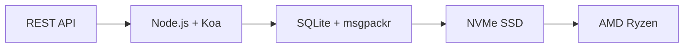

# API Email Hoàn Chỉnh Đầu Tiên: Cách Forward Email Cách Mạng Hóa Quản Lý Email {#the-first-complete-email-api-how-forward-email-revolutionized-email-management}


<p class="lead mt-3">
  <strong>Tóm tắt nhanh:</strong> Chúng tôi đã xây dựng API REST hoàn chỉnh đầu tiên trên thế giới cho quản lý email với khả năng tìm kiếm nâng cao mà không dịch vụ nào khác có. Trong khi Gmail, Outlook và Apple bắt các nhà phát triển phải chịu cảnh địa ngục IMAP hoặc API giới hạn tốc độ, Forward Email cung cấp các thao tác CRUD cực nhanh cho tin nhắn, thư mục, danh bạ và lịch qua giao diện REST thống nhất với hơn 15 tham số tìm kiếm. Đây chính là API email mà các nhà phát triển đã chờ đợi.
</p>


## Mục Lục {#table-of-contents}

* [Vấn Đề API Email](#the-email-api-problem)
* [Những Gì Các Nhà Phát Triển Thực Sự Nói](#what-developers-are-actually-saying)
* [Giải Pháp Cách Mạng Của Forward Email](#forward-emails-revolutionary-solution)
  * [Tại Sao Chúng Tôi Xây Dựng Điều Này](#why-we-built-this)
  * [Xác Thực Đơn Giản](#simple-authentication)
* [20 Điểm Cuối Thay Đổi Mọi Thứ](#20-endpoints-that-change-everything)
  * [Tin Nhắn (5 điểm cuối)](#messages-5-endpoints)
  * [Thư Mục (5 điểm cuối)](#folders-5-endpoints)
  * [Danh Bạ (5 điểm cuối)](#contacts-5-endpoints)
  * [Lịch (5 điểm cuối)](#calendars-5-endpoints)
* [Tìm Kiếm Nâng Cao: Không Dịch Vụ Nào Sánh Kịp](#advanced-search-no-other-service-compares)
  * [Cảnh Quan API Tìm Kiếm Đang Bị Hỏng](#the-search-api-landscape-is-broken)
  * [API Tìm Kiếm Cách Mạng Của Forward Email](#forward-emails-revolutionary-search-api)
  * [Ví Dụ Tìm Kiếm Thực Tế](#real-world-search-examples)
  * [Ưu Thế Về Hiệu Suất](#performance-advantages)
  * [Tính Năng Tìm Kiếm Không Ai Có](#search-features-no-one-else-has)
  * [Tại Sao Điều Này Quan Trọng Với Các Nhà Phát Triển](#why-this-matters-for-developers)
  * [Triển Khai Kỹ Thuật](#the-technical-implementation)
* [Kiến Trúc Hiệu Suất Cực Nhanh](#blazing-fast-performance-architecture)
  * [Tiêu Chuẩn Hiệu Suất](#performance-benchmarks)
  * [Kiến Trúc Ưu Tiên Quyền Riêng Tư](#privacy-first-architecture)
* [Tại Sao Chúng Tôi Khác Biệt: So Sánh Toàn Diện](#why-were-different-the-complete-comparison)
  * [Hạn Chế Của Các Nhà Cung Cấp Lớn](#major-provider-limitations)
  * [Ưu Điểm Của Forward Email](#forward-email-advantages)
  * [Vấn Đề Minh Bạch Mã Nguồn Mở](#the-open-source-transparency-problem)
* [Hơn 30 Ví Dụ Tích Hợp Thực Tế](#30-real-world-integration-examples)
  * [1. Nâng Cấp Mẫu Liên Hệ WordPress](#1-wordpress-contact-form-enhancement)
  * [2. Thay Thế Zapier Cho Tự Động Hóa Email](#2-zapier-alternative-for-email-automation)
  * [3. Đồng Bộ Email CRM](#3-crm-email-synchronization)
  * [4. Xử Lý Đơn Hàng Thương Mại Điện Tử](#4-e-commerce-order-processing)
  * [5. Tích Hợp Phiếu Hỗ Trợ](#5-support-ticket-integration)
  * [6. Hệ Thống Quản Lý Bản Tin](#6-newsletter-management-system)
  * [7. Quản Lý Công Việc Qua Email](#7-email-based-task-management)
  * [8. Tổng Hợp Email Đa Tài Khoản](#8-multi-account-email-aggregation)
  * [9. Bảng Điều Khiển Phân Tích Email Nâng Cao](#9-advanced-email-analytics-dashboard)
  * [10. Lưu Trữ Email Thông Minh](#10-smart-email-archiving)
  * [11. Tích Hợp Email Với Lịch](#11-email-to-calendar-integration)
  * [12. Sao Lưu Và Tuân Thủ Email](#12-email-backup-and-compliance)
  * [13. Quản Lý Nội Dung Qua Email](#13-email-based-content-management)
  * [14. Quản Lý Mẫu Email](#14-email-template-management)
  * [15. Tự Động Hóa Quy Trình Qua Email](#15-email-based-workflow-automation)
  * [16. Giám Sát Bảo Mật Email](#16-email-security-monitoring)
  * [17. Thu Thập Khảo Sát Qua Email](#17-email-based-survey-collection)
  * [18. Giám Sát Hiệu Suất Email](#18-email-performance-monitoring)
  * [19. Đánh Giá Khách Hàng Tiềm Năng Qua Email](#19-email-based-lead-qualification)
  * [20. Quản Lý Dự Án Qua Email](#20-email-based-project-management)
  * [21. Quản Lý Tồn Kho Qua Email](#21-email-based-inventory-management)
  * [22. Xử Lý Hóa Đơn Qua Email](#22-email-based-invoice-processing)
  * [23. Đăng Ký Sự Kiện Qua Email](#23-email-based-event-registration)
  * [24. Quy Trình Phê Duyệt Tài Liệu Qua Email](#24-email-based-document-approval-workflow)
  * [25. Phân Tích Phản Hồi Khách Hàng Qua Email](#25-email-based-customer-feedback-analysis)
  * [26. Quy Trình Tuyển Dụng Qua Email](#26-email-based-recruitment-pipeline)
  * [27. Xử Lý Báo Cáo Chi Phí Qua Email](#27-email-based-expense-report-processing)
  * [28. Báo Cáo Đảm Bảo Chất Lượng Qua Email](#28-email-based-quality-assurance-reporting)
  * [29. Quản Lý Nhà Cung Cấp Qua Email](#29-email-based-vendor-management)
  * [30. Giám Sát Mạng Xã Hội Qua Email](#30-email-based-social-media-monitoring)
* [Bắt Đầu](#getting-started)
  * [1. Tạo Tài Khoản Forward Email Của Bạn](#1-create-your-forward-email-account)
  * [2. Tạo Thông Tin API](#2-generate-api-credentials)
  * [3. Thực Hiện Lần Gọi API Đầu Tiên](#3-make-your-first-api-call)
  * [4. Khám Phá Tài Liệu](#4-explore-the-documentation)
* [Tài Nguyên Kỹ Thuật](#technical-resources)
## Vấn Đề API Email {#the-email-api-problem}

API email về cơ bản là hỏng. Chấm hết.

Mỗi nhà cung cấp email lớn đều bắt các nhà phát triển phải chọn một trong hai lựa chọn tồi tệ:

1. **Địa ngục IMAP**: Vật lộn với giao thức 30 năm tuổi được thiết kế cho các ứng dụng máy tính để bàn, không phải ứng dụng hiện đại
2. **API bị hạn chế**: API chỉ đọc, giới hạn tần suất, phức tạp với OAuth không thể quản lý dữ liệu email thực tế của bạn

Kết quả? Các nhà phát triển hoặc từ bỏ hoàn toàn việc tích hợp email hoặc tốn hàng tuần xây dựng các lớp bao IMAP mong manh liên tục bị lỗi.

> \[!WARNING]
> **Bí mật bẩn thỉu**: Hầu hết "API email" chỉ là API gửi thư. Bạn không thể lập trình để tổ chức thư mục, đồng bộ danh bạ, hoặc quản lý lịch qua một giao diện REST đơn giản. Cho đến bây giờ.


## Những Gì Các Nhà Phát Triển Thực Sự Nói {#what-developers-are-actually-saying}

Sự thất vọng là có thật và được ghi nhận khắp nơi:

> "Gần đây tôi đã cố gắng tích hợp Gmail vào ứng dụng của mình, và tôi đã dành quá nhiều thời gian cho nó. Tôi quyết định không đáng để hỗ trợ Gmail."
>
> *- [Nhà phát triển Hacker News](https://news.ycombinator.com/item?id=42106944), 147 lượt thích*

> "Tất cả các API email đều tầm thường sao? Chúng có vẻ bị giới hạn hoặc hạn chế theo một cách nào đó."
>
> *- [Thảo luận Reddit r/SaaS](https://www.reddit.com/r/SaaS/comments/1cm84s7/are_all_email_apis_mediocre/)*

> "Tại sao phát triển email lại phải tệ như vậy?"
>
> *- [Reddit r/webdev](https://www.reddit.com/r/webdev/comments/15trnp2/why_does_email_development_have_to_suck/), 89 bình luận về nỗi đau của nhà phát triển*

> "Điều gì làm cho API Gmail hiệu quả hơn IMAP? Một lý do nữa là API Gmail chỉ cần tải xuống mỗi tin nhắn một lần. Với IMAP, mỗi tin nhắn phải được tải xuống và lập chỉ mục..."
>
> *- [Câu hỏi Stack Overflow](https://stackoverflow.com/questions/25431022/what-makes-the-gmail-api-more-efficient-than-imap) với 47 lượt thích*

Bằng chứng có ở khắp nơi:

* **Vấn đề SMTP WordPress**: [631 vấn đề GitHub](https://github.com/awesomemotive/WP-Mail-SMTP/issues) về thất bại trong việc gửi email
* **Hạn chế Zapier**: [Phàn nàn cộng đồng](https://community.zapier.com/featured-articles-65/email-parser-by-zapier-limitations-and-alternatives-16958) về giới hạn 10 email/giờ và lỗi phát hiện IMAP
* **Dự án API IMAP**: [Nhiều](https://github.com/ewildgoose/imap-api) [dự án mã nguồn mở](https://emailengine.app/) [tồn tại](https://www.npmjs.com/package/imapflow) nhằm "chuyển IMAP sang REST" vì không nhà cung cấp nào cung cấp điều này
* **Sự thất vọng với API Gmail**: [Stack Overflow](https://stackoverflow.com/questions/tagged/gmail-api) có 4,847 câu hỏi gắn thẻ "gmail-api" với các phàn nàn phổ biến về giới hạn tần suất và sự phức tạp


## Giải Pháp Cách Mạng Của Forward Email {#forward-emails-revolutionary-solution}

**Chúng tôi là dịch vụ email đầu tiên cung cấp đầy đủ các thao tác CRUD cho tất cả dữ liệu email qua một API REST thống nhất.**

Đây không chỉ là một API gửi thư nữa. Đây là quyền kiểm soát lập trình hoàn chỉnh đối với:

* **Tin nhắn**: Tạo, đọc, cập nhật, xóa, tìm kiếm, di chuyển, đánh dấu
* **Thư mục**: Quản lý thư mục IMAP đầy đủ qua các điểm cuối REST
* **Danh bạ**: Lưu trữ và đồng bộ danh bạ theo [CardDAV](https://tools.ietf.org/html/rfc6352)
* **Lịch**: Sự kiện và lịch trình theo [CalDAV](https://tools.ietf.org/html/rfc4791)

### Tại Sao Chúng Tôi Xây Dựng Điều Này {#why-we-built-this}

**Vấn đề**: Mỗi nhà cung cấp email đều coi email như một hộp đen. Bạn có thể gửi email, có thể đọc chúng với OAuth phức tạp, nhưng bạn không thể thực sự *quản lý* dữ liệu email của mình một cách lập trình.

**Tầm nhìn của chúng tôi**: Email nên dễ tích hợp như bất kỳ API hiện đại nào. Không thư viện IMAP. Không phức tạp OAuth. Không ác mộng giới hạn tần suất. Chỉ đơn giản là các điểm cuối REST hoạt động.

**Kết quả**: Dịch vụ email đầu tiên nơi bạn có thể xây dựng một ứng dụng email hoàn chỉnh, tích hợp CRM, hoặc hệ thống tự động hóa chỉ bằng các yêu cầu HTTP.

### Xác Thực Đơn Giản {#simple-authentication}

Không [phức tạp OAuth](https://oauth.net/2/). Không [mật khẩu ứng dụng riêng biệt](https://support.google.com/accounts/answer/185833). Chỉ cần thông tin đăng nhập bí danh của bạn:

```bash
curl -u "alias@yourdomain.com:password" \
  https://api.forwardemail.net/v1/messages
```
## 20 Điểm cuối Thay Đổi Mọi Thứ {#20-endpoints-that-change-everything}

### Tin nhắn (5 điểm cuối) {#messages-5-endpoints}

* `GET /v1/messages` - Liệt kê tin nhắn với bộ lọc (`?folder=`, `?is_unread=`, `?is_flagged=`)
* `POST /v1/messages` - Gửi tin nhắn mới trực tiếp vào thư mục
* `GET /v1/messages/:id` - Lấy tin nhắn cụ thể với đầy đủ siêu dữ liệu
* `PUT /v1/messages/:id` - Cập nhật tin nhắn (cờ, thư mục, trạng thái đã đọc)
* `DELETE /v1/messages/:id` - Xóa tin nhắn vĩnh viễn

### Thư mục (5 điểm cuối) {#folders-5-endpoints}

* `GET /v1/folders` - Liệt kê tất cả thư mục với trạng thái đăng ký
* `POST /v1/folders` - Tạo thư mục mới với thuộc tính tùy chỉnh
* `GET /v1/folders/:id` - Lấy chi tiết thư mục và số lượng tin nhắn
* `PUT /v1/folders/:id` - Cập nhật thuộc tính thư mục và đăng ký
* `DELETE /v1/folders/:id` - Xóa thư mục và xử lý di chuyển tin nhắn

### Danh bạ (5 điểm cuối) {#contacts-5-endpoints}

* `GET /v1/contacts` - Liệt kê danh bạ với tìm kiếm và phân trang
* `POST /v1/contacts` - Tạo danh bạ mới với hỗ trợ đầy đủ vCard
* `GET /v1/contacts/:id` - Lấy danh bạ với tất cả trường và siêu dữ liệu
* `PUT /v1/contacts/:id` - Cập nhật thông tin danh bạ với xác thực ETag
* `DELETE /v1/contacts/:id` - Xóa danh bạ với xử lý liên quan

### Lịch (5 điểm cuối) {#calendars-5-endpoints}

* `GET /v1/calendars` - Liệt kê sự kiện lịch với bộ lọc ngày
* `POST /v1/calendars` - Tạo sự kiện lịch với người tham dự và lặp lại
* `GET /v1/calendars/:id` - Lấy chi tiết sự kiện với xử lý múi giờ
* `PUT /v1/calendars/:id` - Cập nhật sự kiện với phát hiện xung đột
* `DELETE /v1/calendars/:id` - Xóa sự kiện với thông báo người tham dự


## Tìm kiếm Nâng cao: Không Dịch Vụ Nào Sánh Kịp {#advanced-search-no-other-service-compares}

**Forward Email là dịch vụ email duy nhất cung cấp tìm kiếm toàn diện, có thể lập trình trên tất cả các trường tin nhắn thông qua REST API.**

Trong khi các nhà cung cấp khác chỉ cung cấp bộ lọc cơ bản, chúng tôi đã xây dựng API tìm kiếm email tiên tiến nhất từng được tạo ra. Không API Gmail, API Outlook hay bất kỳ dịch vụ nào khác có thể sánh kịp khả năng tìm kiếm của chúng tôi.

### Cảnh Quan API Tìm Kiếm Đang Bị Phá Vỡ {#the-search-api-landscape-is-broken}

**Hạn chế Tìm kiếm API Gmail:**

* ✅ Chỉ tham số `q` cơ bản
* ❌ Không tìm kiếm theo trường cụ thể
* ❌ Không lọc theo khoảng ngày
* ❌ Không lọc theo kích thước
* ❌ Không lọc theo tệp đính kèm
* ❌ Giới hạn cú pháp tìm kiếm của Gmail

**Hạn chế Tìm kiếm API Outlook:**

* ✅ Tham số `$search` cơ bản
* ❌ Không nhắm mục tiêu trường nâng cao
* ❌ Không kết hợp truy vấn phức tạp
* ❌ Giới hạn tốc độ nghiêm ngặt
* ❌ Cần cú pháp OData phức tạp

**Apple iCloud:**

* ❌ Không có API
* ❌ Chỉ tìm kiếm IMAP (nếu bạn có thể làm nó hoạt động)

**ProtonMail & Tuta:**

* ❌ Không có API công khai
* ❌ Không có khả năng tìm kiếm lập trình

### API Tìm Kiếm Cách Mạng của Forward Email {#forward-emails-revolutionary-search-api}

**Chúng tôi cung cấp hơn 15 tham số tìm kiếm mà không dịch vụ nào có:**

| Khả năng Tìm kiếm             | Forward Email                          | Gmail API    | Outlook API        | Khác   |
| ------------------------------ | -------------------------------------- | ------------ | ------------------ | ------ |
| **Tìm kiếm theo trường cụ thể** | ✅ Chủ đề, nội dung, người gửi, người nhận, cc, tiêu đề | ❌            | ❌                  | ❌      |
| **Tìm kiếm tổng quát đa trường** | ✅ `?search=` trên tất cả các trường     | ✅ Cơ bản `q=` | ✅ Cơ bản `$search=` | ❌      |
| **Lọc theo khoảng ngày**       | ✅ `?since=` & `?before=`               | ❌            | ❌                  | ❌      |
| **Lọc theo kích thước**        | ✅ `?min_size=` & `?max_size=`          | ❌            | ❌                  | ❌      |
| **Lọc theo tệp đính kèm**      | ✅ `?has_attachments=true/false`        | ❌            | ❌                  | ❌      |
| **Tìm kiếm tiêu đề**           | ✅ `?headers=X-Priority`                | ❌            | ❌                  | ❌      |
| **Tìm kiếm theo ID tin nhắn** | ✅ `?message_id=abc123`                 | ❌            | ❌                  | ❌      |
| **Kết hợp bộ lọc**             | ✅ Nhiều tham số với logic AND          | ❌            | ❌                  | ❌      |
| **Không phân biệt chữ hoa/thường** | ✅ Tất cả tìm kiếm                     | ✅            | ✅                  | ❌      |
| **Hỗ trợ phân trang**          | ✅ Hoạt động với tất cả tham số tìm kiếm | ✅            | ✅                  | ❌      |
### Ví dụ Tìm kiếm Thực tế {#real-world-search-examples}

**Tìm Tất cả Hóa đơn từ Quý trước:**

```bash
# Forward Email - Đơn giản và mạnh mẽ
GET /v1/messages?subject=invoice&since=2024-01-01T00:00:00Z&before=2024-04-01T00:00:00Z

# Gmail API - Không thể với tìm kiếm giới hạn của họ
# Không có lọc theo khoảng thời gian

# Outlook API - Cú pháp OData phức tạp, chức năng hạn chế
GET /me/messages?$search="invoice"&$filter=receivedDateTime ge 2024-01-01T00:00:00Z
```

**Tìm kiếm Tệp đính kèm Lớn từ Người gửi Cụ thể:**

```bash
# Forward Email - Lọc toàn diện
GET /v1/messages?from=finance@company.com&has_attachments=true&min_size=1000000

# Gmail API - Không thể lọc theo kích thước hoặc tệp đính kèm theo lập trình
# Outlook API - Không có lọc kích thước
# Khác - Không có API sẵn có
```

**Tìm kiếm Phức tạp Nhiều Trường:**

```bash
# Forward Email - Khả năng truy vấn nâng cao
GET /v1/messages?body=quarterly&from=manager&is_flagged=true&folder=Reports

# Gmail API - Giới hạn chỉ tìm kiếm văn bản cơ bản
GET /gmail/v1/users/me/messages?q=quarterly

# Outlook API - Tìm kiếm cơ bản không nhắm mục tiêu trường
GET /me/messages?$search="quarterly"
```

### Ưu điểm Hiệu suất {#performance-advantages}

**Hiệu suất Tìm kiếm Forward Email:**

* ⚡ **Thời gian phản hồi dưới 100ms** cho các tìm kiếm phức tạp
* 🔍 **Tối ưu Regex** với lập chỉ mục đúng cách
* 📊 **Thực thi truy vấn song song** cho đếm và dữ liệu
* 💾 **Sử dụng bộ nhớ hiệu quả** với truy vấn gọn nhẹ

**Vấn đề Hiệu suất của Đối thủ:**

* 🐌 **Gmail API**: Giới hạn tốc độ 250 đơn vị hạn mức mỗi người dùng mỗi giây
* 🐌 **Outlook API**: Giới hạn nghiêm ngặt với yêu cầu giảm tải phức tạp
* 🐌 **Khác**: Không có API để so sánh

### Tính năng Tìm kiếm Không Ai Có {#search-features-no-one-else-has}

#### 1. Tìm kiếm Cụ thể theo Header {#1-header-specific-search}

```bash
# Tìm tin nhắn với header cụ thể
GET /v1/messages?headers=X-Priority:1
GET /v1/messages?headers=X-Spam-Score
```

#### 2. Trí tuệ Dựa trên Kích thước {#2-size-based-intelligence}

```bash
# Tìm email bản tin (thường lớn)
GET /v1/messages?min_size=50000&from=newsletter

# Tìm phản hồi nhanh (thường nhỏ)
GET /v1/messages?max_size=1000&to=support
```

#### 3. Quy trình Làm việc Dựa trên Tệp đính kèm {#3-attachment-based-workflows}

```bash
# Tìm tất cả tài liệu gửi cho nhóm pháp lý
GET /v1/messages?to=legal&has_attachments=true&body=contract

# Tìm email không có tệp đính kèm để dọn dẹp
GET /v1/messages?has_attachments=false&before=2023-01-01T00:00:00Z
```

#### 4. Kết hợp Logic Kinh doanh {#4-combined-business-logic}

```bash
# Tìm tin nhắn đánh dấu khẩn cấp từ VIP có tệp đính kèm
GET /v1/messages?is_flagged=true&from=ceo&has_attachments=true&subject=urgent
```

### Tại sao Điều này Quan trọng với Nhà phát triển {#why-this-matters-for-developers}

**Xây dựng Ứng dụng Trước đây Không Thể:**

1. **Phân tích Email Nâng cao**: Phân tích mẫu email theo kích thước, người gửi, nội dung
2. **Quản lý Email Thông minh**: Tự động tổ chức dựa trên tiêu chí phức tạp
3. **Tuân thủ và Khám phá**: Tìm email cụ thể cho yêu cầu pháp lý
4. **Trí tuệ Kinh doanh**: Trích xuất thông tin từ mẫu giao tiếp email
5. **Quy trình Tự động**: Kích hoạt hành động dựa trên bộ lọc email tinh vi

### Triển khai Kỹ thuật {#the-technical-implementation}

API tìm kiếm của chúng tôi sử dụng:

* **Tối ưu Regex** với chiến lược lập chỉ mục đúng
* **Thực thi song song** để tăng hiệu suất
* **Xác thực đầu vào** để bảo mật
* **Xử lý lỗi toàn diện** để đảm bảo độ tin cậy

```javascript
// Ví dụ: Triển khai tìm kiếm phức tạp
const searchConditions = [];

if (ctx.query.subject) {
  searchConditions.push({
    subject: { $regex: ctx.query.subject, $options: 'i' }
  });
}

if (ctx.query.from) {
  searchConditions.push({
    $or: [
      { 'from.address': { $regex: ctx.query.from, $options: 'i' } },
      { 'from.name': { $regex: ctx.query.from, $options: 'i' } }
    ]
  });
}

// Kết hợp với logic AND
if (searchConditions.length > 0) {
  query.$and = searchConditions;
}
```

> \[!TIP]
> **Lợi thế Nhà phát triển**: Với API tìm kiếm của Forward Email, bạn có thể xây dựng ứng dụng email có chức năng tương đương với các client trên máy tính để bàn trong khi vẫn giữ được sự đơn giản của REST API.
## Kiến Trúc Hiệu Suất Siêu Nhanh {#blazing-fast-performance-architecture}

Ngăn xếp kỹ thuật của chúng tôi được xây dựng để đạt tốc độ và độ tin cậy:


```mermaid
graph LR
    A[REST API] --> B[Node.js + Koa]
    B --> C[SQLite + msgpackr]
    C --> D[NVMe SSD]
    D --> E[AMD Ryzen]
```

### Các Chỉ Số Hiệu Suất {#performance-benchmarks}

**Tại Sao Chúng Tôi Nhanh Như Chớp:**

| Thành phần  | Công nghệ                                                                        | Lợi ích Hiệu Suất                           |
| ------------ | --------------------------------------------------------------------------------- | --------------------------------------------- |
| **Lưu trữ**  | [NVMe SSD](https://en.wikipedia.org/wiki/NVM_Express)                             | Nhanh gấp 10 lần so với SATA truyền thống    |
| **Cơ sở dữ liệu** | [SQLite](https://sqlite.org/) + [msgpackr](https://github.com/kriszyp/msgpackr)   | Không độ trễ mạng, tối ưu hóa tuần tự hóa     |
| **Phần cứng** | [AMD Ryzen](https://www.amd.com/en/products/processors/desktops/ryzen) bare metal | Không có chi phí ảo hóa                       |
| **Bộ nhớ đệm**  | Trong bộ nhớ + lưu trữ bền vững                                                  | Thời gian phản hồi dưới mili giây             |
| **Sao lưu**  | [Cloudflare R2](https://www.cloudflare.com/products/r2/) được mã hóa              | Độ tin cậy cấp doanh nghiệp                   |

**Số Liệu Hiệu Suất Thực Tế:**

* **Thời gian phản hồi API**: trung bình < 50ms
* **Truy xuất tin nhắn**: < 10ms cho tin nhắn đã được lưu trong bộ nhớ đệm
* **Thao tác thư mục**: < 5ms cho các thao tác metadata
* **Đồng bộ danh bạ**: hơn 1000 liên hệ/giây
* **Thời gian hoạt động**: 99.99% SLA với hạ tầng dự phòng

### Kiến Trúc Ưu Tiên Bảo Mật {#privacy-first-architecture}

**Thiết Kế Không Kiến Thức**: Chỉ bạn mới có quyền truy cập với mật khẩu IMAP của bạn - chúng tôi không thể đọc email của bạn. [Kiến trúc không kiến thức](https://forwardemail.net/en/security) của chúng tôi đảm bảo sự riêng tư tuyệt đối đồng thời mang lại hiệu suất vượt trội.


## Tại Sao Chúng Tôi Khác Biệt: So Sánh Toàn Diện {#why-were-different-the-complete-comparison}

### Hạn Chế Của Các Nhà Cung Cấp Chính {#major-provider-limitations}

| Nhà cung cấp    | Vấn đề chính                             | Hạn chế cụ thể                                                                                                                                                                                                                                                                                                                                                                                                                                                 |
| ---------------- | ----------------------------------------- | -------------------------------------------------------------------------------------------------------------------------------------------------------------------------------------------------------------------------------------------------------------------------------------------------------------------------------------------------------------------------------------------------------------------------------------------------------------------- |
| **Gmail API**    | Chỉ đọc, OAuth phức tạp, API riêng biệt   | • [Không thể sửa đổi tin nhắn hiện có](https://developers.google.com/gmail/api/reference/rest/v1/users.messages)<br>• [Nhãn ≠ thư mục](https://developers.google.com/gmail/api/reference/rest/v1/users.labels)<br>• [Giới hạn 1 tỷ đơn vị hạn mức/ngày](https://developers.google.com/gmail/api/reference/quota)<br>• [Yêu cầu API riêng biệt](https://developers.google.com/workspace) cho danh bạ/lịch                                                           |
| **Outlook API**  | Bị ngưng, gây nhầm lẫn, tập trung doanh nghiệp | • [Các điểm cuối REST bị ngưng tháng 3 năm 2024](https://learn.microsoft.com/en-us/outlook/rest/compare-graph)<br>• [Nhiều API gây nhầm lẫn](https://learn.microsoft.com/en-us/office/client-developer/outlook/selecting-an-api-or-technology-for-developing-solutions-for-outlook) (EWS, Graph, REST)<br>• [Độ phức tạp Microsoft Graph](https://learn.microsoft.com/en-us/graph/overview)<br>• [Giới hạn truy cập nghiêm ngặt](https://learn.microsoft.com/en-us/graph/throttling) |
| **Apple iCloud** | Không có API công khai                   | • [Không có API công khai](https://support.apple.com/en-us/102654)<br>• [Chỉ IMAP với giới hạn 1000 email/ngày](https://support.apple.com/en-us/102654)<br>• [Yêu cầu mật khẩu ứng dụng riêng biệt](https://support.apple.com/en-us/102654)<br>• [Giới hạn 500 người nhận mỗi tin nhắn](https://support.apple.com/en-us/102654)                                                                                                                                              |
| **ProtonMail**   | Không có API, tuyên bố mã nguồn mở sai lệch | • [Không có API công khai](https://proton.me/support/protonmail-bridge-clients)<br>• [Cần phần mềm Bridge](https://proton.me/mail/bridge) để truy cập IMAP<br>• [Tuyên bố "mã nguồn mở"](https://proton.me/blog/open-source) nhưng [mã máy chủ là độc quyền](https://github.com/ProtonMail)<br>• [Chỉ giới hạn cho các gói trả phí](https://proton.me/pricing)                                                                                                         |
| **Tuta**         | Không có API, minh bạch gây hiểu nhầm     | • [Không có REST API để quản lý email](https://tuta.com/support#technical)<br>• [Tuyên bố "mã nguồn mở"](https://tuta.com/blog/posts/open-source-email) nhưng [phần backend đóng](https://github.com/tutao/tutanota)<br>• [Không hỗ trợ IMAP/SMTP](https://tuta.com/support#imap)<br>• [Mã hóa độc quyền](https://tuta.com/encryption) ngăn cản tích hợp chuẩn                                                                                               |
| **Zapier Email** | Giới hạn tốc độ nghiêm trọng              | • [Giới hạn 10 email mỗi giờ](https://help.zapier.com/hc/en-us/articles/8496181555597-Email-Parser-by-Zapier-limitations-and-alternatives)<br>• [Không truy cập thư mục IMAP](https://help.zapier.com/hc/en-us/articles/8496181555597-Email-Parser-by-Zapier-limitations-and-alternatives)<br>• [Khả năng phân tích hạn chế](https://help.zapier.com/hc/en-us/articles/8496181555597-Email-Parser-by-Zapier-limitations-and-alternatives)                                 |
### Lợi Ích Của Chuyển Tiếp Email {#forward-email-advantages}

| Tính năng          | Chuyển Tiếp Email                                                                             | Đối Thủ Cạnh Tranh                        |
| ------------------ | -------------------------------------------------------------------------------------------- | ----------------------------------------- |
| **CRUD Hoàn Chỉnh** | ✅ Tạo, đọc, cập nhật, xóa đầy đủ cho tất cả dữ liệu                                         | ❌ Chỉ đọc hoặc thao tác giới hạn           |
| **API Thống Nhất**  | ✅ Tin nhắn, thư mục, danh bạ, lịch trong một API duy nhất                                   | ❌ API riêng biệt hoặc thiếu tính năng      |
| **Xác Thực Đơn Giản** | ✅ Xác thực cơ bản với thông tin đăng nhập bí danh                                         | ❌ OAuth phức tạp với nhiều phạm vi         |
| **Không Giới Hạn Tốc Độ** | ✅ Giới hạn rộng rãi thiết kế cho ứng dụng thực tế                                      | ❌ Hạn ngạch nghiêm ngặt gây gián đoạn quy trình |
| **Tự Lưu Trữ**     | ✅ [Tùy chọn tự lưu trữ hoàn chỉnh](https://forwardemail.net/en/blog/docs/self-hosted-solution) | ❌ Chỉ khóa nhà cung cấp                    |
| **Bảo Mật**        | ✅ Không biết gì, mã hóa, riêng tư                                                           | ❌ Khai thác dữ liệu và lo ngại về quyền riêng tư |
| **Hiệu Suất**      | ✅ Phản hồi dưới 50ms, lưu trữ NVMe                                                          | ❌ Độ trễ mạng, giới hạn băng thông         |

### Vấn Đề Minh Bạch Mã Nguồn Mở {#the-open-source-transparency-problem}

**ProtonMail và Tuta tự quảng cáo là "mã nguồn mở" và "minh bạch," nhưng đây là chiêu tiếp thị gây hiểu lầm vi phạm nguyên tắc bảo mật hiện đại.**

> \[!WARNING]
> **Tuyên Bố Minh Bạch Sai Lệch**: Cả ProtonMail và Tuta đều quảng bá mạnh mẽ "mã nguồn mở" trong khi giữ mã máy chủ quan trọng nhất là độc quyền và đóng.

**Sự Lừa Dối Của ProtonMail:**

* **Tuyên bố**: ["Chúng tôi là mã nguồn mở"](https://proton.me/blog/open-source) được quảng cáo nổi bật
* **Thực tế**: [Mã máy chủ hoàn toàn độc quyền](https://github.com/ProtonMail) - chỉ ứng dụng khách là mã nguồn mở
* **Ảnh hưởng**: Người dùng không thể xác minh mã hóa máy chủ, xử lý dữ liệu hay tuyên bố bảo mật
* **Vi phạm Minh bạch**: Không có cách nào kiểm tra hệ thống xử lý và lưu trữ email thực tế

**Chiêu Tiếp Thị Gây Hiểu Lầm Của Tuta:**

* **Tuyên bố**: ["Email mã nguồn mở"](https://tuta.com/blog/posts/open-source-email) là điểm bán hàng chính
* **Thực tế**: [Hạ tầng backend là mã đóng](https://github.com/tutao/tutanota) - chỉ frontend được công khai
* **Ảnh hưởng**: Mã hóa độc quyền ngăn cản các giao thức email chuẩn (IMAP/SMTP)
* **Chiến lược Khóa Nhà Cung Cấp**: Mã hóa tùy chỉnh buộc phụ thuộc nhà cung cấp

**Tại Sao Điều Này Quan Trọng Với Bảo Mật Hiện Đại:**

Năm 2025, bảo mật thực sự đòi hỏi **minh bạch hoàn toàn**. Khi nhà cung cấp email tuyên bố "mã nguồn mở" nhưng giấu mã máy chủ:

1. **Mã hóa không thể kiểm chứng**: Bạn không thể kiểm tra cách dữ liệu được mã hóa thực sự
2. **Thao tác dữ liệu ẩn**: Xử lý dữ liệu máy chủ vẫn là hộp đen
3. **Bảo mật dựa trên niềm tin**: Bạn phải tin tưởng mà không có xác minh
4. **Khóa nhà cung cấp**: Hệ thống độc quyền ngăn cản chuyển đổi dữ liệu

**Minh Bạch Thực Sự Của Forward Email:**

* ✅ **[Mã nguồn mở hoàn chỉnh](https://github.com/forwardemail/forwardemail.net)** - mã máy chủ và khách
* ✅ **[Có thể tự lưu trữ](https://forwardemail.net/en/blog/docs/self-hosted-solution)** - chạy phiên bản riêng của bạn
* ✅ **Giao thức chuẩn** - tương thích IMAP, SMTP, CardDAV, CalDAV
* ✅ **Bảo mật có thể kiểm tra** - từng dòng mã đều có thể xem xét
* ✅ **Không khóa nhà cung cấp** - dữ liệu của bạn, bạn kiểm soát

> \[!TIP]
> **Mã nguồn mở thực sự nghĩa là bạn có thể kiểm chứng mọi tuyên bố.** Với Forward Email, bạn có thể kiểm tra mã hóa, xem xét xử lý dữ liệu, và thậm chí tự chạy phiên bản riêng. Đó mới là minh bạch thật sự.


## Hơn 30 Ví Dụ Tích Hợp Thực Tế {#30-real-world-integration-examples}

### 1. Nâng Cao Mẫu Liên Hệ WordPress {#1-wordpress-contact-form-enhancement}
**Vấn đề**: [Lỗi cấu hình SMTP WordPress](https://github.com/awesomemotive/WP-Mail-SMTP/issues) ([631 vấn đề trên GitHub](https://github.com/awesomemotive/WP-Mail-SMTP/issues))  
**Giải pháp**: Tích hợp API trực tiếp bỏ qua hoàn toàn [SMTP](https://tools.ietf.org/html/rfc5321)

```javascript
// Biểu mẫu liên hệ WordPress lưu vào thư mục Sent
await fetch('https://api.forwardemail.net/v1/messages', {
  method: 'POST',
  headers: {
    'Authorization': 'Basic ' + btoa('contact@site.com:password'),
    'Content-Type': 'application/json'
  },
  body: JSON.stringify({
    to: [{ address: 'owner@site.com' }],
    subject: 'Biểu mẫu liên hệ: ' + formData.subject,
    text: formData.message,
    folder: 'Sent'
  })
});
```

### 2. Giải pháp thay thế Zapier cho Tự động hóa Email {#2-zapier-alternative-for-email-automation}

**Vấn đề**: [Giới hạn 10 email/giờ của Zapier](https://help.zapier.com/hc/en-us/articles/8496181555597-Email-Parser-by-Zapier-limitations-and-alternatives) và [lỗi phát hiện IMAP](https://community.zapier.com/featured-articles-65/email-parser-by-zapier-limitations-and-alternatives-16958)  
**Giải pháp**: Tự động hóa không giới hạn với kiểm soát email đầy đủ

```javascript
// Tự động tổ chức email theo tên miền người gửi
const messages = await fetch('/v1/messages?folder=INBOX');
for (const message of messages) {
  const domain = message.from.split('@')[1];
  await fetch(`/v1/messages/${message.id}`, {
    method: 'PUT',
    body: JSON.stringify({ folder: `Clients/${domain}` })
  });
}
```

### 3. Đồng bộ Email CRM {#3-crm-email-synchronization}

**Vấn đề**: Quản lý thủ công liên hệ giữa email và [hệ thống CRM](https://en.wikipedia.org/wiki/Customer_relationship_management)  
**Giải pháp**: Đồng bộ hai chiều với API liên hệ [CardDAV](https://tools.ietf.org/html/rfc6352)

```javascript
// Đồng bộ liên hệ email mới vào CRM
const newContacts = await fetch('/v1/contacts');
for (const contact of newContacts) {
  await crmAPI.createContact({
    name: contact.name,
    email: contact.email,
    source: 'email_api'
  });
}
```

### 4. Xử lý Đơn hàng Thương mại điện tử {#4-e-commerce-order-processing}

**Vấn đề**: Xử lý email đơn hàng thủ công cho các [nền tảng thương mại điện tử](https://en.wikipedia.org/wiki/E-commerce)  
**Giải pháp**: Quy trình quản lý đơn hàng tự động

```javascript
// Xử lý email xác nhận đơn hàng
const orders = await fetch('/v1/messages?folder=Orders');
const orderEmails = orders.filter(msg =>
  msg.subject.includes('Order Confirmation')
);

for (const order of orderEmails) {
  const orderData = parseOrderEmail(order.text);
  await updateInventory(orderData);
  await fetch(`/v1/messages/${order.id}`, {
    method: 'PUT',
    body: JSON.stringify({ folder: 'Orders/Processed' })
  });
}
```

### 5. Tích hợp Phiếu hỗ trợ {#5-support-ticket-integration}

**Vấn đề**: Chuỗi email phân tán trên các [nền tảng helpdesk](https://en.wikipedia.org/wiki/Help_desk_software)  
**Giải pháp**: Theo dõi chuỗi email hoàn chỉnh

```javascript
// Tạo phiếu hỗ trợ từ chuỗi email
const messages = await fetch('/v1/messages?folder=Support');
const supportEmails = messages.filter(msg =>
  msg.to.some(addr => addr.includes('support@'))
);

for (const email of supportEmails) {
  const ticket = await supportSystem.createTicket({
    subject: email.subject,
    from: email.from,
    body: email.text,
    timestamp: email.date
  });
}
```

### 6. Hệ thống Quản lý Bản tin {#6-newsletter-management-system}

**Vấn đề**: Tích hợp hạn chế với các [nền tảng bản tin](https://en.wikipedia.org/wiki/Email_marketing)  
**Giải pháp**: Quản lý vòng đời người đăng ký hoàn chỉnh

```javascript
// Tự động quản lý đăng ký bản tin
const messages = await fetch('/v1/messages?folder=Newsletter');
const unsubscribes = messages.filter(msg =>
  msg.subject.toLowerCase().includes('unsubscribe')
);

for (const msg of unsubscribes) {
  await removeSubscriber(msg.from);
  await fetch(`/v1/messages/${msg.id}`, {
    method: 'PUT',
    body: JSON.stringify({ folder: 'Newsletter/Unsubscribed' })
  });
}
```

### 7. Quản lý Công việc dựa trên Email {#7-email-based-task-management}

**Vấn đề**: Hộp thư đến quá tải và [theo dõi công việc](https://en.wikipedia.org/wiki/Task_management)  
**Giải pháp**: Chuyển email thành các công việc có thể hành động được
```javascript
// Create tasks from flagged emails
const messages = await fetch('/v1/messages?is_flagged=true');
for (const email of messages) {
  await taskManager.createTask({
    title: email.subject,
    description: email.text,
    assignee: email.to[0].address,
    dueDate: extractDueDate(email.text)
  });
}
```

### 8. Multi-Account Email Aggregation {#8-multi-account-email-aggregation}

**Problem**: Managing [multiple email accounts](https://en.wikipedia.org/wiki/Email_client) across providers
**Solution**: Unified inbox interface

```javascript
// Aggregate emails from multiple accounts
const accounts = ['work@domain.com', 'personal@domain.com'];
const allMessages = [];

for (const account of accounts) {
  const messages = await fetch('/v1/messages', {
    headers: { 'Authorization': getAuth(account) }
  });
  allMessages.push(...messages.map(m => ({ ...m, account })));
}
```

### 9. Advanced Email Analytics Dashboard {#9-advanced-email-analytics-dashboard}

**Problem**: No insights into [email patterns](https://en.wikipedia.org/wiki/Email_analytics) with sophisticated filtering
**Solution**: Custom email analytics using advanced search capabilities

```javascript
// Generate comprehensive email analytics using advanced search
const analytics = {};

// Analyze email volume by sender domain
const messages = await fetch('/v1/messages');
analytics.senderDomains = analyzeSenderDomains(messages);

// Find large attachments consuming storage
const largeAttachments = await fetch('/v1/messages?has_attachments=true&min_size=1000000');
analytics.storageHogs = largeAttachments.map(msg => ({
  subject: msg.subject,
  from: msg.from,
  size: msg.size
}));

// Analyze communication patterns with VIPs
const vipEmails = await fetch('/v1/messages?from=ceo@company.com');
const urgentVipEmails = await fetch('/v1/messages?from=ceo@company.com&subject=urgent');
analytics.vipCommunication = {
  total: vipEmails.length,
  urgent: urgentVipEmails.length,
  urgencyRate: (urgentVipEmails.length / vipEmails.length) * 100
};

// Find unread emails by date range for follow-up
const lastWeek = new Date(Date.now() - 7 * 24 * 60 * 60 * 1000).toISOString();
const unreadRecent = await fetch(`/v1/messages?is_unread=true&since=${lastWeek}`);
analytics.followUpNeeded = unreadRecent.length;

// Analyze email sizes for optimization
const smallEmails = await fetch('/v1/messages?max_size=1000');
const mediumEmails = await fetch('/v1/messages?min_size=1000&max_size=50000');
const largeEmails = await fetch('/v1/messages?min_size=50000');
analytics.sizeDistribution = {
  small: smallEmails.length,
  medium: mediumEmails.length,
  large: largeEmails.length
};

// Search for compliance-related emails
const complianceEmails = await fetch('/v1/messages?body=confidential&has_attachments=true');
analytics.complianceReview = complianceEmails.length;
```

### 10. Smart Email Archiving {#10-smart-email-archiving}

**Problem**: Manual [email organization](https://en.wikipedia.org/wiki/Email_management)
**Solution**: Intelligent email categorization

```javascript
// Auto-archive old emails by category
const messages = await fetch('/v1/messages');
const oldEmails = messages.filter(email =>
  isOlderThan(email.date, 90) // 90 days
);

for (const email of oldEmails) {
  const category = categorizeEmail(email);
  await fetch(`/v1/messages/${email.id}`, {
    method: 'PUT',
    body: JSON.stringify({ folder: `Archive/${category}` })
  });
}
```

### 11. Email-to-Calendar Integration {#11-email-to-calendar-integration}

**Problem**: Manual [calendar event](https://tools.ietf.org/html/rfc4791) creation from emails
**Solution**: Automatic event extraction and creation

```javascript
// Extract meeting details from emails
const messages = await fetch('/v1/messages?folder=Meetings');
const meetingEmails = messages.filter(email =>
  email.subject.toLowerCase().includes('meeting')
);

for (const email of meetingEmails) {
  const meetingData = extractMeetingInfo(email.text);
  if (meetingData.date && meetingData.time) {
    await fetch('/v1/calendars', {
      method: 'POST',
      body: JSON.stringify({
        title: email.subject,
        start: meetingData.datetime,
        attendees: [email.from, ...email.to]
      })
    });
  }
}
```

### 12. Sao lưu Email và Tuân thủ {#12-email-backup-and-compliance}

**Vấn đề**: [Lưu giữ email](https://en.wikipedia.org/wiki/Email_retention_policy) và yêu cầu tuân thủ  
**Giải pháp**: Sao lưu tự động với bảo tồn siêu dữ liệu

```javascript
// Backup emails with full metadata
const allMessages = await fetch('/v1/messages');
const backup = {
  timestamp: new Date(),
  messages: allMessages.map(msg => ({
    id: msg.id,
    subject: msg.subject,
    from: msg.from,
    to: msg.to,
    date: msg.date,
    flags: msg.flags
  }))
};
await saveToComplianceStorage(backup);
```

### 13. Quản lý Nội dung Dựa trên Email {#13-email-based-content-management}

**Vấn đề**: Quản lý các bài gửi nội dung qua email cho các [nền tảng CMS](https://en.wikipedia.org/wiki/Content_management_system)  
**Giải pháp**: Email như hệ thống quản lý nội dung

```javascript
// Process content submissions from email
const messages = await fetch('/v1/messages?folder=Submissions');
const submissions = messages.filter(msg =>
  msg.to.some(addr => addr.includes('submit@'))
);

for (const submission of submissions) {
  const content = parseSubmission(submission.text);
  await cms.createDraft({
    title: submission.subject,
    content: content.body,
    author: submission.from
  });
}
```

### 14. Quản lý Mẫu Email {#14-email-template-management}

**Vấn đề**: Mẫu [email](https://en.wikipedia.org/wiki/Email_template) không đồng nhất trong nhóm  
**Giải pháp**: Hệ thống mẫu tập trung với API

```javascript
// Send templated emails with dynamic content
const template = await getEmailTemplate('welcome');
await fetch('/v1/messages', {
  method: 'POST',
  body: JSON.stringify({
    to: [{ address: newUser.email }],
    subject: template.subject.replace('{{name}}', newUser.name),
    html: template.html.replace('{{name}}', newUser.name),
    folder: 'Sent'
  })
});
```

### 15. Tự động hóa Quy trình làm việc Dựa trên Email {#15-email-based-workflow-automation}

**Vấn đề**: Quy trình [phê duyệt](https://en.wikipedia.org/wiki/Workflow) thủ công qua email  
**Giải pháp**: Kích hoạt quy trình tự động

```javascript
// Process approval emails
const messages = await fetch('/v1/messages?folder=Approvals');
const approvals = messages.filter(msg =>
  msg.subject.includes('APPROVAL')
);

for (const approval of approvals) {
  const decision = parseApprovalDecision(approval.text);
  await workflow.processApproval({
    requestId: extractRequestId(approval.subject),
    decision: decision,
    approver: approval.from
  });
}
```

### 16. Giám sát An ninh Email {#16-email-security-monitoring}

**Vấn đề**: Phát hiện [mối đe dọa an ninh](https://en.wikipedia.org/wiki/Email_security) thủ công  
**Giải pháp**: Phân tích mối đe dọa tự động

```javascript
// Monitor for suspicious emails
const recentEmails = await fetch('/v1/messages');
for (const email of recentEmails) {
  const threatScore = analyzeThreat(email);
  if (threatScore > 0.8) {
    await fetch(`/v1/messages/${email.id}`, {
      method: 'PUT',
      body: JSON.stringify({ folder: 'Security/Quarantine' })
    });
    await alertSecurityTeam(email);
  }
}
```

### 17. Thu thập Khảo sát Dựa trên Email {#17-email-based-survey-collection}

**Vấn đề**: Xử lý phản hồi [khảo sát](https://en.wikipedia.org/wiki/Survey_methodology) thủ công  
**Giải pháp**: Tổng hợp phản hồi tự động

```javascript
// Collect and process survey responses
const messages = await fetch('/v1/messages?folder=Surveys');
const responses = messages.filter(msg =>
  msg.subject.includes('Survey Response')
);

const surveyData = responses.map(email => ({
  respondent: email.from,
  responses: parseSurveyData(email.text),
  timestamp: email.date
}));
await updateSurveyResults(surveyData);
```

### 18. Giám sát Hiệu suất Email {#18-email-performance-monitoring}

**Vấn đề**: Không có khả năng quan sát [hiệu suất gửi email](https://en.wikipedia.org/wiki/Email_deliverability)  
**Giải pháp**: Thống kê email theo thời gian thực

```javascript
// Monitor email delivery performance
const sentEmails = await fetch('/v1/messages?folder=Sent');
const deliveryStats = {
  sent: sentEmails.length,
  bounces: await countBounces(),
  deliveryRate: calculateDeliveryRate()
};
await updateDashboard(deliveryStats);
```
### 19. Đánh Giá Khách Hàng Tiềm Năng Dựa Trên Email {#19-email-based-lead-qualification}

**Vấn đề**: Đánh giá [lead scoring](https://en.wikipedia.org/wiki/Lead_scoring) thủ công từ các tương tác email  
**Giải pháp**: Quy trình đánh giá khách hàng tiềm năng tự động

```javascript
// Score leads based on email engagement
const prospects = await fetch('/v1/contacts');
for (const prospect of prospects) {
  const messages = await fetch('/v1/messages');
  const emails = messages.filter(msg =>
    msg.from.includes(prospect.email)
  );
  const score = calculateEngagementScore(emails);
  await crm.updateLeadScore(prospect.id, score);
}
```

### 20. Quản Lý Dự Án Dựa Trên Email {#20-email-based-project-management}

**Vấn đề**: [Cập nhật dự án](https://en.wikipedia.org/wiki/Project_management) phân tán trên các chuỗi email  
**Giải pháp**: Trung tâm giao tiếp dự án tập trung

```javascript
// Extract project updates from emails
const messages = await fetch('/v1/messages?folder=Projects');
const projectEmails = messages.filter(msg =>
  msg.subject.includes('Project Update')
);

for (const email of projectEmails) {
  const update = parseProjectUpdate(email.text);
  await projectManager.addUpdate({
    project: update.projectId,
    author: email.from,
    content: update.content
  });
}
```

### 21. Quản Lý Tồn Kho Dựa Trên Email {#21-email-based-inventory-management}

**Vấn đề**: Cập nhật tồn kho thủ công từ email nhà cung cấp  
**Giải pháp**: Theo dõi tồn kho tự động từ thông báo email

```javascript
// Process inventory updates from supplier emails
const messages = await fetch('/v1/messages?folder=Suppliers');
const inventoryEmails = messages.filter(msg =>
  msg.subject.includes('Inventory Update') || msg.subject.includes('Stock Alert')
);

for (const email of inventoryEmails) {
  const inventoryData = parseInventoryUpdate(email.text);
  await inventory.updateStock({
    sku: inventoryData.sku,
    quantity: inventoryData.quantity,
    supplier: email.from,
    timestamp: email.date
  });

  // Move to processed folder
  await fetch(`/v1/messages/${email.id}`, {
    method: 'PUT',
    body: JSON.stringify({ folder: 'Suppliers/Processed' })
  });
}
```

### 22. Xử Lý Hóa Đơn Dựa Trên Email {#22-email-based-invoice-processing}

**Vấn đề**: Xử lý [hóa đơn](https://en.wikipedia.org/wiki/Invoice_processing) thủ công và tích hợp kế toán  
**Giải pháp**: Trích xuất hóa đơn tự động và đồng bộ hệ thống kế toán

```javascript
// Extract invoice data from email attachments
const messages = await fetch('/v1/messages?folder=Invoices');
const invoiceEmails = messages.filter(msg =>
  msg.subject.toLowerCase().includes('invoice') && msg.attachments.length > 0
);

for (const email of invoiceEmails) {
  const invoiceData = await extractInvoiceData(email.attachments[0]);
  await accounting.createInvoice({
    vendor: email.from,
    amount: invoiceData.total,
    dueDate: invoiceData.dueDate,
    items: invoiceData.lineItems
  });

  // Flag as processed
  await fetch(`/v1/messages/${email.id}`, {
    method: 'PUT',
    body: JSON.stringify({ flags: ['\\Seen', '\\Flagged'] })
  });
}
```

### 23. Đăng Ký Sự Kiện Dựa Trên Email {#23-email-based-event-registration}

**Vấn đề**: Xử lý đăng ký [sự kiện](https://en.wikipedia.org/wiki/Event_management) thủ công từ phản hồi email  
**Giải pháp**: Quản lý người tham dự tự động và tích hợp lịch

```javascript
// Process event registration emails
const messages = await fetch('/v1/messages?folder=Events');
const registrations = messages.filter(msg =>
  msg.subject.includes('Registration') || msg.subject.includes('RSVP')
);

for (const registration of registrations) {
  const attendeeData = parseRegistration(registration.text);

  // Add to attendee list
  await events.addAttendee({
    event: attendeeData.eventId,
    name: attendeeData.name,
    email: registration.from,
    dietary: attendeeData.dietaryRestrictions
  });

  // Create calendar event for attendee
  await fetch('/v1/calendars', {
    method: 'POST',
    body: JSON.stringify({
      title: attendeeData.eventName,
      start: attendeeData.eventDate,
      attendees: [registration.from]
    })
  });
}
```
### 24. Quy Trình Phê Duyệt Tài Liệu Qua Email {#24-email-based-document-approval-workflow}

**Vấn đề**: Chuỗi [phê duyệt tài liệu](https://en.wikipedia.org/wiki/Document_management_system) phức tạp qua email  
**Giải pháp**: Theo dõi phê duyệt tự động và phiên bản tài liệu

```javascript
// Track document approval workflow
const messages = await fetch('/v1/messages?folder=Approvals');
const approvalEmails = messages.filter(msg =>
  msg.subject.includes('Document Approval')
);

for (const email of approvalEmails) {
  const approval = parseApprovalEmail(email.text);

  await documentSystem.updateApproval({
    documentId: approval.documentId,
    approver: email.from,
    status: approval.decision, // 'approved', 'rejected', 'needs_changes'
    comments: approval.comments,
    timestamp: email.date
  });

  // Check if all approvals complete
  const document = await documentSystem.getDocument(approval.documentId);
  if (document.allApprovalsComplete) {
    await documentSystem.finalizeDocument(approval.documentId);
  }
}
```

### 25. Phân Tích Phản Hồi Khách Hàng Qua Email {#25-email-based-customer-feedback-analysis}

**Vấn đề**: Thu thập và phân tích cảm xúc [phản hồi khách hàng](https://en.wikipedia.org/wiki/Customer_feedback) thủ công  
**Giải pháp**: Xử lý phản hồi tự động và theo dõi cảm xúc

```javascript
// Analyze customer feedback from emails
const messages = await fetch('/v1/messages?folder=Feedback');
const feedbackEmails = messages.filter(msg =>
  msg.to.some(addr => addr.includes('feedback@'))
);

for (const email of feedbackEmails) {
  const sentiment = await analyzeSentiment(email.text);
  const category = categorizeFeeback(email.text);

  await feedback.recordFeedback({
    customer: email.from,
    content: email.text,
    sentiment: sentiment.score, // -1 to 1
    category: category, // 'bug', 'feature', 'complaint', 'praise'
    priority: calculatePriority(sentiment, category),
    timestamp: email.date
  });

  // Auto-escalate negative feedback
  if (sentiment.score < -0.5) {
    await escalateToSupport(email);
  }
}
```

### 26. Quy Trình Tuyển Dụng Qua Email {#26-email-based-recruitment-pipeline}

**Vấn đề**: Theo dõi [tuyển dụng](https://en.wikipedia.org/wiki/Recruitment) và ứng viên thủ công  
**Giải pháp**: Quản lý ứng viên và lên lịch phỏng vấn tự động

```javascript
// Process job application emails
const messages = await fetch('/v1/messages?folder=Careers');
const applications = messages.filter(msg =>
  msg.subject.toLowerCase().includes('application') && msg.attachments.length > 0
);

for (const application of applications) {
  const resume = await parseResume(application.attachments[0]);

  const candidate = await ats.createCandidate({
    name: resume.name,
    email: application.from,
    skills: resume.skills,
    experience: resume.experience,
    position: extractPosition(application.subject)
  });

  // Auto-schedule screening if qualified
  if (candidate.qualificationScore > 0.7) {
    await calendar.scheduleInterview({
      candidateId: candidate.id,
      type: 'phone_screening',
      duration: 30
    });
  }
}
```

### 27. Xử Lý Báo Cáo Chi Phí Qua Email {#27-email-based-expense-report-processing}

**Vấn đề**: Nộp và phê duyệt [báo cáo chi phí](https://en.wikipedia.org/wiki/Expense_report) thủ công  
**Giải pháp**: Trích xuất chi phí và quy trình phê duyệt tự động

```javascript
// Process expense report emails
const messages = await fetch('/v1/messages?folder=Expenses');
const expenseEmails = messages.filter(msg =>
  msg.subject.includes('Expense') && msg.attachments.length > 0
);

for (const email of expenseEmails) {
  const receipts = await processReceipts(email.attachments);

  const expenseReport = await expenses.createReport({
    employee: email.from,
    expenses: receipts.map(receipt => ({
      amount: receipt.total,
      category: receipt.category,
      date: receipt.date,
      merchant: receipt.merchant
    })),
    totalAmount: receipts.reduce((sum, r) => sum + r.total, 0)
  });

  // Auto-approve small amounts
  if (expenseReport.totalAmount < 100) {
    await expenses.approve(expenseReport.id);
  } else {
    await expenses.sendForApproval(expenseReport.id);
  }
}
```
### 28. Báo Cáo Đảm Bảo Chất Lượng Dựa Trên Email {#28-email-based-quality-assurance-reporting}

**Vấn đề**: Theo dõi [đảm bảo chất lượng](https://en.wikipedia.org/wiki/Quality_assurance) thủ công  
**Giải pháp**: Quản lý sự cố QA và theo dõi lỗi tự động

```javascript
// Process QA bug reports from email
const messages = await fetch('/v1/messages?folder=QA');
const bugReports = messages.filter(msg =>
  msg.subject.includes('Bug Report') || msg.subject.includes('QA Issue')
);

for (const report of bugReports) {
  const bugData = parseBugReport(report.text);

  const ticket = await bugTracker.createIssue({
    title: report.subject,
    description: bugData.description,
    severity: bugData.severity,
    steps: bugData.stepsToReproduce,
    reporter: report.from,
    attachments: report.attachments
  });

  // Auto-assign based on component
  const assignee = await getComponentOwner(bugData.component);
  await bugTracker.assign(ticket.id, assignee);

  // Create calendar reminder for follow-up
  await fetch('/v1/calendars', {
    method: 'POST',
    body: JSON.stringify({
      title: `Follow up on ${ticket.id}`,
      start: addDays(new Date(), 3),
      attendees: [assignee]
    })
  });
}
```

### 29. Quản Lý Nhà Cung Cấp Dựa Trên Email {#29-email-based-vendor-management}

**Vấn đề**: Giao tiếp với [nhà cung cấp](https://en.wikipedia.org/wiki/Vendor_management) và theo dõi hợp đồng thủ công  
**Giải pháp**: Quản lý quan hệ nhà cung cấp tự động

```javascript
// Track vendor communications and contracts
const messages = await fetch('/v1/messages?folder=Vendors');
const vendorEmails = messages.filter(msg =>
  isVendorEmail(msg.from)
);

for (const email of vendorEmails) {
  const vendor = await vendors.getByEmail(email.from);

  // Log communication
  await vendors.logCommunication({
    vendorId: vendor.id,
    type: 'email',
    subject: email.subject,
    content: email.text,
    timestamp: email.date
  });

  // Check for contract-related keywords
  if (email.text.includes('contract') || email.text.includes('renewal')) {
    await vendors.flagForContractReview({
      vendorId: vendor.id,
      emailId: email.id,
      priority: 'high'
    });

    // Create task for procurement team
    await tasks.create({
      title: `Review contract communication from ${vendor.name}`,
      assignee: 'procurement@company.com',
      dueDate: addDays(new Date(), 2)
    });
  }
}
```

### 30. Giám Sát Mạng Xã Hội Dựa Trên Email {#30-email-based-social-media-monitoring}

**Vấn đề**: Theo dõi và phản hồi các đề cập trên [mạng xã hội](https://en.wikipedia.org/wiki/Social_media_monitoring) thủ công  
**Giải pháp**: Xử lý cảnh báo mạng xã hội tự động và phối hợp phản hồi

```javascript
// Process social media alerts from email notifications
const messages = await fetch('/v1/messages?folder=Social');
const socialAlerts = messages.filter(msg =>
  msg.from.includes('alerts@') || msg.subject.includes('Social Mention')
);

for (const alert of socialAlerts) {
  const mention = parseSocialMention(alert.text);

  await socialMedia.recordMention({
    platform: mention.platform,
    author: mention.author,
    content: mention.content,
    sentiment: mention.sentiment,
    reach: mention.followerCount,
    url: mention.url
  });

  // Auto-escalate negative mentions with high reach
  if (mention.sentiment < -0.5 && mention.followerCount > 10000) {
    await socialMedia.escalateToTeam({
      mentionId: mention.id,
      priority: 'urgent',
      assignee: 'social-media-manager@company.com'
    });

    // Create calendar reminder for immediate response
    await fetch('/v1/calendars', {
      method: 'POST',
      body: JSON.stringify({
        title: `Urgent: Respond to negative social mention`,
        start: addMinutes(new Date(), 30),
        attendees: ['social-media-manager@company.com']
      })
    });
  }
}
```


## Bắt Đầu {#getting-started}

### 1. Tạo Tài Khoản Email Chuyển Tiếp Của Bạn {#1-create-your-forward-email-account}

Đăng ký tại [forwardemail.net](https://forwardemail.net) và xác minh tên miền của bạn.

### 2. Tạo Thông Tin Đăng Nhập API {#2-generate-api-credentials}

Email bí danh và mật khẩu của bạn đóng vai trò là thông tin đăng nhập API - không cần thiết lập thêm.
### 3. Thực Hiện Cuộc Gọi API Đầu Tiên Của Bạn {#3-make-your-first-api-call}

```bash
# Liệt kê các tin nhắn của bạn
curl -u "your-alias@domain.com:password" \
  https://api.forwardemail.net/v1/messages

# Tạo một liên hệ mới
curl -u "your-alias@domain.com:password" \
  -X POST \
  -H "Content-Type: application/json" \
  -d '{"fullName":"John Doe","emails":[{"value":"john@example.com"}]}' \
  https://api.forwardemail.net/v1/contacts
```

### 4. Khám Phá Tài Liệu {#4-explore-the-documentation}

Truy cập [forwardemail.net/en/email-api](https://forwardemail.net/en/email-api) để xem tài liệu API đầy đủ với các ví dụ tương tác.


## Tài Nguyên Kỹ Thuật {#technical-resources}

* **[Tài Liệu API Đầy Đủ](https://forwardemail.net/en/email-api)** - Đặc tả OpenAPI 3.0 tương tác
* **[Hướng Dẫn Tự Lưu Trữ](https://forwardemail.net/en/blog/docs/self-hosted-solution)** - Triển khai Forward Email trên hạ tầng của bạn
* **[Sách Trắng Bảo Mật](https://forwardemail.net/technical-whitepaper.pdf)** - Kiến trúc kỹ thuật và chi tiết bảo mật
* **[Kho Mã Nguồn GitHub](https://github.com/forwardemail/forwardemail.net)** - Mã nguồn mở
* **[Hỗ Trợ Nhà Phát Triển](mailto:api@forwardemail.net)** - Truy cập trực tiếp đội ngũ kỹ sư của chúng tôi

---

**Sẵn sàng cách mạng hóa tích hợp email của bạn?** [Bắt đầu xây dựng với API của Forward Email ngay hôm nay](https://forwardemail.net/en/email-api) và trải nghiệm nền tảng quản lý email hoàn chỉnh đầu tiên được thiết kế dành cho nhà phát triển.

*Forward Email: Dịch vụ email cuối cùng hiểu đúng về API.*
