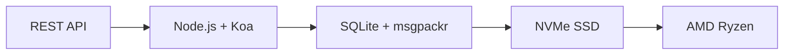

# 第一个完整的电子邮件 API：转发电子邮件如何彻底改变电子邮件管理 {#the-first-complete-email-api-how-forward-email-revolutionized-email-management}


<p class="lead mt-3">
<strong>TL;DR:</strong> 我们构建了全球首个完整的 REST API，用于电子邮件管理，并具备其他服务无法提供的高级搜索功能。Gmail、Outlook 和 Apple 迫使开发者使用 IMAP 协议或速率受限的 API，而 Forward Email 则通过统一的 REST 接口，提供对邮件、文件夹、联系人和日历的极速 CRUD 操作，并支持 15 多个搜索参数。这正是电子邮件 API 开发者梦寐以求的。
</p>

## 目录 {#table-of-contents}

* [电子邮件 API 问题](#the-email-api-problem)
* [开发人员的真实想法](#what-developers-are-actually-saying)
* [Forward Email 的革命性解决方案](#forward-emails-revolutionary-solution)
  * [我们为何建造这个](#why-we-built-this)
  * [简单身份验证](#simple-authentication)
* [改变一切的 20 个端点](#20-endpoints-that-change-everything)
  * [消息（5 个端点）](#messages-5-endpoints)
  * [文件夹（5 个端点）](#folders-5-endpoints)
  * [联系人（5 个端点）](#contacts-5-endpoints)
  * [日历（5 个端点）](#calendars-5-endpoints)
* [高级搜索：无其他服务可比](#advanced-search-no-other-service-compares)
  * [搜索 API 格局已崩坏](#the-search-api-landscape-is-broken)
  * [Forward Email 的革命性搜索 API](#forward-emails-revolutionary-search-api)
  * [真实世界的搜索示例](#real-world-search-examples)
  * [性能优势](#performance-advantages)
  * [无人拥有的搜索功能](#search-features-no-one-else-has)
  * [为什么这对开发人员很重要](#why-this-matters-for-developers)
  * [技术实现](#the-technical-implementation)
* [超快的性能架构](#blazing-fast-performance-architecture)
  * [性能基准](#performance-benchmarks)
  * [隐私优先架构](#privacy-first-architecture)
* [我们为何与众不同：全面比较](#why-were-different-the-complete-comparison)
  * [主要提供商的限制](#major-provider-limitations)
  * [转发电子邮件的优势](#forward-email-advantages)
  * [开源透明度问题](#the-open-source-transparency-problem)
* [30多个真实世界的集成示例](#30-real-world-integration-examples)
  * [1. WordPress 联系表单增强功能](#1-wordpress-contact-form-enhancement)
  * [2. Zapier 电子邮件自动化替代方案](#2-zapier-alternative-for-email-automation)
  * [3. CRM电子邮件同步](#3-crm-email-synchronization)
  * [4.电子商务订单处理](#4-e-commerce-order-processing)
  * [5. 支持工单集成](#5-support-ticket-integration)
  * [6. 时事通讯管理系统](#6-newsletter-management-system)
  * [7.基于电子邮件的任务管理](#7-email-based-task-management)
  * [8. 多账户电子邮件聚合](#8-multi-account-email-aggregation)
  * [9. 高级电子邮件分析仪表板](#9-advanced-email-analytics-dashboard)
  * [10.智能电子邮件归档](#10-smart-email-archiving)
  * [11. 电子邮件到日历集成](#11-email-to-calendar-integration)
  * [12.电子邮件备份和合规性](#12-email-backup-and-compliance)
  * [13.基于电子邮件的内容管理](#13-email-based-content-management)
  * [14. 电子邮件模板管理](#14-email-template-management)
  * [15.基于电子邮件的工作流自动化](#15-email-based-workflow-automation)
  * [16.电子邮件安全监控](#16-email-security-monitoring)
  * [17.基于电子邮件的调查收集](#17-email-based-survey-collection)
  * [18.电子邮件性能监控](#18-email-performance-monitoring)
  * [19.基于电子邮件的潜在客户资格认定](#19-email-based-lead-qualification)
  * [20.基于电子邮件的项目管理](#20-email-based-project-management)
  * [21.基于电子邮件的库存管理](#21-email-based-inventory-management)
  * [22.基于电子邮件的发票处理](#22-email-based-invoice-processing)
  * [23.基于电子邮件的活动注册](#23-email-based-event-registration)
  * [24.基于电子邮件的文档审批工作流程](#24-email-based-document-approval-workflow)
  * [25.基于电子邮件的客户反馈分析](#25-email-based-customer-feedback-analysis)
  * [26.基于电子邮件的招聘渠道](#26-email-based-recruitment-pipeline)
  * [27.基于电子邮件的费用报告处理](#27-email-based-expense-report-processing)
  * [28.基于电子邮件的质量保证报告](#28-email-based-quality-assurance-reporting)
  * [29.基于电子邮件的供应商管理](#29-email-based-vendor-management)
  * [30.基于电子邮件的社交媒体监控](#30-email-based-social-media-monitoring)
* [入门](#getting-started)
  * [1. 创建您的转发电子邮件帐户](#1-create-your-forward-email-account)
  * [2. 生成 API 凭证](#2-generate-api-credentials)
  * [3. 进行第一次 API 调用](#3-make-your-first-api-call)
  * [4. 浏览文档](#4-explore-the-documentation)
* [技术资源](#technical-resources)

## 电子邮件 API 问题 {#the-email-api-problem}

电子邮件 API 从根本上来说已经失效了。就是这样。

每个主要的电子邮件提供商都会迫使开发人员做出以下两个糟糕的选择之一：

1. **IMAP 地狱**：与一个已有 30 年历史的协议搏斗，该协议专为桌面客户端而非现代应用程序设计
2. **残缺的 API**：速率受限、只读、OAuth 复杂的 API，无法管理您的实际电子邮件数据

结果如何？开发人员要么完全放弃电子邮件集成，要么浪费数周时间构建脆弱且经常崩溃的 IMAP 包装器。

> \[!WARNING]
> **不可告人的秘密**：大多数“电子邮件 API”都只是发送 API。你无法通过简单的 REST 接口以编程方式组织文件夹、同步联系人或管理日历。现在，情况已经发生了改变。

## 开发人员的真实想法 {#what-developers-are-actually-saying}

这种挫败感是真实存在的，并且随处可见：

> “我最近尝试将 Gmail 集成到我的应用中，花了太多时间。我觉得不值得支持 Gmail。”
>
> *- [Hacker News 开发者](https://news.ycombinator.com/item?id=42106944)，147 票*

> “所有电子邮件 API 都平庸吗？它们似乎在某些方面有所限制。”
>
> *- [Reddit r/SaaS 讨论](https://www.reddit.com/r/SaaS/comments/1cm84s7/are_all_email_apis_mediocre/)*

> “为什么电子邮件开发这么糟糕？”
>
> *- [Reddit r/webdev](https://www.reddit.com/r/webdev/comments/15trnp2/why_does_email_development_have_to_suck/)，89 条评论，讲述开发者的痛苦*

> “是什么让 Gmail API 比 IMAP 更高效？Gmail API 更高效的另一个原因是它只需下载每封邮件一次。而使用 IMAP，每封邮件都必须下载并编入索引……”
>
> *- [Stack Overflow 问题](https://stackoverflow.com/questions/25431022/what-makes-the-gmail-api-more-efficient-than-imap) 获得 47 票*

证据随处可见：

* **WordPress SMTP 问题**：[631 个 GitHub 问题](https://github.com/awesomemotive/WP-Mail-SMTP/issues) 邮件投递失败
* **Zapier 限制**：[社区投诉](https://community.zapier.com/featured-articles-65/email-parser-by-zapier-limitations-and-alternatives-16958) 每小时邮件发送限制 10 封，IMAP 检测失败
* **IMAP API 项目**：[多种的](https://github.com/ewildgoose/imap-api)、[开源](https://emailengine.app/) 和 [项目](https://www.npmjs.com/package/imapflow) 专门用于“将 IMAP 转换为 REST”，因为目前没有提供商提供此功能
* **Gmail API 问题**：[堆栈溢出](https://stackoverflow.com/questions/tagged/gmail-api) 有 4,847 个标记为“gmail-api”的问题，其中最常见的是速率限制和复杂性

## 转发电子邮件的革命性解决方案 {#forward-emails-revolutionary-solution}

**我们是第一家通过统一的 REST API 为所有电子邮件数据提供完整 CRUD 操作的电子邮件服务。**

这不仅仅是一个发送 API，它还提供了完全的编程控制：

* **信息**：创建、阅读、更新、删除、搜索、移动、标记
* **文件夹**：通过 REST 端点管理完整的 IMAP 文件夹
* **联系人**：[卡达夫](https://tools.ietf.org/html/rfc6352) 联系人存储和同步
* **日历**：[卡尔达夫](https://tools.ietf.org/html/rfc4791) 日历事件和日程安排

### 我们为何建造这个{#why-we-built-this}

**问题**：所有电子邮件提供商都将电子邮件视为黑匣子。您可以发送电子邮件，或许可以通过复杂的 OAuth 读取邮件，但无法真正以编程方式*管理*您的电子邮件数据。

**我们的愿景**：电子邮件应该像任何现代 API 一样易于集成。无需 IMAP 库。无需 OAuth 的复杂性。无需担心速率限制。只需简单易用的 REST 端点即可。

**结果**：第一个电子邮件服务，您可以仅使用 HTTP 请求来构建完整的电子邮件客户端、CRM 集成或自动化系统。

### 简单身份验证 {#simple-authentication}

没有 [OAuth 复杂性](https://oauth.net/2/)。也没有 [应用专用密码](https://support.google.com/accounts/answer/185833)。只有您的别名凭证：

```bash
curl -u "alias@yourdomain.com:password" \
  https://api.forwardemail.net/v1/messages
```

## 20 个改变一切的端点 {#20-endpoints-that-change-everything}

### 条消息（5 个端点）{#messages-5-endpoints}

* `GET /v1/messages` - 列出带有筛选条件的消息（`?folder=`、`?is_unread=`、`?is_flagged=`）
* `POST /v1/messages` - 将新消息直接发送到文件夹
* `GET /v1/messages/:id` - 检索包含完整元数据的特定消息
* `PUT /v1/messages/:id` - 更新消息（标记、文件夹、已读状态）
* `DELETE /v1/messages/:id` - 永久删除消息

### 个文件夹（5 个端点）{#folders-5-endpoints}

* `GET /v1/folders` - 列出所有具有订阅状态的文件夹
* `POST /v1/folders` - 创建具有自定义属性的新文件夹
* `GET /v1/folders/:id` - 获取文件夹详细信息和消息计数
* `PUT /v1/folders/:id` - 更新文件夹属性和订阅
* `DELETE /v1/folders/:id` - 删除文件夹并处理消息重定位

### 个联系人（5 个端点）{#contacts-5-endpoints}

* `GET /v1/contacts` - 列出联系人，并进行搜索和分页
* `POST /v1/contacts` - 创建新联系人，并完全支持 vCard
* `GET /v1/contacts/:id` - 检索联系人的所有字段和元数据
* `PUT /v1/contacts/:id` - 使用 ETag 验证更新联系人信息
* `DELETE /v1/contacts/:id` - 使用级联处理删除联系人

### 日历（5 个端点）{#calendars-5-endpoints}

* `GET /v1/calendars` - 列出日历事件并进行日期过滤
* `POST /v1/calendars` - 创建包含参与者和重复项的日历事件
* `GET /v1/calendars/:id` - 获取事件详情并进行时区处理
* `PUT /v1/calendars/:id` - 更新事件并进行冲突检测
* `DELETE /v1/calendars/:id` - 删除事件并发送参与者通知

## 高级搜索：没有其他服务可与 {#advanced-search-no-other-service-compares}

**转发电子邮件是唯一通过 REST API 在所有消息字段中提供全面、编程搜索的电子邮件服务。**

其他提供商最多只能提供基本的过滤功能，而我们构建了迄今为止最先进的电子邮件搜索 API。没有任何 Gmail API、Outlook API 或任何其他服务能够与我们强大的搜索功能相媲美。

### 搜索 API 架构已损坏 {#the-search-api-landscape-is-broken}

**Gmail API 搜索限制：**

* ✅ 仅限基本 `q` 参数
* ❌ 不支持特定字段的搜索
* ❌ 不支持日期范围过滤
* ❌ 不支持基于大小的过滤
* ❌ 不支持附件过滤
* ❌ 仅限于 Gmail 的搜索语法

**Outlook API 搜索限制：**

* ✅ 基本 `$search` 参数
* ❌ 不支持高级字段定位
* ❌ 不支持复杂的查询组合
* ❌ 严格的速率限制
* ❌ 需要复杂的 OData 语法

**苹果 iCloud：**

* ❌ 无需任何 API
* ❌ 仅限 IMAP 搜索（前提是您可以使其正常工作）

**ProtonMail 和 Tuta：**

* ❌ 没有公共 API
* ❌ 没有程序化搜索功能

### 转发电子邮件的革命性搜索 API {#forward-emails-revolutionary-search-api}

**我们提供其他服务所不具备的 15 多个搜索参数：**

| 搜索功能 | 转发电子邮件 | Gmail API | Outlook API | 其他的 |
| ------------------------------ | -------------------------------------- | ------------ | ------------------ | ------ |
| **特定字段搜索** | ✅ 主题、正文、发件人、收件人、抄送、标题 | ❌ | ❌ | ❌ |
| **多字段通用搜索** | ✅ 所有字段均为 `?search=` | ✅ 基本 `q=` | ✅ 基本 `$search=` | ❌ |
| **日期范围过滤** | ✅ `?since=` & `?before=` | ❌ | ❌ | ❌ |
| **基于大小的过滤** | ✅ `?min_size=` & `?max_size=` | ❌ | ❌ | ❌ |
| **附件过滤** | ✅ `?has_attachments=true/false` | ❌ | ❌ | ❌ |
| **标题搜索** | ✅ `?headers=X-Priority` | ❌ | ❌ | ❌ |
| **消息ID搜索** | ✅ `?message_id=abc123` | ❌ | ❌ | ❌ |
| **组合过滤器** | ✅ 具有 AND 逻辑的多个参数 | ❌ | ❌ | ❌ |
| **不区分大小写** | ✅ 所有搜索 | ✅ | ✅ | ❌ |
| **分页支持** | ✅ 适用于所有搜索参数 | ✅ | ✅ | ❌ |

### 真实世界搜索示例 {#real-world-search-examples}

**查找上个季度的所有发票：**

```bash
# Forward Email - Simple and powerful
GET /v1/messages?subject=invoice&since=2024-01-01T00:00:00Z&before=2024-04-01T00:00:00Z

# Gmail API - Impossible with their limited search
# No date range filtering available

# Outlook API - Complex OData syntax, limited functionality
GET /me/messages?$search="invoice"&$filter=receivedDateTime ge 2024-01-01T00:00:00Z
```

**搜索特定发件人的大型附件：**

```bash
# Forward Email - Comprehensive filtering
GET /v1/messages?from=finance@company.com&has_attachments=true&min_size=1000000

# Gmail API - Cannot filter by size or attachments programmatically
# Outlook API - No size filtering available
# Others - No APIs available
```

**复杂的多字段搜索：**

```bash
# Forward Email - Advanced query capabilities
GET /v1/messages?body=quarterly&from=manager&is_flagged=true&folder=Reports

# Gmail API - Limited to basic text search only
GET /gmail/v1/users/me/messages?q=quarterly

# Outlook API - Basic search without field targeting
GET /me/messages?$search="quarterly"
```

### 性能优势 {#performance-advantages}

**转发电子邮件搜索性能：**

* ⚡ **复杂搜索响应时间低于 100 毫秒**
* 🔍 **正则表达式优化**，并进行适当的索引
* 📊 **计数和数据的并行查询执行**
* 💾 **精简查询，高效利用内存**

**竞争对手的表现问题：**

* 🐌 **Gmail API**：速率限制为每位用户每秒 250 个配额单位
* 🐌 **Outlook API**：具有复杂退避要求的严格限制
* 🐌 **其他**：没有可供比较的 API

### 其他搜索功能均无此功能 {#search-features-no-one-else-has}

#### 1. 标题特定搜索 {#1-header-specific-search}

```bash
# Find messages with specific headers
GET /v1/messages?headers=X-Priority:1
GET /v1/messages?headers=X-Spam-Score
```

#### 2. 基于尺寸的智能 {#2-size-based-intelligence}

```bash
# Find newsletter emails (typically large)
GET /v1/messages?min_size=50000&from=newsletter

# Find quick replies (typically small)
GET /v1/messages?max_size=1000&to=support
```

#### 3. 基于附件的工作流程 {#3-attachment-based-workflows}

```bash
# Find all documents sent to legal team
GET /v1/messages?to=legal&has_attachments=true&body=contract

# Find emails without attachments for cleanup
GET /v1/messages?has_attachments=false&before=2023-01-01T00:00:00Z
```

#### 4. 组合业务逻辑 {#4-combined-business-logic}

```bash
# Find urgent flagged messages from VIPs with attachments
GET /v1/messages?is_flagged=true&from=ceo&has_attachments=true&subject=urgent
```

### 为什么这对开发者很重要 {#why-this-matters-for-developers}

**构建以前不可能实现的应用程序：**

1. **高级电子邮件分析**：按大小、发件人和内容分析电子邮件模式
2. **智能电子邮件管理**：根据复杂标准自动整理
3. **合规与发现**：查找符合法律要求的特定电子邮件
4. **商业智能**：从电子邮件通信模式中提取洞察
5. **自动化工作流程**：根据复杂的电子邮件过滤器触发操作

### 技术实施 {#the-technical-implementation}

我们的搜索 API 使用：

* **正则表达式优化**，并采用适当的索引策略
* **并行执行**，提升性能
* **输入验证**，提升安全性
* **全面的错误处理**，提升可靠性

```javascript
// Example: Complex search implementation
const searchConditions = [];

if (ctx.query.subject) {
  searchConditions.push({
    subject: { $regex: ctx.query.subject, $options: 'i' }
  });
}

if (ctx.query.from) {
  searchConditions.push({
    $or: [
      { 'from.address': { $regex: ctx.query.from, $options: 'i' } },
      { 'from.name': { $regex: ctx.query.from, $options: 'i' } }
    ]
  });
}

// Combine with AND logic
if (searchConditions.length > 0) {
  query.$and = searchConditions;
}
```

> \[!TIP]
> **开发者优势**：借助 Forward Email 的搜索 API，您可以构建功能可与桌面客户端媲美的电子邮件应用程序，同时保持 REST API 的简单性。

## 超快性能架构 {#blazing-fast-performance-architecture}

我们的技术堆栈专为速度和可靠性而构建：



### 性能基准 {#performance-benchmarks}

**我们为何如此快速：**

| 成分 | 技术 | 绩效效益 |
| ------------ | --------------------------------------------------------------------------------- | --------------------------------------------- |
| **贮存** | [NVMe SSD](https://en.wikipedia.org/wiki/NVM_Express) | 比传统 SATA 快 10 倍 |
| **数据库** | [SQLite](https://sqlite.org/) + [msgpackr](https://github.com/kriszyp/msgpackr) | 零网络延迟，优化序列化 |
| **硬件** | [AMD Ryzen](https://www.amd.com/en/products/processors/desktops/ryzen) 裸机 | 无虚拟化开销 |
| **缓存** | 内存+持久 | 亚毫秒级响应时间 |
| **备份** | [Cloudflare R2](https://www.cloudflare.com/products/r2/) 已加密 | 企业级可靠性 |

**实际性能数据：**

* **API 响应时间**：平均 < 50 毫秒
* **消息检索**：缓存消息 < 10 毫秒
* **文件夹操作**：元数据操作 < 5 毫秒
* **联系人同步**：每秒 1000+ 个联系人
* **正常运行时间**：99.99% 的服务等级协议 (SLA)，具有冗余基础架构

### 隐私优先架构 {#privacy-first-architecture}

**零知识设计**：只有您本人可以使用 IMAP 密码访问 - 我们无法读取您的电子邮件。我们的 [零知识架构](https://forwardemail.net/en/security) 确保完全隐私，同时提供卓越的性能。

## 我们为何与众不同：全面比较 {#why-were-different-the-complete-comparison}

### 主要提供商限制 {#major-provider-limitations}

| 提供者 | 核心问题 | 具体限制 |
| ---------------- | ----------------------------------------- | -------------------------------------------------------------------------------------------------------------------------------------------------------------------------------------------------------------------------------------------------------------------------------------------------------------------------------------------------------------------------------------------------------------------------------------------------------------------- |
| **Gmail API** | 只读、复杂的 OAuth、单独的 API | • [Cannot modify existing messages](https://developers.google.com/gmail/api/reference/rest/v1/users.messages)<br>• [Labels ≠ folders](https://developers.google.com/gmail/api/reference/rest/v1/users.labels)<br>• [1 billion quota units/day limit](https://developers.google.com/gmail/api/reference/quota)<br>• [Requires separate APIs](https://developers.google.com/workspace) 用于联系人/日历 |
| **Outlook API** | 已弃用、令人困惑、以企业为中心 | • [REST endpoints deprecated March 2024](https://learn.microsoft.com/en-us/outlook/rest/compare-graph)<br>• [Multiple confusing APIs](https://learn.microsoft.com/en-us/office/client-developer/outlook/selecting-an-api-or-technology-for-developing-solutions-for-outlook) (EWS、Graph、REST)<br>• [Microsoft Graph complexity](https://learn.microsoft.com/en-us/graph/overview)<br>• [Aggressive throttling](https://learn.microsoft.com/en-us/graph/throttling) |
| **苹果 iCloud** | 没有公共 API | • [No public API whatsoever](https://support.apple.com/en-us/102654)<br>• [IMAP-only with 1000 emails/day limit](https://support.apple.com/en-us/102654)<br>• [App-specific passwords required](https://support.apple.com/en-us/102654)<br>• [500 recipients per message limit](https://support.apple.com/en-us/102654) |
| **质子邮件** | 没有 API，虚假开源声明 | • [No public API available](https://proton.me/support/protonmail-bridge-clients)<br>• [Bridge software required](https://proton.me/mail/bridge) 用于 IMAP 访问<br>• [Claims "open source"](https://proton.me/blog/open-source) 但 [server code is proprietary](https://github.com/ProtonMail)<br>• [Limited to paid plans only](https://proton.me/pricing) |
| **全部的** | 没有 API，透明度误导 | • [No REST API for email management](https://tuta.com/support#technical)<br>• [Claims "open source"](https://tuta.com/blog/posts/open-source-email) 但 [backend is closed](https://github.com/tutao/tutanota)<br>• [IMAP/SMTP not supported](https://tuta.com/support#imap)<br>• [Proprietary encryption](https://tuta.com/encryption) 阻止标准积分 |
| **Zapier 电子邮件** | 严格的速率限制 | • [10 emails per hour limit](https://help.zapier.com/hc/en-us/articles/8496181555597-Email-Parser-by-Zapier-limitations-and-alternatives)<br>• [No IMAP folder access](https://help.zapier.com/hc/en-us/articles/8496181555597-Email-Parser-by-Zapier-limitations-and-alternatives)<br>• [Limited parsing capabilities](https://help.zapier.com/hc/en-us/articles/8496181555597-Email-Parser-by-Zapier-limitations-and-alternatives) |

### 转发电子邮件的优势 {#forward-email-advantages}

| 特征 | 转发电子邮件 | 竞赛 |
| ------------------ | -------------------------------------------------------------------------------------------- | ----------------------------------------- |
| **完成 CRUD** | ✅ 对所有数据进行完全创建、读取、更新和删除 | ❌ 只读或受限操作 |
| **统一 API** | ✅ 消息、文件夹、联系人、日历都在一个 API 中 | ❌ 单独的 API 或缺少的功能 |
| **简单认证** | ✅ 使用别名凭证进行基本身份验证 | ❌ 具有多个范围的复杂 OAuth |
| **无速率限制** | ✅ 为实际应用而设计的宽松限制 | ❌ 限制配额会破坏工作流程 |
| **自托管** | ✅ [Complete self-hosting option](https://forwardemail.net/en/blog/docs/self-hosted-solution) | ❌ 仅限供应商锁定 |
| **隐私** | ✅ 零知识、加密、私密 | ❌数据挖掘和隐私问题 |
| **表现** | ✅ 低于 50 毫秒的响应速度，NVMe 存储 | ❌ 网络延迟、节流延迟 |

### 开源透明度问题 {#the-open-source-transparency-problem}

**ProtonMail 和 Tuta 将自己标榜为“开源”和“透明”，但这是违反现代隐私原则的误导性营销。**

> \[!WARNING]
> **虚假的透明度声明**：ProtonMail 和 Tuta 都大肆宣传其“开源”资质，同时却将其最关键的服务器端代码保持专有和封闭状态。

**ProtonMail 的欺骗行为：**

* **声明**：[“我们是开源的”](https://proton.me/blog/open-source) 在营销中占据显著位置
* **现实**：[服务器代码完全专有](https://github.com/ProtonMail) - 仅客户端应用开源
* **影响**：用户无法验证服务器端加密、数据处理或隐私声明
* **违反透明度**：无法审计实际的电子邮件处理和存储系统

**Tuta 的误导性营销：**

* **宣传**：[“开源电子邮件”](https://tuta.com/blog/posts/open-source-email) 是核心卖点
* **现实**：[后端基础设施是闭源的](https://github.com/tutao/tutanota) - 仅前端可用
* **影响**：专有加密阻止使用标准电子邮件协议 (IMAP/SMTP)
* **锁定策略**：自定义加密强制依赖供应商

**为什么这对现代隐私如此重要：**

2025年，真正的隐私需要**完全透明**。当电子邮件提供商声称“开源”却隐藏其服务器代码时：

1. **不可验证的加密**：您无法审核数据的实际加密方式
2. **隐藏数据实践**：服务器端数据处理仍然是黑盒
3. **基于信任的安全性**：您必须信任他们的声明，而无需验证
4. **供应商锁定**：专有系统阻碍数据可移植性

**转发电子邮件的真正透明度：**

* ✅ **[完全开源](https://github.com/forwardemail/forwardemail.net)** - 服务器和客户端代码
* ✅ **[可自行托管](https://forwardemail.net/en/blog/docs/self-hosted-solution)** - 运行您自己的实例
* ✅ **标准协议** - 兼容 IMAP、SMTP、CardDAV 和 CalDAV
* ✅ **可审计的安全性** - 每一行代码都可以被检查
* ✅ **不受供应商限制** - 您的数据，您掌控

> \[!TIP]
> **真正的开源意味着您可以验证每一条声明。** 使用 Forward Email，您可以审核我们的加密方式、查看我们的数据处理方式，甚至运行您自己的实例。这才是真正的透明。

## 30+ 真实世界集成示例 {#30-real-world-integration-examples}

### 1. WordPress 联系表单增强功能 {#1-wordpress-contact-form-enhancement}

**问题**：[WordPress SMTP 配置失败](https://github.com/awesomemotive/WP-Mail-SMTP/issues) ([631 个 GitHub 问题](https://github.com/awesomemotive/WP-Mail-SMTP/issues))
**解决方案**：直接 API 集成可完全绕过 [SMTP](https://tools.ietf.org/html/rfc5321)

```javascript
// WordPress contact form that saves to Sent folder
await fetch('https://api.forwardemail.net/v1/messages', {
  method: 'POST',
  headers: {
    'Authorization': 'Basic ' + btoa('contact@site.com:password'),
    'Content-Type': 'application/json'
  },
  body: JSON.stringify({
    to: [{ address: 'owner@site.com' }],
    subject: 'Contact Form: ' + formData.subject,
    text: formData.message,
    folder: 'Sent'
  })
});
```

### 2. Zapier 电子邮件自动化替代方案 {#2-zapier-alternative-for-email-automation}

**问题**：[Zapier 每小时 10 封电子邮件的限制](https://help.zapier.com/hc/en-us/articles/8496181555597-Email-Parser-by-Zapier-limitations-and-alternatives) 和 [IMAP 检测失败](https://community.zapier.com/featured-articles-65/email-parser-by-zapier-limitations-and-alternatives-16958)
**解决方案**：无限自动化，完全控制电子邮件

```javascript
// Auto-organize emails by sender domain
const messages = await fetch('/v1/messages?folder=INBOX');
for (const message of messages) {
  const domain = message.from.split('@')[1];
  await fetch(`/v1/messages/${message.id}`, {
    method: 'PUT',
    body: JSON.stringify({ folder: `Clients/${domain}` })
  });
}
```

### 3. CRM 电子邮件同步 {#3-crm-email-synchronization}

**问题**：电子邮件和 [CRM系统](https://en.wikipedia.org/wiki/Customer_relationship_management) 之间的手动联系人管理
**解决方案**：使用 [卡达夫](https://tools.ietf.org/html/rfc6352) 联系人 API 进行双向同步

```javascript
// Sync new email contacts to CRM
const newContacts = await fetch('/v1/contacts');
for (const contact of newContacts) {
  await crmAPI.createContact({
    name: contact.name,
    email: contact.email,
    source: 'email_api'
  });
}
```

### 4. 电子商务订单处理 {#4-e-commerce-order-processing}

**问题**：[电子商务平台](https://en.wikipedia.org/wiki/E-commerce) 的手动订单邮件处理
**解决方案**：自动化订单管理流程

```javascript
// Process order confirmation emails
const orders = await fetch('/v1/messages?folder=Orders');
const orderEmails = orders.filter(msg =>
  msg.subject.includes('Order Confirmation')
);

for (const order of orderEmails) {
  const orderData = parseOrderEmail(order.text);
  await updateInventory(orderData);
  await fetch(`/v1/messages/${order.id}`, {
    method: 'PUT',
    body: JSON.stringify({ folder: 'Orders/Processed' })
  });
}
```

### 5. 支持票证集成 {#5-support-ticket-integration}

**问题**：电子邮件线索分散在 [帮助台平台](https://en.wikipedia.org/wiki/Help_desk_software) 中
**解决方案**：完整的电子邮件线索跟踪

```javascript
// Create support ticket from email thread
const messages = await fetch('/v1/messages?folder=Support');
const supportEmails = messages.filter(msg =>
  msg.to.some(addr => addr.includes('support@'))
);

for (const email of supportEmails) {
  const ticket = await supportSystem.createTicket({
    subject: email.subject,
    from: email.from,
    body: email.text,
    timestamp: email.date
  });
}
```

### 6. 新闻通讯管理系统 {#6-newsletter-management-system}

**问题**：[简报平台](https://en.wikipedia.org/wiki/Email_marketing) 集成受限
**解决方案**：完整的订阅者生命周期管理

```javascript
// Auto-manage newsletter subscriptions
const messages = await fetch('/v1/messages?folder=Newsletter');
const unsubscribes = messages.filter(msg =>
  msg.subject.toLowerCase().includes('unsubscribe')
);

for (const msg of unsubscribes) {
  await removeSubscriber(msg.from);
  await fetch(`/v1/messages/${msg.id}`, {
    method: 'PUT',
    body: JSON.stringify({ folder: 'Newsletter/Unsubscribed' })
  });
}
```

### 7. 基于电子邮件的任务管理 {#7-email-based-task-management}

**问题**：收件箱爆满，[任务跟踪](https://en.wikipedia.org/wiki/Task_management) 占位符
**解决方案**：将电子邮件转化为可执行的任务

```javascript
// Create tasks from flagged emails
const messages = await fetch('/v1/messages?is_flagged=true');
for (const email of messages) {
  await taskManager.createTask({
    title: email.subject,
    description: email.text,
    assignee: email.to[0].address,
    dueDate: extractDueDate(email.text)
  });
}
```

### 8. 多账户电子邮件聚合 {#8-multi-account-email-aggregation}

**问题**：跨提供商管理 [多个电子邮件帐户](https://en.wikipedia.org/wiki/Email_client)
**解决方案**：统一收件箱界面

```javascript
// Aggregate emails from multiple accounts
const accounts = ['work@domain.com', 'personal@domain.com'];
const allMessages = [];

for (const account of accounts) {
  const messages = await fetch('/v1/messages', {
    headers: { 'Authorization': getAuth(account) }
  });
  allMessages.push(...messages.map(m => ({ ...m, account })));
}
```

### 9. 高级电子邮件分析仪表板 {#9-advanced-email-analytics-dashboard}

**问题**：即使使用复杂的筛选功能，也无法深入了解 [电子邮件模式](https://en.wikipedia.org/wiki/Email_analytics)
**解决方案**：使用高级搜索功能进行自定义电子邮件分析

```javascript
// Generate comprehensive email analytics using advanced search
const analytics = {};

// Analyze email volume by sender domain
const messages = await fetch('/v1/messages');
analytics.senderDomains = analyzeSenderDomains(messages);

// Find large attachments consuming storage
const largeAttachments = await fetch('/v1/messages?has_attachments=true&min_size=1000000');
analytics.storageHogs = largeAttachments.map(msg => ({
  subject: msg.subject,
  from: msg.from,
  size: msg.size
}));

// Analyze communication patterns with VIPs
const vipEmails = await fetch('/v1/messages?from=ceo@company.com');
const urgentVipEmails = await fetch('/v1/messages?from=ceo@company.com&subject=urgent');
analytics.vipCommunication = {
  total: vipEmails.length,
  urgent: urgentVipEmails.length,
  urgencyRate: (urgentVipEmails.length / vipEmails.length) * 100
};

// Find unread emails by date range for follow-up
const lastWeek = new Date(Date.now() - 7 * 24 * 60 * 60 * 1000).toISOString();
const unreadRecent = await fetch(`/v1/messages?is_unread=true&since=${lastWeek}`);
analytics.followUpNeeded = unreadRecent.length;

// Analyze email sizes for optimization
const smallEmails = await fetch('/v1/messages?max_size=1000');
const mediumEmails = await fetch('/v1/messages?min_size=1000&max_size=50000');
const largeEmails = await fetch('/v1/messages?min_size=50000');
analytics.sizeDistribution = {
  small: smallEmails.length,
  medium: mediumEmails.length,
  large: largeEmails.length
};

// Search for compliance-related emails
const complianceEmails = await fetch('/v1/messages?body=confidential&has_attachments=true');
analytics.complianceReview = complianceEmails.length;
```

### 10. 智能电子邮件归档 {#10-smart-email-archiving}

**问题**：手动 [电子邮件组织](https://en.wikipedia.org/wiki/Email_management)
**解决方案**：智能电子邮件分类

```javascript
// Auto-archive old emails by category
const messages = await fetch('/v1/messages');
const oldEmails = messages.filter(email =>
  isOlderThan(email.date, 90) // 90 days
);

for (const email of oldEmails) {
  const category = categorizeEmail(email);
  await fetch(`/v1/messages/${email.id}`, {
    method: 'PUT',
    body: JSON.stringify({ folder: `Archive/${category}` })
  });
}
```

### 11. 电子邮件到日历集成 {#11-email-to-calendar-integration}

**问题**：通过电子邮件手动创建 [日历事件](https://tools.ietf.org/html/rfc4791)
**解决方案**：自动提取和创建事件

```javascript
// Extract meeting details from emails
const messages = await fetch('/v1/messages?folder=Meetings');
const meetingEmails = messages.filter(email =>
  email.subject.toLowerCase().includes('meeting')
);

for (const email of meetingEmails) {
  const meetingData = extractMeetingInfo(email.text);
  if (meetingData.date && meetingData.time) {
    await fetch('/v1/calendars', {
      method: 'POST',
      body: JSON.stringify({
        title: email.subject,
        start: meetingData.datetime,
        attendees: [email.from, ...email.to]
      })
    });
  }
}
```

### 12. 电子邮件备份和合规性 {#12-email-backup-and-compliance}

**问题**：[电子邮件保留](https://en.wikipedia.org/wiki/Email_retention_policy) 及合规性要求
**解决方案**：自动备份并保留元数据

```javascript
// Backup emails with full metadata
const allMessages = await fetch('/v1/messages');
const backup = {
  timestamp: new Date(),
  messages: allMessages.map(msg => ({
    id: msg.id,
    subject: msg.subject,
    from: msg.from,
    to: msg.to,
    date: msg.date,
    flags: msg.flags
  }))
};
await saveToComplianceStorage(backup);
```

### 13. 基于电子邮件的内容管理 {#13-email-based-content-management}

**问题**：通过电子邮件管理 [CMS平台](https://en.wikipedia.org/wiki/Content_management_system) 的内容提交
**解决方案**：使用电子邮件作为内容管理系统

```javascript
// Process content submissions from email
const messages = await fetch('/v1/messages?folder=Submissions');
const submissions = messages.filter(msg =>
  msg.to.some(addr => addr.includes('submit@'))
);

for (const submission of submissions) {
  const content = parseSubmission(submission.text);
  await cms.createDraft({
    title: submission.subject,
    content: content.body,
    author: submission.from
  });
}
```

### 14. 电子邮件模板管理 {#14-email-template-management}

**问题**：团队间 [电子邮件模板](https://en.wikipedia.org/wiki/Email_template) 不一致
**解决方案**：使用 API 的集中式模板系统

```javascript
// Send templated emails with dynamic content
const template = await getEmailTemplate('welcome');
await fetch('/v1/messages', {
  method: 'POST',
  body: JSON.stringify({
    to: [{ address: newUser.email }],
    subject: template.subject.replace('{{name}}', newUser.name),
    html: template.html.replace('{{name}}', newUser.name),
    folder: 'Sent'
  })
});
```

### 15. 基于电子邮件的工作流自动化 {#15-email-based-workflow-automation}

**问题**：通过电子邮件手动发送 [审批流程](https://en.wikipedia.org/wiki/Workflow)
**解决方案**：自动触发工作流

```javascript
// Process approval emails
const messages = await fetch('/v1/messages?folder=Approvals');
const approvals = messages.filter(msg =>
  msg.subject.includes('APPROVAL')
);

for (const approval of approvals) {
  const decision = parseApprovalDecision(approval.text);
  await workflow.processApproval({
    requestId: extractRequestId(approval.subject),
    decision: decision,
    approver: approval.from
  });
}
```

### 16. 电子邮件安全监控 {#16-email-security-monitoring}

**问题**：手动 [安全威胁检测](https://en.wikipedia.org/wiki/Email_security)
**解决方案**：自动威胁分析

```javascript
// Monitor for suspicious emails
const recentEmails = await fetch('/v1/messages');
for (const email of recentEmails) {
  const threatScore = analyzeThreat(email);
  if (threatScore > 0.8) {
    await fetch(`/v1/messages/${email.id}`, {
      method: 'PUT',
      body: JSON.stringify({ folder: 'Security/Quarantine' })
    });
    await alertSecurityTeam(email);
  }
}
```

### 17. 基于电子邮件的调查收集 {#17-email-based-survey-collection}

**问题**：手动处理 [调查回复](https://en.wikipedia.org/wiki/Survey_methodology)
**解决方案**：自动聚合响应

```javascript
// Collect and process survey responses
const messages = await fetch('/v1/messages?folder=Surveys');
const responses = messages.filter(msg =>
  msg.subject.includes('Survey Response')
);

const surveyData = responses.map(email => ({
  respondent: email.from,
  responses: parseSurveyData(email.text),
  timestamp: email.date
}));
await updateSurveyResults(surveyData);
```

### 18. 电子邮件性能监控 {#18-email-performance-monitoring}

**问题**：无法查看 [电子邮件传递性能](https://en.wikipedia.org/wiki/Email_deliverability)
**解决方案**：实时电子邮件指标

```javascript
// Monitor email delivery performance
const sentEmails = await fetch('/v1/messages?folder=Sent');
const deliveryStats = {
  sent: sentEmails.length,
  bounces: await countBounces(),
  deliveryRate: calculateDeliveryRate()
};
await updateDashboard(deliveryStats);
```

### 19. 基于电子邮件的潜在客户资格认定 {#19-email-based-lead-qualification}

**问题**：电子邮件互动中的手动 [领先得分](https://en.wikipedia.org/wiki/Lead_scoring)
**解决方案**：自动化潜在客户资格审核流程

```javascript
// Score leads based on email engagement
const prospects = await fetch('/v1/contacts');
for (const prospect of prospects) {
  const messages = await fetch('/v1/messages');
  const emails = messages.filter(msg =>
    msg.from.includes(prospect.email)
  );
  const score = calculateEngagementScore(emails);
  await crm.updateLeadScore(prospect.id, score);
}
```

### 20. 基于电子邮件的项目管理 {#20-email-based-project-management}

**问题**：[项目更新](https://en.wikipedia.org/wiki/Project_management) 分散在各个电子邮件线程中
**解决方案**：集中式项目沟通中心

```javascript
// Extract project updates from emails
const messages = await fetch('/v1/messages?folder=Projects');
const projectEmails = messages.filter(msg =>
  msg.subject.includes('Project Update')
);

for (const email of projectEmails) {
  const update = parseProjectUpdate(email.text);
  await projectManager.addUpdate({
    project: update.projectId,
    author: email.from,
    content: update.content
  });
}
```

### 21. 基于电子邮件的库存管理 {#21-email-based-inventory-management}

**问题**：通过供应商邮件手动更新库存
**解决方案**：通过邮件通知自动跟踪库存

```javascript
// Process inventory updates from supplier emails
const messages = await fetch('/v1/messages?folder=Suppliers');
const inventoryEmails = messages.filter(msg =>
  msg.subject.includes('Inventory Update') || msg.subject.includes('Stock Alert')
);

for (const email of inventoryEmails) {
  const inventoryData = parseInventoryUpdate(email.text);
  await inventory.updateStock({
    sku: inventoryData.sku,
    quantity: inventoryData.quantity,
    supplier: email.from,
    timestamp: email.date
  });

  // Move to processed folder
  await fetch(`/v1/messages/${email.id}`, {
    method: 'PUT',
    body: JSON.stringify({ folder: 'Suppliers/Processed' })
  });
}
```

### 22. 基于电子邮件的发票处理 {#22-email-based-invoice-processing}

**问题**：手动 [发票处理](https://en.wikipedia.org/wiki/Invoice_processing) 与会计集成
**解决方案**：自动发票提取与会计系统同步

```javascript
// Extract invoice data from email attachments
const messages = await fetch('/v1/messages?folder=Invoices');
const invoiceEmails = messages.filter(msg =>
  msg.subject.toLowerCase().includes('invoice') && msg.attachments.length > 0
);

for (const email of invoiceEmails) {
  const invoiceData = await extractInvoiceData(email.attachments[0]);
  await accounting.createInvoice({
    vendor: email.from,
    amount: invoiceData.total,
    dueDate: invoiceData.dueDate,
    items: invoiceData.lineItems
  });

  // Flag as processed
  await fetch(`/v1/messages/${email.id}`, {
    method: 'PUT',
    body: JSON.stringify({ flags: ['\\Seen', '\\Flagged'] })
  });
}
```

### 23. 基于电子邮件的活动注册 {#23-email-based-event-registration}

**问题**：手动处理电子邮件回复中的 [活动注册](https://en.wikipedia.org/wiki/Event_management)
**解决方案**：自动与会者管理和日历集成

```javascript
// Process event registration emails
const messages = await fetch('/v1/messages?folder=Events');
const registrations = messages.filter(msg =>
  msg.subject.includes('Registration') || msg.subject.includes('RSVP')
);

for (const registration of registrations) {
  const attendeeData = parseRegistration(registration.text);

  // Add to attendee list
  await events.addAttendee({
    event: attendeeData.eventId,
    name: attendeeData.name,
    email: registration.from,
    dietary: attendeeData.dietaryRestrictions
  });

  // Create calendar event for attendee
  await fetch('/v1/calendars', {
    method: 'POST',
    body: JSON.stringify({
      title: attendeeData.eventName,
      start: attendeeData.eventDate,
      attendees: [registration.from]
    })
  });
}
```

### 24. 基于电子邮件的文档审批工作流程 {#24-email-based-document-approval-workflow}

**问题**：通过电子邮件发送复杂的 [文件批准](https://en.wikipedia.org/wiki/Document_management_system) 链
**解决方案**：自动审批跟踪和文档版本控制

```javascript
// Track document approval workflow
const messages = await fetch('/v1/messages?folder=Approvals');
const approvalEmails = messages.filter(msg =>
  msg.subject.includes('Document Approval')
);

for (const email of approvalEmails) {
  const approval = parseApprovalEmail(email.text);

  await documentSystem.updateApproval({
    documentId: approval.documentId,
    approver: email.from,
    status: approval.decision, // 'approved', 'rejected', 'needs_changes'
    comments: approval.comments,
    timestamp: email.date
  });

  // Check if all approvals complete
  const document = await documentSystem.getDocument(approval.documentId);
  if (document.allApprovalsComplete) {
    await documentSystem.finalizeDocument(approval.documentId);
  }
}
```

### 25. 基于电子邮件的客户反馈分析 {#25-email-based-customer-feedback-analysis}

**问题**：手动收集 [客户反馈](https://en.wikipedia.org/wiki/Customer_feedback) 数据并进行情绪分析
**解决方案**：自动反馈处理和情绪追踪

```javascript
// Analyze customer feedback from emails
const messages = await fetch('/v1/messages?folder=Feedback');
const feedbackEmails = messages.filter(msg =>
  msg.to.some(addr => addr.includes('feedback@'))
);

for (const email of feedbackEmails) {
  const sentiment = await analyzeSentiment(email.text);
  const category = categorizeFeeback(email.text);

  await feedback.recordFeedback({
    customer: email.from,
    content: email.text,
    sentiment: sentiment.score, // -1 to 1
    category: category, // 'bug', 'feature', 'complaint', 'praise'
    priority: calculatePriority(sentiment, category),
    timestamp: email.date
  });

  // Auto-escalate negative feedback
  if (sentiment.score < -0.5) {
    await escalateToSupport(email);
  }
}
```

### 26. 基于电子邮件的招聘渠道 {#26-email-based-recruitment-pipeline}

**问题**：手动 [招聘](https://en.wikipedia.org/wiki/Recruitment) 和候选人追踪
**解决方案**：自动化候选人管理和面试安排

```javascript
// Process job application emails
const messages = await fetch('/v1/messages?folder=Careers');
const applications = messages.filter(msg =>
  msg.subject.toLowerCase().includes('application') && msg.attachments.length > 0
);

for (const application of applications) {
  const resume = await parseResume(application.attachments[0]);

  const candidate = await ats.createCandidate({
    name: resume.name,
    email: application.from,
    skills: resume.skills,
    experience: resume.experience,
    position: extractPosition(application.subject)
  });

  // Auto-schedule screening if qualified
  if (candidate.qualificationScore > 0.7) {
    await calendar.scheduleInterview({
      candidateId: candidate.id,
      type: 'phone_screening',
      duration: 30
    });
  }
}
```

### 27. 基于电子邮件的费用报告处理 {#27-email-based-expense-report-processing}

**问题**：[费用报告](https://en.wikipedia.org/wiki/Expense_report) 手动提交和审批
**解决方案**：自动费用提取和审批工作流程

```javascript
// Process expense report emails
const messages = await fetch('/v1/messages?folder=Expenses');
const expenseEmails = messages.filter(msg =>
  msg.subject.includes('Expense') && msg.attachments.length > 0
);

for (const email of expenseEmails) {
  const receipts = await processReceipts(email.attachments);

  const expenseReport = await expenses.createReport({
    employee: email.from,
    expenses: receipts.map(receipt => ({
      amount: receipt.total,
      category: receipt.category,
      date: receipt.date,
      merchant: receipt.merchant
    })),
    totalAmount: receipts.reduce((sum, r) => sum + r.total, 0)
  });

  // Auto-approve small amounts
  if (expenseReport.totalAmount < 100) {
    await expenses.approve(expenseReport.id);
  } else {
    await expenses.sendForApproval(expenseReport.id);
  }
}
```

### 28. 基于电子邮件的质量保证报告 {#28-email-based-quality-assurance-reporting}

**问题**：手动 [质量保证](https://en.wikipedia.org/wiki/Quality_assurance) 问题跟踪
**解决方案**：自动化 QA 问题管理和错误跟踪

```javascript
// Process QA bug reports from email
const messages = await fetch('/v1/messages?folder=QA');
const bugReports = messages.filter(msg =>
  msg.subject.includes('Bug Report') || msg.subject.includes('QA Issue')
);

for (const report of bugReports) {
  const bugData = parseBugReport(report.text);

  const ticket = await bugTracker.createIssue({
    title: report.subject,
    description: bugData.description,
    severity: bugData.severity,
    steps: bugData.stepsToReproduce,
    reporter: report.from,
    attachments: report.attachments
  });

  // Auto-assign based on component
  const assignee = await getComponentOwner(bugData.component);
  await bugTracker.assign(ticket.id, assignee);

  // Create calendar reminder for follow-up
  await fetch('/v1/calendars', {
    method: 'POST',
    body: JSON.stringify({
      title: `Follow up on ${ticket.id}`,
      start: addDays(new Date(), 3),
      attendees: [assignee]
    })
  });
}
```

### 29. 基于电子邮件的供应商管理 {#29-email-based-vendor-management}

**问题**：手动 [供应商沟通](https://en.wikipedia.org/wiki/Vendor_management) 和合同跟踪
**解决方案**：自动化供应商关系管理

```javascript
// Track vendor communications and contracts
const messages = await fetch('/v1/messages?folder=Vendors');
const vendorEmails = messages.filter(msg =>
  isVendorEmail(msg.from)
);

for (const email of vendorEmails) {
  const vendor = await vendors.getByEmail(email.from);

  // Log communication
  await vendors.logCommunication({
    vendorId: vendor.id,
    type: 'email',
    subject: email.subject,
    content: email.text,
    timestamp: email.date
  });

  // Check for contract-related keywords
  if (email.text.includes('contract') || email.text.includes('renewal')) {
    await vendors.flagForContractReview({
      vendorId: vendor.id,
      emailId: email.id,
      priority: 'high'
    });

    // Create task for procurement team
    await tasks.create({
      title: `Review contract communication from ${vendor.name}`,
      assignee: 'procurement@company.com',
      dueDate: addDays(new Date(), 2)
    });
  }
}
```

### 30. 基于电子邮件的社交媒体监控 {#30-email-based-social-media-monitoring}

**问题**：手动跟踪和响应 [社交媒体](https://en.wikipedia.org/wiki/Social_media_monitoring) 提及
**解决方案**：自动社交媒体警报处理和响应协调

```javascript
// Process social media alerts from email notifications
const messages = await fetch('/v1/messages?folder=Social');
const socialAlerts = messages.filter(msg =>
  msg.from.includes('alerts@') || msg.subject.includes('Social Mention')
);

for (const alert of socialAlerts) {
  const mention = parseSocialMention(alert.text);

  await socialMedia.recordMention({
    platform: mention.platform,
    author: mention.author,
    content: mention.content,
    sentiment: mention.sentiment,
    reach: mention.followerCount,
    url: mention.url
  });

  // Auto-escalate negative mentions with high reach
  if (mention.sentiment < -0.5 && mention.followerCount > 10000) {
    await socialMedia.escalateToTeam({
      mentionId: mention.id,
      priority: 'urgent',
      assignee: 'social-media-manager@company.com'
    });

    // Create calendar reminder for immediate response
    await fetch('/v1/calendars', {
      method: 'POST',
      body: JSON.stringify({
        title: `Urgent: Respond to negative social mention`,
        start: addMinutes(new Date(), 30),
        attendees: ['social-media-manager@company.com']
      })
    });
  }
}
```

## 入门指南 {#getting-started}

### 1. 创建您的转发电子邮件帐户 {#1-create-your-forward-email-account}

在 [forwardemail.net](https://forwardemail.net) 注册并验证您的域名。

### 2. 生成 API 凭证 {#2-generate-api-credentials}

您的别名电子邮件和密码将作为 API 凭证 - 无需额外设置。

### 3. 进行您的第一次 API 调用 {#3-make-your-first-api-call}

```bash
# List your messages
curl -u "your-alias@domain.com:password" \
  https://api.forwardemail.net/v1/messages

# Create a new contact
curl -u "your-alias@domain.com:password" \
  -X POST \
  -H "Content-Type: application/json" \
  -d '{"fullName":"John Doe","emails":[{"value":"john@example.com"}]}' \
  https://api.forwardemail.net/v1/contacts
```

### 4. 浏览文档 {#4-explore-the-documentation}

访问 [forwardemail.net/en/email-api](https://forwardemail.net/en/email-api) 获取带有交互式示例的完整 API 文档。

## 技术资源 {#technical-resources}

* **[完整的 API 文档](https://forwardemail.net/en/email-api)** - 交互式 OpenAPI 3.0 规范
* **[自托管指南](https://forwardemail.net/en/blog/docs/self-hosted-solution)** - 在您的基础架构上部署转发电子邮件
* **[安全白皮书](https://forwardemail.net/technical-whitepaper.pdf)** - 技术架构和安全细节
* **[GitHub 存储库](https://github.com/forwardemail/forwardemail.net)** - 开源代码库
* **[开发人员支持](mailto:api@forwardemail.net)** - 直接联系我们的工程团队

---

**准备好彻底改变您的电子邮件集成了吗？** [立即开始使用 Forward Email 的 API 进行构建](https://forwardemail.net/en/email-api) 并体验第一个专为开发人员设计的完整电子邮件管理平台。

*转发电子邮件：最终获得正确 API 的电子邮件服务。*