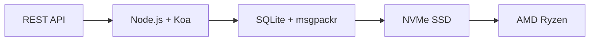

# 第一个完整的电子邮件 API：Forward Email 如何革新电子邮件管理 {#the-first-complete-email-api-how-forward-email-revolutionized-email-management}


<p class="lead mt-3">
  <strong>简要说明：</strong> 我们构建了全球首个具备高级搜索功能的完整电子邮件管理 REST API，这是其他服务无法提供的。虽然 Gmail、Outlook 和 Apple 迫使开发者陷入 IMAP 地狱或受限的 API，Forward Email 通过统一的 REST 接口，提供针对邮件、文件夹、联系人和日历的极速 CRUD 操作，支持 15+ 搜索参数。这正是开发者一直期待的电子邮件 API。
</p>


## 目录 {#table-of-contents}

* [电子邮件 API 的问题](#the-email-api-problem)
* [开发者的真实声音](#what-developers-are-actually-saying)
* [Forward Email 的革命性解决方案](#forward-emails-revolutionary-solution)
  * [我们为何构建它](#why-we-built-this)
  * [简单的身份验证](#simple-authentication)
* [改变一切的 20 个端点](#20-endpoints-that-change-everything)
  * [邮件（5 个端点）](#messages-5-endpoints)
  * [文件夹（5 个端点）](#folders-5-endpoints)
  * [联系人（5 个端点）](#contacts-5-endpoints)
  * [日历（5 个端点）](#calendars-5-endpoints)
* [高级搜索：无可匹敌的服务](#advanced-search-no-other-service-compares)
  * [搜索 API 现状的弊端](#the-search-api-landscape-is-broken)
  * [Forward Email 革命性的搜索 API](#forward-emails-revolutionary-search-api)
  * [真实世界的搜索示例](#real-world-search-examples)
  * [性能优势](#performance-advantages)
  * [独有的搜索功能](#search-features-no-one-else-has)
  * [这对开发者的重要性](#why-this-matters-for-developers)
  * [技术实现](#the-technical-implementation)
* [极速性能架构](#blazing-fast-performance-architecture)
  * [性能基准测试](#performance-benchmarks)
  * [隐私优先架构](#privacy-first-architecture)
* [我们的不同之处：完整对比](#why-were-different-the-complete-comparison)
  * [主要服务商的限制](#major-provider-limitations)
  * [Forward Email 的优势](#forward-email-advantages)
  * [开源透明度问题](#the-open-source-transparency-problem)
* [30+ 真实集成示例](#30-real-world-integration-examples)
  * [1. WordPress 联系表单增强](#1-wordpress-contact-form-enhancement)
  * [2. Zapier 替代方案实现邮件自动化](#2-zapier-alternative-for-email-automation)
  * [3. CRM 邮件同步](#3-crm-email-synchronization)
  * [4. 电子商务订单处理](#4-e-commerce-order-processing)
  * [5. 支持工单集成](#5-support-ticket-integration)
  * [6. 新闻通讯管理系统](#6-newsletter-management-system)
  * [7. 基于邮件的任务管理](#7-email-based-task-management)
  * [8. 多账户邮件聚合](#8-multi-account-email-aggregation)
  * [9. 高级邮件分析仪表盘](#9-advanced-email-analytics-dashboard)
  * [10. 智能邮件归档](#10-smart-email-archiving)
  * [11. 邮件与日历集成](#11-email-to-calendar-integration)
  * [12. 邮件备份与合规](#12-email-backup-and-compliance)
  * [13. 基于邮件的内容管理](#13-email-based-content-management)
  * [14. 邮件模板管理](#14-email-template-management)
  * [15. 基于邮件的工作流自动化](#15-email-based-workflow-automation)
  * [16. 邮件安全监控](#16-email-security-monitoring)
  * [17. 基于邮件的调查收集](#17-email-based-survey-collection)
  * [18. 邮件性能监控](#18-email-performance-monitoring)
  * [19. 基于邮件的潜在客户资格评估](#19-email-based-lead-qualification)
  * [20. 基于邮件的项目管理](#20-email-based-project-management)
  * [21. 基于邮件的库存管理](#21-email-based-inventory-management)
  * [22. 基于邮件的发票处理](#22-email-based-invoice-processing)
  * [23. 基于邮件的活动注册](#23-email-based-event-registration)
  * [24. 基于邮件的文档审批工作流](#24-email-based-document-approval-workflow)
  * [25. 基于邮件的客户反馈分析](#25-email-based-customer-feedback-analysis)
  * [26. 基于邮件的招聘流程](#26-email-based-recruitment-pipeline)
  * [27. 基于邮件的费用报销处理](#27-email-based-expense-report-processing)
  * [28. 基于邮件的质量保证报告](#28-email-based-quality-assurance-reporting)
  * [29. 基于邮件的供应商管理](#29-email-based-vendor-management)
  * [30. 基于邮件的社交媒体监控](#30-email-based-social-media-monitoring)
* [快速入门](#getting-started)
  * [1. 创建您的 Forward Email 账户](#1-create-your-forward-email-account)
  * [2. 生成 API 凭证](#2-generate-api-credentials)
  * [3. 进行首次 API 调用](#3-make-your-first-api-call)
  * [4. 浏览文档](#4-explore-the-documentation)
* [技术资源](#technical-resources)
## 邮件 API 问题 {#the-email-api-problem}

邮件 API 从根本上来说是有缺陷的。就是这样。

每个主要的邮件提供商都迫使开发者在两个糟糕的选择中做出选择：

1. **IMAP 地狱**：与一个为桌面客户端设计的、已有 30 年历史的协议搏斗，而非现代应用
2. **受限的 API**：受限速、只读、OAuth 复杂的 API，无法管理你的实际邮件数据

结果？开发者要么完全放弃邮件集成，要么浪费数周时间构建脆弱的 IMAP 封装层，这些封装层经常出错。

> \[!WARNING]
> **肮脏的秘密**：大多数“邮件 API”只是发送 API。你无法通过简单的 REST 接口以编程方式组织文件夹、同步联系人或管理日历。直到现在。


## 开发者们真正的声音 {#what-developers-are-actually-saying}

挫败感是真实存在且随处可见：

> “我最近尝试在我的应用中集成 Gmail，花了太多时间。我决定不值得支持 Gmail。”
>
> *- [Hacker News 开发者](https://news.ycombinator.com/item?id=42106944)，147 个赞*

> “所有邮件 API 都很平庸吗？它们似乎在某种程度上有限制或受限。”
>
> *- [Reddit r/SaaS 讨论](https://www.reddit.com/r/SaaS/comments/1cm84s7/are_all_email_apis_mediocre/)*

> “为什么邮件开发必须这么糟糕？”
>
> *- [Reddit r/webdev](https://www.reddit.com/r/webdev/comments/15trnp2/why_does_email_development_have_to_suck/)，89 条开发者痛苦评论*

> “Gmail API 为什么比 IMAP 更高效？另一个原因是 Gmail API 只需下载每条消息一次。使用 IMAP，每条消息都必须被下载和索引……”
>
> *- [Stack Overflow 问题](https://stackoverflow.com/questions/25431022/what-makes-the-gmail-api-more-efficient-than-imap)，47 个赞*

证据无处不在：

* **WordPress SMTP 问题**：[631 个 GitHub 问题](https://github.com/awesomemotive/WP-Mail-SMTP/issues) 关于邮件发送失败
* **Zapier 限制**：[社区投诉](https://community.zapier.com/featured-articles-65/email-parser-by-zapier-limitations-and-alternatives-16958) 每小时 10 封邮件限制和 IMAP 检测失败
* **IMAP API 项目**：[多个](https://github.com/ewildgoose/imap-api) [开源](https://emailengine.app/) [项目](https://www.npmjs.com/package/imapflow) 专门用于“将 IMAP 转换为 REST”，因为没有提供商提供此功能
* **Gmail API 挫败感**：[Stack Overflow](https://stackoverflow.com/questions/tagged/gmail-api) 有 4,847 个带“gmail-api”标签的问题，常见抱怨包括速率限制和复杂性


## Forward Email 的革命性解决方案 {#forward-emails-revolutionary-solution}

**我们是首个通过统一 REST API 提供所有邮件数据完整 CRUD 操作的邮件服务。**

这不仅仅是另一个发送 API。这是对以下内容的完整编程控制：

* **邮件**：创建、读取、更新、删除、搜索、移动、标记
* **文件夹**：通过 REST 端点实现完整的 IMAP 文件夹管理
* **联系人**：[CardDAV](https://tools.ietf.org/html/rfc6352) 联系人存储与同步
* **日历**：[CalDAV](https://tools.ietf.org/html/rfc4791) 日历事件与日程安排

### 我们为什么要构建这个 {#why-we-built-this}

**问题**：每个邮件提供商都把邮件当作黑盒。你可以发送邮件，也许可以通过复杂的 OAuth 读取邮件，但你无法真正以编程方式*管理*你的邮件数据。

**我们的愿景**：邮件集成应该像任何现代 API 一样简单。无需 IMAP 库。无需 OAuth 复杂性。无需速率限制噩梦。只需简单的 REST 端点即可。

**结果**：首个邮件服务，你可以仅用 HTTP 请求构建完整的邮件客户端、CRM 集成或自动化系统。

### 简单认证 {#simple-authentication}

无需 [OAuth 复杂性](https://oauth.net/2/)。无需 [应用专用密码](https://support.google.com/accounts/answer/185833)。只需你的别名凭据：

```bash
curl -u "alias@yourdomain.com:password" \
  https://api.forwardemail.net/v1/messages
```
## 20 个改变一切的端点 {#20-endpoints-that-change-everything}

### 消息（5 个端点） {#messages-5-endpoints}

* `GET /v1/messages` - 列出消息并支持过滤（`?folder=`，`?is_unread=`，`?is_flagged=`）
* `POST /v1/messages` - 直接发送新消息到文件夹
* `GET /v1/messages/:id` - 获取特定消息及完整元数据
* `PUT /v1/messages/:id` - 更新消息（标记、文件夹、已读状态）
* `DELETE /v1/messages/:id` - 永久删除消息

### 文件夹（5 个端点） {#folders-5-endpoints}

* `GET /v1/folders` - 列出所有文件夹及订阅状态
* `POST /v1/folders` - 创建带自定义属性的新文件夹
* `GET /v1/folders/:id` - 获取文件夹详情及消息计数
* `PUT /v1/folders/:id` - 更新文件夹属性及订阅
* `DELETE /v1/folders/:id` - 删除文件夹并处理消息迁移

### 联系人（5 个端点） {#contacts-5-endpoints}

* `GET /v1/contacts` - 列出联系人，支持搜索和分页
* `POST /v1/contacts` - 创建支持完整 vCard 的新联系人
* `GET /v1/contacts/:id` - 获取联系人所有字段及元数据
* `PUT /v1/contacts/:id` - 使用 ETag 验证更新联系人信息
* `DELETE /v1/contacts/:id` - 删除联系人并处理级联关系

### 日历（5 个端点） {#calendars-5-endpoints}

* `GET /v1/calendars` - 列出日历事件，支持日期过滤
* `POST /v1/calendars` - 创建带参与者和重复规则的日历事件
* `GET /v1/calendars/:id` - 获取事件详情并处理时区
* `PUT /v1/calendars/:id` - 更新事件并检测冲突
* `DELETE /v1/calendars/:id` - 删除事件并通知参与者


## 高级搜索：无可匹敌的服务 {#advanced-search-no-other-service-compares}

**Forward Email 是唯一通过 REST API 提供跨所有消息字段的全面、程序化搜索的邮件服务。**

虽然其他提供商最多只提供基础过滤，我们打造了史上最先进的邮件搜索 API。没有 Gmail API、Outlook API 或任何其他服务能比拟我们的搜索能力。

### 搜索 API 现状混乱 {#the-search-api-landscape-is-broken}

**Gmail API 搜索限制：**

* ✅ 仅支持基础的 `q` 参数
* ❌ 不支持字段特定搜索
* ❌ 不支持日期范围过滤
* ❌ 不支持基于大小的过滤
* ❌ 不支持附件过滤
* ❌ 仅限 Gmail 的搜索语法

**Outlook API 搜索限制：**

* ✅ 支持基础的 `$search` 参数
* ❌ 不支持高级字段定位
* ❌ 不支持复杂查询组合
* ❌ 限制严格的速率限制
* ❌ 需要复杂的 OData 语法

**Apple iCloud：**

* ❌ 完全没有 API
* ❌ 仅支持 IMAP 搜索（如果能用上）

**ProtonMail & Tuta：**

* ❌ 无公开 API
* ❌ 无程序化搜索能力

### Forward Email 的革命性搜索 API {#forward-emails-revolutionary-search-api}

**我们提供 15+ 个其他服务没有的搜索参数：**

| 搜索能力                      | Forward Email                          | Gmail API    | Outlook API        | 其他   |
| ------------------------------ | -------------------------------------- | ------------ | ------------------ | ------ |
| **字段特定搜索**              | ✅ 主题、正文、发件人、收件人、抄送、头部 | ❌            | ❌                  | ❌      |
| **多字段通用搜索**            | ✅ `?search=` 跨所有字段               | ✅ 基础 `q=` | ✅ 基础 `$search=` | ❌      |
| **日期范围过滤**              | ✅ `?since=` & `?before=`              | ❌            | ❌                  | ❌      |
| **基于大小的过滤**            | ✅ `?min_size=` & `?max_size=`         | ❌            | ❌                  | ❌      |
| **附件过滤**                  | ✅ `?has_attachments=true/false`       | ❌            | ❌                  | ❌      |
| **头部搜索**                  | ✅ `?headers=X-Priority`               | ❌            | ❌                  | ❌      |
| **消息 ID 搜索**              | ✅ `?message_id=abc123`                | ❌            | ❌                  | ❌      |
| **组合过滤**                  | ✅ 多参数且支持 AND 逻辑                | ❌            | ❌                  | ❌      |
| **不区分大小写**              | ✅ 所有搜索                           | ✅            | ✅                  | ❌      |
| **分页支持**                  | ✅ 适用于所有搜索参数                   | ✅            | ✅                  | ❌      |
### 真实世界的搜索示例 {#real-world-search-examples}

**查找上季度的所有发票：**

```bash
# Forward Email - 简单且强大
GET /v1/messages?subject=invoice&since=2024-01-01T00:00:00Z&before=2024-04-01T00:00:00Z

# Gmail API - 受限于其有限的搜索功能，无法实现
# 无法进行日期范围过滤

# Outlook API - 复杂的 OData 语法，功能有限
GET /me/messages?$search="invoice"&$filter=receivedDateTime ge 2024-01-01T00:00:00Z
```

**搜索来自特定发件人的大附件：**

```bash
# Forward Email - 全面过滤
GET /v1/messages?from=finance@company.com&has_attachments=true&min_size=1000000

# Gmail API - 无法通过程序过滤大小或附件
# Outlook API - 无大小过滤功能
# 其他 - 无可用 API
```

**复杂的多字段搜索：**

```bash
# Forward Email - 高级查询能力
GET /v1/messages?body=quarterly&from=manager&is_flagged=true&folder=Reports

# Gmail API - 仅限基本文本搜索
GET /gmail/v1/users/me/messages?q=quarterly

# Outlook API - 基础搜索，无字段定位
GET /me/messages?$search="quarterly"
```

### 性能优势 {#performance-advantages}

**Forward Email 搜索性能：**

* ⚡ **复杂搜索响应时间低于100毫秒**
* 🔍 **正则表达式优化**配合合理索引
* 📊 **计数和数据的并行查询执行**
* 💾 **高效内存使用**，查询轻量

**竞争对手性能问题：**

* 🐌 **Gmail API**：每用户每秒限额250配额单位
* 🐌 **Outlook API**：激进的节流和复杂的退避要求
* 🐌 **其他**：无可比较的 API

### 独有的搜索功能 {#search-features-no-one-else-has}

#### 1. 头部特定搜索 {#1-header-specific-search}

```bash
# 查找具有特定头部的邮件
GET /v1/messages?headers=X-Priority:1
GET /v1/messages?headers=X-Spam-Score
```

#### 2. 基于大小的智能搜索 {#2-size-based-intelligence}

```bash
# 查找新闻通讯邮件（通常较大）
GET /v1/messages?min_size=50000&from=newsletter

# 查找快速回复邮件（通常较小）
GET /v1/messages?max_size=1000&to=support
```

#### 3. 基于附件的工作流程 {#3-attachment-based-workflows}

```bash
# 查找发送给法务团队的所有文档
GET /v1/messages?to=legal&has_attachments=true&body=contract

# 查找无附件邮件以便清理
GET /v1/messages?has_attachments=false&before=2023-01-01T00:00:00Z
```

#### 4. 结合业务逻辑 {#4-combined-business-logic}

```bash
# 查找来自 VIP 的紧急标记邮件且带附件
GET /v1/messages?is_flagged=true&from=ceo&has_attachments=true&subject=urgent
```

### 这对开发者的重要性 {#why-this-matters-for-developers}

**构建以前无法实现的应用：**

1. **高级邮件分析**：按大小、发件人、内容分析邮件模式
2. **智能邮件管理**：基于复杂条件自动分类
3. **合规与发现**：查找满足法律要求的特定邮件
4. **商业智能**：从邮件通信模式中提取洞察
5. **自动化工作流**：基于复杂邮件过滤触发操作

### 技术实现 {#the-technical-implementation}

我们的搜索 API 使用：

* **正则表达式优化**配合合理索引策略
* **并行执行**提升性能
* **输入验证**保障安全
* **全面错误处理**确保可靠性

```javascript
// 示例：复杂搜索实现
const searchConditions = [];

if (ctx.query.subject) {
  searchConditions.push({
    subject: { $regex: ctx.query.subject, $options: 'i' }
  });
}

if (ctx.query.from) {
  searchConditions.push({
    $or: [
      { 'from.address': { $regex: ctx.query.from, $options: 'i' } },
      { 'from.name': { $regex: ctx.query.from, $options: 'i' } }
    ]
  });
}

// 使用 AND 逻辑组合
if (searchConditions.length > 0) {
  query.$and = searchConditions;
}
```

> \[!TIP]
> **开发者优势**：使用 Forward Email 的搜索 API，您可以构建功能媲美桌面客户端的邮件应用，同时保持 REST API 的简洁性。
## 极速性能架构 {#blazing-fast-performance-architecture}

我们的技术栈专为速度和可靠性而构建：


```mermaid
graph LR
    A[REST API] --> B[Node.js + Koa]
    B --> C[SQLite + msgpackr]
    C --> D[NVMe SSD]
    D --> E[AMD Ryzen]
```

### 性能基准 {#performance-benchmarks}

**我们为何如此快速：**

| 组件         | 技术                                                                                 | 性能优势                                      |
| ------------ | ------------------------------------------------------------------------------------ | --------------------------------------------- |
| **存储**     | [NVMe SSD](https://en.wikipedia.org/wiki/NVM_Express)                              | 比传统SATA快10倍                             |
| **数据库**   | [SQLite](https://sqlite.org/) + [msgpackr](https://github.com/kriszyp/msgpackr)     | 零网络延迟，优化序列化                        |
| **硬件**     | [AMD Ryzen](https://www.amd.com/en/products/processors/desktops/ryzen) 裸机          | 无虚拟化开销                                 |
| **缓存**     | 内存 + 持久化                                                                        | 亚毫秒响应时间                               |
| **备份**     | [Cloudflare R2](https://www.cloudflare.com/products/r2/) 加密                       | 企业级可靠性                                 |

**真实性能数据：**

* **API 响应时间**：平均 < 50ms
* **消息检索**：缓存消息 < 10ms
* **文件夹操作**：元数据操作 < 5ms
* **联系人同步**：每秒 1000+ 联系人
* **正常运行时间**：99.99% SLA，冗余基础设施保障

### 隐私优先架构 {#privacy-first-architecture}

**零知识设计**：只有您凭 IMAP 密码拥有访问权限——我们无法读取您的邮件。我们的[零知识架构](https://forwardemail.net/en/security)确保在提供极速性能的同时实现完全隐私保护。


## 我们的不同之处：完整对比 {#why-were-different-the-complete-comparison}

### 主要服务商限制 {#major-provider-limitations}

| 服务商           | 核心问题                              | 具体限制                                                                                                                                                                                                                                                                                                                                                                                                                                                         |
| ---------------- | ----------------------------------- | ---------------------------------------------------------------------------------------------------------------------------------------------------------------------------------------------------------------------------------------------------------------------------------------------------------------------------------------------------------------------------------------------------------------------------------------------------------------- |
| **Gmail API**    | 只读，复杂的 OAuth，分离的 API       | • [无法修改已有邮件](https://developers.google.com/gmail/api/reference/rest/v1/users.messages)<br>• [标签 ≠ 文件夹](https://developers.google.com/gmail/api/reference/rest/v1/users.labels)<br>• [每日 10 亿配额单位限制](https://developers.google.com/gmail/api/reference/quota)<br>• 联系人/日历需使用[分离的 API](https://developers.google.com/workspace)                                                           |
| **Outlook API**  | 已弃用，混乱，面向企业               | • [REST 端点于 2024 年 3 月弃用](https://learn.microsoft.com/en-us/outlook/rest/compare-graph)<br>• [多个混乱的 API](https://learn.microsoft.com/en-us/office/client-developer/outlook/selecting-an-api-or-technology-for-developing-solutions-for-outlook)（EWS、Graph、REST）<br>• [Microsoft Graph 复杂性](https://learn.microsoft.com/en-us/graph/overview)<br>• [严格限流](https://learn.microsoft.com/en-us/graph/throttling) |
| **Apple iCloud** | 无公开 API                         | • [完全无公开 API](https://support.apple.com/en-us/102654)<br>• [仅 IMAP，且每日限制 1000 封邮件](https://support.apple.com/en-us/102654)<br>• [需要应用专用密码](https://support.apple.com/en-us/102654)<br>• [每封邮件最多 500 收件人限制](https://support.apple.com/en-us/102654)                                                                                                                                              |
| **ProtonMail**   | 无 API，虚假的开源声明              | • [无公开 API](https://proton.me/support/protonmail-bridge-clients)<br>• 需使用[Bridge 软件](https://proton.me/mail/bridge)访问 IMAP<br>• [声称“开源”](https://proton.me/blog/open-source)但[服务器代码为专有](https://github.com/ProtonMail)<br>• [仅限付费计划](https://proton.me/pricing)                                                                                                         |
| **Tuta**         | 无 API，透明度误导                  | • [无用于邮件管理的 REST API](https://tuta.com/support#technical)<br>• [声称“开源”](https://tuta.com/blog/posts/open-source-email)但[后端闭源](https://github.com/tutao/tutanota)<br>• [不支持 IMAP/SMTP](https://tuta.com/support#imap)<br>• [专有加密](https://tuta.com/encryption)阻碍标准集成                                                                                               |
| **Zapier Email** | 严重限速                           | • [每小时限制 10 封邮件](https://help.zapier.com/hc/en-us/articles/8496181555597-Email-Parser-by-Zapier-limitations-and-alternatives)<br>• [无 IMAP 文件夹访问](https://help.zapier.com/hc/en-us/articles/8496181555597-Email-Parser-by-Zapier-limitations-and-alternatives)<br>• [解析能力有限](https://help.zapier.com/hc/en-us/articles/8496181555597-Email-Parser-by-Zapier-limitations-and-alternatives)
### 转发邮件的优势 {#forward-email-advantages}

| 功能               | 转发邮件                                                                                   | 竞争对手                                  |
| ------------------ | ------------------------------------------------------------------------------------------ | ----------------------------------------- |
| **完整的 CRUD**    | ✅ 对所有数据支持完整的创建、读取、更新、删除                                               | ❌ 只读或有限操作                          |
| **统一 API**       | ✅ 消息、文件夹、联系人、日历统一在一个 API 中                                              | ❌ 分离的 API 或缺少功能                    |
| **简单认证**       | ✅ 使用别名凭据的基础认证                                                                   | ❌ 复杂的 OAuth 多权限                      |
| **无速率限制**     | ✅ 为真实应用设计的宽松限制                                                                 | ❌ 限制性配额导致工作流程中断                |
| **自托管**         | ✅ [完整的自托管选项](https://forwardemail.net/en/blog/docs/self-hosted-solution)           | ❌ 仅限供应商锁定                          |
| **隐私保护**       | ✅ 零知识、加密、私密                                                                       | ❌ 数据挖掘和隐私问题                      |
| **性能**           | ✅ 响应时间低于 50ms，NVMe 存储                                                            | ❌ 网络延迟，限流延迟                      |

### 开源透明度问题 {#the-open-source-transparency-problem}

**ProtonMail 和 Tuta 宣称自己是“开源”和“透明”的，但这是一种误导性的营销，违反了现代隐私原则。**

> \[!WARNING]
> **虚假的透明度声明**：ProtonMail 和 Tuta 都大力宣传其“开源”资质，但其最关键的服务器端代码是专有且封闭的。

**ProtonMail 的欺骗：**

* **声明**：在营销中突出显示 ["我们是开源"](https://proton.me/blog/open-source)
* **现实**：[服务器代码完全专有](https://github.com/ProtonMail) — 只有客户端应用是开源的
* **影响**：用户无法验证服务器端的加密、数据处理或隐私声明
* **透明度违规**：无法审计实际的邮件处理和存储系统

**Tuta 的误导性营销：**

* **声明**：将 ["开源邮件"](https://tuta.com/blog/posts/open-source-email) 作为核心卖点
* **现实**：[后端基础设施是闭源的](https://github.com/tutao/tutanota) — 只有前端可用
* **影响**：专有加密阻止标准邮件协议（IMAP/SMTP）
* **锁定策略**：自定义加密强制依赖供应商

**这对现代隐私的重要性：**

在 2025 年，真正的隐私需要 **完全透明**。当邮件提供商声称“开源”却隐藏服务器代码时：

1. **无法验证的加密**：你无法审计数据的实际加密方式
2. **隐藏的数据处理**：服务器端数据处理成了黑盒
3. **基于信任的安全**：你必须无验证地信任他们的声明
4. **供应商锁定**：专有系统阻止数据可移植性

**Forward Email 的真正透明：**

* ✅ **[完全开源](https://github.com/forwardemail/forwardemail.net)** — 服务器和客户端代码
* ✅ **[支持自托管](https://forwardemail.net/en/blog/docs/self-hosted-solution)** — 运行你自己的实例
* ✅ **标准协议** — 兼容 IMAP、SMTP、CardDAV、CalDAV
* ✅ **可审计的安全** — 每一行代码都可检查
* ✅ **无供应商锁定** — 你的数据，你的控制

> \[!TIP]
> **真正的开源意味着你可以验证每一项声明。** 使用 Forward Email，你可以审计我们的加密，审查我们的数据处理，甚至运行你自己的实例。这才是真正的透明。


## 30+ 真实世界集成示例 {#30-real-world-integration-examples}

### 1. WordPress 联系表单增强 {#1-wordpress-contact-form-enhancement}
**问题**：[WordPress SMTP 配置失败](https://github.com/awesomemotive/WP-Mail-SMTP/issues)（[631 个 GitHub 问题](https://github.com/awesomemotive/WP-Mail-SMTP/issues)）
**解决方案**：直接 API 集成，完全绕过 [SMTP](https://tools.ietf.org/html/rfc5321)

```javascript
// WordPress 联系表单，保存到已发送文件夹
await fetch('https://api.forwardemail.net/v1/messages', {
  method: 'POST',
  headers: {
    'Authorization': 'Basic ' + btoa('contact@site.com:password'),
    'Content-Type': 'application/json'
  },
  body: JSON.stringify({
    to: [{ address: 'owner@site.com' }],
    subject: '联系表单: ' + formData.subject,
    text: formData.message,
    folder: 'Sent'
  })
});
```

### 2. Zapier 邮件自动化替代方案 {#2-zapier-alternative-for-email-automation}

**问题**：[Zapier 每小时 10 封邮件限制](https://help.zapier.com/hc/en-us/articles/8496181555597-Email-Parser-by-Zapier-limitations-and-alternatives) 和 [IMAP 检测失败](https://community.zapier.com/featured-articles-65/email-parser-by-zapier-limitations-and-alternatives-16958)
**解决方案**：无限制自动化，完全控制邮件

```javascript
// 按发件人域名自动整理邮件
const messages = await fetch('/v1/messages?folder=INBOX');
for (const message of messages) {
  const domain = message.from.split('@')[1];
  await fetch(`/v1/messages/${message.id}`, {
    method: 'PUT',
    body: JSON.stringify({ folder: `Clients/${domain}` })
  });
}
```

### 3. CRM 邮件同步 {#3-crm-email-synchronization}

**问题**：邮件与[客户关系管理系统](https://en.wikipedia.org/wiki/Customer_relationship_management)之间的手动联系人管理
**解决方案**：使用 [CardDAV](https://tools.ietf.org/html/rfc6352) 联系人 API 实现双向同步

```javascript
// 同步新邮件联系人到 CRM
const newContacts = await fetch('/v1/contacts');
for (const contact of newContacts) {
  await crmAPI.createContact({
    name: contact.name,
    email: contact.email,
    source: 'email_api'
  });
}
```

### 4. 电子商务订单处理 {#4-e-commerce-order-processing}

**问题**：[电子商务平台](https://en.wikipedia.org/wiki/E-commerce)的订单邮件手动处理
**解决方案**：自动化订单管理流程

```javascript
// 处理订单确认邮件
const orders = await fetch('/v1/messages?folder=Orders');
const orderEmails = orders.filter(msg =>
  msg.subject.includes('Order Confirmation')
);

for (const order of orderEmails) {
  const orderData = parseOrderEmail(order.text);
  await updateInventory(orderData);
  await fetch(`/v1/messages/${order.id}`, {
    method: 'PUT',
    body: JSON.stringify({ folder: 'Orders/Processed' })
  });
}
```

### 5. 支持工单集成 {#5-support-ticket-integration}

**问题**：[帮助台平台](https://en.wikipedia.org/wiki/Help_desk_software)中邮件线程分散
**解决方案**：完整的邮件线程跟踪

```javascript
// 从邮件线程创建支持工单
const messages = await fetch('/v1/messages?folder=Support');
const supportEmails = messages.filter(msg =>
  msg.to.some(addr => addr.includes('support@'))
);

for (const email of supportEmails) {
  const ticket = await supportSystem.createTicket({
    subject: email.subject,
    from: email.from,
    body: email.text,
    timestamp: email.date
  });
}
```

### 6. 新闻通讯管理系统 {#6-newsletter-management-system}

**问题**：有限的[新闻通讯平台](https://en.wikipedia.org/wiki/Email_marketing)集成
**解决方案**：完整的订阅者生命周期管理

```javascript
// 自动管理新闻通讯订阅
const messages = await fetch('/v1/messages?folder=Newsletter');
const unsubscribes = messages.filter(msg =>
  msg.subject.toLowerCase().includes('unsubscribe')
);

for (const msg of unsubscribes) {
  await removeSubscriber(msg.from);
  await fetch(`/v1/messages/${msg.id}`, {
    method: 'PUT',
    body: JSON.stringify({ folder: 'Newsletter/Unsubscribed' })
  });
}
```

### 7. 基于邮件的任务管理 {#7-email-based-task-management}

**问题**：收件箱过载和[任务跟踪](https://en.wikipedia.org/wiki/Task_management)
**解决方案**：将邮件转换为可执行任务
```javascript
// Create tasks from flagged emails
const messages = await fetch('/v1/messages?is_flagged=true');
for (const email of messages) {
  await taskManager.createTask({
    title: email.subject,
    description: email.text,
    assignee: email.to[0].address,
    dueDate: extractDueDate(email.text)
  });
}
```

### 8. Multi-Account Email Aggregation {#8-multi-account-email-aggregation}

**Problem**: Managing [multiple email accounts](https://en.wikipedia.org/wiki/Email_client) across providers
**Solution**: Unified inbox interface

```javascript
// Aggregate emails from multiple accounts
const accounts = ['work@domain.com', 'personal@domain.com'];
const allMessages = [];

for (const account of accounts) {
  const messages = await fetch('/v1/messages', {
    headers: { 'Authorization': getAuth(account) }
  });
  allMessages.push(...messages.map(m => ({ ...m, account })));
}
```

### 9. Advanced Email Analytics Dashboard {#9-advanced-email-analytics-dashboard}

**Problem**: No insights into [email patterns](https://en.wikipedia.org/wiki/Email_analytics) with sophisticated filtering
**Solution**: Custom email analytics using advanced search capabilities

```javascript
// Generate comprehensive email analytics using advanced search
const analytics = {};

// Analyze email volume by sender domain
const messages = await fetch('/v1/messages');
analytics.senderDomains = analyzeSenderDomains(messages);

// Find large attachments consuming storage
const largeAttachments = await fetch('/v1/messages?has_attachments=true&min_size=1000000');
analytics.storageHogs = largeAttachments.map(msg => ({
  subject: msg.subject,
  from: msg.from,
  size: msg.size
}));

// Analyze communication patterns with VIPs
const vipEmails = await fetch('/v1/messages?from=ceo@company.com');
const urgentVipEmails = await fetch('/v1/messages?from=ceo@company.com&subject=urgent');
analytics.vipCommunication = {
  total: vipEmails.length,
  urgent: urgentVipEmails.length,
  urgencyRate: (urgentVipEmails.length / vipEmails.length) * 100
};

// Find unread emails by date range for follow-up
const lastWeek = new Date(Date.now() - 7 * 24 * 60 * 60 * 1000).toISOString();
const unreadRecent = await fetch(`/v1/messages?is_unread=true&since=${lastWeek}`);
analytics.followUpNeeded = unreadRecent.length;

// Analyze email sizes for optimization
const smallEmails = await fetch('/v1/messages?max_size=1000');
const mediumEmails = await fetch('/v1/messages?min_size=1000&max_size=50000');
const largeEmails = await fetch('/v1/messages?min_size=50000');
analytics.sizeDistribution = {
  small: smallEmails.length,
  medium: mediumEmails.length,
  large: largeEmails.length
};

// Search for compliance-related emails
const complianceEmails = await fetch('/v1/messages?body=confidential&has_attachments=true');
analytics.complianceReview = complianceEmails.length;
```

### 10. Smart Email Archiving {#10-smart-email-archiving}

**Problem**: Manual [email organization](https://en.wikipedia.org/wiki/Email_management)
**Solution**: Intelligent email categorization

```javascript
// Auto-archive old emails by category
const messages = await fetch('/v1/messages');
const oldEmails = messages.filter(email =>
  isOlderThan(email.date, 90) // 90 days
);

for (const email of oldEmails) {
  const category = categorizeEmail(email);
  await fetch(`/v1/messages/${email.id}`, {
    method: 'PUT',
    body: JSON.stringify({ folder: `Archive/${category}` })
  });
}
```

### 11. Email-to-Calendar Integration {#11-email-to-calendar-integration}

**Problem**: Manual [calendar event](https://tools.ietf.org/html/rfc4791) creation from emails
**Solution**: Automatic event extraction and creation

```javascript
// Extract meeting details from emails
const messages = await fetch('/v1/messages?folder=Meetings');
const meetingEmails = messages.filter(email =>
  email.subject.toLowerCase().includes('meeting')
);

for (const email of meetingEmails) {
  const meetingData = extractMeetingInfo(email.text);
  if (meetingData.date && meetingData.time) {
    await fetch('/v1/calendars', {
      method: 'POST',
      body: JSON.stringify({
        title: email.subject,
        start: meetingData.datetime,
        attendees: [email.from, ...email.to]
      })
    });
  }
}
```

### 12. 邮件备份与合规 {#12-email-backup-and-compliance}

**问题**：[邮件保留](https://en.wikipedia.org/wiki/Email_retention_policy) 和合规要求  
**解决方案**：自动备份并保留元数据

```javascript
// 备份带有完整元数据的邮件
const allMessages = await fetch('/v1/messages');
const backup = {
  timestamp: new Date(),
  messages: allMessages.map(msg => ({
    id: msg.id,
    subject: msg.subject,
    from: msg.from,
    to: msg.to,
    date: msg.date,
    flags: msg.flags
  }))
};
await saveToComplianceStorage(backup);
```

### 13. 基于邮件的内容管理 {#13-email-based-content-management}

**问题**：通过邮件管理内容提交，用于[内容管理系统](https://en.wikipedia.org/wiki/Content_management_system)  
**解决方案**：将邮件作为内容管理系统

```javascript
// 处理来自邮件的内容提交
const messages = await fetch('/v1/messages?folder=Submissions');
const submissions = messages.filter(msg =>
  msg.to.some(addr => addr.includes('submit@'))
);

for (const submission of submissions) {
  const content = parseSubmission(submission.text);
  await cms.createDraft({
    title: submission.subject,
    content: content.body,
    author: submission.from
  });
}
```

### 14. 邮件模板管理 {#14-email-template-management}

**问题**：团队间[邮件模板](https://en.wikipedia.org/wiki/Email_template)不一致  
**解决方案**：集中模板系统及API

```javascript
// 发送带动态内容的模板邮件
const template = await getEmailTemplate('welcome');
await fetch('/v1/messages', {
  method: 'POST',
  body: JSON.stringify({
    to: [{ address: newUser.email }],
    subject: template.subject.replace('{{name}}', newUser.name),
    html: template.html.replace('{{name}}', newUser.name),
    folder: 'Sent'
  })
});
```

### 15. 基于邮件的工作流自动化 {#15-email-based-workflow-automation}

**问题**：通过邮件进行手动[审批流程](https://en.wikipedia.org/wiki/Workflow)  
**解决方案**：自动化工作流触发

```javascript
// 处理审批邮件
const messages = await fetch('/v1/messages?folder=Approvals');
const approvals = messages.filter(msg =>
  msg.subject.includes('APPROVAL')
);

for (const approval of approvals) {
  const decision = parseApprovalDecision(approval.text);
  await workflow.processApproval({
    requestId: extractRequestId(approval.subject),
    decision: decision,
    approver: approval.from
  });
}
```

### 16. 邮件安全监控 {#16-email-security-monitoring}

**问题**：手动[安全威胁检测](https://en.wikipedia.org/wiki/Email_security)  
**解决方案**：自动威胁分析

```javascript
// 监控可疑邮件
const recentEmails = await fetch('/v1/messages');
for (const email of recentEmails) {
  const threatScore = analyzeThreat(email);
  if (threatScore > 0.8) {
    await fetch(`/v1/messages/${email.id}`, {
      method: 'PUT',
      body: JSON.stringify({ folder: 'Security/Quarantine' })
    });
    await alertSecurityTeam(email);
  }
}
```

### 17. 基于邮件的调查收集 {#17-email-based-survey-collection}

**问题**：手动[调查响应](https://en.wikipedia.org/wiki/Survey_methodology)处理  
**解决方案**：自动响应汇总

```javascript
// 收集并处理调查回复
const messages = await fetch('/v1/messages?folder=Surveys');
const responses = messages.filter(msg =>
  msg.subject.includes('Survey Response')
);

const surveyData = responses.map(email => ({
  respondent: email.from,
  responses: parseSurveyData(email.text),
  timestamp: email.date
}));
await updateSurveyResults(surveyData);
```

### 18. 邮件性能监控 {#18-email-performance-monitoring}

**问题**：缺乏对[邮件投递性能](https://en.wikipedia.org/wiki/Email_deliverability)的可见性  
**解决方案**：实时邮件指标

```javascript
// 监控邮件投递性能
const sentEmails = await fetch('/v1/messages?folder=Sent');
const deliveryStats = {
  sent: sentEmails.length,
  bounces: await countBounces(),
  deliveryRate: calculateDeliveryRate()
};
await updateDashboard(deliveryStats);
```
### 19. 基于电子邮件的潜在客户资格评估 {#19-email-based-lead-qualification}

**问题**：基于电子邮件互动的手动[潜在客户评分](https://en.wikipedia.org/wiki/Lead_scoring)  
**解决方案**：自动化潜在客户资格评估流程

```javascript
// 根据电子邮件参与度评分潜在客户
const prospects = await fetch('/v1/contacts');
for (const prospect of prospects) {
  const messages = await fetch('/v1/messages');
  const emails = messages.filter(msg =>
    msg.from.includes(prospect.email)
  );
  const score = calculateEngagementScore(emails);
  await crm.updateLeadScore(prospect.id, score);
}
```

### 20. 基于电子邮件的项目管理 {#20-email-based-project-management}

**问题**：[项目更新](https://en.wikipedia.org/wiki/Project_management)分散在电子邮件线程中  
**解决方案**：集中式项目沟通中心

```javascript
// 从电子邮件中提取项目更新
const messages = await fetch('/v1/messages?folder=Projects');
const projectEmails = messages.filter(msg =>
  msg.subject.includes('Project Update')
);

for (const email of projectEmails) {
  const update = parseProjectUpdate(email.text);
  await projectManager.addUpdate({
    project: update.projectId,
    author: email.from,
    content: update.content
  });
}
```

### 21. 基于电子邮件的库存管理 {#21-email-based-inventory-management}

**问题**：供应商电子邮件中的手动库存更新  
**解决方案**：从电子邮件通知自动跟踪库存

```javascript
// 处理供应商电子邮件中的库存更新
const messages = await fetch('/v1/messages?folder=Suppliers');
const inventoryEmails = messages.filter(msg =>
  msg.subject.includes('Inventory Update') || msg.subject.includes('Stock Alert')
);

for (const email of inventoryEmails) {
  const inventoryData = parseInventoryUpdate(email.text);
  await inventory.updateStock({
    sku: inventoryData.sku,
    quantity: inventoryData.quantity,
    supplier: email.from,
    timestamp: email.date
  });

  // 移动到已处理文件夹
  await fetch(`/v1/messages/${email.id}`, {
    method: 'PUT',
    body: JSON.stringify({ folder: 'Suppliers/Processed' })
  });
}
```

### 22. 基于电子邮件的发票处理 {#22-email-based-invoice-processing}

**问题**：手动[发票处理](https://en.wikipedia.org/wiki/Invoice_processing)及会计系统集成  
**解决方案**：自动发票提取及会计系统同步

```javascript
// 从电子邮件附件中提取发票数据
const messages = await fetch('/v1/messages?folder=Invoices');
const invoiceEmails = messages.filter(msg =>
  msg.subject.toLowerCase().includes('invoice') && msg.attachments.length > 0
);

for (const email of invoiceEmails) {
  const invoiceData = await extractInvoiceData(email.attachments[0]);
  await accounting.createInvoice({
    vendor: email.from,
    amount: invoiceData.total,
    dueDate: invoiceData.dueDate,
    items: invoiceData.lineItems
  });

  // 标记为已处理
  await fetch(`/v1/messages/${email.id}`, {
    method: 'PUT',
    body: JSON.stringify({ flags: ['\\Seen', '\\Flagged'] })
  });
}
```

### 23. 基于电子邮件的活动注册 {#23-email-based-event-registration}

**问题**：从电子邮件回复中手动处理[活动注册](https://en.wikipedia.org/wiki/Event_management)  
**解决方案**：自动化参与者管理及日历集成

```javascript
// 处理活动注册电子邮件
const messages = await fetch('/v1/messages?folder=Events');
const registrations = messages.filter(msg =>
  msg.subject.includes('Registration') || msg.subject.includes('RSVP')
);

for (const registration of registrations) {
  const attendeeData = parseRegistration(registration.text);

  // 添加到参与者列表
  await events.addAttendee({
    event: attendeeData.eventId,
    name: attendeeData.name,
    email: registration.from,
    dietary: attendeeData.dietaryRestrictions
  });

  // 为参与者创建日历事件
  await fetch('/v1/calendars', {
    method: 'POST',
    body: JSON.stringify({
      title: attendeeData.eventName,
      start: attendeeData.eventDate,
      attendees: [registration.from]
    })
  });
}
```
### 24. 基于电子邮件的文档审批工作流 {#24-email-based-document-approval-workflow}

**问题**：通过电子邮件进行复杂的[文档审批](https://en.wikipedia.org/wiki/Document_management_system)流程  
**解决方案**：自动化审批跟踪和文档版本管理

```javascript
// Track document approval workflow
const messages = await fetch('/v1/messages?folder=Approvals');
const approvalEmails = messages.filter(msg =>
  msg.subject.includes('Document Approval')
);

for (const email of approvalEmails) {
  const approval = parseApprovalEmail(email.text);

  await documentSystem.updateApproval({
    documentId: approval.documentId,
    approver: email.from,
    status: approval.decision, // 'approved', 'rejected', 'needs_changes'
    comments: approval.comments,
    timestamp: email.date
  });

  // Check if all approvals complete
  const document = await documentSystem.getDocument(approval.documentId);
  if (document.allApprovalsComplete) {
    await documentSystem.finalizeDocument(approval.documentId);
  }
}
```

### 25. 基于电子邮件的客户反馈分析 {#25-email-based-customer-feedback-analysis}

**问题**：手动收集和分析[客户反馈](https://en.wikipedia.org/wiki/Customer_feedback)情绪  
**解决方案**：自动化反馈处理和情绪跟踪

```javascript
// Analyze customer feedback from emails
const messages = await fetch('/v1/messages?folder=Feedback');
const feedbackEmails = messages.filter(msg =>
  msg.to.some(addr => addr.includes('feedback@'))
);

for (const email of feedbackEmails) {
  const sentiment = await analyzeSentiment(email.text);
  const category = categorizeFeeback(email.text);

  await feedback.recordFeedback({
    customer: email.from,
    content: email.text,
    sentiment: sentiment.score, // -1 to 1
    category: category, // 'bug', 'feature', 'complaint', 'praise'
    priority: calculatePriority(sentiment, category),
    timestamp: email.date
  });

  // Auto-escalate negative feedback
  if (sentiment.score < -0.5) {
    await escalateToSupport(email);
  }
}
```

### 26. 基于电子邮件的招聘流程 {#26-email-based-recruitment-pipeline}

**问题**：手动进行[招聘](https://en.wikipedia.org/wiki/Recruitment)和候选人跟踪  
**解决方案**：自动化候选人管理和面试安排

```javascript
// Process job application emails
const messages = await fetch('/v1/messages?folder=Careers');
const applications = messages.filter(msg =>
  msg.subject.toLowerCase().includes('application') && msg.attachments.length > 0
);

for (const application of applications) {
  const resume = await parseResume(application.attachments[0]);

  const candidate = await ats.createCandidate({
    name: resume.name,
    email: application.from,
    skills: resume.skills,
    experience: resume.experience,
    position: extractPosition(application.subject)
  });

  // Auto-schedule screening if qualified
  if (candidate.qualificationScore > 0.7) {
    await calendar.scheduleInterview({
      candidateId: candidate.id,
      type: 'phone_screening',
      duration: 30
    });
  }
}
```

### 27. 基于电子邮件的费用报销处理 {#27-email-based-expense-report-processing}

**问题**：手动提交和审批[费用报销](https://en.wikipedia.org/wiki/Expense_report)  
**解决方案**：自动化费用提取和审批流程

```javascript
// Process expense report emails
const messages = await fetch('/v1/messages?folder=Expenses');
const expenseEmails = messages.filter(msg =>
  msg.subject.includes('Expense') && msg.attachments.length > 0
);

for (const email of expenseEmails) {
  const receipts = await processReceipts(email.attachments);

  const expenseReport = await expenses.createReport({
    employee: email.from,
    expenses: receipts.map(receipt => ({
      amount: receipt.total,
      category: receipt.category,
      date: receipt.date,
      merchant: receipt.merchant
    })),
    totalAmount: receipts.reduce((sum, r) => sum + r.total, 0)
  });

  // Auto-approve small amounts
  if (expenseReport.totalAmount < 100) {
    await expenses.approve(expenseReport.id);
  } else {
    await expenses.sendForApproval(expenseReport.id);
  }
}
```
### 28. 基于电子邮件的质量保证报告 {#28-email-based-quality-assurance-reporting}

**问题**：手动的[质量保证](https://en.wikipedia.org/wiki/Quality_assurance)问题跟踪  
**解决方案**：自动化的QA问题管理和缺陷跟踪

```javascript
// 处理来自电子邮件的QA缺陷报告
const messages = await fetch('/v1/messages?folder=QA');
const bugReports = messages.filter(msg =>
  msg.subject.includes('Bug Report') || msg.subject.includes('QA Issue')
);

for (const report of bugReports) {
  const bugData = parseBugReport(report.text);

  const ticket = await bugTracker.createIssue({
    title: report.subject,
    description: bugData.description,
    severity: bugData.severity,
    steps: bugData.stepsToReproduce,
    reporter: report.from,
    attachments: report.attachments
  });

  // 根据组件自动分配
  const assignee = await getComponentOwner(bugData.component);
  await bugTracker.assign(ticket.id, assignee);

  // 创建后续跟进的日历提醒
  await fetch('/v1/calendars', {
    method: 'POST',
    body: JSON.stringify({
      title: `Follow up on ${ticket.id}`,
      start: addDays(new Date(), 3),
      attendees: [assignee]
    })
  });
}
```

### 29. 基于电子邮件的供应商管理 {#29-email-based-vendor-management}

**问题**：手动的[供应商沟通](https://en.wikipedia.org/wiki/Vendor_management)和合同跟踪  
**解决方案**：自动化的供应商关系管理

```javascript
// 跟踪供应商沟通和合同
const messages = await fetch('/v1/messages?folder=Vendors');
const vendorEmails = messages.filter(msg =>
  isVendorEmail(msg.from)
);

for (const email of vendorEmails) {
  const vendor = await vendors.getByEmail(email.from);

  // 记录沟通
  await vendors.logCommunication({
    vendorId: vendor.id,
    type: 'email',
    subject: email.subject,
    content: email.text,
    timestamp: email.date
  });

  // 检查合同相关关键词
  if (email.text.includes('contract') || email.text.includes('renewal')) {
    await vendors.flagForContractReview({
      vendorId: vendor.id,
      emailId: email.id,
      priority: 'high'
    });

    // 为采购团队创建任务
    await tasks.create({
      title: `Review contract communication from ${vendor.name}`,
      assignee: 'procurement@company.com',
      dueDate: addDays(new Date(), 2)
    });
  }
}
```

### 30. 基于电子邮件的社交媒体监控 {#30-email-based-social-media-monitoring}

**问题**：手动的[社交媒体](https://en.wikipedia.org/wiki/Social_media_monitoring)提及跟踪和响应  
**解决方案**：自动化的社交媒体警报处理和响应协调

```javascript
// 处理来自电子邮件通知的社交媒体警报
const messages = await fetch('/v1/messages?folder=Social');
const socialAlerts = messages.filter(msg =>
  msg.from.includes('alerts@') || msg.subject.includes('Social Mention')
);

for (const alert of socialAlerts) {
  const mention = parseSocialMention(alert.text);

  await socialMedia.recordMention({
    platform: mention.platform,
    author: mention.author,
    content: mention.content,
    sentiment: mention.sentiment,
    reach: mention.followerCount,
    url: mention.url
  });

  // 自动升级高影响力的负面提及
  if (mention.sentiment < -0.5 && mention.followerCount > 10000) {
    await socialMedia.escalateToTeam({
      mentionId: mention.id,
      priority: 'urgent',
      assignee: 'social-media-manager@company.com'
    });

    // 创建立即响应的日历提醒
    await fetch('/v1/calendars', {
      method: 'POST',
      body: JSON.stringify({
        title: `Urgent: Respond to negative social mention`,
        start: addMinutes(new Date(), 30),
        attendees: ['social-media-manager@company.com']
      })
    });
  }
}
```


## 入门指南 {#getting-started}

### 1. 创建您的转发邮箱账户 {#1-create-your-forward-email-account}

在 [forwardemail.net](https://forwardemail.net) 注册并验证您的域名。

### 2. 生成API凭证 {#2-generate-api-credentials}

您的别名邮箱和密码即为API凭证 - 无需额外设置。
### 3. 进行您的第一次 API 调用 {#3-make-your-first-api-call}

```bash
# 列出您的邮件
curl -u "your-alias@domain.com:password" \
  https://api.forwardemail.net/v1/messages

# 创建一个新联系人
curl -u "your-alias@domain.com:password" \
  -X POST \
  -H "Content-Type: application/json" \
  -d '{"fullName":"John Doe","emails":[{"value":"john@example.com"}]}' \
  https://api.forwardemail.net/v1/contacts
```

### 4. 浏览文档 {#4-explore-the-documentation}

访问 [forwardemail.net/en/email-api](https://forwardemail.net/en/email-api) 获取完整的 API 文档和交互式示例。

## 技术资源 {#technical-resources}

* **[完整 API 文档](https://forwardemail.net/en/email-api)** - 交互式 OpenAPI 3.0 规范
* **[自托管指南](https://forwardemail.net/en/blog/docs/self-hosted-solution)** - 在您的基础设施上部署 Forward Email
* **[安全白皮书](https://forwardemail.net/technical-whitepaper.pdf)** - 技术架构和安全细节
* **[GitHub 仓库](https://github.com/forwardemail/forwardemail.net)** - 开源代码库
* **[开发者支持](mailto:api@forwardemail.net)** - 直接联系工程团队

---

**准备好彻底改变您的邮件集成了吗？** [立即开始使用 Forward Email 的 API 构建](https://forwardemail.net/en/email-api)，体验首个为开发者设计的完整邮件管理平台。

*Forward Email：终于把 API 做对的邮件服务。*
