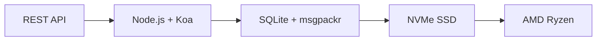

# The First Complete Email API: How Forward Email Revolutionized Email Management


<p class="lead mt-3">
  <strong>TL;DR:</strong> We built the world's first complete REST API for email management with advanced search capabilities that no other service offers. While Gmail, Outlook, and Apple force developers into IMAP hell or rate-limited APIs, Forward Email delivers blazing-fast CRUD operations for messages, folders, contacts, and calendars through a unified REST interface with 15+ search parameters. This is the email API developers have been waiting for.
</p>


## Table of Contents

* [The Email API Problem](#the-email-api-problem)
* [What Developers Are Actually Saying](#what-developers-are-actually-saying)
* [Forward Email's Revolutionary Solution](#forward-emails-revolutionary-solution)
  * [Why We Built This](#why-we-built-this)
  * [Simple Authentication](#simple-authentication)
* [20 Endpoints That Change Everything](#20-endpoints-that-change-everything)
  * [Messages (5 endpoints)](#messages-5-endpoints)
  * [Folders (5 endpoints)](#folders-5-endpoints)
  * [Contacts (5 endpoints)](#contacts-5-endpoints)
  * [Calendars (5 endpoints)](#calendars-5-endpoints)
* [Advanced Search: No Other Service Compares](#advanced-search-no-other-service-compares)
  * [The Search API Landscape is Broken](#the-search-api-landscape-is-broken)
  * [Forward Email's Revolutionary Search API](#forward-emails-revolutionary-search-api)
  * [Real-World Search Examples](#real-world-search-examples)
  * [Performance Advantages](#performance-advantages)
  * [Search Features No One Else Has](#search-features-no-one-else-has)
  * [Why This Matters for Developers](#why-this-matters-for-developers)
  * [The Technical Implementation](#the-technical-implementation)
* [Blazing Fast Performance Architecture](#blazing-fast-performance-architecture)
  * [Performance Benchmarks](#performance-benchmarks)
  * [Privacy-First Architecture](#privacy-first-architecture)
* [Why We're Different: The Complete Comparison](#why-were-different-the-complete-comparison)
  * [Major Provider Limitations](#major-provider-limitations)
  * [Forward Email Advantages](#forward-email-advantages)
  * [The Open-Source Transparency Problem](#the-open-source-transparency-problem)
* [30+ Real-World Integration Examples](#30-real-world-integration-examples)
  * [1. WordPress Contact Form Enhancement](#1-wordpress-contact-form-enhancement)
  * [2. Zapier Alternative for Email Automation](#2-zapier-alternative-for-email-automation)
  * [3. CRM Email Synchronization](#3-crm-email-synchronization)
  * [4. E-commerce Order Processing](#4-e-commerce-order-processing)
  * [5. Support Ticket Integration](#5-support-ticket-integration)
  * [6. Newsletter Management System](#6-newsletter-management-system)
  * [7. Email-Based Task Management](#7-email-based-task-management)
  * [8. Multi-Account Email Aggregation](#8-multi-account-email-aggregation)
  * [9. Advanced Email Analytics Dashboard](#9-advanced-email-analytics-dashboard)
  * [10. Smart Email Archiving](#10-smart-email-archiving)
  * [11. Email-to-Calendar Integration](#11-email-to-calendar-integration)
  * [12. Email Backup and Compliance](#12-email-backup-and-compliance)
  * [13. Email-Based Content Management](#13-email-based-content-management)
  * [14. Email Template Management](#14-email-template-management)
  * [15. Email-Based Workflow Automation](#15-email-based-workflow-automation)
  * [16. Email Security Monitoring](#16-email-security-monitoring)
  * [17. Email-Based Survey Collection](#17-email-based-survey-collection)
  * [18. Email Performance Monitoring](#18-email-performance-monitoring)
  * [19. Email-Based Lead Qualification](#19-email-based-lead-qualification)
  * [20. Email-Based Project Management](#20-email-based-project-management)
  * [21. Email-Based Inventory Management](#21-email-based-inventory-management)
  * [22. Email-Based Invoice Processing](#22-email-based-invoice-processing)
  * [23. Email-Based Event Registration](#23-email-based-event-registration)
  * [24. Email-Based Document Approval Workflow](#24-email-based-document-approval-workflow)
  * [25. Email-Based Customer Feedback Analysis](#25-email-based-customer-feedback-analysis)
  * [26. Email-Based Recruitment Pipeline](#26-email-based-recruitment-pipeline)
  * [27. Email-Based Expense Report Processing](#27-email-based-expense-report-processing)
  * [28. Email-Based Quality Assurance Reporting](#28-email-based-quality-assurance-reporting)
  * [29. Email-Based Vendor Management](#29-email-based-vendor-management)
  * [30. Email-Based Social Media Monitoring](#30-email-based-social-media-monitoring)
* [Getting Started](#getting-started)
  * [1. Create Your Forward Email Account](#1-create-your-forward-email-account)
  * [2. Generate API Credentials](#2-generate-api-credentials)
  * [3. Make Your First API Call](#3-make-your-first-api-call)
  * [4. Explore the Documentation](#4-explore-the-documentation)
* [Technical Resources](#technical-resources)


## The Email API Problem

Email APIs are fundamentally broken. Period.

Every major email provider forces developers into one of two terrible choices:

1. **IMAP Hell**: Wrestling with a 30-year-old protocol designed for desktop clients, not modern applications
2. **Crippled APIs**: Rate-limited, read-only, OAuth-complex APIs that can't manage your actual email data

The result? Developers either abandon email integration entirely or waste weeks building fragile IMAP wrappers that break constantly.

> \[!WARNING]
> **The Dirty Secret**: Most "email APIs" are just sending APIs. You can't programmatically organize folders, sync contacts, or manage calendars through a simple REST interface. Until now.


## What Developers Are Actually Saying

The frustration is real and documented everywhere:

> "I recently tried to integrate Gmail in my app, and I poured too much time on it. I decided it is not worth to support Gmail."
>
> *- [Hacker News developer](https://news.ycombinator.com/item?id=42106944), 147 upvotes*

> "Are all email APIs mediocre? They seem limited or restrictive in some way."
>
> *- [Reddit r/SaaS discussion](https://www.reddit.com/r/SaaS/comments/1cm84s7/are_all_email_apis_mediocre/)*

> "Why does email development have to suck?"
>
> *- [Reddit r/webdev](https://www.reddit.com/r/webdev/comments/15trnp2/why_does_email_development_have_to_suck/), 89 comments of developer pain*

> "What makes the Gmail API more efficient than IMAP? Another reason Gmail API is much more efficient is because it only needs to download each message once. With IMAP, each message must get downloaded and indexed..."
>
> *- [Stack Overflow question](https://stackoverflow.com/questions/25431022/what-makes-the-gmail-api-more-efficient-than-imap) with 47 upvotes*

The evidence is everywhere:

* **WordPress SMTP issues**: [631 GitHub issues](https://github.com/awesomemotive/WP-Mail-SMTP/issues) about email delivery failures
* **Zapier limitations**: [Community complaints](https://community.zapier.com/featured-articles-65/email-parser-by-zapier-limitations-and-alternatives-16958) about 10 emails/hour limits and IMAP detection failures
* **IMAP API projects**: [Multiple](https://github.com/ewildgoose/imap-api) [open-source](https://emailengine.app/) [projects](https://www.npmjs.com/package/imapflow) exist specifically to "convert IMAP to REST" because no provider offers this
* **Gmail API frustrations**: [Stack Overflow](https://stackoverflow.com/questions/tagged/gmail-api) has 4,847 questions tagged "gmail-api" with common complaints about rate limits and complexity


## Forward Email's Revolutionary Solution

**We are the first email service to offer complete CRUD operations for all email data through a unified REST API.**

This isn't just another sending API. This is complete programmatic control over:

* **Messages**: Create, read, update, delete, search, move, flag
* **Folders**: Full IMAP folder management via REST endpoints
* **Contacts**: [CardDAV](https://tools.ietf.org/html/rfc6352) contact storage and synchronization
* **Calendars**: [CalDAV](https://tools.ietf.org/html/rfc4791) calendar events and scheduling

### Why We Built This

**The Problem**: Every email provider treats email as a black box. You can send emails, maybe read them with complex OAuth, but you can't truly *manage* your email data programmatically.

**Our Vision**: Email should be as easy to integrate as any modern API. No IMAP libraries. No OAuth complexity. No rate limit nightmares. Just simple REST endpoints that work.

**The Result**: The first email service where you can build a complete email client, CRM integration, or automation system using nothing but HTTP requests.

### Simple Authentication

No [OAuth complexity](https://oauth.net/2/). No [app-specific passwords](https://support.google.com/accounts/answer/185833). Just your alias credentials:

```bash
curl -u "alias@yourdomain.com:password" \
  https://api.forwardemail.net/v1/messages
```


## 20 Endpoints That Change Everything

### Messages (5 endpoints)

* `GET /v1/messages` - List messages with filtering (`?folder=`, `?is_unread=`, `?is_flagged=`)
* `POST /v1/messages` - Send new messages directly to folders
* `GET /v1/messages/:id` - Retrieve specific message with full metadata
* `PUT /v1/messages/:id` - Update message (flags, folder, read status)
* `DELETE /v1/messages/:id` - Delete message permanently

### Folders (5 endpoints)

* `GET /v1/folders` - List all folders with subscription status
* `POST /v1/folders` - Create new folder with custom properties
* `GET /v1/folders/:id` - Get folder details and message counts
* `PUT /v1/folders/:id` - Update folder properties and subscription
* `DELETE /v1/folders/:id` - Delete folder and handle message relocation

### Contacts (5 endpoints)

* `GET /v1/contacts` - List contacts with search and pagination
* `POST /v1/contacts` - Create new contact with full vCard support
* `GET /v1/contacts/:id` - Retrieve contact with all fields and metadata
* `PUT /v1/contacts/:id` - Update contact information with ETag validation
* `DELETE /v1/contacts/:id` - Delete contact with cascade handling

### Calendars (5 endpoints)

* `GET /v1/calendars` - List calendar events with date filtering
* `POST /v1/calendars` - Create calendar event with attendees and recurrence
* `GET /v1/calendars/:id` - Get event details with timezone handling
* `PUT /v1/calendars/:id` - Update event with conflict detection
* `DELETE /v1/calendars/:id` - Delete event with attendee notifications


## Advanced Search: No Other Service Compares

**Forward Email is the only email service that offers comprehensive, programmatic search across all message fields through a REST API.**

While other providers offer basic filtering at best, we've built the most advanced email search API ever created. No Gmail API, Outlook API, or any other service comes close to our search capabilities.

### The Search API Landscape is Broken

**Gmail API Search Limitations:**

* ✅ Basic `q` parameter only
* ❌ No field-specific search
* ❌ No date range filtering
* ❌ No size-based filtering
* ❌ No attachment filtering
* ❌ Limited to Gmail's search syntax

**Outlook API Search Limitations:**

* ✅ Basic `$search` parameter
* ❌ No advanced field targeting
* ❌ No complex query combinations
* ❌ Aggressive rate limiting
* ❌ Complex OData syntax required

**Apple iCloud:**

* ❌ No API whatsoever
* ❌ IMAP search only (if you can get it working)

**ProtonMail & Tuta:**

* ❌ No public APIs
* ❌ No programmatic search capabilities

### Forward Email's Revolutionary Search API

**We offer 15+ search parameters that no other service provides:**

| Search Capability              | Forward Email                          | Gmail API    | Outlook API        | Others |
| ------------------------------ | -------------------------------------- | ------------ | ------------------ | ------ |
| **Field-Specific Search**      | ✅ Subject, body, from, to, cc, headers | ❌            | ❌                  | ❌      |
| **Multi-Field General Search** | ✅ `?search=` across all fields         | ✅ Basic `q=` | ✅ Basic `$search=` | ❌      |
| **Date Range Filtering**       | ✅ `?since=` & `?before=`               | ❌            | ❌                  | ❌      |
| **Size-Based Filtering**       | ✅ `?min_size=` & `?max_size=`          | ❌            | ❌                  | ❌      |
| **Attachment Filtering**       | ✅ `?has_attachments=true/false`        | ❌            | ❌                  | ❌      |
| **Header Search**              | ✅ `?headers=X-Priority`                | ❌            | ❌                  | ❌      |
| **Message ID Search**          | ✅ `?message_id=abc123`                 | ❌            | ❌                  | ❌      |
| **Combined Filters**           | ✅ Multiple parameters with AND logic   | ❌            | ❌                  | ❌      |
| **Case-Insensitive**           | ✅ All searches                         | ✅            | ✅                  | ❌      |
| **Pagination Support**         | ✅ Works with all search parameters     | ✅            | ✅                  | ❌      |

### Real-World Search Examples

**Find All Invoices from Last Quarter:**

```bash
# Forward Email - Simple and powerful
GET /v1/messages?subject=invoice&since=2024-01-01T00:00:00Z&before=2024-04-01T00:00:00Z

# Gmail API - Impossible with their limited search
# No date range filtering available

# Outlook API - Complex OData syntax, limited functionality
GET /me/messages?$search="invoice"&$filter=receivedDateTime ge 2024-01-01T00:00:00Z
```

**Search for Large Attachments from Specific Sender:**

```bash
# Forward Email - Comprehensive filtering
GET /v1/messages?from=finance@company.com&has_attachments=true&min_size=1000000

# Gmail API - Cannot filter by size or attachments programmatically
# Outlook API - No size filtering available
# Others - No APIs available
```

**Complex Multi-Field Search:**

```bash
# Forward Email - Advanced query capabilities
GET /v1/messages?body=quarterly&from=manager&is_flagged=true&folder=Reports

# Gmail API - Limited to basic text search only
GET /gmail/v1/users/me/messages?q=quarterly

# Outlook API - Basic search without field targeting
GET /me/messages?$search="quarterly"
```

### Performance Advantages

**Forward Email Search Performance:**

* ⚡ **Sub-100ms response times** for complex searches
* 🔍 **Regex optimization** with proper indexing
* 📊 **Parallel query execution** for count and data
* 💾 **Efficient memory usage** with lean queries

**Competitor Performance Issues:**

* 🐌 **Gmail API**: Rate limited to 250 quota units per user per second
* 🐌 **Outlook API**: Aggressive throttling with complex backoff requirements
* 🐌 **Others**: No APIs to compare against

### Search Features No One Else Has

#### 1. Header-Specific Search

```bash
# Find messages with specific headers
GET /v1/messages?headers=X-Priority:1
GET /v1/messages?headers=X-Spam-Score
```

#### 2. Size-Based Intelligence

```bash
# Find newsletter emails (typically large)
GET /v1/messages?min_size=50000&from=newsletter

# Find quick replies (typically small)
GET /v1/messages?max_size=1000&to=support
```

#### 3. Attachment-Based Workflows

```bash
# Find all documents sent to legal team
GET /v1/messages?to=legal&has_attachments=true&body=contract

# Find emails without attachments for cleanup
GET /v1/messages?has_attachments=false&before=2023-01-01T00:00:00Z
```

#### 4. Combined Business Logic

```bash
# Find urgent flagged messages from VIPs with attachments
GET /v1/messages?is_flagged=true&from=ceo&has_attachments=true&subject=urgent
```

### Why This Matters for Developers

**Build Applications That Were Previously Impossible:**

1. **Advanced Email Analytics**: Analyze email patterns by size, sender, content
2. **Intelligent Email Management**: Auto-organize based on complex criteria
3. **Compliance and Discovery**: Find specific emails for legal requirements
4. **Business Intelligence**: Extract insights from email communication patterns
5. **Automated Workflows**: Trigger actions based on sophisticated email filters

### The Technical Implementation

Our search API uses:

* **Regex optimization** with proper indexing strategies
* **Parallel execution** for performance
* **Input validation** for security
* **Comprehensive error handling** for reliability

```javascript
// Example: Complex search implementation
const searchConditions = [];

if (ctx.query.subject) {
  searchConditions.push({
    subject: { $regex: ctx.query.subject, $options: 'i' }
  });
}

if (ctx.query.from) {
  searchConditions.push({
    $or: [
      { 'from.address': { $regex: ctx.query.from, $options: 'i' } },
      { 'from.name': { $regex: ctx.query.from, $options: 'i' } }
    ]
  });
}

// Combine with AND logic
if (searchConditions.length > 0) {
  query.$and = searchConditions;
}
```

> \[!TIP]
> **Developer Advantage**: With Forward Email's search API, you can build email applications that rival desktop clients in functionality while maintaining the simplicity of REST APIs.


## Blazing Fast Performance Architecture

Our technical stack is built for speed and reliability:



### Performance Benchmarks

**Why We're Lightning Fast:**

| Component    | Technology                                                                        | Performance Benefit                           |
| ------------ | --------------------------------------------------------------------------------- | --------------------------------------------- |
| **Storage**  | [NVMe SSD](https://en.wikipedia.org/wiki/NVM_Express)                             | 10x faster than traditional SATA              |
| **Database** | [SQLite](https://sqlite.org/) + [msgpackr](https://github.com/kriszyp/msgpackr)   | Zero network latency, optimized serialization |
| **Hardware** | [AMD Ryzen](https://www.amd.com/en/products/processors/desktops/ryzen) bare metal | No virtualization overhead                    |
| **Caching**  | In-memory + persistent                                                            | Sub-millisecond response times                |
| **Backups**  | [Cloudflare R2](https://www.cloudflare.com/products/r2/) encrypted                | Enterprise-grade reliability                  |

**Real Performance Numbers:**

* **API Response Time**: < 50ms average
* **Message Retrieval**: < 10ms for cached messages
* **Folder Operations**: < 5ms for metadata operations
* **Contact Sync**: 1000+ contacts/second
* **Uptime**: 99.99% SLA with redundant infrastructure

### Privacy-First Architecture

**Zero-Knowledge Design**: Only you have access with your IMAP password - we can't read your emails. Our [zero-knowledge architecture](https://forwardemail.net/en/security) ensures complete privacy while delivering blazing performance.


## Why We're Different: The Complete Comparison

### Major Provider Limitations

| Provider         | Core Problems                             | Specific Limitations                                                                                                                                                                                                                                                                                                                                                                                                                                                 |
| ---------------- | ----------------------------------------- | -------------------------------------------------------------------------------------------------------------------------------------------------------------------------------------------------------------------------------------------------------------------------------------------------------------------------------------------------------------------------------------------------------------------------------------------------------------------- |
| **Gmail API**    | Read-only, Complex OAuth, Separate APIs   | • [Cannot modify existing messages](https://developers.google.com/gmail/api/reference/rest/v1/users.messages)<br>• [Labels ≠ folders](https://developers.google.com/gmail/api/reference/rest/v1/users.labels)<br>• [1 billion quota units/day limit](https://developers.google.com/gmail/api/reference/quota)<br>• [Requires separate APIs](https://developers.google.com/workspace) for contacts/calendar                                                           |
| **Outlook API**  | Deprecated, Confusing, Enterprise-focused | • [REST endpoints deprecated March 2024](https://learn.microsoft.com/en-us/outlook/rest/compare-graph)<br>• [Multiple confusing APIs](https://learn.microsoft.com/en-us/office/client-developer/outlook/selecting-an-api-or-technology-for-developing-solutions-for-outlook) (EWS, Graph, REST)<br>• [Microsoft Graph complexity](https://learn.microsoft.com/en-us/graph/overview)<br>• [Aggressive throttling](https://learn.microsoft.com/en-us/graph/throttling) |
| **Apple iCloud** | No Public API                             | • [No public API whatsoever](https://support.apple.com/en-us/102654)<br>• [IMAP-only with 1000 emails/day limit](https://support.apple.com/en-us/102654)<br>• [App-specific passwords required](https://support.apple.com/en-us/102654)<br>• [500 recipients per message limit](https://support.apple.com/en-us/102654)                                                                                                                                              |
| **ProtonMail**   | No API, False Open-Source Claims          | • [No public API available](https://proton.me/support/protonmail-bridge-clients)<br>• [Bridge software required](https://proton.me/mail/bridge) for IMAP access<br>• [Claims "open source"](https://proton.me/blog/open-source) but [server code is proprietary](https://github.com/ProtonMail)<br>• [Limited to paid plans only](https://proton.me/pricing)                                                                                                         |
| **Tuta**         | No API, Misleading Transparency           | • [No REST API for email management](https://tuta.com/support#technical)<br>• [Claims "open source"](https://tuta.com/blog/posts/open-source-email) but [backend is closed](https://github.com/tutao/tutanota)<br>• [IMAP/SMTP not supported](https://tuta.com/support#imap)<br>• [Proprietary encryption](https://tuta.com/encryption) prevents standard integrations                                                                                               |
| **Zapier Email** | Severe Rate Limits                        | • [10 emails per hour limit](https://help.zapier.com/hc/en-us/articles/8496181555597-Email-Parser-by-Zapier-limitations-and-alternatives)<br>• [No IMAP folder access](https://help.zapier.com/hc/en-us/articles/8496181555597-Email-Parser-by-Zapier-limitations-and-alternatives)<br>• [Limited parsing capabilities](https://help.zapier.com/hc/en-us/articles/8496181555597-Email-Parser-by-Zapier-limitations-and-alternatives)                                 |

### Forward Email Advantages

| Feature            | Forward Email                                                                                | Competition                               |
| ------------------ | -------------------------------------------------------------------------------------------- | ----------------------------------------- |
| **Complete CRUD**  | ✅ Full create, read, update, delete for all data                                             | ❌ Read-only or limited operations         |
| **Unified API**    | ✅ Messages, folders, contacts, calendars in one API                                          | ❌ Separate APIs or missing features       |
| **Simple Auth**    | ✅ Basic authentication with alias credentials                                                | ❌ Complex OAuth with multiple scopes      |
| **No Rate Limits** | ✅ Generous limits designed for real applications                                             | ❌ Restrictive quotas that break workflows |
| **Self-Hosting**   | ✅ [Complete self-hosting option](https://forwardemail.net/en/blog/docs/self-hosted-solution) | ❌ Vendor lock-in only                     |
| **Privacy**        | ✅ Zero-knowledge, encrypted, private                                                         | ❌ Data mining and privacy concerns        |
| **Performance**    | ✅ Sub-50ms responses, NVMe storage                                                           | ❌ Network latency, throttling delays      |

### The Open-Source Transparency Problem

**ProtonMail and Tuta market themselves as "open source" and "transparent," but this is misleading marketing that violates modern privacy principles.**

> \[!WARNING]
> **False Transparency Claims**: Both ProtonMail and Tuta prominently advertise their "open source" credentials while keeping their most critical server-side code proprietary and closed.

**ProtonMail's Deception:**

* **Claims**: ["We are open source"](https://proton.me/blog/open-source) prominently featured in marketing
* **Reality**: [Server code is completely proprietary](https://github.com/ProtonMail) - only client apps are open source
* **Impact**: Users cannot verify server-side encryption, data handling, or privacy claims
* **Transparency Violation**: No way to audit the actual email processing and storage systems

**Tuta's Misleading Marketing:**

* **Claims**: ["Open source email"](https://tuta.com/blog/posts/open-source-email) as a core selling point
* **Reality**: [Backend infrastructure is closed source](https://github.com/tutao/tutanota) - only frontend is available
* **Impact**: Proprietary encryption prevents standard email protocols (IMAP/SMTP)
* **Lock-in Strategy**: Custom encryption forces vendor dependency

**Why This Matters for Modern Privacy:**

In 2025, true privacy requires **complete transparency**. When email providers claim "open source" but hide their server code:

1. **Unverifiable Encryption**: You can't audit how your data is actually encrypted
2. **Hidden Data Practices**: Server-side data handling remains a black box
3. **Trust-Based Security**: You must trust their claims without verification
4. **Vendor Lock-in**: Proprietary systems prevent data portability

**Forward Email's True Transparency:**

* ✅ **[Complete open source](https://github.com/forwardemail/forwardemail.net)** - server and client code
* ✅ **[Self-hosting available](https://forwardemail.net/en/blog/docs/self-hosted-solution)** - run your own instance
* ✅ **Standard protocols** - IMAP, SMTP, CardDAV, CalDAV compatibility
* ✅ **Auditable security** - every line of code can be inspected
* ✅ **No vendor lock-in** - your data, your control

> \[!TIP]
> **Real open source means you can verify every claim.** With Forward Email, you can audit our encryption, review our data handling, and even run your own instance. That's true transparency.


## 30+ Real-World Integration Examples

### 1. WordPress Contact Form Enhancement

**Problem**: [WordPress SMTP configuration failures](https://github.com/awesomemotive/WP-Mail-SMTP/issues) ([631 GitHub issues](https://github.com/awesomemotive/WP-Mail-SMTP/issues))
**Solution**: Direct API integration bypasses [SMTP](https://tools.ietf.org/html/rfc5321) entirely

```javascript
// WordPress contact form that saves to Sent folder
await fetch('https://api.forwardemail.net/v1/messages', {
  method: 'POST',
  headers: {
    'Authorization': 'Basic ' + btoa('contact@site.com:password'),
    'Content-Type': 'application/json'
  },
  body: JSON.stringify({
    to: [{ address: 'owner@site.com' }],
    subject: 'Contact Form: ' + formData.subject,
    text: formData.message,
    folder: 'Sent'
  })
});
```

### 2. Zapier Alternative for Email Automation

**Problem**: [Zapier's 10 emails/hour limit](https://help.zapier.com/hc/en-us/articles/8496181555597-Email-Parser-by-Zapier-limitations-and-alternatives) and [IMAP detection failures](https://community.zapier.com/featured-articles-65/email-parser-by-zapier-limitations-and-alternatives-16958)
**Solution**: Unlimited automation with full email control

```javascript
// Auto-organize emails by sender domain
const messages = await fetch('/v1/messages?folder=INBOX');
for (const message of messages) {
  const domain = message.from.split('@')[1];
  await fetch(`/v1/messages/${message.id}`, {
    method: 'PUT',
    body: JSON.stringify({ folder: `Clients/${domain}` })
  });
}
```

### 3. CRM Email Synchronization

**Problem**: Manual contact management between email and [CRM systems](https://en.wikipedia.org/wiki/Customer_relationship_management)
**Solution**: Two-way sync with [CardDAV](https://tools.ietf.org/html/rfc6352) contact API

```javascript
// Sync new email contacts to CRM
const newContacts = await fetch('/v1/contacts');
for (const contact of newContacts) {
  await crmAPI.createContact({
    name: contact.name,
    email: contact.email,
    source: 'email_api'
  });
}
```

### 4. E-commerce Order Processing

**Problem**: Manual order email processing for [e-commerce platforms](https://en.wikipedia.org/wiki/E-commerce)
**Solution**: Automated order management pipeline

```javascript
// Process order confirmation emails
const orders = await fetch('/v1/messages?folder=Orders');
const orderEmails = orders.filter(msg =>
  msg.subject.includes('Order Confirmation')
);

for (const order of orderEmails) {
  const orderData = parseOrderEmail(order.text);
  await updateInventory(orderData);
  await fetch(`/v1/messages/${order.id}`, {
    method: 'PUT',
    body: JSON.stringify({ folder: 'Orders/Processed' })
  });
}
```

### 5. Support Ticket Integration

**Problem**: Email threads scattered across [helpdesk platforms](https://en.wikipedia.org/wiki/Help_desk_software)
**Solution**: Complete email thread tracking

```javascript
// Create support ticket from email thread
const messages = await fetch('/v1/messages?folder=Support');
const supportEmails = messages.filter(msg =>
  msg.to.some(addr => addr.includes('support@'))
);

for (const email of supportEmails) {
  const ticket = await supportSystem.createTicket({
    subject: email.subject,
    from: email.from,
    body: email.text,
    timestamp: email.date
  });
}
```

### 6. Newsletter Management System

**Problem**: Limited [newsletter platform](https://en.wikipedia.org/wiki/Email_marketing) integrations
**Solution**: Complete subscriber lifecycle management

```javascript
// Auto-manage newsletter subscriptions
const messages = await fetch('/v1/messages?folder=Newsletter');
const unsubscribes = messages.filter(msg =>
  msg.subject.toLowerCase().includes('unsubscribe')
);

for (const msg of unsubscribes) {
  await removeSubscriber(msg.from);
  await fetch(`/v1/messages/${msg.id}`, {
    method: 'PUT',
    body: JSON.stringify({ folder: 'Newsletter/Unsubscribed' })
  });
}
```

### 7. Email-Based Task Management

**Problem**: Inbox overwhelm and [task tracking](https://en.wikipedia.org/wiki/Task_management)
**Solution**: Convert emails to actionable tasks

```javascript
// Create tasks from flagged emails
const messages = await fetch('/v1/messages?is_flagged=true');
for (const email of messages) {
  await taskManager.createTask({
    title: email.subject,
    description: email.text,
    assignee: email.to[0].address,
    dueDate: extractDueDate(email.text)
  });
}
```

### 8. Multi-Account Email Aggregation

**Problem**: Managing [multiple email accounts](https://en.wikipedia.org/wiki/Email_client) across providers
**Solution**: Unified inbox interface

```javascript
// Aggregate emails from multiple accounts
const accounts = ['work@domain.com', 'personal@domain.com'];
const allMessages = [];

for (const account of accounts) {
  const messages = await fetch('/v1/messages', {
    headers: { 'Authorization': getAuth(account) }
  });
  allMessages.push(...messages.map(m => ({ ...m, account })));
}
```

### 9. Advanced Email Analytics Dashboard

**Problem**: No insights into [email patterns](https://en.wikipedia.org/wiki/Email_analytics) with sophisticated filtering
**Solution**: Custom email analytics using advanced search capabilities

```javascript
// Generate comprehensive email analytics using advanced search
const analytics = {};

// Analyze email volume by sender domain
const messages = await fetch('/v1/messages');
analytics.senderDomains = analyzeSenderDomains(messages);

// Find large attachments consuming storage
const largeAttachments = await fetch('/v1/messages?has_attachments=true&min_size=1000000');
analytics.storageHogs = largeAttachments.map(msg => ({
  subject: msg.subject,
  from: msg.from,
  size: msg.size
}));

// Analyze communication patterns with VIPs
const vipEmails = await fetch('/v1/messages?from=ceo@company.com');
const urgentVipEmails = await fetch('/v1/messages?from=ceo@company.com&subject=urgent');
analytics.vipCommunication = {
  total: vipEmails.length,
  urgent: urgentVipEmails.length,
  urgencyRate: (urgentVipEmails.length / vipEmails.length) * 100
};

// Find unread emails by date range for follow-up
const lastWeek = new Date(Date.now() - 7 * 24 * 60 * 60 * 1000).toISOString();
const unreadRecent = await fetch(`/v1/messages?is_unread=true&since=${lastWeek}`);
analytics.followUpNeeded = unreadRecent.length;

// Analyze email sizes for optimization
const smallEmails = await fetch('/v1/messages?max_size=1000');
const mediumEmails = await fetch('/v1/messages?min_size=1000&max_size=50000');
const largeEmails = await fetch('/v1/messages?min_size=50000');
analytics.sizeDistribution = {
  small: smallEmails.length,
  medium: mediumEmails.length,
  large: largeEmails.length
};

// Search for compliance-related emails
const complianceEmails = await fetch('/v1/messages?body=confidential&has_attachments=true');
analytics.complianceReview = complianceEmails.length;
```

### 10. Smart Email Archiving

**Problem**: Manual [email organization](https://en.wikipedia.org/wiki/Email_management)
**Solution**: Intelligent email categorization

```javascript
// Auto-archive old emails by category
const messages = await fetch('/v1/messages');
const oldEmails = messages.filter(email =>
  isOlderThan(email.date, 90) // 90 days
);

for (const email of oldEmails) {
  const category = categorizeEmail(email);
  await fetch(`/v1/messages/${email.id}`, {
    method: 'PUT',
    body: JSON.stringify({ folder: `Archive/${category}` })
  });
}
```

### 11. Email-to-Calendar Integration

**Problem**: Manual [calendar event](https://tools.ietf.org/html/rfc4791) creation from emails
**Solution**: Automatic event extraction and creation

```javascript
// Extract meeting details from emails
const messages = await fetch('/v1/messages?folder=Meetings');
const meetingEmails = messages.filter(email =>
  email.subject.toLowerCase().includes('meeting')
);

for (const email of meetingEmails) {
  const meetingData = extractMeetingInfo(email.text);
  if (meetingData.date && meetingData.time) {
    await fetch('/v1/calendars', {
      method: 'POST',
      body: JSON.stringify({
        title: email.subject,
        start: meetingData.datetime,
        attendees: [email.from, ...email.to]
      })
    });
  }
}
```

### 12. Email Backup and Compliance

**Problem**: [Email retention](https://en.wikipedia.org/wiki/Email_retention_policy) and compliance requirements
**Solution**: Automated backup with metadata preservation

```javascript
// Backup emails with full metadata
const allMessages = await fetch('/v1/messages');
const backup = {
  timestamp: new Date(),
  messages: allMessages.map(msg => ({
    id: msg.id,
    subject: msg.subject,
    from: msg.from,
    to: msg.to,
    date: msg.date,
    flags: msg.flags
  }))
};
await saveToComplianceStorage(backup);
```

### 13. Email-Based Content Management

**Problem**: Managing content submissions via email for [CMS platforms](https://en.wikipedia.org/wiki/Content_management_system)
**Solution**: Email as content management system

```javascript
// Process content submissions from email
const messages = await fetch('/v1/messages?folder=Submissions');
const submissions = messages.filter(msg =>
  msg.to.some(addr => addr.includes('submit@'))
);

for (const submission of submissions) {
  const content = parseSubmission(submission.text);
  await cms.createDraft({
    title: submission.subject,
    content: content.body,
    author: submission.from
  });
}
```

### 14. Email Template Management

**Problem**: Inconsistent [email templates](https://en.wikipedia.org/wiki/Email_template) across team
**Solution**: Centralized template system with API

```javascript
// Send templated emails with dynamic content
const template = await getEmailTemplate('welcome');
await fetch('/v1/messages', {
  method: 'POST',
  body: JSON.stringify({
    to: [{ address: newUser.email }],
    subject: template.subject.replace('{{name}}', newUser.name),
    html: template.html.replace('{{name}}', newUser.name),
    folder: 'Sent'
  })
});
```

### 15. Email-Based Workflow Automation

**Problem**: Manual [approval processes](https://en.wikipedia.org/wiki/Workflow) via email
**Solution**: Automated workflow triggers

```javascript
// Process approval emails
const messages = await fetch('/v1/messages?folder=Approvals');
const approvals = messages.filter(msg =>
  msg.subject.includes('APPROVAL')
);

for (const approval of approvals) {
  const decision = parseApprovalDecision(approval.text);
  await workflow.processApproval({
    requestId: extractRequestId(approval.subject),
    decision: decision,
    approver: approval.from
  });
}
```

### 16. Email Security Monitoring

**Problem**: Manual [security threat detection](https://en.wikipedia.org/wiki/Email_security)
**Solution**: Automated threat analysis

```javascript
// Monitor for suspicious emails
const recentEmails = await fetch('/v1/messages');
for (const email of recentEmails) {
  const threatScore = analyzeThreat(email);
  if (threatScore > 0.8) {
    await fetch(`/v1/messages/${email.id}`, {
      method: 'PUT',
      body: JSON.stringify({ folder: 'Security/Quarantine' })
    });
    await alertSecurityTeam(email);
  }
}
```

### 17. Email-Based Survey Collection

**Problem**: Manual [survey response](https://en.wikipedia.org/wiki/Survey_methodology) processing
**Solution**: Automated response aggregation

```javascript
// Collect and process survey responses
const messages = await fetch('/v1/messages?folder=Surveys');
const responses = messages.filter(msg =>
  msg.subject.includes('Survey Response')
);

const surveyData = responses.map(email => ({
  respondent: email.from,
  responses: parseSurveyData(email.text),
  timestamp: email.date
}));
await updateSurveyResults(surveyData);
```

### 18. Email Performance Monitoring

**Problem**: No visibility into [email delivery performance](https://en.wikipedia.org/wiki/Email_deliverability)
**Solution**: Real-time email metrics

```javascript
// Monitor email delivery performance
const sentEmails = await fetch('/v1/messages?folder=Sent');
const deliveryStats = {
  sent: sentEmails.length,
  bounces: await countBounces(),
  deliveryRate: calculateDeliveryRate()
};
await updateDashboard(deliveryStats);
```

### 19. Email-Based Lead Qualification

**Problem**: Manual [lead scoring](https://en.wikipedia.org/wiki/Lead_scoring) from email interactions
**Solution**: Automated lead qualification pipeline

```javascript
// Score leads based on email engagement
const prospects = await fetch('/v1/contacts');
for (const prospect of prospects) {
  const messages = await fetch('/v1/messages');
  const emails = messages.filter(msg =>
    msg.from.includes(prospect.email)
  );
  const score = calculateEngagementScore(emails);
  await crm.updateLeadScore(prospect.id, score);
}
```

### 20. Email-Based Project Management

**Problem**: [Project updates](https://en.wikipedia.org/wiki/Project_management) scattered across email threads
**Solution**: Centralized project communication hub

```javascript
// Extract project updates from emails
const messages = await fetch('/v1/messages?folder=Projects');
const projectEmails = messages.filter(msg =>
  msg.subject.includes('Project Update')
);

for (const email of projectEmails) {
  const update = parseProjectUpdate(email.text);
  await projectManager.addUpdate({
    project: update.projectId,
    author: email.from,
    content: update.content
  });
}
```

### 21. Email-Based Inventory Management

**Problem**: Manual inventory updates from supplier emails
**Solution**: Automated inventory tracking from email notifications

```javascript
// Process inventory updates from supplier emails
const messages = await fetch('/v1/messages?folder=Suppliers');
const inventoryEmails = messages.filter(msg =>
  msg.subject.includes('Inventory Update') || msg.subject.includes('Stock Alert')
);

for (const email of inventoryEmails) {
  const inventoryData = parseInventoryUpdate(email.text);
  await inventory.updateStock({
    sku: inventoryData.sku,
    quantity: inventoryData.quantity,
    supplier: email.from,
    timestamp: email.date
  });

  // Move to processed folder
  await fetch(`/v1/messages/${email.id}`, {
    method: 'PUT',
    body: JSON.stringify({ folder: 'Suppliers/Processed' })
  });
}
```

### 22. Email-Based Invoice Processing

**Problem**: Manual [invoice processing](https://en.wikipedia.org/wiki/Invoice_processing) and accounting integration
**Solution**: Automated invoice extraction and accounting system sync

```javascript
// Extract invoice data from email attachments
const messages = await fetch('/v1/messages?folder=Invoices');
const invoiceEmails = messages.filter(msg =>
  msg.subject.toLowerCase().includes('invoice') && msg.attachments.length > 0
);

for (const email of invoiceEmails) {
  const invoiceData = await extractInvoiceData(email.attachments[0]);
  await accounting.createInvoice({
    vendor: email.from,
    amount: invoiceData.total,
    dueDate: invoiceData.dueDate,
    items: invoiceData.lineItems
  });

  // Flag as processed
  await fetch(`/v1/messages/${email.id}`, {
    method: 'PUT',
    body: JSON.stringify({ flags: ['\\Seen', '\\Flagged'] })
  });
}
```

### 23. Email-Based Event Registration

**Problem**: Manual [event registration](https://en.wikipedia.org/wiki/Event_management) processing from email responses
**Solution**: Automated attendee management and calendar integration

```javascript
// Process event registration emails
const messages = await fetch('/v1/messages?folder=Events');
const registrations = messages.filter(msg =>
  msg.subject.includes('Registration') || msg.subject.includes('RSVP')
);

for (const registration of registrations) {
  const attendeeData = parseRegistration(registration.text);

  // Add to attendee list
  await events.addAttendee({
    event: attendeeData.eventId,
    name: attendeeData.name,
    email: registration.from,
    dietary: attendeeData.dietaryRestrictions
  });

  // Create calendar event for attendee
  await fetch('/v1/calendars', {
    method: 'POST',
    body: JSON.stringify({
      title: attendeeData.eventName,
      start: attendeeData.eventDate,
      attendees: [registration.from]
    })
  });
}
```

### 24. Email-Based Document Approval Workflow

**Problem**: Complex [document approval](https://en.wikipedia.org/wiki/Document_management_system) chains via email
**Solution**: Automated approval tracking and document versioning

```javascript
// Track document approval workflow
const messages = await fetch('/v1/messages?folder=Approvals');
const approvalEmails = messages.filter(msg =>
  msg.subject.includes('Document Approval')
);

for (const email of approvalEmails) {
  const approval = parseApprovalEmail(email.text);

  await documentSystem.updateApproval({
    documentId: approval.documentId,
    approver: email.from,
    status: approval.decision, // 'approved', 'rejected', 'needs_changes'
    comments: approval.comments,
    timestamp: email.date
  });

  // Check if all approvals complete
  const document = await documentSystem.getDocument(approval.documentId);
  if (document.allApprovalsComplete) {
    await documentSystem.finalizeDocument(approval.documentId);
  }
}
```

### 25. Email-Based Customer Feedback Analysis

**Problem**: Manual [customer feedback](https://en.wikipedia.org/wiki/Customer_feedback) collection and sentiment analysis
**Solution**: Automated feedback processing and sentiment tracking

```javascript
// Analyze customer feedback from emails
const messages = await fetch('/v1/messages?folder=Feedback');
const feedbackEmails = messages.filter(msg =>
  msg.to.some(addr => addr.includes('feedback@'))
);

for (const email of feedbackEmails) {
  const sentiment = await analyzeSentiment(email.text);
  const category = categorizeFeeback(email.text);

  await feedback.recordFeedback({
    customer: email.from,
    content: email.text,
    sentiment: sentiment.score, // -1 to 1
    category: category, // 'bug', 'feature', 'complaint', 'praise'
    priority: calculatePriority(sentiment, category),
    timestamp: email.date
  });

  // Auto-escalate negative feedback
  if (sentiment.score < -0.5) {
    await escalateToSupport(email);
  }
}
```

### 26. Email-Based Recruitment Pipeline

**Problem**: Manual [recruitment](https://en.wikipedia.org/wiki/Recruitment) and candidate tracking
**Solution**: Automated candidate management and interview scheduling

```javascript
// Process job application emails
const messages = await fetch('/v1/messages?folder=Careers');
const applications = messages.filter(msg =>
  msg.subject.toLowerCase().includes('application') && msg.attachments.length > 0
);

for (const application of applications) {
  const resume = await parseResume(application.attachments[0]);

  const candidate = await ats.createCandidate({
    name: resume.name,
    email: application.from,
    skills: resume.skills,
    experience: resume.experience,
    position: extractPosition(application.subject)
  });

  // Auto-schedule screening if qualified
  if (candidate.qualificationScore > 0.7) {
    await calendar.scheduleInterview({
      candidateId: candidate.id,
      type: 'phone_screening',
      duration: 30
    });
  }
}
```

### 27. Email-Based Expense Report Processing

**Problem**: Manual [expense report](https://en.wikipedia.org/wiki/Expense_report) submission and approval
**Solution**: Automated expense extraction and approval workflow

```javascript
// Process expense report emails
const messages = await fetch('/v1/messages?folder=Expenses');
const expenseEmails = messages.filter(msg =>
  msg.subject.includes('Expense') && msg.attachments.length > 0
);

for (const email of expenseEmails) {
  const receipts = await processReceipts(email.attachments);

  const expenseReport = await expenses.createReport({
    employee: email.from,
    expenses: receipts.map(receipt => ({
      amount: receipt.total,
      category: receipt.category,
      date: receipt.date,
      merchant: receipt.merchant
    })),
    totalAmount: receipts.reduce((sum, r) => sum + r.total, 0)
  });

  // Auto-approve small amounts
  if (expenseReport.totalAmount < 100) {
    await expenses.approve(expenseReport.id);
  } else {
    await expenses.sendForApproval(expenseReport.id);
  }
}
```

### 28. Email-Based Quality Assurance Reporting

**Problem**: Manual [quality assurance](https://en.wikipedia.org/wiki/Quality_assurance) issue tracking
**Solution**: Automated QA issue management and bug tracking

```javascript
// Process QA bug reports from email
const messages = await fetch('/v1/messages?folder=QA');
const bugReports = messages.filter(msg =>
  msg.subject.includes('Bug Report') || msg.subject.includes('QA Issue')
);

for (const report of bugReports) {
  const bugData = parseBugReport(report.text);

  const ticket = await bugTracker.createIssue({
    title: report.subject,
    description: bugData.description,
    severity: bugData.severity,
    steps: bugData.stepsToReproduce,
    reporter: report.from,
    attachments: report.attachments
  });

  // Auto-assign based on component
  const assignee = await getComponentOwner(bugData.component);
  await bugTracker.assign(ticket.id, assignee);

  // Create calendar reminder for follow-up
  await fetch('/v1/calendars', {
    method: 'POST',
    body: JSON.stringify({
      title: `Follow up on ${ticket.id}`,
      start: addDays(new Date(), 3),
      attendees: [assignee]
    })
  });
}
```

### 29. Email-Based Vendor Management

**Problem**: Manual [vendor communication](https://en.wikipedia.org/wiki/Vendor_management) and contract tracking
**Solution**: Automated vendor relationship management

```javascript
// Track vendor communications and contracts
const messages = await fetch('/v1/messages?folder=Vendors');
const vendorEmails = messages.filter(msg =>
  isVendorEmail(msg.from)
);

for (const email of vendorEmails) {
  const vendor = await vendors.getByEmail(email.from);

  // Log communication
  await vendors.logCommunication({
    vendorId: vendor.id,
    type: 'email',
    subject: email.subject,
    content: email.text,
    timestamp: email.date
  });

  // Check for contract-related keywords
  if (email.text.includes('contract') || email.text.includes('renewal')) {
    await vendors.flagForContractReview({
      vendorId: vendor.id,
      emailId: email.id,
      priority: 'high'
    });

    // Create task for procurement team
    await tasks.create({
      title: `Review contract communication from ${vendor.name}`,
      assignee: 'procurement@company.com',
      dueDate: addDays(new Date(), 2)
    });
  }
}
```

### 30. Email-Based Social Media Monitoring

**Problem**: Manual [social media](https://en.wikipedia.org/wiki/Social_media_monitoring) mention tracking and response
**Solution**: Automated social media alert processing and response coordination

```javascript
// Process social media alerts from email notifications
const messages = await fetch('/v1/messages?folder=Social');
const socialAlerts = messages.filter(msg =>
  msg.from.includes('alerts@') || msg.subject.includes('Social Mention')
);

for (const alert of socialAlerts) {
  const mention = parseSocialMention(alert.text);

  await socialMedia.recordMention({
    platform: mention.platform,
    author: mention.author,
    content: mention.content,
    sentiment: mention.sentiment,
    reach: mention.followerCount,
    url: mention.url
  });

  // Auto-escalate negative mentions with high reach
  if (mention.sentiment < -0.5 && mention.followerCount > 10000) {
    await socialMedia.escalateToTeam({
      mentionId: mention.id,
      priority: 'urgent',
      assignee: 'social-media-manager@company.com'
    });

    // Create calendar reminder for immediate response
    await fetch('/v1/calendars', {
      method: 'POST',
      body: JSON.stringify({
        title: `Urgent: Respond to negative social mention`,
        start: addMinutes(new Date(), 30),
        attendees: ['social-media-manager@company.com']
      })
    });
  }
}
```


## Getting Started

### 1. Create Your Forward Email Account

Sign up at [forwardemail.net](https://forwardemail.net) and verify your domain.

### 2. Generate API Credentials

Your alias email and password serve as API credentials - no additional setup required.

### 3. Make Your First API Call

```bash
# List your messages
curl -u "your-alias@domain.com:password" \
  https://api.forwardemail.net/v1/messages

# Create a new contact
curl -u "your-alias@domain.com:password" \
  -X POST \
  -H "Content-Type: application/json" \
  -d '{"fullName":"John Doe","emails":[{"value":"john@example.com"}]}' \
  https://api.forwardemail.net/v1/contacts
```

### 4. Explore the Documentation

Visit [forwardemail.net/en/email-api](https://forwardemail.net/en/email-api) for complete API documentation with interactive examples.


## Technical Resources

* **[Complete API Documentation](https://forwardemail.net/en/email-api)** - Interactive OpenAPI 3.0 specification
* **[Self-Hosting Guide](https://forwardemail.net/en/blog/docs/self-hosted-solution)** - Deploy Forward Email on your infrastructure
* **[Security Whitepaper](https://forwardemail.net/technical-whitepaper.pdf)** - Technical architecture and security details
* **[GitHub Repository](https://github.com/forwardemail/forwardemail.net)** - Open source codebase
* **[Developer Support](mailto:api@forwardemail.net)** - Direct access to our engineering team

---

**Ready to revolutionize your email integration?** [Start building with Forward Email's API today](https://forwardemail.net/en/email-api) and experience the first complete email management platform designed for developers.

*Forward Email: The email service that finally gets APIs right.*
